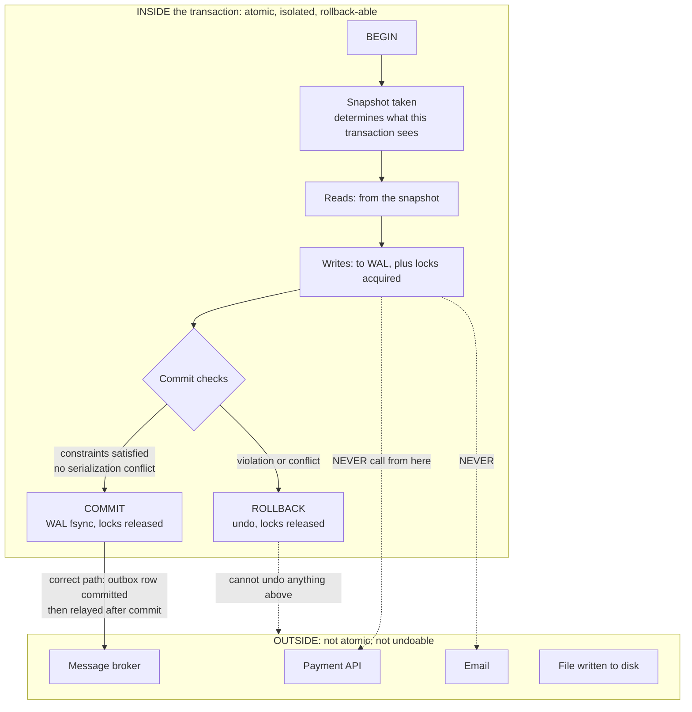

# Chapter 16: ACID

## 16.1 Problem Statement

The returns-slot booking service moves to a single Postgres primary. One region, one database, no replication lag, no partitions. Every problem from Chapters 14 and 15 is gone by construction.

The bugs get worse.

**Two workers book the last slot.** The code reads the remaining count, checks it is above zero, and inserts a booking. Two requests arrive four milliseconds apart. Both read a count of one. Both insert. The slot is double-booked, inside a database whose entire purpose is preventing this.

**They set that path to `SERIALIZABLE` and start returning 500s.** Under load, roughly 3 percent of bookings fail with an error nobody recognises: `could not serialize access due to read/write dependencies among transactions`. The database is doing exactly what it was asked to do and the application has no idea what to do about it.

**Two supervisors both go off call.** The rule is that at least one supervisor must remain on call. Each transaction reads the table, sees that the other supervisor is on call, and marks itself off. Both commit. Neither transaction violated the rule as it saw the world, and the invariant is broken anyway. Nobody can explain it, because both code paths are obviously correct when read on their own.

**A financial report shows totals that never existed.** It sums the pending table, then sums the settled table. Between the two queries a batch of records moves from one to the other, so the report counts them twice. Every individual row is correct and the total is fiction.

**An analytics query holds a snapshot for forty minutes.** Table sizes grow by 9 gigabytes, autovacuum cannot reclaim anything because an old transaction still needs those row versions, and replication lag spikes to four minutes, which quietly breaks the read-your-writes guarantee they built in Chapter 15.

**Deadlocks appear under load,** about 40 a day, each surfacing to a user as a generic error. There is no retry logic anywhere.

**And a payment call sits inside a transaction.** The transaction rolls back after the payment provider returns success. The database has no record of the booking. The customer has been charged.

Not one of these is a replication problem. There is one node. Every one of them is a **transaction** problem, and most of them come from a single fact that surprises people: **the isolation level your database gives you by default does not prevent them.**

## 16.2 Why This Problem Exists

**People think a transaction means "nothing else can interfere".** It does not. It means whatever your isolation level says it means, and every mainstream database ships with a default that is well short of full isolation, for good performance reasons. `BEGIN` and `COMMIT` give a much weaker promise than the word "transaction" implies.

**The default is chosen once, at install time, by nobody.** Postgres, Oracle, and SQL Server default to Read Committed. MySQL's InnoDB defaults to Repeatable Read. Almost no application sets it deliberately, so the isolation semantics of most systems are an accident of vendor choice.

**The standard's own definitions are incomplete.** The ANSI SQL isolation levels are defined by which of three phenomena they prevent: dirty reads, non-repeatable reads, and phantoms. That list omits the anomalies that actually bite in practice, particularly lost updates and write skew, so a database can be fully compliant with a named level and still permit the bug in Section 16.1.

**Snapshot isolation feels like serializability and is not.** Multi-version concurrency control gives every transaction a consistent view of the database, which eliminates most anomalies and feels airtight. It still permits write skew, which is exactly the supervisor bug, and that gap is the single most common source of "impossible" data corruption in well-written applications.

**Correctness under concurrency is invisible in code review.** Read a row, check a condition, write a row. Three obviously correct lines. Nothing in the source suggests that two of them running at once produces a state neither would have allowed. Chapter 3 made this point about in-process concurrency; the database version is the same failure with a longer window.

**And atomicity has a boundary that nobody draws.** A transaction can undo writes to its own database. It cannot un-send an email, un-charge a card, or un-publish a message. Code that mixes both inside a `@Transactional` method is asking for a guarantee the database never offered.

## 16.3 Real World Analogy

Buying a house.

**Atomicity is exchange of contracts.** Up to that moment, nothing has happened: no money moves, no ownership changes, and either party can walk away. At exchange, everything happens at once. In a chain of five purchases, all five exchange simultaneously or none do, because a chain where three complete and two fail leaves people homeless and owning two properties. That is a transaction, and the commit point is a genuine instant rather than a gradual process.

**Isolation is what stops the seller selling to someone else while your purchase is in progress.** And here the analogy earns its place, because in some jurisdictions **nothing stops them**. A higher offer arrives, the seller accepts it, and your months of work evaporate. There is a word for it: gazumping. Notice the structure precisely. You read the state of the world, the seller was committed to you. You acted on that reading. Somebody else changed it underneath you. Nobody broke any rule, and the outcome is one nobody wanted.

That is weak isolation, and the property market's answer is the same as the database's: if you want the guarantee, you have to take a lock. A holding deposit that legally binds the seller is `SELECT FOR UPDATE`. It costs money, it delays things, and it is the only thing that actually prevents the anomaly.

**Durability is registration at the land registry.** Until it is recorded in the official register, your ownership depends on paperwork in an office, and Chapter 12 covered what that is worth.

**Consistency is the legal rules**: the same property cannot be owned by two parties, a mortgage cannot exceed the valuation, and a sale cannot complete without clear title. Notice who enforces these. Not the mechanism of exchange. The solicitors, the lender's criteria, and the registry's validation rules, which are declared in advance and checked. That is exactly the status of ACID's C, and Section 16.5.1 says so plainly.

One more piece worth carrying: **the longer the chain, the more likely it collapses.** A five-property chain has five times the ways to fail and everyone waits for the slowest party. Long transactions have the same property, and Section 16.5.7 is about what they cost.

## 16.4 Simple Explanation

A transaction is a group of operations that the database treats as one unit. ACID names four properties it promises.

| Letter | Promise | Who actually provides it |
|---|---|---|
| **A**tomicity | All operations happen, or none do | The database, via its log |
| **C**onsistency | The database moves from one valid state to another | **You**, via constraints and correct application logic |
| **I**solation | Concurrent transactions do not interfere | The database, **to the degree your isolation level specifies** |
| **D**urability | Committed data survives (Chapter 12) | The database, if configured correctly |

Two of those rows deserve immediate correction, because they are where the misunderstandings live.

**C is the odd letter out.** Atomicity, isolation, and durability are properties the database implements. Consistency, in the ACID sense, means your data satisfies your invariants, and the database only helps to the extent that you have declared those invariants as constraints. If your application writes a negative balance and no constraint forbids it, the database will store it happily and ACID has not been violated. The letter is largely there because the acronym needed a vowel, and it is worth knowing that so you stop expecting the database to enforce rules you never told it about. Note also that this C is unrelated to CAP's C from Chapter 14.

**I is a dial, not a switch.** This is the crucial one. "Isolation" sounds absolute, and in practice you get one of several levels, each permitting a different set of anomalies, and the one you are running is almost certainly not the strongest.

The sentence to remember:

> **A transaction does not mean "nothing else can interfere". It means "interference is limited according to a setting you probably have not looked at".**

## 16.5 Technical Deep Dive

### 16.5.1 Atomicity, and where it stops

Atomicity is implemented by the write-ahead log from Chapter 12. Changes are recorded in the log before they are applied, so a crash mid-transaction leaves enough information to undo partial work or to redo committed work. `ROLLBACK` is not magic; it is replaying an undo record.

What matters practically is the boundary. **A transaction can only undo things the database controls.**

```java
// BROKEN. Two of these four operations cannot be rolled back.
@Transactional
public Booking book(SlotRequest r) {
    Booking b = bookingRepo.save(new Booking(r));   // rollback-able
    paymentClient.charge(r.card(), r.amount());     // NOT rollback-able
    emailClient.sendConfirmation(r.email());        // NOT rollback-able
    auditRepo.save(new AuditEntry(b));              // rollback-able
    return b;                                        // if anything throws after
}                                                    // the charge, money moved
                                                     // and the booking vanished
```

Three rules follow, and they are close to absolute:

1. **No network calls inside a transaction.** Not payments, not emails, not other services, not message brokers. The transaction cannot undo them, and they hold your connection and locks for the duration of somebody else's latency.
2. **No user interaction inside a transaction.** Never open a transaction, show a screen, and commit on submit. That is a lock held for however long a human takes to find their card.
3. **Use the outbox pattern** from Chapter 11 when something outside the database must learn about a committed change. Write the intent to a table in the same transaction, and let a separate process act on it.

```java
// Correct. Everything inside the transaction is rollback-able.
// The external effect is triggered by a committed fact.
@Transactional
public Booking book(SlotRequest r) {
    Booking b = bookingRepo.save(new Booking(r));
    outbox.insert(new OutboxRecord("booking.created", toJson(b)));
    return b;
}
// A relay reads the outbox and calls payment and email, idempotently.
```

And a Java-specific trap worth naming, because it surprises experienced Spring developers:

```java
// Spring rolls back on RuntimeException and Error by DEFAULT.
// Checked exceptions do NOT trigger a rollback unless you say so.
@Transactional                                  // rolls back on RuntimeException only
public void a() throws BusinessException { }    // this commits despite throwing

@Transactional(rollbackFor = Exception.class)   // what most people actually want
public void b() throws BusinessException { }

// And self-invocation bypasses the proxy entirely, so the annotation does nothing:
public void outer() { this.inner(); }           // inner's @Transactional is IGNORED
```

### 16.5.2 The anomaly catalogue

Isolation levels are defined by which of these they prevent. Each is shown as a schedule of two concurrent transactions, because that is the only way to see them clearly.

**Dirty read.** Reading data another transaction has written but not committed.

```
T1: UPDATE slots SET remaining = 0 WHERE id = 5;
T2:                                             SELECT remaining FROM slots WHERE id = 5;  -- sees 0
T1: ROLLBACK;                                   -- the 0 never existed
```

**Non-repeatable read.** Reading the same row twice in one transaction and getting different values.

```
T1: SELECT remaining FROM slots WHERE id = 5;   -- 1
T2: UPDATE slots SET remaining = 0 WHERE id = 5; COMMIT;
T1: SELECT remaining FROM slots WHERE id = 5;   -- 0. Same transaction, different answer
```

**Phantom read.** Re-running a query and finding rows that were not there before.

```
T1: SELECT count(*) FROM bookings WHERE slot_id = 5;   -- 3
T2: INSERT INTO bookings (slot_id) VALUES (5); COMMIT;
T1: SELECT count(*) FROM bookings WHERE slot_id = 5;   -- 4. A phantom appeared
```

**Lost update.** Two transactions read, modify, and write the same value; one write is silently discarded. Section 16.1's first bug, and Chapter 11's lost update seen from the database's side.

```
T1: SELECT remaining FROM slots WHERE id = 5;   -- 1
T2: SELECT remaining FROM slots WHERE id = 5;   -- 1
T1: UPDATE slots SET remaining = 0 WHERE id = 5; COMMIT;
T2: UPDATE slots SET remaining = 0 WHERE id = 5; COMMIT;
-- Two bookings, one slot. Both transactions behaved correctly in isolation.
```

**Read skew.** Reading two related things at different points in time, producing a state that never existed. Section 16.1's report.

```
T1: SELECT sum(amount) FROM pending;    -- 1000
T2: -- moves 200 from pending to settled, COMMIT
T1: SELECT sum(amount) FROM settled;    -- includes the 200
-- Total counts the 200 twice. Every row correct, total wrong.
```

**Write skew.** The subtle one, and the reason this section exists. Two transactions read an overlapping set, each checks an invariant, each writes something that individually preserves it, and together they break it.

```
Rule: at least one supervisor must be on call.
Currently: Alice on call, Bob on call.

T1 (Alice): SELECT count(*) FROM supervisors WHERE on_call = true;  -- 2, fine
T2 (Bob):   SELECT count(*) FROM supervisors WHERE on_call = true;  -- 2, fine
T1: UPDATE supervisors SET on_call = false WHERE name = 'Alice'; COMMIT;
T2: UPDATE supervisors SET on_call = false WHERE name = 'Bob';   COMMIT;

-- Zero supervisors on call. Neither transaction wrote a row the other read,
-- so no conflict is detected by ordinary means.
```

Write skew is nasty precisely because the two transactions **write different rows**. Every mechanism that detects conflicts by looking at overlapping writes sees nothing wrong. What overlaps is the *premise*: both read a condition that the other's write invalidated.

### 16.5.3 Isolation levels, and what you are actually running

| Level | Dirty read | Non-repeatable read | Phantom | Lost update | Write skew |
|---|---|---|---|---|---|
| Read Uncommitted | allowed | allowed | allowed | allowed | allowed |
| **Read Committed** | prevented | allowed | allowed | **allowed** | allowed |
| Repeatable Read (ANSI) | prevented | prevented | allowed | depends | allowed |
| **Snapshot Isolation** | prevented | prevented | prevented | prevented | **allowed** |
| **Serializable** | prevented | prevented | prevented | prevented | prevented |

Now the part that matters, which is what your database actually does:

| Database | Default level | What that really is |
|---|---|---|
| PostgreSQL | Read Committed | Each statement sees a fresh snapshot. Lost updates and write skew both possible |
| PostgreSQL `REPEATABLE READ` | Snapshot isolation | Stronger than the standard requires. No phantoms. **Write skew still possible** |
| PostgreSQL `SERIALIZABLE` | True serializable, via SSI | Detects dangerous dependency patterns and aborts one transaction |
| MySQL InnoDB | Repeatable Read | Consistent snapshot for plain reads; gap and next-key locks for locking reads. **Plain read-modify-write can still lose updates** |
| Oracle | Read Committed | Its `SERIALIZABLE` is snapshot isolation, not true serializability |
| SQL Server | Read Committed | Locking by default; optional snapshot mode |

Three conclusions to carry away:

**Read Committed permits lost updates,** which means the most common concurrency bug in application code is permitted by the default configuration of the most widely deployed databases.

**Snapshot isolation is not serializable.** It prevents everything in the ANSI list and still allows write skew. Postgres `REPEATABLE READ` and Oracle `SERIALIZABLE` are both snapshot isolation, and the naming actively misleads.

**Only true serializable prevents everything**, and only Postgres among the common relational databases offers it by that name with genuine semantics, using serializable snapshot isolation, which detects dangerous read-write dependency cycles at commit time and aborts a transaction rather than locking pre-emptively.

The ANSI definitions were criticised for exactly this in the mid-1990s: they are phenomena-based, ambiguous, and snapshot isolation does not fit anywhere in their hierarchy despite being what most databases actually implement.

### 16.5.4 Getting correctness, cheapest first

You do not need `SERIALIZABLE` for most problems. Here is the toolkit, in order of cost.

**1. A constraint.** Free, enforced by the database, immune to every isolation subtlety. Always the first choice, as in Chapter 11.

```sql
-- Cannot double-book, regardless of isolation level or concurrency.
ALTER TABLE bookings ADD CONSTRAINT one_booking_per_slot UNIQUE (slot_id);
```

**2. An atomic conditional update.** No read, so no read-modify-write window.

```sql
-- The database serialises this row's update internally.
-- Zero rows affected means someone else took the last slot.
UPDATE slots
   SET remaining = remaining - 1
 WHERE id = ? AND remaining > 0;
```

**3. Optimistic concurrency with a version.** Detects interference, and the application retries.

```sql
UPDATE slots SET remaining = ?, version = version + 1
 WHERE id = ? AND version = ?;      -- 0 rows means someone else won
```

**4. Pessimistic locking.** Take the lock before reading, so the read-check-write sequence is protected.

```sql
BEGIN;
SELECT remaining FROM slots WHERE id = 5 FOR UPDATE;   -- blocks other lockers
-- decide
UPDATE slots SET remaining = 0 WHERE id = 5;
COMMIT;
```

**5. Materialise the conflict.** The trick for write skew, where there is no row to lock because the problem is a condition rather than a record. Create a row that represents the thing being contended, and lock that.

```sql
-- Write skew happens because the two transactions write different rows.
-- So invent a row they must both touch.
CREATE TABLE on_call_lock (team_id int PRIMARY KEY);

BEGIN;
SELECT * FROM on_call_lock WHERE team_id = 7 FOR UPDATE;   -- now they conflict
SELECT count(*) FROM supervisors WHERE team_id = 7 AND on_call;
-- check the invariant, then update
COMMIT;
```

**6. `SERIALIZABLE`.** Correct for everything, including anomalies you have not thought of, and it requires the application to handle failures.

The decision rule: **use a constraint if the invariant is about a single row or a uniqueness property; use `SERIALIZABLE` or a materialised conflict if the invariant spans multiple rows.** Write skew always involves a multi-row invariant, which is why constraints cannot catch it.

### 16.5.5 Serialization failures and deadlocks are normal, and you must retry

This is the operational half that Section 16.1's team missed. Under `SERIALIZABLE`, the database will refuse to commit transactions that would have produced a non-serializable outcome. That is not an error in the ordinary sense; it is the mechanism working, and **the application is required to retry**.

```java
// Without this, SERIALIZABLE turns correctness failures into 500s.
// Postgres serialization failure is SQLSTATE 40001; deadlock is 40P01.
public <T> T withRetry(int maxAttempts, Supplier<T> work) {
    for (int attempt = 1; ; attempt++) {
        try {
            return work.get();
        } catch (CannotSerializeTransactionException | DeadlockLoserDataAccessException e) {
            if (attempt >= maxAttempts) throw e;
            metrics.counter("txn.retry").increment();
            // full jitter, as in Chapter 13, so retries do not synchronise
            sleep(ThreadLocalRandom.current().nextLong(0, 20L << attempt));
        }
    }
}
```

Two properties this retry must have. The work must be **idempotent or repeatable** from the start, since the whole transaction is re-executed. And the retry must be **bounded with jitter**, because a hot row under contention will otherwise produce Chapter 13's retry amplification.

**Deadlocks** are the related case. Two transactions each hold a lock the other needs, and neither can proceed. Databases detect the cycle and abort one, which appears to the application as an error.

```
T1: UPDATE slots SET ... WHERE id = 5;      -- holds lock on 5
T2: UPDATE slots SET ... WHERE id = 9;      -- holds lock on 9
T1: UPDATE slots SET ... WHERE id = 9;      -- waits for T2
T2: UPDATE slots SET ... WHERE id = 5;      -- waits for T1. Deadlock.
```

The prevention is consistent lock ordering: **always acquire locks in the same order**, typically by sorting identifiers before updating.

```java
// Deadlock-free by construction: every transaction locks in ascending id order.
List<Long> ids = new ArrayList<>(requested);
Collections.sort(ids);
for (Long id : ids) { lockAndUpdate(id); }
```

Deadlock frequency is also a function of transaction length. Shorter transactions hold locks for less time and collide less, which brings us to the next section.

### 16.5.6 What transactions cost

A transaction is not free, and the costs scale with its duration in ways that surprise people.

| Cost | Mechanism | Consequence |
|---|---|---|
| Locks held | Held until commit or rollback | Other transactions wait. Throughput falls (Chapter 8) |
| Connection held | One transaction occupies one connection | Little's Law: longer transactions mean fewer per second |
| Snapshot retention | MVCC must keep every row version any open transaction might need | Table and index bloat |
| Vacuum blocked | Cleanup cannot reclaim versions older transactions may read | Disk growth, degraded scans |
| Replication lag | Standbys may delay applying changes that conflict with long queries | Chapter 15's session guarantees break silently |
| Deadlock probability | Rises with lock hold time and lock count | More aborted transactions under load |

Section 16.1's forty minute analytics query illustrates all six at once. It took no locks that blocked anyone directly, and it still caused 9 gigabytes of bloat and four minutes of replication lag, because MVCC could not discard any row version created after its snapshot began.

The rules that follow are short and worth enforcing in review:

```
Keep transactions short:
  - No network calls inside. Ever.
  - No user interaction inside. Ever.
  - No analytics or reporting queries on the primary. Use a replica.
  - Do computation before BEGIN, not between BEGIN and COMMIT.
  - Read-only work should be marked read-only so the database can optimise.
  - Batch large writes into bounded chunks rather than one enormous transaction.
```

That last one has a nuance. A single transaction updating ten million rows gives you atomicity across all of them, and it also holds locks for minutes, generates enormous undo, and blocks vacuum. Chunking into ten thousand transactions of a thousand rows each is far kinder to the system and gives up all-or-nothing semantics, so you need the chunks to be individually safe and resumable, which is Chapter 9's watermark pattern.

### 16.5.7 ACID beyond one database

Everything above applies within a single database. The moment an operation spans two systems, none of it holds, and the options are worse:

| Approach | Guarantee | Cost | Chapter |
|---|---|---|---|
| Two-phase commit | Atomic across participants | A blocking protocol; a coordinator failure can leave locks held indefinitely | 52 |
| Saga | Eventual consistency with compensating actions | No isolation between steps; other transactions see intermediate states | 59 |
| Outbox | Atomic within one database, at-least-once outward | Consumers must be idempotent | 11 |
| Distributed SQL | True serializable across nodes | Chapter 15's coordination latency, per transaction | 15 |

The practical guidance is unchanged from Chapter 11: **prefer designs where the atomic unit fits inside one database.** If a business operation genuinely spans services, use a saga and accept that intermediate states are visible, rather than pretending that a distributed transaction will make the problem disappear. Two-phase commit exists, works, and brings a coordinator that becomes a single point of failure holding locks across every participant.

Distributed SQL systems such as Spanner and CockroachDB do provide serializable transactions across nodes, which is a genuine advance. They pay for it in exactly the currency Chapter 15 described: coordination round trips, priced by the distance between replicas.

## 16.6 Architecture Diagram

The transaction lifecycle, with the atomicity boundary drawn explicitly, because that boundary is where Section 16.1's payment bug lived.



ASCII version:

```
   BEGIN
     |
   snapshot taken  <-- what this transaction will see for its lifetime
     |
   reads (from snapshot)      writes (WAL + locks held until commit)
     |                              |
     +--------------+---------------+
                    |
             commit checks: constraints, serialization conflicts
                    |
        +-----------+-----------+
        |                       |
     COMMIT                 ROLLBACK
   fsync WAL                undo writes
   release locks            release locks
        |                       |
        v                       v
  outbox relay fires      nothing outside was undone,
  (idempotent)            because nothing outside
                          should have been called

  ===================== ATOMICITY BOUNDARY =====================
  Payment API   Email   Message broker   Filesystem
  None of these can be rolled back. None belong inside BEGIN..COMMIT.
```

Three things to read off it.

**The snapshot is taken at the start and defines everything the transaction sees.** Under snapshot isolation the whole transaction reads a single consistent point in time, which is what eliminates read skew and phantoms, and what makes long transactions expensive because that point in time must be preserved.

**Locks are held from write until commit,** not from write until the statement finishes. That is why transaction length and not statement length is what determines contention.

**The boundary is a hard line.** Everything outside it survives a rollback, which means every external effect must be triggered by a committed fact rather than performed in anticipation of one.

## 16.7 Request Flow

Booking the last slot, traced under three approaches. Same business logic, three very different outcomes.

```mermaid
sequenceDiagram
    participant A as Request A
    participant B as Request B
    participant DB as Postgres

    Note over A,DB: READ COMMITTED, read then write. BROKEN
    A->>DB: BEGIN; SELECT remaining FROM slots WHERE id=5
    DB-->>A: 1
    B->>DB: BEGIN; SELECT remaining FROM slots WHERE id=5
    DB-->>B: 1
    A->>DB: INSERT booking; UPDATE slots SET remaining=0; COMMIT
    B->>DB: INSERT booking; UPDATE slots SET remaining=0; COMMIT
    Note over DB: Two bookings, one slot. No error raised.

    Note over A,DB: SERIALIZABLE with retry. CORRECT
    A->>DB: BEGIN ISOLATION LEVEL SERIALIZABLE; SELECT ...
    B->>DB: BEGIN ISOLATION LEVEL SERIALIZABLE; SELECT ...
    A->>DB: INSERT; UPDATE; COMMIT
    DB-->>A: committed
    B->>DB: INSERT; UPDATE; COMMIT
    DB-->>B: ERROR 40001 serialization failure
    B->>DB: retry: BEGIN; SELECT remaining -> 0; reject cleanly
    DB-->>B: 409 no slots available

    Note over A,DB: UNIQUE CONSTRAINT plus conditional update. CORRECT AND CHEAPEST
    A->>DB: UPDATE slots SET remaining=remaining-1 WHERE id=5 AND remaining>0
    DB-->>A: 1 row updated
    B->>DB: UPDATE slots SET remaining=remaining-1 WHERE id=5 AND remaining>0
    DB-->>B: 0 rows updated -> 409, no retry needed
```

Step by step for the third approach, which is the one to reach for first:

1. **No read before the write.** The condition is expressed inside the `UPDATE`, so there is no window between checking and acting.
2. **The database serialises row updates internally.** Two concurrent updates to the same row are ordered by the row lock, without any isolation level configuration.
3. **Zero rows affected is the signal.** It means someone else took the last slot, and it is a normal outcome rather than an error.
4. **No retry loop is needed**, because there was no conflict to lose. The second request simply learns the truth.
5. **A unique constraint backs it up**, so even a bug elsewhere cannot produce two bookings for one slot.

Compare the costs. The `SERIALIZABLE` version is correct and requires retry logic, produces load under contention, and aborts real work. The constraint-plus-conditional-update version is correct, needs no retry, and is faster than the broken version. **Cheapest and most correct are frequently the same thing**, which is why Section 16.5.4 orders the toolkit the way it does.

Serializable earns its place when the invariant spans rows, which is the supervisor case, and there the alternative is materialising a conflict row to lock.

## 16.8 Internal Components

| Component | Role | Failure mode | Guard |
|---|---|---|---|
| Write-ahead log | Atomicity and durability | Flush disabled for speed (Chapter 12) | Verify commit settings in production |
| MVCC row versions | Snapshot reads without blocking writers | Long transactions prevent cleanup, causing bloat | Cap transaction duration; monitor oldest transaction age |
| Vacuum or purge | Reclaims dead versions | Blocked by an old snapshot | Alert on oldest transaction age and table bloat |
| Row locks | Serialise conflicting writes | Held for the whole transaction, not the statement | Keep transactions short |
| Gap and predicate locks | Prevent phantoms | Vendor-specific and surprising | Know your engine's behaviour before relying on it |
| Isolation level | Defines which anomalies are possible | Inherited default nobody chose | Set deliberately per operation, and document it |
| Constraints | Enforce invariants regardless of concurrency | Not declared, so nothing enforces them | Declare uniqueness, foreign keys, and checks |
| Serialization conflict detection | Makes true serializability possible | Application does not retry, so it surfaces as errors | A bounded retry wrapper with jitter |
| Deadlock detector | Breaks lock cycles | Application treats aborts as fatal | Consistent lock ordering plus retry |
| Connection pool | Carries transactions | Long transactions exhaust it (Chapter 7) | Alert on transaction duration and pool wait time |
| Outbox | Bridges the atomicity boundary | External calls placed inside the transaction | Enforce in review: no network calls between BEGIN and COMMIT |

The two rows that would have prevented most of Section 16.1 are the deliberate isolation level and the retry wrapper. Neither is difficult, and both are missing from most codebases.

## 16.9 Production Example

**PostgreSQL's serializable snapshot isolation is the reason true serializability is practical.** Historically, serializable meant two-phase locking, which was correct and slow enough that almost nobody used it. Postgres implements a technique that runs transactions optimistically at snapshot isolation while tracking read-write dependencies between them, and aborts a transaction only when it detects a pattern that could produce a non-serializable outcome. The practical effect is that full serializability costs a modest overhead and some aborted transactions under contention, rather than pervasive blocking.

The design lesson generalises: **detecting conflicts after the fact and retrying is often cheaper than preventing them with locks**, which is the same reasoning behind optimistic concurrency in Chapter 11.

**The ANSI isolation levels were formally criticised in 1995,** in a paper by Berenson, Bernstein, Gray and others, which showed that the standard's phenomena-based definitions are ambiguous, that they fail to capture important anomalies, and that snapshot isolation, which several major databases had implemented, does not fit into the standard's hierarchy at all. That paper is why the term "snapshot isolation" exists as a distinct concept, and why the tables in Section 16.5.3 have to include rows the standard never defined.

Reading it explains the confusion in the field: vendors comply with a standard whose vocabulary does not describe what they actually do, which is how Oracle's `SERIALIZABLE` ends up meaning snapshot isolation.

**MySQL's InnoDB takes a different route to the same problems.** Its default Repeatable Read gives consistent snapshot reads for plain `SELECT`, and uses next-key locking, which locks index ranges rather than only existing rows, for locking reads. That prevents phantoms for locking reads while leaving plain read-modify-write sequences vulnerable to lost updates. The practical consequence for application developers is that **the same application code has different concurrency semantics on MySQL and Postgres**, which is a genuine portability hazard and an argument for expressing invariants as constraints rather than as sequences of statements.

**And the Jepsen testing work applies here as it did in Chapter 14.** Repeated analyses have found databases whose isolation behaviour under load and failure does not match their documentation, including systems advertising strong isolation that permit anomalies in practice. The lesson is Chapter 12's again: **the guarantee you have is the one you have tested.** Two terminal windows and the schedules in Section 16.5.2 are enough to test the ones that matter to you.

## 16.10 Advantages

- **Atomicity removes a whole class of partial-failure reasoning.** Either the booking and the audit row both exist or neither does, and no code has to handle the middle.
- **Constraints enforce invariants regardless of concurrency,** which is the only correctness mechanism that does not depend on every future engineer being careful.
- **Isolation lets ordinary code be written as though it were alone,** to the degree you have paid for, which is an enormous simplification when it is understood.
- **True serializability makes concurrency reasoning unnecessary.** If you can afford the aborts, you get to write single-threaded logic and be correct.
- **Conflicts become detectable rather than silent.** A serialization failure or a zero-row update is a signal; a lost update is not.
- **Retrying is safe when the transaction is the unit,** since a rolled back transaction leaves nothing behind.
- **One database with real transactions is dramatically simpler** than any distributed alternative, which is an argument for keeping the atomic unit inside one system for as long as possible.

## 16.11 Limitations

- **The default isolation level permits real bugs**, including lost updates, and almost nobody changes it.
- **Snapshot isolation allows write skew,** so multi-row invariants are unprotected even at levels that feel strong.
- **Serializable costs aborts and requires retry logic,** which is application work that is frequently omitted.
- **Locks and snapshots make long transactions expensive**, and the costs land on unrelated parts of the system as bloat and replication lag.
- **Atomicity stops at the database.** Nothing in ACID helps with payments, emails, or other services.
- **Semantics differ between vendors,** so the same code has different concurrency behaviour on different engines.
- **Distributed transactions are available and expensive**, in coordination latency or in blocking protocols.
- **ACID's C is not a database guarantee,** so undeclared invariants are unenforced no matter how strict your isolation.

## 16.12 Trade-offs

| Dial | One way | The other way |
|---|---|---|
| Isolation level | Serializable: correct for everything, aborts and retries under contention | Read Committed: fast and permissive, subtle anomalies possible |
| Concurrency control | Pessimistic locking: no aborts, blocking and deadlock risk | Optimistic: no blocking, wasted work and retries under contention |
| Transaction size | Large: fewer commits, all-or-nothing across everything | Small: better concurrency and shorter locks, no cross-chunk atomicity |
| Invariant enforcement | Database constraints: always enforced, less flexible | Application logic: expressive, only as good as the code path |
| Conflict handling | Materialised conflict rows: works everywhere, extra writes | Serializable: cleaner, vendor-dependent and requires retry |
| Atomic unit | Inside one database: real transactions, monolithic data | Across services: independent scaling, sagas and compensations |
| Reporting queries | On the primary: fresh data, snapshot retention and bloat | On a replica: no impact on the primary, stale by the replication lag |

The removal test.

**Remove the unique constraint and rely on application checks.** You gain a little write throughput and flexibility. You lose enforcement, because a check-then-insert is a race at every isolation level below serializable. This is the cheapest correctness mechanism in the chapter and removing it is close to always wrong.

**Remove `SERIALIZABLE` and use snapshot isolation.** You gain throughput and no serialization aborts to handle. You lose protection against write skew, so multi-row invariants such as "at least one supervisor on call" become unenforceable without materialising conflicts. Acceptable when every invariant is single-row or expressible as a constraint, and dangerous otherwise.

**Remove the retry wrapper.** You gain simpler code. You lose the ability to use serializable at all, since transient aborts become user-visible errors, which is precisely how Section 16.1's team ended up with a 3 percent failure rate and concluded that serializable was broken.

**Remove transactions entirely and write each statement independently.** You gain simplicity and lower latency. You lose atomicity, so partial writes become normal, and you inherit Chapter 11's entire catalogue of correctness problems with no mechanism to prevent them.

## 16.13 Common Mistakes

**Assuming a transaction prevents interference.** It prevents whatever your isolation level prevents, which by default is less than you think.

**Never setting the isolation level.** The semantics of your application are then a vendor default nobody chose.

**Read-modify-write under Read Committed.** The lost update in Section 16.1, and the most common concurrency bug in application code.

**Believing snapshot isolation is serializable.** It is not, and the gap is write skew, which affects exactly the multi-row invariants people care about most.

**Using `SERIALIZABLE` without retry logic.** Converts a correctness mechanism into an error rate.

**Network calls inside a transaction.** Holds locks and connections for a third party's latency, and cannot be rolled back.

**Long-running reports on the primary.** Snapshot retention, bloat, blocked vacuum, replication lag.

**One enormous transaction for a bulk update.** Minutes of lock holding, huge undo, blocked cleanup. Chunk it with a watermark instead.

**Inconsistent lock ordering,** which manufactures deadlocks that consistent ordering would prevent entirely.

**Relying on checked exceptions to roll back in Spring.** They do not by default, so the transaction commits while the method throws.

**Self-invocation of `@Transactional` methods,** which bypasses the proxy so the annotation does nothing at all.

**Trying to make a distributed transaction behave like a local one.** Use a saga, accept visible intermediate states, and design compensations.

## 16.14 Interview Questions

**Q: What does ACID stand for, and which letter is the odd one out?**
Atomicity, Consistency, Isolation, Durability. Consistency is the odd one, because it means your data satisfies your invariants, which is your responsibility through constraints and correct logic, whereas the other three are mechanisms the database provides. It is also unrelated to CAP's consistency.

**Q: What is the default isolation level in Postgres and MySQL, and why does it matter?**
Read Committed in Postgres, Repeatable Read in MySQL InnoDB. It matters because neither prevents lost updates in a plain read-modify-write sequence, so the most common concurrency bug in application code is permitted by the default configuration.

**Q: Explain write skew, and why snapshot isolation does not prevent it.**
Two transactions read an overlapping set of rows, each checks an invariant that currently holds, and each writes a different row such that the invariant is broken only in combination. Snapshot isolation detects conflicts between transactions writing the same rows; here they write different rows, so nothing conflicts. The classic example is two on-call staff each going off duty after observing that the other is still on.

**Q: How do you prevent write skew without serializable?**
Materialise the conflict: create a row that represents the contended condition, such as a lock row per team, and have every transaction take a row lock on it before checking the invariant. That forces the transactions to conflict on a shared row so the database can order them. Alternatively, restructure the invariant so it becomes a single-row constraint.

**Q: You switch to `SERIALIZABLE` and start seeing errors under load. What is happening?**
Serialization failures, which are the mechanism working: the database detected that committing would produce a non-serializable outcome and aborted one transaction. The application must catch that error and retry the whole transaction with bounded attempts and jitter. Without retry logic, correctness enforcement appears as an error rate.

**Q: Why are long transactions harmful even when they only read?**
Because multi-version concurrency control must retain every row version the open snapshot might need, so cleanup cannot reclaim dead versions. That causes table and index bloat, degrades scans, and can delay replication. A long read-only report on the primary can therefore cause growth and lag without blocking a single writer directly.

**Q: What can a rollback undo?**
Only changes inside that database. It cannot undo a payment, an email, a message published to a broker, or a file written to disk. Anything external must be triggered after commit, typically by an outbox record written in the same transaction and relayed afterwards by an idempotent consumer.

**Q: How do you prevent deadlocks?**
Acquire locks in a consistent order, usually by sorting identifiers before updating, and keep transactions short so locks are held briefly. Deadlocks cannot be eliminated entirely, so the application must also catch the abort and retry.

**Q: Given a booking system, how would you prevent double-booking, cheapest first?**
A unique constraint on the slot, which is enforced regardless of isolation. Then an atomic conditional update that decrements only when capacity remains, so there is no read-modify-write window and zero rows affected signals a full slot. Only if the invariant spans multiple rows do you need serializable or a materialised conflict row.

**Q: When does ACID stop applying?**
At the boundary of one database. Operations spanning services need two-phase commit, which blocks and introduces a coordinator as a failure point, or sagas with compensating actions and visible intermediate states, or an outbox for at-least-once propagation. Distributed SQL systems provide serializable transactions across nodes at the coordination latency cost from Chapter 15.

## 16.15 Production Best Practices

1. **Set the isolation level deliberately**, per operation where the database supports it, and document why.
2. **Express invariants as constraints** wherever possible: unique, foreign key, check, exclusion. They hold regardless of concurrency.
3. **Never read-modify-write.** Use an atomic conditional update, a version column, or an explicit lock.
4. **Wrap transactional work in a bounded retry** that handles serialization failures and deadlocks, with full jitter.
5. **Order lock acquisition consistently,** typically by sorted identifier.
6. **Ban network calls and user interaction inside transactions** as a review rule.
7. **Use the outbox pattern** for anything the outside world must learn about a committed change.
8. **Keep transactions short.** Do computation before `BEGIN`, and chunk bulk work with a watermark.
9. **Run reports and analytics on a replica,** never on the primary.
10. **Monitor the oldest open transaction age** and alert on it, since it drives bloat and vacuum behaviour.
11. **Mark read-only transactions read-only** so the engine can optimise and so a stray write fails loudly.
12. **In Spring, use `rollbackFor = Exception.class`** unless you have a specific reason not to, and avoid self-invocation of transactional methods.
13. **Test your isolation assumptions with two concurrent sessions**, using the schedules in Section 16.5.2, rather than trusting the documentation.

## 16.16 Summary

ACID describes what a database promises about transactions: all-or-nothing atomicity, your invariants preserved, isolation from concurrent work, and durability of committed data. Two of those four are widely misunderstood, and both misunderstandings produce real bugs.

Consistency is not something the database provides. It means your data satisfies your rules, and the database only helps to the extent that you have declared those rules as constraints. An application that writes a negative balance into a column with no check constraint has not violated ACID; it has simply never told the database what a valid state is.

Isolation is a dial rather than a switch, and the setting you are running is almost certainly not the strongest one. Read Committed, the default in most engines, permits lost updates, which is the single most common concurrency bug in application code. Snapshot isolation, which is what Postgres calls Repeatable Read and Oracle calls Serializable, prevents everything in the standard's list and still permits write skew, where two transactions read the same condition, write different rows, and break an invariant that neither of them violated alone. Only true serializability prevents that, and it does so by aborting transactions, which means the application must retry or the correctness mechanism appears as an error rate.

The practical toolkit is ordered by cost, and cheapest is usually best. A unique constraint beats everything, because it is enforced by the database and immune to isolation subtleties. An atomic conditional update removes the read-modify-write window entirely. A version column detects interference. Locking works. Materialising a conflict row is the answer when the invariant spans rows and there is nothing natural to lock. Serializable is the general answer when you can afford the retries.

Finally, atomicity has a hard boundary at the edge of the database, and long transactions are expensive in ways that land on unrelated parts of the system. No network calls inside a transaction, no user interaction, no reporting on the primary, and use an outbox for anything the outside world needs to learn. The forty minute analytics query that caused nine gigabytes of bloat did not block a single writer, and it still broke the read-your-writes guarantee built two chapters ago.

## 16.17 Quick Revision Notes

- ACID: Atomicity, Consistency, Isolation, Durability. C is your job, via constraints. I is a dial, not a switch.
- ACID's C is unrelated to CAP's C.
- Defaults: Postgres Read Committed, MySQL InnoDB Repeatable Read, Oracle and SQL Server Read Committed. None is serializable.
- Anomalies: dirty read, non-repeatable read, phantom, lost update, read skew, write skew.
- Read Committed permits lost updates. That is the most common concurrency bug in application code.
- Snapshot isolation prevents dirty, non-repeatable, phantom, and lost updates, but **allows write skew**.
- Postgres `REPEATABLE READ` is snapshot isolation. Oracle `SERIALIZABLE` is snapshot isolation. Only Postgres `SERIALIZABLE` is truly serializable, via SSI.
- Write skew: two transactions read a condition, write different rows, break a multi-row invariant. No write conflict exists to detect.
- Fix write skew by materialising a conflict row and locking it, or by using serializable.
- Toolkit cheapest first: unique constraint, atomic conditional update, version column, `SELECT FOR UPDATE`, materialised conflict, `SERIALIZABLE`.
- Zero rows affected is the correctness signal in a conditional update. No retry needed.
- `SERIALIZABLE` requires application retry on SQLSTATE 40001. Bound it and add jitter.
- Deadlocks: prevent with consistent lock ordering and short transactions; handle with retry.
- Long transactions cost: locks, connections, MVCC bloat, blocked vacuum, replication lag, more deadlocks.
- No network calls, no user interaction, no analytics on the primary, inside a transaction.
- Atomicity stops at the database. Use the outbox for external effects.
- Spring: checked exceptions do not roll back by default; use `rollbackFor`. Self-invocation bypasses the proxy.
- Beyond one database: 2PC blocks, sagas need compensations, distributed SQL pays coordination latency.

## 16.18 Mini Quiz

1. Which letter of ACID is not really provided by the database, and what does that mean in practice?
2. Name the anomaly: two transactions read a balance of 100, each subtracts 30, and the final balance is 70.
3. Name the anomaly: a report sums two tables and counts a transferred amount twice.
4. Two doctors are on call. Each checks that another is on call and marks themselves off. Both commit. Which anomaly, and which isolation levels permit it?
5. Your database is Postgres at `REPEATABLE READ`. Are you protected against phantoms? Against write skew?
6. Give three ways to prevent double-booking a slot, ordered by cost, and say when each is appropriate.
7. Under `SERIALIZABLE`, what must the application do that it does not need to do at lower levels?
8. A read-only analytics query runs for 45 minutes on the primary and blocks no writers. Name three things it can still damage.
9. What can `ROLLBACK` not undo, and what is the correct pattern for those effects?
10. In Spring, a `@Transactional` method throws a checked exception. Does the transaction roll back?

**Answers**

1. Consistency. The database enforces only the constraints you declare, so an invariant that exists solely in your head or in one code path is not protected. In practice this means declaring uniqueness, foreign keys, check constraints, and exclusion constraints, rather than assuming that using transactions makes your data valid.
2. Lost update. Both transactions read the same starting value, each computed a result from it, and one write silently overwrote the other. It is permitted at Read Committed and, in MySQL, at Repeatable Read for plain read-modify-write without locking reads.
3. Read skew. The two queries observed the database at different points in time, so the total reflects a state that never existed, even though every row read was individually correct at the moment it was read.
4. Write skew. It is permitted at Read Uncommitted, Read Committed, Repeatable Read, and snapshot isolation, and prevented only by true serializability. It slips through because the two transactions write different rows, so there is no write-write conflict for the database to detect; what overlapped was the premise each one read.
5. Yes to phantoms, because Postgres implements Repeatable Read as snapshot isolation, which gives the whole transaction a single consistent view and therefore does not exhibit phantoms. No to write skew, which snapshot isolation permits. Preventing it requires `SERIALIZABLE` or a materialised conflict row.
6. Cheapest: a unique constraint on the slot identifier, appropriate whenever the invariant is uniqueness and enforced regardless of isolation level or concurrency. Next: an atomic conditional update that decrements capacity only while it remains positive, appropriate when capacity is a single row and you want no retry logic. Most expensive: `SERIALIZABLE` with a retry wrapper, appropriate when the invariant spans multiple rows and cannot be expressed as a constraint.
7. Retry. The database will abort transactions that would produce non-serializable outcomes, reporting a serialization failure, and this is expected behaviour rather than an error condition. The application must catch it and re-execute the entire transaction, with a bounded number of attempts and jittered backoff, and the transaction body must be safe to run again from the beginning.
8. Multi-version storage bloat, because row versions created after its snapshot cannot be reclaimed while it runs. Blocked vacuum or purge, which compounds the bloat and degrades scan performance across unrelated tables. Replication lag, since standbys may delay applying conflicting changes, which silently breaks read-your-writes guarantees built on replica reads. It also holds a connection for the duration, reducing the pool available to real traffic.
9. Anything outside the database: a payment already charged, an email already sent, a message already published, a file already written, a call already made to another service. The correct pattern is to write the intent to an outbox table inside the same transaction, and have a separate relay perform the external effect after commit, idempotently, so retries are safe.
10. No. Spring rolls back on unchecked exceptions, meaning `RuntimeException` and `Error`, but commits when a checked exception propagates, unless you specify `rollbackFor`. This is a frequent source of partially applied work that looks like a database bug and is a configuration default.

## 16.19 Hands-on Exercise

**Part 1: reproduce every anomaly.** Open two `psql` sessions against the same Postgres database and work through the schedules in Section 16.5.2 by hand, one statement at a time, at Read Committed. Reproduce a non-repeatable read, a phantom, a lost update, read skew, and write skew. Write down which ones surprised you.

**Part 2: raise the level and repeat.** Run the same schedules at `REPEATABLE READ`, then at `SERIALIZABLE`. Record which anomalies disappear at which level, and confirm for yourself that write skew survives snapshot isolation and dies at serializable. Then repeat the lost update schedule on MySQL and note that the behaviour differs.

**Part 3: fix the booking bug four ways.** Take a simple slot booking endpoint with a deliberate read-then-write. Under concurrent load from 200 clients, count the double bookings. Then fix it with, in turn: a unique constraint, an atomic conditional update, `SELECT FOR UPDATE`, and `SERIALIZABLE` with a retry wrapper. For each, record correctness, throughput, and p99 latency. Rank them.

**Part 4: measure what a long transaction costs.** Open a transaction, run a `SELECT`, and leave it open. In another session, run a heavy update workload for ten minutes. Then measure table and index size, check what vacuum reports it cannot reclaim, and look at replication lag if you have a standby. Close the transaction and watch the numbers recover.

**Part 5: test your framework's rollback semantics.** Write a `@Transactional` method that inserts a row and then throws a checked exception. Verify whether the row is present afterwards. Repeat with an unchecked exception, then with `rollbackFor = Exception.class`, then with a self-invoked call. Four experiments, four different behaviours, and the results are worth knowing before an incident teaches you.

## 16.20 Further Reading

- *A Critique of ANSI SQL Isolation Levels*, Berenson, Bernstein, Gray, Melton, O'Neil and O'Neil, 1995. The paper that showed the standard's definitions are inadequate and formalised snapshot isolation.
- *Designing Data-Intensive Applications*, Martin Kleppmann, chapter 7. The clearest available explanation of weak isolation, lost updates, and write skew, with the on-call doctors example.
- PostgreSQL documentation on transaction isolation and on serializable snapshot isolation. Precise, and unusually honest about what each level does and does not guarantee.
- *Serializable Snapshot Isolation in PostgreSQL*, Ports and Grittner, VLDB 2012. How true serializability was made cheap enough to use.
- MySQL's InnoDB locking and transaction model documentation, particularly on next-key locks, for anyone whose application must run on both engines.
- *Transaction Processing: Concepts and Techniques*, Gray and Reuter. The foundational text. Heavy going, and definitive on recovery and concurrency control.
- The Jepsen analyses on transactional isolation, jepsen.io, for empirical evidence of the gap between claimed and delivered guarantees.
- *Highly Available Transactions: Virtues and Limitations*, Bailis et al., VLDB 2014, for which isolation levels remain achievable when availability is a requirement.

---

**Next chapter: Chapter 17, BASE.** The philosophy that grew up opposite ACID: what it means to trade strict guarantees for availability and scale, where it genuinely applies, and where it is used as an excuse for not having thought about correctness.
