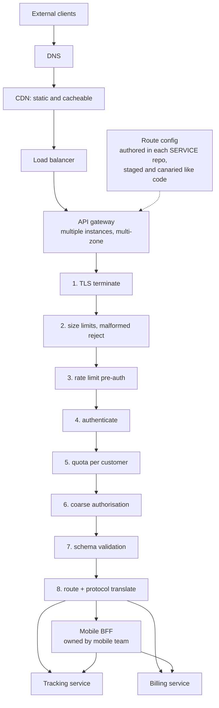
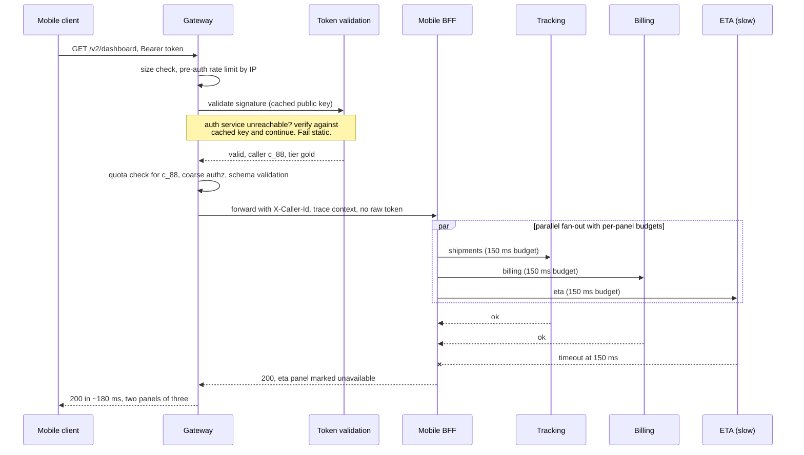

# Chapter 28: API Gateway

## 28.1 Problem Statement

The tracking platform put an API gateway in front of its services three years ago, for the reasons in Chapter 1: one place for authentication, rate limiting, and routing rather than fourteen implementations. It worked.

Then it kept growing.

**It contains business logic.** A request to create a shipment is validated against the customer's contract tier in the gateway, because that was faster than changing two services. The rule now exists in the gateway and nowhere else, so nobody who works on shipping knows it is there.

**One config change took down everything.** A routing rule with a typo was applied to all gateway instances at once. Every endpoint returned 404 for six minutes. Chapter 10's correlated-failure shape, in the one component every request passes through.

**The aggregation endpoint is the slowest thing in the system.** `GET /dashboard` fans out to eleven services and returns a combined response. Its p99 is 4.2 seconds because it inherits the worst tail of eleven dependencies, which is Chapter 6's fan-out arithmetic operating at full strength.

**Deploys are coupled to gateway config.** Adding a field means a service release and a gateway route change, in order, so the gateway team is on the critical path for every other team's work.

**And it has three hundred routes, forty of which are unused,** because nothing ever removes them and nobody is certain which are live.

The gateway solved the original problem and then became the thing Chapter 25 warned about: a monolith, with the additional property that every request in the system passes through it.

## 28.2 Why This Problem Exists

**A gateway is the easiest place to add anything.** It sits in front of everything, it is owned by a platform team who can deploy quickly, and putting a rule there avoids coordinating with a service team. Every individual decision to do so is reasonable and the accumulation is not.

**Cross-cutting and business concerns look similar from the edge.** Authentication is genuinely cross-cutting. Validating a contract tier looks similar and is domain logic. There is no bright line, so the boundary erodes one plausible exception at a time.

**Everything passes through it,** so a change there is a change to every request path simultaneously. That makes it the highest-leverage place to improve things and the highest-blast-radius place to break them, and teams remember the first property more than the second.

**Aggregation is genuinely useful and genuinely dangerous.** Combining eleven calls into one saves a mobile client ten round trips, and it also makes the response depend on the slowest of eleven tails.

**And gateway configuration is rarely treated as code,** so routes accumulate, ownership is unclear, and nobody deletes anything because nobody can prove it is unused.

## 28.3 Real World Analogy

The reception desk of a large building.

Reception does a specific and valuable set of things. It checks identity, issues visitor badges, tells you which floor you want, refuses entry to people without appointments, and keeps a log of who came in. Every visitor passes through it, and centralising those functions is obviously better than having each department check credentials at its own door.

Now imagine reception starts doing more. It begins approving expense claims, because that is quicker than sending people to finance. It decides which projects are priorities. It holds the only copy of a rule about which contractors may enter on weekends, and the facilities team does not know that rule exists.

Three things follow, and all three are Section 28.1.

**Reception becomes a bottleneck for unrelated work.** Anything anyone needs now waits for reception.

**A mistake at reception affects the whole building.** Wrong instructions turn away every visitor, not one department's.

**And knowledge lives in the wrong place.** The weekend contractor rule belongs with facilities, who own contractors, and its presence at reception means nobody who should know it does.

The remedy is not to remove reception. It is to keep reception doing reception's job: identity, direction, and access, and nothing that belongs to a department.

## 28.4 Simple Explanation

**An API gateway is a single entry point that sits between external clients and internal services, handling concerns common to every request.**

It is frequently confused with three adjacent things, and the distinctions matter:

| Component | Traffic | Job |
|---|---|---|
| Load balancer | North-south | Distribute connections across instances of one thing |
| Reverse proxy | North-south | Terminate connections, forward, cache, rewrite |
| **API gateway** | **North-south** | **Authentication, rate limiting, routing by API semantics, quotas, protocol translation** |
| Service mesh | **East-west** | Service-to-service policy, mTLS, resilience (Chapter 27) |

The axis is the useful distinction. **North-south is traffic entering and leaving the system; east-west is traffic between internal services.** A gateway handles the first, a mesh the second, and they are complementary rather than alternatives. Gateways deal with untrusted clients, API keys, quotas, and public contracts. Meshes deal with trusted internal peers, service identity, and resilience between them.

What belongs in a gateway:

| Concern | Why here |
|---|---|
| TLS termination | One place to manage certificates for external traffic |
| Authentication | Verify the caller once, pass identity inward |
| Rate limiting and quotas per client | Protect everything behind it; needs a global view |
| Routing by path, version, or header | The public API shape differs from internal structure |
| Request and response validation | Reject malformed input at the boundary (Chapter 11) |
| Protocol translation | External REST to internal gRPC, for example |
| API key management and usage metering | A commercial concern, not a service concern |
| Coarse authorisation | Is this caller allowed to reach this API at all |

What must not:

| Anti-concern | Where it belongs |
|---|---|
| Business rules and validation of domain invariants | The owning service |
| Fine-grained authorisation on domain objects | The owning service, which knows the data |
| Data transformation that encodes domain meaning | The owning service |
| Orchestration of multi-step business processes | A service, or a saga (Chapter 59) |
| Anything requiring knowledge of a service's internals | The service |

The test:

> **If changing a service's behaviour requires changing the gateway, the gateway has taken on something that belongs to the service.**

## 28.5 Technical Deep Dive

### 28.5.1 What a gateway actually does per request

The ordered pipeline, because the order matters for both cost and security.

```
1. Terminate TLS
2. Basic protection: request size limits, malformed request rejection
3. Rate limit by IP or unauthenticated key         <- BEFORE auth, so auth cannot be flooded
4. Authenticate: validate token or API key signature
5. Rate limit and quota by authenticated identity  <- AFTER auth, so limits are per customer
6. Coarse authorisation: may this caller reach this API
7. Validate the request against the API schema
8. Route to the appropriate service
9. Translate protocol if needed
10. Forward, with identity and trace context attached
11. On response: strip internal headers, shape errors, record metrics
```

Two ordering decisions are worth understanding.

**Rate limit before authenticating, and again after.** Token validation costs CPU, particularly for signature verification, so an unauthenticated flood can exhaust the gateway by making it verify millions of invalid tokens. A cheap pre-auth limit protects the expensive step. The post-auth limit is the one that implements per-customer quotas.

**Validate at the boundary,** which is Chapter 11's principle: a malformed request should be rejected synchronously with a clear error at the edge, rather than becoming a poison message inside the system.

```java
// Identity flows inward as a verified assertion, not as a token to re-verify.
// Services trust the gateway because the mesh (Chapter 27) authenticates the hop.
private void forward(HttpRequest req, AuthenticatedCaller caller) {
    req.header("X-Caller-Id", caller.id());
    req.header("X-Caller-Tier", caller.tier());
    req.header("traceparent", currentTraceContext());
    req.removeHeader("Authorization");          // do not leak the raw credential inward
    upstream(routeFor(req)).send(req);
}
```

### 28.5.2 The aggregation problem

Combining several backend calls into one response is the gateway's most tempting feature and its most dangerous.

The benefit is real. A mobile client on a high-latency connection making eleven requests pays eleven round trips, and Chapter 7's arithmetic makes that the dominant cost of the page. One aggregated request pays one.

The cost is Chapter 6's fan-out arithmetic:

```
11 dependencies, each with p99 of 200 ms, called in parallel.

Probability the response contains at least one p99-or-worse call:
   1 - 0.99^11  =  10.5 percent

So roughly one in ten dashboard loads is at least 200 ms slow,
and the response cannot complete until the slowest one does.
```

Three rules make aggregation survivable:

**Parallelise, always.** Sequential fan-out adds latencies; parallel fan-out takes the maximum. This is the difference between 2.2 seconds and 200 milliseconds.

**Return partial results.** This is Chapter 14's harvest and yield: a dashboard missing one panel, clearly marked, is far better than a failed request.

```java
// Parallel, with per-dependency timeouts and partial results.
// The response completes on schedule regardless of one slow dependency.
Map<String, CompletableFuture<Panel>> calls = Map.of(
    "shipments", supplyAsync(() -> shipments.get(id), pool),
    "billing",   supplyAsync(() -> billing.get(id), pool),
    "eta",       supplyAsync(() -> eta.get(id), pool));

Dashboard result = new Dashboard();
calls.forEach((name, f) -> {
    try {
        result.put(name, f.get(150, MILLISECONDS));       // per-panel budget
    } catch (TimeoutException | ExecutionException e) {
        result.markUnavailable(name);                      // reduced harvest, full yield
    }
});
```

**Keep aggregation dumb.** Fetch, assemble, return. The moment it decides which panels to show based on business rules, it has become domain logic in the gateway.

And the alternative worth knowing: **backend for frontend**. Rather than one gateway aggregating for every client type, each client type gets its own thin aggregation layer, owned by the team that owns that client. A mobile BFF, a web BFF. This keeps client-specific shaping out of the shared gateway and puts it with the people who need to change it, which removes the gateway team from the critical path.

### 28.5.3 The gateway as a single point of failure

Every request passes through it, so its availability is a hard multiplier on everything.

| Risk | Mitigation |
|---|---|
| Instance failure | Multiple instances behind a load balancer, across zones |
| Region failure | Gateway in each region, DNS-level distribution |
| Bad configuration reaching all instances | **Stage and canary config exactly like code** |
| Overload | Admission control and shedding at the edge (Chapter 8) |
| Dependency on an auth service | Cache token validation; fail static on cached keys |
| Certificate expiry | Automated rotation with alerting well in advance |
| Slow upstream consuming gateway resources | Per-upstream timeouts and connection limits |

The configuration row is the one that caused Section 28.1's outage and the one most often neglected, because config feels different from code. It is not: it reaches every instance simultaneously, which makes it precisely the correlated failure that redundancy does not protect against.

```
Gateway config change pipeline, treated as code:

  validate schema  ->  automated tests against a route table snapshot
  ->  canary: apply to 1 instance, compare error rate for 5 minutes
  ->  staged rollout by zone with automated abort
  ->  one-command rollback

Section 28.1's six minute outage was a config push with none of these.
```

A gateway should also **fail static** on its own dependencies. If the token validation service is unreachable, continuing to accept tokens verified against a cached public key is usually correct; refusing all traffic because you cannot reach an auth service converts its outage into yours.

### 28.5.4 Keeping it thin

The discipline that prevents Section 28.1. Four practices.

**A written list of what the gateway does.** Explicit, short, and used as the criterion for rejecting additions. Anything not on the list goes to a service.

**Config owned by service teams, in their repositories.** The gateway's routing configuration for a service is authored and reviewed by the team that owns that service, so the gateway team is not on anyone's critical path. Declarative route definitions in the service's own repository, aggregated by the pipeline, achieve this.

**Route lifecycle management.** Every route has an owner and a last-used timestamp. Routes with no traffic for a defined period are flagged and removed. Section 28.1's forty dead routes exist because nothing measured usage per route.

**Regular review of what has accumulated.** A quarterly read of the gateway's actual behaviour, looking specifically for logic that belongs elsewhere.

The signals that a gateway has drifted:

| Signal | What it means |
|---|---|
| A service change requires a gateway change | Domain logic has moved to the gateway |
| The gateway team is asked about business rules | Knowledge is in the wrong place |
| The gateway has its own database | It is a service pretending to be infrastructure |
| Gateway deploys are on the critical path for feature work | Ownership is wrong |
| Nobody can list what it does | It has become a monolith |

### 28.5.5 Gateway and mesh together

They are complementary, and the division is clean once you use the traffic axis.

| Concern | Gateway (north-south) | Mesh (east-west) |
|---|---|---|
| Who is the caller | An external client, untrusted | An internal service, with a cryptographic identity |
| Authentication | Token or API key validation | Mutual TLS with workload identity |
| Rate limiting | Per customer, per plan, commercial | Per service pair, protective |
| Routing | By public API shape and version | By service and subset |
| Resilience | Timeouts and shedding at the edge | Retries, circuit breaking, outlier ejection |
| Observability | Per API, per customer | Per service pair |

```
   external clients (untrusted)
            |
     [ API gateway ]        north-south: auth, quotas, public routing, validation
            |
   ---------+---------      trust boundary
            |
   [ mesh sidecars ]        east-west: mTLS, retries, outlier ejection
      /     |     \
  service service service
```

The trust boundary is the important part. The gateway converts an untrusted external caller into a verified identity, and everything inside operates on service identities that the mesh guarantees. That is why services should not re-verify the client's original token on every hop: they trust the assertion because they trust the hop, and the hop is authenticated by the mesh.

## 28.6 Architecture Diagram



```
 clients -> DNS -> CDN -> load balancer -> API GATEWAY (multi-instance, multi-zone)
                                               |
   pipeline: TLS -> size limits -> rate limit (pre-auth) -> authenticate
             -> quota per customer -> coarse authz -> validate schema
             -> route + protocol translate -> forward with identity + trace
                                               |
                    +--------------------------+-------------------+
                    |                                              |
             mobile BFF (owned by mobile team,               tracking service
             aggregates in parallel, partial results)        billing service
                    |
             tracking + billing + eta

 route config authored in each service's own repo,
 staged and canaried exactly like application code
```

## 28.7 Request Flow



1. **Cheap protections come first:** size limits and an unauthenticated rate limit, so the expensive signature verification cannot be flooded.
2. **Authentication uses a cached signing key,** so the token validation service is a soft dependency rather than a hard one. Chapter 10's classification applied at the edge.
3. **Quota and coarse authorisation use the verified identity,** which is where per-customer commercial limits belong.
4. **The raw credential is stripped** before forwarding, and a verified identity assertion plus trace context is attached instead.
5. **Aggregation happens in a client-specific BFF owned by the client team,** not in the shared gateway, so the gateway team is not on the mobile team's critical path.
6. **Fan-out is parallel with per-panel budgets,** so total latency is the slowest panel within budget rather than the sum.
7. **A slow dependency produces a partial response,** clearly marked, which is full yield with reduced harvest and the correct outcome.

## 28.8 Internal Components

| Component | Role | Failure mode | Guard |
|---|---|---|---|
| TLS termination | External encryption boundary | Certificate expiry affects everything | Automated rotation, alert weeks ahead |
| Pre-auth rate limiter | Protects expensive auth work | Absent, so token verification is floodable | Cheap limit by IP or unauthenticated key |
| Authenticator | Establishes caller identity | Hard dependency on an auth service | Cache signing keys; fail static |
| Quota engine | Per-customer commercial limits | Per-instance counters, multiplying the limit | Shared counters (Chapter 23) |
| Schema validator | Rejects malformed input at the edge | Absent, so bad input becomes internal poison | Validate against the published contract |
| Router | Maps public API to services | Config sprawl, dead routes | Per-route ownership and usage metrics |
| Aggregator or BFF | Reduces client round trips | Sequential fan-out, no partial results | Parallel, per-panel budgets, partial responses |
| Config pipeline | Applies changes | Fleet-wide push with no staging | Validate, canary, stage, roll back |
| Admission control | Protects everything behind it | Absent, so overload cascades inward | Shed by priority at the edge (Chapter 8) |
| Per-upstream limits | Contains a slow service | Shared pools, so one upstream stalls the gateway | Per-upstream timeouts and connection caps |

## 28.9 Production Example

**Netflix's move to client-specific backends is the canonical BFF argument.** A single general-purpose API layer serving many very different device types accumulated conditional logic for each of them, and the team owning that layer became a bottleneck for every device team. Splitting into client-specific adapters, owned by the teams building those clients, removed the bottleneck and let each client shape its own responses. The generalisable lesson is that **client-specific shaping belongs with the client team**, and putting it in a shared gateway guarantees a coordination bottleneck.

**Amazon's mandate, discussed in Chapters 2 and 26, implies the gateway's limits.** If every team must be reachable only through its own service interface, then a gateway that implements a team's business rules is a violation dressed as infrastructure, because it means a service's behaviour is defined somewhere its owners do not control. That is Section 28.1's contract-tier rule precisely.

**And published gateway outages consistently share a cause.** The pattern is a configuration or certificate change applied simultaneously to every instance of the one component through which all traffic passes. It is Chapter 10's correlated failure at the highest-leverage point in the system, and the mitigation is unremarkable: treat gateway configuration with the same staging, canarying, and rollback discipline as application code, because it carries more risk than most code does.

## 28.10 Advantages

- **Cross-cutting concerns implemented once,** rather than in every service.
- **A single external contract,** so the public API shape can differ from internal structure and evolve independently.
- **Rate limiting and quotas with a global view,** which no individual service can provide.
- **Malformed input rejected at the boundary,** which keeps poison out of internal queues.
- **A clean trust boundary:** untrusted outside, verified identity inside.
- **Fewer client round trips** when aggregation is used carefully.
- **Protocol translation,** so internal services can use efficient protocols while the public API stays conventional.
- **One place for edge observability,** per API and per customer.

## 28.11 Limitations

- **Every request passes through it,** so it is a hard availability dependency and a latency addition.
- **Configuration changes are fleet-wide changes** with the correlated failure risk that implies.
- **It attracts logic** that belongs in services, and the erosion is gradual.
- **Aggregation inherits the tail** of everything it fans out to.
- **It can become a team bottleneck** when config is centrally owned.
- **Route sprawl accumulates** without lifecycle management.
- **It does not help east-west traffic,** which needs Chapter 27's mesh.

## 28.12 Trade-offs

| Dial | One way | The other way |
|---|---|---|
| Gateway responsibility | Thin: no bottleneck, clients make more calls | Rich, with aggregation: fewer round trips, drift risk |
| Aggregation location | Shared gateway: one component, coordination bottleneck | BFF per client: team autonomy, more components |
| Config ownership | Central platform team: consistency, bottleneck | Per service repository: autonomy, less uniformity |
| Auth dependency | Fail static on cached keys: available, revocation lag | Live validation: immediate revocation, hard dependency |
| Fan-out response | Partial results: available and honest, more client logic | All or nothing: simple, worse tail |
| Protocol translation | At the gateway: internal freedom, translation cost | Same protocol throughout: simpler, less internal choice |

**Remove the gateway and let clients call services directly.** You gain a hop and remove a failure domain. You lose one place for authentication, quotas, and validation, and you expose internal structure as the public contract, so every internal refactor becomes a client-visible change.

**Remove aggregation from the gateway and let clients fan out.** You gain a gateway that cannot become a monolith and removes the tail-inheritance problem. You lose round-trip efficiency, which matters most on high-latency mobile connections. The usual resolution is a BFF owned by the client team.

**Remove per-customer quotas.** You gain a round trip to a shared counter per request. You lose the ability to prevent one client consuming the capacity of all others, which is Chapter 9's noisy neighbour problem at the edge.

## 28.13 Common Mistakes

**Business logic in the gateway.** The definitional failure, and it accumulates one reasonable exception at a time.

**Config pushed to all instances without staging,** which is the single most common cause of total gateway outages.

**Rate limiting only after authentication,** leaving the expensive verification step floodable.

**Per-instance rate limit counters,** which multiply the configured limit by fleet size, per Chapter 23.

**Sequential fan-out in an aggregation endpoint,** which adds latencies instead of taking the maximum.

**All-or-nothing aggregation,** so one slow panel fails the whole response.

**A hard dependency on an auth service,** converting its outage into yours.

**Forwarding the raw client credential inward,** which spreads the credential's blast radius across every service.

**Central config ownership,** making the gateway team a bottleneck for every other team's work.

**No route lifecycle,** so dead routes accumulate and nobody can safely delete them.

**Using a gateway for east-west traffic,** where a mesh is the appropriate tool.

## 28.14 Interview Questions

**Q: What belongs in an API gateway and what does not?** In: TLS termination, authentication, rate limiting and quotas, routing by public API shape, request validation, protocol translation, API key metering, and coarse authorisation. Not in: business rules, fine-grained authorisation over domain objects, domain-meaningful transformation, or orchestration of business processes. The test is whether changing a service's behaviour requires changing the gateway; if it does, the gateway has taken on something that belongs to the service.

**Q: Gateway versus service mesh?** Traffic axis. A gateway handles north-south traffic entering and leaving the system, dealing with untrusted clients, tokens, quotas, and the public contract. A mesh handles east-west traffic between internal services, dealing with workload identity, mutual TLS, retries, and outlier ejection. They are complementary, and the gateway is the trust boundary that converts an external caller into a verified internal identity.

**Q: Why rate limit before authenticating?** Because token or signature verification is CPU-expensive, so an unauthenticated flood can exhaust the gateway by forcing millions of verifications. A cheap limit keyed on IP or unauthenticated key protects the expensive step. The post-authentication limit is a different mechanism serving a different purpose, namely per-customer commercial quotas.

**Q: Your dashboard endpoint fans out to eleven services and has a p99 of four seconds. What do you do?** Ensure the calls are parallel rather than sequential, which changes total latency from the sum to the maximum. Give each dependency its own budget and return partial results with unavailable sections clearly marked, which is full yield with reduced harvest. Then consider moving the aggregation into a client-owned backend for frontend, so the shaping logic sits with the team that needs to change it.

**Q: Why is a gateway config change riskier than a typical code deploy?** Because it applies to every instance of the component through which all traffic passes, essentially simultaneously, so it is a correlated change affecting every endpoint at once and redundancy provides no protection. It therefore needs schema validation, automated tests, canarying on a single instance with error-rate comparison, staged rollout, and one-command rollback.

**Q: How do you stop a gateway becoming a monolith?** Maintain a written, short list of what it does and use it to reject additions. Have service teams author their own route configuration in their own repositories so the gateway team is not on anyone's critical path. Track per-route ownership and usage so dead routes can be removed. Review quarterly for logic that has drifted in, and watch for the signal that a service change requires a gateway change.

**Q: Should the gateway forward the client's token to services?** Generally no. It should verify the credential once and forward a verified identity assertion plus trace context, stripping the original credential, so the credential's blast radius does not extend across every internal service. Internal services trust the assertion because the hop itself is authenticated, typically by the mesh.

## 28.15 Production Best Practices

1. **Write down what the gateway does,** keep the list short, and use it to reject additions.
2. **Order the pipeline correctly:** cheap protections and pre-auth rate limiting before expensive verification.
3. **Use shared counters for quotas,** never per-instance ones.
4. **Validate requests against the published contract at the edge.**
5. **Strip the client credential and forward a verified identity assertion** plus trace context.
6. **Cache signing keys and fail static** so the auth service is a soft dependency.
7. **Treat configuration as code:** validate, test, canary on one instance, stage by zone, roll back in one command.
8. **Let service teams own their own route configuration** in their own repositories.
9. **Track per-route ownership and usage,** and delete routes with no traffic.
10. **Move client-specific aggregation into a BFF** owned by the client team.
11. **Fan out in parallel with per-dependency budgets and partial results.**
12. **Apply per-upstream timeouts and connection limits** so one slow service cannot consume the gateway.
13. **Run admission control and shedding at the edge,** since it protects everything behind it.
14. **Deploy multiple instances across zones,** and in each region for global systems.

## 28.16 Summary

An API gateway is the single entry point for external traffic, and it exists to implement the concerns every request shares: TLS termination, authentication, rate limiting and quotas, routing by the public API's shape, request validation, and protocol translation. It is the trust boundary of the system, converting an untrusted external caller into a verified identity that internal services can act on, and it is complementary to Chapter 27's mesh rather than an alternative, because they handle different axes of traffic.

Its characteristic failure is accumulation. It is the easiest place in the system to add anything, it is owned by a team who can deploy quickly, and putting a rule there avoids coordinating with a service team. So business logic drifts in one plausible exception at a time until a service's behaviour is defined somewhere its owners do not control, and until the gateway team is on the critical path for everyone else's work. The test that catches this early is simple: if changing a service's behaviour requires changing the gateway, something has moved to the wrong place.

Two specific hazards deserve naming. Configuration changes reach every instance of the one component all traffic passes through, essentially at once, which makes them higher-risk than most code deploys and demands the same staging, canarying, and rollback discipline. And aggregation, which is genuinely valuable for reducing client round trips, inherits the tail of everything it fans out to, so it must be parallel, budgeted per dependency, and willing to return partial results. Where client-specific shaping is needed, a backend for frontend owned by the client team keeps that logic and its coordination cost away from the shared edge.

Kept thin, with an explicit remit, distributed configuration ownership, route lifecycle management, and a soft dependency on its own auth service, a gateway is one of the highest-value components in a distributed system. Allowed to grow, it becomes a monolith with the unique property that every request in the system passes through it.

## 28.17 Quick Revision Notes

- API gateway: single entry point for north-south traffic. Mesh handles east-west. Complementary, not alternatives.
- Belongs in it: TLS termination, authentication, rate limits and quotas, public routing, schema validation, protocol translation, API key metering, coarse authorisation.
- Does not belong: business rules, fine-grained authorisation over domain objects, domain transformation, business orchestration.
- Test: if a service behaviour change requires a gateway change, the gateway has taken on service logic.
- Pipeline order: TLS, size limits, pre-auth rate limit, authenticate, per-customer quota, coarse authz, validate, route, translate, forward.
- Rate limit before auth, because signature verification is expensive and floodable.
- Quotas must use shared counters, not per-instance ones.
- Strip the client credential; forward a verified identity assertion plus trace context.
- Cache signing keys and fail static, so the auth service is soft rather than hard.
- Config changes reach every instance at once. Validate, canary, stage, roll back. This is the most common cause of total gateway outages.
- Aggregation inherits the worst tail of its fan-out: 11 dependencies at p99 200 ms means about 10 percent of responses are slow.
- Aggregate in parallel, budget per dependency, return partial results with unavailable sections marked.
- Prefer a BFF per client type, owned by the client team, over aggregation in the shared gateway.
- Service teams should own their own route config in their own repositories.
- Track route ownership and usage; delete dead routes.
- Per-upstream timeouts and connection limits, so one slow service cannot consume the gateway.

## 28.18 Mini Quiz

1. Distinguish gateway, load balancer, reverse proxy, and service mesh.
2. Give the test for whether something belongs in the gateway.
3. Why is rate limiting placed both before and after authentication?
4. Your aggregation endpoint fans out to nine services at p99 of 150 ms each. Estimate the fraction of slow responses and give two fixes.
5. Why is a gateway config change riskier than a service deploy?
6. Should the gateway pass the client's bearer token to internal services? Why?
7. What is a BFF and which problem does it solve that a shared gateway cannot?

**Answers**

1. A load balancer distributes connections across instances of one backend and operates on connections rather than API semantics. A reverse proxy terminates client connections and forwards them, optionally caching and rewriting, still without API awareness. An API gateway is API-aware: it authenticates callers, enforces per-customer quotas, routes by public API path and version, validates against a published contract, and translates protocols. A service mesh handles east-west traffic between internal services, providing workload identity with mutual TLS, retries, circuit breaking, and outlier ejection. The gateway and mesh differ by traffic axis, not by capability tier.
2. Whether changing a service's behaviour requires changing the gateway. If it does, the gateway holds logic that belongs to the service, which means the service's behaviour is defined somewhere its owning team does not control and the gateway team becomes a dependency for that team's work. Cross-cutting concerns that are identical for every API belong in the gateway; anything that encodes domain meaning does not.
3. The pre-authentication limit is cheap and protects the expensive step, because verifying a token signature costs real CPU and an unauthenticated flood of invalid tokens could exhaust the gateway by forcing millions of verifications. It is keyed on something available before authentication, such as source address. The post-authentication limit is a different mechanism entirely: it implements per-customer commercial quotas, which requires knowing which customer is calling and therefore cannot happen earlier.
4. About 1 minus 0.99 to the ninth power, roughly 8.6 percent of responses will contain at least one call at or above the p99, and the response cannot complete until the slowest call does. Fixes: make the fan-out parallel rather than sequential so total latency is the maximum rather than the sum; give each dependency its own timeout budget and return partial results with unavailable sections clearly marked, which preserves full yield with reduced harvest; and consider moving the aggregation into a client-owned backend for frontend so the shaping and its budget decisions sit with the team that owns the client.
5. Because it applies to every instance of the single component through which all traffic passes, essentially simultaneously, so a mistake affects every endpoint for every client at once and having many gateway instances provides no protection whatsoever. It is the correlated-failure shape from Chapter 10 at the highest-leverage point in the system. It therefore requires schema validation, automated tests against the route table, canarying on one instance with error-rate comparison, staged rollout by zone, and a one-command rollback.
6. No. It should verify the credential once at the edge and forward a verified identity assertion, such as caller id and tier, together with trace context, while stripping the original credential. Forwarding the raw token extends its blast radius to every internal service that handles the request, so a compromise or logging mistake anywhere inside exposes a usable credential. Internal services can trust the assertion because the hop delivering it is itself authenticated, typically by mutual TLS from the mesh.
7. A backend for frontend is a thin aggregation and shaping layer dedicated to one client type, such as mobile or web, owned by the team that builds that client. It solves the coordination bottleneck that a shared gateway cannot: when client-specific response shaping lives in the shared gateway, every client change requires the gateway team's involvement and every client's needs accumulate conditional logic in one component. Giving each client type its own layer puts the shaping decisions, the fan-out budgets, and the release cadence with the team that needs them.

## 28.19 Hands-on Exercise

**Part 1: audit the remit.** List everything your gateway currently does. Classify each item as genuinely cross-cutting or as service logic that has drifted in. For each item in the second category, identify which service should own it.

**Part 2: measure the fan-out tail.** Take an aggregation endpoint and record its p50 and p99, then record the p99 of each dependency. Compute the expected slow-response fraction, and compare with the observed figure. Then convert any sequential calls to parallel and re-measure.

**Part 3: add partial results.** Give each dependency in that endpoint its own timeout budget and return a response with unavailable sections marked. Induce a slow dependency and confirm the response still completes within budget.

**Part 4: break it with config, then make that impossible.** In a non-production environment, apply a deliberately bad route change to all instances and record the blast radius and time to recovery. Then build a pipeline with validation, single-instance canary, staged rollout, and rollback, and repeat.

**Part 5: find the dead routes.** Add per-route request counters. After a fortnight, list routes with zero traffic and identify an owner for each. Delete what you can, and record why you cannot delete the rest.

## 28.20 Further Reading

- *Building Microservices*, Sam Newman, second edition, on gateways, backends for frontend, and where aggregation belongs.
- Netflix's engineering writing on moving from a general-purpose API layer to client-specific backends, for the BFF argument in its original context.
- Phil Calçado's writing on the backend for frontend pattern, which is the clearest statement of the ownership argument.
- Envoy, Kong, and cloud gateway documentation on request pipelines, specifically the ordering of authentication and rate limiting.
- OWASP API Security guidance, for what edge validation and authorisation should actually cover.
- Chapter 27's mesh material alongside this, since the gateway and mesh division of responsibility is easiest to understand when both are read together.

---

**Next chapter: Chapter 29, Reverse Proxy.** The component underneath both the gateway and the mesh: what a reverse proxy actually does, why connection handling and buffering matter more than they appear to, and the specific behaviours that turn a proxy into an outage.
