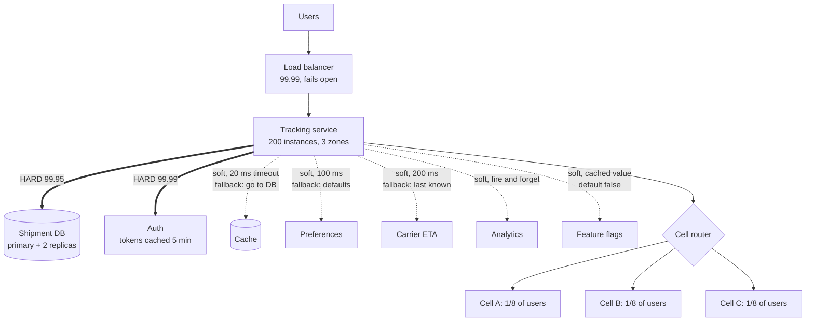
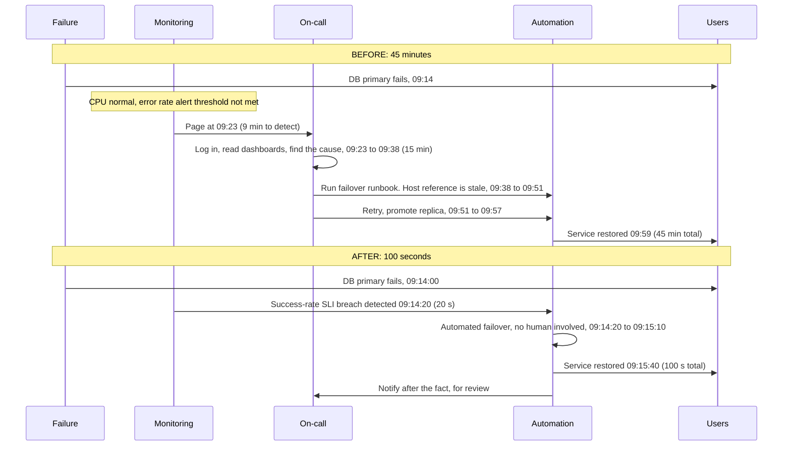

# Chapter 10: Availability

## 10.1 Problem Statement

The tracking platform now has a 99.99 percent availability target, which allows about four minutes of unavailability per month. The team does what the guidance says. Three availability zones. Three database replicas. Autoscaling. Two hundred stateless instances. Automated failover. Health checks on every instance. Nothing in the architecture diagram is wrong.

In one quarter they have six outages totalling eleven hours.

**Outage one, 38 minutes.** A configuration change is pushed to all instances at once. It contains a bad value. All 200 instances load it and start returning errors within seconds of each other. Redundancy provided exactly nothing, because every replica failed for the same reason at the same time.

**Outage two, 22 minutes, and this one is the most instructive.** Someone had improved the health check endpoint to verify the database connection, reasoning that an instance that cannot reach the database is not healthy. The database has a 20 second blip. All 200 instances simultaneously report unhealthy. The load balancer, doing precisely its job, removes all 200 from rotation. There is now nothing to serve traffic. The database recovers after 20 seconds; the outage lasts 22 minutes because instances have to pass health checks again, then get overwhelmed by the backlog, then fail again. A 20 second partial degradation was amplified into a total outage by the mechanism installed to prevent outages.

**Outage three, 4 hours.** The TLS certificate expires. It expires on every instance simultaneously, because it is the same certificate. Three availability zones did not help; they all had the same expiry date.

**Outage four, 51 minutes.** The analytics service goes down. Analytics is documented as non-critical. In the code, the call to it has no timeout and no fallback, so every request thread blocks waiting for it. A non-critical dependency took down the critical path, because "non-critical" was a statement in a document rather than a property of the code.

**Outage five, 45 minutes.** The database primary genuinely fails, which is the scenario all the redundancy was for. Failover works. It takes 45 minutes, because nobody had run it in eleven months, the runbook referenced a decommissioned host, and the first attempt promoted a replica that was 90 seconds behind.

**Outage six, 2 hours 44 minutes.** Nothing failed completely. A dependency was slow, then another retried, then a queue backed up. Nobody noticed for 70 minutes because the alerts were on CPU and error rate, and neither moved much.

Now the arithmetic nobody had done. The service has 12 hard dependencies, each with a measured availability of about 99.95 percent. If all 12 must work for a request to succeed:

```
0.9995 ^ 12  =  0.9940   ->  99.4 percent
```

Their theoretical ceiling was 99.4 percent, or roughly four hours of downtime per month, before a single thing went wrong. The 99.99 percent target was unreachable by construction, and no amount of redundancy inside any one component would have changed that.

Six outages, and only one of them (number five) is the failure mode redundancy is designed for.

## 10.2 Why This Problem Exists

**Availability composes badly, and people's intuition composes it wrongly.** Everyone knows redundancy improves availability. Fewer people internalise that dependencies in series multiply, so a chain is always less available than its weakest link and usually much worse. Twelve dependencies at 99.95 percent do not give you 99.95 percent. They give you 99.4 percent.

**Redundancy only helps against independent failures, and most failures are not independent.** The parallel formula assumes that replica B failing is unrelated to replica A failing. In reality they share a configuration source, a deployment pipeline, a container image, a certificate, a code path, a dependency, and often a rack or a zone. A bug, a bad config, or an expiring certificate hits all of them at once, and against correlated failure, three replicas are worth exactly one.

**Most downtime is caused by change, not by hardware.** The mental model of availability engineering is usually about component failure: disks die, machines crash, networks partition. Those happen, and they are the minority. The dominant trigger is somebody changing something: a deploy, a configuration push, a schema migration, a certificate rotation, a feature flag. Redundancy defends against the first category and does nothing at all against the second, which is why Section 10.1's team had the architecture right and the outcome wrong.

**Recovery time is usually cheaper to improve than failure rate, and almost nobody optimises it.** Availability is a ratio of uptime to total time, so it depends on how often you break and how long you stay broken. Teams pour effort into the first and neglect the second, which is backwards: halving the failure rate is hard engineering, while halving recovery time is usually alerting, automation, and practice.

**And availability is treated as binary when it is not.** "Up" and "down" hide the case that matters most: partly working. A system that serves the core path while shedding a secondary feature is having a much better day than one that returns errors to everyone, and the difference between those two outcomes is a design decision made months earlier about which dependencies are allowed to fail your request.

## 10.3 Real World Analogy

A hospital cannot lose power. So it has three sources: the mains supply, a diesel generator, and a battery system.

The reasoning is exactly the parallel availability formula. Mains fails occasionally. The generator fails occasionally. Both failing simultaneously is far rarer than either alone, so combining them produces a much better number than either provides.

Now every way that reasoning goes wrong, all of which have direct software equivalents.

**The generator that was never tested.** It sits for three years, and on the night it is needed the starter battery is flat. Untested redundancy is not redundancy; it is a belief about redundancy. This is Section 10.1's outage five, and it is why hospitals run scheduled generator tests under load rather than merely checking that the generator exists.

**Both in the basement.** The flood takes the mains switchgear and the generator together, because the failures were never independent. Two components sharing a physical location share a fate. In software the shared thing is usually less visible: the same availability zone, the same base image, the same config store, the same certificate.

**The switchover gap.** The generator takes 12 seconds to come up to load. Twelve seconds of darkness is unacceptable in an operating theatre, so batteries bridge the gap. Redundancy without fast switchover still produces an outage, just a shorter one. That is mean time to recovery, and it is why detection and automation matter as much as spare capacity.

**Load shedding by importance.** When running on the generator, the hospital does not power everything. Operating theatres, ventilators, and lifts stay up; the car park lighting and the air conditioning in the admin block do not. Nobody calls this an outage. It is graceful degradation, and it requires having decided in advance which circuits are which.

**And the fuel.** The generator runs for eight hours on its tank. If the fuel delivery contract has lapsed, the redundancy has a hidden expiry date. Every backup has a dependency, and it is usually the one nobody audits.

## 10.4 Simple Explanation

**Availability is the proportion of time, or of requests, that a system does what it is supposed to do.**

Chapter 6 covered how to specify it as an SLO with an error budget. This chapter is about what it takes to actually achieve one, which is a different subject and mostly arithmetic and operational practice.

Two ways to measure it, and the choice matters more than people expect:

| Measure | Definition | Good for | Weakness |
|---|---|---|---|
| Time-based | Fraction of minutes the service was up | Contracts, status pages, intuition | Hides partial failures. "Up" for whom? A service failing 30 percent of requests is not down |
| Request-based | Fraction of requests that succeeded within their deadline | Engineering reality | Needs care about what counts as a failure |

Prefer request-based for anything you are engineering against. It captures partial failure, it captures slowness as failure when you include a latency condition, and it aggregates naturally across regions and endpoints.

Three questions that must be answered before an availability number means anything:

1. **Available to whom?** A failure affecting one large customer 100 percent of the time and a failure affecting all customers 1 percent of the time produce the same global number and are very different events. Track availability per customer or per tenant as well as globally.
2. **Measured where?** Server-side success rate is generous. Real user measurement includes the network, DNS, and the client. Chapter 6's table applies.
3. **What counts as available?** A response in 40 seconds is technically a success and practically a failure. Include the latency condition in the definition, or the number will flatter you.

The two formulas that run the rest of the chapter:

```
Series (all must work):      A = A1 x A2 x ... x An
Parallel (any one suffices): A = 1 - (1 - A1) x (1 - A2) x ... x (1 - An)

Availability from failure and repair:  A = MTBF / (MTBF + MTTR)
```

Everything else is either applying these, or explaining why the second one does not hold in practice.

## 10.5 Technical Deep Dive

### 10.5.1 Composition: the dependency ceiling

Anything a request needs in order to succeed is a **hard dependency**, and hard dependencies multiply.

| Hard dependencies, each at 99.9 percent | Resulting availability | Monthly downtime |
|---|---|---|
| 1 | 99.9 percent | 43 minutes |
| 3 | 99.7 percent | 2 hours 10 minutes |
| 5 | 99.5 percent | 3 hours 36 minutes |
| 10 | 99.0 percent | 7 hours 12 minutes |
| 20 | 98.0 percent | 14 hours 24 minutes |

Read the last row. Twenty dependencies that are individually excellent produce a system that is unacceptable, and no single component is at fault. This is the microservices tax, and it is the arithmetic reason why service decomposition without dependency discipline degrades availability. Chapter 26 covers the other side of that trade.

Redundancy runs the formula in the other direction, and the effect is dramatic:

| Independent redundant copies, each at 99 percent | Availability |
|---|---|
| 1 | 99 percent |
| 2 | 99.99 percent |
| 3 | 99.9999 percent |

Two mediocre components in parallel beat one excellent component. That is the entire case for redundancy, and the word doing all the work is **independent**, which Section 10.5.2 is about.

The practical exercise, and it takes twenty minutes: list every dependency of your critical path, mark each as hard or soft, and multiply the hard ones. That product is your ceiling. If it is below your target, the only useful actions are to remove dependencies, make them soft, or make them redundant. Adding instances of your own service cannot help.

```
Tracking read path, before:
  auth service       99.95   hard
  user service       99.95   hard  (preferences)
  database           99.95   hard
  cache              99.9    hard  (no fallback on miss)
  feature flags      99.9    hard  (blocking fetch at request time)
  analytics          99.5    hard  (no timeout!)
  ... 6 more
  Product:  99.4 percent ceiling

After making dependencies soft:
  database           99.95   hard
  auth               99.95   hard  (cached tokens, 5 min tolerance)
  everything else:   soft (timeout + fallback)
  Product:  99.90 percent ceiling, before adding redundancy
```

Nothing was rewritten. Nine dependencies moved from hard to soft by adding timeouts and fallbacks, and the ceiling improved by half an order of magnitude.

### 10.5.2 Why redundancy underdelivers: correlated failure

The parallel formula assumes independence. Production shares far more than people realise, and every shared thing is a channel for correlated failure.

| Shared thing | Correlated failure it enables | Mitigation |
|---|---|---|
| Same config source | A bad value reaches every instance at once | Staged config rollout, validation, canary |
| Same deployment | A bad build reaches every instance at once | Canary, staged rollout by zone, bake time |
| Same code | The same bug on the same input everywhere | Diversity is impractical; rely on staged rollout and flags |
| Same certificate | Simultaneous expiry everywhere | Automated rotation, expiry alerts weeks ahead |
| Same rack, switch, or power | Physical failure takes all copies | Spread across zones |
| Same availability zone | Zone failure takes all copies | Multi-zone, then multi-region |
| Same dependency | Its outage is your outage, everywhere | Fallbacks, caching, dependency tiering |
| Same clock or time source | Skew or leap-second bugs everywhere | Rare, and spectacular when it happens |
| Same DNS or service discovery | Resolution failure isolates everything | Cache resolutions, fail static |
| Same saturation trigger | Traffic spike overwhelms all copies at once | Shedding, autoscaling, per-copy limits |
| Same operator action | One command, all instances | Confirmation gates, blast-radius limits on tooling |

The uncomfortable implication is that **the top four rows account for most real outages, and redundancy does not address any of them.** Three replicas running the same bad config are three broken replicas.

So availability engineering splits into two quite different disciplines:

- **Against independent failures**: redundancy, spare capacity, failover, replication. Well understood, largely solved by architecture.
- **Against correlated failures**: staged rollouts, canaries, blast radius limits, rollback, dependency isolation. Mostly operational practice, and where the outages actually are.

A useful test when someone proposes redundancy: **name the failure this protects against, and then name what the two copies still share.** If the answer to the second question includes "the deployment pipeline", you have not protected against the most likely cause of an outage.

### 10.5.3 MTBF, MTTR, and the cheap lever

```
                MTBF
Availability = --------------
               MTBF + MTTR

MTBF = mean time between failures
MTTR = mean time to recovery
```

Hold the failure rate constant and vary only recovery time:

| Failures per month | MTTR | Availability | Monthly downtime |
|---|---|---|---|
| 1 | 4 hours | 99.45 percent | 4 hours |
| 1 | 1 hour | 99.86 percent | 1 hour |
| 1 | 15 minutes | 99.97 percent | 15 minutes |
| 1 | 5 minutes | 99.99 percent | 5 minutes |
| 1 | 1 minute | 99.998 percent | 1 minute |

Same number of failures in every row. The difference between 99.45 and 99.99 percent is entirely how fast you recover, and going from four hours to five minutes is achievable with alerting, automation, and rehearsal. Compare that with the alternative route to the same number, which is preventing eleven of every twelve failures.

**This is the single most actionable idea in the chapter: for most teams, MTTR is the cheap lever and MTBF is the expensive one.**

MTTR decomposes, and the parts have very different costs to improve:

| Phase | Typical share | How to improve |
|---|---|---|
| Detect | Often the largest | Alert on symptoms (error rate, latency, goodput), not on causes. Synthetic probes. Per-customer signals |
| Diagnose | Large and variable | Tracing, correlated logs, dependency dashboards, recent-change feed |
| Mitigate | Should be small | One-command rollback, automated failover, feature flag kill switches, traffic shifting |
| Verify | Small | Clear success signal on the dashboard |

Two observations from real incident reviews. **Detection often dominates**, and in Section 10.1's outage six it was 70 of 164 minutes. Alerting on CPU rather than on user-visible symptoms is the usual cause. And **mitigation should almost never require diagnosis**. The fastest recoveries come from teams who roll back or fail over first and investigate afterwards, which requires that rollback be safe, tested, and boring.

### 10.5.4 Change is the leading cause of downtime

If you review a year of incidents at most organisations, the trigger is overwhelmingly a change: a deploy, a config push, a flag flip, a schema migration, a certificate rotation, a dependency upgrade, an infrastructure change. Hardware and network failures are real and are a minority.

This has a sharp consequence: **the highest-leverage availability work is usually in the deployment pipeline, not the architecture diagram.**

The practices, roughly in order of value:

**Staged rollout.** Never change everything at once. One instance, then one zone, then one region, with a bake time between stages long enough for problems to surface. Section 10.1's outage one is a config push with no stages.

**Canary with automated analysis.** Send a small share of traffic to the new version and compare error rate and latency against the old one automatically. Promote on green, roll back on red, without a human in the loop.

**Configuration is code.** Config changes cause as many outages as code changes and usually get none of the safeguards. Validate schema, review, stage, and roll back config exactly like code.

**One-command rollback, tested regularly.** If rollback is not routine, it will not work when it matters. Schema changes deserve special attention here, since they are frequently one-way and need an expand-migrate-contract sequence to stay reversible.

**Feature flags as kill switches.** The ability to disable a feature without a deploy converts a rollback from minutes into seconds. Flags need their own discipline, since a flag system that is a hard dependency is a new single point of failure.

```java
// A kill switch that fails safe: if the flag service is unreachable,
// use the last known value, and if there is none, use the safe default.
public boolean enrichmentEnabled() {
    try {
        return flags.get("tracking.enrichment", cachedValue, Duration.ofMillis(50));
    } catch (Exception e) {
        return cachedValue != null ? cachedValue : false;   // safe default
    }
}
```

**Change freezes at known-risky times,** and more importantly, an awareness that the answer to "what changed" is the first question in every incident. A visible feed of recent deploys and config changes cuts diagnosis time more than most monitoring investments.

### 10.5.5 Blast radius: cells and shuffle sharding

If you cannot prevent all failures, limit how many users each one reaches. This reframing is the modern centre of availability engineering, and it changes the target from "no outages" to "no outage affects everyone".

**Failure domains** nest: process, instance, rack, availability zone, region. Redundancy within a domain protects against failures below it and nothing above it.

**Cell-based architecture** takes this further. Instead of one large system serving all customers, run many complete, independent copies of the stack, each serving a subset. A cell contains its own compute, data, and caches. A failure inside a cell affects only that cell's customers.

```
Traditional:              Cellular:
  all users                users 1-10k -> cell A (full stack)
      |                    users 10-20k -> cell B (full stack)
  one big stack            users 20-30k -> cell C (full stack)
      |                    ...
  one failure = 100%       one cell fails = 1/N of users
```

Cells also cap the blast radius of change, because you deploy cell by cell, and they cap the blast radius of overload, because one customer's traffic spike is contained. The costs are real: more infrastructure, a routing layer that must itself be extremely available, and cross-cell operations become awkward.

**Shuffle sharding** is a related idea with pleasing arithmetic. Instead of assigning each customer to one shard of workers, assign each a random *combination* of workers.

```
100 workers, each customer assigned 2 of them.
Number of distinct pairs = C(100, 2) = 4,950

Probability that two specific customers share BOTH workers = 1 / 4,950
                                                           = about 0.02 percent

So one customer's poison-pill request degrades at most 2 workers, and
almost no other customer loses both of theirs.
```

With 8 workers per customer out of 100, the number of combinations is astronomically large, and near-complete overlap becomes vanishingly rare. The effect is that a bad actor or a pathological workload harms a tiny fraction of other customers rather than all of them, at no extra hardware cost. It is one of the few techniques that improves availability without buying anything.

**Static stability** is the other idea worth taking from this area. A system is statically stable if it keeps working during a failure **without needing to take any action**. Pre-provision each zone to carry the load if another zone is lost, rather than relying on autoscaling to react during the incident. The reasoning is that failure is exactly when control planes are stressed, dependencies are flaky, and new capacity is hardest to obtain. If surviving a zone loss requires a successful API call to launch instances, you have made your recovery depend on the thing that is currently on fire.

```
Three zones, need 300 units of capacity total.
Reactive:  100 per zone, autoscale on failure.  Requires scaling to work during an incident.
Static:    150 per zone (450 total).  Lose a zone, remaining 300 units carry the load.
           Costs 50 percent more. Requires nothing to happen during the incident.
```

### 10.5.6 Availability is not binary

The most valuable design decision for availability is deciding, in advance, what each dependency's failure does to a request.

| Dependency | Tier | On failure |
|---|---|---|
| Shipment database | Critical | Fail the request. There is no tracking without it |
| Auth service | Critical, but cacheable | Accept a cached token decision for up to 5 minutes, then fail |
| Preferences | Degraded | Use defaults |
| Cache | Degraded | Go to the source. Slower, still correct |
| Carrier ETA API | Degraded | Show the last known ETA with its timestamp |
| Recommendations | Optional | Omit the section entirely |
| Analytics | Optional | Fire and forget. Never block, never fail the request |

Writing this table is Chapter 6's ranking exercise applied at dependency granularity, and it is what converts a hard dependency into a soft one:

```java
// Optional dependency, done correctly: bounded time, never fails the request.
private Optional<Eta> carrierEta(String shipmentId) {
    try {
        return Optional.of(carrierClient.eta(shipmentId));   // 200 ms timeout in the client
    } catch (Exception e) {
        metrics.counter("carrier.eta.degraded").increment();
        return lastKnownEta(shipmentId);     // may be empty; the page renders either way
    }
}
```

Three rules that make degradation real rather than aspirational:

1. **Every remote call has a timeout**, or the dependency is hard whatever the document says. This is Section 10.1's outage four.
2. **Every optional dependency has a defined fallback,** and the fallback is tested. An untested fallback path is code that has never run.
3. **The user is told what is degraded.** Showing a stale ETA with its timestamp is honest; showing a stale ETA as if it were current is a different kind of failure.

Also decide **fail open or fail closed** per dependency, deliberately. If the rate limiter is unreachable, do you allow all traffic or reject it? If the authorisation service is down, do you deny everyone or allow cached decisions? Security-sensitive checks usually fail closed; availability-sensitive ones usually fail open. Getting this backwards produces either an outage or a breach.

### 10.5.7 Health checks, and how they cause outages

Section 10.1's outage two deserves its own section, because the trap is subtle and extremely common.

**A health check determines whether traffic is sent to an instance.** If the check tests something shared by all instances, then when that shared thing fails, every instance is removed and the outage is total.

| Check type | Tests | Use for | Risk |
|---|---|---|---|
| Liveness | Is the process alive and responsive | Restart decisions | Restarting on a dependency failure creates a crash loop |
| Readiness (shallow) | Can this instance serve, ignoring shared dependencies | Load balancer rotation | Low. This is the safe default |
| Deep | Can this instance reach the database, cache, and downstream services | Diagnostics and dashboards | High. Correlated removal of the whole fleet |

The rules:

- **Load balancer health checks should be shallow.** Test that the process can accept a connection and respond, and things genuinely local to that instance such as a filled thread pool or a failed local disk.
- **Never fail a load balancer health check on a shared dependency.** If the database is down, every instance is equally unable to help, and removing them all converts a degraded service into a completely unreachable one. Let requests fail with a proper error instead, which at least allows partial success and correct error reporting.
- **Load balancers should fail open.** If all backends report unhealthy, sending traffic to them anyway is better than sending it nowhere. Good load balancers implement exactly this, and it is worth checking that yours does.
- **Liveness checks must not test dependencies.** An instance restarting because a downstream service is slow will restart forever and lose its warm caches and connection pools, making everything worse.

```java
// Shallow readiness: only conditions this instance can fix by itself.
@GetMapping("/health/ready")
public ResponseEntity<String> ready() {
    if (!warmupComplete) return status(503).body("warming up");
    if (localDiskFull())  return status(503).body("disk full");
    if (threadPool.getQueue().remainingCapacity() == 0) return status(503).body("saturated");
    return ok("ready");                    // note: no database check
}

// Deep check: reported to dashboards and alerts, never used for rotation.
@GetMapping("/health/deep")
public Map<String, String> deep() {
    return Map.of(
        "database", probe(db::ping),
        "cache",    probe(cache::ping),
        "carrier",  probe(carrier::ping));
}
```

### 10.5.8 What each nine actually requires

| Target | Monthly budget | What it takes |
|---|---|---|
| 99 percent | 7 h 12 m | Multiple instances, basic monitoring, someone who notices |
| 99.9 percent | 43 m | Multi-zone, automated restarts, alerting on symptoms, tested rollback, on-call |
| 99.95 percent | 21 m | Everything above, plus staged rollouts, canaries, and dependency fallbacks |
| 99.99 percent | 4 m 19 s | Everything above, plus tested automated failover, static stability, blast radius limits, and dependencies that are themselves at least this good |
| 99.999 percent | 26 s | Multi-region active-active, no human in the recovery loop, continuous failure rehearsal, and an organisation built around it |

Two things fall out of this table.

**At four minutes a month, no human can be in the recovery path.** Detecting, paging, waking someone, and having them log in exceeds the entire budget. Everything at 99.99 percent and beyond must be automatic, which means the automation itself is now a critical component that needs testing.

**Your ceiling is your dependencies.** You cannot be more available than the product of your hard dependencies, including cloud services, DNS, and certificate authorities. A target of 99.99 percent with a hard dependency published at 99.9 percent is arithmetic that does not work, and the honest answers are to make the dependency soft, add a redundant alternative, or change the target.

## 10.6 Architecture Diagram

The dependency graph with hard and soft edges, annotated with the arithmetic. This is the diagram that would have prevented Section 10.1, and it takes half an hour to draw.



ASCII version:

```
 Users -> Load balancer (fails open, shallow health checks)
             |
        Tracking service (200 instances across 3 zones, 150% provisioned per zone)
             |
   ==HARD==> Shipment DB      99.95   fail the request
   ==HARD==> Auth             99.99   cached decisions tolerate 5 min outage
   --soft--> Cache            timeout 20 ms   -> fall through to DB
   --soft--> Preferences      timeout 100 ms  -> defaults
   --soft--> Carrier ETA      timeout 200 ms  -> last known value + timestamp
   --soft--> Analytics        fire and forget -> never blocks
   --soft--> Feature flags    cached value    -> safe default false

 Ceiling = 0.9995 x 0.9999 = 99.94 percent  (hard dependencies only)
```

Three things to read off it.

**Only two edges are bold.** Everything else was converted to soft with a timeout and a fallback, which moved the ceiling from 99.4 to 99.94 percent without any new infrastructure. The cheapest availability work available is usually reclassifying dependencies.

**The load balancer fails open and the health checks are shallow.** Both are stated on the diagram, because both are outage-causing decisions that live in configuration nobody reviews.

**Capacity is 150 percent of need, per zone.** That is static stability: losing a zone requires no action, no autoscaling, and no successful control-plane call during an incident.

## 10.7 Request Flow

The flow for this chapter is an incident timeline, decomposed into the MTTR phases, before and after improvement. Same failure, two very different outcomes.



The decomposition, which is the artifact to produce after every incident:

| Phase | Before | After | What changed |
|---|---|---|---|
| Detect | 9 min | 20 s | Alert on request success rate and latency, not CPU. Synthetic probe every 10 s |
| Diagnose | 15 min | 0 s | Mitigation no longer requires diagnosis. Failover triggers on the symptom |
| Mitigate | 19 min | 50 s | Automated failover, tested monthly, runbook replaced by a script |
| Verify | 2 min | 30 s | Explicit success signal in the automation |
| **Total** | **45 min** | **100 s** | Availability for this class of failure: 99.9 to 99.996 percent |

Nothing about the failure rate changed. The database still fails as often. Availability improved by more than an order of magnitude through recovery speed alone, which is Section 10.5.3's point delivered as a timeline.

The three changes that did most of the work, in order:

1. **Alert on symptoms.** The old alert was on CPU, which does not move when a primary fails. The new one is on the SLI itself, which moves instantly.
2. **Mitigate before diagnosing.** Failover and rollback are safe, reversible actions that can be taken automatically on a symptom. Understanding why can wait.
3. **Rehearse.** The runbook was wrong because nobody had run it. The script works because it runs monthly in a game day, which is Chapter 13's territory.

## 10.8 Internal Components

| Component | Role in availability | Failure mode | Guard |
|---|---|---|---|
| Load balancer health checks | Decide which instances get traffic | Deep checks remove the whole fleet at once | Shallow readiness only, and fail open |
| Liveness probe | Decides restarts | Restart loops during dependency outages | Never test dependencies in liveness |
| Redundant instances | Survive single-instance failure | Useless against correlated failure | Staged rollout, canary, config validation |
| Multi-zone deployment | Survive zone failure | Capacity insufficient after the loss | Static stability: provision for N minus 1 |
| Database failover | Survive primary loss | Untested, stale runbook, data loss on promotion | Automate, rehearse monthly, check replica lag before promoting |
| Timeouts | Convert hard dependencies to soft | Absent, or set far above the callee's p99 | Derive from measured percentiles, and enforce in review |
| Fallbacks | Keep serving during a dependency outage | Never exercised, so broken when needed | Test them in CI, and exercise in game days |
| Circuit breakers | Stop hammering a failed dependency | Misconfigured thresholds cause flapping | Tune with real data, Chapter 60 |
| Feature flags | Instant mitigation without deploy | The flag service becomes a hard dependency | Cache values locally, safe defaults |
| Canary and staged rollout | Contain bad changes | Stages too fast to catch slow-burn issues | Bake time, automated analysis |
| Cells | Contain any failure to a subset | Router becomes a single point of failure | Keep the router simple and extremely available |
| Alerting | Determines detection time | Alerts on causes, not symptoms | Alert on SLI breach and per-customer impact |
| Runbooks and automation | Determine mitigation time | Rot silently between incidents | Execute them on a schedule, not only during outages |

Two rows are the usual root causes and both are configuration rather than architecture: deep health checks and missing timeouts. Neither appears on an architecture diagram, which is why the diagram in Section 10.6 annotates both explicitly.

## 10.9 Production Example

**Cells and shuffle sharding at AWS.** Amazon's engineering writing describes building services as many independent cells rather than one large fleet, so that any failure, whether a bad deploy, a poison-pill request, or an overload, is contained to a fraction of customers. Shuffle sharding extends the idea to assignment: give each customer a random combination of workers rather than a single shard, so that the probability of two customers sharing their entire set is very small. A customer sending pathological traffic degrades only their own combination, and everyone else retains at least some healthy capacity.

The property worth internalising is that shuffle sharding improves availability through **assignment strategy alone**, with no additional hardware. It is the highest-leverage technique in this chapter for multi-tenant systems, and it is barely known outside the companies that invented it.

**Static stability, also from Amazon's Builders' Library.** The principle is that a system should continue operating correctly during a failure without needing to make any changes, because the moments when you need to launch capacity or update configuration are exactly the moments when control planes are degraded and dependencies are unreliable. Concretely, that means pre-provisioning capacity in every zone so that losing one requires no scaling action, and keeping data plane operation independent of the control plane.

The design instinct this corrects is common and dangerous: relying on autoscaling, service discovery updates, or DNS changes as part of your failure response. Each of those is a dependency that is more likely to be broken during an incident than at any other time.

**Health check behaviour, from the same source.** Amazon's writing on health checks explicitly discusses the failure mode in Section 10.1's outage two: health checks that examine dependencies cause the whole fleet to be marked unhealthy at the same time, and the mitigation is for the load balancer to fail open when all or most backends report unhealthy, on the reasoning that sending traffic to possibly-degraded servers beats sending it nowhere. That behaviour is a safety net rather than a licence for deep checks, and the primary guidance remains to keep rotation checks shallow.

**And the industry consensus on change.** Google's site reliability material, and essentially every published incident corpus, points the same way: the large majority of outages are triggered by a change to a running system rather than by spontaneous component failure. The response is not to stop changing things, since a frozen system dies differently. It is to make change progressive and reversible: canary a small share of traffic, analyse automatically, roll out in stages across failure domains, and be able to roll back in one step. Chapter 6's error budget is the governance layer that decides how much change risk you can afford this month.

## 10.10 Advantages

- **The ceiling calculation prevents impossible commitments.** Multiplying hard dependencies takes twenty minutes and tells you immediately whether a target is reachable.
- **Reclassifying dependencies is nearly free availability.** Timeouts and fallbacks turn hard edges soft, which in Section 10.6 moved the ceiling from 99.4 to 99.94 percent with no new infrastructure.
- **MTTR work is cheaper than MTBF work,** and produces larger gains. Alerting on symptoms plus automated mitigation is a smaller project than eliminating failures.
- **Blast radius limits improve availability without buying hardware.** Cells and shuffle sharding change who is affected, which is what users experience.
- **Graceful degradation converts outages into inconveniences.** Serving the core path while shedding optional features is a much better day for everyone.
- **Safe change practices attack the actual leading cause.** Canaries and staged rollouts prevent the outages that redundancy cannot.
- **Static stability removes dependencies from your recovery path,** which is where they hurt most.

## 10.11 Limitations

- **You cannot exceed your dependencies.** Cloud services, DNS, and certificate authorities all have published or observed limits, and your hard-dependency product includes them.
- **Redundancy does nothing against correlated failure,** which is most failure. It is necessary and far from sufficient.
- **Every nine costs roughly an order of magnitude more,** and past 99.99 percent the cost is largely organisational: rehearsals, automation, and staffing.
- **Automation is itself a component that fails,** sometimes spectacularly. Automated failover with a bad health signal can cause the outage it was meant to prevent.
- **Degradation paths rot.** Fallback code that never runs in production is code that has never been tested, and it will not work the one time it matters.
- **Availability trades against consistency.** During a partition you can be available or strictly correct, not both, which is Chapter 14 and why Chapter 6 insists on a ranking.
- **Measurement can mislead.** A global 99.99 percent can hide one customer being down all month.

## 10.12 Trade-offs

| Dial | One way | The other way |
|---|---|---|
| Redundancy level | More copies: survives more failures, costs more, more to keep consistent | Fewer: cheaper and simpler, less headroom |
| Static vs reactive capacity | Static: survives failure with no action, costs 50 percent more | Reactive: cheaper, depends on scaling working during an incident |
| Health check depth | Shallow: no correlated removal, sends traffic to instances that may fail | Deep: precise routing, risks removing the whole fleet |
| Failover automation | Automatic: seconds to recover, can misfire | Manual: safer decisions, tens of minutes of downtime |
| Dependency classification | More soft: higher ceiling, must maintain fallbacks | More hard: simpler code, lower ceiling |
| Fail open vs closed | Open: available, may permit what it should not | Closed: safe, unavailable during dependency failure |
| Cell size | Small cells: tiny blast radius, more overhead per cell | Large cells: efficient, bigger impact per failure |
| Deploy speed | Fast: quick delivery and quick rollback, less bake time | Staged with bake time: catches slow-burn problems, slower delivery |

The removal test.

**Remove the fallbacks and make every dependency hard.** You gain simpler code, no stale data, and no untested paths. You lose roughly half a nine to a full nine of availability, because your ceiling becomes the product of a dozen dependencies. This trade is occasionally right for correctness-critical operations, such as anything financial, and wrong for most read paths.

**Remove automated failover and page a human instead.** You gain protection against the automation misfiring and promoting a lagging replica. You lose 40 minutes per incident, which at one database failure a month is the difference between 99.9 and 99.99 percent. The right answer is usually automation with a guard, such as refusing to promote a replica beyond a lag threshold.

**Remove static over-provisioning and rely on autoscaling during zone loss.** You gain a third of your compute bill. You lose the guarantee that recovery needs nothing to work during an incident, and zone failures are exactly when capacity is scarce and control planes are busy.

**Remove cells and run one fleet.** You gain much simpler operations, no routing layer, and better utilisation. You lose containment, so every future failure is a full outage rather than an eighth of one. For a system below 99.9 percent this is fine. At 99.99 percent it is usually not.

## 10.13 Common Mistakes

**Never doing the ceiling arithmetic.** Twelve hard dependencies at 99.95 percent cap you at 99.4 percent, and no amount of work inside your own service moves it.

**Assuming redundancy implies independence.** Three instances with the same config, image, certificate, and deploy pipeline fail together for the most common causes.

**Deep health checks on the load balancer.** The single most reliable way to convert a partial degradation into a total outage.

**Liveness probes that test dependencies.** Produces restart loops that destroy warm caches and make recovery slower.

**No timeout on a "non-critical" dependency.** Documentation does not create a soft dependency; a timeout and a fallback do.

**Untested failover and rotting runbooks.** Redundancy that has never been exercised is a belief, not a mechanism.

**Alerting on causes rather than symptoms.** CPU and memory alerts miss the failures that matter, and detection time is usually the largest share of MTTR.

**Requiring diagnosis before mitigation.** Roll back or fail over first; investigate afterwards.

**Pushing config to everything at once.** Config changes deserve the same staging, validation, and rollback as code, and rarely get any of it.

**Fallback code that never runs.** Exercise degraded paths deliberately, in tests and in game days, or they are decorative.

**Reporting only global availability.** One customer down all month is invisible in a fleet-wide number and extremely visible to that customer.

**Treating slow as available.** A 40 second response is a failure to the user and a success in your metrics unless the SLI includes latency.

## 10.14 Interview Questions

**Q: A service depends on 10 components, each 99.9 percent available. What is its maximum availability?**
About 99.0 percent, since hard dependencies multiply: 0.999 to the tenth power. Roughly 7 hours of downtime a month before anything in your own service fails. The fixes are to remove dependencies, make them soft with timeouts and fallbacks, or make them redundant.

**Q: You have three replicas across three zones. What failures does that not protect against?**
Anything correlated: a bad deploy or config push, a code bug, an expired certificate, a shared dependency's outage, DNS failure, a region-wide event, or a traffic spike that saturates all three. Redundancy addresses independent failures, and most outages are not independent.

**Q: Availability is 99.5 percent and you need 99.95 percent. Where do you look first?**
At mean time to recovery. Availability is MTBF over MTBF plus MTTR, and cutting recovery from an hour to five minutes moves you from 99.86 to 99.99 percent at the same failure rate. Decompose recovery into detect, diagnose, mitigate, verify, and attack the largest, which is usually detection.

**Q: Why can adding a database check to your health check endpoint cause an outage?**
Because every instance shares that database, so a brief database problem makes all instances report unhealthy simultaneously, and the load balancer removes the entire fleet. A partial degradation becomes a total outage. Rotation health checks should test only instance-local conditions, and load balancers should fail open when everything reports unhealthy.

**Q: What is the difference between a hard and a soft dependency?**
A hard dependency must succeed for the request to succeed, so its availability multiplies into yours. A soft dependency has a timeout and a defined fallback, so its failure degrades the response rather than failing it. Converting hard to soft is usually the cheapest availability improvement available.

**Q: What is static stability and why does it matter?**
Continuing to operate through a failure without needing to take any action, such as pre-provisioning enough capacity in every zone that losing one requires no scaling. It matters because incidents are when control planes, scaling APIs, and dependencies are least reliable, so a recovery plan that requires them is fragile exactly when you need it.

**Q: Explain shuffle sharding.**
Assign each customer a random combination of workers rather than one shard. With 100 workers and two per customer there are 4,950 combinations, so the chance that two specific customers share both workers is about one in 4,950. A pathological customer degrades only their own combination, and almost everyone else keeps at least one healthy worker. It improves availability with no extra hardware.

**Q: What causes most outages?**
Change: deploys, configuration pushes, flag flips, migrations, certificate rotations. Not spontaneous hardware failure. The responses are canaries with automated analysis, staged rollout across failure domains with bake time, treating configuration like code, and one-command tested rollback.

**Q: How do you get from 99.9 to 99.99 percent?**
Remove humans from the recovery path, since four minutes a month does not allow for paging someone. That means automated detection on the SLI, automated mitigation such as failover and rollback, static stability so no scaling is required, blast radius containment, dependencies that are themselves at least this available, and regular rehearsal of all of it.

**Q: Your global availability is 99.99 percent but a customer is complaining constantly. How is that possible?**
Availability aggregated across all traffic hides concentrated failures. If one tenant's shard, cell, or region is failing, that customer may be at 95 percent while the global figure is excellent. Measure and alert on per-customer or per-cell availability, not only the fleet-wide number.

## 10.15 Production Best Practices

1. **Draw the dependency graph and multiply the hard dependencies.** That product is your ceiling. Do this before committing to any target.
2. **Convert dependencies from hard to soft** with a timeout derived from measured p99 and a defined fallback. This is the cheapest availability work available.
3. **Keep rotation health checks shallow,** test only instance-local conditions, and make sure the load balancer fails open.
4. **Never test dependencies in a liveness probe.**
5. **Alert on symptoms:** request success rate, latency percentiles, and goodput, per endpoint and per customer.
6. **Make mitigation independent of diagnosis.** Rollback and failover should be safe to trigger on a symptom alone.
7. **Automate failover and rehearse it monthly,** with a guard on replica lag before promotion.
8. **Stage every change** across instances, zones, and regions, with bake time and automated canary analysis.
9. **Treat configuration as code:** validated, reviewed, staged, and reversible.
10. **Provide feature flag kill switches** that fail to a safe cached default.
11. **Provision statically** so that losing a failure domain requires no action during the incident.
12. **Limit blast radius** with cells and, in multi-tenant systems, shuffle sharding.
13. **Exercise fallback paths regularly,** in tests and game days, so degraded mode is known to work.
14. **Track availability per customer and per cell,** not just globally.
15. **After every incident, decompose MTTR** into detect, diagnose, mitigate, verify, and fix the largest phase.

## 10.16 Summary

Availability is the fraction of time, or of requests, that a system does what it should. Specifying it is Chapter 6's job; achieving it is arithmetic plus operational practice.

The arithmetic is unforgiving in one direction and generous in the other. Hard dependencies multiply, so twelve components at 99.95 percent give you 99.4 percent and a target above that is unreachable no matter what you build. Independent redundant components combine the other way, so two copies at 99 percent give 99.99 percent. The whole discipline lives in the gap between those two facts and in the word "independent", because production shares configuration, deployment pipelines, code, certificates, and dependencies, and every shared thing is a path for correlated failure. Three replicas running the same bad config are one broken system.

That is why the leading cause of downtime is change rather than component failure, and why the highest-leverage availability work is often in the deployment pipeline rather than the architecture diagram. Canaries, staged rollouts across failure domains, configuration treated as code, and one-command rollback address the failures that redundancy cannot touch.

The second lever most teams underuse is recovery time. Availability is MTBF over MTBF plus MTTR, so at a constant failure rate, going from a four hour recovery to five minutes moves you from 99.45 to 99.99 percent. Detection usually dominates, which makes alerting on user-visible symptoms rather than on resource utilisation one of the cheapest large wins available. Mitigation should never wait for diagnosis.

Finally, stop treating availability as binary. Decide per dependency what its failure does: fail the request, degrade the response, or be ignored entirely. Give every remote call a timeout, every optional dependency a tested fallback, and every failure the smallest possible blast radius through cells and shuffle sharding. A system that serves its core path while shedding optional features during a dependency outage is not having an outage, and that outcome is decided in design, months before the incident.

## 10.17 Quick Revision Notes

- Availability: fraction of time or of requests that the system works. Prefer request-based, and include a latency condition.
- Ask three questions: available to whom, measured where, and what counts as available.
- Series: A = product of all hard dependencies. Ten at 99.9 percent gives 99.0 percent. This is your ceiling.
- Parallel: A = 1 − product of (1 − Ai). Two independent at 99 percent gives 99.99 percent.
- Redundancy only helps against independent failures. Shared config, image, pipeline, certificate, dependency, and zone all create correlated failure.
- Most outages are triggered by change, not hardware. Canary, stage by failure domain, bake, roll back in one command, treat config as code.
- A = MTBF / (MTBF + MTTR). Same failure rate, four hours to five minutes recovery moves 99.45 to 99.99 percent.
- MTTR = detect + diagnose + mitigate + verify. Detection usually dominates. Alert on symptoms, never on CPU alone.
- Mitigation must not require diagnosis. Roll back or fail over first.
- Deep health checks on load balancer rotation cause fleet-wide removal. Keep rotation checks shallow; load balancers should fail open.
- Liveness probes must never test dependencies, or you get restart loops.
- Hard vs soft dependency: soft means a timeout plus a tested fallback. Converting hard to soft is the cheapest availability gain.
- Decide fail open or fail closed per dependency, deliberately.
- Blast radius: cells give each failure a fraction of users. Shuffle sharding gives each tenant a random combination of workers, so overlap is rare and it costs nothing extra.
- Static stability: survive failure without needing any action, especially without needing to scale during the incident.
- 99.99 percent means no human in the recovery loop, and dependencies at least that good.
- Track availability per customer and per cell; global numbers hide concentrated failures.

## 10.18 Mini Quiz

1. A request requires 6 services, each 99.9 percent available, plus a database at 99.95 percent. What is the ceiling?
2. Two independent components are each 99.5 percent available. What is the availability if either one suffices? What if both are required?
3. You fail once a month with a 3 hour recovery. What availability is that? What recovery time would you need for 99.99 percent?
4. Name four things that three "redundant" instances in three zones typically still share.
5. Your health check pings the database. The database has a 15 second hiccup. Describe what happens and why the impact exceeds 15 seconds.
6. Classify these and say what failure of each should do: payment authorisation, product recommendations, session token validation, click analytics, the pricing service.
7. With 60 workers and 3 assigned per customer, how many distinct combinations exist, and what does that buy you?
8. Why does static stability argue against relying on autoscaling to survive a zone failure?
9. Global availability is 99.98 percent and one enterprise customer reports constant failures. Give two plausible explanations and the metric that would reveal them.
10. Your target is 99.99 percent and a required third-party API publishes 99.9 percent. What are your options?

**Answers**

1. 0.999^6 × 0.9995 = 0.99402 × 0.9995, about 99.35 percent, which is roughly 4 hours 45 minutes of downtime per month.
2. Either suffices: 1 − (0.005 × 0.005) = 0.999975, about 99.9975 percent. Both required: 0.995 × 0.995 = 0.990025, about 99.0 percent. Same two components, two orders of magnitude apart depending on the topology.
3. One failure a month with 3 hours recovery in a 730 hour month gives 727/730 = 99.59 percent. For 99.99 percent you need downtime under about 4 minutes 20 seconds per month, so recovery must be roughly 4 minutes at that failure rate, which means automated detection and mitigation with no human in the loop.
4. Any four of: the same deployment pipeline and container image, the same configuration source, the same code and therefore the same bugs, the same TLS certificate, the same downstream dependencies, the same DNS and service discovery, the same secrets store, the same clock source, and the same traffic pattern that can saturate them simultaneously.
5. Every instance shares that database, so all of them fail the check within one check interval and the load balancer removes the entire fleet, producing a total outage rather than a 15 second degradation. The impact outlasts the hiccup because instances must pass several consecutive checks to return, they return roughly together, the backlog of queued and retried requests then overwhelms them, and they may fail again. Fix by making rotation checks shallow and ensuring the load balancer fails open.
6. Payment authorisation: critical, fail the request, and fail closed. Session token validation: critical but cacheable, accept cached decisions for a bounded window, then fail closed. Pricing service: critical for checkout, though a short cache of recent prices can soften it; failing open on price is a business risk, so treat as hard with a very short cache. Recommendations: optional, omit the section. Click analytics: optional, fire and forget, must never block or fail a request.
7. C(60, 3) = 34,220 combinations. The probability that two specific customers are assigned exactly the same three workers is about 1 in 34,220, so a customer sending pathological traffic degrades at most three workers and almost every other customer retains healthy capacity. It contains blast radius using assignment alone, with no extra hardware.
8. Because surviving the failure would then depend on the scaling control plane, instance provisioning, image pulls, and application warm-up all working during an incident, which is precisely when capacity in the remaining zones is scarce and control planes are stressed. Pre-provisioning each zone so that the survivors already have enough capacity means the failure requires no successful action at all.
9. Their traffic is concentrated in a failing cell, shard, or region, or their request pattern hits a specific degraded endpoint or a hot partition that the aggregate hides. Alternatively they are subject to rate limiting or a per-tenant quota. Per-customer and per-cell availability, broken down by endpoint, would reveal all of these; the fleet-wide number never will.
10. Make it a soft dependency with a timeout, a cached or stale fallback, or a degraded response so its outages do not fail your requests. Add a second provider and use whichever answers. Move the call off the synchronous path so it can be retried asynchronously. Or accept that your target must be lowered to match the arithmetic. What you cannot do is keep it as a hard dependency and claim 99.99 percent.

## 10.19 Hands-on Exercise

**Part 1: compute your ceiling.** List every dependency on your service's critical path. For each, mark hard or soft, and find its actual measured availability if you can or its published figure otherwise. Multiply the hard ones. Compare the result with your target. Most teams find their ceiling is below their stated goal, and the gap is the finding.

**Part 2: convert hard to soft.** Take the three dependencies with the worst availability that are not genuinely critical. For each, add a timeout derived from its measured p99, a fallback, and a metric for how often the fallback fires. Recompute the ceiling. Then write a test that runs with the dependency unavailable and asserts the degraded behaviour, so the fallback is exercised on every build.

**Part 3: reproduce the health check amplification.** Run several instances behind a local load balancer with a health check that pings a database. Stop the database for 20 seconds. Record how long total unavailability lasts and how it compares with the database outage. Then switch to a shallow readiness check and repeat. Record both numbers.

**Part 4: decompose MTTR from real incidents.** Take your last five incidents. For each, extract timestamps for failure start, detection, diagnosis complete, mitigation started, and service restored. Compute the four phases. Find which phase dominates across all five, and pick one concrete change that would halve it.

**Part 5: run a failover drill.** In a non-production environment, kill the database primary during a load test and time the full recovery. Follow the existing runbook exactly, without improvising, and note every step that is wrong or ambiguous. Then automate the mitigation and repeat until the drill is boring. If you cannot do this in production eventually, you do not know whether your redundancy works.

## 10.20 Further Reading

- Amazon's *Builders' Library*, especially the articles on static stability using availability zones, implementing health checks, workload isolation using shuffle sharding, and avoiding fallback in distributed systems. Short, specific, and written by people who operate these systems.
- *Site Reliability Engineering*, Google, chapters on service reliability hierarchy, effective troubleshooting, and emergency response. Free online.
- *The Site Reliability Workbook*, Google, for the practical incident response and postmortem material, including how to structure the MTTR decomposition.
- *Release It!*, Michael Nygard, on stability patterns, failure modes, and why the mechanisms meant to protect you frequently cause the outage.
- *Designing Data-Intensive Applications*, Martin Kleppmann, chapter 8, on the unreliability of networks, clocks, and partial failure, which is the substrate all of this sits on.
- Google's *Canary Analysis* and progressive delivery material, and the Argo Rollouts or Flagger documentation, for concrete implementations of staged rollout with automated analysis.
- Published postmortems from Cloudflare, GitLab, AWS, and Google. Reading real incident reports is the fastest way to internalise how correlated failure actually happens.

---

**Next chapter: Chapter 11, Reliability.** Availability asks whether the system responded. Reliability asks whether it responded correctly, and covers the failures that return a perfectly fast, perfectly available, completely wrong answer.
