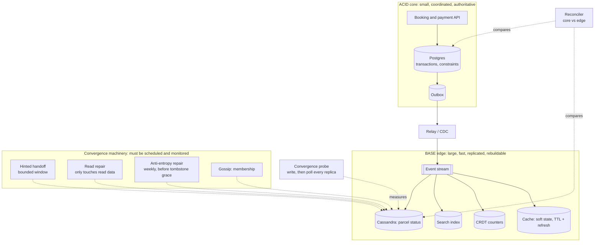
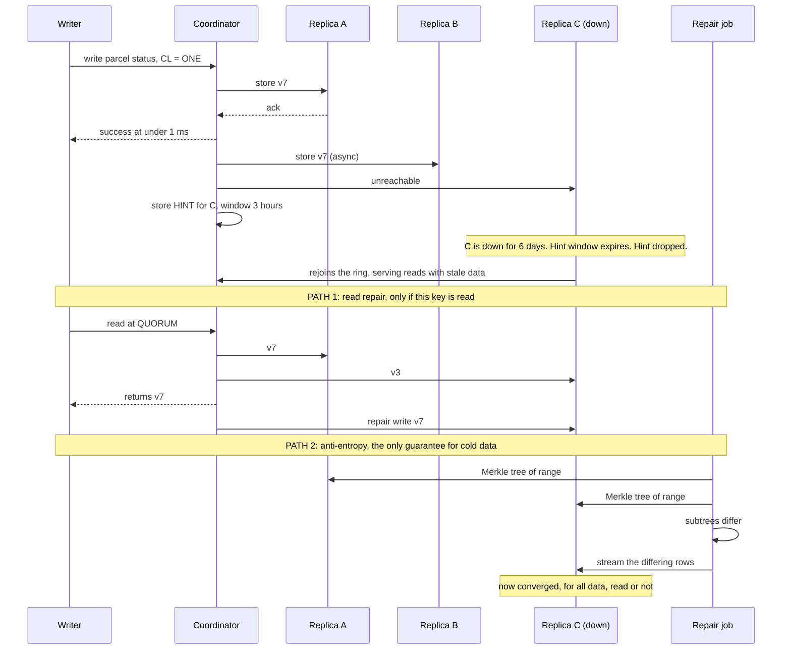

# Chapter 17: BASE

## 17.1 Problem Statement

The team has now been burned twice. Chapter 15 taught them that global coordination costs 90 milliseconds a write. Chapter 16 taught them that strict isolation costs serialization failures, deadlocks, and long-transaction bloat. So when they rebuild the parcel status service, they go the other way entirely: Cassandra, replication factor three per region, consistency level ONE, last-write-wins, no coordination anywhere.

The performance is genuinely excellent. Writes take under a millisecond. Reads take under a millisecond. It survives node failures without anybody noticing. For eleven weeks it is the best-behaved service they own.

Then someone asks a question nobody can answer: **is the data correct?**

**Replicas have been silently disagreeing for weeks.** A node was taken down for a hardware replacement and was out for six days. Cassandra holds hints for writes destined for an unreachable node, but only for a bounded window, three hours by default. Everything written after that window was simply never delivered to that node when it returned. Nobody scheduled a repair. The node came back, joined the ring, and started serving reads from a six-day-old view of some partitions.

**Deleted parcels came back to life.** A distributed store cannot delete by removing a row, because a replica that missed the delete would resurrect it on the next sync. So deletes are written as tombstones, markers that say "this is gone", and tombstones are garbage collected after a grace period, ten days by default. The rule is that you must run a full repair inside that window so every replica learns about the delete before the evidence is discarded. Nobody ran repairs. Records deleted for a customer under a data request reappeared.

**Concurrent scans vanished.** Last-write-wins again, this time not because of a partition but as a permanent design property. Two scans in the same millisecond, one survives.

**A cache of in-flight parcels evaporated.** They had built it as soft state with a TTL, refreshed by a background job. The job failed silently on a Friday. By Monday the cache was empty and the fallback path was hammering the database, because nobody had internalised that soft state means state that disappears unless something keeps renewing it.

**And a refund was issued twice.** They had extended the same design philosophy to the returns refund path. There is no rollback in this architecture, and nobody had written a compensation, so a retried refund became a second payment.

The line that makes this chapter necessary comes from the postmortem: *"It is eventually consistent, that is expected behaviour."*

Eventually never arrived. Not because the theory is wrong, but because **"eventually" is produced by machinery that has to be built, configured, scheduled, and monitored**, and nobody had done any of those things. That is the failure mode this chapter exists to prevent.

## 17.2 Why This Problem Exists

**BASE is read as permission rather than as a design brief.** ACID lists guarantees the database provides. BASE describes guarantees it does not, and that reads to many engineers as "correctness is not my problem here". The correctness work has not vanished. It has moved from the database into your application, your data model, and your operational schedule, and if nobody picks it up, it does not happen.

**"Eventually consistent" sounds like a property and is actually a process.** Convergence is produced by specific mechanisms: hinted handoff, read repair, anti-entropy repair, gossip. Each has configuration, each has failure modes, and several have windows that expire. A system that has these mechanisms and never runs them is not eventually consistent; it is permanently inconsistent with an optimistic name.

**Soft state is the letter nobody can define,** so nobody designs for it. It means state that decays and must be actively refreshed. Section 17.1's cache did exactly what soft state does, and the team was surprised because they thought of it as storage.

**The pendulum swings after every incident.** Chapter 16's team hit serialization failures and concluded strict isolation was unworkable. This chapter's team hit coordination costs and concluded coordination was unnecessary. Both are overcorrections, and both come from treating ACID and BASE as camps rather than as tools chosen per operation.

**And BASE gets applied uniformly to data that has different consequences.** A parcel status that is stale for four seconds harms nobody. A refund that is issued twice is money leaving the company. The same architecture covered both, because the choice was made once, for a service, rather than per operation according to what a wrong answer actually costs.

## 17.3 Real World Analogy

How a large office knows who is in today.

There is no central register. Nobody signs in. If you need to know whether Priya is in, you ask someone near her desk, or you look at whether her coat is there, or you check whether she has posted in a channel. The information spreads by people telling each other, it is available from many sources, and within about twenty minutes of her arriving everybody who cares knows.

That system is **basically available**: you can always get an answer from somebody, though it might be slightly out of date. It is **soft state**: yesterday's knowledge is worthless, and if people stop talking the information decays into uselessness. And it is **eventually consistent**: given a little time and continued conversation, everyone converges on the same picture.

It is also completely adequate. Nobody proposes a coordinated sign-in system, because the cost of being wrong for twenty minutes is that you walk to a desk and find it empty.

Now consider payroll.

Nobody runs payroll by asking around. There is one authoritative record, changes are made through a controlled process, every change is logged, and two people cannot be paid the same salary slot by accident. The cost of being wrong is money and a legal obligation, so the organisation pays for coordination.

Same building, same people, two completely different mechanisms, chosen by consequence rather than by philosophy. **That is the entire argument of this chapter.**

Two more details carry across precisely. The informal system only converges **because people keep talking**; a team that stops communicating for a week does not have eventually consistent knowledge, it has stale knowledge, and that is Section 17.1's unrepaired node. And when the informal system is wrong in a way that matters, the fix is not a rollback but a **correction**: you apologise, you send a follow-up, you undo the consequence. There is no way to un-know something, only to say the right thing afterwards.

## 17.4 Simple Explanation

BASE was coined as a deliberate counterpoint to ACID, complete with the chemistry pun, by researchers at Berkeley including Eric Brewer, and popularised later as a design approach for systems that prioritise availability and scale.

| Letter | Stands for | Means |
|---|---|---|
| **BA** | Basically Available | The system responds to every request, though the answer may be stale, partial, or degraded |
| **S** | Soft state | State may change over time without new input, and it decays unless refreshed |
| **E** | Eventually consistent | If writes stop, all replicas converge to the same value |

The comparison people usually draw:

| | ACID | BASE |
|---|---|---|
| Guarantees | Strong, immediate | Weak, deferred |
| Availability | May refuse to preserve correctness | Answers, possibly imperfectly |
| Consistency | At commit time | Later, if the machinery runs |
| Undo | Rollback | Compensation |
| Correctness lives in | The database | **Your application and your operations** |
| Best for | Money, inventory, identity, anything scarce | Feeds, counts, statuses, catalogues, telemetry |

That bottom-but-one row is the thesis of the chapter, and it deserves stating outright:

> **BASE does not reduce the amount of correctness work. It moves it out of the database and into your code, your data model, and your operational schedule.**

Choosing BASE is choosing to do that work yourself, in exchange for availability, latency, and scale. Choosing it and *not* doing the work is not a trade-off; it is simply an unreliable system with a fashionable label.

## 17.5 Technical Deep Dive

### 17.5.1 Soft state, properly

Basically available and eventually consistent are widely understood. Soft state is the one that gets skipped, and it is the one that caused Section 17.1's vanishing cache.

**Soft state is state that will disappear or become invalid unless something actively maintains it.** In a strongly consistent store, data written is data present until deleted. In a soft-state system, data has an expiry, a lease, or a repair requirement, and its continued existence depends on ongoing work.

Where soft state shows up:

| Mechanism | Decays because | Maintained by |
|---|---|---|
| Cache entries with a TTL | Time passes | Re-population on miss, or a refresh job |
| Cluster membership via gossip | Nodes stop being heard from | Continuous heartbeat exchange |
| Session tokens and leases | Deliberate expiry | Renewal before the deadline |
| Hinted handoff buffers | Bounded hint window | Delivery, or a repair if the window expires |
| Tombstones | Grace period | Repair within the grace period |
| Derived views and projections | Source changes | The replay or update pipeline |
| Service registry entries | Registration expires | Periodic re-registration |

Two design consequences follow, and both are counterintuitive to anyone used to a database.

**Absence is not evidence.** In a soft-state system, "the value is not there" can mean it was never written, it was deleted, or it expired because a refresh process failed. Those are very different situations, and code that treats a missing value as "does not exist" will behave incorrectly on the third one, which is exactly what happened to Section 17.1's fallback path.

**Every soft-state mechanism needs a liveness alarm.** If a refresh job stops, the state does not fail loudly; it fades. The monitoring must be on the maintenance process and on the age of the state, not on errors, because there will not be any. This is Chapter 11's fail-silent category, applied to storage.

### 17.5.2 Where "eventually" actually comes from

Convergence is not automatic. It is produced by four mechanisms, and each one has to be configured and operated. Understanding them is what separates using an eventually consistent store from hoping.

**1. Hinted handoff.** When a replica is unreachable, the coordinator stores a hint locally and delivers it when the node returns.

```
Node C is down. A write arrives for a key whose replicas are A, B, C.
A and B store the value. A also stores a hint: "C owes this write."
C returns. A delivers the hint. C is now current.

The catch: hints are kept for a bounded window, commonly about 3 hours.
A node down longer than the window comes back MISSING those writes
and nothing will notice unless a repair runs.
```

**2. Read repair.** On a read that touches several replicas, the coordinator notices disagreement and fixes it.

```
Read at QUORUM: A says v5, B says v3.
Coordinator returns v5 and writes v5 back to B.

The catch: it only repairs data that is actually read. Cold data,
which is most data, is never repaired this way.
```

**3. Anti-entropy repair.** A scheduled background comparison of replicas, usually using Merkle trees so that entire ranges can be compared with a handful of hashes rather than by transferring everything.

```
Each replica builds a hash tree over its data ranges.
Replicas exchange root hashes; matching subtrees are skipped entirely.
Only ranges that differ are compared in detail and reconciled.

This is the mechanism that guarantees convergence for cold data,
and it is the one Section 17.1's team never scheduled.
```

**4. Gossip.** Nodes periodically exchange membership and state information with random peers, so knowledge of who is alive spreads without a coordinator.

Now the operational rule that ties these together, and it is the single most important paragraph in this chapter:

> **Deletes are the dangerous case.** A distributed store cannot delete by removing data, because a replica that missed the delete would re-propagate the row as if it were new. So a delete writes a tombstone, and tombstones are eventually garbage collected. **If a full repair does not run before the tombstone is collected**, a replica that never learned about the delete can resurrect the record. Cassandra's grace period defaults to ten days, and the requirement is explicit: run repair inside it.

That is why Section 17.1's deleted records came back. Not a bug, not a surprising edge case: a documented operational requirement that nobody had scheduled.

```
Minimum operational schedule for an eventually consistent store:

  - Full repair on every node, on a schedule shorter than the tombstone
    grace period. Weekly, if grace is ten days.
  - Alert if any node has not completed a repair inside that window.
  - Alert if a node has been down longer than the hint window, and repair
    it explicitly when it returns.
  - Track and alert on replica divergence, not just node liveness.
```

### 17.5.3 What BASE requires you to build

The concrete list. Every item here is work the database was doing for you under ACID, which now belongs to you.

| ACID gave you | Under BASE you must build |
|---|---|
| Atomic multi-item writes | Idempotent operations plus compensation for partial completion |
| Isolation between concurrent writers | A conflict resolution strategy per data type |
| Rollback on failure | Compensating actions that semantically undo |
| Constraints enforcing invariants | Application checks, plus reconciliation to catch violations |
| A single authoritative value | Convergence machinery, scheduled and monitored |
| Read-after-write | Session guarantees, from Chapter 15 |
| "The data is correct" | Divergence measurement, because otherwise nobody knows |

Two of these deserve expansion.

**Conflict resolution per data type.** Last-write-wins is the default in several systems and is a data loss mechanism, as Chapter 14 established. The alternatives, in rough order of preference:

```
1. Make conflicts impossible.  Model facts as append-only events; two scans
                               union rather than conflict. Best answer by far.
2. CRDTs.                      Counters, sets, and registers with merge functions
                               that are commutative, associative, and idempotent,
                               so any order of merging gives the same result.
3. Version vectors + siblings. Detect concurrency, keep both, merge in the
                               application with domain knowledge.
4. Last write wins.            Only for idempotent overwrites from a single
                               authoritative writer.
```

**Compensation instead of rollback.** This is the structural difference between ACID and BASE, and it is more than a technique; it is a different way of modelling failure.

```
ACID:   BEGIN, do three things, something fails, ROLLBACK.
        The system returns to a state as if nothing happened.

BASE:   Do three things as separate steps. Step three fails.
        Steps one and two already happened and are visible to others.
        You cannot un-happen them. You issue corrections:
          - reverse the reservation
          - credit the charge
          - send a notification explaining
        The system moves FORWARD into a corrected state.
```

Designing a compensation is real work, and the checklist is short but strict:

- **Is it possible at all?** You cannot un-send an email, only send a correction. You cannot un-ship a parcel, only recall it.
- **Is it idempotent?** Compensations get retried, and a refund applied twice is the failure it was meant to fix.
- **Is it ordered correctly?** Compensate in reverse order of the original steps.
- **What if the compensation itself fails?** Escalate to a human queue rather than retrying forever.
- **What did others see in the meantime?** There is no isolation, so intermediate states were visible and may already have been acted upon.

Chapter 59 turns this into the saga pattern. The principle belongs here, because it is what BASE substitutes for the A in ACID.

### 17.5.4 Where BASE fits, and where it is an excuse

The decision is per data type, and it comes from one question:

> **What does a stale, duplicated, or lost answer actually cost?**

| Data | Cost of being wrong briefly | Choose |
|---|---|---|
| Parcel status on a tracking page | A customer sees a four second old status | BASE |
| View counts, like counts | The number is slightly off | BASE, and CRDT counters |
| Product catalogue, descriptions | Stale copy for a minute | BASE |
| Search index | A new item is missing for ten seconds | BASE |
| Social feed | Posts arrive slightly out of order | BASE |
| Telemetry and analytics | A few events lost or duplicated | BASE |
| Session data, preferences | Rare surprise for one user | BASE with session guarantees |
| **Account balance** | Overdraft, real money | **ACID** |
| **Inventory of a scarce item** | Oversold, cannot fulfil | **ACID** |
| **Seat, slot, or room booking** | Two customers, one seat | **ACID** |
| **Payment and refund** | Money moves twice | **ACID**, and compensations if it must span services |
| **Unique identifiers** | Duplicate invoice number breaks integrations | **ACID** |
| **Authorisation and permissions** | Someone accesses what they should not | **ACID**, fail closed |

The pattern is clear once you look at the right column: **BASE suits data that describes the world, and ACID suits data that allocates scarce or irreversible things.** A parcel's status is an observation, and two observers disagreeing for a moment costs nothing. A slot is a resource, and two claimants is a real-world problem no amount of convergence fixes.

The honest test for whether BASE is being chosen or invoked as an excuse:

```
Ask: "when the replicas disagree, what happens, and how do we find out?"

A real BASE design answers: they converge via repair on this schedule,
conflicts resolve by this rule, divergence is measured by this metric,
and here is the alert threshold.

An excuse answers: "it is eventually consistent."
```

### 17.5.5 ACID and BASE in the same system

The framing as opposing camps is a historical artefact. Real systems use both, chosen per operation, and the standard shape is worth knowing because almost every large system converges on it.

```
                 ACID CORE                          BASE EDGE
   (small, coordinated, authoritative)      (large, fast, replicated)

   orders, payments, inventory,             tracking status, search index,
   bookings, identity, ledgers              feeds, counts, caches, analytics
              |                                          ^
              |  events (outbox, Chapter 11)             |
              +------------------------------------------+
                    one directional flow of truth
```

The rules that make this work:

**Truth flows from the ACID core outward.** The authoritative record lives in a transactional store; derived views are populated from its event stream and are rebuildable, which is Chapter 12's point about only needing expensive durability for sources.

**The core is kept small.** Every entity you can move to the edge is one fewer thing paying coordination costs. The discipline is to ask what genuinely allocates something scarce.

**The edge never writes back to the core** without going through the core's own transactional path. A derived view that becomes a source of truth is how divergence becomes permanent.

**Each boundary crossing is idempotent**, because the event stream is at-least-once, which is Chapter 11 again.

Section 17.1's mistake in these terms was putting refunds at the edge. Refunds allocate money, which is scarce and irreversible, so they belong in the core, and the fact that the rest of the service was correctly BASE made it easy not to notice.

### 17.5.6 Measuring convergence

"Eventually consistent" without measurement is "hopefully consistent". These are the metrics that turn it into an engineering property.

| Metric | What it tells you | Alert when |
|---|---|---|
| Replica divergence rate | Fraction of keys where replicas disagree | Above a small baseline, or trending up |
| Time since last successful full repair, per node | Whether convergence machinery is running | Approaching the tombstone grace period |
| Hint delivery backlog and drop count | Writes owed to unreachable nodes | Any drops, since dropped hints need repair |
| Nodes down longer than the hint window | Which nodes need explicit repair | Any occurrence |
| Convergence lag, p99 | How long "eventually" actually takes | Exceeding your stated bound |
| Conflict rate by data type | Where your model creates conflicts | Rising, which indicates a modelling problem |
| Sibling count per key | Unresolved concurrent versions accumulating | Growth without bound |
| Reconciliation mismatches | Divergence between the core and derived views | Any sustained mismatch |
| Soft state age and refresh success | Whether maintenance processes are alive | Refresh failures, or age exceeding TTL |

A worth-stating SLI, because it converts a vague promise into something with a target:

```
Convergence SLI:
  99.9 percent of writes are visible on all replicas within 5 seconds
  100 percent within 60 seconds
  measured by a probe that writes a known value and polls every replica

If you cannot state a bound, you have not chosen eventual consistency.
You have chosen unknown consistency.
```

That probe is cheap to build and it is the difference between Section 17.1 finding its problem in eleven minutes and finding it in eleven weeks.

## 17.6 Architecture Diagram

The ACID core with the BASE edge, and the convergence machinery drawn explicitly, because that machinery is the part people forget exists.



ASCII version:

```
 ACID CORE                                BASE EDGE
  booking / payment API                    parcel status (Cassandra)
        |                                  search index
   Postgres (transactions, constraints)    CRDT counters
        |                                  cache (soft state: TTL + refresh job)
     outbox                                        ^
        |                                          |
      relay / CDC ---> event stream ---------------+
                                                   |
 CONVERGENCE MACHINERY (schedule it, monitor it)   |
   hinted handoff   bounded window, drops silently |
   read repair      only fixes data that is read   |
   anti-entropy     weekly full repair, MUST run   |
                    inside tombstone grace period  |
   gossip           membership                     |
                                                   |
 MEASUREMENT                                       |
   convergence probe: write, poll all replicas ----+
   reconciler: compare core against edge, alert on mismatch
```

Four things to read off it.

**The core is small on purpose.** Only things that allocate scarce or irreversible resources live there. Everything else is derived and rebuildable.

**Truth flows one way.** The edge is populated from the core's event stream, so a divergent edge can be repaired by replay. Had refunds lived at the edge, there would have been nothing to replay from.

**The convergence box is drawn as a first-class component,** because that is exactly what Section 17.1 treated as an implementation detail. Three of its four mechanisms have windows that expire.

**And measurement is on the diagram.** A convergence probe and a reconciler, because the difference between eventual consistency and permanent inconsistency is not visible without them.

## 17.7 Request Flow

A single write in a BASE store, followed through every path by which convergence can happen. This is where "eventually" actually comes from.



Step by step, with what each path does and does not guarantee:

1. **The write is acknowledged after one replica.** This is where the sub-millisecond latency comes from, and it is also the moment the system takes on an obligation to converge later.
2. **Other replicas are updated asynchronously.** Best effort, and it usually works.
3. **An unreachable replica gets a hint,** which is a promise to deliver later. Hints are the first line of convergence and they cover short outages only.
4. **The hint window expires.** This is the silent failure. No error is raised, the hint is discarded, and the system now has a divergence that only repair can fix.
5. **The node returns and serves stale data,** because nothing in the join process checks whether it missed anything.
6. **Read repair fixes hot data.** It is effective and it is not a guarantee, because it only ever touches keys that someone reads. Most keys are cold.
7. **Anti-entropy repair is the only mechanism that guarantees convergence for all data.** It is scheduled, it is expensive, and it is the one Section 17.1's team never ran.

The essential observation: **three of the four convergence paths are best-effort, and the guaranteed one is a cron job.** If that cron job is not scheduled and monitored, the word "eventually" in your architecture document is doing no work at all.

## 17.8 Internal Components

| Component | Role | Failure mode | Guard |
|---|---|---|---|
| Hinted handoff | Covers short node outages | Window expires silently, hints dropped | Alert on hint drops and on nodes down beyond the window |
| Read repair | Fixes divergence on hot keys | Never touches cold data | Do not rely on it for correctness |
| Anti-entropy repair | The actual convergence guarantee | Not scheduled, or fails silently | Schedule inside the tombstone grace period; alert per node on time since last success |
| Tombstones | Make deletes propagate | Collected before all replicas learned, so data resurrects | Full repair inside the grace period, without exception |
| Gossip | Membership knowledge | Slow convergence during churn | Monitor membership disagreement |
| Conflict resolution | Decides which value wins | Last-write-wins deletes real data | Union for events, CRDTs, or siblings with a domain merge |
| Version vectors | Detect concurrency rather than guess | Not enabled, so concurrency is invisible | Prefer over timestamps wherever available |
| Compensations | Replace rollback | Not written, or not idempotent | Design per operation; test them; escalate failures to humans |
| Idempotency keys | Make retries safe | Absent, so at-least-once becomes duplicates | Chapter 20, and a unique constraint |
| Soft state refresh jobs | Keep decaying state alive | Fail silently; state fades rather than errors | Alert on refresh success and on state age |
| Convergence probe | Measures whether "eventually" happens | Not built, so divergence is invisible | Write a known value, poll all replicas, publish an SLI |
| Reconciler | Compares the core with derived views | Not built, so drift is permanent | Scheduled comparison with an alert threshold |

The last two rows are the ones that separate Section 17.1 from a working system, and they are also the two that do not appear in any vendor quickstart.

## 17.9 Production Example

**Pritchett's article, "BASE: An Acid Alternative", is the canonical practical treatment** and remains the clearest statement of what choosing BASE actually obliges you to do. The design guidance it gives is concrete: decouple operations that would have been a single transaction by putting a durable queue between them, make every step idempotent so retries are safe, order operations so that the most important effect happens first, and accept that other parties will observe intermediate states. That is Section 17.5.3's list, written a decade and a half ago, and the fact that it needs restating says something about how BASE is usually adopted.

**Dynamo's design is where the convergence machinery comes from.** The paper describes an always-writable store that uses vector clocks to detect concurrent versions rather than guessing with timestamps, sloppy quorums with hinted handoff so writes succeed even when the natural replicas are unreachable, Merkle trees for efficient anti-entropy between replicas, and gossip for membership. The important thing to notice is the proportion: a large part of that design is not about the fast path at all. It is about the machinery that makes "eventually" true, which is exactly the part that gets skipped when teams adopt an eventually consistent store because it is fast.

**Cassandra's operational requirements make the obligation explicit,** and its documentation is unusually direct about it. Hints are retained for a bounded window, and a node down for longer must be repaired. Tombstones are retained for a grace period, and a full repair must complete inside that period on every node, or deleted data can be resurrected by a replica that never learned about the delete. These are not obscure edge cases; they are the documented contract of the system, and they are the most common source of production surprises for teams new to it.

The general lesson from all three: **an eventually consistent store is a system you operate, not merely a system you deploy.** The fast path is easy and the maintenance schedule is the product.

## 17.10 Advantages

- **Availability during failures.** Writes succeed when replicas are unreachable, which is the property Chapter 14's shop could not have.
- **Latency, because nothing waits for coordination.** Chapter 15's arithmetic in reverse: no round trips means no distance cost.
- **Horizontal scale without a coordination bottleneck,** since there is no leader and no quorum on the write path.
- **Partition survival**, with all sides continuing to serve.
- **Independent evolution of components,** because they are coupled by events rather than by transactions.
- **Cost.** No global coordination means fewer cross-region round trips, which is directly less bandwidth and less latency-driven capacity.
- **It matches how a lot of data actually behaves.** Observations, counts, and statuses do not need to be allocated atomically, and pretending otherwise buys nothing.

## 17.11 Limitations

- **Correctness work moves to you**, and it is more work than the database was doing, not less.
- **Convergence must be operated.** Repairs scheduled, windows respected, drops alerted on. Miss it and you have permanent inconsistency.
- **Conflict resolution is per data type,** and getting it wrong destroys data silently.
- **No rollback.** Compensation is harder, sometimes impossible, and always visible to other parties.
- **Intermediate states are observable,** so other components can act on states that a transaction would have hidden.
- **Debugging is harder.** "Which replica did that read come from, and how far behind was it" is a question you now have to be able to answer.
- **It cannot allocate scarce resources.** No amount of convergence prevents two people getting the last seat.
- **The label invites laziness.** "Eventually consistent" is an easy answer to a hard question, and it sounds like a decision.

## 17.12 Trade-offs

| Dial | One way | The other way |
|---|---|---|
| Consistency model | ACID: correct, coordinated, bounded scale | BASE: available, fast, correctness is your job |
| Conflict resolution | Last write wins: trivial, silently loses data | CRDTs or siblings: correct, real work per type |
| Repair frequency | Frequent: fast convergence, ongoing load | Infrequent: cheaper, longer divergence and tombstone risk |
| Hint window | Long: covers longer outages, more storage on coordinators | Short: less overhead, more reliance on repair |
| Core size | Large ACID core: simpler reasoning, more coordination cost | Small core: cheap and scalable, more compensation logic |
| Undo strategy | Rollback: clean, requires a transaction boundary | Compensation: works across services, visible intermediate states |
| Staleness bound | Tight: better experience, more repair and read cost | Loose: cheap, users may notice |
| Measurement | Convergence probe and reconciler: known behaviour, extra components | None: cheaper, and you do not know whether the system is correct |

The removal test.

**Remove scheduled anti-entropy repair.** You gain the cluster load that repairs consume, which is not trivial. You lose the only guarantee that cold data converges, and you acquire the tombstone resurrection hazard. This is the cheapest thing to skip and the most expensive thing to have skipped.

**Remove the convergence probe and the reconciler.** You gain two small components. You lose all knowledge of whether your system is correct, which is how eleven weeks pass. Chapter 11's argument applies exactly: without an independent check, wrongness is invisible.

**Remove compensations and rely on retries.** You gain simpler code. You lose the ability to recover from partial completion, so a failure in step three of five leaves the system in a state nobody designed, permanently.

**Remove the ACID core and make everything BASE.** You gain uniformity and maximum availability. You lose the ability to allocate anything scarce, which means overselling, double-booking, and duplicate refunds. Section 17.1's refund bug is this trade taken without noticing.

## 17.13 Common Mistakes

**Treating BASE as permission to skip correctness design.** The work moved; it did not disappear.

**Not scheduling repairs,** which turns eventual consistency into permanent divergence and risks resurrecting deleted data.

**Ignoring the hint window.** A node down longer than the window comes back missing writes, silently.

**Last-write-wins by default,** which resolves conflicts by discarding one of two real writes.

**Applying BASE to scarce resources:** inventory, seats, balances, unique identifiers, refunds. Convergence cannot un-sell a seat.

**Treating soft state as storage.** It decays, and a failed refresh job produces silent emptiness rather than an error.

**No convergence measurement.** Without a probe and a bound, "eventually" is unfalsifiable.

**Compensations that are not idempotent,** so the correction is applied twice and becomes the new problem.

**Assuming intermediate states are invisible.** There is no isolation, so other components see and act on half-finished work.

**Letting the derived edge become a source of truth,** at which point divergence is unrepairable because there is nothing authoritative to replay from.

**Choosing per service instead of per data type.** One service usually contains both kinds of data.

**Reading absence as non-existence,** when it may be expiry, a failed refresh, or a missed replication.

## 17.14 Interview Questions

**Q: What does BASE stand for, and what is it a reaction to?**
Basically Available, Soft state, Eventually consistent. It was coined as a deliberate counterpoint to ACID for systems that prioritise availability and scale over immediate consistency, on the grounds that for a lot of data, being briefly wrong costs less than being unavailable.

**Q: What is soft state, specifically?**
State that decays and must be actively refreshed to remain valid: cache entries with a time to live, leases, gossip-based membership, hinted handoff buffers, tombstones. The design consequence is that absence is ambiguous, since a missing value may mean never written, deleted, or expired because a maintenance process failed, and that every soft-state mechanism needs an alarm on its refresh process rather than on errors.

**Q: Does BASE mean less work than ACID?**
No, more. It relocates the work from the database into your application, data model, and operations. You now own idempotency, conflict resolution, compensation, convergence scheduling, and divergence measurement, all of which a transactional database was providing.

**Q: Where does "eventually" actually come from?**
Four mechanisms: hinted handoff for short outages, read repair for data that happens to be read, scheduled anti-entropy repair using Merkle trees, and gossip for membership. Three are best effort. Anti-entropy is the only one that guarantees convergence for cold data, and it is a scheduled job that must be monitored.

**Q: Why can deleted data come back in an eventually consistent store?**
Because deletes are written as tombstones rather than removals, so replicas that missed the delete learn about it from the tombstone. Tombstones are garbage collected after a grace period, and if a full repair has not propagated the delete to every replica before then, a replica that still holds the original row will re-propagate it as live data.

**Q: When is BASE the wrong choice?**
Whenever the data allocates something scarce or irreversible: inventory, seats, account balances, unique identifiers, payments and refunds, and authorisation decisions. Convergence resolves disagreement about a value; it cannot resolve two customers holding the same physical item.

**Q: What replaces rollback?**
Compensating actions that semantically undo, moving the system forward into a corrected state rather than back to a prior one. They must be idempotent, applied in reverse order, and able to escalate to a human when they themselves fail. Intermediate states were visible to others in the meantime, which rollback would have prevented.

**Q: How do you know your eventually consistent system is actually converging?**
Measure it. A probe that writes a known value and polls every replica, publishing a convergence SLI such as 99.9 percent visible within five seconds. Plus time since last successful repair per node, hint drop counts, divergence rate, and a reconciler comparing derived views against the authoritative store.

**Q: Can ACID and BASE coexist?**
They usually should. Keep a small transactional core for things that allocate scarce or irreversible resources, publish events from it via an outbox, and build large, fast, rebuildable derived views at the edge. Truth flows outward, the edge never writes back directly, and each boundary crossing is idempotent.

**Q: A colleague explains a data inconsistency by saying "it is eventually consistent". What do you ask?**
When, specifically, and how do we know. Ask for the convergence bound, the repair schedule and when it last completed on every node, the conflict resolution rule for that data type, and the metric that would have detected this. If those do not exist, the system is not eventually consistent; it is unmeasured.

## 17.15 Production Best Practices

1. **Choose per data type, not per service,** using the cost of a stale, duplicated, or lost answer.
2. **Keep a small ACID core** for anything that allocates a scarce or irreversible resource.
3. **Let truth flow outward** from the core via an outbox and events, and never let derived views write back directly.
4. **Schedule anti-entropy repair** on every node, inside the tombstone grace period, and alert on time since last success.
5. **Alert on hint drops** and on any node down longer than the hint window.
6. **Never use last-write-wins** unless the write is an idempotent overwrite from a single authoritative writer.
7. **Model facts as append-only events** so concurrent writes union instead of conflicting.
8. **Use CRDTs for counters and sets** where they fit, rather than read-modify-write.
9. **Write compensations before you need them,** make them idempotent, and test them.
10. **Treat soft state as perishable:** monitor refresh success and state age, and never read absence as non-existence.
11. **Publish a convergence SLI** with a stated bound, backed by a probe.
12. **Run a reconciler** comparing the core against derived views, with an alert threshold.
13. **Make every boundary crossing idempotent,** because event delivery is at-least-once.
14. **Write the answers down** to what happens when replicas disagree, so that "eventually consistent" is a design rather than a phrase.

## 17.16 Summary

BASE stands for basically available, soft state, and eventually consistent, and it was coined as a deliberate counterpoint to ACID for systems that would rather answer imperfectly than not answer at all. For a great deal of data that is exactly the right trade: statuses, counts, catalogues, feeds, and telemetry describe the world, and two observers disagreeing for four seconds costs nothing.

The thesis of this chapter is that BASE does not reduce the amount of correctness work; it relocates it. Atomicity becomes idempotency plus compensation. Isolation becomes a conflict resolution strategy per data type. Rollback becomes semantic undo that moves forward rather than back. Constraints become application checks plus reconciliation. And the single authoritative value becomes convergence machinery that must be scheduled, configured, and monitored. Choosing BASE and skipping that list is not a trade-off, it is an unreliable system with a label on it.

Soft state is the letter that gets ignored and it deserves attention, because it means state that decays unless something actively refreshes it. In such a system absence is ambiguous, maintenance processes fail silently rather than loudly, and the monitoring has to be on the age of the state and the liveness of the refresher.

The machinery behind "eventually" is worth knowing concretely. Hinted handoff covers short outages and has a window that expires. Read repair fixes what is read, which excludes most data. Gossip spreads membership. Anti-entropy repair is the only mechanism that guarantees convergence for cold data, and it is a scheduled job, which means eventual consistency is an operational commitment rather than a property of the software. Deletes make this urgent, because tombstones expire and a replica that never learned about a delete will resurrect the record.

Finally, the useful shape is not a choice between camps. Keep a small transactional core for anything that allocates scarce or irreversible things, publish events outward, and build large, fast, rebuildable views at the edge. Then measure convergence, because eventual consistency without a bound and a probe is not a design decision. It is a hope with a technical-sounding name.

## 17.17 Quick Revision Notes

- BASE: Basically Available, Soft state, Eventually consistent. Coined as the counterpoint to ACID.
- Thesis: BASE relocates correctness work into your application, data model, and operations. It does not remove it.
- Soft state: state that decays unless refreshed. Caches, leases, gossip, hints, tombstones, derived views.
- In soft-state systems, absence is ambiguous: never written, deleted, or expired due to a failed refresher.
- Convergence comes from four mechanisms: hinted handoff (bounded window), read repair (hot data only), anti-entropy repair (the real guarantee), gossip (membership).
- Anti-entropy uses Merkle trees to compare ranges cheaply. It must be scheduled.
- Tombstones make deletes propagate. If a full repair does not run inside the grace period, deleted data can resurrect.
- A node down longer than the hint window comes back missing writes, with no error raised.
- What you must build under BASE: idempotency, conflict resolution per data type, compensations, convergence scheduling, divergence measurement, session guarantees.
- Conflict resolution preference: make conflicts impossible (append-only events), then CRDTs, then version vectors with siblings, then last-write-wins as a last resort.
- Compensation replaces rollback. It must be idempotent, reverse-ordered, and able to escalate to a human.
- Intermediate states are visible under BASE. Other components may act on them.
- BASE suits data that describes the world. ACID suits data that allocates scarce or irreversible things.
- Standard shape: small ACID core, outbox and events, large rebuildable BASE edge. Truth flows outward only.
- Publish a convergence SLI with a bound and a probe. Without measurement, "eventually consistent" is unfalsifiable.
- Choose per data type, not per service. One service usually contains both kinds.

## 17.18 Mini Quiz

1. What does soft state mean, and why does it make a missing value ambiguous?
2. Name the four mechanisms that produce convergence, and say which one is the actual guarantee.
3. Why can a deleted record reappear, and what operational rule prevents it?
4. A node is down for five days with a three hour hint window. What is its state when it returns, and what error is raised?
5. Classify each as ACID or BASE and justify: like count on a post; seat reservation; product description; refund; unique order number; delivery status.
6. What does BASE replace rollback with, and give three properties that replacement must have.
7. Your colleague says a data discrepancy is fine because the system is eventually consistent. What four questions do you ask?
8. Why is last-write-wins a poor default, and when is it acceptable?
9. Describe the standard architecture that combines both models, and state the rule about which direction data flows.
10. What single metric would have caught Section 17.1's problem in minutes rather than weeks?

**Answers**

1. Soft state is state that decays or expires unless something actively refreshes it, such as cache entries with a time to live, leases, gossip membership, hints, and tombstones. A missing value is ambiguous because it can mean the value was never written, was deliberately deleted, or expired because a refresh process failed silently. Code that treats absence as non-existence will behave incorrectly in the third case, and the monitoring must therefore watch state age and refresher liveness rather than errors.
2. Hinted handoff, read repair, anti-entropy repair, and gossip. Anti-entropy repair is the actual guarantee, because hinted handoff only covers outages shorter than its window, read repair only fixes keys that are actually read, and gossip carries membership rather than data. Anti-entropy is a scheduled job, which is why eventual consistency is an operational commitment.
3. Because deletes are recorded as tombstones rather than by removing data, so replicas that missed the delete can learn about it later. Tombstones are garbage collected after a grace period, and if a replica still holding the original row has not received the tombstone before it is collected, that replica will propagate the row back as live data. The rule is to run a full repair on every node within the tombstone grace period, without exception.
4. It returns holding data from five days ago for any partitions it owns, because hints for it were dropped once the three hour window expired. No error is raised: it rejoins the ring and begins serving stale reads. Only an explicit repair will bring it current, which is why nodes down longer than the hint window must trigger an alert and a repair.
5. Like count: BASE, and ideally a CRDT counter, since being briefly off costs nothing. Seat reservation: ACID, because it allocates a scarce physical resource and double-booking cannot be resolved by convergence. Product description: BASE, since a stale description for a minute is harmless. Refund: ACID, or a saga with compensations if it must span services, because it moves money irreversibly. Unique order number: ACID, since duplicates break downstream integrations permanently. Delivery status: BASE, as it is an observation of the world.
6. Compensating actions that semantically undo by moving the system forward into a corrected state. They must be idempotent, since they will be retried; applied in reverse order of the original operations; and able to escalate to a human queue when the compensation itself fails rather than retrying indefinitely. It is also worth noting that intermediate states were visible to others, so a compensation may need to notify parties who already acted.
7. When specifically, meaning what is the convergence bound and is there a probe measuring it. When did a full repair last complete on every node. What is the conflict resolution rule for this data type and could it have discarded a real write. Which metric would have detected this, and why did it not fire. If those questions have no answers, the system is not eventually consistent, it is unmeasured.
8. Because it resolves conflicts by silently discarding one of two genuine writes, with no record that anything was lost, and clock skew between nodes means the surviving value may not even be the later one. It is acceptable only when the write is an idempotent overwrite of a value with a single authoritative writer, where a later write always legitimately supersedes an earlier one and nothing is computed from prior state.
9. A small transactional core holding anything that allocates scarce or irreversible resources, publishing events through an outbox, feeding a large, fast, rebuildable set of derived views at the edge such as search indexes, status stores, counters, and caches. Data flows in one direction only, outward from the core; the edge must never write back to the core except through the core's own transactional path, because a derived view that becomes authoritative makes divergence unrepairable.
10. A convergence probe: write a known value, poll every replica, and publish the time until all agree as an SLI with a stated bound. It would have shown divergence exceeding the bound immediately after the hint window expired. A close second is time since last successful repair per node, which would have alerted well before the tombstone grace period elapsed.

## 17.19 Hands-on Exercise

**Part 1: build the divergence.** Run a three-node Cassandra cluster with replication factor three. Write a few thousand records at consistency level ONE. Stop one node, write several thousand more, and leave it down for longer than the configured hint window. Bring it back, then read directly from that node with consistency level ONE and count how many records are missing. Note that nothing anywhere reported an error.

**Part 2: watch the repair paths.** With the divergence in place, read a subset of the affected keys at QUORUM and then re-check the stale node, confirming that read repair fixed only what you read. Then run a full repair and confirm that everything converges, including the keys nobody touched. Time the repair, since that duration is an operational cost you now own.

**Part 3: resurrect deleted data.** Delete a set of records while one node is down, wait past the hint window, bring the node back, and reduce the tombstone grace period to something small for the experiment. Force compaction, then read. Observe deleted records returning. This is the single most valuable experiment in the chapter, because reading about it never quite lands.

**Part 4: build the probe.** Write a small service that writes a unique value with a timestamp, then polls every replica directly until all agree, recording the elapsed time. Publish a percentile. Run it continuously while you repeat Part 1, and confirm the probe detects the divergence within seconds.

**Part 5: write a compensation.** Take a two-step operation such as reserving a slot and charging for it. Implement it without transactions, make both steps idempotent with keys, then deliberately fail the second step and implement the compensation for the first. Now fail the compensation and decide what happens. Write down that decision, since it is the part that is always missing when this pattern appears in production.

## 17.20 Further Reading

- *BASE: An Acid Alternative*, Dan Pritchett, ACM Queue, 2008. The canonical practical guide, with concrete advice on decoupling with queues, idempotency, and ordering of operations.
- *Cluster-Based Scalable Network Services*, Fox, Gribble, Chawathe, Brewer and Gauthier, SOSP 1997. Where the ACID and BASE contrast originates, along with harvest and yield.
- *Dynamo: Amazon's Highly Available Key-value Store*, DeCandia et al., SOSP 2007. The convergence machinery in full: vector clocks, sloppy quorums, hinted handoff, Merkle trees, gossip.
- Cassandra's operational documentation on repair, hinted handoff, and tombstones. Read the sections on grace periods and repair scheduling as a contract rather than as advice.
- *Designing Data-Intensive Applications*, Martin Kleppmann, chapter 5, on leaderless replication, read repair, anti-entropy, and quorum behaviour.
- *A Comprehensive Study of Convergent and Commutative Replicated Data Types*, Shapiro et al., 2011. The formal basis for CRDTs, and the reason some conflicts can be made to disappear entirely.
- *Life Beyond Distributed Transactions: An Apostate's Opinion*, Pat Helland. On designing systems where transactions cannot span everything, and what replaces them.
- Werner Vogels, *Eventually Consistent*, ACM Queue 2008. A short and clear statement of the model and its client-side variants from someone who had to operate it.

---

**Next chapter: Chapter 18, Eventual Consistency.** The model itself, in detail: what convergence actually guarantees, the family of weaker and stronger models between eventual and linearizable, and how to choose the specific guarantee an operation needs rather than accepting the weakest one available.
