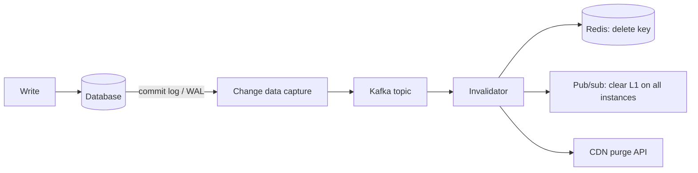
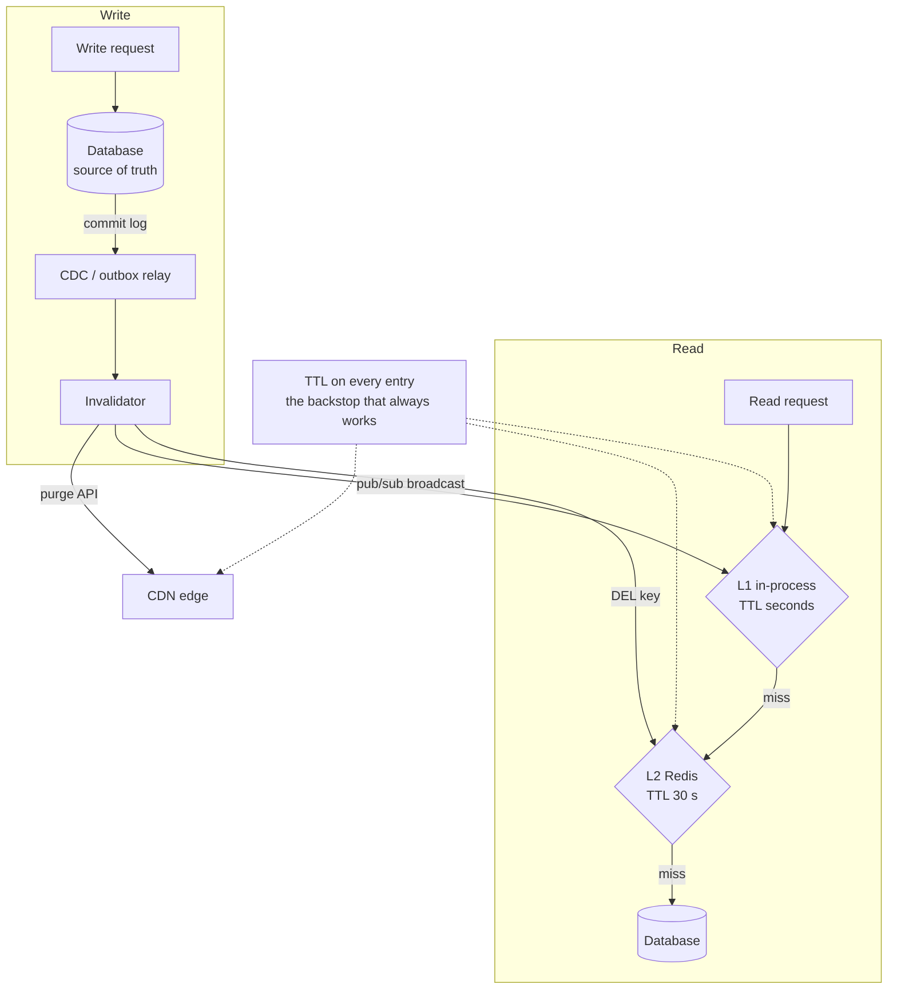
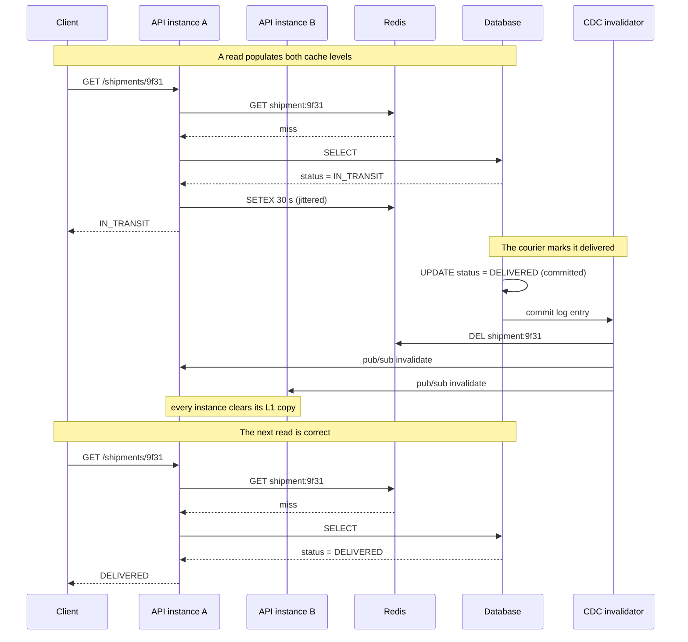

# Chapter 34: Cache Invalidation

## 34.1 Problem Statement

The tracking platform fixed its hit ratio. Single-flight killed the stampedes, jitter desynchronised the expiries, frequency-aware admission survived the nightly analytics scan. Hit ratio sits at 94 percent and database load is down by an order of magnitude.

Then the support tickets start, and none of them are about latency.

**A customer is shown "In transit" for forty minutes after the parcel was marked delivered.** The TTL is an hour. Nothing invalidates on write. The write went to the database, the cache kept serving the old value until it expired on its own schedule, and the customer stood at their door.

**Someone adds `cache.delete(key)` after the write.** Deliveries now appear promptly. Two weeks later a different bug arrives: a parcel's status flickers between "Out for delivery" and "In transit" on refresh, settling on the wrong one about one time in a thousand. This is a race, and it is not the obvious one.

**A price change is invalidated correctly in one service and not in another,** because the same underlying data is cached in four places: the in-process cache in the API service, Redis, the CDN, and the mobile client's local store. The write invalidated one of them.

**A bulk import updates 400,000 rows,** and the invalidation logic issues 400,000 cache deletes, which saturates Redis and drops the hit ratio to nothing for eleven minutes. Chapter 33's cold-cache amplification, self-inflicted.

**And nobody can answer the question "how stale can this value be?"** for any field in the system, because it was never decided. It was inherited from whichever TTL somebody typed first.

That last one is the actual problem. The rest are symptoms of it.

## 34.2 Why This Problem Exists

**A cache is a copy, and copies drift.** The moment you store a value in a second place, you have two sources of truth and no mechanism keeping them equal. Every technique in this chapter is a different answer to "how do we notice the copy is wrong, and how fast do we care".

**Invalidation is a distributed systems problem wearing a small hat.** It looks like a one-line `delete` call. It is actually a write to two independent stores with no shared transaction, which means Chapter 16's atomicity does not apply, Chapter 52's distributed transaction problem does, and the failure modes are the ones from Chapter 18.

**There is no such thing as "fresh".** There is only "stale by less than X", where X is a number somebody has to choose. Teams that skip that choice end up with X determined by an arbitrary TTL, and then discover the value when a customer complains.

**The same data lives at many layers,** each with its own lifetime, and Chapter 32's CDN, Chapter 33's two cache levels, and the client's own storage do not know about each other. Invalidating one is not invalidating the data.

**And the correct strategy is genuinely different per field.** A parcel's status needs to be fresh in seconds. Its origin depot address has not changed since the parcel was created and never will. Applying one policy to both is how you get either a stale delivery notification or a pointless database load.

The reason this is famously hard is not that the mechanisms are complex. Each one is a few lines. It is that the right mechanism depends on a business decision that engineers keep trying to solve technically.

## 34.3 Real World Analogy

A printed train timetable.

The timetable is a cache: someone did the expensive work of computing every departure, and now thousands of people read it instantly instead of asking a clerk.

**The timetable has a printed validity period,** "valid until 12 December". That is a TTL. Nobody claims the timetable is correct after that date, and critically, nobody claims it is correct *before* it either, only that it will not be more than one edition out of date.

**When a train is cancelled, the station announces it.** That is invalidation on write, and notice the shape: the announcement does not reprint the timetable, it tells you the entry you are holding is wrong. Cheap to send, and it makes every copy in every passenger's hand stale simultaneously.

**Some passengers do not hear the announcement.** They are on the platform with headphones in. Their copy stays wrong. That is a failed invalidation, and it is why announcement alone is never enough: the timetable still needs an expiry date as a backstop.

**The departure board shows live times.** That is a different strategy entirely, read-through with a very short lifetime, and it costs more to run, which is why the station has one board and ten thousand timetables rather than ten thousand boards.

**And the platform number is announced late on purpose.** Not because it is unknown, but because announcing it early and changing it is worse than announcing it late and being right. That is a deliberate choice to serve nothing rather than serve something that might change, and there are fields in your system where it is the correct call.

## 34.4 Simple Explanation

**Invalidation is deciding when a cached copy stops being usable, and making sure everyone holding one finds out.**

There are exactly three ways to end a cached value's life. Everything else is a combination of them.

| Strategy | Mechanism | Staleness bound | Cost |
|---|---|---|---|
| **Expiration** | The entry has a lifetime and dies on its own | Up to the TTL | Nothing. It is free and it always works |
| **Invalidation** | A write explicitly removes or updates the entry | Near zero, when it works | A delete per write, and it can fail silently |
| **Versioning** | The key contains a version, so new data has a new key | Zero, structurally | Key churn and dead entries to evict |

The single most useful sentence in this chapter:

```
Expiration bounds staleness without coordination.
Invalidation reduces staleness but requires coordination and can fail.

So: use BOTH. Invalidation for speed, TTL as the backstop.
```

Teams reach for invalidation and then set the TTL to a day, reasoning that invalidation makes the TTL irrelevant. That is exactly backwards. Invalidation is the optimisation and the TTL is the guarantee, because invalidation is a network call that can fail, and when it fails the TTL is the only thing standing between you and a permanently wrong value.

The other framing worth internalising early:

**Stop asking "how do I keep the cache correct" and start asking "how wrong is this allowed to be".** The first question has no answer. The second one has an answer per field, and once you have it, the mechanism follows mechanically.

## 34.5 Technical Deep Dive

### 34.5.1 The staleness budget

Before any mechanism, the decision. For each cached field, write down the maximum acceptable staleness. It is a product decision, not an engineering one, and it takes about twenty minutes with whoever owns the feature.

On the tracking platform:

| Field | Staleness budget | Why | Resulting mechanism |
|---|---|---|---|
| Parcel status | 5 seconds | Customer is standing at the door | Write-through plus 30 s TTL |
| Estimated delivery window | 5 minutes | Changes slowly, low consequence | TTL only, 5 minutes |
| Shipping price | 0 | Legally binding at checkout | Not cached, or versioned key |
| Origin depot address | 24 hours | Immutable in practice | TTL 24 h, no invalidation |
| Customer name | 1 hour | Rarely changes, cosmetic | TTL 1 h |
| Carrier service list | 1 hour | Changes on deployment | TTL 1 h plus explicit purge |

Two things fall out of this table that arguing about mechanisms never produces.

**Most fields need nothing but a TTL.** Four of the six rows require no invalidation logic at all. The complexity everyone builds is needed for one or two fields, and building it uniformly is how you get the 400,000-delete bulk import problem.

**One field should not be cached.** A staleness budget of zero means the cache cannot help you, and recognising that is a design win rather than a failure. Chapter 19's strong consistency requirements do not survive contact with a cache, and pretending otherwise produces the class of bug that ends up in a post-mortem with the word "financial" in it.

### 34.5.2 The write strategies

Where the write goes, and in what order, determines both correctness and what happens when a step fails.

**Cache-aside, also called lazy loading.** The application owns both. Reads check the cache, miss, load, populate. Writes go to the database, then invalidate.

```java
// Cache-aside. The default, and correct for most things.
public Shipment get(String id) {
    Shipment cached = cache.get(key(id));
    if (cached != null) return cached;

    Shipment fresh = repository.findById(id);
    cache.set(key(id), fresh, jitteredTtl(Duration.ofSeconds(30)));
    return fresh;
}

public void updateStatus(String id, Status status) {
    repository.updateStatus(id, status);   // source of truth first
    cache.delete(key(id));                 // then invalidate
}
```

**Write-through.** The write updates the cache and the database together, so the cache is populated rather than emptied. Better for hot keys, because the next reader does not pay a miss. Worse if the written data is rarely read, because you cache things nobody wants.

**Write-behind, or write-back.** The write hits the cache and is flushed to the database asynchronously. Very fast writes, and the only strategy here that can lose data, because an entry can be acknowledged and then lost if the cache dies before the flush. Correct for metrics and view counts. Wrong for anything you would be asked about in an incident review.

**Refresh-ahead.** The cache proactively reloads entries before they expire, based on access patterns. Chapter 33's probabilistic early refresh is a form of this.

| Strategy | Write latency | Data loss risk | Cache holds | Use when |
|---|---|---|---|---|
| Cache-aside | Database only | None | Only what was read | Default. Read-heavy, mixed access |
| Write-through | Database plus cache | None | Everything written | Written data is read soon after |
| Write-behind | Cache only | **Yes** | Everything written | Counters, metrics, tolerable loss |
| Refresh-ahead | Unchanged | None | Predictably hot keys | Skewed access, known hot set |

### 34.5.3 Delete, do not update

The single most common invalidation bug, and the cause of the flickering status in Section 34.1.

The instinct on a write is to put the new value in the cache. It seems obviously better: the next reader gets a hit instead of a miss. It also introduces a race that TTLs will not save you from, because the wrong value can be written and then live for the full TTL.

```
Two concurrent writes, W1 setting status=A and W2 setting status=B.
W2 commits last, so the database ends with B. Correct.

  W1: write DB (A)  ------------------->  set cache (A)
  W2:      write DB (B) -> set cache (B)
                                              ^
  Database: B (correct)                       |
  Cache:    A (wrong, and stays wrong for the full TTL)
```

Nothing is broken in either code path. W1 was simply slower between its two steps than W2 was across both of its. Now compare with delete:

```
  W1: write DB (A)  ------------------->  delete key
  W2:      write DB (B) -> delete key

  Database: B
  Cache:    empty, so the next read loads B from the database. Correct.
```

**Deleting is idempotent and order-independent.** Two deletes in any order produce the same state, and that state is "ask the database", which is always right. Setting is neither. The rule:

> **Invalidate by deleting, not by writing.** The only exception is write-through on a key with a single writer, where the ordering cannot occur.

There is a second-order race even with delete, when a read miss and a write interleave:

```
  R: read DB (A) ---------------------------> set cache (A)
  W:    write DB (B) -> delete key

  Cache ends holding A. Database holds B. Stale until TTL.
```

This one is rarer, requires the read to be slow across the exact window, and is bounded by the TTL, which is the third reason the TTL is not optional. If you genuinely cannot tolerate it, the fixes are Chapter 33's single-flight combined with a short lease, or versioned keys, below.

### 34.5.4 Versioned keys

The strongest technique available, and structurally free of races, because nothing is ever invalidated at all.

The version goes in the key. New data means a new key. The old key is simply never requested again and is evicted eventually by the eviction policy.

```java
// The version lives on the row, incremented by the write.
// The key is derived from it, so a stale key is unreachable, not wrong.
String key(String id, long version) {
    return "shipment:" + id + ":v" + version;
}
```

This trades one problem for another, which is the honest way to describe it: you no longer need to invalidate, but you now need the version before you can build the key, which usually means a cheap lookup of the version itself. That lookup can be cached with a short TTL, and now your staleness is bounded by the version cache rather than the data cache. You have moved the problem to a smaller, cheaper object, which is usually a good trade.

Where it shines is **grouped invalidation**. Put a version on the collection rather than the item:

```
users:42:profile:v7
users:42:orders:v7
users:42:prefs:v7

One increment of the user's version invalidates everything about them,
with a single write, no key enumeration, and no delete storm.
```

This solves the bulk-import problem from Section 34.1 directly. Four hundred thousand row updates become one version increment per affected group, not 400,000 deletes.

### 34.5.5 Multi-layer invalidation

The problem that produces the four-copies bug. The same value exists at every layer, and each has its own lifetime.

```
Browser / mobile client cache     minutes to days     you cannot purge it
CDN edge (Chapter 32)             minutes to hours    purgeable via API, seconds to propagate
API gateway cache                 seconds to minutes  purgeable
Distributed cache, Redis          seconds to minutes  purgeable, fast
In-process cache (Chapter 33)     seconds             per instance, needs broadcast
Database                          source of truth
```

Two rules make this tractable.

**Rule one: TTLs must increase outward, never inward.** If the CDN caches for an hour and Redis caches for a day, purging the CDN reveals a day-old value from Redis. The lifetime at each layer should be shorter than or equal to the layer behind it, so that a purge at the edge reveals something at least as fresh.

**Rule two: the client layer cannot be purged, so it must be versioned.** You have no channel to a browser's cache. The answer is to change the URL, which is why static assets are named `app.a3f9c1.js` and why immutable content gets a one-year TTL. The URL is the version. Chapter 32 covers this as content addressing.

For in-process caches across a fleet, invalidation requires a broadcast, because you must reach every instance:

```java
// Invalidate the local cache on every instance via pub/sub.
// The Redis delete is authoritative; this message handles the L1 copies.
public void invalidate(String id) {
    cache.delete(key(id));                       // L2, shared
    events.publish("cache.invalidate", key(id)); // L1, every instance
}

@EventListener
public void onInvalidate(String key) {
    localCache.invalidate(key);   // each instance clears its own copy
}
```

Note what this is: a best-effort broadcast with no delivery guarantee. An instance that is starting up, partitioned, or paused for garbage collection misses the message and keeps its stale copy. **This is why L1 TTLs are measured in seconds.** The broadcast is the optimisation; the short TTL is the guarantee. The same relationship as always.

### 34.5.6 Making invalidation reliable

The invalidation in Section 34.5.2 has a failure mode that the code does not show: `repository.updateStatus` succeeds, the process is killed, and `cache.delete` never runs. The cache now holds a value that no future write will correct, until the TTL saves you.

This is the dual-write problem from Chapter 52, and it has one good answer.

**Derive invalidation from the database's own change log** rather than from application code. The database already produces an ordered, durable record of every committed write. Reading it and invalidating from there means invalidation happens if and only if the write committed, which is exactly the property application-level invalidation cannot provide.



```
 write -> database -> commit log -> CDC -> Kafka -> invalidator
                                                       |
                                            +----------+----------+
                                            |          |          |
                                         Redis      L1 broadcast  CDN purge

 Invalidation happens if and only if the write committed.
 One pipeline serves every cache layer.
 Ordering is preserved per key by the log.
```

Debezium reading the PostgreSQL write-ahead log or the MySQL binlog is the standard implementation. The cost is real infrastructure, so this is not the starting point. It is where you go when you have several caching layers, several services caching the same data, or a correctness requirement that a missed delete would violate.

The intermediate option, when CDC is too much: **write the invalidation into the same transaction as the data**, using the transactional outbox pattern from Chapter 59, and have a relay drain the outbox. Same guarantee, less infrastructure, more application code.

### 34.5.7 Negative and partial invalidation

Two details that come up constantly and are handled badly.

**Invalidating a key that does not exist yet.** A read caches a negative sentinel for a missing parcel (Chapter 33). The parcel is then created. If creation does not invalidate the negative entry, the parcel appears not to exist for the length of the negative TTL. Creates must invalidate too, which people forget because there is nothing obvious to invalidate.

**Invalidating derived and aggregate values.** A parcel's status change invalidates `shipment:9f31`. It should probably also invalidate `depot:LHR:pending_count`, `customer:88:active_shipments`, and the search index entry. These dependencies are invisible in the code and are discovered in production.

The maintainable answer is a dependency declaration, kept next to the write rather than scattered:

```java
// Every write declares what it invalidates. One place to read,
// one place to review, and it can be tested directly.
Map<Class<?>, List<KeyPattern>> DEPENDENCIES = Map.of(
    ShipmentStatusChanged.class, List.of(
        key("shipment:{shipmentId}"),
        key("customer:{customerId}:active"),
        key("depot:{depotId}:pending"),
        version("search:shipment:{shipmentId}")
    )
);
```

If you cannot write this table for your system, you do not know what your invalidation does, and the gaps in it are your next batch of tickets.

## 34.6 Architecture Diagram



```
 READ PATH                          WRITE PATH

 request                            write
   |                                  |
 L1 in-process   TTL 5 s            database  (source of truth)
   |  miss                            |
 L2 Redis        TTL 30 s           commit log
   |  miss                            |
 database                           CDC or outbox relay
                                      |
                                   invalidator
                                      |
                    +-----------------+-----------------+
                    |                 |                 |
              DEL from L2      broadcast to L1     purge CDN

 Every layer also has a TTL. Invalidation is the optimisation,
 the TTL is the guarantee. TTLs increase outward, never inward.
```

## 34.7 Request Flow



1. **The read populates L2 with a jittered TTL,** so this entry's expiry is not synchronised with its neighbours.
2. **The write goes only to the database.** The application does not touch the cache, which is what removes the dual-write failure mode.
3. **The commit log is the trigger,** so invalidation cannot happen for a write that rolled back, and cannot be skipped for one that committed.
4. **Redis is deleted, not updated,** so concurrent writes cannot leave a stale value behind.
5. **The broadcast clears L1 on every instance,** and any instance that misses the message is bounded by its own short TTL.
6. **The next read misses and reloads,** paying one database query to become correct.

## 34.8 Internal Components

| Component | Role | Failure mode | Guard |
|---|---|---|---|
| Staleness budget | Per-field decision on acceptable lag | Never made, so TTLs are arbitrary | Written table, owned by the feature owner |
| TTL | The guarantee that always works | Set long because invalidation exists | Short enough to be an acceptable worst case |
| Invalidation trigger | Removes entries on write | Application-level, so it can be skipped | CDC or transactional outbox |
| Delete vs set | How the entry is invalidated | `set` on write, producing the ordering race | Always delete, except single-writer write-through |
| Key versioning | Makes stale keys unreachable | Absent where races are unacceptable | Version in the key for critical fields |
| Group version | Bulk invalidation without enumeration | Absent, so bulk writes cause delete storms | Version on the collection |
| L1 broadcast | Clears per-instance copies | Best effort, instances can miss it | L1 TTL in seconds |
| CDN purge | Clears the edge | Forgotten entirely | Part of the same invalidation pipeline |
| Client cache | Unreachable by any purge | Treated as purgeable | Content-addressed URLs |
| Dependency map | Records what a write invalidates | Implicit and scattered | Declared in one place, tested |

The row that causes the most production pain is the last one. Every invalidation bug I have seen in a mature system was a missing edge in that map, not a broken mechanism.

## 34.9 Production Example

**Facebook's cache invalidation work** is the best-documented case, and the design decision worth taking away is that invalidation is driven from the database's commit stream rather than from application code. Their invalidation pipeline reads the storage tier's log and propagates deletes to memcache clusters, including across regions. It gives exactly the property Section 34.5.6 describes: an invalidation happens because a write committed, not because a code path remembered to call delete.

Their published work also describes **leases**, which solve the read-write race in Section 34.5.3 directly. A client that misses is given a token, and a set is only accepted if the token is still valid. An intervening write invalidates the token, so the slow reader's stale set is rejected rather than stored. That is the mechanism you build when the TTL backstop is not tight enough.

**Fastly and Cloudflare's surrogate keys** are Section 34.5.4's grouped versioning at the edge. A response is tagged with keys such as `shipment-9f31` and `customer-88`, and a single purge call on a tag clears every response carrying it, without the origin needing to know which URLs exist. This is how a news site invalidates every page mentioning a story in one call.

## 34.10 Advantages

- **A staleness budget turns an unanswerable question into a design input.** Most fields turn out to need only a TTL, which removes work rather than adding it.
- **TTL plus invalidation is strictly better than either alone.** Invalidation gives you speed, the TTL gives you a bound that survives every failure of the invalidation path.
- **Deleting rather than setting removes an entire class of race** for one word of code change.
- **Versioned keys eliminate invalidation instead of implementing it,** and grouped versions turn bulk invalidation into a single write.
- **CDC-driven invalidation is exactly correct by construction,** because it is derived from the same log that made the write durable.
- **One pipeline can serve every layer,** so adding a CDN or a new service's cache does not multiply the invalidation logic.

## 34.11 Limitations

- **Nothing here gives you zero staleness.** The tightest mechanism still has a propagation delay. A true zero budget means not caching.
- **CDC is real infrastructure** with its own lag, its own failure modes, and its own on-call burden. It is not free and it is not the starting point.
- **Broadcasts to in-process caches are best effort.** There is no way to guarantee every instance received one, which is why L1 lifetimes must stay short.
- **Client caches cannot be invalidated at all.** Versioned URLs are the only mechanism, and they do not work for data that must be requested at a stable URL.
- **The dependency map is manual** and drifts as features are added. There is no automatic way to discover that a write should invalidate an aggregate.
- **Grouped versions over-invalidate.** One field changing clears the whole group, which trades hit ratio for simplicity.

## 34.12 Trade-offs

| Choice | Gain | Cost | Remove it and |
|---|---|---|---|
| Short TTL | Tight staleness bound with no machinery | Lower hit ratio, more source load | Staleness is bounded only by invalidation, which can fail silently |
| Invalidate on write | Near-immediate freshness | A coordination point that can fail | Staleness equals the TTL, always |
| Delete not set | No write-write race | One extra miss after each write | Concurrent writes can leave a wrong value for a full TTL |
| Versioned keys | Races become structurally impossible | A version lookup, plus dead keys to evict | You are back to invalidating, with its races |
| Group versions | Bulk invalidation in one write | Over-invalidation, lower hit ratio | Bulk writes become delete storms |
| CDC pipeline | Invalidation cannot be skipped | Infrastructure, lag, operational burden | Every write path must remember to invalidate, and one will not |
| L1 broadcast | Fleet-wide freshness in milliseconds | Best-effort delivery, fan-out cost | Each instance is stale for its own TTL independently |
| Write-through | No miss after a write | Caching data nobody reads | Hot keys pay a miss on every write |

The trade behind all of them: **freshness is bought with coordination, and coordination is what fails.** Every mechanism in this chapter buys a tighter staleness bound by adding something that can break, which is why the TTL, the one thing that cannot break, is never removed.

## 34.13 Common Mistakes

- **Setting the cache on write instead of deleting.** Section 34.5.3's race. Looks like an optimisation, produces values that are wrong for a full TTL.
- **Treating the TTL as unnecessary because invalidation exists.** The TTL is the guarantee. Long TTLs plus invalidation means one dropped delete equals a day-long bug.
- **Invalidating only the primary key** and forgetting aggregates, counters, lists, and search indexes.
- **Forgetting that creates invalidate too,** leaving a negative cache entry that hides a newly created record.
- **Invalidating one layer and calling it done,** while the CDN and the in-process caches keep serving.
- **Longer TTLs at inner layers than outer ones,** so purging the edge reveals something older.
- **Enumerating keys to invalidate a group,** which turns a bulk write into a cache-destroying delete storm.
- **Application-level invalidation for correctness-critical data,** where a process death between the write and the delete leaves a permanently wrong value.
- **Choosing the TTL by feel** rather than from a staleness budget, then discovering the real requirement from a support ticket.
- **Caching something with a zero staleness budget** because the hit ratio looked appealing.

## 34.14 Interview Questions

1. Why is cache invalidation considered hard when the mechanisms are all simple?
2. Explain why you should delete a cache entry on write rather than update it. Draw the race.
3. You use invalidation on write. Why still set a TTL?
4. The application writes to the database and then deletes from the cache. What happens if the process dies between those two calls, and how do you fix it properly?
5. The same data is cached in a browser, a CDN, Redis, and in-process. Describe an invalidation strategy covering all four.
6. A bulk job updates 500,000 rows. How do you invalidate without destroying the cache?
7. What is a staleness budget, and how does it change the design?
8. When would you deliberately not cache a value at all?
9. How does versioning a key remove the need for invalidation, and what does it cost?
10. A read misses, and a write commits and invalidates before the read stores its result. What is stored, and what are your options?

## 34.15 Production Best Practices

- **Write the staleness budget table before writing any caching code.** One row per cached field, owned by someone who can decide.
- **Always set a TTL. No exceptions.** It is the only mechanism that cannot fail.
- **Keep TTLs monotonically increasing outward.** Edge shortest, source longest.
- **Delete, never set,** unless there is provably a single writer.
- **Derive invalidation from the commit log** for anything where a missed invalidation is a real incident. Use a transactional outbox as the cheaper intermediate.
- **Version the group, not the item,** wherever bulk writes occur.
- **Declare the dependency map in one place** and test it, so adding a write path forces a decision about what it invalidates.
- **Alert on hit ratio per key prefix.** A sudden drop is usually an invalidation bug, not a traffic change.
- **Instrument staleness directly:** sample cached values against the source and record the age distribution. It is the only way to know whether the budget is being met.
- **Make creates invalidate negative entries,** and test that path specifically.
- **Use content-addressed URLs for anything a client will cache,** because that is the only invalidation you have there.

## 34.16 Summary

Cache invalidation is famously hard for a reason that is not technical. Every mechanism in this chapter is a handful of lines. The difficulty is that the correct mechanism depends on a question engineers keep trying to answer with code: **how stale is this allowed to be?**

Answer that per field, and the rest is mechanical. Most fields need only a TTL. A few need invalidation on write, which must be a delete rather than a set, because deletes are idempotent and order-independent while sets are neither. A very few need versioned keys, which remove the problem entirely by making stale entries unreachable rather than wrong. And one or two should not be cached at all, which is a legitimate answer rather than an admission of defeat.

Wherever a missed invalidation would be a real incident, drive invalidation from the database's commit log rather than from application code, so it happens if and only if the write committed. Everything else, including in-process broadcasts and CDN purges, hangs off that one pipeline.

Through all of it, one relationship holds: **invalidation is the optimisation, the TTL is the guarantee.** Invalidation is a coordination point and coordination fails. The TTL is the thing that still works when everything else has gone wrong, which is precisely why it is never removed and never set to a day.

## 34.17 Quick Revision Notes

- Three mechanisms: **expiration** (free, always works), **invalidation** (fast, can fail), **versioning** (no races, costs key churn).
- **Use TTL plus invalidation together.** TTL is the guarantee, invalidation is the optimisation.
- **Delete on write, do not set.** Deletes are idempotent and order-independent.
- **Staleness budget per field** is the design input everything else follows from.
- Write strategies: **cache-aside** (default), **write-through** (hot keys), **write-behind** (can lose data), **refresh-ahead** (known hot set).
- **Versioned keys** make stale entries unreachable. **Group versions** make bulk invalidation one write.
- **TTLs increase outward.** Edge shortest, source longest.
- **Client caches cannot be purged.** Version the URL.
- **L1 broadcasts are best effort,** so keep L1 TTLs in seconds.
- **CDC or outbox** gives invalidation that cannot be skipped, because it derives from the commit log.
- **Creates must invalidate negative entries.**
- **A zero staleness budget means do not cache.**

## 34.18 Mini Quiz

1. Why does setting the cache on write introduce a race that deleting does not?
2. Invalidation is implemented correctly. Why keep a TTL?
3. What is the failure mode of application-level invalidation, and what fixes it?
4. Why must TTLs be shorter at outer layers than inner ones?
5. How do you invalidate 500,000 rows' worth of cache entries without a delete storm?
6. Why do creates need to invalidate, and what breaks if they do not?
7. When is not caching the right answer?

**Answers**

1. Because a set writes a specific value, and two concurrent writers can interleave so that the slower writer's older value lands in the cache after the faster writer's newer one, leaving the cache holding a value the database never ends up with. A delete does not carry a value, so any interleaving of two deletes produces the same result, an empty entry, and the next read reloads whatever the database actually settled on. Deletes are idempotent and order-independent; sets are neither, and the resulting wrong value persists for the full TTL rather than being corrected by the next write.

2. Because invalidation is a network call to a separate system and every step of it can fail: the process can die between the database commit and the delete, the delete can time out, a pub/sub message to an in-process cache can be dropped, an instance can be partitioned or paused. When any of those happens, the TTL is the only mechanism that will ever correct the entry. That is why a long TTL justified by "we invalidate anyway" is the dangerous combination: it converts a single dropped delete into a bug that lasts as long as the TTL you chose.

3. The write commits to the database and the process dies before the invalidation runs, so the cache holds a value that no subsequent write will correct. It is the dual-write problem, and it is unfixable at the application level because there is no transaction spanning the database and the cache. The proper fix is to derive invalidation from the database's own commit log, via change data capture, so the invalidation is produced by the same durable record that made the write durable and therefore happens if and only if the write committed. The cheaper intermediate is a transactional outbox: write the invalidation intent into the same transaction as the data, and have a relay drain it.

4. Because purging or expiring an outer layer causes a read through to the next layer in, and if that inner layer holds something older, the purge reveals stale data instead of fresh data. If the CDN expires hourly but Redis holds a day-old entry, an edge miss serves the day-old value and the purge accomplished nothing. Making each layer's lifetime shorter than or equal to the one behind it guarantees that any miss travels toward fresher data, never away from it.

5. Version the group rather than the items. Put a version number on the collection the rows belong to, include it in every key derived from that collection, and have the bulk job increment the version once per affected group. Every old key becomes unreachable immediately, with no enumeration and no deletes, and the dead entries are reclaimed by the normal eviction policy in the background. The cost is over-invalidation, since unchanged items in the group also lose their entries, which is a hit-ratio trade rather than a correctness one.

6. Because a read for a record that does not yet exist stores a negative sentinel to prevent repeated source queries, and that sentinel is a cached fact that the create makes false. If the create does not remove it, the newly created record appears not to exist for the full negative TTL, which produces the confusing bug where a user creates something and immediately gets a 404 for it. The reason it is forgotten is that there is no obvious entry to invalidate at create time, so the code path never gets written.

7. When the staleness budget is zero. If a value is legally or financially binding at the moment it is read, such as a quoted price at checkout or an account balance authorising a transaction, then any staleness at all is a correctness violation and no caching mechanism can deliver zero. Recognising this early is a design win, because the alternative is discovering it in a post-mortem. The usual compromise is to cache the expensive inputs to the calculation while computing the binding value fresh, so you still avoid most of the work without caching the answer.

## 34.19 Hands-on Exercise

**Part 1: write the budget.** Take a real service you work on, list every cached field, and write the maximum acceptable staleness beside each. Take the list to whoever owns the feature and get the numbers confirmed. Count how many need only a TTL.

**Part 2: reproduce the write-write race.** Two concurrent writers, both using `set` on write, with an artificial delay between the database write and the cache write in one of them. Confirm the cache holds the wrong value. Switch to `delete` and confirm it cannot happen.

**Part 3: reproduce the read-write race.** A slow read that misses, and a write that commits and invalidates during it. Confirm the stale value gets stored. Then bound it with a short TTL, and separately fix it with a versioned key, and compare the cost of each.

**Part 4: kill the process mid-invalidation.** Write to the database, then kill the process before the delete. Observe the stale entry. Implement a transactional outbox with a relay and confirm the invalidation survives the same kill.

**Part 5: cause a delete storm.** Update 100,000 rows with per-key invalidation and watch the cache hit ratio and the source load. Convert to a group version and repeat.

**Part 6: measure real staleness.** Sample cached values against the source on a schedule and record the age distribution. Compare the p99 staleness with the budget from Part 1. This number is the one nobody has and everybody assumes.

## 34.20 Further Reading

- *Scaling Memcache at Facebook*, Nishtala et al., NSDI 2013. Leases, and invalidation driven from the storage tier's commit stream.
- *Designing Data-Intensive Applications*, Martin Kleppmann, chapters on derived data and change data capture, which is the general form of the pipeline in Section 34.5.6.
- Debezium's documentation, for what a real CDC deployment involves operationally.
- Fastly's surrogate key documentation, as a working implementation of grouped invalidation at the edge.
- RFC 9111, HTTP Caching, for how `Cache-Control`, `ETag`, and revalidation express these same ideas over HTTP.
- Chapter 33 of this book for the caching mechanics this chapter assumes, Chapter 52 for the dual-write problem, and Chapter 59 for the transactional outbox.

---

**Next chapter: Chapter 35, Redis.** The specific system most of this has assumed: what its single-threaded model buys and costs, why its data structures change what belongs in a cache, how persistence and replication actually behave, and the failure modes that show up when it stops being a cache and quietly becomes a database.
