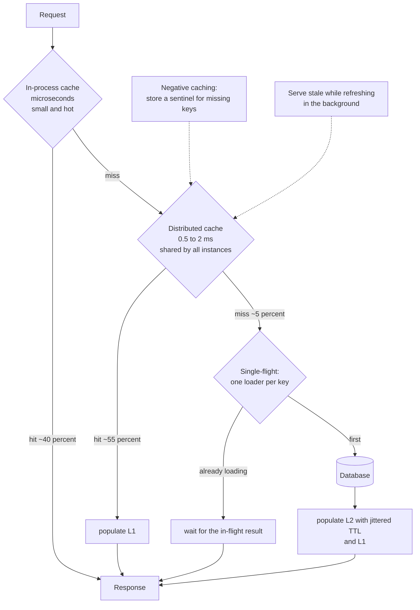

# Chapter 33: Caching

## 33.1 Problem Statement

The tracking platform adds a Redis cache in front of its database, expecting the standard result: most reads served from memory, database load down by an order of magnitude, latency down substantially.

The hit ratio settles at 62 percent. p99 latency gets **worse**.

**The misses are now more expensive.** A miss costs a Redis round trip, then a database query, then a Redis write. That is roughly 3 milliseconds of overhead added to every miss, and 38 percent of reads are misses.

**Database load fell by only 38 percent,** not the 90 percent the design assumed, because the hit ratio determines the reduction directly and nobody had estimated it.

**Every deploy causes a database spike.** The cache is in-process, so a rolling restart empties it, and the database receives full uncached traffic for several minutes. Chapter 13's cold-cache amplification, on a schedule.

**One popular parcel produces 30,000 simultaneous database queries** when its entry expires, which is Chapter 9's stampede.

**And a stale price is shown for 40 minutes** because the TTL is an hour and nothing invalidates on write.

The last problem is Chapter 34's subject. The rest are this chapter's: caching is not free, its benefit is determined by a number nobody estimated, and the marginal value of that number is wildly non-linear.

## 33.2 Why This Problem Exists

**The benefit is proportional to hit ratio, and the cost is paid on every request.** A cache adds a lookup to the hit path and a lookup plus a write to the miss path. Below a certain hit ratio it is a net loss, and that threshold is computable in advance.

**Hit ratio is treated as an outcome rather than a design input.** It depends on the working set, the request distribution, the cache size, the TTL, and the eviction policy, all of which are choices.

**The marginal value of hit ratio is non-linear** in a way that misleads. Going from 90 to 95 percent sounds like a 5 percent improvement and is actually a halving of database load.

**Caches are stateful, and Chapter 23's rules apply.** An in-process cache is per-instance state that empties on every deploy and diverges between instances.

**And the failure modes are absent under normal conditions.** Stampedes, cold starts, and eviction storms all occur precisely when something else is already going wrong.

## 33.3 Real World Analogy

A chef's mise en place.

Before service, the chef prepares the components used most often: stocks reduced, vegetables cut, sauces made. During service, a dish that uses only prepared components takes ninety seconds. A dish requiring something not prepared takes twenty minutes, because it must be made from scratch **while the kitchen is busy**.

Every property of caching is in that arrangement.

**It works because demand is skewed.** A small number of components appear in most dishes. If every dish needed something unique, preparation would be pointless, which is why the request distribution determines whether caching helps at all.

**Bench space is finite.** Preparing more than fits means something gets pushed off, and choosing what to discard is an eviction policy.

**Preparation goes stale.** A sauce made at eleven is not the same at eleven at night, so there is a freshness window, which is a time to live.

**A miss during service is worse than no preparation at all,** because you check the bench, find nothing, and then start from scratch, having lost the time spent checking. That is the cost added to every miss.

**And starting a shift with an empty bench is the hardest hour of the day,** which is a cold cache after a deploy.

## 33.4 Simple Explanation

**A cache stores the result of expensive work so it can be reused.**

It works because of two properties that almost all real workloads have:

| Property | Meaning |
|---|---|
| **Temporal locality** | Something requested once is likely to be requested again soon |
| **Skewed distribution** | A small fraction of items receives a large fraction of requests |

The second is what makes small caches effective. Chapter 9 showed skew as a problem for partitioning; here it is the property that makes caching work, because a cache holding 1 percent of the data may serve 80 percent of the requests.

The arithmetic that governs everything:

```
average latency  =  H x (cost of a hit)  +  (1 - H) x (cost of a miss)

where a miss costs the cache lookup PLUS the original work PLUS the cache write.
```

Which gives the break-even condition people never compute:

```
Cache lookup:      1 ms
Cache write:       1 ms
Database query:   20 ms

Without cache:     20 ms every time
With cache, H:     H x 1 + (1 - H) x 22

Break-even:        H x 1 + (1 - H) x 22 = 20
                   22 - 21H = 20
                   H = 0.095

So a 10 percent hit ratio breaks even. Section 33.1's 62 percent
gives 9 ms average, a real improvement, and the p99 got worse
because the 38 percent of misses each pay 22 ms instead of 20.
```

That last line is the subtlety: **a cache improves the average while making the tail slightly worse**, and if your requirement is on the tail, a moderate hit ratio may not be a win.

## 33.5 Technical Deep Dive

### 33.5.1 The non-linear value of hit ratio

The single most useful piece of arithmetic in this chapter, because it changes where effort is spent.

```
Origin load  =  (1 - H) x total requests

H = 50 percent  ->  origin sees 50 percent   ->  2x reduction
H = 90 percent  ->  origin sees 10 percent   ->  10x reduction
H = 95 percent  ->  origin sees  5 percent   ->  20x reduction
H = 99 percent  ->  origin sees  1 percent   ->  100x reduction
```

| Improvement | Sounds like | Actually is |
|---|---|---|
| 50 to 60 percent | 10 points | 20 percent less origin load |
| 90 to 95 percent | 5 points | **Half the origin load** |
| 95 to 99 percent | 4 points | **One fifth the origin load** |
| 99 to 99.5 percent | 0.5 points | **Half again** |

The consequence: **at high hit ratios, small improvements are enormous.** Moving from 90 to 95 percent halves your database load, which is frequently worth more than any query optimisation. And it works in reverse, which is the dangerous direction: a hit ratio falling from 95 to 90 percent doubles database load with no change in user traffic, which is exactly what happens when Chapter 32's cache key gets inflated or when the working set outgrows the cache.

This is why hit ratio deserves an alert with a threshold, not just a dashboard.

### 33.5.2 Where to cache

Every layer between the user and the data can cache, and each has different properties.

| Layer | Latency | Scope | Invalidation | Good for |
|---|---|---|---|---|
| Browser | 0 | One user | Very hard | Static assets, per-user data |
| CDN edge | 10 to 30 ms | Global | Purge, minutes (Chapter 32) | Shared static and semi-static content |
| Reverse proxy | 1 ms | One datacenter | Purge | Shared responses |
| **In-process** | **microseconds** | **One instance** | Hard, N copies diverge | Small, hot, tolerant of staleness |
| **Distributed (Redis)** | **0.5 to 2 ms** | All instances | Easy, one copy | The general case |
| Database buffer pool | microseconds | The database | Automatic | Anything, and it is already there |
| Materialised view | Query cost | All readers | Refresh | Expensive aggregations |

Two observations that matter more than the table.

**In-process caching is a thousand times faster and comes with Chapter 23's problems.** Microseconds against milliseconds is a genuinely large difference, and the cost is that each instance has its own copy, so they diverge, they all empty on deploy, and total memory is multiplied by instance count. Use it for small, hot, slow-changing data where instances disagreeing briefly is acceptable.

**The database already has a cache,** and it is often the one being neglected. A buffer pool sized so the working set fits in memory can make an application-level cache unnecessary for many workloads, and it is invalidated automatically and correctly, which is the hardest part of the whole subject.

The strongest pattern is often two levels: a small in-process cache in front of a shared distributed cache, giving microsecond access to the hottest items and millisecond access to the rest, with the shared level absorbing the misses so the database sees very little.

### 33.5.3 The patterns

| Pattern | Read | Write | Consistency | Notes |
|---|---|---|---|---|
| **Cache-aside** | App checks cache, then store, then populates | App writes store and invalidates cache | Race window on concurrent write | The default. Explicit and flexible |
| **Read-through** | Cache fetches from the store on a miss | Separate | Same | Cleaner code; needs cache library support |
| **Write-through** | As read-through | Write to cache and store synchronously | Cache always current | Slower writes; caches data that may never be read |
| **Write-behind** | As above | Write to cache; flush to store asynchronously | **Data loss window** | Fast writes; only for tolerant data |
| **Refresh-ahead** | Refresh popular entries before expiry | Separate | Avoids user-visible misses | Wasted refreshes for items not re-requested |

Cache-aside is the common case and its implementation has a subtlety worth showing:

```java
public Shipment get(String id) {
    Shipment cached = cache.get(id);
    if (cached != null) return cached;

    Shipment loaded = repository.findById(id);
    if (loaded == null) {
        cache.set(id, NULL_SENTINEL, Duration.ofSeconds(30));   // negative caching
        return null;
    }
    cache.set(id, loaded, ttlWithJitter());
    return loaded;
}
```

Two details in that method matter.

**Negative caching.** Without it, a request for a nonexistent key misses the cache every time and queries the database every time, which makes a stream of requests for missing keys a direct database load generator. This is the mechanism behind a class of denial-of-service, and a short-lived sentinel value fixes it.

**Jittered TTL.** If a thousand entries are written at the same moment with the same TTL, they expire at the same moment and produce a synchronised stampede. Adding randomness spreads the expiries.

```java
private Duration ttlWithJitter() {
    long base = 300_000;
    long jitter = ThreadLocalRandom.current().nextLong(0, 60_000);
    return Duration.ofMillis(base + jitter);            // 5 to 6 minutes
}
```

### 33.5.4 Stampedes

Section 33.1's 30,000 simultaneous queries. When a popular entry expires, every concurrent request misses and every one of them does the expensive work.

```
Popular key expires at T.
Between T and T+40 ms, 30,000 requests arrive.
All 30,000 miss. All 30,000 query the database.
The database, sized for a 95 percent hit ratio, receives
30,000 identical queries in 40 milliseconds.
```

Four defences, and they compose:

**Single-flight.** Only one request per key performs the load; the rest wait for its result. This is the primary defence and it is the same mechanism Chapter 9 used for hot keys.

```java
private final ConcurrentHashMap<String, CompletableFuture<Shipment>> inFlight
        = new ConcurrentHashMap<>();

public Shipment get(String id) {
    Shipment cached = cache.get(id);
    if (cached != null) return cached;

    return inFlight.computeIfAbsent(id, key ->
        CompletableFuture.supplyAsync(() -> {
            try {
                Shipment s = repository.findById(key);
                cache.set(key, s, ttlWithJitter());
                return s;
            } finally {
                inFlight.remove(key);
            }
        }, loaderPool)).join();
}
```

**Jittered expiry**, so entries do not expire together.

**Probabilistic early expiration.** Each request has a small chance of refreshing an entry before it expires, with the probability rising as expiry approaches, so a popular key is almost always refreshed by one request in advance rather than expiring under load.

**Serve stale while refreshing.** Return the expired value immediately and refresh in the background, which is `stale-while-revalidate` from Chapter 32 applied at the application level. This is usually the best user experience.

### 33.5.5 Sizing and eviction

A cache holds less than the data, so something must be evicted. What you keep determines the hit ratio.

| Policy | Keeps | Weakness |
|---|---|---|
| LRU | Recently used | A large scan evicts the entire working set |
| LFU | Frequently used | Slow to adapt; old popular items linger |
| **W-TinyLFU** | Frequency-aware admission plus recency | More complex; it is what modern libraries use |
| FIFO | Insertion order | Ignores usage entirely |
| Random | Arbitrary | Surprisingly acceptable, and trivially cheap |
| TTL only | Everything until it expires | Unbounded memory unless combined with a size limit |

LRU's weakness is worth knowing because it is the default nearly everywhere. A batch job or a crawler that reads a large volume of rarely-accessed data will evict the entire hot working set, so hit ratio collapses for everyone until it rebuilds. Modern libraries default to admission policies that consider frequency, so a single access to a cold item does not displace a frequently used one.

Sizing follows from the working set rather than from the data volume:

```
Total shipments:        90 million
Requested in a day:     4 million        <- the working set that matters
Entry size:             1.2 KB

Cache the daily working set:  4M x 1.2 KB = 4.8 GB

But requests are skewed, so measure instead of assuming:
  top 1 percent of keys serve about 60 percent of requests
  top 10 percent serve about 90 percent

400k entries = 480 MB gives roughly 90 percent hit ratio.
```

The practical method: **plot cumulative request share against key rank.** The curve tells you what hit ratio each cache size buys, and it usually flattens sharply, meaning most of the benefit is available for a fraction of the memory.

### 33.5.6 What not to cache

| Do not cache | Why |
|---|---|
| Data whose staleness causes real harm | Balances, inventory, permissions. Chapter 34 |
| Data requested once | No temporal locality, so it only adds cost |
| Very large objects with low reuse | Consumes capacity that popular items need |
| Results that are cheap to compute | The cache round trip costs more than the work |
| Per-user data with no reuse | Cardinality equals user count, hit ratio near zero |

And the general test: **a cache is worthwhile when the same expensive result is requested repeatedly within its freshness window.** If any of expensive, repeatedly, or within the window is false, it is overhead.

## 33.6 Architecture Diagram



```
 request
   |
 L1 in-process cache      microseconds, per instance, small hot set
   |  miss
 L2 distributed cache     0.5 to 2 ms, shared, the general case
   |  miss (~5 percent overall)
 single-flight gate       one loader per key; everyone else waits
   |
 database
   |
 populate L2 (jittered TTL) and L1

 negative caching: sentinel for missing keys, short TTL
 serve stale while refreshing in the background
```

## 33.7 Request Flow

```mermaid
sequenceDiagram
    participant A as App
    participant L1 as In-process cache
    participant L2 as Redis
    participant SF as Single-flight gate
    participant DB as Database

    A->>L1: get shipment 9f31
    L1-->>A: miss
    A->>L2: GET shipment:9f31
    L2-->>A: miss
    A->>SF: claim the load for 9f31
    Note over SF: 29,999 other concurrent requests<br/>find a load already in flight and WAIT
    SF->>DB: SELECT ... WHERE id = '9f31'
    DB-->>SF: row (18 ms)
    SF->>L2: SETEX with jittered TTL, 5 to 6 minutes
    SF->>L1: populate
    SF-->>A: shipment
    Note over SF,DB: ONE database query served 30,000 requests

    Note over L2: TTL nearly expired, popular key
    A->>L2: GET shipment:9f31
    L2-->>A: hit, but close to expiry
    A-->>A: probabilistic early refresh triggers
    A->>DB: refresh in the background
    Note over A: the user got an immediate answer;<br/>the refresh happened off the request path
```

1. **Two cache levels are checked in order of speed,** so the hottest items never leave the process.
2. **A miss at both levels enters the single-flight gate,** which is what turns 30,000 concurrent misses into one query.
3. **The TTL is jittered,** so this key's next expiry is not synchronised with everything written alongside it.
4. **Both levels are populated,** so the next request for this key is a microsecond hit.
5. **Probabilistic early refresh** means popular keys are refreshed before they expire, so users almost never experience their misses.

## 33.8 Internal Components

| Component | Role | Failure mode | Guard |
|---|---|---|---|
| Hit ratio metric | The number that determines all benefit | Not measured, or only in aggregate | Per key prefix, with an alert threshold |
| Cache key design | Determines what counts as the same result | Inflated cardinality, so nothing is reused | Include only what changes the result |
| TTL | Bounds staleness | Uniform, so entries expire together | Jitter every TTL |
| Single-flight gate | Collapses concurrent misses | Absent, so popular keys stampede | One loader per key, others wait |
| Negative caching | Prevents repeated misses on absent keys | Absent, so missing keys hit the database every time | Short-lived sentinel |
| Eviction policy | Decides what to keep | LRU evicted by a scan | Frequency-aware admission |
| Size limit | Bounds memory | Unbounded, so the process is killed | Explicit maximum, sized from the working set |
| Stale serving | Hides refresh latency | Not implemented, so refresh is user-visible | Serve stale, refresh in the background |
| Warm-up | Avoids cold-start amplification | Absent, so every deploy spikes the database | Pre-populate the hot set before serving |
| Cache availability | The cache is a dependency | Treated as hard, so its outage is yours | Fall through to the source; shed if necessary |

That last row matters and is frequently mishandled. If the cache is unavailable, the correct behaviour is usually to fall through to the source, which is slower but correct. But if the source cannot survive the full uncached load, falling through converts a cache outage into a database outage, so falling through must be combined with Chapter 8's admission control.

## 33.9 Production Example

**Facebook's published work on scaling memcache** documents the mechanisms in this chapter at very large scale, particularly leases, which grant one client the right to fetch and set a missing key while others wait, and which is single-flight implemented in the cache server itself. The same work discusses the incast problem created when one client's request fans out to very many cache servers and all responses arrive simultaneously, which is Chapter 9's growth-with-node-count problem appearing in the caching tier.

**Modern cache libraries defaulted away from LRU for a reason.** Caffeine and similar libraries use a frequency-aware admission policy, so a newly requested item must demonstrate it is worth admitting rather than automatically displacing something established. That directly addresses LRU's worst behaviour, where a single large scan evicts an entire hot working set, and it typically improves hit ratio measurably on real workloads at no cost in memory.

**Probabilistic early expiration** comes from published work on cache stampede prevention, and its appeal is that it requires no coordination: each request independently decides, with a probability that rises as expiry approaches, whether to refresh early. Popular keys are refreshed by one of their many requests before expiry, and unpopular ones simply expire, so the mechanism spends effort exactly where it is worthwhile.

## 33.10 Advantages

- **Large latency reductions** when the hit path is much cheaper than the source.
- **Origin load falls as one minus the hit ratio,** which at high hit ratios is a very large multiple.
- **Capacity increases without scaling the source,** which is usually the most expensive tier.
- **Expensive computations are amortised** across all subsequent requests for the same result.
- **Skew works in your favour,** since a cache holding a small fraction of data can serve most requests.
- **It absorbs bursts,** because a spike on a popular key is served entirely from memory.

## 33.11 Limitations

- **Staleness is the price,** and Chapter 34 is about the difficulty of managing it.
- **It makes the tail slightly worse,** since every miss pays the lookup and the write on top of the original cost.
- **Benefit is entirely dependent on hit ratio,** which depends on the working set, size, TTL, and key design.
- **Cold caches amplify load** exactly when the system is restarting or recovering.
- **Stampedes concentrate load** on the source at the worst moment.
- **It is another stateful component** with memory limits, eviction behaviour, and its own failure modes.
- **Debugging becomes harder,** since behaviour depends on invisible cache state.

## 33.12 Trade-offs

| Dial | One way | The other way |
|---|---|---|
| TTL | Long: high hit ratio, more staleness | Short: fresher, more misses and more load |
| Location | In-process: microseconds, per-instance divergence and cold starts | Distributed: shared and consistent, milliseconds |
| Size | Large: higher hit ratio, more memory cost | Small: cheap, more misses |
| Write pattern | Write-through: cache always current, slower writes | Cache-aside: fast writes, a race window on invalidation |
| Stampede defence | Single-flight: one query per key, waiters add latency | None: simpler, popular keys generate load spikes |
| On cache failure | Fall through: correct, may overwhelm the source | Fail fast: protects the source, users see errors |
| Eviction | Frequency-aware: better hit ratio, more complexity | LRU: simple, vulnerable to scans |

**Remove the single-flight gate.** You gain a small amount of latency for the first requester and simpler code. You lose protection against stampedes, so every popular key's expiry produces a load spike proportional to its request rate.

**Remove TTL jitter.** You gain deterministic expiry. You lose the spreading of expiries, so entries written together expire together and produce synchronised misses.

**Remove the in-process level and use only a distributed cache.** You gain consistency between instances and no cold-start divergence. You lose microsecond access to the hottest items, which for very high-rate lookups is a significant amount of total latency.

## 33.13 Common Mistakes

**Not estimating the hit ratio** before building, so the benefit is unknown and frequently disappointing.

**Uniform TTLs,** producing synchronised expiry and periodic stampedes.

**No single-flight,** so a popular key's expiry generates thousands of identical queries.

**No negative caching,** so requests for nonexistent keys hit the source every time.

**In-process caches for data that must be consistent,** producing per-instance divergence.

**Unbounded cache size,** which eventually kills the process.

**Ignoring the cold cache** after deploys, so every release is a database spike.

**Treating the cache as a hard dependency,** so its outage becomes a total outage.

**Falling through to the source on cache failure without admission control,** which converts a cache outage into a database outage.

**Caching data that is cheap to compute,** where the round trip costs more than the work.

**Monitoring only aggregate hit ratio,** which hides that one key prefix is at 5 percent.

## 33.14 Interview Questions

**Q: How much does a cache actually reduce load?** By exactly the hit ratio: origin load becomes one minus H times total requests. The relationship is strongly non-linear at the top, so 90 percent is a tenfold reduction and 95 percent is twentyfold, meaning a five point improvement halves origin load. That is why hit ratio deserves an alert rather than just a graph.

**Q: When is a cache not worth adding?** When the same result is not requested repeatedly within its freshness window, when the underlying work is cheap enough that the cache round trip costs more, when the data is per-user with no reuse so cardinality equals user count, or when staleness causes real harm and the required TTL is so short that the hit ratio collapses.

**Q: What is a cache stampede and how do you prevent it?** When a popular entry expires, all concurrent requests miss simultaneously and each performs the expensive load, so one expiry produces thousands of identical queries. Prevent it with single-flight, so one request loads while the rest wait, jittered TTLs so entries do not expire together, probabilistic early refresh so popular keys are refreshed before expiry, and serving stale content while refreshing in the background.

**Q: Why is LRU sometimes a poor eviction policy?** Because a single pass over a large volume of cold data, such as a batch job or a crawler, evicts the entire hot working set even though none of that cold data will be requested again. Frequency-aware admission policies require a new item to demonstrate value before displacing an established one, which makes the cache resistant to scans.

**Q: In-process or distributed cache?** In-process is roughly a thousand times faster and gives each instance its own copy, so instances diverge, all copies empty on deploy, and total memory is multiplied by instance count. Distributed is shared and consistent at a cost of a millisecond or so. The strongest arrangement is often both: a small in-process level in front of a shared distributed level.

**Q: What should happen when the cache is unavailable?** Usually fall through to the source, since correctness is preserved and only latency suffers. But if the source cannot serve full uncached traffic, which is typical when a cache has been absorbing 95 percent of reads, falling through converts a cache outage into a source outage. So falling through must be paired with admission control that sheds load to keep the source within capacity.

**Q: How do you size a cache?** From the working set rather than the total data volume. Measure the request distribution by plotting cumulative request share against key rank, which shows what hit ratio each cache size buys. The curve typically flattens sharply, so most of the achievable benefit is available for a small fraction of the memory a naive calculation would suggest.

## 33.15 Production Best Practices

1. **Estimate the hit ratio before building,** from the measured request distribution.
2. **Alert on hit ratio,** per key prefix, not just graph an aggregate.
3. **Jitter every TTL** so entries do not expire in synchronised groups.
4. **Implement single-flight** so one loader serves all concurrent misses for a key.
5. **Cache negative results** with a short TTL to stop repeated misses on absent keys.
6. **Serve stale while refreshing** so refresh latency is off the user's path.
7. **Bound cache size explicitly** and choose a frequency-aware eviction policy.
8. **Warm the hot set before serving** after a restart, or accept the source spike.
9. **Treat the cache as a soft dependency,** falling through on failure, and pair that with admission control.
10. **Prefer a distributed cache for correctness-sensitive data,** and add an in-process level only for hot, staleness-tolerant items.
11. **Do not cache cheap computations** or data with no reuse.
12. **Monitor eviction rate,** which rising indicates the working set has outgrown the cache.

## 33.16 Summary

A cache stores expensive results for reuse, and it works because real workloads have temporal locality and skewed distributions: a small fraction of items receives most of the requests, so a cache holding a small fraction of the data can serve most of the traffic. That skew, which Chapter 9 treated as a partitioning problem, is here the property that makes the whole technique viable.

Everything about the benefit reduces to hit ratio, and its value is strongly non-linear at the top of the range. Origin load is one minus the hit ratio, so 90 percent is a tenfold reduction and 95 percent is twentyfold, meaning a five point improvement halves the load on the most expensive tier. The same arithmetic runs in reverse and is how systems fail quietly: a hit ratio drifting from 95 to 90 percent doubles database load with no change whatsoever in user traffic. That is why hit ratio belongs on an alert with a threshold rather than on a dashboard nobody reads.

The costs are real and usually unaccounted. A miss pays the cache lookup, the original work, and the cache write, so a cache improves the average while slightly worsening the tail, and there is a break-even hit ratio below which it is a net loss. Cold caches amplify load precisely during restarts and recoveries, and a popular key expiring produces a stampede proportional to its request rate. The defences are cheap and specific: jittered TTLs so expiries are not synchronised, single-flight so one loader serves all concurrent misses, negative caching so absent keys do not query the source repeatedly, and serving stale while refreshing so users never wait for a refresh.

Finally, the cache is a component with state, memory limits, eviction behaviour, and its own availability. It should be a soft dependency, so its failure means slower rather than broken, and that fall-through must be paired with admission control, because a source that has been serving 5 percent of reads cannot suddenly serve 100 percent of them.

## 33.17 Quick Revision Notes

- Caching works because of temporal locality and skewed request distributions.
- Origin load = (1 − H) × requests. The relationship is non-linear: 90 to 95 percent halves load; 95 to 99 percent divides it by five.
- Hit ratio falling from 95 to 90 doubles source load with no traffic change. Alert on it.
- A miss costs lookup plus original work plus write, so caching improves the average and slightly worsens the tail.
- Compute the break-even hit ratio before building.
- Layers: browser, CDN, proxy, in-process (microseconds, per-instance), distributed (0.5 to 2 ms, shared), database buffer pool, materialised view.
- In-process caches diverge between instances and empty on deploy. Use for small, hot, staleness-tolerant data.
- The database buffer pool is a cache you already have; sizing it correctly may remove the need for another.
- Patterns: cache-aside (default), read-through, write-through, write-behind (data loss window), refresh-ahead.
- Always jitter TTLs. Uniform TTLs cause synchronised expiry.
- Always implement single-flight. One loader per key, others wait.
- Always cache negative results briefly, or missing keys become a load generator.
- Serve stale while refreshing so refresh latency is off the request path.
- Probabilistic early expiration refreshes popular keys before they expire, with no coordination.
- LRU is vulnerable to scans. Frequency-aware admission resists them.
- Size from the working set, measured as cumulative request share by key rank, not from total data volume.
- Cache failure should degrade to slower, not broken, paired with admission control so the source is not overwhelmed.

## 33.18 Mini Quiz

1. Your hit ratio improves from 90 to 95 percent. What happens to database load?
2. Cache lookup 1 ms, write 1 ms, database query 30 ms. What hit ratio breaks even?
3. Why can adding a cache make p99 worse?
4. Name four defences against a cache stampede.
5. Why is negative caching necessary?
6. Why is LRU risky, and what replaced it in modern libraries?
7. Your cache goes down. What should happen, and what additional mechanism is required?

**Answers**

1. It halves. Origin load is one minus the hit ratio, so at 90 percent the database sees 10 percent of requests and at 95 percent it sees 5 percent. A five percentage point improvement therefore removes half the remaining load, which is why small gains at high hit ratios are worth far more than the numbers suggest and why the same arithmetic in reverse makes a modest hit ratio decline a doubling of database load with no change in user traffic.
2. Average with cache is H×1 + (1−H)×32, since a miss costs the 1 ms lookup plus 30 ms query plus 1 ms write. Setting that equal to 30 gives 32 − 31H = 30, so H is approximately 0.065, about a 6.5 percent hit ratio. Below that the cache is a net loss on average latency, though it may still be worth having for the load reduction on the source, which is a separate benefit.
3. Because every miss now pays the cache lookup and the cache write in addition to the original work, so the slowest requests get slower even as the average improves. If the tail is dominated by misses, and it is by definition, then a moderate hit ratio produces a better mean and a slightly worse p99. When the requirement is expressed as a tail percentile, as Chapter 6 recommends, this matters and should be checked rather than assumed.
4. Single-flight, where one request per key performs the load while the others wait for its result, which is the primary defence. Jittered TTLs, so entries written together do not expire together. Probabilistic early expiration, where each request has a rising chance of refreshing an entry as expiry approaches, so popular keys are refreshed in advance without coordination. And serving stale content immediately while refreshing in the background, so no user waits for the load at all.
5. Because without it a request for a key that does not exist misses the cache, queries the source, finds nothing, stores nothing, and therefore misses again on the very next request. A stream of requests for nonexistent keys becomes a direct load generator against the source, with a zero percent hit ratio by construction. Storing a short-lived sentinel value for absent keys converts those into cache hits, at the cost of a brief delay before a newly created key becomes visible.
6. Because a single sweep over a large volume of cold data, such as a batch job, a crawler, or an analytics scan, touches many items once each and evicts the entire hot working set to make room for data that will never be requested again. Hit ratio then collapses for all users until the working set rebuilds. Modern libraries use frequency-aware admission, which requires a candidate to demonstrate it is more valuable than the item it would displace, making the cache resistant to scans at no memory cost.
7. It should fall through to the source, so requests are slower but still correct, which makes the cache a soft dependency rather than a hard one. The additional mechanism required is admission control, because a source that has been serving only the 5 percent of traffic that missed cannot suddenly absorb 100 percent of it. Without shedding, falling through converts a cache outage into a source outage and then, per Chapter 13, into a metastable failure that persists after the cache returns.

## 33.19 Hands-on Exercise

**Part 1: measure the distribution.** Take a day of production request logs, count requests per key, sort descending, and plot cumulative share against rank. Read off the hit ratio available at several cache sizes. This one chart determines every sizing decision.

**Part 2: find the break-even.** Measure your actual cache lookup, cache write, and source query latencies. Compute the break-even hit ratio, then compare with the ratio your distribution predicts.

**Part 3: cause a stampede.** Populate a key, drive 2,000 concurrent requests for it, and expire it mid-test. Count source queries. Then add single-flight and repeat, then add jitter and probabilistic early refresh.

**Part 4: break LRU.** Fill a cache with a hot working set and measure the hit ratio. Then run a scan touching a large volume of cold keys once each, and measure again. Switch to a frequency-aware library and repeat.

**Part 5: lose the cache.** Under sustained load with a high hit ratio, stop the cache entirely. Record what happens to the source. Then add admission control and repeat, confirming the source stays within capacity while some requests are shed.

## 33.20 Further Reading

- *Scaling Memcache at Facebook*, Nishtala et al., NSDI 2013. Leases, stampede prevention, and the problems created by very large client and server counts.
- *Optimal Probabilistic Cache Stampede Prevention*, Vattani, Chierichetti and Lowenstein, VLDB 2015, for the early-refresh technique.
- Caffeine's documentation and the TinyLFU papers, on why frequency-aware admission outperforms LRU on real workloads.
- *Designing Data-Intensive Applications*, Martin Kleppmann, for the relationship between caching, derived data, and staleness.
- Redis documentation on eviction policies and memory management, read alongside your own working-set measurements.
- Chapter 32 of this book for edge caching, and Chapter 34 for the invalidation problem this chapter deliberately deferred.

---

**Next chapter: Chapter 34, Cache Invalidation.** The half of caching this chapter set aside: how to know when a cached value is wrong, why every strategy is a trade between staleness and complexity, and why the honest answer is usually to choose a staleness budget rather than to pursue correctness.
