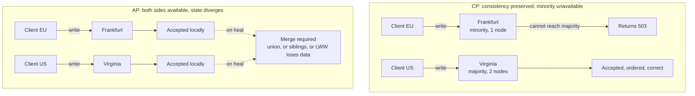
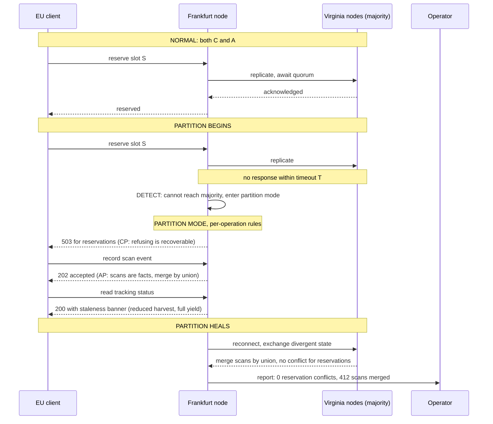

# Chapter 14: CAP Theorem

## 14.1 Problem Statement

The tracking platform opens a second region. Warehouses in Europe write to a cluster in Frankfurt, warehouses in the United States write to one in Virginia, and the two replicate to each other. Chapter 6's Set B architecture, finally built.

Seven weeks later, a routing change makes the two regions unable to reach each other for nine minutes. Nothing crashed. Both regions are up, both are serving traffic, both are healthy by every metric in Chapters 10 and 13. They simply cannot talk.

Here is what each part of the system does, and none of it was decided deliberately.

**The scan ingestion service keeps accepting writes in both regions.** A parcel is scanned in Hamburg and in Newark within the same minute. Both regions record their own version of the truth. Neither knows about the other.

**The inventory reservation service also keeps accepting writes.** There is one unit of a returns-processing slot left. Both regions confirm it to a different customer. The platform has now promised the same physical thing twice.

**The label allocation service refuses everything.** It requires a quorum, cannot reach a majority from Frankfurt, and returns errors. European warehouses stop being able to print labels. Physical work stops in eleven buildings.

**The tracking read path serves whatever it has,** silently, with no indication that the data is nine minutes stale.

Four services, four different answers, in the same nine minutes. Nobody chose this. Each behaviour is an accident of the library, the database driver, and the defaults each team happened to inherit.

Then the partition heals, and the second failure begins. Replication reconciles using last-write-wins on timestamps, so for every parcel scanned on both sides, one region's scan is silently discarded. Around 3,000 scan events vanish. Chapter 12 guaranteed durability against machine loss; this is data acknowledged, durably stored, and then thrown away by a conflict resolution rule nobody had read.

In the incident review, an engineer says the thing that makes this chapter necessary: *"I thought we were a CA system. We chose consistency and availability and gave up partition tolerance."*

That sentence is not right, and understanding exactly why is one of the more useful things a distributed systems engineer can know.

## 14.2 Why This Problem Exists

**Partitions are not a design choice.** You can choose to run one machine, or to accept stale reads, or to refuse writes. You cannot choose whether packets get lost, whether a routing table gets misconfigured, or whether a network link saturates. In a system with more than one machine, partitions are an environmental fact, and the only decision available is what to do when one happens.

**The theorem is almost always quoted in a form that is wrong.** "Pick two of three" implies three symmetrical options. It is not a menu, and Section 14.5.3 explains what the real statement is. The misquote is not harmless: it produces exactly the belief in Section 14.1, that a team can select CA and stop thinking about partitions.

**The definitions are narrower than the words suggest.** "Consistency" in CAP means one very specific thing, linearizability, not ACID's C and not "the data looks right". "Availability" means a non-failing node returns a non-error response eventually, with no bound on how long. A system that answers every request in four hours is available under CAP and useless in practice. Reasoning about your architecture using the everyday meanings of these words gives you conclusions the theorem does not support.

**A partition does not look like a cable being cut.** It looks like a timeout. And Chapter 13 established that you cannot distinguish a slow node from a dead one, which means you cannot distinguish a slow network from a partitioned one either. Your system decides it is partitioned when some timeout expires, which means **you choose where the boundary is**, and that choice is usually a default in a config file.

**And the choice is made per operation, but people make it per system.** Reserving the last unit of inventory and reading a shipment status have completely different tolerances for staleness, and a well-designed system answers them differently. Labelling the whole platform "AP" or "CP" collapses a set of per-operation decisions into a single slogan that cannot be right for everything.

## 14.3 Real World Analogy

A shop with two branches and one shared stock ledger, kept in sync by a phone call whenever anything sells.

A customer walks into Branch A wanting the last remaining item. Normally the assistant phones Branch B, confirms it is still there, sells it, and both branches update the ledger. Everything agrees.

Now the phone line is down.

The assistant in Branch A has exactly two options, and no third one exists.

**Sell it.** The customer is served immediately. If Branch B sold the same item in the same minute, the shop has sold one item twice and will have to apologise to someone tomorrow. That is choosing availability over consistency.

**Refuse to sell until the phone works.** The ledger stays correct. The customer standing in front of you leaves without their item, and the shop takes no money. That is choosing consistency over availability.

The move everybody reaches for, *phone the other branch to check*, is unavailable by definition, because the phone is the thing that is broken. That is the entire theorem, and it is why the proof in Section 14.5.2 takes five lines.

Three refinements carry over exactly.

**A policy agreed in advance beats improvisation.** A shop that has decided "during a phone outage, only the main branch may sell, the other takes reservations" has a coherent answer. A shop where each assistant improvises has Section 14.1.

**The right answer differs by item.** Selling a common item that is in stock by the hundred can safely continue during an outage, because a small overcount is harmless. Selling the last unit of a scarce item cannot. Same shop, same outage, different rules, and that is Section 14.5.6.

**And someone has to clean up.** After the line comes back, the two ledgers must be reconciled, and if the rule is "whichever entry has the later timestamp wins", one branch's genuine sale is erased. Choosing availability is not free; it defers the cost to a merge that must be designed rather than assumed.

## 14.4 Simple Explanation

The CAP theorem is a statement about three properties of a distributed system.

| Letter | Name | What it actually means |
|---|---|---|
| C | Consistency | Every read sees the most recent completed write, as if there were a single copy of the data. Formally, linearizability |
| A | Availability | Every request to a node that has not failed receives a non-error response. **No time limit** |
| P | Partition tolerance | The system continues to operate even when the network drops arbitrary messages between nodes |

And the theorem says: **you cannot have all three at once.**

The version to actually use, which is what the theorem means in practice:

> **When a partition occurs, you must choose between consistency and availability. When there is no partition, you can have both.**

That reframing does a lot of work. It says the choice is conditional and rare rather than permanent. It says a system is not "a CP system" in some essential way; it is a system that behaves a particular way during partitions. And it makes clear that P is not something you trade away, because it describes the environment, not your design.

Two definitional traps worth fixing immediately, because almost every casual use of CAP falls into one of them:

**CAP's C is not ACID's C.** ACID's consistency means the database enforces your declared constraints and invariants, which is Chapter 16. CAP's consistency means all nodes agree on the order of operations, which is a replication property. They are unrelated ideas that share a word.

**CAP's A has no latency bound.** A node that eventually responds is available under the theorem regardless of how long it takes. This is why CAP alone is a poor tool for real design decisions, and why Chapter 15's PACELC exists: the interesting trade in normal operation is between consistency and *latency*, and CAP has nothing to say about it.

## 14.5 Technical Deep Dive

### 14.5.1 The proof, in five lines

The theorem was conjectured by Eric Brewer in 2000 and proved by Gilbert and Lynch in 2002. The proof is short enough to reproduce, and understanding it means you never need to memorise the conclusion.

```
Two nodes, N1 and N2, both holding a copy of value v0.
The network between them is partitioned: no messages get through.

1. A client writes v1 to N1.
2. N1 tries to tell N2. The message is lost.
3. A client reads from N2.

N2 has exactly two options:

   (a) Return v0.        The write completed, so this is stale.  NOT consistent.
   (b) Return nothing.   Wait for N1, which it cannot reach.     NOT available.

There is no third option, because the only mechanism that could
produce a correct answer is the network, which is the thing that failed.
```

That is the whole theorem. It is not a deep result about the limits of engineering; it is an observation that information cannot travel through a broken link, and every consequence in this chapter follows from it.

One thing the proof makes obvious that the slogan hides: **the choice happens at the moment of the request, on a specific node, for a specific operation.** It is not a property stamped on a system at design time.

### 14.5.2 Why "pick two of three" is wrong

The popular formulation presents three properties and invites you to select two, which suggests that CA is an option in the same way that CP and AP are. It is not, for a simple reason: **C and A are properties you design; P is a property of the world.**

You can no more choose to not have partitions than you can choose to not have hardware failures. So what does "CA" actually describe?

| Claimed | What it really is |
|---|---|
| CP | During a partition, refuse requests that cannot be answered correctly. Consistent, some nodes unavailable |
| AP | During a partition, answer anyway, possibly with stale or conflicting data. Available, temporarily inconsistent |
| **CA** | A single node, or a system that has simply not decided what to do when partitioned. When one occurs, it gets neither property, unpredictably |

A single-node database genuinely is CA, because there is no network between replicas to partition. The moment you add a replica, CA stops being available as a category, and any system claiming it is either not distributed or has not thought about it.

Brewer himself revisited this twelve years after the original conjecture, and his correction is explicit: the two-of-three framing is misleading, partitions are rare enough that systems should not be designed as though they were permanent, and the practical work is choosing per-operation behaviour during a partition and planning what happens when it heals. His framing splits the problem into three phases, which is far more useful than a slogan:

```
1. Detect the partition.
2. Enter an explicit partition mode, with per-operation rules
   about what is allowed and what is refused.
3. Recover: merge the divergent state, and compensate for any
   invariants violated while partitioned.
```

Section 14.1's platform had none of the three. It did not detect, it had no mode, and its recovery silently deleted data.

### 14.5.3 What a partition actually is

The word suggests a severed cable and a clean split into two halves. Real partitions are messier, and one variety in particular is why this matters day to day.

| Kind | Description | Why it is hard |
|---|---|---|
| Clean split | Two groups, no messages between them | The textbook case, and the easiest |
| Asymmetric | A can reach B, B cannot reach A | Each side has a different view of who is alive |
| Partial | A reaches B, B reaches C, A cannot reach C | No coherent "sides", membership algorithms struggle |
| Intermittent | Works for a few seconds, fails for a few seconds | Causes flapping, repeated failovers, thrash |
| **Slow, not broken** | Messages arrive, far too late | **Indistinguishable from a partition** |

That last row is the one that matters, and it connects directly to Chapter 13. If a node does not respond within your timeout, you cannot tell whether the network dropped the message, the node is paused in garbage collection, or the reply is still in flight. Your system declares a partition when a timer expires.

Which leads to a genuinely important practical statement:

> **A partition is defined by your timeout, not by the network.**

Set a 500 millisecond timeout and a garbage collection pause becomes a partition. Set 30 seconds and a real network break goes unnoticed for half a minute while requests hang. You are not observing a physical fact; you are choosing a threshold, and Chapter 13's trade between false positives and false negatives is exactly this trade.

Two consequences worth carrying:

**"Partitions are rare" is only true at a coarse timeout.** At a 100 millisecond threshold, brief partitions happen constantly in any real network, which is why systems with tight timeouts spend far more time in partition mode than their operators expect.

**Section 14.1's nine-minute event was not a cable cut.** It was a routing change, and the same behaviour would have arisen from a saturated link, an overloaded node, or a security group edit. Most "partitions" in practice are configuration.

### 14.5.4 What CP and AP actually feel like

Not as abstract categories, but as operational experiences.

**CP during a partition.** The majority side keeps working normally. The minority side refuses writes, and typically refuses linearizable reads too, returning errors or timing out. Nothing diverges, nothing needs merging afterwards, and some of your users cannot work.

| System | Behaviour during partition |
|---|---|
| ZooKeeper, etcd, Consul | Minority partition refuses writes. Leader election requires a majority |
| Postgres or MySQL with synchronous replication | Writes block if the required replicas are unreachable |
| MongoDB with majority write concern | Writes fail without a majority; a minority primary steps down |
| Spanner | Minority partition unavailable for writes; consistency preserved |

**AP during a partition.** Every side keeps accepting reads and writes. State diverges. When the partition heals, something has to reconcile, and that something is a design decision you either made or inherited.

| System | Behaviour during partition |
|---|---|
| Cassandra at low consistency levels | Both sides accept writes, reconciled later |
| Riak, Dynamo-style stores | Always writable, divergent versions kept as siblings |
| DNS | Serves whatever it has, with a time to live |
| CDN edges, most caches | Serve stale content happily |

The cost of choosing A is entirely in the reconciliation, and the available strategies differ enormously in how much they lose:

| Strategy | How it resolves | What it costs |
|---|---|---|
| Last write wins | Highest timestamp survives | **Silently destroys the other write.** Section 14.1's 3,000 lost scans |
| Version vectors | Detects concurrent writes and keeps both as siblings | Application must merge, and must handle siblings everywhere |
| CRDTs | Data types that merge deterministically with no conflicts | Only works for structures that can be expressed this way |
| Application merge | Domain logic decides, for example union the two scan sets | Correct, and it is real work per data type |
| Manual reconciliation | A human decides | Does not scale, and sometimes it is the only honest answer |

Last-write-wins deserves its warning label. It is the default in several systems because it is simple and requires no application involvement, and it is a data loss mechanism dressed as a conflict resolution mechanism. It is safe only where writes are genuinely idempotent overwrites from a single authoritative source, which is the same condition Chapter 11 gave for skipping optimistic locking.

For Section 14.1's scan events, the correct merge is obvious once anyone thinks about it for ten seconds: **scans are events, so union them.** Two scans of the same parcel from two regions are both true. The conflict was manufactured by modelling an append-only event stream as a mutable row.

### 14.5.5 The choice is per operation

This is the mature framing and the one to bring to an interview. A real system makes different choices for different operations, based on what the business consequence of each error actually is.

| Operation | Choice | Reason |
|---|---|---|
| Record a scan event | AP | Scans are facts that already happened. Refusing does not un-scan the parcel. Merge by union |
| Read a tracking status | AP | Stale by a few minutes is fine, and Chapter 6's ranking says show the timestamp |
| Reserve the last returns slot | **CP** | Overselling has a real cost. Refusing is recoverable, double-booking is not |
| Allocate a label serial number | **CP** | Duplicate serials break the carrier integration permanently |
| Update user preferences | AP | Last write wins is acceptable here, since the user is the single writer |
| Read a user's own recent write | Read from the primary | Read-your-writes, which is Chapter 18 |
| Authenticate a session token | AP with cached decisions | Availability matters more, and a bounded staleness window is acceptable |
| Change a user's password | CP | Security-sensitive, must not apply to a stale state |

Modern databases expose this as configuration rather than as an architectural commitment, which is what makes per-operation choice practical:

```
Cassandra:      consistency level per query
                ONE / QUORUM / LOCAL_QUORUM / ALL
                QUORUM read + QUORUM write gives strong consistency (R + W > N)

MongoDB:        writeConcern: { w: "majority" }   readConcern: "majority"
                versus w: 1 and readConcern "local"

DynamoDB:       ConsistentRead: true  (strong, costs more, single region)
                ConsistentRead: false (eventual, cheaper, faster)

Postgres:       synchronous_commit and synchronous_standby_names
                per transaction, so one write path can be strict and another fast
```

```java
// The pattern worth adopting: make the choice explicit in code,
// next to the operation, with the reason written down.
// A silent default is how Section 14.1 happened.

@ConsistencyPolicy(mode = AVAILABLE, merge = UNION,
        reason = "Scans are facts. Refusing does not un-scan a parcel.")
public void recordScan(ScanEvent e) { ... }

@ConsistencyPolicy(mode = CONSISTENT, onPartition = REJECT,
        reason = "Double-allocating a slot cannot be undone.")
public Reservation reserveSlot(String slotId, String customerId) { ... }
```

### 14.5.6 Beyond binary: harvest and yield

CAP presents availability as a yes or no property, and real systems degrade far more gracefully than that. A more useful framing, from Fox and Brewer's earlier work, splits it in two:

- **Yield**: the fraction of requests answered.
- **Harvest**: the fraction of the data reflected in an answer.

That distinction unlocks middle options CAP cannot express:

| Response | Yield | Harvest |
|---|---|---|
| Full correct answer | 1.0 | 1.0 |
| Error | 0 | not applicable |
| Answer from the reachable shards only, and say so | 1.0 | 0.7 |
| Answer from stale data, with its age shown | 1.0 | complete but old |
| Answer without the personalised section | 1.0 | partial |

A search that returns results from seven of ten shards, and says so, is far more useful than an error, and far more honest than pretending it is complete. Section 14.1's tracking read path was already doing something like this by accident; the failure was that it did not say so.

This is Chapter 10's graceful degradation, expressed precisely, and it is the reason the mature answer to "AP or CP" is often "neither, we reduce harvest and keep yield, and we tell the user".

### 14.5.7 What CAP does not tell you

Knowing the limits of the theorem is as valuable as knowing the theorem, and this is where most misuse comes from.

| Question | Does CAP answer it? |
|---|---|
| What do I do during a partition? | Yes, and only this |
| What should I do in normal operation, when there is no partition? | **No.** CAP is silent. Chapter 15's PACELC covers it |
| Is a slower consistent read worth the latency? | **No.** CAP has no notion of latency at all |
| Which consistency model should I use below linearizability? | **No.** There is a whole spectrum, in Chapters 18 and 19 |
| How do I resolve conflicts after choosing A? | **No.** That is Section 14.5.4's problem and it is yours |
| Is my database actually giving me what it claims? | **No.** That requires testing, and the answer is often not |

The last row deserves a note. Vendor claims about consistency guarantees are frequently stronger than what the software delivers under real fault conditions, and the systematic testing work published under the name Jepsen has repeatedly found databases violating their documented guarantees during partitions, clock skew, and process pauses. The lesson is Chapter 12's, again: the guarantee you have is the one you have tested, not the one in the documentation.

## 14.6 Architecture Diagram

The same partition, with the two possible behaviours side by side. This is the diagram to draw on a whiteboard when someone says "we are a CA system".



ASCII version:

```
        ---- PARTITION ----

CP CHOICE                             AP CHOICE
  EU client -> Frankfurt (minority)     EU client -> Frankfurt
                 |                                     |
             503 error                            accepted locally
        (correct, and nobody in                        |
         Europe can work)                              |
                                                       |
  US client -> Virginia (majority)      US client -> Virginia
                 |                                     |
             accepted                             accepted locally
        (ordered, consistent)                          |
                                                       v
        ---- PARTITION HEALS ----              two divergent histories
                                                       |
CP: nothing to merge. Done.             AP: merge. Union is safe for events.
                                            LWW silently deletes one side.
```

Three things to read off it.

**Neither column is the correct answer.** The correct answer is per operation, which is why Section 14.5.5 exists. The label allocation service should be in the left column and the scan ingestion service in the right one, in the same system, during the same partition.

**The CP side has no merge step**, which is its real advantage. Consistency is not only about correctness during the partition; it is about not owing yourself a reconciliation afterwards.

**The AP side's cost is entirely in the last box.** Choosing availability is cheap during the partition and expensive after it, and the expense is deferred, invisible, and usually unbudgeted. That asymmetry is why AP is chosen by default and regretted later.

## 14.7 Request Flow

One operation, reserving the last returns slot, traced through the three phases Brewer identified: detect, partition mode, recover.



Step by step, with the decision at each point:

1. **Normal operation gives both properties.** Worth stating, because the theorem is often read as though the trade is permanent. It applies only during the partition.
2. **Detection is a timeout expiring**, not an event the network reports. Section 14.5.3's point: the length of that timeout is the definition of a partition for this system.
3. **Entering partition mode is explicit,** which is the step Section 14.1's platform lacked. Every operation now consults a written rule rather than whatever the driver's default happens to be.
4. **Reservations are refused.** Refusing a reservation is recoverable: the customer retries in nine minutes. Double-allocating a physical slot is not recoverable, so this operation is CP.
5. **Scan events are accepted.** The parcel was scanned; that is a fact about the world and refusing to record it does not change it. This operation is AP with a union merge, and it has no conflict by construction.
6. **Reads are served with reduced harvest.** Full yield, stale data, and the staleness is displayed. This is the option CAP cannot express and it is usually the best one.
7. **Recovery merges deterministically.** Scans union. Reservations cannot conflict because one side refused them. Nothing is silently discarded, and the merge produces a report rather than happening invisibly.

The property worth naming: **the recovery step is trivial because the partition-mode rules were chosen with recovery in mind.** Choosing AP for events with a union merge means there is nothing to resolve. Choosing CP for reservations means there is nothing to resolve. The nightmare merges come from choosing AP for operations whose conflicts have no natural resolution, and then discovering it while reconciling.

## 14.8 Internal Components

| Component | Role | Failure mode | Guard |
|---|---|---|---|
| Failure detector and timeout | Defines when a partition exists | Too short causes constant false partitions; too long hangs requests | Tune deliberately, and document the value as a design decision |
| Quorum logic | Decides which side may act | Even node counts, so no majority exists | Odd numbers of voting members, and witness or arbiter nodes |
| Fencing tokens | Stops a stale leader acting after reconnection | Absent, so both sides write | Monotonic tokens, rejected downstream (Chapter 13) |
| Per-operation consistency policy | The actual CAP decision | Inherited driver defaults, so nobody chose | Written policy per operation, visible in code |
| Partition mode | Explicit degraded behaviour | Does not exist, so behaviour is accidental | Detect, switch, log, alert, and expose it in the response |
| Staleness indicator | Tells the caller the data's age | Absent, so stale looks fresh | Return the timestamp and surface it in the interface |
| Conflict detection | Notices divergence at heal time | Only comparing timestamps, so concurrency is invisible | Version vectors, or an append-only model with no conflicts |
| Merge function | Resolves divergence | Last write wins, silently discarding data | Union for events, CRDTs where they fit, domain merge otherwise |
| Reconciliation report | Makes the merge auditable | Merges happen silently | Emit counts and samples of every conflict resolved |
| Invariant compensation | Fixes what partition mode allowed to break | Ignored, so oversells persist | Detect violations after heal and compensate explicitly |

The two rows most often missing entirely are partition mode and the reconciliation report. Without the first, behaviour is whatever the defaults do. Without the second, the cost of choosing availability is invisible, which is why teams keep choosing it without knowing what it costs them.

## 14.9 Production Example

**Brewer's own revision is the most useful thing to read on this topic.** Twelve years after the original conjecture, he wrote that the two-of-three formulation is misleading, that partitions are rare enough that systems should not be permanently crippled in anticipation of them, and that the useful design question is how to detect a partition, what to do in an explicit partition mode, and how to recover afterwards. He also emphasised that the choice is fine-grained: different operations, different data, and different parts of a system can make different decisions in the same partition. Section 14.5.5 is that idea applied.

**Spanner is the interesting hard case.** Google's globally distributed database provides externally consistent transactions across regions, which sounds like it contradicts CAP. It does not. Spanner is CP: during a partition, the minority side cannot commit. What makes it feel like something more is that Google controls the network, invests heavily in redundant paths, and the resulting partition rate is low enough that the observed availability is very high. Brewer's later analysis makes exactly this point, that Spanner is technically CP while being effectively available enough that users treat it as though partitions never happen, and that its outages are dominated by causes other than partitions.

The lesson generalises usefully: **CP does not mean low availability.** It means unavailability is concentrated in partition events, so if you can make partitions rare, CP is affordable. This is an engineering and investment question rather than a theoretical one.

**Dynamo is the AP archetype**, and its motivation is worth understanding because it is a business argument rather than a technical one. Amazon's shopping cart had to accept writes at all times, since a customer unable to add an item is lost revenue, whereas a cart that briefly shows a stale state is a minor annoyance. So the system was designed to be always writable, with divergent versions retained and reconciled later, and the classic reconciliation for a cart is a union of items. Notice that the merge strategy was chosen alongside the availability decision, not discovered afterwards.

**And the systematic testing work published as Jepsen** is the empirical counterweight to all vendor documentation. It has repeatedly found databases and coordination systems violating their claimed guarantees under partitions, clock skew, and process pauses, including systems marketed as strongly consistent. The takeaway matches Chapters 12 and 13: **the guarantee you have is the one you have tested under fault conditions**, and partition behaviour is exactly the behaviour that never gets exercised in normal operation.

## 14.10 Advantages

Understanding CAP properly, rather than as a slogan, buys specific things:

- **The behaviour during partitions becomes a decision** rather than an accident of library defaults, which is the difference between Section 14.1 and Section 14.7.
- **Per-operation choice matches the business consequence.** Refusing a reservation and refusing a scan are not equally costly, and treating them identically is a mistake in one direction or the other.
- **Reconciliation gets designed up front,** which is what prevents last-write-wins silently deleting real data.
- **Impossible requirements get identified early.** A demand for strict consistency and full availability across regions during partitions is arithmetic that does not work, and knowing the theorem lets you say so in the design review.
- **Harvest and yield give you the middle ground** that the binary framing hides, which is usually the best user experience available.
- **Vendor claims become checkable.** Knowing what linearizability means lets you ask what a system does with a minority partition, and to test it.

## 14.11 Limitations

- **CAP only describes partitions**, which are rare. It says nothing about the other 99.9 percent of the time, where the real trade is consistency against latency. That is Chapter 15.
- **The definitions are extreme.** Availability with no latency bound and consistency as full linearizability are both endpoints of spectra, and most real systems live somewhere in between on both axes.
- **It is binary about availability,** which real systems are not. Harvest and yield describe them better.
- **It gives no guidance on conflict resolution,** which is the actual work of choosing availability.
- **The system-level label is meaningless.** Calling a database "AP" or "CP" hides that most modern systems are tunable per operation.
- **It says nothing about the partition rate,** which is the number that decides whether CP is affordable. Spanner and a system on a flaky network make the same theoretical choice with completely different outcomes.
- **And it assumes you can detect partitions,** which Chapter 13 established is a guess with a timeout attached.

## 14.12 Trade-offs

| Dial | One way | The other way |
|---|---|---|
| Partition behaviour | CP: correct, minority cannot work, no merge afterwards | AP: everyone works, divergence, merge required |
| Detection timeout | Short: fast reaction, frequent false partitions and flapping | Long: stable, requests hang during real partitions |
| Quorum size | Larger: safer, less available under failure | Smaller: more available, weaker guarantee |
| Conflict resolution | Last write wins: trivial, silently destroys data | Siblings or domain merge: correct, real work per data type |
| Granularity | Per system: simple to reason about, wrong for some operations | Per operation: matches consequences, more to understand |
| Degradation | Binary: simple, harsh | Harvest and yield: better experience, more code paths |
| Regional topology | Single region: no cross-region partitions, worse latency and blast radius | Multi-region: better locality and survivability, partitions become routine |

The removal test.

**Remove CP from the reservation path and make everything AP.** You gain uniform behaviour and full availability during partitions. You lose the ability to enforce a scarce-resource invariant, so you oversell, and the compensation is a human apologising to a customer. Correct for a shopping cart, wrong for the last physical slot.

**Remove AP from the scan path and make everything CP.** You gain a system with no merges and no divergence. You lose the ability to record events that already happened, so eleven warehouses stop working during a nine minute network event, which is a large real-world cost to avoid a conflict that has a trivial resolution.

**Remove the staleness indicator.** You gain a cleaner response payload. You lose the user's ability to know whether to trust what they are seeing, which converts a graceful degradation into a silent wrong answer, and Chapter 11 explains why that is the worst outcome available.

**Remove the reconciliation report.** You gain nothing measurable. You lose all visibility into what your conflict resolution is actually doing, which is how 3,000 discarded scans go unnoticed for a quarter.

## 14.13 Common Mistakes

**Saying "we are CA".** Partition tolerance is not a property you decline. A distributed system claiming CA has an undefined behaviour during partitions, which means it will get neither property when one occurs.

**Treating the label as a system-wide property.** Modern databases are tunable per operation, and different operations have different consequences.

**Confusing CAP's C with ACID's C.** Linearizability and constraint enforcement are unrelated concepts sharing a letter.

**Assuming availability implies fast.** CAP's availability has no latency bound. A ten second response is available and useless.

**Leaving the choice to driver defaults.** Section 14.1's four services made four different choices, none deliberately.

**Using last-write-wins without understanding it.** It resolves conflicts by deleting data, silently, and it is the default in more systems than people realise.

**Modelling events as mutable state.** Two scans of a parcel are not a conflict unless you have forced them to be by storing a single mutable row instead of an append-only stream.

**Forgetting the recovery phase.** Detection and partition mode get attention; merging and compensating for invariants broken during the partition rarely do.

**Setting timeouts without realising you are defining "partition".** A 200 millisecond threshold means garbage collection pauses are partitions.

**Testing only the happy path.** Partition behaviour is never exercised in normal operation, so it is almost always wrong the first time it runs, which is during an incident.

**Even numbers of voting nodes.** Four nodes split two and two have no majority, so nobody can make progress.

**Believing the documentation.** Claimed guarantees and delivered guarantees diverge under fault conditions more often than vendors would like.

## 14.14 Interview Questions

**Q: State the CAP theorem.**
In a system where the network may drop messages between nodes, you cannot simultaneously guarantee linearizable consistency and availability, where availability means every request to a non-failing node gets a non-error response. The practical form is that during a partition you must choose consistency or availability, and outside a partition you can have both.

**Q: Why is "pick two of three" wrong?**
Because partitions are a property of the environment rather than a design option. You cannot choose not to have them, so CA is not a category for a distributed system. It describes either a single node or a system that has not decided what to do when partitioned, and which therefore gets neither property when one occurs.

**Q: Prove it.**
Two nodes with a copy each, partitioned. A client writes to node one, which cannot inform node two. A client then reads from node two. Node two either returns the old value, which is not consistent, or returns nothing while waiting for a node it cannot reach, which is not available. There is no third option, because the only channel that could give a correct answer is the one that failed.

**Q: Is CAP's consistency the same as ACID's consistency?**
No. CAP's C is linearizability, a property of how replicas order operations. ACID's C is the database enforcing declared constraints and invariants. They share a word and nothing else.

**Q: How do you decide between CP and AP?**
Per operation, based on the cost of each error. If serving stale or conflicting data causes an unrecoverable harm, such as double-allocating a scarce resource or issuing duplicate identifiers, choose consistency. If refusing the request causes more harm than temporary divergence, and the divergence has a natural merge, choose availability.

**Q: What does a partition actually look like in production?**
A timeout expiring. It may be a genuine network break, but it is equally likely to be a saturated link, a misconfigured route or security group, an overloaded node, or a long garbage collection pause. Because slow and disconnected are indistinguishable, your timeout value is effectively the definition of a partition for your system.

**Q: You choose AP. What have you signed up for?**
Designing conflict resolution. That means detecting concurrent writes, ideally with version vectors rather than timestamps, and choosing a merge strategy per data type: union for event sets, CRDTs where they fit, domain-specific merges otherwise. Last-write-wins is not a resolution strategy, it is silent data loss with a friendly name.

**Q: Is Spanner a counterexample to CAP?**
No. It is CP: during a partition, the minority side cannot commit. It appears to escape the trade because Google's network engineering makes partitions rare enough that observed availability is very high, and its outages are dominated by other causes. The general lesson is that CP is affordable when your partition rate is low.

**Q: What is harvest and yield?**
Yield is the fraction of requests answered; harvest is the fraction of the data reflected in an answer. It replaces CAP's binary availability with a spectrum, so a search that returns results from seven of ten shards and says so has full yield and reduced harvest, which is usually a better outcome than either an error or a false claim of completeness.

**Q: What question does CAP not answer?**
What to do in normal operation, which is almost all of the time. It says nothing about latency, so it cannot tell you whether a consistent read is worth the extra round trip when there is no partition at all. That is what PACELC adds, and it is the trade you actually make every day.

## 14.15 Production Best Practices

1. **Write a per-operation consistency policy** and put it in code next to the operation, with the reason. Never let a driver default decide.
2. **Implement an explicit partition mode:** detect, switch, log, alert, and expose it in responses rather than behaving differently by accident.
3. **Choose the detection timeout deliberately** and document it as the definition of a partition for your system.
4. **Use odd numbers of voting members** so a majority always exists, and add witness nodes rather than an even count.
5. **Never use last-write-wins** unless the write is a genuinely idempotent overwrite from a single authoritative source.
6. **Model facts as append-only events** wherever possible, so concurrent writes union rather than conflict.
7. **Design the merge before choosing availability.** If you cannot describe the merge, you have not finished choosing AP.
8. **Return staleness with every potentially stale read,** and surface it in the interface.
9. **Prefer reducing harvest to reducing yield.** A partial answer that admits it is partial beats an error and beats a silent lie.
10. **Emit a reconciliation report** after every heal: conflicts found, resolutions applied, samples retained.
11. **Compensate for invariants broken during partition mode,** which means detecting oversells and duplicates after recovery rather than hoping.
12. **Use fencing tokens** so a reconnecting minority leader cannot write.
13. **Test partition behaviour** by actually partitioning a cluster, as a scheduled exercise. It is the code path that never runs otherwise.

## 14.16 Summary

CAP says that when the network partitions, you must choose between linearizable consistency and availability, and that outside a partition you can have both. That conditional is the whole theorem, and the proof takes five lines: a write lands on one side of a partition, a read arrives on the other, and the reading node can either return stale data or return nothing, because the only channel that could give it a correct answer is the one that has failed.

The popular "pick two of three" formulation is misleading and causes real damage, because it suggests that partition tolerance is optional. It is not. Partitions are a property of the environment, and a distributed system that claims CA has simply not decided what it does when one happens, which means it will do four different things in four different services, as Section 14.1's platform did.

Two corrections make the theorem usable. First, **the choice is per operation, not per system.** Recording a scan and reserving the last physical slot have completely different costs of error, so they should behave differently in the same partition, and modern databases expose exactly this as per-query configuration. Second, **availability is not binary.** Harvest and yield describe real systems better: a partial answer that states what is missing, or a stale answer that shows its age, is usually better than both an error and a confident wrong answer.

The cost of choosing availability is deferred rather than avoided, and it is paid at reconciliation. That is where last-write-wins quietly destroys real data, and where a merge that was never designed becomes an incident. So the discipline is to design the merge at the same moment you choose availability, and to prefer data models, particularly append-only events, whose merges are trivially correct.

Finally, CAP describes the rare case. The trade you make on every request, all day, is between consistency and latency when the network is perfectly healthy, and the theorem has nothing to say about it. That is Chapter 15.

## 14.17 Quick Revision Notes

- CAP: with an unreliable network you cannot have both linearizable consistency and availability. Practically: during a partition, choose C or A; outside one, you get both.
- The proof: write to N1, partition, read from N2. Either stale, or no answer. No third option.
- "Pick two of three" is wrong. P is the environment, not a choice. CA describes a single node, or a system with undefined partition behaviour.
- CAP's C is linearizability. ACID's C is constraint enforcement. Unrelated ideas, same letter.
- CAP's A has no latency bound. A ten second answer is "available".
- A partition is defined by your timeout, not by the network. Slow and disconnected are indistinguishable (Chapter 13).
- Most real partitions are configuration changes, saturated links, or pauses, not cut cables.
- Three phases: detect, explicit partition mode with per-operation rules, recover with a designed merge.
- CP feels like: minority refuses writes, no divergence, no merge needed afterwards.
- AP feels like: everyone keeps working, state diverges, and you owe a reconciliation.
- Last-write-wins is silent data loss, not conflict resolution. Safe only for idempotent overwrites from one authoritative writer.
- Model facts as append-only events and concurrent writes union instead of conflicting.
- The choice is per operation. Reserve the last slot: CP. Record a scan: AP with union. Read a status: AP with a staleness banner.
- Tunable in practice: Cassandra consistency levels, MongoDB read and write concerns, DynamoDB consistent reads, Postgres synchronous commit.
- Harvest and yield beat binary availability. Prefer a partial answer that admits it is partial.
- CP does not mean low availability. If partitions are rare, CP is cheap. That is the Spanner lesson.
- CAP says nothing about normal operation, latency, weaker consistency models, or conflict resolution. PACELC is next.
- Test partition behaviour deliberately. It is the code path that never runs until an incident.

## 14.18 Mini Quiz

1. State the CAP theorem in its practical form, and give the five-line proof.
2. Your colleague says the system is CA because the network is reliable. What is wrong with that position?
3. A node has a 9 second garbage collection pause and your failure detector times out at 5 seconds. Has a partition occurred?
4. For each, choose CP or AP with a reason: recording a payment authorisation; recording a page view; allocating an invoice number; updating a user's display name; reserving the last seat on a flight.
5. Why is last-write-wins dangerous, and when is it acceptable?
6. Two regions both record a scan of the same parcel during a partition. Is this a conflict?
7. Define harvest and yield, and give an example of a response with full yield and reduced harvest.
8. Your cluster has four voting nodes split two and two by a partition. What happens under a majority rule, and what should you have done?
9. Is Spanner a counterexample to CAP? Explain.
10. Which trade does CAP not describe, and why does that matter more day to day?

**Answers**

1. During a network partition you must choose between linearizable consistency and availability; when there is no partition you can have both. Proof: two nodes hold v0 and are partitioned. A client writes v1 to N1, which cannot propagate it. A client reads from N2, which must either return v0, which is stale and therefore not consistent, or return nothing while waiting for N1, which it cannot reach, and is therefore not available. No third option exists because the network is the only mechanism that could produce a correct answer.
2. Partition tolerance is not a property you choose; it describes the environment. Networks partition through misconfiguration, saturation, routing changes, and process pauses, not only through cut cables. A distributed system claiming CA has no defined behaviour when a partition occurs, so it will behave inconsistently across services, which is worse than having chosen either property deliberately.
3. From the system's point of view, yes. The detector cannot distinguish a paused node from an unreachable one, so it will declare the node unreachable and act accordingly, including possibly electing a new leader. This is why the timeout value is effectively the definition of a partition, and why fencing tokens matter when the paused node returns.
4. Payment authorisation: CP, because authorising twice or against stale state has unrecoverable financial consequences. Page view: AP, because it is an event that happened, loss or duplication is statistically tolerable, and refusing it gains nothing. Invoice number: CP, since duplicate invoice numbers break accounting and integrations permanently. Display name: AP, since the user is the single writer and last write wins is acceptable. Last seat on a flight: CP, because double-booking a scarce physical resource cannot be undone by software.
5. Because it resolves conflicts by discarding one of two genuine writes, silently, with no record, and clock skew between nodes means the surviving write may not even be the later one. It is acceptable only when the write is an idempotent overwrite of a value with a single authoritative source, where a later write always legitimately supersedes an earlier one and nothing is computed from prior state.
6. No, unless you have made it one by modelling parcel state as a single mutable row. Both scans are true facts about the world, so an append-only event model merges them by union with no conflict at all. This is the general lesson that many CAP conflicts are artefacts of the data model rather than of the partition.
7. Yield is the fraction of requests that receive an answer; harvest is the fraction of the intended data reflected in that answer. A search returning results from seven of ten shards while stating that three shards were unreachable has full yield and 70 percent harvest, which is usually more useful than an error and more honest than presenting it as complete.
8. Neither side has a majority, so under a strict majority rule no side can elect a leader or commit writes and the entire cluster is unavailable for writes, which is the worst outcome of both options. Use an odd number of voting members, or add a lightweight witness or arbiter that participates only in voting, so a majority always exists on one side.
9. No. Spanner is CP: during a partition the minority side cannot commit, so it sacrifices availability rather than consistency. It appears to escape the trade only because the partition rate on Google's network is low enough that observed availability is very high and outages are dominated by other causes. The lesson is that CP is affordable when partitions are rare, which is an investment question rather than a theoretical one.
10. CAP says nothing about the trade between consistency and latency when there is no partition, which is essentially all of the time. That matters more day to day because every read has to decide whether to pay a cross-zone or cross-region round trip for a fresher answer, and that decision affects every request rather than the rare minutes when the network is broken. PACELC extends CAP to cover exactly this.

## 14.19 Hands-on Exercise

**Part 1: cause a real partition.** Run a three-node cluster of a system with configurable consistency, such as etcd, Cassandra, or MongoDB, in containers. Use firewall rules to isolate one node from the other two. Then, from a client attached to the minority node, attempt a write and a read. Record exactly what happens: error, hang, or stale success, and how long it takes. Repeat against the majority side.

**Part 2: move the dial.** With the partition still in place, repeat the writes and reads at every available consistency setting. For Cassandra that means ONE, QUORUM, LOCAL_QUORUM, and ALL; for MongoDB, write concerns of 1 and majority with matching read concerns. Build a table of setting against behaviour on each side of the partition. This table is the per-operation menu you will use for real design decisions.

**Part 3: destroy data with last-write-wins.** Configure a store that resolves with timestamps. Partition it, write different values to the same key on both sides, and heal. Record which value survived and whether anything anywhere reported that a value had been discarded. Then deliberately skew one node's clock by a few seconds and repeat, so you can see the surviving value be the older one.

**Part 4: make the conflict disappear.** Re-model the same data as an append-only event log with a union merge. Repeat the partition and heal. Confirm that both writes survive and that no resolution logic was needed. Write one paragraph on which of your production tables could be re-modelled this way.

**Part 5: write the policy.** For your own system, produce the table from Section 14.5.5: every significant operation, the choice, the reason, and the merge strategy where availability is chosen. Then check what the code and the driver defaults actually do today for each row. The gaps between the two columns are the incidents you have not had yet.

## 14.20 Further Reading

- *Brewer's Conjecture and the Feasibility of Consistent, Available, Partition-Tolerant Web Services*, Gilbert and Lynch, 2002. The formal proof, and shorter than its reputation suggests.
- *CAP Twelve Years Later: How the Rules Have Changed*, Eric Brewer, 2012. The author's own correction of the two-of-three framing, and the detect, partition mode, recover structure used in this chapter.
- *Spanner, TrueTime and the CAP Theorem*, Eric Brewer, 2017. Why a CP system can be effectively available, and what that costs to build.
- *Harvest, Yield, and Scalable Tolerant Systems*, Fox and Brewer, 1999. The framing that replaces binary availability with a spectrum.
- *Dynamo: Amazon's Highly Available Key-value Store*, DeCandia et al., SOSP 2007. The AP archetype, including the business reasoning and the shopping cart merge.
- *Please Stop Calling Databases CP or AP*, Martin Kleppmann. A clear argument for why the labels mislead, and what to say instead.
- *A Critique of the CAP Theorem*, Martin Kleppmann, 2015. Precise on where the definitions are too narrow to be useful.
- The Jepsen analyses, jepsen.io. Empirical tests of what real databases do under partition, clock skew, and pauses, as opposed to what they claim.

---

**Next chapter: Chapter 15, PACELC.** The extension that covers the case CAP ignores: what you trade when the network is perfectly healthy, which is the decision your system makes on every single request rather than during the rare minutes when something is broken.
