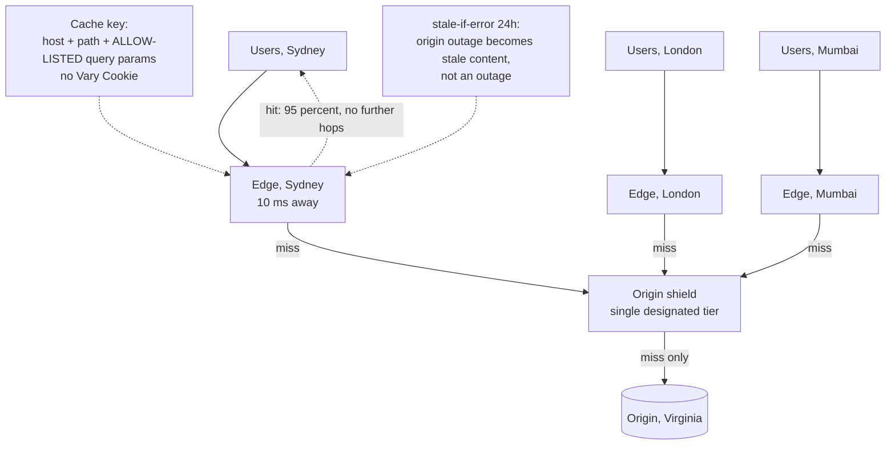
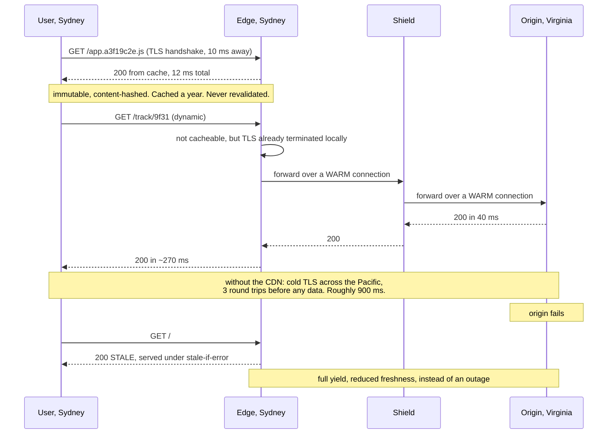

# Chapter 32: CDN

## 32.1 Problem Statement

The tracking platform puts a CDN in front of everything, for the reason Chapter 7 established: a user in Sydney is 250 milliseconds from Virginia and no amount of server-side optimisation changes that. The CDN bill arrives, the latency improves modestly, and the origin load barely moves.

The hit ratio is 31 percent.

**Every response carries `Vary: Cookie`.** The framework sets it by default. Since almost every user has a session cookie with a unique value, each user gets their own cache entry for every object, so the cache is storing millions of copies of the same logo.

**Analytics query parameters are part of the cache key.** The same product image is requested as `logo.png?utm_source=email`, `?utm_source=twitter`, and forty other variants. Forty cache entries, forty origin fetches, one image.

**Cache-control headers are missing on most responses,** so the CDN applies a conservative default of a few minutes, which for a logo that has not changed in two years is wasteful by a factor of thousands.

**A cache purge takes twenty minutes** to propagate globally, and the team discovers this during an incident when they need to remove an incorrect price.

**And an origin outage takes the site down completely,** despite the CDN holding a copy of nearly everything, because it was configured to treat stale content as unusable.

Every one of these is a configuration problem, not a workload property. The workload is highly cacheable; the configuration made it look otherwise.

## 32.2 Why This Problem Exists

**Cache keys include more than people expect.** By default a CDN keys on the full URL including the query string, plus whatever the origin's `Vary` header names. Both are easy to inflate accidentally, and each additional dimension multiplies the number of entries.

**Frameworks set cache-hostile headers by default.** `Vary: Cookie` and `Cache-Control: no-store` are common defaults chosen for safety, and safety here means never caching anything.

**Hit ratio is not monitored per object type.** An aggregate figure hides the fact that images are at 99 percent and API responses at 2 percent, so nobody knows which configuration is wrong.

**Purge is assumed to be instant** because it is a single API call, when it is a global propagation to hundreds of locations.

**And stale content is treated as an error condition** rather than as the best available answer during an origin failure, which discards the CDN's most valuable availability property.

## 32.3 Real World Analogy

A national chain of branch libraries with one central archive.

The archive holds everything. Branches hold whatever local readers have asked for recently. A reader who wants a popular novel gets it from the branch in two minutes; a reader who wants an obscure monograph waits three days while it comes from the archive.

The whole system works on the assumption that **requests are heavily skewed**, which they are: a small number of titles account for most borrowing. That skew is what makes a small branch collection satisfy most requests, and it is exactly Chapter 9's distribution property working in your favour for once.

Now break it in the ways Section 32.1 did.

**Catalogue every copy by the reader who requested it.** The branch now holds four hundred separate entries for the same novel, one per reader, and has room for far fewer distinct titles. That is `Vary: Cookie`.

**Treat "the novel, requested via the poster campaign" as a different title** from "the novel, requested via the newsletter". Same book, forty catalogue entries. That is query parameters in the cache key.

**Return everything to the archive after ten minutes,** regardless of how stable it is. That is a short default TTL on immutable content.

**And when the archive burns down, refuse to lend the copies you already hold** because you cannot verify they are current. That is failing instead of serving stale.

## 32.4 Simple Explanation

**A CDN is a network of caching servers placed close to users, serving content on behalf of your origin.**

It solves two distinct problems, and it is worth separating them because they have different measures of success:

| Problem | Mechanism | Measured by |
|---|---|---|
| **Distance** | Serve from a nearby location | Latency reduction, especially for distant users |
| **Origin load** | Answer without contacting the origin | Cache hit ratio, and origin request rate |

Chapter 7 established why the first cannot be solved any other way: round trips cost roughly a millisecond per hundred kilometres, so a user 15,000 kilometres away pays 150 milliseconds per round trip no matter how fast your servers are. Moving the content to within a few hundred kilometres of them is the only fix.

The second problem is where the money is. A 95 percent hit ratio means your origin serves one request in twenty, and Chapter 33 covers the general arithmetic of why that final few percent matters so much.

What a modern CDN does beyond caching:

| Function | Note |
|---|---|
| TLS termination at the edge | Handshake round trips are short (Chapter 7) |
| Connection reuse to origin | Warm, long-lived connections avoid handshakes per request |
| Compression and format conversion | Often better done at the edge than at origin |
| Denial of service absorption | Enormous distributed capacity in front of your origin |
| Edge compute | Small amounts of logic near the user |
| Origin shielding | A designated tier that absorbs misses from all edges |

## 32.5 Technical Deep Dive

### 32.5.1 The cache key

Everything about hit ratio comes down to this. The cache key determines what counts as "the same object", and every dimension you add multiplies the number of entries.

The default key is typically:

```
scheme + host + path + FULL query string + whatever Vary names
```

Each component is a place cardinality can explode:

| Component | Explosion risk | Fix |
|---|---|---|
| Query string | Analytics parameters, cache busters, session tokens | **Allow-list** the parameters that affect the response |
| `Vary: Cookie` | One entry per unique cookie value, so per user | Never send it for cacheable content |
| `Vary: User-Agent` | Thousands of variants | Use a device-class hint instead |
| `Vary: Accept-Encoding` | Two or three variants | Fine, and necessary |
| Host | Multiple hostnames for one asset | Normalise |

```
BAD: key includes the whole query string
  /logo.png?utm_source=email      -> entry 1, origin fetch
  /logo.png?utm_source=twitter    -> entry 2, origin fetch
  /logo.png?fbclid=xyz            -> entry 3, origin fetch

GOOD: key includes only parameters that change the response
  /logo.png                       -> one entry, one origin fetch, ever
```

The rule: **allow-list query parameters rather than ignoring specific ones.** New tracking parameters appear constantly, and a deny-list is always out of date.

`Vary: Cookie` deserves particular attention because it is the single most common cause of a low hit ratio on otherwise cacheable content. A response that varies by cookie is, in practice, uncacheable, because cookie values are unique per user. If content genuinely differs per user it should be marked private and not cached at the edge at all; if it does not, the header should not be sent.

### 32.5.2 Cache-control, and what the edge does with it

The headers that matter, and the distinction people miss:

| Directive | Effect |
|---|---|
| `max-age=N` | How long **any** cache may serve it without revalidating |
| `s-maxage=N` | How long a **shared** cache may, overriding `max-age` for the CDN only |
| `public` | May be cached by shared caches |
| `private` | Browser only, never the CDN |
| `no-cache` | May be stored, but must revalidate before each use |
| `no-store` | Must not be stored at all |
| `immutable` | Will never change; do not revalidate even on reload |
| `stale-while-revalidate=N` | Serve stale for N seconds while refreshing in the background |
| `stale-if-error=N` | **Serve stale for N seconds if the origin is failing** |

The separation of `max-age` and `s-maxage` is the useful one: browsers can be told to hold something briefly while the CDN holds it for a year, which means a change requires purging one CDN rather than waiting for millions of browsers.

```
Immutable assets, named with a content hash:
  Cache-Control: public, max-age=31536000, immutable
  A year, everywhere, never revalidated. Change the content, change the name.

HTML that must reflect changes quickly:
  Cache-Control: public, max-age=0, s-maxage=300,
                 stale-while-revalidate=60, stale-if-error=86400
  Browsers always revalidate; the CDN holds it for 5 minutes;
  a stale copy is served during a refresh, and for a DAY if the origin is down.

Genuinely per-user content:
  Cache-Control: private, no-store
```

`stale-if-error` is the directive that would have prevented Section 32.1's last failure, and it is the CDN's most underused availability feature. It converts an origin outage from a total outage into stale content, which is Chapter 14's harvest and yield: full yield, reduced freshness.

### 32.5.3 Content hashing beats invalidation

The most important structural decision, and it makes Chapter 34's problem disappear for static assets.

```
Mutable name:   /app.js            Cache-Control: max-age=300
                Change the file, wait 5 minutes, or purge globally.
                Fast changes require short TTLs, which means low hit ratio.

Immutable name: /app.a3f19c2e.js   Cache-Control: max-age=31536000, immutable
                Change the file, and the NAME changes. The old entry is
                simply never requested again. No purge, no TTL trade-off.
```

With content-hashed names, static assets can be cached for a year with a hit ratio approaching 100 percent, and deployment is instantaneous because the HTML referencing them is what changes. The HTML itself has a short TTL, and it is small.

This pattern removes the tension between freshness and hit ratio entirely for the assets it applies to, which is why every modern build tool produces hashed filenames by default.

### 32.5.4 Purging, and why it is slow

Purge removes an object from the cache before its TTL expires. It is not instantaneous, because there are hundreds of locations to inform.

| Method | Speed | Scope |
|---|---|---|
| Purge by URL | Seconds to minutes | One object |
| Purge by tag or surrogate key | Seconds to minutes | Everything tagged, for example all pages showing one product |
| Purge everything | Minutes, and dangerous | Entire cache, and the origin then receives every miss at once |

The last row is worth a warning. A full purge sends every subsequent request to the origin simultaneously, which is a cache stampede at global scale. Chapter 33 covers the mechanics; the operational rule is to never purge everything unless you are certain the origin can serve its entire traffic uncached.

Tag-based purging is the mechanism worth building. The origin attaches surrogate keys to responses describing what they depend on, and a change to one entity purges everything tagged with it, precisely and without knowing the URLs.

```
Response headers from origin:
  Surrogate-Key: product-9f31 category-shoes homepage

Product 9f31 changes:
  purge by key "product-9f31"
  -> removes the product page, the category listing, and the homepage,
     wherever they are cached, without enumerating URLs
```

### 32.5.5 Origin shielding and tiered caching

With hundreds of edge locations, a miss at each one produces a separate origin request, so an object with a low hit ratio can generate hundreds of origin fetches for a single change.

```
Without a shield:
  200 edges each miss  ->  200 origin requests for the same object

With a shield:
  200 edges miss  ->  all go to ONE designated shield location
                  ->  shield misses once  ->  1 origin request
```

The shield reduces origin load by roughly the number of edges for any object that is requested widely, and it also improves hit ratio at the shield tier because it aggregates requests from everywhere. The cost is one extra hop on a miss, which matters only for the small fraction of requests that miss.

This is the mechanism that makes a CDN protective of the origin rather than merely fast for users, and it is frequently not enabled by default.

### 32.5.6 Dynamic content

Content that cannot be cached still benefits from a CDN, which surprises people.

| Benefit | Mechanism |
|---|---|
| Shorter TLS handshake | Terminated at the edge, a few milliseconds away rather than 150 |
| Warm origin connections | The edge holds long-lived connections, so no handshake per request |
| Better transport | Modern protocols and tuned congestion control on the long path |
| Optimised routing | Traffic travels the provider's network rather than the public internet |

For a user 200 milliseconds from the origin, a cold TLS connection costs several round trips before any data moves, which Chapter 7 priced at up to 600 milliseconds. Terminating at an edge 10 milliseconds away and reusing a warm connection to origin removes almost all of it, even though the response itself is dynamic and uncacheable.

Two further techniques for partially dynamic pages:

**Micro-caching.** Caching a dynamic response for even one or two seconds collapses a large amount of duplicate traffic on a popular page, with a freshness cost most users cannot perceive.

**Edge-side composition.** Cache the static shell of a page and assemble personalised fragments at the edge, so the cacheable majority is served from cache and only the small personalised part touches the origin.

## 32.6 Architecture Diagram



```
 users, Sydney -> edge Sydney (10 ms)   -- 95% served here, never leaves the city
 users, London -> edge London
 users, Mumbai -> edge Mumbai
                        |  misses only
                        v
                 ORIGIN SHIELD  <- 200 edge misses collapse into 1 origin request
                        |  misses only
                        v
                 origin, Virginia

 cache key: host + path + allow-listed query params. No Vary: Cookie.
 immutable assets: content-hashed names, max-age one year.
 stale-if-error 24h: origin outage degrades freshness, not availability.
```

## 32.7 Request Flow



1. **The immutable asset never leaves Sydney,** and never revalidates, because its name changes when its content does.
2. **TLS terminates 10 milliseconds away** rather than 250, so the handshake round trips are cheap even for uncacheable content.
3. **Edge to shield to origin uses warm pooled connections,** so no handshake is paid on the long path.
4. **The shield collapses misses** from every edge into a single origin request per object.
5. **When the origin fails, stale content is served** rather than an error, which converts an outage into reduced freshness.

## 32.8 Internal Components

| Component | Role | Failure mode | Guard |
|---|---|---|---|
| Cache key | Defines object identity | Inflated by query parameters or `Vary` | Allow-list parameters; never `Vary: Cookie` on cacheable content |
| `Cache-Control` | Governs TTL and behaviour | Missing, so a conservative default applies | Set explicitly per content class |
| `s-maxage` | CDN-specific TTL | Not used, so browser and CDN share one value | Long at the CDN, short in the browser |
| Content hashing | Removes the invalidation problem | Mutable names with short TTLs | Hash asset names at build time |
| `stale-while-revalidate` | Hides refresh latency | Not set, so misses are user-visible | Set for anything with a short TTL |
| `stale-if-error` | Survives origin outages | Not set, so an origin failure is an outage | Set generously, hours to a day |
| Origin shield | Collapses edge misses | Not enabled, so misses multiply by edge count | Enable it |
| Purge by tag | Precise invalidation | Only URL purge available, so nobody purges | Emit surrogate keys from the origin |
| Hit ratio metrics | Reveals configuration errors | Only an aggregate figure | Break down by content type and by cache key dimension |
| Origin request rate | The number that matters for load | Not monitored | Alert on increases, which indicate key inflation |

## 32.9 Production Example

**Content-hashed asset names are now universal in build tooling** for exactly the reason in Section 32.5.3: they convert a caching problem into a naming problem. Once a file's name contains a hash of its contents, its content can never change, so it can be cached for a year at every layer with no invalidation mechanism at all, and deployment is atomic because the HTML that references the new name is what changes. The pattern removes the freshness-versus-hit-ratio trade entirely for the assets it covers, which is most of the bytes on a typical page.

**Surrogate keys and tag-based purging** were popularised by CDN providers because URL-based purging does not match how content actually changes. A single product update may affect a product page, several category listings, a search result, and a homepage module, and enumerating those URLs is impractical and fragile. Tagging responses with the entities they depend on lets a change purge exactly what it should, and it is the mechanism that makes long TTLs safe for dynamic pages.

**Origin shielding exists because edge count multiplies misses.** A provider with hundreds of points of presence would otherwise send hundreds of requests to the origin for any object not already cached everywhere, which for a moderately long tail of content is a substantial and entirely unnecessary load. The shield tier is unglamorous and frequently disabled by default, and enabling it is often the single largest reduction in origin traffic available.

## 32.10 Advantages

- **Latency for distant users,** which no server-side work can address.
- **Origin load reduced by the hit ratio,** frequently by a factor of twenty or more.
- **Availability improves via stale serving,** turning origin outages into freshness degradation.
- **Denial of service absorption** by a network with far more capacity than your origin.
- **Shorter TLS handshakes** even for uncacheable content, because termination is local.
- **Warm origin connections,** removing handshakes from the long path.
- **Bandwidth costs** are usually lower at the edge than from origin egress.

## 32.11 Limitations

- **Only cacheable content benefits from caching,** though dynamic content still benefits from the transport.
- **Purge is not instantaneous** and full purges are dangerous.
- **Cache key cardinality is easy to inflate** and hard to notice.
- **Personalised content is largely uncacheable** without edge composition.
- **It is another party in the request path,** with its own outages and configuration.
- **Debugging is harder,** since behaviour differs by location and cache state.
- **Cost scales with traffic,** and misconfiguration can make it expensive without making it effective.

## 32.12 Trade-offs

| Dial | One way | The other way |
|---|---|---|
| TTL | Long: high hit ratio, staleness needs purging | Short: fresh, more origin load |
| Cache key breadth | Narrow: high hit ratio, risk of serving the wrong variant | Broad: always correct, cardinality explosion |
| Invalidation | Purge on change: fresh, propagation delay, operational | Content hashing: no purge needed, requires build support |
| Stale serving | Generous `stale-if-error`: survives origin outages, may serve old data | Strict: always fresh or an error |
| Shield | Enabled: far less origin load, one extra hop on a miss | Disabled: one fewer hop, misses multiply by edge count |
| Edge compute | More logic at the edge: fewer origin trips, distributed code to operate | Less: simpler, more origin traffic |

**Remove `stale-if-error`.** You gain a guarantee that users never see outdated content. You lose the CDN's most valuable availability property, so an origin outage becomes a full outage instead of degraded freshness.

**Remove the origin shield.** You gain one hop on a cache miss, worth a few tens of milliseconds. You lose the collapsing of misses, so origin request volume multiplies by roughly the number of edge locations for any object not universally cached.

**Cache everything aggressively with a long TTL and no hashing.** You gain a very high hit ratio. You lose the ability to change anything quickly, since every update requires a global purge with its propagation delay and stampede risk.

## 32.13 Common Mistakes

**`Vary: Cookie` on cacheable responses,** which makes every user's copy distinct and destroys the hit ratio.

**Query parameters in the cache key,** so tracking parameters multiply entries for identical content.

**No explicit `Cache-Control`,** leaving a conservative default that caches almost nothing usefully.

**Mutable asset names with short TTLs,** which forces a permanent trade between freshness and hit ratio.

**Not using `s-maxage`,** so browsers and the CDN are forced to share one TTL.

**No `stale-if-error`,** discarding the availability benefit entirely.

**Purging everything** during an incident, causing a global stampede against an already-struggling origin.

**No origin shield,** multiplying misses by edge count.

**Monitoring only aggregate hit ratio,** which hides that one content class is at 2 percent.

**Assuming purge is instant,** and building operational procedures that depend on it.

## 32.14 Interview Questions

**Q: Your CDN hit ratio is 31 percent. Where do you look first?** At the cache key. Check whether responses carry `Vary: Cookie`, which makes every user's copy unique, and whether the query string is part of the key, so tracking parameters create separate entries for identical content. Then check for missing `Cache-Control` headers causing a short conservative default. These three account for most low hit ratios on workloads that are actually cacheable.

**Q: Why does content hashing remove the invalidation problem?** Because the object's name changes whenever its content does, so an old cached entry is simply never requested again rather than needing removal. That allows a one year TTL with no purge mechanism and no freshness trade-off, and deployment becomes atomic because the referencing HTML, which has a short TTL, is what changes.

**Q: What is `stale-if-error` and why does it matter?** It permits a cache to serve a stale copy when the origin returns errors or is unreachable, for a specified duration. It matters because it converts an origin outage into degraded freshness rather than unavailability, which is Chapter 14's harvest and yield: full yield with older data. It is the CDN's most valuable availability property and it is frequently unset.

**Q: What is an origin shield?** A designated intermediate cache tier that all edge locations consult on a miss, so that a request for an uncached object produces one origin fetch rather than one per edge. Without it, a provider with two hundred points of presence can generate two hundred origin requests for a single object, which multiplies origin load for anything not universally cached.

**Q: Why is purging everything dangerous?** Because every subsequent request becomes a miss simultaneously across the whole network, so the origin receives its entire traffic uncached at once, which is a global cache stampede. If the origin was sized assuming a high hit ratio, and it usually is, it will be overwhelmed. Prefer purging by tag or surrogate key so only genuinely affected objects are removed.

**Q: How does a CDN help content that cannot be cached?** By terminating TLS close to the user, so the handshake round trips cost a few milliseconds instead of hundreds, and by maintaining warm pooled connections to the origin so no handshake is paid on the long path. It also uses optimised routing and modern transport protocols. For a distant user, this alone can remove several hundred milliseconds from a dynamic request.

## 32.15 Production Best Practices

1. **Allow-list query parameters** in the cache key rather than deny-listing known tracking ones.
2. **Never send `Vary: Cookie`** on content intended to be shared, and mark genuinely personal content `private`.
3. **Set `Cache-Control` explicitly** for every content class rather than relying on defaults.
4. **Use content-hashed names with a one year immutable TTL** for static assets.
5. **Use `s-maxage`** so the CDN can hold content far longer than browsers do.
6. **Set `stale-while-revalidate`** to hide refresh latency and `stale-if-error` generously to survive origin outages.
7. **Enable the origin shield.**
8. **Emit surrogate keys** from the origin and purge by tag, never by wildcard or full flush.
9. **Monitor hit ratio and origin request rate by content type,** and alert on origin rate increases, which signal key inflation.
10. **Audit the cache key configuration** whenever hit ratio drops, since it is nearly always the cause.
11. **Test purge propagation time** before you need it during an incident.
12. **Consider micro-caching dynamic responses** for one or two seconds on popular endpoints.

## 32.16 Summary

A CDN solves two separate problems: distance, which nothing else can solve because round trip time is set by geography, and origin load, which is solved by not contacting the origin at all. The first benefit accrues even to uncacheable content, through local TLS termination and warm pooled connections to origin, which for a distant user removes several hundred milliseconds of handshake before any data moves. The second depends entirely on hit ratio.

Hit ratio, in turn, depends almost entirely on the cache key. The default key includes the full query string and whatever the origin's `Vary` header names, and both are easy to inflate without noticing. `Vary: Cookie` on shareable content gives every user a private copy of every object and is the most common single cause of a poor hit ratio; tracking parameters in the key create dozens of entries for identical bytes. Neither is a property of the workload, which is why a 31 percent hit ratio on obviously cacheable content is a configuration finding rather than a fact about the traffic.

Two structural decisions remove most of the remaining difficulty. Content-hashed asset names make invalidation unnecessary, because an object whose content changes gets a new name and the old entry is simply never requested again, which permits year-long TTLs with no purge mechanism. And surrogate keys let dynamic pages be purged precisely by the entities they depend on, rather than by enumerating URLs that nobody can enumerate accurately.

Finally, the CDN's availability contribution is the most underused part of it. With `stale-if-error` set generously, an origin outage becomes stale content rather than an outage, and with an origin shield enabled, misses from hundreds of edges collapse into a single origin fetch. Both are configuration, both are frequently off by default, and together they change the CDN from a latency optimisation into a genuine protective layer.

## 32.17 Quick Revision Notes

- A CDN solves distance and origin load. Distance cannot be solved any other way; origin load depends on hit ratio.
- Uncacheable content still benefits: local TLS termination and warm origin connections remove handshake round trips.
- Hit ratio is almost always a cache key problem. Default key is host plus path plus full query string plus `Vary`.
- `Vary: Cookie` on shareable content gives each user their own copy. It is the most common hit-ratio killer.
- Allow-list query parameters. Deny-lists go stale as new tracking parameters appear.
- `s-maxage` sets the CDN TTL independently of the browser's `max-age`.
- Content-hashed names plus `max-age=31536000, immutable` remove invalidation entirely for static assets.
- `stale-while-revalidate` hides refresh latency. `stale-if-error` turns an origin outage into stale content.
- Origin shield collapses misses from every edge into one origin request. Frequently off by default.
- Purge by surrogate key, not by URL or wildcard. Full purges cause a global stampede.
- Purge is not instant; it propagates over seconds to minutes.
- Monitor hit ratio and origin request rate by content type. Aggregates hide the broken class.
- Micro-caching dynamic responses for a second or two collapses duplicate traffic on popular pages.
- Edge-side composition caches the shell and assembles personalised fragments locally.

## 32.18 Mini Quiz

1. Name the three most common causes of a low hit ratio and the fix for each.
2. Why does content hashing eliminate the need to purge?
3. What is the difference between `max-age` and `s-maxage`, and why does it matter?
4. What does `stale-if-error` do and what does its absence cost?
5. Why is a full cache purge dangerous?
6. How does a CDN help a completely dynamic, uncacheable API response?
7. What is an origin shield and what does it protect against?

**Answers**

1. `Vary: Cookie` on shareable responses, which gives every user a distinct cache entry because cookie values are unique per user; the fix is to stop sending it on cacheable content and to mark genuinely personal responses `private`. Query parameters in the cache key, so tracking parameters produce many entries for identical bytes; the fix is to allow-list only the parameters that actually change the response. Missing `Cache-Control` headers, which cause the CDN to apply a short conservative default; the fix is to set caching headers explicitly per content class.
2. Because the object's identity is derived from its content, so any change to the content produces a different name and therefore a different cache key. The old entry is never requested again and can expire naturally; nothing needs to be removed. That permits a one year TTL with the `immutable` directive on every static asset, giving a near-perfect hit ratio, while deployment remains instantaneous because the referencing HTML, which carries a short TTL, is what changes.
3. `max-age` applies to all caches including browsers, while `s-maxage` applies only to shared caches such as a CDN and overrides `max-age` there. It matters because it lets you give the CDN a long TTL while keeping the browser's short, so a change requires purging one CDN rather than waiting for millions of browser caches to expire. A common pattern is `max-age=0, s-maxage=300`, meaning browsers always revalidate while the CDN serves from cache for five minutes.
4. It permits a cache to serve a stale copy for a specified period when the origin returns errors or cannot be reached. Its absence means that when the origin fails, the CDN has a perfectly usable copy of nearly everything and refuses to serve it, converting a degradation into a complete outage. With it set generously, an origin outage produces older content rather than errors, which is full yield with reduced freshness and is almost always the better outcome.
5. Because every object becomes a miss simultaneously across every edge location, so the origin suddenly receives the entire traffic volume that the cache had been absorbing. If the origin is sized on the assumption of a high hit ratio, which it invariably is, that multiple is enough to overwhelm it, producing a global cache stampede at exactly the moment someone is already responding to an incident. Purging by surrogate key removes only genuinely affected objects and avoids this entirely.
6. By terminating TLS at an edge close to the user, so the handshake round trips cost milliseconds rather than hundreds of milliseconds, and by forwarding over warm, long-lived pooled connections to the origin so no connection setup is paid on the long path. It may also use optimised routing across the provider's own network and better-tuned transport. For a user far from the origin this removes several hundred milliseconds even though the response itself is generated freshly every time.
7. A designated intermediate caching tier that all edge locations query on a miss, before any request reaches the origin. It protects against miss multiplication: with hundreds of points of presence, an object not already cached everywhere would otherwise generate one origin request per edge, so a single popular but uncached object can produce hundreds of origin fetches. The shield collapses those into one, at the cost of a single extra hop on the minority of requests that miss.

## 32.19 Hands-on Exercise

**Part 1: find the key inflation.** Take a real site and inspect the response headers of static assets. Look for `Vary`, missing `Cache-Control`, and whether query parameters change the cached response. Then check the CDN's hit ratio broken down by content type.

**Part 2: measure the distance benefit.** Request a dynamic, uncacheable endpoint from a location far from your origin, first directly and then through a CDN. Compare time to first byte, and separately measure the difference on a cold connection versus a warm one.

**Part 3: make an asset immutable.** Take one asset, give it a content-hashed name, set a one year immutable TTL, and update the HTML reference. Deploy a change and confirm that users receive it immediately with no purge and no reduction in TTL.

**Part 4: survive an origin outage.** Set `stale-if-error` to several hours on your HTML. Stop the origin and confirm the site continues to serve. Then unset it and repeat, and record the difference.

**Part 5: time a purge.** Purge a single object and measure how long it takes for every test location to stop serving the old copy. Then do the same for a tag-based purge covering several objects. Record both numbers, because they are what your incident procedures actually depend on.

## 32.20 Further Reading

- RFC 9111 on HTTP caching, and RFC 5861 for `stale-while-revalidate` and `stale-if-error`.
- Your CDN provider's documentation on cache key configuration, surrogate keys, and origin shielding, read specifically for the defaults.
- *High Performance Browser Networking*, Ilya Grigorik, on why connection setup dominates for distant users.
- Fastly's and Cloudflare's engineering writing on surrogate keys and purge propagation.
- The `Cache-Control` documentation on MDN, which is the clearest practical summary of the directives and their interactions.
- Chapter 33 and 34 of this book, since edge caching is one instance of the general caching problem and shares its invalidation difficulty.

---

**Next chapter: Chapter 33, Caching.** The general theory underneath this chapter and the next: why caching works at all, where to put a cache, the patterns for reading and writing through one, and the arithmetic that explains why the difference between a 90 and 95 percent hit ratio is much larger than it looks.
