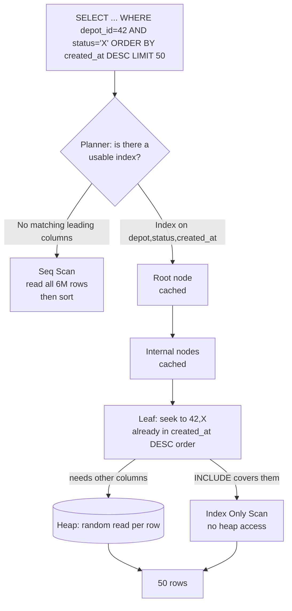
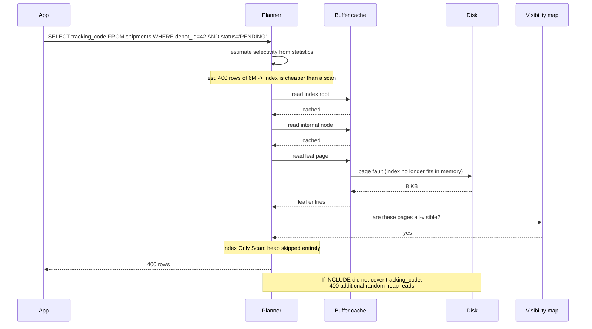

# Chapter 39: Database Indexing

## 39.1 Problem Statement

The tracking platform's database has 41 indexes across 12 tables. They were added the way indexes usually get added: a query was slow, someone added an index on the column in the `WHERE` clause, the query got faster, the ticket closed.

The bill arrives all at once.

**Write throughput has fallen by 60 percent over eighteen months** with no increase in write volume. The `shipments` table carries nine indexes, so every insert performs ten writes and every status update performs several more.

**Eleven of the 41 indexes have never been used.** `pg_stat_user_indexes` shows zero scans since the statistics were last reset. They cost storage, write amplification, and vacuum work, and return nothing.

**A query filtering on `status` and sorting by `created_at` still does a sort,** despite an index existing on both columns, because the index is on `(created_at, status)` and the query needs `(status, created_at)`. Column order is not a detail.

**An index on `(customer_id)` and another on `(customer_id, status)` both exist.** The first is redundant, and nobody removed it because nobody was sure.

**And the biggest table's index no longer fits in memory,** so lookups that were three memory accesses are now three disk reads, and p99 latency tripled without any query changing.

The pattern: indexes were treated as a free fix applied per-incident, rather than as a data structure with a cost model.

## 39.2 Why This Problem Exists

**An index is a second copy of your data, kept sorted.** Every write must maintain every copy. That cost is invisible at the moment you add one and compounds permanently.

**The benefit is enormous and the cost is diffuse,** so the feedback loop only teaches one half. The query got 400 times faster today; writes got 3 percent slower forever.

**Index design requires knowing the query, not the column.** "Index the column in the `WHERE` clause" produces indexes that cannot serve the query's ordering, its second predicate, or its projection.

**Nobody removes indexes,** because the risk of removing a needed one feels larger than the cost of keeping an unneeded one, and the data to decide is not looked at.

**And the mechanics are hidden.** A B-tree's fanout, its height, and whether it fits in memory determine everything, and none of it appears in the SQL.

## 39.3 Real World Analogy

The index at the back of a textbook.

**Without it, finding every mention of "consistent hashing" means reading all 900 pages.** That is a sequential scan.

**With it, you look up one word and get page numbers.** Two lookups instead of 900 pages, and the improvement is not incremental, it is a change in the shape of the work.

**The index is sorted, which is the whole trick.** You do not read the index from the start; you open it near "C" and narrow down. Sorted data allows you to discard half the remaining possibilities with each step.

**It costs paper.** A 40-page index in a 900-page book, and if the book had twelve indexes, one per way of looking things up, they would outweigh the content.

**And every edit must update it.** Add a paragraph mentioning three indexed terms and three index entries change. This is why the index is built once at publication and why a living document rarely has one.

**A subject index does not help you find things by author.** An index answers the questions it was built for. That is the composite-column-order problem, and it is why "we have an index on that table" is never an answer.

## 39.4 Simple Explanation

**An index is a sorted copy of some columns, plus a pointer back to the full row.**

Sorted is the operative word. Sorted data supports binary search, so finding one value among a billion takes about thirty comparisons rather than a billion.

```
Table (heap): rows in arbitrary order
  row 1  { tracking: TRK-8812, status: DELIVERED,  depot: 42 }
  row 2  { tracking: TRK-0031, status: IN_TRANSIT, depot: 17 }
  ...
  Finding tracking = TRK-0031 means examining every row: O(n)

Index on tracking: sorted, with a pointer
  TRK-0031 -> row 2
  TRK-0044 -> row 981
  TRK-8812 -> row 1
  ...
  Finding TRK-0031: binary search, O(log n)

  1,000,000,000 rows: 30 steps instead of 1,000,000,000
```

The cost side, stated as plainly:

```
Every INSERT   writes the row + one entry per index
Every DELETE   removes the row + one entry per index
Every UPDATE   to an indexed column updates that index

9 indexes on a table = roughly 10x the write work per insert
```

The three questions that decide every index:

| Question | Why it decides |
|---|---|
| **Is it selective?** | An index returning 40 percent of the table is worse than a scan |
| **Does the column order match the query?** | Leading columns cannot be skipped |
| **Does it fit in memory?** | An index on disk costs disk seeks, and the benefit collapses |

**Selectivity is the one people get wrong.** An index on a boolean column that is 50/50 will not be used, because reading half the table via random index lookups is slower than reading all of it sequentially. Sequential disk reads are an order of magnitude faster per byte than random ones, and the planner knows it.

## 39.5 Technical Deep Dive

### 39.5.1 The B-tree

Almost every relational index is a B+tree. Understanding its shape explains its performance exactly.

```
                    [ 50 | 100 ]                      root (in memory, always)
                   /      |      \
        [10|25|40]   [60|75|90]   [120|150]           internal (in memory, usually)
        /  |  |  \        ...          ...
    leaf leaf leaf leaf ...                           leaves: keys + row pointers
      |____|____|____|  <- leaves are linked, so range scans walk sideways
```

The properties that matter:

**It is shallow because fanout is enormous.** A page is 8 KB, a key plus pointer is around 20 bytes, so a node holds roughly 400 children. Four levels index 400^4, which is 25 billion rows. **Any row in a large table is three or four page reads away**, and the top levels are almost always cached, so a lookup is typically one physical read.

**Leaves are linked**, so `WHERE created_at BETWEEN a AND b` finds the first leaf and walks sideways. This is why B-trees serve range queries and hash indexes do not.

**Keys are sorted**, which is what serves `ORDER BY` without a sort step.

**It stays balanced** through splits and merges on write, which is where write cost comes from. A full page splits into two, potentially propagating up.

What it means practically:

| Query shape | B-tree serves it? |
|---|---|
| `col = x` | Yes |
| `col > x`, `BETWEEN`, `<` | Yes |
| `ORDER BY col` | Yes, no sort needed |
| `col LIKE 'abc%'` | Yes, a prefix is a range |
| `col LIKE '%abc'` | **No.** No leading value to seek to |
| `lower(col) = x` | **No**, unless you index `lower(col)` |
| `col IS NULL` | Yes in PostgreSQL |

That fifth row is a common production surprise: **any function applied to the column defeats the index**, because the index stores the raw value.

```sql
-- Index unused: the index holds email, the query needs lower(email)
SELECT * FROM customers WHERE lower(email) = 'ana@example.com';

-- Fix 1: index the expression
CREATE INDEX ON customers (lower(email));

-- Fix 2: use a case-insensitive type and index it normally
ALTER TABLE customers ALTER COLUMN email TYPE citext;
```

The same trap catches `WHERE date(created_at) = '2026-08-12'` and `WHERE customer_id::text = '88'`. Keep the column bare on one side of the comparison.

### 39.5.2 Composite indexes and column order

The highest-leverage thing in this chapter.

An index on `(a, b, c)` is sorted by `a`, then by `b` within equal `a`, then by `c`. That single fact determines everything:

```
Index on (depot_id, status, created_at)

WHERE depot_id = 42                                  full seek
WHERE depot_id = 42 AND status = 'X'                 full seek
WHERE depot_id = 42 AND status = 'X' AND created_at > t   full seek
WHERE depot_id = 42 AND created_at > t               seek on depot only,
                                                     then filter; status skipped
WHERE status = 'X'                                   NO SEEK. Leading column absent
WHERE status = 'X' AND created_at > t                NO SEEK
```

**The rule, in order:**

1. **Equality predicates first.** Columns compared with `=`.
2. **Then the one range predicate.** `>`, `<`, `BETWEEN`.
3. **Then `ORDER BY` columns,** if they are not already covered.
4. **Then columns needed only for projection,** via `INCLUDE`.

**A range predicate stops the index being usable for anything after it**, because once you are scanning a range of `b`, the values of `c` within that range are not globally sorted:

```sql
-- Wrong order: created_at is a range, so status after it is only a filter,
-- and the sort still has to happen.
CREATE INDEX ON shipments (depot_id, created_at, status);

-- Right order: both equalities first, then the range, which is also the sort.
CREATE INDEX ON shipments (depot_id, status, created_at DESC);

SELECT * FROM shipments
WHERE depot_id = 42 AND status = 'IN_TRANSIT'
ORDER BY created_at DESC
LIMIT 50;
-- Now: seek to (42, IN_TRANSIT), walk 50 leaf entries, done. No sort.
```

That second index turns a query that scans and sorts thousands of rows into one that touches fifty.

**Redundancy follows from the same rule.** An index on `(a)` is entirely contained in an index on `(a, b)`, because any seek `(a)` serves is served by the wider one. Section 39.1's redundant index can be dropped with confidence. The converse is false: `(a, b)` does not replace `(b)`.

### 39.5.3 Covering indexes and index-only scans

A normal index lookup has two steps: find the entry in the index, then fetch the row from the heap for the other columns. That second step is a random read.

If every column the query needs is in the index, the heap access is skipped entirely:

```sql
-- Query needs: depot_id, status (filter), tracking_code, eta (output)
CREATE INDEX idx_ship_cover ON shipments (depot_id, status) INCLUDE (tracking_code, eta);

SELECT tracking_code, eta FROM shipments WHERE depot_id = 42 AND status = 'PENDING';
-- EXPLAIN shows: Index Only Scan
```

`INCLUDE` columns are stored in the leaves but not used for sorting, so they add size without affecting seek behaviour. This often halves the cost of a hot query.

**The PostgreSQL caveat:** an index-only scan still checks the visibility map to confirm a row is visible to your transaction (Chapter 37's MVCC). If the table has many recently updated pages, that check falls back to the heap and the benefit disappears. Keeping autovacuum current is what makes index-only scans actually work.

### 39.5.4 Partial indexes

Underused, and frequently the highest-value index available.

```sql
-- 6 million shipments. 40,000 are active. Only those are ever queried by depot.
CREATE INDEX idx_active ON shipments (depot_id, created_at DESC)
WHERE status IN ('PENDING', 'IN_TRANSIT');
```

The index holds 40,000 entries rather than 6 million: roughly 1/150th the size, likely to stay entirely in memory, and cheaper on every write since a `DELIVERED` row never enters it. A shipment leaving the active set removes its entry, keeping the index permanently small.

The condition must appear in the query for the planner to use it. Other strong uses:

```sql
-- Exclude the dominant value, which nobody filters on
CREATE INDEX ON events (shipment_id) WHERE scan_type <> 'ROUTINE';

-- Enforce "one active subscription per customer" without forbidding history.
-- A partial UNIQUE index is a constraint the database enforces on every writer.
CREATE UNIQUE INDEX ON subscriptions (customer_id) WHERE active;
```

That last one is worth remembering. It expresses a conditional uniqueness rule that a plain constraint cannot.

### 39.5.5 The index types beyond B-tree

| Type | Structure | Use for | Not for |
|---|---|---|---|
| **B-tree** | Balanced tree | Equality, ranges, sorting. The default | Full-text, containment |
| **Hash** | Hash table | Equality only, slightly smaller | Ranges, sorting |
| **GIN** | Inverted index | `jsonb`, arrays, full-text. Many values per row | Fast writes; GIN is write-expensive |
| **GiST** | Generalised search tree | Geometric, ranges, nearest-neighbour | Exact-match heavy workloads |
| **BRIN** | Min/max per block range | Huge tables physically ordered by the column | Randomly ordered data |

**BRIN deserves attention** because it is tiny and perfect for one very common shape: an append-only table where a timestamp correlates with physical position.

```sql
-- 500 GB of events, inserted in time order.
-- A B-tree on created_at would be ~15 GB. This is a few megabytes.
CREATE INDEX ON events USING brin (created_at);
```

BRIN stores only the minimum and maximum value per block range, so a range query skips blocks that cannot contain matches. It only works when physical order matches logical order, which append-only tables give you for free.

**GIN is how `jsonb` from Chapter 38 becomes queryable:**

```sql
CREATE INDEX ON shipments USING gin (carrier_payload);
SELECT * FROM shipments WHERE carrier_payload @> '{"service":"express"}';
```

### 39.5.6 B-tree versus LSM tree

Chapter 38 mentioned Cassandra's storage engine. The comparison explains why NoSQL write throughput is structurally different.

```
B-TREE (PostgreSQL, MySQL InnoDB)
  write: find the page, modify it IN PLACE, maybe split
         -> random I/O, read-before-write
  read:  3 to 4 page reads. Predictable.

LSM TREE (Cassandra, RocksDB, ScyllaDB, LevelDB)
  write: append to an in-memory table + a commit log
         -> SEQUENTIAL only, no read first, very fast
         memtable flushes to an immutable sorted file (SSTable)
         background compaction merges SSTables
  read:  may check several SSTables + Bloom filters (Chapter 49)
         -> read amplification
```

| | B-tree | LSM tree |
|---|---|---|
| Write path | Random, read-modify-write | **Sequential append** |
| Write amplification | Lower per write, but in place | Higher total, from compaction |
| Read path | **Predictable, 3 to 4 reads** | Several files, Bloom-filtered |
| Space | Fragmentation from splits | Better compression, immutable files |
| Background work | Vacuum | **Compaction, which can fall behind** |
| Best for | Mixed read/write, ad hoc queries | **Write-heavy, known access patterns** |

**Bloom filters are what make LSM reads viable** (Chapter 49): each SSTable carries a compact probabilistic filter answering "definitely not here" cheaply, so a read skips most files without touching them.

### 39.5.7 Finding what to fix

Four queries that answer most indexing questions.

```sql
-- 1. Indexes that have never been used. Candidates for removal.
SELECT relname, indexrelname, idx_scan, pg_size_pretty(pg_relation_size(indexrelid))
FROM pg_stat_user_indexes
WHERE idx_scan = 0 AND indexrelid NOT IN (
    SELECT conindid FROM pg_constraint WHERE contype IN ('p','u'))
ORDER BY pg_relation_size(indexrelid) DESC;

-- 2. Tables doing sequential scans on large data. Candidates for adding.
SELECT relname, seq_scan, seq_tup_read, idx_scan,
       seq_tup_read / NULLIF(seq_scan, 0) AS avg_rows_per_scan
FROM pg_stat_user_tables
WHERE seq_scan > 0
ORDER BY seq_tup_read DESC LIMIT 20;

-- 3. Index size against table size. Where the write cost is going.
SELECT relname,
       pg_size_pretty(pg_table_size(relid))  AS table_size,
       pg_size_pretty(pg_indexes_size(relid)) AS index_size
FROM pg_stat_user_tables ORDER BY pg_indexes_size(relid) DESC LIMIT 20;

-- 4. Is the index cached? A low ratio means it is being read from disk.
SELECT indexrelname, idx_blks_hit, idx_blks_read,
       round(100.0 * idx_blks_hit / NULLIF(idx_blks_hit + idx_blks_read, 0), 1) AS hit_pct
FROM pg_statio_user_indexes ORDER BY idx_blks_read DESC LIMIT 20;
```

Query 4 diagnoses Section 39.1's last incident. When an index stops fitting in memory, nothing in the query changes and everything gets slower.

Before dropping an index in PostgreSQL 15 and later, make it invisible to the planner and watch:

```sql
-- Reversible test: does anything actually regress?
UPDATE pg_index SET indisvalid = false WHERE indexrelid = 'idx_suspect'::regclass;
-- ... observe ...
DROP INDEX CONCURRENTLY idx_suspect;
```

### 39.5.8 Application-side patterns

```java
// Keyset pagination. OFFSET scans and discards everything before it,
// so page 5,000 reads 250,000 rows to return 50. This reads 50.
@Query("""
    SELECT s FROM Shipment s
    WHERE s.depotId = :depotId
      AND s.status  = :status
      AND (s.createdAt, s.id) < (:lastCreatedAt, :lastId)
    ORDER BY s.createdAt DESC, s.id DESC
    """)
List<Shipment> nextPage(int depotId, Status status,
                        Instant lastCreatedAt, long lastId, Pageable page);
```

That query is served entirely by `(depot_id, status, created_at DESC, id DESC)` and its cost is constant regardless of page depth. The tuple comparison including `id` is what makes it correct when timestamps tie.

```java
// Every index costs writes. Say so where the entity is defined,
// so the next person sees the cost alongside the benefit.
@Entity
@Table(name = "shipments", indexes = {
    // Pattern: depot dashboard. Partial in DDL: WHERE status IN (...)
    @Index(name = "idx_active", columnList = "depot_id,status,created_at DESC"),
    // Pattern: customer history
    @Index(name = "idx_cust",   columnList = "customer_id,created_at DESC")
})
public class Shipment { }
```

## 39.6 Architecture Diagram



```
  query
    |
  planner: does an index match the LEADING columns?
    |
    NO  --> Seq Scan: read 6,000,000 rows, filter, SORT      ~900 ms
    |
    YES --> root      (8 KB page, cached)
            internal  (cached)
            leaf      seek to (42, 'X'); entries already
                      in created_at DESC order -> NO SORT
              |
              +-- other columns needed? --> heap: 50 random reads   ~2 ms
              +-- INCLUDE covers them?  --> index-only scan        ~0.4 ms

  Same data. Three orders of magnitude, decided by index design.
```

## 39.7 Request Flow



1. **The planner estimates selectivity first.** An estimate above roughly 5 to 10 percent of the table usually selects a sequential scan instead.
2. **Upper tree levels are almost always cached,** which is why a lookup is typically one physical read, not four.
3. **The leaf read is the physical one,** and whether it is cached is what Section 39.1's last incident turned on.
4. **The visibility map allows the heap to be skipped** when covering columns are present and pages are all-visible.
5. **Without covering, each matching row is one random heap read,** which is why selectivity matters so much.

## 39.8 Internal Components

| Component | Role | Failure mode | Guard |
|---|---|---|---|
| B-tree root and internals | Narrow the search | Rarely a problem, they stay cached | Ensure `shared_buffers` is sized sensibly |
| Leaf pages | Hold keys and pointers | Do not fit in memory as the table grows | Partial indexes, monitor `idx_blks_read` |
| Column order | Determines which queries seek | Wrong order, so the index is unused | Equality, then range, then sort, then include |
| Selectivity | Decides index versus scan | Low selectivity, so the index is ignored | Do not index low-cardinality columns alone |
| `INCLUDE` columns | Enable index-only scans | Absent, so every row is a random read | Add the projected columns |
| Visibility map | Permits skipping the heap | Stale after updates, so scans fall back | Keep autovacuum current |
| Partial predicate | Shrinks the index | Query omits the predicate, so it is unused | Ensure the condition appears in the query |
| Statistics | Feed the selectivity estimate | Stale, so the planner picks wrongly | `ANALYZE`, extended statistics |
| Write amplification | The cost side | Grows silently with index count | Audit unused indexes quarterly |
| Bloom filter (LSM) | Skip SSTables on read | Too small, so false positives cost reads | Tune bits per key (Chapter 49) |

## 39.9 Production Example

**Instagram's use of partial indexes** is the well-documented case for Section 39.5.4. Indexing only rows meeting a condition kept indexes small enough to stay resident in memory at a scale where full indexes would not have, which is exactly Section 39.1's memory-residency problem solved by design rather than by hardware.

**Uber's PostgreSQL to MySQL migration** is worth reading as an indexing argument. A large part of it concerns write amplification: in their PostgreSQL setup, an update rewrote every index entry for the row even when indexed columns had not changed, because the physical row location moved. MySQL's InnoDB, with secondary indexes pointing at the primary key rather than the physical location, does not have that behaviour. That is a difference in index architecture producing a difference in write cost at scale.

**Discord's move to ScyllaDB** turned partly on the read-amplification side of Section 39.5.6: an LSM workload with heavy deletes accumulated files and tombstones until reads had to check too many SSTables.

**And every search feature you have used** rests on the inverted index that GIN implements: term to document list, which is the same idea as a B-tree turned inside out for the many-values-per-row case.

## 39.10 Advantages

- **Asymptotic improvement, not incremental.** O(log n) instead of O(n) changes what is possible, not just what is fast.
- **One structure serves several needs:** equality, ranges, sorting, and prefix matching from the same B-tree.
- **Index-only scans remove the heap access entirely** for well-designed queries.
- **Partial indexes give a large fraction of the benefit at a small fraction of the cost.**
- **Unique indexes enforce correctness,** including conditionally via partial unique indexes.
- **Specialised types extend the model** to `jsonb`, geometry, full text, and huge append-only tables.
- **The tooling tells you the truth.** `pg_stat_user_indexes` and `EXPLAIN` remove the guesswork.

## 39.11 Limitations

- **Every index slows every write** to the table, permanently and cumulatively.
- **Indexes consume storage and memory,** and often exceed the table's own size.
- **Column order makes them narrow.** An index serves the queries it was designed for and no others.
- **Low selectivity makes them useless,** and no amount of indexing helps a query that returns most of the table.
- **Function-wrapped columns defeat them** unless the expression itself is indexed.
- **They must fit in memory to deliver their promise,** and that changes silently as data grows.
- **Creating them on a large table is disruptive** unless done `CONCURRENTLY`.
- **Stale statistics can cause a perfectly good index to be ignored.**

## 39.12 Trade-offs

| Choice | Gain | Cost | Remove it and |
|---|---|---|---|
| Add an index | Reads go from O(n) to O(log n) | Every write to the table slows | Sequential scans, and a read-latency ceiling |
| Composite over single-column | Serves filter, sort, and range in one seek | Only for queries matching the prefix | Multiple narrow indexes, and bitmap combining |
| `INCLUDE` covering columns | No heap access | Larger index, more memory pressure | A random heap read per result row |
| Partial index | Tiny, memory-resident, cheap on writes | Only usable when the predicate is in the query | A full index, mostly holding rows nobody queries |
| BRIN over B-tree | Megabytes instead of gigabytes | Only works on physically ordered data | A large index that may not fit in memory |
| LSM over B-tree | Sequential writes, very high write throughput | Read amplification, compaction, tombstones | Random write I/O and a lower write ceiling |
| Unique index | Correctness enforced by the database | Write cost, and migrations must handle violations | Application checks, which race |
| Drop an unused index | Faster writes, less storage | Risk if usage was seasonal | Permanent write cost for zero return |

The governing trade: **indexes convert write throughput into read latency.** Once framed that way, the right number of indexes is a function of your read/write ratio, and a write-heavy table with nine indexes is a design error rather than an accident.

## 39.13 Common Mistakes

- **Indexing the column instead of the query,** producing indexes that cannot serve the ordering or the second predicate.
- **Wrong column order,** especially putting a range column before an equality column.
- **Never removing anything.** Unused indexes cost forever and return nothing.
- **Keeping redundant prefixes.** `(a)` alongside `(a, b)`.
- **Indexing low-cardinality columns alone.** A boolean index will not be used.
- **Wrapping the column in a function** in the `WHERE` clause, defeating the index silently.
- **Ignoring memory residency.** An index that no longer fits changes p99 with no query change.
- **`OFFSET` pagination,** which scans and discards, defeating the index's advantage at depth.
- **`CREATE INDEX` without `CONCURRENTLY`** on a live table, blocking writes for the build.
- **Assuming an index will be used** without checking `EXPLAIN`.
- **Forgetting foreign key columns.** A foreign key does not create an index, and deletes on the parent then scan the child.
- **Over-indexing to fix a problem that is actually stale statistics.**

## 39.14 Interview Questions

1. Explain a B+tree's structure. Why is a lookup in a billion-row table only three or four reads?
2. You have an index on `(a, b, c)`. Which queries can seek with it and which cannot?
3. Why might the planner ignore a perfectly valid index?
4. What is an index-only scan and what prevents one in PostgreSQL?
5. When is a partial index the right answer? Give two distinct uses.
6. Compare B-tree and LSM tree storage. Which workload suits each?
7. Why does `WHERE lower(email) = ?` not use an index on `email`?
8. How do you decide, with evidence, that an index can be dropped?
9. Your p99 tripled with no query or schema change. What do you check?
10. Why is `OFFSET 250000` slow even with a perfect index, and what replaces it?

## 39.15 Production Best Practices

- **Design indexes from queries, not columns.** Write the query first, then the index that serves all of it.
- **Order composite columns: equality, then range, then sort, then `INCLUDE`.**
- **Audit unused indexes quarterly** with `pg_stat_user_indexes`, and drop with evidence.
- **Drop redundant prefixes** where a wider index already covers them.
- **Use partial indexes** wherever the queried rows are a small fraction of the table.
- **Consider BRIN for append-only time-ordered tables** before building a large B-tree.
- **Always `CREATE INDEX CONCURRENTLY`** in production, and check for invalid indexes afterward.
- **Index your foreign key columns,** which is required for cascading deletes to be sane.
- **Keep columns bare in predicates,** or index the expression explicitly.
- **Monitor `idx_blks_read` and total index size against available memory.** This predicts a class of silent regression.
- **Verify with `EXPLAIN (ANALYZE, BUFFERS)`** after adding an index. An index that is not used is pure cost.
- **Use keyset pagination** for anything deeply pageable.
- **Test the drop with `indisvalid = false`** before removing an index you are unsure about.

## 39.16 Summary

An index is a sorted copy of some columns with pointers back to the rows, and every property follows from "sorted": binary search gives logarithmic lookup, linked leaves give range scans, and stored order gives `ORDER BY` for free.

The B+tree's shallowness is what makes it feel like magic. Fanout of several hundred per node means four levels cover tens of billions of rows, and the upper levels stay cached, so a lookup in a huge table is usually one physical read. That is the entire performance story, and it holds right up until the leaves stop fitting in memory, at which point nothing in your queries changed and everything got slower.

The cost is real and it is paid on writes. Nine indexes means roughly ten times the write work per insert, forever, and Section 39.1's 60 percent write throughput loss with no traffic growth is what that looks like when indexes are added per-incident and never removed. **Indexes convert write throughput into read latency**, so the right number of them depends on your read/write ratio, and a write-heavy table accumulating indexes is a design problem rather than bad luck.

The design rules are short and they are what separate an index that works from one that is merely present. Order composite columns as equality, then range, then sort. A range predicate ends the index's usefulness for everything after it. A leading column can never be skipped. Covering columns eliminate the heap access. And a partial index is frequently a hundred times smaller than the full one for the same benefit, because the rows people actually query are usually a small fraction of the rows that exist.

Finally, this is an area where measurement is available and cheap. `pg_stat_user_indexes` tells you what is unused, `EXPLAIN (ANALYZE, BUFFERS)` tells you what is being read, and `pg_statio_user_indexes` tells you what has stopped fitting in memory. Section 39.1 is not a hard problem. It is an unmeasured one.

## 39.17 Quick Revision Notes

- **An index is a sorted copy plus a row pointer.** Sorted is what buys everything.
- **B+tree:** fanout ~400, so 3 to 4 levels for billions of rows, upper levels cached, leaves linked for ranges.
- **Column order: equality, then range, then `ORDER BY`, then `INCLUDE`.** A range ends usefulness for later columns.
- **Leading columns cannot be skipped.** `(a,b)` does not serve `WHERE b = ?`.
- **`(a)` is redundant if `(a,b)` exists.** Not the reverse.
- **Low selectivity means the index is ignored.** Returning >5 to 10 percent favours a scan.
- **Functions on the column defeat the index.** Index the expression instead.
- **`INCLUDE` gives index-only scans;** PostgreSQL needs a current visibility map for them.
- **Partial indexes** are often 100x smaller. Also enable conditional uniqueness.
- **BRIN** for huge, physically ordered, append-only tables. Megabytes, not gigabytes.
- **GIN** for `jsonb`, arrays, and full text.
- **B-tree = in-place random writes; LSM = sequential appends plus compaction and read amplification.**
- **Memory residency is invisible until it breaks.** Watch `idx_blks_read`.
- **Keyset pagination, never `OFFSET`.** Always `CREATE INDEX CONCURRENTLY`.

## 39.18 Mini Quiz

1. Why is a B+tree lookup in a billion-row table only three or four page reads?
2. An index exists on `(depot_id, created_at, status)`. Why does the query filtering both columns and sorting by `created_at` still sort?
3. Why would the planner refuse to use a valid index on a boolean column?
4. Nothing changed and p99 tripled. What do you suspect and how do you confirm it?
5. Why is a partial index sometimes a hundred times smaller for the same benefit?
6. What does an LSM tree buy over a B-tree, and what does it cost?
7. How do you safely establish that an index can be dropped?

**Answers**

1. Because the fanout per node is very large. A node occupies one 8 KB page and each entry is a key plus a child pointer, roughly 20 bytes, so a node holds several hundred children. Four levels of a tree with fanout 400 addresses 400 to the fourth power, about 25 billion entries, so the tree is only ever a few levels deep no matter how large the table gets. On top of that, the root and internal levels are small in total and stay resident in the buffer cache, so the only physical read is usually the leaf. Depth grows logarithmically with a very large base, which is why index performance degrades so gracefully with data volume.

2. Because the index is sorted by `depot_id`, then `created_at`, then `status`, and `created_at` is a range or sort column placed before the `status` equality. Once the scan is walking a range of `created_at` values, the `status` values inside that range are not globally ordered, so `status` can only be applied as a filter on rows already read, and the rows that survive are not in the order the query wants either. Reordering the index to `(depot_id, status, created_at DESC)` puts both equality columns first, so the seek lands on the exact group and the entries are already in the requested sort order, which removes both the extra rows and the sort.

3. Because the column is not selective. If roughly half the rows match, using the index means reading half the leaf entries and then performing a random heap read for each matching row, and random reads are much more expensive per row than sequential ones. Reading the entire table sequentially and discarding non-matching rows is cheaper, and the planner's cost model knows this. The general threshold is around five to ten percent of the table, above which a sequential scan usually wins. A boolean column becomes useful in an index only as a secondary column in a composite, or as the predicate of a partial index, where it shrinks the index rather than being searched.

4. That an index or the working set has stopped fitting in memory. As a table grows, its indexes grow with it, and at some point the leaf pages no longer fit in the buffer cache, so lookups that were satisfied from memory begin causing disk reads. Nothing in the query, schema, or traffic needs to change for this to happen. Confirm it with `pg_statio_user_indexes`, comparing `idx_blks_hit` against `idx_blks_read` for the relevant indexes: a hit ratio that has fallen is the signature. The fixes are more memory, a partial index that excludes the rows nobody queries, or a smaller index type such as BRIN where the data is physically ordered.

5. Because in most tables the rows anyone queries by a given pattern are a small fraction of the rows that exist. A shipments table may hold six million rows of which forty thousand are in an active state, and only active rows are ever looked up by depot. A partial index restricted to those states holds forty thousand entries rather than six million, so it is small enough to stay entirely in memory, and it is also cheaper on writes because rows that reach a terminal state leave the index rather than remaining in it forever. The constraint is that the query must include the same predicate, otherwise the planner cannot prove the index contains every row the query needs.

6. It buys write throughput. An LSM tree never modifies data in place: writes go to an in-memory table plus a sequential commit log, and the memtable is later flushed as an immutable sorted file, so the disk sees only sequential I/O and there is no read-before-write. A B-tree must locate the correct page, read it, modify it, and possibly split it, which is random I/O. The cost is on reads and in the background: a lookup may need to consult several files, mitigated but not eliminated by Bloom filters, and compaction must continuously merge files, consuming I/O and CPU and falling behind under sustained write pressure. Deletes are also markers rather than removals, which is why tombstone accumulation is an LSM-specific failure mode.

7. Start with `pg_stat_user_indexes`, checking `idx_scan` over a period long enough to include any weekly or monthly jobs, and confirm the index does not back a primary key or unique constraint. Then rather than dropping it directly, mark it invalid to the planner by setting `indisvalid = false`, which stops it being used for queries while keeping it maintained and instantly restorable. Watch your query latency and plan choices for a full business cycle. If nothing regresses, drop it with `DROP INDEX CONCURRENTLY`. Rebuilding a large index later is expensive, so the invalidation step is worth the delay.

## 39.19 Hands-on Exercise

**Part 1: see the shape.** Load ten million rows. Query one row by an unindexed column and record the plan and time. Add a B-tree index and repeat. Then query with a predicate matching 40 percent of rows and observe the planner reverting to a sequential scan.

**Part 2: prove column order.** Create `(a, b, c)` and run six queries covering every prefix and skipping combination. Record which seek, which filter, and which sort.

**Part 3: get an index-only scan.** Take a query returning two columns and filtering on two others. Build the index without `INCLUDE`, note the heap reads in `EXPLAIN (ANALYZE, BUFFERS)`, then add `INCLUDE` and compare. Then update many rows without vacuuming and watch the index-only scan degrade.

**Part 4: shrink with a partial index.** Build a full index and a partial one on the same columns. Compare sizes, insert throughput, and query latency.

**Part 5: measure write amplification.** Time bulk inserts into a table with zero, three, six, and nine indexes. Plot the curve. This is the number that justifies dropping unused indexes.

**Part 6: fall out of memory.** Set `shared_buffers` small. Grow a table until its index exceeds it and watch `idx_blks_read` and p99 latency together.

**Part 7: try BRIN.** On an append-only table with a timestamp, build both a B-tree and a BRIN index. Compare sizes and range-query performance. Then insert rows in random time order and watch BRIN become useless.

## 39.20 Further Reading

- *SQL Performance Explained*, Markus Winand, and use-the-index-luke.com. The best focused treatment of index design available.
- *Database Internals*, Alex Petrov, for B-trees and LSM trees implemented in detail.
- *The Log-Structured Merge-Tree*, O'Neil et al., 1996, the original LSM paper.
- PostgreSQL's documentation on index types, index-only scans, and the visibility map.
- *Modern B-Tree Techniques*, Goetz Graefe, for the depth behind Section 39.5.1.
- Chapter 37 of this book for the planner that chooses your index, Chapter 40 for query optimisation, Chapter 49 for Bloom filters, and Chapter 38 for the storage engines behind NoSQL systems.

---

**Next chapter: Chapter 40, Query Optimization.** Everything that remains once the indexes are right: reading a plan properly, the join-order decisions that dominate cost, why the planner picks badly, and the small number of rewrites that reliably help.
