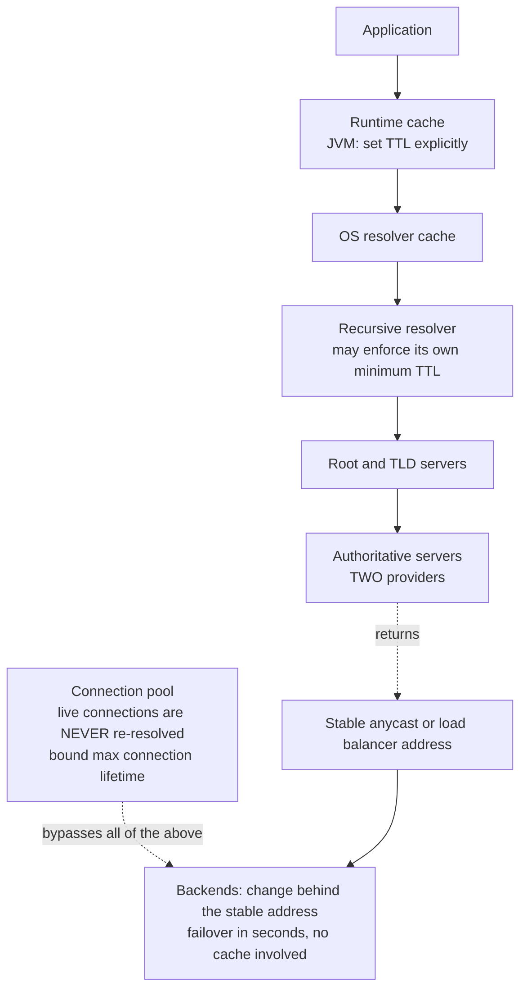
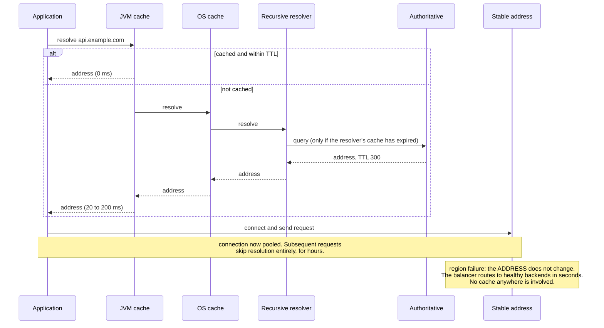

# Chapter 31: DNS

## 31.1 Problem Statement

The tracking platform uses DNS for regional failover. The design is simple and widely recommended: a 60 second TTL on the record, health checks on each region, and if a region fails, the DNS provider stops returning its address. Recovery in about a minute.

The region fails at 14:02. Here is what actually happens.

**Most clients recover in about 90 seconds.** As designed.

**The Java services calling the platform do not recover at all.** They resolved the address once at startup and cached it, and the JVM's DNS caching behaviour is not what anyone assumed. Some of them are still sending traffic to the dead region 40 minutes later, when they are restarted manually.

**Several corporate networks take 15 minutes.** Their resolvers apply a minimum TTL, treating anything shorter as unreasonably aggressive, so the 60 second value was silently overridden.

**Browsers keep old connections alive.** Existing keep-alive connections to the failed region are not affected by DNS at all, because DNS is only consulted when a new connection is established.

**And the negative caching case is worse.** During the incident someone removes the record entirely for two minutes. Resolvers cache the non-existence answer according to a completely different TTL, taken from the zone's SOA record, which is set to 3600. Clients that queried during those two minutes cannot resolve the name for an hour.

The design was correct in theory. It failed because **DNS TTL is a request, not a guarantee**, and because the set of things that cache a DNS answer is much larger than the resolver you were thinking about.

## 31.2 Why This Problem Exists

**TTL is advisory.** Every layer between your authoritative server and the application may cache, and each may apply its own minimums, maximums, or bugs. The value you publish is an upper bound on how long a well-behaved cache should keep the answer, and nothing more.

**There are more caches than people count.** The authoritative server, the recursive resolver, corporate and ISP resolvers, the operating system, the runtime, the library, the browser, and the application itself may all hold a copy.

**DNS is consulted at connection time only.** Once a TCP connection exists, DNS is irrelevant to it. With keep-alive and connection pooling, which Chapters 7 and 29 both recommend, a client may not perform a lookup for hours.

**Negative answers cache under different rules.** The absence of a record is cached according to the zone's SOA minimum rather than the record's own TTL, which surprises people at exactly the wrong moment.

**And runtimes have their own opinions.** The JVM in particular has historically cached lookups for a long time by default under some configurations, which turns a 60 second TTL into a process lifetime.

## 31.3 Real World Analogy

A printed staff directory in a large organisation.

Reception has the authoritative copy and updates it immediately when someone moves desk. Every department printed their own copy at some point. Individuals wrote numbers on sticky notes. The number in someone's phone was saved three years ago.

Now move a department to a new floor and try to make everyone dial the new number.

**Reception is correct instantly.** Nobody asks reception.

**Departments with recent printouts update within a week,** which is their equivalent of a TTL.

**Some departments print annually,** regardless of what you asked for, which is a resolver enforcing its own minimum.

**Sticky notes never expire.** That is the JVM caching forever.

**And people already in a conversation are unaffected**, because the call is already connected. That is keep-alive.

The reliable way to move a department is not to change the directory and wait. It is to **put a redirect at the old location**, which is why a load balancer or anycast address that stays constant is a far better failover mechanism than changing the address itself.

## 31.4 Simple Explanation

**DNS turns a name into an address**, and it is the first step in almost every connection your users make.

Resolution passes through several caches, and each one is a place your change can be delayed:

```
application  ->  runtime cache  ->  OS cache  ->  recursive resolver cache
             ->  root / TLD servers  ->  your authoritative server

Every arrow is a potential cache. Only the last one is under your control.
```

The record types that matter for system design:

| Record | Purpose | Note |
|---|---|---|
| `A` / `AAAA` | Name to IPv4 or IPv6 address | The common case |
| `CNAME` | Alias to another name | Cannot coexist with other records at the same name, so not usable at a zone apex |
| `ALIAS` / `ANAME` | Provider-specific apex alias | Resolves server-side; not a standard record |
| `NS` | Which servers are authoritative | Delegation |
| `SOA` | Zone metadata, including **negative caching TTL** | The one people forget |
| `MX`, `TXT`, `SRV` | Mail, verification and policy, service discovery | |
| `CAA` | Which certificate authorities may issue | Worth setting |

And the single most important property to internalise:

> **TTL is what you ask for. It is not what you get, and it is irrelevant to connections that already exist.**

## 31.5 Technical Deep Dive

### 31.5.1 The caching layers

Where an answer can be held, and how much control you have over each:

| Layer | Typical behaviour | Your control |
|---|---|---|
| Authoritative server | Serves your records | Full |
| Recursive resolver | Honours TTL, sometimes with minimums or maximums | None |
| Corporate or ISP resolver | May enforce a floor of several minutes | None |
| Operating system cache | Varies by platform; may be aggressive | Little |
| **Runtime, particularly the JVM** | May cache far longer than the TTL | **Full, and usually misconfigured** |
| HTTP client connection pool | Does not re-resolve while a connection is open | Full |
| Browser | Own cache, typically about a minute | None |
| Application-level cached address | Resolved once at startup | Full, and this is the worst case |

The JVM case is worth stating precisely because it is the one that catches Java teams and this book's readers are Java teams. The JVM caches successful lookups according to `networkaddress.cache.ttl`, and its default depends on configuration: in some setups it caches indefinitely, which means a process resolves a name once at startup and never again. Failed lookups are cached separately under `networkaddress.cache.negative.ttl`.

```java
// Set these deliberately. Do not rely on the default.
// 30 seconds is a reasonable value for a service that must follow DNS changes.
java.security.Security.setProperty("networkaddress.cache.ttl", "30");
java.security.Security.setProperty("networkaddress.cache.negative.ttl", "5");
```

```bash
# Or at launch, which is easier to audit across a fleet:
-Dsun.net.inetaddr.ttl=30 -Dsun.net.inetaddr.negative.ttl=5
```

The connection pool case is equally important and less well known. An HTTP client with keep-alive holds connections open, and **a live connection is never re-resolved**. Even with a correct DNS cache TTL, a pooled connection to a dead address persists until it fails or until the pool's own maximum connection lifetime expires. That is why pools should have a bounded connection lifetime rather than only an idle timeout.

### 31.5.2 Negative caching

The failure in Section 31.1 that surprises people most.

When a resolver receives an answer saying a name does not exist, it caches that too. The duration comes from the **minimum field of the zone's SOA record**, not from the intended TTL of the record you deleted.

```
SOA minimum: 3600

You delete a record for two minutes during an incident.
Every resolver that queries in those two minutes caches
"does not exist" for a full hour.
```

Two consequences: set the SOA minimum to something modest, commonly 300 seconds or less, and **never remove a record as an operational action**. Change where it points instead. Removing it converts a routing change into an hour of unresolvability for whoever queried at the wrong moment.

### 31.5.3 TTL strategy

TTL trades propagation speed against query volume and resilience.

| TTL | Propagation | Query load | Resilience if your DNS is unreachable |
|---|---|---|---|
| 30 to 60 s | Fast | High | Poor: caches expire and nothing can resolve |
| 300 s | Reasonable | Moderate | Moderate |
| 3600 s | Slow | Low | Good: caches keep working for an hour |
| 86400 s | Very slow | Very low | Excellent |

The resilience column is the one that gets forgotten. A very short TTL means that if your authoritative servers become unreachable, every cached answer expires within a minute and your entire domain becomes unresolvable. A longer TTL means existing caches continue serving during such an outage.

The standard pattern for planned changes:

```
Normal operation:        TTL 3600
Two days before change:  lower TTL to 60, and WAIT for the old TTL
                         to expire everywhere, which takes the old TTL
Perform the change:      most clients follow within about a minute
24 hours after:          raise TTL back to 3600
```

The waiting step is the one people skip. Lowering the TTL only takes effect once caches holding the old, longer TTL have expired, so the reduction must be made at least one old-TTL period in advance.

### 31.5.4 Why DNS is a poor failover mechanism

Section 31.1's whole story. DNS failover means changing which address a name resolves to, and it is slow and unreliable for reasons that are structural rather than fixable:

| Problem | Effect |
|---|---|
| TTL is advisory | Some resolvers hold answers far longer |
| Runtime caches | May never re-resolve within a process lifetime |
| Existing connections | Unaffected by DNS entirely |
| Negative caching | Removing a record can cause an hour of unresolvability |
| No feedback | You cannot tell who has followed the change |

The alternatives, in order of responsiveness:

| Mechanism | Failover speed | Note |
|---|---|---|
| **Anycast** | Seconds | The same address announced from many locations; routing shifts on withdrawal |
| **Load balancer with a stable address** | Seconds | The address never changes; the balancer changes backends |
| **Client-side awareness** | Seconds | Client knows several endpoints and fails over itself |
| DNS record change | Minutes to hours | Last resort, and not for fast failover |

The general principle: **keep the name pointing at something stable and move the traffic behind it.** A stable anycast address or load balancer address, with backends changing behind it, gives failover in seconds and involves no cache anywhere.

DNS remains the right tool for coarse decisions that change rarely: which region a user should prefer, which provider serves a domain, and directing users to a geographically appropriate entry point.

### 31.5.5 Geographic and latency-based routing

DNS can return different answers to different queriers, which is how global systems direct users to a nearby entry point.

| Method | Basis | Limitation |
|---|---|---|
| Geo-based | The resolver's location | The resolver may be far from the user |
| Latency-based | Measured latency from the resolver's network | Same limitation |
| Weighted | Proportional distribution | Coarse, and cache-dependent |
| Health-checked | Removes unhealthy endpoints | Subject to every caching problem above |

The recurring limitation is that **the authoritative server sees the resolver, not the user.** A user on a mobile network using a large public resolver may appear to be wherever that resolver's infrastructure is. The EDNS Client Subnet extension passes a truncated client address to improve this, at some privacy cost, and it is not universally supported.

Which is one more argument for anycast: with anycast, the network routes the user to the nearest announcement point without DNS needing to know anything about who the user is.

### 31.5.6 DNS as a dependency

It is a hard dependency of essentially everything, and Chapter 10's arithmetic applies.

| Risk | Mitigation |
|---|---|
| Provider outage | Two providers, with the zone served by both |
| DDoS against your DNS | Anycast, provider capacity, longer TTLs so caches absorb it |
| Zone misconfiguration | Validate before publishing; stage changes; keep them in version control |
| Expired domain registration | Auto-renew, registry lock, and calendar alarms |
| Compromise of the registrar | Registry lock, multi-factor authentication |
| Slow resolution on the critical path | Cache in the runtime and pool connections |

The 2016 attack on a major managed DNS provider is the standard example: a distributed denial of service against the DNS infrastructure made a long list of well-known services unreachable, not because those services were down but because nobody could resolve their names. The lesson is that **DNS is a single point of failure for everything you own**, and that the mitigations are secondary providers and TTLs long enough for caches to ride out an outage.

That second mitigation is counterintuitive and worth stating clearly: **a longer TTL improves your resilience to a DNS outage**, because cached answers keep working. It trades against propagation speed, which is one more reason not to rely on DNS for failover.

## 31.6 Architecture Diagram



```
 application
     |  runtime cache      <- JVM: set networkaddress.cache.ttl explicitly
     |  OS cache
     |  recursive resolver <- may enforce its own minimum TTL
     |  root / TLD
     v
 authoritative servers (TWO providers)
     |
     returns a STABLE address (anycast or load balancer)
     |
 backends change behind it  -> failover in seconds, no DNS cache involved

 NOTE: an established keep-alive connection bypasses every layer above.
       Bound the maximum connection lifetime, not just the idle timeout.
```

## 31.7 Request Flow



1. **Most lookups are answered from a cache** and cost nothing, which is why DNS latency rarely appears in profiles and why changes propagate slowly.
2. **A cold lookup can cost 20 to 200 milliseconds,** which matters for the first request of a session and is why runtimes cache at all.
3. **The authoritative server is consulted rarely,** so its view of query volume tells you little about user traffic.
4. **Once connected, DNS is out of the picture,** and remains so for the connection's lifetime. This is why a maximum connection lifetime matters.
5. **Failover happens behind a stable address,** so no cache anywhere needs to expire. This is the design that works, and it is the one Section 31.1 did not use.

## 31.8 Internal Components

| Component | Role | Failure mode | Guard |
|---|---|---|---|
| Authoritative servers | Serve your records | Single provider outage takes the domain down | Two providers serving the same zone |
| TTL | Requests a cache duration | Treated as a guarantee | Plan for it being ignored; never rely on it for failover |
| SOA minimum | Negative caching duration | Left high, so a deleted record is unresolvable for an hour | Set to 300 s or less; never delete records operationally |
| Runtime cache | Avoids repeated lookups | JVM may cache far longer than the TTL | Set `networkaddress.cache.ttl` explicitly |
| Connection pool | Reuses connections | Never re-resolves, so a dead address persists | Bound maximum connection lifetime |
| Health-checked records | Removes failed endpoints | Subject to every caching layer | Prefer a stable address with a balancer behind it |
| Geo and latency routing | Directs users to a nearby entry | Sees the resolver, not the user | Anycast, or accept the approximation |
| Registrar and registry | Owns the domain | Expiry or compromise loses everything | Auto-renew, registry lock, multi-factor authentication |
| Zone configuration | The records themselves | Manual edits with typos, applied instantly | Version control, validation, staged changes |

## 31.9 Production Example

**The 2016 attack on a large managed DNS provider** made many well-known services unreachable for hours. None of those services was down; their names simply could not be resolved. It is the clearest demonstration that DNS is a hard dependency of everything, that a single provider is a single point of failure regardless of how many regions your application runs in, and that the standard mitigation, using two independent providers for the same zone, is unglamorous and effective.

**The JVM's DNS caching behaviour has been a recurring operational surprise** for as long as cloud environments have had addresses that change. A process that resolves a name at startup and caches the result for its lifetime will not follow any DNS change, including failovers, scaling events, and provider migrations. It is entirely configurable, and the fix is to set the property explicitly rather than to rely on a default that varies with security manager configuration and JDK version.

**Anycast is why large providers do not use DNS for failover.** Announcing the same address from many locations lets the network route each user to the nearest healthy announcement, and withdrawing an announcement shifts traffic within seconds without any cache being involved. Content delivery networks and public DNS resolvers are both built on it, and the reason it is preferable is exactly Section 31.5.4: it removes every caching layer from the failover path.

## 31.10 Advantages

- **Names are stable while addresses change,** which decouples clients from infrastructure.
- **Caching makes resolution nearly free** for the overwhelming majority of lookups.
- **It is globally distributed and extremely resilient** as a system, having no single point of control.
- **Different answers for different queriers** enable geographic and weighted routing.
- **It is the one universal indirection layer,** understood by every client on the internet.
- **Longer TTLs provide genuine resilience** to your own DNS infrastructure failing.

## 31.11 Limitations

- **TTL is advisory,** and several layers may ignore or override it.
- **Failover is slow and unreliable,** with a long tail of clients that never follow.
- **Established connections are unaffected,** so pooling defeats it entirely.
- **Negative caching is governed by a different value** and surprises people during incidents.
- **You cannot observe who has followed a change,** because there is no feedback.
- **It sees resolvers rather than users,** limiting geographic accuracy.
- **It is a hard dependency of everything you own,** and its compromise or expiry is catastrophic.

## 31.12 Trade-offs

| Dial | One way | The other way |
|---|---|---|
| TTL | Short: faster propagation, more queries, poor resilience to a DNS outage | Long: slow changes, fewer queries, caches ride out outages |
| Failover mechanism | DNS: simple, minutes to hours, unreliable tail | Anycast or a stable balancer address: seconds, more infrastructure |
| Providers | One: simpler, single point of failure | Two: resilient, more configuration to keep in sync |
| Geographic routing | DNS-based: simple, sees the resolver | Anycast: accurate, requires network capability |
| Runtime cache TTL | Short: follows changes, more lookups | Long: fewer lookups, may never follow a change |
| Connection lifetime | Bounded: follows DNS changes eventually, more handshakes | Unbounded: efficient, pinned to a possibly-dead address |

**Remove the second DNS provider.** You gain simpler zone management. You lose independence from one provider's availability, and a DNS outage makes everything you own unreachable regardless of how healthy it is.

**Use a very short TTL everywhere for agility.** You gain faster propagation. You lose resilience, since your domain becomes unresolvable within a minute if your authoritative servers become unreachable, and you increase query load substantially.

**Rely on DNS for failover.** You gain a mechanism requiring no extra infrastructure. You lose bounded recovery time, because a meaningful fraction of clients will not follow within any timeframe you can predict, which is Section 31.1.

## 31.13 Common Mistakes

**Treating TTL as a guarantee** and planning failover around it.

**Not setting the JVM DNS cache TTL,** so services never follow a change.

**Unbounded connection lifetimes,** so pooled connections pin traffic to a dead address.

**A high SOA minimum,** turning a two minute record deletion into an hour of unresolvability.

**Deleting records as an operational action** rather than repointing them.

**Lowering TTL immediately before a change,** without waiting one old-TTL period for the reduction to take effect.

**A single DNS provider,** making your entire domain dependent on one company.

**Forgetting domain expiry and registrar security,** which are the highest-consequence and lowest-attention risks in this chapter.

**Assuming geographic routing sees the user,** when it sees the resolver.

**No version control or validation for zone changes,** which are applied globally and instantly.

## 31.14 Interview Questions

**Q: Why is DNS a poor failover mechanism?** Because TTL is advisory and several caching layers may ignore or extend it, runtimes such as the JVM may cache for a process lifetime, established keep-alive connections are never re-resolved at all, and you have no feedback about who has followed a change. The result is recovery with an unbounded tail. Prefer a stable address, anycast or a load balancer, with backends changing behind it.

**Q: What is negative caching and why does it matter?** Resolvers cache the answer that a name does not exist, with a duration taken from the zone's SOA minimum rather than from the record's own TTL. If that value is high and you delete a record even briefly during an incident, clients that queried in that window cannot resolve the name for the full SOA minimum. Keep it low and repoint records rather than deleting them.

**Q: How do you plan a DNS change that must propagate quickly?** Lower the TTL well in advance, at least one full old-TTL period before the change, so that caches holding the old longer value have expired and are now holding the shorter one. Make the change. Wait for the short TTL plus a margin. Then restore the longer TTL. The advance step is the one commonly skipped, and skipping it means the reduction has not taken effect when you need it.

**Q: A Java service keeps sending traffic to a decommissioned address. Why?** The JVM caches successful DNS lookups, and depending on configuration may cache them indefinitely, so a process that resolved the name at startup never queries again. Set `networkaddress.cache.ttl` explicitly. Also check connection pooling, since an established keep-alive connection is never re-resolved regardless of any cache setting, which requires bounding the maximum connection lifetime.

**Q: Why might a longer TTL be safer?** Because if your authoritative DNS becomes unreachable, whether through a provider outage or an attack, cached answers continue to serve clients until they expire. A 60 second TTL means everything becomes unresolvable within a minute; an hour-long TTL means most clients keep working for an hour. It trades against propagation speed, which is another reason not to depend on DNS for fast changes.

**Q: What are the limits of geographic DNS routing?** The authoritative server sees the querying resolver rather than the end user, so a user of a large public resolver may appear to be located wherever that resolver's infrastructure is. EDNS Client Subnet improves this by passing a truncated client address, at a privacy cost and without universal support. Anycast avoids the problem entirely by letting network routing choose the nearest endpoint.

## 31.15 Production Best Practices

1. **Use two independent DNS providers** for any zone that matters.
2. **Do not use DNS for fast failover.** Keep the name pointing at a stable anycast or balancer address and move traffic behind it.
3. **Set the JVM DNS cache TTL explicitly** across the fleet rather than relying on defaults.
4. **Bound maximum connection lifetime** in HTTP clients, not just idle timeout.
5. **Keep the SOA minimum low,** around 300 seconds, and never delete records as an operational action.
6. **Lower TTL at least one old-TTL period before a planned change,** and restore it afterwards.
7. **Choose TTL deliberately,** balancing propagation speed against resilience to your own DNS being unreachable.
8. **Keep zone configuration in version control,** with validation and staged application.
9. **Enable registry lock and multi-factor authentication** at the registrar, and auto-renew the domain.
10. **Set CAA records** to constrain which authorities may issue certificates for your domain.
11. **Monitor resolution externally** from several networks, since your own view is cached.
12. **Alert on domain and certificate expiry** weeks in advance.

## 31.16 Summary

DNS turns names into addresses, and its defining property for system design is that the answer is cached in many places you do not control. The TTL you publish is a request that recursive resolvers, corporate networks, operating systems, runtimes, browsers, and your own application may all interpret differently, and several will hold answers longer than you asked. There is no feedback channel, so you cannot tell who has followed a change.

That makes DNS a poor failover mechanism, despite being used as one constantly. Section 31.1's failure is representative: most clients recovered in ninety seconds, some corporate resolvers took fifteen minutes, Java services that resolved once at startup never recovered at all, and existing keep-alive connections were unaffected because DNS is consulted only when a connection is established. Deleting a record made it worse, because the absence of a record is cached under the zone's SOA minimum rather than the record's TTL, which turned a two minute action into an hour of unresolvability.

The design that works is to keep the name pointing at something stable, an anycast address or a load balancer, and to move traffic behind it. Failover then happens in seconds and no cache anywhere is involved, which is why large providers build this way rather than relying on record changes.

Two operational details carry most of the remaining value. For Java systems specifically, set the runtime's DNS cache TTL explicitly, because the default may cache for a process lifetime and produce exactly the failure in Section 31.1. And treat DNS as the hard dependency it is: two independent providers, registry lock, auto-renewal, version-controlled zone changes, and a TTL long enough that caches can ride out an outage of your own DNS infrastructure.

## 31.17 Quick Revision Notes

- DNS maps names to addresses. Answers are cached at many layers you do not control.
- TTL is advisory. Resolvers may enforce minimums; runtimes and applications may ignore it entirely.
- The JVM may cache lookups for the process lifetime. Set `networkaddress.cache.ttl` explicitly.
- Established connections are never re-resolved. Bound maximum connection lifetime, not just idle timeout.
- Negative caching uses the SOA minimum, not the record TTL. Keep it low, around 300 s.
- Never delete a record operationally. Repoint it.
- TTL change procedure: lower it one full old-TTL period in advance, change, wait, then restore.
- Short TTL means fast propagation, high query volume, and poor resilience if your DNS is unreachable.
- Long TTL means caches ride out a DNS outage. That is a real availability benefit.
- DNS failover has an unbounded tail. Use a stable anycast or balancer address and move backends behind it.
- Failover mechanisms by speed: anycast and stable balancer addresses in seconds, DNS in minutes to hours.
- Geographic routing sees the resolver, not the user. EDNS Client Subnet helps partially; anycast avoids the issue.
- DNS is a hard dependency of everything. Use two providers, registry lock, auto-renew, and version-controlled zones.
- Set CAA records. Monitor resolution externally. Alert on domain and certificate expiry well in advance.

## 31.18 Mini Quiz

1. Name four places a DNS answer can be cached, and say which you control.
2. Why did the Java services in Section 31.1 never recover?
3. What is the SOA minimum and why does it matter during an incident?
4. Give the correct procedure for a planned DNS change requiring fast propagation.
5. Why is a longer TTL sometimes safer than a shorter one?
6. What should you use instead of DNS for regional failover, and why is it faster?
7. Why does geographic DNS routing sometimes send users to the wrong region?

**Answers**

1. The recursive resolver used by the client's network, which you do not control and which may enforce its own minimum TTL. The operating system's resolver cache, which you control only on machines you operate. The language runtime, such as the JVM's address cache, which you control fully and which is commonly misconfigured. The application itself if it resolves once and stores the address, which you control entirely. Browsers and connection pools are further layers, and only the last two categories are genuinely within your control.
2. Because the JVM caches successful DNS lookups and, depending on its configuration, may do so for the lifetime of the process, so a service that resolved the name once at startup never issued another query regardless of the sixty second TTL. Even had the cache been configured correctly, established keep-alive connections in the HTTP client pool would not have been re-resolved, since DNS is consulted only when a new connection is opened. Both need fixing: an explicit runtime cache TTL and a bounded maximum connection lifetime.
3. It is a field in the zone's SOA record that governs how long resolvers cache a negative answer, meaning the assertion that a name does not exist. It matters because it is unrelated to the TTL of the record itself, so deleting a record briefly during an incident causes every resolver that queries in that window to cache non-existence for the full SOA minimum, which may be an hour. That converts a short operational action into a long outage for an unpredictable subset of clients.
4. Lower the TTL at least one full old-TTL period before the change, so that caches currently holding the old longer value expire and replace it with the shorter one; until that has happened, the reduction has no effect. Then make the change and wait for the short TTL plus a margin for resolvers that round up. Finally restore the longer TTL after the change has settled, typically a day later, to regain the query-volume and resilience benefits.
5. Because a longer TTL means cached answers survive an outage of your own authoritative DNS infrastructure, whether from a provider failure or a denial of service attack. With a sixty second TTL, everything becomes unresolvable roughly a minute after your DNS stops answering; with an hour-long TTL, most clients continue working for an hour. Since DNS is a hard dependency of everything you own, that cushion is a genuine availability property, and it trades directly against propagation speed.
6. A stable address that never changes, provided either by anycast, where the same address is announced from many locations and network routing directs each user to the nearest healthy one, or by a load balancer whose address is constant while its backends change. Both are faster because no cache anywhere is involved: the name resolves to the same value throughout, so resolvers, runtimes, and connection pools need not update, and failover is a routing or backend-selection decision taking seconds.
7. Because the authoritative server observes the address of the querying recursive resolver, not of the end user. A user on a mobile network or corporate VPN using a large public resolver appears to be wherever that resolver's infrastructure is, which can be a different country. The EDNS Client Subnet extension mitigates this by forwarding a truncated portion of the client's address, but it is not universally supported and carries privacy implications, which is why anycast is preferable where available since it lets the network itself choose the nearest endpoint.

## 31.19 Hands-on Exercise

**Part 1: measure the caching layers.** Query a record repeatedly and observe the TTL counting down in the response from a recursive resolver. Then query your authoritative server directly and observe the full TTL each time. The difference is the cache you do not control.

**Part 2: prove the JVM caches.** Write a small Java program that resolves a name in a loop, printing the address. Change the record. Record how long the program takes to notice, with and without an explicit `networkaddress.cache.ttl` setting.

**Part 3: defeat DNS with a connection pool.** Point an HTTP client with keep-alive at a name, change the record to a different backend, and observe that requests continue to reach the original. Then set a maximum connection lifetime and repeat.

**Part 4: trigger negative caching.** In a test zone with a high SOA minimum, delete a record, query it, restore it, and measure how long a resolver that queried during the gap continues to report that it does not exist.

**Part 5: compare failover mechanisms.** Measure the recovery time for a DNS record change versus removing a backend from a load balancer with a stable address, across several client types including a Java service, a browser, and a command-line tool.

## 31.20 Further Reading

- *DNS and BIND*, Liu and Albitz, for the protocol and record semantics in depth.
- RFC 1034 and 1035 for the fundamentals, and RFC 2308 specifically on negative caching and the SOA minimum.
- Your cloud provider's documentation on health-checked and latency-based routing, read alongside its stated propagation caveats.
- The JVM networking properties documentation on `networkaddress.cache.ttl`, and its interaction with security manager configuration.
- Cloudflare's and other providers' writing on anycast, for why it is preferred over DNS-based failover.
- Public postmortems of the 2016 managed DNS provider attack, for the dependency argument.

---

**Next chapter: Chapter 32, CDN.** Once DNS or anycast has sent a user to a nearby edge, what that edge actually does: cache keys, hit ratios, origin protection, and why a cache with a 30 percent hit rate is usually a configuration problem rather than a workload property.
