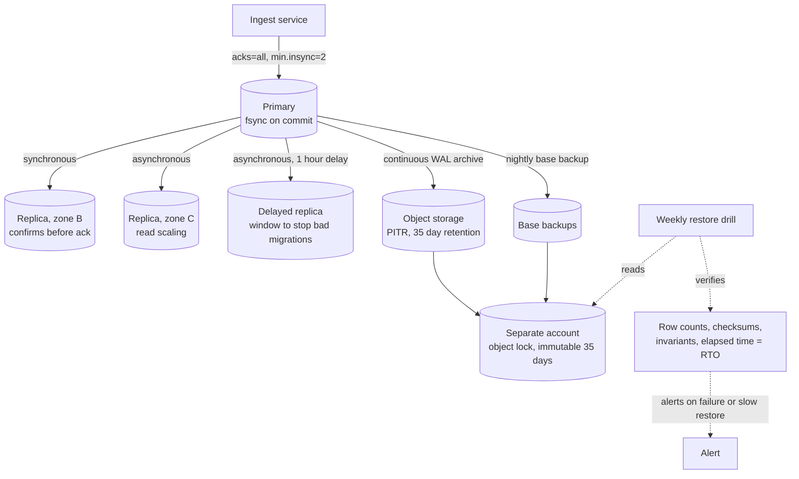
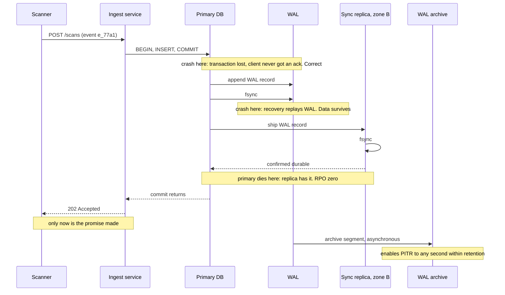

# Chapter 12: Durability

## 12.1 Problem Statement

Chapter 6's specification for the tracking platform contained one line that everybody agreed was non-negotiable: **a scan event acknowledged to the client must never be lost.** Recovery point objective of zero. It was ranked first in the sacrifice order, above availability, above latency, above cost.

Over eighteen months, the platform loses data six times.

**Forty seconds of acknowledged writes, gone.** Someone had set `synchronous_commit = off` on Postgres during the throughput work in Chapter 8. It roughly tripled write throughput and nothing appeared to break. What it actually does is return success as soon as the transaction is in memory, before the write-ahead log reaches disk. An instance-level power event loses every transaction still in flight. Around 40 seconds of scans that returned `202 Accepted` never existed.

**Ninety seconds lost during a failover.** Chapter 10's automated failover worked exactly as designed and promoted a replica in 50 seconds. The replica was asynchronous, so it was 90 seconds behind. Those writes were acknowledged by the primary and are on a disk nobody can reach. RPO was never zero; it was always "however far behind the replica happens to be", and nobody had measured that number.

**A bad migration deletes 200,000 rows, and all three replicas agree.** The replicas are not a safety net against this. They are three faithful copies of the mistake, applied within milliseconds. "We have three replicas" turns out to be an answer to a completely different question.

**The backups have been failing for five weeks.** Silently. The job's failure alert went to a distribution list that was decommissioned during a reorganisation. Nobody had noticed because nobody had ever needed a backup.

**The restore takes fourteen hours.** Nobody had ever timed one. Two terabytes over a link that sustains about 200 MB/s is roughly three hours of transfer alone, followed by index rebuilds and write-ahead log replay. Meanwhile the business is down, which turns a data problem into an availability problem.

**And the point-in-time recovery window is too short.** Archived write-ahead log segments were expiring after seven days under a storage lifecycle rule written by someone optimising cloud spend. The corruption they needed to recover from was nine days old.

Six failures, and here is what they have in common: **the system reported success every single time.** Every write returned 202. Every replica reported healthy. Every backup job exited zero, right up until it did not, and then quietly. Chapter 11 was about wrong answers that look right. This chapter is about data that appears to be safely stored and is not.

## 12.2 Why This Problem Exists

**"Written" is not one event, it is about six.** When your code calls save and gets no exception, the data might be in an application buffer, a language runtime buffer, the operating system's page cache, a disk controller's cache, or on physical media. Each of those survives a different set of failures. Most engineers have never traced this path, so "the write succeeded" gets treated as a single fact rather than as a question about which layer.

**Durability trades directly against write latency, and the trade is usually made by accident.** Every level of safety costs a round trip or a flush. Because the fast settings look identical to the safe ones until a machine loses power, they get chosen during performance work, by someone measuring throughput, with no visible downside for months or years.

**Replication looks like a backup and is not.** Both produce extra copies, so intuition merges them. But replication's entire purpose is to apply your writes everywhere quickly, which means it applies your mistakes everywhere quickly. It defends against a disk dying. It offers nothing at all against a bad migration, a buggy delete, ransomware, or a mistaken `DROP`.

**Backups are write-only until the day they are not.** The backup job runs nightly for two years and nobody reads its output. There is no feedback loop, so a broken backup and a working backup produce identical experiences right up to the moment of need. This is the single most reliable way for organisations to discover they have no backups.

**RPO and RTO are almost never measured, only asserted.** Teams write "RPO zero" in a document and then run asynchronous replication, which contradicts it. They write "RTO one hour" and have never performed a restore. Both numbers are properties of mechanisms that can be measured today, and almost nobody measures them until an incident does it for them.

## 12.3 Real World Analogy

Your family photographs.

They are on your phone. That is one copy on one device, and the device can be dropped in a river.

So you turn on cloud sync. Now there are two copies and you feel safe. And for the failure you were thinking of, dropping the phone, you are safe.

Then one evening you are tidying up and delete an album by mistake. Within seconds the cloud faithfully deletes it too, because that is what sync is for. Two copies, one mistake, zero photographs. **Sync protects the photos from your phone. It does not protect the photos from you.**

So you also copy everything to an external drive once a year and leave it in a drawer. That is a backup: a copy taken at a point in time that does not follow your subsequent mistakes. Notice its properties. It can restore the album you deleted. It cannot restore anything from the last eleven months, which is its recovery point. And it takes a whole evening to copy back, which is its recovery time.

Then the drawer drive fails, silently, and you learn this on the evening you need it, because you have never once plugged it in to check. **An untested backup is a belief about a backup.**

And finally, prints at your parents' house. Different building, different failure modes, and immune to anything that happens to your account, your devices, or your judgement. That is offsite and offline, and it is the answer to the whole-house fire, the stolen laptop, and the compromised account.

Every distinction in this chapter is in that story. Sync is replication and it propagates deletions. Backups are point-in-time and they have an RPO and an RTO. Untested media fail silently. Offsite and offline copies defend against categories that no amount of local redundancy touches. And the one thing nobody does, until they lose something, is verify that the restore actually works.

## 12.4 Simple Explanation

**Durability is the guarantee that once a write has been acknowledged, it survives.**

The whole subject lives in two questions:

1. **Survives what?** A process crash, a machine losing power, a disk failing, an availability zone going dark, a region being lost, a bad migration, a malicious deletion. These are not the same event and they need different mechanisms.
2. **Acknowledged when?** This is the part people skip. The acknowledgement is a promise, and its value depends entirely on where the data was when you made it.

Two numbers express the requirement, and Chapter 6's spec sheet should carry both:

| Term | Question it answers | Example |
|---|---|---|
| RPO, recovery point objective | How much data may we lose? | "At most 5 minutes of writes" |
| RTO, recovery time objective | How long may recovery take? | "Service restored within 1 hour" |

RPO zero means no acknowledged write may ever be lost, which is expensive and constrains your entire write path. RPO of 24 hours means a nightly backup is sufficient. Most systems need different values for different datasets, and saying "RPO zero" for everything is usually a sign that nobody has priced it.

The distinction that causes the most damage in practice:

> **Replication protects against things failing. Backups protect against things being wrong.**

Replication gives you extra copies that track the primary continuously, so a dead disk or a dead machine costs you nothing. It also copies every deletion, every corruption, and every bad migration, instantly and faithfully. Backups are frozen copies that do not follow the primary, so they can restore a state that the primary no longer has.

You need both. They cover disjoint sets of threats, and Section 12.5.5 has the table.

## 12.5 Technical Deep Dive

### 12.5.1 What actually happens when you write

Trace a single row insert from your code to physical media. Most durability bugs are a misunderstanding of one of these boundaries.

```
1. Application object                  in your heap
2. Driver / JDBC buffer                still your process
3. write() syscall                     copied into the kernel
4. OS page cache                       kernel memory, NOT on disk yet
5. Device queue                        handed to the storage device
6. Disk controller cache               device memory, may be volatile
7. Physical media                      genuinely persistent
```

The critical boundary is between 4 and 7. A successful `write()` syscall means the kernel has your data in memory and will get to it eventually. It does **not** mean the data is on disk. If the process crashes, the kernel still has it and it survives. If the machine loses power, it is gone.

`fsync()` is the call that forces everything from the page cache down to the media and does not return until the device says it is done. This is the only point at which "on disk" becomes true.

| Failure | Survived at stage 4 (page cache)? | Survived at stage 7 (fsync'd)? |
|---|---|---|
| Application throws, process exits | No | Yes |
| Process killed with SIGKILL | **Yes**, kernel still holds it | Yes |
| Kernel panic | No | Yes |
| Power loss or instance termination | **No** | Yes |
| Disk failure | No | **No**, needs a second copy |
| Availability zone loss | No | No, needs a second zone |
| Bad migration deleting rows | No | **No**, needs a backup |

Two things people get wrong here. **Killing a process with `kill -9` does not test durability**, because the page cache survives it, so your test passes and the real failure mode is untested. You need a machine-level power event, or a virtual machine forcibly terminated, to test what actually happens. And **an fsync that returns is only as honest as the hardware underneath it**: consumer drives with volatile write caches and no power-loss protection have historically acknowledged flushes they had not completed. Enterprise and cloud storage generally handle this correctly, and it is worth knowing the failure exists.

### 12.5.2 The acknowledgement ladder

This is the table to internalise. Each rung costs latency and buys a class of survival.

| Ack after | Survives | Typical cost | Use for |
|---|---|---|---|
| In-memory buffer | Nothing beyond an exception | ~0 | Metrics, telemetry, caches |
| `write()` to page cache | Process crash | microseconds | Logs where a little loss is fine |
| `fsync` to local disk | Power loss on that machine | 0.05 to 1 ms on NVMe, more on network storage | Single-node durability |
| fsync plus 1 synchronous replica | That machine dying entirely | plus 1 network round trip | Common default for important data |
| fsync plus quorum of replicas across zones | Zone loss | plus cross-zone round trip, 1 to 3 ms | RPO zero within a region |
| Plus cross-region replica | Region loss | plus 50 to 200 ms | Regulated or critical systems |
| Plus offsite immutable backup | Bad migrations, ransomware, insider deletion | asynchronous, no request cost | Everything that matters |

Read it as a menu rather than a ladder to climb to the top of. The right rung differs per dataset: a scan event and a click-tracking pixel do not deserve the same guarantee, and pretending they do makes the important one slower or the trivial one more expensive.

Concretely, in the two databases most readers will use:

```
Postgres:
  synchronous_commit = off       ack before WAL reaches disk. Fast, loses recent commits on power loss
  synchronous_commit = local     ack after local WAL fsync
  synchronous_commit = on        ack after WAL fsync, and after synchronous replicas confirm
  synchronous_standby_names      which replicas must confirm, and how many

MySQL / InnoDB:
  innodb_flush_log_at_trx_commit = 0   flush once per second. Fastest, up to 1s of loss
                                  = 1   flush and fsync per commit. Default, safe
                                  = 2   write to OS cache per commit, fsync per second
                                        survives process crash, not power loss
  sync_binlog = 1                       fsync the binary log per commit
```

Section 12.1's first failure is one line in that first block. It is a legitimate setting with legitimate uses, and choosing it while holding an RPO-zero requirement is the contradiction.

### 12.5.3 Write-ahead logs and group commit

Databases do not write your row where it belongs and then flush. Random writes to data pages are slow and, worse, a crash in the middle leaves a page half-written. Instead they append the change to a **write-ahead log** first, fsync that, and only then apply it to the data files at leisure.

Two properties make this work:

- **Appending is sequential**, which is dramatically faster than random writes on any storage medium.
- **The log is the truth.** After a crash, recovery replays the log to rebuild whatever had not yet been applied. A transaction is durable the moment its log record is fsync'd, not when the data page is updated.

The obvious problem is that an fsync per transaction is expensive. Every commit paying half a millisecond caps you at a couple of thousand commits per second per connection. The answer is Chapter 8's batching, applied to durability:

**Group commit.** Transactions committing at the same moment share one fsync. Ten concurrent commits pay for one flush between them, so per-transaction cost falls sharply as concurrency rises. This is why a database can sustain tens of thousands of durable commits per second on hardware that performs a few thousand fsyncs per second, and it is why measuring commit latency with a single thread tells you almost nothing about throughput.

```
Postgres knobs, and the trade they express:
  commit_delay      wait this many microseconds before flushing, to gather more commits
  commit_siblings   only wait if at least this many transactions are active

Deliberately adding a little latency per commit to raise durable throughput.
Exactly Chapter 8's batching formula, applied to fsync.
```

The same structure appears everywhere: Kafka's log segments with configurable flush behaviour, file systems with journals, and event-sourced systems where the log is not an implementation detail but the primary store (Chapter 58).

### 12.5.4 Replication, and what your RPO actually is

Replication gives you copies on other machines. How much durability it buys depends entirely on when the primary acknowledges.

| Mode | Primary acks after | RPO if the primary is lost | Cost |
|---|---|---|---|
| Asynchronous | Local commit only | Whatever the replica lag is, and it is unbounded during load | None on the write path |
| Semi-synchronous | At least one replica received it | Near zero, but "received" may mean in memory | One round trip |
| Synchronous | Replicas have fsync'd it | Zero | Round trip plus remote fsync |
| Quorum, W of N | W replicas confirmed | Zero if W plus R exceeds N | Round trip to the slowest of W |

The essential and widely missed point: **with asynchronous replication, your RPO is your replication lag, and your replication lag is a distribution, not a number.** It is 50 milliseconds when idle and can be minutes during a bulk import, a long transaction, or a network problem. Section 12.1's second failure is exactly this: the failover was fast and correct, and it discarded 90 seconds of acknowledged writes because that is how far behind the replica was at that moment.

So if your specification says RPO zero, three things must be true and are worth checking today:

1. Commits are fsync'd locally, not merely written to the page cache.
2. At least one replica confirms before the client is told success, and that confirmation means durable rather than received.
3. Failover refuses to promote a replica that is behind, or the guarantee evaporates at the moment it matters most. Chapter 48 covers the promotion logic.

There is a subtlety worth naming because it bites people. "Acknowledged by the replica" may mean the replica has the data in memory but has not flushed it. If the whole zone loses power, both copies were in volatile memory and both are gone. Correlated failure, from Chapter 10, applies to durability too: replicas in the same rack, same zone, or on the same power feed do not fail independently.

```java
// Chapter 2's API returned 202 only after the broker acknowledged.
// This is the same principle, and it is where most durability bugs live:
// never tell the client "done" before the data is as durable as you promised.

@PostMapping("/scans")
public ResponseEntity<Ack> record(@RequestBody ScanEvent e) {
    // producer configured: acks=all, min.insync.replicas=2, enable.idempotence=true
    SendResult<String, String> result = kafka.send(TOPIC, e.id(), toJson(e)).get();
    return ResponseEntity.accepted().body(new Ack(e.id()));   // only now
}
```

`acks=all` with `min.insync.replicas=2` means the leader plus at least one follower have the record before the send completes. Setting `acks=1` makes the write faster and makes the acknowledgement a lie about anything worse than a leader restart.

### 12.5.5 Replication is not backup

The table that should be on a wall somewhere.

| Threat | Local fsync | Replicas, same zone | Replicas, other zone | Snapshots | Offsite immutable backup |
|---|---|---|---|---|---|
| Process crash | Yes | Yes | Yes | Yes | Yes |
| Machine power loss | Yes | Yes | Yes | Yes | Yes |
| Disk failure | No | Yes | Yes | Yes | Yes |
| Zone loss | No | No | Yes | Depends | Yes |
| Region loss | No | No | No | Depends | Yes |
| **Bad migration, buggy delete** | No | **No** | **No** | Yes | Yes |
| **Application corrupting data over weeks** | No | **No** | **No** | Only if old enough | Yes |
| **Accidental `DROP TABLE`** | No | **No** | **No** | Yes | Yes |
| **Ransomware or compromised credentials** | No | No | No | **Only if immutable** | Yes |
| **Malicious insider with admin access** | No | No | No | No | **Only if separate account** |

The four bold rows are the whole argument. Every one of them is a case where replication actively works against you, because its job is to make every copy agree with the primary as fast as possible.

That leads to the practices that cover the bottom half of the table:

**3-2-1.** Three copies of the data, on two different media or systems, with one offsite. Old advice, still correct.

**Immutability.** Backups that cannot be deleted or altered for a retention period, using object lock or write-once storage. This is what turns a backup into a defence against compromised credentials rather than another thing an attacker deletes on their way through.

**Separate blast radius.** Backups in a different cloud account or subscription, with different credentials, where the production role has no delete permission. If the identity that can destroy production can also destroy the backups, you have one failure domain wearing two hats.

**Delayed replicas.** A cheap and underused trick: a replica deliberately kept an hour behind. When someone runs a destructive migration, you have sixty minutes to stop that replica before it applies the change, and recovery from it is far faster than a full restore.

### 12.5.6 Backup types, PITR, and the retention trap

| Method | RPO | RTO | Cost | Notes |
|---|---|---|---|---|
| Nightly full backup | Up to 24 hours | Hours | High storage | Simple, slow, and a large RPO |
| Incremental | Up to 24 hours | Longer, needs the chain | Low storage | A broken link ruins the chain |
| Volume snapshot | Snapshot interval | Fast for the same infrastructure | Medium | Often crash-consistent rather than application-consistent |
| **Continuous archiving plus PITR** | **Seconds** | Base restore plus log replay | Medium | The right default for databases |
| Logical dump | Up to dump interval | Slow, rebuilds indexes | Low | Portable, good for schema-level recovery |

**Point-in-time recovery** is the mechanism worth understanding, because it is what makes "restore to 14:32, just before the bad migration" possible. You keep a periodic base backup and archive every write-ahead log segment continuously. Recovery restores the base and then replays the log up to a chosen instant.

```
Base backup:  Sunday 02:00
WAL archive:  continuous, every segment shipped to object storage
Bad migration ran Wednesday 14:33

Recovery: restore Sunday's base, replay WAL to 14:32:59. Data loss: seconds.
```

Two traps live here and Section 12.1 hit both.

**Retention shorter than your detection time.** Corruption is often discovered days or weeks after it starts, which is Chapter 11's whole point. If your archive keeps seven days and you notice on day nine, PITR cannot reach the good state. Retention must exceed your realistic time-to-detect, not your time-to-recover.

**Consistency of the copy.** A volume snapshot taken while the database is running captures whatever was on disk at that instant, which for most databases is recoverable, because the write-ahead log makes crash recovery possible. That is crash consistency. **Application consistency**, where the backup represents a clean transactional boundary, needs coordination with the database. And a snapshot spanning several volumes, taken without coordination, may not be consistent with itself at all. Check which one you have rather than assuming.

**And the rule that matters more than all of the above: a backup is a hypothesis until you have restored it.**

```bash
# The restore drill. Run it on a schedule, automated, with the result alerted.
# This is the only thing that converts a backup into a fact.
#
# 1. Provision a clean environment
# 2. Restore the most recent backup, from the real backup location
# 3. Replay WAL to a chosen point in time
# 4. Run integrity checks: row counts, checksums, invariants from Chapter 11
# 5. RECORD THE ELAPSED TIME. That number is your real RTO.
# 6. Alert if the drill fails or if elapsed time exceeds the RTO target
```

Automate it weekly. The three things it verifies cannot be verified any other way: that the backup files are readable, that the restore procedure is correct, and that RTO is what the document claims.

### 12.5.7 Durability arithmetic and erasure coding

Cloud object stores advertise numbers like eleven nines of durability, meaning an annual probability of losing an object of roughly one in a hundred billion. That is not marketing about disks being good; disks are not that good. It comes from combining several things:

- Data spread across multiple facilities that fail independently
- Redundancy sufficient to survive several simultaneous device losses
- **Continuous background scrubbing** that reads stored data, verifies checksums, and rebuilds anything that has silently degraded, which is Chapter 11's verification principle applied to bytes at rest
- Fast repair, so the window in which a second failure would be fatal is short

Two ways to build the redundancy, with very different economics:

```
Replication, 3 copies:
  Storage overhead: 200 percent (3x)
  Survives: 2 simultaneous device losses
  Repair: copy from a surviving replica. Simple and fast.

Erasure coding, Reed-Solomon 10 data + 4 parity:
  Any 10 of the 14 chunks reconstruct the object
  Storage overhead: 40 percent (1.4x)
  Survives: 4 simultaneous chunk losses
  Repair: read 10 chunks and recompute. More CPU and network per repair.
```

Erasure coding gives better fault tolerance at a third of the storage cost, which is why large object stores use it. The trade is complexity, higher repair cost, and worse small-object efficiency, which is why databases generally use replication for their hot data and erasure coding shows up in the archival tiers. Chapter 110 goes into distributed file storage properly.

One clarification worth making, because the numbers get conflated: **durability and availability are different promises.** An object store may offer eleven nines of durability and four nines of availability, meaning your data is essentially never lost and is occasionally unreachable for a few minutes. Losing access temporarily and losing data permanently are different incidents with different responses.

### 12.5.8 Decide durability per dataset

Not all data deserves the same guarantee, and treating it uniformly is expensive in one direction and dangerous in the other.

| Dataset | Durability need | Why |
|---|---|---|
| Scan events, orders, payments | Highest: fsync plus multi-zone quorum plus immutable backups | Source of truth, irreplaceable, legally significant |
| Outbox table | Same as the business data | It is inside the same transaction by design (Chapter 11) |
| Derived search index | None, beyond convenience | Rebuildable from the source. Back up for RTO, not RPO |
| Cache | None | Rebuildable by definition. Never treat as a store |
| Session state | Low to medium | Losing it logs people out, which is annoying rather than fatal |
| Analytics event stream | Medium, some loss tolerable | Statistical use, and gaps are survivable |
| Audit log | Highest, plus immutability and long retention | Often a legal requirement, and it is what makes Chapter 11's repair possible |

The principle from Chapter 11 pays off here: **make derived state rebuildable, and then you only need expensive durability for the sources.** If the search index, the cache, and the projections can all be regenerated from a durable event log, your durability budget concentrates where it matters, and your restore procedure gets simpler because there are fewer authoritative things to restore.

## 12.6 Architecture Diagram

Two views. First, the write path with acknowledgement points marked, because this is the diagram that makes the ladder concrete.

```
   Application
       |  save()
       v
   JDBC buffer  ............ ACK HERE = survives nothing
       |  write()
       v
   OS page cache  .......... ACK HERE = survives process crash only
       |  fsync()
       v
   Device cache
       |
       v
   Local media  ............ ACK HERE = survives machine power loss
       |
       |  replicate
       v
   Replica, same zone  ..... ACK HERE = survives disk and machine loss
       |
       |  replicate
       v
   Replica, other zone  .... ACK HERE = survives zone loss
       |
       |  archive, asynchronous
       v
   Immutable offsite backup   survives bad migrations, ransomware, region loss
```

Second, the full topology, showing which mechanism covers which threat.



Four things to read off it.

**The synchronous replica is in a different zone.** A synchronous replica in the same rack fails with the primary, which is Chapter 10's correlated failure applied to durability. The cross-zone round trip is the price of surviving a zone.

**The delayed replica is the cheapest insurance in the diagram.** It costs one machine and it converts "restore fourteen hours of backup" into "stop replication and promote" for the single most common disaster, which is a human running something destructive.

**Backups live in a separate account with object lock.** Production credentials cannot delete them. This is the row in Section 12.5.5's table that nothing else covers.

**The restore drill is on the diagram.** It is a component, not a procedure, because an untested backup is not a backup and because the drill is the only thing that measures RTO.

## 12.7 Request Flow

One scan event, traced through the durability layers, with what is lost if the system dies at each point.



Step by step, with the failure each step defends against:

1. **The transaction is written to the write-ahead log.** Sequential append, so it is fast, and the log is the authoritative record from this moment on.
2. **The log is fsync'd.** This is the boundary between "in memory" and "on disk". Everything before it is lost on power failure.
3. **The record is shipped to a replica in another zone, which fsyncs it and confirms.** Now the data survives the loss of the entire primary machine and of its zone.
4. **Only then does the commit return, and only then does the service return 202.** This ordering is the entire discipline of durability. Every failure in Section 12.1 except the migration and the retention trap was a violation of it.
5. **The log segment is archived asynchronously.** Off the request path, because it defends against a slower class of disaster and does not need to be in the client's latency budget.
6. **A delayed replica lags deliberately** and a weekly drill verifies the archive is restorable.

Two observations. **The client is told last**, after the guarantee is real, which costs one cross-zone round trip, roughly one to three milliseconds. That is the actual price of RPO zero for this path, and it is worth knowing the number so the trade can be discussed rather than assumed.

And **the failure notes matter as much as the steps.** A crash before step 2 loses a transaction the client never received an acknowledgement for, which is correct behaviour and not data loss. Data loss is only ever about acknowledged writes, and being precise about that distinction prevents a lot of confused incident reviews.

## 12.8 Internal Components

| Component | Durability role | Failure mode | Guard |
|---|---|---|---|
| Write-ahead log | Makes commits durable with sequential writes | Disabled fsync makes it decorative | Verify commit settings in production, not just in the repo |
| fsync | The boundary between memory and media | Hardware that lies about completion | Use storage with power-loss protection; test with real power cuts |
| Group commit | Amortises fsync cost across concurrent commits | Tuned for latency at the cost of throughput or vice versa | Measure durable commits per second under concurrency |
| Synchronous replica | Survives loss of the primary machine or zone | Same zone, same rack, same power feed | Place across zones and verify placement |
| Asynchronous replica | Read scaling and disaster recovery | Lag is your real RPO, and it is unbounded | Alert on lag; refuse promotion beyond a threshold |
| Failover logic | Turns redundancy into recovery | Promotes a lagging replica and loses writes | Lag guard before promotion, Chapter 48 |
| Delayed replica | Window to escape destructive changes | Nobody remembers it exists during an incident | Put it in the runbook and the drill |
| WAL archiving | Enables point-in-time recovery | Silent archive failures, short retention | Alert on archive lag; retention beyond time-to-detect |
| Base backups | Restore foundation | Never tested, or inconsistent | Automated weekly restore drills |
| Immutable offsite copy | Survives ransomware, insiders, account loss | Same credentials, same account | Object lock, separate account, no delete permission for production |
| Restore drill | Converts belief into fact and measures RTO | Not run, or run against the wrong copy | Schedule it, alert on failure and on elapsed time |
| Checksums and scrubbing | Detects silent corruption at rest | Not enabled, or never verified | Enable checksums; scrub on a schedule |

The two rows most often absent from real systems are the delayed replica and the restore drill, and they are respectively the cheapest recovery mechanism and the only proof that any of the others work.

## 12.9 Production Example

**GitLab's January 2017 incident is the most valuable public document in this entire chapter,** because they published a detailed, honest account in real time.

The short version: during an incident response, an engineer intending to clear a replica's data directory ran the removal against the primary. Roughly 300 GB of production data was deleted. Then they went to recover, and discovered that of five separate backup and replication mechanisms, none was usable. Regular logical dumps were failing silently owing to a version mismatch between tools, producing near-empty files that nobody had inspected. Disk snapshots were not enabled for the relevant volume. Replication had faithfully applied the deletion. The remaining options were incomplete or too old. They eventually recovered from a staging snapshot that happened to exist, losing about six hours of data.

Every failure in this chapter is in that incident. Replication propagated the destructive action instantly. Backups failed silently because nobody read their output. There was no restore drill, so the gap between believing and knowing was never closed. And the recovery time was measured in days rather than the hours anybody would have guessed.

The lesson is not that the engineer made a mistake, which is inevitable and normal. It is that **five mechanisms existed and zero had been verified**, and verification is the only thing that distinguishes a backup strategy from a collection of intentions.

**Object stores show what the other end of the spectrum costs.** Services like S3 target durability figures around eleven nines by combining redundancy across independent facilities, erasure coding rather than plain replication for storage efficiency, continuous background verification of stored data against checksums, and fast repair to shorten the window in which additional failures would be fatal. Notably, their availability targets are several orders of magnitude weaker than their durability targets, which is a deliberate and instructive split: they will occasionally fail to serve your object, and they will essentially never lose it.

**And the everyday version is a configuration file.** The difference between `innodb_flush_log_at_trx_commit = 1` and `= 2`, or between `synchronous_commit = on` and `off`, is the difference between surviving a power event and losing the last second of committed transactions. These settings are changed during performance work, by well-meaning engineers, and the consequence is invisible until an instance is terminated ungracefully. Anyone who owns an RPO number should be able to state, from memory, what those settings are in production.

## 12.10 Advantages

- **Acknowledged writes actually survive**, which is the foundation everything else assumes. Chapter 11's correctness work is meaningless if the correct data evaporates.
- **RPO and RTO become measurable numbers** rather than aspirations, so the business can make an informed trade.
- **Point-in-time recovery turns catastrophic mistakes into bounded ones.** A bad migration becomes a thirty minute recovery to a specific second rather than an existential event.
- **Delayed replicas make the most common disaster cheap to recover from**, at the cost of one machine.
- **Immutable offsite copies defend against threats no amount of redundancy touches**, including compromised credentials and malicious deletion.
- **Restore drills convert belief into knowledge** and simultaneously measure RTO, which nothing else does.
- **Per-dataset durability concentrates spend where it matters**, so the source of truth is expensive and the rebuildable derivatives are not.

## 12.11 Limitations

- **Durability costs write latency**, and the strongest guarantees add a cross-zone round trip to every commit.
- **RPO zero is not achievable against every threat.** No write-path mechanism protects against a bad migration; that needs backups, which have their own RPO.
- **Backups have a recovery time you cannot escape.** Restoring terabytes takes hours regardless of how good the backup is, which is why availability during recovery is a separate problem.
- **Retention costs money and creates privacy obligations.** Keeping everything forever conflicts with deletion requirements and regulation.
- **Verification is never complete.** A drill proves the backup restored on the day you tested it, not that tomorrow's will.
- **Hardware and cloud abstractions can lie**, and the failure is silent until a power event.
- **Durability does not imply correctness.** You can durably store wrong data forever, which is Chapter 11, and the two disciplines have to be applied together.

## 12.12 Trade-offs

| Dial | One way | The other way |
|---|---|---|
| Commit acknowledgement | fsync every commit: safe, slower writes | Buffered or periodic flush: fast, a window of loss on power failure |
| Replication mode | Synchronous: RPO zero, latency and a dependency on replica health | Asynchronous: fast writes, RPO equals lag |
| Quorum size | Larger W: safer, slower, less available under failure | Smaller W: faster and more available, weaker guarantee |
| Backup frequency | Frequent: small RPO, more storage and load | Infrequent: cheap, larger RPO |
| Retention | Long: covers late detection and audits, costs storage and privacy exposure | Short: cheap, unrecoverable past the window |
| Redundancy scheme | Replication: simple, fast repair, 200 percent overhead | Erasure coding: 40 percent overhead, more CPU and repair cost |
| Backup isolation | Separate account, immutable: survives compromise, more operational friction | Same account: convenient, single blast radius |
| Restore strategy | Delayed replica: minutes to recover, costs a machine | Backup restore: cheaper to run, hours to recover |

The removal test.

**Remove fsync on commit.** You gain a large multiple of write throughput, genuinely. You lose every acknowledged transaction that had not been flushed when the machine lost power, which is typically hundreds of milliseconds to seconds of writes. Correct for telemetry, catastrophic for orders, and the reason this is dangerous is that both look identical until the power event.

**Remove the synchronous replica and go asynchronous.** You gain one to three milliseconds on every write and better availability, since the primary no longer depends on a replica being healthy. You lose RPO zero, and your actual RPO becomes an unmeasured, load-dependent lag distribution.

**Remove backups and rely on three replicas.** You gain storage cost and operational simplicity. You lose all defence against the four bold rows in Section 12.5.5, which are the ones that actually destroy companies. This is Section 12.1's third failure and GitLab's incident.

**Remove the restore drill.** You gain an hour a week of automation runtime. You lose the only evidence that any of the above works, and you will discover its absence during your worst week.

## 12.13 Common Mistakes

**Acknowledging before the data is durable.** Returning 200 or 202 while the write is still in a buffer, a page cache, or an unconfirmed replica. Every promise you make must be behind the guarantee you claim.

**Assuming a successful `write()` means on disk.** It means the kernel has it. Only fsync crosses the boundary.

**Testing durability with `kill -9`.** The page cache survives it, so the test passes and the real failure mode is untested. Terminate the machine.

**Claiming RPO zero while running asynchronous replication.** The most common contradiction between a specification and a system, and it stays hidden until failover.

**Never measuring replication lag,** and therefore never knowing what your RPO is.

**Promoting a lagging replica during failover.** Turns a recoverable outage into permanent data loss.

**Treating replicas as backups.** They copy your mistakes faithfully and instantly.

**Backups with no alerting on failure.** Five weeks of silent failure is the normal outcome, not an unlucky one.

**Never restoring.** A backup is a hypothesis until tested, and the test also measures RTO.

**Retention shorter than time-to-detect.** Corruption is often found weeks later, and a seven day window cannot recover from a nine day old problem.

**Backups deletable by production credentials.** One compromise or one bad script removes both the data and its recovery.

**Backing up the database and forgetting everything else:** object storage, configuration, secrets, schema migrations, and the infrastructure definitions needed to rebuild the environment you are restoring into.

**Uniform durability for every dataset,** which overspends on caches and underspends on the ledger.

## 12.14 Interview Questions

**Q: What does durability mean, and what does an acknowledged write guarantee?**
That once a write is acknowledged, it survives. What it survives depends entirely on where the data was when you acknowledged: an in-memory buffer survives nothing, the OS page cache survives a process crash, an fsync'd local disk survives power loss, a confirmed cross-zone replica survives zone loss, and only an immutable offsite backup survives a bad migration.

**Q: Difference between RPO and RTO?**
RPO is how much data you may lose, measured in time. RTO is how long recovery may take. They are set by different mechanisms: RPO by the write path and replication, RTO by restore speed and failover automation.

**Q: You have three replicas. Are you protected against data loss?**
Against hardware and machine failure, yes. Against a bad migration, a buggy delete, a `DROP TABLE`, ransomware, or corruption written by the application, no. Replication propagates all of those instantly to every copy. You also need point-in-time recovery and immutable offsite backups.

**Q: What is your RPO with asynchronous replication?**
Your replication lag at the moment of failure, which is a distribution rather than a number and is unbounded during load spikes and long transactions. If the specification says RPO zero, you need synchronous confirmation from at least one replica before acknowledging, plus a failover that refuses to promote a lagging replica.

**Q: Why is `kill -9` a poor test of durability?**
Because the operating system's page cache survives process termination, so data that was written but not fsync'd is still written to disk afterwards. To test durability you need to lose the machine, by terminating the instance or cutting power.

**Q: Explain point-in-time recovery and its main trap.**
Keep a periodic base backup and continuously archive write-ahead log segments, then recover by restoring the base and replaying the log to a chosen instant. The trap is retention: corruption is often detected days or weeks later, so archive retention must exceed your realistic time to detect, not just your time to recover.

**Q: How do object stores achieve very high durability figures?**
Redundancy across independently failing facilities, erasure coding rather than plain replication for efficiency, continuous background scrubbing that verifies checksums and rebuilds degraded data, and fast repair to shrink the window where further failures would be fatal. Note that their durability and availability targets are deliberately different numbers.

**Q: Replication or erasure coding?**
Replication is simple with fast repair and roughly 200 percent overhead for three copies. Erasure coding, for example ten data chunks plus four parity, tolerates four losses at about 40 percent overhead but costs more CPU and network to repair and is inefficient for small objects. Hot transactional data usually uses replication; large-scale object and archival storage uses erasure coding.

**Q: What is a delayed replica for?**
A replica deliberately kept behind, typically by an hour, so that when someone runs a destructive statement you have a window to stop it before the replica applies the change. Recovery is then a promotion rather than a multi-hour restore, and it covers the most common cause of catastrophic data loss, which is human error.

**Q: How do you know your backups work?**
Restore them on a schedule, automatically, into a clean environment, then verify with row counts, checksums, and business invariants, and record the elapsed time as your measured RTO. Alert both when the drill fails and when it exceeds the RTO target. Anything short of that is an assumption.

## 12.15 Production Best Practices

1. **Never acknowledge before the guarantee is real.** Return success only after the data is as durable as you have promised.
2. **Know and document your commit settings in production**, specifically whether commits are fsync'd and whether replicas confirm before acknowledgement.
3. **Place synchronous replicas in a different zone**, so the copy does not share a power feed or a rack with the primary.
4. **Measure replication lag continuously and alert on it,** because it is your real RPO.
5. **Guard failover with a lag threshold** so a promotion cannot silently discard acknowledged writes.
6. **Run continuous WAL archiving with point-in-time recovery,** with retention longer than your realistic time to detect corruption.
7. **Keep at least one immutable offsite copy** in a separate account, with object lock, that production credentials cannot delete.
8. **Run a delayed replica.** It is one machine and it covers the most common disaster.
9. **Automate a restore drill weekly**, verify the restored data with checksums and invariants, and record elapsed time as measured RTO.
10. **Alert on backup job failure and on archive lag,** to an alias that is verified to reach a human.
11. **Back up more than the database:** object storage, configuration, secrets, schema migration history, and infrastructure definitions.
12. **Set durability per dataset,** and make derived state rebuildable so the expensive guarantees apply only to sources of truth.
13. **Enable storage checksums and background scrubbing** to detect silent corruption at rest.
14. **Test with real machine loss**, not process termination, before claiming any of this works.

## 12.16 Summary

Durability is the promise that an acknowledged write survives, and the entire subject is contained in two questions: survives what, and acknowledged when. A write sitting in a page cache survives a process crash and not a power cut. A write fsync'd locally survives power loss and not a dead disk. A write confirmed by a replica in another zone survives that zone, and none of these survive a bad migration, because the mechanisms that make copies fast are exactly the mechanisms that copy your mistakes fast.

That is the distinction worth carrying out of this chapter. Replication protects against things failing; backups protect against things being wrong. They cover disjoint threats, so you need both, and the threats that destroy companies, destructive migrations, ransomware, silent corruption discovered weeks later, sit entirely in the backup column. Which means an immutable copy in a separate account, retention longer than your time to detect, and a delayed replica that gives you an hour to catch a mistake before it propagates.

The cost of every guarantee is paid in write latency, and the honest way to hold that is per dataset. Scan events, orders, and audit logs deserve fsync plus cross-zone quorum plus immutable backups. Caches and search indexes deserve nothing, because they are rebuildable, and making derived state rebuildable is what lets you afford expensive durability where it counts.

Finally, the part that separates teams who have durability from teams who believe they do: **verification**. RPO is a property of your replication lag, which is measurable today. RTO is a property of your restore speed, which is measurable today. A backup is a hypothesis until it has been restored into a clean environment and checked. GitLab had five mechanisms and zero verified ones, and that is the normal state of affairs rather than an unusual failure. The weekly restore drill is the cheapest component in this chapter and the only one that turns all the others from intentions into facts.

## 12.17 Quick Revision Notes

- Durability: an acknowledged write survives. Two questions: survives what, and acknowledged when.
- Write path: app buffer, kernel page cache, device cache, media. A successful `write()` is not on disk; only fsync crosses that boundary.
- `kill -9` does not test durability, because the page cache survives it. Terminate the machine.
- Acknowledgement ladder: memory (nothing), page cache (process crash), local fsync (power loss), sync replica (machine loss), cross-zone quorum (zone loss), cross-region (region loss), immutable backup (mistakes and malice).
- Write-ahead log makes commits durable with sequential appends. Group commit amortises fsync across concurrent commits, which is Chapter 8's batching applied to durability.
- Postgres `synchronous_commit`, MySQL `innodb_flush_log_at_trx_commit`. Know your production values by heart.
- With asynchronous replication, RPO equals replication lag, which is a distribution and unbounded under load.
- RPO zero requires local fsync, a replica confirming durably before acknowledgement, and failover that refuses to promote a lagging replica.
- Replication is not backup. It propagates deletes, corruption, and bad migrations instantly to every copy.
- Threats only backups cover: bad migrations, buggy deletes, `DROP TABLE`, slow corruption, ransomware, malicious insiders.
- 3-2-1: three copies, two media, one offsite. Add immutability and a separate account with no production delete permission.
- Delayed replica: one machine, gives you an hour to stop a destructive change from propagating. Cheapest recovery mechanism available.
- PITR: base backup plus continuous WAL archiving. Retention must exceed time-to-detect, not time-to-recover.
- A backup is a hypothesis until restored. The drill also measures your real RTO.
- Object store durability comes from independent facilities, erasure coding, background scrubbing, and fast repair. Durability and availability are different promises.
- Erasure coding RS(10,4): 40 percent overhead, tolerates 4 losses. Three-way replication: 200 percent overhead, tolerates 2.
- Set durability per dataset. Make derived state rebuildable so only sources need the expensive guarantees.

## 12.18 Mini Quiz

1. Your service returns 202 immediately after `write()` returns. Which failures lose acknowledged data, and which do not?
2. You run asynchronous replication with p99 lag of 800 ms and occasional spikes to 40 seconds. What is your RPO?
3. Why does `kill -9` on the database process not prove your durability settings are correct?
4. You have three replicas across three availability zones. A migration deletes 500,000 rows. What recovers them, and what does not?
5. Base backup nightly at 02:00, WAL archived continuously with 7 day retention. Corruption began 9 days ago and was noticed today. What can you recover to?
6. Explain how group commit lets a database exceed the number of fsyncs per second its disk supports.
7. Compare storage overhead and fault tolerance for three-way replication versus Reed-Solomon with 10 data and 4 parity chunks.
8. Your backups are in the same cloud account as production, with production's role able to delete them. Name two threats this fails against.
9. What is a delayed replica and which disaster does it address better than backups?
10. Your document says RTO is one hour. What single activity would confirm or refute that?

**Answers**

1. Survives: exceptions in your code and process termination including `kill -9`, because the kernel page cache holds the data and will flush it. Does not survive: machine power loss, instance termination, or a kernel panic, all of which lose whatever was in the page cache. It also does not survive disk failure, zone loss, or any logical error, none of which a local write addresses.
2. Your RPO is the lag at the moment of failure, so up to 40 seconds in the observed worst case, and genuinely unbounded because you have only observed the spikes so far. If you have committed to RPO zero, this configuration contradicts it.
3. Because process termination leaves the operating system page cache intact, so data written but not fsync'd is still written to disk afterwards and the test passes regardless of whether fsync is configured. Only losing the machine, by terminating the instance or cutting power, exercises the boundary that matters.
4. Recovered by: point-in-time recovery to just before the migration, a delayed replica stopped before it applied the change, or a snapshot or backup taken beforehand. Not recovered by: any of the three replicas, which applied the deletion within milliseconds and are now three faithful copies of the new state.
5. Nothing useful. PITR can only reach back 7 days, and the good state is at least 9 days old. Your options are limited to whatever older base backups still exist, if any, and manual reconstruction from other sources such as an event log or downstream systems. The lesson is that retention must exceed realistic time-to-detect.
6. Because concurrent transactions committing in the same short window share a single fsync. If twenty transactions are ready to commit and one flush persists all twenty log records, the durable commit rate is roughly twenty times the fsync rate. Per-transaction latency still includes one flush, which is why single-threaded commit latency is a poor predictor of throughput.
7. Three-way replication stores 3 units for every 1 of data, so 200 percent overhead, and tolerates 2 simultaneous losses; repair is a simple copy from a survivor. RS(10,4) stores 14 chunks for 10 units of data, so 40 percent overhead, and tolerates 4 simultaneous losses; repair requires reading 10 chunks and recomputing, costing more CPU and network, and it is inefficient for very small objects.
8. Ransomware or any compromised credential with production access, which can delete the backups along with the data. And malicious or mistaken insider action, including a script that enumerates and removes resources. Both are addressed by a separate account, credentials production does not hold, and object lock or write-once retention.
9. A replica that deliberately applies changes on a delay, commonly an hour. It addresses human error and destructive changes better than backups because recovery is a promotion or a simple export from a live, already-warm database, taking minutes, whereas a full restore of a large database plus log replay takes hours. It does not replace backups, since it is still online and still within the same blast radius for credential compromise.
10. Perform an actual restore. Provision a clean environment, restore the most recent backup from the real backup location, replay logs to a chosen point, verify integrity with row counts and business invariants, and record the elapsed time. That number is your RTO. Everything else is an estimate, and estimates of restore time are typically wrong by a factor of several.

## 12.19 Hands-on Exercise

**Part 1: measure the cost of durability.** Take a Postgres or MySQL instance and run a write benchmark at three settings: no fsync per commit, fsync per commit, and fsync per commit with a synchronous replica. Record throughput and p99 commit latency for each. You now know exactly what your RPO-zero guarantee costs, in milliseconds and in transactions per second.

**Part 2: prove that `kill -9` is not a durability test.** With fsync disabled, run a workload, `kill -9` the database, restart it, and count the surviving rows. Then repeat with the virtual machine forcibly powered off. Compare the two row counts. The difference is the data your usual test was hiding.

**Part 3: measure your real RPO.** Set up asynchronous replication and run a write workload. Sample replication lag every second for twenty minutes, including during a deliberate burst of writes. Plot the distribution and record p50, p99, and maximum. That maximum is your RPO under conditions you have actually observed.

**Part 4: destroy something and recover it.** Enable continuous WAL archiving. Run a workload, note the time, then run a destructive statement such as deleting a large number of rows. Now recover to one second before that statement using point-in-time recovery. Time the whole procedure. Then repeat using a delayed replica and compare the elapsed times.

**Part 5: run a real drill and find what is missing.** Restore your most recent production backup into a clean environment, using only the documented procedure and without asking the person who wrote it. Record every step that is wrong, ambiguous, or missing, and the total elapsed time. Then check what you could not restore: object storage, secrets, configuration, schema migration state. Most teams discover the database was the easy part.

## 12.20 Further Reading

- GitLab's public postmortem of the January 2017 database incident, plus the live document they maintained during it. The most instructive engineering write-up available on this subject, and unusually honest.
- *Designing Data-Intensive Applications*, Martin Kleppmann, chapters 3, 5, and 7. Write-ahead logs, replication modes and their guarantees, and what durability means in the presence of crashes.
- PostgreSQL documentation on write-ahead logging, `synchronous_commit`, continuous archiving, and point-in-time recovery. Dense, precise, and the settings section deserves a careful read by anyone who owns an RPO.
- *Ensuring Data Reaches Disk*, an LWN article on the write path, fsync semantics, and the ways applications get this wrong.
- Amazon's *Builders' Library* on durability and on backing up data, and published material on how large object stores combine erasure coding with continuous verification.
- *Coding for SSDs* and Reed-Solomon erasure coding primers, for the storage-efficiency mathematics behind large-scale durable storage.
- The Jepsen analyses, for empirical testing of what databases actually guarantee under failure as opposed to what their documentation claims.

---

**Next chapter: Chapter 13, Fault Tolerance.** Availability asks whether the system stayed up, and this chapter asks how: the mechanisms that let a system keep working while parts of it are broken, the failure modes that defeat them, and how to prove any of it works before an incident does it for you.
