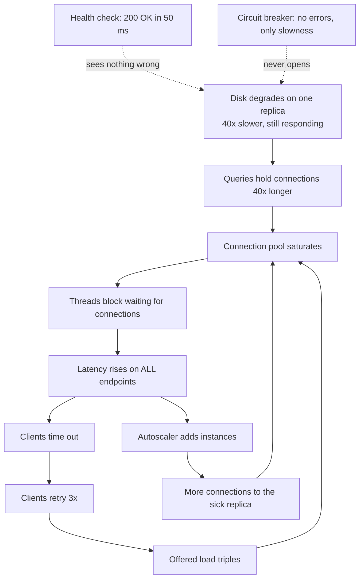
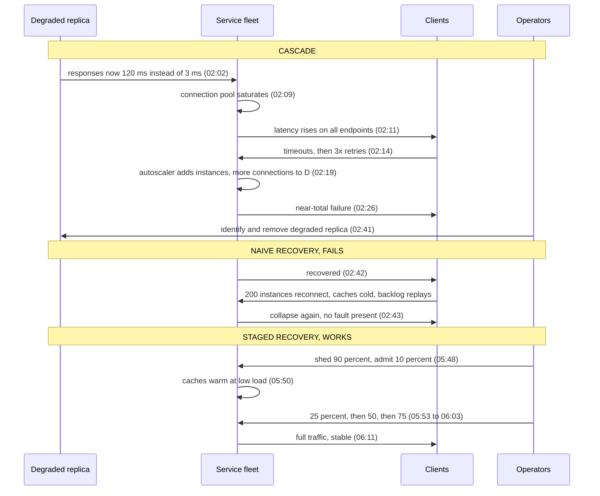

# Chapter 13: Fault Tolerance

## 13.1 Problem Statement

By now the tracking platform has everything the previous three chapters recommended. Redundancy across three zones. Automated failover with a lag guard. Timeouts on every call. Fallbacks on optional dependencies. Shallow health checks, so a database blip cannot remove the whole fleet. Synchronous replication, immutable backups, a weekly restore drill.

It suffers the worst outage in its history: four hours and nine minutes, total, all customers.

**The trigger is a disk that does not fail.** One database replica's storage begins degrading. Not dead. Just slow, by a factor of about forty. Reads that took 3 milliseconds now take 120. Everything still works, technically, which is the problem.

**Nothing detects it.** The health check returns 200 in 50 milliseconds, because after Chapter 10 the check is shallow and the process is genuinely healthy. The failure detector sees heartbeats arriving on time. The circuit breaker never opens, because calls are not failing, they are succeeding slowly. Every mechanism built to spot a broken component is looking for something that is not happening.

**The slowness propagates upward.** Queries routed to that replica hold connections forty times longer. Chapter 7's Little's Law does the rest: the connection pool needs forty times the connections for the same throughput, so it saturates. Threads block waiting for connections. Response times rise across every endpoint, including the ones that never touch that replica.

**Retries double the load.** Clients time out at two seconds and retry three times. Offered load triples against a system whose effective capacity has fallen. Chapter 8's congestion collapse begins.

**Autoscaling makes it worse.** CPU is not high, but latency is, so the scaling policy adds instances. Each new instance opens twenty connections to the same sick replica. Adding capacity increased the pressure on the bottleneck.

**They find and remove the bad replica at 02:41.** Traffic recovers. For about forty seconds.

**Then it collapses again, with no trigger.** Two hundred instances reconnect simultaneously. Every cache is cold, so every request goes to the database. Every client is replaying its backlog of retries at once. The system is now generating enough load, from its own recovery, to keep itself down. **The original fault is gone and the outage continues.**

Four attempts to bring it back fail the same way. What finally works is counterintuitive and takes a senior engineer twenty minutes to convince the room of: **shed ninety percent of traffic, bring the system up serving almost nobody, warm the caches, and ramp back over twenty minutes.**

Chapters 10 through 12 asked whether the system stays up, gives right answers, and keeps data. This chapter asks the mechanical question underneath all three: **how does a system keep working while parts of it are broken, and how do you know it will?**

## 13.2 Why This Problem Exists

**Most real failures are not clean.** Engineering intuition, and most textbook treatment, assumes components either work or stop. Production is full of components that half-work: slow disks, degraded network links, a node serving 3 percent errors, a replica that accepts writes and applies them late, a process that responds to health checks while its worker threads are all deadlocked. These are harder to detect than crashes and far more damaging, because every mechanism built for "it stopped" ignores "it is limping".

**You cannot tell a slow node from a dead one.** This is not an engineering shortcoming, it is a property of asynchronous networks. A node that has not replied might be dead, might be paused, might be behind a congested link, might have replied in a packet that was lost. Every failure detector is therefore a guess with a timeout attached, and every timeout is a choice between declaring healthy nodes dead and letting dead nodes hang.

**Failures cascade because everything is coupled through shared resources.** A slow dependency consumes threads, threads are shared, so an unrelated endpoint slows down. Retries add load to a system that is slow because of load. Queues absorb the excess until they become the problem. The individual mechanisms are each reasonable and their interaction is a feedback loop.

**And some systems stay broken after the cause is gone.** This is the counterintuitive one and it deserves a name: a **metastable failure**. The trigger created a state where the system's own recovery behaviour, retry backlogs, cold caches, reconnection storms, generates enough load to sustain the failure. Removing the trigger changes nothing. Adding capacity often makes it worse. The only exit is to reduce load.

**Finally, fault tolerance is the one property that is never exercised in normal operation.** Your request path runs millions of times a day and is therefore well tested. Your failover path runs twice a year. Your fallback code, your recovery ramp, and your runbook run approximately never. Chapter 12 made this point about backups, and it generalises: **untested fault tolerance is a belief, not a mechanism.**

## 13.3 Real World Analogy

Commercial aviation, which is the discipline that has thought hardest about this.

A twin-engine aircraft is designed to fly on one engine. That is redundancy, and it is the part everyone knows. Three things about how aviation handles it are less obvious and map directly onto this chapter.

**A partially failed engine is more dangerous than a failed one.** An engine that has cleanly shut down is a known quantity: the crew has a checklist, the aircraft is certified to fly that way, and the situation is stable. An engine producing partial thrust with a vibration and rising temperature is worse, because it is still connected to the aircraft, still consuming fuel, still capable of shedding parts, and the decision to shut it down is a judgement someone has to make under pressure. This is gray failure, and it is why the correct response to a limping component is often to remove it decisively rather than to keep using it because it is "still working".

**Redundant systems are routed physically apart.** Hydraulic systems on a large aircraft are not merely duplicated; they are run through different parts of the airframe, because two systems in the same conduit share a fate. That is Chapter 10's correlated failure, taken seriously enough to change the physical design. Redundancy that shares a path is one system with extra weight.

**And crews rehearse failures in simulators, repeatedly, for their entire careers.** Not because engine failures are common, but because the response has to be automatic when they are not. The value is not only in learning the procedure; it is in discovering that the procedure is wrong, that the checklist references a switch that moved, that two crew members disagree about who does what. That is a game day, and aviation runs them constantly because the alternative is discovering the gap during the emergency.

One more piece worth carrying: after an engine failure, the crew does not attempt to resume the original schedule. They divert, reduce demands on the aircraft, and land. **Recovery is a different mode of operation, not a fast return to normal**, which is exactly what Section 13.1's team had to learn at 03:00.

## 13.4 Simple Explanation

**Fault tolerance is a system's ability to keep delivering its function while some of its parts are broken.**

Chapter 11 gave the vocabulary and it is worth repeating precisely here, because the distinction organises everything:

```
fault    ->    error    ->    failure

A fault is a defect or a broken component.
An error is the incorrect state it produces.
A failure is when that becomes visible to users.
```

Fault tolerance is the work of stopping faults from becoming failures. It has three jobs, in order:

| Job | Question | Mechanisms |
|---|---|---|
| Detect | Is something broken? | Health checks, heartbeats, timeouts, latency and error signals |
| Contain | Can I stop it spreading? | Bulkheads, cells, circuit breakers, quotas, shedding |
| Recover | Can I get back to normal? | Failover, restart, replay, staged ramp-up |

Most teams invest heavily in the third, moderately in the first, and almost nothing in the second. Section 13.1's outage is what that distribution produces: the failover worked perfectly and the failure had already spread everywhere.

Two terms that get used interchangeably and should not be:

- **Fault tolerant**: keeps working correctly through the failure. Users may not notice at all.
- **Fault resilient** or graceful: degrades and then recovers. Users notice something, and it is not catastrophic.

Full fault tolerance is expensive and often unnecessary. Deciding which failures you tolerate transparently, which you degrade through, and which you simply fail on is a design decision, and Chapter 6's ranking is where it gets written down.

## 13.5 Technical Deep Dive

### 13.5.1 The failure taxonomy

Different failure classes need different detection and different handling. Treating them as one thing, "the node is down", is why Section 13.1's mechanisms all missed.

| Class | What happens | Detectability | Typical handling |
|---|---|---|---|
| Crash-stop | Component halts and never returns | Easy. Connections refused, heartbeats stop | Failover, replace |
| Crash-recovery | Halts, then comes back, possibly with stale state | Moderate. Needs epoch or version awareness | Fencing, state resync |
| Omission | Drops some messages or requests, silently | Hard. Looks like normal loss | Sequence numbers, acknowledgements, retries |
| Timing / performance | Responds, but far too slowly | **Hard.** Everything reports healthy | Latency-based ejection, hedging, aggressive timeouts |
| Byzantine | Behaves arbitrarily or maliciously, including lying | Very hard | Quorums, signatures, checksums. Rare outside adversarial settings |
| **Gray / partial** | Some operations fine, others broken; healthy from one vantage point and broken from another | **Hardest** | Multi-perspective observation, client-side signals |

The bottom two rows are where the damage is. A crashed node is a solved problem: every load balancer, cluster manager, and service mesh handles it. **A node that is up, passing health checks, and 40 times too slow defeats all of them**, because they are all asking "is it alive" when the useful question is "is it helping".

Gray failure has a precise characterisation worth knowing: it is a **differential observation**. The system's own monitoring says healthy; the clients say broken. That gap is the definition, and it tells you where to look. If your only observations come from inside the component, you cannot see gray failure by construction.

Practical detectors for the hard rows:

| Signal | Catches |
|---|---|
| Per-backend latency percentiles, compared against peers | A replica that is slow relative to its siblings |
| Client-observed success and latency, reported back | Gray failure invisible from the server side |
| Queue depth and connection hold time per dependency | Slowness manifesting as resource exhaustion |
| Error rate by instance, not just fleet-wide | One bad node hidden in a healthy average |
| Outlier ejection in the load balancer | Anything statistically abnormal, without needing to name it |

The last one is the practical answer and it is worth adopting as a default. Rather than asking each backend whether it is well, compare backends against each other and eject the outliers. A node that is 40 times slower than its peers gets removed automatically without anybody having to define what "too slow" means.

### 13.5.2 You cannot distinguish slow from dead

This is the foundational constraint underneath everything in this chapter and the next.

In an asynchronous network, when you send a request and get no reply, the possible explanations are: the node crashed, the node is paused (garbage collection, virtual machine migration, disk stall), the request was lost, the reply was lost, or the node is simply slow. **From your position, these are indistinguishable.** No amount of engineering removes the ambiguity, because the evidence that would distinguish them is precisely the evidence that failed to arrive.

So every failure detector is a timeout, and every timeout is a bet:

| Timeout | False positives | False negatives |
|---|---|---|
| Too short | Healthy nodes declared dead. Unnecessary failovers, split brain risk, thrashing | Rare |
| Too long | Rare | Dead nodes keep receiving traffic. Requests hang, resources exhaust |

Concretely: heartbeats every second, declare dead after five misses, detection in about five seconds. Then a six second garbage collection pause makes a perfectly healthy node "dead", it gets fenced or its leadership revoked, and it wakes up believing it is still the leader. That is how split brain happens, and it comes from a timeout choice rather than from a bug.

Two refinements are worth knowing:

**Adaptive detection.** Rather than a fixed threshold, track the distribution of heartbeat arrival times and express suspicion as a continuously rising value, so a node that is 200 milliseconds late in a network that is usually 5 milliseconds is treated differently from the same delay in a network that varies by seconds. The phi-accrual detector is the well-known implementation, used in Cassandra and Akka among others.

```java
// The idea, simplified: suspicion rises with how unusual the silence is,
// measured against observed history rather than against a fixed constant.
double suspicion(long millisSinceLastHeartbeat) {
    double mean = arrivalIntervals.mean();
    double stdDev = Math.max(arrivalIntervals.stdDev(), 1.0);
    double p = 1 - normalCdf(millisSinceLastHeartbeat, mean, stdDev);
    return -Math.log10(Math.max(p, 1e-12));    // phi. Act at, say, 8
}
```

**Fencing.** Since false positives cannot be eliminated, make them safe. When a new leader is elected, it gets a monotonically increasing token, and every downstream resource rejects operations carrying an older token. The old leader waking up after its pause is then harmless, because its writes are refused. Chapter 51 covers this properly, and the principle is general: **do not try to make failure detection perfect, make incorrect detection non-destructive.**

### 13.5.3 Redundancy patterns

| Pattern | How it works | Failover time | Cost | Watch out for |
|---|---|---|---|---|
| Active-active | All copies serve traffic | None, just remove the bad one | N copies, all used | Needs statelessness or conflict handling |
| Active-passive, hot | Standby running and current | Seconds | 2x, half idle | Standby untested until it matters |
| Active-passive, warm | Standby running, needs to catch up | Minutes | Under 2x | Catch-up time is your real RTO |
| Active-passive, cold | Standby provisioned on demand | Tens of minutes to hours | Low | Provisioning fails exactly when you need it |
| N plus 1 | One spare for N workers | Seconds | (N+1)/N | Only survives one failure |
| N plus M | M spares for N workers | Seconds | (N+M)/N | Choose M from the failure rate |
| Quorum | Majority must agree | Seconds | 3 or 5 copies | Needs an odd count, and a majority to be reachable |

Two properties matter more than the choice of row.

**Active-active is the only pattern with no failover step**, which means it is the only one where the recovery path is exercised continuously. Every other row has a code path that runs rarely and is therefore probably broken. If you can make something active-active, you have removed an entire class of untested behaviour.

**Passive standbys need forced exercise.** If a hot standby has never served traffic, it is a hypothesis. The practical fix is to fail over deliberately, on a schedule, during business hours, as a routine operation. Teams that do this have failovers that take seconds; teams that do not have Chapter 12's fourteen hour restore.

And the recurring hazard across all of them: **split brain.** Two nodes both believing they are primary, both accepting writes, producing divergence that is expensive or impossible to reconcile. The defences are quorum, so a minority cannot act, and fencing, so a stale leader's operations are rejected. Never rely on the old leader noticing it has been replaced, because it may be paused, partitioned, or simply confused.

### 13.5.4 Cascading and metastable failure

The dynamics that turn one broken component into a total outage.

**The amplifiers**, each of which is a reasonable mechanism on its own:

| Amplifier | Mechanism | Multiplier |
|---|---|---|
| Retries | Failed or slow requests are re-sent | 3 retries is 4x load |
| Layered retries | Every tier retries independently | 3 at two layers is 16x |
| Connection and thread pools | Slow calls hold resources, starving unrelated work | Unbounded |
| Queues | Absorb excess until they hold only stale work | Turns overload into collapse |
| Cold caches | After restart, every request goes to the source | 20 to 100x database load |
| Autoscaling on latency | Adds instances that add pressure to the bottleneck | Worsens the constraint |
| Reconnection storms | Everything reconnects simultaneously after a blip | Spike proportional to fleet size |

The layered retry arithmetic deserves emphasis, because it is the most common and the most surprising:

```
Client retries 3 times.
The service it calls retries its own dependency 3 times.

One user request  ->  up to 4 service calls  ->  up to 16 dependency calls

A 10 percent failure rate at the bottom, with everyone retrying,
produces roughly a 16x load multiplier at exactly the moment the
bottom layer is least able to serve it.
```

The fix is a **retry budget**: retries are permitted only while they remain below some small percentage of total traffic, say 10 percent, and are dropped beyond that. Retrying should be a rare correction, not a policy that scales with failure. Chapter 61 covers the mechanics.

**Metastable failure** is the state Section 13.1 ended in, and it is worth stating precisely:

> A system is in a metastable failure state when it remains in the failed state **after the triggering fault has been removed**, because its own recovery behaviour generates enough load to sustain the failure.

The arithmetic of why it persists:

```
Capacity:                40,000 req/s
Normal offered load:     30,000 req/s          system is fine
Trigger reduces capacity to 15,000 for a while
Clients time out, retry 3x
Effective offered load:  30,000 x 4 = 120,000 req/s

Trigger removed. Capacity back to 40,000.
Offered load still 120,000, because the retry backlog is still draining
and clients are still timing out.

40,000 < 120,000, so requests keep timing out, so retries keep happening.
The system sustains its own failure indefinitely.
```

Two consequences, and both are counterintuitive enough that they need to be in a runbook before the incident:

**Adding capacity may not help.** To escape by scaling, you must exceed the amplified load, which may be many times normal capacity. You would need to triple the fleet to serve a load that is entirely composed of retries for requests nobody is waiting for.

**The only reliable exit is to reduce load.** Shed aggressively, let the queues drain, let clients back off, then ramp traffic back up. This feels like the wrong direction during an outage and it is the correct one. Section 13.1's team took four failed attempts to accept it.

### 13.5.5 Containment

If a fault cannot be prevented, limit what it can reach. Chapter 10 covered cells and shuffle sharding for blast radius; these are the in-process equivalents.

**Bulkheads.** Separate resource pools per dependency and per workload class, so exhaustion is local. The name comes from ship compartments: a breach floods one compartment rather than the hull.

```java
// Without bulkheads, one slow dependency consumes the shared pool
// and every endpoint degrades. With them, the damage is contained
// to the callers of that dependency.
private final Semaphore carrierApi = new Semaphore(30);
private final Semaphore preferences = new Semaphore(60);
private final Semaphore database    = new Semaphore(120);

public Optional<Eta> eta(String id) {
    if (!carrierApi.tryAcquire()) {
        metrics.counter("carrier.bulkhead.rejected").increment();
        return lastKnownEta(id);          // degrade immediately, do not queue
    }
    try { return Optional.of(carrierClient.eta(id)); }
    finally { carrierApi.release(); }
}
```

Note the behaviour on rejection: **degrade immediately rather than wait.** A bulkhead that queues is not a bulkhead, it is a delay.

**Circuit breakers** stop sending requests to a dependency that is clearly failing, which protects both sides: the caller stops wasting resources on calls that will fail, and the callee gets a chance to recover instead of being hammered. Chapter 60 covers configuration, and one caveat belongs here: **a standard breaker does not trip on slowness**, only on failures, which is exactly why Section 13.1's breaker stayed closed. Configure breakers to count slow calls as failures, or they will miss the most common gray failure.

**Load shedding** is containment against yourself. When overloaded, reject cheaply and early, by priority, which is Chapter 8's admission control. It is the mechanism that makes escaping metastability possible.

**Fail static** is the underrated one. When a dependency is unavailable, freeze on the last known good value rather than failing or attempting to compute something new. Configuration, feature flags, routing tables, and pricing data are all better served stale than absent, and a system that keeps operating on frozen state through a control-plane outage is Chapter 10's static stability applied at the component level.

### 13.5.6 Recovery is a different workload

The insight Section 13.1's team paid four hours to learn: **the load profile during recovery is not the load profile during normal operation.**

| Difference | Normal | Recovering |
|---|---|---|
| Cache hit rate | 94 percent | 0 percent, then slowly rising |
| Client behaviour | Steady arrivals | Backlog replay, all at once |
| Connections | Established and warm | Every client reconnecting simultaneously |
| Queues | Shallow | Full of accumulated work |
| Runtime | Warmed, JIT-compiled | Cold, interpreting, allocating heavily |

Bringing a system back at full traffic under those conditions frequently fails, which is why the naive recovery in Section 13.1 lasted forty seconds. The mechanisms that make recovery work:

**Jittered backoff, everywhere.** Without jitter, clients that failed together retry together, forever, in synchronised waves.

```java
// Full jitter. Randomise across the whole window, not just a little.
// Synchronised clients are the reason recovery attempts fail.
long delayMillis = ThreadLocalRandom.current()
        .nextLong(0, Math.min(maxBackoff, base * (1L << attempt)));
```

**Staggered restarts.** Restarting 200 instances simultaneously guarantees a reconnection storm and a cold-cache stampede. Restart in waves, with the fleet's recovery spread over minutes.

**Ramped traffic.** Bring the system up serving a small fraction, verify health, and increase gradually. This is the step that worked at 03:00.

```
Recovery ramp that works:
  t+0    admit 10 percent of traffic, shed the rest with 503 and Retry-After
  t+2m   caches warming, latency normal at this level  ->  25 percent
  t+5m   still healthy  ->  50 percent
  t+10m  still healthy  ->  75 percent
  t+20m  100 percent

Abort rule: if p99 exceeds target at any step, drop back one step and hold.
```

**Cache warming.** Pre-populate the hottest keys before admitting traffic, or accept that the first minutes will hammer your database at 20 times normal rate.

**Drain backlogs deliberately,** with rate limits, and drop work whose deadline has passed. Chapter 8's deadline propagation is what stops recovery being consumed by requests nobody is waiting for.

The general principle: **make recovery a first-class code path with its own controls,** not an accidental consequence of things starting up. If the only way to bring your system back is to turn everything on at once and hope, you do not have a recovery mechanism.

### 13.5.7 Proving it works

Everything above is a hypothesis until tested. Chapter 12 made this argument for backups; it applies to every fault-tolerance mechanism in this chapter, and the discipline that does it properly is chaos engineering.

The method matters more than the tooling. A chaos experiment has four parts:

```
1. STEADY STATE HYPOTHESIS
   "With one database replica removed, p99 stays under 900 ms and
    the success rate stays above 99.9 percent."
   Stated as a measurable prediction, before the experiment.

2. MINIMAL BLAST RADIUS
   One cell, or 1 percent of traffic, or a single availability zone.
   Start where a wrong hypothesis is survivable.

3. THE FAULT
   Inject exactly one thing: kill a node, add 300 ms of latency,
   drop 5 percent of packets, exhaust a connection pool, pause a process.

4. ABORT CONDITIONS
   Defined in advance, automated where possible.
   "Abort if success rate falls below 99 percent or p99 exceeds 3 s."
```

Two rules that separate this from breaking things for fun. **You must have a hypothesis**, because an experiment without a prediction teaches you nothing except that something happened. And **you must be able to stop**, instantly, which means the injection has a kill switch and someone is watching.

A maturity progression that works:

| Stage | What you do |
|---|---|
| 1 | Inject faults in a test environment, manually, during working hours |
| 2 | Game days: scheduled, announced, with the whole team and the runbook |
| 3 | Automated experiments in staging, in the build pipeline |
| 4 | Continuous experiments in production, small blast radius, automatic abort |

Most teams should aim for stage 2 and stay there for a long time. Game days find more problems per hour invested than anything else on this list, and most of what they find is not code: it is a stale runbook, an alert routed to a departed employee, two people who disagree about who declares an incident, or a dashboard that does not show the thing everyone needs.

The faults worth injecting, roughly in order of value:

| Fault | Finds |
|---|---|
| **Add latency to a dependency** | Gray failure blindness, missing timeouts, breakers that ignore slowness |
| Kill an instance | Whether health checks and rebalancing work |
| Fail over the database | Whether failover works and how long it really takes |
| Exhaust a connection pool | Bulkhead gaps and cascade paths |
| Make a dependency return errors | Whether fallbacks work and are correct |
| Partition the network | Split brain, fencing, quorum behaviour |
| Restart the whole fleet | Thundering herd, cold cache, recovery ramp |
| Fill a disk, expire a certificate | The boring failures that cause real outages |

The first row is the highest value and the least commonly done. Everyone tests "the dependency is down". Almost nobody tests "the dependency is slow", which is the failure that actually happens and the one Section 13.1's entire toolkit missed.

## 13.6 Architecture Diagram

Two diagrams. The first is the cascade, because seeing the feedback loops drawn out is what makes them recognisable during an incident.



The second is the same system with containment, and the point is that no single mechanism prevents the cascade. Each one cuts one arrow.

```
                       Outlier ejection
                       (compares replicas against peers,
                        removes the slow one automatically)
                                  |
                                  v
  Client ---> [ admission control, sheds by priority ]
                                  |
                          [ bulkhead per dependency ]
                          db:120  carrier:30  prefs:60
                                  |
                    [ breaker counts SLOW calls as failures ]
                                  |
                    [ timeout derived from measured p99 ]
                                  |
                  [ retry budget: max 10% of traffic ]
                                  |
                        +---------+---------+
                        |                   |
                   replica A            replica B
                   (healthy)            (ejected: 40x peer latency)

  Recovery mode: ramp 10 -> 25 -> 50 -> 100 percent, abort on p99 breach
```

Five mechanisms, five broken arrows. Outlier ejection removes the fault before it propagates. The bulkhead stops pool exhaustion spreading to unrelated endpoints. The breaker opens on slowness rather than only on errors. The retry budget caps amplification. Admission control and the recovery ramp make escape from metastability possible.

**Any one of them alone would have shortened Section 13.1's outage. None of them alone would have prevented it**, which is the honest summary of fault tolerance: it is layered, and each layer only removes one class of amplification.

## 13.7 Request Flow

Two timelines, because the recovery is as instructive as the failure.



The cascade, step by step, with the mechanism that should have stopped it:

| Time | Event | What should have caught it |
|---|---|---|
| 02:02 | Replica 40x slower, still healthy | Latency outlier ejection comparing peers |
| 02:09 | Connection pool saturates | Per-dependency bulkhead, and a connection hold-time alert |
| 02:11 | All endpoints slow | Workload isolation, separate pools per class |
| 02:14 | Retries triple the load | Retry budget capping retries at a share of traffic |
| 02:19 | Autoscaler adds pressure | Scale on a leading indicator, not on latency caused by a downstream fault |
| 02:26 | Total failure | Admission control shedding by priority |
| 02:41 | Fault removed | Correct action, and by itself insufficient |

The recovery, step by step, and why the first attempt failed:

1. **The fault is gone at 02:41,** and the system does not recover, because the load sustaining the failure is now self-generated: retry backlog, cold caches, simultaneous reconnection.
2. **Restarting or adding capacity does not help.** Effective demand is several times normal, and every restart resets caches to cold, which increases per-request cost at the worst moment.
3. **Shedding 90 percent works** because it drops effective demand below capacity, letting queues drain and caches populate.
4. **Ramping in steps, with an abort rule, keeps it working.** Each step is verified before the next, so a premature increase is caught and reversed rather than causing another collapse.
5. **Full traffic at 06:11.** Total outage four hours nine minutes, of which three and a half hours were after the fault had been removed.

That last line is the one to remember: **most of the outage was the recovery, not the fault.**

## 13.8 Internal Components

| Component | Job | Failure mode | Guard |
|---|---|---|---|
| Health check | Detect dead instances | Cannot see slow instances | Add latency-based outlier ejection |
| Failure detector | Decide who is alive | Timeout too short causes false positives, too long causes hangs | Adaptive thresholds, and fencing so mistakes are safe |
| Fencing tokens | Make stale leaders harmless | Not implemented, so split brain corrupts data | Monotonic tokens rejected by downstream resources |
| Outlier ejection | Remove statistically abnormal backends | Ejects too many during a global event | Cap the fraction ejectable at once |
| Timeout | Bound the damage of slowness | Absent, or far above the callee's p99 | Derive from measured percentiles |
| Bulkhead | Contain resource exhaustion | Queues instead of rejecting | Reject and degrade immediately when full |
| Circuit breaker | Stop hammering a failing dependency | Ignores slow calls, so gray failure passes through | Count slow calls as failures |
| Retry budget | Cap amplification | Unbounded retries, no jitter | Percentage cap, exponential backoff, full jitter |
| Admission control | Keep offered load under capacity | Absent, so overload becomes collapse | Shed by priority, early and cheaply |
| Recovery ramp | Return to service without re-collapsing | Not implemented, so recovery is all-or-nothing | Staged percentages with abort conditions |
| Cache warmer | Avoid cold-start stampede | Not run, so recovery hits the database at 20x | Pre-populate the hot set before admitting traffic |
| Staggered restart | Avoid reconnection storms | Fleet restarts together | Wave-based rollout with jitter |
| Game day and chaos tooling | Prove all of the above | Never run | Schedule it; treat a skipped drill as a defect |

The two rows almost never present in real systems are the recovery ramp and the retry budget, and together they are the difference between a forty minute outage and a four hour one.

## 13.9 Production Example

**Amazon's 2011 EBS event is the canonical cascading and metastable failure**, and their public postmortem describes the dynamics precisely. A network change routed traffic onto a lower-capacity network, and storage nodes lost contact with their replicas. Each affected node then tried to find new space to re-mirror its data. Because a very large number of nodes attempted this simultaneously, they exhausted the available free capacity in the cluster and got stuck in a loop searching for space that did not exist, which consumed resources and prevented normal operations from completing. The re-mirroring storm sustained itself well after the original network problem was corrected, and recovery required adding capacity and, critically, disabling parts of the system's own recovery behaviour so that the cluster could stabilise.

Every element of Section 13.5.4 is in that description: a trigger that reduced capacity, an automated response that multiplied load, a state that persisted after the trigger was gone, and a recovery that required reducing demand rather than restoring function.

**Gray failure is a named research problem, not an anecdote.** Microsoft's work on gray failure in cloud systems characterises it exactly as Section 13.5.1 describes: a differential observation, where the system's internal monitoring reports health while applications and users observe failures. Their point is that this gap is the defining feature and that closing it requires observing from the perspective of the consumer rather than the component.

Separately, large-scale studies of hardware behaviour have documented **fail-slow** conditions across disks, SSDs, memory, and network devices: components that continue operating at drastically reduced performance rather than failing cleanly, sometimes for months. Causes include firmware bugs, thermal throttling, device-level error correction retries, and degraded links negotiating down to a lower speed. The relevance is direct: **hardware routinely produces the exact failure mode that health checks cannot see.**

**Netflix's chaos work made deliberate fault injection normal practice.** Beginning with a tool that randomly terminated instances in production, the discipline grew into a broader practice and a stated methodology built around a steady-state hypothesis, a minimised blast radius, and running experiments in production because that is the only environment whose behaviour you actually care about. The cultural achievement was larger than the technical one: it made "we have never tested this" an unacceptable answer, which is the same standard Chapter 12 applied to backups.

## 13.10 Advantages

- **Faults stop becoming failures.** Users experience a slower page or a missing optional section rather than an outage.
- **Blast radius shrinks.** Bulkheads and cells turn a total failure into a partial one, which is the single largest lever on user impact.
- **Recovery becomes predictable** when it is an explicit code path with ramping and abort conditions rather than an emergent property of things starting up.
- **Gray failures become visible** once you compare backends against peers and observe from the client's perspective.
- **Amplification is capped**, so overload degrades instead of collapsing, and escape from metastability is possible.
- **Game days find organisational faults**, not just technical ones: stale runbooks, wrong alert routing, unclear ownership.
- **Confidence becomes evidence-based.** After a drill you know the failover takes 50 seconds instead of believing it takes five minutes.

## 13.11 Limitations

- **You cannot tolerate every fault.** Some failures are correlated across every copy, and some are logical errors that redundancy faithfully replicates.
- **Detection is fundamentally imperfect**, because slow and dead are indistinguishable, so every mechanism carries false positives or false negatives.
- **Tolerance mechanisms cause outages of their own.** Aggressive ejection can remove a healthy fleet, breakers can flap, automated failover can promote the wrong node.
- **Every mechanism adds complexity** that must be understood, tuned, monitored, and reasoned about at 3 AM by someone tired.
- **Testing has limits.** Chaos experiments find the failures you thought to inject, and real incidents specialise in combinations nobody imagined.
- **Redundancy costs money continuously**, and its benefit is invisible in every month where nothing breaks.
- **Human factors dominate at the sharp end.** The best mechanisms fail if the runbook is wrong or two people disagree about who is in charge.

## 13.12 Trade-offs

| Dial | One way | The other way |
|---|---|---|
| Failure detection threshold | Aggressive: fast detection, false positives and thrashing | Conservative: stable, dead nodes serve traffic longer |
| Ejection policy | Eager: removes gray failures quickly, can eject healthy nodes during global events | Cautious: stable, tolerates limping backends |
| Redundancy model | Active-active: no failover path, needs statelessness | Active-passive: simpler semantics, untested standby |
| Bulkhead sizing | Tight: strong isolation, rejects during normal bursts | Loose: fewer false rejections, weaker containment |
| Retry policy | Generous: higher success in transient faults, amplification risk | Strict budget: stable under load, more visible failures |
| Recovery speed | Fast ramp: shorter outage, risks re-collapse | Staged ramp: slower, far more likely to succeed |
| Automation | Automatic mitigation: seconds to recover, can misfire badly | Human in the loop: better judgement, tens of minutes |
| Chaos in production | Yes: real evidence, real risk | Staging only: safe, and it does not test what matters |

The removal test.

**Remove outlier ejection.** You gain protection against ejecting a healthy fleet during a global slowdown, and one less mechanism to tune. You lose your only automatic defence against gray failure, which is Section 13.1's trigger. Mitigate by capping the fraction of backends ejectable at once rather than removing the mechanism.

**Remove the retry budget and retry freely.** You gain higher success rates during brief transient faults. You lose the cap on amplification, so a partial degradation becomes a multiplied load spike, and metastability becomes reachable. This trade is taken by default in most codebases, by omission.

**Remove the recovery ramp and just turn everything on.** You gain simplicity and, when it works, a faster return to service. You lose the ability to recover at all from a metastable state, and you convert a forty minute incident into a four hour one.

**Remove chaos testing.** You gain engineering time and avoid the risk of a self-inflicted incident. You lose all evidence that any of the above works, and you will get the evidence anyway, at a time of the universe's choosing.

## 13.13 Common Mistakes

**Designing only for crash-stop failures.** Real components limp far more often than they die, and limping defeats every liveness-based mechanism.

**Health checks that only prove the process is alive.** Necessary, and blind to the failure that matters. Add peer-relative latency comparison.

**Circuit breakers configured on errors only.** A dependency that is 40 times slower produces no errors and passes straight through.

**Retries without budget, backoff, and jitter.** The most reliable way to convert a degradation into an outage, and the multiplication compounds across layers.

**Autoscaling on a symptom caused downstream.** Adding instances that each add pressure to the actual bottleneck.

**Unbounded queues.** They do not absorb overload, they convert it into a backlog of stale work and then into collapse.

**Assuming that removing the fault ends the incident.** Metastable systems stay down. Plan for shedding and ramping.

**Recovering at full traffic.** Cold caches, reconnection storms, and backlog replay make recovery the hardest load the system ever sees.

**No fencing after failover.** A paused node wakes up believing it is still the leader, and writes.

**Standbys that never serve traffic.** Untested by definition. Fail over deliberately and routinely.

**Treating chaos engineering as breaking things randomly.** Without a hypothesis, a small blast radius, and an abort condition, it is just an outage you caused.

**Never running a game day.** The mechanisms may work; the runbook, the alert routing, and the human coordination almost certainly do not.

## 13.14 Interview Questions

**Q: What is fault tolerance, and how does it differ from availability?**
Availability is the outcome, the fraction of time or requests that succeed. Fault tolerance is the mechanism: how the system keeps functioning while components are broken. It has three jobs, detect, contain, and recover, and most teams invest in recovery while neglecting containment.

**Q: Why is a slow node worse than a dead one?**
Because a dead node is detected immediately and removed by every standard mechanism, while a slow node passes health checks, produces no errors, and holds resources for a long time. It exhausts connection pools and threads, which spreads latency to unrelated endpoints, and it defeats circuit breakers configured to trip on failures. The fix is peer-relative latency comparison and outlier ejection.

**Q: Can you reliably distinguish a crashed node from a slow one?**
No. In an asynchronous network the absence of a reply is ambiguous between crash, pause, packet loss, and slowness. Every failure detector is therefore a timeout, trading false positives against false negatives. Because mistakes cannot be eliminated, make them safe with fencing tokens so a stale leader's operations are rejected.

**Q: What is a metastable failure?**
A state where the system remains failed after the triggering fault has been removed, because its own recovery behaviour, retry backlogs, cold caches, and reconnection storms, generates enough load to sustain the failure. Adding capacity often does not help because the amplified load may be several times normal capacity. The exit is to shed load, let queues drain, and ramp back up.

**Q: Your service recovered and then fell over again forty seconds later with no fault present. What happened?**
Recovery-induced load: every instance reconnecting at once, caches cold so every request hits the database, and clients replaying accumulated retries. Recovery is a harder workload than steady state. The answer is staged recovery: shed most traffic, warm caches at low load, then ramp in steps with abort conditions.

**Q: How do retries amplify failures?**
Multiplicatively across layers. Three retries at one layer is a 4x multiplier; three at two layers is 16x. That extra load arrives exactly when the system is least able to serve it. Cap retries as a percentage of traffic, use exponential backoff with full jitter, and make the operations idempotent so retrying is safe.

**Q: What is a bulkhead and how is it different from a circuit breaker?**
A bulkhead is a separate resource pool per dependency or workload, so exhaustion is contained and cannot starve unrelated work. A circuit breaker stops calls to a dependency that is failing. Bulkheads limit blast radius; breakers stop wasted work and give the callee room to recover. You want both, and a bulkhead must reject rather than queue when full.

**Q: How do you prevent split brain?**
Require a quorum so a minority partition cannot act, and use fencing tokens that increase with each leadership change, with downstream resources rejecting operations carrying stale tokens. Never rely on the deposed leader realising it has been replaced, since it may be paused or partitioned.

**Q: How would you design a chaos experiment?**
State a steady-state hypothesis as a measurable prediction, choose the smallest useful blast radius, inject exactly one fault, and define automated abort conditions in advance. Start in a test environment, progress to scheduled game days with the team and the runbook, and only then to small continuous experiments in production.

**Q: Which fault is most worth injecting first?**
Added latency on a dependency. Everyone tests the dependency being down; almost nobody tests it being slow, which is the more common failure and the one that defeats health checks, circuit breakers, and thread pools simultaneously.

## 13.15 Production Best Practices

1. **Add latency-based outlier ejection** so backends are compared with their peers rather than asked whether they feel well.
2. **Configure circuit breakers to count slow calls as failures,** not only errors.
3. **Bulkhead every dependency** with its own concurrency limit, and reject immediately rather than queueing when it is full.
4. **Give retries a budget** as a percentage of traffic, with exponential backoff and full jitter, and make targets idempotent.
5. **Bound every queue and every pool,** and alert on time-in-queue and connection hold time.
6. **Use fencing tokens** so an incorrect failure detection cannot corrupt data.
7. **Fail over deliberately on a schedule** so the path is exercised and its real duration is known.
8. **Do not autoscale on symptoms caused by a downstream fault.** Prefer leading indicators and cap scale-out during incidents.
9. **Build a recovery mode**: shed to a small percentage, warm caches, ramp in steps with abort conditions, and put the procedure in the runbook.
10. **Stagger restarts with jitter** so the fleet never reconnects in one wave.
11. **Drop work whose deadline has passed** during backlog drain, so recovery capacity serves live requests.
12. **Run game days at least quarterly**, with the on-call rotation, the runbook, and no advance fixes.
13. **Inject slowness, not just failure**, as the first and most valuable experiment.
14. **Write down which faults you tolerate transparently, which you degrade through, and which you fail on.** If it is not written down, each engineer will assume something different.

## 13.16 Summary

Fault tolerance is how a system keeps working while parts of it are broken, and it has three jobs: detect, contain, recover. Most teams do the third one reasonably, the first one partially, and the second one hardly at all, which is exactly the distribution that produces a four hour outage from one degraded disk.

The hard part is that real failures are rarely clean. Components limp far more often than they die, and a component that is forty times slower while still returning 200 defeats health checks, failure detectors, and circuit breakers simultaneously, because all of them are asking whether it is alive rather than whether it is helping. Underneath that sits a constraint no engineering removes: in an asynchronous network you cannot distinguish a slow node from a dead one, so every detector is a timeout and every timeout is a bet. The mature response is not to chase perfect detection but to make wrong detection safe, through fencing, and to detect by comparing backends against their peers rather than by interrogating them individually.

The second hard part is that failures compound. Retries multiply across layers, slow calls hold shared resources, queues fill with stale work, cold caches multiply per-request cost, and autoscaling can add pressure to the very bottleneck that is failing. Push that far enough and the system enters a metastable state where its own recovery behaviour sustains the outage after the original fault has gone. When that happens, adding capacity usually fails and the only reliable exit is to reduce load, drain, warm, and ramp back in stages. Most of Section 13.1's outage happened after the fault was removed, and that is the normal shape of a serious incident rather than an unusual one.

Which leads to the standard this chapter shares with Chapter 12: **untested fault tolerance does not exist.** A failover path that runs twice a year, a fallback that has never executed in production, and a runbook nobody has followed are all hypotheses. Game days and chaos experiments, done with a stated hypothesis, a small blast radius, and an abort condition, are what convert them into mechanisms. Start by injecting latency rather than failure, because the failure everyone tests is not the failure that happens.

## 13.17 Quick Revision Notes

- Fault causes error causes failure. Fault tolerance stops faults becoming failures.
- Three jobs: detect, contain, recover. Containment is the most neglected and the highest leverage.
- Failure classes: crash-stop, crash-recovery, omission, timing, Byzantine, and gray or partial. The last two are the hardest and most common in practice.
- Gray failure is a differential observation: healthy from inside, broken from the client's perspective. If you only observe from inside, you cannot see it.
- You cannot distinguish slow from dead. Every detector is a timeout: too short causes false positives and split brain, too long causes hangs.
- Do not chase perfect detection. Use adaptive thresholds and make mistakes safe with fencing tokens.
- Detect slowness by comparing backends against peers, not by asking each one if it is healthy. Outlier ejection is the practical mechanism.
- Circuit breakers must count slow calls as failures, or gray failures pass straight through.
- Active-active is the only redundancy pattern with no untested failover path. Passive standbys must be exercised deliberately.
- Retry amplification is multiplicative: 3 retries at two layers is 16x load. Use a retry budget, exponential backoff, and full jitter.
- Cascade amplifiers: retries, layered retries, shared pools, queues, cold caches, autoscaling on downstream symptoms, reconnection storms.
- Metastable failure: the system stays down after the fault is gone, sustained by its own recovery load. Adding capacity often fails; shedding load works.
- Recovery is a harder workload than steady state: cold caches, simultaneous reconnects, backlog replay.
- Recovery mode: shed to about 10 percent, warm, ramp 25, 50, 75, 100 with abort conditions at each step.
- Bulkheads reject, they do not queue. A bulkhead that queues is a delay.
- Fail static: freeze on last known good values when a control-plane dependency is unavailable.
- Chaos experiment: steady-state hypothesis, minimal blast radius, one injected fault, automated abort. Inject latency first.
- Game days find stale runbooks, wrong alert routing, and unclear ownership more often than they find code bugs.

## 13.18 Mini Quiz

1. Classify each: a node that stops responding entirely; a node returning 200 with a 40x latency increase; a node that silently drops one in twenty messages; a replica that accepts writes and applies them thirty seconds late.
2. Why did the circuit breaker not open in Section 13.1, and what configuration change would have helped?
3. A client retries 3 times and the service it calls also retries 3 times. What is the worst-case load multiplier at the bottom layer, and what caps it?
4. Explain metastable failure and why adding capacity may not resolve it.
5. Your fleet recovers and collapses again within a minute, with no fault present. Give three causes and the mechanism that addresses each.
6. Heartbeat every 1 second, declare dead after 5 misses. A node has a 7 second garbage collection pause. What happens, and how do you make it safe rather than trying to prevent it?
7. What is the difference between a bulkhead and a circuit breaker, and what does a bulkhead do when full?
8. Design a chaos experiment to validate that your service tolerates the loss of one availability zone. Include all four required parts.
9. Why is active-active generally more trustworthy than active-passive, independent of cost?
10. Which single fault injection would you run first on an unfamiliar system, and why?

**Answers**

1. Crash-stop. Timing or performance failure, the gray failure case. Omission failure. Also a timing failure, specifically replication lag, which will be observed as stale reads and as a non-zero RPO at failover.
2. Because the breaker counted failures, and there were none: calls were succeeding, just slowly. Configure the breaker to treat calls exceeding a latency threshold as failures, so slow-call rate opens the circuit, and pair it with peer-relative outlier ejection at the load balancer.
3. Up to 4 calls from the client, each of which can produce up to 4 dependency calls, so 16x. It is capped by a retry budget expressed as a maximum percentage of traffic, combined with exponential backoff, full jitter, and not retrying at every layer, typically by retrying only at the edge or only at the innermost layer rather than both.
4. A metastable failure persists after the triggering fault is removed because the system's own behaviour, retry backlogs, cold caches, and simultaneous reconnections, generates load that exceeds capacity. Adding capacity may not resolve it because the amplified demand can be several times normal load, so you would need to scale far beyond what serves real users, and each new or restarted instance starts with cold caches, temporarily increasing per-request cost. Reducing load is the reliable exit.
5. Reconnection storm from the whole fleet at once, addressed by staggered restarts with jitter. Cold caches making every request hit the database, addressed by cache warming and a low-traffic warm-up period. Client retry backlog replaying simultaneously, addressed by admission control, shedding by priority, and dropping work whose deadline has passed. A staged recovery ramp with abort conditions addresses all three together.
6. The node is declared dead at about 5 seconds while it is actually healthy and paused, so a failover or leadership change occurs. At 7 seconds it resumes, still believing it holds its previous role, and may attempt writes, which is split brain. You make it safe rather than preventing it: issue a monotonically increasing fencing token on each leadership change and have downstream resources reject operations carrying an older token. Adaptive detection reduces the frequency of false positives but cannot eliminate them.
7. A bulkhead is a bounded resource pool per dependency or workload class that contains exhaustion so one slow dependency cannot starve unrelated work. A circuit breaker stops sending calls to a dependency that is failing, protecting the caller from wasted work and giving the callee room to recover. When full, a bulkhead must reject immediately and let the caller degrade; if it queues, it has become a delay and provides no containment.
8. Hypothesis: with zone B fully unavailable, request success rate stays above 99.9 percent and p99 stays under 900 ms, with no manual intervention. Blast radius: one cell serving a small percentage of traffic, in one region, during business hours with the team present. Fault: block all network traffic to and from zone B for that cell, or terminate its instances and database replica. Abort conditions: automatically end the experiment if success rate falls below 99 percent, p99 exceeds 3 seconds, or replication lag exceeds a threshold, with a kill switch anyone can trigger.
9. Because active-active has no distinct failover code path; the mechanism that handles a failure is the same mechanism running continuously under normal traffic, so it is tested millions of times a day. Active-passive relies on a promotion path, standby readiness, and catch-up behaviour that execute rarely and are therefore likely to have decayed, which is why measured failover times are routinely far worse than assumed.
10. Add several hundred milliseconds of latency to a dependency, rather than taking it down. It exercises the failure mode that actually occurs most often, and it simultaneously tests whether timeouts exist and are correctly derived, whether circuit breakers react to slowness, whether bulkheads contain resource exhaustion, whether retries amplify, and whether health checks and load balancing can see a degraded backend. Taking a dependency down cleanly tests a much easier and better-covered case.

## 13.19 Hands-on Exercise

**Part 1: prove your mechanisms are blind to slowness.** Put a proxy in front of a dependency that can inject latency (toxiproxy or an equivalent). Add 500 milliseconds. Observe what your health checks, circuit breaker, load balancer, and dashboards report. Record which mechanisms reacted and which did not. Most teams find that none of them did.

**Part 2: cause a cascade deliberately.** With the latency still injected, run a load test at 60 percent of normal capacity, with clients configured to retry three times at a two second timeout. Watch connection pool saturation, thread pool queue depth, and latency on an endpoint that does not use that dependency at all. Record the point at which unrelated endpoints degrade.

**Part 3: reproduce metastability.** Push the system into failure, then remove the injected latency and observe whether it recovers on its own. If it does, increase the retry count or reduce cache TTLs and try again. Once you have a system that stays down after the fault is removed, try to recover it by adding instances, and record whether that works.

**Part 4: build and test a recovery mode.** Implement admission control with a configurable admitted percentage. Escape the metastable state by shedding to 10 percent, then ramp through 25, 50, 75, and 100 with a rule that drops back a step if p99 exceeds target. Record the total time to full recovery, and compare it with the time spent failing to recover by turning everything on at once.

**Part 5: run a real game day.** Pick a fault, write the hypothesis, define abort conditions, and schedule an hour with your team and the current runbook. Do not fix anything in advance. Record every problem found and classify each as code, configuration, tooling, documentation, or human coordination. The distribution will surprise you, and the non-code categories are usually the majority.

## 13.20 Further Reading

- *Metastable Failures in Distributed Systems*, Bronson et al., HotOS 2021. Short and important, and the paper that gave the phenomenon its name and a usable model.
- *Gray Failure: The Achilles' Heel of Cloud-Scale Systems*, Huang et al., HotOS 2017. The differential-observation framing that makes gray failure tractable.
- *Fail-Slow at Scale*, Gunawi et al., FAST 2018. Empirical evidence that hardware degrades rather than dying, across disks, memory, and network devices.
- Amazon's public postmortem of the April 2011 EBS event, plus the *Builders' Library* articles on timeouts, retries, backoff with jitter, and avoiding insurmountable queue backlogs.
- *Principles of Chaos Engineering*, and Rosenthal and Jones's *Chaos Engineering*, for the method rather than the tooling.
- *Release It!*, Michael Nygard. Bulkheads, circuit breakers, and a catalogue of stability antipatterns, with war stories that make each one memorable.
- *Site Reliability Engineering*, Google, chapters on cascading failures and on addressing overload. The cascading failure chapter is the best free treatment available.
- *Designing Data-Intensive Applications*, Martin Kleppmann, chapter 8, on unreliable networks, unreliable clocks, and the limits of failure detection.

---

**Next chapter: Chapter 14, CAP Theorem.** The constraint underneath every distributed design decision so far: what you must give up when the network partitions, what the theorem actually says as opposed to what it is usually quoted as saying, and how real systems make the choice.
