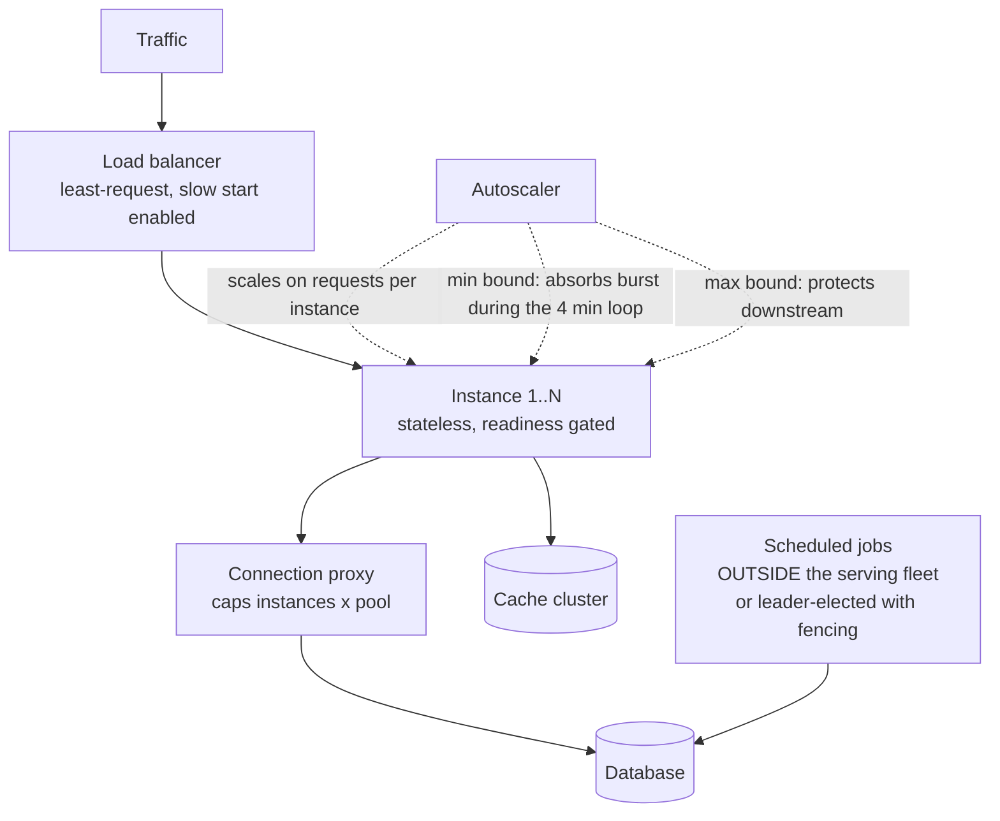
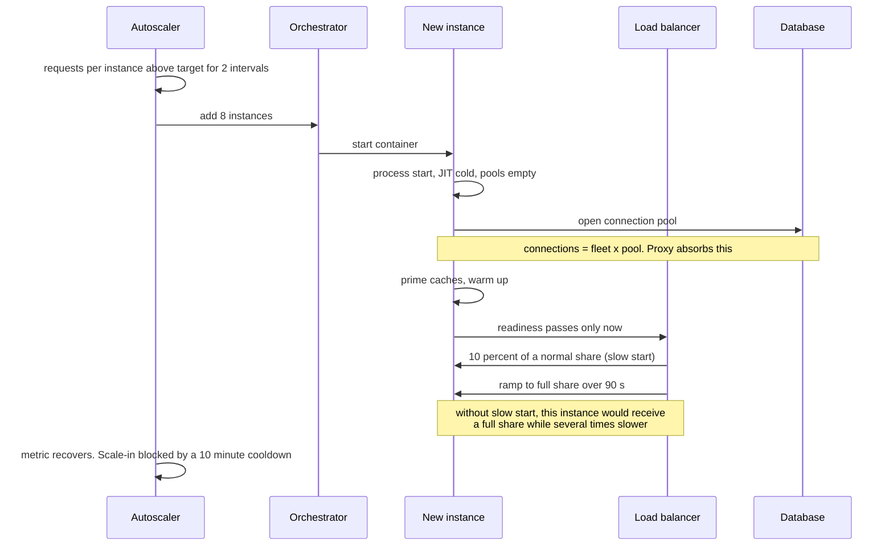

# Chapter 21: Horizontal Scaling

## 21.1 Problem Statement

Chapter 9 established what scalability means as a property. This chapter is about the mechanism everyone reaches for first, and about the ways it fails to deliver even when the design is correct.

The tracking platform runs 40 instances. Peak is approaching, so the team doubles to 80.

**Throughput rises by 22 percent, not 100.** Each instance now holds 20 database connections, so 80 instances want 1,600, and the connection proxy is queueing. The extra instances are waiting, not working, which is Chapter 9's O(instances) growth arriving on schedule.

**Latency gets worse.** New instances start with cold caches and an unwarmed runtime, and the load balancer sends them a full share of traffic immediately. For roughly ninety seconds each new instance is several times slower than the old ones, and because the balancer is round-robin, that slowness is distributed evenly across users rather than confined to the new instances.

**The autoscaler oscillates.** It scales out on latency, latency is high because of cold instances, so it scales out further, then latency recovers and it scales in, then the reduced capacity raises latency again. Over four hours the fleet size moves between 62 and 140 instances eleven times.

**One component does not scale at all.** The reconciliation scheduler was written to run on every instance with a "only if I am the leader" check that was never implemented. At 40 instances it ran 40 times. At 80 it runs 80 times.

**And the deploy takes 50 minutes.** Rolling one instance at a time with a two minute bake was fine at 12 instances. At 80 it exceeds the change window, so deploys start overlapping.

Every one of these is a mechanical consequence of adding instances rather than a flaw in the concept. Horizontal scaling works, and it works only when the things that scale with instance count have been accounted for.

## 21.2 Why This Problem Exists

**Adding instances multiplies everything an instance does, including the things that are not work.** Connections, health check traffic, log volume, metric cardinality, service discovery churn, and scheduled job executions all scale with fleet size and none of them serves users.

**New instances are not equivalent to old ones for several minutes.** Cold caches, an unwarmed JIT compiler, empty connection pools. Treating a fresh instance as immediately equal is why scaling out can temporarily make latency worse.

**Autoscaling is a control loop, and control loops oscillate** when the signal lags the action. Latency responds to capacity changes slowly and is itself affected by the change, which is a textbook recipe for instability.

**Statelessness is assumed rather than verified.** Chapter 23 covers this properly; the mechanical point here is that anything which behaves differently at N=1 and N=80 will surface exactly when you scale, and scheduled jobs are the most common example.

**And operational processes scale with fleet size too.** Deploys, restarts, certificate rotations, and configuration pushes all take longer or become riskier as the fleet grows, which is Chapter 10's change-related risk multiplied.

## 21.3 Real World Analogy

A call centre.

Doubling the number of agents doubles the calls you can answer, provided four things hold. There are enough phone lines, which is the connection ceiling. The new agents know the product, which is warm-up. Callers are routed to whoever is free rather than round-robin to a trainee mid-training, which is load balancing on the right signal. And the one supervisor who approves refunds is not still one person, which is the unscaled component.

Get any of those wrong and the centre with 80 agents answers barely more calls than the one with 40, while costing twice as much. Nobody would call that a failure of the idea of hiring more agents. It is a failure to notice what else had to change.

Two further details map exactly. **A new agent handles roughly a third the volume for their first week**, so a hiring surge temporarily reduces average performance, and a manager judging the team on average handling time immediately after a hiring round will reach the wrong conclusion. And **hiring and firing repeatedly in response to daily call volume is worse than keeping a stable team slightly larger than average demand**, which is the autoscaling flapping problem stated in staffing terms.

## 21.4 Simple Explanation

**Horizontal scaling means handling more load by adding more instances of the same thing**, as opposed to vertical scaling, which means making one instance bigger. Chapter 9 called this the X axis.

For it to work, three conditions must hold:

| Condition | Meaning | Chapter |
|---|---|---|
| **Requests can go to any instance** | No request depends on a specific one | 23 |
| **Instances do not contend** | Adding one does not slow the others | 8 |
| **Shared dependencies have headroom** | The database, cache, and downstream services can absorb the multiplied demand | 9 |

Miss the first and you need sticky routing, which undermines balancing and failover. Miss the second and you hit the Universal Scalability Law's downward curve from Chapter 8. Miss the third and, as in Section 21.1, you double the fleet and gain 22 percent.

The mental model worth carrying:

> **Adding an instance adds capacity to one tier and adds pressure to every tier below it.**

## 21.5 Technical Deep Dive

### 21.5.1 What scales with instance count

The audit to run before any significant scale-out. Everything here grows with N even though none of it is user work.

| Quantity | Grows as | Consequence at 4x |
|---|---|---|
| Database connections | instances x pool size | Connection limit, memory per backend |
| Cache connections | instances x pool size | Same, on the cache tier |
| Health check traffic | instances x checkers x frequency | Noticeable at large N |
| Service discovery updates | instances x churn rate | Registry load, propagation delay |
| Log volume | instances x rate | Ingestion cost and pipeline capacity |
| Metric series | instances x series per instance | Cardinality explosion in the metrics store |
| Scheduled job executions | instances, if unguarded | The job runs N times |
| Deploy duration | instances / parallelism | Change windows exceeded |
| Warm-up cost during scale-out | instances added x warm-up time | Temporary latency degradation |
| Cross-instance coordination | up to N squared | Chapter 8's coordination term |

The mitigations are individually simple and collectively the difference between doubling capacity and doubling the bill:

```
Connections:      a proxy (PgBouncer, ProxySQL) between the fleet and the store,
                  plus smaller per-instance pools sized by Little's Law.
Scheduled jobs:   leader election, or a distributed lock with fencing (Chapter 19),
                  or move the job out of the request-serving fleet entirely.
Logs and metrics: sample, aggregate at the instance, avoid per-instance labels
                  on high-cardinality metrics.
Deploys:          scale parallelism with the fleet: deploy in waves of a
                  percentage, not a fixed count.
```

### 21.5.2 Distributing the work

Adding instances only helps if traffic reaches them appropriately. Chapter 30 covers load balancer algorithms in full; the relevant point here is that **the choice of algorithm determines whether a heterogeneous fleet behaves well**.

| Algorithm | Behaviour with a cold or degraded instance |
|---|---|
| Round robin | Sends it a full share regardless. Worst choice during scale-out |
| Least connections | Naturally sends less to slow instances, since their connections stay busy |
| Least request or peak EWMA | Actively prefers faster instances. Best default |
| Random with two choices | Nearly as good as least-loaded, much cheaper to compute |

Two mechanisms matter specifically for scaling events:

**Slow start.** New instances receive a gradually increasing share of traffic over a warm-up window rather than a full share immediately. This is the direct fix for Section 21.1's latency regression, and most modern load balancers and service meshes support it as a configuration option.

**Readiness gating.** An instance should not enter rotation until it is genuinely able to serve: connection pools initialised, caches primed if it depends on them, and any startup work complete. Chapter 10's warning applies, that this readiness check must test only instance-local conditions.

```java
// Ready only when this instance can actually serve well.
// Local conditions only: a shared dependency must never gate readiness.
@GetMapping("/health/ready")
public ResponseEntity<String> ready() {
    if (!poolsInitialised)   return status(503).body("pools initialising");
    if (!cachePrimed)        return status(503).body("priming cache");
    if (jitWarmupRemaining() > 0) return status(503).body("warming");
    return ok("ready");
}
```

### 21.5.3 Autoscaling as a control loop

Section 21.1's oscillation is a classic control problem, and the fixes are control-theory fixes.

```
The loop:
   measure  ->  compare to target  ->  change capacity  ->  effect on metric  ->  measure

Instability arises when:
   - the metric responds slowly to the change (long delay)
   - the change itself perturbs the metric (cold instances raise latency)
   - the reaction is proportional to the error with no damping
```

The design rules that produce stable scaling:

**Scale on a leading, load-proportional signal.** Requests per instance, queue depth, or concurrent requests in flight. Latency is a lagging signal that is also perturbed by scaling itself, which is precisely why Section 21.1 oscillated.

**Asymmetric cooldowns.** Scale out quickly, scale in slowly. The two errors have very different costs: scaling out unnecessarily wastes money for a few minutes, scaling in too early causes an incident.

```
Scale out:  evaluate every 60 s, act on 2 consecutive breaches, cooldown 2 min
Scale in:   evaluate every 60 s, act on 10 consecutive breaches, cooldown 10 min
```

**Target tracking rather than step scaling** where available, since it computes the required capacity from the ratio of current to target rather than adding a fixed number and re-evaluating.

**Bounds.** A minimum that covers the load you cannot absorb during the scaling delay, and a maximum that protects downstream dependencies from being flooded by a runaway loop.

**And remember Chapter 9's timing.** The loop takes minutes end to end, so autoscaling handles trends and never handles bursts. Bursts need headroom, bounded queues, and shedding.

### 21.5.4 Instance size: many small or few large

A genuine design decision that is usually made by accident.

| Dimension | Many small instances | Few large instances |
|---|---|---|
| Blast radius per failure | Small | Large |
| Scaling granularity | Fine, closer to demand | Coarse, more waste |
| Connections to shared stores | **High** | Low |
| Garbage collection pauses | Shorter, smaller heaps | Longer, larger heaps (Chapter 7) |
| Cache hit rate per instance | Lower, working set split | Higher, larger local cache |
| Bin packing efficiency | Better | Worse, more stranded capacity |
| Per-instance fixed overhead | Multiplied | Amortised |
| Warm-up cost during scale-out | Frequent, small | Infrequent, large |
| Deploy duration | Longer, more units | Shorter |

There is no universal answer, and the two forces that usually decide it are connection count, which pushes toward fewer and larger, and blast radius plus pause time, which push toward more and smaller. A common resolution for JVM services is instances in the range of a few cores and a few gigabytes of heap, enough that the per-instance overhead is amortised and small enough that pauses stay short and losing one instance is unremarkable.

The arithmetic worth doing explicitly:

```
Target: 3,000 req/s, 8 ms CPU per request, 70 percent efficiency target

Per 4-core instance:  4 x 0.7 / 0.008  =  350 req/s
Instances needed:     3000 / 350       =  9, so 12 with headroom

Connection check:     12 x 10 = 120 connections. Fine.
At 2 cores each:      24 instances x 10 = 240 connections. Check the ceiling.
```

### 21.5.5 Scaling stateful components

Stateless tiers scale by adding instances. Anything holding data scales differently, and confusing the two is a common and expensive error.

| Component | How it scales horizontally | Constraint |
|---|---|---|
| Stateless service | Add instances | Downstream capacity |
| Read replicas | Add replicas | Writes do not scale; replication lag grows |
| Sharded database | Add shards, rebalance | Rebalancing is a project; skew defeats it (Chapter 9) |
| Cache cluster | Add nodes, rehash | Consistent hashing limits reshuffling (Chapter 50) |
| Message consumers | Add consumers | **Capped by partition count** |
| Coordination service | Cannot scale by adding voters | More voters means slower quorum (Chapter 19) |

Two of these catch people regularly. **Consumer parallelism is bounded by partitions**, so a topic with 12 partitions supports at most 12 useful consumers in a group, and adding a thirteenth does nothing. Partition count should therefore be chosen with growth headroom, because increasing it later changes key-to-partition mapping and breaks the ordering guarantees Chapter 18 depends on.

**And adding voters to a consensus cluster makes it slower, not faster,** because quorum size grows. Scaling coordination means partitioning leadership across shards, not enlarging the cluster.

## 21.6 Architecture Diagram



```
 traffic -> load balancer (least-request + slow start)
                 |
        instance 1 .. instance N   (stateless, readiness-gated, warmed)
                 |
        connection proxy   <-- caps N x pool_size into the store
                 |
             database                cache cluster

 autoscaler: scales on requests-per-instance (leading signal),
             fast out / slow in, min and max bounds

 scheduled jobs run OUTSIDE the fleet, or under leader election,
 or they execute N times, once per instance
```

## 21.7 Request Flow

The scale-out event itself, traced, because that is where the failures occur.



1. **The trigger is a leading signal**, requests per instance, which is proportional to load and not perturbed by the scaling action itself.
2. **Two consecutive breaches** before acting, which filters noise without adding much delay.
3. **The new instance does not enter rotation until ready**, and readiness tests only local conditions.
4. **Connection growth is absorbed by the proxy**, so the store sees a stable connection count regardless of fleet size.
5. **Slow start ramps traffic**, so the cold instance's poor early latency affects a small fraction of requests rather than an even share.
6. **Scale-in is deliberately slower than scale-out,** which prevents the oscillation in Section 21.1.

## 21.8 Internal Components

| Component | Role | Failure mode | Guard |
|---|---|---|---|
| Load balancer algorithm | Distributes work | Round robin sends full share to cold or degraded instances | Least-request or peak EWMA |
| Slow start | Ramps traffic to new instances | Not enabled, so scale-out degrades latency | Enable with a warm-up window |
| Readiness probe | Gates rotation entry | Tests shared dependencies, causing fleet-wide removal | Local conditions only (Chapter 10) |
| Connection proxy | Decouples fleet size from backend connections | Absent, so scaling out throttles the store | Deploy before you need it |
| Autoscaling signal | Drives capacity changes | Latency, which lags and is self-perturbing | Requests per instance, queue depth |
| Cooldowns | Damping | Symmetric, so the loop oscillates | Fast out, slow in |
| Min and max bounds | Burst absorption and downstream protection | Unset, so bursts fail and runaway loops flood dependencies | Set both deliberately |
| Scheduled job guard | Prevents N executions | Assumed, never implemented | Leader election with fencing, or a separate runner |
| Deploy parallelism | Bounds rollout duration | Fixed batch size, so duration grows with fleet | Percentage-based waves |
| Instance sizing | Balances pauses, connections, blast radius | Inherited default | Compute from CPU per request and connection ceilings |

## 21.9 Production Example

**Kubernetes' Horizontal Pod Autoscaler illustrates both the mechanism and its limits.** It computes a desired replica count from the ratio of the current metric value to a target, which is target tracking rather than step scaling, and it includes stabilisation windows specifically to damp oscillation. The default behaviour is asymmetric in the way Section 21.5.3 recommends: scale-up reacts quickly while scale-down is stabilised over a longer window. Its documented limitation is the one that matters most in practice: the loop period plus pod startup plus application warm-up means the total reaction time is measured in minutes, so it manages trends rather than bursts.

**Envoy and similar proxies implement slow start as a first-class feature**, ramping traffic to newly healthy endpoints over a configurable window rather than sending a full share immediately. Its existence as a standard feature is evidence that the cold instance problem is universal rather than a JVM peculiarity, and enabling it is one of the cheapest latency improvements available to a fleet that scales frequently.

**Connection proxies exist because the arithmetic is unavoidable.** PgBouncer and equivalents multiplex many client connections onto a small number of server connections precisely because a growing application fleet otherwise multiplies backend connections without adding useful work. This is the mechanical version of Chapter 9's growth-order audit, and it is the single most common wall teams hit on their first large scale-out.

## 21.10 Advantages

- **Capacity becomes a purchase** rather than a project, provided the conditions in Section 21.4 hold.
- **No hard ceiling** in the tier being scaled, unlike vertical scaling.
- **Failure of one instance is unremarkable**, and blast radius falls as the fleet grows.
- **Deploys can be progressive**, since there are many units to roll through.
- **Cost tracks demand** when combined with autoscaling.
- **Commodity hardware suffices,** which is cheaper per unit of capacity than large machines.

## 21.11 Limitations

- **It only scales one tier.** Shared dependencies must scale separately or become the bottleneck.
- **Coordination overhead grows,** so returns diminish and eventually reverse, per Chapter 8.
- **Instance count multiplies non-work quantities:** connections, logs, metrics, discovery churn.
- **New instances are temporarily worse,** so scaling out can briefly degrade latency.
- **Autoscaling is too slow for bursts** and can oscillate if driven by a lagging signal.
- **Stateful components do not scale this way,** and treating them as though they do is a common error.
- **Operational processes lengthen** with fleet size, particularly deploys.

## 21.12 Trade-offs

| Dial | One way | The other way |
|---|---|---|
| Instance size | Many small: small blast radius, short pauses, many connections | Few large: fewer connections, better cache hit rate, longer pauses |
| Autoscaling aggressiveness | Fast: tracks demand, risks oscillation and cold-start penalties | Slow: stable, more idle capacity |
| Headroom | High: absorbs bursts, costs money | Low: cheap, fails on bursts the loop cannot outrun |
| Balancing algorithm | Least-request: adapts to heterogeneity, slightly more state | Round robin: trivial, punishes cold and degraded instances |
| Scheduled job placement | Inside the fleet with leader election: fewer components | Separate runner: simpler correctness, another deployment |
| Deploy parallelism | High: fast rollouts, larger blast radius per wave | Low: safer, may exceed the change window |

**Remove slow start.** You gain configuration simplicity. You lose protection during every scale-out and deploy, so latency degrades for the warm-up period, spread evenly across all users.

**Remove the connection proxy.** You gain one hop and one component. You lose the decoupling between fleet size and backend connections, so the next scale-out throttles the database, which is Section 21.1's first failure.

**Remove autoscaling and run fixed capacity.** You gain predictability, no oscillation, and no cold-start penalties. You lose cost efficiency and the ability to absorb sustained growth without manual intervention. For workloads with stable traffic this is frequently the right call.

## 21.13 Common Mistakes

**Doubling the fleet without checking what else doubles**, particularly connections.

**Round-robin balancing during scale-out,** which spreads cold-instance slowness across all users.

**No slow start or readiness gating,** so instances receive full traffic before they can serve it.

**Autoscaling on latency**, a lagging signal perturbed by the scaling action itself.

**Symmetric cooldowns,** which produce oscillation.

**Relying on autoscaling for bursts** it cannot possibly outrun.

**Scheduled jobs without leader election,** which then run once per instance.

**Adding consumers beyond the partition count** and expecting more throughput.

**Adding voters to a consensus cluster** to make it faster, which makes it slower.

**Fixed-size deploy batches,** so rollout duration grows linearly with the fleet.

**Ignoring per-instance metric cardinality,** which can cost more than the instances.

## 21.14 Interview Questions

**Q: What must be true for horizontal scaling to work?** Requests must be servable by any instance, instances must not contend with each other, and shared dependencies must have headroom for the multiplied demand. Failing the first requires sticky routing, the second hits the coordination curve, and the third means adding instances adds waiting rather than capacity.

**Q: You double the fleet and throughput rises 20 percent. What do you check?** What else scaled with instance count: database and cache connections against their limits, shared locks or leaders, downstream service capacity and rate limits, and whether new instances are actually serving or still warming. Then check whether the bottleneck was ever in the tier you scaled.

**Q: Why can scaling out temporarily make latency worse?** New instances have cold caches, an unwarmed runtime, and empty connection pools, so they are several times slower for a period. With round-robin balancing they receive a full share immediately, so their slowness affects an even fraction of all requests. Slow start and readiness gating fix it.

**Q: Why should you not autoscale on latency?** Because latency lags capacity changes and is itself perturbed by them, since new instances are initially slow. That creates a feedback loop where scaling out raises the metric that triggered it. Scale on requests per instance or queue depth, which are proportional to load and not affected by the act of scaling.

**Q: Why are scale-out and scale-in cooldowns asymmetric?** Because the errors are asymmetric. Scaling out unnecessarily costs money for a few minutes; scaling in too early causes an outage. So react quickly to increases and slowly to decreases.

**Q: Many small instances or few large ones?** Small instances give smaller blast radius, shorter garbage collection pauses, and finer scaling granularity, at the cost of more connections to shared stores, lower per-instance cache hit rates, and longer deploys. Large instances invert all of those. Connection ceilings usually push toward larger, and pause time and blast radius push toward smaller.

**Q: Why does adding consumers stop helping at some point?** Because consumer parallelism within a group is capped by the number of partitions, so extra consumers sit idle. Partition count must be chosen with growth headroom, since increasing it later changes key-to-partition mapping and breaks per-key ordering.

## 21.15 Production Best Practices

1. **Audit what grows with instance count** before scaling out, especially connections.
2. **Put a connection proxy in front of shared stores** before you need one.
3. **Use least-request or peak EWMA balancing,** not round robin.
4. **Enable slow start** with a warm-up window matched to your measured warm-up time.
5. **Gate readiness on local conditions only,** and include pool initialisation and warm-up.
6. **Autoscale on requests per instance or queue depth,** never on latency alone.
7. **Use asymmetric cooldowns:** fast out, slow in.
8. **Set minimum capacity to cover bursts** that the scaling loop cannot outrun, and maximum to protect dependencies.
9. **Guard scheduled jobs with leader election and fencing,** or run them outside the serving fleet.
10. **Deploy in percentage-based waves** so rollout duration does not grow with the fleet.
11. **Size instances from CPU per request and the connection ceiling,** not from a default.
12. **Choose partition counts with headroom,** since changing them later is disruptive.
13. **Watch per-instance metric cardinality** as the fleet grows.

## 21.16 Summary

Horizontal scaling means adding instances, and it is the cheapest and most reversible way to add capacity when three conditions hold: any instance can serve any request, instances do not contend with each other, and the tiers below have headroom for the multiplied demand.

The failures are almost never in the concept. They are in what else scales with instance count. Connections are the classic case, because they grow as fleet size times pool size and consume a shared, hard-limited resource without doing any work. Scheduled jobs run once per instance unless guarded. Logs, metrics, discovery churn, and deploy duration all grow the same way. The audit from Chapter 9 is what turns a scale-out into an increase in capacity rather than an increase in cost.

The second class of failure is that new instances are not equivalent to old ones. Cold caches and an unwarmed runtime make them several times slower for a minute or two, so round-robin balancing spreads that penalty evenly across users and makes scaling out look like a latency regression. Least-request balancing, readiness gating, and slow start together fix it, and all three are configuration rather than code.

The third is that autoscaling is a control loop. Driven by latency, which lags and is perturbed by the scaling action itself, it oscillates. Driven by a load-proportional signal with asymmetric cooldowns and sensible bounds, it is stable. And it is still measured in minutes end to end, so it handles trends and never bursts.

Finally, not everything scales this way. Read replicas scale reads and not writes, consumers are capped by partitions, sharded stores need rebalancing and are defeated by skew, and consensus clusters get slower as you add voters. Knowing which tier you are actually scaling, and what it is bounded by, is most of the skill.

## 21.17 Quick Revision Notes

- Horizontal scaling adds instances. Requires: any instance serves any request, no contention, downstream headroom.
- Adding an instance adds capacity to one tier and pressure to every tier below.
- Connections = instances x pool size. Use a proxy and size pools with Little's Law.
- Also grows with N: logs, metric cardinality, discovery churn, health checks, deploy time, scheduled job executions.
- New instances are several times slower for the warm-up period. Use readiness gating and slow start.
- Round robin is the worst algorithm during scale-out. Prefer least-request or peak EWMA.
- Autoscale on a leading, load-proportional signal: requests per instance or queue depth. Never latency alone.
- Cooldowns asymmetric: fast out, slow in. The two errors have very different costs.
- Autoscaling loop takes minutes. It handles trends, not bursts. Bursts need headroom and shedding.
- Set both minimum and maximum bounds: minimum absorbs bursts, maximum protects downstream.
- Scheduled jobs need leader election with fencing, or a separate runner, or they run N times.
- Consumer parallelism is capped by partition count. Choose partitions with headroom.
- Adding voters to a consensus cluster makes it slower. Partition leadership instead.
- Instance sizing: small gives blast radius and pause benefits, large gives connection and cache benefits.
- Deploy in percentage waves, not fixed batches.

## 21.18 Mini Quiz

1. You double instances and throughput rises 20 percent. Name three things to check.
2. Why does scaling out sometimes increase p99 latency?
3. Why is latency a poor autoscaling signal?
4. Why are scale-out and scale-in cooldowns different lengths?
5. A topic has 8 partitions and you run 20 consumers in one group. What happens?
6. Give two arguments for larger instances and two for smaller.
7. Your nightly job started running 60 times a night. What happened and what are the two fixes?
8. Why does adding nodes to a consensus cluster not increase its write throughput?

**Answers**

1. Connections against the backend limit, since they grow as instances times pool size and consume a hard-limited shared resource. Whether the bottleneck was ever in the tier you scaled, since adding instances to a fleet constrained by a database or an external rate limit adds waiting rather than capacity. And whether the new instances are actually serving, since readiness gating, warm-up, or a failed rollout can leave them idle or slow.
2. Because new instances start with cold caches, an unwarmed runtime, and empty connection pools, making them several times slower than established ones for a period. With round-robin balancing they receive an equal share of traffic immediately, so their poor latency is spread across all users rather than confined. Readiness gating plus slow start plus least-request balancing removes the effect.
3. Because it lags the capacity change and is perturbed by it. Adding instances temporarily raises latency due to cold starts, which the autoscaler reads as a need for more capacity, producing a feedback loop. A load-proportional signal such as requests per instance or queue depth responds immediately and is not affected by the act of scaling.
4. Because the costs of the two errors are very different. Scaling out when it was not needed wastes some money for a few minutes. Scaling in when capacity was still needed causes an overload, which can cascade per Chapter 13. So the loop should react quickly to increases and require sustained evidence before decreasing.
5. Only 8 consumers receive partitions; the remaining 12 sit idle and consume no messages. Throughput does not increase at all. Consumer parallelism within a group is bounded by partition count, so the partition count must be chosen with growth headroom, and increasing it later remaps keys to partitions and breaks per-key ordering.
6. Larger: fewer total connections to shared stores, and a higher per-instance cache hit rate because the working set is not split as many ways. Also better amortisation of per-instance fixed overhead and shorter deploys. Smaller: shorter garbage collection pauses because heaps are smaller, and a smaller blast radius when one instance fails, plus finer scaling granularity and better bin packing.
7. The job runs on every instance and the fleet grew to 60, because there was no guard ensuring a single execution. The fixes are to elect a leader and run it only there, using a lease with a fencing token so a paused instance cannot also run it, or to move the job out of the request-serving fleet into a dedicated single-instance runner or a scheduler service that guarantees single execution.
8. Because every committed write requires acknowledgement from a majority, and adding voters increases the size of that majority. A five-node cluster must hear from three rather than two, so the commit waits on a slower member of a larger set. Extra nodes add fault tolerance and read capacity in some designs, not write throughput. Scaling writes requires partitioning leadership across independent groups.

## 21.19 Hands-on Exercise

**Part 1: find your real scaling factor.** Measure throughput at 2, 4, 8, and 16 instances against a fixed database. Plot throughput against instance count and find where the line bends. Then record connections, database CPU, and connection wait time at each point to identify what bent it.

**Part 2: watch the cold-start penalty.** With round-robin balancing, add four instances during a steady load test and record p50 and p99 through the event. Then enable readiness gating and slow start and repeat. Compare the two latency traces.

**Part 3: make the autoscaler oscillate, then stop it.** Configure scaling on latency with symmetric short cooldowns and drive a step change in load. Record the fleet size over 30 minutes. Then switch to requests per instance with asymmetric cooldowns and repeat.

**Part 4: multiply a job.** Deploy a scheduled task with no guard and scale to 10 instances. Count executions. Add leader election with a fenced lease and confirm exactly one.

**Part 5: size the instances.** Measure CPU milliseconds per request, then compute the fleet size for your target throughput at 2, 4, and 8 cores per instance. For each option compute total connections, expected pause time, and deploy duration. Choose, and write down why.

## 21.20 Further Reading

- Kubernetes Horizontal Pod Autoscaler documentation, particularly on the scaling algorithm and stabilisation windows.
- Envoy's documentation on load balancing policies and slow start, for the mechanics of ramping traffic to new endpoints.
- *Guerrilla Capacity Planning*, Neil Gunther, for why returns from added instances diminish and eventually reverse.
- PgBouncer's documentation on pooling modes, for the standard answer to connection multiplication.
- Amazon's *Builders' Library* on load shedding and on using load testing to find limits, for what autoscaling cannot do.
- *Site Reliability Engineering*, Google, chapters on load balancing and handling overload.

---

**Next chapter: Chapter 22, Vertical Scaling.** The option that gets dismissed too early: what the real ceilings are, why bigger machines remove entire categories of complexity, and how to tell when you have genuinely outgrown one.
