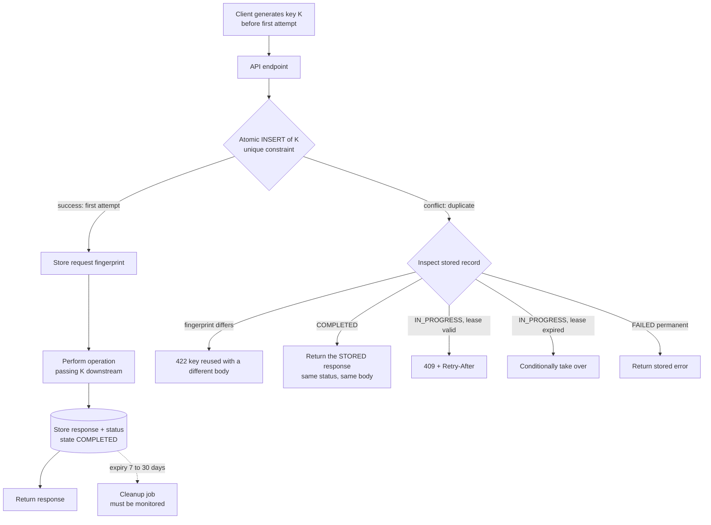
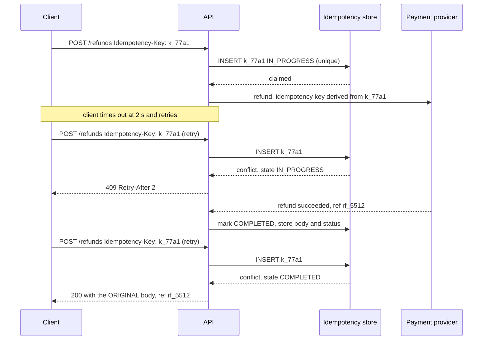

# Chapter 20: Idempotency

## 20.1 Problem Statement

Idempotency has been named as a requirement in seven previous chapters. Chapter 4 made it a mandatory consequence of at-least-once delivery. Chapter 11 made it the basis of effectively-once processing. Chapter 13 made it a precondition for hedging and retries. Chapter 17 made it the replacement for rollback. The team has read all of that and implemented it, and they still get duplicates.

**A refund is issued twice.** The endpoint takes an idempotency key. The handler checks whether the key exists, sees that it does not, and proceeds. Two retries arrive 30 milliseconds apart, both check, both find nothing, both proceed. The check and the act were two steps, which is Chapter 16's lost update in a different costume.

**A charge succeeds twice with different amounts.** The client retried with the same idempotency key after adjusting the amount, because the first attempt appeared to fail. The server treated the key as "already seen" and returned success, so the customer believed the corrected amount had been charged. It had not. The original was.

**A retry returns a different answer.** The first request created a booking and returned its id. The retry, arriving while the first was still executing, found no completed record, executed again, and returned a different id. The client now holds an id for a booking that a subsequent operation will not recognise.

**A duplicate arrives eight days later.** A consumer group was reset and replayed a week of events. The deduplication store had a 24 hour retention, so every event was "new". Thirty thousand notifications went out a second time.

**And one non-duplicate is silently dropped.** Two genuinely different requests were assigned the same client-generated key, because the client derived it from a timestamp with second precision and a user id. The second request was suppressed as a duplicate and its work never happened.

Every one of these is in a system whose engineers would tell you, accurately, that they implemented idempotency. The gap is that idempotency is not a checkbox but a protocol, and the parts people skip are the concurrent case, the response, the retention, and the key.

## 20.2 Why This Problem Exists

**Duplicates are guaranteed, not exceptional.** Chapter 11 established why: a lost acknowledgement is indistinguishable from a lost request, so the sender must retry, so the receiver must expect duplicates. Every retry mechanism in Chapters 10 and 13 depends on it. You cannot build an available system without producing duplicates, so handling them is not defensive coding, it is the contract.

**Check-then-act is a race, and it is the obvious implementation.** Looking up the key and then performing the work is two operations with a window between them. Under concurrency, both duplicates pass the check. The correct implementations make the claim and the check the same atomic step.

**The response is part of the operation and gets forgotten.** A retry does not want to be told "already done". It wants the same answer the first attempt would have given, because the client is going to use that answer. An idempotency implementation that suppresses duplicate work but returns a different response has solved half the problem.

**Retention is invisible until it is wrong.** A deduplication window shorter than the maximum possible retry interval means duplicates get through, and the maximum is set by things nobody thinks about: consumer replays, dead letter queue reprocessing, manual reruns, a client with a very long backoff.

**And the key is usually chosen badly.** It must be stable across retries of the same logical operation and distinct between different operations. Derived from a timestamp, it collides. Regenerated per attempt, it never matches. Chosen by the server, it does not survive the client's retry.

## 20.3 Real World Analogy

Standing at a ticket machine that takes a long time to respond.

You press "buy". Nothing happens for eight seconds. Did it register? You press again. Now you may have bought two tickets, or one, and you have no way to tell from the outside.

Every well-designed machine of this kind solves the problem the same way: **your transaction has a reference number, and the machine remembers it.** Press twice and the second press finds the reference already in progress, and rather than starting again it shows you the outcome of the first. The reference is generated when you start, not when you finish, which is what makes it survive the ambiguity.

Three details of that arrangement matter and map exactly.

**The reference must be created before the uncertainty begins.** If the machine assigned it at the end, your second press would have no way to be recognised as the same attempt.

**Pressing twice while the first is still processing must not start a second transaction.** The machine has to distinguish "not started" from "in progress", which is a different state, and the honest answer to a duplicate press during processing is "wait, this is happening" rather than either "done" or starting again.

**And the machine forgets eventually.** Reference numbers are not kept for a decade. Come back a year later with the same reference and it is a new transaction. That is retention, and the window has to be longer than any plausible reason for you to press again.

## 20.4 Simple Explanation

**An operation is idempotent if performing it multiple times has the same effect as performing it once.**

```
Idempotent:      SET balance = 100          any number of times: balance is 100
Not idempotent:  balance = balance + 100    three times: balance is 300
```

Note what idempotency does not mean. It does not mean the operation returns the same value every time in a changing system, and it does not mean nothing happens on the second call. It means **the observable state afterwards is the same**, and for a well-designed API, that the caller receives the same answer.

Some operations are naturally idempotent and some are not:

| Operation | Idempotent? |
|---|---|
| Set a status to DELIVERED | Yes, naturally |
| Delete by id | Yes, naturally. The second delete is a no-op |
| Insert with a unique key | Yes, if the duplicate is handled rather than thrown |
| Increment a counter | **No** |
| Append to a list | **No** |
| Charge a card | **No** |
| Send an email | **No** |

HTTP encodes this in its method semantics: `GET`, `PUT`, and `DELETE` are specified as idempotent, `POST` is not, which is precisely why `POST` endpoints that create things or move money need an explicit key.

The one sentence to carry:

> **You do not get to choose whether duplicates arrive. You only get to choose whether they are harmless.**

## 20.5 Technical Deep Dive

### 20.5.1 The key

Everything depends on the key being right, and there are exactly three requirements.

| Requirement | Violated by | Consequence |
|---|---|---|
| **Stable** across retries of one logical operation | Generating it per attempt | Deduplication never fires |
| **Unique** across different operations | Deriving from a coarse timestamp, or a user id alone | Real requests silently suppressed |
| **Client-generated**, before the first attempt | Server assigning it | The retry cannot present the same key |

```
Good keys:
  a UUID generated by the client when the user clicks, reused for every retry
  a natural business key: "refund:order_9f31:attempt_1"
  a content hash, when the operation is genuinely determined by its content

Bad keys:
  UUID.randomUUID() inside the retry loop           never matches
  userId + epochSeconds                             collides at high rates
  a database sequence assigned on arrival           server-side, so useless
  the request body hash, when the body includes a timestamp   never matches
```

Two scoping decisions must also be made explicitly. **Scope**: keys are usually unique per endpoint and per tenant, not globally, so that the same client-generated value on two different endpoints does not collide. **Binding**: the key should be bound to the request it first accompanied, so that a retry with the same key and a different body is an error rather than a silent success. That is Section 20.1's second failure.

### 20.5.2 The protocol

The complete version, including the states people omit. There are three, not two.

```
On receiving a request with key K:

  1. Atomically INSERT a record for K in state IN_PROGRESS.
     - success  -> this is the first attempt. Continue to step 2.
     - conflict -> a record exists. Go to step 4.

  2. Verify the request fingerprint matches the one stored with K.
     Mismatch -> 422. Same key, different request.

  3. Perform the operation. Store the response with K, state COMPLETED.
     Return the response.

  4. Existing record found. Inspect its state:
     - COMPLETED   -> return the STORED response. Same status, same body.
     - IN_PROGRESS -> 409 with Retry-After. Do NOT execute, do NOT
                      return success. The original is still running.
     - FAILED      -> depends: retryable failures may re-execute,
                      permanent ones return the stored error.
```

Step one is the critical one, and it is where Section 20.1's first failure lives. The insert must be the claim: it succeeds for exactly one caller because the database enforces uniqueness, and everybody else gets a conflict. A `SELECT` followed by an `INSERT` is two steps and both duplicates pass.

```java
@Transactional
public ResponseEntity<RefundResult> refund(String key, RefundRequest req) {
    String fingerprint = sha256(canonical(req));

    // 1. Claim atomically. The unique constraint is the mechanism.
    try {
        idempotencyRepo.insert(key, fingerprint, IN_PROGRESS, Instant.now());
    } catch (DuplicateKeyException dup) {
        IdempotencyRecord existing = idempotencyRepo.get(key);

        if (!existing.fingerprint().equals(fingerprint)) {
            return status(422).body(RefundResult.keyReused());     // different request
        }
        return switch (existing.state()) {
            case COMPLETED -> ResponseEntity.status(existing.status())
                                            .body(parse(existing.response()));   // replay
            case IN_PROGRESS -> status(409).header("Retry-After", "2").build();
            case FAILED -> status(existing.status()).body(parse(existing.response()));
        };
    }

    // 2. First attempt. Do the work.
    RefundResult result = paymentProvider.refund(
            req.chargeId(), req.amountMinor(), key);   // pass the key downstream too

    // 3. Store the response so retries replay it, in the SAME transaction.
    idempotencyRepo.complete(key, 200, toJson(result));
    return ResponseEntity.ok(result);
}
```

Three details in that code deserve calling out.

**The response is stored, not just the fact of completion.** A retry gets the original body and status. Without this, the client's retry receives something different from what the first call produced, which is Section 20.1's third failure.

**The key is passed downstream.** Idempotency composes: your key derives a key for the payment provider, so their retry protection aligns with yours. Providers that accept an idempotency header, which most payment APIs do, are relying on exactly this.

**The record and the effect share a transaction** where possible. If they cannot, do the work first and record second, so a crash produces a retry rather than a silent skip, per Chapter 11.

### 20.5.3 The in-progress case

The state everyone forgets, and it causes the most confusing bugs.

```
Request A arrives, claims key K, starts a 900 ms payment call.
Request B (a retry) arrives 40 ms later with key K.

Wrong answer 1: execute anyway.        -> double charge
Wrong answer 2: return 200 success.    -> client believes it is done,
                                          may act before it is
Right answer:   409, Retry-After: 2    -> client waits and retries,
                                          eventually gets the stored response
```

Returning success for an in-progress operation is tempting and wrong, because the client will proceed to the next step using a result that does not exist yet. Returning a conflict with a retry hint is honest and lets the client converge.

There is one further subtlety: an `IN_PROGRESS` record whose owner crashed will block that key forever. So the record needs a lease with an expiry, after which another attempt may claim it, exactly like Chapter 19's locks, and with the same caveat that the downstream operation should also be protected.

```java
// A stale in-progress claim can be taken over after its lease expires.
if (existing.state() == IN_PROGRESS && existing.leaseExpiry().isBefore(now())) {
    if (idempotencyRepo.takeOver(key, existing.version())) {   // conditional, versioned
        // we now own it; proceed, relying on downstream idempotency for safety
    }
}
```

### 20.5.4 Retention

The window must exceed the longest interval over which a duplicate of the same logical operation can plausibly arrive. That is longer than people assume.

| Source of a late duplicate | Typical horizon |
|---|---|
| Client retry with backoff | Seconds to minutes |
| Queue redelivery after a consumer restart | Minutes |
| Dead letter queue reprocessing | Hours to days |
| Consumer group offset reset or replay | **Days to weeks** |
| Manual rerun of a failed batch | Days |
| A user pressing the button again tomorrow | Days, if the key is business-derived |

Section 20.1's fourth failure was a 24 hour window against a week-long replay. A reasonable default is **7 to 30 days for financial operations** and shorter for high-volume, low-consequence ones. The cost is storage, which is bounded by request rate times retention times record size and is usually small.

```
100 req/s x 86,400 x 30 days x 400 bytes = about 100 GB

Manageable, and it can be reduced by storing only a hash of the response
for large payloads, or by tiering older records to cheaper storage.
```

The retention must also be enforced by an expiry that actually runs. A cleanup job that silently stops turns a bounded store into an unbounded one, which is Chapter 17's soft state problem.

### 20.5.5 Making non-idempotent operations idempotent

Four techniques, in order of preference.

**1. Make the state absolute rather than relative.** The single most effective change.

```sql
-- Not idempotent: replaying doubles the count
UPDATE parcels SET scan_count = scan_count + 1 WHERE id = ?;

-- Idempotent: replaying is a no-op
INSERT INTO scans (event_id, parcel_id, at) VALUES (?, ?, ?)
    ON CONFLICT (event_id) DO NOTHING;
-- and derive the count from the scans table, or update it only on insert
```

**2. Conditional state transitions.** Only act if the entity is in the expected state, which makes replay harmless.

```sql
-- Second execution affects zero rows, because the state already moved.
UPDATE bookings SET status = 'CONFIRMED', confirmed_at = ?
 WHERE id = ? AND status = 'PENDING';
```

**3. Reserve then commit.** Split an unsafe operation into an idempotent reservation and an idempotent commit keyed on the reservation.

```
POST /reservations  {key: K}        -> reservation R (idempotent on K)
POST /reservations/R/commit          -> idempotent on R
```

**4. Delegate to the downstream's idempotency.** Payment providers, mail services, and message brokers increasingly accept an idempotency key. Pass yours through, derived deterministically, so that your retry becomes their duplicate suppression.

And the honest limit: **some effects cannot be made idempotent**, only detectable. You cannot un-send an SMS. For those, the goal is to make the duplicate impossible to trigger rather than harmless, which means the deduplication must happen before the effect, and the effect must be the last thing in the sequence.

### 20.5.6 Related but different

| Concept | Means | Difference |
|---|---|---|
| Idempotency | Repeating has the same effect | About the operation |
| Deduplication | Detecting and discarding repeats | A mechanism that provides idempotency |
| Exactly-once delivery | Message delivered precisely once | Not achievable end to end (Chapter 11) |
| Effectively-once | At-least-once plus idempotent processing | The achievable goal |
| Commutativity | Order does not matter | Related, and neither implies the other |

Worth being precise because interview answers frequently conflate them. Exactly-once delivery is impossible; effectively-once processing is routine, and idempotency is how you get there.

## 20.6 Architecture Diagram



```
 client generates K  --->  atomic INSERT K
                                |
              +-----------------+------------------+
              | success                            | conflict
              v                                    v
      store fingerprint                   inspect existing record
              |                                    |
        do the work  ----> pass K       +----------+-----------+
              |            downstream   |          |           |
      store response                COMPLETED  IN_PROGRESS  fingerprint
      (same transaction)                |          |         differs
              |                    replay stored  409 +         |
        return response            response     Retry-After   422
```

## 20.7 Request Flow



1. **The key exists before the first attempt**, generated by the client, so every retry presents the same value.
2. **The claim is an atomic insert**, so exactly one attempt proceeds regardless of concurrency.
3. **The in-flight retry gets a conflict, not a success.** The client learns to wait rather than proceeding on a result that does not exist.
4. **The key is derived downstream**, so the provider's own protection aligns with ours and a retry at that level is also safe.
5. **The response is stored**, so the later retry receives the original reference number, which is what the client will use in every subsequent operation.
6. **The record expires** after a window longer than any plausible replay.

## 20.8 Internal Components

| Component | Role | Failure mode | Guard |
|---|---|---|---|
| Client key generation | Stable identity for one logical operation | Generated inside the retry loop | Generate before the first attempt, reuse on every retry |
| Unique constraint on the key | Makes the claim atomic | Replaced by check-then-act | Let the database enforce it |
| Request fingerprint | Detects key reuse with different content | Not stored, so mismatches pass silently | Hash a canonical form of the request |
| State machine | Distinguishes in-progress from completed | Only two states, so in-flight retries misbehave | Three states plus a lease |
| Lease on IN_PROGRESS | Prevents permanent blocking after a crash | Absent, so a crashed attempt blocks the key forever | Expiry plus conditional takeover |
| Stored response | Lets retries replay the original answer | Only completion recorded | Store status and body |
| Downstream key derivation | Extends protection past your boundary | Not passed, so the provider sees two distinct calls | Derive deterministically from your key |
| Retention window | Bounds how late a duplicate can be caught | Shorter than replay horizons | 7 to 30 days for financial operations |
| Expiry job | Bounds storage | Fails silently, store grows unbounded | Monitor deletion rate and table size |

## 20.9 Production Example

**Stripe's idempotency keys are the reference implementation** of the protocol in Section 20.5.2. Clients supply a key on write requests, the server stores the result of the first request with that key, and a repeat returns the original response rather than performing the action again. Keys are scoped and expire after a defined window, and a request that reuses a key with different parameters is rejected rather than silently succeeding. The API surface is small and the details are exactly the ones teams omit when building their own.

**Kafka's idempotent producer** solves a narrower version of the same problem inside the protocol. Each producer has an id and attaches a monotonically increasing sequence number per partition, so a broker can detect and discard a retransmitted batch. It prevents duplicates caused by producer retries within a session, and it does not extend to duplicates introduced by application-level reprocessing, which is why consumer-side idempotency is still required. It is a good illustration that idempotency at one layer does not remove the need for it at another.

**And HTTP's method semantics** encode the property in the protocol: `PUT` and `DELETE` are defined as idempotent, `POST` is not. Designing an API so that state-changing operations use `PUT` with a client-chosen resource identifier is the cheapest way to get idempotency without any additional machinery, because the identifier does the work of the key.

## 20.10 Advantages

- **Retries become safe**, which unlocks Chapter 10's availability work and Chapter 13's hedging.
- **At-least-once delivery becomes usable**, which is the only delivery guarantee actually available.
- **Clients get deterministic answers**, because a retry replays the original response rather than producing a new one.
- **Failure handling simplifies.** When in doubt, retry, which removes an entire category of ambiguous error handling.
- **Recovery and replay become routine**, since reprocessing a day of events is harmless.
- **It composes** when keys are passed downstream, so protection extends across service boundaries.

## 20.11 Limitations

- **Some effects cannot be undone or made harmless**, only prevented, such as sending a message to a person.
- **The store must be as available and durable as the operation it protects**, or it becomes a new single point of failure.
- **Retention costs storage** and must be actively bounded.
- **Keys must be chosen by clients**, which means the contract has to be documented and client teams have to comply.
- **Concurrent duplicates require a real state machine,** which is more work than a boolean.
- **It does not provide ordering.** Idempotent operations arriving out of order can still produce wrong outcomes.
- **Fingerprinting is fiddly**, since canonicalising a request body is harder than it looks.

## 20.12 Trade-offs

| Dial | One way | The other way |
|---|---|---|
| Key source | Client-generated: survives retries, needs client cooperation | Server-derived: no client change, cannot match a retry |
| In-progress handling | 409 with Retry-After: honest, client must handle it | Return success: simpler, and the client acts on a result that does not exist |
| Retention | Long: catches replays, more storage | Short: cheap, late duplicates get through |
| Response storage | Store body and status: exact replay, more storage | Store completion only: cheap, retries get a different answer |
| Fingerprinting | Strict: catches key reuse, brittle to harmless body changes | Lenient: tolerant, permits genuinely different requests to be suppressed |
| Scope of the key store | Shared service: consistent behaviour, a dependency for everything | Per service: isolated, duplicated logic |

**Remove the fingerprint check.** You gain simplicity. You lose detection of key reuse, so a retry with a corrected amount silently returns success for the original, which is Section 20.1's second failure.

**Remove the in-progress state.** You gain a simpler store. You lose correctness under concurrent retries, which are the common case rather than the rare one.

**Remove stored responses.** You gain storage. You lose deterministic retries, and clients end up holding identifiers that do not correspond to the operation that actually happened.

## 20.13 Common Mistakes

**Check-then-act.** The two-step implementation is a race, and both duplicates pass. Use a unique constraint.

**Only two states.** Without `IN_PROGRESS`, concurrent retries either double-execute or receive a false success.

**Not storing the response.** Retries then get a different answer from the original.

**Generating the key inside the retry loop,** so it changes on every attempt and never matches.

**Keys derived from coarse timestamps,** which collide and silently suppress real work.

**Retention shorter than the replay horizon,** especially against consumer offset resets.

**Not passing the key downstream,** so your idempotency stops at your boundary.

**A deduplication store that is less available than the operation,** turning a safety mechanism into an outage source.

**Marking processed before performing the work,** which converts a duplicate into a silent loss.

**Assuming idempotency implies ordering.** It does not, and out-of-order idempotent operations can still be wrong.

**An unmonitored expiry job,** which lets the store grow without bound.

## 20.14 Interview Questions

**Q: Define idempotency and give an example of an operation that is not.** Performing the operation multiple times has the same effect as performing it once. Incrementing a counter, appending to a list, charging a card, and sending an email are not idempotent. Setting an absolute value, deleting by id, and inserting with a unique key are.

**Q: Why is idempotency mandatory rather than optional?** Because exactly-once delivery is impossible: a lost acknowledgement is indistinguishable from a lost request, so senders must retry, so duplicates are guaranteed. Retries are also required for availability. Idempotency is what makes at-least-once delivery equivalent to effectively-once processing.

**Q: Describe the full protocol.** The client generates a key before the first attempt. The server atomically inserts a record for the key, relying on a unique constraint. If the insert succeeds, it verifies the request fingerprint, performs the work, and stores the response with the record. If the insert conflicts, it inspects the state: completed returns the stored response, in progress returns a conflict with a retry hint, and a differing fingerprint is rejected as key reuse.

**Q: What is wrong with checking whether the key exists and then inserting?** It is two operations with a window between them, so two concurrent duplicates both find nothing and both proceed. The claim must be a single atomic operation, which is what a unique constraint provides.

**Q: A retry arrives while the original is still executing. What should you return?** A conflict with a Retry-After hint. Executing again causes a duplicate effect, and returning success is worse, because the client will proceed using a result that does not exist yet. The in-progress record also needs a lease so a crashed attempt does not block the key permanently.

**Q: How long should you retain keys?** Longer than the longest plausible interval over which a duplicate can arrive, which is dominated by consumer replays and dead letter reprocessing rather than client retries. Seven to thirty days is a reasonable default for financial operations, and the storage cost is usually modest.

**Q: How do you make incrementing a counter idempotent?** Record the individual events with a unique event id and derive the count, or use a conditional update that only applies when the entity is in the expected state. Do not attempt to deduplicate an increment after the fact, because it carries no identity of its own.

**Q: Does idempotency give you exactly-once semantics?** It gives effectively-once processing, which is the achievable goal. Exactly-once delivery is not possible end to end, and a broker's transactional guarantees do not extend to external side effects such as charging a card or sending an email.

## 20.15 Production Best Practices

1. **Require an idempotency key on every state-changing endpoint,** and document that clients must generate it before the first attempt.
2. **Claim the key with an atomic insert** backed by a unique constraint. Never check then act.
3. **Use three states plus a lease:** in progress, completed, failed.
4. **Store the response body and status,** and replay them exactly on retries.
5. **Store a request fingerprint** and reject the same key with a different request.
6. **Derive downstream keys deterministically** from yours so protection composes.
7. **Retain keys for longer than your longest replay horizon,** commonly 7 to 30 days.
8. **Monitor the expiry job**, the store's size, and the duplicate suppression rate.
9. **Return 409 with Retry-After for in-flight duplicates,** never a false success.
10. **Prefer absolute writes and conditional transitions** over relative updates.
11. **Perform the effect before marking processed,** so a crash causes a retry rather than a loss.
12. **Make the key store at least as available as the operation it guards.**

## 20.16 Summary

Idempotency is the property that makes retries safe, and retries are not optional. Because a lost acknowledgement cannot be distinguished from a lost request, senders must retry, which means duplicates arrive as a matter of routine rather than as a failure. Every availability mechanism in this book, from retries to hedging to queue redelivery to replay, depends on the receiving side being able to absorb them.

Most implementations fail in the same four places. The claim is written as a check followed by an act, which is a race that both duplicates win, when it should be a single atomic insert protected by a unique constraint. The state machine has two states rather than three, so a retry that arrives while the original is still running either executes again or is told, falsely, that it succeeded. The response is not stored, so a retry receives a different answer from the one the first attempt produced, and the client is left holding an identifier for something that did not happen. And the retention window is set against client retry intervals rather than against replay horizons, which are measured in days.

The key itself has three requirements and each is violated routinely: it must be stable across retries, unique across distinct operations, and generated by the client before the first attempt. A key created inside the retry loop never matches; one derived from a coarse timestamp collides and suppresses real work.

Where an operation is not naturally idempotent, the fix is usually to change the operation rather than to bolt deduplication on top: record absolute state instead of relative changes, use conditional transitions that no-op on replay, split unsafe actions into an idempotent reservation and an idempotent commit, and pass your key downstream so that other people's idempotency protects you too. And accept the honest limit, that some effects cannot be made harmless, only prevented, which means the deduplication has to happen before the effect and the effect has to come last.

## 20.17 Quick Revision Notes

- Idempotent: repeating has the same observable effect as performing once.
- Duplicates are guaranteed, because exactly-once delivery is impossible. Idempotency is not defensive, it is the contract.
- Key requirements: stable across retries, unique across operations, client-generated before the first attempt.
- Bad keys: generated inside the retry loop, derived from coarse timestamps, assigned by the server.
- Claim atomically with a unique constraint. Check-then-act is a race both duplicates win.
- Three states: IN_PROGRESS with a lease, COMPLETED, FAILED.
- In-flight duplicate gets 409 plus Retry-After. Never a false success, never a second execution.
- Store the response body and status, and replay them exactly.
- Store a request fingerprint and return 422 if the same key arrives with a different request.
- Retention must exceed the replay horizon, which is dominated by offset resets and dead letter reprocessing. 7 to 30 days for financial operations.
- Pass a derived key downstream so idempotency composes across services.
- Make operations idempotent by: absolute writes, conditional transitions, reserve then commit, delegating to downstream keys.
- Do the effect first, mark processed second. The reverse turns a duplicate into a silent loss.
- Exactly-once delivery is impossible; effectively-once processing is at-least-once plus idempotency.
- Idempotency does not provide ordering.
- HTTP: PUT and DELETE are idempotent by specification, POST is not.

## 20.18 Mini Quiz

1. Why can you not simply achieve exactly-once delivery and avoid this entirely?
2. What is wrong with `SELECT` then `INSERT` for deduplication?
3. A retry arrives while the first attempt is still running. Give the correct response and say why the two obvious alternatives are wrong.
4. Name the three requirements for an idempotency key and one common violation of each.
5. Your deduplication window is 24 hours. Name two mechanisms that can deliver a duplicate later than that.
6. Make this idempotent: `UPDATE accounts SET balance = balance - 50 WHERE id = ?`.
7. Why should the response be stored rather than just the fact of completion?
8. Your idempotency store goes down. What should the endpoint do, and why is this a design decision rather than an implementation detail?

**Answers**

1. Because the sender cannot distinguish a lost request from a lost acknowledgement. If no response arrives, either the operation happened and the reply was lost, or it never happened, and there is no observation that separates the two. The sender must therefore choose between risking a duplicate by retrying and risking a loss by not retrying, and no protocol removes the ambiguity, because the evidence that would resolve it is exactly what failed to arrive.
2. It is two operations with a window between them, so two concurrent duplicates can both execute the select, both find nothing, and both proceed to insert and perform the work. The window is small and it is hit constantly at volume. The claim must be a single atomic step, which a unique constraint provides, with the duplicate surfacing as a constraint violation to be handled.
3. Return 409 with a Retry-After hint. Executing again produces the duplicate effect the whole mechanism exists to prevent. Returning 200 with a success body is worse, because the client will treat the operation as complete and may proceed to a dependent step using a result that does not exist yet, so a false success converts a transient timing issue into a correctness bug further downstream.
4. Stable across retries, violated by generating the key inside the retry loop so every attempt differs. Unique across distinct operations, violated by deriving it from a user id plus a second-precision timestamp, which collides under load and silently suppresses genuine work. Client-generated before the first attempt, violated by assigning it server-side on arrival, which means a retry has no way to present the same value.
5. A consumer group offset reset or deliberate replay, which can reprocess days or weeks of events. Dead letter queue reprocessing, where messages parked during an incident are replayed hours or days later. A manual rerun of a failed batch job is a third. All of these dwarf client retry intervals, which is why windows sized against client behaviour are too short.
6. Record the movement as its own row with a unique identifier and derive or conditionally apply the balance: `INSERT INTO ledger_entries (entry_id, account_id, amount) VALUES (?, ?, -50) ON CONFLICT (entry_id) DO NOTHING`, then compute the balance from the ledger or update it only when the insert actually happened. Alternatively use a conditional transition that cannot apply twice, such as updating only when the entry has not already been posted. The general move is to replace a relative change with an identified fact.
7. Because a retry needs the same answer the first attempt produced, not merely confirmation that something happened. If the first call created a booking and returned its identifier, a retry that receives only "already done" leaves the client without the identifier it needs for every subsequent operation, and a retry that re-executes returns a different identifier for a booking that does not exist. Storing the status and body makes retries deterministic.
8. It must fail closed for any operation whose duplication is unacceptable, returning an error rather than proceeding without protection, because proceeding means executing without deduplication and that is precisely the scenario the store exists to prevent. It is a design decision because it makes the idempotency store a hard dependency of the endpoint in Chapter 10's terms, so it must be at least as available and durable as the operation it guards, and its availability must be included in the endpoint's ceiling calculation.

## 20.19 Hands-on Exercise

**Part 1: break it with concurrency.** Implement deduplication as a select followed by an insert. Fire 200 concurrent requests carrying the same key and count how many times the work executed. Then replace it with a unique constraint and a caught duplicate exception, and repeat.

**Part 2: handle the in-flight case.** Add an artificial 800 millisecond delay to the operation and send a retry 50 milliseconds after the first request. Observe what your implementation does. Then add the three-state machine and confirm the retry receives a conflict, and that a later retry receives the original stored response.

**Part 3: test the fingerprint.** Send the same key with a different request body and confirm you get a rejection rather than a false success. Then change a harmless field, such as a client-side timestamp, and see whether your canonicalisation is too strict.

**Part 4: measure the retention horizon.** Reset a consumer group to an offset from several days ago and replay. Count the duplicates that get through your current window. Then size the window against that number rather than against client retry intervals.

**Part 5: kill the leases.** Crash the process midway through an operation that has claimed a key. Confirm the key is blocked, then implement lease expiry and conditional takeover, and confirm a later attempt can proceed safely.

## 20.20 Further Reading

- Stripe's API documentation on idempotent requests, and their engineering writing on designing robust APIs. The clearest published treatment of the full protocol.
- *Designing Data-Intensive Applications*, Martin Kleppmann, chapters 8 and 11, on the impossibility of exactly-once delivery and on operation identity.
- Amazon's *Builders' Library* articles on timeouts, retries, and backoff, for why retries are unavoidable and what they cost.
- RFC 9110, the HTTP semantics specification, on idempotent and safe methods.
- Kafka's documentation on the idempotent producer and transactions, including an honest account of the boundary of its guarantees.
- *Life Beyond Distributed Transactions*, Pat Helland, on designing operations that can be retried safely across boundaries where transactions cannot reach.

---

**Next chapter: Chapter 21, Horizontal Scaling.** The mechanics of running many instances: how work is distributed, what has to be true for adding a node to help, how autoscaling policies behave, and why the choice between many small instances and few large ones is a real design decision.
