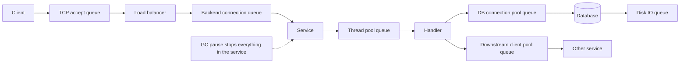
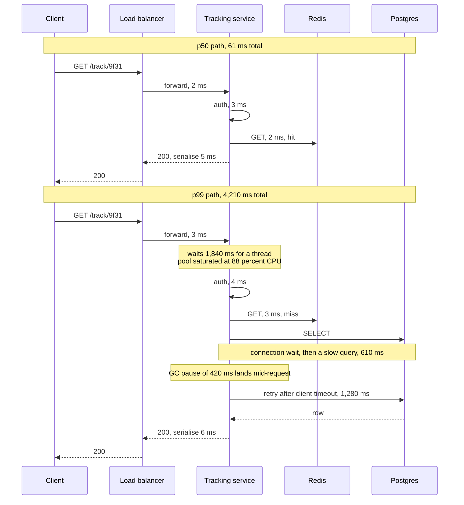

# Chapter 7: Latency

## 7.1 Problem Statement

The team from Chapter 6 now has a proper specification for the order-tracking page. p95 under 400 ms, p99 under 900 ms, measured at the load balancer, at 12,000 requests per second. They build against it and they take it seriously.

They run a load test. 12,000 requests per second, 200 concurrent client threads, sustained for twenty minutes. Results: p50 of 61 ms, p95 of 140 ms, p99 of 180 ms. Comfortably inside budget on every line. The load test is in the build pipeline, it is green, and they ship.

Production p99 is 4.2 seconds.

The investigation takes two weeks and finds five separate things, each of which would have been enough on its own.

**One: the load test could not measure what went wrong.** The generator used 200 threads, each sending a request and waiting for the response before sending the next. When the server stalled for 400 ms, all 200 threads waited politely, and no new requests were issued during the stall. The stall therefore appeared in the results as 200 slow requests instead of the thousands of requests that would have arrived from real users during that window. Real users do not pause when your server is unwell. This under-measurement has a name, coordinated omission, and Section 7.5.6 covers it.

**Two: they sized capacity for the average.** At peak, service instances ran at 88 percent CPU. The team read that as healthy headroom. It is not. Above roughly 80 percent utilisation, waiting time grows faster than the load that caused it, and by 88 percent each request was spending several times its own processing time simply queued. Nothing was slow. Everything was waiting.

**Three: garbage collection.** The JVM paused for 250 to 500 ms roughly every 90 seconds. At 12,000 requests per second, a 400 ms pause traps around 4,800 requests. That is invisible in an average, invisible at p50, and it is most of the p99.9.

**Four: retries made it worse, precisely when it was already bad.** A slow downstream dependency triggered client retries, which added load to a service that was slow because it was overloaded. Latency and load fed each other.

**Five: the dashboard lied.** The monitoring computed p99 per minute and then averaged those values across the hour. Averaging percentiles is not a valid operation, and the number on the wall was consistently lower than reality.

Notice what is absent from that list. Nobody wrote slow code. There is no inefficient algorithm, no missing index, no N+1 query. Every one of the five is a property of the system under load rather than of the code, which is why profiling a single request on a laptop would have found none of them.

That gap is what this chapter is about.

## 7.2 Why This Problem Exists

**Latency is not a property of your code. It is a property of your code under contention.** On an idle machine, a request takes as long as its work takes. On a busy machine, it also waits: for a CPU, for a thread, for a connection from the pool, for a lock, for a disk, for the network card, for the garbage collector to finish. On an idle system those waits are zero, so every test you run on your laptop systematically hides them.

**People reason about latency additively, and queueing is not additive.** The instinct is that doubling the load doubles the work, so latency stays roughly constant until you run out of capacity, then everything breaks. What actually happens is that response time rises gently, then bends sharply upward well before capacity is exhausted. The curve has a knee, and most production incidents live just past it.

**The median and the tail have different causes.** p50 is dominated by the ordinary path: your code, your queries, your network hops. p99 is dominated by rare events that have nothing to do with the ordinary path: a garbage collection pause, a lock held slightly too long, a cache miss, a TCP retransmit, a noisy neighbour on shared hardware, a background compaction. Optimising the ordinary path improves p50 and can leave p99 completely unchanged, which is exactly what Chapter 6's week two ran into.

**Measurement is harder than it looks.** The two mistakes in Section 7.1, coordinated omission and averaging percentiles, are both extremely common, both silent, and both produce numbers that are too good. A team can be genuinely diligent, measure constantly, and still be systematically wrong.

**And the floor is physical.** Some latency is not an engineering problem at all. Light in fibre covers roughly 200 kilometres per millisecond, real routes are not straight lines, and no amount of optimisation moves a round trip between Mumbai and Virginia below about 130 milliseconds. If your design does not account for that, you will spend months optimising code to hit a target that geography forbids.

## 7.3 Real World Analogy

A supermarket at 11 AM on a Tuesday and the same supermarket at 6 PM on a Friday.

The checkout operator has not changed. Scanning your basket takes 90 seconds in both cases. That is **service time**, and it is a property of the work.

At 11 AM you walk up to an empty till. Total time: 90 seconds. At 6 PM there are seven people ahead of you. Total time: 11 minutes. That is **latency**, and it is service time plus waiting.

Three things about this everybody has felt, and all three transfer exactly.

**The nonlinearity is real and it surprises people.** Going from four shoppers per minute to five does not add 25 percent to your wait. Once arrivals approach what the tills can handle, the queue grows out of proportion, and a small increase in traffic produces a large increase in waiting. Section 7.5.1 gives the arithmetic, and the shape of it is why 88 percent CPU utilisation is not "12 percent of headroom".

**Variability makes queues worse, even at the same average load.** If every shopper had exactly twelve items, queues would be short and predictable. In reality one person has a trolley full and a coupon problem, and everyone behind them waits. Same average, much worse waiting. In systems, variable request cost is why a single expensive endpoint degrades every other endpoint sharing the same thread pool.

**One stalled till ruins the experience for a whole lane.** If a till freezes for four minutes because the operator needs a supervisor, the customers in that lane have a terrible time while the store's average wait barely moves. That is a garbage collection pause, and it is why the tail needs its own attention.

One more piece worth carrying: the store manager's fix is rarely "scan faster". It is another till open at peak, an express lane so small baskets do not queue behind big ones, and self-checkout so the work happens in parallel. Those map to adding capacity, isolating workloads, and parallelising, which is most of Section 7.5.7.

## 7.4 Simple Explanation

**Latency is how long one operation takes, from the requester's point of view.** Throughput, in Chapter 8, is how many operations complete per unit of time. They are different, they are related, and improving one often costs the other.

The equation that runs this whole chapter:

```
latency  =  service time  +  wait time
```

- **Service time** is the actual work: executing your code, running the query, transferring the bytes. Roughly constant per request, and it is what a profiler shows you.
- **Wait time** is everything else: queued for a thread, queued for a connection, queued for a CPU, blocked on a lock, stopped by the garbage collector, waiting on the network. Near zero on an idle system, dominant on a busy one.

Almost every latency surprise in production comes from wait time, and almost every optimisation effort goes into service time. That mismatch is the single most useful thing to take from this chapter.

Some vocabulary, because these get used loosely and it causes confusion:

| Term | Meaning |
|---|---|
| Service time | Time spent actually doing the work |
| Wait time (queueing delay) | Time spent waiting for a resource to become free |
| Response time | Service time plus wait time, as seen by the caller |
| Latency | Usually used to mean response time. Sometimes used to mean network transit only, so check the context |
| Round trip time (RTT) | Time for a packet to reach the other end and a response to come back |
| Tail latency | The slow end of the distribution, p99 and beyond |

Throughout this book, "latency" means response time as observed by the caller, and any measurement without a percentile attached should be treated with suspicion, for the reasons Chapter 6 laid out.

## 7.5 Technical Deep Dive

### 7.5.1 The utilisation curve, and why 80 percent is the practical ceiling

This is the most valuable idea in the chapter. Queueing theory gives it exactly for a simplified model, and the shape holds far more generally than the model does.

For a single server where requests arrive randomly, with utilisation ρ (the fraction of time the server is busy) and average service time S:

```
Average response time  R  =  S / (1 - ρ)
Average time spent queueing  =  S x ρ / (1 - ρ)
```

Put numbers in and the shape becomes obvious:

| Utilisation | Time queueing | Total response time | Feels like |
|---|---|---|---|
| 10 percent | 0.11 x S | 1.1 x S | Instant |
| 50 percent | 1 x S | 2 x S | Fine |
| 70 percent | 2.3 x S | 3.3 x S | Fine, and you are near the knee |
| 80 percent | 4 x S | 5 x S | Noticeably slower |
| 90 percent | 9 x S | 10 x S | Bad |
| 95 percent | 19 x S | 20 x S | Very bad |
| 99 percent | 99 x S | 100 x S | Effectively down |

Read the last rows carefully. At 99 percent utilisation the server is doing exactly the same work per request as at 10 percent. Nothing got slower. Response time is 100 times worse purely from waiting.

Three practical consequences.

**Target 60 to 75 percent utilisation for latency-sensitive services**, not 90. The unused capacity is not waste; it is what keeps the queue short. Someone will eventually ask you to justify running at 65 percent CPU, and this table is the answer.

**A small traffic increase near the knee produces a large latency increase.** Going from 80 to 90 percent utilisation is a 12 percent traffic increase and a doubling of response time. This is why systems seem to fall off a cliff rather than degrade gracefully, and why the incident always starts with "traffic was only slightly higher than usual".

**Variability makes it worse at the same average.** The formula above assumes a particular randomness. Kingman's approximation shows that waiting time scales with the variability of both arrivals and service times:

```
wait  ≈  (Ca² + Cs²) / 2   x   ρ / (1 - ρ)   x   S
```

where the C terms measure how variable arrivals and service times are. The practical reading: **if some requests are far more expensive than others, everything behind them waits.** One endpoint that takes 3 seconds, sharing a thread pool with endpoints that take 20 milliseconds, will wreck the latency of the fast ones. That is the argument for bulkheads and separate pools, and it is why the supermarket has an express lane.

Two honest caveats. Real servers have many workers rather than one, which is more forgiving than the table suggests. And real arrivals are burstier than the model assumes, which is less forgiving. The curve's shape, and the location of the knee at roughly 70 to 80 percent, survives both corrections.

### 7.5.2 Little's Law

The other formula worth memorising, because it holds for any stable system regardless of distributions, and because it answers pool-sizing questions in one line.

```
L  =  λ x W

concurrency  =  throughput  x  latency
```

L is the average number of requests in the system, λ is the arrival rate, W is the average time each spends in the system.

**Worked example one: how many requests are in flight?**

```
12,000 req/s  x  0.080 s  =  960 requests in flight on average
```

If your fleet has 20 instances with 200 threads each, that is 4,000 threads for 960 in-flight requests. Comfortable. Now suppose latency degrades to 800 ms during an incident:

```
12,000 req/s  x  0.800 s  =  9,600 requests in flight
```

You need 9,600 threads and you have 4,000. Requests queue at the edge, latency rises further, and more requests pile up. That feedback loop is what an overload actually looks like from the inside, and Little's Law predicts it in one multiplication.

**Worked example two: the ceiling a thread pool imposes.**

```
Rearranged:  throughput  =  concurrency / latency

200 threads,  80 ms per request   ->  200 / 0.080  =  2,500 req/s maximum
200 threads, 400 ms per request   ->  200 / 0.400  =    500 req/s maximum
```

Same pool. Five times the latency, one fifth the throughput. This is why a slow dependency reduces your capacity even though your own code did not change, and why timeouts are a capacity control as much as a correctness control.

**Worked example three: connection pool sizing**, which is the most common practical use.

```java
// Requests that need the database: 3,000 req/s
// Time each holds a connection (query + result handling): 12 ms
//
// Little's Law:  3,000 x 0.012 = 36 connections needed on average
//
// Add headroom for variance and for slow queries at p99:
//   about 60 across the whole fleet
//
// Split across 20 instances: 3 per instance is too tight for bursts,
// so use 5, giving 100 total. Confirm the database can accept 100.
@Bean
public DataSource dataSource() {
    HikariConfig config = new HikariConfig();
    config.setMaximumPoolSize(5);
    config.setConnectionTimeout(2000);   // fail fast rather than queue forever
    config.setValidationTimeout(1000);
    return new HikariDataSource(config);
}
```

Two things fall out of that comment block that people get wrong constantly. Pools are usually sized by guesswork and are usually too large, which just moves the queue from your application into the database where it is harder to see. And `connectionTimeout` is a latency control: without it, a request waits indefinitely for a connection, converting a capacity problem into a hung thread. Chapter 8 develops the throughput side of this.

### 7.5.3 The physics floor

Some latency is geography and cannot be engineered away. Knowing the arithmetic prevents you from promising the impossible.

Light in optical fibre travels at roughly 200,000 kilometres per second, about two thirds of its speed in vacuum. That gives a usable rule:

```
one way    ≈  1 ms per 200 km
round trip ≈  1 ms per 100 km

Real routes are 1.3x to 2x longer than the straight line,
plus switching and routing delay at every hop.
```

| Route | Approximate distance | Theoretical RTT | Typical real RTT |
|---|---|---|---|
| Within a datacenter | under 1 km | negligible | 0.2 to 0.5 ms |
| Within a metro area | 50 km | 0.5 ms | 2 to 5 ms |
| Mumbai to Chennai | 1,000 km | 10 ms | 25 to 40 ms |
| London to Frankfurt | 650 km | 6.5 ms | 10 to 20 ms |
| Mumbai to London | 7,200 km | 72 ms | 110 to 130 ms |
| Mumbai to Virginia | 13,000 km | 130 ms | 180 to 220 ms |
| Sydney to London | 17,000 km | 170 ms | 250 to 300 ms |

Now the part that hurts: **connection setup costs multiple round trips before any of your data moves.**

| Step | Round trips | At 150 ms RTT |
|---|---|---|
| DNS lookup (uncached) | 1 or more | 150 ms or more |
| TCP handshake | 1 | 150 ms |
| TLS 1.2 handshake | 2 | 300 ms |
| TLS 1.3 handshake | 1 | 150 ms |
| TLS 1.3 resumption, 0-RTT | 0 | 0 ms |
| First request and response | 1 | 150 ms |

A fresh HTTPS connection over TLS 1.2 across an ocean costs roughly 600 ms before your server does a single thing. The same connection reused costs 150 ms. This is why connection reuse, keep-alive, HTTP/2 multiplexing, and TLS 1.3 matter more for user-facing latency than almost any server-side optimisation, and why the design answer for global users is presence near them rather than faster code. Chapters 81 to 83 cover the protocol details and Chapter 32 covers edge placement.

The rule to carry: **count round trips, not bytes.** Ten sequential 1 KB calls cost ten round trips. One 10 KB call costs one.

### 7.5.4 Where tail latency comes from

p99 has different causes from p50, so it needs different fixes. This table is the diagnostic checklist.

| Source | Typical magnitude | Why it hits the tail | Fix |
|---|---|---|---|
| Queueing at high utilisation | 2 to 100x service time | Bursts push utilisation past the knee briefly | Run at 60 to 75 percent, shed load, add capacity |
| Garbage collection pauses | 10 ms to seconds | Every request in flight during the pause is delayed | Modern collectors, smaller heaps per instance, less allocation |
| Lock contention | Milliseconds to seconds | One slow holder blocks everyone behind | Shorter critical sections, lock-free structures, sharded locks |
| Cache miss | 10 to 100x a hit | Rare by definition, so it lands in the tail | Higher hit rate, cache warming, negative caching |
| Cold start and JIT warm-up | Hundreds of ms to seconds | First requests after a deploy or scale-out | Pre-warm, gradual traffic ramp |
| Connection establishment | 1 to 4 RTT | Only on the first request of a connection | Pooling, keep-alive, HTTP/2 |
| Retries | Doubles or triples latency | Fires exactly when things are already slow | Cap attempts, backoff with jitter, retry budget |
| Head-of-line blocking | Variable | One slow item delays a whole batch or connection | HTTP/2 or /3, smaller batches, separate queues |
| Noisy neighbours | Variable | Shared CPU, disk, or network on cloud hardware | Larger instance types, dedicated capacity, hedging |
| Background work | 10 ms to seconds | Compaction, backups, log rotation, index rebuilds | Schedule off-peak, rate limit background IO |
| Disk or network hiccup | Milliseconds to seconds | TCP retransmits, slow device | Timeouts, hedging, replicas |
| Fan-out amplification | See Chapter 6 | The slowest of N calls determines the response | Fewer calls, parallel not sequential, hedging |

Two entries deserve extra attention for a Java audience.

**Garbage collection is a latency architecture decision, not a tuning detail.** A 400 ms pause at 12,000 requests per second traps thousands of requests. The available levers, roughly in order of effect: allocate less on the hot path, run smaller heaps across more instances rather than one huge heap, and choose a collector designed for pause time. Modern low-pause collectors keep pauses in the single-digit millisecond range even on large heaps, at some throughput cost, which is a trade worth making for user-facing services and often not worth making for batch work.

**Retries are the tail's favourite amplifier.** A retry adds load to a system that is slow, and slowness is usually caused by load. Without a cap, backoff, and jitter, a retry policy converts a brief degradation into an outage. Chapter 61 covers this and it is worth reading before you configure any HTTP client.

### 7.5.5 Fan-out, and tail-tolerant techniques

Chapter 6 gave the arithmetic: a dependency with a p99 of one second, called 20 times per page, makes roughly 18 percent of pages slow. The general form is that when a response requires N independent calls, its latency is the **maximum** of N samples, not the average, and the maximum of many samples lands far into the tail.

The obvious fixes are to make fewer calls and to issue them in parallel rather than sequentially:

```java
// Sequential: latencies add. 3 calls at 40 ms = 120 ms, and the tail is worse.
Shipment s = shipmentClient.get(id);
Carrier  c = carrierClient.get(s.carrierId());
Address  a = addressClient.get(s.addressId());

// Parallel: latency is the slowest one, not the sum.
CompletableFuture<Shipment> sf = supplyAsync(() -> shipmentClient.get(id), pool);
CompletableFuture<Carrier>  cf = supplyAsync(() -> carrierClient.get(cid), pool);
CompletableFuture<Address>  af = supplyAsync(() -> addressClient.get(aid), pool);
CompletableFuture.allOf(sf, cf, af).join();
```

Parallelising helps p50 a lot and helps p99 less than you would hope, because you have now made the response depend on the worst of three tails rather than one. That is the problem the next set of techniques attacks. They come from Google's work on tail latency and are worth knowing by name.

**Hedged requests.** Send the request. If no answer arrives by, say, the p95 deadline, send a second copy to a different replica and take whichever answers first. Because only about 5 percent of requests get duplicated, the extra load is small, and the improvement at p99 can be large, since you are betting that the second attempt will not hit the same rare stall.

```java
public <T> T hedged(Supplier<T> call, Duration hedgeAfter) {
    CompletableFuture<T> first = supplyAsync(call, pool);
    CompletableFuture<T> second = new CompletableFuture<>();
    scheduler.schedule(() -> {
        if (!first.isDone()) {
            supplyAsync(call, pool).whenComplete((v, e) -> {
                if (e == null) second.complete(v);
            });
        }
    }, hedgeAfter.toMillis(), MILLISECONDS);
    return (T) CompletableFuture.anyOf(first, second).join();
}
```

Two conditions before you use this. The operation must be idempotent, which is Chapter 20 and Chapter 4's downward constraint appearing again. And you must cap the extra load, because hedging under overload adds traffic to a system that is already struggling.

**Tied requests.** Send to two replicas immediately, each told about the other. Whichever starts work first cancels the twin. Lower latency than hedging, more coordination.

**Micro-partitioning.** Split data into many more partitions than machines, so a slow machine can have its partitions moved away quickly and load can be rebalanced in fine increments rather than by whole servers.

**Probation.** Track per-replica latency and temporarily stop sending traffic to a replica that has become slow, while still probing it occasionally. This is a load balancer behaviour, and choosing a latency-aware balancing strategy rather than round-robin is often the cheapest tail improvement available. Chapter 30 covers the algorithms.

### 7.5.6 Measuring latency without lying to yourself

Two errors from Section 7.1, both silent, both extremely common.

**Coordinated omission.** A closed-loop load generator has a fixed number of threads, each of which sends a request and waits for a response before sending the next. When the server stalls, the generator stops generating. The stall is measured once per thread rather than once per request that should have arrived.

```
Server stalls for 1 second at 10,000 req/s.

Reality:      10,000 requests were delayed by up to 1 second.
Closed loop:  200 threads each recorded one 1-second response.
              The other 9,800 requests were never sent, so never measured.

Reported p99: fine.
Actual p99:   terrible.
```

The fixes: use an open-loop generator that issues requests on a schedule regardless of whether earlier ones have completed (wrk2, Vegeta, and Gatling with an open workload model all support this), or use a tool that corrects for it. Then compare the two runs; the difference is usually shocking the first time you see it.

**Averaging percentiles.** You cannot average p99 values across time buckets or across servers and get a meaningful p99. The p99 of a combined population is not the mean of the sub-population p99s, and the error is always in the flattering direction.

The correct approach is to record histograms and merge those, then compute the percentile from the merged histogram. Prometheus histograms, HdrHistogram, and most modern metrics libraries do this. If your dashboard shows an average of percentiles, its numbers are decorative.

A few more rules for honest measurement:

- **Measure at the point closest to the user** for anything you promise. Chapter 6's table covers this.
- **Report percentiles per endpoint**, not per service. A service-wide p99 mixes a 5 ms health check with a 900 ms report and describes neither.
- **Test at the specified load with a cold cache.** A p99 that only holds when the cache is warm is a p99 that fails during every incident.
- **Watch the max, not only p99.** For a service with high fan-out, the worst case is what your callers actually experience.
- **Keep the measurement running in production.** Load tests find the knee; only production finds the noisy neighbour.

### 7.5.7 The reduction toolkit

Techniques, ordered roughly by how much latency they typically remove per unit of effort. The first question is always which of service time or wait time you are attacking, because effort spent on the wrong one changes nothing.

| Technique | Attacks | Typical gain | Cost |
|---|---|---|---|
| Add capacity to get off the knee | Wait time | Often the largest single win | Money |
| Remove round trips: batch, parallelise, colocate | Service and network | Very large for chatty paths | Design effort |
| Cache the repeated reads | Service time | 10 to 100x on hits | Staleness, invalidation (Chapter 34) |
| Add the missing index | Service time | 10 to 1000x on the query | Write cost, storage (Chapter 39) |
| Move work off the request path | Both | Removes it entirely | Eventual completion, complexity |
| Reuse connections, HTTP/2, TLS 1.3 | Network | 1 to 3 RTT per request | Configuration |
| Move closer to users: CDN, regional replicas | Network | Up to hundreds of ms | Cost, consistency (Chapter 32) |
| Separate thread pools per workload | Wait time | Protects fast paths from slow ones | Tuning, more pools |
| Reduce garbage collection pauses | Tail only | Large at p99 and p999 | Throughput trade, tuning |
| Timeouts and load shedding | Wait time | Prevents collapse, bounds the tail | Some requests fail fast |
| Hedged requests | Tail only | Large at p99 | Extra load, needs idempotency |
| Compress payloads | Network | Helps large responses on slow links | CPU, and it hurts small responses |
| Micro-optimise the code | Service time | Usually small | Engineering time |

The last row is where most engineering instinct goes and where the least latency usually is. Chapter 6's latency budget exercise is the tool that keeps you honest: if serialisation owns 8 ms of a 400 ms budget, halving it is not a project worth running.

One rule deserves its own line, because it is the highest-leverage habit in this chapter: **set a timeout on every remote call, and derive it from the callee's p99 rather than picking a comfortable round number.** A timeout of 30 seconds on a service whose p99 is 200 ms is not a safety net; it is a guarantee that a stalled dependency will consume every thread you have.

## 7.6 Architecture Diagram

Two diagrams. The first is where time actually goes in a single request, drawn as a waterfall, because "the service is slow" is almost always three or four things and you need to see the proportions.

```
p50 request, total 61 ms
|--DNS 0--|--conn 0--|===net in 22===|-lb 2-|-auth 3-|cache 2|==db 24==|ser 5|===net out 22===|
                     ^ connection reused, so no handshake

p99 request, total 4,210 ms
|--DNS 0--|--conn 0--|===net in 24===|-lb 3-|===============queued 1,840===============|
|--auth 4--|cache 3|=====db 610=====|===GC pause 420===|==retry of db call 1,280==|ser 6|=net out 20=|
```

Read the two together. The p99 request is not doing more work; the database call is far slower and there is 1.8 seconds of pure queueing, a garbage collection pause, and a retry that fired because the first attempt looked stuck. Service time went from about 34 ms to about 620 ms. Wait time went from roughly 0 to roughly 3,540 ms.

The second diagram shows where queues exist in a typical request path, because each one is a place wait time accumulates and most of them are invisible until you look.



ASCII version:

```
 Client
   |
 [TCP accept queue]        <- fills when the service cannot accept fast enough
   |
 Load balancer
   |
 [backend connection queue]
   |
 Service  <--- GC pause stops all of this, briefly, for every request in flight
   |
 [thread pool queue]       <- Little's Law lives here
   |
 Handler
   |----> [db connection pool queue] ---> Database ---> [disk IO queue]
   |----> [http client pool queue]  ---> Other service ---> (its own queues)
```

Six queues, and a typical dashboard shows none of them. When someone says "the service is slow", the useful question is which of these was full, and the useful instrumentation is queue depth and time-in-queue per pool, not just handler duration. That single instrumentation change turns most latency investigations from days into minutes.

## 7.7 Request Flow

A tail request autopsy: the same endpoint, at p50 and at p99, hop by hop. This is the exercise to run whenever a p99 target is missed, and Chapter 65's distributed tracing is what makes it possible in production.



The per-hop comparison, which is the artifact worth producing:

| Hop | p50 | p99 | Cause of the difference |
|---|---|---|---|
| Load balancer | 2 ms | 3 ms | Normal variance |
| Thread pool wait | 0 ms | 1,840 ms | Utilisation past the knee, Section 7.5.1 |
| Auth | 3 ms | 4 ms | Normal variance |
| Cache | 2 ms hit | 3 ms miss | Miss forces the database path |
| Database | not reached | 610 ms | Connection wait plus a query competing with a background job |
| GC pause | 0 ms | 420 ms | Landed inside this request |
| Retry | 0 ms | 1,280 ms | Client timeout fired, second attempt repeated the work |
| Serialise | 5 ms | 6 ms | Normal variance |

What this table makes obvious, and prose never does: **the code is not the problem in any row.** Four of the eight are wait, one is a runtime pause, one is a retry that duplicated work already in progress. Fixing this request means running at lower utilisation, raising the cache hit rate, moving the background job off peak, tuning the collector, and setting the client timeout above the callee's real p99 so the retry does not fire on a request that was about to succeed.

That last one is worth dwelling on. The retry made this request roughly 1,280 ms slower and made the whole system busier at the exact moment it was struggling. A timeout set below your dependency's real p99 does not protect you; it manufactures load.

## 7.8 Internal Components

Every place latency accumulates, what to measure there, and what happens if you ignore it.

| Component | Latency contribution | Measure | Ignore it and |
|---|---|---|---|
| DNS resolution | 0 to 200 ms, usually cached | Resolution time, cache hit rate | Occasional multi-hundred-ms first requests nobody can explain |
| Connection setup | 1 to 4 RTT | New connections per second, reuse rate | Every request pays a handshake, invisibly |
| Load balancer | 1 to 5 ms | Queue depth, per-backend latency | Traffic keeps going to a degraded instance |
| Accept and thread pool queues | 0 ms to seconds | Queue depth, time in queue, rejections | The biggest source of tail latency stays invisible |
| Application handler | Service time | Duration per endpoint, percentiles | You optimise the wrong endpoint |
| Garbage collector | 0 to seconds | Pause count and duration, allocation rate | p99 has an unexplained floor you cannot get under |
| Cache | 1 to 5 ms on a hit | Hit rate, latency of hits and misses separately | Miss cost is hidden inside an averaged number |
| Connection pool | 0 ms to timeout | Wait time for a connection, saturation | A slow database appears as an application problem |
| Database | Query service time | Per-query duration, lock waits, IO wait | Everything looks slow and nothing points at the cause |
| Downstream services | Their whole distribution | Per-dependency percentiles, timeout and retry counts | Their tail becomes your tail, multiplied by fan-out |
| Serialisation | 1 to 20 ms | Payload size, encode time | Rarely a problem, frequently blamed |
| Network back to client | RTT, plus bandwidth for large payloads | Real user monitoring | Server-side numbers look great and users disagree |

The two rows to instrument first, if you instrument nothing else, are **time in queue** and **connection pool wait**. They are the largest tail contributors in most systems and the least commonly measured. Chapter 64 covers metric design.

## 7.9 Production Example

**Google's tail-tolerant techniques, from The Tail at Scale.** Their observation was that in a service where a user request fans out to many machines, the response is gated by the slowest responder, so even rare slowness becomes common at the user level. Rather than trying to eliminate every source of variability, which they judged impractical at their scale, they built techniques that tolerate it: hedged requests, tied requests, micro-partitioning for fast rebalancing, and taking slow replicas out of rotation temporarily. Their reported results showed substantial reductions in high percentile latency from hedging while adding only a small percentage of extra requests.

The idea worth taking is the shift in framing. Beyond a certain scale, variability is a permanent property of the environment rather than a bug to be fixed, so the design has to route around it. Chapter 30 and Chapter 60 cover the mechanisms.

**The JVM's garbage collectors are a case study in latency as a design goal.** The historical trade was throughput against pause time: collectors optimised for total work done produced long stop-the-world pauses, which is acceptable for batch processing and unacceptable for a request-serving service where every pause lands on live requests. Successive collectors moved work off the pause and into concurrent phases, and current low-pause collectors are designed to keep pauses in the low single-digit milliseconds largely independently of heap size, at the cost of some throughput and extra CPU.

For a Java service with a p99 target in the hundreds of milliseconds, the collector choice is a genuine architecture decision. It is also worth knowing the cheaper levers first: allocating less on the hot path, and running more instances with smaller heaps rather than fewer with very large ones.

**Edge networks exist because round trips cannot be optimised away.** Providers such as Cloudflare, Akamai, and Fastly place servers close to users specifically to shorten the physical path, terminate TLS at the edge so handshake round trips are short, keep long-lived warm connections back to the origin so origin requests skip setup entirely, and support TLS 1.3 with session resumption to cut handshakes further. Every one of those targets the round-trip count from Section 7.5.3 rather than server-side work.

The lesson for your own designs: when users are far away, no server-side optimisation competes with moving the endpoint closer. A 150 ms round trip is 150 ms whether your handler takes 5 ms or 50 ms.

## 7.10 Advantages

The benefits of treating latency as a first-class engineering concern rather than a tuning afterthought:

- **Users notice, and behave differently.** The published experiments in Chapter 6 exist because latency changes conversion, engagement, and abandonment measurably.
- **Lower latency means higher capacity for free.** Little's Law is symmetric: halving response time doubles what the same threads and connections can carry.
- **Predictable latency enables tighter timeouts,** which enable faster failure detection, which is what makes circuit breakers and failover work at all.
- **Understanding the utilisation curve prevents the most expensive class of outage,** the one where a small traffic increase produces a collapse nobody predicted.
- **Latency budgets direct effort.** You stop optimising the 8 ms and start on the 610 ms.
- **Honest measurement makes regressions visible,** so latency stops silently degrading release by release, which is its default behaviour.
- **Tail work improves reliability generally.** Most of what fixes p99, such as bounded queues, isolation, timeouts, and shedding, also prevents cascading failure.

## 7.11 Limitations

- **Physics is not negotiable.** No engineering makes an intercontinental round trip fast. The only answer is being closer, which costs money and consistency.
- **Latency and throughput trade against each other.** Batching, compression, and queueing all raise throughput and add per-request delay. Chapter 8 covers the other side.
- **Tail latency has a floor set by your environment.** On shared cloud hardware, noisy neighbours put a floor under p999 that no application work removes.
- **Some techniques cost real money.** Running at 65 percent utilisation instead of 90 means roughly 40 percent more machines.
- **Hedging is not free and can be dangerous.** It adds load, requires idempotency, and under overload it accelerates collapse unless capped.
- **You cannot optimise what you cannot measure honestly,** and honest measurement takes real work: open-loop generation, histograms, per-endpoint percentiles, real user monitoring.
- **Below a threshold, further improvement is invisible.** Going from 60 ms to 40 ms is effort spent on something no user will perceive.

## 7.12 Trade-offs

| Dial | One way | The other way |
|---|---|---|
| Utilisation target | Low: short queues, stable latency, more machines | High: cheaper, and you sit near the knee |
| Batching | Larger batches: better throughput, higher per-item latency | Smaller: lower latency, more overhead per item |
| Timeout length | Short: fast failure, frees capacity, may abandon work about to succeed | Long: fewer spurious failures, threads held during trouble |
| Retries | More: higher success rate, added load exactly when overloaded | Fewer: less amplification, more visible failures |
| Caching | More: much faster reads, staleness and invalidation complexity | Less: always fresh, database carries everything |
| Hedging | On: better p99, extra load and duplicate work | Off: simpler and cheaper, worse tail |
| Consistency | Read the leader: correct and slower | Read a nearby replica: fast and possibly stale |
| Heap size per instance | Large: fewer instances, longer pauses | Small: shorter pauses, more instances to operate |
| Compression | On: fewer bytes on slow links, more CPU | Off: lower CPU, larger payloads |

The removal test, applied to latency mechanisms.

**Remove the timeout on a downstream call.** You gain fewer spurious failures for slow-but-successful requests. You lose bounded latency entirely, and one stalled dependency consumes every thread, converting a partial degradation into a total outage. Never worth it.

**Remove hedging.** You gain simplicity and roughly 5 percent less load. You lose a significant p99 improvement on read paths with replicas. For a service whose tail is dominated by rare per-machine stalls that is a large loss; for one whose tail is dominated by queueing, hedging was never going to help and removing it is correct.

**Remove the spare capacity and run at 90 percent.** You gain roughly a third of your machine bill. You lose the stability of the whole system, because you are past the knee and any burst produces a latency spike that triggers retries that produce more load. This trade is taken far more often than it should be, usually by someone who reads 88 percent CPU as healthy.

## 7.13 Common Mistakes

**Optimising service time when the problem is wait time.** Weeks of profiling and micro-optimisation while the actual cause is a saturated thread pool. Measure time in queue before touching code.

**Reading high utilisation as efficiency.** 90 percent CPU on a latency-sensitive service is not good news; it means response time is roughly ten times service time.

**Closed-loop load testing.** Coordinated omission produces beautiful numbers and a false sense of safety. Section 7.1's team shipped on the strength of one.

**Averaging percentiles.** Mathematically invalid, always flattering, extremely common on dashboards.

**Timeouts set to round numbers.** 30 seconds because it looked sensible. Derive them from the callee's measured p99 with margin, and remember that a timeout below the real p99 manufactures retries.

**Retries without backoff, jitter, and a cap.** The most reliable way to convert a slowdown into an outage.

**Sequential calls that could be parallel.** Ten sequential 40 ms calls are 400 ms of waiting; issued in parallel they are 40 to 60 ms.

**One shared thread pool for fast and slow endpoints.** The expensive report blocks the health check, and everything degrades together.

**Ignoring connection setup.** Fresh TLS connections on every request add hundreds of milliseconds for distant users, and it never shows up in server-side metrics.

**Benchmarking with a warm cache and an empty database.** Both make results meaningless. Test at the specified load, with a cold cache, on realistic data volume.

**Reporting one latency number for a whole service.** Percentiles per endpoint, or the number describes nothing.

**Forgetting that the client's experience includes the client.** Server-side p99 of 90 ms with a browser experience of 4 seconds is normal, and only real user monitoring reveals it.

## 7.14 Interview Questions

**Q: What is latency, and how does it differ from throughput?**
Latency is how long one operation takes from the caller's perspective, service time plus wait time. Throughput is how many operations complete per unit time. They trade against each other: batching raises throughput and raises per-item latency.

**Q: Your service runs at 90 percent CPU and latency is bad, but the code is efficient. What is happening?**
Queueing. Past the knee of the utilisation curve, response time is dominated by waiting rather than working. At 90 percent utilisation, response time is roughly ten times service time even though each request does the same work. The fix is capacity, load shedding, or reducing per-request cost, not micro-optimisation.

**Q: State Little's Law and give a use for it.**
Concurrency equals throughput times latency. Use it to size pools: 3,000 requests per second each holding a connection for 12 ms needs about 36 connections on average. Use it also to see that a slower dependency reduces maximum throughput for a fixed pool size.

**Q: Why is p99 often much worse than p50, and why do they need different fixes?**
p50 reflects the ordinary path, so it responds to code, query, and network improvements. p99 reflects rare events: garbage collection pauses, queueing during bursts, cache misses, lock contention, retries, noisy neighbours. Improving the ordinary path can leave the tail untouched.

**Q: What is coordinated omission?**
When a closed-loop load generator stops sending requests during a server stall, so the requests that should have arrived during the stall are never measured. It under-reports high percentiles, sometimes by an order of magnitude. Fix it with open-loop generation or a tool that corrects for it.

**Q: Can you average p99 values from five servers to get the fleet p99?**
No. Percentiles do not average. Merge histograms and compute the percentile from the merged data. Averaging percentiles always produces a flattering, meaningless number.

**Q: A page makes 30 backend calls. What does that do to latency, and what do you do about it?**
The response depends on the slowest of 30, so tail latency dominates: with a p99 of 100 ms per call, roughly 26 percent of pages contain a call at or above that. Reduce the number of calls, issue independent ones in parallel, tighten the percentile requirement on shared dependencies, and consider hedging for idempotent reads.

**Q: How do you choose a timeout?**
From the callee's measured p99 plus margin, not from a round number. Too short and you manufacture retries on requests that were about to succeed, adding load during trouble. Too long and a stalled dependency consumes your threads. Every remote call gets one.

**Q: Users in Singapore say the app is slow, but server-side p99 is 80 ms. What is going on?**
Almost certainly network and connection setup. An intercontinental round trip is 150 to 250 ms, and a fresh TLS 1.2 handshake costs several of them before the first byte. Check connection reuse, TLS version, the number of sequential requests per page, and whether there is any edge presence near those users.

**Q: What utilisation should a latency-sensitive service run at?**
Roughly 60 to 75 percent. The spare capacity is what keeps queues short. Above 80 percent, waiting grows faster than the traffic that caused it, and bursts produce disproportionate latency spikes.

## 7.15 Production Best Practices

1. **Instrument time in queue and connection pool wait**, not just handler duration. These are the largest tail contributors and the least commonly measured.
2. **Record histograms and compute percentiles from merged histograms.** Never average percentiles.
3. **Report percentiles per endpoint,** and include the max for high fan-out services.
4. **Load test open loop,** at the specified rate, with a cold cache and realistic data volume.
5. **Target 60 to 75 percent utilisation** for anything latency-sensitive, and treat 85 percent as an alert rather than a goal.
6. **Set a timeout on every remote call,** derived from the callee's p99 with margin.
7. **Cap retries, use exponential backoff with jitter, and budget them** as a percentage of traffic so they cannot amplify an overload.
8. **Separate thread pools by workload class** so expensive operations cannot starve cheap ones.
9. **Parallelise independent calls** and reduce the number of sequential hops on the request path.
10. **Reuse connections everywhere:** keep-alive, pooling, HTTP/2, TLS 1.3.
11. **Move anything the user is not waiting for off the request path.**
12. **Watch garbage collection pause time as a first-class latency metric,** and prefer smaller heaps across more instances for request-serving services.
13. **Schedule background work off peak** and rate limit its IO.
14. **Measure at the client with real user monitoring** for anything you promise to users.
15. **Rebuild the latency budget** from Chapter 6 whenever the path changes, and check where the budget actually goes before optimising anything.

## 7.16 Summary

Latency is service time plus wait time, and almost every production surprise comes from the second term while almost every optimisation effort goes into the first. Your code is not slower under load; it is waiting, for a thread, a connection, a CPU, a lock, or the garbage collector.

The single most useful idea is the shape of the utilisation curve. Response time is roughly service time divided by one minus utilisation, so a system at 90 percent utilisation has response times around ten times its service time while doing exactly the same work per request. The knee sits near 70 to 80 percent, most incidents live just past it, and this is why spare capacity is a latency mechanism rather than waste. Little's Law is the companion: concurrency equals throughput times latency, which sizes your pools, explains why a slow dependency reduces your capacity, and predicts the feedback loop that turns a slowdown into an overload.

The tail deserves separate treatment from the median because it has separate causes. Garbage collection pauses, bursts of queueing, cache misses, lock contention, retries, and noisy neighbours produce p99 behaviour that no amount of ordinary-path optimisation touches, and fan-out turns a rare slow response into a common slow page. The techniques that help are different too: isolation, timeouts derived from real percentiles, load shedding, latency-aware routing, and hedged requests for idempotent reads.

Underneath everything sits a floor you cannot engineer past. Round trips cost roughly a millisecond per hundred kilometres, connection setup costs several of them, and no server-side work competes with being closer to the user. Count round trips rather than bytes, and when the target is globally low latency, the answer is presence rather than speed.

Finally, measure honestly, because both common measurement errors flatter you. Closed-loop load generation hides exactly the stalls you care about, and averaging percentiles is arithmetic that cannot be correct. A latency number without an open-loop test, a per-endpoint histogram, and a real user measurement behind it is a number your users will contradict.

## 7.17 Quick Revision Notes

- Latency = service time + wait time. Wait time causes most production surprises; service time gets most of the attention.
- Utilisation curve: response time ≈ S / (1 − ρ). At 50 percent it is 2S, at 80 percent 5S, at 90 percent 10S, at 99 percent 100S.
- Knee is around 70 to 80 percent. Run latency-sensitive services at 60 to 75 percent. Spare capacity is a latency mechanism.
- Variability makes queueing worse at the same average load. Mixing cheap and expensive work in one pool wrecks the cheap work.
- Little's Law: concurrency = throughput × latency. Sizes pools and predicts overload feedback loops.
- Throughput = concurrency / latency. A slower dependency reduces your capacity with no code change.
- Physics: RTT ≈ 1 ms per 100 km. Mumbai to Virginia is 180 to 220 ms real. Count round trips, not bytes.
- Connection setup: TCP 1 RTT, TLS 1.2 2 RTT, TLS 1.3 1 RTT, resumption 0 RTT. A cold intercontinental HTTPS connection can cost around 600 ms before your code runs.
- Tail causes differ from median causes: queueing bursts, GC pauses, cache misses, lock contention, retries, cold starts, noisy neighbours, background jobs.
- Fan-out means latency is the max of N, not the average. Shared dependencies need tighter percentiles than the page does.
- Tail-tolerant techniques: hedged requests, tied requests, micro-partitioning, latency-based probation. Hedging needs idempotency and a cap.
- Coordinated omission: closed-loop generators stop sending during stalls, so stalls go unmeasured. Use open-loop tools.
- Percentiles cannot be averaged. Merge histograms, then compute.
- Timeouts come from the callee's measured p99 plus margin. Too short manufactures retries; absent means unbounded latency.
- Retries need cap, backoff, jitter, and a budget, or they amplify overload.
- Instrument time in queue and connection pool wait first. Report percentiles per endpoint.
- Biggest wins usually: get off the knee, remove round trips, cache, index, move work off the request path, move closer to users.

## 7.18 Mini Quiz

1. A service has a service time of 20 ms and runs at 90 percent utilisation. Roughly what is the average response time, and how much of it is waiting?
2. Your service handles 5,000 requests per second with an average response time of 40 ms. How many requests are in flight? If latency degrades to 400 ms, what happens?
3. A thread pool has 300 threads and each request takes 150 ms. What is the maximum throughput, and what changes if you halve the latency?
4. Explain coordinated omission and why it makes load test results optimistic.
5. Your dashboard computes p99 per minute and shows the hourly average of those values. What is wrong, and what should it do instead?
6. A page makes 25 independent calls to a service with a p99 of 200 ms. Roughly what fraction of page loads include at least one 200 ms call?
7. Users in Sydney see 900 ms page loads; your servers are in Virginia and server-side p99 is 70 ms. Where is the time, and name three fixes.
8. Why can a timeout that is too short make latency worse rather than better?
9. Your p50 is excellent and p99 is 40 times higher. Name four plausible causes and how you would confirm each.
10. When is hedging a bad idea?

**Answers**

1. Response time ≈ 20 / (1 − 0.9) = 200 ms, of which 180 ms is queueing and 20 ms is actual work. The server does the same work per request as it would at 10 percent utilisation.
2. 5,000 × 0.040 = 200 requests in flight. At 400 ms it becomes 5,000 × 0.400 = 2,000 in flight, a tenfold increase in threads, connections, and memory needed. If the pools cannot supply that, requests queue at the edge, latency rises further, and the system spirals.
3. 300 / 0.150 = 2,000 requests per second. Halving latency to 75 ms doubles maximum throughput to 4,000 per second with no extra threads. Latency work is also capacity work.
4. A closed-loop generator sends one request per thread and waits for the response. During a server stall no new requests are issued, so requests that would have arrived during the stall are never measured. Only one delayed sample per thread is recorded instead of thousands, which pulls high percentiles down sharply. Use an open-loop generator issuing at a fixed rate.
5. Percentiles do not average; the mean of sixty p99 values is not the p99 of the combined population, and the error flatters you. Record histograms per interval, merge them across the hour, then compute p99 from the merged histogram.
6. 1 − 0.99^25 = 1 − 0.778, so about 22 percent.
7. Almost all of it is network and connection setup: an intercontinental round trip of roughly 250 ms, multiplied by handshakes and any sequential requests. Fixes: an edge or region near those users, connection reuse and HTTP/2 so handshakes are not repeated, TLS 1.3 with resumption, and fewer sequential round trips per page.
8. Because it fires on requests that were about to succeed, and the retry repeats work the system is already doing, adding load exactly when the system is slow. That extra load raises utilisation, which raises queueing, which causes more timeouts. Derive timeouts from the callee's measured p99 with margin.
9. Garbage collection pauses: compare pause timestamps and durations against slow request timestamps. Queueing at high utilisation: check time in queue and utilisation at the moment of the spike. Cache misses: measure hit and miss latency separately and check hit rate. Lock contention or a slow dependency's own tail: check per-dependency percentiles and take thread dumps during the event. Retries are a fifth: check whether slow requests correlate with retry counts.
10. When the operation is not idempotent, since a duplicate can cause a duplicate side effect. When the system is already overloaded, because extra requests accelerate collapse, so hedging must be capped and disabled under load shedding. And when the tail is caused by queueing rather than per-replica stalls, because the second request joins the same queue and gains nothing while adding load.

## 7.19 Hands-on Exercise

**Part 1: see the utilisation curve.** Take a simple Spring Boot endpoint that does a fixed amount of CPU work, roughly 20 ms. Using an open-loop load generator (wrk2, Vegeta, or Gatling with an open workload model), drive it at 20, 40, 60, 70, 80, 85, 90, and 95 percent of its measured maximum throughput. At each level record p50, p95, p99, and CPU utilisation. Plot response time against utilisation. You are looking for the hockey stick, and the point is to find where the knee sits on your own hardware.

**Part 2: reproduce coordinated omission.** Run the same test twice at 85 percent of capacity: once with a closed-loop generator using a fixed thread count, once with an open-loop generator at a fixed rate. Introduce a deliberate 500 ms stall every 30 seconds, for example a scheduled task that holds a global lock. Compare p99 and max between the two runs. Write down both numbers. The gap is why Section 7.1's team shipped with confidence.

**Part 3: find the tail's cause.** With the stall running, enable garbage collection logging and add metrics for time-in-queue. Correlate slow requests with pause events and with queue depth. Produce the p50 versus p99 per-hop table from Section 7.7 for your own service.

**Part 4: fix one thing at a time and measure.** In order, re-measuring after each: add capacity to move from 85 to 65 percent utilisation; split the slow endpoint into its own thread pool; add a timeout derived from the measured p99; parallelise any sequential calls. Record the effect of each on p50 and p99 separately. Some will move one and not the other, which is the lesson.

**Part 5: implement hedging.** For an idempotent read with a replica available, implement the hedged request from Section 7.5.5 with a hedge delay at the measured p95. Measure p99 and the percentage of requests that were duplicated. Then run it under overload and observe what happens, so you understand why the cap matters.

## 7.20 Further Reading

- *The Tail at Scale*, Dean and Barroso, Communications of the ACM, 2013. Short, essential, and the origin of hedged and tied requests. Read it twice.
- *Systems Performance*, Brendan Gregg, second edition. The chapters on methodology and on queueing are the best practical treatment of where time goes and how to find it.
- *How NOT to Measure Latency*, Gil Tene. The definitive talk on coordinated omission and percentile arithmetic, and the origin of HdrHistogram.
- *Designing Data-Intensive Applications*, Martin Kleppmann, chapter 1. Concise on percentiles, tail amplification, and why means mislead.
- *High Performance Browser Networking*, Ilya Grigorik, free online. The clearest explanation of round trips, handshakes, TCP behaviour, and why connection reuse dominates client-perceived latency.
- Amazon's *Builders' Library*, articles on timeouts, retries, and load shedding. Each is a latency mechanism explained by people who operate it.
- Neil Gunther's work on capacity planning, for the mathematics behind the utilisation curve without a full course in operations research.

---

**Next chapter: Chapter 8, Throughput.** The other side of the coin: what actually limits how much work a system can do per second, why adding threads often reduces throughput, and how throughput and latency constrain each other through the same queues.
