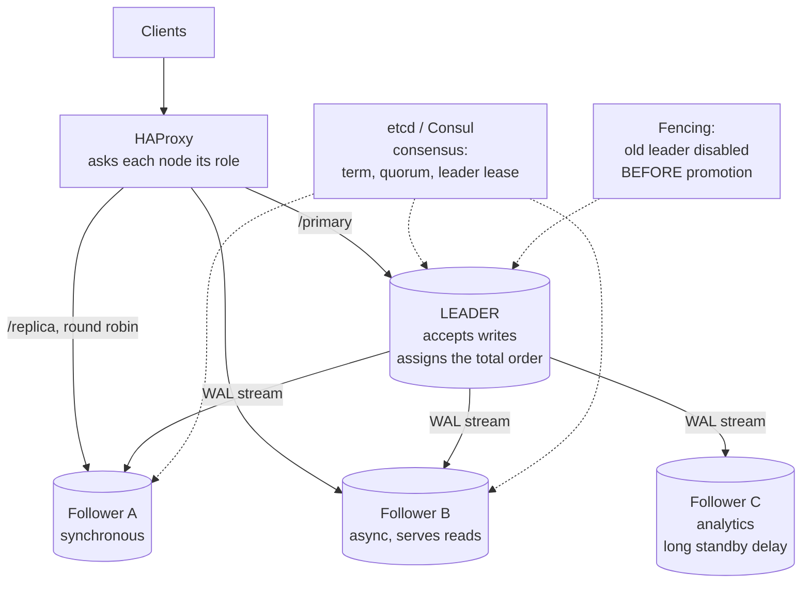

# Chapter 44: Leader-Follower Replication

## 44.1 Problem Statement

The tracking platform runs one leader and three followers. Chapter 41 set it up. It works, and then it does not, in five specific ways that all trace back to what "one leader" actually means.

**A follower falls so far behind that it is disconnected permanently** and must be rebuilt from a fresh base backup, which takes six hours on a 14 terabyte database. It fell behind because a single long-running report query on that follower blocked WAL replay for 40 minutes, and by the time it resumed, the leader had recycled the WAL it needed.

**A promotion takes 90 seconds and nobody knows why.** The follower has to replay everything it received but had not yet applied, and it had 40 seconds of backlog. Failover time is not the detection time plus the promotion command; it is that plus the replay backlog.

**Two followers disagree.** One was promoted, the other kept following the old leader for eleven seconds before the topology change reached it, and it now has writes the new leader does not. Reattaching it silently produces a follower that is not a copy of its leader.

**The application keeps writing to the old leader for 30 seconds after failover** because connection pools held established TCP connections that nobody closed and the old leader had not yet realised it was demoted.

**And an election happens during a routine deploy** because the leader's health check timed out under load, three health checkers agreed, and a perfectly healthy leader was replaced, costing 90 seconds of write unavailability for no reason.

The pattern: **leader-follower is simple to describe and the difficulty is entirely in the transitions.** Steady state is easy. Changing who the leader is, is where every incident lives.

## 44.2 Why This Problem Exists

**"One leader" is a claim about the whole system that no single node can verify.** Each node knows what it believes. Agreement requires a protocol, and protocols have failure modes.

**Followers replay serially while leaders write in parallel,** so a follower can be structurally unable to keep up with a leader under load. This is not a tuning problem, it is an asymmetry in the design.

**Replay competes with reads on the follower,** so using followers for queries directly causes the lag that makes them useless.

**Promotion is not instantaneous** because a follower must finish applying what it has before it can accept writes, and that backlog is invisible until you need it to be zero.

**And clients cache their idea of who the leader is,** in DNS, in connection pools, in configuration. Changing the leader does not change what the clients believe.

## 44.3 Real World Analogy

A ship with one captain and three officers who each keep a copy of the log.

**Only the captain gives orders.** That is what makes the system coherent: every instruction is issued by one person, so there is a single ordering of events and no possibility of contradictory commands.

**The officers copy the log continuously** so any of them could take over. They are not idle; they are staying current.

**An officer who gets absorbed in a long task stops copying.** When they look up, the captain has moved on many pages, and if the ship discards old pages after a while, that officer can no longer catch up from where they were and must copy the whole log from the beginning.

**Promoting an officer is not instant.** They must finish reading what they have before they can start giving orders, and if they were forty pages behind, that is how long the ship has no captain.

**And if the captain is merely in their cabin rather than overboard,** promoting an officer means two people giving orders. Which is why the ship needs an agreed rule, ideally involving a majority of the officers, and ideally with a way to physically prevent the old captain from issuing anything further.

## 44.4 Simple Explanation

**Leader-follower replication designates one node that accepts writes, and every other node copies from it.** It is also called primary-replica, master-slave, and single-leader, and it is what almost every relational database, and Kafka, and MongoDB, and Redis, actually do.

```
             writes
               |
               v
          +---------+
          | LEADER  |  the only node that accepts writes
          +---------+  assigns the ORDER of all changes
               |
      replication log, in order
               |
      +--------+--------+
      v        v        v
  follower  follower  follower     read-only, replaying the log
```

**Why one writer is worth the constraint:**

| Property | Why it follows from one leader |
|---|---|
| **A single total order** | One node sequences everything, so there is one history |
| **No write conflicts** | Two conflicting writes are ordered by the leader, not merged later |
| **Simple reasoning** | The leader's state is the truth; followers are behind, never different |
| **Constraints work** | Uniqueness and foreign keys are checked in one place |

Compare with Chapter 45's multi-leader, where two nodes can accept conflicting writes and something must resolve them afterward, and Chapter 46's leaderless, where there is no authoritative order at all.

**The cost, stated plainly:**

```
The leader is a bottleneck for writes.        (Chapter 42 is the answer)
The leader is a single point of failure.      (failover is the answer,
                                               and failover is the hard part)
```

**The three states of a node** are the mental model to hold:

```
LEADER    accepts writes, streams the log to followers
FOLLOWER  replays the log, serves reads, cannot write
CANDIDATE during an election, seeking votes to become leader
```

Everything difficult in this chapter is a transition between those states.

## 44.5 Technical Deep Dive

### 44.5.1 How a follower actually follows

Three phases, and each has its own failure mode.

**Phase 1: initial sync.** A new follower needs a complete copy before it can stream.

```bash
# Take a consistent base backup of the leader, streaming the WAL
# generated during the backup so the follower has a coherent starting point.
pg_basebackup -h leader.internal -D /var/lib/postgresql/data \
              -X stream -c fast -R --slot=follower_a
```

On a 14 terabyte database this takes hours, which is Section 44.1's first incident and the reason avoiding a rebuild matters so much.

**Phase 2: catch-up.** The follower replays WAL generated since the backup started. Its lag begins large and shrinks.

**Phase 3: streaming.** The follower is current and applies changes as they arrive, typically within milliseconds.

**The replay process is the constraint.** PostgreSQL's startup process applies WAL records largely serially, while the leader generated them from many concurrent backends. A leader with 40 parallel writers can produce WAL faster than one replay process can apply it, and no amount of follower hardware fixes an asymmetry that is architectural.

Mitigations that actually help:

| Mitigation | Effect |
|---|---|
| Fewer indexes on the follower | Impossible with physical replication; possible with logical |
| Faster storage on the follower | Replay is often I/O bound, so this helps |
| `recovery_prefetch` (PG 15+) | Prefetches referenced pages, materially faster replay |
| Reduce leader write rate | Batch writes, remove unnecessary indexes |
| Logical replication with parallel apply | Multiple apply workers, at the cost of physical fidelity |

**The query conflict problem** is Section 44.1's first incident and it is specific to using followers for reads:

```
Follower replays: "remove row version X, it is dead"
Follower is running: a query whose snapshot still needs row version X

Conflict. One of them must lose.
```

PostgreSQL's two options, both unpleasant:

```
max_standby_streaming_delay = 30s
  Pause replay for up to 30 seconds to let queries finish.
  -> replication lag grows by up to 30 s per conflict

max_standby_streaming_delay = 0
  Cancel the conflicting query immediately.
  -> users see "canceling statement due to conflict with recovery"

hot_standby_feedback = on
  The follower tells the leader which row versions it still needs,
  and the leader delays vacuuming them.
  -> no conflicts, but the LEADER now accumulates bloat because
     of a query running on a FOLLOWER. Chapter 37's vacuum problem,
     inflicted remotely.
```

There is no free option here. **A follower used for long analytical queries will either lag, cancel queries, or cause bloat on the leader.** The usual answer is a dedicated analytics follower with a generous delay, kept separate from the followers serving user traffic.

### 44.5.2 Replication slots and the rebuild cliff

Section 44.1's first incident happened because the leader recycled WAL the follower still needed.

```
Without a slot:
  leader keeps wal_keep_size worth of WAL, then recycles.
  A follower behind by more than that loses its position permanently.
  -> full rebuild, hours

With a slot:
  the leader retains WAL until the follower confirms consuming it.
  -> the follower can always catch up
  -> and the leader's disk fills if the follower never returns
```

The correct configuration bounds it:

```
max_slot_wal_keep_size = '200GB'    # cap retention; a follower beyond
                                     # this is sacrificed to protect the leader
```

That setting encodes a decision: **a follower that has fallen more than 200 gigabytes behind is going to be rebuilt anyway, and protecting the leader's disk matters more.** Making it explicit is better than discovering the leader is out of space.

### 44.5.3 Failover, step by step

```
1. DETECT      the leader is not responding
2. AGREE       a majority concurs it should be replaced
3. FENCE       make the old leader physically unable to accept writes
4. SELECT      choose the most up-to-date follower
5. PROMOTE     it finishes replaying, then opens for writes
6. REPOINT     other followers now follow the new leader
7. REDIRECT    clients connect to the new leader
8. RECOVER     the old leader rejoins as a follower, after rewind
```

**Step 1 is where false positives come from.** Section 44.1's fifth incident: a leader under load missed health checks and was replaced while healthy.

```
Detection is a trade between two errors:

  Aggressive (2 s timeout, 2 failures):
    fast recovery from real failures
    frequent unnecessary failovers, each costing write availability

  Conservative (10 s timeout, 5 failures):
    no spurious failovers
    50 seconds of downtime before a real failure is acted on

Right answer: conservative timeouts, PLUS checks that distinguish
"slow" from "dead". A leader responding slowly is not the same as
one whose process has exited or whose host is unreachable.
```

**Step 4 matters more than it looks.** Choosing the follower with the highest received log position minimises data loss. Choosing wrongly discards writes that another follower had.

```sql
-- Which follower is furthest ahead? This is the promotion candidate.
SELECT application_name, state,
       sent_lsn, write_lsn, flush_lsn, replay_lsn,
       pg_wal_lsn_diff(pg_current_wal_lsn(), replay_lsn) AS behind_bytes
FROM pg_stat_replication ORDER BY replay_lsn DESC;
```

**Step 5's duration is Section 44.1's second incident.** A follower with 40 seconds of received-but-unapplied WAL takes 40 seconds to become writable. **Failover time equals detection plus agreement plus replay backlog**, and only the last term is invisible on a dashboard, which is why it surprises people.

**Step 3 is the one that is skipped and should not be.** Fencing turns "the old leader is probably dead" into "the old leader definitely cannot write":

| Fencing method | Mechanism |
|---|---|
| STONITH | Power off the machine via its management interface |
| Storage fencing | Revoke its access to shared storage |
| Network fencing | Remove its route or revoke its credentials |
| Self-fencing | The leader detects lost quorum and demotes itself |

**Step 8's rewind** is what makes the old leader safely reusable:

```bash
# The old leader may have committed writes the new leader never got.
# pg_rewind rolls it back to the point of divergence and makes it a follower.
pg_rewind --target-pgdata=/var/lib/postgresql/data \
          --source-server='host=new-leader.internal'
```

**Those rolled-back writes are gone.** They were acknowledged to clients and they no longer exist, which is the asynchronous replication trade from Chapter 41 arriving at its conclusion. If that is unacceptable, the answer is a synchronous standby, decided before the failover rather than during it.

### 44.5.4 Election and consensus

Section 44.1's third incident, two followers disagreeing, is what consensus protocols exist to prevent.

**The naive approach fails:** each node independently decides the leader is dead and promotes itself or votes locally. During a partition, both sides do this.

**Raft is the standard answer** and its three mechanisms are worth knowing by name, because they appear in etcd, Consul, TiDB, CockroachDB, and Patroni's design.

**Terms.** Logical time. Every election increments a term number. A message from an older term is rejected outright, so a returning old leader cannot issue commands.

```
term 7: node A is leader
        partition
term 8: nodes B, C, D elect B (majority of 5)
        A returns, still claiming term 7
        -> every node rejects A's messages: "your term is stale"
        -> A learns term 8 exists and becomes a follower
```

**Majority quorum.** A candidate needs votes from more than half the cluster. **Only one majority can exist at a time,** which is a mathematical guarantee rather than a heuristic, so two leaders in the same term are impossible.

```
5 nodes, partitioned 3 and 2:
  the 3 side can reach a majority -> elects a leader
  the 2 side cannot                -> stays leaderless
```

**Log completeness.** A candidate only receives a vote if its log is at least as up to date as the voter's. A node missing committed entries cannot become leader, so committed writes are never lost by a valid election.

**The practical consequences for your cluster:**

| Nodes | Majority | Failures tolerated |
|---|---|---|
| 2 | 2 | **0.** Never do this |
| 3 | 2 | 1 |
| 4 | 3 | 1. No better than 3, more expensive |
| 5 | 3 | 2 |

**Even numbers gain nothing,** which is why clusters are 3 or 5. And a two-node cluster with automatic failover cannot be made safe, which is why a witness or arbiter node exists: a lightweight process that votes but stores no data.

Patroni is the standard implementation for PostgreSQL, using etcd or Consul for the consensus:

```yaml
# Patroni. The consensus store, not the database, decides who leads.
scope: tracking-cluster
postgresql:
  parameters:
    synchronous_commit: 'on'
    max_slot_wal_keep_size: '200GB'
bootstrap:
  dcs:
    ttl: 30                      # leader lease duration
    loop_wait: 10                # health check interval
    retry_timeout: 10
    maximum_lag_on_failover: 1048576   # refuse to promote a follower
                                       # more than 1 MB behind
```

**`maximum_lag_on_failover` is the setting that encodes your data loss tolerance.** It refuses to promote a follower that is too far behind, choosing continued unavailability over silent data loss. That is a policy decision and it belongs in configuration where someone can see it.

### 44.5.5 Client redirection

Section 44.1's fourth incident. Promotion is useless while clients still talk to the old leader.

| Method | Redirect time | Problem |
|---|---|---|
| DNS with low TTL | 30 s to minutes | Clients and JVMs cache DNS regardless of TTL |
| Virtual IP | Seconds | Requires layer 2 adjacency; awkward across zones |
| **Proxy (HAProxy, PgBouncer)** | **Under a second** | One more tier, which must itself be redundant |
| Client-side discovery | Depends | Every client must implement it correctly |

**The JVM DNS caching trap is worth naming explicitly**, because it catches Java teams repeatedly:

```java
// The JVM caches DNS lookups, by default FOREVER for successful ones
// in some configurations. A failover changes the DNS record and the
// application keeps connecting to the old leader indefinitely.
java.security.Security.setProperty("networkaddress.cache.ttl", "5");
java.security.Security.setProperty("networkaddress.cache.negative.ttl", "1");
```

**Established connections are the other half.** A connection pool holding open TCP connections to the old leader keeps using them, and if the old leader has not yet been demoted, those writes succeed and are subsequently lost. Fencing solves this properly: a fenced leader cannot accept the writes at all.

The standard arrangement routes through a proxy that queries the database's own view of its role:

```
# HAProxy asks each node "are you the leader?" via Patroni's REST API.
# The database's own state decides routing, not a separate config.
backend postgres_write
    option httpchk GET /primary
    server pg1 pg1.internal:5432 check port 8008
    server pg2 pg2.internal:5432 check port 8008
    server pg3 pg3.internal:5432 check port 8008

backend postgres_read
    option httpchk GET /replica
    balance roundrobin
    server pg1 pg1.internal:5432 check port 8008
    server pg2 pg2.internal:5432 check port 8008
```

### 44.5.6 Application handling

```java
@Service
class ShipmentWriteService {

    // A failover produces a window where writes fail. Retrying with
    // backoff turns a 15-second outage into a slow request instead
    // of an error, PROVIDED the operation is idempotent (Chapter 20).
    @Retryable(
        retryFor = { CannotGetJdbcConnectionException.class,
                     TransientDataAccessResourceException.class },
        maxAttempts = 5,
        backoff = @Backoff(delay = 500, multiplier = 2, maxDelay = 8000))
    @Transactional
    public void recordScan(String idempotencyKey, ScanEvent event) {
        // The idempotency key is what makes the retry safe: a write that
        // succeeded on the old leader and a retry on the new one must
        // not produce two events.
        repository.insertIfAbsent(idempotencyKey, event);
    }
}
```

```java
// Detect a read-only connection explicitly. A follower reached by
// mistake reports this, and it is a clearer signal than a generic error.
@Component
class LeaderHealthIndicator implements HealthIndicator {
    @Override public Health health() {
        Boolean inRecovery = jdbc.queryForObject("SELECT pg_is_in_recovery()", Boolean.class);
        return Boolean.TRUE.equals(inRecovery)
            ? Health.down().withDetail("role", "follower").build()
            : Health.up().withDetail("role", "leader").build();
    }
}
```

**Two principles.** Writes must be idempotent, because failover means retries against a different node. And the application should be able to state which role it is talking to, because "I thought I was writing to the leader" is the root of several incidents.

## 44.6 Architecture Diagram



```
   clients
      |
   HAProxy   (asks each node "are you the leader?")
      |
   +--+----------------------------------------+
   | LEADER: the ONLY writer.                  |
   |   assigns the total order of all changes  |
   |   WAL --+--> follower A (sync: commit waits here)
   |         +--> follower B (async, serves user reads)
   |         +--> follower C (analytics, long standby delay,
   |                          isolated so its long queries do
   |                          not lag the user-facing followers)
   +-------------------------------------------+
      ^
   etcd/Consul: terms, majority quorum, leader lease
      -> only one majority can exist, so only one leader per term
   fencing: the old leader is disabled BEFORE the new one starts
```

## 44.7 Request Flow

```mermaid
sequenceDiagram
    participant C as Client
    participant HA as HAProxy
    participant L as Leader
    participant FA as Follower A
    participant E as etcd

    Note over C,E: Steady state
    C->>HA: write
    HA->>L: route to leader
    L->>L: WAL, fsync
    L->>FA: stream WAL
    FA-->>L: flushed
    L-->>C: committed
    L->>E: renew leader lease (every 10 s)

    Note over L,E: Leader fails
    L--xE: lease not renewed
    E->>E: lease expires after ttl=30 s
    FA->>E: request election, term 8
    E-->>FA: majority grants; A's log is most complete
    Note over FA: FENCE the old leader first
    FA->>FA: replay remaining backlog (this is the hidden cost)
    FA->>FA: promote: accept writes
    FA->>E: register as leader, term 8

    HA->>FA: health check -> /primary now returns 200
    C->>HA: write (retried by the client)
    HA->>FA: route to the NEW leader
    FA-->>C: committed
```

1. **All writes go to one node,** which assigns the order everything else replays.
2. **The leader holds a lease in the consensus store,** renewed continuously. Losing the lease is the failure signal.
3. **Election requires a majority and log completeness,** which together make two leaders in one term impossible.
4. **Fencing precedes promotion,** or the old leader keeps accepting writes.
5. **Replay of the backlog happens before the new leader opens,** and that duration is the part nobody measures.
6. **The proxy discovers the change from the nodes themselves,** rather than from a separate configuration that could disagree.

## 44.8 Internal Components

| Component | Role | Failure mode | Guard |
|---|---|---|---|
| Leader | Sole writer, assigns total order | SPOF for writes | Fast, correct failover |
| WAL sender / receiver | Streams the log | Network saturation, growing lag | Monitor byte lag; cascade if needed |
| Replay process | Applies WAL on the follower | Serial, so it cannot match a parallel leader | Fast storage, `recovery_prefetch` |
| Replication slot | Retains WAL for a follower | Abandoned, so the leader's disk fills | `max_slot_wal_keep_size` |
| Consensus store | Holds term, lease, membership | Its own quorum can be lost | 3 or 5 nodes, separate failure domains |
| Term number | Rejects stale leaders | Absent, so a returning leader is obeyed | Use a real consensus implementation |
| Quorum | Ensures one leader | Even node counts, or 2-node clusters | Odd counts; add a witness |
| Fencing | Disables the old leader | Skipped, so split brain | STONITH or storage revocation |
| `maximum_lag_on_failover` | Bounds data loss on promotion | Unset, so a far-behind follower is promoted | Set it to your loss tolerance |
| Proxy | Routes clients to the current leader | Stale routing after failover | Health checks against the node's own role |
| Query conflict handling | Replay versus reads on followers | Cancelled queries, or leader bloat | Dedicated analytics follower |

## 44.9 Production Example

**Kafka's partition leadership** is leader-follower applied per partition rather than per cluster, which is a design worth studying. Each partition has one leader and a set of in-sync replicas, and the ISR list is the set that is sufficiently caught up to be promotable. A replica falling behind is removed from the ISR, which is Section 44.5.4's `maximum_lag_on_failover` expressed as a continuous membership property rather than a promotion-time check. Producers can require acknowledgement from all in-sync replicas, giving the guarantee that any promotable replica has every acknowledged write.

**GitHub's orchestrator** and **Patroni** are the two widely used implementations of Section 44.5.4 for MySQL and PostgreSQL respectively. Both externalise the consensus decision to a separate store rather than having the database nodes decide among themselves, for the reason Section 44.1's third incident illustrates.

**MongoDB replica sets** implement a Raft-like protocol directly, with terms, majority elections, and log-completeness voting, plus a rollback mechanism equivalent to `pg_rewind` for a returning primary that had extra writes.

**And every managed cloud database** does exactly this behind the scenes. The value they provide is not the replication, which is standard, but the failover automation, the fencing, and the routing layer, which are the parts that are hard to get right.

## 44.10 Advantages

- **A single total order,** which makes reasoning about the system tractable and makes constraints enforceable.
- **No write conflicts by construction,** since one node sequences everything.
- **Simple mental model:** followers are behind the leader, never different from it.
- **Well understood and universally implemented,** with mature tooling for the hard parts.
- **Read scaling is straightforward,** by adding followers (Chapter 47).
- **Fast recovery** compared with restoring from a backup.
- **The failover machinery is a solved problem** if you use Patroni, orchestrator, or a managed service.

## 44.11 Limitations

- **The leader is a write bottleneck,** and adding followers does not help. Chapter 42 is the only answer.
- **The leader is a single point of failure for writes,** with an unavoidable failover window.
- **Follower replay is serial** and can be structurally unable to keep up with a parallel leader.
- **Failover time includes the replay backlog,** which is invisible until it matters.
- **Asynchronous replication loses acknowledged writes** on promotion.
- **Reads on followers cause conflicts** that cost either lag, cancelled queries, or leader bloat.
- **Clients cache leadership,** so redirection is its own problem.
- **A two-node cluster cannot fail over safely,** requiring a third voter.

## 44.12 Trade-offs

| Choice | Gain | Cost | Remove it and |
|---|---|---|---|
| Single leader | One total order, no conflicts, constraints work | Write bottleneck and a SPOF | Multi-leader (Ch 45), and conflict resolution |
| Automatic failover | Recovery in seconds | Spurious failovers; split-brain risk without fencing | Downtime measured in human response time |
| Aggressive detection | Fast recovery from real failures | Healthy leaders replaced under load | Slow recovery from genuine failures |
| `maximum_lag_on_failover` | Bounds data loss | Refuses to promote, so longer unavailability | Silent loss of acknowledged writes |
| Synchronous follower | No loss on promotion | Every write pays a round trip | Async, and lost writes on failover |
| `hot_standby_feedback` | No cancelled queries on followers | Bloat accumulates on the LEADER | Queries cancelled, or replication lag |
| Proxy routing | Sub-second redirection | Another tier to make redundant | DNS caching, and minutes of misrouting |
| More followers | Read capacity, promotion candidates | WAL bandwidth, storage, operations | Fewer options during failure |

The trade at the core: **you accept a write bottleneck and a failover window in exchange for never having to resolve a conflict.** For most systems that is overwhelmingly the right trade, which is why single-leader is the default nearly everywhere.

## 44.13 Common Mistakes

- **Two-node clusters with automatic failover.** No majority is possible, so it cannot be safe.
- **Promotion without fencing,** which is split brain waiting for a partition.
- **Detection thresholds too aggressive,** replacing healthy leaders under load.
- **Not measuring the replay backlog,** so failover time is a surprise.
- **Promoting whichever follower is convenient** rather than the most current one.
- **Reattaching an old leader without a rewind,** producing a follower with extra writes.
- **DNS-based redirection,** especially with the JVM's caching behaviour.
- **Long analytics queries on a user-facing follower,** causing lag or cancellations.
- **`hot_standby_feedback = on` without watching leader bloat.**
- **Non-idempotent writes,** so retries during failover duplicate data.
- **Abandoned replication slots** filling the leader's disk.
- **Never rehearsing failover,** so the first real one is also the first attempt.

## 44.14 Interview Questions

1. Why does having a single leader make the system easier to reason about?
2. Walk through a failover from detection to clients writing again. Where does the time go?
3. Why can two leaders never exist in the same Raft term?
4. Why is a two-node cluster unable to fail over safely, and what is the minimal fix?
5. What does fencing accomplish that quorum does not?
6. A follower is 40 seconds behind. What does that mean for promotion?
7. Why might a follower be structurally unable to keep up with its leader?
8. What happens to writes acknowledged by the old leader but not replicated?
9. Explain the three options for query conflicts on a follower and their costs.
10. Your leader was replaced during a deploy and it was healthy. What went wrong?
11. Why must writes be idempotent in a system with automatic failover?

## 44.15 Production Best Practices

- **Use Patroni, orchestrator, or a managed service.** Do not implement failover yourself.
- **Three or five nodes in the consensus store,** never two, and in separate failure domains.
- **Always fence before promoting.**
- **Set `maximum_lag_on_failover`** to encode your data loss tolerance explicitly.
- **Keep at least one synchronous follower** if losing acknowledged writes is unacceptable.
- **Route through a proxy** that health-checks the nodes' own view of their role.
- **Set the JVM DNS TTL** if anything in your stack resolves by name.
- **Monitor the replay backlog,** not just lag, since it is your true failover time.
- **Isolate analytics onto a dedicated follower** with a generous standby delay.
- **Bound WAL retention** with `max_slot_wal_keep_size` and alert on inactive slots.
- **Make every write idempotent** so failover retries are safe.
- **Rehearse failover monthly and time it.** That number is your real RTO, and it will not be what you assumed.

## 44.16 Summary

Leader-follower replication designates one node as the sole writer and has every other node copy from it. That single constraint is what buys the property everything else depends on: **a single total order of changes.** With one node sequencing every write, there are no conflicts to resolve, no divergent histories to merge, and constraints like uniqueness can be checked in one place and be true everywhere. It is why nearly every database you will use works this way.

Steady state is genuinely simple. The leader writes to its log, followers stream and replay it, and followers are behind the leader but never different from it. The difficulty is entirely in the transitions, and every incident in Section 44.1 is a transition problem.

The subtleties worth carrying. **Followers replay serially while leaders write in parallel**, so a busy leader can outpace a follower structurally rather than through misconfiguration. **Failover time includes the replay backlog**, so a follower forty seconds behind takes forty seconds to become writable, and that term is invisible on every dashboard that shows lag as a single number. **Reads on followers conflict with replay**, and the three available responses all cost something: growing lag, cancelled user queries, or bloat inflicted on the leader by a query running elsewhere.

And the transition that produces the worst outcomes is promotion. You cannot distinguish a dead leader from a slow or partitioned one, so promotion is always a bet. Consensus protocols make the bet safe through three mechanisms: **terms**, so a returning old leader is rejected rather than obeyed; **majority quorum**, so only one leader can exist because only one majority can exist; and **log completeness**, so a follower missing committed writes cannot win an election. On top of that, **fencing** converts "the old leader is probably dead" into "the old leader definitely cannot write", which is the difference between a clean failover and Section 44.1's third incident.

The practical conclusion is short. Use Patroni or an equivalent rather than building this. Run an odd number of consensus nodes and never two. Fence before promoting. Set the maximum acceptable promotion lag explicitly, because it is a data loss policy rather than a tuning parameter. Make writes idempotent so retries across a failover are safe. And rehearse the failover, because the number you get will not be the number you assumed.

## 44.17 Quick Revision Notes

- **One leader accepts writes and assigns the total order.** Followers replay it.
- **The benefit is no conflicts and enforceable constraints.** The cost is a write bottleneck and a SPOF.
- **Follower phases:** initial sync (base backup), catch-up, streaming.
- **Replay is serial; leader writes are parallel.** A follower can be structurally unable to keep up.
- **Query conflicts on followers:** grow lag, cancel queries, or `hot_standby_feedback` and bloat the leader. No free option.
- **Failover = detect + agree + fence + select + replay backlog + promote + repoint + redirect.**
- **The replay backlog is the hidden term** in failover time.
- **Raft's three guarantees:** terms reject stale leaders, majority makes two leaders impossible, log completeness prevents losing committed writes.
- **3 or 5 nodes. Never 2.** Even counts gain nothing.
- **Fence before promoting,** always.
- **`maximum_lag_on_failover`** encodes your data loss tolerance.
- **`pg_rewind`** makes an old leader safely reusable, discarding its extra writes.
- **Proxy for redirection,** not DNS. Set the JVM DNS TTL.
- **Writes must be idempotent** so failover retries are safe.

## 44.18 Mini Quiz

1. Why does a single leader eliminate write conflicts?
2. A follower shows 40 seconds of lag. What does that mean for failover time?
3. Why can two nodes never both be leader in the same Raft term?
4. What does fencing add that a quorum decision does not?
5. Why might a follower be unable to keep up with its leader no matter what hardware you give it?
6. What are the three ways to handle a query conflict on a follower, and what does each cost?
7. Why must writes be idempotent when automatic failover is enabled?

**Answers**

1. Because every write passes through one node, which assigns each change a position in a single sequence before anything else sees it. Two writes that would conflict are simply ordered, one after the other, and the second one observes the result of the first, so there is never a situation where two versions of the truth must be reconciled afterward. This is also what makes constraints work: a uniqueness check happens at one place against one state, so it cannot be satisfied simultaneously on two nodes. Chapter 45's multi-leader gives up exactly this property, and everything difficult about that chapter follows from it.

2. It means promotion will take approximately forty seconds beyond the detection and agreement time, because a follower cannot begin accepting writes until it has applied everything it has already received. The lag figure is measuring precisely that backlog, so it is a direct estimate of the promotion delay. This is the term people omit when they estimate failover time as detection plus a promotion command, and it is why a cluster with well-tuned detection can still take ninety seconds to recover. It also means that reducing follower lag is not only about read freshness, it is about recovery time, which is a much stronger argument for taking it seriously.

3. Because becoming leader in a term requires votes from a strict majority of the cluster, each node votes at most once per term, and two disjoint majorities cannot exist in the same set. In a five-node cluster a candidate needs three votes, and there is no way to partition five nodes so that two groups each contain three. If the network splits three against two, only the larger side can elect anyone, and the smaller side remains leaderless until the partition heals. This is a mathematical property rather than a probabilistic safeguard, which is what makes consensus protocols trustworthy in a way that heuristic failure detection is not.

4. Quorum controls who is permitted to become the new leader, but it does nothing to the old one, which may still be running, still believe it is leader, and still be reachable by some clients. That node has no way to learn it has been replaced while it is partitioned, so it continues accepting writes that will be discarded. Fencing removes the possibility physically rather than reasoning about it, by powering the machine off, revoking its storage access, or removing its network route before the new leader opens for writes. It converts an inference about the old leader's state into an enforced fact, and it is the step whose absence produces the split-brain incidents that take days to reconcile.

5. Because the leader generates its write-ahead log from many backends running concurrently, while the follower applies that log through a largely serial replay process. A leader with forty parallel writers can produce records faster than one replay process can apply them, and that asymmetry is architectural rather than a matter of provisioning. Faster storage and features like WAL prefetching narrow the gap because replay is often I/O bound, but they do not eliminate it. The genuine fixes reduce the leader's write volume, by removing unnecessary indexes or batching writes, or move to logical replication with parallel apply workers, which trades physical fidelity for concurrency.

6. Pause replay to let the query finish, which allows the query to succeed but grows replication lag by up to the configured delay for every conflict. Cancel the query immediately, which keeps lag minimal but surfaces a confusing error to users whose query was terminated by an unrelated background process. Or enable feedback from the follower to the leader, so the leader delays vacuuming the row versions the follower's queries still need, which eliminates conflicts entirely but causes bloat to accumulate on the leader because of a query running on a different machine. There is no option without a cost, which is why the practical answer is a dedicated analytics follower configured with a generous delay and kept out of the pool serving user traffic.

7. Because a failover means a client's write may have been received and even committed by the old leader without the client learning the outcome, and the retry will land on a different node. If the write was replicated before the leader failed, the retry duplicates it; if it was not, the retry is the only copy. Without idempotency, the safe-looking behaviour of retrying on connection failure silently creates duplicate records, and the failure is intermittent and correlated with incidents, which makes it hard to find. An idempotency key checked at insertion time makes the retry produce the same result regardless of what the old leader did, which is what turns a failover from a data-integrity event into a latency event.

## 44.19 Hands-on Exercise

**Part 1: build the cluster.** Set up three PostgreSQL nodes with Patroni and etcd. Confirm one leader and two followers, and confirm writes are rejected on followers.

**Part 2: time a real failover.** Kill the leader process. Record detection time, election time, replay time, and time until the first successful client write. Break the total into its components.

**Part 3: create a replay backlog.** Drive heavy writes so a follower falls thirty seconds behind, then kill the leader. Compare this failover time with Part 2's.

**Part 4: cause a false failover.** Set aggressive detection thresholds and load the leader until health checks time out. Watch a healthy leader get replaced. Then tune the thresholds and confirm it stops.

**Part 5: split brain, then prevent it.** Disable fencing. Partition the leader from etcd while keeping a client able to reach it. Write to both old and new leaders and observe the divergence. Enable fencing and repeat.

**Part 6: lose writes.** With asynchronous replication only, write continuously and kill the leader. Count acknowledged writes missing after promotion. Add a synchronous follower and confirm the count is zero.

**Part 7: cause a query conflict.** Run a long query on a follower while the leader updates and vacuums the same rows. Observe the cancellation. Raise `max_standby_streaming_delay` and watch lag grow instead. Then enable `hot_standby_feedback` and watch bloat appear on the leader.

**Part 8: rewind an old leader.** After a failover, bring the old leader back and confirm it has writes the new leader lacks. Run `pg_rewind` and verify it rejoins correctly, then identify exactly which writes were discarded.

## 44.20 Further Reading

- *In Search of an Understandable Consensus Algorithm*, Ongaro and Ousterhout, 2014. The Raft paper, and it is genuinely readable.
- Patroni's documentation, particularly on failover behaviour and `maximum_lag_on_failover`.
- Kafka's replication design documentation, for in-sync replicas as a continuous version of promotion eligibility.
- *Designing Data-Intensive Applications*, Martin Kleppmann, chapters 5 and 9.
- GitHub's orchestrator documentation and their published failover post-mortems.
- PostgreSQL's documentation on hot standby, query conflicts, and `pg_rewind`.
- Chapter 41 of this book for replication generally, Chapter 45 for what happens with more than one leader, Chapter 46 for no leader at all, and Chapter 47 for using followers to serve reads.

---

**Next chapter: Chapter 45, Multi-Leader Replication.** Removing the constraint that made this chapter simple: what you gain by letting several nodes accept writes, why conflict resolution is unavoidable rather than an implementation detail, and the small number of situations where the trade is genuinely worth it.
