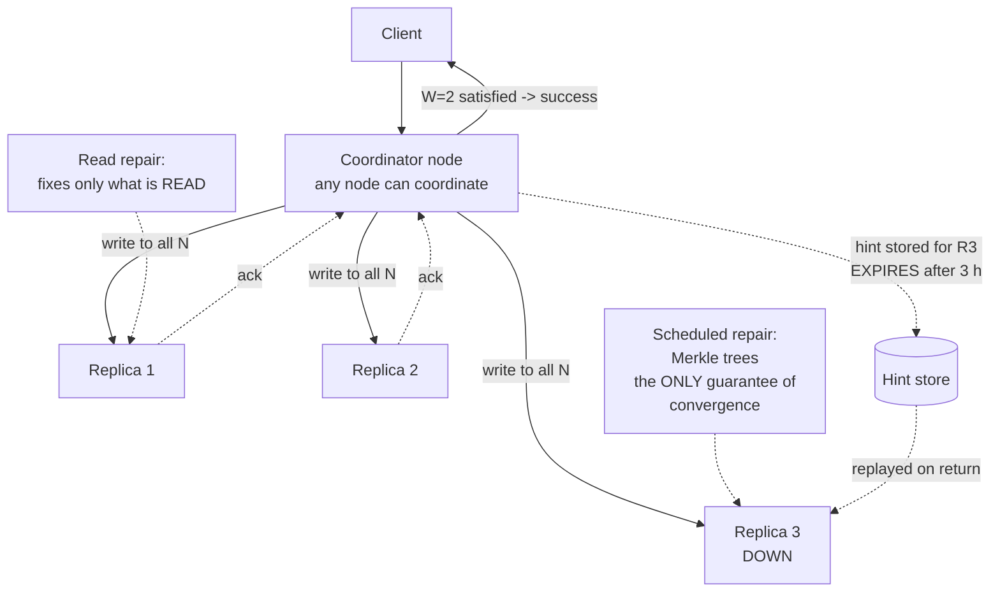

# Chapter 46: Leaderless Databases

## 46.1 Problem Statement

The tracking platform moves its event stream to Cassandra. Fourteen billion scan events, append-heavy, read by shipment, and the write volume had outgrown a single leader. The team configures a three-node cluster and starts writing.

**A scan event is written and then not found, milliseconds later.** The write went to nodes A and B, the read went to node C, and C had not received it yet. There is no leader to ask, so "the latest value" is not a question the system answers unless you configure it to.

**They set everything to `QUORUM` and the write latency triples,** because a quorum write now waits for two of three nodes across two availability zones instead of one local node.

**A node is down for four hours and nobody notices,** because writes at `QUORUM` still succeed with two nodes. The cluster is one failure from data loss and every dashboard is green.

**When the node returns, it serves stale data for six hours,** because nothing repaired it. Hinted handoff had expired, read repair only fixes rows that are read, and nobody had run a repair.

**And a counter is wrong.** Two clients incremented concurrently, both wrote a value derived from the same read, and last-write-wins kept one. The count is short by several thousand and there is no record of what was lost.

The pattern: **a leaderless system does not decide correctness for you, it gives you a dial and expects you to know where to set it.** Every incident above is a dial left at its default.

## 46.2 Why This Problem Exists

**With no leader, there is no authoritative "current value".** Each replica has its own version, and the answer to a read is whatever the replicas you happened to contact say it is.

**Correctness becomes arithmetic you configure per query,** rather than a property the database provides. `R + W > N` is not a fact about the system, it is a choice you make and can get wrong.

**Availability is the design goal, and it hides failure.** The system continues working with nodes down, which is the point, and it also means a degraded cluster looks identical to a healthy one unless you monitor the right thing.

**Anti-entropy is not automatic.** Replicas diverge and the mechanisms that reconcile them are partial, expiring, or manual.

**And read-modify-write is unsafe by construction.** Without a leader to serialise, two clients can read the same value, compute from it, and write, and one result is lost with no error.

## 46.3 Real World Analogy

Three people who each keep a copy of the shift roster, with no manager.

**Anyone can update any copy.** Tell one person the roster changed and they write it down. They will tell the others when they see them.

**How many people must you tell for the update to stick?** Tell one and it is fast, and if that person is off sick tomorrow the change may be lost. Tell two of the three and any two people you later ask will include at least one who knows. That overlap is the whole mechanism.

**How many must you ask to be sure of the current roster?** Ask one and you may get someone who has not heard. Ask two and, if the update was told to two, at least one of the two you ask must have it. Then take whichever version is more recent.

```
Told 2 of 3, asked 2 of 3: the two groups MUST overlap by at least one.
2 + 2 > 3. That is the entire guarantee.
```

**Nobody notices when one person is away,** because two are enough to keep working. Which is excellent until a second person is away and it turns out nobody has been checking.

**And the person who was away comes back not knowing what changed.** Unless someone deliberately brings them up to date, they will confidently give out old information.

**The case this arrangement cannot handle:** two people are each told "add one shift" at the same time, and each writes down a total. Both totals are the old value plus one. Whichever is recorded last, one addition is gone.

## 46.4 Simple Explanation

**In a leaderless system, every replica accepts reads and writes, and correctness comes from overlapping quorums rather than from a designated authority.**

```
LEADER-BASED (Ch 44)          LEADERLESS (this chapter)
    writes                     writes go to ALL replicas
      |                        client (or coordinator) waits for W acks
   [LEADER]                          |
      |                        +-----+-----+
   followers                   v     v     v
                              R1    R2    R3
                        reads contact R replicas, newest version wins
```

**The three numbers that define everything:**

| | Meaning |
|---|---|
| **N** | Replication factor: how many copies of each piece of data exist |
| **W** | How many replicas must acknowledge a write before it is successful |
| **R** | How many replicas must respond to a read |

**The rule:**

```
R + W > N   guarantees the read set and write set OVERLAP,
            so at least one replica you read has the latest write.

N=3, W=2, R=2   ->  2+2 > 3   strong-ish consistency, tolerates 1 failure
N=3, W=3, R=1   ->  3+1 > 3   fast reads, writes fail if ANY node is down
N=3, W=1, R=1   ->  1+1 < 3   fastest, eventually consistent, may read stale
N=3, W=1, R=3   ->  1+3 > 3   fast writes, slow reads
```

**The trade you are configuring, per query:**

```
Higher W: safer writes, slower writes, less write availability
Higher R: fresher reads, slower reads, less read availability
R + W > N: consistency
R + W <= N: availability and speed, with staleness
```

**Why anyone chooses this:**

| Property | Why leaderless gives it |
|---|---|
| **No failover** | No leader to fail; a dead node is just one fewer replica |
| **Write availability under partition** | Any reachable replicas can accept a write |
| **Linear write scaling** | Add nodes, add capacity, no leader bottleneck |
| **Multi-region symmetry** | Every region writes locally, no home region needed |
| **Tunable per operation** | One application can have both fast and safe queries |

That first row is the real draw. Chapter 44's entire second half was failover, and leaderless systems simply do not have that problem.

## 46.5 Technical Deep Dive

### 46.5.1 Quorums, and where the guarantee leaks

The overlap argument is sound and its guarantee is narrower than people assume.

```
N=3, W=2, R=2

write: reaches R1, R2      (R3 missed it, or was slow)
read:  contacts R2, R3
       R2 has v2, R3 has v1
       -> newest timestamp wins -> v2. Correct.

Any 2 of {R1,R2} intersects any 2 of {R1,R2,R3}. Guaranteed.
```

**Where it does not hold, which is the important part:**

**Concurrent writes are not ordered by quorums.** Two writes both reaching a quorum concurrently still conflict, and resolution falls back to last-write-wins with all of Chapter 45's problems. **`R + W > N` gives you freshness, not serialisability.**

**Sloppy quorums break the overlap entirely.** When the "home" replicas for a key are unreachable, some systems write to whatever nodes are available instead:

```
Home replicas for key K: R1, R2, R3   (all unreachable from this client)
Sloppy quorum writes to: R7, R8       (not home nodes at all)

The write "succeeded" at W=2, and no home replica has it.
A subsequent read of R1, R2 finds nothing.

This is availability bought by voiding the guarantee, and it is
often the default. It is called HINTED HANDOFF and the hints
must be delivered before the guarantee returns.
```

**A failed write is not rolled back.** A write to N=3, W=3 that reaches two nodes and fails on the third returns an error to the client, and **the two writes remain**. A subsequent read may return the value of a write that reported failure.

**Read repair only fixes what is read.** Rows nobody reads stay divergent indefinitely.

So the honest statement: **`R + W > N` gives you read-your-writes on a single object under non-concurrent access with strict quorums, and nothing more.** That is genuinely useful and it is not the same as Chapter 19's strong consistency.

### 46.5.2 Anti-entropy: three mechanisms, none sufficient alone

Section 46.1's fourth incident. Replicas diverge and three mechanisms bring them back.

**1. Hinted handoff.** When a replica is down, the coordinator stores a hint and delivers it when the node returns.

```
R3 is down. Write arrives.
  -> R1, R2 store the data
  -> coordinator stores a HINT for R3
  -> R3 returns, hints are replayed

Limitation: hints EXPIRE. Cassandra's default is 3 hours.
A node down for four hours (Section 46.1) comes back missing
everything, with no error and no indication.
```

**2. Read repair.** On a read, if replicas disagree, the coordinator writes the newest version back to the stale ones.

```
Foreground: fix the replicas that were read, before responding.
Background: sample a percentage of reads and repair asynchronously.

Limitation: only repairs data that is READ. In a workload where
most rows are written once and read rarely, most divergence is
never touched.
```

**3. Anti-entropy repair.** A full comparison using Merkle trees, run as a scheduled operation.

```bash
# The only mechanism that guarantees convergence.
# It must be scheduled; it does not happen on its own.
nodetool repair -pr    # primary range only, run on every node in rotation
```

Merkle trees make this tractable: each node builds a hash tree over its data, nodes compare trees top down, and only subtrees that differ are exchanged. Comparing a terabyte becomes exchanging a few kilobytes of hashes plus the actual differences.

**The operational rule that Section 46.1's cluster was missing:**

> **Repair must complete within `gc_grace_seconds`, or deleted data can resurrect.**

```
A delete writes a tombstone. Tombstones are purged after
gc_grace_seconds (default 10 days).

If a node was down when the delete happened, and repair does not
reach it before the tombstone is purged elsewhere, that node still
holds the original row. It then propagates it back as "new" data.

THE DELETED ROW COMES BACK. This is zombie data, and it is why
scheduled repair is not optional maintenance.
```

### 46.5.3 Detecting concurrency: vector clocks versus timestamps

Chapter 45's problem, appearing again with different answers.

**Cassandra uses timestamps and last-write-wins.** Every column carries a write timestamp, the highest wins, and concurrent writes silently lose one. Simple, and it inherits every problem from Chapter 45.5.2: clock skew between nodes can order writes backwards, and there is no record of what was discarded.

**Dynamo and Riak use vector clocks** and can return siblings:

```
Write from client A: vc = {node1: 1}
Write from client B: vc = {node2: 1}

Neither dominates -> genuinely concurrent
-> the read returns BOTH versions
-> the application decides
```

This is more correct and pushes work into the application, which is the same trade Chapter 45 described.

**The practical consequence for Cassandra users:**

```
NEVER do read-modify-write. It is unsafe by construction.

  BAD:  read count, add 1, write count
        -> two clients both read 41, both write 42, one increment lost
        -> Section 46.1's fifth incident

  GOOD: use a counter column type, which is a CRDT internally
        use an append-only model and aggregate on read
        use a lightweight transaction (below), and pay for it
```

**Lightweight transactions** provide linearisable compare-and-set via Paxos, for the cases that genuinely need it:

```sql
-- Paxos consensus for this one operation. Four round trips.
-- Roughly an order of magnitude slower than a normal write.
INSERT INTO shipments (tracking_code, customer_id)
VALUES ('TRK9F31', 88)
IF NOT EXISTS;

UPDATE slots SET assigned = true
WHERE slot_id = 7
IF assigned = false;
```

**Use them sparingly and never in a hot path.** They reintroduce coordination, which is precisely what the architecture exists to avoid, and mixing them with normal writes on the same partition produces surprising behaviour.

### 46.5.4 Where the data goes

Leaderless systems place replicas using consistent hashing (Chapter 50).

```
The token ring. Each node owns ranges of a hash space.

              node A
             /      \
      node D          node B
             \      /
              node C

key -> hash -> position on the ring
     -> walk clockwise, take the next N distinct nodes
     -> those are the replicas

Adding a node takes over part of the ring: only its range moves,
not the whole keyspace. This is why scaling is undramatic.
```

**Replica placement must be topology-aware,** or all three replicas can land in one rack or one availability zone:

```
# NetworkTopologyStrategy: 3 replicas in EU, 3 in US, each
# spread across distinct racks within the datacentre.
CREATE KEYSPACE tracking WITH replication = {
  'class': 'NetworkTopologyStrategy', 'eu-west': 3, 'us-east': 3
};
```

**And consistency levels become datacentre-aware**, which is what makes multi-region practical:

| Level | Meaning |
|---|---|
| `ONE` / `TWO` / `THREE` | That many replicas, anywhere |
| `QUORUM` | Majority of all replicas across all datacentres |
| **`LOCAL_QUORUM`** | **Majority within the local datacentre only** |
| `EACH_QUORUM` | A quorum in every datacentre. Writes only |
| `ALL` | Every replica. One node down means failure |

**`LOCAL_QUORUM` is the setting most multi-region deployments should use.** It gives quorum semantics within a region at local latency, and accepts cross-region eventual consistency, which is Chapter 15's PACELC trade made explicit in a configuration parameter.

### 46.5.5 Application patterns

```java
@Repository
public class EventRepository {

    private final CqlSession session;

    // Writes: LOCAL_QUORUM. Survives one node loss in the local DC,
    // and does not pay a cross-region round trip.
    private static final ConsistencyLevel WRITE_CL = ConsistencyLevel.LOCAL_QUORUM;

    public void append(ScanEvent e) {
        // Append-only. No read-modify-write, so concurrent writes
        // to the same shipment cannot lose each other.
        session.execute(
            SimpleStatement.builder("""
                INSERT INTO events_by_shipment (shipment_id, event_at, location, scan_type)
                VALUES (?, ?, ?, ?)
                """)
                .addPositionalValues(e.shipmentId(), e.at(), e.location(), e.type())
                .setConsistencyLevel(WRITE_CL)
                .build());
    }

    // Reads: the level is a per-query DECISION about staleness tolerance,
    // not a global setting. Make it explicit at every call site.
    public List<ScanEvent> recent(String shipmentId, ConsistencyLevel cl) {
        return session.execute(
            SimpleStatement.builder("""
                SELECT * FROM events_by_shipment
                WHERE shipment_id = ? ORDER BY event_at DESC LIMIT 50
                """)
                .addPositionalValue(shipmentId)
                .setConsistencyLevel(cl)
                .build())
            .all().stream().map(this::toEvent).toList();
    }
}
```

```java
// Read-your-writes: the customer just scanned, so they must see it.
List<ScanEvent> mine = repo.recent(id, ConsistencyLevel.LOCAL_QUORUM);

// A background dashboard. Staleness of a few seconds is invisible.
List<ScanEvent> dash = repo.recent(id, ConsistencyLevel.ONE);
```

**The design principle: model so that read-modify-write never appears.** Append events rather than mutating a status. Use counter columns rather than reading and incrementing. When you genuinely need compare-and-set, use a lightweight transaction and accept the cost, knowingly.

## 46.6 Architecture Diagram



```
   client -> ANY node acts as coordinator (no leader)
                  |
        writes sent to all N replicas
                  |
        +---------+---------+
        v         v         v
       R1        R2        R3 (down)
      ack       ack         X
        |         |
        +----+----+
             |
        W=2 reached -> SUCCESS returned to the client
             |
        hint stored for R3  -- EXPIRES after 3 hours --

   R + W > N  =>  read set and write set overlap
                  => a read sees the latest write

   Convergence needs all three:
     hinted handoff  (expires)
     read repair     (only what is read)
     scheduled repair (the only complete one; MUST run
                       within gc_grace_seconds or deletes resurrect)
```

## 46.7 Request Flow

```mermaid
sequenceDiagram
    participant C as Client
    participant CO as Coordinator
    participant R1 as Replica 1
    participant R2 as Replica 2
    participant R3 as Replica 3

    Note over C,R3: Write at LOCAL_QUORUM (N=3, W=2)
    C->>CO: INSERT event
    CO->>R1: write
    CO->>R2: write
    CO->>R3: write
    R1-->>CO: ack
    R2-->>CO: ack
    CO-->>C: success (W=2 met; R3 not waited for)
    R3-->>CO: ack (late) or never -> hint stored

    Note over C,R3: Read at LOCAL_QUORUM (R=2)
    C->>CO: SELECT event
    CO->>R1: read full data
    CO->>R2: read digest (hash only, saves bandwidth)
    R1-->>CO: data, ts=1042
    R2-->>CO: digest mismatch
    CO->>R2: read full data
    R2-->>CO: data, ts=1039 (stale)
    CO->>CO: newest timestamp wins -> ts=1042
    CO->>R2: READ REPAIR: write ts=1042 back
    CO-->>C: data
```

1. **Any node can coordinate.** There is no special node and therefore no failover.
2. **The write is sent to all replicas; the coordinator returns once W acknowledge.** Slow replicas do not delay the client.
3. **A down replica gets a hint,** which expires, which is why repair matters.
4. **Reads fetch full data from one replica and digests from others,** to save bandwidth.
5. **A mismatch triggers a full read and then read repair,** fixing that row only.
6. **The newest timestamp wins,** which means concurrent writes lose one silently.

## 46.8 Internal Components

| Component | Role | Failure mode | Guard |
|---|---|---|---|
| N (replication factor) | How many copies exist | Too low, so one failure risks loss | 3 per datacentre, topology-aware |
| W (write quorum) | Acks required for success | Too low, so writes are fragile | `LOCAL_QUORUM` for anything that matters |
| R (read quorum) | Replicas contacted on read | Too low, so stale reads | `LOCAL_QUORUM` where freshness matters |
| Coordinator | Fans out and collects | Any node; no SPOF | Token-aware clients reduce a hop |
| Consistent hashing ring | Places replicas | Not rack-aware, so all copies co-located | `NetworkTopologyStrategy` |
| Hinted handoff | Covers brief outages | Hints expire, silently | Alert on node downtime beyond the hint window |
| Read repair | Fixes divergence on read | Only touches read rows | Not a substitute for repair |
| Scheduled repair | Guarantees convergence | Not scheduled, so drift accumulates | Automate; complete within `gc_grace_seconds` |
| Tombstones | Represent deletes | Resurrect data if repair is late; accumulate | Repair on schedule; avoid queue workloads |
| Timestamps / vector clocks | Order versions | LWW loses concurrent writes silently | Model to avoid read-modify-write |
| Lightweight transactions | Linearisable compare-and-set | Very slow; misused in hot paths | Use rarely, deliberately |

## 46.9 Production Example

**Amazon's Dynamo paper** is the origin of everything in this chapter: consistent hashing, tunable quorums, vector clocks, sloppy quorums with hinted handoff, and Merkle-tree anti-entropy. Reading it makes the design decisions in Cassandra and Riak legible rather than arbitrary.

**Netflix runs Cassandra at very large scale** and their published operational material keeps returning to the points in Section 46.5.2: repair must be scheduled and monitored, `LOCAL_QUORUM` is the right default for multi-region, and the data model must avoid read-modify-write. Their tooling around automated repair exists because the manual version does not get done.

**Discord's message store** moved from Cassandra to ScyllaDB, and the write-up is unusually specific about the failure modes here: tombstone accumulation from deletes and garbage-collection pauses affecting tail latency. Both are consequences of the storage engine (Chapter 39) interacting with the leaderless model rather than of quorums themselves.

**Riak's approach differs instructively.** It returns siblings on conflict rather than silently applying last-write-wins, which is more correct and requires the application to resolve them. That design decision is exactly Chapter 45's trade, and the fact that Cassandra's simpler choice won more adoption says something about what teams will actually maintain.

## 46.10 Advantages

- **No failover, because there is no leader.** The entire second half of Chapter 44 does not apply.
- **Writes survive node loss and partitions,** which is the primary design goal.
- **Consistency is tunable per operation,** so one application can have both fast and safe queries.
- **Linear write scaling** by adding nodes, with no leader bottleneck.
- **Multi-region symmetry** with local writes everywhere, and no home-region routing.
- **Undramatic scaling,** since consistent hashing moves only the new node's range.
- **Predictable operations:** a node loss is a capacity event, not an incident.

## 46.11 Limitations

- **Read-modify-write is unsafe,** and concurrent writes lose data under last-write-wins.
- **No multi-row transactions, joins, or global constraints.**
- **`R + W > N` gives freshness, not serialisability,** and sloppy quorums void even that.
- **Convergence requires scheduled repair,** which is operational work that does not happen by itself.
- **Deleted data can resurrect** if repair does not complete within `gc_grace_seconds`.
- **Degradation is invisible,** because the system keeps working with nodes down.
- **Tombstones accumulate** and make delete-heavy workloads fail.
- **Lightweight transactions are an order of magnitude slower** and reintroduce coordination.

## 46.12 Trade-offs

| Choice | Gain | Cost | Remove it and |
|---|---|---|---|
| No leader | No failover, writes survive partitions | No total order, no global constraints | Chapter 44's leader and its failover |
| Higher W | Safer, more durable writes | Slower writes, less write availability | Writes that vanish when a node is lost |
| Higher R | Fresher reads | Slower reads, less read availability | Stale reads |
| `LOCAL_QUORUM` | Quorum semantics at local latency | Cross-region eventual consistency | Cross-region round trips per operation |
| Sloppy quorum | Writes succeed during partitions | The overlap guarantee is void | Write failures when home replicas are unreachable |
| LWW resolution | Simple, converges automatically | Concurrent writes silently lost | Siblings, and application resolution |
| Lightweight transactions | Linearisable compare-and-set | An order of magnitude slower | Unsafe read-modify-write |
| Scheduled repair | Guaranteed convergence, no zombies | Significant I/O and operational effort | Permanent divergence and resurrected deletes |

The trade at the centre: **you give up a single authoritative order in exchange for availability that does not depend on any one node.** That is Chapter 14's AP choice, made explicit and then handed back to you as a per-query dial.

## 46.13 Common Mistakes

- **Leaving consistency levels at defaults** and being surprised by stale reads.
- **`R + W <= N` where freshness is required.**
- **Read-modify-write,** which silently loses concurrent updates.
- **Not scheduling repair,** producing permanent divergence and resurrected deletes.
- **Not monitoring node downtime against the hint window,** so a node returns silently stale.
- **Monitoring only "is the cluster up",** which stays green while one failure from data loss.
- **Using it as a queue,** which accumulates tombstones until reads time out.
- **Lightweight transactions in a hot path,** reintroducing the coordination you were avoiding.
- **Assuming `QUORUM` means serialisable.** It means overlap, not ordering.
- **Not making replica placement topology-aware,** so all copies share a failure domain.
- **Expecting a failed write to be rolled back.** Partial writes persist.
- **`ALL` consistency,** which makes any single node's loss an outage.

## 46.14 Interview Questions

1. How does a leaderless system decide what the current value is?
2. Explain `R + W > N`. What exactly does it guarantee and what does it not?
3. Why does a quorum not prevent concurrent writes from conflicting?
4. What is a sloppy quorum and what does it cost you?
5. Explain the three anti-entropy mechanisms and why none is sufficient alone.
6. Why can deleted data come back, and what prevents it?
7. Why is read-modify-write unsafe, and what do you do instead?
8. Compare vector clocks with last-write-wins for conflict handling.
9. What is `LOCAL_QUORUM` and when is it the right default?
10. Why is a degraded leaderless cluster hard to notice?
11. When would you choose leaderless over leader-based replication?

## 46.15 Production Best Practices

- **Use `LOCAL_QUORUM` for both reads and writes** as the default in multi-region deployments.
- **Set the consistency level explicitly at every call site,** since it is a staleness decision.
- **Model to eliminate read-modify-write.** Append events, use counter types, aggregate on read.
- **Automate repair** and alert when it has not completed within `gc_grace_seconds`.
- **Alert on node downtime approaching the hint window,** because beyond it, hints are gone.
- **Monitor per-replica health, not just cluster availability.** A green dashboard hides degradation.
- **Use `NetworkTopologyStrategy`** so replicas span racks and zones.
- **Use token-aware clients** so the coordinator is also a replica, saving a hop.
- **Reserve lightweight transactions** for genuinely necessary compare-and-set, never in hot paths.
- **Avoid delete-heavy workloads,** and if unavoidable, tune `gc_grace_seconds` deliberately.
- **Test with nodes down,** verifying both that writes succeed and that data converges afterward.
- **Track the tombstone count per partition** and alert before reads start failing.

## 46.16 Summary

Leaderless replication removes the designated writer entirely. Every replica accepts reads and writes, any node can coordinate a request, and correctness comes from arithmetic over overlapping quorums instead of from an authority. The immediate benefit is that Chapter 44's hardest problem, failover, simply does not exist: there is no leader to fail, no election to run, no fencing to get right, and a dead node is a capacity event rather than an incident.

What you pay is the single total order, and with it every guarantee that depended on one. `R + W > N` guarantees that the replicas you read overlap the replicas that acknowledged the write, so at least one of them has the latest value. That is genuinely useful and it is narrower than it sounds. **It gives you freshness on a single object, not serialisability.** Two concurrent writes both reaching a quorum still conflict, and the resolution is last-write-wins by timestamp with all of Chapter 45's problems. A sloppy quorum, often the default, voids the overlap entirely in exchange for accepting writes during a partition. And a failed write is not rolled back, so a write that reported an error may still be readable.

The consequence for application design is the one to internalise: **read-modify-write is unsafe by construction.** Two clients reading a value, computing from it, and writing back will lose one result with no error. The answer is to model so the pattern never appears, using append-only events, counter types that are CRDTs internally, and lightweight transactions only where compare-and-set is genuinely required and the ten-fold cost is acceptable.

The operational half is where Section 46.1's cluster actually failed. Replicas diverge, and the three mechanisms that reconcile them are each incomplete: hinted handoff expires, read repair only fixes rows that happen to be read, and only scheduled anti-entropy repair guarantees convergence. **Repair is not optional maintenance.** If it does not complete within `gc_grace_seconds`, a node that missed a delete will propagate the deleted row back as new data, and rows you removed will reappear.

And the quiet danger throughout is that this architecture is designed to keep working while degraded, which means degradation looks exactly like health. A node down for hours, a repair that has not run for weeks, and a cluster one failure from data loss all present as a green dashboard and successful queries. **Monitor the replicas, the repair completion, and the hint window, not the cluster's availability**, because availability is the one thing this design will always show you.

## 46.17 Quick Revision Notes

- **No leader.** Every replica takes reads and writes; any node coordinates.
- **N, W, R.** `R + W > N` means the read and write sets overlap.
- **The guarantee is freshness on one object, not serialisability.** Concurrent writes still conflict.
- **Sloppy quorums void the guarantee** in exchange for partition availability.
- **A failed write is not rolled back.** Partial writes persist and are readable.
- **Three anti-entropy mechanisms:** hinted handoff (expires), read repair (only what is read), scheduled repair (the only complete one).
- **Repair must finish within `gc_grace_seconds`** or deleted data resurrects.
- **Read-modify-write is unsafe.** Append, use counters, or use lightweight transactions.
- **LWW loses concurrent writes silently.** Vector clocks return siblings instead.
- **`LOCAL_QUORUM`** is the multi-region default: quorum locally, eventual across regions.
- **Lightweight transactions** are Paxos-based, linearisable, and about ten times slower.
- **Degradation is invisible.** Monitor replicas, repair completion, and hint windows.
- **Choose it for:** write availability, no failover, multi-region symmetry. **Not for:** transactions, constraints, or ordering.

## 46.18 Mini Quiz

1. What exactly does `R + W > N` guarantee, and what does it not?
2. Why does a quorum write not prevent two concurrent writes from conflicting?
3. Why can a deleted row come back?
4. Why is read-modify-write unsafe, and what do you do instead?
5. What is a sloppy quorum and what does it cost?
6. Why is it hard to notice a degraded leaderless cluster?
7. What does `LOCAL_QUORUM` buy over `QUORUM` in a two-region deployment?

**Answers**

1. It guarantees that the set of replicas contacted by a read must share at least one member with the set that acknowledged the write, so at least one replica in the read set holds the latest value and version comparison will surface it. That gives you read-your-writes and freshness for a single object. It does not give you serialisability, because it says nothing about the ordering of two writes that both achieved a quorum concurrently, and it does not survive sloppy quorums, where the write was acknowledged by nodes that are not the key's home replicas at all. It also assumes the write succeeded; a write that failed partway may still have persisted on some replicas and can be read later.

2. Because a quorum controls how many replicas must acknowledge, not the order in which conflicting writes are applied. Two clients writing different values to the same key can each reach two of three replicas within the replication window, and every replica ends up with both versions and no information about which the users intended to prevail. Resolution then falls back to comparing timestamps and keeping the higher one, which discards the other silently and depends on clocks that are not synchronised precisely enough to order events milliseconds apart. Quorums address staleness, which is about whether you can see a completed write; they do not address concurrency, which is about which of two completed writes should win.

3. Because a delete is recorded as a tombstone rather than an immediate removal, and tombstones are purged after `gc_grace_seconds` so they do not accumulate forever. If a replica was down or unreachable when the delete was written, it still holds the original row, and if anti-entropy repair does not reach that replica before the tombstone is purged from the others, the deletion evidence disappears while the row persists. The next repair then sees a row present on one replica and absent on the others, cannot tell it was deleted, and propagates it back as data. This is why scheduled repair completing inside the grace window is a correctness requirement rather than a maintenance nicety.

4. Because there is no leader to serialise the sequence, so two clients can read the same value, each compute a new one from it, and each write, with the second write overwriting rather than building on the first. Both writes succeed, no error is raised, and one client's update is silently gone, which is how a counter ends up thousands short with no record of what was lost. The alternatives are to model the data so the pattern never arises, by appending immutable events and aggregating on read, to use a counter column type which is internally a CRDT and merges increments correctly, or, where compare-and-set is genuinely required, to use a lightweight transaction and accept that it runs Paxos and is roughly an order of magnitude slower.

5. It is writing to whatever nodes are reachable when a key's designated replicas are not, so the write is acknowledged by nodes that do not normally hold that key, with hints recording where the data belongs. It buys write availability during a partition, which is often exactly what the architecture is chosen for. It costs the quorum guarantee entirely: a subsequent read of the key's home replicas contacts nodes that never received the write, so `R + W > N` no longer implies overlap and the read can miss a write that was reported successful. The guarantee only returns once the hints have been delivered to the proper replicas, which depends on those nodes returning before the hints expire.

6. Because the design's central goal is to keep functioning when nodes are unavailable, so a cluster missing a replica behaves identically to a healthy one from the outside. Writes at quorum still succeed with one node down out of three, reads still return data, latency may be unchanged, and every availability check passes. Meanwhile the cluster is one further failure away from being unable to reach quorum, hints for the absent node are expiring, and divergence is accumulating. The monitoring that matters is therefore per-replica health, time since each node was last reachable measured against the hint window, and time since repair last completed measured against the grace period, none of which appear in an uptime check.

7. It restricts the quorum to replicas within the local datacentre, so a write or read completes after a majority of local replicas respond rather than a majority of all replicas across both regions. With three replicas per region and six total, a full `QUORUM` requires four acknowledgements, which necessarily includes at least one from the remote region and therefore pays the inter-region round trip on every operation. `LOCAL_QUORUM` needs two local acknowledgements and completes at local latency. The trade is that the two regions are only eventually consistent with each other, so a read in one region may not see a very recent write from the other, which is Chapter 15's PACELC trade expressed as a per-query parameter.

## 46.19 Hands-on Exercise

**Part 1: see the stale read.** Three-node Cassandra, N=3. Write at `ONE` and immediately read at `ONE` in a loop, counting stale results. Repeat at `QUORUM` for both.

**Part 2: measure the quorum cost.** Benchmark write and read latency at `ONE`, `LOCAL_QUORUM`, and `ALL`. Record all three, since this is the dial in numbers.

**Part 3: lose a node.** Stop one node. Confirm `QUORUM` still works and `ALL` fails. Note that nothing in a standard availability check reports a problem.

**Part 4: expire a hint.** Stop a node, write continuously for longer than `max_hint_window_in_ms`, then restart it. Query at `ONE` against that node and find the missing data. Run repair and confirm it converges.

**Part 5: resurrect a delete.** Stop a node, delete rows, reduce `gc_grace_seconds` to a few minutes, wait for the tombstones to purge, then restart the node and run repair. Watch the deleted rows return.

**Part 6: lose an increment.** Implement a counter with read-modify-write and drive twenty concurrent clients. Compare the final value with the expected one. Switch to a counter column and repeat.

**Part 7: pay for a lightweight transaction.** Implement uniqueness with `IF NOT EXISTS` and benchmark it against a normal insert. Record the ratio, then drive concurrent inserts of the same key and confirm exactly one succeeds.

**Part 8: accumulate tombstones.** Build a queue-shaped workload of inserts and deletes on one partition. Watch read latency degrade and eventually fail as tombstones accumulate.

## 46.20 Further Reading

- *Dynamo: Amazon's Highly Available Key-value Store*, DeCandia et al., SOSP 2007. The origin of this entire model, and still the clearest explanation.
- *Designing Data-Intensive Applications*, Martin Kleppmann, chapter 5's leaderless section, particularly on quorum limitations.
- Cassandra's documentation on consistency levels, hinted handoff, read repair, and `nodetool repair`.
- Netflix's engineering posts on operating Cassandra, especially on automated repair.
- Discord's write-up on migrating from Cassandra to ScyllaDB, for tombstones and tail latency in practice.
- Riak's documentation on siblings and vector clocks, as the contrasting design decision.
- Chapter 44 of this book for leader-based replication, Chapter 45 for multi-leader, Chapter 14 for CAP, Chapter 18 for eventual consistency, Chapter 38 for the wider NoSQL context, and Chapter 50 for consistent hashing.

---

**Next chapter: Chapter 47, Read Replicas.** Back to practical ground: using Chapter 44's followers to actually serve traffic, how to decide which queries can tolerate staleness, and the routing and monitoring that make it safe rather than a source of intermittent bugs.
