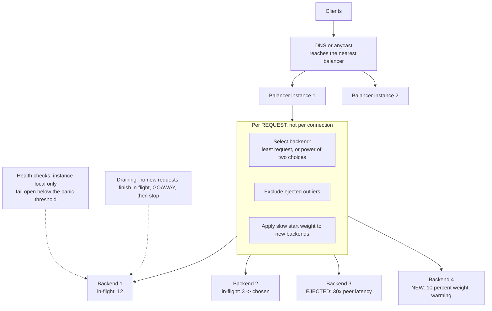
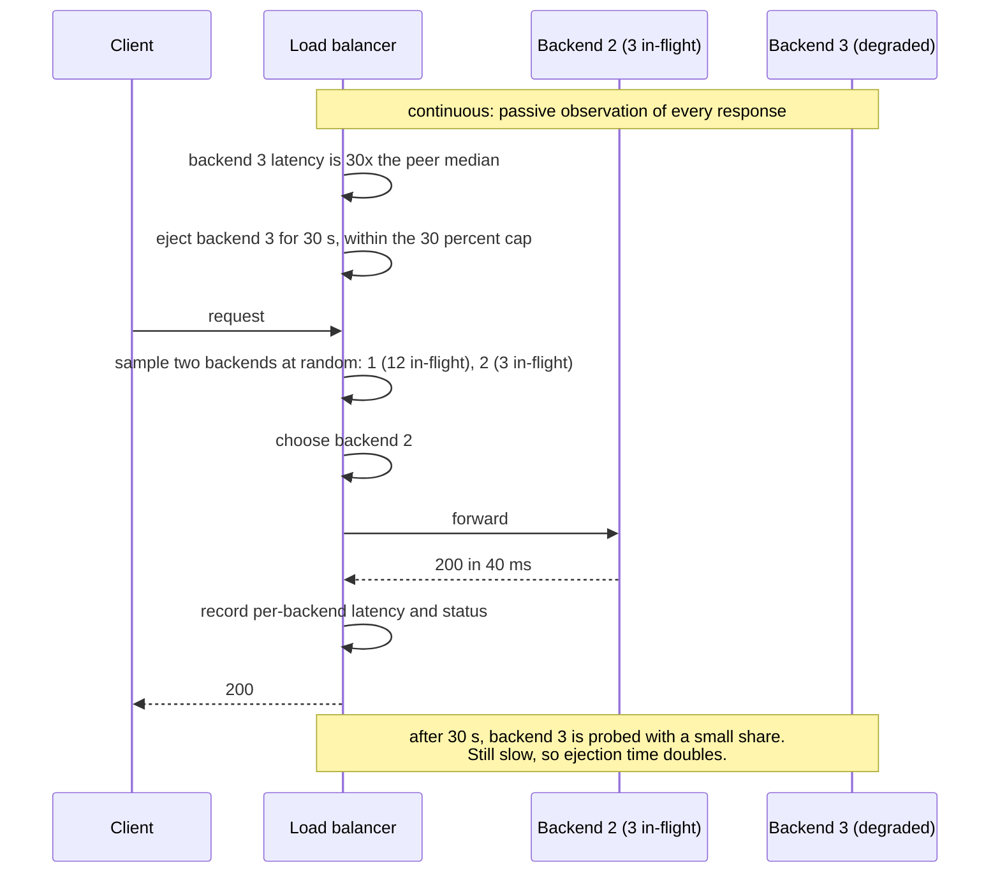

# Chapter 30: Load Balancer

## 30.1 Problem Statement

The tracking platform runs twenty instances behind a load balancer configured for round robin, which everyone agrees is the fair algorithm. Four separate incidents say otherwise.

**Three instances do 60 percent of the work.** The internal services communicate over gRPC, which multiplexes many requests onto one long-lived HTTP/2 connection. The load balancer distributes **connections**, and each client opens one connection and keeps it. Twenty backends, forty client connections, distributed unevenly, and every request on a connection lands on the same backend for hours.

**A degraded instance keeps receiving traffic.** It is 30 times slower after a disk problem, and it passes health checks because the process is fine, which is Chapter 13's gray failure. Round robin sends it exactly its share.

**Adding capacity makes latency worse.** New instances receive a full share immediately while cold, which is Chapter 21's scale-out penalty, distributed evenly across all users by the fairness of the algorithm.

**And a deploy drops requests.** Instances are removed from the pool at the moment the container stops, so requests in flight to them fail. Nobody configured connection draining.

The common thread: the load balancer was chosen for fairness between backends, and what was needed was responsiveness to their actual condition. Round robin is fair in the sense that it ignores everything, which is precisely the problem when backends differ.

## 30.2 Why This Problem Exists

**Balancing connections is not balancing work.** The algorithm distributes whatever unit it operates on. With HTTP/1.1 and short connections that unit approximates a request. With HTTP/2, gRPC, or WebSockets it does not, and the mismatch is invisible until you look at per-backend request rates.

**Backends are assumed to be equivalent, and they are not.** Some are cold, some are degraded, some are on noisier hardware, some are handling an expensive request. An algorithm with no feedback treats all of them identically.

**Health checks answer the wrong question.** They ask whether a backend is alive. The useful question is whether it is helping, which requires comparing it with its peers.

**Removal is treated as instantaneous** when it is not: requests are in flight, connections are open, and a backend that disappears abruptly turns a routine deploy into an error rate.

**And the load balancer is itself a component** with capacity, failure modes, and a position on every request path, yet it is usually configured once and never examined.

## 30.3 Real World Analogy

Airport check-in desks.

**Assigning passengers to desks in strict rotation** is round robin: perfectly fair, and it ignores that one passenger has a complicated rebooking taking twelve minutes while another needs thirty seconds. Queues develop behind the slow transactions and the rotation continues feeding them.

**One shared queue feeding whichever desk frees up next** is the significant improvement. Nobody is stuck behind one long transaction, and the system self-balances because the feedback is the desk becoming free. This is least-connections or least-request balancing, and it is why almost every airport, bank, and post office abandoned per-desk queues decades ago.

**Watching two random queues and joining the shorter** is what you do when there is no single queue and no display. Remarkably, checking just two and picking the better is nearly as good as checking all of them, which is a real mathematical result and the basis of a widely used algorithm.

**A desk where the agent's terminal is failing** should be taken out of rotation even though the agent is present and responsive. Nobody achieves this by asking the agent whether they are fine; you notice that their queue is not moving relative to the others. That is outlier detection.

**And when a desk closes,** you stop sending new passengers and let the current one finish, rather than sending them away mid-transaction. That is connection draining.

## 30.4 Simple Explanation

**A load balancer distributes incoming work across multiple backends that can each serve it.** It is a reverse proxy, from Chapter 29, with a backend selection decision added.

It operates at one of two layers, and the difference determines what it can do:

| | Layer 4 | Layer 7 |
|---|---|---|
| Sees | IP addresses, ports, TCP or UDP | HTTP requests, headers, paths, methods |
| Decision unit | A connection | A request |
| Can route by content | No | Yes |
| Can retry | No | Yes, for safe methods |
| Can terminate TLS | Only by passing through | Yes |
| Cost | Very low, high throughput | Higher, must parse |
| Suits | Non-HTTP protocols, extreme throughput, DDoS absorption | APIs, web traffic, anything needing per-request decisions |

The distinction that matters most in practice, and the cause of Section 30.1's first failure:

> **A layer 4 balancer distributes connections. A layer 7 balancer distributes requests. With long-lived multiplexed connections, those are completely different things.**

The four jobs a load balancer does:

| Job | Detail |
|---|---|
| Select a backend | The algorithm, Section 30.5.1 |
| Know which backends are usable | Health checking and outlier detection |
| Manage membership changes | Adding, draining, removing |
| Report what happened | Per-backend metrics, which is how you notice imbalance |

## 30.5 Technical Deep Dive

### 30.5.1 The algorithms

| Algorithm | How it chooses | Good | Bad |
|---|---|---|---|
| Round robin | Next in rotation | Trivial, predictable | Ignores backend state entirely |
| Weighted round robin | Rotation with per-backend weights | Handles known heterogeneity | Weights are static and go stale |
| Random | Uniformly at random | Stateless, trivially distributable | Same blindness as round robin |
| **Least connections** | Fewest active connections | Adapts to slow backends automatically | Connections are a poor proxy for work with multiplexing |
| **Least request** | Fewest in-flight requests | Adapts correctly with HTTP/2 and gRPC | Requires per-request tracking |
| **Power of two choices** | Pick two at random, choose the less loaded | Nearly as good as least-loaded, far cheaper, distributable | Slightly worse than true least-loaded |
| **Peak EWMA** | Weighted moving average of observed latency | Reacts to slowness, not just count | More state, tuning required |
| Consistent hashing | Hash a key to a backend | Cache affinity, session affinity, stable under membership change | Hot keys create hot backends (Chapter 9) |
| Maglev-style hashing | Consistent hashing with even distribution | Minimal disruption plus good balance | More complex |

Two of these deserve expansion.

**Power of two choices** is the one worth knowing about because the result is counterintuitive. Choosing uniformly at random produces maximum queue lengths that grow noticeably as the fleet grows. Sampling just two backends and taking the less loaded improves that dramatically, and sampling more than two adds very little further benefit. The practical consequence is that you get almost all the benefit of a globally informed decision with two lookups and no coordination, which is why it is the default in several modern balancers.

**Least request beats least connections whenever connections are multiplexed.** With gRPC or HTTP/2, one connection carries many concurrent requests, so connection count says almost nothing about load. Section 30.1's first failure is exactly this: a layer 4 balancer, or a layer 7 balancer counting connections, sees twenty evenly distributed connections and completely uneven work.

```
20 backends, 40 client connections, HTTP/2 multiplexed.

Least CONNECTIONS view:  every backend has 2 connections. Perfectly balanced.
Reality:                 one client is issuing 400 req/s on its connection,
                         another 5 req/s. Backend load differs by 80x.

Least REQUEST view:      backend A has 60 in-flight, backend B has 3.
                         Send the next request to B.
```

### 30.5.2 The gRPC and HTTP/2 problem

Common enough to be worth stating as its own section, because the standard answers are all wrong in different ways.

The problem: a client opens one long-lived connection and multiplexes everything over it. Any connection-level balancing decision is made once, at connection time, and then applies to every request for hours.

| Approach | Result |
|---|---|
| Layer 4 balancer | Balances at connect time only. Imbalance persists for the connection's life |
| Layer 7 proxy that terminates HTTP/2 | Correct: it sees individual requests and can balance each one |
| Client-side load balancing | Client knows all backends and picks per request. No proxy hop |
| Service mesh sidecar | The same as client-side, implemented in infrastructure (Chapter 27) |
| Periodic connection recycling | Crude mitigation: force reconnection every few minutes to reshuffle |

The two real answers are a layer 7 proxy that terminates and re-originates HTTP/2, or per-request balancing at the client, which is what a mesh sidecar provides. Connection recycling is a mitigation for when neither is available, and it works by making the unbalanced decision temporary rather than by making it correct.

### 30.5.3 Health checking, and the failure it can cause

Chapter 10 covered the amplification trap, and it belongs here as the load balancer's most consequential configuration.

| Check type | Tests | Use for |
|---|---|---|
| **Active** | Balancer probes each backend periodically | Detecting a backend that has stopped |
| **Passive** | Observes real request outcomes | Detecting degradation without extra traffic |
| **Outlier detection** | Compares backends against each other | Gray failure, which neither of the above catches |

Three rules, and the first two are the ones that cause outages when broken:

**Health checks must test instance-local conditions only.** A check that verifies a shared database will fail on every instance simultaneously when that database blips, causing the balancer to remove the entire fleet, which converts a partial degradation into a total outage.

**The balancer must fail open.** When all or almost all backends report unhealthy, sending traffic to possibly-degraded backends is better than sending it nowhere. Good balancers implement a panic threshold: below some percentage of healthy backends, ignore health status and distribute across everything.

**Outlier detection is what catches gray failure.** It ejects a backend whose error rate or latency is abnormal relative to its peers, temporarily, with the ejection duration increasing on repetition and a cap on how much of the fleet can be ejected at once.

```yaml
# The configuration that would have prevented Section 30.1's second failure.
outlierDetection:
  consecutive5xx: 5
  consecutiveGatewayFailure: 5
  interval: 10s
  baseEjectionTime: 30s        # doubles on repeated ejection
  maxEjectionPercent: 30       # never eject more than 30 percent of the fleet
  splitExternalLocalOriginErrors: true
```

That last setting matters: without a cap, a global slowdown affecting every backend equally can cause the balancer to eject all of them.

### 30.5.4 Membership changes

Adding and removing backends safely is where Section 30.1's third and fourth failures live.

**Adding a backend** needs two things beyond registration:

- **Readiness gating**, so it enters rotation only when able to serve, which for Chapter 24's stateful services means state restored, not merely process started.
- **Slow start**, so it receives a gradually increasing share of traffic over a warm-up window rather than a full share while cold. Without it, adding capacity temporarily degrades latency for everyone, evenly, because the algorithm is fair.

**Removing a backend** needs connection draining, and the sequence matters:

```
1. Mark the backend as draining. It receives NO new requests.
2. Existing in-flight requests complete normally.
3. Keep-alive connections are closed gracefully, with a GOAWAY for HTTP/2
   so clients migrate rather than failing.
4. After the drain timeout, close anything remaining.
5. Only now may the process stop.

The application's shutdown grace period (Chapter 23) must be LONGER than
the balancer's deregistration delay, or traffic arrives at a stopped process.
```

The ordering error in step five is one of the most common causes of deploy-time errors in otherwise healthy systems, and it appears as a small error spike correlated exactly with deploys.

### 30.5.5 Session affinity

Sometimes requests from one client should go to one backend. Chapter 23 argued this is usually a symptom; here are the mechanisms and when each is acceptable.

| Mechanism | How | Problem |
|---|---|---|
| Source IP hash | Hash the client address | Breaks behind NAT and mobile networks; uneven distribution |
| Cookie | Balancer sets a cookie naming the backend | Requires HTTP; leaks topology |
| Consistent hashing on a header | Hash a user or session id | Reasonable; still concentrates hot keys |

**Acceptable uses**: improving local cache hit rates, where correctness does not depend on it, and connection-oriented protocols where the connection is the unit of work.

**Unacceptable use**: keeping session state in instance memory, because instance failure then becomes user-visible data loss, load becomes uneven, and scale-in requires draining as long as the longest session.

And a property worth knowing: **consistent hashing minimises disruption on membership change.** With naive modulo hashing, adding one backend to twenty remaps almost every key. With consistent hashing, only about one twentieth of keys move. That is why it is the right mechanism whenever hashing is used at all, and Chapter 50 covers it properly.

### 30.5.6 The balancer as a component

It is on every request path, so its own properties matter.

| Concern | Consideration |
|---|---|
| Redundancy | Multiple instances; the balancer itself must not be a single point of failure |
| Reaching it | DNS with multiple records, or anycast so many locations share one address |
| Capacity | Connections, throughput, TLS handshakes per second |
| Failure mode | Fail open on health, and shed rather than queue under overload (Chapter 8) |
| Configuration changes | Fleet-wide and instantaneous, so stage and canary them (Chapter 28) |
| Observability | **Per-backend request rate, latency, and error rate**, which is the only way to see imbalance |

That last row is how Section 30.1's first failure should have been discovered in a week rather than a quarter. A single aggregate latency graph shows nothing; a per-backend breakdown shows three lines far above the others immediately.

## 30.6 Architecture Diagram



```
 clients -> DNS / anycast -> balancer instances (redundant)
                                  |
         per REQUEST decision (not per connection):
            least-request, or power of two choices
            exclude outliers (30x peer latency -> ejected)
            slow-start weight for new backends
                                  |
      +--------------+------------+-------------+
      |              |            |             |
  backend 1      backend 2    backend 3     backend 4
  12 in-flight   3 in-flight  EJECTED       NEW, 10% weight

 health checks: instance-local ONLY, fail open below panic threshold
 draining: stop new -> finish in-flight -> GOAWAY -> then process exits
```

## 30.7 Request Flow



1. **Selection is per request**, so a long-lived multiplexed connection does not pin work to one backend.
2. **Two backends are sampled rather than all**, which is nearly as effective and requires no global state.
3. **In-flight requests are the load signal,** not connections, which is what makes it correct under HTTP/2.
4. **The degraded backend was ejected by comparison with peers,** not by asking it whether it was healthy.
5. **The ejection is capped and time-bounded,** with exponential backoff on repetition, so a global slowdown cannot empty the pool.
6. **Every response updates per-backend statistics,** which is both the input to the algorithm and the observability that reveals imbalance.

## 30.8 Internal Components

| Component | Role | Failure mode | Guard |
|---|---|---|---|
| Selection algorithm | Chooses a backend | Round robin ignores backend state | Least request, or power of two choices |
| Layer of operation | Determines the decision unit | Layer 4 with multiplexed protocols balances connections, not work | Terminate HTTP/2 at layer 7, or balance client-side |
| Active health checks | Detects dead backends | Testing shared dependencies removes the whole fleet | Instance-local checks only |
| Panic threshold | Prevents total removal | Absent, so a global blip empties the pool | Fail open below a healthy-percentage threshold |
| Outlier detection | Catches gray failure | Not enabled, so degraded backends keep serving | Enable with an ejection percentage cap |
| Slow start | Protects against cold backends | Absent, so scale-out degrades latency evenly | Warm-up weighting on newly added backends |
| Connection draining | Protects in-flight work | Absent, so deploys drop requests | Drain, GOAWAY, then stop; grace longer than deregistration |
| Session affinity | Routes a client consistently | Used to preserve in-memory state | Only as an optimisation or for connection-oriented protocols |
| Per-backend metrics | Reveals imbalance | Only aggregate metrics collected | Request rate, latency, errors per backend |
| Balancer redundancy | Removes itself as a single point of failure | One instance, or one address | Multiple instances, DNS or anycast |

## 30.9 Production Example

**The power of two choices result is why modern balancers sample rather than survey.** Choosing a backend uniformly at random produces maximum load that grows with fleet size, while sampling two and taking the less loaded reduces that dramatically, and sampling three or more adds little. The practical significance is that near-optimal balancing is available without any global coordination or shared state, which is what makes it usable in distributed and client-side balancing where consulting every backend is impractical.

**gRPC's documentation addresses connection-level balancing explicitly** because it is the most common deployment mistake with the protocol. Since gRPC multiplexes calls over long-lived HTTP/2 connections, a connection-level balancer distributes connections once and then does nothing, so per-call balancing must happen either in a proxy that terminates HTTP/2 or in the client itself. Client-side balancing and service mesh sidecars are both responses to this, and they are the same mechanism at different layers.

**Envoy's outlier detection is the standard implementation of peer-relative ejection**, including consecutive failure counting, ejection time that increases with repetition, and a maximum ejection percentage so that a fleet-wide problem cannot cause the balancer to remove every backend. That last parameter exists because the failure mode is real: an aggressive ejection policy applied during a global slowdown will happily eject everything, converting degradation into an outage.

## 30.10 Advantages

- **Backend failures become invisible** to clients when detection and draining work.
- **Capacity changes are transparent,** so scaling is a purchase rather than a client-visible event.
- **Load follows actual condition** rather than a fixed rotation, when the algorithm has feedback.
- **Gray failures are removed automatically** by peer comparison, which no health check achieves.
- **Deploys become non-events** with draining and slow start.
- **TLS terminates in one place,** with the connection benefits from Chapter 29.
- **Per-backend visibility** makes imbalance and degradation observable.

## 30.11 Limitations

- **It is on every request path**, so it is an availability dependency and a latency addition.
- **Connection-level balancing is wrong for multiplexed protocols,** and the mismatch is invisible without per-backend metrics.
- **Health checks can cause the outage they exist to prevent,** if they test shared dependencies.
- **Outlier ejection can remove too much** during a global degradation without a cap.
- **Affinity conflicts with balance,** and hot keys defeat hash-based distribution.
- **It cannot fix an overloaded fleet.** Distributing work evenly across insufficient capacity is still insufficient.
- **Its own configuration changes are fleet-wide** and instantaneous.

## 30.12 Trade-offs

| Dial | One way | The other way |
|---|---|---|
| Layer | Layer 4: very fast, protocol-agnostic, connection-level only | Layer 7: per-request decisions, retries, content routing, more cost |
| Algorithm | Least request or EWMA: adapts to condition, needs state | Round robin: trivial and stateless, ignores everything |
| Sampling | Two choices: near-optimal, no coordination | Full survey: marginally better, requires global state |
| Health strictness | Aggressive: removes bad backends fast, can remove healthy ones | Conservative: stable, degraded backends serve longer |
| Ejection cap | Low: protects against mass ejection, tolerates some bad backends | High: removes more, risks emptying the pool |
| Affinity | On: cache locality and session continuity, uneven load | Off: even load, all state must be external |
| Slow start | Long: protects against cold backends, slower to use new capacity | Short: capacity available sooner, latency dip during scale-out |

**Remove outlier detection.** You gain protection against ejecting healthy backends during a global event. You lose the only automatic defence against gray failure, which is the most common real degradation. Better to cap the ejection percentage than to disable it.

**Remove slow start.** You gain simpler configuration and faster use of new capacity. You lose protection during every scale-out and deploy, and because the algorithm is fair, the cold-instance penalty is distributed evenly across all users.

**Remove connection draining.** You gain a slightly faster deploy. You lose in-flight requests on every instance replacement, appearing as an error spike perfectly correlated with deploys.

## 30.13 Common Mistakes

**Round robin with gRPC or HTTP/2,** which balances connections and not work.

**Health checks that test a shared database,** removing the whole fleet when it blips.

**No panic threshold,** so a global degradation empties the pool entirely.

**No outlier detection,** leaving gray failures in rotation indefinitely.

**No slow start,** so scale-out degrades latency evenly across all users.

**No draining,** so deploys drop in-flight requests.

**Shutdown grace shorter than deregistration delay,** so traffic arrives at a stopped process.

**Session affinity used to preserve in-memory state,** which Chapter 23 covers as a symptom.

**Only aggregate metrics,** so imbalance is invisible.

**Modulo hashing instead of consistent hashing,** so adding a backend remaps almost every key.

**Treating the balancer as infrastructure rather than a component,** with no capacity model or configuration discipline.

## 30.14 Interview Questions

**Q: Round robin versus least request?** Round robin sends work in strict rotation with no feedback, so it treats a cold, degraded, or busy backend identically to a healthy idle one. Least request tracks in-flight requests per backend and sends the next one to the least loaded, which self-corrects for slow backends automatically because their in-flight count stays high. Least request is the better default for anything where backends can differ.

**Q: Why does gRPC break naive load balancing?** Because it multiplexes many calls over a single long-lived HTTP/2 connection, so any balancer distributing connections makes one decision per connection and then does nothing for hours. Twenty evenly distributed connections can carry wildly uneven request rates. The fixes are a layer 7 proxy that terminates HTTP/2 and balances per request, or client-side balancing, which is what a mesh sidecar provides.

**Q: What is power of two choices and why does it work?** Sample two backends at random and send to the less loaded. It is nearly as effective as consulting every backend, dramatically better than pure random, and it requires no global state or coordination, which makes it practical for distributed and client-side balancing. Sampling more than two adds little further improvement.

**Q: How do you detect a backend that is slow but not failing?** Not with health checks, which only establish that the process responds. Use outlier detection: compare each backend's latency and error rate against its peers, and temporarily eject those that deviate significantly, with exponential ejection duration and a cap on the fraction of the fleet ejectable at once.

**Q: Why must a load balancer fail open?** Because a health check that tests something shared, or a global degradation, can make every backend appear unhealthy at once. Removing them all converts a partial problem into a total outage. Below a panic threshold of healthy backends, the balancer should ignore health status and distribute across everything, on the basis that possibly-degraded service beats no service.

**Q: Describe correct backend removal.** Mark it draining so it receives no new requests, allow in-flight requests to complete, close keep-alive connections gracefully with a GOAWAY so clients migrate rather than fail, then close anything remaining after a drain timeout, and only then stop the process. The application's shutdown grace period must exceed the balancer's deregistration delay, or traffic will arrive at a process that has stopped accepting it.

**Q: When is session affinity acceptable?** As a performance optimisation where correctness does not depend on it, such as improving local cache hit rates, and for connection-oriented protocols where the connection is the unit of work. Not for preserving session state in instance memory, because that makes instance failure a user-visible data loss event, produces uneven load, and makes scale-in require draining as long as the longest session.

## 30.15 Production Best Practices

1. **Use least request or power of two choices,** not round robin, for anything with variable backend condition.
2. **Terminate HTTP/2 at layer 7, or balance client-side,** for multiplexed protocols.
3. **Keep health checks instance-local,** never testing shared dependencies.
4. **Configure a panic threshold** so the balancer fails open.
5. **Enable outlier detection** with an ejection percentage cap and exponential ejection duration.
6. **Enable slow start** with a window matched to measured warm-up time.
7. **Configure connection draining,** and make the application's grace period longer than the deregistration delay.
8. **Expose per-backend request rate, latency, and error rate,** and alert on imbalance.
9. **Use consistent hashing** wherever hashing is used, so membership changes move few keys.
10. **Make the balancer itself redundant,** across instances and zones, reachable via DNS or anycast.
11. **Stage and canary balancer configuration changes,** since they apply fleet-wide instantly.
12. **Shed rather than queue under overload,** per Chapter 8.

## 30.16 Summary

A load balancer is a reverse proxy that chooses among equivalent backends, and almost everything that goes wrong with it comes from that choice being made without feedback. Round robin is fair in the sense that it ignores backend condition entirely, which is exactly wrong when backends differ, and they always differ: some are cold, some are degraded, some are handling expensive requests.

The most consequential detail is what unit is being distributed. Layer 4 balancers distribute connections; with HTTP/1.1 and short connections that approximates requests, and with gRPC, HTTP/2, or WebSockets it does not, because one connection can carry hundreds of concurrent calls for hours. That mismatch produces severe imbalance that is entirely invisible unless per-backend request rates are graphed, and the fixes are to terminate the protocol at layer 7 or to balance in the client.

Health checking is the other place a load balancer causes the outage it exists to prevent. A check that tests a shared dependency fails on every backend simultaneously, so the balancer removes the whole fleet, and the answer is instance-local checks plus a panic threshold that ignores health status when almost nothing is healthy. Neither active nor passive checks catch a backend that is thirty times slower while responding correctly, which is why outlier detection, comparing each backend against its peers and ejecting the deviant ones with a cap, is the mechanism that actually addresses gray failure.

Finally, membership changes need care in both directions. Adding a backend requires readiness gating and slow start, because a cold instance receiving a full share degrades latency for everyone under a fair algorithm. Removing one requires draining before stopping, with the application's shutdown grace exceeding the deregistration delay, or every deploy produces an error spike that correlates perfectly with the deploy and confuses everyone.

## 30.17 Quick Revision Notes

- A load balancer is a reverse proxy plus backend selection. Layer 4 distributes connections, layer 7 distributes requests.
- With gRPC, HTTP/2, or WebSockets, connections are a terrible proxy for load. Terminate at layer 7 or balance client-side.
- Round robin ignores backend condition. Prefer least request, or power of two choices.
- Power of two choices: sample two at random, take the less loaded. Near-optimal, no coordination, sampling more adds little.
- Least connections is fine for HTTP/1.1 and misleading under multiplexing. Least request is correct.
- Health checks must be instance-local. Testing a shared dependency removes the entire fleet at once.
- Fail open: below a panic threshold of healthy backends, ignore health and distribute to all.
- Outlier detection catches gray failure by peer comparison. Cap the ejectable percentage and back off ejection time exponentially.
- Slow start prevents cold backends receiving a full share during scale-out and deploys.
- Draining: no new requests, finish in-flight, GOAWAY, then stop. App grace period must exceed deregistration delay.
- Session affinity is acceptable as an optimisation or for connection-oriented protocols, not for in-memory state.
- Consistent hashing moves few keys on membership change; modulo hashing remaps almost everything.
- Per-backend metrics are the only way to see imbalance. Aggregate graphs hide it completely.
- The balancer is itself a component: redundant instances, capacity limits, staged config changes, shed under overload.

## 30.18 Mini Quiz

1. Why does round robin fail with gRPC, and what are the two correct fixes?
2. Explain power of two choices and why sampling three is not much better.
3. Your database blips for 20 seconds and the entire site goes down for 10 minutes. What is the likely configuration error?
4. How do you detect a backend that is 30 times slower but returns 200s?
5. Why cap the outlier ejection percentage?
6. Give the correct backend removal sequence and the one ordering constraint that must hold.
7. When is session affinity acceptable and when is it a symptom?

**Answers**

1. Because gRPC multiplexes many concurrent calls over one long-lived HTTP/2 connection, so a balancer distributing connections makes a single decision per connection and then has no further influence. Twenty connections spread evenly across twenty backends can carry request rates differing by orders of magnitude, and the imbalance persists for the connection's lifetime. The fixes are to use a layer 7 proxy that terminates HTTP/2 and balances each request individually, or to balance in the client, which is what a mesh sidecar does per request.
2. Sample two backends uniformly at random and send the request to whichever has fewer in-flight requests. It works because the comparison eliminates the worst outcomes of pure random selection, where a backend can accumulate a long queue purely by chance, and the improvement over random is dramatic. Sampling three or more adds little further benefit because most of the gain comes from having any comparison at all, so two gives near-optimal balance at minimal cost and with no coordination or global state.
3. Health checks that test a shared dependency, in this case the database. When it blipped, every backend failed its check simultaneously and the balancer removed all of them, turning a 20 second partial degradation into a total outage. The extended duration comes from backends needing several consecutive successful checks to return, all returning at once, then being overwhelmed by the accumulated backlog. The fixes are instance-local health checks and a panic threshold that makes the balancer fail open when almost no backend is healthy.
4. Outlier detection, which compares each backend's observed latency and error rate against its peers rather than asking whether it is alive. A backend whose latency is many times the fleet median is ejected temporarily, with the ejection duration increasing if the behaviour repeats. Health checks cannot catch this because the process is genuinely responsive and returns valid responses, which is Chapter 13's gray failure, and neither active probing nor error-rate observation alone reveals it.
5. Because the ejection criterion is relative to peers, and during a fleet-wide degradation, such as a slow shared dependency, every backend deviates from its own historical baseline while none is individually at fault. Without a cap the balancer will progressively eject every backend, removing all capacity and converting a slowdown into a complete outage. A cap of around 30 percent ensures that most of the fleet remains in rotation regardless of what the detection logic concludes.
6. Mark the backend as draining so it receives no new requests; allow in-flight requests to complete; close keep-alive connections gracefully, sending GOAWAY for HTTP/2 so clients migrate rather than failing mid-stream; close anything remaining after a drain timeout; and only then stop the process. The ordering constraint is that the application's shutdown grace period must be longer than the balancer's deregistration delay, otherwise the process stops accepting connections while the balancer is still routing to it, producing errors on every deploy.
7. Acceptable as a pure performance optimisation where correctness does not depend on it, such as improving the hit rate of a local cache, and for genuinely connection-oriented protocols such as WebSockets where the connection is itself the unit of work. It is a symptom when it exists to keep session or application state in instance memory, because that makes instance failure a user-visible data loss event rather than a routing event, produces uneven load as long-lived clients concentrate, and forces scale-in to wait for the longest session to end.

## 30.19 Hands-on Exercise

**Part 1: reproduce the gRPC imbalance.** Run eight backends behind a layer 4 balancer, with four gRPC clients issuing very different request rates over long-lived connections. Graph requests per second per backend. Then switch to a layer 7 proxy that terminates HTTP/2 and repeat.

**Part 2: compare algorithms.** With one deliberately slow backend, drive load under round robin, least connections, least request, and power of two choices. Record p50, p99, and per-backend request share for each.

**Part 3: cause the health check outage.** Configure a health check that queries a shared database. Stop the database for 20 seconds. Record total unavailability. Then switch to an instance-local check with a panic threshold and repeat.

**Part 4: eject a gray failure.** Add 500 milliseconds of latency to one backend without causing errors. Confirm health checks pass and it keeps receiving traffic. Enable outlier detection and confirm it is ejected, then verify the ejection cap prevents mass ejection when you slow all backends.

**Part 5: fix the deploy error spike.** Under sustained load, remove a backend abruptly and count failed requests. Then configure draining with a grace period longer than the deregistration delay and repeat until the count is zero.

## 30.20 Further Reading

- *The Power of Two Choices in Randomized Load Balancing*, Mitzenmacher, for the result underlying modern selection algorithms.
- Envoy's documentation on load balancing policies, outlier detection, panic thresholds, and slow start. The most complete practical reference.
- gRPC's load balancing documentation, on why connection-level balancing fails and what client-side balancing does instead.
- *Maglev: A Fast and Reliable Software Network Load Balancer*, Eisenbud et al., NSDI 2016, for consistent hashing with even distribution at scale.
- HAProxy and nginx documentation on health checking, draining, and connection handling.
- *Site Reliability Engineering*, Google, chapters on load balancing at the frontend and within the datacenter.

---

**Next chapter: Chapter 31, DNS.** How clients find your load balancers in the first place, why DNS is a poor failover mechanism despite being used as one constantly, and the caching layers that make TTL a suggestion rather than a contract.
