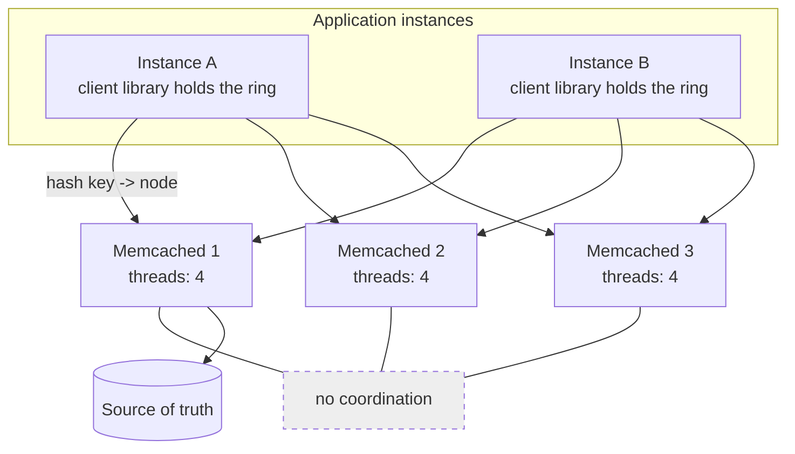
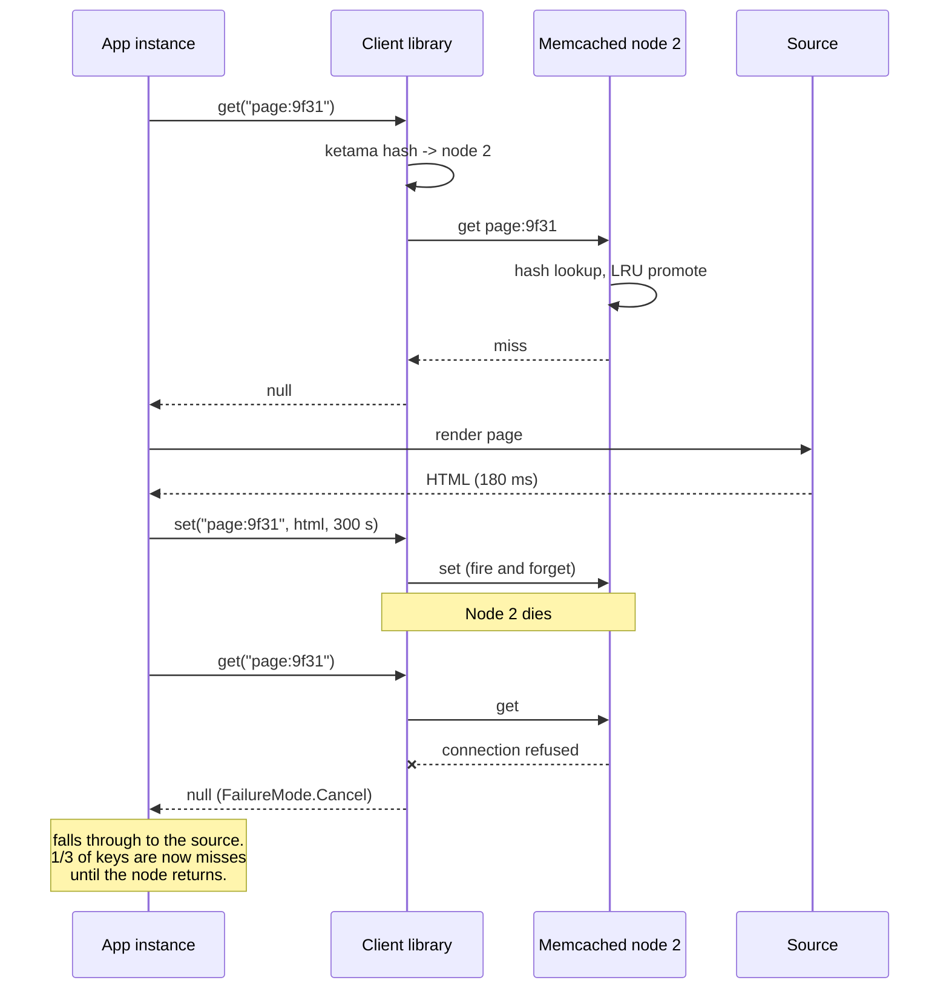

# Chapter 36: Memcached

## 36.1 Problem Statement

A different team at the same company runs the rendered-page cache for the customer portal. Sixty gigabytes of HTML fragments, serialised JSON responses, and rendered templates. Read-heavy, write-rarely, and every value is an opaque blob that gets fetched whole and handed to the response.

They are running it on Redis, because that is what the platform team runs, and they have three problems that will not go away.

**One core is saturated at 180,000 operations per second** while the machine has 32 cores sitting idle. The blobs average 40 kilobytes, so serialisation and network write dominate, and all of it happens on the single execution thread from Chapter 35. Scaling means running twelve Redis instances on one machine and sharding across them by hand.

**Memory efficiency is worse than expected.** Sixty gigabytes of values is using 78 gigabytes of RAM, and the per-key overhead plus allocator fragmentation accounts for the difference. At this scale that is a real hardware bill.

**And the operational surface is larger than the use case needs.** They have persistence configured because it was on by default, which means a fork that briefly doubles memory on a box already near capacity. They have replication configured, so a cache that could simply be re-populated instead has a failover procedure, a lag metric, and an on-call runbook.

Nobody is using a sorted set. Nobody is using a Lua script. Nobody has ever needed atomicity beyond a plain `set`.

They are paying for a system whose entire value proposition is features they do not use, and the cost is showing up as saturated cores and wasted RAM.

## 36.2 Why This Problem Exists

**Redis became the default answer, so the question stopped being asked.** "Which cache" has one obvious answer in most organisations, and for the common case that is fine. For a pure blob cache at high throughput, it is leaving performance on the floor.

**A cache with no durability requirement can make different trade-offs.** If losing everything is survivable, because everything is re-derivable from a source, then persistence, replication, and failover are not features, they are overhead.

**Multi-threading matters exactly when per-operation cost is high.** For small operations, Redis's single thread is not the bottleneck; the network is. For 40-kilobyte values, the per-operation work is substantial, and being unable to use more than one core for it becomes the constraint.

**Memory efficiency compounds at scale.** A 30 percent overhead difference is irrelevant on 2 gigabytes and is an extra machine on 60.

**And "one system for everything" has a cost that is invisible until you measure it.** The operational simplicity of running one technology is real and often worth it. It is worth knowing what you are paying for it.

## 36.3 Real World Analogy

A supermarket left-luggage locker bank versus a full-service cloakroom.

Chapter 35's Redis is the cloakroom: an attendant who can hold your coat, tell you how many coats are checked in, sort them by owner, put yours at the front of the queue for pickup, and hand you a numbered receipt. Enormously capable, and there is one attendant, so a customer with a complicated request holds up the line.

**Memcached is the locker bank.** You put a bag in a locker, you take a bag out. That is the entire feature set.

**Everyone can use their own locker simultaneously,** because there is no attendant to be the bottleneck. Twenty people can open twenty lockers at once.

**The lockers are fixed sizes,** and a small bag in a large locker wastes the difference. That is a slab allocator, and it is the mechanism that gives predictable behaviour and costs some space.

**When the bank is full, the oldest unclaimed bag is removed** to make space. No discussion, no exceptions.

**And if the power goes out, everything in the lockers is gone.** Which is fine, because nothing goes in a locker that does not exist somewhere else. The moment somebody stores the only copy of something in a locker, the arrangement is being misused.

## 36.4 Simple Explanation

**Memcached is a multi-threaded, in-memory key-value cache that stores opaque blobs, evicts by LRU when full, and loses everything on restart.**

There is no list of features to learn because there is almost no feature list:

| Operation | What it does |
|---|---|
| `get` / `gets` | Fetch a value, optionally with a CAS token |
| `set` / `add` / `replace` | Store, store-if-absent, store-if-present |
| `cas` | Store only if unchanged since your `gets` |
| `incr` / `decr` | Atomic counters on numeric strings |
| `delete` | Remove |
| `touch` | Extend a TTL without fetching |

That is essentially the whole protocol. No data structures, no persistence, no replication, no scripting, no pub/sub, no transactions, no server-side coordination of any kind.

The design philosophy in one line:

```
Memcached does one thing: it makes recently used blobs
available quickly, from RAM, across many threads.

Everything else is deliberately not its problem.
```

**And the sharding is in the client.** There is no cluster protocol, no gossip, no coordination between Memcached servers. A pool of twenty Memcached servers does not know the other nineteen exist. The client hashes the key, picks a server, and talks to it directly. Chapter 50's consistent hashing is what makes that work when the pool changes size, and it lives entirely in your client library.

This is unusual enough to state plainly: **a Memcached cluster is a client-side fiction.** The servers are independent, which is exactly why adding one is trivial and why there is no failover to operate.

## 36.5 Technical Deep Dive

### 36.5.1 Multi-threading, and when it actually matters

Memcached uses a thread pool. Each thread has its own event loop, and the hash table and LRU lists are shared with fine-grained locking. Concurrent `get` operations proceed genuinely in parallel across cores.

Whether that matters depends entirely on where your time goes:

| Workload | Bottleneck | Multi-threading helps? |
|---|---|---|
| Small values, moderate rate | Network round trip | No. Both are far faster than the network |
| Small values, very high rate | Syscalls, packet processing | Somewhat. Both scale reasonably with pipelining |
| **Large values (10 KB+)** | **Per-operation copy and write** | **Substantially. This is the case that matters** |
| Complex server-side operations | Command execution | Not applicable; Memcached has none |

The rule of thumb: **if your per-operation work is small, one core is plenty and Redis's model costs you nothing. If your values are large or your operation rate is enormous, the extra cores are the difference between one machine and twelve instances on one machine.**

Section 36.1's team is squarely in the third row. Forty-kilobyte values at high rates means memory copying and socket writes dominate, and those parallelise.

There is a second, subtler benefit: **no head-of-line blocking**. Memcached has no O(n) commands to run by accident, and a slow client cannot stall the others, because they are on different threads. The class of incident that Section 35.1 opened with does not exist here.

### 36.5.2 The slab allocator

The most distinctive part of Memcached's design, and the source of its most confusing behaviour.

Memcached does not call `malloc` per item. It pre-allocates memory in 1-megabyte **pages**, and assigns each page to a **slab class**. Each slab class stores items of one fixed size, with sizes growing by a factor (1.25 by default):

```
slab class 1:    96 bytes
slab class 2:   120 bytes
slab class 3:   152 bytes
slab class 4:   192 bytes
...
slab class 39:  512 KB
```

An item is stored in the smallest class that fits it. A 130-byte item goes into the 152-byte class, wasting 22 bytes. That is **internal fragmentation**, and it averages around 10 to 15 percent with the default growth factor.

In exchange you get properties that a general allocator cannot offer:

- **No external fragmentation ever.** Every slot in a class is interchangeable, so memory never becomes unusable through fragmentation. Redis, using a general allocator, can and does suffer fragmentation, which is why `mem_fragmentation_ratio` is a metric people watch.
- **Allocation and free are O(1)** and lock-cheap.
- **Predictable memory usage.** The process uses what you told it to use, without the surprises that fragmentation causes.

The failure mode this creates is **slab calcification**, and it deserves its own paragraph because it confuses people badly.

Pages are assigned to a slab class and, historically, stayed there. If your workload stores 1-kilobyte items for a week and then switches to 100-kilobyte items, the memory is all owned by the 1-kilobyte class. The 100-kilobyte class has almost no pages, so it evicts constantly while the instance reports plenty of free items elsewhere.

```
Symptom:  high eviction rate in one slab class,
          low overall memory pressure,
          hit ratio collapsing for one category of key.

Cause:    pages are owned by the wrong slab classes for the
          current item size distribution.

Fix:      enable the automatic slab rebalancer (modern default),
          or restart, which is what people used to do.
```

The practical guidance: **keep your item sizes reasonably uniform per instance**, and turn on slab automove. If one instance holds both 200-byte session objects and 200-kilobyte rendered pages, split them.

### 36.5.3 LRU and eviction

When a slab class has no free chunk and no page can be assigned, it evicts the least recently used item in that class. There is no configuration and no alternative policy. Eviction is normal and expected, and `evictions` is a metric to watch rather than an error to fix.

Two subtleties worth knowing.

**Eviction is per slab class, not global.** This is what makes calcification visible as a per-class eviction rate rather than a global one.

**Modern Memcached uses a segmented LRU** rather than a naive one: items live in HOT, WARM, and COLD segments, and an item must be accessed again to be promoted rather than surviving on a single touch. This makes it substantially more resistant to Chapter 33's scan problem, where a one-time sweep evicts the whole working set. It is the same insight behind Redis's LFU policy and Caffeine's admission filter, arrived at independently.

**Memcached also has no expiry thread.** An item with an expired TTL is not proactively removed; it is discovered to be expired when something touches it, or when it is reached during LRU maintenance. This means `used_memory` includes expired items that nobody has looked at yet, which surprises people reading dashboards.

### 36.5.4 Client-side sharding and consistent hashing

Since the servers do not know about each other, every distribution decision is the client's.

```java
// The client owns the topology. The servers are independent.
MemcachedClient client = new MemcachedClient(
    new ConnectionFactoryBuilder()
        // Ketama = consistent hashing (Chapter 50). Without this,
        // adding one server to a pool of ten remaps ~90 percent
        // of keys and the hit ratio goes to nearly zero.
        .setLocatorType(Locator.CONSISTENT)
        .setHashAlg(DefaultHashAlgorithm.KETAMA_HASH)
        .setFailureMode(FailureMode.Cancel)   // fail fast, fall through to source
        .setOpTimeout(150)
        .build(),
    AddrUtil.getAddresses("cache-1:11211 cache-2:11211 cache-3:11211"));
```

The `setLocatorType(CONSISTENT)` line carries more weight than anything else in this chapter's operational advice. With naive modulo hashing, `hash(key) % server_count`, changing the server count remaps almost every key:

```
10 servers -> 11 servers, modulo hashing:
  a key's server changes unless hash % 10 == hash % 11
  roughly 90 percent of keys move
  hit ratio goes to near zero
  every miss hits the database simultaneously

10 servers -> 11 servers, consistent hashing:
  roughly 1/11 of keys move
  hit ratio dips slightly
  the source absorbs it
```

That difference is the difference between adding capacity during a busy period and causing an outage by adding capacity during a busy period.

**The `FailureMode` choice is the second one that matters.** `Cancel` fails operations to a dead server immediately, so the client falls through to the source. `Redistribute` sends them to the next server on the ring, which keeps the hit ratio up but means a key can be cached in two places, which is a staleness hazard after the original server returns. For a pure cache, `Cancel` plus source fallback is the safer default.

### 36.5.5 What you give up, concretely

Worth being precise about, because the list is the entire decision:

| Missing | Consequence | Workaround |
|---|---|---|
| Data structures | Read-modify-write requires fetch, modify, store | `cas` for optimistic concurrency, or accept lost updates |
| Persistence | A restart is a cold cache | Warm-up procedure, or accept the source load spike |
| Replication | A dead server's keys are all misses | More, smaller servers, so one loss is a smaller fraction |
| Server-side scripting | No atomic multi-step logic | Not possible. Use Redis if you need it |
| Pub/sub | No invalidation broadcast (Chapter 34) | A separate channel, or shorter TTLs |
| Values over 1 MB | Large items rejected by default | Raise `-I`, or chunk in the client, or do not |
| Key scanning | No way to enumerate keys | Track keys externally if you need to |
| Range or secondary queries | Only exact key lookup | Design keys around access patterns |

The `cas` operation deserves a note, because it is the one concurrency primitive present:

```
gets counter:88          -> value 41, cas token 5721
                            (another client updates it, token becomes 5722)
cas counter:88 5721 42   -> EXISTS (rejected; your token is stale)
                            retry: gets again, recompute, cas again
```

That is optimistic concurrency control, and it works, but every retry is a full round trip. Redis's `INCR` does the same job in one atomic server-side operation with no retry loop. This is the clearest illustration of the whole trade: Memcached moves the work to the client, Redis keeps it on the server.

### 36.5.6 Spring Boot integration

Spring has no first-class Memcached abstraction the way it does for Redis, so you wire a client and adapt it. This friction is itself a real consideration in a Spring shop.

```java
@Configuration
class MemcachedConfig {

    @Bean(destroyMethod = "shutdown")
    MemcachedClient memcachedClient(
            @Value("${cache.nodes}") String nodes) throws IOException {
        return new MemcachedClient(
            new ConnectionFactoryBuilder()
                .setProtocol(Protocol.BINARY)
                .setLocatorType(Locator.CONSISTENT)
                .setHashAlg(DefaultHashAlgorithm.KETAMA_HASH)
                .setFailureMode(FailureMode.Cancel)
                .setOpTimeout(150)
                .build(),
            AddrUtil.getAddresses(nodes));
    }
}
```

```java
@Service
class RenderedPageCache {

    private final MemcachedClient cache;
    private final PageRenderer renderer;

    RenderedPageCache(MemcachedClient cache, PageRenderer renderer) {
        this.cache = cache;
        this.renderer = renderer;
    }

    String get(String pageId) {
        String key = "page:" + pageId;
        try {
            // A bounded get. If the cache is slow or gone, we render.
            Object hit = cache.asyncGet(key).get(150, TimeUnit.MILLISECONDS);
            if (hit != null) return (String) hit;
        } catch (TimeoutException | ExecutionException | InterruptedException e) {
            // Soft dependency, same rule as Chapter 35. Degrade, do not fail.
            log.warn("cache unavailable for {}", key, e);
        }

        String rendered = renderer.render(pageId);
        cache.set(key, jitteredTtlSeconds(300), rendered);   // fire and forget
        return rendered;
    }
}
```

Note `cache.set` is not awaited. For a pure cache, a failed write is not worth a millisecond of the request's latency budget, because the only consequence is one extra miss later.

## 36.6 Architecture Diagram



```
   app instance A          app instance B
   consistent hash ring    consistent hash ring
   (the "cluster" lives HERE, in the client)
        |                        |
   +----+------+-----------+-----+
   |           |           |
 mc-1        mc-2        mc-3        <- independent processes.
 4 threads   4 threads   4 threads      They do not know about
 slab alloc  slab alloc  slab alloc     each other. No replication,
 LRU evict   LRU evict   LRU evict      no failover, no persistence.
   |
   v  (on miss)
 source of truth
```

The point of the diagram is the dashed box: **there is no coordination layer.** Everything that would live there in another system lives in the client library instead.

## 36.7 Request Flow



1. **The client hashes the key** and selects a node with no server involvement at all.
2. **The node does a hash lookup and an LRU promotion,** in one of several threads, so other requests are proceeding in parallel.
3. **A miss returns null;** the application renders and stores.
4. **The store is not awaited,** because a failed cache write costs one future miss and nothing else.
5. **A dead node produces misses, not errors,** provided the failure mode and timeout are set correctly. The blast radius is one node's share of the keyspace.

## 36.8 Internal Components

| Component | Role | Failure mode | Guard |
|---|---|---|---|
| Thread pool | Parallel command execution | Too few threads for a large-value workload | `-t` sized to cores, measured |
| Slab allocator | Fixed-size chunks, no external fragmentation | Calcification when item sizes shift | Enable slab automove; keep sizes uniform per instance |
| Slab growth factor | Controls internal fragmentation | Default wastes ~10 to 15 percent | Tune `-f` if item sizes are known and uniform |
| Segmented LRU | Eviction, scan-resistant | Normal operation, not a fault | Alert on eviction rate per class, not on eviction itself |
| Lazy expiry | No expiry thread | Expired items still count toward memory | Understand it when reading dashboards |
| Client hash ring | The entire topology | Modulo hashing, so scaling remaps everything | Consistent hashing, always |
| Failure mode | Behaviour on a dead node | `Redistribute` can create duplicate stale copies | `Cancel` plus source fallback |
| Operation timeout | Bounds caller exposure | Absent, so a slow node slows the app | 100 to 200 ms |
| Item size limit | Bounds per-item cost | 1 MB default rejects large values silently | Check return values; raise `-I` deliberately |
| Max connections | Bounds resource use | Exhausted under fan-out from many app instances | `-c` raised, and connection pooling in the client |

## 36.9 Production Example

**Facebook's memcache deployment** is the reference case, and the published NSDI paper is the single best document about running a cache at scale. Several of its lessons are Memcached-specific and generalise:

**Leases**, which solve Chapter 34's read-write race and Chapter 33's stampede in the server rather than the client. A miss returns a token, and a `set` without a valid token is rejected, so a slow reader cannot store a value that a subsequent write already invalidated.

**The incast problem.** One page render fans out to hundreds of keys across many servers, and all responses arrive at once, overwhelming the requesting host's network buffers. Their fix was a sliding window limiting outstanding requests per client, which is Chapter 8's admission control applied to a client's own fan-out. This is a problem you only get at Memcached's model of "many independent servers, client does the fan-out".

**Regional pools and cold-cluster warmup.** A new cluster is populated by reading from a warm cluster rather than the database, so bringing up capacity does not generate a database stampede.

**Wikipedia and Pinterest** have both published on using Memcached for rendered-content caching, which is the workload shape from Section 36.1: large, opaque, expensive to compute, and re-derivable. That is Memcached's home ground.

Note the pattern: the organisations running Memcached at enormous scale are caching large blobs at extreme read rates with a source of truth elsewhere. The organisations reaching for Redis are the ones that need a structure, a counter, or an atomic operation.

## 36.10 Advantages

- **Multi-threaded**, so throughput scales with cores on one instance rather than requiring several instances per machine.
- **No head-of-line blocking.** There is no command that can stall the server, because there are no expensive commands.
- **Excellent memory efficiency for uniform items,** with no external fragmentation and low per-item overhead.
- **Predictable behaviour under memory pressure.** LRU eviction, always, with no policy to misconfigure.
- **Operationally trivial.** One process, a handful of flags, no persistence, no replication, no failover, no cluster state.
- **Scaling is adding a server** and letting the consistent hash ring absorb it.
- **A very small failure surface,** because there is very little to fail.

## 36.11 Limitations

- **Blobs only.** Every read-modify-write is a round trip plus a race, mitigated only by `cas` retry loops.
- **No persistence.** A restart is a fully cold cache and a source load spike.
- **No replication.** A dead node means all of its keys miss until it returns or is replaced.
- **No invalidation broadcast,** so Chapter 34's multi-layer invalidation needs a separate mechanism.
- **1 MB default item limit,** which rejects large values, sometimes silently in poorly written clients.
- **No visibility into keys.** No scanning, no enumeration, so debugging is harder.
- **Slab calcification** when item sizes change, producing evictions that look inexplicable.
- **Weaker ecosystem integration,** particularly in Spring, where Redis is first-class and Memcached is not.

## 36.12 Trade-offs

| Choice | Gain | Cost | Remove it and |
|---|---|---|---|
| Multi-threaded | Uses all cores, no HOL blocking | Locking complexity internally, invisible to you | You are back to one core per process |
| Blobs only | Simplicity, speed, tiny surface | Every modification is client-side, with races | You have Redis, and its execution model |
| Slab allocator | No external fragmentation, O(1), predictable | 10 to 15 percent internal fragmentation, calcification | A general allocator, with fragmentation instead |
| No persistence | No fork, no disk, no surprise memory spikes | Restart is a cold cache | Fork-related memory spikes and a slower restart path |
| No replication | Nothing to operate, nothing to lag | A node loss is a partial cache loss | A failover procedure for data you could re-derive |
| Client-side sharding | Servers are trivial and independent | Every client must agree on the ring | A cluster protocol and its operational surface |
| LRU only | No policy to get wrong | No LFU option for scan-heavy workloads | Configuration choices, and the chance to misconfigure them |

The central trade: **Memcached is faster and simpler because it does less, and every "less" is something you must either not need or build yourself.** The decision is entirely about which side of that line your workload falls on.

## 36.13 Common Mistakes

- **Modulo hashing instead of consistent hashing** in the client, so adding a node destroys the hit ratio.
- **Assuming a cluster exists.** The servers are independent, and every client must be configured with the same ring, or different clients cache the same key in different places.
- **Storing the only copy of something.** There is no persistence and no replication, and this is not a configuration oversight, it is the design.
- **Mixing item sizes wildly on one instance,** producing slab calcification and inexplicable per-class evictions.
- **Ignoring the 1 MB limit** and not checking whether a `set` succeeded.
- **No operation timeout,** so a slow node becomes a slow application.
- **Treating evictions as an error.** Eviction is how a full cache is supposed to behave. Watch the rate and the hit ratio, not the raw count.
- **Using `Redistribute` failure mode without understanding it,** which can leave a stale duplicate on the neighbour node after the original returns.
- **Choosing Memcached and then wanting counters, sets, or invalidation broadcasts,** and rebuilding them badly in the client.
- **Choosing Redis for a pure blob cache at high throughput** and paying for it in cores and RAM. The mirror-image mistake, and Section 36.1's.

## 36.14 Interview Questions

1. When would you choose Memcached over Redis, and when the reverse?
2. Explain the slab allocator. What problem does it solve and what problem does it create?
3. What is slab calcification, how does it present, and how is it fixed?
4. Memcached servers do not know about each other. How does a client find the right one, and what happens when the pool grows?
5. Why does modulo hashing cause an outage when you add a cache server?
6. Memcached has no replication. Is that a defect? Justify your answer.
7. How would you implement an atomic counter in Memcached, and how does that compare with Redis?
8. A Memcached node dies. Walk through what your application experiences and what should be configured.
9. Why is Memcached's multi-threading more valuable for 50 KB values than for 200-byte values?
10. You need to invalidate a cached value across a Memcached pool. What are your options?

## 36.15 Production Best Practices

- **Use consistent hashing in every client.** Ketama, or your library's equivalent. This is not optional.
- **Ensure every client has an identical server list,** ideally from shared configuration, because divergent rings mean divergent caching.
- **Set an operation timeout of 100 to 200 milliseconds** and `FailureMode.Cancel`.
- **Treat the cache as a soft dependency:** fall through on failure, with admission control behind you so the source survives.
- **Run more, smaller nodes rather than fewer, larger ones,** so any single loss is a small fraction of the keyspace.
- **Keep item sizes reasonably uniform per instance,** and split wildly different workloads onto separate pools.
- **Enable slab automove,** and alert on per-class eviction rates.
- **Monitor `get_hits`, `get_misses`, `evictions`, `bytes`, `curr_connections`, and `cmd_get` rate.** The hit ratio is the number that matters (Chapter 33).
- **Raise `-c` (max connections)** when many application instances each hold connections to every node, which multiplies quickly.
- **Have a warm-up procedure,** because a restart is a fully cold cache and the source needs to survive it.
- **Jitter your TTLs,** exactly as in Chapter 33. Memcached provides no stampede protection of its own.
- **Bind to a private interface and use the binary protocol with SASL if authentication is needed.** Memcached exposed to the internet is a well-known amplification vector.

## 36.16 Summary

Memcached is what a cache looks like when it refuses to be anything else. Blobs in, blobs out, LRU eviction when full, everything gone on restart, and no coordination between servers whatsoever.

Those refusals buy three things. Multi-threaded execution that uses every core, which matters most when values are large or rates are extreme. Memory efficiency and predictability from the slab allocator, which trades 10 to 15 percent internal fragmentation for the guarantee that external fragmentation never occurs. And an operational surface small enough that there is genuinely almost nothing to run.

The cost is everything Chapter 35 lists as a feature. No structures, so every modification is a client-side round trip with a race. No persistence, so a restart is a cold cache. No replication, so a dead node is a partial cache loss. No pub/sub, so Chapter 34's invalidation needs another channel.

The decision comes down to one question: **are you caching, or are you using shared in-memory state?** If every value is an opaque blob that exists elsewhere and the only operations are get and set, Memcached does that job with less hardware and less to operate. The moment you want a counter that increments atomically, a sorted set, a queue, a lock, or an invalidation broadcast, you want Redis, and using Memcached means rebuilding those in your application, badly.

Most systems should default to Redis, because most systems eventually want one of those things and the operational simplicity of running one technology is worth real money. Section 36.1's team is the exception that proves it: a large, uniform, blob-only, extremely read-heavy workload where Redis's entire value proposition sits unused while its execution model caps them at one core.

## 36.17 Quick Revision Notes

- **Multi-threaded**, so throughput scales with cores. Matters most for large values and extreme rates.
- **Blobs only.** No structures, no scripting, no pub/sub, no transactions.
- **No persistence, no replication.** A restart is a cold cache; a dead node is a partial loss. By design.
- **Slab allocator:** fixed-size classes, no external fragmentation, ~10 to 15 percent internal fragmentation.
- **Slab calcification:** pages stuck in the wrong class after item sizes change. Enable slab automove.
- **Segmented LRU** (HOT/WARM/COLD), which is scan-resistant.
- **Lazy expiry:** no expiry thread, so expired items occupy memory until touched.
- **Servers do not know about each other.** The cluster is a client-side fiction.
- **Consistent hashing is mandatory.** Modulo hashing remaps ~90 percent of keys when the pool grows.
- **`cas` is the only concurrency primitive:** optimistic, with a client-side retry loop.
- **1 MB default item limit.**
- **Choose it for:** large uniform blobs, very high read rates, source of truth elsewhere. **Choose Redis for:** anything else.

## 36.18 Mini Quiz

1. Why does Memcached's multi-threading matter more for a 50 KB value than a 200-byte one?
2. What is internal fragmentation in the slab allocator, and what does it buy you?
3. Your hit ratio for one category of key has collapsed while overall memory looks fine. What is the likely cause?
4. You add an eleventh server to a ten-server pool and the database falls over. What went wrong?
5. Memcached has no replication. Why is that not automatically a defect?
6. How do you implement "increment this counter" safely, and why is Redis better at it?
7. A node in the pool dies. What does the application see, and what must be configured for that to be safe?

**Answers**

1. Because the per-operation work scales with the value size. For a 200-byte value, the time spent inside Memcached copying data and writing to the socket is trivial compared with the network round trip, so a single execution thread is nowhere near saturated and Redis's model costs nothing. For a 50 KB value, memory copying and socket writes become a substantial per-operation cost, and since that work parallelises across threads, Memcached can use all the machine's cores where a single Redis process saturates one. That is exactly the difference between running one instance and hand-sharding twelve instances onto one machine.

2. Items are stored in the smallest fixed-size chunk that fits them, so a 130-byte item in a 152-byte class wastes 22 bytes, averaging roughly 10 to 15 percent across a typical workload. What it buys is the elimination of external fragmentation entirely: every chunk in a class is interchangeable, so memory can never become unusable because free space is scattered in unusable sizes. It also makes allocation and free O(1) and makes total memory usage predictable, which is why a Memcached instance uses what you told it to and a general allocator's usage drifts.

3. Slab calcification. Pages were assigned to slab classes matching an earlier item size distribution and stayed there, so the class holding this category of key owns very few pages and evicts constantly, while classes serving older item sizes hold memory that is no longer needed. The giveaway is a high eviction rate in one slab class alongside low overall memory pressure, which looks contradictory until you know the mechanism. The fix is the automatic slab rebalancer, which migrates pages between classes; historically the fix was a restart.

4. Almost certainly modulo hashing in the client rather than consistent hashing. With `hash(key) % server_count`, changing the count from ten to eleven changes the target server for roughly 90 percent of keys, so nearly the entire cache becomes unreachable at once, every request misses, and the full uncached load arrives at the database simultaneously. Consistent hashing moves only about one eleventh of keys in the same scenario, producing a hit ratio dip the source can absorb. This is why adding cache capacity is a routine operation with one configuration and an outage with the other.

5. Because a cache holds derived data that exists in a source of truth, so losing a node costs latency and source load, not correctness or data. Adding replication would mean operating a failover procedure, monitoring lag, and handling split brain, all to protect data you can re-derive. The mitigation that fits the model is running more, smaller nodes so any single loss is a small fraction of the keyspace, which costs nothing operationally. Replication becomes a defect only if the source cannot absorb the loss of one node's traffic, and the answer there is admission control, not replication.

6. With `gets` to fetch the value plus a CAS token, then `cas` to write the new value only if the token is still current, retrying the whole cycle when another client wins the race. It is correct, but it costs at least two round trips and more under contention, and a hot counter can spend most of its time retrying. Redis does it in one atomic server-side `INCR` with no token, no retry, and no contention, because execution is serial. That contrast is the clearest illustration of the general trade: Memcached moves work to the client, Redis keeps it on the server.

7. With `FailureMode.Cancel` and a short operation timeout, the application sees misses for that node's share of the keyspace, roughly one over the node count, and falls through to the source, so requests are slower but correct. For that to be safe, the client must catch and degrade rather than propagate errors, the timeout must be short enough that a hung node does not consume request threads, and the source must be protected by admission control, since it is now absorbing traffic it has not been sized for. With `Redistribute` instead, keys shift to the neighbouring node, which preserves the hit ratio but leaves a duplicate copy that can serve stale data once the original node returns.

## 36.19 Hands-on Exercise

**Part 1: measure the threading difference.** Run Memcached and Redis on the same machine. Benchmark both with 200-byte values, then with 50 KB values, at increasing concurrency. Plot throughput against value size for each, and find the crossover.

**Part 2: cause calcification.** Fill an instance with 1 KB items until it evicts. Switch the workload to 100 KB items and measure the eviction rate and hit ratio for the new items. Enable slab automove and repeat.

**Part 3: break the ring.** Build a pool of ten nodes with modulo hashing, populate it, then add an eleventh and measure the hit ratio immediately afterward. Switch to ketama consistent hashing and repeat. Record both numbers, because they are the argument you will need to make to someone one day.

**Part 4: kill a node.** With `FailureMode.Cancel` and a 150 ms timeout, kill one node of five under load. Measure the hit ratio, the source load, and the request latency. Then remove the timeout and repeat, and observe how a dead node becomes an application-wide stall.

**Part 5: measure the memory overhead.** Store one million 100-byte values in both Memcached and Redis and compare `bytes` with `used_memory`. Work out the per-item overhead of each and extrapolate to your real dataset size.

**Part 6: build a counter both ways.** Implement an atomic counter with `gets`/`cas` in Memcached and with `INCR` in Redis. Drive both from fifty concurrent clients and compare the throughput, the retry count, and the amount of code.

## 36.20 Further Reading

- *Scaling Memcache at Facebook*, Nishtala et al., NSDI 2013. The most useful cache operations paper published, and worth reading twice.
- Memcached's own documentation on the slab allocator and the segmented LRU, which is unusually clear about the mechanisms.
- *Consistent Hashing and Random Trees*, Karger et al., 1997, and the ketama implementation notes, for what the client library is doing.
- Chapter 33 of this book for caching mechanics, Chapter 34 for invalidation, Chapter 35 for Redis, Chapter 50 for consistent hashing in full, and Chapter 131 for the consolidated comparison table.

---

**Next chapter: Chapter 37, SQL.** Moving from the caching tier to the store underneath it: what the relational model actually guarantees, why the query planner is the component you argue with most, and how the properties from Chapters 16 and 19 are implemented by a real database.
