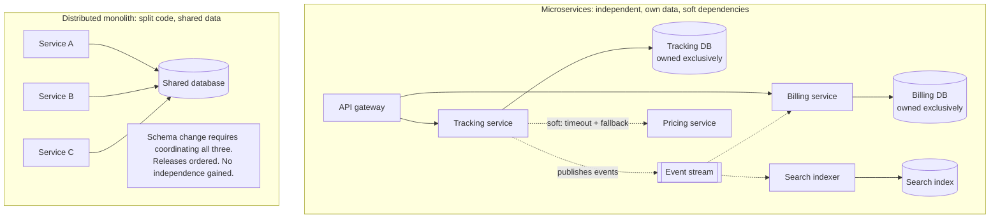

# Chapter 26: Microservices

## 26.1 Problem Statement

A different company, same industry. They split their monolith into fourteen services two years ago. Here is where they are now.

**A typical feature touches six services.** Adding a field to the shipment view requires changes in the shipment service, the API gateway, the notification service, the search indexer, the reporting service, and the mobile backend. Six repositories, six reviews, six deploys, in a specific order.

**Deploys must be coordinated.** Service A version 12 requires service B version 8 or later. There is a spreadsheet. Releases happen on Tuesdays because that is when everyone can be present.

**Availability fell.** The monolith ran at 99.9 percent. The fourteen services each run at 99.9 percent, and the checkout path traverses seven of them as hard dependencies, so the arithmetic from Chapter 10 gives 0.999 to the seventh power, about 99.3 percent. Nobody predicted this and everybody could have.

**Debugging takes days.** "Why was this order slow" requires correlating logs across six services with no distributed tracing, because tracing was scheduled for after the migration.

**They share a database.** The split was done by extracting code, not data. Nine services read the same Postgres instance, three of them write to the same tables. A schema change requires coordinating all nine.

**And the team structure did not change.** The same four teams own all fourteen services, so service ownership is a rota rather than a boundary. Nobody has autonomy; everybody has more repositories.

They have paid the full distribution tax and received almost none of the benefits. This is the distributed monolith from Chapter 25, arrived at by a team who did everything the articles said.

## 26.2 Why This Problem Exists

**The benefits are conditional and the costs are not.** Independent deployability requires that services genuinely can deploy independently, which requires compatible contracts and separate data. The network hop, the availability multiplication, and the debugging difficulty arrive on day one regardless.

**Splitting code is easy; splitting data is the work.** A shared database keeps every service coupled through the schema, so releases stay coordinated. Teams split what is easy to split and discover later that they have not split anything that mattered.

**Boundaries drawn by technical layer produce chatty services.** Splitting into an "order service", a "customer service", and a "validation service" means most operations traverse all three, which converts in-process calls into network calls without reducing coupling.

**Availability arithmetic is not done.** Chapter 10's product rule is not intuitive, so the effect of turning one hard dependency into seven is discovered rather than predicted.

**And the organisational benefit requires an organisational change.** Independent deployability is worth having only if independent teams own the services. Fourteen services owned by four teams is more surface area with the same coordination.

## 26.3 Real World Analogy

A restaurant kitchen split into separate businesses.

Previously one kitchen made everything. Now the sauces are made by a separate company, the pastry by another, and the meat prep by a third. Each can hire its own staff, specialise, and improve independently. That is the promise, and at sufficient scale it is real: this is roughly how large food supply chains work.

The costs arrive immediately and are structural.

**Everything between businesses is now a contract and a delivery.** What used to be "pass me the reduction" is a purchase order, a schedule, and a van.

**Any supplier's failure closes you.** If the sauce company has a bad day, you cannot serve the dishes that need sauce. Your reliability is now the product of everyone's.

**Changing a recipe requires renegotiation.** A change spanning sauce and pastry needs both companies to agree, schedule, and deliver in the right order.

**And if all three companies are owned by the same four managers who also run the restaurant,** you have added contracts, deliveries, and coordination while changing nothing about who decides. That is Section 26.1.

The arrangement earns its keep when the sauce company has its own customers, its own staff, and its own reasons to improve, and when the interface between businesses is a small number of stable products rather than daily bespoke requests.

## 26.4 Simple Explanation

**Microservices are an architecture where an application is composed of services that can be developed, deployed, and scaled independently, each owning its own data.**

The three words carrying the weight:

| Word | Requirement | If violated |
|---|---|---|
| **Independently deployable** | A service can release without coordinating with others | You have a distributed monolith |
| **Owning its own data** | No other service reads or writes its store directly | Coupled through the schema; releases stay coordinated |
| **Around a business capability** | Boundaries follow domain, not technical layer | Every operation traverses many services |

The honest ledger:

| You gain | You pay |
|---|---|
| Independent deployment per team | Network calls: latency, timeouts, partial failure |
| Independent scaling per component | Availability multiplies across hard dependencies |
| Fault isolation, if dependencies are soft | No cross-service transactions; sagas and compensations |
| Technology diversity | Data duplication and eventual consistency |
| Smaller blast radius per deploy | Distributed debugging; tracing becomes mandatory |
| Team autonomy and ownership | Contract versioning forever |
| Clear ownership boundaries | N times the operational surface |

And the observation that decides most real cases:

> **Most of what you gain is organisational. Most of what you pay is technical.**

So the question is not "is this system large enough for microservices" but **"do I have enough independent teams that coordination cost exceeds the distribution tax".**

## 26.5 Technical Deep Dive

### 26.5.1 The distribution tax, itemised

Everything that becomes harder the moment a call crosses a process boundary. This list is the thing to price before deciding.

| In-process | Distributed | Chapter |
|---|---|---|
| Method call, nanoseconds | Network call, milliseconds | 7 |
| Always returns or throws | May hang, time out, or partially succeed | 13 |
| Transaction spans the operation | Saga with compensations | 16, 59 |
| Join across entities | API call or duplicated data | 25 |
| One stack trace | Distributed trace across services | 70 |
| Refactor with the IDE | Coordinated releases across repositories | |
| Availability is one term | Product of all hard dependencies | 10 |
| One deploy, one rollback | N deploys, version compatibility | |
| Type checking at compile time | Contract testing at build time, if you build it | |
| One thing to run | N services plus the platform to run them | |

The availability row deserves the arithmetic because it is the one that surprises teams:

```
Monolith:                                   99.9 percent
Seven services, each 99.9, all hard:        0.999^7  = 99.30 percent
                                            43 min/month  ->  5 hours/month

Same seven, with five made SOFT
(timeout plus fallback, Chapter 10):        0.999^2  = 99.80 percent
```

Two hard dependencies instead of seven recovers most of the loss, and doing so is a code change per call site rather than an architectural change. **Dependency classification is the highest-value work in a microservice system**, and it is usually skipped.

### 26.5.2 Finding boundaries that hold

The single most consequential decision, and the one most often made by technical layer.

| Bad boundary | Why | Symptom |
|---|---|---|
| By technical layer | Validation service, persistence service | Every operation traverses all of them |
| By entity | Customer service, order service, product service | Anaemic services; business logic lives in callers |
| By team convenience at a point in time | Reflects an org chart that will change | Boundaries stop matching reality in a year |
| By existing table structure | Data model is not a domain model | Shared tables, chatty calls |

What works instead is a boundary around a **business capability**: a thing the business does, with its own vocabulary, its own rules, and its own data.

```
Entity-based (bad):        Capability-based (good):
  Customer service           Shipment tracking
  Order service              Label allocation
  Product service            Billing and invoicing
  Address service            Returns handling

Test: can this service answer a meaningful business question
      without calling three others?
```

Two heuristics that identify boundaries reliably:

**Follow the language.** Where the same word means different things, there is a boundary. A "shipment" to the tracking capability is a set of scan events; to billing it is a chargeable line. Those are different models of the same real-world thing, and forcing one shared model is what produces a service everything depends on.

**Follow the change.** Examine six months of commits and see which parts change together. Things that always change together belong together; things that never do are candidates for separation. This is empirical and beats reasoning about the domain from first principles.

And the sizing question: **a service should be owned by one team, and one team should be able to own several.** "Micro" is misleading. A service too small to justify its own deployment, pipeline, on-call, and dashboards is a distributed function call.

### 26.5.3 Data ownership

The rule that separates microservices from a distributed monolith:

> **Each service owns its data exclusively. No other service reads or writes its store directly.**

The consequences, which are the real work:

| Consequence | Approach |
|---|---|
| No joins across services | Duplicate the data you need, kept current by events |
| No cross-service transactions | Sagas with compensating actions (Chapter 59) |
| No foreign keys across boundaries | Validate through the owning service, or accept eventual correctness |
| Queries spanning services | A read model built from events (Chapter 57) |
| Reporting across everything | A separate analytical store fed by events |

Data duplication is not a compromise here; it is the design. The shipping service holding a copy of the customer's address is correct, because the address it needs is the one at ship time, which is a different thing from the customer's current address.

```java
// Correct: shipping owns a copy of what it needs, updated by events.
// It never calls the customer service on the read path.
@KafkaListener(topics = "customer.address.changed")
public void onAddressChanged(AddressChanged e) {
    shippingAddressRepo.upsert(e.customerId(), e.address(), e.version());  // idempotent
}

// Wrong: a synchronous call on every read makes the customer service
// a hard dependency of every shipment view, multiplying availability
// and adding a network hop to the hot path.
```

The migration order from Chapter 25 applies exactly: **separate the data before separating the deployable.** Section 26.1's team did the reverse and remains coupled through the schema.

### 26.5.4 Contracts and versioning

Once services deploy independently, every interface is a contract with a version, and compatibility is permanent work.

**The rule that makes independent deployment possible:** any two adjacent versions of two services must be able to run simultaneously, because during a rollout they will.

```
Expand, migrate, contract:

1. EXPAND    Add the new field or endpoint. Old clients ignore it.
             Both versions work.
2. MIGRATE   Move consumers to the new form, one at a time, at their own pace.
3. CONTRACT  Remove the old form, only after every consumer has moved.

Skipping step 1 or 3 makes deploys ordered, which removes independence.
```

**Consumer-driven contract testing** is what keeps this honest. Each consumer publishes the subset of the provider's contract it actually uses, and the provider's build verifies it has not broken any of them. That converts a runtime integration failure into a build failure, which is where it belongs.

```
Without contract tests:
  provider changes -> deploys -> consumer breaks in production

With contract tests:
  provider changes -> its own build fails -> nothing deploys
```

For events the same discipline applies with a stronger constraint, because consumers may replay history: **additive changes only, never remove or repurpose a field, and always tolerate unknown fields on read.**

### 26.5.5 What you must build before you split

The platform capabilities that a monolith did not need and that a microservice system cannot function without.

| Capability | Why | Without it |
|---|---|---|
| Distributed tracing | One request spans many services | Debugging takes days, per Section 26.1 |
| Centralised structured logging with correlation ids | Logs are scattered | You cannot reconstruct a request |
| Service discovery | Instances move | Hardcoded addresses |
| Timeouts, retries with budgets, circuit breakers | Partial failure is normal | Chapter 13's cascades |
| Contract testing | Independent deploys need compatibility | Ordered deploys |
| Per-service dashboards and SLOs | Health is per service | You cannot tell which service is at fault |
| Automated pipelines per service | N services means N pipelines | Deploys become manual and coordinated |
| Idempotency everywhere | At-least-once delivery (Chapter 20) | Duplicate side effects |

The honest reading of that table: **microservices have a platform prerequisite.** A team that cannot afford to build or buy these should not split, because the failure modes in Section 26.1 follow directly from their absence.

### 26.5.6 Migration

The strangler approach from Chapter 25, applied at system scale:

```
1. Pick ONE capability with a clear boundary and a real reason to split.
2. Enforce the boundary inside the monolith first: interface, own schema.
3. Build the new service. Dual-write or replicate the data it owns.
4. Route a small share of traffic to it. Compare results against the monolith.
5. Increase the share. Keep the monolith path as a fallback.
6. Cut over. Delete the monolith implementation.
7. Stop. Evaluate whether the next extraction is justified before starting it.

Step 7 is the one nobody does, and it is why Section 26.1 has fourteen services.
```

Two rules that keep this recoverable. **Extract one at a time and finish,** so that value is realised incrementally rather than at the end of a two year programme. And **be willing to stop**, since the correct number of services is determined by evidence rather than by the original plan.

## 26.6 Architecture Diagram



```
 MICROSERVICES                          DISTRIBUTED MONOLITH
   gateway                                service A  service B  service C
    /    \                                     \        |        /
 tracking  billing                              \       |       /
    |         |                                  +---- shared DB ----+
 own DB    own DB
    \        /                              schema change = coordinate all
     event stream ---> search indexer       releases ordered
                                            all costs, no independence
 soft dependencies: timeout + fallback
 hard dependencies: minimised, and counted
```

## 26.7 Request Flow

```mermaid
sequenceDiagram
    participant C as Client
    participant GW as Gateway
    participant T as Tracking
    participant P as Pricing (soft)
    participant K as Event stream
    participant B as Billing

    C->>GW: GET /shipments/9f31
    GW->>T: get shipment
    T->>T: read from OWN database
    T->>P: get surcharge (200 ms timeout)
    Note over T,P: pricing is slow; timeout fires
    P--xT: timeout
    T->>T: fallback to last known surcharge
    T-->>GW: 200, complete response with a staleness marker
    GW-->>C: 200

    Note over T,B: write path: no cross-service transaction
    T->>T: record scan in own DB + outbox, ONE transaction
    T->>K: relay publishes shipment.delivered
    K->>B: billing consumes, idempotent on event id
    B->>B: create charge in its OWN database
```

1. **Each service reads only its own database.** No cross-service query is on the hot path, so the read does not multiply availability.
2. **Pricing is a soft dependency** with a timeout and a fallback, so its failure degrades the response rather than failing it. This single decision is worth more availability than any amount of redundancy in the pricing service.
3. **The write is one local transaction plus an outbox row**, which is Chapter 11's pattern and the only way to make a state change and an announcement atomic.
4. **Billing learns by event,** not by being called, so tracking does not depend on billing being available to record a scan.
5. **The consumer is idempotent on the event id,** because delivery is at-least-once.
6. **No distributed transaction anywhere.** If billing fails permanently, that is a saga concern with a compensation, not a rollback.

## 26.8 Internal Components

| Component | Role | Failure mode | Guard |
|---|---|---|---|
| Service boundary | Defines ownership and change radius | Drawn by layer or entity, so everything is chatty | Boundaries around business capabilities |
| Exclusive data ownership | Enables independent deployment | Shared database, so releases stay coupled | One owner per store; others use APIs or events |
| Dependency classification | Determines availability | Everything hard, multiplying failure | Timeouts and fallbacks; count the hard ones |
| Contract versioning | Allows independent releases | Breaking changes, so deploys become ordered | Expand, migrate, contract; additive events only |
| Consumer-driven contract tests | Catch incompatibility at build time | Absent, so failures appear in production | Provider builds verify all consumer contracts |
| Distributed tracing | Reconstructs a request | Not built, so debugging is archaeology | Trace context propagated on every hop |
| Outbox and events | Atomic state change plus announcement | Dual writes, so systems diverge | Outbox in the same transaction (Chapter 11) |
| Idempotent consumers | Safe under redelivery | Absent, so duplicates cause real effects | Chapter 20's protocol |
| Per-service pipeline and SLO | Independent lifecycle and accountability | Shared pipeline and one global SLO | One each, owned by the owning team |
| Team ownership | The reason to do this at all | More services than teams | One owner per service; teams may own several |

## 26.9 Production Example

**Amazon's service interface mandate**, discussed in Chapter 2, is the organisational version of this architecture: teams communicate only through service interfaces, with no shared databases and no back doors, and every interface designed as though external developers would use it. The technical outcome was independent deployability; the reason it worked was that the mandate applied to teams, not just to code. It is the clearest evidence that the benefit is organisational and that the enforcement must be too.

**Uber's domain-oriented architecture** is the correction after over-decomposition. Having grown to a very large number of services, they found that understanding any flow required reading dozens of them and that a single product change touched many teams. Rather than reversing course, they grouped services into domains with a defined public interface per domain and rules about which layers may call which. The lesson is that **service count has a coordination cost of its own**, and that boundaries need structure above the individual service once there are many.

**The distributed monolith is documented widely enough to be a named antipattern**, and its cause is consistent: code split before data. Services that share a database cannot deploy independently because a schema change affects all of them, so the team pays the network, tracing, and availability costs while continuing to release on a coordinated schedule. Section 26.1 is that pattern precisely.

## 26.10 Advantages

- **Independent deployment**, when contracts and data are genuinely separate, which removes the release train.
- **Independent scaling** of components with different profiles.
- **Fault isolation**, provided dependencies are soft rather than hard.
- **Team autonomy and clear ownership**, which is the main benefit and the main justification.
- **Technology diversity** where a component genuinely needs a different runtime.
- **Smaller blast radius per deploy**, since a bad release affects one capability.
- **Boundaries are enforced by the network**, so they cannot decay the way in-process ones do.

## 26.11 Limitations

- **Availability multiplies** across hard dependencies, and this is easy to overlook.
- **No cross-service transactions**, so consistency becomes sagas and compensations.
- **Debugging requires a platform** for tracing and correlated logging.
- **Contract versioning is permanent work.**
- **Data duplication and eventual consistency** become normal, with all of Chapter 18's anomalies.
- **Operational surface multiplies:** pipelines, dashboards, alerts, on-call, dependency upgrades.
- **Latency increases,** with every boundary adding a network hop.
- **The benefits are conditional** on organisational change that frequently does not happen.

## 26.12 Trade-offs

| Dial | One way | The other way |
|---|---|---|
| Service count | Many: fine ownership, high coordination and operational cost | Few: simpler, coarser ownership |
| Dependency style | Synchronous: simple, multiplies availability and latency | Event-driven: resilient, eventual consistency |
| Data | Duplicated per service: independent, must be kept current | Shared: consistent, kills independence |
| Boundaries | Capability-based: cohesive, requires domain understanding | Entity or layer-based: easy to draw, chatty |
| Contracts | Strict versioning and contract tests: safe, slower changes | Loose: fast, breaks consumers |
| Consistency | Sagas: available, intermediate states visible | Distributed transactions: atomic, blocking and fragile |

**Remove exclusive data ownership and share a database.** You gain joins, transactions, and no duplication. You lose independent deployability entirely, which was the only reason to split, leaving all the costs and none of the benefit.

**Make every dependency hard.** You gain simpler code with no fallback paths. You lose availability multiplicatively: seven hard dependencies at 99.9 percent gives 99.3, which is five hours of downtime a month.

**Remove contract testing.** You gain build time. You lose the ability to deploy independently with confidence, so releases become ordered and coordinated, which is the distributed monolith again.

## 26.13 Common Mistakes

**Splitting code before data,** producing services coupled through a shared schema.

**Boundaries by technical layer or entity,** producing chatty services where every operation traverses several.

**Not doing the availability arithmetic,** so seven hard dependencies are created without noticing the consequence.

**Making everything a hard dependency,** when timeouts and fallbacks would recover most of the lost availability.

**Splitting without changing team structure,** so fourteen services are owned by four teams and nobody gains autonomy.

**Deferring tracing until after the migration,** which is exactly when it is needed most.

**Synchronous chains,** where a request traverses five services in sequence and inherits every tail latency.

**Breaking changes without expand-migrate-contract,** which forces ordered deploys.

**Services too small to justify their own pipeline, dashboards, and on-call.**

**Never stopping.** The correct service count is determined by evidence, not by the original plan.

## 26.14 Interview Questions

**Q: What actually defines a microservice?** Independent deployability, exclusive ownership of its data, and a boundary around a business capability. Without the first two you have a distributed monolith, which carries every cost of distribution and delivers none of the independence.

**Q: A team split into fourteen services and availability dropped. Explain.** Hard dependencies multiply. Seven services at 99.9 percent on a request path give roughly 99.3 percent, which is about five hours of monthly downtime against the monolith's 43 minutes. The fix is to classify dependencies and convert most to soft with timeouts and fallbacks, which restores most of the loss without changing the architecture.

**Q: How do you choose boundaries?** Around business capabilities rather than technical layers or entities. Two heuristics work well: follow the language, since a boundary exists wherever the same word means different things to different parts of the business, and follow the change, since parts that always change together belong together and parts that never do are separation candidates.

**Q: Why is sharing a database fatal?** Because a schema change then affects every service reading it, so releases must be coordinated and independent deployability is lost. Since that was the primary benefit, the team pays network latency, partial failure, distributed debugging, and multiplied availability while continuing to operate as a monolith.

**Q: How do you deploy independently when services depend on each other?** Expand, migrate, contract. Add the new form while keeping the old, move consumers at their own pace, then remove the old form once nobody uses it. Any two adjacent versions must run simultaneously, because during a rollout they will. Consumer-driven contract tests turn incompatibility into a build failure rather than a production incident.

**Q: What must exist before you split?** Distributed tracing, structured logging with correlation ids, service discovery, timeouts with retry budgets and circuit breakers, contract testing, per-service pipelines, dashboards and SLOs, and idempotent consumers. Microservices have a platform prerequisite, and Section 26.1's failure modes follow directly from its absence.

**Q: When should you not use microservices?** When you have few teams, since the benefits are organisational and coordination cost is the main thing being solved. When you cannot build or buy the platform prerequisites. When the domain is not yet understood, since boundaries drawn early are usually wrong and are far more expensive to correct across services than inside one codebase.

## 26.15 Production Best Practices

1. **Split for a stated organisational reason,** and change team ownership at the same time.
2. **Separate data before separating deployables.** Exclusive ownership is the defining property.
3. **Draw boundaries around business capabilities,** using language and change-frequency evidence.
4. **Classify every dependency as hard or soft,** and give every soft one a timeout and a tested fallback.
5. **Compute the availability product** for each critical path before committing to it.
6. **Prefer events to synchronous calls** for anything the caller does not need in order to respond.
7. **Use an outbox** so a state change and its announcement are atomic.
8. **Make every consumer idempotent** on a stable event id.
9. **Version contracts with expand, migrate, contract,** and keep event schemas additive only.
10. **Run consumer-driven contract tests** in provider builds.
11. **Build tracing, correlated logging, and per-service SLOs before splitting,** not after.
12. **Extract one capability at a time, finish it, then re-evaluate.**
13. **Keep services large enough to justify their own pipeline, dashboards, and on-call.**

## 26.16 Summary

Microservices are services that deploy independently, own their data exclusively, and are organised around business capabilities. All three conditions are load-bearing. Violate the first two and you have a distributed monolith, which pays the full distribution tax and returns none of the independence, which is exactly where Section 26.1's team ended up after two years of correct-sounding work.

The costs arrive on day one and are unconditional: network calls instead of method calls, partial failure everywhere, no cross-service transactions, availability that multiplies across hard dependencies, distributed debugging that requires a tracing platform to be tractable, permanent contract versioning, and N times the operational surface. The availability arithmetic is the one most often skipped and the easiest to compute: seven hard dependencies at 99.9 percent yields 99.3, and converting five of them to soft dependencies with timeouts and fallbacks recovers most of that at the cost of a few lines per call site.

The benefits are conditional and mostly organisational: independent deployment, team autonomy, clear ownership, independent scaling, and fault isolation where dependencies are soft. That asymmetry is the decision criterion. The question is not whether the system is large but whether there are enough independent teams that coordination cost exceeds the distribution tax, and splitting without changing who owns what produces more repositories and the same coordination.

So the practical guidance is narrow. Establish the boundary inside the monolith first, separate the data before the deployable, draw boundaries around capabilities using evidence from language and change frequency, classify dependencies and make most of them soft, build tracing and contract testing before splitting rather than after, extract one capability at a time and finish it, and then stop and re-evaluate rather than executing the original plan to its conclusion.

## 26.17 Quick Revision Notes

- Microservice: independently deployable, owns its data exclusively, bounded by a business capability. All three are required.
- Break any of the three and you have a distributed monolith: all costs, no independence.
- Costs are unconditional; benefits are conditional on separate data, soft dependencies, and separate team ownership.
- Availability multiplies: 0.999^7 is about 99.3 percent, five hours a month against 43 minutes.
- Converting hard dependencies to soft with timeouts and fallbacks is the highest-value availability work.
- Bad boundaries: by technical layer, by entity, by current org chart, by table structure.
- Good boundaries: business capabilities. Follow the language, and follow what changes together.
- Data ownership is exclusive. Duplicate what you need, kept current by events.
- Separate data before separating deployables. Splitting code first is what causes the distributed monolith.
- No cross-service transactions. Use sagas with compensations.
- Contracts: expand, migrate, contract. Adjacent versions must run simultaneously.
- Events: additive changes only, tolerate unknown fields, since consumers may replay history.
- Consumer-driven contract tests turn integration failures into build failures.
- Platform prerequisites: tracing, correlated logging, discovery, resilience, contract tests, per-service pipelines and SLOs, idempotency.
- Services should be team-sized, not micro. Too small means a distributed function call.
- Extract one capability at a time, finish, then re-evaluate. Stopping is allowed.

## 26.18 Mini Quiz

1. Give the three defining properties, and say what you have if the second is violated.
2. A request path traverses six services, each at 99.95 percent. What is the ceiling, and how would you improve it without touching any service's reliability?
3. Why is splitting code before data the characteristic mistake?
4. Give two heuristics for finding boundaries and explain each briefly.
5. What is expand, migrate, contract, and what does skipping a step cost?
6. Name four platform capabilities that must exist before splitting.
7. Fourteen services are owned by four teams. What has been gained?
8. When is a service too small?

**Answers**

1. Independently deployable, exclusive ownership of its data, and a boundary around a business capability. If exclusive data ownership is violated, typically by sharing a database, you have a distributed monolith: a schema change affects every service that reads it, so releases must be coordinated and independent deployability is lost, while the network latency, partial failure, distributed debugging, and multiplied availability costs are all still paid.
2. 0.9995 to the sixth power, about 99.7 percent, which is roughly two hours of downtime per month. Improve it by classifying dependencies and converting as many as possible from hard to soft with a timeout derived from measured p99 and a tested fallback, so their failure degrades the response rather than failing it. Reducing six hard dependencies to two raises the ceiling to about 99.9 percent without improving any individual service.
3. Because the data is what actually couples services. Splitting code is mechanical and produces separate repositories and deployables quickly, which feels like progress, but if those deployables continue to read and write the same tables, every schema change requires coordinating all of them and releases stay ordered. The team has therefore acquired network calls, partial failure, distributed debugging, and multiplied availability while retaining the monolith's coordination cost.
4. Follow the language: wherever the same word means materially different things to different parts of the business, there is a boundary, because those are different models of the same real-world thing and forcing a shared model creates a service everything depends on. Follow the change: examine commit history to see which parts consistently change together, since things that always change together belong in one boundary and things that never do are separation candidates. The second is empirical and tends to beat reasoning about the domain abstractly.
5. A sequence for changing a contract without ordering deploys: expand by adding the new form while keeping the old so both versions interoperate, migrate consumers to the new form individually at their own pace, then contract by removing the old form once no consumer uses it. Skipping expand forces every consumer to upgrade simultaneously with the provider, which makes deploys ordered and destroys independence. Skipping contract leaves permanent dead surface that constrains future changes and confuses consumers.
6. Distributed tracing with context propagated on every hop, since a request now spans many services and cannot otherwise be reconstructed. Centralised structured logging with correlation ids, for the same reason. Resilience mechanisms, meaning timeouts on every call, retries with budgets, and circuit breakers, because partial failure is now normal. Consumer-driven contract testing, so incompatibility fails a build rather than production. Also acceptable: service discovery, per-service pipelines, per-service dashboards and SLOs, and idempotent consumers.
7. More repositories, more pipelines, more dashboards, more on-call surface, network latency on every internal call, multiplied availability, and distributed debugging. Essentially none of the intended benefit, because independent deployability is only valuable when independent teams are the ones deploying, and with fourteen services across four teams every meaningful change still requires the same coordination as before, now spread across more artefacts.
8. When it cannot justify its own deployment pipeline, dashboards, alerts, on-call rotation, and dependency upgrade burden, or when it cannot answer a meaningful business question without calling several others. A service that exists to perform one computation on behalf of a caller is a distributed function call: it adds a network hop, a failure mode, and an availability term while providing no independent lifecycle. Services should be team-sized, and one team may reasonably own several.

## 26.19 Hands-on Exercise

**Part 1: compute your ceiling.** Map one critical request path in a distributed system you work on. List every service it touches, mark each hard or soft, find each one's measured availability, and multiply the hard ones. Compare with your stated target.

**Part 2: convert hard to soft.** Choose the three worst hard dependencies that are not genuinely critical. Add a timeout derived from measured p99, a fallback, and a metric for fallback rate. Recompute the ceiling and record the improvement.

**Part 3: find the real boundaries.** Take six months of commit history and produce a matrix of which modules or services change together. Compare the clusters with your current service boundaries. Where they disagree, the boundaries are wrong.

**Part 4: break a contract deliberately.** Make a breaking change to a provider and observe where it fails: build, deploy, or production. Then add consumer-driven contract tests and repeat, confirming the failure moves to the provider's build.

**Part 5: trace a request.** Pick a slow request and reconstruct its full path using only your current tooling. Time how long it takes you. If it exceeds a few minutes, your tracing is not adequate for the architecture you have.

## 26.20 Further Reading

- *Building Microservices*, Sam Newman, second edition. The most complete practical treatment, and honest about costs.
- *Monolith to Microservices*, Sam Newman, for extraction patterns and the data separation problem specifically.
- *Domain-Driven Design*, Eric Evans, on bounded contexts, which is where capability boundaries come from.
- *Team Topologies*, Skelton and Pais, for the organisational half, which is the half that determines whether the architecture pays off.
- Uber's writing on domain-oriented microservice architecture, for what happens after over-decomposition and how to add structure above the service.
- Pact and consumer-driven contract testing documentation, for the mechanism that makes independent deployment safe.
- *Designing Data-Intensive Applications*, chapter 12, on the boundaries between services and the derivation of data across them.

---

**Next chapter: Chapter 27, Service Mesh.** The infrastructure layer that implements the resilience, security, and observability requirements this chapter listed, without putting them in every service's code: what a sidecar actually does, what it costs per hop, and when a library is the better answer.
