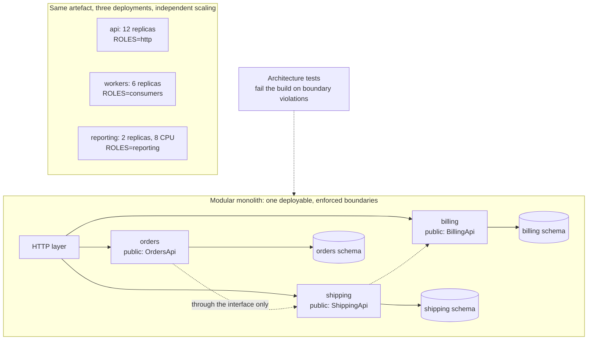
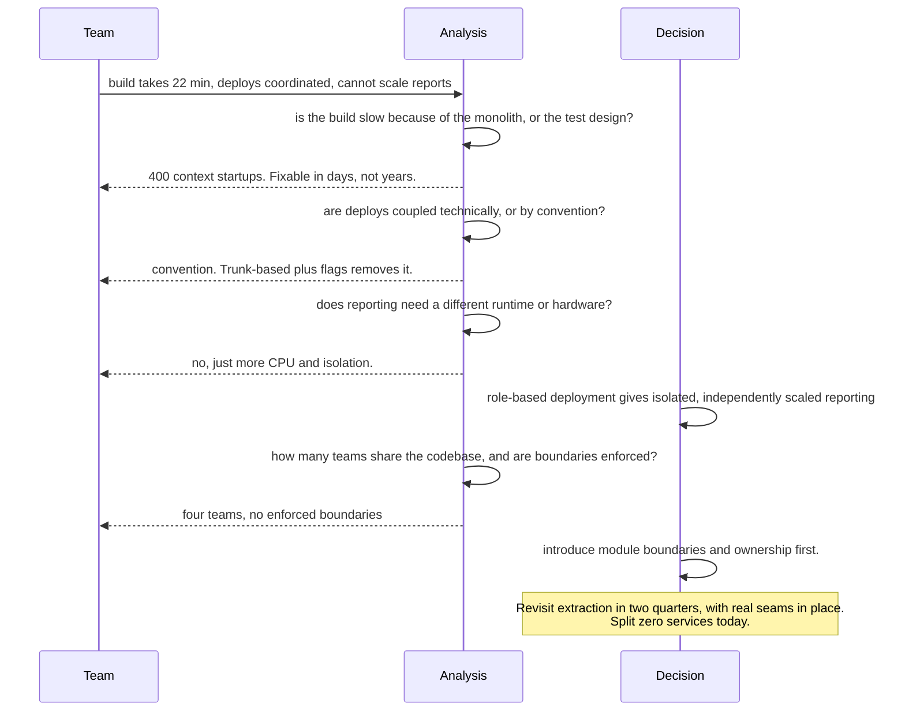

# Chapter 25: Monolith

## 25.1 Problem Statement

The tracking platform's core is a single Spring Boot application. It handles orders, shipments, labels, billing, and the admin interface. Thirty engineers work on it. It is 340,000 lines and deploys as one artefact.

The team proposes breaking it into microservices. The stated reasons, in the order they appear in the document:

**"The build takes 22 minutes and the test suite takes 40."** Merging anything requires waiting an hour to find out whether it worked.

**"Deploys are coordinated."** Four teams must agree on a release, so deploys happen twice a week rather than on demand, and each carries four teams' worth of change.

**"One bad deploy takes down everything."** A memory leak in the reporting code exhausted the heap and took order intake down with it.

**"We cannot scale the parts independently."** Report generation is CPU-heavy and runs a few times an hour; order intake is light and constant. Both scale together, so the fleet is sized for reports.

**"Nobody can review changes outside their area confidently,"** because the codebase has no enforced boundaries and any class can call any other.

Every complaint is real. The proposed remedy is a two-year programme to split into fourteen services.

Then someone runs the analysis properly, and the picture changes. The 22 minute build is dominated by a test suite that starts a full application context 400 times, which is a fixable configuration problem. The deploy coupling exists because four teams share one release train by convention, not by technical necessity. The memory leak took everything down because there are no resource limits per module, which is true of many microservice deployments too. And the scaling complaint is real, and it affects exactly one component.

The honest conclusion is that **four of the five problems are properties of how the monolith is built and operated rather than of its being a monolith**, and the fifth justifies extracting one service rather than fourteen.

This chapter is about telling those two categories apart.

## 25.2 Why This Problem Exists

**Monolith has become a pejorative,** so the architecture gets blamed for problems that belong elsewhere. A slow build, an untested codebase, and no module boundaries are all fixable within a single deployable, and all three are commonly cited as reasons to distribute.

**The comparison is made against an idealised alternative.** Microservices are evaluated as they appear in a design document, without the network failures, the distributed debugging, the availability arithmetic from Chapter 10, or the data duplication. The monolith is evaluated as it currently is, with all its accumulated damage.

**Structural decay is mistaken for structural inevitability.** A monolith with no enforced boundaries becomes a big ball of mud, and that experience convinces people that monoliths cannot have boundaries. They can, and enforcing them is a build configuration rather than a rewrite.

**Team scaling pain is real and gets attributed to the wrong cause.** Thirty engineers in one codebase with one release train genuinely have a coordination problem. That is Chapter 9's organisational axis, and splitting the deployable is one solution among several.

**And the costs of distribution are paid later.** The two-year programme's expense is visible; the permanent tax on every subsequent feature is not, until it arrives.

## 25.3 Real World Analogy

A single large building versus a campus.

A well-designed office building has departments on separate floors, with doors, corridors, and a directory. People know where things are. Moving a team is an internal exercise. Everyone shares the heating, the security desk, and the fire alarm, which is efficient.

A badly-designed building of the same size has no internal walls, everyone works in one hall, the filing is arbitrary, and finding anything requires asking. That is not an argument against buildings. It is an argument against that building.

The campus alternative gives each department its own building. Real benefits: one department's fire does not close the others, each can be renovated independently, and each can be sized for its own needs. Real costs that are easy to overlook: **everything between departments is now a walk across the site in the rain.** Shared services must be duplicated or centralised. Coordination that was a conversation becomes a scheduled meeting. And the site itself needs roads, signage, and a facilities team that did not exist before.

The decision that actually matters is rarely "one building or several". It is **whether the building has walls in the right places**, because a building with good internal structure can be split later along those lines, and one without cannot be split at all without first discovering where the walls should have been.

## 25.4 Simple Explanation

**A monolith is an application deployed as a single unit.** That is the whole definition. It says nothing about internal structure, code quality, or size.

The distinction that matters more than the label:

| | Modular monolith | Big ball of mud |
|---|---|---|
| Deployment | One unit | One unit |
| Internal boundaries | Explicit and enforced | None |
| Cross-module calls | Through defined interfaces | Anything to anything |
| Data ownership | One module owns each table | Shared freely |
| Change radius | Contained to a module | Unknowable |
| Can be split later | Yes, along existing seams | No, seams must be discovered first |

Both are monoliths. Only one of them is a problem, and the second is what people usually mean when they say the word.

What a monolith genuinely gives you, and these are not small:

| Capability | Why it matters |
|---|---|
| Real transactions across the domain | Chapter 16's entire toolkit, without sagas |
| Joins and referential integrity | No application-side assembly |
| Refactoring across boundaries | An IDE can rename across the whole system safely |
| One deployment, one rollback | Chapter 10's change risk concentrated in one reversible action |
| No network between components | No timeouts, retries, partial failures, or serialisation |
| Availability is one term, not a product | Chapter 10's arithmetic does not multiply |
| One thing to run, monitor, and debug | A stack trace spans the whole request |

The guidance, stated plainly:

> **Start with a modular monolith. Extract a service when you have a specific reason that cannot be satisfied inside it, and extract along a boundary that already exists.**

## 25.5 Technical Deep Dive

### 25.5.1 Enforcing boundaries inside one deployable

The objection to monoliths is almost always that they lack boundaries. Boundaries are enforceable, and there are four levels of enforcement, each stronger than the last.

**Level 1: package structure by domain, not by layer.**

```
Wrong, by layer:                    Right, by domain:
  com.acme.controller.*               com.acme.orders.*
  com.acme.service.*                  com.acme.shipping.*
  com.acme.repository.*               com.acme.billing.*
  com.acme.model.*                    com.acme.labels.*
```

Layered packaging guarantees that every feature touches every package, so nothing is contained. Domain packaging makes the boundary visible, and a feature usually lives in one place.

**Level 2: a public interface per module.** Everything else package-private. Java's access modifiers do real work here, and most codebases waste them by making everything public.

```java
// com.acme.shipping.ShippingApi  -- the ONLY public type in the module
public interface ShippingApi {
    ShipmentView find(String id);
    void recordScan(ScanCommand cmd);
}

// com.acme.shipping.internal.ShipmentRepository  -- package-private
// Other modules physically cannot reference it.
```

**Level 3: automated architecture tests.** Boundaries decay without enforcement, so make violations fail the build.

```java
@Test
void modulesDoNotReachIntoEachOthersInternals() {
    ArchRule rule = noClasses()
        .that().resideInAPackage("com.acme.orders..")
        .should().dependOnClassesThat().resideInAPackage("com.acme.shipping.internal..");
    rule.check(new ClassFileImporter().importPackages("com.acme"));
}

@Test
void noCyclesBetweenModules() {
    slices().matching("com.acme.(*)..").should().beFreeOfCycles()
            .check(new ClassFileImporter().importPackages("com.acme"));
}
```

**Level 4: separate build modules and separate schemas.** Each domain is its own build unit that declares its dependencies explicitly, and owns its own database schema with no cross-schema foreign keys. At this point the monolith has microservice-shaped boundaries with none of the network, and extracting one is genuinely a matter of putting a network call where a method call is.

The progression matters because **each level makes the next extraction cheaper, and none of them requires distributing anything.**

### 25.5.2 Fixing the complaints without splitting

Section 25.1's five complaints, and what each actually requires.

| Complaint | Real cause | Fix without splitting |
|---|---|---|
| 22 minute build | Test suite restarting the application context repeatedly; no build caching; no parallelism | Context caching and slicing, parallel test execution, incremental and cached builds, test tiers |
| Coordinated deploys | Shared release train by convention | Trunk-based development, feature flags, deploy on merge |
| One failure takes everything down | No resource isolation between workloads | Separate thread pools and bulkheads per module (Chapter 13); run the same artefact as separate pools for different workloads |
| Cannot scale parts independently | Everything in one process | **Deploy the same artefact multiple times with different roles enabled** |
| Cannot review outside your area | No enforced boundaries, no ownership | Module boundaries plus code ownership rules |

The fourth row deserves emphasis because it is the least known and the most useful. **A monolith can be deployed several times with different responsibilities active**, giving independent scaling without splitting the codebase.

```yaml
# Same artefact, three deployments, different roles.
# Independent scaling, one build, one codebase, real transactions preserved.
api:       { replicas: 12, env: { ROLES: "http" } }
workers:   { replicas: 6,  env: { ROLES: "consumers,scheduler" } }
reporting: { replicas: 2,  env: { ROLES: "reporting" }, resources: { cpu: 8 } }
```

```java
@Component
@ConditionalOnProperty(name = "ROLES", havingValue = "reporting")
class ReportingScheduler { /* only active in the reporting deployment */ }
```

That single technique addresses independent scaling, workload isolation, and blast radius, which are three of the five complaints, without any distribution.

### 25.5.3 When the monolith genuinely stops working

The reasons that are not fixable inside one deployable:

| Reason | Why splitting is required |
|---|---|
| **Team coordination cost** | Many teams sharing one release cadence and one codebase, where boundary enforcement has not been enough |
| **Genuinely different runtime requirements** | A component needing a different language, runtime, or hardware such as GPUs |
| **Radically different scaling profiles with different failure tolerance** | One component needing isolation strong enough that process separation is required |
| **Independent lifecycle** | A component with a different release cadence imposed externally, such as a regulated payment path |
| **Organisational or acquisition boundaries** | Separate ownership with separate on-call and separate compliance scope |
| **Build or codebase size beyond tooling limits** | Rare, and real at very large scale |

Note what dominates the list: **most valid reasons are organisational rather than technical.** That is consistent with Chapter 9's fourth scaling dimension, and it means the decision should be made with the team structure in view rather than as a purely architectural judgement.

The threshold worth naming: a monolith becomes a coordination problem somewhere in the range of several teams sharing it, not at a particular line count. Thirty engineers in four teams with enforced module boundaries, code ownership, and independent deploys of the same artefact can work productively for years.

### 25.5.4 Extracting a service, when you do

Extraction is done along an existing boundary, which is why Sections 25.5.1's levels matter. The sequence:

```
1. Establish the module boundary inside the monolith first.
   Public interface, package-private internals, architecture tests, own schema.
   If this is painful, extraction would have been worse.

2. Route calls through the interface only. Verify with architecture tests.

3. Split the data. The module owns its tables; remove cross-schema foreign keys
   and replace joins with calls through the interface. This is usually the
   longest step and it is done BEFORE any network is involved.

4. Replace the in-process implementation with a network client behind the
   SAME interface. Nothing outside the module changes.

5. Deploy the new service. Run both paths, compare, then cut over.

6. Delete the old implementation.
```

Step three is where most of the work is and where most attempts fail. Splitting the code without splitting the data produces a distributed monolith: separate deployables sharing a database, which has every cost of distribution and none of the independence.

The **strangler fig** approach applies at a larger scale: rather than rewriting, place a routing layer in front, direct specific paths to the new service, and grow its responsibility gradually while the monolith continues to serve everything else. It keeps the system working throughout and allows the effort to be stopped at any point with value retained.

### 25.5.5 The honest comparison

| Dimension | Modular monolith | Microservices |
|---|---|---|
| Transactions across domains | Native | Sagas and compensations (Chapter 59) |
| Cross-domain queries | Joins | API calls or duplicated data |
| Availability | One term | Product of all hard dependencies (Chapter 10) |
| Latency between components | Method call, nanoseconds | Network, milliseconds |
| Partial failure | Does not exist internally | Everywhere, needs Chapters 13 and 60 |
| Refactoring across boundaries | IDE-safe | Coordinated releases across repositories |
| Debugging one request | One stack trace | Distributed tracing required |
| Deploy | One artefact, one rollback | Many, with version compatibility |
| Independent team deploys | Achievable with the same artefact and flags | Native |
| Independent scaling | Achievable with role-based deployments | Native |
| Technology diversity | Limited to one runtime | Native |
| Operational surface | One service to run | N services, plus the platform to run them |
| Onboarding | One codebase to learn | One service to learn, N to understand |

Read the top half and the bottom half separately. **The top half favours the monolith on almost every technical dimension.** The bottom half favours microservices on organisational and lifecycle dimensions. That asymmetry is the honest summary of the choice, and it explains why the decision is usually about how many teams you have rather than how much traffic.

## 25.6 Architecture Diagram



```
 ONE DEPLOYABLE, ENFORCED BOUNDARIES

   http layer
       |
   +---+---+---------+
   |       |         |
 orders  shipping  billing        each: one public interface,
   |       |         |            package-private internals,
 orders  shipping  billing        its own schema, no cross-schema FKs
 schema  schema    schema

 architecture tests fail the build on:
   - reaching into another module's internals
   - cycles between modules

 SAME ARTEFACT, DIFFERENT ROLES:
   api        x12   ROLES=http
   workers    x6    ROLES=consumers,scheduler
   reporting  x2    ROLES=reporting, 8 CPU each

 -> independent scaling and workload isolation, no distribution
```

## 25.7 Request Flow

The decision procedure, which is what this chapter is actually for.



1. **Separate the complaint from its cause.** Slow builds, coupled deploys, and poor reviewability are usually properties of tooling and conventions rather than of the deployment topology.
2. **Ask whether the fix requires a separate process.** Independent scaling and workload isolation usually do not, because the same artefact can be deployed with different roles.
3. **Ask whether it requires a separate runtime.** A different language or specialised hardware is a genuine technical reason to split.
4. **Count the teams and check the boundaries.** Coordination cost is the most common legitimate driver, and it is only addressable by splitting once boundaries exist to split along.
5. **Establish boundaries before extracting anything.** If defining a module's public interface and separating its schema is painful, extraction would have been considerably worse.
6. **Extract the smallest number of services that solves the actual problem,** not the number in the original proposal.

## 25.8 Internal Components

| Component | Role | Failure mode | Guard |
|---|---|---|---|
| Domain packages | Make boundaries visible | Layered packaging, so every feature crosses everything | Package by domain |
| Module public interface | The only entry point | Everything public, so internals are referenced everywhere | Package-private internals |
| Architecture tests | Prevent decay | Absent, so boundaries erode silently | Fail the build on violations and cycles |
| Per-module schema | Data ownership | Shared tables, so extraction is impossible | One owner per table, no cross-schema foreign keys |
| Code ownership rules | Review routing | Everyone reviews everything badly | Ownership per module directory |
| Role-based deployment | Independent scaling and isolation | Single deployment for all workloads | Same artefact, different roles enabled |
| Bulkheads per module | Contain resource exhaustion | Shared pools, so one leak takes everything | Separate pools per workload class |
| Feature flags | Decouple deploy from release | Release trains | Flag-gated merges, deploy on merge |
| Build caching and test tiers | Keep feedback fast | Full suite on every change | Incremental builds, sliced tests, parallelism |

## 25.9 Production Example

**Fowler's "monolith first" argument** is that projects starting as microservices frequently get the boundaries wrong, because the boundaries are not knowable until the domain is understood, and correcting a boundary is far more expensive across services than inside one codebase. The recommendation is to build a monolith with attention to modularity, observe where the seams actually are, and extract when the evidence exists. Sam Newman's work on migration makes the complementary point: extraction is only tractable when a boundary already exists, which is why the modularity work is not optional preparation but the substance of the effort.

**The distributed monolith is the documented failure mode.** Services that must be deployed together, share a database, and require coordinated releases have every cost of distribution and none of the independence. It arises reliably when code is split before data ownership, which is why Section 25.5.4 puts schema separation before the network hop.

**And Shopify's published work on modularity** is a well-known example of a very large application choosing to invest in enforced internal boundaries rather than decomposition, using tooling to define module ownership and to fail builds on boundary violations. The point it demonstrates is that **modularity and deployment topology are independent choices**, and that a codebase can be very large and still have enforced structure.

## 25.10 Advantages

- **Transactions across the domain work,** so Chapter 16's toolkit applies rather than sagas.
- **Availability is one term**, not the product of a dozen dependencies.
- **No network between components**, so no timeouts, retries, partial failures, or serialisation cost.
- **Refactoring across boundaries is safe** and can be done by tooling.
- **One deploy, one rollback,** concentrating change risk in a single reversible action.
- **Debugging is one stack trace,** with no distributed tracing required to answer basic questions.
- **Operational surface is small,** which matters most when the team is small.
- **Extraction stays possible** if boundaries are enforced, so the option is preserved rather than foreclosed.

## 25.11 Limitations

- **Coordination cost grows with the number of teams** sharing the codebase and release process.
- **Boundaries decay without enforcement,** and the decay is invisible until extraction is attempted.
- **One runtime,** so a component needing a different language or specialised hardware does not fit.
- **Blast radius of a bad deploy is the whole application,** unless workloads are separated by role.
- **Resource isolation requires deliberate work,** since one leak can exhaust the shared process.
- **Build and test times grow** and need active investment to stay fast.
- **Scaling is coarse** unless role-based deployment is used.

## 25.12 Trade-offs

| Dial | One way | The other way |
|---|---|---|
| Deployment topology | One artefact: simple ops, coupled releases | Many: independent lifecycle, distributed complexity |
| Boundary enforcement | Strict: extraction stays cheap, more friction daily | Loose: fast now, seams unknowable later |
| Schema ownership | Per module: extraction possible, no cross-module joins | Shared: convenient joins, extraction blocked |
| Scaling approach | Role-based deployments: independent scaling, one codebase | Separate services: native, distributed cost |
| Extraction timing | Early: ready sooner, boundaries likely wrong | Late: boundaries informed by evidence, migration under pressure |
| Test strategy | Full suite always: high confidence, slow feedback | Tiered: fast feedback, some risk deferred |

**Remove boundary enforcement.** You gain daily friction and a slightly faster build. You lose the ability to extract anything later without first discovering where the seams should have been, which is the expensive part of every migration.

**Remove per-module schemas and share tables freely.** You gain convenient joins and simpler queries. You lose extraction entirely, because the data cannot be separated without an archaeology exercise across every query in the codebase.

**Remove role-based deployment and run one fleet.** You gain a single deployment to reason about. You lose independent scaling and workload isolation, which reintroduces two of Section 25.1's complaints that had cheap fixes.

## 25.13 Common Mistakes

**Blaming the monolith for a slow test suite,** which is a test design problem.

**Packaging by layer,** which guarantees that every change crosses every package.

**Making everything public,** discarding the language's own boundary enforcement.

**No architecture tests,** so boundaries erode invisibly between reviews.

**Sharing tables across modules,** which forecloses extraction.

**Splitting code before data,** producing a distributed monolith.

**Extracting fourteen services when the evidence supports one.**

**Treating a release train as a technical constraint** when it is a convention.

**Running all workloads in one deployment** and concluding that independent scaling requires microservices.

**Rewriting rather than strangling,** so the effort has no value until it finishes and frequently does not finish.

## 25.14 Interview Questions

**Q: What is a monolith, and what is the distinction that actually matters?** An application deployed as a single unit. The distinction that matters is between a modular monolith with enforced internal boundaries and a big ball of mud with none. Both are monoliths; only the second is a problem, and only the first can be split later without first discovering where the seams should have been.

**Q: Your build is slow, deploys are coordinated, and you cannot scale one component. Do you split?** Not on that evidence. A slow build is usually test design and caching. Coordinated deploys are usually a release-train convention, addressable with trunk-based development and feature flags. Independent scaling is achievable by deploying the same artefact multiple times with different roles enabled. Only reasons that require a separate process or runtime, or that stem from team coordination cost, justify splitting.

**Q: How do you enforce boundaries inside one deployable?** Package by domain rather than by layer, expose exactly one public interface per module with package-private internals, fail the build on boundary violations and cycles using architecture tests, and give each module its own schema with no cross-schema foreign keys. That progression makes each future extraction cheaper without distributing anything.

**Q: What is a distributed monolith and how does it arise?** Separate deployables that must be released together and share a database, so they have all the costs of distribution and none of the independence. It arises when code is split before data ownership, which is why schema separation should precede any network hop.

**Q: What genuinely justifies extracting a service?** Team coordination cost that boundary enforcement has not solved, a component needing a different runtime or specialised hardware, an externally imposed independent release cadence such as a regulated payment path, or separate organisational ownership with separate compliance scope. Most valid reasons are organisational rather than technical.

**Q: How would you extract one?** Establish the module boundary inside the monolith first, route all calls through its interface, separate its data and remove cross-schema joins, then replace the in-process implementation with a network client behind the same interface so nothing outside the module changes. Run both paths and compare before cutting over. Use a strangler approach at the system level so value is retained if the work stops early.

## 25.15 Production Best Practices

1. **Package by domain, not by layer.**
2. **Expose one public interface per module** and keep internals package-private.
3. **Add architecture tests** that fail the build on boundary violations and module cycles.
4. **Give each module its own schema,** with no cross-schema foreign keys.
5. **Deploy the same artefact with different roles** for independent scaling and workload isolation.
6. **Add bulkheads per workload class** so one module cannot exhaust shared resources.
7. **Use trunk-based development with feature flags** so deploys are decoupled from releases.
8. **Invest in build speed continuously:** caching, parallel tests, tiered suites, few full-context tests.
9. **Assign code ownership per module** so reviews route to people who understand the area.
10. **Extract only with a stated reason** that cannot be satisfied in-process, and extract along an existing boundary.
11. **Separate data before separating deployables.**
12. **Prefer strangling to rewriting,** so the effort is valuable at every stage.

## 25.16 Summary

A monolith is an application deployed as one unit, and that is all the word means. The distinction that determines whether it is a good or bad place to work is internal: a modular monolith with domain packages, one public interface per module, architecture tests enforcing the boundaries, and per-module schemas behaves very differently from a codebase where anything can call anything and every table is shared.

Most complaints attributed to monoliths belong to that second category or to tooling. A slow build is usually a test suite starting a full application context hundreds of times. Coordinated deploys are usually a release train maintained by convention. Poor reviewability is missing boundaries and missing ownership. Independent scaling and workload isolation, which sound like they require separate services, are achievable by deploying the same artefact several times with different roles enabled, which is the single most useful technique in this chapter and the least known.

What a monolith gives you in return is substantial and rarely counted: real transactions across the domain, joins and referential integrity, refactoring that tooling can perform safely, one deployment and one rollback, no network between components, availability as a single term rather than the product of a dozen dependencies, and a stack trace that spans the whole request. Chapter 26 will price what giving those up actually costs.

So the sequence is to build a modular monolith, invest in boundaries and build speed as first-class work, and extract a service when there is a specific reason that cannot be satisfied in-process. Most such reasons turn out to be organisational rather than technical, which means the decision belongs with team structure in view. And extract along a boundary that already exists, because the expensive part of every migration is discovering where the boundary should have been, and doing that work inside one codebase is far cheaper than doing it across a network.

## 25.17 Quick Revision Notes

- Monolith: deployed as one unit. Says nothing about internal structure.
- The real distinction is modular monolith versus big ball of mud. Only the second is the problem.
- Enforcement levels: domain packages, one public interface per module, architecture tests, separate build modules and schemas.
- Package by domain, not by layer. Layered packaging makes every feature cross every package.
- Architecture tests fail the build on boundary violations and cycles. Boundaries decay without them.
- Slow builds are usually test design, not topology. Coordinated deploys are usually convention.
- Independent scaling and workload isolation: deploy the same artefact with different roles enabled.
- Monolith gives: transactions, joins, safe refactoring, one deploy and rollback, no network, availability as one term, one stack trace.
- Valid reasons to split are mostly organisational: team coordination cost, different runtime, externally imposed release cadence, separate ownership.
- Extraction order: boundary, then interface-only calls, then data separation, then the network hop.
- Splitting code before data produces a distributed monolith: all the cost, none of the independence.
- Prefer strangling to rewriting, so partial progress retains value.
- If defining a module boundary inside the monolith is painful, extraction would have been worse.

## 25.18 Mini Quiz

1. What is the difference between a modular monolith and a big ball of mud?
2. Your team wants microservices for independent scaling of one CPU-heavy component. What is the cheaper answer?
3. Name the four levels of boundary enforcement available inside one deployable.
4. Why does packaging by layer undermine modularity?
5. What is a distributed monolith and what causes it?
6. Which reasons for splitting are legitimate?
7. Give the correct order of operations for extracting a service.
8. Why is it a warning sign if defining a module's public interface is painful?

**Answers**

1. Both are deployed as a single unit. A modular monolith has explicit, enforced internal boundaries: domain-oriented packages, one public interface per module with package-private internals, automated tests that fail the build on violations, and per-module data ownership. A big ball of mud has none, so any class may call any other, tables are shared freely, change radius is unknowable, and the system cannot be split later without first discovering where the seams should have been.
2. Deploy the same artefact multiple times with different roles enabled, so one deployment runs only the reporting workload with more CPU and its own resource limits while another serves HTTP traffic. This gives independent scaling, workload isolation, and blast-radius containment with one codebase, one build, and transactions preserved, and it can be implemented in days rather than quarters.
3. Package by domain rather than by layer so boundaries are visible. Expose exactly one public interface per module and keep everything else package-private, using the language's own access control. Add automated architecture tests that fail the build on cross-boundary references into internals and on cycles between modules. Split into separate build modules with explicit dependency declarations and give each module its own database schema with no cross-schema foreign keys.
4. Because it groups code by technical role rather than by domain, so every feature necessarily touches the controller, service, repository, and model packages. Nothing is contained within a boundary, the change radius of any feature spans the entire structure, and there is no unit that could be extracted later. Domain packaging inverts this: a feature usually lives in one place, and that place is a candidate boundary.
5. Separate deployables that must be released together, typically because they share a database or have synchronous mutual dependencies with incompatible versioning. It has every cost of distribution, meaning network failures, distributed debugging, and multiplied availability terms, and none of the benefits, since teams still cannot deploy independently. It is caused by splitting code before splitting data ownership, which leaves the services coupled through the schema.
6. Team coordination cost that boundary enforcement and independent deploys of the same artefact have not resolved. A component genuinely requiring a different language, runtime, or specialised hardware. An externally imposed independent release cadence or compliance scope, such as a regulated payment path. Separate organisational ownership with separate on-call. Most of these are organisational rather than technical, which is why the decision should be made with team structure in view.
7. Establish the module boundary inside the monolith first, with a public interface and package-private internals verified by architecture tests. Route all cross-module calls through that interface only. Separate the data so the module owns its tables, removing cross-schema foreign keys and replacing joins with calls through the interface, which is usually the longest step. Then replace the in-process implementation with a network client behind the same interface, so nothing outside the module changes. Deploy, run both paths and compare, cut over, and delete the old implementation.
8. Because that pain is a direct measurement of how tangled the boundary is, and every difficulty encountered while defining an in-process interface would have appeared as a distributed problem instead. If the module cannot express its responsibilities as a small interface without reaching into other modules' internals or sharing tables, then extracting it would produce a service with a chatty, unstable contract and shared data, which is the distributed monolith. The in-process exercise is a cheap rehearsal of the expensive migration.

## 25.19 Hands-on Exercise

**Part 1: measure the real cause.** Instrument your build. Record how much time is spent starting application contexts, how much is compilation, and how much is genuinely required testing. Most teams find the majority is context startup that can be eliminated by slicing tests and caching contexts.

**Part 2: introduce a boundary.** Choose one domain area. Move it into a domain package, define a single public interface, make everything else package-private, and fix the compilation errors. The number and nature of those errors is a direct measurement of your coupling.

**Part 3: enforce it.** Add architecture tests that forbid other packages from referencing that module's internals and that forbid cycles. Run them against the whole codebase and count violations. Fix them or record them as known debt with owners.

**Part 4: separate the schema.** Identify every table the module owns and every query elsewhere that touches them. Replace those queries with calls through the interface. Remove cross-schema foreign keys. Record how long this takes, because that duration is the real cost of a future extraction.

**Part 5: scale independently without splitting.** Add role-based activation so the artefact can be deployed as separate api, worker, and reporting deployments. Give reporting its own resource limits. Confirm that a memory-heavy report no longer affects order intake.

## 25.20 Further Reading

- *MonolithFirst* and *MicroservicePremium*, Martin Fowler. Short, and the clearest statement of why boundaries are not knowable up front.
- *Monolith to Microservices*, Sam Newman. The extraction patterns, including strangler fig and data separation, with honest accounts of what each costs.
- *Building Microservices*, Sam Newman, second edition, chapter on boundaries, which is equally applicable to modules within a monolith.
- ArchUnit documentation, for enforcing boundaries in JVM codebases as part of the build.
- *Domain-Driven Design*, Eric Evans, on bounded contexts, which is the conceptual basis for where module boundaries belong.
- Shopify's engineering writing on modularity in a large application, for a worked example of investing in internal structure rather than decomposition.

---

**Next chapter: Chapter 26, Microservices.** The other side, priced honestly: what independent deployability actually buys, what the distribution tax costs on every subsequent feature, how to find boundaries that hold, and why most of the benefits are organisational rather than technical.
