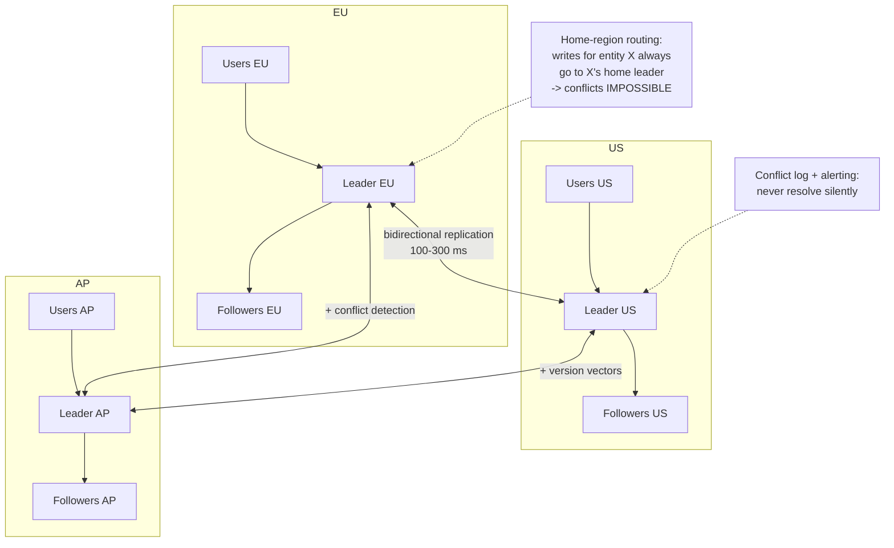
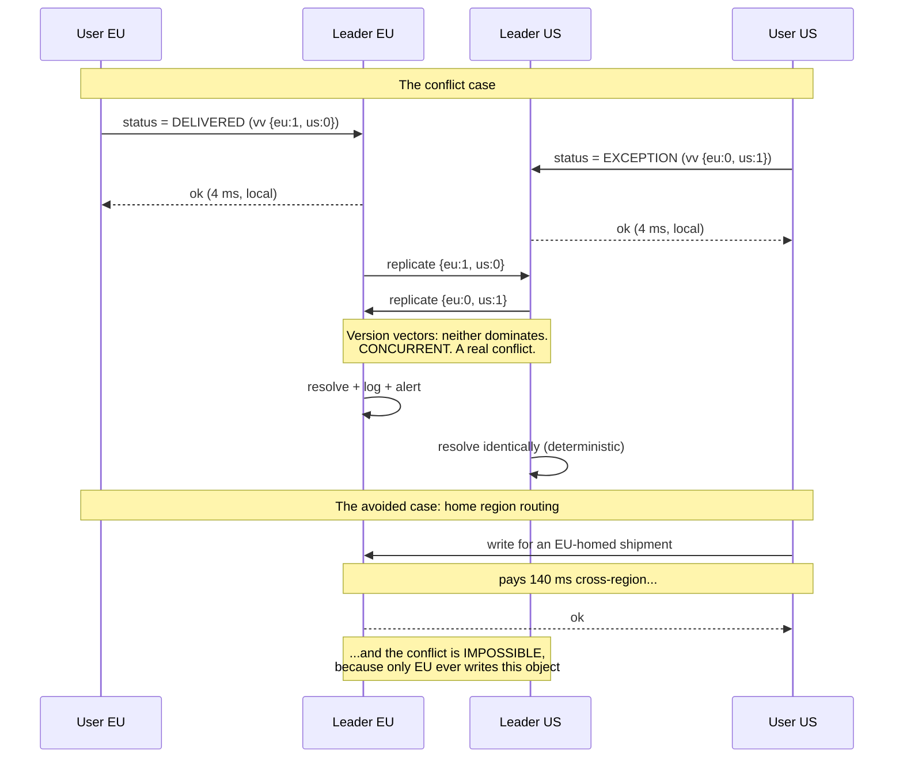

# Chapter 45: Multi-Leader Replication

## 45.1 Problem Statement

The tracking platform expands to three regions: London, Virginia, and Singapore. Chapter 44's single leader lives in London.

**Writes from Singapore take 340 milliseconds** before any application work happens, because every write crosses the Pacific and Atlantic to reach London and returns. The depot scanning app times out on handheld devices with poor connectivity, and drivers stop using it.

**A transatlantic link degrades for eleven minutes** and Virginia cannot write at all. Reads work, because there is a local follower, so the system looks half-alive and is entirely unusable for the people scanning parcels.

The obvious fix is a leader per region. Six weeks after doing it:

**A shipment's status goes backwards.** Singapore marked it `DELIVERED` at 09:14:02 local. London marked it `IN_TRANSIT` at 09:14:03 local. The clocks differ by 400 milliseconds, last-write-wins picked London, and a delivered parcel is showing as in transit forever.

**Two customers were assigned the same tracking code,** because uniqueness is enforced per leader and both leaders issued it before learning of the other.

**A shipment was deleted in London and updated in Virginia** in the same second. The update recreated a partial row with only the updated columns populated. Nobody noticed for nine days.

**And the delivery address is simply wrong** for 340 shipments. Two concurrent edits, last-write-wins, and the loser's version is unrecoverable because nothing kept it.

Every one of these is the same failure: **two nodes accepted conflicting writes and something had to decide, and the something was a clock.**

## 45.2 Why This Problem Exists

**Removing the single leader removes the single order.** Chapter 44's whole benefit came from one node sequencing everything. With several leaders there is no sequence, only several sequences that must be merged, and merging requires deciding which write wins.

**Conflicts are not rare or exotic, they are the defining case.** Any two writes to the same object on different leaders within one replication delay conflict, and the replication delay across regions is hundreds of milliseconds.

**Clocks cannot order events across machines.** Network Time Protocol keeps servers within tens of milliseconds at best, sometimes far worse, and clocks go backwards during adjustments. Last-write-wins by timestamp is therefore a coin flip for concurrent writes, and Section 45.1's first incident is exactly that coin landing wrong.

**Constraints become unenforceable.** Uniqueness requires knowing about every write that could conflict, which is precisely what a leader gives you and multi-leader takes away.

**And the conflicts are invisible when they occur.** A last-write-wins system silently discards the loser. Nothing errors, nothing logs, and the data is simply wrong until a human notices.

## 45.3 Real World Analogy

Two offices maintaining the same customer file, syncing by post.

**Why two offices at all?** Because staff in Singapore should not have to phone London to update a record, and because when the phone line is down the Singapore office should keep working.

**Both offices amend the file, and copies cross in the post.** Now each office holds a version the other has not seen. Neither is wrong. Both are incomplete.

**Somebody has to decide what the file says.** The options are all unsatisfying. Take whichever amendment has the later timestamp, though the two offices' clocks disagree and one may be minutes off. Take London's always, which makes Singapore's work pointless. Keep both versions and ask a person, which is correct and does not scale. Or design the file so both amendments can be kept, which only works for some kinds of amendment.

**And "this reference number must be unique across the company" is now unenforceable,** because neither office can check the other's book before issuing one. The only fix is to give each office its own range of numbers, decided in advance.

**The critical detail:** if the two offices amend *different* customers, nothing goes wrong. All the difficulty comes from both touching the same record. Which is why the whole design comes down to arranging for that to be rare or impossible.

## 45.4 Simple Explanation

**Multi-leader replication lets several nodes accept writes, and replicates between them.** It is also called master-master or active-active.

```
SINGLE LEADER                    MULTI-LEADER
   writes                    writes          writes
     |                          |               |
  [LEADER] --> followers    [LEADER EU] <--> [LEADER US]
                                 |               |
                             followers       followers

One order. No conflicts.    Two orders. Conflicts are inevitable
                            and must be resolved.
```

**What you gain:**

| Gain | Why it matters |
|---|---|
| **Local write latency** | Singapore writes to Singapore. 4 ms, not 340 ms |
| **Writes survive a partition** | Each region keeps working when links fail |
| **No single write bottleneck** | Though Chapter 42 addresses this better |

**What you pay, in one sentence:**

```
You must decide what happens when two leaders write to the same
object concurrently, and every available answer loses information,
requires human input, or requires a data model built for merging.
```

**The one rule that makes multi-leader workable:**

> **Arrange for conflicts to be impossible, not for them to be resolved well.**

Every successful multi-leader deployment does this. Partition writes so each object has a home leader. Use data types that merge without ambiguity. Make writes append-only rather than mutating. Conflict resolution is the fallback, not the plan.

**When it is genuinely the right choice:**

| Situation | Why |
|---|---|
| Multi-region with local write latency requirements | The only way to get local writes |
| Offline-capable clients | Every phone is a leader; sync on reconnect |
| Collaborative editing | Concurrent edits are the product (Chapter 126) |
| Regions must survive isolation | Each region writes independently |

**When it is not:**

| Situation | Use instead |
|---|---|
| "It scales writes" | Chapter 42's sharding. Cleaner and no conflicts |
| Availability during failover | Chapter 44's fast automated failover |
| Financial or inventory correctness | Single leader. Conflicts here are unacceptable |

## 45.5 Technical Deep Dive

### 45.5.1 What a conflict actually is

Two writes conflict when they are **concurrent**, meaning neither happened before the other in the causal sense. Not "at the same time by the clock", but "neither leader had seen the other's write when it made its own".

```
Leader EU                          Leader US
t=0  read shipment 9f31            t=0  read shipment 9f31
     status = IN_TRANSIT                status = IN_TRANSIT
t=1  write status = DELIVERED      t=1  write status = EXCEPTION
t=2  ---- replicate --------------------> receives EU's write
t=2  <--------------------- replicate --- receives US's write

Both leaders now hold two versions of one row and neither
write saw the other. THIS is a conflict.

The window is the replication delay. Cross-region, that is
100 to 300 ms, which is a large window for a busy object.
```

**Conflict probability rises with the square of write rate on an object**, which is why a hot row is where all your conflicts live and a cold row may never see one.

### 45.5.2 The resolution strategies

Six approaches, each losing something different.

**1. Last write wins (LWW).** Compare timestamps, keep the later one.

```
Simple, and it silently discards data.

Worse: it relies on clock synchronisation between machines.
NTP keeps clocks within tens of milliseconds at best. Two writes
100 ms apart may be ordered backwards. Section 45.1's first incident.

Cassandra's default. DynamoDB global tables' default.
Correct only when losing a write is genuinely acceptable.
```

**2. Highest node ID wins.** Deterministic, arbitrary, and at least it does not depend on clocks. Same data loss, more predictable.

**3. Keep both, resolve later.** Store both versions as siblings and hand them to the application or the user.

```
Riak's default. Correct in that nothing is lost, and it moves
the problem into your code, where it is at least visible.
Amazon's original shopping cart did this: on conflict, merge
the carts by union, which resurrects deleted items but never
loses an addition. A deliberate choice about which error is worse.
```

**4. Application-specific merge.** Write a resolution function per type of conflict.

```java
// The honest version: conflicts are resolved by domain logic,
// because only the domain knows which outcome is correct.
public Shipment resolve(Shipment a, Shipment b) {
    // Status has a defined progression. The furthest-along wins,
    // regardless of clocks or node identity, because a delivered
    // parcel cannot become in-transit again.
    Status winner = Status.furthestAlong(a.status(), b.status());

    // Events are append-only, so union them and deduplicate by ID.
    Set<Event> events = new TreeSet<>(comparing(Event::id));
    events.addAll(a.events());
    events.addAll(b.events());

    // Address has no natural rule. Keep both and flag for review,
    // because silently picking one is how 340 addresses got corrupted.
    if (!a.address().equals(b.address())) {
        conflicts.record(a.id(), a.address(), b.address());
    }
    return new Shipment(a.id(), winner, events, a.address());
}
```

**5. CRDTs: conflict-free replicated data types.** Data structures where concurrent updates merge deterministically by construction, so there is no conflict to resolve.

| CRDT | Merge rule | Use for |
|---|---|---|
| G-Counter | Sum of per-node counters | Counters that only increase |
| PN-Counter | Two G-Counters, increments and decrements | Counters that go both ways |
| G-Set | Union | Sets that only grow |
| OR-Set | Union with unique add tags | Sets with removal |
| LWW-Register | Timestamp, with a tie-break | Single values, still lossy |
| RGA / Logoot | Position identifiers | Collaborative text (Chapter 126) |

```
A counter as a plain integer CANNOT be merged:
  EU sees 5, adds 1 -> 6
  US sees 5, adds 1 -> 6
  merge: 6. One increment lost.

As a G-Counter, each node tracks its own:
  EU: {eu:1, us:0}   US: {eu:0, us:1}
  merge: element-wise max -> {eu:1, us:1}, total 2. Correct.
```

CRDTs work beautifully and only for operations that are commutative, associative, and idempotent. **They cannot enforce a global invariant** such as "this counter must never exceed 100", because enforcing that requires knowing about writes you have not seen.

**6. Avoid the conflict.** Route all writes for a given object to one leader. The only strategy that loses nothing.

```
Customer 88's home region is EU.
ALL writes to customer 88 go to the EU leader, from anywhere.
Reads are served locally everywhere.

-> conflicts are IMPOSSIBLE for that object
-> writes from Singapore for an EU customer still pay the round trip,
   but only for that customer's writes
```

**This is what most successful multi-region systems actually do,** and it is worth recognising that it is single-leader-per-object with the leadership distributed across regions.

### 45.5.3 The topologies

```
ALL-TO-ALL                 STAR                     CIRCULAR
  EU <---> US               EU                       EU -> US
   \      /                 |                        ^      |
    \    /              US--HUB--AP                  |      v
     \  /                                            AP <---+
      AP

Every leader talks       One hub relays.          Each forwards to
to every other.          Hub is a SPOF.           the next. One
n(n-1)/2 links.          Simple, fewer links.     failure breaks
Message ordering         Extra hop's latency.     the ring.
problems.
```

**All-to-all has a subtle failure worth knowing:** messages can arrive out of causal order.

```
EU: INSERT shipment 9f31
EU: UPDATE shipment 9f31 SET status = 'DELIVERED'

Both replicate to AP by different paths. The UPDATE arrives first.
AP tries to update a row that does not exist yet.

Fix: version vectors, so each write records what it depends on,
and a write whose dependencies are missing is buffered.
```

MySQL's group replication, PostgreSQL's BDR, and CouchDB all handle this with causal metadata rather than assuming ordered delivery.

### 45.5.4 Version vectors: knowing what is actually concurrent

The mechanism that distinguishes "this write is newer" from "these writes are concurrent". Timestamps cannot do this; version vectors can.

```
Each leader keeps a counter, incremented on each write it accepts.
A version vector is the set of counters a version has seen.

EU writes:  vv = {eu:1, us:0, ap:0}
US writes:  vv = {eu:0, us:1, ap:0}

Compare: is one vector >= the other in EVERY position?
  {eu:1,us:0} vs {eu:0,us:1}
  eu: 1 > 0, but us: 0 < 1
  -> NEITHER dominates -> genuinely CONCURRENT -> a real conflict

Now:
EU writes:  vv = {eu:1, us:0}
EU writes again after seeing US's write: vv = {eu:2, us:1}
  {eu:2,us:1} dominates {eu:0,us:1} in every position
  -> NOT concurrent. The second causally follows. No conflict.
```

**This is the difference between detecting conflicts correctly and guessing with clocks.** Version vectors tell you conflicts exist; they do not tell you how to resolve them, which is still your problem. But knowing a conflict occurred is the prerequisite for handling it, and last-write-wins does not even provide that.

Riak, Dynamo, and Voldemort all use version vectors. Cassandra does not, which is why its last-write-wins is genuinely lossy.

### 45.5.5 The constraints that stop working

Section 45.1's second and third incidents.

**Uniqueness is unenforceable across leaders.** Both can issue the same value before learning of each other. The fixes are all forms of avoidance:

| Approach | How |
|---|---|
| **Partition the namespace** | EU issues even IDs, US odd. Or prefix by region |
| **Coordination-free identifiers** | UUIDv7 or Snowflake, unique by construction |
| **Route uniqueness checks to one leader** | Gives up local writes for that operation |
| **Detect after the fact** | Accept duplicates and reconcile. Rarely acceptable |

**Foreign keys can be violated transiently.** EU deletes a customer, US creates a shipment referencing them, and both replicate. The result violates a constraint that both leaders believed they were enforcing.

**Delete-update conflicts** are Section 45.1's third incident and have no natural answer. Was the delete or the update intended to win? Systems generally choose one arbitrarily, and the standard mitigation is **soft deletes**: mark rather than remove, so the conflict becomes an ordinary field conflict rather than a structural one.

**Any invariant spanning rows is unenforceable.** "Total inventory must not go negative" requires seeing all writes, which is exactly what multi-leader gives up. If you need that, you need a single leader for that data.

### 45.5.6 Making it work in practice

The four things every successful deployment does.

**1. Home region per entity.**

```java
// The entity's home region is data, and it decides where writes go.
// This is the single most effective conflict-avoidance mechanism.
public class WriteRouter {

    public Leader forWrite(Entity entity) {
        Region home = entity.homeRegion();
        return home == Region.current()
            ? localLeader                        // fast path, most writes
            : remoteLeader(home);                // cross-region, but correct
    }
}
```

**2. Conflict-free data types where possible.** Append-only event lists rather than mutable status fields. Counters as CRDTs. Sets as OR-Sets.

**3. Detect and surface conflicts rather than resolving them silently.**

```java
// The most important line in any multi-leader system.
// A conflict that is resolved silently is data corruption you
// will find out about from a customer, nine days later.
@EventListener
public void onConflict(ReplicationConflict c) {
    metrics.counter("replication.conflict",
        "table", c.table(), "type", c.type()).increment();
    conflictLog.record(c.key(), c.versionA(), c.versionB(), c.resolution());
    if (c.table().equals("addresses")) {
        alerting.raise("Address conflict requires human review: " + c.key());
    }
}
```

**4. Bound the blast radius.** Not all data needs multi-leader. Reference data can be single-leader and replicated read-only. Financial records should be single-leader. Only the data that genuinely needs local writes should be multi-leader.

## 45.6 Architecture Diagram



```
   EU users        US users        AP users
      |               |               |
   LEADER EU  <--> LEADER US  <--> LEADER AP    all-to-all,
      |    ^          |               |  ^      100-300 ms apart
      |    +----------|---------------+  |
      |               |                  |
   followers      followers          followers

  Local writes: 4 ms instead of 340 ms.
  Each region keeps writing when links fail.

  THE COST: two leaders can write the same object concurrently.
    -> version vectors detect it
    -> resolution loses information, needs a human, or needs a CRDT
    -> uniqueness and cross-row invariants are unenforceable

  THE FIX THAT ACTUALLY WORKS:
    home region per entity -> the conflict cannot occur
```

## 45.7 Request Flow



1. **Both writes succeed locally and quickly,** which is the entire point of the topology.
2. **Replication carries version vectors,** so concurrency is detected rather than guessed at.
3. **Neither vector dominates, so this is a genuine conflict,** not a stale write.
4. **Resolution must be deterministic,** or the leaders converge to different states, which is worse than the conflict.
5. **Home-region routing pays latency to make the conflict impossible,** which is almost always the better trade.

## 45.8 Internal Components

| Component | Role | Failure mode | Guard |
|---|---|---|---|
| Per-leader write acceptance | Local low-latency writes | Concurrent writes to one object | Home-region routing |
| Bidirectional replication | Propagates between leaders | Out-of-order arrival breaks causality | Version vectors, buffered application |
| Version vectors | Distinguish concurrent from stale | Absent, so LWW guesses with clocks | Use a system that implements them |
| Conflict resolver | Decides the winner | Non-deterministic, so leaders diverge | Same function, same inputs, everywhere |
| Conflict log | Makes conflicts visible | Absent, so corruption is silent | Log and alert on every conflict |
| Identifier generation | Uniqueness without coordination | Per-leader sequences collide | UUIDv7, Snowflake, or partitioned ranges |
| Soft deletes | Makes delete-update resolvable | Hard deletes create partial rows | Mark, do not remove |
| Topology | Which leaders talk to which | Star hub is a SPOF; rings break | All-to-all with causal metadata |
| Replication lag | Sets the conflict window | Large lag means many conflicts | Monitor per link; alert |
| Data classification | Which data is multi-leader at all | Everything multi-leader by default | Only what needs local writes |

## 45.9 Production Example

**CouchDB and PouchDB** are built around multi-leader as the primary model, and their approach is honest: conflicts are stored rather than resolved, both versions are retained, a deterministic winner is chosen for reads, and the application can enumerate conflicts and resolve them properly. It is the mobile offline-sync case where every device is a leader, and it works because the model tells you conflicts exist rather than hiding them.

**Google Docs and other collaborative editors** use operational transformation or CRDTs, which is multi-leader taken to its logical end: every browser is a leader, conflicts occur constantly, and the data type is designed so that concurrent edits merge deterministically. Chapter 126 covers this in full.

**DynamoDB global tables** offer multi-region active-active with last-write-wins by timestamp, and Amazon's documentation is explicit that concurrent writes to the same item may lose data. Knowing this is the difference between using it correctly and Section 45.1's first incident.

**Amazon's original Dynamo shopping cart** made the trade deliberately: on conflict, take the union of both carts. That resurrects removed items, which is a real bug, and it never loses an addition, which was judged the more important property for a shopping cart. **The lesson is not the merge rule, it is that they chose which error to have.**

**And the counter-example.** Almost no financial system uses multi-leader for account balances, because "the balance must never go negative" is exactly the invariant multi-leader cannot enforce. Those systems keep a single leader per account, which is home-region routing under a different name.

## 45.10 Advantages

- **Local write latency,** which is the only way to get it in a multi-region deployment.
- **Writes survive inter-region partitions,** so each region stays fully functional in isolation.
- **No single write bottleneck,** and no global failover event.
- **Offline operation is natural,** since a disconnected client is just a leader that has not synced.
- **Regional autonomy** for data residency and independent operation.
- **Collaborative workloads become expressible,** because concurrent editing is the model rather than an anomaly.

## 45.11 Limitations

- **Conflicts are unavoidable** and every resolution strategy loses information, needs a human, or needs a purpose-built data type.
- **Last-write-wins depends on clocks,** which are not reliable enough to order events across machines.
- **Uniqueness constraints cannot be enforced.**
- **Cross-row invariants cannot be enforced,** which rules out inventory, balances, and quotas.
- **Delete-update conflicts have no natural resolution.**
- **Causal ordering requires extra metadata** and buffering.
- **Debugging is materially harder,** since state depends on merge history rather than a single sequence.
- **Silent corruption is the default failure mode** unless conflicts are explicitly surfaced.

## 45.12 Trade-offs

| Choice | Gain | Cost | Remove it and |
|---|---|---|---|
| Multiple leaders | Local writes, partition-tolerant writes | Conflicts, no global constraints | Single leader (Ch 44), and cross-region latency |
| Last write wins | Trivial, converges automatically | Silent data loss; depends on clocks | Siblings, and application work |
| Keep siblings | Nothing is lost | The application must resolve them | Silent loss |
| CRDTs | Deterministic merge, no loss | Only for commutative operations; more storage | Manual resolution |
| Home-region routing | Conflicts become impossible | Cross-region latency for non-local writes | Conflicts on every hot object |
| Soft deletes | Delete-update becomes resolvable | Rows accumulate; retention needed | Partial rows from delete-update races |
| Version vectors | Correct conflict detection | Metadata per write, and it grows | Clock-based guessing |
| All-to-all topology | No SPOF, lowest latency | n(n-1)/2 links, out-of-order delivery | A hub SPOF, or a fragile ring |

The trade at the centre: **you exchange the ability to enforce global correctness for the ability to write locally and survive partitions.** Chapter 14's CAP theorem in its most concrete form, and the reason multi-leader is right for collaborative and offline systems and wrong for anything with a global invariant.

## 45.13 Common Mistakes

- **Choosing multi-leader for write scaling.** Chapter 42's sharding does that without conflicts.
- **Last-write-wins on data where losing a write matters,** which is Section 45.1's first and fourth incidents.
- **Trusting clocks to order events across machines.**
- **Not logging conflicts,** so corruption is discovered by customers.
- **Assuming unique constraints still work.** They do not.
- **Auto-increment identifiers,** which collide across leaders.
- **Hard deletes,** producing partial rows from delete-update conflicts.
- **Non-deterministic resolution functions,** so leaders converge to different states.
- **Making everything multi-leader** instead of only the data that needs it.
- **Ignoring causal ordering** in all-to-all topologies.
- **Using it for invariants it cannot enforce:** balances, inventory, quotas.
- **No conflict rate metric,** so a rising rate is invisible until it is a problem.

## 45.14 Interview Questions

1. What does multi-leader buy, and what is the fundamental cost?
2. Define a conflict precisely. Why is "at the same time" the wrong definition?
3. Why is last-write-wins by timestamp unreliable?
4. Compare version vectors with timestamps for conflict detection.
5. What is a CRDT? Give two, and explain what CRDTs cannot do.
6. How do you handle uniqueness in a multi-leader system?
7. Why do delete-update conflicts have no natural resolution, and what mitigates them?
8. Explain home-region routing and why it is usually the right answer.
9. Compare the three topologies and their failure modes.
10. When is multi-leader clearly wrong?
11. Why is a silent conflict resolution worse than a failed write?

## 45.15 Production Best Practices

- **Use home-region routing.** Give every entity an owning leader and route its writes there. This is the highest-value practice in the chapter.
- **Only make multi-leader the data that needs local writes.** Everything else is single-leader with read-only replication.
- **Never use last-write-wins for data whose loss matters.**
- **Log and alert on every conflict,** with a metric per table and per type.
- **Use version vectors,** not timestamps, for detection.
- **Generate identifiers without coordination:** UUIDv7 or Snowflake.
- **Use soft deletes** so delete-update conflicts are resolvable.
- **Make resolution functions deterministic and pure,** and unit test them with both orderings.
- **Model as append-only where you can.** Event lists merge; mutable status fields do not.
- **Keep global invariants on a single leader.** Balances, inventory, and quotas do not belong here.
- **Monitor replication lag per link,** since lag is the conflict window.
- **Test with real partitions,** writing to both sides and verifying convergence and the conflict log.

## 45.16 Summary

Multi-leader replication lets several nodes accept writes, which buys two things nothing else can: writes that complete at local latency, and writes that keep working when the link between regions fails. For a system spanning continents, or one whose clients are phones that go offline, those are not optimisations, they are the requirement.

The cost is precise and unavoidable. Chapter 44's single leader gave you one total order of changes, and everything convenient followed from it: no conflicts, enforceable uniqueness, and constraints that meant something. Removing the single leader removes that order. Two leaders can now accept writes to the same object without either seeing the other, and there is no authority that decides which came first.

That makes conflict resolution the defining problem rather than an edge case, and **every available strategy gives something up.** Last-write-wins is trivial and silently discards data, and worse, it depends on clocks that are not synchronised well enough to order events milliseconds apart, which is how a delivered parcel reverts to in-transit forever. Keeping both versions loses nothing and moves the work into your application. CRDTs merge deterministically and only apply to operations that commute. And none of them can enforce a global invariant like uniqueness or a non-negative balance, because enforcing that requires knowing about writes you have not yet seen.

So the practical conclusion is counter-intuitive: **the goal is not to resolve conflicts well, it is to arrange for them not to happen.** Every successful multi-leader deployment does this. Give each entity a home region and route its writes there, so two leaders never touch the same object. Model data as append-only events rather than mutable fields, so merging is a union. Use identifiers that are unique by construction. Keep the data with real invariants, balances and inventory and quotas, on a single leader where the invariant can actually be checked.

And whatever else you do, **make conflicts visible.** A conflict that is resolved silently is data corruption with no error, no log line, and no alert, and you will find out about it from a customer nine days later. Logging every conflict, alerting on the ones a human should see, and tracking the rate as a metric is the difference between a system whose trade-offs you understand and one that is quietly wrong.

## 45.17 Quick Revision Notes

- **Multi-leader = several nodes accept writes.** Buys local write latency and partition-tolerant writes.
- **The cost: no single order, so conflicts are inevitable.**
- **A conflict is concurrency, not simultaneity:** neither write saw the other.
- **The conflict window is the replication lag,** 100 to 300 ms cross-region.
- **LWW is lossy and clock-dependent.** NTP cannot order events milliseconds apart.
- **Version vectors detect concurrency correctly.** Timestamps do not.
- **CRDTs merge deterministically** but only for commutative operations, and cannot enforce global invariants.
- **Uniqueness is unenforceable.** Use UUIDv7, Snowflake, or partitioned ranges.
- **Delete-update conflicts have no natural answer.** Use soft deletes.
- **Home-region routing makes conflicts impossible.** The single most effective practice.
- **Resolution must be deterministic,** or leaders diverge.
- **Log and alert on every conflict.** Silent resolution is silent corruption.
- **Not for write scaling** (that is Chapter 42) and **not for global invariants** (balances, inventory).

## 45.18 Mini Quiz

1. Why is "two writes at the same time" the wrong definition of a conflict?
2. Why is last-write-wins by timestamp unreliable across regions?
3. What do version vectors tell you that timestamps cannot?
4. Why can a CRDT counter not enforce "never exceed 100"?
5. How do you get unique tracking codes across three leaders?
6. Why do delete-update conflicts have no natural resolution?
7. Why is home-region routing usually better than any resolution strategy?

**Answers**

1. Because what matters is causality, not wall-clock proximity. Two writes conflict when neither leader had seen the other's write at the time it made its own, which means neither can be said to have happened after the other. Writes separated by several seconds can still be concurrent if replication was delayed, and writes separated by a millisecond are not concurrent if one leader had already received and applied the other. Clock proximity is neither necessary nor sufficient, which is precisely why version vectors, which track what each write causally depends on, detect conflicts correctly while timestamps only approximate it.

2. Because it depends on clocks agreeing between machines, and they do not to the required precision. NTP typically keeps servers within tens of milliseconds and can be much worse under load or with poor connectivity, and clocks can jump backwards during adjustment. Two genuinely concurrent writes a hundred milliseconds apart may therefore carry timestamps in the wrong order, so the arbitrary winner is not even arbitrary in a predictable way. Beyond the clock problem, LWW discards the losing write entirely with no record, so the outcome is both wrong and unrecoverable, which is how a shipment marked delivered reverts to in-transit permanently.

3. Whether two versions are genuinely concurrent or one causally follows the other. A version vector records, for each leader, how many of that leader's writes this version has incorporated, so comparing two vectors component by component gives a definite answer: if one dominates the other in every position, it saw everything the other saw and is strictly newer, so there is no conflict. If neither dominates, each contains something the other lacks and the writes are genuinely concurrent. Timestamps produce a total order always, which means they report an answer even when the correct answer is "these are concurrent and you must decide", and that false confidence is what makes LWW quietly lossy.

4. Because enforcing an upper bound requires knowing the current total, and in a multi-leader system no node knows the total until replication has completed. Each leader can only see its own increments plus whatever has arrived from others, so two leaders can each observe a value of 99, each accept an increment believing the result is 100, and converge on 101. The CRDT merge is still correct in the sense that no increment is lost and all replicas agree, which is exactly what it guarantees. The invariant is what fails, and it fails for the same reason uniqueness does: any global constraint needs a serialisation point, which is what having a leader provides and what multi-leader gives up.

5. Generate them so collisions are impossible without coordination, rather than trying to check for them. UUIDv7 combines a timestamp with random bits, so two leaders cannot produce the same value, and it still sorts roughly by creation time so it indexes reasonably. Snowflake identifiers pack a timestamp, a node identifier, and a per-node sequence into 64 bits, which is more compact and encodes which leader created it. Partitioning the namespace also works, giving each leader a disjoint range or a distinct prefix, and it has the advantage of being human-readable. What cannot work is a shared sequence or an auto-increment column, because each leader would issue values without knowledge of the others.

6. Because the two operations express incompatible intents and nothing in the data indicates which the user meant to prevail. If the delete wins, an update the user made and saw succeed is discarded along with the row. If the update wins, the system must recreate a row that was deliberately removed, and it can only populate the columns the update touched, producing a partial row with missing or default values elsewhere, which is Section 45.1's third incident. The standard mitigation is soft deletion: instead of removing the row, set a deleted flag, which turns the structural conflict into an ordinary field conflict on that flag, resolvable by whatever policy the domain wants, and leaves the rest of the row intact either way.

7. Because it eliminates the problem rather than mitigating it. If every entity has one owning leader and all writes for that entity are routed there, two leaders can never accept concurrent writes to the same object, so there is no conflict to detect, no resolution strategy to choose, and no information to lose. Every resolution strategy, by contrast, is a choice about which data to discard or which work to push into the application. The cost of routing is that writes originating outside an entity's home region pay a cross-region round trip, but that applies only to those writes, while reads stay local everywhere and most writes in practice originate near their entity's home. It is effectively single-leader per object with leadership distributed geographically, which keeps the property that made Chapter 44 simple while still getting local writes for the common case.

## 45.19 Hands-on Exercise

**Part 1: create a conflict.** Two PostgreSQL instances with bidirectional logical replication. Write different values to the same row on both within the replication window. Observe what each converges to.

**Part 2: break last-write-wins with clock skew.** Deliberately skew one node's clock by 500 milliseconds. Write to the earlier-clocked node second and confirm the causally later write loses.

**Part 3: implement version vectors.** Add a vector column, increment per node on write, and implement dominance comparison. Confirm it correctly labels concurrent writes as conflicts and causally ordered ones as not.

**Part 4: build a G-Counter.** Implement a counter as a per-node map merged by element-wise maximum. Increment concurrently on three nodes and confirm no increment is lost. Then try to enforce a maximum value and observe why it fails.

**Part 5: collide on uniqueness.** Use per-node sequences and produce a duplicate. Switch to UUIDv7 and confirm it cannot recur.

**Part 6: delete-update.** Delete a row on one node and update it on the other concurrently. Inspect the result and note which columns are populated. Convert to soft deletes and repeat.

**Part 7: route by home region.** Assign each entity a home leader and route writes accordingly. Drive concurrent write attempts from all regions and confirm the conflict count is zero. Measure the added latency for non-local writes and decide whether the trade is worth it.

**Part 8: make conflicts visible.** Add a conflict log and a metric. Run a mixed workload and produce a report of conflicts by table and type. This report is what tells you whether your model is right.

## 45.20 Further Reading

- *Designing Data-Intensive Applications*, Martin Kleppmann, chapter 5's multi-leader section and chapter 9's causality material.
- *Dynamo: Amazon's Highly Available Key-value Store*, DeCandia et al., SOSP 2007, for version vectors and the shopping cart decision.
- *A Comprehensive Study of Convergent and Commutative Replicated Data Types*, Shapiro et al., 2011, the foundational CRDT paper.
- Martin Kleppmann's writing and talks on CRDTs and Automerge, which are the most accessible treatment available.
- CouchDB's documentation on conflict handling, as a system that surfaces conflicts honestly.
- AWS documentation on DynamoDB global tables, specifically its statements about concurrent writes.
- Chapter 44 of this book for single-leader, Chapter 46 for leaderless, Chapter 14 for CAP, Chapter 18 for eventual consistency, and Chapter 126 for collaborative editing where this model is the product.

---

**Next chapter: Chapter 46, Leaderless Databases.** The third topology: no leader at all, every replica accepting reads and writes, and correctness expressed as arithmetic over quorums rather than as a designated authority.
