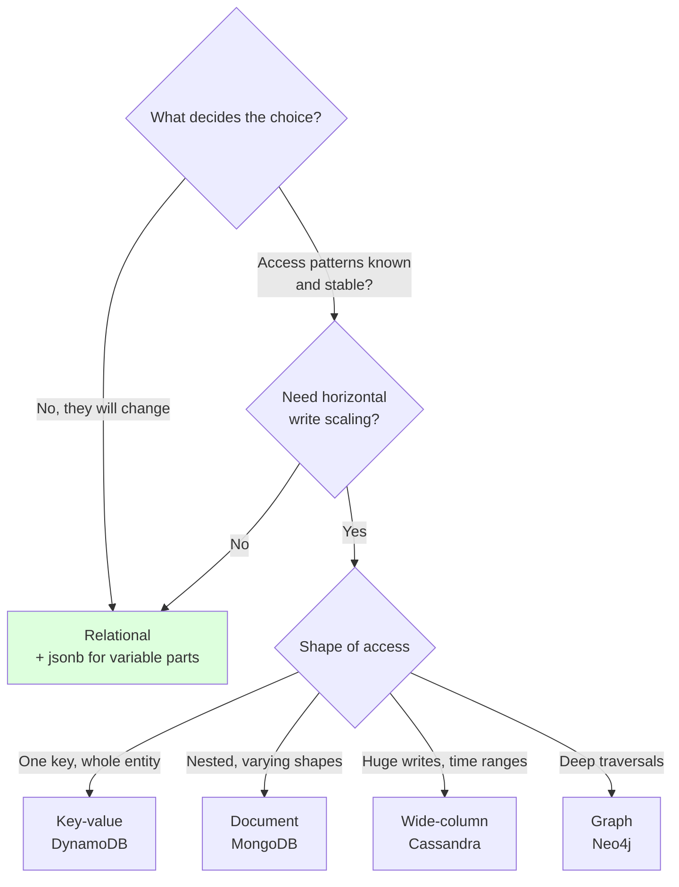
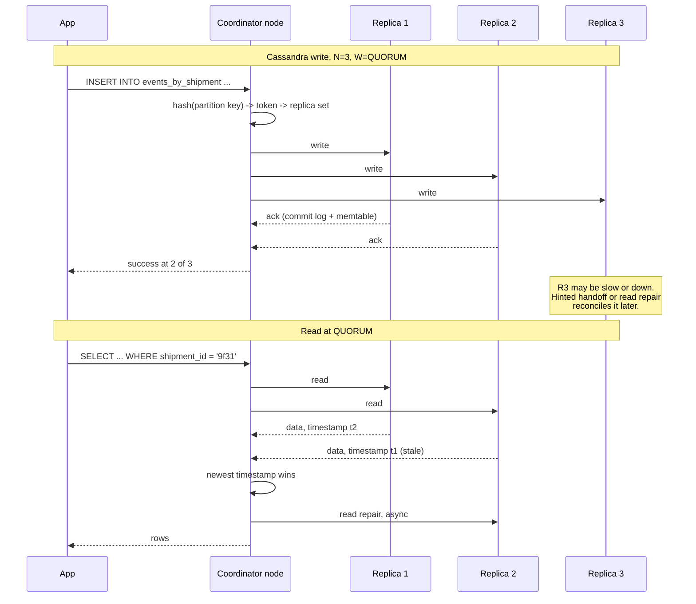

# Chapter 38: NoSQL

## 38.1 Problem Statement

Two teams at the company move off PostgreSQL in the same quarter. One of them is right.

**Team A runs the carrier integration service.** Every carrier returns a different shape of tracking payload: DHL sends nested event arrays, a regional courier sends a flat object with 60 optional fields, a new partner sends something else entirely. Their PostgreSQL schema has 140 columns, most of them null on any given row, and adding a carrier means a migration. They move to a document store, and eighteen months later it is still the right call.

**Team B runs billing.** They move to MongoDB because "it scales" and because the relational schema felt slow to change. Within a year:

- **Two invoices exist for one shipment,** because there is no unique constraint and the application-level check raced.
- **A customer's name is wrong on 40,000 historical documents,** because it was embedded everywhere and the update job failed halfway with nothing to roll back.
- **A finance query nobody anticipated takes four hours,** because the documents are structured for the one access pattern that existed at design time.
- **And the "schemaless" collection has six different shapes in it,** three of which no current code can read, because there was never a migration and old writers kept writing old shapes.

Team B did not have a database problem. They had a schema design problem, and they solved it by moving to a system that would not tell them they still had one.

The chapter's question is how to tell those two situations apart before you commit.

## 38.2 Why This Problem Exists

**"NoSQL" is not a category, it is a negation.** It groups four unrelated data models by what they are not. A document store and a wide-column store have almost nothing in common, and advice that applies to one is often wrong for the other.

**The scaling argument is usually about the wrong thing.** Most teams that "need NoSQL for scale" are nowhere near a single PostgreSQL instance's write ceiling. Chapter 37's connection arithmetic and index design fix more throughput problems than a migration does.

**Schemaless does not mean no schema.** It means the schema moved from the database into your application code, where nothing enforces it and no migration tool tracks it. Team B's six document shapes are a schema, undeclared and unversioned.

**The guarantees you lose are the ones you do not notice losing.** No foreign keys, no multi-object transactions in some systems, no unique constraints across shards. You find out which ones mattered during an incident.

**And the access patterns must be known up front,** because the data model is built around them. That is a genuine strength when the patterns are stable and a serious liability when they are not.

## 38.3 Real World Analogy

Filing cabinets versus a warehouse of labelled crates.

Chapter 37's relational database is a filing cabinet system with a strict clerk. Every document has a defined place, cross-references are checked, and you cannot file an invoice against a customer who does not exist. Ask any question and the clerk can work out an answer, though an unusual question means walking between several cabinets.

**A document store is a warehouse of crates, each holding everything about one thing.** The crate for a shipment contains the shipment, its events, its addresses, all of it. Fetching it is one trip and you get the whole thing.

**The crates do not have to match.** One holds a DHL shipment with nested events, another holds a regional courier's flat record. Nobody checks. That is exactly what Team A needed and exactly what let Team B accumulate six incompatible shapes.

**Nothing stops you filing the same customer name into ten thousand crates.** Changing it means opening ten thousand crates, and if you stop halfway, nobody tells you.

**And the warehouse is arranged for how you usually walk it.** If you always fetch by shipment ID, the aisles are perfect. Ask "which crates mention this depot" and there is no arrangement for that question, so someone walks the entire warehouse.

**The crates scale trivially, though.** A second warehouse takes half the crates, and since no crate references another, nothing breaks. That is the property the filing cabinet cannot match, and it is the real reason to choose crates.

## 38.4 Simple Explanation

**NoSQL means a database that gives up some of Chapter 37's guarantees in exchange for a different data model, easier horizontal scaling, or both.**

There are four families, and they are genuinely different systems:

| Family | Model | Examples | Built for |
|---|---|---|---|
| **Key-value** | Opaque value under a key | DynamoDB, Redis, Riak | Fast lookup by known key, extreme scale |
| **Document** | Nested JSON-like documents | MongoDB, Couchbase, DocumentDB | Varying shapes, aggregate-per-record access |
| **Wide-column** | Rows with dynamic columns, partitioned | Cassandra, ScyllaDB, HBase, Bigtable | Enormous write volume, time-series, known queries |
| **Graph** | Nodes and edges as first-class | Neo4j, Neptune, JanusGraph | Traversals many hops deep |

The unifying idea, when there is one:

```
Relational: model the DATA, then write queries against it.
NoSQL:      model the QUERIES, then store data in that shape.

That inversion is the whole thing. It is why NoSQL is fast
when the queries are known, and painful when they change.
```

**The three real reasons to choose NoSQL,** as opposed to the ones people give:

1. **The data genuinely has no fixed shape.** Team A's carrier payloads. Forcing them into columns produces a 140-column table that is mostly null.
2. **You need horizontal write scaling** beyond what one primary can take, and you are willing to design around partition keys. Chapter 42.
3. **The access pattern is one exact shape at enormous volume,** such as "fetch everything about one entity" or "append events, read a time range".

And the reasons that are usually wrong: "it scales", "migrations are annoying", "we do not know the schema yet", "it is faster". The last one is often true for a single access pattern and false overall.

## 38.5 Technical Deep Dive

### 38.5.1 Key-value: the partition key is the design

DynamoDB is worth understanding in detail because its constraints are the clearest expression of what key-value systems trade.

Every item has a **partition key** deciding which physical partition holds it, and optionally a **sort key** ordering items within that partition. Together they form the primary key. That is the entire query surface:

```
GetItem       by exact partition key (+ sort key)
Query         one partition key, a range over sort keys
Scan          reads EVERYTHING. Not a query, an admission of defeat
```

There is no "find all shipments where status is IN_TRANSIT" unless you built an index for it. So the model is designed backwards from the queries:

```
Access patterns, decided BEFORE the schema:
  1. Get a shipment by tracking code
  2. List a customer's shipments, newest first
  3. List a depot's pending shipments

Single-table design:
  PK                    SK                        attributes
  ------------------------------------------------------------------
  SHIPMENT#9f31         META                      status, eta, ...
  SHIPMENT#9f31         EVENT#2026-08-12T09:14Z   location, scan_type
  SHIPMENT#9f31         EVENT#2026-08-12T11:02Z   location, scan_type
  CUSTOMER#88           SHIPMENT#2026-08-12#9f31  tracking_code, status

  Pattern 1: Query PK = SHIPMENT#9f31              (item plus its events, one read)
  Pattern 2: Query PK = CUSTOMER#88, SK descending (one read, already sorted)
  Pattern 3: needs a GSI on (depot_id, status)
```

That table is doing something a relational schema never would: **storing a shipment and its events in one partition so a single read returns both**, and **duplicating shipment summary data under the customer** so pattern 2 is also one read.

The duplication is deliberate and it is the cost. Changing a shipment's status means writing it in two places, and DynamoDB gives you `TransactWriteItems` to do that atomically, up to 100 items, at double the write cost.

**Secondary indexes** buy back some flexibility:

| Index type | What it does | Cost |
|---|---|---|
| **LSI** (local) | Alternative sort key, same partition key | Shares the partition's 10 GB limit |
| **GSI** (global) | Entirely different partition and sort key | A full async replica of the data, eventually consistent |

A GSI is a separate copy of the table maintained asynchronously. That means **reads from a GSI can be stale**, and a GSI whose throughput is exhausted throttles writes on the base table. Both surprise people.

**The hot partition problem** is the one that causes incidents. Throughput is allocated per partition, so a partition key with skew concentrates traffic:

```
PK = "DEPOT#LHR"     -> every LHR shipment on one partition
                        LHR is 40 percent of volume
                        that partition throttles while others idle

Fix: add entropy to the key.
PK = "DEPOT#LHR#" + (hash(shipment_id) % 10)
                     -> spread across 10 partitions
                     -> reads must now query all 10 and merge
```

That trade, write spread against read fan-out, appears in every partitioned system. Chapter 42 covers it generally.

### 38.5.2 Document stores: embed or reference

The central modelling decision in MongoDB, and the one Team B got wrong.

```javascript
// EMBEDDED: everything about a shipment in one document.
{
  _id: "9f31",
  tracking_code: "TRK9F31",
  customer: { id: 88, name: "Ana Reyes", email: "..." },   // <-- copy
  status: "IN_TRANSIT",
  events: [
    { at: "2026-08-12T09:14Z", location: "LHR", type: "SCAN" },
    { at: "2026-08-12T11:02Z", location: "M4",  type: "DEPART" }
  ]
}
```

One read gets everything. No joins. Perfect until the customer changes their name, at which point you own an update across every document that embedded it, with no transaction spanning them and no rollback if it fails halfway. That is Team B's second incident.

The rules that hold up in practice:

| Embed when | Reference when |
|---|---|
| The child has no life of its own | The child is queried independently |
| It is always read with the parent | It is shared by many parents |
| The set is bounded | The set grows without limit |
| It changes with the parent | It changes on its own schedule |

**The unbounded array is the classic failure.** Embedding events in a shipment is fine at 20 events and a disaster at 200,000: MongoDB has a 16 MB document limit, and every update rewrites the whole document. When a child set is unbounded, it is a separate collection.

**Schema validation should be on.** "Schemaless" is a capability, not an instruction:

```javascript
db.createCollection("shipments", {
  validator: { $jsonSchema: {
    bsonType: "object",
    required: ["tracking_code", "status", "customer_id", "schema_version"],
    properties: {
      status: { enum: ["PENDING","IN_TRANSIT","DELIVERED","EXCEPTION"] },
      schema_version: { bsonType: "int" }
    }
  }},
  validationLevel: "strict"
});
```

That `schema_version` field is the fix for Team B's fourth incident. **Documents carry their version, readers handle the versions in circulation, and a background job migrates old ones forward.** Without it, "schemaless" means "the shapes accumulate and nobody knows which exist".

MongoDB has had multi-document ACID transactions since 4.0, which removes one historical objection. They are still more expensive than single-document writes, and the design goal remains to make the document the transaction boundary.

### 38.5.3 Wide-column: the query is the table

Cassandra is the most different from relational thinking, and the most misunderstood.

Data is partitioned by a **partition key** and clustered within the partition by **clustering columns**. The critical rule:

> **You cannot query what you did not model.** No joins, no ad hoc `WHERE`, no aggregations across partitions. A query that would need a scan is refused rather than run slowly.

```sql
-- Cassandra. One table PER QUERY, and the duplication is the design.

-- Query: events for a shipment, newest first
CREATE TABLE events_by_shipment (
    shipment_id   text,
    event_at      timestamp,
    location      text,
    scan_type     text,
    PRIMARY KEY ((shipment_id), event_at)
) WITH CLUSTERING ORDER BY (event_at DESC);

-- Query: a depot's shipments for a given day.
-- Same data, stored again, because this is a different question.
CREATE TABLE shipments_by_depot_day (
    depot_id      int,
    day           date,
    created_at    timestamp,
    shipment_id   text,
    status        text,
    PRIMARY KEY ((depot_id, day), created_at)
) WITH CLUSTERING ORDER BY (created_at DESC);
```

Note `(depot_id, day)` as a composite partition key. Partitioning on `depot_id` alone would grow one partition forever; adding the day bounds it. **Unbounded partition growth is the number one Cassandra design error**, and the guidance is to keep partitions under about 100 MB.

Cassandra's write path is why it absorbs enormous write volume:

```
write -> commit log (durability)  +  memtable (in memory)
                                        |  flushes when full
                                     SSTable on disk (immutable, sorted)
                                        |
                                     compaction merges SSTables in the background

No read before write. No in-place update. An update is just a
newer row with a later timestamp; the read merges versions.
```

That is a log-structured merge tree, and it makes writes nearly free at the cost of read amplification and background compaction load. Chapter 39 covers LSM trees against B-trees properly.

**Deletes are the trap.** A delete writes a tombstone rather than removing data, and tombstones are only reclaimed after `gc_grace_seconds` (10 days by default, because they must reach every replica). A queue-like workload of insert-then-delete accumulates tombstones until reads scan through hundreds of thousands of them and time out. **Cassandra is a poor queue**, and this is why.

**Tunable consistency** is Chapter 14's trade exposed as a per-query parameter:

```
R + W > N  gives strong consistency (Chapter 19)

N=3, W=QUORUM(2), R=QUORUM(2)  ->  2+2 > 3, strongly consistent
N=3, W=ONE,       R=ONE        ->  1+1 < 3, eventually consistent, fastest
```

Chapter 46 covers this as leaderless replication.

### 38.5.4 Graph: when relationships are the data

Relational databases handle one or two joins well. A query like "people connected to Ana within four hops who work at a company that ships through LHR" is four self-joins, and cost grows multiplicatively.

A graph database stores edges as direct pointers, so traversal is pointer-chasing rather than index lookups:

```cypher
MATCH (a:Customer {id: 88})-[:SHIPS_WITH*1..4]->(c:Carrier)
WHERE c.hub = 'LHR'
RETURN DISTINCT c.name
```

Use it when **traversal depth is variable or large**, when the relationships themselves carry properties you query, and when the questions are about connection structure. Fraud rings, recommendations, network topology, access control hierarchies.

Do not use it as a general store. Graph databases are typically single-machine or awkwardly distributed, because partitioning a graph without cutting the edges you traverse is genuinely hard.

### 38.5.5 The comparison that actually decides it

| | Relational | Key-value | Document | Wide-column | Graph |
|---|---|---|---|---|---|
| Query flexibility | **Highest** | Lowest | Medium | Low | High for traversals |
| Ad hoc queries | Yes | No | Limited | **No** | Yes |
| Horizontal writes | Hard | **Trivial** | Good | **Trivial** | Hard |
| Joins | Yes | No | No, embed instead | No | Native |
| Multi-record transactions | Yes | Limited | Yes, costlier | Limited | Yes |
| Schema enforcement | Yes | No | Optional | Partial | Partial |
| Unique constraints | Yes | Per key only | Per collection | **No** | Yes |
| Access patterns must be known upfront | No | **Yes** | Mostly | **Absolutely** | No |

The row that decides most real cases is the last one. **If you cannot list your access patterns today and be confident they will not change much, choose relational.** The flexibility of a query planner is worth more than the scaling you probably do not need yet.

### 38.5.6 Spring Boot across the models

```java
// Document: Spring Data MongoDB.
@Document(collection = "shipments")
public class ShipmentDoc {
    @Id private String id;
    @Indexed(unique = true) private String trackingCode;

    private int schemaVersion;              // ALWAYS. See 38.5.2.
    private long customerId;                // reference, not embedded
    private String customerNameSnapshot;    // deliberate copy, frozen at creation
    private Status status;
    private List<ShipmentEvent> recentEvents;   // bounded: last 20 only
}
```

```java
// Key-value: DynamoDB single-table. The keys ARE the model.
@DynamoDbBean
public class ShipmentItem {
    private String pk;   // SHIPMENT#9f31
    private String sk;   // META  or  EVENT#<iso timestamp>

    @DynamoDbPartitionKey public String getPk() { return pk; }
    @DynamoDbSortKey      public String getSk() { return sk; }
}
```

```java
// Wide-column: Spring Data Cassandra. Note the composite partition key.
@Table("shipments_by_depot_day")
public class ShipmentsByDepotDay {
    @PrimaryKeyColumn(name="depot_id", type=PARTITIONED, ordinal=0) private int depotId;
    @PrimaryKeyColumn(name="day",      type=PARTITIONED, ordinal=1) private LocalDate day;
    @PrimaryKeyColumn(name="created_at", type=CLUSTERED, ordinal=2,
                      ordering=DESCENDING) private Instant createdAt;
    private String shipmentId;
    private String status;
}
```

And the one modern option that dissolves much of the argument:

```sql
-- PostgreSQL. Relational guarantees AND schemaless documents, same row.
ALTER TABLE shipments ADD COLUMN carrier_payload jsonb;
CREATE INDEX ON shipments USING gin (carrier_payload);

SELECT * FROM shipments
WHERE carrier_payload @> '{"service": "express"}'      -- indexed containment
  AND customer_id = 88;                                -- and a real foreign key
```

**Team A's problem is solvable in PostgreSQL with `jsonb`.** Varying payloads in an indexed document column, everything structured still in columns with constraints and foreign keys. This is the option people skip because the argument gets framed as SQL versus NoSQL rather than as which parts of the data need which treatment.

## 38.6 Architecture Diagram



```
 Can you list your access patterns, and will they hold?
   |
   NO ---------------------> RELATIONAL (+ jsonb for the variable parts)
   |                          the query planner is worth more than the scaling
   YES
   |
 Do you actually need horizontal WRITE scaling?
   |
   NO ---------------------> RELATIONAL. Fix indexes and pooling first (Ch 37)
   YES
   |
 What shape is the access?
   |
   +-- one key, whole entity  --> KEY-VALUE     (DynamoDB)
   +-- nested, varying shapes --> DOCUMENT      (MongoDB)
   +-- huge writes, ranges    --> WIDE-COLUMN   (Cassandra)
   +-- deep traversals        --> GRAPH         (Neo4j)
```

## 38.7 Request Flow



1. **The partition key alone decides placement,** by hashing to a token on the ring (Chapter 50).
2. **The write goes to all replicas, and returns when W of them acknowledge.** Nothing is a leader.
3. **A slow or dead replica does not fail the write,** it is reconciled later by hinted handoff or read repair.
4. **The read contacts R replicas and reconciles by timestamp,** last write wins.
5. **R + W > N is what makes a read see the latest write.** Below that, you have eventual consistency (Chapter 18).

## 38.8 Internal Components

| Component | Role | Failure mode | Guard |
|---|---|---|---|
| Partition key | Decides data placement | Skew, so one partition takes all traffic | Add entropy; accept read fan-out |
| Sort/clustering key | Ordering within a partition | Unbounded partition growth | Compound key including a time bucket |
| Secondary index / GSI | Alternative access path | Async, so stale; throttling propagates to the base table | Provision separately, treat reads as stale |
| Embedded documents | Single-read aggregates | Unbounded arrays; duplicated fields to update | Bound the set; reference shared entities |
| Schema version field | Makes evolution tractable | Absent, so shapes accumulate silently | Mandatory field plus a migration job |
| Validation rules | Reintroduce the enforcement | Off by default | `$jsonSchema` strict from day one |
| Tunable consistency | Per-query CAP choice | Defaults to fast and stale | `R + W > N` where correctness needs it |
| Tombstones | Represent deletes | Accumulate, causing read timeouts | Do not use as a queue; tune `gc_grace_seconds` |
| Compaction | Merges immutable files | Falls behind under write load, read amplification climbs | Monitor pending compactions |
| Denormalised copies | Serve a second query shape | Diverge, with no transaction to fix them | Write both in one batch; reconcile periodically |

## 38.9 Production Example

**Netflix runs Cassandra at very large scale** for viewing history and similar workloads, and the fit is exact: enormous write volume, access always by a known key, time-ordered reads, and tolerance for eventual consistency on data where a few seconds of staleness is invisible. They have published extensively on operating it, and the recurring theme is that the data model, not the cluster, determines whether it works.

**Amazon's DynamoDB paper and its predecessor Dynamo** are the origin of much of this chapter. The shopping cart example is the canonical case for choosing availability over consistency: a cart that is briefly wrong is better than a cart that is unavailable, and resurrection of a deleted item is an acceptable failure mode when the alternative is a customer who cannot buy anything.

**Discord's migration from MongoDB to Cassandra to ScyllaDB** is worth reading in full because it documents outgrowing two databases for different reasons. MongoDB's working set stopped fitting in memory; Cassandra's tombstones and garbage collection pauses became the constraint on a message workload that deletes.

**And the counter-example matters as much.** Stripe, Shopify, GitHub, and Instagram run enormous businesses on relational databases, sharded when necessary. The public record does not support "you will need NoSQL at scale". It supports "you will need to understand your database at scale".

## 38.10 Advantages

- **Horizontal write scaling is a design property,** not a migration project, in key-value and wide-column systems.
- **No fixed schema** genuinely helps when the data has no fixed shape.
- **Single-read aggregates** eliminate joins for the access pattern the model was built around.
- **Availability under partition** is selectable, which relational systems with a single primary cannot offer.
- **Predictable latency at scale,** because there is no planner making a different choice as data grows.
- **Purpose-built models** are dramatically better within their domain: graph traversal, time-series appends, cache-like lookups.
- **Operational scaling is often simpler:** add nodes, rebalance, no resharding project.

## 38.11 Limitations

- **Ad hoc queries are limited or absent.** A question you did not design for may be unanswerable without a scan or a new table.
- **Referential integrity is yours to maintain,** and nothing will notice when it breaks.
- **Unique constraints across partitions do not exist** in most of these systems.
- **Denormalised copies diverge,** and reconciliation is application code.
- **Schema evolution is undisciplined by default,** so shapes accumulate.
- **Eventual consistency surfaces in the application,** and every read-after-write path needs thought (Chapter 18).
- **Rebalancing skewed partitions is painful,** because the partition key is often baked into every key already written.

## 38.12 Trade-offs

| Choice | Gain | Cost | Remove it and |
|---|---|---|---|
| Denormalise into query-shaped tables | One read per query, no joins | Multiple copies to write and keep aligned | You need joins, which these systems do not have |
| No schema enforcement | Frictionless shape changes | Undeclared shapes accumulate | You are back to migrations, which is often correct |
| Partition-key-only access | Predictable O(1) routing at any scale | Unanticipated queries need a new index or table | You need a planner, which means relational |
| Eventual consistency | Availability under partition, low latency | Stale reads, conflict resolution in the app | Quorum reads and writes, and their latency |
| Embedded documents | One read for the whole aggregate | Duplication, unbounded growth risk | References, and the joins you do not have |
| LSM storage | Very fast writes | Read amplification, compaction load, tombstones | B-trees, and slower writes |
| Loss of foreign keys | Faster writes, no cross-shard checks | Orphaned data nothing detects | Relational, or application-level checks that race |

The honest summary: **NoSQL trades the ability to ask new questions for the ability to answer known questions at scale.** Whether that is a good trade depends entirely on how confident you are about the questions.

## 38.13 Common Mistakes

- **Choosing NoSQL for scale you do not have.** Most teams are far from one well-tuned relational primary's ceiling.
- **Treating "schemaless" as "no schema needed"** rather than "the schema is now your problem".
- **No `schema_version` field,** so incompatible shapes accumulate with no migration path.
- **Embedding unbounded collections,** hitting document limits and rewriting large documents on every append.
- **Embedding data that changes independently,** creating a mass-update problem with no transaction.
- **Partition keys with skew,** producing hot partitions that throttle while the rest idle.
- **Unbounded partitions,** which degrade until the partition cannot be read.
- **Using Cassandra as a queue,** accumulating tombstones until reads time out.
- **Assuming a secondary index is consistent.** GSIs are asynchronous.
- **Not knowing your consistency level.** Defaults favour speed over correctness.
- **Modelling relationally in a document store,** with references everywhere and application-side joins. The worst of both.
- **Never considering `jsonb`,** which solves the variable-shape problem without giving up constraints.

## 38.14 Interview Questions

1. What does "NoSQL" actually mean, and why is it a poor category?
2. When would you choose a document store over a relational database, and when is that choice a mistake?
3. Explain embed versus reference. Give a case for each.
4. What is a hot partition, how does it arise, and how do you fix it? What does the fix cost?
5. Why can Cassandra refuse a query rather than run it slowly, and why is that a feature?
6. Explain `R + W > N`. What do you get and what do you pay?
7. Why is Cassandra a bad choice for a work queue?
8. How do you evolve a schema in a schemaless database without breaking readers?
9. A team wants to migrate to MongoDB because migrations are slow. What do you ask them?
10. How does PostgreSQL's `jsonb` change this decision?

## 38.15 Production Best Practices

- **Write down every access pattern before the schema.** If you cannot, you are not ready for a partition-key-driven model.
- **Put a `schema_version` on every document,** and run a migration job that moves old versions forward.
- **Turn on schema validation.** Optional enforcement should not mean absent enforcement.
- **Bound every embedded collection,** and move unbounded ones to their own collection or table.
- **Design the partition key for cardinality and uniformity,** and test with real distributions, not synthetic ones.
- **Include a time bucket in partition keys** for anything that grows forever.
- **Choose consistency levels explicitly per operation,** and document why.
- **Treat secondary index reads as stale** unless the system says otherwise.
- **Monitor partition sizes, tombstone counts, compaction backlog, and throttled requests.** These predict the failures.
- **Keep the source of truth relational where you can,** and derive NoSQL projections from it. Chapter 57's CQRS is this pattern.
- **Evaluate `jsonb` first.** It frequently removes the reason for the migration.

## 38.16 Summary

NoSQL is not one thing and it is not the opposite of SQL. It is four unrelated families, grouped by a negation, each of which gives up some of Chapter 37's guarantees in exchange for a different data model or easier horizontal scaling.

The inversion at the centre of all of them: **relational databases model the data and let you query it however you like later; NoSQL databases model the queries and store data in that shape.** Everything follows. The speed follows, because there is no planner and no join. The scaling follows, because records do not reference each other and can therefore live on different machines. And the rigidity follows, because a question you did not design for may have no efficient answer at all.

That makes the decision a bet on how well you know your access patterns. Team A knew theirs and knew their data had no fixed shape, and they were right. Team B moved because migrations felt slow, and inherited every consistency problem the relational database had been solving invisibly: no unique constraint, so duplicate invoices; embedded copies, so a failed mass update; no declared schema, so six live shapes; and a data model built for one query, so the next question took four hours.

Two things are worth carrying out of this chapter. First, **most "we need NoSQL to scale" conclusions are reached before the relational database has been properly tuned**, and Chapter 37's indexes, pooling, and query plans recover more throughput than a migration. Second, **`jsonb` in PostgreSQL dissolves the most common genuine reason to switch**, since variable-shaped data can live in an indexed document column inside a database that still enforces foreign keys and unique constraints.

Choose NoSQL when the data model genuinely fits, when you have listed the access patterns and believe them, or when you need write scaling one primary cannot give. Not because the schema felt like friction. That friction was the database doing its job.

## 38.17 Quick Revision Notes

- **Four families:** key-value, document, wide-column, graph. Unrelated systems, one label.
- **The inversion:** relational models data then queries it; NoSQL models queries then stores for them.
- **Key-value (DynamoDB):** partition key plus sort key is the entire query surface. Single-table design. GSIs are async.
- **Document (MongoDB):** embed when bounded, owned, and read together. Reference otherwise. 16 MB limit.
- **Wide-column (Cassandra):** one table per query. Partition key plus clustering columns. LSM writes, tombstone deletes, no joins.
- **Graph (Neo4j):** for variable-depth traversals, not general storage.
- **Hot partitions** come from skewed keys. Fix with entropy, pay in read fan-out.
- **Unbounded partitions** are the top wide-column design error. Bucket by time.
- **`R + W > N`** gives strong consistency in leaderless systems (Chapter 46).
- **Tombstones make Cassandra a poor queue.**
- **"Schemaless" means the schema moved to your app.** Use `schema_version` and validation.
- **PostgreSQL `jsonb`** gives variable shapes with constraints intact. Evaluate it first.

## 38.18 Mini Quiz

1. Why is "NoSQL" a misleading category?
2. When should a document be embedded rather than referenced?
3. Your DynamoDB table throttles while overall provisioned capacity is barely used. What happened?
4. Why does Cassandra reject a query instead of running a slow one?
5. What does `R + W > N` buy, and what does it cost?
6. Why does a delete-heavy Cassandra workload eventually stop working?
7. A team wants MongoDB because their carrier payloads have no fixed shape. What should you suggest first?

**Answers**

1. Because it defines a group by what it is not, and the members have almost nothing in common. A key-value store restricted to exact-key lookup, a document store with nested aggregates and secondary indexes, a wide-column store built on log-structured merge trees for write throughput, and a graph database optimised for pointer-chasing traversals are four different technologies with different data models, consistency properties, and failure modes. Advice that is correct for one is frequently wrong for another, so "should we use NoSQL" is not a question that can be answered; "should we use Cassandra for this specific access pattern" is.

2. When the embedded data has no independent existence, is always read together with its parent, is bounded in size, and changes on the same schedule as the parent. Line items on an order fit all four. The reason to care is that embedding buys a single read and pays with duplication: any embedded value that also lives elsewhere must be updated in every document containing it, with no transaction spanning them and no rollback if the job fails partway. Unbounded embedding is worse, because the document grows until it hits the size limit and every append rewrites the entire document.

3. A hot partition. Throughput in DynamoDB is allocated per partition, not pooled across the table, so a partition key with a skewed distribution concentrates traffic onto a small number of physical partitions which throttle while the rest sit idle. The typical cause is a key like a depot identifier or a date where one value dominates. The fix is to add entropy to the key, such as appending a hash suffix modulo some fan-out factor, which spreads writes across many partitions. The cost is that every read must now query all the suffixed partitions and merge the results, converting one read into N.

4. Because Cassandra's design commits to predictable performance at scale, and a query requiring a scan across partitions has no bound on cost. Rather than allowing a query that works in development and takes down a cluster in production, it refuses at planning time and requires you to model a table for that query instead. It is a feature because the alternative, which relational databases offer, is a query that silently changes plan as data grows, which is exactly Chapter 37's first incident. The cost is that a genuinely new question requires a schema change and a backfill rather than a new `WHERE` clause.

5. It guarantees that the set of replicas a read contacts overlaps the set a write acknowledged, so at least one replica in every read has the latest write and the reconciliation by timestamp returns it. That gives strong consistency in a leaderless system without a leader to serialise through. The cost is latency and availability: both reads and writes must reach a quorum, so both are as slow as the slower replicas, and if enough replicas are unreachable the operation fails rather than proceeding. It is Chapter 14's trade exposed as a per-query dial, which is unusual and useful, because different operations in one application can sit at different points.

6. Because a delete does not remove data, it writes a tombstone marking the row deleted, and tombstones must survive long enough to reach every replica so a resurrected row does not reappear, which is `gc_grace_seconds`, ten days by default. A workload that inserts and deletes continuously, such as a queue, accumulates tombstones in the same partitions it reads, so every read scans through an ever-growing number of deleted markers to find the live rows. Eventually reads exceed the tombstone threshold and fail outright. The mechanism is fundamental to the storage engine, not a tuning problem, which is why the guidance is to use a different system for queue-shaped workloads.

7. PostgreSQL's `jsonb` column type, before any migration. It stores arbitrary nested documents, supports GIN indexes for containment and key-existence queries, and lets the variable part of the record live alongside conventional columns that still carry foreign keys, unique constraints, and check constraints. The team gets the schema flexibility they actually need for the carrier payload while keeping the guarantees they would otherwise silently give up, and they keep the query planner for the questions they have not thought of yet. If the variable data later turns out to need horizontal write scaling beyond one primary, that is a separate decision made with better information.

## 38.19 Hands-on Exercise

**Part 1: model the same system three ways.** Take the shipment domain and design it in PostgreSQL, in DynamoDB single-table, and in Cassandra. Write the three access patterns from Section 38.5.1 against each. Count the tables, the writes per update, and the queries per pattern.

**Part 2: create a hot partition.** Load DynamoDB or Cassandra with a partition key following a real skewed distribution. Drive traffic and observe throttling. Add a hash suffix and measure both the improvement and the added read cost.

**Part 3: grow a partition until it breaks.** In Cassandra, partition by an entity ID with no time bucket and write continuously. Track partition size and read latency. Add a day bucket to the key and compare.

**Part 4: break a document model.** Embed an unbounded event array in a MongoDB document. Append until you approach 16 MB, measuring update latency as it grows. Move events to their own collection and compare.

**Part 5: accumulate schema drift.** Write documents in three shapes with no validation and no version field. Now write a reader that must handle all three. Add `schema_version` and `$jsonSchema` validation and write the migration job.

**Part 6: measure the consistency dial.** In Cassandra with N=3, write at ONE and immediately read at ONE in a loop, counting stale reads. Repeat at QUORUM for both and compare the stale count and the latency.

**Part 7: try `jsonb` instead.** Model Team A's variable carrier payloads in a PostgreSQL `jsonb` column with a GIN index. Benchmark containment queries against the equivalent MongoDB query, and note which guarantees you kept.

## 38.20 Further Reading

- *Designing Data-Intensive Applications*, Martin Kleppmann, chapters 2 and 5. The best available treatment of the data-model trade-off.
- *Dynamo: Amazon's Highly Available Key-value Store*, DeCandia et al., SOSP 2007. The origin of most of this chapter's ideas.
- *Bigtable: A Distributed Storage System for Structured Data*, Chang et al., OSDI 2006, for the wide-column model.
- Alex DeBrie's *The DynamoDB Book*, for single-table design done properly.
- The Cassandra data modelling documentation, particularly on partition sizing and tombstones.
- Discord's engineering posts on their MongoDB, Cassandra, and ScyllaDB migrations.
- Chapter 37 of this book for the relational side, Chapter 14 for CAP, Chapter 18 for eventual consistency, Chapter 42 for sharding, Chapter 46 for leaderless replication, and Chapter 130 for the consolidated comparison.

---

**Next chapter: Chapter 39, Database Indexing.** The mechanism underneath both models: what a B-tree actually does on disk, why LSM trees make the opposite trade, and how to tell from a query plan which index you are missing.
