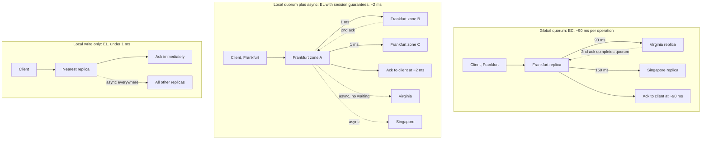
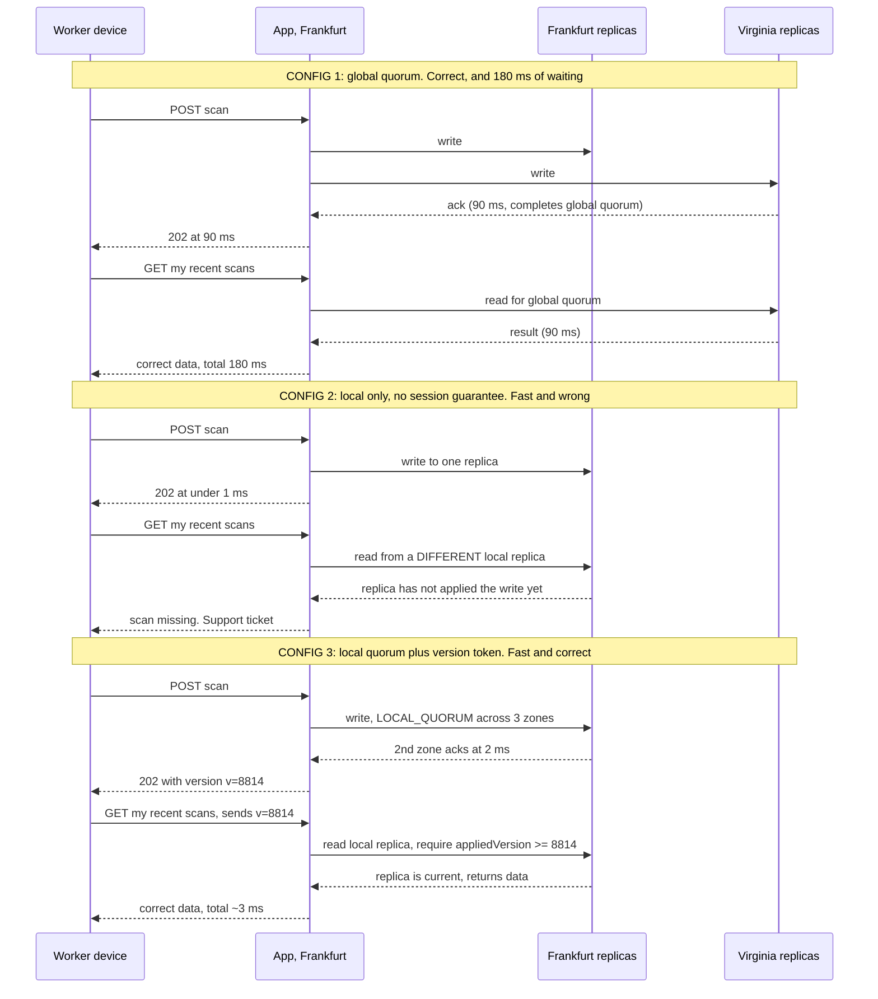

# Chapter 15: PACELC

## 15.1 Problem Statement

After Chapter 14's partition incident, the tracking platform's team does the responsible thing. They write per-operation partition policies. They fix the merge strategies. And, in the words of the incident review, they decide "never again" and set every replicated write to a global majority across all three regions, with matching majority reads.

There is no partition for the next four months. The system is broken anyway.

**Writes take 180 milliseconds.** A majority of three regions means waiting for the second-fastest region to acknowledge, and Frankfurt to Virginia is roughly 90 milliseconds each way. Scanner devices are configured with a two second timeout, so they do not fail, they just feel slow, and warehouse staff start scanning a parcel twice because the first one "did not seem to work".

**Throughput collapses.** Chapter 7's Little's Law does the arithmetic: at 12 milliseconds per write the ingestion service sustained 40,000 events per second, and at 180 milliseconds the same connection pool sustains about 2,700. Nothing about the hardware or the code changed. The number of round trips per write did.

**So they flip reads to local.** Latency is excellent again. Then a new support pattern appears: a warehouse worker scans a parcel, immediately refreshes the screen, and their own scan is not there. They scan again. The tickets say "the system lost my scan", and the system lost nothing at all. The read went to a local replica that had not yet received the write.

**Then statuses start going backwards.** A customer refreshes a tracking page and sees "out for delivery", refreshes again and sees "at sorting hub", which is the previous state. Two reads, two different replicas, two different amounts of lag. Nothing is corrupt. The data is fine on every node.

**And the bill arrives.** Cross-region replication traffic at global majority for every write costs roughly three times what the previous configuration did, for a workload where almost nothing was ever read from a different region than it was written in.

Here is what makes this chapter necessary: **not one of these problems involved a partition.** The network was healthy the entire time. Chapter 14's framework, applied conscientiously, had nothing to say about any of it, because CAP only describes what happens when the network breaks.

The trade the team was actually making, on every single request, all day, for four months, was between consistency and **latency**. That trade is what PACELC names.

## 15.2 Why This Problem Exists

**CAP describes the rare case and people design their whole system around it.** Partitions might account for a few minutes a year. Every other request, which is essentially all of them, faces a completely different decision, and CAP is silent on it. A framework that only covers the exceptional case will produce systems optimised for the exceptional case.

**Consistency requires communication, and communication takes time.** This is not an implementation weakness. If two replicas must agree on the order of operations, at least one message must travel between them, and Chapter 7 established that messages travel at roughly one millisecond per hundred kilometres of round trip. Strong consistency across continents costs hundreds of milliseconds because of physics, and no amount of engineering removes it.

**The cost is invisible in development and testing.** On a laptop, or in a single-zone test environment, replicas are microseconds apart, so strong consistency appears free. The same configuration across three regions costs three orders of magnitude more, and the code is identical. Teams therefore choose consistency levels in an environment where the choice has no observable cost.

**Overcorrecting after an incident is the normal human response.** Section 15.1's team set everything to the strictest setting because the previous incident was a consistency failure. That is understandable and it converted a rare correctness problem into a permanent performance problem, which is a worse trade by a large margin.

**And "consistency" is treated as one thing when it is a spectrum.** Between "every reader everywhere sees every write immediately" and "eventually, probably" sits a set of far cheaper guarantees that solve the actual complaints. The worker who cannot see their own scan does not need global consistency; they need to see their own writes. That is a much weaker and much cheaper property, and Section 15.5.6 is about the middle of the range that most systems should live in.

## 15.3 Real World Analogy

A team of eight engineers spread across London, Bangalore, and San Francisco, deciding things.

**Rule one: nothing is decided until everyone has agreed.** Every decision is correct and nobody ever acts on stale information. Every decision also takes at least a full day, because the time zones do not overlap and you are always waiting for the slowest person to wake up. The team is consistent and slow.

**Rule two: anyone can decide locally and tell the others afterwards.** Decisions happen in minutes. Occasionally two people decide contradictory things and somebody has to unpick it later. The team is fast and inconsistent.

Now the important part, which is the whole point of this chapter: **nobody is unavailable in either scenario.** No one is on holiday, no email is bouncing, the network of the team is entirely healthy. The trade between speed and agreement exists in normal operation, permanently, and it has nothing to do with anyone being unreachable.

Chapter 14's shop analogy was about what happens when the phone line dies. This one is about what happens when everything works, which is almost always.

Three refinements carry over precisely.

**The cost of agreement depends on distance.** Eight people in one room reach consensus in ninety seconds. The same eight across twelve time zones take a day. Same rule, same number of people, hugely different cost, and the variable is how far apart they are. That is replica placement, and Section 15.5.5 argues it is the real design lever.

**Requiring a majority is much cheaper than requiring everyone.** If five of eight suffices, you wait for the fifth person rather than the eighth, and the eighth might be asleep for another nine hours. That is quorum arithmetic.

**And most decisions do not need everyone.** A decision that only affects the London team can be made in London. Insisting that Bangalore and San Francisco ratify it adds a day and no value. That is per-operation scoping, and it is the single largest saving available.

## 15.4 Simple Explanation

PACELC, proposed by Daniel Abadi, extends CAP with the case CAP ignores. It reads as a sentence:

> **If there is a Partition, choose between Availability and Consistency. Else, choose between Latency and Consistency.**

```
P  A  C      E  L  C
|  |  |      |  |  |
if |  |      else | |
   Availability   Latency
      or             or
   Consistency    Consistency
```

The first half is CAP. The second half is the contribution, and the reason it matters is arithmetic:

| Condition | How often | What CAP says | What PACELC says |
|---|---|---|---|
| Partitioned | Minutes per year | Choose A or C | Choose A or C |
| **Not partitioned** | **Essentially always** | Nothing | **Choose L or C** |

A system is classified on both halves, giving four combinations:

| Class | Behaviour |
|---|---|
| **PA/EL** | Available during partitions, low latency otherwise. Weakest consistency, fastest |
| **PC/EC** | Consistent during partitions, consistent otherwise. Strongest, slowest |
| **PA/EC** | Available during partitions, but pays latency for consistency in normal operation |
| **PC/EL** | Refuses during partitions, but serves fast possibly-stale data in normal operation |

The underlying reason the else-branch trade exists at all, stated once:

> **Consistency requires replicas to communicate. Communication takes time. That time is latency, and it is bounded below by the distance between the replicas that must agree.**

Everything practical in this chapter follows from that sentence. If your replicas are in the same rack, consistency costs microseconds and you should just take it. If they are on different continents, consistency costs hundreds of milliseconds per operation, and you need to decide which operations are worth it.

## 15.5 Technical Deep Dive

### 15.5.1 Where the latency actually goes

The cost of consistency is not abstract. It is a specific number of round trips multiplied by a specific distance, and you can compute it before writing any code.

| Replica placement | Round trip time | Cost of a quorum write | Cost of a strong read |
|---|---|---|---|
| Same host | microseconds | negligible | negligible |
| Same rack | 0.1 to 0.3 ms | under 1 ms | under 1 ms |
| Same availability zone | 0.3 to 0.6 ms | about 1 ms | about 1 ms |
| Across zones, same region | 1 to 3 ms | 2 to 6 ms | 2 to 6 ms |
| Frankfurt to Virginia | 85 to 95 ms | about 90 ms | about 90 ms |
| Mumbai to Virginia | 180 to 220 ms | about 200 ms | about 200 ms |

Read the gap between rows four and five. **Moving replicas from cross-zone to cross-region multiplies the cost of consistency by roughly thirty.** The code does not change. The consistency level does not change. Only the geography changes.

This gives a usable formula for estimating before you build:

```
consistency cost  ≈  round trips required  x  RTT to the replica that completes the quorum

Global majority across 3 regions:
  wait for the 2nd fastest region  ->  ~90 ms per operation
  a write plus an immediately consistent read  ->  ~180 ms

Majority within one region, across 3 zones:
  wait for the 2nd fastest zone  ->  ~2 ms
  the same write and read pair  ->  ~4 ms
```

Section 15.1's 180 millisecond writes were not a mystery or a tuning problem. They were the distance between Frankfurt and Virginia, charged once per write, exactly as arithmetic predicted.

And Chapter 8's consequence follows immediately: **higher latency is lower throughput through a fixed pool.** Little's Law says throughput equals concurrency divided by latency, so a fifteen-fold latency increase is a fifteen-fold throughput reduction unless you add a proportional number of connections. Consistency choices are capacity choices.

### 15.5.2 Quorum arithmetic

The mechanism behind most tunable systems, and it is worth being able to derive rather than memorise.

With N replicas, a write acknowledged by W of them and a read that consults R of them:

```
If  R + W > N   then the read set and the write set must overlap
                by at least one replica, so every read sees the
                latest acknowledged write.
```

Three configurations of N equal to three, and what each costs:

| Config | R + W > N? | Write latency | Read latency | Best for |
|---|---|---|---|---|
| W=3, R=1 | 3 + 1 > 3, yes | Slowest write, waits for all | Fastest read, one replica | Read-heavy workloads |
| W=1, R=3 | 1 + 3 > 3, yes | Fastest write | Slowest read, waits for all | Write-heavy workloads |
| W=2, R=2 | 2 + 2 > 3, yes | Waits for 2nd fastest | Waits for 2nd fastest | Balanced, and it tolerates one node down |
| W=1, R=1 | 1 + 1 = 2, **no** | Fastest | Fastest | Eventual consistency only |

Two practical rules fall out of this table.

**Pay on the rarer operation.** If reads outnumber writes 50 to 1, put the cost on writes: W equal to N and R equal to one means one operation in fifty is slow. Reversing that makes forty-nine operations in fifty slow for the same guarantee.

**W=2, R=2 with N=3 is the sensible default**, because it satisfies the overlap rule while tolerating one replica being down or slow, and both operations wait for the second-fastest rather than the slowest, which matters a great deal for tail latency. Chapter 7's point applies: waiting for all N means inheriting the worst tail of N replicas.

```
Cassandra, and the distinction that matters most in practice:

  QUORUM        majority across ALL replicas in ALL datacenters
                3 regions, RF 3 each -> majority of 9 -> crosses regions -> ~90 ms

  LOCAL_QUORUM  majority within the local datacenter only
                majority of 3 local replicas -> stays in region -> ~2 ms

Section 15.1's team used QUORUM. LOCAL_QUORUM was almost certainly
what they wanted, and it is a one word change.
```

### 15.5.3 The four classes, with real systems

| Class | Systems | Notes |
|---|---|---|
| PA/EL | Cassandra and Riak at default levels, Dynamo-style stores, DNS, most caches | Fast and available. Staleness is the normal condition |
| PC/EC | ZooKeeper, etcd, HBase, VoltDB, Spanner | Correct everywhere, and you pay coordination on every operation |
| PA/EC | MongoDB in common configurations | Stays available under partition, and pays for consistency in normal operation |
| PC/EL | PNUTS, Yahoo's system and Abadi's original example | Asynchronous replication to remote regions for low latency, but consistency preferred over availability during partitions |

The PC/EL quadrant surprises people and is worth understanding, because it is a coherent and sensible design. PNUTS routed writes for a record to its home region and replicated asynchronously elsewhere, so remote reads were fast and possibly stale, which is EL. During a partition it preferred to refuse rather than diverge, which is PC. That combination says: *we accept staleness for speed every day, and we refuse to accept divergence when the network breaks.* For many businesses that is exactly the right pair of answers.

The essential caveat, which the classification tables in most articles omit: **modern systems are tunable, so the class is a property of your configuration and often of your individual query, not of the product.** Cassandra with LOCAL_QUORUM behaves differently from Cassandra with ALL. DynamoDB offers eventually consistent and strongly consistent reads on the same table, with the strong ones costing roughly twice as much and taking longer. Cosmos DB exposes five distinct levels. The useful question is never "what class is my database", it is "what class is this operation".

### 15.5.4 Replica placement is the real lever

This is the deepest point in the chapter, and it is usually missed because consistency is discussed as a software setting rather than as a geography problem.

Every replica placement decision simultaneously sets three things:

| Placement | Durability and availability (Chapters 10, 12) | Cost of consistency |
|---|---|---|
| Same rack | Survives a machine. Not a rack, zone, or region | Nearly free |
| Same zone, different racks | Survives a rack. Not a zone | About 1 ms |
| Different zones, same region | Survives a zone | 2 to 6 ms |
| Different regions | Survives a region | 90 to 200 ms |

**The tension is direct and unavoidable.** Durability and availability want replicas far apart, because correlated failure is the enemy. Consistency wants replicas close together, because distance is latency. You cannot maximise both, and the choice of where replicas live is the single decision that sets the price of every consistent operation you will ever perform.

The standard resolution, and the one Section 15.1's team eventually adopted:

```
Within a region:   3 replicas across 3 availability zones
                   LOCAL_QUORUM  ->  strong consistency for ~2 ms
                   survives a zone failure

Across regions:    asynchronous replication
                   fast, eventually consistent, survives a region loss
                   cross-region consistency ONLY for the operations
                   that genuinely need it
```

That gives strong consistency at zone-level cost for almost everything, regional failure survival through asynchronous replication, and reserves the expensive global coordination for the small number of operations that cannot tolerate divergence. It is the shape most well-designed global systems converge on.

The corollary is worth stating explicitly, because it changes how you approach the problem: **if consistency is too slow, consider moving the replicas before weakening the guarantee.** Many teams reach for eventual consistency when what they actually needed was a regional quorum instead of a global one.

### 15.5.5 The middle ground: session guarantees

Section 15.1's two most damaging symptoms, the worker who cannot see their own scan and the status that moves backwards, do not require global strong consistency to fix. They require much weaker and much cheaper properties.

| Guarantee | Promise | Fixes |
|---|---|---|
| Read your writes | You always see your own writes | "The system lost my scan" |
| Monotonic reads | You never see time move backwards | Status flipping between states |
| Monotonic writes | Your own writes apply in the order you made them | Out-of-order updates from one client |
| Writes follow reads | A write based on a read is ordered after it | Reply appearing before the message it answers |
| Consistent prefix | You see a valid history, possibly old, never a scrambled one | Seeing effects before causes |
| Bounded staleness | Never more than k versions or t seconds behind | Predictable freshness without global coordination |

These are collectively called session guarantees, and the reason they are so useful is that **they are scoped to one client rather than to the whole system**, which makes them dramatically cheaper. Three implementations, in increasing order of sophistication:

**Sticky routing.** Send a client's reads to the same replica that took its writes. Simple, and it breaks when that replica is unavailable or the client moves.

**Read from the primary for a window after writing.** Cheap and effective.

```java
// After a write, this user's reads go to the primary for a short window.
// One Redis key per user, expiring after typical replication lag plus margin.
public void recordScan(String userId, ScanEvent e) {
    primary.insert(e);
    recentWriters.setex("rw:" + userId, 5, "1");    // 5 second window
}

public List<ScanEvent> recentScans(String userId) {
    boolean wroteRecently = recentWriters.exists("rw:" + userId);
    DataSource ds = wroteRecently ? primary : replica;   // read-your-writes
    return query(ds, userId);
}
```

**Version tokens carried by the client.** The most robust, because it needs no server-side session state and survives client movement between regions.

```java
// The write returns the version it created.
// The client sends it back, and any replica can wait until it has caught up.
public WriteResult recordScan(ScanEvent e) {
    long version = primary.insertReturningVersion(e);
    return new WriteResult(e.id(), version);           // client stores this
}

public List<ScanEvent> recentScans(String userId, long minVersion) {
    Replica r = replicaPool.pick();
    if (r.appliedVersion() < minVersion) {
        r.awaitVersion(minVersion, Duration.ofMillis(200));   // or fall back to primary
    }
    return r.query(userId);
}
```

That last pattern is worth knowing well. It gives read-your-writes and monotonic reads at local-replica latency in the common case, falls back to the primary only when the local replica is genuinely behind, and requires no sticky routing. Most of what people think they need global strong consistency for is solved by it.

Chapter 18 covers these models formally. The point here is economic: **the guarantees that fix real user complaints cost a fraction of what global consistency costs.**

### 15.5.6 Choosing per operation

The decision procedure. Three questions, and the answers determine the mechanism.

```
1. Who must see this write?
     only the writer          ->  session guarantee, cheap
     others in the same region ->  regional quorum, ~2 ms
     everyone, globally        ->  global coordination, ~90 to 200 ms

2. How soon?
     immediately              ->  synchronous coordination
     within a few seconds     ->  bounded staleness
     eventually               ->  asynchronous replication

3. What happens if they do not?
     wrong physical action, money moves, duplicate identifier  ->  pay for consistency
     a slightly stale number on a screen                       ->  do not
```

Applied to the tracking platform:

| Operation | Who must see it | How soon | Choice | Cost |
|---|---|---|---|---|
| Record a scan | The scanning worker | Immediately | Session read-your-writes, local write | ~2 ms |
| Read tracking status | Anyone | Within a minute | Eventual, local replica, show the age | under 1 ms |
| Warehouse stock count | Same region | Seconds | Regional quorum, LOCAL_QUORUM | ~2 ms |
| Allocate a label serial | Everyone, globally | Immediately | **Global consistency, no alternative** | ~90 ms |
| Reserve the last returns slot | Everyone, globally | Immediately | **Global consistency** | ~90 ms |
| Update user preferences | The user | Immediately | Session guarantee | ~2 ms |
| Analytics event | Nobody in real time | Whenever | Asynchronous, fire and forget | 0 |

Note the distribution: **two operations out of seven need global coordination.** Section 15.1's team applied the 90 millisecond cost to all of them, which is a 3,000 percent latency premium on five operations to protect two.

That is the single most common and most expensive mistake in this area, and the fix is a table like the one above.

### 15.5.7 What PACELC still does not tell you

Being precise about the limits, as with CAP:

| Question | Does PACELC answer it? |
|---|---|
| What do I trade during a partition? | Yes, and it is CAP's answer |
| What do I trade in normal operation? | Yes, and this is the contribution |
| Which of the many consistency models should I use? | **No.** It treats consistency as binary. Chapters 18 and 19 |
| How do I get read-your-writes cheaply? | **No.** Section 15.5.5 is outside the model |
| How much latency will consistency actually cost me? | **No**, but Section 15.5.1's arithmetic does |
| How do I resolve conflicts? | No |
| Is this per system or per operation? | The classification implies per system, and reality is per operation |

PACELC is a **classification**, not a design method. Its value is that it makes the else-branch visible and gives you vocabulary for a trade people were making unconsciously. The design work is still Section 15.5.6's table.

## 15.6 Architecture Diagram

The same write, under three configurations, with the round trips drawn. This is the diagram that makes the cost of a consistency level concrete.



ASCII version:

```
GLOBAL QUORUM (EC)                 LOCAL QUORUM + ASYNC (EL)        LOCAL ONLY (EL)
 client -> Frankfurt                client -> Frankfurt zone A        client -> nearest
              |  \                            |    \                          |
       90ms   |   \ 150ms               1ms   |     \ 1ms                  ack now
              v    v                          v      v
          Virginia Singapore            zone B    zone C              async to all
              |                                |
        2nd ack at ~90ms                 2nd ack at ~2ms
              |                                |
         ack to client                   ack to client
                                               |
                                     async to Virginia, Singapore
                                     (no waiting)

 cost: 90 ms/op                     cost: 2 ms/op                    cost: <1 ms/op
 guarantee: global strong           guarantee: regional strong,      guarantee: eventual
                                    global eventual, session
                                    guarantees for the writer
```

Three things to read off it.

**The middle column is where most systems should live.** It gives strong consistency within a region for two milliseconds, survives a zone failure, replicates across regions for disaster recovery, and uses session guarantees to fix the user-visible complaints. It is not a compromise so much as the correct answer for the large majority of operations.

**The left column's cost is entirely geography.** The same number of replicas, the same quorum rule, the same code. Ninety milliseconds instead of two because the replicas are 6,500 kilometres apart.

**And the right column is not lazy.** For a tracking status read, or an analytics event, it is exactly right, and paying ninety milliseconds for it would be waste.

## 15.7 Request Flow

A write immediately followed by a read by the same user, which is the sequence that generated Section 15.1's support tickets. Traced under all three configurations.



Step by step for the configuration that works:

1. **Write goes to a local quorum**, a majority of the three zones in this region. Two milliseconds, and it survives a zone failure, which is Chapter 12's durability requirement met at regional cost.
2. **The response carries a version.** This is the small piece of protocol design that makes everything else cheap, and it costs one field in the response body.
3. **The client sends the version back on subsequent reads.** No sticky routing, no server-side session state, and it works if the client moves between regions or reconnects to a different instance.
4. **The read checks the replica's applied version** against the required one. If the replica is current, which it almost always is at regional lag, the read is served locally in under a millisecond.
5. **If the replica is behind, wait briefly or fall back to the primary.** The slow path exists and is rare, which is exactly the right shape for a performance-sensitive guarantee.
6. **Cross-region replication continues asynchronously,** off the request path, giving disaster recovery without charging every write for it.

Total cost: about three milliseconds, with read-your-writes and monotonic reads guaranteed for the user. The global quorum configuration was sixty times more expensive and gave this particular user nothing extra, because the only person who needed to see that scan was the person who made it.

**That is the whole argument of the chapter in one comparison.**

## 15.8 Internal Components

| Component | Role in the trade | Failure mode | Guard |
|---|---|---|---|
| Replica placement | Sets the price of every consistent operation | Spread for durability without noticing the consistency cost | Decide placement and consistency together, with the RTT table |
| Consistency level per query | The actual EL or EC choice | One global setting applied to everything | Per-operation policy, visible in code |
| Local versus global quorum | The difference between 2 ms and 90 ms | Using global where local suffices | Default to local; justify every global use |
| Version tokens | Enables session guarantees cheaply | Not returned by writes, so clients cannot request freshness | Return a version on every write, accept it on reads |
| Replica lag tracking | Lets a read know if a replica is current | Not exposed, so reads cannot make an informed choice | Expose applied version and lag per replica |
| Sticky routing | Simple read-your-writes | Breaks on failover and client movement | Prefer version tokens; use stickiness as a fallback |
| Bounded staleness config | Predictable freshness without coordination | Unbounded in practice because lag is unmonitored | Alert on lag exceeding the stated bound |
| Staleness indicator in responses | Lets clients and users judge | Absent, so stale looks fresh | Return the data's age with every eventual read |
| Read routing policy | Chooses primary or replica per request | Hardcoded, so all reads pay or none are safe | Route by declared freshness requirement |
| Cross-region replication | Disaster recovery without per-write cost | Made synchronous by default, charging every write | Asynchronous unless an operation demands otherwise |

The row that changes the most for the least effort is version tokens. Returning a version on every write and accepting it on reads converts an expensive global guarantee into a cheap per-session one, and it is a small protocol change rather than an architectural one.

## 15.9 Production Example

**Abadi's paper is the origin and remains the clearest statement.** His argument was that CAP had been used to justify weak consistency in systems that were weakly consistent for a reason having nothing to do with partitions: they were built for low latency, and partitions were a convenient rationalisation. Naming the else-branch made that visible. His classification of contemporary systems, including PNUTS as the PC/EL example, is what gave the model its practical bite, because it showed that all four quadrants are occupied by real, sensible designs.

**Cosmos DB productised the spectrum,** offering five named consistency levels rather than a binary: strong, bounded staleness, session, consistent prefix, and eventual, selectable per request. The interesting part for this chapter is that the middle three are exactly Section 15.5.5's session guarantees, exposed as first-class options with documented latency and availability implications. It is an acknowledgement in product form that the useful choices live between the extremes, and that the correct granularity is the individual operation.

**DynamoDB puts a price on the trade.** Reads come in two flavours, eventually consistent and strongly consistent, and the strongly consistent ones consume roughly twice the read capacity and have higher latency. When the trade appears on an invoice with a factor of two attached, teams stop applying strong consistency reflexively to everything, which is a more effective forcing function than any amount of documentation.

**And large-scale social systems solved the read-your-writes problem without global consistency.** The published work on scaling caching infrastructure at Facebook describes marking a key in the local regional cache after a write is sent to the primary region, so that subsequent reads in that region know not to trust the local stale value until replication has caught up. That is Section 15.5.5's mechanism in production at very large scale: a small piece of per-session state, rather than global coordination, to solve the specific anomaly users actually notice.

The pattern across all four: **the industry converged on per-operation choice, a spectrum rather than a binary, and session-scoped guarantees as the practical middle.** Section 15.1's team eventually arrived at the same place, four months and one performance incident later.

## 15.10 Advantages

- **It names the trade you make constantly.** The else-branch is essentially every request, and having vocabulary for it changes design conversations.
- **The cost becomes computable in advance.** Round trips times distance gives you the price of a consistency level before any code is written.
- **It exposes overcorrection.** Section 15.1's "never again" response is visible as a 3,000 percent latency premium applied to operations that did not need it.
- **It makes replica placement a first-class decision**, rather than something chosen for durability alone and then silently taxing every consistent operation.
- **It legitimises the middle.** PA/EC and PC/EL are coherent designs, which frees teams from believing they must be either Dynamo or Spanner.
- **Combined with session guarantees, it makes most complaints cheap to fix.** Read-your-writes solves the ticket that global consistency was being bought to solve.
- **It connects consistency to capacity.** Latency is throughput through Little's Law, so a consistency decision is also a fleet-sizing decision.

## 15.11 Limitations

- **It treats consistency as binary,** when there is a rich spectrum between linearizable and eventual, and the useful answers usually live in the middle.
- **It is a classification, not a method.** Knowing your database is PA/EL tells you nothing about which operation should be strong.
- **The per-system framing is outdated.** Tunable systems mean the class is a property of a query, and modelling it at the system level hides the real decision.
- **Session guarantees do not fit the model.** The most practical middle ground is invisible in the notation.
- **It says nothing about conflict resolution**, which remains the actual work of choosing availability or weak consistency.
- **The latency numbers are yours, not the model's.** PACELC tells you the trade exists; only measurement tells you what it costs on your topology.
- **It ignores partial answers.** Chapter 14's harvest and yield are as absent here as they were there.

## 15.12 Trade-offs

| Dial | One way | The other way |
|---|---|---|
| Quorum scope | Global: consistent everywhere, 90 to 200 ms per operation | Local: 2 ms, cross-region eventual |
| R and W split | W=N, R=1: fast reads, slow writes, good for read-heavy | W=1, R=N: fast writes, slow reads |
| Replica distance | Far apart: survives regions, expensive consistency | Close: cheap consistency, correlated failure risk |
| Consistency granularity | One system-wide setting: simple, wrong for most operations | Per operation: correct, more to reason about |
| Session guarantees | Version tokens: correct, needs protocol support | Sticky routing: simple, breaks on failover |
| Staleness bound | Tight: fresher, more coordination | Loose: cheaper, users may notice |
| Cross-region replication | Synchronous: no data loss, every write pays | Asynchronous: fast writes, RPO equals lag (Chapter 12) |

The removal test.

**Remove global quorum and use local quorum everywhere.** You gain a fifteen to forty fold latency reduction and a proportional throughput increase on every write. You lose cross-region linearizability, so an operation like allocating a globally unique serial number can produce duplicates. Correct for five of Section 15.5.6's seven operations, catastrophic for the other two.

**Remove session guarantees and serve all reads from local replicas.** You gain simplicity and slightly lower read latency. You lose read-your-writes, which produces the "the system lost my scan" tickets and, worse, teaches users to retry, which duplicates work. This is the cheapest guarantee in the chapter and removing it is almost never worth it.

**Remove cross-region replicas entirely and run one region.** You gain the cheapest possible consistency, since everything is within a few milliseconds, and much simpler reasoning. You lose regional failure survival and global read latency. For many systems this is genuinely the right trade, and it is taken far less often than it should be.

**Remove the staleness indicator from eventual reads.** You gain a smaller payload. You lose the user's ability to know whether to trust the screen, which converts an honest degradation into Chapter 11's silent wrong answer.

## 15.13 Common Mistakes

**Designing the whole system around partition behaviour.** Partitions are minutes a year; the else-branch is every request.

**Choosing consistency levels in a single-zone test environment,** where coordination is nearly free, then deploying across continents where it costs a hundred times more.

**Using a global quorum where a local one suffices.** In Cassandra terms, QUORUM instead of LOCAL_QUORUM, which is a one word difference and a forty-fold latency difference.

**Overcorrecting after a consistency incident** by making everything strict, converting a rare correctness problem into a permanent performance problem.

**Treating consistency as a system-wide setting** rather than a per-operation decision.

**Confusing global consistency with read-your-writes.** The user complaining that their write vanished needs the cheap guarantee, not the expensive one.

**Spreading replicas for durability without pricing the consistency cost,** and then being surprised that strong reads got slow.

**Forgetting Little's Law.** Fifteen times the latency is one fifteenth of the throughput through the same pool, so consistency choices silently become capacity incidents.

**Reading from all N replicas** instead of a quorum, which inherits the worst tail latency of every replica.

**Not returning a version from writes,** which makes cheap session guarantees impossible and forces a choice between sticky routing and global consistency.

**Unmonitored replication lag,** which turns "bounded staleness" into an unbounded promise.

**Serving stale data without saying so.**

## 15.14 Interview Questions

**Q: What is PACELC and what does it add to CAP?**
If there is a partition, choose availability or consistency; else, choose latency or consistency. It adds the case CAP ignores, which is normal operation, and that case covers essentially every request rather than the few minutes a year when the network is broken.

**Q: Why does consistency cost latency when nothing is broken?**
Because replicas must communicate to agree on ordering, and messages take time proportional to distance. A quorum write waits for the replica that completes the quorum, so the floor is the round trip to that replica: microseconds within a rack, a few milliseconds across zones, and 90 to 200 milliseconds across continents.

**Q: State the quorum rule and its practical configurations.**
With N replicas, if R plus W exceeds N then the read and write sets overlap, so reads see the latest acknowledged write. With N of three: W=3 R=1 favours read-heavy workloads, W=1 R=3 favours write-heavy, and W=2 R=2 is balanced, tolerates one node down, and avoids waiting for the slowest replica.

**Q: Your writes take 180 milliseconds and there is no partition. What do you check?**
Replica placement and quorum scope. A global quorum across regions costs a cross-region round trip per operation. Check whether a local quorum within one region satisfies the requirement, with asynchronous cross-region replication, which is typically 2 milliseconds instead of 90.

**Q: A user says their write disappeared, but the data is present in the database. What happened?**
The read went to a replica that had not yet applied the write. That is a read-your-writes violation, and it does not require global consistency to fix. Route that user's reads to the primary for a short window after a write, or have the write return a version that the client passes back so a replica can confirm it is current.

**Q: What is the difference between QUORUM and LOCAL_QUORUM?**
QUORUM requires a majority across all replicas in all datacenters, so it crosses regions and costs a cross-region round trip. LOCAL_QUORUM requires a majority within the local datacenter only, staying within a few milliseconds. The difference is one word in the query and roughly a factor of forty in latency.

**Q: Give an example of a PC/EL system and explain why that combination makes sense.**
PNUTS. It replicates asynchronously to remote regions, so normal-operation reads are fast and possibly stale, which is EL, but it prefers consistency over availability during a partition, which is PC. The reasoning is that everyday staleness is tolerable and cheap, while divergence during a network failure is expensive to repair.

**Q: How do you decide consistency per operation?**
Ask who must see the write, how soon, and what happens if they do not. If only the writer needs it, use a session guarantee. If the region needs it, use a regional quorum. If everyone globally needs it immediately and a stale read causes an unrecoverable action such as a duplicate identifier or a double allocation, pay for global coordination. Most operations fall in the first two categories.

**Q: How does a consistency choice affect capacity?**
Through Little's Law: throughput equals concurrency divided by latency. Increasing per-write latency from 12 to 180 milliseconds reduces achievable throughput through the same connection pool by roughly fifteen times, so it is a capacity decision as much as a correctness one.

**Q: Where does PACELC stop being useful?**
It treats consistency as binary and is a classification rather than a design method. It cannot express the session guarantees that solve most real complaints, says nothing about conflict resolution, and its per-system framing is outdated now that databases let you choose per query.

## 15.15 Production Best Practices

1. **Write the per-operation consistency table** from Section 15.5.6, with who must see the write, how soon, and the consequence of staleness.
2. **Default to local quorum within a region** with asynchronous cross-region replication, and justify every global quorum individually.
3. **Decide replica placement and consistency together,** using measured round trip times rather than assumptions.
4. **Return a version from every write** and accept it on reads, so session guarantees are available without sticky routing.
5. **Implement read-your-writes** before reaching for stronger consistency, since it fixes the complaints people actually raise.
6. **Pay the coordination cost on the rarer operation.** Read-heavy means pay on write.
7. **Prefer quorum reads to reading all replicas,** so you do not inherit the worst tail of every node.
8. **Monitor replication lag continuously** and alert when it exceeds your stated staleness bound, or the bound is fiction.
9. **Return the data's age with every eventually consistent read,** and surface it in the interface.
10. **Measure consistency latency in a production-like topology,** never in a single-zone test environment.
11. **Recompute capacity when you change a consistency level,** because latency and throughput are the same decision.
12. **Review consistency settings after every incident,** specifically to check for overcorrection.

## 15.16 Summary

PACELC completes the picture CAP started. If there is a partition, choose availability or consistency. Else, which means essentially always, choose latency or consistency. The second half is the one that matters day to day, because partitions are minutes a year and the else-branch is every request your system ever serves.

The reason the trade exists is physical rather than architectural. Consistency means replicas agree, agreement requires messages, and messages take time proportional to distance. That gives a formula you can apply before writing code: the cost of a consistent operation is the number of round trips multiplied by the distance to the replica that completes the quorum. Within a rack it is free, across zones it is a couple of milliseconds, and across continents it is 90 to 200 milliseconds. Section 15.1's team did not have a mysterious performance problem; they had 6,500 kilometres charged once per write.

Which makes **replica placement the real lever**, and it is the decision that quietly sets the price of every consistent operation forever. Durability and availability want replicas far apart; consistency wants them close. The resolution most good systems converge on is a regional quorum across zones for strong consistency at a two millisecond cost, asynchronous replication across regions for disaster recovery, and global coordination reserved for the small number of operations that genuinely cannot tolerate divergence.

The other half of the answer is that consistency is not binary. Between global linearizability and hope sits a set of session-scoped guarantees, read your writes, monotonic reads, bounded staleness, that cost a fraction as much and fix the anomalies users actually notice. The worker who could not see their own scan needed read-your-writes, which is a version token in a response body, not a ninety millisecond global quorum on every write in the system.

So the discipline is a table, not a slogan. For each operation: who must see this, how soon, and what breaks if they do not. In Section 15.5.6's example, two operations out of seven needed global coordination and five did not, and applying the expensive answer to all seven was the mistake that cost four months.

## 15.17 Quick Revision Notes

- PACELC: if Partition, choose Availability or Consistency; Else, choose Latency or Consistency.
- CAP covers minutes a year. The else-branch covers every request.
- Consistency costs latency because agreement needs messages and messages take time. It is physics, not implementation.
- Cost formula: round trips times RTT to the replica that completes the quorum.
- RTT reference: same rack under 0.3 ms, cross-zone 1 to 3 ms, Frankfurt to Virginia about 90 ms, Mumbai to Virginia about 200 ms.
- Quorum rule: R + W > N gives read-after-write. N=3 with W=2, R=2 is the balanced default and tolerates one node down.
- Pay the coordination cost on the rarer operation. Read-heavy means W=N, R=1.
- Do not read all N replicas; you inherit the worst tail of all of them.
- QUORUM crosses regions. LOCAL_QUORUM stays in one. One word, roughly forty times the latency.
- Four classes: PA/EL (Cassandra defaults, Dynamo), PC/EC (Spanner, etcd, HBase), PA/EC (MongoDB in common configs), PC/EL (PNUTS).
- Classification is per configuration and per query in modern systems, not per product.
- Replica placement is the real lever. Durability wants replicas far apart, consistency wants them close.
- Standard shape: regional quorum across zones, asynchronous cross-region, global coordination only where required.
- Session guarantees are the cheap middle: read your writes, monotonic reads, monotonic writes, writes follow reads, consistent prefix, bounded staleness.
- Implement read-your-writes with a version token returned by writes and passed back on reads. No sticky routing needed.
- Latency is throughput. Fifteen times the latency is one fifteenth of the throughput through the same pool.
- Decide per operation: who must see it, how soon, what breaks if they do not.
- Always return the age of eventually consistent data.

## 15.18 Mini Quiz

1. State PACELC and explain why the else-branch matters more than the partition branch.
2. Three replicas, one per region, with round trips of 0 ms, 90 ms, and 150 ms from the coordinator. What is the latency of a quorum write, and of a write requiring all replicas?
3. N=5. Give two configurations satisfying R + W > N, and say which workload each suits.
4. Your read-heavy service uses W=2, R=2 with N=3. Reads are 95 percent of traffic. What would you change and why?
5. A user writes and immediately reads, and does not see their write. Name three fixes in increasing order of cost.
6. Classify each: Cassandra at LOCAL_QUORUM; etcd; DNS; Spanner.
7. Why is replica placement more fundamental than the consistency level setting?
8. Your writes went from 12 ms to 180 ms after a configuration change and throughput fell from 40,000 to 2,700 per second with no other change. Explain the relationship.
9. When is a global quorum genuinely necessary?
10. What does PACELC fail to capture that you need for real design work?

**Answers**

1. If a partition exists, choose availability or consistency; otherwise choose latency or consistency. The else-branch matters more because partitions occupy minutes per year while normal operation covers every request, so the latency-versus-consistency decision is made billions of times more often and dominates both user experience and capacity.
2. A quorum of three requires two acknowledgements, and the coordinator's own copy counts as one, so it waits for the 90 ms replica: about 90 ms. Requiring all replicas waits for the slowest: about 150 ms. This is why quorum reads and writes have much better tail behaviour than all-replica ones.
3. W=3 R=3 is balanced and tolerates two failures. W=5 R=1 suits read-heavy workloads, since reads touch one replica while writes wait for all five. W=1 R=5 suits write-heavy workloads. Any pair summing to more than five works, and the choice is about which operation should carry the cost.
4. Move to W=3, R=1. Reads are 95 percent of traffic, so making them touch a single replica removes coordination from the overwhelming majority of operations, while writes, being 5 percent, absorb the cost of waiting for all three. The overlap rule still holds since 3 plus 1 exceeds 3. The trade is that writes now fail if any replica is unavailable, so this suits workloads that can tolerate reduced write availability.
5. Cheapest: have the write return a version and have the client pass it back, so a local replica serves the read only if it has applied that version. Middle: route that user's reads to the primary for a few seconds after a write, using a short-lived marker. Most expensive: make all reads globally consistent, which fixes the symptom at forty to ninety times the latency and helps nobody else.
6. Cassandra at LOCAL_QUORUM: PA/EL globally, since cross-region replication is asynchronous and it stays available under partition, though it is regionally consistent. etcd: PC/EC, as it requires a majority for both and refuses in a minority partition. DNS: PA/EL, serving cached records regardless of freshness. Spanner: PC/EC, sacrificing minority availability and paying coordination cost for external consistency.
7. Because placement sets the price of every consistent operation for the lifetime of the system, and no software setting can reduce the round trip time between two continents. The consistency level chooses how many round trips you pay for; placement determines how expensive each one is. It also cannot be changed cheaply once data is distributed, whereas a consistency level is a per-query decision.
8. Little's Law: throughput equals concurrency divided by latency. With a fixed connection pool, multiplying per-operation latency by fifteen divides achievable throughput by roughly fifteen, which is 40,000 down to about 2,700. The consistency change was also a capacity change, and the fix is either to reduce latency by using a regional quorum or to increase concurrency proportionally, which the downstream database may not accept.
9. When a stale read leads to an action that cannot be undone and whose correctness depends on global state: allocating a globally unique identifier such as an invoice or serial number, reserving the last unit of a scarce resource shared across regions, enforcing a global uniqueness constraint such as a username, or any financial operation where double-spending is possible. These are usually a small minority of operations, which is why the global cost should be applied narrowly.
10. It treats consistency as binary and so cannot express the session guarantees, read your writes, monotonic reads, bounded staleness, that solve most real complaints cheaply. It is a classification rather than a design method, gives no guidance on conflict resolution, implies a per-system granularity when the real decision is per operation, and provides no numbers, since the actual latency cost depends entirely on your own replica topology.

## 15.19 Hands-on Exercise

**Part 1: measure the price of consistency.** Deploy a three-node cluster of a tunable database, first with all three nodes in one availability zone, then across three zones in one region, then across three regions. For each topology, measure write and read latency at every consistency level available. Build the table. You now have your own version of Section 15.5.1, with your numbers rather than mine.

**Part 2: reproduce the disappearing write.** Configure eventual consistency with reads served round-robin across replicas. Write a record and read it back immediately in a loop, and measure how often the read misses. Then increase replication lag artificially, with network delay, and measure again. Record the miss rate against the lag.

**Part 3: fix it three ways, and price each.** Implement, in order: reading from the primary for a five second window after a write; a version token returned by the write and honoured by the read; and full global quorum. Measure the latency of a write-then-read pair under each, and the miss rate. Compare the cost of the cheapest correct answer with the most expensive one.

**Part 4: find the throughput cliff.** With a fixed connection pool, run a write benchmark at local quorum and at global quorum. Record throughput for both, then compute what pool size the global configuration would need to match the local configuration's throughput, and check whether your database would accept that many connections. This is Chapter 9's connection arithmetic meeting this chapter's latency arithmetic.

**Part 5: write your own table.** For your real system, produce Section 15.5.6's table: every significant operation, who must see the write, how soon, the consequence of staleness, and the chosen mechanism. Then check what the code actually does today for each row. The difference between the two is your backlog, and it usually contains both operations paying too much and operations paying too little.

## 15.20 Further Reading

- *Consistency Tradeoffs in Modern Distributed Database System Design*, Daniel Abadi, IEEE Computer, 2012. The original PACELC paper. Short, and the classification section is the most useful part.
- *Problems with CAP, and Yahoo's little known NoSQL system*, Abadi's blog post that introduced the idea, including the PNUTS analysis.
- *Session Guarantees for Weakly Consistent Replicated Data*, Terry et al., 1994. The original definitions of read your writes, monotonic reads, monotonic writes, and writes follow reads.
- Azure Cosmos DB's consistency levels documentation. The clearest productised description of the spectrum between strong and eventual, with the trade-offs stated explicitly.
- *Designing Data-Intensive Applications*, Martin Kleppmann, chapter 5 on replication and chapter 9 on consistency guarantees. The best single treatment of what sits between linearizable and eventual.
- *Scaling Memcache at Facebook*, Nishtala et al., NSDI 2013, for the regional marker technique that provides read-your-writes without global coordination.
- Amazon DynamoDB's developer guide on read consistency, for the version of this trade that appears on an invoice.
- *Replicated Data Consistency Explained Through Baseball*, Doug Terry, 2011. A genuinely enjoyable explanation of why different participants in the same system need different consistency guarantees.

---

**Next chapter: Chapter 16, ACID.** Moving from replication guarantees to transaction guarantees: what atomicity, consistency, isolation, and durability actually promise, which of them your database gives you by default, and why the isolation level nobody changes is the source of a whole category of bugs.
