# Chapter 43: Partitioning

## 43.1 Problem Statement

The `events` table holds every scan, departure, and delivery attempt the tracking platform has ever recorded. It is 3.1 terabytes and 14 billion rows, and it is on a single machine that is nowhere near its write limit. This is not a sharding problem. It is a size problem, and size alone breaks things.

**Deleting last year's events takes nine hours and doubles the table's size while it runs.** `DELETE FROM events WHERE event_at < '2025-08-01'` marks 4 billion rows dead, autovacuum cannot keep up, and the space is not returned to the operating system anyway. The retention policy has quietly not been enforced for two years because nobody wants to run it again.

**`VACUUM FULL` would reclaim the space and requires an exclusive lock for eleven hours.** So it never runs.

**The index on `event_at` is 180 gigabytes** and no longer fits in memory, so the dashboard query that reads the last 24 hours does disk reads for data that is 0.02 percent of the table.

**A schema change takes an unknown number of hours** and cannot be safely attempted.

**And a backup of the whole table runs for six hours** every night, re-copying 3 terabytes of immutable historical data that has not changed since it was written.

Nothing here is about throughput. Every one of these problems is about a single table being too large for the operations that must be performed on it, and all five have the same fix.

## 43.2 Why This Problem Exists

**Maintenance cost scales with table size, not with useful work.** Vacuum, index rebuilds, statistics collection, and backups all traverse the whole table regardless of how much of it is active.

**Bulk deletion is the most expensive operation a database performs.** In an MVCC system (Chapter 37), a delete writes a marker per row, must be vacuumed, and does not return space to the filesystem. Deleting a billion rows is more work than inserting them was.

**A large index stops fitting in memory** and Chapter 39's lookup guarantee quietly degrades from one memory access to one disk read.

**Locks scale with what they cover.** An operation on a 3 terabyte table locks 3 terabytes' worth of access.

**And most large tables are mostly cold.** The last day matters and the previous three years are read occasionally, but every maintenance operation treats them identically.

The insight: **if the table were physically many smaller tables, every one of these problems would be tractable, and the database can maintain that illusion for you.**

## 43.3 Real World Analogy

Archive boxes instead of one enormous filing drawer.

**One drawer with ten years of records.** Finding this week's file means opening the drawer and going through everything. Disposing of 2019 means pulling individual folders out one at a time, and the drawer stays exactly as heavy afterward.

**Twelve boxes, one per month.** Finding this week's file means opening one box, which is the only one you need. That is partition pruning.

**Disposing of 2019 means putting four boxes in the skip.** Instant, and the shelf space is actually returned. That is `DROP PARTITION`, and it is the difference between nine hours and one second.

**Archiving old boxes to a cheaper storage unit** is possible because they are separate objects. That is a tiered storage policy.

**And each box has its own index card.** Small enough to read at a glance, unlike the master index for the whole drawer.

**The important part: to the person requesting a file, it is still one archive.** They ask for a record and someone fetches it. The boxes are an internal arrangement, not something the requester manages. That is exactly the difference between partitioning and Chapter 42's sharding, where the application very much does know.

## 43.4 Simple Explanation

**Partitioning splits one table into several physical pieces inside the same database, while the application continues to see one table.**

The distinction from sharding, which people conflate constantly:

| | Partitioning | Sharding |
|---|---|---|
| **Where the pieces live** | Same database instance | Different machines |
| **Does the application know?** | **No.** One table, one connection | **Yes.** Routing, shard keys |
| **Solves** | Maintenance, retention, query pruning | Write throughput, storage past one machine |
| **Cost** | Some planning overhead, a key to choose | Joins, transactions, constraints all lost |
| **Reversible?** | Yes, relatively | No, months of work |
| **Do this** | **Early. It is cheap** | **Last. It is expensive** |

They compose: a sharded system usually partitions within each shard.

**What partitioning buys, mechanically:**

```
Query for the last 24 hours, on a 14-billion-row table:

  UNPARTITIONED: the planner considers the whole table.
                 The index on event_at is 180 GB, does not fit in memory,
                 so the lookup causes disk reads.

  PARTITIONED BY DAY: the planner reads the WHERE clause, determines that
                 only one partition can contain matching rows, and ignores
                 the other 1,095 entirely. That partition's index is
                 ~160 MB and is in memory.

  This is PARTITION PRUNING and it is the main read benefit.
```

```
Deleting last year:

  UNPARTITIONED: DELETE ... 9 hours, 4 billion dead tuples,
                 vacuum backlog, space not returned.

  PARTITIONED:   DROP TABLE events_2025_07;   -- metadata only
                 Milliseconds. Space returned immediately.
```

That second one is usually the reason people partition, and it alone justifies it.

## 43.5 Technical Deep Dive

### 43.5.1 The three strategies

| Strategy | Rule | Use for |
|---|---|---|
| **Range** | Value falls in `[from, to)` | **Time series.** The dominant real use |
| **List** | Value is in an explicit set | Region, tenant tier, country |
| **Hash** | `hash(key) mod n` | Even distribution when no natural range exists |

**Range partitioning by time is the case that matters most**, because it aligns with how data ages, how it is queried, and how it is retained.

```sql
-- The parent is a definition, not storage. Rows live in partitions.
CREATE TABLE events (
    id           bigint       NOT NULL,
    shipment_id  text         NOT NULL,
    event_at     timestamptz  NOT NULL,
    location     text,
    scan_type    text,
    -- The partition key MUST be part of every unique constraint,
    -- because uniqueness is enforced per partition, not globally.
    PRIMARY KEY (id, event_at)
) PARTITION BY RANGE (event_at);

CREATE TABLE events_2026_08_12 PARTITION OF events
    FOR VALUES FROM ('2026-08-12') TO ('2026-08-13');

CREATE TABLE events_2026_08_13 PARTITION OF events
    FOR VALUES FROM ('2026-08-13') TO ('2026-08-14');

-- Anything not matching a partition. Without it, an out-of-range
-- insert FAILS, which is often what you want in production.
CREATE TABLE events_default PARTITION OF events DEFAULT;
```

**That primary key constraint is the first thing people trip over.** PostgreSQL cannot enforce uniqueness across partitions without a global index, so the partition key must be in every unique constraint and primary key. If your table needs `id` alone to be unique, partitioning changes your key design.

**A default partition has a cost worth knowing:** once rows exist in it, attaching a new partition overlapping its range requires scanning the default partition to prove no conflicting rows exist. On a large default partition that is a long lock. Many production setups deliberately omit it so out-of-range inserts fail loudly.

List and hash, briefly:

```sql
-- List: an explicit set per partition.
CREATE TABLE shipments (...) PARTITION BY LIST (region);
CREATE TABLE shipments_uk PARTITION OF shipments FOR VALUES IN ('UK','IE');
CREATE TABLE shipments_eu PARTITION OF shipments FOR VALUES IN ('DE','FR','NL');

-- Hash: even spread, no natural ranges. Note this gives you NO pruning
-- for range queries, only for equality on the key.
CREATE TABLE sessions (...) PARTITION BY HASH (customer_id);
CREATE TABLE sessions_0 PARTITION OF sessions
    FOR VALUES WITH (MODULUS 8, REMAINDER 0);
```

### 43.5.2 Partition pruning

The read benefit, and it only works when the planner can prove which partitions are relevant.

```sql
EXPLAIN SELECT * FROM events
WHERE event_at >= '2026-08-12' AND event_at < '2026-08-13';

Append
  ->  Seq Scan on events_2026_08_12      <-- ONE partition. 1,095 pruned.
```

**Pruning is silently defeated by the same things that defeat indexes** (Chapter 39), plus one more:

```sql
-- PRUNES: the key is bare and compared to a constant
WHERE event_at >= '2026-08-12'

-- DOES NOT PRUNE: a function wraps the partition key
WHERE date(event_at) = '2026-08-12'

-- DOES NOT PRUNE at plan time: the key is not in the predicate at all
WHERE shipment_id = '9f31'          -- every partition must be scanned

-- PRUNES AT EXECUTION TIME (PG 11+), not at plan time, so EXPLAIN
-- shows all partitions but only some are actually scanned. Check
-- EXPLAIN ANALYZE for "Partitions removed".
WHERE event_at >= $1
```

That third case is the one that changes application design. **A query that does not filter on the partition key touches every partition,** so a lookup by `shipment_id` on a table partitioned by time is worse than it was unpartitioned, because it is now 1,096 index lookups rather than one.

The mitigations:

- **Include the partition key in the query** wherever the application knows it, which usually means carrying a timestamp alongside an ID.
- **Accept it for rare queries** and ensure the common ones prune.
- **Choose a key that matches the dominant access pattern,** which is the same rule as Chapter 42's.

**Partition-wise joins** are the other planner benefit worth enabling:

```sql
-- When two tables are partitioned identically on the join key,
-- the planner can join partition-to-partition instead of whole-to-whole.
SET enable_partitionwise_join = on;
SET enable_partitionwise_aggregate = on;
```

Both are off by default because they increase planning time, and both are substantial wins when the layouts match.

### 43.5.3 Retention: the reason most people do this

```sql
-- The nine-hour DELETE from Section 43.1, as a metadata operation.
DROP TABLE events_2025_07_15;

-- Or keep it queryable but remove it from the parent, so it can be
-- backed up once, moved to cheap storage, and never touched again.
ALTER TABLE events DETACH PARTITION events_2025_07_15 CONCURRENTLY;
```

`DETACH ... CONCURRENTLY` avoids the exclusive lock that plain `DETACH` takes, which matters on a busy table.

Automated management, which should be in place from the start:

```sql
-- pg_partman handles creation ahead of time and retention behind it.
SELECT partman.create_parent(
    p_parent_table  => 'public.events',
    p_control       => 'event_at',
    p_interval      => '1 day',
    p_premake       => 7                   -- always 7 days of future partitions
);

UPDATE partman.part_config
SET retention = '90 days',
    retention_keep_table = false           -- drop, do not just detach
WHERE parent_table = 'public.events';
```

**The failure that this prevents is the one everyone hits once:** a partitioned table with no future partitions and no default partition rejects inserts at midnight. `p_premake` exists for exactly that, and an alert on "days of future partitions remaining" belongs in your monitoring.

### 43.5.4 What partitioning fixes, quantitatively

Section 43.1's five incidents, with the mechanism for each:

| Problem | Unpartitioned | Partitioned | Why |
|---|---|---|---|
| Delete a year | 9 hours, no space returned | Milliseconds, space returned | `DROP TABLE` is metadata |
| Reclaim space | `VACUUM FULL`, 11 h exclusive lock | Not needed | Dropped partitions release files |
| Vacuum | Whole table each cycle | Only changed partitions | Old partitions are never dirtied |
| Index memory | 180 GB index, disk reads | 160 MB per partition, cached | Per-partition indexes |
| Backups | 3 TB nightly | Active partitions only | Old partitions are immutable |
| Statistics | Whole-table averages | Per-partition | Better estimates (Chapter 40) |
| Schema change | Unknown hours | One partition at a time | Smaller locks |

**The vacuum row is underrated.** In a time-partitioned table, historical partitions receive no updates, so they are never dirtied, never need vacuuming, and become effectively read-only. Autovacuum's work becomes proportional to today's data rather than all data, which is the difference between keeping up and never catching up.

### 43.5.5 The costs

Partitioning is cheap, not free.

**Planning overhead grows with partition count.** The planner must consider every partition before pruning. Modern PostgreSQL handles thousands well, but there is a limit:

```
< 100 partitions      negligible
100 to 1,000          fine, planning time measurable
1,000 to 10,000       noticeable planning overhead on simple queries
> 10,000              use a coarser interval; monthly instead of daily
```

The rule of thumb: **pick the interval so you end up with hundreds of partitions, not tens of thousands.** Daily partitions with a 90-day retention gives 90. Daily partitions kept for ten years gives 3,650, and monthly would be better.

**Global uniqueness is not available** unless the partition key is part of the constraint, as Section 43.5.1 covered.

**Foreign keys pointing *at* a partitioned table** were unsupported until PostgreSQL 12 and still carry restrictions.

**Cross-partition queries can be slower than the unpartitioned equivalent,** since a lookup that does not prune becomes N index lookups.

**Operational surface grows:** partitions must be created ahead of demand and dropped behind retention, and both need automating and monitoring.

### 43.5.6 Composite partitioning and sub-partitioning

Partitions can themselves be partitioned, which is how you combine a time dimension with another one:

```sql
CREATE TABLE events (...) PARTITION BY RANGE (event_at);

-- This month's partition is itself partitioned by region, because
-- the current month is large and queries filter on both.
CREATE TABLE events_2026_08 PARTITION OF events
    FOR VALUES FROM ('2026-08-01') TO ('2026-09-01')
    PARTITION BY LIST (region);

CREATE TABLE events_2026_08_uk PARTITION OF events_2026_08
    FOR VALUES IN ('UK', 'IE');
```

Use it sparingly. Partition count multiplies, and the second dimension only earns its place if queries genuinely filter on both.

**Hot and cold tiering** is the more common composite pattern, and it is where partitioning pays for itself twice:

```sql
-- Recent partitions on fast local NVMe.
CREATE TABLESPACE fast LOCATION '/mnt/nvme';
-- Historical partitions on cheap bulk storage.
CREATE TABLESPACE archive LOCATION '/mnt/bulk';

ALTER TABLE events_2026_08_12 SET TABLESPACE fast;
ALTER TABLE events_2025_03    SET TABLESPACE archive;
```

Ninety-nine percent of queries touch one percent of the data. Only partitioning lets you put storage cost where the access actually is.

### 43.5.7 Application considerations

```java
@Entity
@Table(name = "events")
public class Event {
    // Composite key: partitioning forces event_at into the primary key,
    // because uniqueness is enforced per partition rather than globally.
    @EmbeddedId private EventId id;      // (id, eventAt)
    private String shipmentId;
    private String location;
}
```

```java
@Repository
public interface EventRepository extends JpaRepository<Event, EventId> {

    // GOOD: filters on the partition key, so exactly one partition is read.
    @Query("""
        SELECT e FROM Event e
        WHERE e.shipmentId = :shipmentId
          AND e.id.eventAt >= :from AND e.id.eventAt < :to
        """)
    List<Event> forShipmentInRange(String shipmentId, Instant from, Instant to);

    // BAD: no partition key, so every partition is scanned.
    // Keep it if it is rare; if it is hot, the partition key is wrong.
    List<Event> findByShipmentId(String shipmentId);
}
```

**The design consequence: carry the time bound through your API.** An endpoint that takes only a shipment ID cannot prune. One that takes a shipment ID and a time range can, and defaulting that range to something sensible is usually acceptable to the product.

Two monitoring queries that belong in every partitioned system:

```sql
-- 1. How many future partitions remain? This is the midnight-failure alert.
SELECT parent_table,
       max(substring(child_table from '\d{4}_\d{2}_\d{2}')) AS newest
FROM partman.show_partitions('public.events') AS child_table,
     LATERAL (SELECT 'public.events' AS parent_table) p
GROUP BY parent_table;

-- 2. Size per partition, to catch skew in list and hash partitioning.
SELECT relname, pg_size_pretty(pg_total_relation_size(relid)) AS size,
       n_live_tup
FROM pg_stat_user_tables
WHERE relname LIKE 'events_%'
ORDER BY pg_total_relation_size(relid) DESC LIMIT 20;
```

## 43.6 Architecture Diagram

```mermaid
graph TB
    A[Application<br/>sees ONE table] --> P[events<br/>parent: definition only,<br/>stores no rows]

    P --> PR{Planner: partition pruning<br/>from the WHERE clause}

    PR -->|"event_at in today"| T1[events_2026_08_12<br/>2 GB, index 160 MB<br/>IN MEMORY, hot writes]
    PR -->|"pruned"| T2[events_2026_08_11<br/>read-only, no vacuum]
    PR -->|"pruned"| T3[... 1,093 more ...]
    PR -->|"pruned"| T4[events_2025_07<br/>archive tablespace]

    T1 --- TS1[tablespace: NVMe]
    T4 --- TS2[tablespace: bulk storage]

    D[Retention:<br/>DROP TABLE = milliseconds,<br/>space returned] -.-> T4
    C[pg_partman:<br/>creates 7 days ahead] -.-> T1
```



```
  application  ->  sees ONE table: events
                        |
                   parent table (definition only, no rows)
                        |
                  PARTITION PRUNING from the WHERE clause
                        |
     +------------------+---------------+---------------+
     |                  |               |               |
  today             yesterday      ... 1,093 ...    2025_07
  2 GB              read-only                       archive
  index 160 MB      never vacuumed                  bulk storage
  in memory                                              |
  hot writes                                        DROP TABLE
                                                    = milliseconds,
                                                    space returned

  vs unpartitioned: 3 TB table, 180 GB index that does not fit in
  memory, 9-hour DELETE that returns no space, 6-hour nightly backup
```

## 43.7 Request Flow

```mermaid
sequenceDiagram
    participant A as App
    participant PL as Planner
    participant PT as Partition metadata
    participant P1 as events_2026_08_12
    participant BG as Autovacuum

    A->>PL: SELECT ... WHERE event_at >= '2026-08-12' AND shipment_id = '9f31'
    PL->>PT: which partitions can contain event_at >= '2026-08-12'?
    PT-->>PL: events_2026_08_12 only; 1,095 pruned
    PL->>P1: index scan on (shipment_id, event_at)
    Note over P1: this partition's index is 160 MB<br/>and fully cached
    P1-->>A: 14 rows (0.4 ms)

    Note over A,P1: Compare: no partition key in the predicate
    A->>PL: SELECT ... WHERE shipment_id = '9f31'
    PL->>PT: no pruning possible
    PL->>P1: scan ALL 1,096 partitions
    Note over PL,P1: 1,096 index lookups instead of one.<br/>WORSE than unpartitioned.

    Note over BG,P1: Background work
    BG->>P1: vacuum today's partition only
    Note over BG: historical partitions are never<br/>dirtied, so never vacuumed
```

1. **The planner prunes from the `WHERE` clause,** which is the entire read benefit.
2. **The surviving partition's index is small enough to be cached,** which is why the lookup is sub-millisecond.
3. **A query without the partition key scans everything,** and is worse than the unpartitioned version.
4. **Autovacuum only touches partitions that changed,** so its work is proportional to today rather than to history.

## 43.8 Internal Components

| Component | Role | Failure mode | Guard |
|---|---|---|---|
| Parent table | Definition and routing target | Mistaken for storage | Understand rows live only in partitions |
| Partition key | Decides which partition holds a row | Not in hot queries, so no pruning | Choose from the dominant access pattern |
| Partition bounds | Define each piece's range | Gap or overlap, so inserts fail | Automate creation with `pg_partman` |
| Future partitions | Accept tomorrow's writes | Run out, so inserts fail at midnight | `p_premake`, plus an alert on headroom |
| Default partition | Catches out-of-range rows | Slows attaching new partitions once populated | Often better to omit and fail loudly |
| Pruning | Skips irrelevant partitions | Defeated by functions on the key | Keep the key bare in predicates |
| Per-partition indexes | Small, cacheable | Created on the parent only, and forgotten | Define on the parent so they propagate |
| Retention job | Drops old partitions | Manual, so it stops happening | Automated, monitored, alerting on failure |
| Partition count | Bounded planning cost | Tens of thousands, so planning slows | Choose the interval for hundreds |
| Tablespaces | Tiered storage by age | All partitions on expensive storage | Move historical partitions to bulk storage |
| Unique constraints | Enforced per partition | Assumed global | Include the partition key in every one |

## 43.9 Production Example

**TimescaleDB** is PostgreSQL partitioning built into a product. Its hypertables automate partition creation, retention, and compression on time-series data, and its compression of historical partitions routinely achieves ten to twentyfold reductions precisely because those partitions are immutable. It is the clearest demonstration that "old partitions never change" is the property that makes everything else possible.

**Every large observability platform** partitions by time for the same reasons. Retention is the product's central promise, and `DROP PARTITION` is the only implementation of retention that works at volume. A `DELETE`-based retention policy on a metrics store will not keep up with ingestion.

**Cloudflare's analytics pipeline** and similar systems combine time partitioning with tiered storage exactly as Section 43.5.6 describes: recent data on fast storage serving dashboards, historical data on object storage serving occasional queries.

**And Section 43.1 is the common case rather than an unusual one.** Most teams meet partitioning through a retention policy that has become impossible to run, which is why it should be designed in when the table is created rather than retrofitted at three terabytes.

## 43.10 Advantages

- **Retention becomes a metadata operation.** Nine hours to milliseconds, with space actually returned.
- **Maintenance scales with active data, not total data.** Vacuum, analyse, and reindex only touch what changed.
- **Partition pruning turns a large scan into a small one** for queries that filter on the key.
- **Per-partition indexes stay small enough to cache,** preserving Chapter 39's guarantee at scale.
- **Backups cover only the active partitions,** since historical ones are immutable and already captured.
- **Tiered storage by age,** putting cost where the access is.
- **Better statistics per partition,** which improves Chapter 40's estimates.
- **Smaller locks for schema changes,** done one partition at a time.
- **The application does not change.** Unlike Chapter 42's sharding, this is transparent.

## 43.11 Limitations

- **Queries not filtering on the partition key get slower,** since they now touch every partition.
- **Unique constraints must include the partition key,** which can force a key redesign.
- **Planning overhead grows with partition count,** so tens of thousands is too many.
- **Partition management must be automated,** or you get a midnight insert failure.
- **Foreign keys referencing a partitioned table** carry restrictions.
- **It does not help write throughput.** All partitions are on one machine, which is Chapter 42's problem.
- **Retrofitting onto a huge existing table** requires a migration, which is why designing it in early matters.

## 43.12 Trade-offs

| Choice | Gain | Cost | Remove it and |
|---|---|---|---|
| Partition at all | Tractable maintenance, retention, pruning | Key constraints, management overhead | `DELETE`-based retention that cannot keep up |
| Range by time | Pruning aligned with access and retention | Queries without a time bound scan all | No natural retention boundary |
| Finer interval (daily) | Better pruning, smaller partitions | More partitions, more planning overhead | Coarser pruning, larger maintenance units |
| Coarser interval (monthly) | Fewer partitions, less overhead | Retention granularity is a month | More partitions to plan across |
| Default partition | Out-of-range inserts succeed | Attaching new partitions requires a scan | Inserts fail loudly, which is often better |
| Sub-partitioning | Two pruning dimensions | Partition count multiplies | One dimension of pruning |
| Tiered tablespaces | Cost matched to access frequency | More storage config to operate | Everything on expensive storage |
| Partition-wise joins | Much faster joins on aligned tables | Higher planning time | Whole-table joins |

The trade at the centre: **you are choosing to make one access pattern fast and cheap to maintain, at the cost of every other access pattern.** Which is exactly Chapter 42's trade, at a much lower price, and reversible.

## 43.13 Common Mistakes

- **Confusing partitioning with sharding.** Different problems, different costs.
- **Partitioning a table whose queries do not filter on the key,** making everything slower.
- **No automation for partition creation,** producing an insert failure at midnight.
- **No monitoring of future partition headroom.**
- **Too many partitions,** typically daily partitions kept for years, when monthly would do.
- **Assuming unique constraints are global.** They are per partition unless the key is included.
- **Functions on the partition key in predicates,** silently defeating pruning.
- **Retrofitting at three terabytes** rather than designing it in at the start.
- **A populated default partition,** which makes attaching new partitions slow.
- **Expecting a write throughput improvement.** That is Chapter 42.
- **Reading `EXPLAIN` without `ANALYZE`** and missing that pruning happened at execution time.
- **Forgetting historical partitions still need backing up once,** even though they never change.

## 43.14 Interview Questions

1. What is the difference between partitioning and sharding? When do you use each?
2. Why is `DROP PARTITION` so much cheaper than a `DELETE` of the same rows?
3. Explain partition pruning. What defeats it?
4. Your table is partitioned by time and the main query filters only on an ID. What happens, and what do you do?
5. Why must the partition key be part of a unique constraint?
6. How do you choose the partition interval?
7. What breaks at midnight in a badly managed partitioned table?
8. Why does partitioning make autovacuum's job so much easier?
9. Does partitioning help write throughput? Explain.
10. How would you retrofit partitioning onto an existing three terabyte table?

## 43.15 Production Best Practices

- **Design partitioning in when you create any table that will grow indefinitely.** Retrofitting is far more expensive.
- **Automate creation and retention** with `pg_partman` or equivalent, from day one.
- **Alert on future partition headroom,** measured in days remaining.
- **Choose the interval to yield hundreds of partitions,** not tens of thousands.
- **Verify pruning with `EXPLAIN (ANALYZE)`,** checking for "Partitions removed".
- **Keep the partition key bare in predicates,** and carry a time bound through your API.
- **Include the partition key in every unique constraint,** and design the key with this in mind.
- **Enable `enable_partitionwise_join` and `enable_partitionwise_aggregate`** where table layouts align.
- **Consider omitting the default partition** so out-of-range inserts fail loudly rather than accumulating.
- **Move historical partitions to cheaper tablespaces,** and consider compression for immutable ones.
- **Monitor per-partition sizes** to catch skew in list and hash partitioning.
- **Back up historical partitions once** and exclude them from nightly runs.

## 43.16 Summary

Partitioning splits one table into physical pieces inside the same database while the application continues to see a single table. That transparency is the difference from Chapter 42's sharding, and it is why partitioning is cheap, reversible, and something to do early, whereas sharding is expensive, permanent, and something to do last.

The reason most teams arrive here is retention. A `DELETE` of a billion rows in an MVCC database is the most expensive operation that database performs: it writes a marker per row, generates a vacuum backlog that may never clear, and does not return the space to the filesystem afterward. `DROP TABLE` on a partition is a metadata change that completes in milliseconds and returns the space immediately. That single difference is usually enough to justify the whole design.

The read benefit is partition pruning. When a query filters on the partition key, the planner proves that only certain partitions can contain matching rows and ignores the rest entirely, so a query against a fourteen billion row table reads one day's worth. The corollary is the thing to design around: **a query that does not filter on the partition key touches every partition and is worse than it would have been unpartitioned.** That makes the choice of key the same kind of decision as Chapter 42's shard key, driven by the dominant access pattern, though thankfully far easier to change.

The quieter benefit is that maintenance stops scaling with total data. In a time-partitioned table, historical partitions are never modified, so they are never dirtied, never vacuumed, never re-indexed, and need backing up only once. Autovacuum's workload becomes proportional to today rather than to all of history, which is frequently the difference between a database that keeps up and one that has been slowly losing ground for two years.

Two practical points to carry away. **Automate partition creation and monitor the headroom**, because a partitioned table with no partition for tomorrow rejects every insert at midnight, and that is the failure everyone experiences exactly once. And **design it in at table creation**, because retrofitting at three terabytes is a migration project, while starting with it costs an afternoon.

## 43.17 Quick Revision Notes

- **Partitioning: one database, transparent to the application. Sharding: many machines, application knows.** Different problems.
- **Do partitioning early, it is cheap. Do sharding last, it is permanent.**
- **Three strategies:** range (time, dominant), list (region, tier), hash (even spread, equality pruning only).
- **`DROP PARTITION` is metadata:** milliseconds, space returned. `DELETE` is hours and returns nothing.
- **Partition pruning** is the read benefit, and requires the key in the predicate.
- **A query without the partition key touches every partition** and is worse than unpartitioned.
- **Functions on the key defeat pruning,** exactly as with indexes.
- **Unique constraints must include the partition key.** They are per partition.
- **Choose the interval for hundreds of partitions,** not tens of thousands.
- **Automate creation ahead of demand and retention behind it.** Alert on future headroom.
- **Historical partitions are never dirtied,** so vacuum, reindex, and backup only touch active ones.
- **Tier by age with tablespaces:** recent on fast storage, historical on cheap.
- **It does not help write throughput.** That is Chapter 42.

## 43.18 Mini Quiz

1. Why is `DROP TABLE events_2025_07` so much cheaper than deleting the same rows?
2. What is partition pruning, and what defeats it?
3. Your table is partitioned by day and the hot query filters only on `shipment_id`. What happened and what are your options?
4. Why can a partitioned table not enforce uniqueness on a column alone?
5. What fails at midnight in a badly managed partitioned table, and why?
6. Why does partitioning dramatically reduce autovacuum's workload?
7. Is partitioning a substitute for sharding?

**Answers**

1. Because dropping a partition is a catalogue operation that unlinks a file, whereas a `DELETE` must locate and mark every matching row individually. Under MVCC each deleted row becomes a dead tuple that still occupies space, still needs vacuuming to reclaim, and even after vacuuming leaves free space inside the table rather than returning it to the filesystem, so the table does not shrink. Deleting a billion rows generates a billion dead tuples plus corresponding index entries, produces a vacuum backlog that may never clear, and can temporarily increase total space used. Dropping the partition removes the file, completes in milliseconds, and returns the space to the operating system immediately.

2. It is the planner determining from the query's predicates that certain partitions cannot possibly contain matching rows, and excluding them from the plan entirely. A query for one day's data against a table with 1,096 daily partitions reads one partition rather than all of them, which is the main read benefit of partitioning. It is defeated by anything that stops the planner reasoning about the key's value: wrapping the partition key in a function, comparing it to a non-immutable expression, or simply not referencing it in the predicate at all. Note that pruning can also happen at execution time rather than plan time when parameters are involved, so `EXPLAIN` alone may show all partitions while `EXPLAIN ANALYZE` reports the number actually removed.

3. No pruning is possible, so every one of the 1,096 partitions must be searched, turning what was one index lookup into 1,096 of them. The query is now materially slower than it was before partitioning, which is the main way partitioning makes things worse. The options are to include a time bound in the query, which usually means carrying a timestamp through the API alongside the identifier and is the best fix; to accept the cost if the query is genuinely rare; or to conclude that the partition key does not match the dominant access pattern and reconsider it, which is affordable here in a way that changing a shard key is not.

4. Because a unique index in PostgreSQL is per-table, and each partition is a separate table with its own indexes, so enforcing uniqueness on a bare column would require checking every partition on every insert. That would mean a global index spanning all partitions, which would reintroduce exactly the large, unmaintainable index that partitioning exists to avoid. The requirement is therefore that the partition key be part of any unique constraint, so that uniqueness can be guaranteed locally: rows sharing a value of the constrained columns necessarily share a partition key value and therefore land in the same partition. In practice this means primary keys become composite, which is a design consequence worth knowing before you partition rather than after.

5. Inserts fail, because a row whose partition key falls outside every defined partition's bounds has nowhere to go, and PostgreSQL raises an error rather than creating a partition automatically. If partitions are created manually or by a job that has silently been failing, the newest partition eventually covers only up to yesterday, and at midnight every insert for today is rejected. The guards are automated creation that maintains several days of future partitions, and an alert on the remaining headroom measured in days, so a broken creation job is visible long before it becomes an outage. A default partition prevents the failure but introduces its own cost, since a populated default partition makes attaching new overlapping partitions require a validating scan.

6. Because in a time-partitioned table, historical partitions receive no writes, so they accumulate no dead tuples and never become dirty. Autovacuum skips them entirely, and its work becomes proportional to the volume of recent data rather than to the total size of the table. On an unpartitioned three terabyte table, every autovacuum cycle must consider the whole thing, and once it falls behind it may never catch up, which is what allows bloat to accumulate indefinitely. The same reasoning extends to statistics collection, index maintenance, and backups: historical partitions are immutable, so they need to be processed exactly once rather than continuously.

7. No, because every partition still lives on the same machine, sharing its CPU, memory, disk, and write capacity. Partitioning makes a large table maintainable and makes key-filtered queries fast, but it does nothing for the write throughput ceiling, which is set by the single instance. When the constraint is that one machine cannot absorb the write rate or hold the data, the answer is sharding, with all the costs Chapter 42 describes. The two compose naturally and usually should: a sharded system typically partitions within each shard, so each machine gets both write scaling and tractable maintenance.

## 43.19 Hands-on Exercise

**Part 1: feel the delete.** Build an unpartitioned table with 100 million rows spanning a year. Delete one month and time it. Measure the table size before, immediately after, and after `VACUUM`. Note that the space is not returned.

**Part 2: partition and repeat.** Build the same data partitioned by month. `DROP` the same month and time it. Compare the size before and after.

**Part 3: prove pruning.** Query one day from both tables with `EXPLAIN (ANALYZE, BUFFERS)`. Compare partitions scanned, buffers read, and time.

**Part 4: defeat pruning three ways.** Wrap the key in a function, omit it from the predicate, and use a parameter. Record what `EXPLAIN` shows for each and where "Partitions removed" appears.

**Part 5: break midnight.** Create partitions covering only up to today. At the boundary, attempt an insert and observe the failure. Add `pg_partman` with `p_premake` and confirm it stops happening.

**Part 6: measure the planning cost.** Create tables with 10, 100, 1,000, and 10,000 partitions and time the planning phase of a simple pruning query on each. Find where it starts to matter.

**Part 7: tier the storage.** Put recent partitions on one tablespace and historical ones on another. Measure query latency against each and calculate the storage cost difference at your real data volumes.

## 43.20 Further Reading

- PostgreSQL's documentation on Table Partitioning, particularly the sections on pruning and partition-wise joins.
- `pg_partman`'s documentation, as the standard automation for creation and retention.
- TimescaleDB's architecture documentation, for partitioning taken to its conclusion on time-series data.
- *PostgreSQL 14 Internals*, Egor Rogov, for how pruning interacts with the planner.
- Chapter 37 of this book for MVCC and why deletes are expensive, Chapter 39 for the index memory argument, Chapter 40 for pruning's effect on estimates, and Chapter 42 for sharding, which this is repeatedly and incorrectly confused with.

---

**Next chapter: Chapter 44, Leader-Follower Replication.** Back to Chapter 41's topologies, starting with the one almost everything uses: how a single writer plus many readers actually behaves, what the follower does while it is following, and everything that has to happen correctly for a promotion to be safe.
