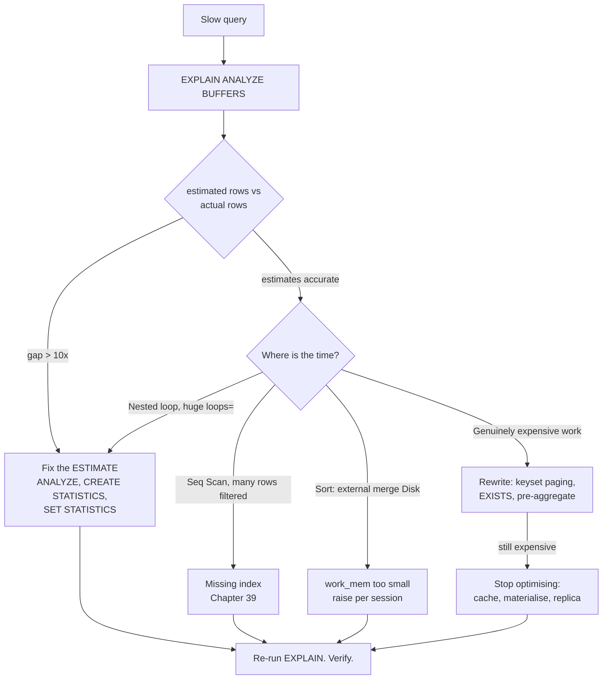
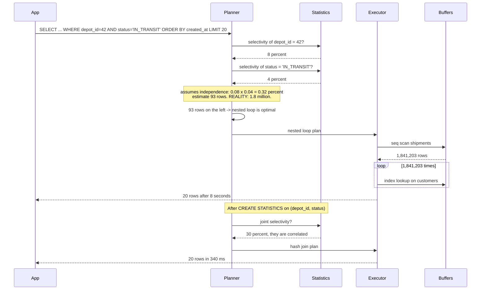

# Chapter 40: Query Optimization

## 40.1 Problem Statement

The indexes are right now. Chapter 39's audit removed eleven dead ones, fixed the column order on three, and added two partial indexes. Write throughput recovered. And the platform still has five queries that dominate the database's total time.

**The depot dashboard takes 8 seconds** and its plan shows a nested loop over 1.8 million rows. The estimate said 93. There is no index missing; the planner is working from a wrong number.

**A report joins six tables and takes 40 seconds,** and moving one `WHERE` clause makes it take 900 milliseconds. Nobody can explain why, so it gets treated as folklore.

**An `IN` subquery over a large list is slow, and rewriting it as a join is instant.** Also folklore, and also wrong: the actual cause is `NOT IN` with nullable columns, which is a different problem entirely.

**A query that returns 20 rows reads 400,000,** because a `LIMIT` sits above a sort that sits above a join, and nothing pushed the limit down.

**And the top query by total database time is a 4 millisecond query** executed 2 million times an hour. Nobody has looked at it because it is fast.

The theme: **once indexes are correct, the remaining cost is decided by the plan, and the plan is decided by estimates.** Optimising queries means learning to read a plan and knowing the handful of rewrites that actually change one.

## 40.2 Why This Problem Exists

**The optimiser is cost-based, and cost comes from estimates.** It does not know how many rows match your predicate. It guesses, and the guess drives the join order, the join algorithms, and everything downstream. A wrong guess produces a plan that is optimal for a query you did not run.

**Estimation errors compound multiplicatively through joins.** A twofold error at each of four joins is a sixteenfold error at the top, which is how a nested loop gets chosen for 1.8 million rows.

**The planner assumes columns are independent,** which real data never is. Status and depot correlate. City and postcode correlate. The estimate is the product of the individual selectivities, so it can be wrong by orders of magnitude.

**Total time, not per-query time, is what matters,** and the natural instinct is to optimise the slow query rather than the frequent one.

**And most "optimisation" advice is folklore** from a specific database version fixed years ago. The small set of rewrites that reliably help is smaller than people think.

## 40.3 Real World Analogy

Planning a route across a city.

You give a destination, not a route. The navigation system enumerates paths and estimates each, using its model of traffic. It picks the cheapest estimate.

**The estimate is the whole thing.** If it believes a road is clear and it is closed, you get a confident, terrible route. The system is not broken; its information is.

**Order dominates cost.** Visiting four places in the wrong order can double the distance, and the number of possible orders explodes, which is why the system uses heuristics rather than checking all of them.

**Some choices depend entirely on volume.** A shortcut through a small street is excellent for one car and gridlock for two hundred. That is nested loop against hash join, and choosing correctly requires knowing how many cars there are.

**And a small detour taken two thousand times a day** costs more than one bad route taken once. That is the 4 millisecond query executed 2 million times.

## 40.4 Simple Explanation

**Query optimisation is making the database choose a better plan, and there are only four ways to do it.**

| Way | What it means | When it is the answer |
|---|---|---|
| **Give better information** | Fix statistics so estimates are right | The estimate is wrong. Most cases |
| **Give a better option** | Add or fix an index | No good plan exists yet (Chapter 39) |
| **Ask a better question** | Rewrite so less work is required | The query asks for more than it needs |
| **Change the rules** | Tune planner settings or force a shape | Last resort, narrowly scoped |

The diagnostic that comes before all of them:

```
EXPLAIN (ANALYZE, BUFFERS) <your query>

Then read, in this order:

1. Compare  rows=<estimated>  against  rows=<actual>  at EVERY node.
   A gap of 10x or more is your problem. Stop and fix the estimate.

2. Find the node with the largest actual time. That is where the
   time goes; everything else is noise.

3. Check "Rows Removed by Filter". Large numbers mean you are
   reading rows only to throw them away.

4. Check Buffers: shared read vs shared hit. Reads are disk.
```

**Step 1 is the one people skip and it decides most cases.** A plan with accurate estimates and slow execution is a genuinely expensive query. A plan with wildly wrong estimates is a plan chosen for a different query, and rewriting it is wasted effort.

## 40.5 Technical Deep Dive

### 40.5.1 Reading a plan

Plans are trees, read from the innermost, most indented node outward. Times are cumulative, including children.

```
Limit  (cost=98452.11..98452.16 rows=20) (actual time=8021.4..8021.4 rows=20 loops=1)
  ->  Sort  (cost=98452.11..98457.11 rows=2000) (actual time=8021.4..8021.4 rows=20 loops=1)
        Sort Key: s.created_at DESC
        Sort Method: external merge  Disk: 41208kB          <-- (a) spilled to disk
        ->  Nested Loop  (cost=0.42..98398.2 rows=93)
                         (actual time=0.08..7904.1 rows=1841203 loops=1)
                                                    ^^^^^^^^^^^^^^^^^^
                              (b) estimated 93, got 1,841,203. Everything follows.
              ->  Seq Scan on shipments s  (actual time=0.01..412.7 rows=1841203)
                    Filter: (status = 'IN_TRANSIT' AND depot_id = 42)
                    Rows Removed by Filter: 4158797
              ->  Index Scan using customers_pkey on customers c
                    (actual time=0.003..0.004 rows=1 loops=1841203)
                                                        ^^^^^^^^^^^
                              (c) 1.8 million index lookups
Planning Time: 0.9 ms
Execution Time: 8024.1 ms
```

Three findings, in order of importance:

**(b) The estimate is wrong by 20,000 times.** That is the root cause. The planner chose a nested loop because 93 rows on the left side makes nested loop optimal.

**(c) `loops=1841203`** is the consequence. Per-loop time is 4 microseconds, which is fine; 1.8 million of them is 7.9 seconds.

**(a) The sort spilled to disk** because `work_mem` could not hold 41 MB. A secondary problem.

Fixing (b) fixes the plan:

```sql
ANALYZE shipments;

-- The real cause: status and depot_id are correlated, and the planner
-- assumes independence, so it multiplies their selectivities.
CREATE STATISTICS shipments_depot_status (dependencies, ndistinct)
  ON depot_id, status FROM shipments;
ANALYZE shipments;
```

With a correct estimate the planner picks a hash join, the query drops to 340 milliseconds, and no SQL was rewritten.

### 40.5.2 Why estimates go wrong, and how to fix each cause

| Cause | Signature | Fix |
|---|---|---|
| Stale statistics | Estimates match an older table size | `ANALYZE`; lower `autovacuum_analyze_scale_factor` |
| **Correlated columns** | Multi-predicate estimate far too low | `CREATE STATISTICS ... (dependencies)` |
| Skewed distribution | Common values estimated as average | Raise `SET STATISTICS` for a finer histogram |
| Expression predicates | Estimate defaults to a fixed guess | Index the expression, or `CREATE STATISTICS` on it |
| Join of derived tables | Errors compound through the tree | Materialise a CTE, or simplify the query |
| Parameters not yet known | Generic plan for all parameter values | `plan_cache_mode`, or literal values |

**Correlation is the most common and the least known.** The planner computes `P(a) x P(b)`. If `depot_id = 42` matches 8 percent and `status = 'IN_TRANSIT'` matches 4 percent, it estimates 0.32 percent. If LHR's shipments are overwhelmingly in transit, the truth may be 30 percent, a hundredfold error. Extended statistics teach it the dependency.

**Skew is the second.** PostgreSQL keeps a most-common-values list and a histogram. If a column has 5,000 distinct values with a long tail and the default target of 100 buckets, common values fall outside the tracked list and are estimated as average. `ALTER TABLE ... ALTER COLUMN ... SET STATISTICS 1000` fixes it at the cost of slower `ANALYZE`.

### 40.5.3 Join order, the dominant cost

For n tables there are up to n! join orders. PostgreSQL searches exhaustively up to `join_collapse_limit` (default 8) and switches to a genetic algorithm beyond that.

The governing principle:

> **Join the most selective thing first, so intermediate results stay small.**

```
Query: shipments JOIN customers JOIN depots JOIN carriers
       WHERE carriers.code = 'DHL-EXPRESS'   (matches 1 row)

BAD order:  shipments (6M) JOIN customers (2M)  -> 6M intermediate rows
            then JOIN depots                    -> 6M
            then JOIN carriers, filter to DHL   -> 12,000

            6,000,000 rows carried through three joins to return 12,000.

GOOD order: carriers filtered to 1 row
            JOIN shipments on that carrier      -> 12,000
            JOIN customers                      -> 12,000
            JOIN depots                         -> 12,000

            Same result, 500x less intermediate work.
```

This is Section 40.1's second incident. Moving a `WHERE` clause changed the estimated selectivity of one table, which changed the chosen join order, which changed everything. It looks like folklore and it is a cost model responding to information.

The three algorithms, from Chapter 37, and when each fails:

| Algorithm | Chosen when | Fails when |
|---|---|---|
| **Nested loop** | Left side estimated tiny, right side indexed | Left side is actually large. O(n x m) |
| **Hash join** | Both sides substantial, equality condition | Hash exceeds `work_mem`, spills to disk in batches |
| **Merge join** | Inputs already sorted, or both very large | Sort cost dominates |

**A nested loop chosen on a bad estimate is the single most common catastrophic plan.** The signature is `loops=` in the hundreds of thousands with a small per-loop time.

`work_mem` deserves a note because it is the most commonly misconfigured setting:

```
work_mem is PER SORT OR HASH OPERATION, PER CONNECTION.

A query with 3 hash joins and 2 sorts can use 5 x work_mem.
100 such connections can use 500 x work_mem.

Set it modestly globally; raise it per session for reports:
  SET LOCAL work_mem = '256MB';   -- inside the reporting transaction only
```

`Sort Method: external merge Disk:` in a plan means `work_mem` was too small for that operation.

### 40.5.4 The rewrites that reliably help

Most rewrite advice is folklore. These are the ones with a mechanism.

**Pagination: keyset instead of `OFFSET`.**

```sql
-- OFFSET reads and discards. Page 5,000 reads 250,000 rows to return 50.
SELECT * FROM shipments ORDER BY created_at DESC OFFSET 250000 LIMIT 50;

-- Keyset: seek directly. Constant cost at any depth.
SELECT * FROM shipments
WHERE (created_at, id) < (:last_created_at, :last_id)
ORDER BY created_at DESC, id DESC
LIMIT 50;
```

The tuple comparison including `id` is required for correctness when timestamps tie, and it is served by an index on `(created_at DESC, id DESC)`.

**`EXISTS` instead of `IN` for correlated existence checks,** and never `NOT IN` on a nullable column:

```sql
-- Broken, not just slow: if ANY returned customer_id is NULL,
-- NOT IN evaluates to NULL for every row and returns nothing.
SELECT * FROM customers WHERE id NOT IN (SELECT customer_id FROM shipments);

-- Correct and fast: stops at the first match, NULL-safe.
SELECT * FROM customers c
WHERE NOT EXISTS (SELECT 1 FROM shipments s WHERE s.customer_id = c.id);
```

That NULL behaviour is Section 40.1's third incident, and it is a correctness bug that presents as a performance complaint.

**Aggregate before joining,** so the join carries fewer rows:

```sql
-- Joins 6M shipment rows, then groups.
SELECT c.name, count(s.id)
FROM customers c JOIN shipments s ON s.customer_id = c.id
GROUP BY c.id, c.name;

-- Aggregates to one row per customer first, then joins 2M to 2M.
SELECT c.name, s.cnt
FROM customers c
JOIN (SELECT customer_id, count(*) AS cnt FROM shipments GROUP BY customer_id) s
  ON s.customer_id = c.id;
```

**`UNION ALL` instead of `UNION`** when duplicates are impossible. `UNION` sorts or hashes the whole result to deduplicate.

**Window functions instead of self-joins** for "latest per group":

```sql
-- Correlated subquery: runs once per shipment.
SELECT s.*, (SELECT max(event_at) FROM events e WHERE e.shipment_id = s.id)
FROM shipments s;

-- One pass.
SELECT DISTINCT ON (shipment_id) shipment_id, event_at, location
FROM events ORDER BY shipment_id, event_at DESC;
```

**Avoid `SELECT *`.** It defeats index-only scans (Chapter 39), transfers unnecessary bytes, and makes the query fragile to schema changes.

**And the CTE rule changed.** Before PostgreSQL 12, a CTE was an optimisation fence, always materialised. Since 12 it is inlined when referenced once. If you relied on the old behaviour, say so explicitly:

```sql
WITH filtered AS MATERIALIZED (          -- force the old behaviour
    SELECT * FROM shipments WHERE created_at > now() - interval '1 day'
)
SELECT * FROM filtered f JOIN customers c ON c.id = f.customer_id;
```

`MATERIALIZED` is occasionally the right tool when the planner keeps pushing a predicate somewhere expensive, but it is a fence, and fences prevent good decisions as well as bad ones.

### 40.5.5 Finding the queries that matter

Section 40.1's last incident. `pg_stat_statements` ranks by total time, which is the only ranking that matters.

```sql
-- The single most useful query in this chapter.
SELECT substring(query, 1, 90) AS q,
       calls,
       round(total_exec_time::numeric, 0)  AS total_ms,
       round(mean_exec_time::numeric, 2)   AS mean_ms,
       round(100 * total_exec_time / sum(total_exec_time) OVER (), 1) AS pct
FROM pg_stat_statements
ORDER BY total_exec_time DESC
LIMIT 20;
```

```
 q                                    calls      total_ms  mean_ms   pct
 ------------------------------------------------------------------------
 SELECT * FROM shipments WHERE trac  2,140,882  8,563,528     4.00  31.2   <-- (1)
 SELECT ... depot dashboard ...            412  3,305,872  8021.53  12.0   <-- (2)
 SELECT ... six-table report ...            29  1,160,000 40000.00   4.2
```

**Row (1) is the biggest win in the system and nobody has looked at it,** because 4 milliseconds does not feel like a problem. It is 31 percent of all database time. Halving it frees more capacity than eliminating the 8 second dashboard entirely.

The three ways to fix a fast, frequent query, in order of leverage:

1. **Call it less.** Cache it (Chapter 33), or batch the callers. An N+1 pattern is usually hiding here.
2. **Make it index-only** (Chapter 39), which often halves it.
3. **Make it cheaper per call.** Fewer columns, fewer joins.

**Also check `mean_exec_time` against `stddev_exec_time`.** A query with a low mean and high standard deviation has an unstable plan, usually from parameter-sensitive estimates, and it is the source of unexplained latency spikes.

### 40.5.6 Application-level causes

Many "slow query" problems are not query problems.

**The N+1 pattern** from Chapter 37 is the most common, and `pg_stat_statements` shows it as a fast query with an enormous call count. Fix it in the application, not the database.

**Chatty transactions** hold connections and locks while doing application work. Keep transactions to database work only.

**Missing batching:**

```java
// 1,000 round trips. At 0.5 ms network latency, 500 ms of pure waiting.
for (Shipment s : shipments) repo.save(s);

// One round trip, one plan, one transaction.
jdbc.batchUpdate("UPDATE shipments SET status = ? WHERE id = ?", batchArgs);
```

**Fetching more than needed:**

```java
// Loads full entities to compute a count.
List<Shipment> all = repo.findByDepotId(42);
int n = all.size();

// The database counts. One number crosses the network.
long n = repo.countByDepotId(42);
```

**And prepared statement plan caching.** After five executions, the JDBC driver and PostgreSQL may switch to a generic plan that ignores your specific parameter values. For a column with skewed distribution, the generic plan can be badly wrong for common values. `plan_cache_mode = force_custom_plan` fixes it per session where it matters.

### 40.5.7 When to stop optimising the query

Some queries should not be made faster; they should be moved.

| Situation | Better answer |
|---|---|
| Analytics on the primary | A read replica (Chapter 47) or a warehouse |
| The same expensive aggregate, repeatedly | A materialised view, refreshed on a schedule |
| A dashboard over all history | Precomputed rollup tables |
| Full-text search grafted onto SQL | A search engine, or at least a GIN index |
| Result identical for many callers | A cache (Chapter 33) |

```sql
-- Compute once per hour instead of on every dashboard load.
CREATE MATERIALIZED VIEW depot_daily AS
SELECT depot_id, date(created_at) AS day, status, count(*) AS n
FROM shipments GROUP BY 1, 2, 3;

CREATE UNIQUE INDEX ON depot_daily (depot_id, day, status);

-- CONCURRENTLY keeps the view readable during refresh; needs the unique index.
REFRESH MATERIALIZED VIEW CONCURRENTLY depot_daily;
```

**The most effective optimisation is often not running the query.** Chapter 33's caching arithmetic applies directly: a query eliminated is worth more than a query made twice as fast.

## 40.6 Architecture Diagram



```
 slow query
   |
 EXPLAIN (ANALYZE, BUFFERS)
   |
 Is estimated rows close to actual rows?
   |
   NO (10x+) --> FIX THE ESTIMATE. Stop here; most cases end here.
   |              ANALYZE / CREATE STATISTICS / SET STATISTICS
   YES
   |
 Where does the time actually go?
   |
   +-- Seq Scan discarding most rows ---> index (Chapter 39)
   +-- Sort spilled to disk ------------> work_mem, per session
   +-- Nested loop, loops=1,000,000 ----> estimate again
   +-- Genuinely expensive -------------> rewrite
   |                                        |
   |                                     still expensive
   |                                        |
   +-------------------------------------> do not run it:
                                            cache / materialised view / replica
```

## 40.7 Request Flow



1. **The planner asks statistics for each predicate separately.**
2. **It multiplies them, assuming independence,** which real data violates.
3. **The tiny estimate makes nested loop look optimal,** and it would be, for 93 rows.
4. **Execution reveals the truth,** as 1.8 million loops.
5. **Extended statistics change the estimate, which changes the plan.** The SQL never changed.

## 40.8 Internal Components

| Component | Role | Failure mode | Guard |
|---|---|---|---|
| Statistics | Feed selectivity estimates | Stale, or assume independence | `ANALYZE`, extended statistics |
| MCV list and histogram | Model distribution | Too coarse for skewed columns | `SET STATISTICS 1000` |
| Extended statistics | Capture correlation | Absent by default | `CREATE STATISTICS` on correlated pairs |
| Join order search | Minimise intermediate rows | Beyond `join_collapse_limit`, heuristic search | Simplify the query, or raise the limit carefully |
| Join algorithm choice | Nested loop, hash, merge | Nested loop on a bad estimate | Fix the estimate first |
| `work_mem` | Sort and hash memory | Too small, so disk spills; too large, so OOM | Modest globally, raised per session |
| Plan cache | Avoid replanning | Generic plan wrong for skewed parameters | `plan_cache_mode` where it matters |
| `pg_stat_statements` | Ranks by total time | Not enabled, so priorities are guesses | Enable it and review weekly |
| Materialised views | Precompute repeated work | Staleness, refresh cost | Unique index plus `REFRESH CONCURRENTLY` |
| `LIMIT` push-down | Stop early | Blocked by a sort or aggregate above the join | An index providing the sort order |

## 40.9 Production Example

**GitLab publishes its database review process publicly,** and it is the best working example of Section 40.5.5 in practice: every migration and query change goes through plan review, with `EXPLAIN` output attached. The lesson is procedural rather than technical, which is that plan review before merge catches what monitoring catches only after an incident.

**Shopify's work on their PostgreSQL fleet** repeatedly returns to the same finding: the queries that dominate total time are usually fast, frequent ones, and the fix is caching or batching in the application rather than SQL tuning.

**Uber, Stripe, and Instagram** have all published on `pg_stat_statements`-driven optimisation as routine practice rather than incident response. The pattern is a weekly review of the top twenty by total time, which is a habit rather than a project.

**And the counter-example.** A great deal of published query-tuning advice, particularly around `IN` versus `EXISTS` and subquery flattening, describes optimiser limitations fixed a decade ago. Verify with `EXPLAIN` on your version rather than applying rules from a blog post. The rewrites in Section 40.5.4 are there because each has a mechanism that still holds.

## 40.10 Advantages

- **The feedback loop is tight and honest.** `EXPLAIN ANALYZE` shows exactly what happened, not a model of it.
- **Fixing an estimate can be a hundredfold improvement with no code change,** and it improves every query touching those columns.
- **`pg_stat_statements` removes the guesswork** about what to work on.
- **The planner improves with upgrades,** so the work does not decay.
- **Most of the wins are configuration and statistics,** not risky rewrites.
- **Materialised views and caching are available** when a query genuinely should not run.

## 40.11 Limitations

- **You cannot fix estimation errors you do not know about,** and nothing alerts on them.
- **Correlated columns are a permanent structural weakness;** extended statistics help, they do not solve it.
- **Plans can change without warning** as data grows, so an optimised query is not permanently optimised.
- **Deep join trees exceed exhaustive search,** and the heuristic result can be poor.
- **`work_mem` cannot be right for both OLTP and analytics** on one instance.
- **Planner hints are not available in PostgreSQL,** by design, so the escape hatches are blunt.
- **Some queries cannot be made fast,** and recognising that is part of the skill.

## 40.12 Trade-offs

| Choice | Gain | Cost | Remove it and |
|---|---|---|---|
| Extended statistics | Correct estimates on correlated columns | Slower `ANALYZE`, more catalogue data | Nested loops chosen for million-row inputs |
| Higher statistics target | Better estimates on skewed columns | Slower `ANALYZE`, more planning time | Common values estimated as average |
| Raising `work_mem` | Sorts and hashes stay in memory | Multiplied by concurrency, risks OOM | Disk spills on large sorts |
| Materialised view | Expensive work done once | Staleness, refresh cost, storage | Recomputing the same aggregate per request |
| Keyset pagination | Constant cost at any depth | No random page access, more complex API | Linear degradation with page depth |
| `MATERIALIZED` CTE fence | Predictable, prevents bad push-down | Prevents good push-down too | The planner decides, usually correctly |
| Caching the result | The query does not run at all | Staleness, invalidation (Chapter 34) | The full cost on every request |
| Moving analytics to a replica | Primary protected from long queries | Replication lag, extra infrastructure | Long queries blocking vacuum on the primary |

The governing trade: **you are spending planning time and statistics maintenance to avoid execution time.** For a query run twice a day that is a bad trade; for one run two million times an hour it is overwhelming.

## 40.13 Common Mistakes

- **Not comparing estimated against actual rows,** which is the first thing to check and the most commonly skipped.
- **Rewriting SQL when the estimate is wrong.** A better query with the same bad estimate gets the same bad plan.
- **Optimising the slowest query instead of the costliest,** ignoring total time.
- **Using `EXPLAIN` without `ANALYZE`,** which shows estimates only and hides the entire problem.
- **Benchmarking with unrepresentative data,** so the planner makes different choices than in production.
- **Applying rewrite folklore** from old versions without verifying with `EXPLAIN`.
- **`NOT IN` on a nullable column,** which is a correctness bug, not just slow.
- **Raising `work_mem` globally** and running the machine out of memory under concurrency.
- **`SELECT *`,** defeating index-only scans and moving unnecessary bytes.
- **Ignoring N+1 patterns** because each individual query is fast.
- **Never enabling `pg_stat_statements`,** and therefore prioritising by anecdote.
- **Adding an index for every slow query** without checking whether the estimate was the problem.

## 40.14 Interview Questions

1. Walk through how you would diagnose a slow query, in order.
2. What is the first thing you look for in `EXPLAIN ANALYZE` output, and why that first?
3. Why does the planner underestimate rows when two predicates are correlated, and what fixes it?
4. Explain why moving a `WHERE` clause can change a query's runtime by fiftyfold.
5. Why is a nested loop the most dangerous plan choice?
6. Your top query by total time takes 4 milliseconds. Is that worth working on? Justify it.
7. Explain `work_mem`. Why is setting it globally high dangerous?
8. Why is `OFFSET` pagination slow at depth, and what replaces it?
9. When is `NOT IN` wrong rather than slow?
10. When should you stop optimising a query and do something else instead?

## 40.15 Production Best Practices

- **Enable `pg_stat_statements` everywhere** and review the top twenty by total time weekly.
- **Always `EXPLAIN (ANALYZE, BUFFERS)`,** never bare `EXPLAIN`, and read estimated against actual first.
- **Create extended statistics on correlated column pairs** in your large tables, proactively.
- **Raise the statistics target on skewed columns** used in predicates.
- **Tune autovacuum's analyze thresholds per table,** since large tables analyse too rarely by default.
- **Keep `work_mem` modest globally; use `SET LOCAL` for reports.**
- **Use keyset pagination** for anything deeply pageable.
- **Review plans in code review** for queries touching large tables. Attach the `EXPLAIN` output.
- **Alert on plan instability:** high `stddev_exec_time` relative to `mean_exec_time`.
- **Move analytics off the primary** to a replica, and long-running aggregates into materialised views.
- **Look for N+1 patterns** as high-call-count entries, and fix them in the application.
- **Re-verify after every change.** An index or statistic that did not change the plan is pure cost.

## 40.16 Summary

Once indexes are correct, query performance is decided by the plan, and the plan is decided by estimates. That single sentence reorders the whole discipline: **the first question about a slow query is never "how do I rewrite this", it is "did the planner know how many rows it was dealing with".**

Compare estimated rows against actual rows at every node. A gap of ten times or more means the plan was chosen for a query you did not run, and no rewrite will help because the same wrong estimate will produce the same wrong plan. The usual causes are stale statistics, a distribution too skewed for the default histogram, and correlated columns that the planner multiplies as though they were independent. All three have direct fixes that change nothing about your SQL.

When the estimates are right and the query is still slow, the work is genuine, and the rewrites that reliably help are a short list with mechanisms behind them: keyset pagination instead of `OFFSET`, `EXISTS` instead of `NOT IN` on nullable columns, aggregating before joining, and avoiding `SELECT *`. Most other rewrite advice describes optimiser limitations that were fixed years ago, so verify with `EXPLAIN` rather than trusting a rule.

Then there is the prioritisation problem, which is where most real capacity is found. The instinct is to fix the eight second query. The evidence in `pg_stat_statements` usually says the four millisecond query running two million times an hour is a third of all database time, and the fix for that one is almost never SQL. It is caching, batching, or removing an N+1 pattern in the application.

And the last skill is knowing when to stop. Some queries should not be made faster, they should be cached, precomputed into a materialised view, or moved to a replica. A query eliminated beats a query optimised, every time.

## 40.17 Quick Revision Notes

- **Read `EXPLAIN (ANALYZE, BUFFERS)` in this order:** estimated vs actual rows, largest actual time, rows removed by filter, buffers read.
- **A 10x estimate gap is the root cause.** Fix the estimate, not the SQL.
- **Correlated columns** are the top cause. Planner multiplies selectivities. `CREATE STATISTICS ... (dependencies)`.
- **Skewed columns** need a higher statistics target.
- **Nested loop with huge `loops=`** is the classic catastrophic plan, always from a bad estimate.
- **Join order dominates cost:** most selective first, keep intermediates small.
- **`work_mem` is per operation per connection.** `Sort Method: external merge Disk` means it was too small.
- **Reliable rewrites:** keyset paging, `EXISTS` over `NOT IN` (nullable columns), pre-aggregate before joining, `UNION ALL`, no `SELECT *`.
- **`NOT IN` with any NULL returns no rows.** A correctness bug.
- **CTEs inline since PG 12.** Use `MATERIALIZED` only deliberately.
- **`pg_stat_statements` ranks by total time.** The fast frequent query usually wins.
- **High `stddev_exec_time`** signals plan instability.
- **Stop optimising and instead cache, materialise, or move to a replica.**

## 40.18 Mini Quiz

1. What is the first thing to check in a plan, and why does it come before everything else?
2. Why does the planner underestimate when two predicates are correlated?
3. Why is a nested loop so much more dangerous than a bad hash join?
4. Why can moving a `WHERE` clause change runtime by fiftyfold?
5. Is a 4 millisecond query ever worth optimising?
6. When is `NOT IN` a correctness bug?
7. When should you stop optimising a query?

**Answers**

1. The estimated row count against the actual row count at each node. It comes first because the planner is cost-based, so every decision it made about join order, join algorithm, and index usage was derived from those estimates. If they are wrong by an order of magnitude, the plan was chosen for a completely different query, and rewriting the SQL will simply produce a different query with the same wrong estimate and therefore a similarly wrong plan. Fixing the estimate through `ANALYZE`, a higher statistics target, or extended statistics often changes the plan entirely with no change to the SQL, which is why it is both the first check and the highest-leverage fix.

2. Because it stores selectivity per column and, lacking any information about their relationship, assumes independence and multiplies them. If one predicate matches eight percent of rows and another matches four percent, it estimates 0.32 percent. Real data is almost never independent: a particular depot's shipments may be overwhelmingly in one status, so the true joint selectivity might be thirty percent, a hundredfold error. The fix is `CREATE STATISTICS ... (dependencies)` on the correlated columns, which records the functional dependency so the planner stops multiplying, and this improves every query using that combination rather than only the one you were debugging.

3. Because its cost is the product of the two inputs rather than their sum. A nested loop performs one lookup on the inner side for every row on the outer side, so if the outer side is estimated at ninety rows and actually contains 1.8 million, the query performs 1.8 million index lookups instead of ninety. Each individual lookup remains fast, typically microseconds, which is why the per-loop time in the plan looks perfectly healthy and the total is catastrophic. A hash join chosen on a bad estimate degrades much more gracefully: it may spill to disk in batches and run several times slower, but the cost stays linear in the input size rather than becoming quadratic.

4. Because the position of a predicate changes which table the planner believes is most selective, which changes the join order it chooses, which changes the size of every intermediate result flowing up the tree. If a filter reduces one table to a single row and that table is joined first, every subsequent join carries a few thousand rows. If the same filter is applied late, the earlier joins carry millions of rows that are ultimately discarded. It looks like folklore because the SQL is logically equivalent, but the optimiser is responding to a genuine change in the information available to it, and the effect is entirely explicable from the plan.

5. Frequently yes, and it is often the highest-value target in the system. What matters is total time, which is calls multiplied by mean time, not mean time alone. A four millisecond query executed two million times an hour consumes more database capacity than an eight second query executed four hundred times, and `pg_stat_statements` ordered by `total_exec_time` makes that visible immediately. The fix is usually not SQL tuning, since four milliseconds is already close to the floor for a round trip plus a lookup. It is calling it less: caching the result, batching the callers, or eliminating an N+1 pattern that is generating the call volume.

6. Whenever the subquery can return a NULL. SQL's three-valued logic evaluates `x NOT IN (1, 2, NULL)` as NULL rather than true, because x might equal the unknown value, and a NULL predicate excludes the row. So a single NULL anywhere in the subquery result causes the entire query to return zero rows, silently and with no error. This typically appears when the subquery selects a nullable foreign key column. `NOT EXISTS` uses a correlated existence check rather than set membership, so it is unaffected by NULLs, and it also tends to be faster because it can stop at the first match.

7. When the query is doing genuinely necessary work and the estimates are accurate, so there is no plan left to improve. At that point the options are to run it less often or not at all: cache the result if many callers want the same answer, precompute it into a materialised view refreshed on a schedule if it is a recurring aggregate, roll it up into summary tables if it spans large history, or move it to a read replica if it is analytics competing with transactional traffic. This last option is important for a reason beyond its own cost, since a long-running query on the primary holds a snapshot open and blocks vacuum across the whole database.

## 40.19 Hands-on Exercise

**Part 1: read a bad plan.** Build a table with two strongly correlated columns and ten million rows. Query on both and capture `EXPLAIN (ANALYZE, BUFFERS)`. Record the estimated and actual rows and the join algorithm chosen.

**Part 2: fix it with statistics alone.** Add `CREATE STATISTICS ... (dependencies)`, re-analyse, and re-run. Record the new estimate, the new plan, and the new time. Change no SQL.

**Part 3: force the nested loop disaster.** Construct a join where the planner estimates a small outer side that is actually large. Observe the `loops=` count. Then set `enable_nestloop = off` for the session and compare, to see what the correct plan would have cost.

**Part 4: spill a sort.** Run a large `ORDER BY` with a small `work_mem` and find `Sort Method: external merge Disk` in the plan. Raise `work_mem` with `SET LOCAL` and compare. Calculate what that setting would cost at 200 concurrent connections.

**Part 5: page deeply.** Compare `OFFSET 100000 LIMIT 50` against the keyset equivalent at pages 1, 100, 1,000, and 10,000. Plot both curves.

**Part 6: break `NOT IN`.** Build a parent and child table where the child's foreign key is nullable and contains at least one NULL. Run `NOT IN` and observe zero rows. Convert to `NOT EXISTS` and compare correctness and speed.

**Part 7: find your real problem.** Enable `pg_stat_statements` on a real system, let it collect for a week, and rank by `total_exec_time`. Note where the slowest query ranks compared with the most frequent one, then work out how to make the top entry run less often rather than faster.

## 40.20 Further Reading

- PostgreSQL's documentation on Using EXPLAIN and Planner Statistics, which is unusually good and worth reading fully.
- *PostgreSQL 14 Internals*, Egor Rogov, freely available, for the cost model and join search in detail.
- Depesz's explain.depesz.com and the Dalibo explain visualiser, for reading large plans quickly.
- *SQL Performance Explained*, Markus Winand, for the query-shape side of the same problem.
- *Access Path Selection in a Relational Database Management System*, Selinger et al., 1979, the paper that defined cost-based optimisation.
- GitLab's public database review guidelines, as a working example of plan review in practice.
- Chapter 37 of this book for the planner, Chapter 39 for indexing, Chapter 33 for caching the queries you should not run, and Chapter 47 for read replicas.

---

**Next chapter: Chapter 41, Replication.** Leaving single-node performance behind: why every database eventually keeps more than one copy, what the copies guarantee about each other, and the failure modes that only appear once there is more than one.
