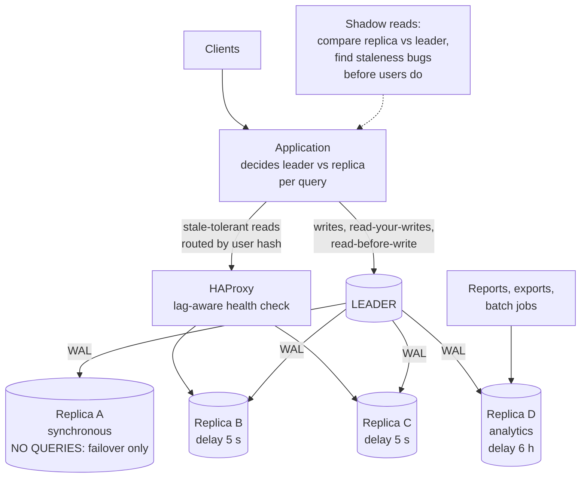
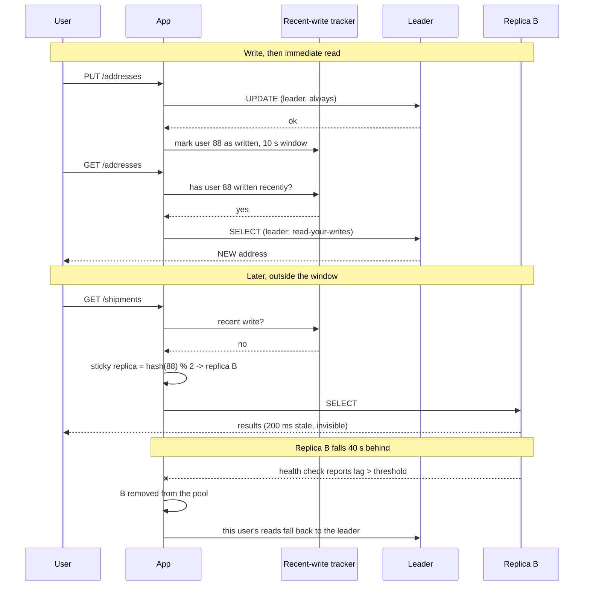

# Chapter 47: Read Replicas

## 47.1 Problem Statement

The tracking platform's leader is at 78 percent CPU and 94 percent of it is reads. Three followers exist and none of them serve traffic, because the one attempt to use them produced a week of intermittent bugs and was reverted.

Here is what happened during that week, and it is worth going through carefully because every item is something teams hit.

**The `@Transactional(readOnly = true)` annotation was added everywhere,** including on methods that write. Spring routed them to a replica, the write failed with `cannot execute UPDATE in a read-only transaction`, and it only failed for the 40 percent of requests that happened to route to a replica.

**A user updated their delivery address and the confirmation page showed the old one.** Chapter 41's read-your-writes problem, and it appeared for roughly one request in three.

**A support agent watched a shipment's status flip between `DELIVERED` and `IN_TRANSIT` on refresh,** because two replicas had different lag and round-robin routing alternated between them.

**A nightly report ran on a replica and was cancelled after 40 minutes** with `canceling statement due to conflict with recovery`. Rerunning it worked. Sometimes.

**A replica was taken down for maintenance and 30 percent of reads started failing,** because the connection pool had no health checking and kept handing out connections to a dead host.

**And the offload was less than expected anyway.** The leader dropped from 78 percent to 61 percent, not to the 20 percent that "94 percent of load is reads" implied, because the leader still performs every write, ships WAL to four followers, and the reads that could not be moved were the expensive ones.

The reverted change was correct in principle. It failed because **routing reads to replicas is a change to your consistency model, and it was treated as a configuration change.**

## 47.2 Why This Problem Exists

**A replica is a copy of the past.** How far in the past varies by replica, by moment, and by load, and every query sent to one inherits that uncertainty.

**"Read-only" is a claim about a code path that nothing verifies.** Marking a method read-only asserts it does not write and does not care about staleness. Both parts can be wrong, and the second is not checkable at all.

**Staleness tolerance is a per-query product decision** that engineers keep trying to make globally.

**Replicas fail differently from leaders.** They can be up, reachable, and 40 minutes behind, which no standard health check detects.

**And the offload is smaller than the read percentage suggests,** because the leader retains all write work, all replication work, and whichever reads could not be moved, which are usually the ones that mattered.

## 47.3 Real World Analogy

Branch offices with copies of the master ledger, from Chapter 41, now actually serving customers.

**Most enquiries can be answered locally.** "What is this shipment's status" does not need head office, and moving those enquiries to the branches is exactly the point.

**Some enquiries cannot.** A customer who just phoned head office to change their address will be told the old one at the branch, because the update has not arrived. Not a mistake by anyone, and infuriating to that customer.

**Two branches can disagree with each other,** and a customer who asks one and then the other sees the answer change. Which looks like a system that is broken rather than one that is merely behind.

**A branch clerk doing a long stocktake blocks incoming updates,** so that branch falls further behind while it works.

**A closed branch still has a sign on the door,** so customers keep walking up to it, and someone needs to redirect them.

**And head office is still doing all the work of recording transactions and posting copies to every branch,** so its load does not drop as much as "most enquiries happen at branches" implies.

## 47.4 Simple Explanation

**A read replica is a follower from Chapter 44 that is used to serve queries, so the leader only handles writes and the reads that need to be current.**

```
BEFORE                        AFTER
all traffic                   writes + fresh reads      stale-tolerant reads
     |                                 |                        |
  [LEADER]                        [LEADER] ------WAL-----> [replicas]
  78% CPU                         61% CPU                   serving most reads
```

**The question every query must answer:**

```
"If this query returns data that is 200 milliseconds old, and
 occasionally 30 seconds old, does anything break?"

YES -> leader
NO  -> replica
```

That is the whole decision, and it is a product question rather than a technical one. Some examples from the tracking platform:

| Query | Tolerates staleness? | Routes to |
|---|---|---|
| Shipment status on a public tracking page | Yes, seconds | Replica |
| A user's own address, right after they changed it | **No** | Leader |
| Depot dashboard, refreshed every 30 s | Yes | Replica |
| Checking whether a tracking code already exists | **No** | Leader |
| Reading a row you are about to update | **No** | Leader |
| Search results | Yes | Replica |
| Nightly report | Yes, and it is long-running | Dedicated analytics replica |
| Anything inside a write transaction | **No** | Leader |

**The two rows to internalise.** A read that feeds a write decision must go to the leader, because a stale read plus a write is a lost update. And **read-your-writes** is the case users actually notice, because it is the one where the system contradicts something they just did.

**What replicas do not fix:**

| Problem | Replicas help? |
|---|---|
| Read-heavy load | **Yes.** This is the use case |
| Write-heavy load | No. Every replica does every write (Chapter 42) |
| Storage size | No. Every replica holds everything (Chapters 42, 43) |
| One slow query | No. It is equally slow on a replica |
| Availability | Partly. Reads survive a leader outage; writes do not |

## 47.5 Technical Deep Dive

### 47.5.1 Deciding what can move

The audit that should precede any routing change. For each query in `pg_stat_statements` (Chapter 40), classify it:

```
1. WRITES and anything in a write transaction    -> leader, always
2. Reads that feed a write decision              -> leader, always
3. Reads the user just caused                    -> leader, or LSN-gated
4. Reads of another user's or shared data        -> replica
5. Aggregations and dashboards                   -> replica
6. Long analytical queries                       -> dedicated analytics replica
```

**Category 2 is the one that gets missed** and it is the dangerous one:

```java
// This LOOKS read-only. It is not: the read decides the write.
// On a replica, two concurrent requests both see "free" and both claim.
@Transactional(readOnly = true)          // WRONG
public Optional<Slot> claimSlot(int depotId) {
    Slot free = repository.findFirstFree(depotId);   // stale on a replica
    ...
}
```

Chapter 37's lost update, with replication lag making the window enormous instead of microseconds.

**Category 3 has three implementations, in increasing precision:**

```java
// 1. Sticky window. Simple, coarse, and correct enough for most systems.
//    After a user writes, send their reads to the leader briefly.
public <T> T read(long userId, Supplier<T> query) {
    return recentWrites.wroteWithin(userId, Duration.ofSeconds(10))
        ? onLeader(query)
        : onReplica(query);
}
```

```java
// 2. LSN gating. Precise: read from a replica only if it has replayed
//    past the user's last write position. Wastes no replica capacity.
public <T> T read(String minLsn, Supplier<T> query) {
    return replicaPool.stream()
        .filter(r -> r.replayLsn().compareTo(minLsn) >= 0)
        .findFirst()
        .map(r -> onReplica(r, query))
        .orElseGet(() -> onLeader(query));      // none caught up yet
}
```

```
// 3. synchronous_commit = remote_apply on the leader.
//    The commit does not return until a replica has APPLIED it,
//    so any read on that replica sees it. Correct, and the most
//    expensive option, since every write waits for replica apply.
```

**Option 1 covers most cases.** Option 2 is worth building when replica capacity is tight. Option 3 is rarely the right trade because it slows every write to fix a read problem.

### 47.5.2 Monotonic reads, and why round robin breaks them

Section 47.1's third incident.

```
Replica A: lag 50 ms
Replica B: lag 3 s

Round robin:
  request 1 -> A -> status DELIVERED
  request 2 -> B -> status IN_TRANSIT      <- time went backwards
  request 3 -> A -> status DELIVERED

The user refreshes and watches the status flicker.
```

**The fix is to route consistently rather than randomly:**

```java
// Same user, same replica, so a user never moves backwards in time.
// They may see stale data, but never data older than what they
// already saw, which is the guarantee that matters perceptually.
int index = Math.floorMod(Long.hashCode(userId), replicas.size());
return replicas.get(index);
```

**Two details make this actually work.** The replica list must be stable, so a replica going down should not reshuffle everyone; use consistent hashing (Chapter 50) or a fixed list with failover to a designated backup. And a session, not just a user, is often the right key, because monotonicity is a property of one person's continuous experience.

### 47.5.3 Query conflicts, revisited practically

Chapter 44 covered the mechanism. Here is the operational shape.

```
Replica replays: "vacuum removed row version X"
Replica is running: a query whose snapshot needs X

-> conflict. Either the query dies or replay pauses.
```

The right configuration is different per replica role, which is the key insight:

```
# Replicas serving user traffic: freshness matters, queries are short.
# Cancel conflicting queries quickly; they should not exist anyway.
max_standby_streaming_delay = 5s
hot_standby_feedback = off

# Dedicated analytics replica: long queries matter, lag does not.
# Let replay wait, and accept that this replica is often behind.
max_standby_streaming_delay = 6h
hot_standby_feedback = off        # off: do NOT bloat the leader
```

**`hot_standby_feedback = on` is the setting to be careful with.** It eliminates conflicts by making the leader retain row versions the replica still needs, which means **a long query on a replica causes bloat on the leader** (Chapter 37). One analyst's query can degrade the primary database. Prefer a long `max_standby_streaming_delay` on an isolated replica instead.

**Separating replicas by role is the single most valuable structural decision here:**

| Replica | Role | `max_standby_streaming_delay` | Serves |
|---|---|---|---|
| A | Synchronous standby | n/a | Failover only, no queries |
| B, C | User read traffic | 5 s | Short queries, routed by user hash |
| D | Analytics | 6 h | Reports, batch jobs, exports |

Replica A serving no queries is deliberate: its job is to be current for promotion, and queries would introduce lag exactly where you need none.

### 47.5.4 Routing implementations

**Application-level** with Spring's routing data source:

```java
@Configuration
public class RoutingConfig {

    @Bean
    public DataSource dataSource(DataSource leader, List<DataSource> replicas) {
        return new AbstractRoutingDataSource() {
            @Override protected Object determineCurrentLookupKey() {
                // Default to the leader. A routing mistake should make
                // the system slow, never wrong.
                if (!TransactionSynchronizationManager.isCurrentTransactionReadOnly())
                    return "leader";
                if (RecentWrites.existsForCurrentUser())
                    return "leader";               // read-your-writes
                return "replica:" + stickyIndexForCurrentUser();
            }
        };
    }
}
```

**Proxy-level** with PgBouncer or HAProxy, where the application connects to one endpoint and the proxy decides. Simpler for the application, and the proxy cannot know about read-your-writes because it does not know which user wrote.

**A useful hybrid:** the proxy handles health checking, failover, and connection pooling, while the application chooses leader or replica by connecting to one of two endpoints. Each layer does the part it can actually know about.

```
# HAProxy: health checks that understand replication, not just TCP.
backend pg_replicas
    option httpchk GET /replica?lag=10485760      # reject if >10 MB behind
    balance leastconn
    server pg2 pg2:5432 check port 8008 inter 2s fall 2 rise 3
    server pg3 pg3:5432 check port 8008 inter 2s fall 2 rise 3
```

**That `lag` parameter is what Section 47.1's fifth incident needed.** A replica that is up but 40 minutes behind must be removed from the pool automatically, and only a lag-aware health check does that.

### 47.5.5 Making it safe to deploy

The reverted change failed partly because it was deployed all at once. The staged version:

```
1. Add routing infrastructure, route 0 percent to replicas. Deploy.
2. Route ONE low-risk read path. Measure correctness and lag.
3. Add a metric: reads served by replica vs leader, per endpoint.
4. Shadow-read: query both, compare, log differences, serve the leader's.
   This finds the read-your-writes violations BEFORE users do.
5. Increase coverage one query at a time.
6. Add lag-aware health checks and test replica removal under load.
7. Keep a kill switch that routes everything back to the leader.
```

**Step 4 is the one that would have prevented the whole week.** Comparing replica and leader results for the same query, in production, on real traffic, surfaces exactly the staleness problems that are hard to reason about in advance.

```java
// Shadow read. Serve the leader's answer; log when the replica differs.
public <T> T shadowRead(Supplier<T> query) {
    T authoritative = onLeader(query);
    if (sampler.shouldSample()) {
        executor.submit(() -> {
            T replicaResult = onReplica(query);
            if (!Objects.equals(authoritative, replicaResult)) {
                staleReads.counter("endpoint", currentEndpoint()).increment();
            }
        });
    }
    return authoritative;
}
```

### 47.5.6 What the offload actually gives you

Section 47.1's sixth point, and it is worth quantifying because expectations are usually wrong.

```
Leader load before:  100 units
  writes:              6
  replication:         2
  reads:              92

Naive expectation: move 92 -> leader at 8 units.

Reality:
  writes:                              6   (unchanged)
  replication to 4 replicas:           4   (INCREASED: more replicas,
                                            more WAL shipping)
  reads that cannot move:             28   (read-your-writes, read-before-write,
                                            uniqueness checks; and these are
                                            disproportionately the expensive ones)
  ------------------------------------------
  leader after:                       38   not 8

Real reduction: about 60 percent. Substantial, and not an order
of magnitude, and it does not raise the WRITE ceiling at all.
```

**Two conclusions.** Replicas buy meaningful headroom and buy time, which is often exactly what you need. And **if writes are the constraint, this does nothing**, and the answer is Chapter 42.

### 47.5.7 Monitoring

```sql
-- On the leader: per-replica state. This is the operational view.
SELECT client_addr, application_name, state, sync_state,
       (now() - reply_time)                          AS reply_age,
       pg_wal_lsn_diff(pg_current_wal_lsn(), replay_lsn) AS replay_bytes
FROM pg_stat_replication ORDER BY replay_bytes DESC;
```

```sql
-- On each replica: how old is the data I am serving? What users experience.
SELECT CASE WHEN pg_is_in_recovery()
            THEN now() - pg_last_xact_replay_timestamp()
            ELSE interval '0' END AS staleness;
```

The metrics that matter, and the ones people miss:

| Metric | Alert when | Why |
|---|---|---|
| Replay lag per replica, in seconds | Above your staleness budget | This is what users experience |
| Replay lag in bytes | Growing over time | Predicts whether it will recover |
| Replica query cancellations | Any sustained rate | Conflicts are hurting users |
| Reads served by replica vs leader | Ratio drops suddenly | Routing broke, or replicas fell out of the pool |
| Stale read rate from shadow reads | Above baseline | The consistency model is being violated |
| Leader CPU | Rising after offload | Something routed back |

**The second row is the one people miss.** Lag in seconds tells you the current situation; lag in bytes tells you whether the replica is catching up or falling further behind, which is a different and more actionable question.

## 47.6 Architecture Diagram



```
   clients -> application (decides per query)
                 |
     +-----------+---------------------------+
     | writes                                | stale-tolerant reads
     | read-your-writes                      | routed by USER HASH
     | read-before-write                     |   (not round robin, or
     | uniqueness checks                     |    monotonic reads break)
     v                                       v
  LEADER                              HAProxy: lag-aware health check
     |                                  -> ejects a replica >10 MB behind
     | WAL                              |
     +--> replica A  synchronous, NO QUERIES (stays current for failover)
     +--> replica B  user reads, delay 5 s   <--+
     +--> replica C  user reads, delay 5 s   <--+
     +--> replica D  ANALYTICS, delay 6 h  <- reports and batch jobs,
                                              isolated so their long
                                              queries cannot lag B and C
```

## 47.7 Request Flow



1. **Writes always go to the leader.** No exceptions, and defaulting to the leader means a routing mistake is slow rather than wrong.
2. **A recent write pins that user's reads to the leader briefly,** which is what makes read-your-writes hold.
3. **Outside the window, reads go to a replica chosen by hashing the user,** so the same user always sees a consistent view.
4. **Staleness of a couple of hundred milliseconds is invisible** for the queries that were classified as tolerant.
5. **A lagging replica is ejected by a lag-aware health check,** not just a TCP check, and its traffic falls back rather than failing.

## 47.8 Internal Components

| Component | Role | Failure mode | Guard |
|---|---|---|---|
| Query classification | Decides leader vs replica per query | Blanket `readOnly = true`, including writes | Classify individually; default to leader |
| Recent-write tracker | Enforces read-your-writes | Absent, so users see their writes vanish | Sticky window, or LSN gating |
| Sticky replica selection | Preserves monotonic reads | Round robin, so time appears to go backwards | Hash by user or session |
| Lag-aware health check | Ejects stale replicas | TCP-only check, so a 40-minute-stale replica stays in | Check `replay_lsn` against a threshold |
| Connection pool per target | Isolates leader and replica pools | One shared pool, so a dead replica poisons everything | Separate pools, independent health |
| Replica role separation | Isolates long queries | Analytics on user-facing replicas | Dedicated analytics replica |
| `max_standby_streaming_delay` | Conflict policy | One value for all roles | Short for user replicas, long for analytics |
| `hot_standby_feedback` | Eliminates conflicts | On, so the leader bloats | Off; isolate analytics instead |
| Shadow reads | Detects staleness violations | Absent, so users find them | Sample and compare in production |
| Kill switch | Reverts routing instantly | Absent, so rollback needs a deploy | Runtime flag, no deploy required |
| Replica count | Read capacity | More replicas, more WAL bandwidth from the leader | Cascade if bandwidth-bound (Chapter 41) |

## 47.9 Production Example

**Every managed cloud database offers read replicas as the first scaling step**, and the shape is consistent: a separate reader endpoint, lag exposed as a metric, and documentation warning that reads may be stale. Amazon Aurora's reader endpoint load-balances across replicas, which is convenient and is exactly the round-robin behaviour that breaks monotonic reads, so applications requiring it must pin explicitly.

**Aurora is worth noting as a different design.** Because its storage layer is shared rather than replicated per node, replica lag is typically single-digit milliseconds rather than hundreds. That does not remove the read-your-writes problem, it just narrows the window enough that fewer applications notice, which is a meaningfully different risk profile from streaming replication.

**GitLab's database documentation** is a good public example of Section 47.5.1's classification exercise: their code marks which queries may use replicas and includes explicit handling for the read-after-write case, treated as an application concern rather than an infrastructure one.

**Facebook's approach to read-after-write across regions** is a well-known variant of Section 47.5.1's option 2: after a write, the user is pinned to a region or given a token, and reads verify the replica has caught up before serving. The general pattern is that read-your-writes is solved by tracking a position, not by hoping the lag is small.

## 47.10 Advantages

- **Substantial read capacity** without changing the data model, unlike Chapter 42.
- **Isolation of expensive analytics** from user traffic, which alone justifies one replica.
- **Reads survive a leader outage,** so the system degrades to read-only rather than down.
- **Geographic read locality,** placing replicas near users.
- **Replicas are already there** for Chapter 41's durability reasons, so using them costs nothing extra in infrastructure.
- **Incrementally adoptable,** one query at a time, with a kill switch.
- **Backups and exports move off the leader.**

## 47.11 Limitations

- **All reads are stale by an unpredictable amount,** and staleness is worst under load.
- **Read-your-writes and monotonic reads break by default,** and both are user-visible.
- **No help for write load or storage size,** which are Chapters 42 and 43.
- **Query conflicts** force a choice between cancelled queries, lag, and leader bloat.
- **Offload is smaller than the read percentage implies,** typically around 60 percent rather than an order of magnitude.
- **Every replica performs every write,** so replicas add WAL bandwidth cost to the leader.
- **Routing correctness is an application concern** that infrastructure cannot solve.
- **A degraded replica looks healthy** to any check that does not measure lag.

## 47.12 Trade-offs

| Choice | Gain | Cost | Remove it and |
|---|---|---|---|
| Serve reads from replicas | Large read capacity gain | Staleness surfaces to users | The leader takes all read load |
| Default to the leader | Routing mistakes are slow, not wrong | Less offload than possible | Mistakes produce stale data silently |
| Sticky routing by user | Monotonic reads preserved | Uneven replica load | Users watch time go backwards |
| Sticky primary window | Read-your-writes holds | Some reads stay on the leader | Users see their own writes vanish |
| LSN gating | Precise, wastes no capacity | More machinery to build and operate | A coarse window, or stale reads |
| `remote_apply` | Replicas are read-your-writes safe | Every write waits for replica apply | Application-level handling |
| Dedicated analytics replica | Long queries cannot lag user reads | One more replica to run | Cancelled reports, or lagging user replicas |
| `hot_standby_feedback = on` | No cancelled queries | Bloat accumulates on the leader | Cancellations, or a long standby delay |
| Lag-aware health checks | Stale replicas ejected automatically | More complex checking | Serving 40-minute-old data with a green check |

The trade at the centre: **you are trading a bounded amount of staleness for a large amount of read capacity.** That is nearly always worth it, provided the bound is known, monitored, and applied per query rather than globally.

## 47.13 Common Mistakes

- **Blanket `@Transactional(readOnly = true)`,** including on paths that write.
- **No read-your-writes handling,** which is the failure users notice most.
- **Round-robin routing,** breaking monotonic reads.
- **Reads that feed writes routed to replicas,** producing lost updates.
- **Defaulting to replicas,** so mistakes are silently wrong rather than merely slow.
- **TCP-only health checks,** leaving a badly lagging replica in the pool.
- **Analytics on user-facing replicas,** causing lag or cancellations for everyone.
- **`hot_standby_feedback = on`** without watching leader bloat.
- **No shadow reads,** so staleness bugs are found by users.
- **Assuming replicas help write load.** They do not.
- **One shared connection pool** for leader and replicas.
- **No kill switch,** so reverting requires a deploy during an incident.

## 47.14 Interview Questions

1. What do read replicas solve, and what do they explicitly not solve?
2. How do you decide whether a query can be served by a replica?
3. Explain read-your-writes. Give three implementations with their trade-offs.
4. Why does round-robin routing break monotonic reads, and how do you fix it?
5. Why must a read that feeds a write go to the leader?
6. Why is a TCP health check insufficient for a replica?
7. Explain query conflicts and the three ways to handle them.
8. Why is `hot_standby_feedback = on` risky?
9. You move 94 percent of reads to replicas. Why does leader load not drop by 94 percent?
10. How would you roll this out safely on a live system?
11. When do replicas stop being the answer?

## 47.15 Production Best Practices

- **Default to the leader.** Opt into replicas per query, explicitly.
- **Classify every query** by staleness tolerance before routing anything.
- **Implement read-your-writes** with a sticky window at minimum.
- **Route stickily by user or session,** never round robin.
- **Use lag-aware health checks** that eject a replica exceeding a byte or time threshold.
- **Separate replicas by role:** synchronous standby serving nothing, user-traffic replicas, and an isolated analytics replica.
- **Keep `hot_standby_feedback` off** and isolate long queries instead.
- **Run shadow reads** on a sample of traffic and alert on divergence.
- **Separate connection pools** per target, with independent health.
- **Keep a runtime kill switch** to route everything back to the leader without deploying.
- **Alert on lag in seconds and on the leader-versus-replica read ratio.**
- **Roll out one query at a time,** measuring correctness before increasing coverage.

## 47.16 Summary

Read replicas are the first and cheapest way to scale a read-heavy database, and the reason they so often go badly is that they look like a configuration change and are actually a change to your consistency model.

The core question is per query and it is a product question: **if this data is two hundred milliseconds old, and occasionally thirty seconds old, does anything break?** Most reads answer no, which is why this works. The ones that answer yes fall into three groups that must stay on the leader: anything inside a write transaction, any read whose result feeds a write decision, and any read of something the user just changed. That second group is the one that gets missed, because a read-check-write sequence looks read-only and becomes Chapter 37's lost update with replication lag widening the window from microseconds to seconds.

The two failures users actually perceive are read-your-writes and monotonic reads. The first is fixed by pinning a user's reads to the leader briefly after they write, or more precisely by gating on the replica's replay position. The second is fixed by routing each user consistently to the same replica, because round robin across replicas with different lag makes a status flip back and forth on refresh, which reads as a broken system rather than a stale one.

Operationally, two things matter more than they appear to. **Replicas must be separated by role**, because a long analytical query on a user-facing replica will either be cancelled or will stall replay and lag everyone, and neither outcome is acceptable when the same machine is serving the product. And **health checks must measure lag**, because a replica that is up, accepting connections, and forty minutes behind passes every ordinary check while serving data that is wrong in a way users will notice.

Finally, calibrate the expectation. Moving nearly all reads off the leader does not reduce its load by nearly all, because it still performs every write, ships the log to every replica, and retains the reads that could not move, which tend to be the expensive ones. A sixty percent reduction is a realistic outcome and a genuinely valuable one, and it buys headroom and time. **It does not raise the write ceiling by a single transaction**, and when writes are the constraint, the answer is Chapter 42 and it is a much larger conversation.

## 47.17 Quick Revision Notes

- **A read replica is a follower serving queries.** The question per query: does staleness break anything?
- **Always on the leader:** writes, reads inside write transactions, reads that feed writes, reads of what the user just changed, uniqueness checks.
- **Default to the leader.** A routing mistake should be slow, never wrong.
- **Read-your-writes:** sticky window (simple), LSN gating (precise), `remote_apply` (correct and expensive).
- **Monotonic reads:** route stickily by user or session. Round robin breaks this.
- **A read that feeds a write is not read-only.** Lost update, with a lag-sized window.
- **Health checks must be lag-aware.** TCP checks pass on a 40-minute-stale replica.
- **Separate replicas by role:** sync standby (no queries), user reads, analytics (long delay).
- **`hot_standby_feedback = on` bloats the LEADER** because of queries on a replica.
- **Shadow reads** find staleness bugs before users do.
- **Realistic offload is around 60 percent,** not the read percentage.
- **No help for writes or storage.** That is Chapters 42 and 43.

## 47.18 Mini Quiz

1. Why is a read that decides whether to write not safe on a replica?
2. Why does round-robin routing across replicas break monotonic reads?
3. Why is a TCP health check insufficient for a read replica?
4. Why does `hot_standby_feedback = on` affect the leader?
5. You move 94 percent of reads to replicas. Why does the leader not drop to 6 percent?
6. What are the three ways to guarantee read-your-writes, and which would you choose?
7. When do read replicas stop being the right answer?

**Answers**

1. Because the value it reads may already be out of date by the replication lag, so the decision is made against a state the system has moved past. A check that a slot is free, or that a tracking code is unused, can read a replica that has not yet received the write which took that slot or issued that code, and the subsequent write then proceeds on a false premise. This is the lost update from Chapter 37, but where a single-node race window is microseconds and needs concurrent transactions to hit, replication lag widens the window to hundreds of milliseconds or more, so the race is not rare, it is routine. Any read whose result is a precondition for a write belongs on the leader, and ideally takes a row lock while it is there.

2. Because replicas have independent and varying lag, so consecutive requests from one user can be served by replicas at different points in the write history. A user whose first request hits a replica that is fifty milliseconds behind sees a delivered status, and whose second request hits one that is three seconds behind sees in transit, so from their perspective the system moved backwards in time. Users tolerate stale data far better than they tolerate contradictory data, because staleness looks like a slow system and contradiction looks like a broken one. Hashing the user or session identifier to a fixed replica means each person sees one consistent timeline, which may be slightly behind but never regresses.

3. Because a replica can be perfectly healthy at the network and process level while serving data that is arbitrarily old. Replication is a separate concern from the database accepting connections: a replica whose replay has stalled behind a long-running query, or which is simply unable to keep up with the leader's write rate, will answer TCP connections and even simple queries promptly while being forty minutes behind. Every ordinary check therefore passes and the load balancer keeps sending it traffic. The check has to interrogate replication state, comparing the replica's replay position against the leader's current position or against the age of the last replayed transaction, and remove the replica from the pool when it exceeds a threshold you have chosen deliberately.

4. Because it works by having the replica tell the leader which row versions its running queries still need, and the leader then delays vacuuming those versions so the replica's queries cannot be cancelled by conflicting cleanup. The consequence is that dead tuples accumulate on the leader for as long as the replica's longest query runs, which is Chapter 37's bloat problem inflicted remotely: a single analyst running a two-hour query on a replica can cause two hours of unvacuumed dead tuples on the primary database. It is a genuine fix for query cancellations, and the cost lands on the most important machine in the system, which is why isolating long queries on a dedicated replica with a long standby delay is usually the better arrangement.

5. Because the leader keeps doing everything except those reads. It still executes every write, which is unchanged. It still generates write-ahead log records and ships them to every replica, and that cost actually increases as you add replicas. And a portion of reads cannot be moved at all: read-your-writes cases, reads that precede writes, uniqueness checks, and anything inside a write transaction. Those retained reads are also disproportionately expensive, since they tend to be the transactional ones with locking and index maintenance around them rather than the cheap lookups that dominate by count. A realistic outcome is a reduction of around sixty percent, which is genuinely valuable headroom but is not the order of magnitude the raw read percentage suggests.

6. A sticky window that routes a user's reads to the leader for a short period after they write, which is coarse and simple and covers nearly every real case. LSN gating, where the write's log position is recorded and reads are served only by a replica that has replayed at least that far, falling back to the leader otherwise, which is precise and wastes no replica capacity but requires more machinery. Or `synchronous_commit = remote_apply`, which makes every commit wait until a replica has applied and made the change visible, so any read on that replica is safe. I would start with the sticky window because it is a few lines and covers the user-visible problem immediately, then move to LSN gating if replica capacity becomes tight. I would avoid `remote_apply` in most systems, because it slows every single write to solve a problem that only affects a small fraction of reads.

7. When the constraint moves from reads to writes, or to storage. Replicas do nothing for either: every replica applies every write, so the write ceiling stays exactly where it was, and every replica holds a full copy, so total data volume is unchanged. If the leader is saturated by write throughput, or the dataset no longer fits comfortably on one machine, adding replicas increases cost and WAL bandwidth without addressing the problem. At that point the answers are partitioning within the database for maintenance and query pruning, and sharding across machines for genuine write and storage scaling, which is a far larger and less reversible change and is why it comes last.

## 47.19 Hands-on Exercise

**Part 1: measure the offload.** With everything on the leader, record its CPU and query rate. Route all safe reads to replicas and record again. Compute the actual reduction and compare it with the read percentage.

**Part 2: break read-your-writes.** Write a value and immediately read it from a replica in a loop, counting stale results. Add a sticky window and confirm it goes to zero. Then implement LSN gating and compare how much replica capacity each approach preserves.

**Part 3: break monotonic reads.** Give two replicas deliberately different lag, route round robin, and read repeatedly. Observe the value oscillating. Switch to sticky hashing and confirm it stops.

**Part 4: lose an update.** Implement a read-check-write against a replica and drive concurrent requests. Count double-claims. Move the read to the leader with `FOR UPDATE` and confirm zero.

**Part 5: fool a health check.** Stall replay on a replica while keeping it accepting connections. Confirm a TCP check keeps it in the pool. Implement a lag-aware check and confirm it is ejected.

**Part 6: cause a query conflict.** Run a long report on a user-facing replica while the leader updates and vacuums the same rows. Observe the cancellation. Raise the standby delay and watch lag grow instead. Then move the report to a dedicated replica and confirm both problems disappear.

**Part 7: shadow read.** Implement sampled comparison of replica and leader results in a non-production environment with real traffic replay. Produce a report of which endpoints diverge and how often. That report is your routing plan.

## 47.20 Further Reading

- PostgreSQL's documentation on hot standby, particularly the sections on query conflicts and `hot_standby_feedback`.
- *Designing Data-Intensive Applications*, Martin Kleppmann, chapter 5's discussion of read-after-write, monotonic reads, and consistent prefix reads.
- GitLab's database documentation on load balancing and read-after-write handling.
- Amazon Aurora's documentation on reader endpoints and replica lag, as a contrasting architecture.
- Spring Framework's `AbstractRoutingDataSource` documentation, for the routing mechanics.
- Chapter 41 of this book for replication and lag, Chapter 44 for the followers this chapter uses, Chapter 37 for the lost update and vacuum interactions, Chapter 42 for what to do when writes are the constraint, and Chapter 57 for CQRS, which takes the read/write split to its conclusion.

---

**Next chapter: Chapter 48, Database Failover.** The event every replicated system is built around and few rehearse: what actually has to happen between a leader failing and the system working again, why the measured time is always longer than the estimate, and how to make it a routine operation rather than an incident.
