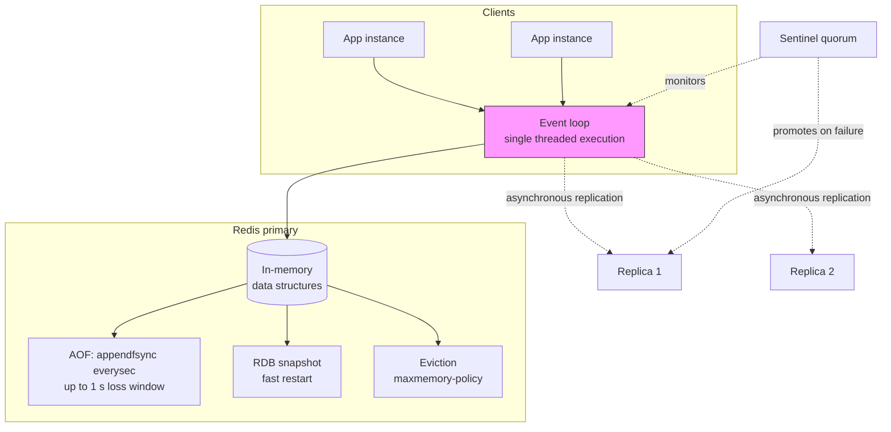
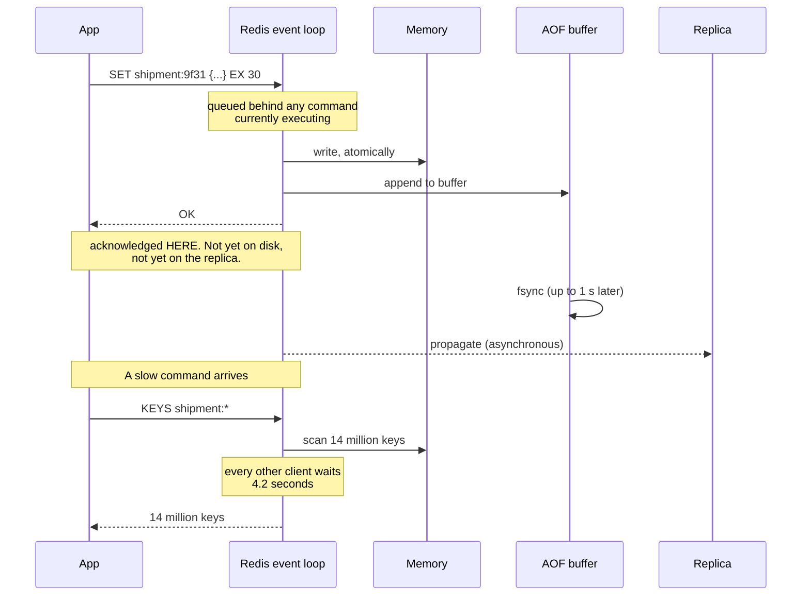

# Chapter 35: Redis

## 35.1 Problem Statement

The tracking platform's Redis has been running for two years without an incident. It holds shipment lookups, session data, a rate limiter, a job queue, and a leaderboard of the busiest depots. Nobody thinks about it.

Then a Tuesday afternoon happens.

**Every request in the fleet stalls for 4.2 seconds simultaneously.** Not slow, stalled. Redis CPU was at 30 percent, no network saturation, no disk pressure. The culprit is one line in a debugging script somebody ran: `KEYS shipment:*`. Redis executes one command at a time, so a command that scans 14 million keys blocks every other client for as long as it takes.

**Two hours later, memory hits `maxmemory` and writes start failing** with `OOM command not allowed`. The eviction policy is `noeviction`, the default. The cache stopped being a cache and became a hard dependency that returns errors when full.

**Then the failover.** The primary dies, a replica is promoted, and 40 seconds of writes are gone. Replication is asynchronous, and the acknowledgement the application received meant "the primary has it in memory", not "this is durable". The rate limiter's counters vanished, so every client got a fresh budget at once.

**The job queue turns out to have been losing jobs for months.** It was built on `LPUSH` and `RPOP`, and a worker that crashed between popping and processing simply dropped the job. Nobody noticed because the loss rate was small and the jobs were retries.

**And the leaderboard is fine,** which is the interesting part. It was the only feature using a data structure Redis is genuinely built for.

Every one of these follows from properties of Redis that are documented, deliberate, and invisible until they are not.

## 35.2 Why This Problem Exists

**Redis is single threaded for command execution, and this is a feature that becomes a hazard.** One command at a time means every operation is atomic without locks, which is why Redis is so simple to reason about. It also means one slow command blocks everything, and there are commands that are O(n) over your entire keyspace.

**Redis is an in-memory store, so memory is a hard wall, not a gradient.** A database with a full disk degrades. Redis at `maxmemory` either evicts or refuses writes, and which one it does is a configuration setting most people never change.

**Its durability is configurable, and the default is weaker than people assume.** "Persistence enabled" does not mean "acknowledged writes survive". Chapter 12's distinction between an acknowledgement and a durable record is exactly the gap here.

**Replication is asynchronous by default,** so a promoted replica can be behind. Chapter 44's leader-follower model with all of its consequences, and Chapter 14's CAP trade decided in favour of availability whether or not you noticed.

**And Redis is so easy to use for anything that it accumulates roles.** Cache, session store, queue, lock manager, database. Each role has different durability and availability requirements, and they are all being served by one system configured once, for whichever role came first.

The through-line: Redis's speed comes from decisions that trade away things you may need. Knowing which things is the whole job.

## 35.3 Real World Analogy

A single expert clerk at a very well organised counter.

The clerk is extraordinarily fast because everything is within arm's reach, nothing is filed away in a basement, and there is exactly one clerk so there is never a dispute about who is serving whom.

**One clerk means one customer at a time.** Simple and fair, and it works beautifully while every request takes two seconds. Then somebody asks the clerk to read out every name in the register, and the queue behind them stops moving entirely. The clerk is not slow. The request was.

**Everything within arm's reach means limited shelf space.** When the shelves are full, the clerk either throws out the least-used items or starts refusing new ones, and which of those they do is a decision made long ago by whoever wrote the counter's rules.

**The clerk writes a copy of transactions into a ledger, periodically.** If the building burns down, everything since the last ledger entry is gone. There is a version of this arrangement where the clerk writes to the ledger before confirming each transaction, and it is meaningfully slower, which is why it is not the default.

**There is a second clerk in another building copying the register,** kept up to date by messages sent after the fact. If the first counter is destroyed, the second takes over, missing whatever was in flight.

**And the clerk is so good that departments start using them for everything:** holding queue tickets, adjudicating who gets the last appointment slot, storing records that exist nowhere else. The last one is the dangerous one, because the clerk's whole design assumes a copy exists somewhere.

## 35.4 Simple Explanation

**Redis is a server that holds data structures in memory and lets you operate on them over the network, atomically.**

That sentence contains everything that matters.

**Data structures, not just strings.** This is what separates it from Chapter 36's Memcached. A cache stores blobs. Redis stores a sorted set you can ask for the top ten members of, a list you can push and pop from both ends, a set you can intersect with another set. The work happens on the server, next to the data, rather than requiring you to fetch a blob, deserialise it, modify it, and write it back.

**In memory.** Microsecond operations, and everything is bounded by RAM.

**Atomically.** Every command completes fully before the next one starts, because there is one execution thread. `INCR` is atomic. `LPUSH` is atomic. A Lua script is atomic in its entirety. You get concurrency safety for free and you pay for it with head-of-line blocking.

The mental model to carry:

```
Redis is not "a fast key-value store".
Redis is "shared, atomic, in-memory data structures with a network API".

If you are only doing GET and SET on blobs, you are using
about 10 percent of it, and Memcached may fit better.
```

The complexity of Redis comes almost entirely from the questions it does not answer for you:

| Question | Redis's answer |
|---|---|
| What happens when memory fills? | Whatever `maxmemory-policy` says, and the default is "refuse writes" |
| Do acknowledged writes survive a crash? | Depends on your persistence configuration, and the default answer is "mostly" |
| Does a failover lose data? | Yes, by default, because replication is asynchronous |
| What if a command is slow? | Everything else waits |

## 35.5 Technical Deep Dive

### 35.5.1 The single-threaded execution model

Redis handles many connections concurrently using an event loop, but executes commands one at a time. Since version 6 there are extra threads for reading and writing sockets, and since 4.0 some deletion work happens in the background, but **command execution itself is still serial**.

The consequences, in order of how often they cause incidents:

**Every command's complexity is your latency.** A command's Big-O is documented on every page of the Redis docs, and it is not academic. These are the ones that cause outages:

| Command | Complexity | Why it is dangerous |
|---|---|---|
| `KEYS pattern` | O(n) over all keys | Section 35.1's four-second stall. Never run it in production |
| `FLUSHALL` / `FLUSHDB` | O(n) | Blocks for the duration, unless `ASYNC` |
| `SMEMBERS` / `HGETALL` / `LRANGE 0 -1` | O(n) over the collection | Fine at 100 elements, an outage at 10 million |
| `DEL` on a huge collection | O(n) | Use `UNLINK`, which frees in a background thread |
| `SORT` without a limit | O(n log n) | Sorts your whole collection inside the event loop |
| Lua scripts | However long they take | A script with a loop blocks the entire server |

The replacement for `KEYS` is `SCAN`, which is cursor-based and returns a bounded number of keys per call:

```
# Never:
KEYS shipment:*

# Instead, a cursor that returns in bounded time and never blocks:
SCAN 0 MATCH shipment:* COUNT 100
# -> returns a new cursor plus up to ~100 keys; repeat until the cursor is 0
```

`SCAN` gives a weaker guarantee, which is the trade: keys present for the whole iteration are returned at least once, but keys added or removed during it may or may not appear. That is almost always fine, and it is always better than blocking the server.

**Big keys are a latency bomb.** A single hash with ten million fields is fine to write to, one field at a time, and catastrophic the moment somebody calls `HGETALL` on it. Track key sizes; `redis-cli --bigkeys` will find them.

**And a single Redis instance uses one core.** Vertical scaling by adding cores does nothing for command throughput. More throughput means more instances, which means Chapter 42's sharding, usually via Redis Cluster.

### 35.5.2 The data structures, and why they change the design

This is the part that gets skipped, and it is the reason to choose Redis at all.

| Structure | Key operations | What it is actually for |
|---|---|---|
| String | `GET`, `SET`, `INCR`, `SETEX` | Cached blobs, counters, flags |
| Hash | `HGET`, `HSET`, `HINCRBY` | Objects where you update one field without rewriting the whole thing |
| List | `LPUSH`, `RPOP`, `BLPOP`, `LRANGE` | Simple queues, recent-items feeds |
| Set | `SADD`, `SISMEMBER`, `SINTER` | Membership, tags, deduplication |
| Sorted set | `ZADD`, `ZRANGE`, `ZRANGEBYSCORE`, `ZINCRBY` | Leaderboards, priority queues, time-ordered indexes, rate limiters |
| Bitmap | `SETBIT`, `BITCOUNT` | Per-user boolean facts at enormous scale, cheaply |
| HyperLogLog | `PFADD`, `PFCOUNT` | Approximate unique counts in 12 KB regardless of cardinality |
| Stream | `XADD`, `XREADGROUP`, `XACK` | Durable-ish log with consumer groups. The right queue primitive |
| Geospatial | `GEOADD`, `GEOSEARCH` | Radius queries. Chapter 117's driver matching uses this shape |

**The sorted set is the one to know cold.** It appears in more real designs than any other Redis structure, because "a set of members, each with a numeric score, kept in score order, queryable by range" describes a startling number of problems:

```
# A leaderboard, and it stays sorted with no work from you.
ZINCRBY depot:throughput 1 LHR
ZREVRANGE depot:throughput 0 9 WITHSCORES     # top 10, O(log n + 10)

# A sliding-window rate limiter (Chapter 62), score = timestamp.
ZREMRANGEBYSCORE rl:user:88 0 <now - 60000>   # drop what left the window
ZCARD rl:user:88                              # how many remain
ZADD rl:user:88 <now> <unique-request-id>     # record this one

# A time-ordered index of a customer's shipments, queryable by range.
ZADD customer:88:shipments <created_at_ms> 9f31
ZRANGEBYSCORE customer:88:shipments <from> <to>
```

**HyperLogLog is the one people do not know exists** and should. Counting unique visitors across 400 million events, exactly, requires holding 400 million identifiers. `PFADD` holds a fixed 12 KB and answers with roughly 0.81 percent error. When the question is "how many unique things", and the answer is going on a dashboard, that error is free money.

The design lesson from the whole table: **moving the operation to the data beats moving the data to the operation.** A `ZINCRBY` is one round trip and zero contention. Fetching a leaderboard, sorting it in the application, and writing it back is three round trips and a lost-update race.

### 35.5.3 Memory, eviction, and the `maxmemory` cliff

Two settings determine what happens when Redis fills up, and the defaults are wrong for a cache.

```
maxmemory 8gb                      # set it. Unset means "until the OOM killer arrives"
maxmemory-policy allkeys-lru       # default is noeviction, which refuses writes
```

| Policy | Behaviour | Use for |
|---|---|---|
| `noeviction` | Writes fail with an error. **The default** | A datastore where losing data is worse than failing |
| `allkeys-lru` | Evict least recently used, any key | **A general cache** |
| `allkeys-lfu` | Evict least frequently used | A cache with a stable hot set. Resists Chapter 33's scan problem |
| `volatile-lru` | Evict LRU, only among keys with a TTL | Mixed workload: cache entries expire, durable keys do not |
| `volatile-ttl` | Evict the keys expiring soonest | Rarely the best choice |

**The mixed-role trap from Section 35.1 lives here.** If one instance holds both cache entries and a rate limiter's counters, `allkeys-lru` will happily evict the counters. `volatile-lru` fixes it by only evicting keys that carry a TTL, but the real fix is separate instances for separate roles, because their eviction, durability, and availability requirements genuinely differ.

Two memory details that surprise people:

**Redis's eviction is approximate.** It samples a handful of keys and evicts the best candidate among them, rather than tracking true global LRU, because true LRU would cost memory and time per access. `maxmemory-samples` tunes the accuracy. In practice the approximation is fine.

**Memory usage is not the sum of your values.** Per-key overhead is real, roughly 50 to 100 bytes for the key object, expiry entry, and dictionary slot. Ten million keys holding 20-byte values do not use 200 MB, they use well over a gigabyte. Small hashes and small sorted sets are stored in a compact encoding until they exceed a threshold, at which point memory usage jumps, which is why `hash-max-listpack-entries` matters more than it looks.

### 35.5.4 Persistence: what an acknowledgement actually means

Redis has two persistence mechanisms and they answer different questions.

**RDB snapshots.** A point-in-time fork of the dataset written to disk, periodically. Compact, fast to load, and a crash loses everything since the last snapshot, which may be minutes.

**AOF, the append-only file.** Every write command is appended to a log. Replayed on restart. Durability depends entirely on how often the log is flushed to disk:

| `appendfsync` | Meaning | Loss window | Cost |
|---|---|---|---|
| `always` | fsync on every write | Effectively zero | Substantial throughput loss |
| `everysec` | fsync once per second. **The default** | **Up to one second of writes** | Small |
| `no` | Let the OS decide | Up to 30 seconds | None |

**This is the sentence to remember:** with the default configuration, a Redis write that returned `OK` can be lost by a crash occurring within the next second. That is not a bug, it is the trade that makes Redis fast, and Chapter 12's point applies exactly: an acknowledgement is a claim about a specific durability level, and you have to know which one.

For most caching, `everysec` or even RDB-only is correct, because the source of truth is elsewhere and the worst case is a cold cache. For anything where Redis holds the only copy, this table is the design decision, and the honest conclusion is usually that Redis should not hold the only copy.

The modern default is to run both: AOF for the small loss window, RDB for fast restarts.

### 35.5.5 Replication and failover

Replication is asynchronous. The primary acknowledges a write to the client and propagates it to replicas afterward.

```
client -> primary : SET k v
primary -> client : OK              <-- acknowledged here
primary -> replica: SET k v         <-- happens after, and may not happen at all
```

A failover promoting a replica therefore loses whatever had not yet propagated. Section 35.1's 40 seconds is what that looks like when a replica has fallen behind under load.

**`WAIT` gives partial control.** `WAIT 1 100` blocks until at least one replica has acknowledged, or 100 milliseconds pass. It is not a transaction: it tells you how many replicas confirmed, and it does not roll back if the answer is zero. It converts an unknown into a number you can act on, which is genuinely useful, and it is not the same as synchronous replication.

**Sentinel** provides automatic failover for a non-clustered setup: a quorum of sentinel processes monitors the primary, agrees it is down, elects a replica, and reconfigures clients. The failure mode to understand is the split brain: an old primary that was merely partitioned rather than dead keeps accepting writes until it learns otherwise, and those writes are discarded when it rejoins as a replica. `min-replicas-to-write` limits the damage by making the primary refuse writes when it cannot see enough replicas, which is Chapter 14's trade made explicit: choose consistency, lose availability.

**Redis Cluster** adds sharding: 16,384 hash slots distributed across primaries, each with replicas. The constraints that shape application code:

- **Multi-key operations must be in the same slot.** `MGET a b c` fails if the keys hash to different slots. Hash tags fix it: `{customer:88}:profile` and `{customer:88}:orders` hash on the braced part and land together.
- **No cross-slot transactions or Lua scripts.** Every key a script touches must share a slot.
- **Clients must be cluster-aware**, following `MOVED` and `ASK` redirects.

That first constraint is the one to design for up front, because retrofitting hash tags means changing every key in the system.

### 35.5.6 Redis as a queue: lists, and why Streams exist

Section 35.1's silently-lossy queue is the classic mistake.

```
# The naive queue. Loses a job whenever a worker dies mid-processing.
LPUSH jobs '{"id":"j1"}'
RPOP jobs            # the job now exists only in the worker's memory
```

If the worker dies after `RPOP` and before finishing, the job is gone. No error, no retry, no record.

`BRPOPLPUSH` was the old fix: pop and atomically push onto a processing list, so the job is still recorded somewhere, and a reaper can return abandoned jobs. It works, and it requires you to build the reaper, the visibility timeout, and the retry counter.

**Streams do it properly.** `XADD` appends to a log, consumer groups track what each consumer has been delivered, and `XACK` confirms completion. Unacknowledged entries stay in a pending list, visible via `XPENDING` and reclaimable via `XAUTOCLAIM`.

```
XADD jobs '*' type dispatch shipment 9f31
XGROUP CREATE jobs workers 0
XREADGROUP GROUP workers worker-3 COUNT 1 STREAMS jobs '>'
# ... process ...
XACK jobs workers <entry-id>

# Jobs whose worker died, still pending after 60 s, reclaimed:
XAUTOCLAIM jobs workers worker-4 60000 0
```

This gives at-least-once delivery, which means consumers must be idempotent (Chapter 20). It does not make Redis into Kafka: retention is bounded by memory, and durability is bounded by Section 35.5.4. **For a work queue where the source of truth is elsewhere, Streams are excellent. For an event log that must not lose anything, Chapter 53's Kafka is the answer.**

### 35.5.7 Atomicity: transactions, Lua, and functions

Three ways to make several operations atomic, with real differences.

**`MULTI`/`EXEC`** queues commands and runs them together with nothing interleaved. It is **not** a transaction in Chapter 16's sense: there is no rollback. If a command fails at runtime, the others still applied. Combined with `WATCH`, it gives optimistic concurrency: `WATCH` a key, and `EXEC` aborts if it changed.

**Lua scripts** are the practical answer for read-then-write logic, because the whole script runs atomically and you can branch on values you read:

```lua
-- Atomic reserve-if-available. The read and the write cannot be interleaved,
-- which is what makes this correct without any locking.
local remaining = tonumber(redis.call('GET', KEYS[1]) or '0')
if remaining >= tonumber(ARGV[1]) then
  return redis.call('DECRBY', KEYS[1], ARGV[1])
end
return -1
```

The warning attached: the script blocks the server for its duration, so no loops over large collections, no unbounded work. Keep scripts to a handful of operations.

**Functions**, from Redis 7, are the successor to scripts: registered on the server, versioned, and persisted, rather than shipped with every call.

### 35.5.8 Spring Boot integration

```java
@Configuration
class RedisConfig {

    @Bean
    LettuceConnectionFactory connectionFactory() {
        RedisStandaloneConfiguration server =
            new RedisStandaloneConfiguration("redis.internal", 6379);

        // Timeouts are the point. Without them, a stalled Redis
        // becomes a stalled application, and Chapter 13's cascade begins.
        LettuceClientConfiguration client = LettuceClientConfiguration.builder()
            .commandTimeout(Duration.ofMillis(200))
            .shutdownTimeout(Duration.ofMillis(100))
            .build();

        return new LettuceConnectionFactory(server, client);
    }

    @Bean
    RedisTemplate<String, Shipment> shipmentTemplate(LettuceConnectionFactory f) {
        RedisTemplate<String, Shipment> t = new RedisTemplate<>();
        t.setConnectionFactory(f);
        t.setKeySerializer(new StringRedisSerializer());
        t.setValueSerializer(new Jackson2JsonRedisSerializer<>(Shipment.class));
        return t;
    }
}
```

```java
@Service
class ShipmentCache {

    private final RedisTemplate<String, Shipment> redis;
    private final ShipmentRepository repository;

    ShipmentCache(RedisTemplate<String, Shipment> redis,
                  ShipmentRepository repository) {
        this.redis = redis;
        this.repository = repository;
    }

    Shipment get(String id) {
        String key = "shipment:" + id;
        try {
            Shipment cached = redis.opsForValue().get(key);
            if (cached != null) return cached;
        } catch (RedisConnectionFailureException | QueryTimeoutException e) {
            // Redis is a soft dependency. Its failure degrades latency,
            // it does not fail the request. See Chapter 33's last row.
            log.warn("cache unavailable, falling through", e);
            return repository.findById(id);
        }

        Shipment fresh = repository.findById(id);
        try {
            redis.opsForValue().set(key, fresh, jittered(Duration.ofSeconds(30)));
        } catch (RuntimeException e) {
            log.warn("cache write failed", e);   // never fail the read for this
        }
        return fresh;
    }
}
```

Two things in that code carry most of the operational value: **a command timeout in the low hundreds of milliseconds**, and **catching Redis failures rather than propagating them**. A cache that throws is a cache that has converted its own outage into yours.

## 35.6 Architecture Diagram



```
   app instances
        |
   +----v---------------------------------+
   |  REDIS PRIMARY                        |
   |                                       |
   |  event loop  ->  ONE command at a     |
   |                  time (atomicity, and |
   |                  head-of-line blocking)|
   |        |                              |
   |   in-memory data structures           |
   |        |                              |
   |   +----+-----+--------+               |
   |   |          |        |               |
   |  AOF       RDB     eviction           |
   | (<=1 s   (restart) (maxmemory-        |
   |  loss)              policy)           |
   +---------------------------------------+
        :  asynchronous replication
        :  (a failover loses the lag)
        v
   replica 1        replica 2
        ^
   sentinel quorum monitors and promotes
```

## 35.7 Request Flow



1. **The command queues behind whatever is executing.** There is no parallelism at this layer, which is where the atomicity comes from.
2. **The write applies to memory and is acknowledged immediately.** This is the moment the client considers it done.
3. **The fsync happens up to a second later,** so the acknowledgement precedes durability by a bounded but non-zero window.
4. **Replication happens after the acknowledgement,** so a failover in this window loses the write.
5. **A slow command blocks everything,** and the blast radius is every client on the instance, not just the caller.

## 35.8 Internal Components

| Component | Role | Failure mode | Guard |
|---|---|---|---|
| Event loop | Serial command execution, source of atomicity | One O(n) command stalls every client | Ban `KEYS`, cap collection sizes, `SCAN` instead |
| `maxmemory` | Bounds memory use | Unset, so the OS OOM killer decides | Always set, below the machine's RAM |
| `maxmemory-policy` | What happens when full | Default `noeviction` refuses writes | `allkeys-lru` or `allkeys-lfu` for caches |
| AOF | Durability log | `everysec` default loses up to 1 s | Choose knowingly; `always` if it must not be lost |
| RDB | Snapshot for fast restart | Fork can double memory briefly | Size the host for the fork |
| Replication | Redundancy and read scaling | Asynchronous, so failover loses writes | `WAIT`, `min-replicas-to-write`, accept the rest |
| Sentinel / Cluster | Automatic failover | Split brain during a partition | `min-replicas-to-write`, cluster-aware clients |
| Client timeouts | Bounds the caller's exposure | Absent, so a stalled Redis stalls the app | 100 to 300 ms command timeout |
| Connection pool | Reuse, bounded concurrency | Too small, so requests queue in the app | Size from measured concurrency |
| Key naming | Determines slot placement | No hash tags, so multi-key ops fail in cluster | `{group}` tags designed in from the start |
| Big keys | Collections that grow unbounded | One `HGETALL` becomes an outage | Monitor with `--bigkeys`, cap or shard collections |

## 35.9 Production Example

**Twitter's timeline caching** is the canonical large-scale use of the list structure: each user's timeline is a bounded list of tweet identifiers, and the fan-out on write from Chapter 9 pushes onto many such lists. The reason a Redis list is right rather than a serialised blob is that `LPUSH` plus `LTRIM` maintains a bounded, ordered timeline in one atomic server-side operation, where a blob would require read, deserialise, modify, serialise, write, with a lost-update race in the middle.

**Stack Overflow** has published extensively about running very high request rates against a small number of Redis instances, and their write-ups keep returning to the same two themes: keep the per-command cost small, and treat the network round trip rather than Redis itself as the thing to optimise, using pipelining to amortise it.

**GitHub, Shopify, and effectively every rate limiter you have used** implement Chapter 62's algorithms in Redis, because the sorted set plus a Lua script gives exactly the primitive required: atomic read-modify-write on a shared counter, visible to every instance in the fleet, with expiry handled by the store.

## 35.10 Advantages

- **Server-side data structures** move the operation to the data, removing round trips and lost-update races in one step.
- **Atomicity without locks**, because execution is serial. `INCR`, `ZADD`, and a Lua script are each atomic with no coordination code.
- **Microsecond latency** and very high throughput per core for small operations.
- **One system covers many needs:** cache, rate limiter, lock, queue, leaderboard, session store, geospatial index.
- **Operationally simple** compared with a distributed database. A single process, one configuration file, excellent introspection.
- **Predictable behaviour**, because the execution model is simple enough to reason about precisely.
- **Mature client and ecosystem support**, including first-class Spring Data integration.

## 35.11 Limitations

- **Memory-bound.** Your dataset must fit in RAM, and RAM costs roughly an order of magnitude more than disk per byte.
- **One core per instance.** Scaling throughput means more instances and the sharding that comes with them.
- **Head-of-line blocking is unavoidable** in the execution model. One bad command affects every client.
- **Asynchronous replication means failover loses writes.** There is no fully synchronous option.
- **Weaker durability than a database,** by design, and the default configuration is weaker than most people assume.
- **Cluster mode constrains the data model,** because multi-key operations require same-slot keys.
- **No query language.** You can only retrieve what your key design anticipated, so access patterns must be known up front.

## 35.12 Trade-offs

| Choice | Gain | Cost | Remove it and |
|---|---|---|---|
| Single-threaded execution | Lock-free atomicity, simple reasoning | One slow command blocks all | You would need locking, and lose the atomicity guarantees |
| In-memory storage | Microsecond latency | RAM cost, dataset size limit | You have a disk-backed store, which is a database |
| `appendfsync everysec` | Throughput | Up to 1 s of acknowledged writes lost | `always` costs substantial throughput; `no` widens the window to 30 s |
| Asynchronous replication | Writes are not blocked by replicas | Failover loses the replication lag | Synchronous replication would put a network round trip on every write |
| `allkeys-lru` | Redis behaves as a cache under pressure | Any key can vanish, including ones you needed | `noeviction` refuses writes when full, an availability failure |
| Redis Cluster | Horizontal scale beyond one core and one machine | Multi-key constraints, client complexity | You are capped at one instance's memory and one core |
| Rich data structures | Server-side operations, fewer round trips | More memory per item than a plain blob | You are using Memcached, and doing the work client-side |
| Lua scripts | Atomic multi-step logic | Blocks the server for their duration | Read-modify-write races, or optimistic retries with `WATCH` |

The trade underneath all of them: **Redis buys speed and simplicity by not doing the expensive things a database does.** No durable write before acknowledgement, no synchronous replication, no concurrency control machinery, no query planner. When you need those, you need a database, and the mistake is not choosing Redis, it is keeping Redis after the requirements changed.

## 35.13 Common Mistakes

- **Running `KEYS` in production.** It is O(n) over the keyspace and it stalls every client. Use `SCAN`.
- **Leaving `maxmemory-policy` at `noeviction`** on a cache, so a full instance starts refusing writes.
- **Not setting `maxmemory` at all,** which delegates the decision to the OOM killer.
- **Assuming acknowledged means durable.** The default loses up to a second, and a failover loses the replication lag.
- **Using Redis as the only copy of data** that matters, then discovering the durability model during an incident.
- **Building a queue on `LPUSH`/`RPOP`,** which loses jobs silently when a worker dies. Use Streams.
- **Unbounded collections.** A list or hash that only grows will eventually be read in full by something.
- **No command timeout in the client,** so a stalled Redis stalls the whole application.
- **Failing requests when Redis is down** instead of falling through to the source.
- **Mixing roles in one instance,** so a cache eviction policy deletes your rate limiter's state.
- **Ignoring hash tags until cluster migration,** at which point every multi-key operation needs rewriting.
- **Using Redis for large blobs.** Multi-megabyte values inflate memory and slow the event loop on every read.

## 35.14 Interview Questions

1. Redis is single threaded. Why is that a design strength, and what does it cost you?
2. A `SET` returns `OK`. What has actually been guaranteed?
3. Why is `KEYS` dangerous, and what replaces it, with what weaker guarantee?
4. Explain the eviction policies and pick one for a cache, one for a mixed-use instance.
5. Design a rate limiter in Redis. Which structure, which commands, and why must it be atomic?
6. Why does `LPUSH`/`RPOP` lose jobs, and how do Streams fix it?
7. What happens to in-flight writes during a Sentinel failover, and what can you do about it?
8. What constraints does Redis Cluster place on your key design?
9. When would you choose Memcached over Redis?
10. Your Redis is down. What should the application do, and what must be in place for that to be safe?

## 35.15 Production Best Practices

- **Disable or rename the dangerous commands** (`KEYS`, `FLUSHALL`, `FLUSHDB`, `CONFIG`) in production with `rename-command`.
- **Always set `maxmemory` and an explicit `maxmemory-policy`.** Never rely on defaults for either.
- **Set a command timeout of 100 to 300 milliseconds** in every client, and a connection timeout as well.
- **Treat Redis as a soft dependency.** Catch its failures and fall through, with Chapter 8's admission control behind you so the source survives.
- **Separate instances by role.** Cache, sessions, queues, and rate limiting have different durability and eviction needs.
- **Monitor `evicted_keys`, `used_memory`, `blocked_clients`, `instantaneous_ops_per_sec`, and replication lag.** Alert on eviction rate and on lag.
- **Run `--bigkeys` and `--latency` on a schedule** and treat their findings as bugs.
- **Use pipelining for bulk work**, which amortises the network round trip without changing the execution model.
- **Design hash tags into your key naming from day one,** whether or not you are on cluster yet.
- **Decide the persistence configuration deliberately** and write down the loss window it implies.
- **Run `min-replicas-to-write`** if silently losing writes during a partition is unacceptable.
- **Namespace keys consistently**, `object:id:field`, so `SCAN` patterns and dashboards work.

## 35.16 Summary

Redis is best understood as shared, atomic, in-memory data structures with a network API, rather than as a fast key-value store. That framing explains both why it is so useful and where it hurts.

Its speed comes from a set of deliberate refusals. It does not write to disk before acknowledging. It does not wait for replicas. It does not run commands concurrently. It does not maintain the machinery a database needs for arbitrary queries. Each refusal buys latency and simplicity, and each one becomes a failure mode the moment your requirements outgrow it.

The single-threaded execution model is the heart of it. It gives you atomic operations with no locking, which is why a rate limiter or a leaderboard is a few commands rather than a subsystem. It also means one O(n) command stalls every client on the instance, which is why the complexity of every command you run is an operational concern rather than a footnote.

The data structures are the reason to choose Redis over a plain cache. A sorted set that maintains order for you, a Stream with consumer groups and acknowledgements, a HyperLogLog that counts hundreds of millions of unique items in twelve kilobytes: each of these removes round trips, removes races, and removes application code.

And the recurring failure across every incident in Section 35.1 is the same one: **Redis quietly acquires responsibilities that its configuration was never chosen for.** It arrives as a cache, where losing everything is survivable, and becomes a queue, a lock manager, and eventually the only copy of something important. Decide which role each instance is playing, configure it for that role, and separate the roles when they diverge.

## 35.17 Quick Revision Notes

- **Single-threaded execution:** atomicity for free, head-of-line blocking as the cost.
- **Never `KEYS` in production.** Use `SCAN`, which is cursor-based with weaker guarantees.
- **`maxmemory` plus `maxmemory-policy`.** Default is `noeviction`, which refuses writes. Caches want `allkeys-lru` or `allkeys-lfu`.
- **`appendfsync everysec` is the default:** up to one second of acknowledged writes lost on a crash.
- **Replication is asynchronous:** failover loses the lag. `WAIT` and `min-replicas-to-write` bound it, they do not remove it.
- **Sorted sets** are the workhorse: leaderboards, rate limiters, time-ordered indexes, priority queues.
- **HyperLogLog:** unique counts in 12 KB at about 0.81 percent error.
- **Streams, not lists, for queues.** Consumer groups, `XACK`, and reclaimable pending entries. At-least-once, so consumers must be idempotent.
- **Lua for atomic read-then-write.** It blocks the server, so keep it short.
- **Cluster:** 16,384 slots, multi-key operations need same-slot keys, use `{hash tags}`.
- **Client-side:** command timeouts, catch failures, fall through to the source.
- **Separate instances per role.** Cache, queue, lock, session.

## 35.18 Mini Quiz

1. Why does Redis being single threaded make `INCR` safe without any locking, and what is the price?
2. A write is acknowledged and the server loses power one hundred milliseconds later. Is the write there?
3. What is the practical difference between a Redis list and a Redis Stream for a job queue?
4. Why does `allkeys-lru` cause problems on an instance that also holds a rate limiter?
5. What does `WAIT 1 100` guarantee, and what does it not?
6. Why does Redis Cluster reject `MGET user:1 user:2`, and what fixes it?
7. Redis becomes unavailable. What should your service do?

**Answers**

1. Because commands execute one at a time on a single thread, so an `INCR` reads, adds, and writes with no possibility of another command interleaving between those steps. The read-modify-write race that would require a lock in a multi-threaded store cannot occur, which is why so many Redis-based designs are two commands rather than a coordination protocol. The price is head-of-line blocking: since there is exactly one execution thread, any command that takes a long time, whether an O(n) scan, a large collection read, or a slow Lua script, delays every other client on that instance for its full duration, and a single instance can therefore never use more than one core for command execution.

2. Probably not, under the default configuration. With `appendfsync everysec`, the write is in memory and in the AOF buffer but the fsync happens up to a second later, so a power loss inside that window loses it despite the `OK` the client received. `appendfsync always` closes the window at a significant throughput cost, and RDB-only persistence widens it to the snapshot interval. This is the general point from Chapter 12: an acknowledgement is a claim about a specific durability level, and you have to know which level you configured.

3. A list has no concept of delivery or completion. `RPOP` removes the entry, so if the worker dies while processing, the job exists nowhere and there is no error or record. A Stream separates delivery from acknowledgement: `XREADGROUP` marks an entry as delivered to a named consumer and puts it in a pending list, and it stays there until `XACK`. If the consumer dies, the entry is still visible in `XPENDING` and can be reclaimed by another worker with `XAUTOCLAIM` after a visibility timeout. That gives at-least-once delivery, which in turn means consumers must be idempotent, since a reclaimed job may be processed twice.

4. Because `allkeys-lru` will evict any key when memory is tight, including the rate limiter's counters, which are not cache entries and cannot be reloaded from a source. Losing them resets every client's budget simultaneously, which is exactly the wrong behaviour under the memory pressure that a traffic spike causes. `volatile-lru` improves it by only evicting keys that carry a TTL, but the real fix is separate instances, because a cache and a rate limiter have genuinely different eviction, durability, and availability requirements and cannot both be served correctly by one configuration.

5. It blocks until at least one replica has acknowledged the writes issued by this connection, or one hundred milliseconds elapse, and it returns the number of replicas that acknowledged. It does not guarantee anything: if zero replicas acknowledge, it returns zero and the write remains applied on the primary, since there is no rollback. It converts an invisible uncertainty into a number your application can branch on, which is useful, but it is not synchronous replication and it does not prevent a failover from losing the write.

6. Because cluster mode assigns each key to one of 16,384 hash slots based on a hash of the key, and a multi-key command must have all of its keys in a single slot so that one node can execute it atomically. `user:1` and `user:2` hash to different slots, so the command is rejected with a `CROSSSLOT` error. The fix is a hash tag: naming the keys `{user:1}:profile` and `{user:1}:orders` makes Redis hash only the braced substring, so all keys for one user land in the same slot. Because this changes every key name, it should be designed in from the start rather than retrofitted.

7. Fall through to the source of truth, so requests are slower but still correct, which requires the client to catch Redis exceptions rather than let them propagate and to have a short command timeout so a stalled instance does not stall the application. For that to be safe, the source must be able to survive the additional load, which at a high hit ratio it usually cannot, so admission control has to be in place to shed traffic and keep the source within capacity. Without that, a cache outage becomes a database outage and then a metastable failure that persists after Redis returns.

## 35.19 Hands-on Exercise

**Part 1: block the server.** Load ten million keys. Run `KEYS *` from one client while measuring latency from another. Record the stall. Repeat with `SCAN` and compare.

**Part 2: hit the wall.** Set `maxmemory` low and `maxmemory-policy noeviction`. Write until it refuses. Observe the error your application surfaces. Switch to `allkeys-lru` and repeat.

**Part 3: lose a write.** With `appendfsync everysec`, write continuously and `kill -9` the server. Count how many acknowledged writes are missing after restart. Repeat with `appendfsync always` and measure the throughput difference.

**Part 4: lose a failover.** Set up a primary and replica with Sentinel. Write continuously, kill the primary, and count the writes lost during promotion. Add `WAIT 1 100` and measure both the loss and the added latency.

**Part 5: lose a job, then stop losing it.** Build a queue with `LPUSH`/`RPOP`, kill workers mid-processing, and count the lost jobs. Rebuild on Streams with consumer groups and `XAUTOCLAIM`, and confirm the count is zero.

**Part 6: build a rate limiter.** Implement a sliding window with a sorted set and a Lua script. Drive it from twenty concurrent clients and verify the limit holds exactly. Then implement it without the script, using `GET` then `SET`, and measure how far over the limit it goes.

**Part 7: find your big keys.** Run `redis-cli --bigkeys` against a real instance. For the largest collection, time a full read and work out what it would do to your p99.

## 35.20 Further Reading

- The Redis documentation's command reference, read for the complexity annotation on every command rather than the description.
- *Redis in Action*, Josiah Carlson, for realistic data-structure design.
- Redis persistence and replication documentation, read together, because the durability guarantee is the combination of the two.
- Antirez's blog posts on the Redis Cluster design and on distributed locks, which are unusually honest about the limitations.
- Chapter 33 of this book for the caching mechanics, Chapter 34 for invalidation, Chapter 36 for Memcached and when it is the better fit, Chapter 51 for distributed locks and the Redlock argument, and Chapter 62 for the rate-limiting algorithms this chapter implements.

---

**Next chapter: Chapter 36, Memcached.** The system Redis is usually compared against, and the case for choosing something that does less: what multi-threading buys, why a slab allocator behaves differently under memory pressure, and the specific workloads where the simpler tool is the correct one.
