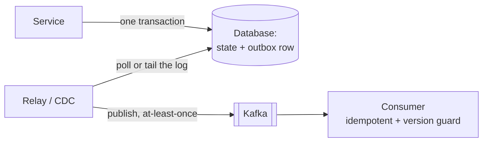
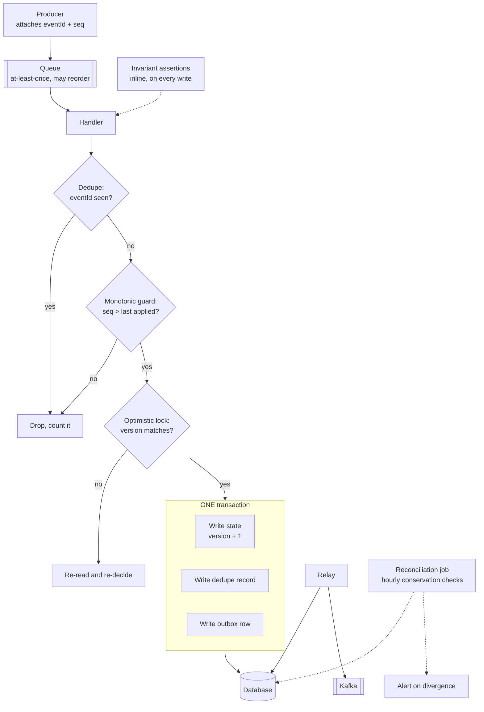
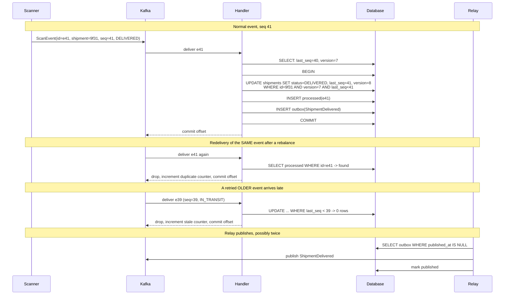

# Chapter 11: Reliability

## 11.1 Problem Statement

The quarter after Chapter 10's fixes is the best one the tracking platform has ever had. Availability comes in at 99.993 percent. Error rate averages 0.02 percent. p99 latency sits comfortably inside budget. Every dashboard is green for eleven weeks.

It is also the quarter in which the company issues 340,000 rupees in duplicate refunds, loses track of 4,000 parcels for nine days, and has a customer publicly post a screenshot showing their delivery arriving before it was dispatched.

Five incidents, and not one of them produced an error.

**Duplicate refunds.** A Kafka consumer rebalance caused some scan events to be redelivered, which is normal and expected behaviour. The handler marked parcels delivered and, for damaged items, triggered a refund. It was not idempotent. Some parcels were marked delivered twice, and some refunds fired twice. Every one of those operations returned HTTP 200.

**The 4,000 lost parcels.** The service wrote the shipment update to the database, committed, and then published an event to Kafka to notify the carrier integration. For a nine minute window during a broker issue, the publish failed after the commit succeeded. The tracking page showed the correct status. The carrier was never told. Nobody noticed for nine days, until a human at a depot asked why a pallet had not moved.

**Status regression.** Two warehouse scanners handled the same parcel within the same second. Both read the shipment, both modified their copy, both wrote it back. The second write overwrote the first, and a parcel that had been marked DELIVERED went back to IN_TRANSIT. Both writes succeeded.

**Time travel.** A retried event from 40 seconds earlier arrived after a newer one and overwrote it. The shipment's status went backwards in time, deterministically, whenever a retry crossed a newer update.

**Delivered before dispatched.** One ingestion node's clock had drifted four minutes ahead. Events were ordered by the timestamp the node assigned, so that node's events sorted ahead of everything else. The customer's screenshot was accurate.

Now hold those next to the metrics. Availability 99.993 percent. Error rate 0.02 percent. Latency inside budget. **Every single one of these incidents was a fast, successful, available response that was wrong**, and the entire monitoring stack from Chapter 10 is blind to that category by construction, because it measures whether responses happened rather than whether they were correct.

Chapter 10 asked "did the system respond". This chapter asks "was the response right", and it turns out those are almost unrelated questions.

## 11.2 Why This Problem Exists

**Correctness failures do not announce themselves.** A crashed process produces a connection error. A timeout produces a timeout. A wrong answer produces a 200 with a plausible body. Every monitoring signal you have, error rate, latency, availability, saturation, is a proxy for "did something break visibly", and silent wrongness is defined by not breaking visibly.

**Distributed systems introduce failure modes that single-process code does not have.** Chapter 1 listed the comforts you lose when you add a network: calls that neither succeed nor fail, several copies of the data, no shared clock, no way to distinguish slow from dead. Each of those maps directly to a correctness hazard. A call that timed out may have succeeded, so retrying it duplicates the work. Two writers with no coordination lose one of the writes. Two clocks disagree, so ordering by time is wrong.

**The mechanisms that improve availability actively create correctness hazards.** This is the uncomfortable part. Retries cause duplicates. Redundancy causes divergence. Queues cause reordering and redelivery. Caches cause staleness. Every technique in Chapter 10 that makes the system more likely to respond makes it more likely to respond incorrectly, unless correctness was designed in alongside.

**Partial failure is the normal case and the hardest one.** A single process either runs or crashes. A distributed operation can half-happen: the database commits and the message does not, three of five services complete their part, the write lands but the cache invalidation does not. There is no equivalent of this in the code most people learn on, so there is no instinct for it.

**And correctness bugs are rare per request and enormous in aggregate.** A hazard that fires on 0.01 percent of requests is invisible in every percentile you monitor. At 40 million events a day that is 4,000 wrong outcomes, which is exactly the number in Section 11.1. Rarity is what makes them survive testing and reach production; volume is what makes them expensive once there.

## 11.3 Real World Analogy

A pharmacy that is open 24 hours a day, every day, never has a queue, and occasionally dispenses the wrong medication.

Availability is perfect. Latency is excellent. And the failure mode is the worst kind, because **the wrong pill does not look wrong**. You do not receive an error. You receive a confident, prompt, plausible answer that happens to be incorrect, and the discovery happens later, elsewhere, by someone who was harmed.

Look at what pharmacies actually do about this, because every control maps to a technique in this chapter.

**Barcode verification at dispensing.** The label is scanned against the prescription, so a mismatch is caught by a machine rather than by attention. That is a checksum: cheap, mechanical, and it catches the errors humans reliably miss.

**A second pharmacist checks the basket.** Independent verification of the same work, on the assumption that two people make different mistakes. In software this is shadow traffic with output diffing, or dual computation of anything critical.

**The controlled-drugs register must balance.** Count in, count out, count remaining, and the numbers must agree at the end of the day. If they do not, work stops until the discrepancy is explained. This is a conservation law and a reconciliation job, and it is the single most effective technique in this chapter.

**Ambiguity means refusal.** An unreadable prescription is not dispensed with a best guess; the pharmacist phones the prescriber. That is failing closed on uncertainty, and it is a deliberate choice to trade availability for correctness in a domain where the wrong answer is worse than no answer.

**And the audit trail.** Every dispensing event is recorded, so when a problem surfaces weeks later, the sequence can be reconstructed. That is your event log, and its value is entirely retrospective, which is why it is always the first thing cut and always the thing you wish you had.

The last piece of the analogy is the important one. **A pharmacy that dispensed nothing would be obviously broken and would harm nobody.** One that dispenses the wrong thing 0.01 percent of the time looks excellent on every operational measure and is far more dangerous. Availability and reliability are not the same virtue.

## 11.4 Simple Explanation

**Reliability is the probability that the system performs its function correctly, over a period, under stated conditions.**

The distinction from Chapter 10, in a table:

| | Correct answer | Wrong answer |
|---|---|---|
| **Responded** | Working normally | **The dangerous quadrant.** Fast, available, wrong. Invisible to standard monitoring |
| **Did not respond** | Honest failure. The client knows and can retry | Also a failure, and at least it is visible |

Everything in this chapter lives in the top-right cell.

The essential point, stated plainly:

> **Availability measures whether you answered. Reliability measures whether the answer was true. A system can have five nines of availability and be systematically wrong.**

Some vocabulary that gets used loosely:

| Term | Meaning |
|---|---|
| Fault | Something deviating from spec: a disk error, a crashed process, a bug |
| Error | The internal incorrect state that a fault produces |
| Failure | The service not delivering what it should, as observed from outside |
| Silent failure | A failure with no error signal. The system reports success |
| Gray failure | A component that is degraded rather than dead, so it passes health checks and behaves badly |

The chain runs fault, then error, then failure, and reliability engineering is mostly about stopping that chain in the middle: tolerate the fault, or detect the error, so it never becomes a user-visible failure. Chapter 13 covers tolerance; this chapter is about correctness and detection.

## 11.5 Technical Deep Dive

### 11.5.1 The failure taxonomy

Not all failures are equally hard to handle, and the ordering is important because effort should follow difficulty.

| Class | What happens | Detectable? | Example |
|---|---|---|---|
| Fail-stop (crash) | Component stops entirely and visibly | Easy | Process killed, machine powered off |
| Omission | Some messages or responses are silently dropped | Moderate | Publish fails, packet lost, event never consumed |
| Timing | Correct answer, too late | Moderate | GC pause, slow query, clock skew |
| Response | Wrong value returned, confidently | Hard | Stale read, lost update, duplicate applied |
| Arbitrary (Byzantine) | Component behaves inconsistently or maliciously | Very hard | Bit flip, corrupted payload, hardware fault |

Two observations that matter.

**Detectability falls and damage rises as you go down the list.** Crash failures are the ones every framework, load balancer, and health check already handles. Response failures are the ones nothing handles by default, and they are where Section 11.1 lived.

**Gray failure is worse than crash failure.** A node that is dead is removed from rotation and traffic goes elsewhere. A node that is 90 percent broken passes health checks, accepts traffic, and returns bad or slow answers indefinitely. This is why Chapter 10's advice to keep health checks shallow needs a partner: shallow checks keep you available, and something else has to catch the instance that is answering wrongly. That something is usually per-instance error and outlier detection, or output comparison.

### 11.5.2 The five hazards

Every correctness incident in Section 11.1 is one of five recurring hazards. Learn these five and you have a checklist that catches most of them at design time.

**Hazard 1: duplicates.** Any at-least-once delivery, any retry, any redelivery after a consumer restart. The default in Kafka, SQS, HTTP retries, and job schedulers.

```java
// Wrong: retrying this charges twice.
public void handle(ScanEvent e) {
    shipments.markDelivered(e.shipmentId());
    if (e.damaged()) refunds.issue(e.shipmentId(), e.amount());   // side effect
}

// Right: the effect happens once regardless of how often the message arrives.
public void handle(ScanEvent e) {
    // Insert-if-absent on a unique key. The database decides the race.
    boolean firstTime = processed.recordIfNew(e.eventId());
    if (!firstTime) {
        metrics.counter("event.duplicate").increment();
        return;
    }
    shipments.markDelivered(e.shipmentId());
    if (e.damaged()) refunds.issue(e.shipmentId(), e.amount());
}
```

The dedupe record and the effect must be in **one transaction**, or a crash between them reintroduces the bug in the other direction: recorded as processed, never actually done. Chapter 20 covers idempotency properly.

**Hazard 2: lost updates.** Two concurrent read-modify-write cycles, and the second overwrites the first. This is Section 11.1's status regression.

```java
// Wrong: classic read-modify-write race.
Shipment s = repo.findById(id);
s.setStatus(DELIVERED);
repo.save(s);            // blindly overwrites whatever happened in between

// Right: optimistic concurrency. The write fails if the row changed.
@Entity
class Shipment {
    @Id String id;
    @Version long version;      // JPA increments and checks this
    Status status;
}
// UPDATE shipments SET status=?, version=version+1
//  WHERE id=? AND version=?      -> 0 rows updated means someone else won
```

Zero rows updated is not an error to swallow. It means your read is stale, so re-read and re-decide, or reject. Silently ignoring it recreates the bug.

**Hazard 3: partial failure across systems, also called the dual-write problem.** Two writes to two systems cannot be made atomic by hoping. This is Section 11.1's 4,000 lost parcels, and it is the most common serious correctness bug in event-driven architectures.

```java
// Wrong, and extremely common.
@Transactional
public void updateShipment(Update u) {
    repo.save(u.toShipment());        // commits
    kafka.send("shipment.updated", u); // may fail after the commit
}                                      // or: send succeeds, then commit fails
```

There is no ordering of those two lines that is safe. Publish first and the database write may fail, so you have announced something that did not happen. Publish second and the publish may fail, so something happened that nobody was told about. Section 11.5.4 gives the standard fix.

**Hazard 4: out-of-order delivery.** Retries, partitions, and parallel consumers all reorder. A stale message that arrives late must not overwrite fresher state.

```java
// Right: a monotonic guard. Old events cannot move state backwards.
// UPDATE shipments
//    SET status = ?, last_event_seq = ?
//  WHERE id = ? AND last_event_seq < ?
//
// If the event is older than what we have applied, zero rows change and
// we drop it. This makes the handler safe against reordering AND duplicates.
```

Note that this single guard handles hazards 1 and 4 together, which is why sequence numbers or versions on events are worth insisting on in the contract. Chapter 4's downward-constraint list is where that requirement belongs.

**Hazard 5: clock skew.** Wall clocks on different machines disagree, drift, and occasionally jump backwards. Ordering by `System.currentTimeMillis()` across machines is not ordering; it is a guess.

```java
// Wrong: two nodes, two clocks, one of them four minutes ahead.
event.setTimestamp(Instant.now());
// ... later: ORDER BY timestamp

// Right: order by something that is actually ordered.
//   - a per-partition sequence number from the broker (Kafka offsets)
//   - a database sequence or monotonically increasing id
//   - a logical clock (Lamport or vector) when causality matters
// Keep the wall clock timestamp for display and reporting only.
```

The rule to carry: **wall clock time is for humans. Ordering needs a counter.** Chapter 51 covers the related trap where a distributed lock's expiry depends on clocks agreeing.

### 11.5.3 The exactly-once myth

You will be asked about this in interviews and you will be told by vendors that it is solved. The precise position:

> **Exactly-once delivery is impossible. Exactly-once effect is achievable.**

Delivery cannot be exactly once because the sender can never know whether a lost acknowledgement means the message was not received or that the reply was lost. Send again and you may duplicate; do not send again and you may lose. There is no third option, and no amount of engineering removes it.

What is achievable is that **the observable effect happens once**, by combining at-least-once delivery with idempotent handling:

```
at-least-once delivery  +  idempotent processing  =  effectively-once outcome
```

Every real "exactly-once" feature is this pattern with the bookkeeping hidden. Kafka's transactional producer with a consume-transform-produce loop is exactly-once *within Kafka*, because the offset commit and the output write happen in one transaction. The moment your handler touches an external system, a database, a payment provider, an email API, that guarantee stops at the boundary, and you are responsible for idempotency again.

The practical implication: **design every consumer as if messages will arrive more than once and out of order, because they will.** Then delivery semantics stop being something you have to reason about.

### 11.5.4 The transactional outbox

The fix for hazard 3, and the pattern worth knowing by heart because it appears in every event-driven design.

The insight: you cannot atomically write to two systems, but you **can** atomically write two rows to one database. So write the event into the same database, in the same transaction, and have a separate process relay it.

```sql
-- One transaction, one database, genuinely atomic.
BEGIN;
  UPDATE shipments SET status = 'DELIVERED', version = version + 1
   WHERE id = '9f31' AND version = 7;

  INSERT INTO outbox (id, aggregate_id, type, payload, created_at)
  VALUES (gen_random_uuid(), '9f31', 'ShipmentDelivered', '{...}', now());
COMMIT;
```

```java
// A relay process reads the outbox and publishes. It may publish twice
// after a crash, which is fine, because consumers are idempotent.
@Scheduled(fixedDelay = 200)
public void relay() {
    List<OutboxRow> batch = jdbc.query(
        "SELECT * FROM outbox WHERE published_at IS NULL ORDER BY id LIMIT 500",
        outboxMapper);

    for (OutboxRow row : batch) {
        kafka.send(row.type(), row.aggregateId(), row.payload());   // may duplicate
        jdbc.update("UPDATE outbox SET published_at = now() WHERE id = ?", row.id());
    }
}
```



What this buys, precisely: the event is published **if and only if** the state change committed. Never one without the other. The cost is that publishing becomes asynchronous with a small delay, and duplicates are possible, both of which are acceptable because consumers were built for them anyway.

Two refinements worth knowing. Instead of polling the outbox table, you can tail the database's replication log with change data capture, which removes the polling delay and the write amplification. And ordering is preserved per aggregate if the relay publishes in id order and partitions by aggregate id, which is usually the ordering guarantee you actually need. Chapter 56 covers event-driven architecture and Chapter 59 covers what to do when the multi-step operation spans services and cannot use one database at all.

### 11.5.5 Detecting incorrectness

The hardest part of this chapter. Standard monitoring cannot see wrong answers, so you need mechanisms that check semantics rather than status codes.

| Technique | Catches | Cost | Notes |
|---|---|---|---|
| Invariant assertions in production | Impossible states | Low | Cheapest and most underused. Assert and alert, do not just log |
| Reconciliation with a conservation law | Divergence between systems | Medium | The single most effective control. Money in equals money out |
| Checksums and content hashes | Corruption in transit or at rest | Low | Catches the Byzantine class that nothing else does |
| Shadow traffic with output diffing | Regressions in a rewrite | High | Run old and new, compare, alert on differences |
| Semantic end-to-end probes | Whole-flow correctness | Medium | A synthetic parcel through the real pipeline every minute, checked for the right final state |
| Audit log with replay | Everything, retrospectively | Medium | Only helps if the log exists before the incident |
| Per-instance outlier detection | Gray failure on one node | Medium | One node answering differently from its peers |
| Property-based and fuzz testing | Hazards before production | Low | Finds duplicate and ordering bugs cheaply |

Two of these deserve elaboration.

**Invariants asserted in production.** Write down the things that must always be true, then check them where they can be violated. "A shipment's status never moves backwards through the lifecycle." "The sum of per-bucket counters equals the total counter." "A refund exists only if a damaged-delivery event exists." These are cheap to check and they turn a silent wrong state into an alert.

```java
// Assert an invariant where it can be violated, and alert, not just log.
if (newStatus.ordinal() < current.ordinal()) {
    metrics.counter("invariant.status_regression").increment();
    log.error("Status regression {} -> {} for {}", current, newStatus, id);
    throw new InvariantViolation("status cannot move backwards");
}
```

**Reconciliation against a conservation law.** This is double-entry bookkeeping's core idea, five centuries old and still the best correctness control available. Find a quantity that must balance and check it on a schedule:

- Every shipment marked delivered has exactly one delivery event.
- Every refund has a matching damaged-delivery event, and the amounts agree.
- The count of events published equals the count of outbox rows marked published.
- Total inventory equals opening balance plus receipts minus dispatches.

A daily job that checks these would have found Section 11.1's 4,000 lost parcels in under 24 hours instead of nine days, and the duplicate refunds on the first run. Reconciliation does not prevent bugs; it bounds how long they stay invisible, which is usually the difference between an annoyance and an incident.

### 11.5.6 Testing for correctness

Ordinary tests exercise the happy path and a few obvious errors. Correctness hazards live in interleavings and partial failures that a hand-written test will not think of.

| Technique | What it does | When to use |
|---|---|---|
| Property-based testing | Generates many inputs and checks that a stated property holds | Any pure logic, and any handler that should be idempotent |
| Fault injection at boundaries | Makes dependencies fail, hang, duplicate, and reorder | Every consumer and every remote call |
| Deterministic simulation | Runs the whole system on a simulated clock and network, with reproducible seeds | High-value systems where the investment pays back |
| Linearizability checking | Records operations and checks whether any valid sequential ordering explains them | Databases and anything claiming a consistency guarantee |
| Chaos experiments | Injects real faults into a real environment | Validating that tolerance works in production |

The property-based test that would have caught hazard 1, in a few lines:

```java
// Property: applying the same event any number of times, in any order,
// leaves the same final state as applying each distinct event once.
@Property
void handlerIsIdempotentAndOrderInsensitive(@ForAll List<ScanEvent> events) {
    Store a = fresh(); events.forEach(a::handle);

    List<ScanEvent> shuffledWithDuplicates = new ArrayList<>(events);
    shuffledWithDuplicates.addAll(events);            // duplicate everything
    Collections.shuffle(shuffledWithDuplicates);      // and reorder it
    Store b = fresh(); shuffledWithDuplicates.forEach(b::handle);

    assertThat(b.snapshot()).isEqualTo(a.snapshot());
}
```

That test is worth more than any amount of monitoring, because it fails on a laptop in milliseconds rather than in production nine days later.

## 11.6 Architecture Diagram

The write path with every correctness control marked. This is the diagram to draw when someone asks how you prevent duplicate or lost updates.



ASCII version:

```
 Producer (eventId + sequence number)
      |
   Queue (at-least-once, may duplicate, may reorder)
      |
   Handler
      |-- dedupe guard:    seen this eventId?        -> drop
      |-- monotonic guard: seq <= last applied?      -> drop
      |-- optimistic lock: version mismatch?         -> re-read, re-decide
      |
   [ ONE TRANSACTION ]
      write state (version+1) + dedupe record + outbox row
      |
   Database  <---- Relay polls outbox ----> Kafka (may publish twice; consumers are idempotent)
      ^
      |
   Reconciliation job (hourly): conservation laws, alert on divergence
   Invariant assertions: inline on every write, alert on impossible states
```

Four things to read off it.

**Three guards, three different hazards.** Dedupe handles redelivery, the monotonic guard handles reordering, and the optimistic lock handles concurrent writers. They are not interchangeable, and a system with only one of them is protected against only one hazard.

**The transaction boundary is the whole point.** State, dedupe record, and outbox row all commit together or none do. Every correctness bug in Section 11.1 was some version of two things that should have been one transaction.

**The relay is deliberately allowed to duplicate.** That is not sloppiness; it is the trade that makes the outbox simple. Duplicates are safe because consumers apply the same three guards.

**Reconciliation sits outside the request path entirely.** It cannot prevent anything. It bounds detection time, and detection time is what turned a nine minute publish failure into a nine day incident.

## 11.7 Request Flow

Follow a duplicated and reordered event through the guards, which is the flow that matters here.



Step by step, with what each guard prevented:

1. **The producer attaches an event id and a sequence number.** Neither is optional. Without the id there is no dedupe; without the sequence there is no ordering guard. This is a contract requirement, which makes it HLD by Chapter 4's test.
2. **The handler reads current state**, including `last_seq` and `version`.
3. **The update is conditional on both.** `version = 7` rejects a concurrent writer. `last_seq < 41` rejects a stale event. Zero rows updated means one of those fired, and the handler must react rather than assume success.
4. **State, dedupe record, and outbox row commit together.** This is the line that would have prevented the 4,000 lost parcels.
5. **Redelivery is dropped by the dedupe check** and counted, so duplicate rate becomes a visible metric rather than an invisible behaviour.
6. **The late event is dropped by the monotonic guard.** Note that it was dropped by the `WHERE` clause, in the database, not by application logic comparing values it read earlier, which would itself be racy.
7. **The relay publishes independently** and may publish twice. Downstream consumers apply the same guards, so this is safe.

The habit worth building: for every consumer you write, name which of the five hazards apply and which guard handles each. If any hazard has no guard, that is a bug you have not seen yet.

## 11.8 Internal Components

| Component | Correctness role | Failure mode if absent |
|---|---|---|
| Event id | Enables deduplication | Duplicate side effects on every redelivery |
| Sequence number or version on events | Enables ordering guards | Stale events overwrite fresh state |
| Dedupe store | Records what has been processed | Duplicates applied. Must expire, and the window must exceed the maximum redelivery delay |
| Row version column | Optimistic concurrency | Lost updates under concurrent writers |
| Transaction boundary | Makes multi-row changes atomic | Partial state, the root of most correctness bugs |
| Outbox table | Ties publishing to committing | Dual-write divergence between database and broker |
| Relay or change data capture | Publishes committed events | Events never leave the database |
| Monotonic guard in the WHERE clause | Rejects stale writes atomically | Application-level checks that are themselves racy |
| Invariant assertions | Convert impossible state into an alert | Silent corruption that spreads |
| Reconciliation job | Bounds detection time | Bugs invisible for days or weeks |
| Checksums | Detect corruption | Byzantine faults propagate as valid-looking data |
| Audit log | Enables reconstruction after the fact | No way to determine blast radius or repair |

Two rows are worth extra care in practice. **The dedupe store must expire, and its retention must exceed your maximum possible redelivery delay**, or a message stuck in a dead letter queue for two days will be reprocessed when replayed. And **the outbox needs a cleanup job**, or it becomes the largest table in your database within a year, which is Chapter 9's O(total data) problem arriving through a side door.

## 11.9 Production Example

**FoundationDB's deterministic simulation.** Their team built the database and, alongside it, a simulation framework that runs the entire distributed system inside a single process on a simulated clock and a simulated network, with all sources of nondeterminism controlled by a seed. That lets them inject machine failures, network partitions, disk corruption, clock jumps, and message reordering at rates far beyond real life, run the equivalent of years of operation, and, crucially, **reproduce any failure exactly by replaying the seed**.

The lesson generalises well past databases. The reason correctness bugs are hard is not that they are subtle; it is that they depend on interleavings you cannot reproduce. Anything that makes a failing interleaving reproducible converts an impossible debugging problem into an ordinary one. Most teams cannot justify building a full simulator, and most teams can control their clock behind an interface, seed their randomness, and make their tests replayable, which captures a useful fraction of the benefit.

**Jepsen.** Kyle Kingsbury's testing work subjects distributed databases and queues to network partitions and other faults while recording every operation, then checks whether the observed history is explainable by the consistency model the system claims. The findings over the years have been consistent and sobering: many systems have not provided the guarantees stated in their documentation, and the gaps only appear under partition, which is precisely when nobody is looking.

Two things to take from it. **Read the analyses for any datastore you depend on**, because your application's correctness rests on guarantees you are unlikely to test yourself. And note the method: record the history, then check it against a model. That is available to you at application level too, and it is what shadow-traffic diffing and invariant checking are, informally.

**Formal methods at AWS.** Amazon engineers have published their experience using TLA+ to specify and check core parts of systems such as S3 and DynamoDB. Their reported finding is the interesting part: the method found subtle bugs that would have required very rare interleavings to trigger, in designs that had already passed review by experienced engineers, and it found them in the design rather than in the code.

That says something useful about where correctness bugs come from. They are frequently not implementation slips; they are designs that are wrong in a case nobody enumerated. Writing down the invariants precisely, which is the cheap end of the same practice, catches a meaningful share of them without any tooling at all.

## 11.10 Advantages

- **Trust, which is the actual product.** A tracking page that is occasionally wrong is worse than useless, because users cannot tell which readings to believe.
- **Bugs stop compounding.** Wrong data written today becomes wrong reports, wrong decisions, and wrong downstream state for months. Correctness controls stop the propagation.
- **Detection time collapses.** Reconciliation and invariants turn a nine day discovery into a one hour alert, which usually turns a crisis into a ticket.
- **Retries and redundancy become safe to use.** Once handlers are idempotent and order-insensitive, every availability technique in Chapter 10 can be applied without creating a correctness hazard.
- **Incidents become repairable.** With an audit log and event ids you can determine exactly which records were affected and fix precisely those.
- **Design conversations get sharper.** "Which of the five hazards applies here and what guards it" is a question with a definite answer.
- **Testing gets cheaper.** A property-based idempotency test costs ten lines and replaces a category of production incident.

## 11.11 Limitations

- **You cannot check everything.** Full verification of a large system is not practical, so you choose invariants and reconciliations by value.
- **Guards cost latency and complexity.** A dedupe lookup, a version check, and an outbox write are extra work on every request.
- **Reconciliation detects, it does not prevent.** It bounds how long you are wrong, which is valuable and is not the same as being right.
- **Repair is often harder than detection.** Knowing that 4,000 parcels diverged is the easy part; deciding what the correct state is and applying it safely is a project.
- **Exactly-once is not available.** You are choosing between duplicates and loss at every boundary, and idempotency is how you make that choice survivable rather than a way to avoid it.
- **Byzantine faults are expensive to defend against.** Checksums catch the common cases; true Byzantine tolerance requires protocols most systems will never justify.
- **Correctness can conflict with availability.** Failing closed on uncertainty is often right and it is downtime, which is why Chapter 6 insists on a ranking.

## 11.12 Trade-offs

| Dial | One way | The other way |
|---|---|---|
| Duplicates vs loss | At-least-once: never lose, may duplicate, needs idempotency | At-most-once: never duplicate, may lose, needs reconciliation |
| Concurrency control | Optimistic: fast, retries under contention | Pessimistic locking: no retries, less concurrency, deadlock risk |
| Publishing | Outbox: correct, adds latency and a table to maintain | Direct publish: simple and fast, silently diverges |
| Uncertainty handling | Fail closed: correct, less available | Fail open: available, may act on wrong data |
| Validation depth | Strict invariants everywhere: catches more, costs latency and false alarms | Light: fast, more silent wrongness |
| Reconciliation frequency | Hourly: fast detection, more load | Daily: cheap, longer exposure window |
| Audit retention | Long: full reconstruction, storage cost and privacy obligations | Short: cheap, blind past the window |

The removal test.

**Remove the dedupe store.** You gain one database round trip per event and a table that needs expiry management. You lose protection against every redelivery, which in a Kafka system happens on every rebalance, every restart, and every retry. This is the guard people most often skip and it is the one that fires most often.

**Remove the outbox and publish directly after commit.** You gain simplicity and a few milliseconds. You lose the guarantee that state changes and events agree, and you will diverge during the next broker incident. The divergence is silent, which is what makes it expensive.

**Remove the reconciliation job.** You gain a scheduled job's worth of load and maintenance. You lose your only mechanism for detecting the bugs your guards did not anticipate, and your detection time becomes however long it takes a customer to complain.

**Remove optimistic locking.** You gain simpler code and no retry handling. You lose correctness under concurrent writers, which is fine for single-writer data and catastrophic for anything two actors can touch at once, such as a shipment two scanners can both handle.

## 11.13 Common Mistakes

**Assuming a delivered message is delivered once.** At-least-once is the default nearly everywhere, and duplicates are normal operation, not an incident.

**Believing "exactly-once" marketing.** Exactly-once effects are achievable inside one system's boundary. Across a boundary, you are responsible for idempotency.

**Two writes, two systems, no outbox.** The most common serious correctness bug in event-driven code, and it looks completely fine in review.

**Read-modify-write without a version check.** Works perfectly until two actors touch the same entity in the same second, which at scale is constantly.

**Ordering by wall clock across machines.** Clocks disagree, drift, and step backwards. Order by sequence numbers or offsets.

**Checking a guard in application code instead of in the WHERE clause.** Reading the version, comparing it in Java, then writing is itself a race. The check and the write must be one atomic operation.

**Swallowing "zero rows updated".** That is the guard firing. Treat it as a signal, not as success.

**Dedupe records that expire before redelivery can happen.** A message replayed from a dead letter queue two days later must still be recognised.

**No invariants, so impossible states are allowed to persist** and spread into reports, caches, and downstream systems.

**No reconciliation, so detection time is unbounded.** Nine minutes of failure became nine days of impact for exactly this reason.

**Testing only the happy path.** Correctness hazards live in duplicates, reordering, and partial failure, none of which appear in a normal test suite unless you write them.

**No audit trail, so blast radius cannot be determined.** After an incident, "which records were affected" is the first question, and without an event log the answer is "we do not know".

## 11.14 Interview Questions

**Q: What is the difference between availability and reliability?**
Availability is whether the system responded; reliability is whether the response was correct. A system can be highly available and systematically wrong, and standard monitoring, which watches error rates and latency, cannot see the second case at all.

**Q: Your consumer processes payments and the queue is at-least-once. What must you do?**
Make the handler idempotent: attach a stable event id, record processed ids in a store, and write the dedupe record in the same transaction as the effect. Add a monotonic guard so stale events cannot be applied, and reconcile payments against source events on a schedule.

**Q: Is exactly-once delivery possible?**
No. The sender cannot distinguish a lost message from a lost acknowledgement, so it must either risk duplicating or risk losing. What is achievable is an exactly-once effect, by combining at-least-once delivery with idempotent processing.

**Q: Explain the dual-write problem and the standard fix.**
Writing to a database and publishing an event are two separate operations that cannot be made atomic, so a failure between them leaves the two systems disagreeing in one direction or the other. The fix is the transactional outbox: write the event into the same database in the same transaction, then have a relay or change data capture publish it, accepting occasional duplicates because consumers are idempotent.

**Q: Two users update the same record concurrently. How do you prevent a lost update?**
Optimistic concurrency: keep a version column and make the update conditional on the version you read, incrementing it on write. Zero rows updated means someone else won, so re-read and re-decide. Pessimistic locking is the alternative when contention is high and retries are expensive.

**Q: Why should you not order events by timestamp?**
Because clocks on different machines disagree, drift, and can move backwards, so timestamps do not define a real order. Use per-partition offsets, database sequences, or logical clocks for ordering, and keep wall clock time for display only.

**Q: How do you detect a correctness bug that produces no errors?**
Invariant assertions where violations can occur, reconciliation jobs that check conservation laws between systems, checksums for corruption, semantic end-to-end probes that verify the final state of a synthetic transaction, and output diffing against a reference implementation during migrations.

**Q: What is gray failure and why is it worse than a crash?**
A component that is degraded rather than dead, so it passes health checks, keeps receiving traffic, and returns slow or wrong answers indefinitely. A crashed node is removed automatically; a limping node is not, so it must be caught by per-instance outlier detection or output comparison.

**Q: Your outbox relay published the same event twice. Is that a bug?**
No, it is the expected behaviour of the pattern and the reason consumers must be idempotent. Making the relay exactly-once would require the same impossible guarantee, so the design deliberately accepts duplicates and handles them downstream.

**Q: What single control gives the best correctness return for the effort?**
A reconciliation job checking a conservation law between two systems. It does not prevent bugs, and it bounds how long any bug stays invisible, which is usually the difference between a ticket and an incident.

## 11.15 Production Best Practices

1. **Put a stable event id and a sequence number on every event,** and treat both as part of the contract.
2. **Make every consumer idempotent,** with the dedupe record written in the same transaction as the effect.
3. **Guard every state transition in the WHERE clause,** using version and sequence conditions, so the check and the write are atomic.
4. **Treat zero rows updated as a signal,** never as success.
5. **Use the transactional outbox** wherever a state change must produce an event.
6. **Never order across machines by wall clock.** Use offsets, sequences, or logical clocks.
7. **Write invariants down and assert them in production,** with alerts rather than logs.
8. **Run reconciliation jobs on a conservation law,** hourly for high-value flows, and alert on any divergence.
9. **Keep an audit log** sufficient to reconstruct what happened and determine blast radius.
10. **Expire dedupe records on a window longer than your maximum redelivery delay,** and prune the outbox.
11. **Write property-based tests for idempotency and order insensitivity** on every handler.
12. **Inject faults at boundaries in testing:** duplicates, reordering, partial failure, and timeouts that later succeed.
13. **Decide fail open or fail closed per operation,** and fail closed for anything financial or irreversible.
14. **Read the Jepsen analysis for any datastore you rely on,** and design to the guarantees it actually provides.

## 11.16 Summary

Reliability is whether the answer was correct. Availability is whether there was an answer. They are different properties, they need different mechanisms, and a system can score five nines on the second while being routinely wrong on the first, because every signal in a standard monitoring stack measures whether something visibly broke and silent wrongness is defined by not breaking visibly.

The hazards are few enough to memorise. Duplicates, from at-least-once delivery and retries. Lost updates, from concurrent read-modify-write. Partial failure across systems, of which the dual write to a database and a broker is the common case. Out-of-order delivery, from retries and parallelism. And clock skew, which makes wall-clock ordering a guess rather than an order. Every correctness incident you will see is one of these five wearing local clothing.

The guards are equally few. A dedupe record keyed on a stable event id handles duplicates. A monotonic condition in the WHERE clause handles reordering. A version column handles concurrent writers. A transactional outbox handles the dual write. Sequence numbers and offsets replace clocks for ordering. The pattern they share is that the check and the write happen atomically, in one transaction, in the database, rather than being compared in application code where the comparison is itself a race.

What remains after the guards is everything nobody anticipated, and for that the answer is detection rather than prevention. Assert invariants where they can be violated, and reconcile against conservation laws on a schedule. Neither makes the system correct. Both bound how long it can be wrong without anyone knowing, and that bound is usually the difference between an alert on Tuesday morning and a customer discovering the problem nine days later.

Finally, note the uncomfortable relationship with the previous chapter. Retries, redundancy, queues, and caches all improve availability and all create correctness hazards. You do not get to choose one; you have to build both, and the order matters, because idempotent, order-insensitive handlers are what make Chapter 10's techniques safe to use at all.

## 11.17 Quick Revision Notes

- Availability: did it respond. Reliability: was the response correct. The dangerous quadrant is fast, available, and wrong.
- Standard monitoring cannot see correctness failures. Error rate and latency stay green.
- Failure taxonomy: fail-stop, omission, timing, response (wrong value), arbitrary. Detectability falls and damage rises down the list.
- Gray failure, a degraded node that still passes health checks, is worse than a dead one.
- Five hazards: duplicates, lost updates, partial failure across systems, out-of-order delivery, clock skew.
- Exactly-once delivery is impossible. Exactly-once effect = at-least-once delivery plus idempotent processing.
- Dedupe: stable event id, processed-ids store, written in the same transaction as the effect.
- Ordering guard: `WHERE last_seq < :seq`. Handles both stale events and duplicates atomically.
- Lost updates: version column, `WHERE version = :expected`, and treat zero rows updated as a signal.
- Dual write: never write to database and broker separately. Use the transactional outbox, and let the relay duplicate.
- Never order across machines by wall clock. Use offsets, sequences, or logical clocks.
- Put the guard in the WHERE clause, not in application code after a read. Read-then-compare-then-write is a race.
- Detection techniques: invariant assertions in production, reconciliation on conservation laws, checksums, shadow diffing, semantic probes, audit logs, per-instance outlier detection.
- Reconciliation does not prevent bugs; it bounds detection time, which is usually what determines cost.
- Test with property-based idempotency and reordering tests, and fault injection at every boundary.
- Dedupe retention must exceed maximum redelivery delay. Prune the outbox or it becomes your largest table.
- Fail closed on uncertainty for anything financial or irreversible.

## 11.18 Mini Quiz

1. Availability is 99.99 percent and error rate is 0.01 percent. What class of problem can these two numbers not detect?
2. Name the five distributed correctness hazards and one guard for each.
3. Why is exactly-once delivery impossible, and what do you build instead?
4. Your service commits to Postgres then publishes to Kafka. Describe both ways this can go wrong and the standard fix.
5. Why must the dedupe record be written in the same transaction as the side effect?
6. Your update runs `UPDATE ... WHERE id = ? AND version = ?` and returns zero rows. What happened and what should the code do?
7. Two nodes assign timestamps to events and one clock is three minutes fast. What breaks, and what should be used instead?
8. Give a conservation law you could reconcile on for an order system, and say what a mismatch would indicate.
9. What is gray failure, and why do shallow health checks make it more likely to persist?
10. Your outbox relay crashes after publishing but before marking the row published. What happens on restart, and why is that acceptable?

**Answers**

1. Silent correctness failures: duplicated effects, lost updates, stale overwrites, divergence between systems. All of these return successful responses quickly, so they appear in neither metric. Detecting them requires invariants, reconciliation, or semantic probes.
2. Duplicates, guarded by a dedupe store on a stable event id. Lost updates, guarded by a version column with a conditional update. Partial failure across systems, guarded by the transactional outbox. Out-of-order delivery, guarded by a monotonic sequence condition in the WHERE clause. Clock skew, guarded by using offsets or sequences instead of wall clock time for ordering.
3. Because the sender cannot distinguish between a message that was never received and a reply that was lost, so it must either resend, risking a duplicate, or not resend, risking loss. Instead you build at-least-once delivery plus idempotent processing, which produces an effect that happens exactly once even though delivery does not.
4. If the publish fails after the commit, the state changed and nobody was told, so downstream systems silently diverge. If you publish first and the commit fails, you have announced something that did not happen. The fix is to write the event as a row in the same database transaction as the state change, then have a separate relay or change data capture process publish it, accepting duplicate publishes because consumers are idempotent.
5. Because otherwise a crash between the two leaves an inconsistent state in one direction or the other: the effect applied but not recorded, so a redelivery repeats it, or recorded but not applied, so the work is silently skipped forever. One transaction removes the window.
6. Either another writer updated the row since you read it, so your version is stale, or, if the statement also contains a sequence condition, the event you are applying is older than what has already been applied. The code must not treat it as success. Re-read and re-decide for the concurrency case, and drop with a counter for the stale-event case, distinguishing the two by which condition failed.
7. Any ordering, comparison, or windowing based on those timestamps is wrong, so events from the fast node sort ahead of newer events from others, producing effects like a delivery appearing before its dispatch. Time-based expiry and TTL logic also misbehave. Use per-partition offsets, a database sequence, or a logical clock for ordering, and keep the wall clock timestamp for display only.
8. Examples: every shipped order has exactly one payment capture and the amounts agree; the sum of line item totals plus tax and shipping equals the order total; the count of outbox rows marked published equals the count of events observed downstream; inventory on hand equals opening balance plus receipts minus dispatches. A mismatch indicates a lost, duplicated, or partially applied operation, and the size of the mismatch bounds the blast radius.
9. A component that is degraded rather than dead: slow, erroring intermittently, or returning wrong answers, while still responding to basic checks. Shallow health checks, which are correct for avoiding correlated fleet removal, will not detect it because they deliberately test only that the process is alive and locally healthy. It therefore needs a different mechanism, such as per-instance error and latency outlier detection or comparing one instance's outputs against its peers.
10. On restart the relay sees the row still unpublished and publishes it again, so the event is delivered twice. That is acceptable because every consumer applies a dedupe guard on the event id and a monotonic sequence guard, so a second delivery has no effect. The pattern deliberately chooses possible duplication over possible loss, since duplication is recoverable and loss is not.

## 11.19 Hands-on Exercise

**Part 1: build the bug.** Write a consumer that reads scan events from a queue, updates a shipment row with read-modify-write, and issues a refund when the event marks damage. No dedupe, no version, no outbox: publish to a second topic after the commit. Confirm it works on the happy path.

**Part 2: break it four ways.** Write a harness that feeds the consumer (a) every event twice, (b) events shuffled so some arrive late, (c) two events for the same shipment concurrently from two threads, (d) a run where the publish throws after the commit succeeds. Record for each: how many duplicate refunds were issued, how many status regressions occurred, and how many state changes were never published. Every count should be non-zero, and none of them should have produced an error in your logs.

**Part 3: add the guards one at a time.** In order, re-running the harness after each: a dedupe store written in the same transaction, a monotonic sequence condition in the WHERE clause, a version column with optimistic concurrency, and a transactional outbox with a relay. After each step, note which of the four failures disappeared. The mapping between guard and hazard is the lesson.

**Part 4: write the reconciliation.** Write a job that checks two conservation laws: every refund has exactly one matching damaged-delivery event with a matching amount, and every committed state change has a corresponding published event. Run it against the corrupted data from Part 2 and confirm it finds every discrepancy. Then measure how long it takes on 1 million rows, and decide how often it can run.

**Part 5: prove it with a property test.** Write the property-based test from Section 11.5.6: applying any list of events, duplicated and shuffled, must produce the same final state as applying each distinct event once in order. Run it with a few thousand generated cases. If it fails, you have found a hazard you missed, which is the point.

## 11.20 Further Reading

- *Designing Data-Intensive Applications*, Martin Kleppmann, chapters 8, 9, and 11. The best available treatment of partial failure, unreliable clocks, and what delivery guarantees really mean.
- *Jepsen* analyses, jepsen.io. Read the report for any database or queue you depend on. Also read one at random, for the method.
- *Simulation testing* material from the FoundationDB team, including their talks on deterministic simulation. The clearest argument for making failures reproducible.
- *How Amazon Web Services Uses Formal Methods*, Newcombe et al., CACM 2015. Honest and practical account of specifying designs precisely and what it catches.
- *Life Beyond Distributed Transactions*, Pat Helland. Foundational on why cross-system atomicity is unavailable and what to do instead, and the intellectual ancestor of the outbox and saga patterns.
- *Transactional Outbox* and *Saga* pattern write-ups in Chris Richardson's microservices patterns catalogue, for concrete implementation guidance.
- *Property-Based Testing with jqwik* or the equivalent for your language, for the cheapest correctness testing available.

---

**Next chapter: Chapter 12, Durability.** What it means for data to be safely stored, why an acknowledged write can still be lost, the difference between replication and backup, and how recovery point and recovery time objectives translate into concrete write-path design.
