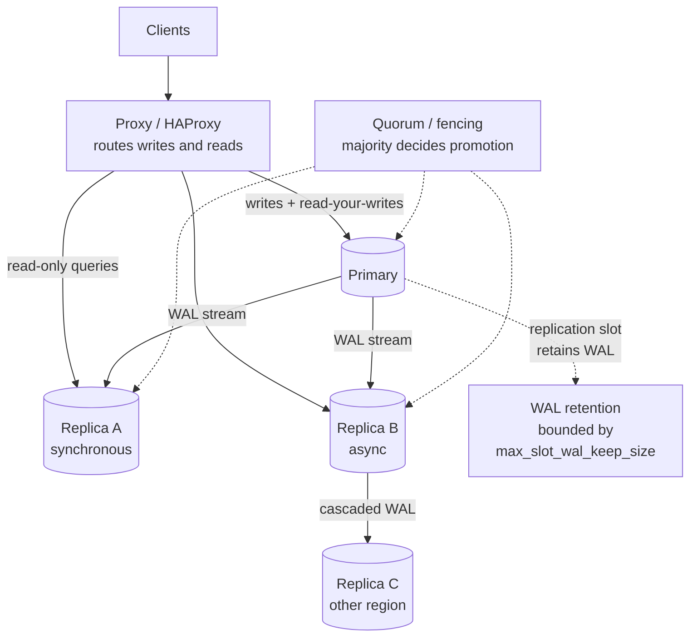
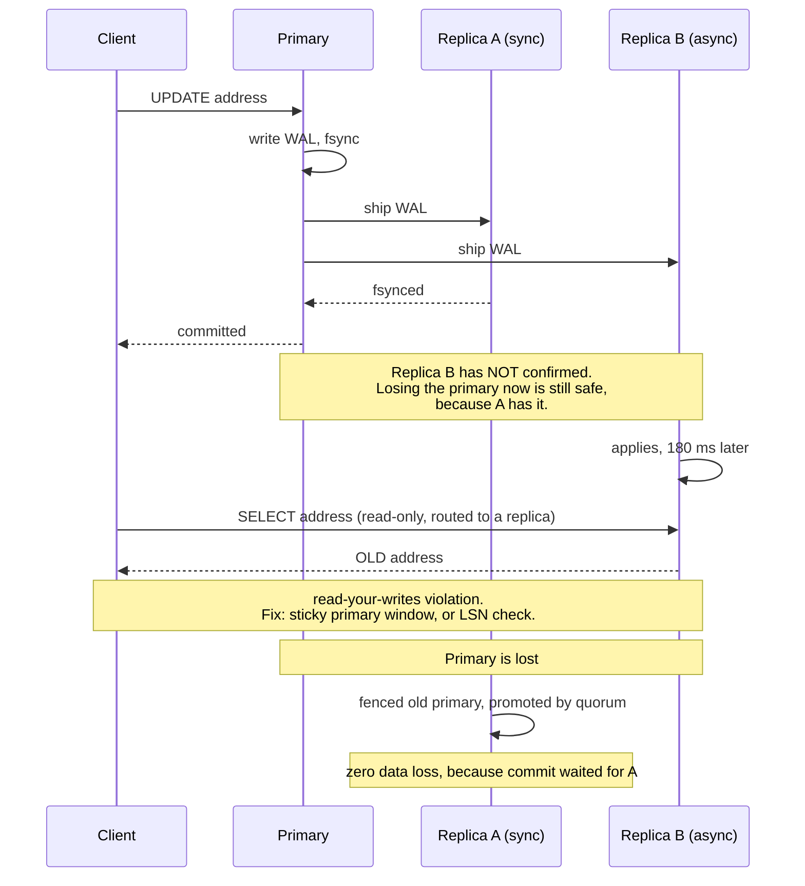

# Chapter 41: Replication

## 41.1 Problem Statement

The tracking platform runs one PostgreSQL primary. It has been fine. Then four things happen in six weeks.

**A disk controller fails at 03:40 and the platform is down for four hours.** The last backup was six hours old. Two thousand shipment status updates simply do not exist any more, and the only record that they ever happened is in the carriers' systems.

**A replica is added, and a customer immediately reports a bug:** they update their delivery address, the page reloads, and the old address is shown. The write went to the primary, the read went to the replica, and the replica was 200 milliseconds behind. The application is correct. The architecture is not.

**The replica falls 40 minutes behind during a bulk import.** Every read served from it is 40 minutes stale, and nothing alerted, because the dashboard tracked replica uptime rather than replica lag.

**A failover is performed during a network blip, and both nodes accept writes for 90 seconds.** The old primary was not dead, only unreachable. Reconciling the divergence takes a day and some of it is not reconcilable, because two different customers were assigned the same slot on two different primaries.

Four incidents, and they split cleanly. The first is what happens without replication. The other three are what happens with it. **Replication does not remove failure modes, it exchanges one set for another,** and the trade is almost always worth it as long as you know which set you have bought.

## 41.2 Why This Problem Exists

**One copy of data is one hardware failure away from gone.** That is the original motivation and it never stops being true.

**Copies cannot be updated instantaneously,** because they are on different machines connected by a network. There is always a window in which they disagree, and every question in this chapter is about how large that window is and who is allowed to see inside it.

**The choice between waiting and not waiting is the whole design.** Wait for the copies and writes are slow and fail when a copy is down. Do not wait and writes are fast, but acknowledged data can be lost and readers can see the past.

**Reading from a copy exposes the window to users,** which is why Section 41.1's second incident is a design problem rather than a bug.

**And failure detection over a network is fundamentally ambiguous.** You cannot distinguish a dead node from a slow one or an unreachable one, which is why automatic failover can produce two primaries. Chapter 14's partition case, made concrete.

## 41.3 Real World Analogy

A branch office keeping a copy of head office's ledger.

**Why copy at all?** If head office burns down, the business continues. That is durability. And the branch can answer customer questions without phoning head office, which is read scaling.

**How does the copy stay current?** Head office sends every change as it happens. Not the new totals, the individual transactions, in order. Replaying them in order reproduces the ledger exactly, which is why replication ships a log rather than a snapshot.

**Does head office wait for the branch to confirm?** If yes, every transaction is as slow as the postal service, and if the branch is unreachable, head office stops trading. If no, head office is fast, and a fire destroys whatever was still in transit.

**Customers at the branch see slightly old information.** Usually invisible. Occasionally not: a customer who phones head office to change their address and then walks into the branch sees the old one, and is entirely right to complain.

**And the dangerous case is the phone line going down.** The branch cannot tell whether head office has burned down or the line is cut. If it assumes the former and starts acting as head office, and it was wrong, there are now two ledgers diverging, and merging them afterward is not always possible.

## 41.4 Simple Explanation

**Replication is keeping the same data on more than one machine, and the entire subject is about what the copies guarantee about each other.**

Four reasons to do it, and they pull in different directions:

| Reason | What it needs |
|---|---|
| **Durability** | A copy that survives the loss of the original |
| **Availability** | A copy that can take over quickly |
| **Read scaling** | Copies that can serve reads |
| **Locality** | Copies near users, to cut latency |

**How it works, in one picture:**

```
Every change is written to a LOG, in order.
The log is shipped to the copies. The copies replay it.

primary:  [w1][w2][w3][w4][w5]           <- the write-ahead log
                          \__ shipped __
                                          \
replica:  [w1][w2][w3]                     <- replaying, currently 2 behind
                     ^
                     replication lag: the gap, in time or bytes
```

**The single decision that defines everything:**

```
SYNCHRONOUS:   the primary waits for the replica before saying "committed"
   -> no data loss on failover
   -> every write pays the network round trip
   -> a slow or dead replica stalls or blocks writes

ASYNCHRONOUS:  the primary says "committed" immediately, ships after
   -> fast writes, replica problems do not affect the primary
   -> a failover loses whatever had not shipped
   -> readers on the replica see the past
```

Almost every real system runs asynchronous replication, and almost every incident in Section 41.1 follows from that choice. The middle ground, and the one most production systems should use, is **semi-synchronous**: wait for one replica out of several, so you tolerate one node's failure without paying the slowest node's latency.

The three topologies, covered in their own chapters:

| Topology | Who accepts writes | Chapter |
|---|---|---|
| **Leader-follower** | One node | 44 |
| **Multi-leader** | Several nodes | 45 |
| **Leaderless** | Any node, quorum-based | 46 |

## 41.5 Technical Deep Dive

### 41.5.1 What gets shipped

Four approaches, with different consequences.

| Method | What is sent | Problem |
|---|---|---|
| **Statement-based** | The SQL text | Non-deterministic functions diverge: `now()`, `random()`, auto-increment |
| **Write-ahead log (physical)** | Byte-level page changes | Replica must be identical version and layout. No cross-version replication |
| **Logical (row-based)** | Row changes, before and after | Version-independent, selectively filterable, more data on the wire |
| **Trigger-based** | Application-level capture | Flexible, slow, and error-prone |

**Statement-based is a historical mistake worth knowing about.** MySQL's default until 5.7 was statement-based, and `UPDATE shipments SET updated_at = now()` produces different values on primary and replica. Silent divergence, discovered much later. Row-based is now the default for exactly this reason.

**Physical replication is what PostgreSQL streaming replication does.** It ships WAL records, which are byte-level descriptions of page modifications. Extremely efficient and exactly faithful, at the cost of the replica being a byte-identical copy: same major version, same architecture, no selective replication, no writing to the replica.

**Logical replication ships row changes** with the table and column identified. It permits replicating a subset of tables, replicating between major versions (which is how zero-downtime upgrades work), and having the replica carry additional indexes or tables of its own. It is also how Chapter 34's CDC invalidation pipeline is fed.

```sql
-- PostgreSQL logical replication. The publication defines what ships.
CREATE PUBLICATION shipment_events FOR TABLE shipments, events;

-- On the subscriber, possibly a different major version:
CREATE SUBSCRIPTION sub_shipments
  CONNECTION 'host=primary dbname=tracking'
  PUBLICATION shipment_events;
```

### 41.5.2 Synchronous, asynchronous, and the middle

The commit sequence makes the trade concrete.

```
ASYNCHRONOUS
  1. primary writes WAL, fsyncs
  2. primary returns "committed" to the client        <-- client is told here
  3. WAL is shipped to the replica, eventually
  4. replica applies it

  Failure between 2 and 4: the client believes a write happened
  that no surviving node has. Chapter 12's acknowledgement gap.

SYNCHRONOUS
  1. primary writes WAL, fsyncs
  2. primary ships WAL to the replica
  3. replica confirms (at some defined level)
  4. primary returns "committed"                      <-- client is told here

  No loss on failover. Every write pays one network round trip.
  If the replica is unreachable, writes BLOCK.
```

PostgreSQL exposes what "confirms" means, and the levels matter:

| `synchronous_commit` | Replica has | Survives |
|---|---|---|
| `off` | Nothing, not even local fsync | Nothing. Fast and unsafe |
| `local` | Local fsync only | Primary crash, not primary loss |
| `remote_write` | Received into the OS buffer | Replica process crash, not replica OS crash |
| `on` | fsynced to replica disk | **Loss of the primary** |
| `remote_apply` | Applied and visible to readers | Loss of the primary, and read-your-writes on the replica |

**`remote_apply` is the one that solves Section 41.1's second incident,** and it costs the most, because the primary now waits for the replica to apply as well as store.

**Semi-synchronous is the practical answer:**

```
synchronous_standby_names = 'ANY 1 (replica_a, replica_b, replica_c)'

Wait for ANY ONE of three. Tolerates two failures without
blocking writes, and pays only the fastest replica's latency.
```

The failure mode to guard against: with `FIRST 1 (replica_a)` and only one candidate, a dead replica blocks all writes. **A synchronous configuration with one replica converts a replica outage into a total outage,** which is Chapter 14's consistency choice made accidentally.

### 41.5.3 Replication lag, and the four ways it hurts

Lag is the time between a write committing on the primary and being visible on a replica. Under normal load it is single-digit milliseconds. Under stress it is minutes, and stress is exactly when it matters.

**Why lag grows:**

| Cause | Mechanism |
|---|---|
| Write burst | The replica cannot apply faster than the primary generates |
| Single-threaded apply | PostgreSQL's replay is largely serial; a parallel-writing primary outpaces it |
| Long query on the replica | Replay conflicts with a running query and pauses |
| Network saturation | WAL shipping is throughput-bound |
| Replica hardware weaker | Common and self-inflicted |

**The four consequences, which are genuinely different problems:**

**1. Read-your-own-writes violation.** A user writes, then reads and does not see it. Section 41.1's second incident.

```java
// Route the read to the primary when the user has just written.
// Simple, effective, and the version most systems should start with.
public Address getAddress(long userId) {
    boolean recentWrite = writeTracker.wroteWithin(userId, Duration.ofSeconds(10));
    return recentWrite ? primary.findAddress(userId) : replica.findAddress(userId);
}
```

More precise, when the database supports it: capture the write's log position and require the replica to have reached it.

```java
// PostgreSQL: the LSN is a precise "have you caught up to my write" token.
String lsn = primary.queryForObject("SELECT pg_current_wal_lsn()", String.class);
session.setAttribute("minLsn", lsn);

// On a later read, pick a replica that has replayed at least that far,
// otherwise fall back to the primary.
```

**2. Monotonic read violation.** Two reads hit two replicas with different lag, and the user sees time go backwards: a shipment shows "Delivered", then "In transit". Fix by pinning a user to one replica, usually by hashing the user ID.

**3. Causal violation.** A reply appears before the message it replies to, because they were written to different objects and replicated at different speeds. This is the hardest, and the general fixes are causal tokens or keeping causally related data together.

**4. Stale data on failover.** Whatever had not shipped is gone.

**Measure lag in both units, because they mean different things:**

```sql
-- Time lag: how old is the data being served? What users experience.
SELECT now() - pg_last_xact_replay_timestamp() AS replay_lag;

-- Byte lag: how far behind is the stream? Predicts whether it will catch up.
SELECT client_addr,
       pg_wal_lsn_diff(pg_current_wal_lsn(), sent_lsn)   AS send_bytes,
       pg_wal_lsn_diff(pg_current_wal_lsn(), replay_lsn) AS replay_bytes
FROM pg_stat_replication;
```

**Alert on time lag, with a threshold derived from what your reads can tolerate.** Section 41.1's third incident was 40 minutes of undetected staleness because uptime was monitored instead.

### 41.5.4 Failover, and how split brain happens

Failover is promoting a replica when the primary fails. The hard part is the word "fails".

```
The primary stops responding. Which is it?

  (a) The machine is dead
  (b) The machine is fine, the network is partitioned
  (c) The machine is alive but paused (long GC, disk stall, snapshot)

You cannot distinguish these from outside. Chapter 13's problem.

Promote, and it was (b) or (c):  TWO PRIMARIES. Split brain.
Do not promote, and it was (a):  an outage that need not have happened.
```

Section 41.1's fourth incident is (b). Both nodes accepted writes for 90 seconds, and some of the divergence is unmergeable because two customers were assigned the same slot.

**The three mechanisms that prevent it:**

**Quorum-based decisions.** Only a majority can promote. A partitioned minority cannot form a quorum and therefore cannot create a second primary. This is why an odd number of nodes matters and why two-node clusters cannot do safe automatic failover.

**Fencing, also called STONITH.** Before promoting, forcibly disable the old primary: revoke its storage access, kill the instance, or take away its network route. The most reliable mechanism, because it converts an assumption into a fact.

**Write refusal on the minority side.** The old primary notices it cannot see enough replicas and stops accepting writes on its own.

```
# PostgreSQL: refuse writes unless a synchronous standby is present.
# A partitioned primary blocks rather than diverging.
synchronous_standby_names = 'ANY 1 (replica_a, replica_b)'
```

Failover also has to handle:

- **Client redirection.** DNS with a low TTL is slow and caches badly; a virtual IP is fast; a proxy such as PgBouncer or HAProxy is the usual answer.
- **Lost writes.** With asynchronous replication, the promoted replica is missing whatever had not shipped, and if the old primary returns, those writes must be discarded via `pg_rewind` or a full rebuild.
- **Sequence and identifier collisions**, if the old primary issued identifiers the new one will reissue.

### 41.5.5 Chain, cascade, and the replication topology

Replicas do not all have to attach to the primary.

```
FLAT                          CASCADED
primary                       primary
 |-- replica A                 |-- replica A (in-region)
 |-- replica B                       |-- replica B (remote)
 |-- replica C                       |-- replica C (remote)
 |-- replica D
                              One cross-region stream instead of three.
Simple. The primary sends       Replica A's failure orphans B and C.
the WAL N times.                Lag compounds down the chain.
```

Cascading matters most across regions, where sending the same WAL stream three times over expensive links is wasteful. The cost is that lag accumulates and an intermediate node's failure disconnects everything behind it.

**Replication slots** are the other operational detail that causes outages:

```sql
-- A slot guarantees the primary retains WAL until the replica consumes it.
SELECT pg_create_physical_replication_slot('replica_a');
```

Without a slot, a replica that falls too far behind loses its place permanently and must be rebuilt. With a slot, the primary retains WAL indefinitely for a replica that may never return, **and fills its disk**. A forgotten slot for a decommissioned replica is one of the most common causes of a PostgreSQL primary running out of disk.

```sql
-- Always bound it.
max_slot_wal_keep_size = '100GB'

-- And monitor for abandoned slots.
SELECT slot_name, active, pg_size_pretty(
    pg_wal_lsn_diff(pg_current_wal_lsn(), restart_lsn)) AS retained
FROM pg_replication_slots WHERE NOT active;
```

### 41.5.6 Routing reads in the application

```java
@Configuration
class ReplicationRoutingConfig {

    // Spring routes by a key set on the current thread.
    @Bean
    DataSource routingDataSource(DataSource primary, DataSource replicas) {
        AbstractRoutingDataSource ds = new AbstractRoutingDataSource() {
            @Override protected Object determineCurrentLookupKey() {
                return TransactionSynchronizationManager.isCurrentTransactionReadOnly()
                        && !RecentWrites.exists()
                    ? "replica" : "primary";
            }
        };
        ds.setTargetDataSources(Map.of("primary", primary, "replica", replicas));
        ds.setDefaultTargetDataSource(primary);   // default to correct, not fast
        return ds;
    }
}
```

```java
@Service
class ShipmentQueryService {

    // Explicitly marked read-only, so routing can send it to a replica.
    // The annotation is documentation as much as configuration: it asserts
    // that this method tolerates data a few hundred milliseconds old.
    @Transactional(readOnly = true)
    public List<Shipment> recentForDepot(int depotId) {
        return repository.findRecentByDepot(depotId);
    }

    // Writes and anything that must observe them stay on the primary.
    @Transactional
    public void updateAddress(long customerId, Address address) {
        repository.updateAddress(customerId, address);
        RecentWrites.mark(customerId, Duration.ofSeconds(10));   // sticky window
    }
}
```

Two principles in that code. **Default to the primary**, so a routing mistake produces a slow system rather than a wrong one. And **make read-only an explicit assertion** at each call site, because it is a statement about staleness tolerance that deserves a decision.

## 41.6 Architecture Diagram



```
  clients
     |
   proxy  (writes -> primary; read-only -> replicas)
     |
  +--+-----------------------------------+
  | PRIMARY                              |
  |  WAL --+--> replica A  (synchronous: commit waits for this one)
  |        +--> replica B  (async)
  |                 |
  |                 +--> replica C  (cascaded, other region)
  |                                   lag compounds down the chain
  |  replication slots retain WAL for each replica
  |  -> bound them, or a dead replica fills the disk
  +--------------------------------------+
     ^
   quorum + fencing: only a majority may promote,
   and the old primary is disabled before the new one starts
```

## 41.7 Request Flow



1. **The write is durable locally, then shipped to both replicas.**
2. **The commit waits only for the synchronous replica,** so one slow node does not stall it.
3. **The async replica applies later,** and reads served from it during that window are stale.
4. **A read routed to a lagging replica returns the old value,** which is a design consequence rather than a bug.
5. **Promotion requires a quorum decision and fencing,** or Section 41.1's fourth incident happens.

## 41.8 Internal Components

| Component | Role | Failure mode | Guard |
|---|---|---|---|
| Write-ahead log | The ordered change stream | Disk fills, halting all writes | Monitor free space and retention |
| Replication slot | Guarantees WAL retention per replica | Abandoned slot fills the primary's disk | `max_slot_wal_keep_size`, alert on inactive slots |
| WAL sender / receiver | Ships and receives the stream | Network saturation, growing lag | Monitor byte lag; consider cascading |
| Replay process | Applies WAL on the replica | Largely serial, cannot keep up with a parallel primary | Stronger replica hardware, fewer indexes |
| `synchronous_standby_names` | Which replicas must confirm | Single named replica blocks writes when down | `ANY 1 (a, b, c)`, never `FIRST 1 (a)` alone |
| Lag metric | Visibility into staleness | Monitored as uptime instead of lag | Alert on `pg_last_xact_replay_timestamp` age |
| Failover controller | Detects failure, promotes | Promotes a partitioned primary, split brain | Quorum plus fencing |
| Fencing | Disables the old primary | Absent, so two primaries write | STONITH, storage revocation |
| Client routing | Sends writes and reads correctly | Stale DNS after failover | Proxy or virtual IP, not DNS |
| Read-your-writes handling | Prevents user-visible staleness | Absent, so users see their own writes vanish | Sticky primary window, or LSN gating |

## 41.9 Production Example

**GitHub's 2018 incident** is the clearest published account of Section 41.1's fourth failure at scale. A 43-second network partition between data centres triggered an automated failover, and the old primary had accepted writes that the newly promoted primary did not have. Restoring consistency took over 24 hours, most of it spent reconciling rather than restoring. The write-up is worth reading in full because the technical failure is ordinary and the recovery cost is not.

**Amazon Aurora** takes a different approach worth understanding as a contrast: rather than shipping WAL to replicas that each maintain their own copy of the data, the storage layer itself is replicated six ways across three availability zones, and compute nodes read from shared storage. Replication moves below the database, so replica lag is measured in milliseconds and promotion does not require replaying a backlog.

**Facebook's MySQL deployment** popularised semi-synchronous replication at scale for exactly Section 41.5.2's reason: fully synchronous is too slow and fully asynchronous loses data, and waiting for one of several replicas gets most of the safety at a fraction of the cost.

**And every major cloud managed database** defaults to synchronous replication within an availability zone and asynchronous across regions, which is the same trade applied to the fact that latency between zones is a millisecond and between regions is a hundred.

## 41.10 Advantages

- **Durability against hardware loss,** which is the reason it exists and the reason it is not optional.
- **Availability through promotion,** turning a multi-hour restore into a sub-minute failover.
- **Read scaling** without changing the data model, unlike Chapter 42's sharding.
- **Geographic locality,** placing reads near users.
- **Backups and analytics without touching the primary,** which removes a whole class of interference.
- **Zero-downtime major version upgrades** via logical replication.
- **Feeds change data capture** for Chapter 34's invalidation and Chapter 57's read models.

## 41.11 Limitations

- **Lag is unavoidable** and is worst exactly when load is highest.
- **Replication does not scale writes.** Every replica applies every write, so the write ceiling is one node's.
- **Asynchronous replication can lose acknowledged writes** on failover.
- **Synchronous replication couples availability to the replica,** and a naive configuration makes things less available.
- **Failure detection is ambiguous,** so automatic failover carries split-brain risk.
- **Every replica is a full copy,** so storage cost multiplies.
- **Operational surface grows:** slots, lag, promotion, fencing, rebuilds.

## 41.12 Trade-offs

| Choice | Gain | Cost | Remove it and |
|---|---|---|---|
| Asynchronous | Fast writes, replica issues stay isolated | Failover loses in-flight writes; stale reads | Every write pays a network round trip |
| Synchronous | No loss on failover | Latency, and writes block if the replica is gone | Acknowledged writes can vanish |
| Semi-synchronous (any 1 of N) | Most of the safety, the fastest node's latency | Slightly more configuration | Either full cost or full risk |
| `remote_apply` | Read-your-writes on replicas | The slowest option; primary waits for apply | Application-level sticky routing |
| Reads on replicas | Primary offloaded, better read capacity | Staleness surfaces to users | Read capacity capped by the primary |
| More replicas | Redundancy, read capacity | Storage, WAL bandwidth, more to operate | Fewer failure options |
| Automatic failover | Recovery in seconds | Split-brain risk without fencing | Downtime measured in human response time |
| Cascading | Less cross-region bandwidth | Compounding lag, chained dependency | N copies of the same stream over expensive links |

The trade underneath all of them: **you are choosing where the copies are allowed to disagree, and for how long.** Synchronous shrinks the window and pays in latency and availability. Asynchronous widens it and pays in lost writes and stale reads. There is no configuration with no window.

## 41.13 Common Mistakes

- **Monitoring replica uptime rather than replica lag,** which is Section 41.1's third incident.
- **Serving all reads from replicas** without handling read-your-writes.
- **A single synchronous replica,** so its failure blocks every write.
- **Automatic failover without fencing,** which is split brain waiting for a network blip.
- **Two-node clusters with automatic failover,** which cannot form a quorum and therefore cannot decide safely.
- **Forgotten replication slots** filling the primary's disk.
- **Assuming replication is a backup.** It replicates `DROP TABLE` faithfully and immediately.
- **Weaker hardware for replicas,** guaranteeing they fall behind under load.
- **DNS-based failover** with clients caching the old address.
- **Long analytics queries on a replica** conflicting with replay and stalling it.
- **Not testing failover,** so the first real one is also the first rehearsal.
- **Expecting replication to scale writes.** Every replica does all the write work.

## 41.14 Interview Questions

1. Why replicate at all? Give four distinct reasons.
2. Compare synchronous and asynchronous replication. What does each buy and cost?
3. What is semi-synchronous replication and why is it usually the right default?
4. A user updates their profile and immediately sees the old value. Explain and give three fixes.
5. What is replication lag, why does it grow, and how would you monitor it?
6. Explain split brain. Give three mechanisms that prevent it.
7. Why can a two-node cluster not do safe automatic failover?
8. Why is a replica not a backup?
9. What is a replication slot and how can it take down a primary?
10. Does replication help with write scaling? Justify your answer.
11. Compare physical and logical replication.

## 41.15 Production Best Practices

- **Alert on replica lag in time units,** with a threshold derived from what your reads tolerate.
- **Use semi-synchronous with `ANY 1 (a, b, c)`,** never a single named synchronous standby.
- **Default reads to the primary** and opt into replicas explicitly per query.
- **Implement read-your-writes** with a sticky primary window or LSN gating.
- **Pin a user to one replica** to preserve monotonic reads.
- **Never fail over automatically without fencing and a quorum.** Three nodes minimum.
- **Route clients through a proxy or virtual IP,** not DNS.
- **Bound WAL retention** with `max_slot_wal_keep_size` and alert on inactive slots.
- **Give replicas hardware equal to the primary,** since they perform the same write work.
- **Keep separate backups.** Replication is not a backup, and Chapter 12's restore drill still applies.
- **Rehearse failover on a schedule,** and time it. That number is your real RTO.
- **Monitor both byte lag and time lag,** since one predicts and the other describes.

## 41.16 Summary

Replication exists because one copy of your data is one hardware failure away from being no copies. That reason is sufficient on its own, and everything else it provides, read scaling, fast recovery, geographic locality, upgrades, and change data capture, is a bonus that arrives with the same mechanism.

The mechanism is simple: every change goes into an ordered log, the log ships to the copies, and the copies replay it. All the difficulty is in one question. **Does the primary wait for the copies before telling the client the write succeeded?**

Wait, and no acknowledged write is ever lost, but every write pays a network round trip and an unreachable replica can block the system entirely. Do not wait, and writes are fast and the primary is insulated from replica problems, but a failover loses whatever was in flight and every read served from a replica may show the past. Most systems run asynchronous, most incidents follow from that, and the sensible middle is to wait for any one of several replicas, which buys nearly all the safety at the cost of the fastest node rather than the slowest.

Once copies exist, staleness becomes a design concern rather than an implementation detail. Read-your-writes, monotonic reads, and causal ordering are three distinct guarantees that lag can break in three distinct ways, and each needs a deliberate answer. Defaulting reads to the primary and opting into replicas per query is the version that fails safe.

And then there is failover, which is where replication's own failure modes live. You cannot tell a dead node from an unreachable one, so promotion is always a bet. Quorum decisions stop a partitioned minority from promoting, fencing turns "the old primary is probably dead" into "the old primary is definitely disabled", and without both you eventually get two primaries and a reconciliation problem that may have no correct answer. That is what happened to GitHub, and it took a day.

Two things to carry forward. **Replication is not a backup**, because it faithfully replicates your mistakes at network speed. And **replication does not scale writes**, because every replica performs every write. When the write volume is the problem, the answer is Chapter 42.

## 41.17 Quick Revision Notes

- **Four reasons:** durability, availability, read scaling, locality.
- **A log is shipped and replayed.** Physical (byte-level, same version) or logical (row-level, cross-version, filterable).
- **Statement-based replication diverges** on non-deterministic functions. Historical mistake.
- **Sync: no loss, pays a round trip, blocks if the replica is gone. Async: fast, loses in-flight writes, stale reads.**
- **Semi-sync `ANY 1 (a,b,c)`** is the practical default.
- **`synchronous_commit` levels:** `off`, `local`, `remote_write`, `on`, `remote_apply`. Only `remote_apply` gives read-your-writes on the replica.
- **Lag breaks three guarantees:** read-your-writes, monotonic reads, causality. Different fixes.
- **Alert on time lag,** not uptime. Monitor byte lag too.
- **Split brain** comes from ambiguous failure detection. Prevented by quorum, fencing, and minority write refusal.
- **Two nodes cannot fail over safely.** No quorum is possible.
- **Replication slots** retain WAL and will fill the primary's disk if abandoned.
- **A replica is not a backup.** It replicates `DROP TABLE` instantly.
- **Replication does not scale writes.** That is Chapter 42.

## 41.18 Mini Quiz

1. Why is a replica not a backup?
2. Why is a single synchronous replica worse than none for availability?
3. A user sees their own write disappear on refresh. What are your options?
4. Why can a two-node cluster not perform safe automatic failover?
5. What does fencing accomplish that quorum alone does not?
6. Why does replication not help with write scaling?
7. How can a replication slot take down the primary?

**Answers**

1. Because replication is designed to reproduce every change faithfully and quickly, including the destructive ones. A `DROP TABLE`, a mistaken `UPDATE` without a `WHERE` clause, or an application bug corrupting data is applied to every replica within milliseconds, so there is no copy remaining that predates the mistake. A backup is a point-in-time copy that deliberately does not track the primary, which is precisely what makes it useful for recovering from logical errors rather than hardware ones. The two protect against different classes of failure and you need both, along with Chapter 12's rehearsed restore drill, since an untested backup is a hypothesis.

2. Because the primary is configured to wait for that replica's confirmation before committing, so if the replica is unreachable the primary cannot complete any write and the system stops accepting traffic entirely. A configuration intended to improve durability has converted a single replica's failure into a full outage, which is strictly worse availability than having no replica at all. The fix is to require confirmation from any one of several replicas, using `ANY 1 (a, b, c)`, which tolerates the loss of all but one candidate while still guaranteeing that some surviving node holds every committed write.

3. Route the read to the primary for a short window after that user writes, which is the simplest approach and the right default for most systems. Alternatively capture the write's log sequence number and require any replica serving that user's reads to have replayed at least that far, falling back to the primary if none has, which is more precise and preserves more replica offloading. Or configure `synchronous_commit = remote_apply` so the commit does not return until the replica has applied and made the write visible, which is correct but the most expensive option since the primary now waits on the replica's apply rather than just its storage.

4. Because safe promotion requires a majority, and in a two-node cluster neither node can establish one when they cannot see each other. Each sees exactly one node, itself, out of two, which is not a majority, so a rule requiring a quorum means neither promotes and the cluster is unavailable. Relaxing the rule so that a node may promote itself when it loses contact means both do exactly that during a partition, which is split brain by construction. The resolution is a third voting member, which need not be a full replica: a lightweight witness or arbiter that participates only in the quorum decision is sufficient and makes majority meaningful.

5. Quorum prevents a partitioned minority from deciding to promote, but it does not stop the old primary from continuing to serve writes to clients that can still reach it. That node believes it is healthy, because from its own perspective it is, and it has no way to learn otherwise while partitioned. Fencing eliminates the possibility rather than reasoning about it: revoking the old primary's storage access, powering it off, or removing its network route makes further writes physically impossible before the new primary begins accepting them. It converts an inference about the old primary's state into an enforced fact, which is why it is the mechanism people regret not having.

6. Because every replica must apply every write in order to remain a faithful copy, so the total write work performed by the system is the write volume multiplied by the number of nodes rather than divided among them. Adding a replica adds read capacity and a redundant copy, and it adds work to the primary in shipping the stream, but it does not reduce the writes the primary itself must process. The write ceiling therefore remains one machine's, and raising it requires splitting the data so that different machines own different writes, which is Chapter 42's sharding and a substantially larger change to the system.

7. A slot instructs the primary to retain write-ahead log segments until the associated replica has confirmed consuming them, which is what prevents a briefly disconnected replica from losing its place and needing a rebuild. If the replica is decommissioned, permanently broken, or simply forgotten, the slot remains and the primary keeps retaining WAL indefinitely for a consumer that will never return. The WAL directory grows without bound until the disk fills, and a PostgreSQL primary with no space for WAL cannot commit anything, so it stops accepting writes entirely. The guards are `max_slot_wal_keep_size` to bound retention and an alert on slots that have been inactive for any meaningful period.

## 41.19 Hands-on Exercise

**Part 1: build it.** Set up a primary and two streaming replicas. Write continuously and confirm the data appears on both. Measure the normal lag in milliseconds.

**Part 2: create lag.** Run a bulk import on the primary while measuring replay lag on the replicas each second. Plot lag against write rate and find where it stops recovering.

**Part 3: see the stale read.** Write a value, immediately read it from a replica in a loop, and record how often you get the old value. Then implement the sticky primary window and confirm it goes to zero.

**Part 4: measure the cost of safety.** Benchmark write latency at `synchronous_commit` set to `local`, `on`, and `remote_apply`. Record all three, since this is the trade in numbers.

**Part 5: block the primary.** Configure `FIRST 1 (replica_a)` and stop replica A. Confirm writes block. Change to `ANY 1 (replica_a, replica_b)` and repeat.

**Part 6: lose writes on failover.** With async replication, write continuously and kill the primary. Count the acknowledged writes missing from the promoted replica. Repeat with a synchronous standby and confirm the count is zero.

**Part 7: cause split brain.** Partition the primary from the replicas with firewall rules while keeping a client able to reach it. Promote a replica. Write to both. Then reconnect and observe the divergence. Add fencing and repeat.

**Part 8: fill a disk with a slot.** Create a replication slot, never connect a replica to it, and write until WAL accumulates. Watch the disk. Then set `max_slot_wal_keep_size` and repeat.

## 41.20 Further Reading

- *Designing Data-Intensive Applications*, Martin Kleppmann, chapter 5. The best treatment of replication trade-offs available.
- GitHub's October 2018 incident report, for split brain and its recovery cost in practice.
- PostgreSQL's documentation on High Availability, Load Balancing and Replication, particularly the `synchronous_commit` levels.
- *Amazon Aurora: Design Considerations for High Throughput Cloud-Native Relational Databases*, SIGMOD 2017, for replication moved below the database.
- Patroni's documentation, as a working example of quorum-based failover with fencing.
- Chapter 12 of this book for durability, Chapter 14 for CAP, Chapter 18 for eventual consistency, Chapters 44 to 47 for the specific topologies, and Chapter 42 for what to do when replication cannot help.

---

**Next chapter: Chapter 42, Sharding.** The other axis: when one machine cannot hold the writes or the data, how to split it across many, why the shard key is the most irreversible decision in the system, and what stops working the moment your data no longer lives in one place.
