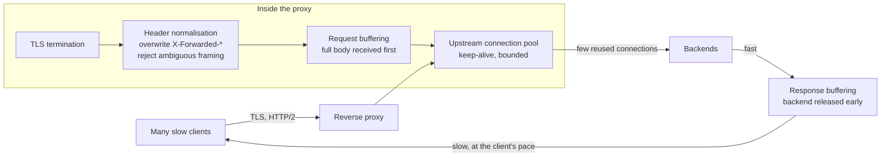
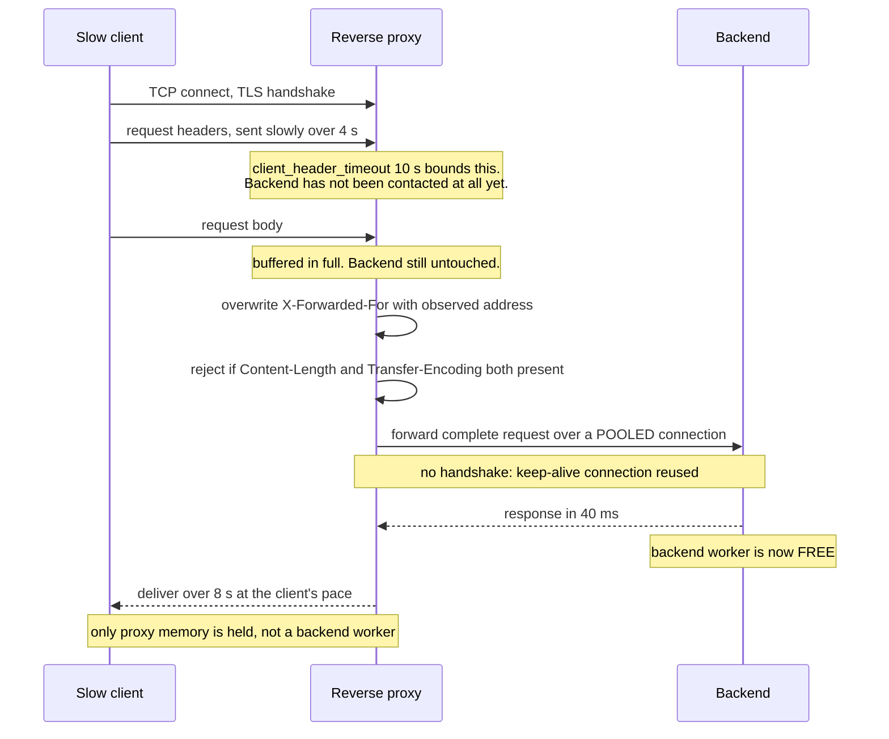

# Chapter 29: Reverse Proxy

## 29.1 Problem Statement

Underneath the gateway of Chapter 28 and the mesh of Chapter 27 sits the same machinery: a process that accepts a client connection, decides what to do with it, opens or reuses a connection to a backend, and moves bytes between them. The tracking platform runs nginx in that role. Five incidents in one year, none of which is about routing.

**Two thousand slow clients take the site down.** Mobile devices on poor networks open connections and send request headers very slowly. Each holds a worker connection. The worker connection limit is reached and healthy clients cannot connect at all. Nothing is overloaded; the CPU is at 12 percent.

**Turning off response buffering makes the backend fragile.** Someone disables it to reduce latency for a streaming endpoint, globally. Now every slow client holds an application thread for as long as it takes them to receive the response, rather than the proxy absorbing it. A single slow mobile client now occupies a backend worker for eight seconds.

**Mysterious 502s appear at exactly 60 seconds.** The proxy's read timeout is 60 seconds and the backend's own timeout is 30. When a request takes longer than 30 seconds the backend closes the connection mid-response, and the proxy reports a bad gateway rather than a timeout, so every investigation looks in the wrong place.

**Rate limits are bypassed.** The gateway limits by client IP taken from `X-Forwarded-For`. A client sets that header itself, and the proxy appends rather than replaces, so the gateway reads the attacker's fabricated value.

**And a request smuggling report arrives from a security researcher.** The proxy and the backend disagree about which header defines the body length when both `Content-Length` and `Transfer-Encoding` are present. The researcher demonstrates prepending a request to another user's connection.

Five failures, none caused by the routing rules everyone thinks of as the proxy's job. All five are caused by connection handling, buffering, timeouts, and header semantics, which is what a reverse proxy actually is.

## 29.2 Why This Problem Exists

**The proxy is treated as configuration rather than as a component with behaviour.** Teams write routing rules and never consider that the same process is managing two independent connection pools, buffering bodies, and interpreting HTTP framing on behalf of everything behind it.

**Its defaults encode a specific set of assumptions,** which are usually right for a public web server and sometimes wrong for an internal API. Buffering, timeouts, and connection limits all have defaults that will hold until they do not.

**It sits between two parties with different characteristics.** Clients are numerous, slow, untrusted, and may be hostile. Backends are few, fast, and trusted. The proxy exists precisely to decouple those two populations, and every failure in Section 29.1 is a case where the decoupling was incomplete.

**Timeouts must agree across layers, and nobody owns the whole chain.** The client, the proxy, and the backend each have their own, configured by different people at different times.

**And HTTP is more ambiguous than it looks.** Two implementations parsing the same bytes can disagree about where a request ends, which is a security property rather than a curiosity.

## 29.3 Real World Analogy

A freight forwarder between many small shippers and a few large carriers.

Individual senders arrive unpredictably, with badly packed goods, sometimes taking hours to finish loading. Carriers want full, correctly labelled, promptly loaded containers. The forwarder exists to absorb the difference: it receives from many slow senders, holds goods in a warehouse, consolidates, relabels, and hands over cleanly.

The warehouse is buffering, and it is the point of the arrangement. Without it, a carrier's lorry waits at the dock while one sender finishes loading, which is Section 29.1's second failure.

The dock doors are worker connections. There is a fixed number, and a sender who occupies one for three hours while unloading slowly has consumed a scarce resource without doing much, which is the first failure.

The labelling matters too. The forwarder attaches its own documentation and **removes whatever the sender wrote on the box**, because a sender who labels their own package "priority, pre-cleared customs" must not be believed. That is header handling, and trusting a client-supplied header is Section 29.1's fourth failure.

And if the forwarder and the carrier disagree about where one consignment ends and the next begins, goods get attributed to the wrong customer. That is request smuggling.

## 29.4 Simple Explanation

**A reverse proxy accepts connections on behalf of backend servers, and forwards requests to them.** Forward proxies act for clients; reverse proxies act for servers, which is where the name comes from.

It sits between two populations with opposite characteristics:

| | Client side | Backend side |
|---|---|---|
| Count | Many thousands | Tens |
| Speed | Slow and variable | Fast and stable |
| Trust | None | Full |
| Connection lifetime | Short and unpredictable | Long-lived and pooled |
| Protocol | Whatever the client speaks | Whatever the backend prefers |

Its job is to decouple the two, and everything it does follows from that:

| Function | Why it belongs here |
|---|---|
| Connection termination | Absorbs slow and unreliable client connections |
| Buffering | Backends see complete requests and fast readers |
| Connection pooling upstream | Few backend connections serve many clients |
| TLS termination | Certificates and cipher policy in one place |
| Header normalisation | Untrusted client input made trustworthy |
| Timeouts | Bounds how long anything can hold resources |
| Protocol translation | Modern protocols outside, simple ones inside |
| Static content and caching | Some responses never need a backend |
| Compression | Bytes on slow links reduced |

The relationship to the previous two chapters, since all three are proxies:

```
reverse proxy   the mechanism: connections, buffering, timeouts, HTTP framing
load balancer   a reverse proxy that chooses among equivalent backends (Chapter 30)
API gateway     a reverse proxy that understands your API: auth, quotas (Chapter 28)
service mesh    reverse proxies deployed per instance for east-west traffic (Chapter 27)
```

They are the same machinery with different responsibilities layered on, which is why the failures in this chapter appear in all of them.

## 29.5 Technical Deep Dive

### 29.5.1 Two connection pools, not one

The single most important structural fact, and the one that explains the first two failures.

```
  10,000 client connections            50 upstream connections
  slow, untrusted, short-lived         fast, trusted, long-lived, reused
            |                                      |
            +----------> [ PROXY ] <---------------+
                    two independent pools
```

The decoupling is the value. Ten thousand mobile clients do not become ten thousand backend connections, because the proxy reuses a small pool. Chapter 9's connection arithmetic is solved here: without a proxy, connection count grows with clients; with one, it is bounded by configuration.

The consequences to configure deliberately:

| Setting | Governs | If wrong |
|---|---|---|
| Max client connections per worker | How many slow clients can be absorbed | Section 29.1's first failure |
| Upstream pool size | Load placed on backends | Too small throttles; too large defeats the purpose |
| Upstream keep-alive | Whether connections are reused | Absent, so every request pays a handshake (Chapter 7) |
| Client header timeout | How long a client may take to send headers | Absent, so slow-header attacks succeed |
| Client body timeout | How long to receive a body | Absent, so slow-body attacks succeed |

```nginx
# Client side: absorb many, but bound how long each may loiter.
worker_connections      16384;
client_header_timeout   10s;      # slowloris defence
client_body_timeout     30s;
send_timeout            30s;

# Upstream side: few connections, reused.
upstream app {
    server app-1:8080;
    keepalive          64;        # without this, a new TCP connection per request
    keepalive_timeout  60s;
}
```

The `keepalive` directive is worth calling out because omitting it is common and expensive: every proxied request otherwise opens a fresh connection to the backend, paying a handshake per request and inflating connection churn on the application.

### 29.5.2 Buffering

Buffering is what makes the backend see a well-behaved client, and it is the setting most often changed without understanding the consequence.

**Request buffering.** The proxy reads the entire request body before forwarding. The backend receives it at full speed.

**Response buffering.** The proxy reads the entire response from the backend as fast as the backend can produce it, releases the backend, then delivers to the client at whatever speed the client manages.

```
WITH response buffering:
  backend  --fast-->  proxy  --slow (8 s)-->  client
  Backend worker is free after 40 ms. Proxy holds the bytes.

WITHOUT response buffering:
  backend  ---------slow (8 s)---------->  client
  Backend worker held for the whole 8 seconds by a slow client.
```

That is Section 29.1's second failure. Disabling buffering re-couples backend resources to client speed, which is exactly what the proxy existed to prevent.

The trade-off is genuine, though, which is why the setting exists:

| Buffering | Good for | Bad for |
|---|---|---|
| On | Ordinary APIs and pages. Protects backends from slow clients | Streaming, server-sent events, long-polling, large downloads |
| Off | Streaming and progressive delivery, lower time to first byte | Backend resources held by slow clients |

The rule: **buffer by default, disable per route for genuinely streaming endpoints.** Section 29.1's team disabled it globally for one endpoint.

And buffering has a memory cost. Large uploads must go somewhere, so proxies spill to disk beyond a threshold. Unbounded body sizes are therefore both a memory and a disk exhaustion risk, which is why a maximum body size belongs on every route.

### 29.5.3 Timeouts must form a hierarchy

Section 29.1's 502s came from timeouts configured independently at each layer. The rule that prevents it:

> **Each layer's timeout must be shorter than the layer outside it.** Then the innermost component fails first, with a meaningful error, rather than being killed mid-response by something upstream.

```
client            30 s
  proxy           25 s   <- shorter, so the proxy reports the failure
    backend       20 s   <- shorter, so the backend reports the failure
      database    10 s   <- shortest, so the query fails with a real error

Wrong (Section 29.1):
  proxy           60 s
    backend       30 s   <- backend closes first; proxy sees a broken
                            connection and reports 502 instead of 504
```

The distinct timeouts a proxy needs, since a single value is not enough:

| Timeout | Bounds |
|---|---|
| Connect | Establishing a TCP connection to the backend |
| Send | Writing the request to the backend |
| Read | Waiting for the backend's response |
| Idle | An unused keep-alive connection |
| Client header and body | How long a client may take to send |

And a related subtlety: a proxy that retries an idempotent request to another backend on connection failure is helpful, and a proxy that retries a request the backend already began processing is not, because it duplicates work. Retries at the proxy should be limited to connection failures and explicitly safe methods, and coordinated with Chapter 13's retry budget so that the proxy and the application do not both retry.

### 29.5.4 Headers and trust

The proxy is the boundary where untrusted input becomes trusted context, so header handling is a security control.

| Header | Purpose | Hazard |
|---|---|---|
| `X-Forwarded-For` | Original client address | **Client-supplied. Must be replaced, not appended, at the trust boundary** |
| `X-Forwarded-Proto` | Original scheme | Same. Applications make redirect and cookie decisions from it |
| `X-Forwarded-Host`, `Host` | Original host | Host header injection can poison caches and password reset links |
| `X-Real-IP` | Client address | Same trust problem |
| Hop-by-hop headers | `Connection`, `Upgrade`, `TE`, `Transfer-Encoding` | Must be handled per hop, not forwarded blindly |

```nginx
# At the trust boundary: OVERWRITE, never append.
# proxy_add_x_forwarded_for appends to whatever the client sent,
# which is exactly the bug in Section 29.1.
proxy_set_header X-Forwarded-For   $remote_addr;      # replace
proxy_set_header X-Forwarded-Proto $scheme;
proxy_set_header Host              $host;

# Inside the trust boundary, appending is correct, because every
# previous hop is one you control.
```

The distinction is the whole point: **at the edge, the client's claims are discarded and replaced with observed facts.** Inside, the chain is trustworthy because you own every link.

### 29.5.5 Request smuggling

Worth understanding because it is entirely a proxy-layer problem and it is invisible to application code.

HTTP allows two ways to indicate body length: a `Content-Length` header, or chunked `Transfer-Encoding`. If a request contains both, the specification says chunked wins. If two implementations in the chain resolve the ambiguity differently, they disagree about where one request ends and the next begins.

```
The attacker sends one TCP stream containing crafted framing.

Front-end sees:   one request
Back-end sees:    one request, plus the beginning of a SECOND request
                  left in the connection buffer

The next legitimate user's request on that reused connection is then
appended to the attacker's fragment, so the attacker prepends arbitrary
content to another user's request.
```

The mitigations are structural rather than clever:

- **Reject requests containing both** `Content-Length` and `Transfer-Encoding`, rather than resolving the ambiguity.
- **Normalise at the edge**: have the proxy rewrite the request into a single unambiguous form before forwarding.
- **Prefer HTTP/2 to the backend**, where framing is explicit and length ambiguity does not exist in the same way.
- **Keep the proxy and backend versions current,** since these are parser behaviours.
- **Consider not reusing upstream connections across different clients** where the risk profile justifies the cost, since the attack depends on connection reuse.

### 29.5.6 What else the proxy is doing

Briefly, since each has its own chapter or is self-explanatory.

**TLS termination**, so certificates and cipher policy live in one place. Whether to re-encrypt to the backend depends on the trust of the internal network, and Chapter 27's mesh usually handles that.

**Compression**, which trades CPU for bytes. Worth it on text over slow links, wasteful on small responses and counterproductive on already-compressed content.

**Caching**, which Chapters 32 and 33 cover. A proxy that caches is doing work no backend has to.

**Static content**, served directly from disk far more efficiently than any application will manage.

**Protocol translation**, so the outside can use HTTP/2 or HTTP/3 for its round-trip advantages while backends speak something simpler.

**Access logging**, which is frequently the only place a complete record of every request exists.

## 29.6 Architecture Diagram



```
 many slow clients                          few fast backends
 untrusted                                  trusted
       |                                          ^
       |  TLS terminate                           |
       |  normalise headers (overwrite XFF)       |
       |  reject ambiguous framing                |
       |  buffer request body                     |
       v                                          |
   [ PROXY ] --- bounded keep-alive pool ---------+
       |
       |  buffer response: backend freed in 40 ms
       |  deliver to client over 8 s
       v
    client

 timeouts nest: client 30s > proxy 25s > backend 20s > db 10s
```

## 29.7 Request Flow



1. **The client's slowness is absorbed entirely by the proxy.** Four seconds of header transmission consumes a proxy connection and no backend resource.
2. **Header and body timeouts bound the loitering,** which is the defence against slow-client exhaustion.
3. **The body is buffered before the backend is contacted,** so the backend never waits on a client.
4. **Client-supplied forwarding headers are replaced with observed facts** at the trust boundary.
5. **Ambiguous framing is rejected rather than resolved,** removing the smuggling class.
6. **The upstream connection is reused,** so no handshake is paid per request.
7. **The backend is released after 40 milliseconds** while the proxy spends eight seconds delivering, which is the entire economic argument for the component.

## 29.8 Internal Components

| Component | Role | Failure mode | Guard |
|---|---|---|---|
| Client connection pool | Absorbs many slow clients | Exhausted by loitering connections | Header and body timeouts; adequate worker connections |
| Upstream connection pool | Bounds backend connections | Keep-alive not enabled, so a handshake per request | Configure keep-alive and pool size explicitly |
| Request buffering | Protects backends from slow senders | Disabled globally for one streaming route | Buffer by default; disable per route |
| Response buffering | Frees backend workers early | Disabled, so slow clients hold backend threads | Same |
| Body size limits | Bounds memory and disk | Unlimited, so uploads exhaust the proxy | Explicit maximum per route |
| Timeout hierarchy | Ensures the innermost layer fails first | Inverted, producing misleading 502s | Each layer shorter than the one outside it |
| Header normalisation | Converts client claims into facts | Appending rather than replacing at the edge | Overwrite forwarding headers at the trust boundary |
| Framing validation | Prevents desynchronisation | Ambiguity resolved differently by proxy and backend | Reject requests with conflicting length headers |
| Retry policy | Recovers from connection failures | Retries requests the backend already began | Connection failures and safe methods only |
| Access logs | The complete request record | Not retained, or missing the real client address | Log the normalised client address and timings |

## 29.9 Production Example

**Slowloris made client timeouts a standard configuration item.** The attack is remarkable for how little it costs: a few thousand connections, each sending headers a byte at a time, occupy a server's connection slots indefinitely while consuming almost no bandwidth or CPU. It works against any server that allocates a worker per connection and does not bound how long a client may take to send a request. The defences are unglamorous and universal: connection limits per address, header and body timeouts, and an event-driven proxy in front that can hold many idle connections cheaply.

**Request smuggling research demonstrated that HTTP framing ambiguity is exploitable in practice,** across many combinations of front-end and back-end implementations. The significant point for architecture is that the vulnerability lives entirely between two correctly-implemented components: each parses the request according to a defensible reading, and the disagreement is the flaw. That is why the mitigation is normalisation and rejection at the edge rather than a patch, and why it is worth knowing that every added proxy hop is another parser that must agree with its neighbours.

**And nginx's buffering defaults exist because the alternative was measured.** Response buffering is enabled by default precisely so that a slow client cannot occupy an application worker, which was the dominant failure mode of the architectures that preceded it. The configuration option to disable it exists for streaming, and the widespread practice of disabling it globally to reduce time to first byte reintroduces the problem it was designed to remove.

## 29.10 Advantages

- **Backends are decoupled from client behaviour**, in speed, count, and trustworthiness.
- **Connection count to backends is bounded by configuration** rather than by client population, which is Chapter 9's arithmetic solved structurally.
- **TLS, certificates, and cipher policy live in one place.**
- **Untrusted input becomes trusted context** at a single, auditable boundary.
- **Protocol choice is decoupled:** modern protocols outside, simple ones inside.
- **Static content and cacheable responses never reach an application.**
- **One complete record of every request** for debugging and audit.
- **Backends can be replaced, moved, or scaled** without clients noticing.

## 29.11 Limitations

- **It is on every request path,** so it is an availability dependency and a latency addition.
- **Buffering costs memory and disk**, proportional to concurrent request and response sizes.
- **Configuration is subtle,** and the defaults encode assumptions that may not match your workload.
- **It is another HTTP parser** in the chain, which is a security surface.
- **Timeout coordination spans teams,** so the hierarchy is easy to get wrong.
- **It hides the client** from the backend unless headers are handled correctly.
- **Streaming and buffering conflict,** requiring per-route configuration.

## 29.12 Trade-offs

| Dial | One way | The other way |
|---|---|---|
| Response buffering | On: backends protected from slow clients, higher time to first byte | Off: progressive delivery, backend workers held by slow clients |
| Upstream keep-alive | Long: no handshakes, connections held idle | Short: fewer idle connections, handshake cost per request |
| TLS to backend | Re-encrypt: defence in depth, CPU cost | Plaintext inside: faster, relies on network trust |
| Proxy retries | Enabled: transparent recovery from connection failures | Disabled: no duplicate work, more visible failures |
| Body size limit | Tight: bounded memory, rejects legitimate large uploads | Loose: flexible, exhaustion risk |
| Connection reuse across clients | Reuse: efficient, enlarges smuggling blast radius | Per-client connections: safer, far more expensive |

**Remove response buffering globally.** You gain lower time to first byte on every route. You lose the decoupling between client speed and backend resources, so a population of slow mobile clients now consumes application threads directly.

**Remove upstream keep-alive.** You gain simpler connection accounting. You lose a TCP and possibly TLS handshake per request, which Chapter 7 prices at one to three round trips, and you multiply connection churn on the backend.

**Remove header normalisation and pass client headers through.** You gain nothing. You lose the trust boundary, so any client can claim any source address and defeat every rate limit and audit downstream.

## 29.13 Common Mistakes

**Disabling buffering globally** to fix one streaming endpoint.

**No client header or body timeouts,** which leaves slow-client exhaustion available to anyone.

**Inverted timeout hierarchy,** producing 502s where 504s belong and sending every investigation to the wrong layer.

**Appending to `X-Forwarded-For` at the trust boundary** rather than replacing it.

**No upstream keep-alive,** paying a handshake per proxied request.

**Unbounded request body size,** which is a memory and disk exhaustion vector.

**Retrying non-idempotent requests** at the proxy after the backend has begun processing.

**Forwarding hop-by-hop headers,** which is where framing confusion begins.

**Treating the proxy as configuration rather than as a component** with its own capacity, failure modes, and metrics.

**Not monitoring the proxy itself:** active connections, upstream pool saturation, and per-status-code rates.

## 29.14 Interview Questions

**Q: What does a reverse proxy actually do?** It terminates client connections on behalf of backends and forwards requests to them, decoupling two populations with opposite characteristics. Concretely: TLS termination, buffering, upstream connection pooling and reuse, timeout enforcement, header normalisation at the trust boundary, protocol translation, and often caching and static serving.

**Q: Why does buffering matter?** Response buffering lets the proxy read a response from the backend at full speed, freeing the backend worker immediately, then deliver it to the client at whatever pace the client manages. Without it, a client taking eight seconds to receive a response holds a backend thread for eight seconds, which re-couples backend capacity to client network quality.

**Q: A request takes too long and you get a 502 rather than a 504. What is wrong?** The timeout hierarchy is inverted. The backend's timeout is shorter than the proxy's, so the backend closes the connection mid-response and the proxy reports a broken upstream rather than a timeout. Each layer's timeout should be shorter than the layer outside it, so the innermost component fails first with a meaningful error.

**Q: How should `X-Forwarded-For` be handled?** At the trust boundary it must be overwritten with the observed peer address, never appended to, because the client controls whatever it sent. Inside the trust boundary appending is correct, since every previous hop is one you operate. Getting this wrong lets clients forge their apparent source address and defeat rate limiting, geolocation, and audit logging.

**Q: What is request smuggling and why is it a proxy problem?** It exploits disagreement between two HTTP implementations about where a request ends, typically when both `Content-Length` and `Transfer-Encoding` are present. The front-end and back-end parse the same bytes differently, leaving a fragment in a reused connection that gets prepended to the next user's request. It is a proxy problem because both components are individually defensible and the flaw is the disagreement; mitigations are rejecting ambiguous requests and normalising at the edge.

**Q: Why enable upstream keep-alive?** Without it every proxied request opens a new TCP connection, and possibly a new TLS session, to the backend, costing one to three round trips per request and creating connection churn. With it, a small pool of long-lived connections serves many client requests, which is the bounded-connection property that makes the proxy valuable.

## 29.15 Production Best Practices

1. **Buffer by default; disable per route** only for genuinely streaming endpoints.
2. **Set client header and body timeouts** so slow clients cannot loiter indefinitely.
3. **Enable upstream keep-alive** with an explicit pool size.
4. **Make timeouts nest:** client longer than proxy, proxy longer than backend, backend longer than database.
5. **Overwrite forwarding headers at the trust boundary,** and append only inside it.
6. **Reject requests with both `Content-Length` and `Transfer-Encoding`.**
7. **Set explicit maximum body sizes** per route.
8. **Limit proxy retries** to connection failures and safe methods, coordinated with the application's retry budget.
9. **Strip hop-by-hop headers** rather than forwarding them.
10. **Monitor the proxy as a component:** active connections, upstream pool saturation, per-status rates, and buffering spill to disk.
11. **Keep proxy and backend HTTP implementations current,** since framing behaviour is a security property.
12. **Log the normalised client address and per-phase timings,** so slow-client and slow-backend cases are distinguishable.

## 29.16 Summary

A reverse proxy accepts connections on behalf of backends, and everything it does follows from the fact that it sits between two populations with opposite characteristics: many slow, untrusted, short-lived client connections on one side, and a few fast, trusted, pooled backend connections on the other. Its purpose is to decouple them, and its failures are all cases where that decoupling is incomplete.

Buffering is the mechanism most often misunderstood. Reading a response from the backend at full speed and then delivering it to the client slowly is what frees a backend worker in forty milliseconds instead of eight seconds, and disabling it globally to improve time to first byte on one streaming route reintroduces exactly the coupling the component exists to remove. Client header and body timeouts do the same job in the other direction, bounding how long a slow or malicious client may occupy a connection while doing nothing.

Timeouts must nest, with each layer shorter than the one outside it, or the innermost component gets killed mid-response by something upstream and the resulting error points at the wrong layer. And the proxy is the trust boundary, which means forwarding headers must be overwritten with observed facts rather than appended to client claims, and ambiguous HTTP framing must be rejected rather than resolved, because two correct parsers disagreeing is the entire mechanism of request smuggling.

None of this is routing, which is what most people picture when they think about a proxy. Chapters 27, 28, and 30 add routing, policy, and backend selection on top, and all of them inherit the machinery described here, which is why these failure modes appear in gateways and meshes too.

## 29.17 Quick Revision Notes

- Reverse proxy acts for servers; forward proxy acts for clients.
- It decouples many slow untrusted client connections from few fast trusted pooled backend connections.
- Two independent connection pools. Backend connection count is bounded by config, not by client count.
- Response buffering frees the backend worker immediately and delivers to the client slowly. Disabling it globally re-couples backend capacity to client speed.
- Disable buffering per route only, for streaming, server-sent events, and long-polling.
- Client header and body timeouts are the defence against slow-client connection exhaustion.
- Upstream keep-alive avoids a handshake per proxied request. Omitting it is common and expensive.
- Timeouts must nest: client > proxy > backend > database. Inverted hierarchy produces misleading 502s.
- Distinct timeouts needed: connect, send, read, idle, client header, client body.
- At the trust boundary, overwrite `X-Forwarded-For` and friends. Appending trusts client claims.
- Request smuggling comes from `Content-Length` and `Transfer-Encoding` disagreement between hops. Reject ambiguity, normalise at the edge.
- Strip hop-by-hop headers rather than forwarding them.
- Bound request body size, or buffering becomes a memory and disk exhaustion vector.
- Proxy retries only on connection failures and safe methods, coordinated with the application retry budget.
- Monitor the proxy as a component: connections, pool saturation, status rates, buffer spill.

## 29.18 Mini Quiz

1. Explain why response buffering protects backends, and when you should turn it off.
2. Your proxy read timeout is 60 s and the backend's is 30 s. What do clients see and why is it confusing?
3. Why must `X-Forwarded-For` be overwritten at the edge but appended internally?
4. What is slowloris and which two settings defend against it?
5. Describe request smuggling and give two mitigations.
6. What does omitting upstream keep-alive cost?
7. Why is an unbounded request body size a proxy problem rather than an application problem?

**Answers**

1. Because the proxy reads the response from the backend as fast as the backend can produce it, then releases the backend connection and delivers to the client at the client's own pace. A backend worker is therefore held for the duration of the backend's processing rather than for the duration of the client's download, which decouples backend capacity from client network quality. Turn it off only for endpoints where progressive delivery is the point: streaming responses, server-sent events, long-polling, and very large downloads where holding the whole body is impractical, and do so per route rather than globally.
2. Clients see 502 Bad Gateway. The backend hits its own 30 second limit first and closes the connection while the proxy is still waiting, so from the proxy's perspective the upstream failed rather than timed out, and it reports a broken gateway. It is confusing because a 502 suggests the backend is unhealthy or unreachable, sending investigators toward connectivity and process health, when the actual cause is a slow request and a misordered timeout configuration. Making the proxy's timeout shorter than the backend's produces a 504, which points directly at the real problem.
3. Because at the edge the header is entirely under client control and therefore worthless as evidence: a client can send any value, and appending preserves the fabricated entries so downstream consumers read attacker-chosen addresses. Overwriting replaces claims with the observed peer address, which is a fact. Inside the trust boundary every previous hop is a component you operate, so the existing chain is trustworthy and appending correctly preserves the full path for debugging and for identifying the original client behind several internal hops.
4. An attack that opens many connections and sends request headers extremely slowly, a byte at a time, so each connection remains open and occupies a connection slot while consuming almost no bandwidth or CPU. It exhausts connection capacity without triggering any load-based alarm. The defences are a client header timeout that bounds how long a client may take to send a complete request, and a limit on concurrent connections per source address, together with an event-driven proxy that can hold idle connections cheaply rather than allocating a worker per connection.
5. It exploits disagreement between two HTTP implementations in a chain about where one request ends and the next begins, typically when a request carries both a `Content-Length` header and chunked `Transfer-Encoding`. The front-end treats the stream as one request while the back-end sees an additional fragment left in the reused connection, so the next legitimate request on that connection is appended to the attacker's fragment. Mitigations: reject any request containing both headers rather than resolving the ambiguity, and normalise requests into a single unambiguous form at the edge before forwarding. Using HTTP/2 upstream and keeping implementations current also help.
6. A TCP handshake, and a TLS handshake if the internal hop is encrypted, on every single proxied request, which Chapter 7 prices at one to three round trips before any data moves. It also creates high connection churn on the backend, consuming file descriptors and ephemeral ports and increasing the cost of accepting connections, and it removes the bounded-connection property that is one of the main reasons to deploy a proxy at all.
7. Because the proxy buffers the body before forwarding it, so an oversized or unbounded upload consumes proxy memory and, beyond a threshold, proxy disk, before the application has seen a single byte and can reject it. The exhaustion therefore happens at the shared component every request passes through rather than at one application instance, making it a much larger blast radius. An explicit maximum body size at the proxy rejects the request early, at the boundary, which is where Chapter 11's validation principle says it belongs.

## 29.19 Hands-on Exercise

**Part 1: see buffering in action.** Put a proxy in front of a service that returns a large response. Simulate a slow client with a rate-limited download. With buffering on, measure how long the backend worker is occupied. Turn buffering off and measure again. The difference is the entire argument for the component.

**Part 2: exhaust the connections.** Open several thousand connections that send headers a byte at a time. Record when legitimate clients start failing, and note that CPU stays low. Then set a client header timeout and repeat.

**Part 3: produce the misleading 502.** Configure the proxy read timeout longer than the backend timeout and issue a slow request. Observe the status code. Invert the hierarchy and observe it change to a 504.

**Part 4: forge your own address.** Send a request with an `X-Forwarded-For` header you choose, through a proxy configured to append. Confirm the application sees your fabricated value. Switch to overwrite and confirm it sees your real address.

**Part 5: measure keep-alive.** Benchmark throughput and latency through the proxy with upstream keep-alive disabled and enabled, and count connections opened on the backend in each case.

## 29.20 Further Reading

- nginx documentation on `proxy_buffering`, `keepalive`, and the timeout directives. Read them as a description of behaviour rather than as configuration reference.
- Envoy's documentation on connection management, buffering, and timeouts, for the same concepts in a different implementation.
- PortSwigger's research on HTTP request smuggling, which is the definitive practical treatment.
- *High Performance Browser Networking*, Ilya Grigorik, on connection handshakes, keep-alive, and why round trips dominate.
- OWASP guidance on host header injection and forwarding header handling.
- RFC 9110 and RFC 9112, on HTTP semantics and message framing, specifically the sections on message body length.

---

**Next chapter: Chapter 30, Load Balancer.** The reverse proxy's most common specialisation: how backends are chosen, why round robin distributes connections rather than work, and the algorithms that make a heterogeneous fleet behave.
