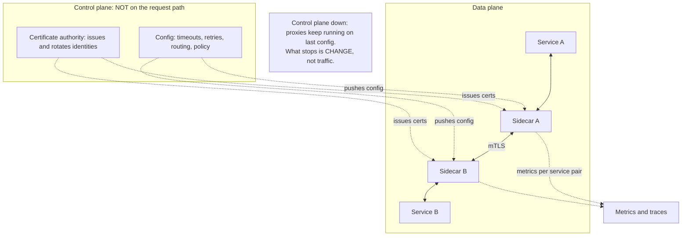
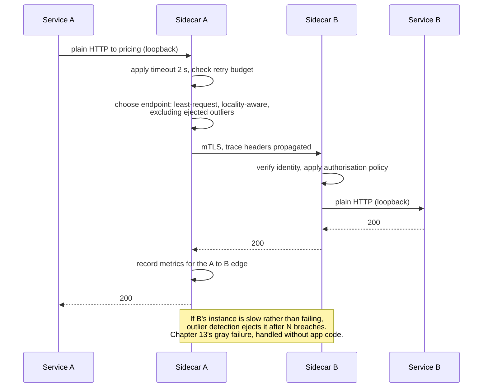

# Chapter 27: Service Mesh

## 27.1 Problem Statement

Chapter 26 listed the platform capabilities a microservice system needs: timeouts, retries with budgets, circuit breakers, mutual TLS, tracing, per-service metrics. The company with fourteen services builds them as a shared library. Three years later:

**There are four versions of the library in production.** Services on version 2 have no retry budget, so they amplify overload exactly as Chapter 13 described. Nobody can upgrade them all at once because each upgrade is a service deploy owned by a different team.

**Two services are in Python and one in Go.** Neither can use the Java library, so both reimplemented timeouts and retries, differently, and one of them has no circuit breaker at all.

**Timeout configuration is scattered across fourteen repositories.** Changing the timeout for calls to the pricing service means fourteen pull requests, and the current values are unknown without reading all of them.

**Mutual TLS was mandated for compliance** and is implemented in six services. The other eight were "next quarter" for eleven consecutive quarters.

**And a canary release requires a code change.** Shifting 5 percent of traffic to a new version means a routing feature in the library, deployed to every caller.

Every one of these is a consequence of implementing infrastructure concerns inside application processes. The team adopts a service mesh, and it fixes all five. It also introduces three new problems: p99 latency rises by 9 milliseconds, a control plane outage makes configuration changes impossible for 40 minutes, and debugging now requires understanding a proxy that no application developer chose.

This chapter is about what a mesh does, what each hop costs, and when a library is still the better answer.

## 27.2 Why This Problem Exists

**Cross-cutting concerns implemented in application code get N implementations.** Every service must include the library, keep it current, and configure it consistently. In a polyglot estate, N implementations become N languages times N versions.

**Upgrading a library requires deploying every service,** which means the rate at which you can change infrastructure behaviour is bounded by the slowest team's release cadence.

**Configuration lives with the code that uses it,** so a policy question like "what is our retry behaviour toward the pricing service" has no single answer and no single place to change.

**Security requirements are all-or-nothing but library adoption is incremental,** so a compliance mandate that requires every hop to be encrypted is not satisfied until the last service ships.

**And traffic management needs to change without deploying,** because canaries, failovers, and traffic shifts are operational actions rather than code changes.

A mesh moves all of this out of the process and into infrastructure. That is the entire idea, and every advantage and every cost follows from it.

## 27.3 Real World Analogy

A large office where every department handles its own post.

Each department buys stamps, checks identities of couriers, keeps a delivery log, and decides how many times to re-send a lost letter. Departments do it differently. The finance team, which handles sensitive documents, uses tamper-evident envelopes; nobody else does, though the policy says they should. When the postal rules change, twelve departments must each be told, and three do not act for a year.

The alternative is a mailroom. Every department hands post to the mailroom and receives post from it. The mailroom applies the rules uniformly: identity checks on every delivery, sealed envelopes for everything, a single log, one retry policy, and one place to change any of it. Departments stop thinking about post entirely.

The costs are real and worth naming. **Every letter now passes through an extra pair of hands**, which adds time. **The mailroom is a new dependency**, and when it is disrupted nothing moves. **And when a letter goes missing, the investigation now involves a team nobody in the department knows,** because the handling happened somewhere they cannot see.

That trade is exactly a service mesh: uniform policy and visibility in exchange for an extra hop, a new dependency, and a layer between you and the wire.

## 27.4 Simple Explanation

**A service mesh moves network concerns out of application code and into a dedicated infrastructure layer, usually a proxy deployed alongside every service instance.**

The architecture has two halves:

| Half | What it is | What it does |
|---|---|---|
| **Data plane** | A proxy per instance, or per node | Intercepts all inbound and outbound traffic; applies timeouts, retries, mTLS, load balancing, and emits telemetry |
| **Control plane** | A central service | Distributes configuration and certificates to the proxies |

The critical property: **the control plane is not on the request path.** If it fails, existing proxies continue with their last configuration, which is Chapter 13's fail-static principle. What stops working is the ability to change things.

What a mesh typically provides:

| Capability | Chapter it implements |
|---|---|
| Mutual TLS between all services, with rotating certificates | 76, 77 |
| Timeouts and retries with budgets | 7, 13, 61 |
| Circuit breaking and outlier ejection | 13, 60 |
| Load balancing, including least-request and locality awareness | 21, 30 |
| Traffic splitting for canary and blue-green | 10 |
| Fault injection for chaos experiments | 13 |
| Uniform metrics per service pair, and trace propagation | 67, 70 |
| Authorisation policy between services | 72 |

The one-sentence framing:

> **A mesh gives you consistent, language-independent, deploy-free control over how services talk to each other, in exchange for a proxy hop, a new control plane, and a layer between developers and the network.**

## 27.5 Technical Deep Dive

### 27.5.1 The sidecar path, and what it costs

In the classic model, a proxy runs beside each service instance and all traffic is redirected through it. A single call therefore traverses two proxies.

```
Without a mesh:
  service A  ------------------------->  service B
             one network hop

With a sidecar mesh:
  service A -> sidecar A ------------->  sidecar B -> service B
             loopback   network hop     loopback

Two extra loopback hops per call, plus the proxies' processing.
```

The costs, in the units that matter:

| Cost | Typical magnitude | Note |
|---|---|---|
| Added latency per call | Roughly 0.5 to 3 ms round trip, depending on the proxy and configuration | Small in absolute terms, and it compounds with call depth |
| Added latency at p99 | Higher than the median, since the proxy is another queue | Chapter 7's tail arithmetic applies |
| CPU per instance | A sidecar consumes real cores, especially with mTLS | Multiply by fleet size |
| Memory per instance | Tens to a few hundred megabytes | Multiply by fleet size |
| Fleet cost | Sidecar resources times every instance | Can be a significant fraction of total compute |

The compounding matters more than the per-hop figure:

```
2 ms added per call.

Request touching 2 services in sequence:   4 ms added
Request touching 6 services in sequence:  12 ms added

Against a 200 ms budget, acceptable.
Against a 20 ms internal service budget, it is 60 percent overhead.
```

That arithmetic is the honest basis for deciding, and it is why latency-critical internal paths sometimes bypass the mesh deliberately.

### 27.5.2 The alternatives

A mesh is one of four ways to solve the same problem, and it is not always the right one.

| Approach | How | Best when |
|---|---|---|
| **Library in each service** | Resilience and telemetry in application code | Single language, few services, latency-critical |
| **Sidecar proxy** | A proxy per instance | Polyglot, many services, uniform policy required |
| **Node-level proxy** | One proxy per host, shared by all instances on it | Sidecar resource cost is prohibitive |
| **Proxyless** | The mesh control plane configures gRPC clients directly | gRPC-only estates wanting policy without a hop |

The trade in one line each: the library is fastest and hardest to keep consistent; the sidecar is the most uniform and most expensive; node-level shares the cost and weakens isolation; proxyless removes the hop and constrains you to supported clients.

Newer designs reduce the sidecar tax by splitting the responsibilities. A lightweight per-node component handles transport security and basic routing for all traffic, while a heavier component is deployed only where advanced layer-7 policy is genuinely needed. The reasoning is straightforward: most services need mTLS and metrics, and only some need retries, header-based routing, and traffic splitting, so charging every instance for the full proxy is wasteful.

**And the honest baseline: if you run five services in one language, a shared library plus a good HTTP client gives you most of the benefit at none of the cost.** A mesh earns its keep with many services, several languages, and a real need for uniform policy.

### 27.5.3 What a mesh does that a library struggles with

Four things, and they are the reasons to adopt one.

**Uniform policy without deploys.** Changing the retry policy toward a dependency is a configuration change applied to running proxies rather than fourteen pull requests and fourteen releases.

```yaml
# One policy, applied by every caller's proxy, no service deploy.
timeout: 2s
retries:
  attempts: 2
  perTryTimeout: 800ms
  retryOn: 5xx,reset,connect-failure
  retryBudget: { percent: 10 }        # Chapter 13's amplification cap
outlierDetection:                      # Chapter 13's gray failure defence
  consecutive5xx: 5
  interval: 10s
  baseEjectionTime: 30s
  maxEjectionPercent: 30               # never eject the whole fleet
```

That last block is worth noting. **Outlier ejection based on observed behaviour is one of the strongest arguments for a mesh**, because it addresses the gray failure from Chapter 13 that health checks cannot see, and implementing it consistently in every language's client library is exactly the problem meshes exist to solve.

**Mutual TLS everywhere, with rotation.** Certificates are issued and rotated by the control plane and applied by proxies, so encryption in transit and service identity are properties of the platform rather than of each team's diligence. For a compliance requirement covering every hop, this converts a multi-quarter programme into a configuration change.

**Traffic shifting as an operational action.** Canary releases, blue-green cutovers, and regional failover become routing configuration rather than application features.

```yaml
# Canary without touching either service's code.
route:
  - destination: { host: pricing, subset: v2 }
    weight: 5
  - destination: { host: pricing, subset: v1 }
    weight: 95
```

**Consistent telemetry for every service pair.** Request rate, error rate, and latency percentiles for every edge in the call graph, produced identically regardless of language, plus trace context propagation. Note the limit: the mesh propagates trace headers, and **the application must still pass them through its own internal call chain**, so a mesh does not give you tracing for free.

### 27.5.4 The failure modes

A mesh is infrastructure on the request path, so it fails in ways that are worth anticipating.

| Failure | Effect | Mitigation |
|---|---|---|
| Control plane unavailable | Existing config keeps working; changes and new certificate issuance stop | Fail static; alert on certificate expiry margin |
| Certificate expiry during a control plane outage | All mTLS fails simultaneously, everywhere | Long-lived enough certificates and generous rotation margin |
| Sidecar starts after the application | Early outbound calls fail | Startup ordering, and readiness that accounts for it |
| Sidecar terminates before the application | In-flight requests fail during shutdown | Shutdown ordering, and drain sequencing (Chapter 23) |
| Proxy resource limits reached | Requests queue or fail at a layer nobody is watching | Monitor sidecar CPU, memory, and connection counts |
| Misconfigured policy applied estate-wide | A single bad config affects every service | Stage config changes like code (Chapter 10) |
| Retry policy at both mesh and application | Multiplied retries, per Chapter 13 | Retry in exactly one layer, and say which |

Two of these deserve emphasis. **A config push is a change, and it reaches everything at once**, which is precisely the correlated-failure shape Chapter 10 warned about, so mesh configuration deserves the same canarying and staged rollout as application code.

And **retrying in two layers multiplies**. If the application library retries three times and the mesh also retries three times, the downstream sees up to sixteen attempts. Decide which layer owns retries, and disable it in the other.

### 27.5.5 When a mesh is not worth it

| Situation | Better answer |
|---|---|
| Fewer than roughly ten services | A shared library, or just good HTTP client defaults |
| One language | A library, which is faster and simpler |
| Latency-critical internal calls | Bypass the mesh, or use proxyless mode |
| No platform team to operate it | Do not adopt. It is a system that must be run |
| The real problem is service boundaries | A mesh does not fix a chatty design (Chapter 26) |
| Only tracing is needed | An instrumentation library is cheaper |

The last row is a common trap. Teams adopt a mesh to get observability, then discover that meaningful tracing still requires application instrumentation to propagate context through internal calls, and that the mesh's contribution is per-hop metrics they could have obtained more cheaply.

The decision, stated as a question: **do you have enough services and enough languages that inconsistency is the dominant problem, and a team able to operate another distributed system?** If yes, a mesh is a good trade. If no, it is a large tax paid for uniformity you could get by other means.

## 27.6 Architecture Diagram



```
 CONTROL PLANE  (config + certificate authority)     -- not on the request path
        |  pushes config and certificates
        v
 +--------------------+            +--------------------+
 | service A          |            | service B          |
 |   |                |            |   ^                |
 |   v  loopback      |   mTLS     |   |  loopback      |
 | sidecar A  =========================  sidecar B      |
 +--------------------+            +--------------------+

 Per call: 2 extra loopback hops, roughly 0.5 to 3 ms round trip.
 Sidecars apply: timeouts, retry budgets, circuit breaking,
 outlier ejection, load balancing, mTLS, metrics, trace headers.

 Control plane outage: existing traffic continues on last known config.
 Certificate expiry during that outage is the real hazard.
```

## 27.7 Request Flow



1. **The application makes a plain, unencrypted call to a local address.** It knows nothing about mTLS, retries, or endpoint selection, which is the point.
2. **The outbound sidecar applies policy** that was configured centrally and can be changed without a deploy.
3. **Endpoint selection uses least-request with locality awareness and outlier exclusion,** which is Chapter 21's balancing advice and Chapter 13's gray failure defence, applied uniformly regardless of the caller's language.
4. **The hop between proxies is mutually authenticated and encrypted,** with identities issued and rotated by the control plane.
5. **The inbound sidecar enforces authorisation** based on the caller's verified identity rather than on network location.
6. **Metrics are recorded for the specific caller-callee pair,** which is the granularity that makes a call graph legible.
7. **Two loopback hops and two proxy traversals** have been added, which is the price.

## 27.8 Internal Components

| Component | Role | Failure mode | Guard |
|---|---|---|---|
| Sidecar proxy | Applies all network policy | Resource limits reached, invisible to the app | Monitor sidecar CPU, memory, connections |
| Control plane | Distributes config and certificates | Outage blocks changes and issuance | Fail static; alert on certificate expiry margin |
| Certificate authority | Service identity | Expiry during an outage fails everything at once | Long validity relative to outage tolerance |
| Config distribution | Applies policy fleet-wide | One bad config affects everything simultaneously | Stage and canary config like code |
| Retry policy | Bounded retrying | Duplicated in the application, multiplying attempts | Retry in one layer only, explicitly |
| Outlier detection | Removes degraded endpoints | Ejects too many during a global event | Cap the ejectable percentage |
| mTLS | Encryption and identity | Sidecar startup ordering breaks early calls | Order startup and shutdown deliberately |
| Telemetry pipeline | Per-edge metrics | Cardinality explosion across service pairs | Bound labels; aggregate |
| Trace propagation | Carries context between hops | App does not propagate internally, so traces break | Instrument the application too |

## 27.9 Production Example

**Envoy became the de facto data plane** because it implemented, in one place and in a language-independent way, the behaviours that Chapters 7, 13, and 21 keep requiring: timeouts, retry budgets, circuit breaking, outlier detection, least-request and locality-aware load balancing, and consistent telemetry per upstream. Its configuration surface is the practical vocabulary of resilience, and reading it is a useful exercise even for teams that never adopt a mesh, because it enumerates the decisions every service-to-service call implicitly makes.

**Linkerd's design choice was to minimise the tax**, using a purpose-built lightweight proxy rather than a general-purpose one, on the argument that most services need mTLS, load balancing, and metrics rather than the full policy surface. It is the clearest counterexample to the assumption that a mesh must be heavy, and it makes the resource cost question an explicit design axis rather than an unavoidable consequence.

**Ambient and proxyless approaches are the current response to the sidecar cost.** Splitting responsibilities so that a shared per-node component handles transport security and basic routing, with a heavier component deployed only where layer-7 policy is needed, addresses the observation that charging every instance for the full proxy is disproportionate when most instances use a fraction of its capability. The trade is weaker isolation between workloads sharing the node component, which is the same trade Section 27.5.2 describes for node-level proxies generally.

## 27.10 Advantages

- **Uniform behaviour across languages,** which a library cannot provide in a polyglot estate.
- **Policy changes without deploys,** so infrastructure behaviour is not gated on the slowest team's release cadence.
- **mTLS and service identity as a platform property,** which turns a compliance programme into configuration.
- **Outlier ejection and circuit breaking applied consistently,** which is Chapter 13's most valuable defence and the hardest to implement uniformly by hand.
- **Traffic shifting as an operational action,** enabling canaries and failover without application features.
- **Per-edge telemetry for the whole call graph,** produced identically everywhere.
- **Application code gets simpler,** since resilience concerns leave the codebase.

## 27.11 Limitations

- **Latency per hop,** compounding with call depth.
- **Resource cost per instance,** multiplied across the fleet.
- **A new distributed system to operate,** with its own upgrades, failure modes, and expertise requirement.
- **Debugging spans a layer developers did not choose** and often cannot see into.
- **Config changes are fleet-wide changes,** with the correlated failure risk that implies.
- **Retry duplication** if the application also retries.
- **It does not fix architecture.** A chatty design with wrong boundaries is still wrong, and now each call costs more.
- **Tracing still requires application instrumentation** for internal propagation.

## 27.12 Trade-offs

| Dial | One way | The other way |
|---|---|---|
| Implementation | Sidecar: uniform, isolated, expensive per instance | Library: fast and cheap, inconsistent across languages |
| Proxy placement | Per instance: strong isolation, high total cost | Per node: cheaper, shared fate between workloads |
| Policy scope | Mesh owns retries and timeouts: one place to change | Application owns them: closer to context, inconsistent |
| Coverage | All traffic: uniform security and telemetry | Selective: latency-critical paths bypass the mesh |
| Control plane coupling | Fail static: survives outages, config is stale | Fail closed: fresh config guaranteed, outage stops traffic |
| Feature surface | Full layer-7 policy: powerful, heavy | Transport security and metrics only: light, limited |

**Remove the mesh and use a library.** You gain latency, resources, and one fewer system to operate. You lose uniformity across languages, deploy-free policy changes, and estate-wide mTLS, which is the right trade below roughly ten services in one language and the wrong one above it.

**Remove mesh retries and let the application retry.** You gain context-aware retry decisions, since the application knows which operations are idempotent. You lose uniform retry budgets, which is Chapter 13's amplification cap. Whichever you choose, choose exactly one.

**Remove sidecars in favour of a node-level proxy.** You gain a large reduction in total resource cost. You lose per-workload isolation, so one workload's traffic can affect another's proxy capacity.

## 27.13 Common Mistakes

**Adopting a mesh to fix architectural problems.** Wrong boundaries and chatty designs are unaffected, and every call now costs more.

**Retrying in both the mesh and the application,** multiplying attempts exactly as Chapter 13 warned.

**Treating config pushes as safe** because they are not deploys. They reach everything at once and deserve staged rollout.

**Not monitoring the sidecar,** so proxy resource exhaustion appears as unexplained application latency.

**Ignoring startup and shutdown ordering,** which produces failures at the beginning and end of every pod's life.

**Assuming the mesh provides tracing,** when it propagates headers and the application must still carry context internally.

**Certificates with a validity shorter than your tolerance for a control plane outage.**

**Adopting a mesh with no team to operate it,** which adds a distributed system nobody owns.

**Applying the full proxy to latency-critical internal paths** without measuring the compounding cost.

## 27.14 Interview Questions

**Q: What problem does a service mesh solve?** Cross-cutting network concerns implemented inconsistently across services and languages: timeouts, retries, circuit breaking, mTLS, load balancing, and telemetry. It moves them into infrastructure so they are uniform, language-independent, and changeable without deploying services.

**Q: Data plane versus control plane?** The data plane is the proxies that carry traffic and apply policy. The control plane distributes configuration and issues identities. The control plane is deliberately off the request path, so its failure stops changes and certificate issuance rather than stopping traffic, which is fail-static behaviour.

**Q: What does a sidecar cost?** Two extra loopback hops per call, typically around half a millisecond to a few milliseconds round trip, plus proxy CPU and memory on every instance. The latency compounds with call depth, so a six-service chain may add ten milliseconds or more, which matters against a small internal budget and is negligible against a large user-facing one.

**Q: When is a library the better answer?** With few services, a single language, latency-critical internal paths, or no platform team to operate a mesh. A library is faster, cheaper, and simpler; its weakness is inconsistency, which only becomes the dominant problem once there are many services or several languages.

**Q: What breaks when the control plane fails?** Configuration changes and new certificate issuance. Existing traffic continues on the last distributed configuration. The real hazard is certificate expiry during a prolonged outage, since that fails every mutually authenticated connection simultaneously, so certificate validity should comfortably exceed your tolerance for a control plane outage.

**Q: Why is a mesh config change risky?** Because it applies fleet-wide almost immediately, which is exactly the correlated-failure shape that redundancy does not protect against. It should be staged, canaried, and rolled back with the same discipline as application code, and it is a change in the sense that matters for Chapter 10's leading cause of outages.

**Q: What does a mesh not give you?** Correct service boundaries, application-level tracing context propagation, business logic resilience such as fallbacks with domain meaning, or any improvement to a chatty architecture. It also does not remove the need for idempotency, since it retries on your behalf.

## 27.15 Production Best Practices

1. **Adopt only with enough services and languages** that inconsistency is the dominant problem, and with a team to operate it.
2. **Retry in exactly one layer,** and document which.
3. **Set retry budgets and cap outlier ejection percentage** so the mesh cannot amplify or eject the whole fleet.
4. **Stage and canary configuration changes** exactly like code.
5. **Monitor sidecar CPU, memory, and connections** as first-class metrics.
6. **Order startup and shutdown** so the proxy is ready before the app and drains after it.
7. **Give certificates validity comfortably longer than your control plane outage tolerance.**
8. **Instrument applications for tracing anyway;** the mesh only propagates headers between services.
9. **Measure the added latency per hop** and multiply by your deepest call chain before committing.
10. **Consider node-level or proxyless modes** where the per-instance cost is disproportionate.
11. **Allow deliberate bypass** for latency-critical internal paths, with the security implications understood.
12. **Do not adopt a mesh to fix boundaries.** Fix the boundaries.

## 27.16 Summary

A service mesh moves network concerns out of application code and into a proxy layer, with a control plane distributing configuration and identities. It exists because implementing timeouts, retries, circuit breaking, mutual TLS, load balancing, and telemetry inside every service produces N inconsistent implementations across N languages and M library versions, and because changing any of them then requires deploying every service.

What it buys is uniformity and deploy-free control. Retry budgets and outlier ejection get applied identically regardless of the caller's language, which matters because outlier ejection is the main practical defence against Chapter 13's gray failures and is the hardest thing to implement consistently by hand. Mutual TLS becomes a platform property rather than a per-team programme, which turns a compliance requirement into configuration. And traffic shifting becomes an operational action, so canaries and failovers stop being application features.

What it costs is two loopback hops and a proxy traversal per call, which compounds with call depth, plus proxy CPU and memory on every instance, plus a distributed system that has to be operated by someone. It also introduces a layer between developers and the network that appears in every debugging session, and its configuration pushes are fleet-wide changes carrying the correlated-failure risk Chapter 10 described.

The decision is not subtle. Below roughly ten services in one language, a shared library with good defaults gives most of the benefit at none of the cost. Above that, particularly with several languages and a real requirement for uniform security policy, the mesh's uniformity becomes worth its tax. And in either case it should be adopted for what it actually does, since it will not fix service boundaries, will not produce application-level traces on its own, and will make a chatty architecture more expensive rather than less.

## 27.17 Quick Revision Notes

- Mesh: network concerns moved from application code into proxies, configured centrally.
- Data plane is the proxies carrying traffic. Control plane distributes config and certificates and is off the request path.
- Control plane failure stops changes and certificate issuance, not traffic. Fail static.
- Sidecar adds two loopback hops per call, roughly 0.5 to 3 ms round trip, compounding with call depth.
- Also costs CPU and memory per instance, multiplied by fleet size.
- Provides: mTLS with rotation, timeouts, retry budgets, circuit breaking, outlier ejection, load balancing, traffic splitting, fault injection, per-edge metrics, trace header propagation.
- Outlier ejection is the strongest argument: Chapter 13's gray failure defence, applied uniformly.
- Alternatives: library (fast, inconsistent), node-level proxy (cheaper, shared fate), proxyless (no hop, client-constrained).
- Retry in exactly one layer. Both layers retrying multiplies attempts.
- Config pushes are fleet-wide changes. Stage and canary them like code.
- Certificate validity must exceed your control plane outage tolerance.
- The mesh propagates trace headers; the application must still propagate context internally.
- Not worth it below roughly ten services, in one language, with no platform team, or on latency-critical internal paths.
- A mesh does not fix boundaries. A chatty design gets more expensive, not less.

## 27.18 Mini Quiz

1. What is the difference between the data plane and the control plane, and why does that distinction matter during an outage?
2. Your service call chain is six deep and the mesh adds 2 ms per call. What is the impact, and against what budget does it matter?
3. Why does retrying in both the mesh and the application cause a problem?
4. What is the single most valuable mesh feature for the failure mode in Chapter 13, and why is it hard to do in a library?
5. Your control plane is down for two hours. What still works and what does not?
6. When is a shared library the better choice?
7. Why should mesh configuration changes be canaried?

**Answers**

1. The data plane is the set of proxies that actually carry request traffic and apply policy; the control plane is the central service that distributes configuration and issues certificates. The distinction matters because the control plane is deliberately not on the request path, so if it fails the proxies continue operating with their last known configuration and traffic keeps flowing. What stops is the ability to change routing or policy and to issue new certificates, which makes certificate expiry the real hazard during a prolonged control plane outage.
2. Roughly 12 ms of added latency, since each of the six hops adds about 2 ms. Against a 200 ms user-facing budget that is around 6 percent and unremarkable. Against a 20 ms internal budget for a latency-critical path it is 60 percent overhead and unacceptable, which is why such paths are candidates for bypassing the mesh or using a proxyless mode. The tail is worse than the median, because each proxy is an additional queue.
3. Because the attempts multiply. If the application retries three times and the mesh independently retries three times for each application attempt, the downstream can receive up to sixteen requests for one logical operation. That is Chapter 13's retry amplification, and it arrives precisely when the downstream is already struggling, converting a degradation into a cascade. The fix is to decide which layer owns retries and disable it in the other explicitly.
4. Outlier detection and ejection, which removes an endpoint that is behaving abnormally relative to its peers. It addresses gray failure, where an instance passes health checks while being far slower or intermittently erroneous, which is the failure mode that defeats liveness-based mechanisms. It is hard in a library because it requires every client, in every language, to track per-endpoint statistics consistently and to apply the same ejection and reinstatement policy, and any client that does not participate keeps sending traffic to the bad endpoint.
5. Existing traffic continues to flow, because the proxies retain their last distributed configuration and their current certificates, and load balancing, retries, circuit breaking, and mTLS all keep working. What does not work is any configuration change, so you cannot shift traffic, adjust a timeout, roll out a canary, or apply a new authorisation policy, and new workloads cannot obtain identities. If certificates expire during the outage, mutual authentication fails everywhere at once, which is why validity margins matter.
6. When the estate is small, roughly under ten services, when everything is in one language so a single implementation covers it, when internal calls are latency-critical enough that added milliseconds are significant, or when there is no platform team able to operate another distributed system. In those conditions a library plus well-chosen HTTP client defaults provides timeouts, retries, and circuit breaking at lower latency, lower resource cost, and far lower operational burden, and the inconsistency problem a mesh solves is not yet the dominant one.
7. Because a configuration push reaches every proxy in the estate almost immediately, which is the correlated-failure shape that redundancy provides no protection against: a bad timeout, routing rule, or authorisation policy affects all services simultaneously. It is a change in exactly the sense that makes change the leading cause of outages, so it deserves the same discipline as code: validation, staged rollout across a subset first, automated analysis, and a fast rollback path.

## 27.19 Hands-on Exercise

**Part 1: measure the tax.** Deploy a two-service call chain without a mesh and record p50 and p99 under load. Inject sidecars and repeat. Record the added latency at both percentiles, and the sidecar CPU and memory per instance. Multiply the resource figures by your real fleet size.

**Part 2: get something a library struggles with.** Configure outlier detection. Introduce one artificially slow instance of the downstream service, as in Chapter 13's exercise, and confirm it is ejected without any application change. Then verify that the ejection percentage cap prevents the whole fleet being removed when all instances are slow.

**Part 3: shift traffic without deploying.** Deploy two versions of a service and move 5 percent of traffic to the new one by configuration alone. Then roll back by configuration alone, and time both operations.

**Part 4: break the control plane.** Stop it and confirm traffic continues. Then check how long your certificates remain valid, and calculate how long an outage you could actually survive.

**Part 5: find the retry duplication.** Enable retries in both the mesh and the application client. Instrument the downstream to count requests per logical operation under an induced failure. Record the multiplier, then disable one layer and repeat.

## 27.20 Further Reading

- Envoy's documentation on timeouts, retries, retry budgets, outlier detection, and load balancing policies. Useful even without a mesh, as a catalogue of the decisions every service call makes.
- Istio and Linkerd documentation, particularly the sections on mTLS, traffic management, and the resource cost of the data plane.
- *The Service Mesh: What Every Software Engineer Needs to Know*, William Morgan, for the conceptual framing and an honest account of what a mesh does not do.
- Writing on ambient and sidecar-less architectures, for the current work on reducing the per-instance tax.
- *Release It!*, Michael Nygard, for the patterns the mesh implements, and why they belong somewhere consistent.
- OpenTelemetry documentation on context propagation, for the part of tracing the mesh cannot do for you.

---

**Next chapter: Chapter 28, API Gateway.** The other proxy layer, at the system's edge rather than between its parts: what belongs in a gateway, what must never be put there, and how the difference between north-south and east-west traffic determines which tool solves which problem.
