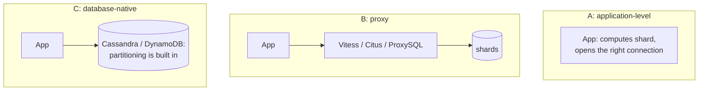
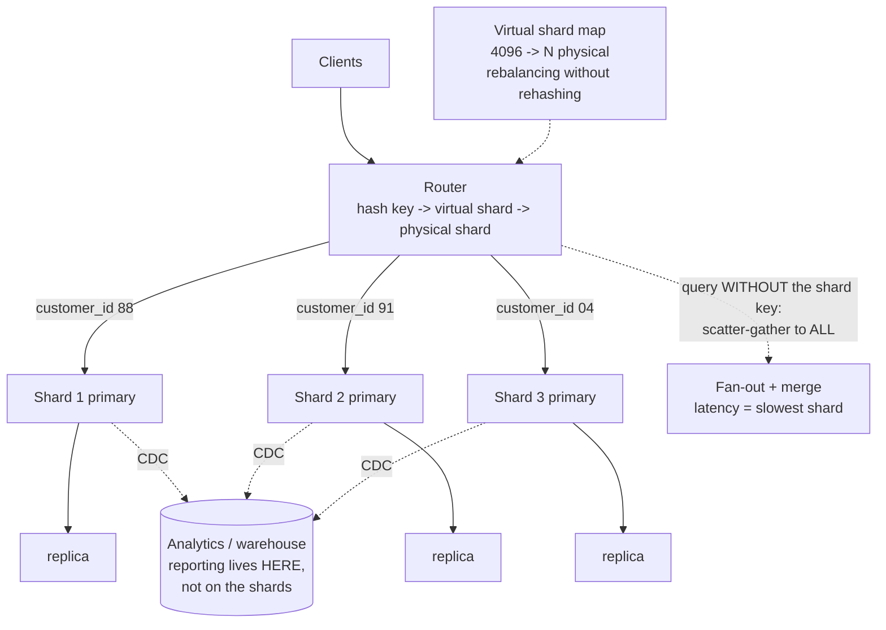
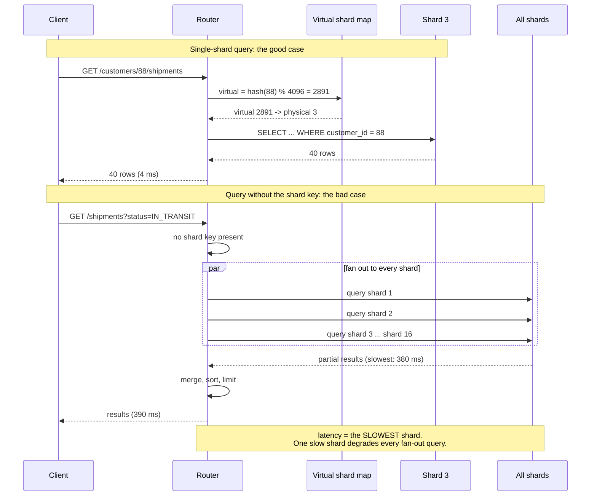

# Chapter 42: Sharding

## 42.1 Problem Statement

The tracking platform's primary is at its ceiling. Chapter 41's replicas absorb reads, but every replica applies every write, so the write rate is capped by one machine and that machine is at 85 percent of its I/O budget during peak. The database is 14 terabytes. Vacuum cannot keep up. An index rebuild takes eleven hours.

The decision to shard is made. Six months later, here is what the platform looks like.

**Shipments are sharded by `depot_id`,** because that was the natural grouping and most queries filtered on it. Depot LHR is 31 percent of all volume. That shard is at 92 percent utilisation while four others sit at 12 percent, and nothing can be done about it without re-sharding.

**A customer's shipments span nine shards,** because customers ship from many depots, so "show me my shipments" fans out to every shard, waits for the slowest, and is now the slowest endpoint in the product.

**Tracking codes are no longer unique.** The uniqueness constraint was per-table, and there are now sixteen tables on sixteen machines. Two shards issued the same code, and the collision was found by a customer.

**Reporting broke entirely.** `SELECT count(*) FROM shipments GROUP BY status` used to be one query. It is now sixteen queries plus a merge, written by hand, in every place a report exists.

**And a transaction that moves a shipment between depots** now spans two shards, with no mechanism to make it atomic. The team wrote one, badly, and it loses shipments about once a week.

Every one of these was decided by a single choice made in week one: **the shard key.**

## 42.2 Why This Problem Exists

**Replication scales reads. Only splitting the data scales writes.** Every replica does all the write work, so the ceiling is one node's capacity no matter how many nodes you add. Sharding is the only way past it and it is a much larger change.

**The shard key is chosen early and is effectively permanent.** It determines placement for every row already written, so changing it means moving all the data while the system is live.

**Real data is skewed, and uniform assumptions fail.** Depots, customers, and sellers all follow power-law distributions. A key that looks balanced in a test dataset is 31 percent on one shard in production.

**Cross-shard operations lose the guarantees you took for granted.** Joins, transactions, unique constraints, aggregates, and foreign keys are all single-machine features. Splitting the data removes them, and nothing warns you at the moment of splitting.

**And query patterns evolve.** A shard key optimal for the queries you had is wrong for the ones you add, and the second access pattern is what produces the nine-shard fan-out.

## 42.3 Real World Analogy

Splitting one library into sixteen branch libraries.

**Why split at all?** One building cannot hold the books, and there is only so much shelving space and so many staff. Sixteen buildings hold sixteen times the books and serve sixteen times the visitors.

**How do you decide which book goes where?** That is the shard key, and it is the only decision that matters. By author surname, by subject, by publication year.

**Split by subject and the computing section is a third of the collection.** One branch is overwhelmed, others are half empty, and rebalancing means physically moving a hundred thousand books.

**A visitor wanting one specific book goes to one branch if the key matches how they search.** A visitor wanting "everything by this author" visits all sixteen if you split by subject, and waits for the slowest.

**"How many books do we have in total" was a glance at one catalogue.** It is now sixteen phone calls and some arithmetic.

**And "this book is unique in our collection" is no longer checkable** without asking every branch, because each branch only knows its own shelves.

**Adding a seventeenth branch** means deciding what moves, moving it, and keeping everything findable while it is in transit.

## 42.4 Simple Explanation

**Sharding splits your data across many databases so each holds a fraction of it, and each accepts writes for its fraction.**

The distinction from Chapter 41 in one picture:

```
REPLICATION: every node has ALL the data
  primary [A B C D]  ->  replica [A B C D]  ->  replica [A B C D]
  Scales READS. Write ceiling is one node's.

SHARDING: every node has SOME of the data
  shard 1 [A B]    shard 2 [C D]    shard 3 [E F]
  Scales WRITES and STORAGE. Each shard is independent.

REAL SYSTEMS DO BOTH:
  shard 1 primary [A B] + its replicas
  shard 2 primary [C D] + its replicas
```

**The shard key is the column whose value decides which shard a row lives on.** Everything follows from it:

```
shard = f(shard_key)

Query includes the shard key       -> ONE shard. Fast. This is the goal.
Query does not include it          -> ALL shards. Scatter-gather. Slow.
Transaction spans two shard keys   -> distributed transaction. Painful.
Uniqueness across shard keys       -> not enforceable locally.
```

**The one rule that governs everything:**

> **Choose the shard key so that your most important query, and your transactions, stay inside one shard.**

Sharding is a last resort, and the honest checklist before it:

| Try first | Because |
|---|---|
| Index and query tuning (Ch 39, 40) | Frequently recovers 5 to 10 times the capacity |
| Read replicas (Ch 41) | Removes read load entirely, no data model change |
| Caching (Ch 33) | A 95 percent hit ratio is a twentyfold reduction |
| Vertical scaling (Ch 22) | A larger machine is cheap next to a sharding project |
| Archiving cold data | Often shrinks the working set by most of it |
| Splitting by service | Separate databases per bounded context, no shard key needed |

**Shard when one machine cannot hold the write rate or the data volume,** and not before. Every other problem has a cheaper answer.

## 42.5 Technical Deep Dive

### 42.5.1 Choosing the shard key

The most consequential and most irreversible decision in the system. Four criteria, and a key must satisfy all four.

| Criterion | Test | Failure |
|---|---|---|
| **High cardinality** | Are there far more distinct values than shards? | Few values means shards you cannot subdivide |
| **Uniform distribution** | Is any single value a large share of traffic? | Hot shard, Section 42.1's first incident |
| **Present in hot queries** | Does your main query filter on it? | Scatter-gather on everything |
| **Aligns with transactions** | Do atomic operations stay within one value? | Distributed transactions |

Applied to the tracking platform:

| Candidate | Cardinality | Uniform | In queries | Transactions | Verdict |
|---|---|---|---|---|---|
| `depot_id` | ~200 | **No, LHR is 31 percent** | Yes | Depot-local yes | **Chosen. Wrong** |
| `status` | 6 | No | Yes | No | Hopeless |
| `created_at` | High | No, today is all writes | Sometimes | No | Hot shard on "now" |
| `customer_id` | Millions | Mostly | Yes, for the main query | Customer-scoped yes | **Correct choice** |
| `hash(shipment_id)` | Very high | **Perfectly** | Only by ID | Single-shipment only | Best balance, worst locality |

**`customer_id` was the right answer** and the team chose `depot_id` because it matched the query they were looking at that week. The customer view is the product's main screen; depot views are internal dashboards. Sharding for the internal tool made the customer experience a nine-shard fan-out.

**The general principle: shard by the entity that owns the access pattern and the transaction boundary.** For most consumer products that is the user or account. Notice this is the same reasoning as Chapter 38's partition key, because it is the same problem.

**Time as a shard key deserves a specific warning.** It looks attractive for append-heavy data and it creates a shard that receives 100 percent of writes while the others are read-only archives. Time works as a *secondary* dimension, combined with something else, which is Chapter 43's composite partitioning.

### 42.5.2 Range, hash, and directory

```
RANGE sharding: contiguous key ranges per shard

  shard 1: customer_id      1 to 1,000,000
  shard 2: customer_id 1,000,001 to 2,000,000

  + Range queries stay on one shard
  + Rebalancing is a range split
  - Sequential keys make the newest shard take every write
```

```
HASH sharding: hash(key) decides the shard

  shard = hash(customer_id) % 16

  + Excellent distribution, no hot spots from sequential keys
  - Range queries hit every shard
  - Changing the shard count remaps almost everything (Ch 50)
```

```
DIRECTORY sharding: a lookup service holds the mapping

  customer 88  -> shard 3
  customer 91  -> shard 7

  + Total flexibility; move any key individually
  + Can special-case a huge tenant onto its own shard
  - The directory is a dependency on every request, and a SPOF
```

**`% shard_count` is the trap.** Growing from 16 shards to 17 remaps roughly 94 percent of all keys, which means moving nearly your whole dataset. Two standard fixes:

**Consistent hashing** (Chapter 50) moves only 1/N of keys when adding a shard.

**Virtual shards**, which is simpler and what most systems should do:

```
Hash into a large fixed number of VIRTUAL shards (say 4096).
Map virtual shards to physical shards in a small table.

  hash(customer_id) % 4096  ->  virtual shard 2891
  virtual shard 2891        ->  physical shard 7

Adding a physical shard = reassigning some virtual shards.
The hash function never changes, so keys never move
except when you deliberately move a virtual shard.
```

**4096 virtual shards is a number worth remembering.** It costs almost nothing and it makes rebalancing a data-movement problem rather than a re-hashing problem. Vitess, Citus, and Elasticsearch all use this shape.

### 42.5.3 What stops working

The part teams underestimate. Every guarantee in this list is free on one machine and gone on sixteen.

**Cross-shard joins.** There is no join across machines.

```sql
-- Was one query. Now: fetch customers on shard A, extract the IDs,
-- query each relevant shard for shipments, merge in application code.
SELECT c.name, s.tracking_code
FROM customers c JOIN shipments s ON s.customer_id = c.id
WHERE c.region = 'UK';
```

The mitigations: shard both tables by the same key so related rows co-locate, or replicate small reference tables to every shard.

```sql
-- Reference tables are small and read constantly. Copy them everywhere.
-- Citus calls this a reference table; the pattern is universal.
SELECT create_reference_table('depots');
SELECT create_reference_table('carriers');

-- Co-locate the big ones on the same key, so joins stay local.
SELECT create_distributed_table('customers', 'customer_id');
SELECT create_distributed_table('shipments', 'customer_id');
```

**Global uniqueness.** Section 42.1's third incident. Each shard enforces its own constraint and knows nothing of the others.

| Approach | How | Trade-off |
|---|---|---|
| **UUIDv7 / ULID** | Random plus time-ordered, generated anywhere | 16 bytes, but no coordination at all |
| **Snowflake ID** | timestamp + machine ID + sequence, 64 bits | Needs unique machine IDs, and clock care |
| **Per-shard ranges** | Shard N issues IDs where `id % 16 == N` | Simple; the shard is embedded in the ID |
| **Central sequence service** | One service issues IDs | A dependency and a bottleneck |

```java
// UUIDv7: time-ordered so it indexes well, random so it never collides.
// The right default for sharded systems.
UUID id = UuidCreator.getTimeOrderedEpoch();
```

**Avoid database auto-increment entirely in a sharded system.** It is per-shard by definition.

**Cross-shard transactions.** Section 42.1's fifth incident. Two shards, no shared transaction manager, and the options are all unpleasant.

```
Two-phase commit: correct, and blocks if the coordinator dies
                  mid-protocol. Latency of the slowest participant.

Saga (Ch 59):     a sequence of local transactions plus compensating
                  actions. No atomicity, eventual consistency, and
                  compensation logic you must write and test.

Avoid it:         design the shard key so the transaction is local.
                  The only answer that is actually good.
```

**Aggregates and reporting.** Section 42.1's fourth incident. Every aggregate becomes scatter-gather plus a merge.

```java
// Fan out, wait for all, merge. Latency is the SLOWEST shard's.
Map<Status, Long> counts = shards.parallelStream()
    .map(shard -> shard.countByStatus())          // one query per shard
    .flatMap(m -> m.entrySet().stream())
    .collect(groupingBy(Map.Entry::getKey, summingLong(Map.Entry::getValue)));
```

`ORDER BY ... LIMIT 20` across shards requires fetching 20 from each shard, merging, and discarding the rest. Deep pagination across shards is genuinely hard and usually should be redesigned rather than solved.

**The real answer for reporting is not to do it on the shards at all.** Stream changes to a warehouse or a single analytics replica (Chapter 57's CQRS), and leave the shards serving transactional traffic.

### 42.5.4 Hot shards

Section 42.1's first incident, and the most common sharding failure in production.

```
Expected                          Reality
shard 1: 6.25 percent             shard 1 (LHR): 31 percent   <- saturated
shard 2: 6.25 percent             shard 2:        3 percent
...                               ...
shard 16: 6.25 percent            shard 16:       2 percent

Capacity is bounded by the HOTTEST shard, not the average.
15 shards idle does not help the one that is on fire.
```

The mitigations, in order of preference:

**Pick a better key.** `customer_id` instead of `depot_id`. The only real fix, and only available before you commit.

**Add entropy to the key** for the known-hot values, accepting read fan-out:

```
shard_key = "DEPOT#LHR#" + (hash(shipment_id) % 20)
  -> spreads LHR across 20 buckets
  -> every LHR read now queries 20 buckets and merges
```

**Isolate the whale.** Directory sharding lets a single dominant tenant have its own shard, which is what most B2B SaaS platforms end up doing.

**Split the hot shard** into two, if the key has enough cardinality inside it.

**Detect it early:**

```sql
-- Run per shard. The distribution should be checked with real data
-- before committing to a key, and monitored continuously after.
SELECT shard_id, count(*) AS rows,
       pg_size_pretty(pg_total_relation_size('shipments')) AS size,
       round(100.0 * count(*) / sum(count(*)) OVER (), 2) AS pct
FROM shipments GROUP BY shard_id ORDER BY pct DESC;
```

**Test the shard key against a production distribution before committing.** Section 42.1's whole story is a key validated against synthetic data.

### 42.5.5 Resharding without downtime

Eventually you need more shards, or you chose the key wrongly and must change it. Both are the same procedure and it is a project, not a task.

```
1. DUAL WRITE      write to both old and new layouts. Reads still old.
2. BACKFILL        copy historical data to the new layout, in batches,
                   throttled so it does not affect production.
3. VERIFY          compare row counts and checksums per key range.
                   Do not proceed until this is clean.
4. SHADOW READ     read from both, compare, log mismatches. Serve the old.
5. CUT OVER        flip reads to the new layout, one percentage at a time.
6. STOP DUAL WRITE after a soak period long enough to be confident.
7. DROP OLD        only after you would not need to roll back.
```

Every step is reversible until step 7, which is the point of doing it this way. The steps people skip are 3 and 4, and they are the ones that catch the bugs.

**Virtual shards make this dramatically easier.** Moving virtual shard 2891 from physical shard 7 to physical shard 9 is a bounded data move affecting a known subset of keys, and it can be done one virtual shard at a time with a brief write pause per virtual shard rather than a global migration.

### 42.5.6 Where the routing logic lives



| Approach | Examples | Gain | Cost |
|---|---|---|---|
| **Application-level** | Custom routing code | Full control, no extra hop | Every service reimplements it; migrations are yours |
| **Proxy** | Vitess, Citus, ProxySQL | Application sees one database; handles resharding | Another tier to operate; not all SQL supported |
| **Native** | Cassandra, DynamoDB, MongoDB | Nothing to build | The database's model, not yours (Chapter 38) |

```java
// Application-level routing. Note the explicit failure on a missing key:
// silently scattering is how a fan-out query reaches production unnoticed.
@Component
public class ShardRouter {

    private static final int VIRTUAL_SHARDS = 4096;
    private final Map<Integer, DataSource> physicalShards;
    private final VirtualShardMap virtualToPhysical;   // small, cached, versioned

    public DataSource forCustomer(long customerId) {
        int virtual = Math.floorMod(Hashing.murmur3_32()
            .hashLong(customerId).asInt(), VIRTUAL_SHARDS);
        return physicalShards.get(virtualToPhysical.physicalFor(virtual));
    }

    public DataSource forQuery(ShardedQuery q) {
        if (!q.hasShardKey()) {
            // Make scatter-gather a deliberate, visible decision.
            throw new MissingShardKeyException(
                "Query would fan out to all shards: " + q.description());
        }
        return forCustomer(q.shardKey());
    }
}
```

That exception is the single most valuable line in the class. **A query without a shard key should be an explicit opt-in**, not a silent fan-out that someone discovers during an incident.

## 42.6 Architecture Diagram



```
  clients
     |
   router:  hash(customer_id) % 4096 -> virtual shard -> physical shard
     |
  +--+-------------+-------------+
  |               |             |
 shard 1        shard 2       shard 3      each is a full primary
  + replicas     + replicas    + replicas  with its own replication (Ch 41)
  |               |             |
  +-------+-------+-------------+
          | CDC
          v
    analytics / warehouse       <- reporting and aggregates live here,
                                   NOT as scatter-gather on the shards

  Query WITH the shard key    -> one shard. Fast.
  Query WITHOUT it            -> all shards, merge, wait for the slowest.
```

## 42.7 Request Flow



1. **The router hashes the shard key into a virtual shard,** then looks up the physical one.
2. **The virtual layer is what makes rebalancing possible** without changing the hash function.
3. **A query carrying the shard key touches one machine** and behaves like an unsharded system.
4. **A query without it fans out to all,** and the latency is the slowest shard's, not the average.
5. **Results are merged in the router,** which is where sorting and limiting across shards becomes expensive.

## 42.8 Internal Components

| Component | Role | Failure mode | Guard |
|---|---|---|---|
| Shard key | Decides placement for every row | Low cardinality or skew, so a hot shard | Validate against a real production distribution |
| Hash function | Maps key to shard | `% shard_count` remaps everything on growth | Virtual shards, or consistent hashing |
| Virtual shard map | Indirection enabling rebalancing | Stale in a client, so misrouting | Versioned, cached with a short TTL |
| Router | Directs queries | Silently scatters when the key is absent | Throw unless fan-out is explicit |
| Per-shard replication | Availability within a shard | Forgotten, so each shard is a SPOF | Chapter 41 applies per shard |
| Global ID generation | Uniqueness across shards | Per-shard auto-increment collides | UUIDv7, Snowflake, or per-shard ranges |
| Reference tables | Small tables joined everywhere | Not replicated, so joins go cross-shard | Copy to every shard |
| Scatter-gather executor | Fan-out queries | Latency is the slowest shard's; no timeout | Per-shard timeouts, partial results where acceptable |
| Cross-shard transactions | Atomicity across shards | Hand-rolled and lossy | Design them away; otherwise a saga (Chapter 59) |
| Rebalancing pipeline | Moving data between shards | No verification step, so silent loss | Dual-write, backfill, verify, shadow read, cut over |
| Analytics path | Reporting | Scatter-gather aggregates on production shards | CDC to a warehouse |

## 42.9 Production Example

**YouTube's Vitess** is the reference implementation of Section 42.5.6's proxy approach. It presents a sharded MySQL fleet as a single database, handles routing, scatter-gather, and online resharding, and is now used by Slack, GitHub, and Shopify among others. Its keyspace-and-vindex model is Section 42.5.2's virtual shards done thoroughly.

**Instagram sharded PostgreSQL by user ID** into thousands of logical shards mapped onto a smaller number of physical machines, exactly the virtual shard pattern. Their ID scheme embeds the shard ID plus a timestamp plus a sequence in 64 bits, which is Snowflake's shape, and it means an ID alone tells you where its row lives.

**Notion's re-sharding project** is unusually well documented and is Section 42.5.5 in practice: dual writes, backfill, verification, and a staged cutover, taking months. Worth reading precisely because it shows the cost of the operation people imagine is a configuration change.

**Discord shards by channel or guild,** which aligns with the access pattern almost perfectly, since nearly every query is scoped to one guild. That is Section 42.5.1's principle applied correctly, and it is why their fan-out problems are rare.

**And the counter-example matters.** Stack Overflow serves enormous traffic from a small number of unsharded SQL Server instances. Shopify sharded by shop only after exhausting vertical scaling and caching. The published record supports sharding as a late-stage answer, not an architectural default.

## 42.10 Advantages

- **The only way to scale writes past one machine.** Nothing else does this.
- **Storage scales linearly.** Sixteen shards hold sixteen times the data.
- **Smaller working sets per shard,** so indexes fit in memory and vacuum and rebuilds are tractable again.
- **Fault isolation.** One shard down affects that fraction of users, not everyone.
- **Geographic placement,** with a shard near the users it serves.
- **Per-tenant isolation** is possible with directory sharding, which large customers often require contractually.
- **Maintenance becomes incremental,** performed one shard at a time.

## 42.11 Limitations

- **The shard key is effectively permanent,** and changing it is a months-long project.
- **Cross-shard joins do not exist,** and application-side joins are slow and error-prone.
- **Cross-shard transactions have no good answer.**
- **Global uniqueness must be engineered,** because constraints are per-shard.
- **Aggregates become scatter-gather,** with latency bounded by the slowest shard.
- **Skew caps capacity at the hottest shard,** regardless of the average.
- **Operational cost multiplies:** N primaries, N sets of replicas, N backups, N failover procedures.
- **Deep pagination across shards is close to intractable** and usually needs redesign.

## 42.12 Trade-offs

| Choice | Gain | Cost | Remove it and |
|---|---|---|---|
| Shard at all | Write and storage scaling past one machine | Joins, transactions, constraints, aggregates | A hard write ceiling |
| Hash sharding | Even distribution, no sequential hot spots | Range queries hit every shard | Range sharding, and its hot spots |
| Range sharding | Range queries stay local, easy splits | Sequential keys concentrate writes on one shard | Hash, and scattered ranges |
| Directory sharding | Move any key; isolate a whale | A lookup on every request, and a SPOF | Fixed placement, no per-tenant control |
| Virtual shards | Rebalance without rehashing | One more indirection | Growing shard count remaps everything |
| Co-locating tables on one key | Local joins and transactions | The key must suit all co-located tables | Cross-shard joins in application code |
| Replicating reference tables | Local joins to small tables | Writes go everywhere; must stay small | Cross-shard lookups on every query |
| CDC to a warehouse | Reporting off the shards entirely | Pipeline to run, and staleness | Scatter-gather aggregates on production |

The trade at the centre: **sharding buys write throughput by giving up the single-machine guarantees that made your application simple.** Every one of those guarantees now has to be re-implemented, worse, in your code. That is why it is the last resort rather than the default.

## 42.13 Common Mistakes

- **Sharding too early,** before indexing, caching, replicas, and vertical scaling have been exhausted.
- **Choosing the shard key from this week's query** rather than the product's main access pattern.
- **Validating the key against synthetic data,** which never has production's skew.
- **`hash(key) % shard_count`,** which makes adding a shard a full data migration.
- **Auto-increment IDs,** which collide across shards.
- **Silent scatter-gather.** A missing shard key should raise an error, not fan out.
- **Forgetting per-shard replication,** leaving each shard a single point of failure.
- **Reporting on the shards** instead of moving it to a warehouse.
- **Hand-rolled cross-shard transactions,** which lose data in ways that are hard to detect.
- **No verification step during resharding,** so silent data loss is found later.
- **Time as the shard key,** guaranteeing one shard receives all writes.
- **Alerting on average shard utilisation,** when capacity is bounded by the maximum.

## 42.14 Interview Questions

1. What does sharding solve that replication cannot?
2. Walk through choosing a shard key for a ride-sharing app. What criteria, and what would you reject?
3. Why is `hash(key) % N` a problem, and what are the two standard fixes?
4. What stops working once data is sharded? List as many as you can.
5. Explain a hot shard: how it arises, how to detect it, and three mitigations with their costs.
6. How do you generate globally unique IDs across shards? Compare approaches.
7. How would you reshard a live system with no downtime?
8. Why does a scatter-gather query have the latency of the slowest shard?
9. How do you handle a transaction spanning two shards?
10. Should you shard? What would you try first, and in what order?

## 42.15 Production Best Practices

- **Exhaust the alternatives first,** in order: indexes, caching, replicas, vertical scaling, archiving, service splits.
- **Choose the shard key from the dominant access pattern and the transaction boundary,** usually the user or tenant.
- **Validate the key against a real production distribution** before committing anything.
- **Use several thousand virtual shards** mapped to physical ones, from day one.
- **Generate IDs with UUIDv7 or Snowflake.** Never per-shard auto-increment.
- **Make a missing shard key throw.** Scatter-gather must be an explicit opt-in.
- **Co-locate related tables on the same key,** and replicate small reference tables to every shard.
- **Move reporting off the shards** via CDC to a warehouse.
- **Replicate every shard.** Chapter 41 applies per shard, and per-shard failover must be tested.
- **Monitor per-shard size, write rate, and latency, and alert on the maximum,** not the average.
- **Set per-shard timeouts on fan-out queries** and decide explicitly whether partial results are acceptable.
- **Rehearse resharding on a small virtual shard** before you need it urgently.

## 42.16 Summary

Sharding is the only way to scale writes past a single machine, and it is the most expensive architectural change in this book. Replication gives every node all the data, so reads scale and writes do not. Sharding gives every node some of the data, so writes and storage scale, and everything that depended on the data being in one place stops working.

That last clause is the whole cost. Joins, transactions, unique constraints, foreign keys, and aggregates are single-machine features. Splitting the data removes all of them silently, at the moment of splitting, with nothing to warn you. Each one then has to be rebuilt in application code, where it will be slower and less correct than the version the database was giving you for free.

**Everything is determined by the shard key**, and the key is effectively permanent because it decides the physical location of every row already written. It must have high cardinality, distribute uniformly against your real data, appear in your most important queries, and align with your transaction boundaries. Section 42.1's platform failed the second and fourth criteria by choosing `depot_id` for an internal dashboard when `customer_id` matched the product's main screen, and every subsequent problem traces back to that week.

The mechanical advice is short and it matters. Hash into several thousand virtual shards and map those to physical ones, so growing the cluster is a data move rather than a rehash. Generate identifiers that are unique without coordination. Make a query without a shard key raise an error rather than quietly fanning out. Co-locate related tables, replicate the small reference tables everywhere, and move reporting off the shards entirely via change data capture, because scatter-gather aggregates on production shards is a design that gets slower every time you add a shard.

And the strategic advice is shorter. **Shard last.** Indexes, caching, read replicas, a bigger machine, archiving cold data, and splitting by service are all cheaper, all reversible, and all frequently sufficient. The systems that shard well are the ones that arrived at it having genuinely run out of alternatives, because by then they knew their access patterns well enough to pick the key correctly.

## 42.17 Quick Revision Notes

- **Replication = all data on every node, scales reads. Sharding = some data per node, scales writes and storage.**
- **The shard key decides everything** and is effectively permanent.
- **Four criteria:** high cardinality, uniform on real data, present in hot queries, aligned with transactions.
- **Usually shard by user or tenant,** not by an internal grouping.
- **Never shard by time alone.** One shard takes every write.
- **Range** keeps ranges local but concentrates sequential writes. **Hash** distributes but scatters ranges. **Directory** is flexible with a lookup dependency.
- **Never `% shard_count`.** Use ~4096 virtual shards, or consistent hashing (Chapter 50).
- **Lost on sharding:** joins, transactions, unique constraints, foreign keys, aggregates, deep pagination.
- **Global IDs:** UUIDv7 or Snowflake. Never per-shard auto-increment.
- **Hot shard caps capacity at the busiest shard.** Alert on the maximum, not the average.
- **Scatter-gather latency is the slowest shard's.** Make it an explicit opt-in.
- **Reporting goes to a warehouse via CDC,** not to the shards.
- **Resharding:** dual write, backfill, verify, shadow read, cut over, stop dual write, drop old.
- **Shard last.** Try everything else first.

## 42.18 Mini Quiz

1. Why does adding read replicas not help a write-bound database?
2. What makes a shard key good, and why is `depot_id` bad here despite matching the queries?
3. Why does `hash(key) % 16` become a problem when you add a seventeenth shard?
4. Why is a scatter-gather query's latency the slowest shard's rather than the average?
5. How do you get globally unique identifiers without a central coordinator?
6. Why is a hot shard so damaging even when average utilisation is low?
7. What would you try before sharding, and in what order?

**Answers**

1. Because every replica must apply every write to stay a faithful copy, so the write work is duplicated across nodes rather than divided among them. Adding a replica adds read capacity and redundancy and actually adds a little load to the primary in shipping the stream, but it does nothing to reduce the writes the primary itself must process. The write ceiling therefore stays at one machine's capacity no matter how many replicas exist, and raising it requires different machines to own different writes, which means splitting the data by a key.

2. A good key has high cardinality so it can be subdivided, distributes uniformly against real production data so no shard is hot, appears in the dominant queries so those stay single-shard, and contains the transaction boundaries so atomic operations stay local. `depot_id` fails the second criterion badly, since one depot is 31 percent of volume and permanently saturates its shard, and it fails the third for the query that matters most, since customers ship from many depots so the customer view fans out to every shard. It matched the internal depot dashboard, which is not the product's main access pattern, and choosing for the wrong query is what made everything else follow.

3. Because the modulo changes for almost every key. A key that hashed to 5 under modulo 16 hashes to something unrelated under modulo 17, and the fraction of keys whose assignment happens to be unchanged is small, roughly one in seventeen. That means about 94 percent of all rows must physically move to a different machine before the new shard count is usable, which is a full data migration rather than a capacity addition. The fixes are consistent hashing, which moves only about 1/N of keys, or hashing into a large fixed number of virtual shards and remapping some of those to the new physical shard, which keeps the hash function constant forever and turns growth into a bounded data move.

4. Because the query is not complete until every shard has responded, so the total time is determined by whichever shard finishes last. Averages are irrelevant: fifteen shards responding in 4 milliseconds and one responding in 380 gives a 380 millisecond query. This makes fan-out queries extremely sensitive to a single degraded shard, since one slow node degrades every scatter-gather query in the system rather than a sixteenth of them, and it gets worse as shard count grows because the chance that at least one shard is having a bad moment increases. The mitigations are per-shard timeouts with explicitly accepted partial results, and designing the access pattern so that fan-out is rare.

5. Generate them so that collision is impossible by construction rather than prevented by coordination. UUIDv7 combines a timestamp prefix with random bits, so it is unique without any coordination and still sorts roughly by creation time, which matters because purely random UUIDs index badly in a B-tree. Snowflake identifiers pack a timestamp, a machine identifier, and a per-machine sequence into 64 bits, which is more compact and additionally tells you where and when the row was created, at the cost of needing unique machine identifiers and careful handling of clock adjustments. Per-shard ranges, where shard N only issues identifiers congruent to N, also work and embed the shard in the identifier. What does not work is database auto-increment, which is per-table and therefore per-shard by definition.

6. Because system capacity is bounded by the busiest shard, not by the mean. Once one shard is saturated, requests for the keys it owns are slow or failing regardless of how idle the other fifteen are, and the idle capacity cannot be borrowed because the data lives where the shard key put it. A dashboard reporting average utilisation at 12 percent while one shard is at 92 percent tells you nothing useful, which is why the alert must be on the maximum. And the problem is difficult to fix after the fact, since the shard key is already embedded in the physical placement of every row written so far.

7. Query and index tuning first, since Chapters 39 and 40 routinely recover several times the apparent capacity for a fraction of the effort and with no architectural change. Then caching, because a 95 percent hit ratio removes twenty times the read load. Then read replicas, which offload reads entirely without touching the data model. Then vertical scaling, since a larger machine costs far less than a sharding project and modern hardware goes remarkably far. Then archiving cold data, which frequently shrinks the working set by most of its volume. Then splitting by service, giving each bounded context its own database, which achieves separation without a shard key at all. Sharding comes after all of those have genuinely been exhausted, and arriving there late is an advantage, because by then you know your access patterns well enough to choose the key correctly.

## 42.19 Hands-on Exercise

**Part 1: measure your skew.** Take a real production table and compute the row and traffic distribution for three candidate shard keys. Find the largest single value's share for each. This one exercise would have prevented Section 42.1.

**Part 2: build a two-shard system.** Route by `customer_id` in application code. Implement one single-shard query and one fan-out query and compare latencies at p50 and p99.

**Part 3: feel the modulo problem.** Assign 100,000 keys with `% 4`, then with `% 5`, and count how many changed shard. Repeat with 4096 virtual shards mapped to 4 then 5 physical shards.

**Part 4: create a hot shard.** Load using a realistically skewed key. Drive traffic and record per-shard utilisation. Add entropy to the hot key and measure both the improvement and the added read fan-out.

**Part 5: break uniqueness.** Use auto-increment on two shards and produce a collision. Switch to UUIDv7 and confirm it cannot happen.

**Part 6: cross-shard transaction.** Implement a transfer between two shards naively, then kill the process between the two writes. Observe the inconsistency. Implement it as a saga with compensation and repeat.

**Part 7: reshard live.** Take the two-shard system to three using the full seven-step procedure. Run continuous writes throughout, and verify zero loss and zero downtime at the end.

## 42.20 Further Reading

- *Designing Data-Intensive Applications*, Martin Kleppmann, chapter 6, on partitioning and rebalancing.
- Vitess's documentation, particularly on vindexes and resharding, as the most thorough public treatment.
- Instagram's engineering posts on sharding PostgreSQL and their ID scheme.
- Notion's write-up of their sharding and re-sharding projects, for the honest operational cost.
- Citus's documentation on distributed tables, co-location, and reference tables.
- *Consistent Hashing and Random Trees*, Karger et al., 1997, and Chapter 50 of this book.
- Chapter 41 for replication, which every shard still needs, Chapter 43 for partitioning within a node, Chapter 52 for distributed transactions, Chapter 59 for sagas, and Chapter 57 for moving reporting off the shards.

---

**Next chapter: Chapter 43, Partitioning.** The same idea applied inside one database rather than across machines: why splitting a table into pieces makes maintenance possible again, how partition pruning turns a full scan into a small one, and the difference between this and sharding that people constantly conflate.
