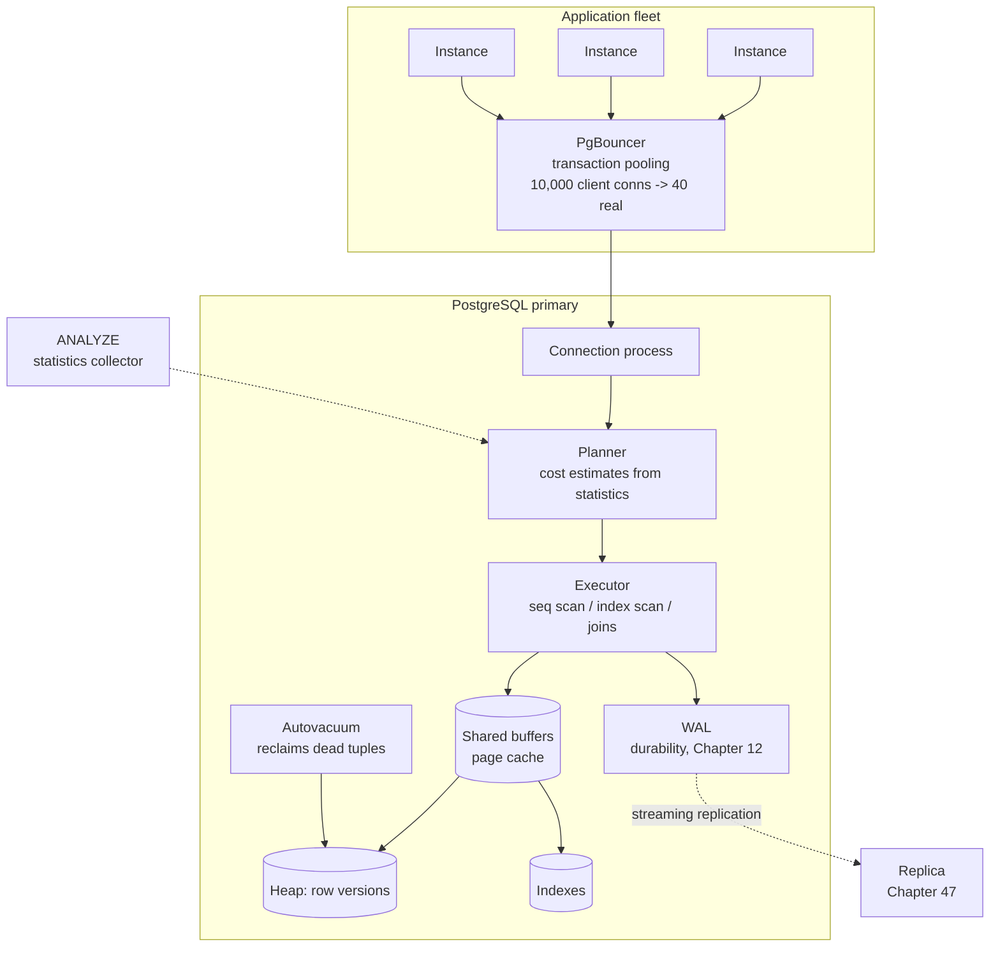

# Chapter 37: SQL

## 37.1 Problem Statement

The tracking platform's PostgreSQL has been the boring part of the system for three years. It is now the reason for four separate incidents in one quarter, and the pattern connecting them is not obvious until you see all four.

**A report query that ran in 200 milliseconds for two years now takes 90 seconds.** Nothing changed. No deploy, no schema change, no new index. The table grew past a threshold where the planner's cost estimate flipped from an index scan to a sequential scan, and the estimate was based on statistics that had gone stale.

**Two shipments were assigned the same tracking slot.** The code reads the slot, checks it is free, and writes. Under `READ COMMITTED`, which is the default, two transactions can both read "free" and both write. The developer assumed a transaction meant serialised execution. It does not, and the isolation level is the thing nobody chose.

**The database ran out of connections during a traffic spike.** Two hundred application instances with a pool of fifty each is ten thousand connections, against a `max_connections` of five hundred. Every instance was individually reasonable.

**And a migration adding one nullable column locked the shipments table for eleven minutes** in the middle of the day, because the statement had to wait behind a long-running report query, and while it waited it held a lock queue that blocked every write behind it.

Four incidents, one theme: **the relational database is doing exactly what it was told, and nobody knew what they were telling it.** SQL is unusual among the technologies in this book in that you can be productive with it for years without ever meeting the machinery underneath, and the machinery is what determines whether your system works at scale.

## 37.2 Why This Problem Exists

**SQL is declarative, which is its great strength and the source of every surprise.** You say what you want, not how to get it, and a cost-based planner decides how. That means the same query can have wildly different performance depending on data volume, statistics, and configuration, with no change to your code.

**The defaults are chosen for compatibility, not for your workload.** `READ COMMITTED` isolation, a modest `max_connections`, autovacuum settings tuned for a smaller era. Every one is a decision you inherit by not making it.

**Transactions do not mean what people assume.** Chapter 16 covered ACID as a set of properties. The gap here is that the "I" is a dial with several positions, and the default position permits anomalies that most developers do not know exist.

**The relational model is optimised for a shape of problem** that most applications genuinely have, and its cost structure only becomes visible when your data outgrows single-machine assumptions. Chapters 41 to 43 deal with that.

**And connections are expensive in a way that is invisible from the application side.** Each PostgreSQL connection is an operating system process with its own memory. A pool setting that seems obviously safe per instance is catastrophic multiplied by a fleet.

## 37.3 Real World Analogy

A very good research librarian.

You do not tell the librarian which shelf to walk to. You say "everything published by this author after 1990, cross-referenced with what our branch actually holds", and they work out the route.

**They work from a catalogue, not by walking the shelves.** That is an index. Without it, finding one book means checking every book, which is fine in a small room and hopeless in a warehouse.

**They estimate before they start.** If they believe your query matches three books, they use the catalogue. If they believe it matches most of the collection, they walk the aisles instead, because consulting the catalogue three thousand times is slower than one pass. That estimate is a cost model, and it is exactly right until the estimate is wrong.

**The catalogue can be out of date.** If it says a section holds fifty books and it now holds five million, the librarian makes a confident, disastrous choice. That is stale statistics, and it is Section 37.1's first incident precisely.

**Two people cannot check out the same copy.** The rules preventing that are locking, and the strictness of the rules is adjustable. The loosest useful setting lets two people each confirm the book is available a moment before both claim it.

**And there are only so many librarians.** Everyone in the queue is waiting on a small, fixed number of people, and hiring more is expensive because each one needs a desk.

## 37.4 Simple Explanation

**A relational database stores data as tables of rows, guarantees a set of properties about how those rows change, and lets you ask questions declaratively.**

Three ideas do most of the work.

**The relational model.** Data is normalised into tables, and relationships are expressed by keys rather than by nesting. One shipment row, one customer row, and a foreign key connecting them. The value: **each fact is stored once**, so changing a customer's name is one update rather than a search for every embedded copy. That is the property NoSQL trades away in Chapter 38, and the reason to understand what you are trading.

**Declarative querying.** You describe the result, not the procedure:

```sql
-- What you want. Not how to get it.
SELECT c.name, count(*) AS shipments
FROM   customers c
JOIN   shipments s ON s.customer_id = c.id
WHERE  s.created_at >= now() - interval '30 days'
GROUP  BY c.name
HAVING count(*) > 10;
```

The planner decides the join order, the join algorithm, whether to use an index, and whether to parallelise. It is usually right, and when it is wrong the fix is almost never to rewrite the query.

**Transactions.** A group of statements that either all take effect or none do, with defined behaviour when several run at once. Chapter 16 covered ACID; this chapter covers how a real database delivers it and where the guarantees are weaker than they sound.

The one-line summary of when to reach for SQL:

```
Use a relational database when your data has relationships,
your access patterns will change, and you need correctness
guarantees you do not want to implement yourself.

Which is most systems, most of the time, including many
that reached for something else.
```

## 37.5 Technical Deep Dive

### 37.5.1 How a query actually executes

Five stages, and knowing them tells you where to look when something is slow.

```
SQL text
   |
 1. Parse        syntax -> a tree. Errors here are typos.
   |
 2. Rewrite      views expanded, rules applied.
   |
 3. Plan         THE INTERESTING PART. The planner enumerates
   |             strategies, estimates the cost of each using
   |             table statistics, and picks the cheapest.
   |
 4. Execute      the chosen plan runs.
   |
 5. Return       rows to the client.
```

**Stage 3 is where performance is decided,** and it is estimate-driven rather than fact-driven. The planner does not know how many rows match your `WHERE` clause. It guesses, from statistics collected by a background process, and the guess drives everything downstream.

`EXPLAIN ANALYZE` shows both the estimate and the reality:

```sql
EXPLAIN (ANALYZE, BUFFERS)
SELECT * FROM shipments WHERE status = 'IN_TRANSIT' AND depot_id = 42;
```

```
Seq Scan on shipments  (cost=0.00..184320.00 rows=93 width=214)
                       (actual time=0.03..891.2 rows=1841203 loops=1)
  Filter: (status = 'IN_TRANSIT' AND depot_id = 42)
  Rows Removed by Filter: 6218797
                              ^^^^^^^
  estimated 93 rows, got 1,841,203.
  The plan was chosen for a 93-row result. It is wrong by 20,000x.
```

**The single most useful diagnostic skill with SQL is comparing `rows=` estimated against `rows=` actual.** When they are close, the plan is probably reasonable and the query is genuinely expensive. When they differ by orders of magnitude, the plan was chosen on bad information and the fix is statistics, not query rewriting.

Section 37.1's first incident is this exact signature. The fix:

```sql
ANALYZE shipments;                            -- refresh statistics now
ALTER TABLE shipments SET (autovacuum_analyze_scale_factor = 0.02);  -- more often
ALTER TABLE shipments ALTER COLUMN status SET STATISTICS 1000;       -- finer histogram
CREATE STATISTICS shipments_depot_status (dependencies)
  ON depot_id, status FROM shipments;         -- teach it these columns correlate
```

That last one matters more than people realise. The planner assumes columns are independent, so it estimates `P(status) x P(depot)`. When status and depot are correlated, and in real data they always are, the estimate is wrong by the correlation factor. Extended statistics tell it otherwise.

### 37.5.2 Join algorithms, and why the planner picks one

Three algorithms. The planner's choice depends almost entirely on estimated row counts, which is why bad statistics produce bad joins.

| Algorithm | How it works | Good when | Disaster when |
|---|---|---|---|
| **Nested loop** | For each row on the left, look up matches on the right | Left side is tiny, right side is indexed | Left side is actually large. O(n x m) |
| **Hash join** | Build a hash table of the smaller side, probe with the larger | Both sides sizeable, equality join | Hash table exceeds `work_mem` and spills to disk |
| **Merge join** | Sort both sides, walk them together | Both already sorted, or very large | Sorting cost dominates |

The classic production failure is a **nested loop chosen on a bad estimate**. The planner thinks the left side has 93 rows and picks nested loop, which is optimal for 93 rows. The left side actually has 1.8 million rows, so it performs 1.8 million index lookups, and a query that should take 200 milliseconds takes 90 seconds. Not because nested loop is bad, but because it was chosen for a different query than the one that ran.

`work_mem` is the other one worth knowing:

```
work_mem is per sort or hash operation, per connection.
A query with 4 hash joins and 100 connections can use
4 x 100 x work_mem. Set it too high and the machine
runs out of memory; too low and everything spills to disk.
```

### 37.5.3 Indexes: what they cost, and the ones people miss

Chapter 39 covers indexing properly. Three things belong here because they are SQL-level design decisions.

**An index is a copy of some columns, kept sorted, with a pointer back to the row.** It makes reads faster and writes slower, because every write must update every index on the table. A table with twelve indexes pays twelve times the write amplification, which is why "add an index" is not free advice.

**Column order in a composite index is the whole game.** An index on `(depot_id, status, created_at)` serves:

```sql
WHERE depot_id = 42                                       -- yes, leading column
WHERE depot_id = 42 AND status = 'IN_TRANSIT'             -- yes
WHERE depot_id = 42 AND status = 'X' AND created_at > ... -- yes, full use
WHERE status = 'IN_TRANSIT'                               -- NO. Skips the leading column
```

The rule: **equality columns first, then the range column, then anything you only want covered.** A range predicate stops the index being useful for columns after it.

**Covering indexes remove the table lookup entirely:**

```sql
-- The query can be answered from the index alone. No heap access.
CREATE INDEX idx_ship_lookup ON shipments (depot_id, status) INCLUDE (tracking_code, eta);
```

**Partial indexes are the most underused feature in PostgreSQL:**

```sql
-- 6 million shipments, 40,000 of them active. Index only those.
-- Smaller, faster, and cheaper to maintain on every write.
CREATE INDEX idx_active_shipments ON shipments (depot_id, created_at)
WHERE status IN ('PENDING', 'IN_TRANSIT');
```

When the interesting rows are a small fraction of the table, and they usually are, a partial index is a fraction of the size and cost.

### 37.5.4 Isolation levels: the dial nobody turns

This is Section 37.1's second incident, and it is the most consequential thing in this chapter.

Chapter 16 established that transactions are atomic and isolated. **Isolation is not binary.** It has levels, each permitting specific anomalies:

| Level | Dirty read | Non-repeatable read | Phantom read | Lost update |
|---|---|---|---|---|
| `READ UNCOMMITTED` | Possible | Possible | Possible | Possible |
| **`READ COMMITTED`** (default) | No | **Possible** | **Possible** | **Possible** |
| `REPEATABLE READ` | No | No | No (in PostgreSQL) | No |
| `SERIALIZABLE` | No | No | No | No |

The anomalies, in plain terms:

- **Non-repeatable read:** you read a row twice in one transaction and get different values, because someone committed in between.
- **Phantom read:** you run the same query twice and the second returns rows that were not there before.
- **Lost update:** you and another transaction both read a value, both compute a new one, and one of the updates vanishes.

**Section 37.1's double-assigned slot is a lost update,** and here is exactly how:

```sql
-- Both transactions run this, concurrently, under READ COMMITTED.
BEGIN;
SELECT slot_id FROM slots WHERE depot_id = 42 AND assigned = false LIMIT 1;
-- Both get slot 7. Neither blocks the other, because SELECT takes no lock.
UPDATE slots SET assigned = true, shipment_id = ? WHERE slot_id = 7;
COMMIT;
-- Both succeed. The second silently overwrites the first.
```

Three correct fixes, in increasing order of cost:

```sql
-- 1. Pessimistic lock. Take the row lock during the read.
--    Other transactions block until this one commits.
SELECT slot_id FROM slots
WHERE depot_id = 42 AND assigned = false
LIMIT 1
FOR UPDATE SKIP LOCKED;   -- SKIP LOCKED: take the next free one instead of waiting

-- 2. Optimistic: make the update itself carry the condition.
--    If it affects zero rows, someone beat you. Retry.
UPDATE slots SET assigned = true, shipment_id = ?
WHERE slot_id = 7 AND assigned = false;

-- 3. Let the database enforce it. A constraint cannot be raced.
ALTER TABLE slots ADD CONSTRAINT one_shipment_per_slot UNIQUE (slot_id);
```

**`FOR UPDATE SKIP LOCKED` is worth memorising.** It is how you build a work queue in SQL that many workers can drain concurrently without contention, and it is the answer to a surprisingly common interview question.

**And option 3 is the one to reach for first.** A constraint is checked by the database on every path, including the code you have not written yet and the migration script somebody runs by hand. Application-level checks are only enforced where somebody remembered them.

### 37.5.5 MVCC, and why your database has a vacuum problem

PostgreSQL implements isolation with Multi-Version Concurrency Control: **an update does not modify a row, it writes a new version and marks the old one dead.** Each transaction sees the versions that were committed when it started.

The consequence people meet in production:

```
UPDATE shipments SET status = 'DELIVERED' WHERE id = 9f31;

  old row version: still on disk, marked dead
  new row version: written, possibly on a different page
  every index on the table: updated to point at the new version

One logical update = one new row + N index writes + one dead tuple.
```

Dead tuples accumulate. `VACUUM` reclaims them, and autovacuum does it in the background. Two failure modes follow:

**Table bloat.** A table updated heavily can be several times larger than its live data, because autovacuum cannot keep up. Reads get slower because there is more to scan. The fix is more aggressive autovacuum settings on hot tables, not a bigger machine.

**Long transactions block vacuum entirely.** A dead tuple cannot be reclaimed while any open transaction might still need to see it. An idle-in-transaction connection held open for hours prevents vacuuming across the whole database, and bloat accumulates the entire time. **This is why `idle_in_transaction_session_timeout` should always be set,** and why a long-running analytics query on the primary is more harmful than its own cost suggests.

`HOT` updates are the mitigation to know: if an update does not touch any indexed column and there is free space on the same page, PostgreSQL can update in place without touching indexes. This is why `fillfactor` below 100 helps write-heavy tables, and why indexing a frequently updated column is more expensive than it appears.

### 37.5.6 Connection management

Section 37.1's third incident, and the arithmetic that prevents it.

Each PostgreSQL connection is a separate OS process using several megabytes of memory plus its share of `work_mem`. Connections are not cheap and they do not scale the way application threads do.

```
200 app instances x 50 connections per pool = 10,000 connections
PostgreSQL max_connections                  =    500

The application's view: "50 is a small pool."
The database's view: an impossible number of processes.
```

Worse, **more connections than cores does not increase throughput, it decreases it.** Past the point where every core is busy, additional connections add context switching and lock contention. The useful pool size is roughly:

```
connections ~= (cores x 2) + effective_spindle_count

A 16-core machine with SSDs wants somewhere near 40 active
connections, not 10,000. Everything above that is queueing,
and it queues better in the application than in the database.
```

The answer is a connection pooler between the fleet and the database. PgBouncer in transaction mode multiplexes thousands of client connections onto a small number of real ones:

```
200 app instances -> PgBouncer (transaction pooling) -> 40 real connections
```

The caveat that bites people: **transaction-mode pooling breaks anything that spans transactions.** Session-level prepared statements, `SET` variables, advisory locks held across statements, and `LISTEN`/`NOTIFY` all assume a stable session, and transaction pooling does not give you one.

### 37.5.7 Schema migrations that do not lock the table

Section 37.1's fourth incident. Some `ALTER TABLE` operations are instant and some rewrite the whole table, and the difference is not obvious.

| Operation | Cost in modern PostgreSQL |
|---|---|
| `ADD COLUMN` nullable, no default | Instant, metadata only |
| `ADD COLUMN` with a constant default | Instant since PG 11 |
| `ADD COLUMN` with a volatile default | **Full table rewrite** |
| `DROP COLUMN` | Instant, metadata only |
| `ALTER COLUMN TYPE` | **Full rewrite**, usually |
| `CREATE INDEX` | **Blocks writes** unless `CONCURRENTLY` |
| `ADD CONSTRAINT` | **Full scan** unless `NOT VALID` then `VALIDATE` |

The lock-queue behaviour is the part that surprised the team:

```
A long SELECT is running.
ALTER TABLE requests ACCESS EXCLUSIVE, and WAITS behind it.
Every subsequent query queues behind the ALTER,
because lock requests are ordered.

Result: one slow report plus one instant migration
        = eleven minutes of total unavailability.
```

The defence is a short lock timeout, so the migration fails fast rather than building a queue:

```sql
SET lock_timeout = '2s';        -- fail rather than queue behind a long query
SET statement_timeout = '30s';

ALTER TABLE shipments ADD COLUMN carrier_ref text;   -- retry if it times out
```

And the two-step pattern for constraints, which avoids the long scan under an exclusive lock:

```sql
-- Step 1: instant. New rows are checked, existing rows are not.
ALTER TABLE shipments ADD CONSTRAINT eta_future CHECK (eta > created_at) NOT VALID;

-- Step 2: scans, but takes only a weak lock. Writes continue.
ALTER TABLE shipments VALIDATE CONSTRAINT eta_future;
```

Same shape for indexes: `CREATE INDEX CONCURRENTLY` takes longer and does not block writes, at the cost of possibly leaving an invalid index behind if it fails, which you then drop and retry.

### 37.5.8 Schema design and the normalisation decision

The default is to normalise: each fact in one place, relationships by key.

```sql
CREATE TABLE customers (
    id          bigserial PRIMARY KEY,
    email       citext NOT NULL UNIQUE,
    name        text   NOT NULL,
    created_at  timestamptz NOT NULL DEFAULT now()
);

CREATE TABLE shipments (
    id            bigserial PRIMARY KEY,
    tracking_code text NOT NULL UNIQUE,
    customer_id   bigint NOT NULL REFERENCES customers(id),
    depot_id      int    NOT NULL REFERENCES depots(id),
    status        shipment_status NOT NULL,     -- an enum, not free text
    eta           timestamptz,
    created_at    timestamptz NOT NULL DEFAULT now(),
    updated_at    timestamptz NOT NULL DEFAULT now(),

    CONSTRAINT eta_after_creation CHECK (eta IS NULL OR eta > created_at)
);

CREATE INDEX ON shipments (customer_id, created_at DESC);
CREATE INDEX ON shipments (depot_id, status) WHERE status IN ('PENDING','IN_TRANSIT');
```

Several deliberate choices in that schema worth naming:

- **`timestamptz`, never `timestamp`.** Storing local time without a zone is a bug waiting for a daylight saving transition.
- **A `CHECK` constraint** encoding a business rule, so it holds regardless of which code path writes.
- **`REFERENCES`** so orphaned rows cannot exist. Foreign keys cost a little on write and prevent a category of data corruption that is very expensive to clean up later.
- **A partial index** on the small set of rows that are actually queried.
- **An enum rather than free text** for status, so a typo is a constraint violation instead of a silently invisible row.

**Denormalise deliberately, and only with a reason you can state.** The legitimate reasons: a join is measurably too expensive at your scale, or you need a value frozen at a point in time. That second one is not really denormalisation, it is correctness:

```sql
-- The price on an order line is NOT a join to the product table.
-- It is the price at the time of purchase, and it must never change
-- when the product's price changes.
ALTER TABLE order_lines ADD COLUMN unit_price_at_purchase numeric(12,2) NOT NULL;
```

Every other copy of a value is a consistency problem you have signed up to maintain, which is Chapter 34's invalidation problem moved into your schema.

### 37.5.9 Spring Boot: where the abstractions leak

```java
@Service
public class SlotAssignmentService {

    private final JdbcTemplate jdbc;

    // The isolation level is a decision, so make it visible in the code
    // rather than inheriting READ COMMITTED silently.
    @Transactional(isolation = Isolation.READ_COMMITTED, timeout = 5)
    public Optional<Long> assignSlot(int depotId, long shipmentId) {
        // SKIP LOCKED lets many workers drain the same pool of free slots
        // concurrently without any of them blocking on the others.
        List<Long> free = jdbc.queryForList("""
            SELECT slot_id FROM slots
            WHERE depot_id = ? AND assigned = false
            ORDER BY slot_id
            LIMIT 1
            FOR UPDATE SKIP LOCKED
            """, Long.class, depotId);

        if (free.isEmpty()) return Optional.empty();

        long slotId = free.get(0);
        jdbc.update("""
            UPDATE slots SET assigned = true, shipment_id = ?
            WHERE slot_id = ? AND assigned = false
            """, shipmentId, slotId);
        return Optional.of(slotId);
    }
}
```

Two JPA-specific hazards that cause more production incidents than anything else in a Spring codebase:

**The N+1 query problem.** Fetching 100 shipments and touching `shipment.getCustomer()` on each issues 101 queries. It is invisible in the code, and it scales linearly with result size.

```java
// N+1: one query for shipments, then one per shipment for the customer.
List<Shipment> shipments = repo.findByDepotId(42);
shipments.forEach(s -> log.info(s.getCustomer().getName()));   // 100 more queries

// Fixed: one query, joined.
@Query("SELECT s FROM Shipment s JOIN FETCH s.customer WHERE s.depotId = :depotId")
List<Shipment> findByDepotIdWithCustomer(@Param("depotId") int depotId);
```

**`@Transactional` boundaries that are wider than they should be.** A transaction that spans an HTTP call to another service holds its database connection and its locks for the duration of that call, and prevents vacuuming of everything it touched. **Do the slow work outside the transaction, and keep transactions to the database work only.**

```java
// Wrong: the transaction is open across a network call to a third party.
@Transactional
public void ship(long id) {
    Shipment s = repo.findById(id).orElseThrow();
    carrierApi.book(s);        // 800 ms, external, can hang
    s.setStatus(BOOKED);       // the connection was held the whole time
}
```

**Always set a statement timeout and a transaction timeout.** An unbounded query is an unbounded lock hold, and Chapter 13's cascade starts there.

## 37.6 Architecture Diagram



```
  app fleet (200 instances, 50-conn pools each)
        |
   PgBouncer  transaction pooling   10,000 -> 40
        |
  +-----v-------------------------------------------+
  |  POSTGRESQL PRIMARY                              |
  |                                                  |
  |   planner  <--- statistics (ANALYZE)             |
  |     |         estimates decide EVERYTHING        |
  |   executor                                       |
  |     |                                            |
  |  shared buffers                                  |
  |     |          |                                 |
  |   heap       indexes         WAL --> durability  |
  |  (MVCC row versions)          |                  |
  |     ^                         |                  |
  |  autovacuum reclaims dead     |                  |
  |  tuples; BLOCKED by long      |                  |
  |  open transactions            |                  |
  +-------------------------------|------------------+
                                  v
                          streaming replica
```

## 37.7 Request Flow

```mermaid
sequenceDiagram
    participant A as App
    participant PB as PgBouncer
    participant P as Planner
    participant E as Executor
    participant B as Shared buffers
    participant W as WAL

    A->>PB: BEGIN
    PB->>P: assign a real connection from the pool
    A->>P: SELECT ... FOR UPDATE SKIP LOCKED
    P->>P: estimate rows from statistics
    Note over P: estimate drives index vs seq scan,<br/>and the join algorithm
    P->>E: chosen plan
    E->>B: read pages (cached or from disk)
    B-->>E: rows
    E->>E: take row locks; skip rows locked by others
    E-->>A: slot 7

    A->>E: UPDATE slots SET assigned = true
    E->>B: write NEW row version, mark old dead
    E->>W: append WAL record
    A->>PB: COMMIT
    PB->>W: fsync WAL
    W-->>A: committed
    PB->>PB: return the connection to the pool

    Note over B: the dead tuple remains until autovacuum,<br/>and cannot be reclaimed while any older<br/>transaction is still open
```

1. **The pooler assigns a real connection only for the transaction's duration,** which is what lets a large fleet share a small number of backends.
2. **The planner estimates before choosing,** and the estimate, not the data, determines the plan.
3. **`SKIP LOCKED` steps over rows another transaction holds,** so concurrent workers do not queue behind each other.
4. **The update writes a new row version** rather than modifying in place, leaving a dead tuple behind.
5. **Commit is an fsync of the WAL,** which is the moment durability is real (Chapter 12).
6. **The dead tuple survives until autovacuum,** and a single long-open transaction anywhere prevents its reclamation.

## 37.8 Internal Components

| Component | Role | Failure mode | Guard |
|---|---|---|---|
| Planner | Chooses the execution strategy | Bad estimates from stale statistics | Aggressive `ANALYZE`, extended statistics on correlated columns |
| Statistics collector | Feeds the planner | Stale after bulk loads or growth | Lower `autovacuum_analyze_scale_factor` on large tables |
| Indexes | Make lookups sublinear | Too many, so writes amplify; wrong column order, so unused | Audit `pg_stat_user_indexes` for unused indexes |
| MVCC | Isolation without read locks | Dead tuple accumulation, table bloat | Tuned autovacuum, `fillfactor` on hot tables |
| Autovacuum | Reclaims dead tuples | Blocked by long transactions; too slow on hot tables | `idle_in_transaction_session_timeout`, per-table tuning |
| WAL | Durability and replication | Full disk halts all writes | Monitor free space, archive or drop stale replication slots |
| Lock manager | Serialises conflicting access | Queue formation behind a blocked DDL | `lock_timeout` on every migration |
| Connection processes | One OS process per connection | Exhaustion from fleet-wide pool arithmetic | PgBouncer, small pools, count them fleet-wide |
| `work_mem` | Per-operation sort and hash memory | Too high times concurrency equals OOM | Set per workload, raise per session for reports |
| Isolation level | Which anomalies are permitted | Default permits lost updates | Choose explicitly; enforce with constraints |
| Constraints | Enforce invariants at the last line | Absent, so invariants live in application code only | Encode every invariant you can as a constraint |

## 37.9 Production Example

**Instagram ran on PostgreSQL through their growth to hundreds of millions of users,** and their published engineering work is unusually useful because it is about operating one database well rather than replacing it. Their write-ups cover partial indexes for exactly Section 37.5.3's reason, moving to logical sharding across many PostgreSQL schemas rather than adopting a different database, and the operational reality of vacuum at scale.

**Shopify's approach to schema migrations** is the industry reference for Section 37.5.7. They enforce a lock timeout on every migration, forbid the operations that rewrite tables, and use the multi-step pattern for anything that would take a long lock. The general lesson: **a migration that can fail fast and be retried is safer than a migration that succeeds slowly.**

**Cloudflare's PostgreSQL work**, which Chapter 129 covers in full, documents connection pooling and failover at a scale where the connection arithmetic in Section 37.5.6 stops being theoretical.

**Stripe, Uber, and GitHub** have all published on running relational databases well past the scale at which people assume you must abandon them. Uber's move from PostgreSQL to MySQL is worth reading specifically because it is an argument about write amplification and replication mechanics rather than about the relational model, which is a distinction most "SQL does not scale" arguments fail to make.

## 37.10 Advantages

- **The correctness machinery is already built.** Constraints, foreign keys, transactions, and isolation are decades of work you inherit rather than implement.
- **Declarative querying survives changing requirements.** A new access pattern is a new query, not a new data model or a migration.
- **Joins mean each fact is stored once,** which removes an entire class of consistency bug before it can exist.
- **The planner improves without you.** Upgrades make existing queries faster with no code change.
- **Mature tooling and deep operational knowledge.** Whatever your problem is, someone has written it up.
- **A single node goes remarkably far.** Modern hardware plus a well-indexed schema handles more load than most teams expect, and Chapters 41 to 43 exist for when it does not.
- **Constraints are enforced against every writer,** including scripts, migrations, and future code.

## 37.11 Limitations

- **Writes are hard to scale horizontally.** One primary accepts writes; the rest are replicas. Chapter 42's sharding is the answer and it is a large step.
- **Connections are expensive,** in a way that surprises teams scaling their application tier.
- **Plans can change without you.** Data growth alone can flip a plan and change performance by orders of magnitude.
- **MVCC produces bloat** and a permanent background maintenance obligation.
- **Schema changes on large tables require care,** and the unsafe version of each operation looks identical to the safe one.
- **The default isolation level permits anomalies** that most developers do not know about.
- **Rigid schemas cost migration effort** when data shape genuinely varies, which is Chapter 38's opening argument.

## 37.12 Trade-offs

| Choice | Gain | Cost | Remove it and |
|---|---|---|---|
| Normalisation | Each fact stored once, no update anomalies | Joins on read | Duplicated data, and Chapter 34's invalidation problem in your schema |
| Foreign keys | Referential integrity guaranteed | Small write cost, lock interactions | Orphaned rows, discovered months later |
| More indexes | Faster reads | Slower writes, more storage, more vacuum work | Sequential scans on large tables |
| `SERIALIZABLE` | No concurrency anomalies at all | Serialisation failures to retry, lower throughput | The anomalies in Section 37.5.4, silently |
| Connection pooler | A large fleet against a small backend count | Transaction-mode restrictions, one more hop | Connection exhaustion at fleet scale |
| Higher `work_mem` | Sorts and hashes stay in memory | Multiplied by concurrency, risks OOM | Disk spills, and much slower analytics |
| Strict constraints | Invalid data cannot exist | Migrations must handle existing violations | Invariants enforced only where code remembers |
| Single primary | Simple, strongly consistent writes | A write ceiling and a failover event | Sharding or multi-leader, and their complexity |

The trade underneath all of them: **a relational database does expensive work on your behalf to make a class of bugs impossible.** Every alternative in Chapter 38 is faster precisely because it declines to do some of that work, and the question is always whether you can afford to do it yourself.

## 37.13 Common Mistakes

- **Never running `EXPLAIN ANALYZE`** and guessing at why a query is slow.
- **Ignoring the estimated-versus-actual row gap,** which is the single highest-value signal in a plan.
- **Assuming a transaction means serialised execution.** The default level permits lost updates.
- **Read-check-write without a lock or a constraint,** which is Section 37.1's double assignment.
- **Pool sizes chosen per instance** without multiplying by the fleet size.
- **`SELECT *`** in application code, which fetches columns you do not need and defeats covering indexes.
- **N+1 queries from a lazy-loading ORM,** invisible until the result set grows.
- **Long-running or idle-in-transaction connections,** which block vacuum across the whole database.
- **Migrations without `lock_timeout`,** which turn one slow query into total unavailability.
- **Indexing every column that appears in a `WHERE` clause** rather than the ones that are selective.
- **`OFFSET` for pagination,** which scans and discards, getting linearly slower deeper into the results. Use keyset pagination on an indexed column.
- **Storing time as `timestamp` without a zone,** or money as `float`.
- **Business invariants only in application code** when a constraint would enforce them everywhere.

## 37.14 Interview Questions

1. Walk through what happens between sending a SQL string and receiving rows.
2. A query was fast for a year and is now slow, with no code or schema change. Diagnose it.
3. Explain the isolation levels and which anomalies each permits. Which is the default and why does that matter?
4. Two requests both read a free slot and both claim it. Give three different fixes and their trade-offs.
5. What is MVCC, and why does it create a vacuum requirement?
6. Why can a long-running read query cause table bloat somewhere else entirely?
7. Your fleet has 200 instances with 50-connection pools. What is wrong and how do you fix it?
8. Which `ALTER TABLE` operations are safe on a large busy table, and how do you make the unsafe ones safe?
9. When would you denormalise, and when is a duplicated value not denormalisation at all?
10. Why is `WHERE status = 'X'` not served by an index on `(depot_id, status)`?
11. How do you build a work queue in SQL that many workers drain concurrently?

## 37.15 Production Best Practices

- **Set `statement_timeout`, `lock_timeout`, and `idle_in_transaction_session_timeout` globally.** These three prevent a large fraction of database incidents.
- **Run a connection pooler** in transaction mode, and calculate real connection counts fleet-wide.
- **Keep transactions short and free of network calls.** No external HTTP inside a transaction, ever.
- **Encode every invariant you can as a constraint,** because that is the only enforcement that covers every writer.
- **Enable `pg_stat_statements`** and review the top queries by total time weekly.
- **Tune autovacuum per table**, not globally. Hot tables need far more aggressive settings than the defaults.
- **Use `EXPLAIN (ANALYZE, BUFFERS)` for anything slow,** and read the estimate against the actual first.
- **Create indexes `CONCURRENTLY`,** and drop unused ones found via `pg_stat_user_indexes`.
- **Use partial indexes** wherever the interesting rows are a small fraction of the table.
- **Migrations: short lock timeout, retry on failure, two-step pattern for constraints,** and never a table rewrite in business hours.
- **Keyset pagination, never `OFFSET`,** for anything a user can page deeply into.
- **`timestamptz` for time, `numeric` for money, enums or lookup tables for status.**
- **Monitor replication lag, connection count, cache hit ratio, dead tuple ratio, and the longest running transaction.** That last one predicts more incidents than any other single metric.

## 37.16 Summary

A relational database is the most capable component in most systems and the one people learn the least about, because it is possible to be productive for years without meeting any of the machinery underneath.

The machinery is where the surprises live. **The planner chooses your execution strategy from estimates**, so a table growing past a threshold can change performance by orders of magnitude with no change to your code, and the first diagnostic is always estimated rows against actual rows. **MVCC gives you isolation without read locks** at the cost of dead tuples, a permanent vacuum obligation, and a coupling where one long-open transaction degrades the entire database. **Isolation is a dial**, its default position permits lost updates, and read-check-write code that looks obviously correct is not.

The recurring lesson across all four incidents in Section 37.1: **the database did exactly what it was configured to do, and the configuration was inherited rather than chosen.** Isolation level, pool size, autovacuum thresholds, lock timeout. Each is a decision that gets made by default when nobody makes it.

The strategic view is worth holding onto as Chapter 38 makes its case. A relational database does expensive work to make a class of bugs impossible: referential integrity, atomic multi-row changes, invariants enforced against every writer, and a query language that outlives the access patterns you designed for. Everything faster is faster because it declines some of that work. Sometimes that is the right trade. It is only a good decision if you know which work you are declining and who is going to do it instead.

## 37.17 Quick Revision Notes

- **Query path:** parse, rewrite, **plan**, execute, return. The planner is where performance is decided.
- **`EXPLAIN ANALYZE`: compare estimated rows against actual rows first.** A large gap means bad statistics, not a bad query.
- **Joins:** nested loop (small left side, indexed right), hash (both sizeable, equality), merge (already sorted). A bad estimate picking nested loop is the classic disaster.
- **Composite index order:** equality columns, then range, then covered. A leading column cannot be skipped.
- **Partial indexes** when the interesting rows are a small fraction. **Covering indexes** with `INCLUDE` to avoid the heap.
- **`READ COMMITTED` is the default and permits lost updates.** Fix with `FOR UPDATE`, a conditional `UPDATE`, or a constraint.
- **`FOR UPDATE SKIP LOCKED`** is how you build a concurrent work queue in SQL.
- **MVCC:** updates write new versions, old ones become dead tuples, autovacuum reclaims them.
- **A long-open transaction blocks vacuum database-wide.** Set `idle_in_transaction_session_timeout`.
- **Connections are OS processes.** Useful pool size is near `cores x 2`, so use a pooler.
- **Migrations:** set `lock_timeout`, use `CONCURRENTLY` and `NOT VALID` then `VALIDATE`.
- **Constraints beat application checks,** because they cover every writer.
- **Keyset pagination, not `OFFSET`.** `timestamptz`, not `timestamp`. `numeric`, not `float`, for money.

## 37.18 Mini Quiz

1. A query was fast for a year and is now 400 times slower with no code change. What is the first thing you check, and what are you looking for?
2. Why does `READ COMMITTED` allow two transactions to both claim the same free slot?
3. What is a dead tuple, and why can a read-only query prevent it being cleaned up?
4. Two hundred instances each hold a 50-connection pool. Explain the problem in the database's terms.
5. Why does adding a nullable column sometimes lock a table for minutes when the operation itself is instant?
6. An index exists on `(depot_id, status)`. Why does `WHERE status = 'IN_TRANSIT'` not use it?
7. When is a duplicated value in a table not a denormalisation problem?

**Answers**

1. Run `EXPLAIN ANALYZE` and compare the estimated row count against the actual row count at each node. The signature of this failure is an estimate that is wrong by orders of magnitude, which caused the planner to choose a strategy that is optimal for the estimated size and catastrophic for the real one, typically a nested loop join or an index scan where a sequential scan was needed. The cause is almost always stale statistics after the table grew, or correlated columns that the planner assumes are independent and therefore multiplies into an unrealistically small estimate. The fixes are `ANALYZE`, a lower autovacuum analyze threshold on that table, a higher statistics target on the relevant columns, and extended statistics declaring the correlation.

2. Because a plain `SELECT` takes no lock and `READ COMMITTED` only guarantees you will not read uncommitted data. Both transactions read the slot as free, neither blocks the other because there is nothing to conflict on, and both then issue an update that succeeds. The second write silently overwrites the first, which is the lost update anomaly, and it is permitted at this level by design. The fixes are to take the lock at read time with `SELECT ... FOR UPDATE`, to make the update itself conditional on the row still being free and treat zero affected rows as a loss, or best of all to declare a unique constraint so the database rejects the second claim regardless of which code path issues it.

3. When a row is updated or deleted under MVCC, the old version is not removed, it is marked as no longer visible to new transactions, and that old version is a dead tuple occupying space until autovacuum reclaims it. A dead tuple can only be reclaimed once no open transaction could still need to see it, and a transaction's snapshot is fixed when it begins. So a read-only query, or worse a connection sitting idle inside an open transaction, holds a snapshot that keeps every dead tuple newer than it unreclaimable, across the whole database rather than only the tables it touched. That is why the longest-running transaction is one of the most predictive metrics you can monitor.

4. Ten thousand client connections against a `max_connections` that is realistically in the hundreds. Each PostgreSQL connection is a separate operating system process consuming several megabytes plus its share of `work_mem` per sort or hash operation, so the count is bounded by memory and process scheduling rather than by anything the application can see. Beyond roughly twice the core count of concurrently active connections, additional ones reduce total throughput through context switching and lock contention rather than increasing it. The fix is a connection pooler in transaction mode multiplexing the fleet onto a few dozen real backends, accepting that transaction pooling breaks session-scoped features like `LISTEN`/`NOTIFY` and session-level prepared statements.

5. Because the `ALTER TABLE` requires an `ACCESS EXCLUSIVE` lock, and if any long-running query is holding a conflicting lock the `ALTER` waits. While it waits it sits in the lock queue, and because lock requests are granted in order, every subsequent query that needs any lock on that table queues behind the `ALTER` rather than proceeding alongside the original reader. One slow report plus one instant migration therefore produces total unavailability for the table for as long as the report runs. The defence is `SET lock_timeout` to a couple of seconds so the migration fails fast and can be retried, rather than silently building a queue.

6. Because a composite index is sorted by its leading column first, so it is only useful for lookups that constrain that leading column. Without a `depot_id` predicate there is no way to seek into the index, since matching `status` values are scattered throughout it in `depot_id` order. PostgreSQL can occasionally still scan the whole index if it is much smaller than the table, but that is not the index doing its job. The fix is either an index leading with `status`, or reordering the composite index if `status` is the more common predicate, keeping in mind the general rule of equality columns first, then the range column, then columns present only to cover the query.

7. When it is a point-in-time snapshot rather than a copy of a current value. An order line's unit price must record what the customer actually paid, so it is a distinct fact from the product's price today, and updating it when the product price changes would be a correctness bug rather than a consistency fix. The same applies to a shipping address on a completed order, a tax rate applied at the time of sale, and a display name captured in an audit record. The test is whether the two values should ever change together: if they should, it is denormalisation and you now own an invalidation problem; if they should not, it is two different facts that happen to have been equal once.

## 37.19 Hands-on Exercise

**Part 1: break a plan with growth.** Create a table with 10,000 rows and a selective query using an index. Insert 10 million rows without running `ANALYZE`. Re-run `EXPLAIN ANALYZE` and record the estimate, the actual, and the plan. Run `ANALYZE` and compare.

**Part 2: prove the correlation problem.** Build a table where two columns are strongly correlated. Query on both and compare the estimate with the actual. Add extended statistics with `CREATE STATISTICS` and measure the improvement.

**Part 3: lose an update.** Two concurrent sessions under `READ COMMITTED`, both selecting a free row and both updating it. Confirm both succeed. Fix it three ways, with `FOR UPDATE`, with a conditional update, and with a unique constraint, and note what each costs under contention.

**Part 4: build a work queue.** Implement a job table drained by ten concurrent workers using `FOR UPDATE SKIP LOCKED`. Verify no job is processed twice and no worker blocks. Then remove `SKIP LOCKED` and measure the throughput collapse.

**Part 5: create bloat.** Update every row in a large table repeatedly while holding an idle transaction open in another session. Watch the table size and dead tuple count grow via `pg_stat_user_tables`. Close the transaction and watch autovacuum recover it.

**Part 6: cause the migration outage.** Start a long `SELECT`, then run an `ALTER TABLE ADD COLUMN` in a second session, then a simple `SELECT` in a third. Confirm the third is blocked. Add `SET lock_timeout = '2s'` and confirm the migration fails instead of queueing.

**Part 7: find the connection ceiling.** Benchmark a fixed workload at 10, 50, 100, 200, and 500 connections against a machine you know the core count of. Plot throughput and latency, and find the point where more connections make things worse.

## 37.20 Further Reading

- *Designing Data-Intensive Applications*, Martin Kleppmann, chapters on data models and transactions. The clearest treatment of isolation anomalies in print.
- *SQL Performance Explained*, Markus Winand, and his site use-the-index-luke.com, for index design specifically.
- *PostgreSQL 14 Internals*, Egor Rogov, freely available, for MVCC, vacuum, and the planner in genuine depth.
- The PostgreSQL documentation's chapters on Concurrency Control and Performance Tips, which are unusually well written.
- *A Critique of ANSI SQL Isolation Levels*, Berenson et al., 1995, for why the standard's definitions are weaker than they appear.
- Shopify and GitLab's public database migration guidelines, as working examples of Section 37.5.7.
- Chapter 16 of this book for ACID, Chapter 19 for strong consistency, Chapter 38 for the NoSQL argument, Chapters 39 and 40 for indexing and query optimisation in full, and Chapters 41 to 43 for what happens when one node is not enough.

---

**Next chapter: Chapter 38, NoSQL.** The argument against everything in this chapter: which guarantees are actually being traded away, why "schemaless" means the schema moved rather than disappeared, and how to tell the difference between a workload that genuinely needs a different model and a relational schema that was designed badly.
