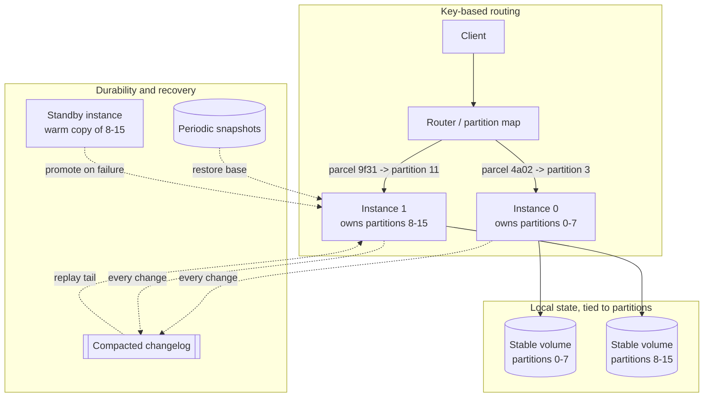
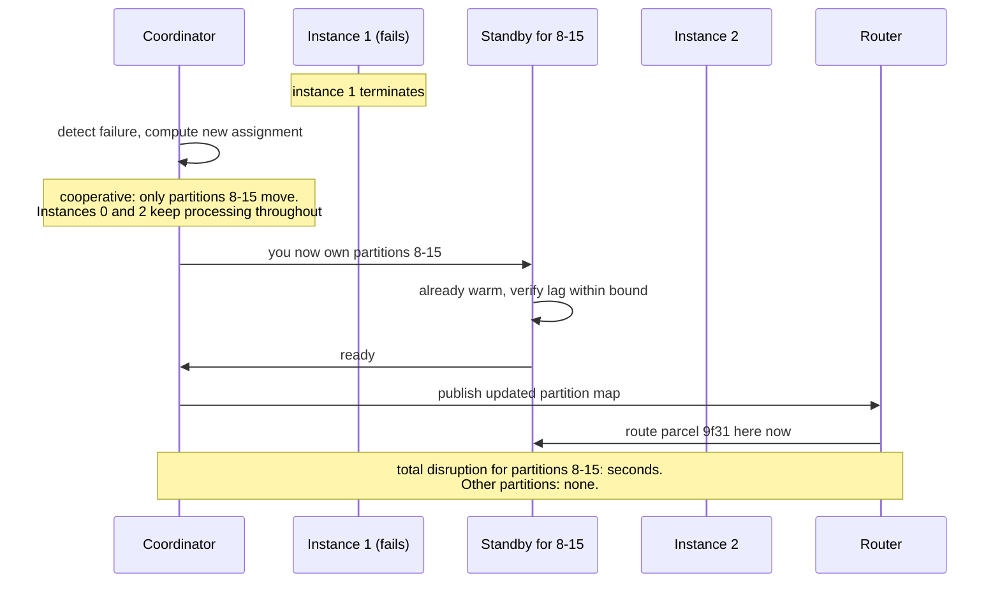

# Chapter 24: Stateful Services

## 24.1 Problem Statement

Chapter 23 ended by naming the components that cannot be stateless. The tracking platform has three of them, and it runs all three as though they were ordinary services.

**The WebSocket gateway.** 40,000 warehouse devices hold persistent connections for live status pushes. It is deployed as a normal rolling update, twelve instances at a time. Every deploy drops 40,000 connections, all of which reconnect within a few seconds, producing a thundering herd against the authentication service that takes 90 seconds to clear. Deploys happen twice a week.

**The stream processor.** It maintains a local store of in-flight parcel state, about 40 GB across the fleet, because looking each parcel up remotely per event was too slow. When an instance restarts, it rebuilds that store from the changelog. Rebuilding takes 25 minutes per instance, and the rolling restart does them one at a time, so a routine deploy takes over four hours.

**The rebalancing storm.** Adding two instances to that processor triggers a full reassignment of every partition across every instance, so all of them stop processing, discard their local state, and rebuild. A scale-out intended to add capacity removes all of it for half an hour.

**Sticky routing that lost state anyway.** The gateway used sticky sessions to keep per-connection context in memory. When an instance was terminated, that context was gone, so devices reconnecting to a different instance had to re-establish subscriptions, and some silently did not.

**And a backup that restored nothing useful.** The local stores were backed up on a schedule. Restoring one produced a store that was hours behind the changelog and had no mechanism to catch up, because nobody had built one.

None of these is a bug in the stateful components. They are the consequence of running stateful components with stateless assumptions: interchangeable instances, unordered restarts, and the belief that losing one costs nothing.

## 24.2 Why This Problem Exists

**Local state exists for a reason, and that reason is performance.** A stream processor keeps state locally because a remote lookup per event is orders of magnitude slower. Chapter 23's advice to externalise state is correct for request-serving tiers and would destroy a stateful component's entire justification.

**The platform tooling defaults to stateless assumptions.** Rolling updates, random instance names, ephemeral storage, and load balancers that treat backends as interchangeable are all correct for a stateless fleet and actively harmful for a stateful one.

**Rebuild cost is invisible until a restart.** An instance holding 40 GB of derived state is fine while running. Its cost appears only during deploys, scale events, and failures, which is to say during every operational activity.

**Rebalancing is treated as free.** Adding an instance to a partitioned stateful system is not additive; it redistributes ownership, and naive protocols stop everything while they do it.

**And sticky routing is mistaken for state management.** Affinity routes a client back to the same instance while that instance exists. It does nothing about what happens when it does not, which is the case that matters.

## 24.3 Real World Analogy

A specialist workshop where each bench has its own set of jigs.

A jig is a fixture set up for one specific job. Setting one up takes an hour; using it takes minutes. That is why the bench keeps them rather than fetching a generic tool each time, and it is exactly why a stream processor keeps state locally.

Now run that workshop with the assumptions you would use for a queue of interchangeable general labourers.

**Send everyone home and bring in a fresh shift.** Every bench rebuilds every jig. The workshop produces nothing for an hour. That is a rolling restart of a stateful fleet.

**Add two benches and reshuffle all the work.** Every bench now has different jobs, so every jig is wrong and must be rebuilt. Adding capacity removed it temporarily. That is a naive rebalance.

**Assume any bench can take any job.** They can, eventually, after an hour of setup. Treating that as immediate is the error.

The workshop's actual answers are the ones this chapter recommends. **Give benches stable identities** so the same jobs return to the same bench. **Reassign only the jobs that must move** when the shift changes, rather than reshuffling everything. **Keep a record of how each jig was built** so a replacement bench can reconstruct it without guesswork. And **change one bench at a time**, waiting for it to be productive before touching the next.

## 24.4 Simple Explanation

**A service is stateful when it holds data locally that is expensive or impossible to reconstruct on demand, and when which instance serves a request therefore matters.**

The categories, and why each is stateful:

| Component | State it holds | Why not externalise |
|---|---|---|
| Databases and caches | The data itself | They are the shared store |
| Stream processors | Local materialised state | Remote lookup per event is too slow |
| Connection gateways | Per-connection context | The connection is the unit of work |
| Search and index services | Large in-memory indexes | Rebuilding per query is infeasible |
| Leader-elected singletons | Exclusive right to act | Exactly one must be effective |

Running these well needs four properties that a stateless service does not:

| Property | Meaning |
|---|---|
| **Stable identity** | Instance 3 is always instance 3, and returns as itself |
| **Stable storage** | Its data survives a restart and reattaches to the same instance |
| **Ordered lifecycle** | Start, stop, and upgrade one at a time, in a known order |
| **Rebuildable state** | A replacement can reconstruct from a durable log or snapshot |

The organising rule for the whole chapter:

> **Tie state to a partition, not to an instance. Then any instance can own any partition, and moving a partition is a defined, bounded operation rather than a loss.**

That distinction is what separates a stateful system you can operate from one you can only pray over.

## 24.5 Technical Deep Dive

### 24.5.1 Identity and storage

Stateless instances are interchangeable and anonymous. Stateful ones need to be neither.

```
Stateless deployment:          Stateful deployment:
  pod-7f9c4d-x2m1               processor-0, processor-1, processor-2
  random name, ephemeral disk   stable name, stable volume
  replaced by any new pod       processor-1 returns AS processor-1,
                                with its volume reattached
```

The three guarantees, and what each buys:

**Stable network identity.** Peers can address a specific member, which is what consensus, replication, and partition assignment all require. A replacement that arrives with a different name is a new member, and cluster membership changes are expensive.

**Stable storage.** The volume follows the identity, so a restart reattaches to existing data rather than starting empty. This turns a 25 minute rebuild into a short catch-up.

**Ordered lifecycle.** Instances start and stop one at a time in index order, and a replacement waits for readiness before the next change. That prevents the case where a quorum-based system loses several members simultaneously.

Container orchestrators distinguish these explicitly. Kubernetes StatefulSets provide all three, and the reason the distinction exists is precisely Section 24.1: running a stateful workload as an ordinary Deployment produces random names, ephemeral disks, and parallel restarts.

### 24.5.2 Partition affinity

The central technique. State is owned by a **partition**, and an instance owns a set of partitions. Instances become interchangeable again, at the level of partitions rather than requests.

```
Wrong:  state belongs to instance 4
        losing instance 4 loses the state

Right:  state belongs to partition 11
        instance 4 currently owns partitions 8 through 15
        losing instance 4 means partitions 8 through 15 are reassigned,
        and their state is rebuilt or restored on their new owners
```

Two consequences follow.

**Routing must be by key, not by round robin.** A request for parcel 9f31 must reach whichever instance currently owns that parcel's partition, which requires a routing layer that knows the current assignment, or clients that consult it. This is not sticky routing; it is content-based routing, and the difference is that reassignment is a defined operation rather than a loss.

**The partition count is a long-lived decision.** It caps parallelism, as Chapter 21 noted, and changing it remaps keys, which breaks Chapter 18's per-key ordering. Choose it with several years of headroom.

### 24.5.3 Rebuildable state

The property that makes everything else safe: a replacement instance must be able to reconstruct what it needs without a human.

Three mechanisms, usually combined:

| Mechanism | Recovery speed | Cost |
|---|---|---|
| **Changelog** | Slow, proportional to history | Every state change written to a durable log |
| **Snapshot plus changelog tail** | Fast, proportional to time since the snapshot | Periodic snapshots, plus the log |
| **Standby replica** | Immediate | An extra copy kept warm continuously |

The pattern to copy is the one stream processing systems use: every local state change is also written to a compacted durable log, so the local store is a cache of that log rather than an authoritative copy. A replacement replays it. Adding periodic snapshots bounds the replay to the time since the last one, which turns Section 24.1's 25 minute rebuild into a minute or two.

Standby replicas are the answer when even that is too slow. One or more instances maintain a warm copy of another's partitions without serving them, so a failure promotes an already-current replica rather than triggering a rebuild.

```
Recovery time budget for a stateful component:

  no snapshot, no standby:  full changelog replay          25 min
  snapshot every 15 min:    snapshot restore + tail replay  2 min
  warm standby:             promotion                       5 s

Choose the mechanism from the RTO in Chapter 6's spec sheet,
not from whichever is easiest to configure.
```

### 24.5.4 Rebalancing

What happens when membership changes, and the difference between a protocol that stops the world and one that does not.

```
EAGER (naive):
  1. A member joins or leaves.
  2. ALL members stop processing and release ALL partitions.
  3. A new assignment is computed.
  4. Everyone acquires new partitions and rebuilds state.
  Result: full outage for the rebuild duration, on every membership change.

INCREMENTAL / COOPERATIVE:
  1. A member joins or leaves.
  2. A new assignment is computed.
  3. Only partitions that must MOVE are revoked.
  4. Members keep processing everything they retain.
  Result: partial, brief disruption proportional to what actually moved.
```

Section 24.1's rebalancing storm is the first protocol. Modern systems offer the second: Kafka's cooperative rebalancing revokes only the partitions being reassigned rather than stopping every consumer, which changes a scale-out from an outage into a background operation. Enabling it is usually a configuration change and is one of the highest-value settings in this chapter.

Two further mitigations:

**Static membership.** An instance that restarts within a timeout rejoins with the same identity and keeps its assignments, so a rolling deploy does not trigger reassignment at all. This is the single most effective fix for deploy-induced rebalancing.

**Sticky assignment.** When reassignment is necessary, prefer giving partitions back to their previous owner, which preserves whatever local state survived.

### 24.5.5 Connection-oriented services

WebSocket and similar gateways are stateful in a different way: the state is the connection, and it cannot be moved.

The design that works:

| Concern | Approach |
|---|---|
| Per-connection context | Keep the minimum locally; put anything that must survive in a shared store keyed by session |
| Which instance holds a connection | A shared registry mapping user or device to instance, so other services can route messages |
| Instance loss | Clients reconnect with a resume token; the new instance restores context from the shared store |
| Deploys | Drain slowly: stop accepting new connections, then close existing ones gradually over minutes |
| Reconnect storms | Server-directed reconnect delays with jitter, so 40,000 clients do not return simultaneously |

```java
// The two mechanisms that make a connection gateway operable.
// 1. Close with a jittered reconnect hint rather than dropping abruptly.
// 2. Restore context from a shared store on reconnect, keyed by a resume token.

public void drainForShutdown() {
    acceptor.stopAcceptingNew();
    for (Connection c : connections) {
        long delayMs = ThreadLocalRandom.current().nextLong(1_000, 120_000);
        c.close(new GoAway(delayMs, c.resumeToken()));   // spread returns over 2 min
    }
}

public void onConnect(Connection c, String resumeToken) {
    SessionContext ctx = sessionStore.get(resumeToken);   // shared, survives instance loss
    if (ctx == null) ctx = SessionContext.fresh();
    registry.put(c.deviceId(), selfInstanceId());          // so others can route to us
    c.attach(ctx);
}
```

The draining behaviour is what fixes Section 24.1's first failure. Dropping 40,000 connections instantly guarantees a synchronised return; closing them over two minutes with jittered hints spreads the reconnection load below the downstream's capacity.

### 24.5.6 Operating a stateful fleet

The practices that differ from Chapter 21's.

| Operation | Stateless | Stateful |
|---|---|---|
| Deploy | Any number in parallel | One at a time, waiting for readiness and catch-up |
| Readiness | Process can serve | State restored, lag within bound |
| Scale out | Immediate benefit | Benefit after rebuild; may cost capacity first |
| Scale in | Immediate | Must hand off partitions first |
| Instance failure | Replace, no state | Reassign partitions, rebuild or promote a standby |
| Backup | Usually not needed | Snapshot plus log position, and tested restore |
| Capacity planning | CPU and memory | Plus state size per partition and rebuild time |

Two rules that prevent most incidents.

**Readiness for a stateful instance means state is restored and lag is within bound**, not merely that the process started. An instance admitted to service while still replaying will serve wrong or slow answers, and will also be counted as healthy capacity that does not exist.

**Never restart more than one member of a quorum-based component at a time,** and wait for the restarted member to rejoin and catch up. Chapter 19's majority rule means losing two of three simultaneously stops everything.

## 24.6 Architecture Diagram



```
 client -> router (knows the CURRENT partition assignment)
                |
    +-----------+-----------+
    |                       |
 instance 0             instance 1
 partitions 0-7         partitions 8-15
 stable name            stable name
 stable volume          stable volume
    |                       |
    +---> compacted changelog (every state change) <---+
                    |
          snapshots (bound replay time)
                    |
          standby instance (warm copy, promote in seconds)

 Rebalance moves PARTITIONS, not all state.
 Cooperative protocol revokes only what must move.
```

## 24.7 Request Flow

An instance failure, handled correctly.



1. **Failure is detected** by the coordinator, using the mechanisms in Chapter 13, including outlier ejection so a degraded instance is removed before it fails outright.
2. **Only the affected partitions are reassigned.** Instances owning other partitions never stop, which is the difference between cooperative and eager protocols.
3. **A warm standby is promoted** rather than a cold instance rebuilding, converting minutes into seconds.
4. **Readiness includes lag,** so the new owner does not serve until its state is current.
5. **The routing map is updated** and clients follow it, which is why routing must be dynamic rather than sticky.
6. **Unaffected partitions see nothing at all,** which is the containment property Chapter 10 called blast radius.

## 24.8 Internal Components

| Component | Role | Failure mode | Guard |
|---|---|---|---|
| Stable identity | Lets peers address a specific member | Random names, so every restart is a membership change | StatefulSet semantics or equivalent |
| Stable storage | Survives restarts | Ephemeral volumes, so every restart is a full rebuild | Persistent volumes bound to identity |
| Partition assignment | Maps state to owners | Instance-owned state, so failure means loss | Own partitions, not data |
| Routing map | Directs requests to current owners | Sticky routing instead, so reassignment breaks clients | Dynamic, published, client-aware |
| Changelog | Makes state rebuildable | Not written, so state is authoritative and unrecoverable | Every change to a durable compacted log |
| Snapshots | Bound replay time | Absent, so recovery is proportional to all history | Periodic, with the log position recorded |
| Standby replicas | Fast failover | None, so recovery means a rebuild | One standby per partition group for tight RTO |
| Rebalance protocol | Handles membership change | Eager, so every change stops everything | Cooperative, plus static membership |
| Readiness definition | Gates traffic | Process liveness only | State restored and lag within bound |
| Drain procedure | Protects connections and in-flight work | Abrupt termination | Gradual close with jittered reconnect hints |

## 24.9 Production Example

**Kafka Streams is the reference design for rebuildable local state.** Tasks keep local state stores because remote lookups per record would dominate processing cost, and every change to a store is written to a compacted changelog topic. A task that moves to another instance restores its store by replaying that topic, and standby replicas can be configured to maintain warm copies so that failover does not require replay at all. The design decision worth copying is that **the local store is explicitly a cache of a durable log**, not the source of truth, which makes losing an instance a recovery operation rather than a data loss event.

**Kafka's cooperative rebalancing changed the operational character of consumer groups.** The original protocol stopped every consumer and reassigned everything on any membership change, so a rolling deploy of twelve instances produced twelve full rebalances. Incremental cooperative rebalancing revokes only the partitions that must move, and static group membership lets an instance restarting within a timeout keep its assignments entirely. Together they turn deploys and scale events from disruptions into background operations, and both are configuration rather than code.

**StatefulSets exist because the stateless assumptions are wrong for this class of workload.** Kubernetes provides stable network identities, persistent volumes bound to those identities, and ordered, one-at-a-time lifecycle operations specifically so that clustered databases, coordination services, and stream processors can be run on the same platform as stateless services without inheriting behaviour designed for interchangeable pods. Running such a workload as a Deployment produces exactly Section 24.1's failures, and the split is the platform's way of forcing the distinction to be made deliberately.

## 24.10 Advantages

- **Local state is fast**, often by orders of magnitude compared with a remote lookup per operation.
- **Partition affinity keeps interchangeability** at the partition level, so instances remain replaceable.
- **Rebuildable state makes failure a recovery operation** with a known duration rather than a loss.
- **Standby replicas turn minutes of rebuild into seconds of promotion.**
- **Cooperative rebalancing contains disruption** to the partitions that actually move.
- **Stable identity and storage make restarts cheap,** because state survives them.
- **Capacity is predictable,** since state size per partition is measurable and plannable.

## 24.11 Limitations

- **Scaling is coarse and slow,** bounded by partition count and rebuild time.
- **Deploys take longer,** because instances must be changed one at a time with catch-up.
- **Partition count is effectively permanent,** since changing it remaps keys and breaks ordering.
- **Routing must know the assignment,** which adds a component that must itself be available.
- **Skew is worse than for stateless tiers**, because a hot partition cannot be split without remapping.
- **Recovery time is a real number in your availability budget,** and it is usually larger than people assume.
- **Backups are more complex,** requiring a snapshot plus a log position and a tested restore path.

## 24.12 Trade-offs

| Dial | One way | The other way |
|---|---|---|
| State location | Local: fast, recovery cost on failure | Remote: slower per operation, trivial failover |
| Recovery mechanism | Standby replicas: seconds, costs extra instances | Snapshot and replay: cheaper, minutes |
| Snapshot frequency | Frequent: short replay, more IO and storage | Infrequent: cheap, long recovery |
| Rebalance protocol | Cooperative: minimal disruption, more complex | Eager: simple, stops everything |
| Membership | Static: no rebalance on restart, slower to detect real loss | Dynamic: fast detection, rebalances on every deploy |
| Partition count | High: fine-grained rebalancing and headroom, more overhead | Low: less overhead, coarse rebalancing and a lower ceiling |
| Routing | Dynamic map: correct through reassignment, extra component | Sticky: simple, breaks on any change |

**Remove standby replicas.** You gain the cost of those instances. You lose seconds-scale failover and accept minutes of rebuild per failure, which must then fit inside your recovery objective.

**Remove the changelog and treat local state as authoritative.** You gain write throughput and simplicity. You lose the ability to recover at all, converting an instance failure into permanent data loss.

**Remove cooperative rebalancing.** You gain a simpler protocol. You lose the ability to deploy or scale without a full stop, which is Section 24.1's rebalancing storm.

## 24.13 Common Mistakes

**Running a stateful workload as a stateless deployment,** with random identities and ephemeral disks.

**Tying state to instances rather than partitions,** so failure means loss rather than reassignment.

**Treating sticky routing as state management.** It handles the case where the instance exists and nothing else.

**Readiness that only checks the process,** so instances serve while still replaying.

**Restarting several quorum members at once,** which stops a majority-based component entirely.

**No snapshots,** so recovery is proportional to all history rather than to recent history.

**Abruptly dropping connections on deploy,** guaranteeing a synchronised reconnect storm.

**Choosing partition count for today,** then discovering that changing it breaks key ordering.

**Backups without a tested restore,** which Chapter 12 already established is not a backup.

**Ignoring rebuild time in capacity planning,** so a scale-out temporarily reduces capacity.

## 24.14 Interview Questions

**Q: When is local state the right choice?** When remote access per operation would dominate cost, which is typical for stream processing, large in-memory indexes, and connection gateways. The condition is that the state must be rebuildable from a durable source, so that losing an instance is a recovery operation with a known duration rather than a data loss event.

**Q: What three guarantees does a stateful service need that a stateless one does not?** Stable network identity so peers can address specific members, stable storage bound to that identity so restarts do not mean rebuilds, and an ordered one-at-a-time lifecycle so that changes do not remove several members simultaneously.

**Q: Why tie state to partitions rather than instances?** Because it restores interchangeability at the partition level. Any instance can own any partition, so failure becomes a bounded reassignment rather than a loss, and rebalancing becomes a defined operation. It also makes routing content-based and dynamic rather than sticky.

**Q: Your rolling deploy of a stream processor takes four hours. What do you change?** Enable static membership so restarts within a timeout retain assignments and trigger no rebalance, enable cooperative rebalancing so only moving partitions are revoked, add snapshots to bound replay time, use persistent volumes so restarts do not rebuild from scratch, and add standby replicas if the recovery objective demands seconds rather than minutes.

**Q: How should a connection gateway handle deploys?** Stop accepting new connections, then close existing ones gradually over minutes with a server-directed reconnect delay that includes jitter, so clients do not return simultaneously. Per-connection context that must survive should live in a shared store keyed by a resume token, so a reconnecting client can be restored on any instance.

**Q: What does readiness mean for a stateful instance?** That its state is restored and its lag is within an acceptable bound, not merely that the process has started. Admitting an instance while it is still replaying causes it to serve stale or slow answers and to be counted as capacity that does not exist.

## 24.15 Production Best Practices

1. **Use stateful workload primitives:** stable identity, persistent volumes bound to identity, ordered lifecycle.
2. **Own partitions, not data.** State belongs to a partition; instances own sets of partitions.
3. **Write every state change to a durable compacted log,** making local state a cache rather than the truth.
4. **Snapshot periodically** and record the log position, so replay is bounded.
5. **Run standby replicas** when the recovery objective is measured in seconds.
6. **Enable cooperative rebalancing and static membership.**
7. **Define readiness as state restored plus lag within bound.**
8. **Restart one member at a time,** waiting for catch-up, and never several members of a quorum.
9. **Drain connections gradually** with jittered reconnect hints.
10. **Keep a dynamic, published routing map** rather than relying on stickiness.
11. **Choose partition count with years of headroom.**
12. **Include state size and rebuild time in capacity planning,** and test the restore path.

## 24.16 Summary

Some components genuinely hold state, and forcing Chapter 23's rules onto them destroys the reason they exist. A stream processor keeps state locally because a remote lookup per event would dominate its cost; a connection gateway holds a connection because the connection is the unit of work. The task is not to eliminate the state but to run it in a way that keeps instances replaceable.

The mechanism that makes that possible is to tie state to a partition rather than to an instance. Once ownership is expressed that way, instances become interchangeable at the partition level: any instance can own any partition, failure becomes a bounded reassignment, and scaling becomes a redistribution rather than a rebuild of everything. That in turn requires dynamic routing that knows the current assignment, which is a different thing from sticky routing, because reassignment is a supported operation rather than a loss.

The second requirement is that local state must be rebuildable. Writing every change to a durable compacted log makes the local store a cache rather than the source of truth, so a replacement can reconstruct it. Snapshots bound how much must be replayed, and standby replicas remove replay from the failure path entirely when the recovery objective is tight. Choosing between those three is a recovery-time decision from Chapter 6's spec sheet, not a configuration preference.

The third is operational discipline that differs from the stateless tier: stable identities and storage, one change at a time with catch-up between them, readiness that means state restored rather than process started, cooperative rebalancing so membership changes disturb only what must move, and gradual connection draining with jittered reconnects so a deploy does not produce a synchronised herd. Every failure in Section 24.1 came from applying stateless operational habits to components that needed these instead.

## 24.17 Quick Revision Notes

- Stateful: holds local data that is expensive to reconstruct, so which instance serves matters.
- Categories: databases and caches, stream processors, connection gateways, index services, leader-elected singletons.
- Needs: stable identity, stable storage bound to identity, ordered lifecycle, rebuildable state.
- Core rule: tie state to partitions, not instances. Then instances stay interchangeable at partition granularity.
- Routing must be dynamic and content-based, not sticky. Reassignment is an operation, not a loss.
- Make local state a cache of a durable compacted log. Snapshots bound replay. Standbys remove replay from the failure path.
- Recovery options: full replay (minutes), snapshot plus tail (a minute or two), warm standby (seconds).
- Eager rebalancing stops everything on any membership change. Cooperative revokes only what moves.
- Static membership prevents rebalance on restart, which is the biggest deploy win.
- Readiness means state restored and lag within bound, not process alive.
- Restart one member at a time. Never several members of a quorum.
- Drain connections gradually with jittered reconnect hints, or you get a synchronised herd.
- Partition count is effectively permanent, since changing it remaps keys and breaks ordering.
- Include state size and rebuild time in capacity planning; a scale-out can temporarily reduce capacity.

## 24.18 Mini Quiz

1. Why is local state worth its operational cost in a stream processor?
2. What does tying state to partitions rather than instances buy you?
3. Your deploy triggers a full rebalance every time. Name two configuration changes that fix it.
4. Compare the three recovery mechanisms by speed and cost.
5. Why is sticky routing insufficient for a stateful service?
6. What should readiness check for a stateful instance, and what goes wrong if it only checks liveness?
7. 40,000 clients reconnect simultaneously after a deploy. What is the fix?
8. Why is partition count a decision you cannot easily revisit?

**Answers**

1. Because the alternative is a remote lookup for every event processed, which adds a network round trip to an operation that would otherwise take microseconds, reducing throughput by orders of magnitude and making the processor's latency dependent on another system's availability. The local store turns a distributed problem into a local one, and the operational cost is acceptable precisely because the state is rebuildable from a durable log.
2. It restores interchangeability. Any instance can own any partition, so an instance failure becomes a reassignment of that instance's partitions to other members rather than the loss of unique data, scaling becomes a redistribution of ownership, and the routing layer can direct requests to the current owner. State that belongs to an instance is lost when the instance is; state that belongs to a partition simply moves.
3. Static group membership, so an instance that restarts within a configured timeout rejoins with the same identity and retains its assignments without triggering reassignment at all. And cooperative or incremental rebalancing, so that when reassignment is genuinely needed, only the partitions that must move are revoked while every other member continues processing. Persistent volumes bound to stable identities are a third, since they prevent a restart from requiring a rebuild.
4. Full changelog replay is slowest, proportional to all history, and cheapest, requiring only the log. Snapshot plus tail replay is much faster, proportional to the time since the last snapshot, at the cost of periodic snapshot IO and storage. Warm standby replicas are fastest, promoting in seconds because the state is already current, and most expensive, requiring additional instances continuously maintaining copies they do not serve. Choose from the recovery objective rather than from convenience.
5. Because it only addresses the case where the instance still exists. Affinity routes a client back to the same instance while it is available and provides nothing when it is terminated, so the state is simply gone and the client's context is lost. It also prevents even load distribution, makes scale-in require draining, and means every deploy is a state-loss event for that instance's clients. Partition ownership with a dynamic routing map handles reassignment as a normal operation.
6. It should check that the instance's state has been restored and that its lag behind the source is within an acceptable bound, in addition to process liveness. If only liveness is checked, the instance enters rotation while still replaying, so it serves stale or incomplete answers, and it is counted by the orchestrator and any capacity calculation as available capacity that cannot actually do the work, which can trigger premature completion of a rolling deploy and remove the next instance too early.
7. Close connections gradually rather than all at once during shutdown, spreading the closures over a window of minutes, and send each client a server-directed reconnect delay drawn with jitter so that returns are distributed rather than synchronised. Combined with per-connection context stored in a shared session store keyed by a resume token, clients reconnect to any instance and restore their state without re-establishing everything, and the downstream services see a smooth ramp rather than a spike.
8. Because the mapping from key to partition is typically a function of the partition count, so changing it sends a given key to a different partition. That breaks per-key ordering guarantees, since a key's future events land in a different ordered stream from its past ones, and it invalidates any local state keyed by partition, requiring a full rebuild. It also caps consumer parallelism, so choosing a low count places a ceiling on scaling that can only be lifted by an operation that disrupts ordering.

## 24.19 Hands-on Exercise

**Part 1: measure the rebuild.** Run a stream processor with a local state store of a few gigabytes. Kill an instance and time the full recovery. Then add periodic snapshots and repeat. Then add a standby replica and repeat. Record all three durations against your recovery objective.

**Part 2: cause a rebalancing storm.** With eager rebalancing, perform a rolling restart of a six-instance consumer group and record total processing downtime. Enable cooperative rebalancing and static membership, repeat, and compare.

**Part 3: lose state on purpose.** Deploy a stateful component with ephemeral storage and random identities. Restart it and observe the rebuild. Then switch to stable identity with persistent volumes and repeat.

**Part 4: drain connections properly.** Build a WebSocket gateway with a few thousand clients. Terminate an instance abruptly and graph the reconnection rate and downstream load. Then implement gradual close with jittered reconnect hints and graph both again.

**Part 5: define readiness correctly.** Make readiness report ready as soon as the process starts, and perform a rolling deploy under load. Count errors. Then make readiness require state restored and lag within bound, and repeat.

## 24.20 Further Reading

- Kafka Streams documentation on state stores, changelog topics, and standby replicas, which is the clearest worked example of rebuildable local state.
- Kafka's incremental cooperative rebalancing and static group membership documentation, for the two settings that most change operational behaviour.
- Kubernetes documentation on StatefulSets, persistent volumes, and pod lifecycle, for why the platform distinguishes these workloads.
- *Designing Data-Intensive Applications*, chapters 5 and 6, on replication, partitioning, and rebalancing strategies.
- *Streaming Systems*, Akidau, Chernyak and Lax, for state management in stream processing and the reasoning behind local stores.
- Operational documentation for whichever clustered database you run, specifically its restart, catch-up, and quorum requirements.

---

**Next chapter: Chapter 25, Monolith.** The architecture everyone apologises for: what a monolith genuinely does better, the difference between a modular monolith and a big ball of mud, and how to tell whether your pain is caused by the monolith or by something you could fix without leaving it.
