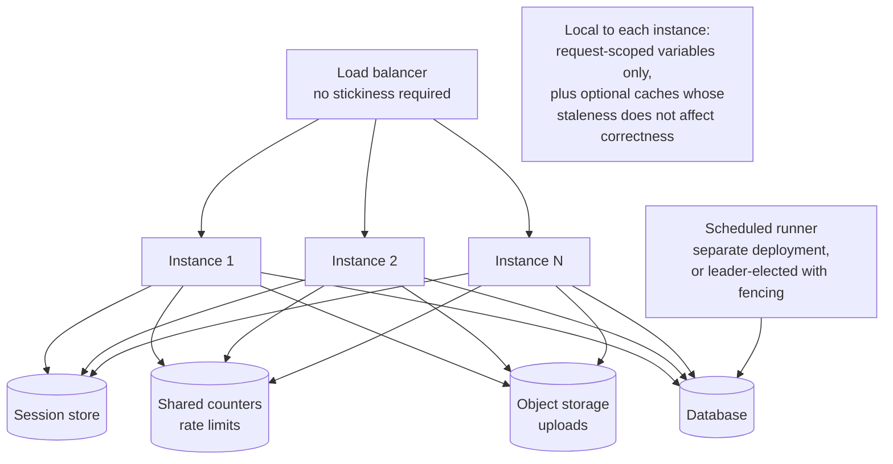
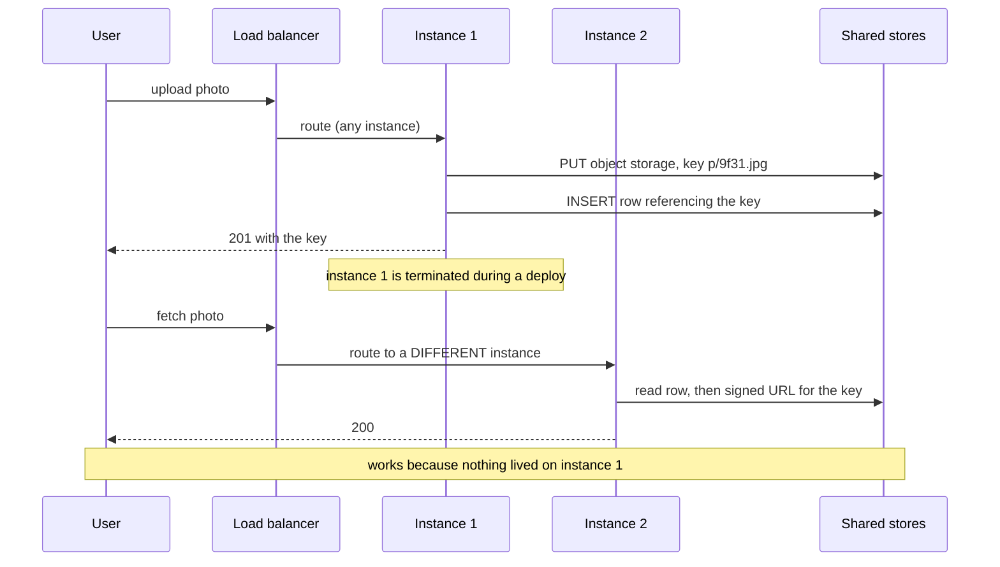

# Chapter 23: Stateless Services

## 23.1 Problem Statement

Chapter 1 opened with a counter in a `HashMap` that broke when a second instance appeared. Chapter 3 showed the same failure inside a Spring singleton. This chapter is what happens when a whole organisation believes its services are stateless and they are not.

The tracking platform's services are documented as stateless. The deployment guide says so. The architecture diagram says so. Every engineer would tell you so. Over one quarter, the following happens.

**Uploaded proof-of-delivery photos disappear.** The upload handler writes the file to local disk and returns the path. Any subsequent request that lands on a different instance gets a file-not-found. It worked in staging, which runs one instance.

**A rate limiter allows 200 times its configured limit.** It is an in-memory token bucket, correct in isolation, and there are 200 instances. Each enforces the limit independently, so the effective limit is 200 times what was configured, and the downstream provider that it exists to protect started rate limiting the platform instead.

**A scheduled job runs 200 times a night**, which is Chapter 21's failure, and it is here too because the "am I the leader" check was a comment.

**Users are logged out at random,** because sessions are stored in memory and the load balancer is not sticky.

**A deploy loses in-flight work.** A worker held a batch in memory between polling and committing, so a rolling restart discarded whatever each instance was holding.

**And an in-memory cache produces inconsistent answers.** Each instance caches feature flags for five minutes with independent expiry, so at any moment some instances have the new value and some the old, and a user's experience depends on which instance they reach.

Six failures. Not one of them is a stateless service. Every one of them passed review, because in each case the state was invisible: a field, a file path, a static map, a scheduled annotation.

## 23.2 Why This Problem Exists

**State is easy to add and invisible in review.** Adding a field to a class is one line and looks like nothing. Nothing in the diff says "this makes horizontal scaling incorrect", and no compiler or test on a single instance will object.

**Everything works with one instance.** Local development, unit tests, and most staging environments run one process, which is precisely the configuration in which state-related bugs are impossible. The failure appears only at N greater than one, in production, intermittently.

**"Stateless" is misunderstood as "has no data".** Every service has data. Stateless means the service holds no data that a subsequent request depends on, so any instance can serve any request. That is a much narrower and more useful claim.

**The state is often not in the application code at all.** It is in a local file path, a framework's default session store, a scheduling annotation, a library's internal cache, or a connection that carries per-client context.

**And the consequences vary from harmless to severe,** so the habit does not get established. An in-memory cache is a minor inconsistency; an in-memory rate limiter is a production incident at a third party; a local file is data loss.

## 23.3 Real World Analogy

A bank branch versus a call centre.

At an old-fashioned branch, your account manager knows you. They remember your last conversation, your preferences, and that you are waiting on a decision. It is a good experience while it lasts, and it has a specific weakness: **you have to see that person.** They go on holiday and your case stalls. The branch closes and your file is in a cabinet nobody else can reach. Twice as many customers means you need twice as many managers, each with their own filing cabinet, and none of them can cover for another.

At a well-run call centre, any agent can handle your call, because everything about you is in a shared system they all read. The agent holds nothing between calls. Losing an agent mid-conversation costs you a redial, not a case. Doubling capacity means hiring agents, not rebuilding relationships.

The distinction is not that the second one has no information. It has far more, and it is in a shared system rather than in one person's head or drawer.

Two refinements carry over precisely. **Some things genuinely cannot be shared cheaply**, such as an agent's partially typed notes during a call, which is connection-scoped state and is fine because it does not outlive the interaction. And **the trap is the drawer**: a filing cabinet at one desk works perfectly until someone else needs the file, which is exactly what a local disk write is.

## 23.4 Simple Explanation

**A service is stateless if any instance can serve any request, and losing an instance loses nothing that mattered.**

That is the useful definition, and it is narrower than "holds no data":

| Kind of state | Stateless-compatible? | Why |
|---|---|---|
| Data in a shared database | Yes | Every instance reads the same thing |
| Data in a shared cache | Yes | Same |
| Request-scoped local variables | Yes | Discarded when the request ends |
| Connection-scoped state during one connection | Usually | Does not outlive the interaction |
| A read-only cache that is merely an optimisation | Mostly | Correctness must not depend on it |
| **A field remembering something between requests** | **No** | Only that instance knows |
| **A file on local disk** | **No** | Only that instance can read it |
| **An in-memory session** | **No** | Requires sticky routing |
| **An in-memory counter or limiter** | **No** | Each instance enforces separately |
| **A scheduled job with no guard** | **No** | Runs once per instance |

The two tests to apply to any piece of state:

```
1. If this request went to a different instance, would it still be correct?
2. If this instance died right now, would anything be lost or wrong?

Two "yes" answers means stateless. Any "no" means you have found the state.
```

## 23.5 Technical Deep Dive

### 23.5.1 The hidden state checklist

Run this against any service claimed to be stateless. It takes twenty minutes and reliably finds something.

| Where to look | What to look for | Typical fix |
|---|---|---|
| Instance fields on beans | Any non-final field, any mutable collection | Local variables, or a shared store |
| `static` fields | Caches, counters, registries | Shared store, or accept as read-only |
| Local filesystem | Uploads, temp files, generated artefacts, logs read back | Object storage |
| Sessions | Framework default in-memory session store | Shared session store, or stateless tokens |
| Caches | In-memory caches whose staleness affects correctness | Shared cache, or short TTL plus tolerance |
| Rate limiters, circuit breakers | Per-instance counters | Shared counters, or divide the limit by instance count |
| Scheduled tasks | `@Scheduled` with no leader guard | Leader election with fencing, or a separate runner |
| In-flight work | Batches held in memory between poll and commit | Commit-after-work, and graceful shutdown |
| Websocket or long-lived connections | Per-connection state that must survive | Shared state plus reconnect, Chapter 24 |
| Generated identifiers | In-memory sequence counters | Database sequence, or coordinated ranges (Chapter 19) |
| Feature flags | Independently expiring local copies | Shared source with coordinated refresh |
| Warm caches at startup | Correctness depending on being warm | Readiness gating (Chapter 21) |

The four rows that cause real incidents most often are local filesystem, in-memory sessions, in-memory rate limiters, and unguarded scheduled tasks. Section 23.1 hit all four.

```java
// The four most common forms, and what each does at N instances.

@Service
public class Wrong {
    private final Map<String, Integer> counts = new ConcurrentHashMap<>();   // N counters
    private static final Cache<String, Flag> FLAGS = Caffeine.newBuilder()   // N views
            .expireAfterWrite(5, MINUTES).build();

    public String upload(MultipartFile f) throws IOException {
        Path p = Path.of("/data/uploads", f.getOriginalFilename());
        f.transferTo(p);                                                     // 1 of N disks
        return p.toString();
    }

    @Scheduled(cron = "0 0 2 * * *")
    public void reconcile() { /* runs on every instance */ }                 // N executions
}
```

### 23.5.2 Where state should go instead

| State | Move it to | Notes |
|---|---|---|
| Session | Shared store (Redis) or a signed token | Tokens avoid a lookup; revocation becomes harder |
| Uploaded files | Object storage | Return a key, not a path. Serve via signed URL or CDN |
| Counters, limits | Shared store with atomic operations | Redis `INCR` with expiry is usually enough |
| Locks and leader election | Coordination service with fencing | Chapter 19. Fencing is mandatory |
| Caches | Shared cache, or local with bounded staleness | Local is fine when correctness tolerates divergence |
| In-flight work | The queue itself | Do not acknowledge until the work is committed |
| Identifier generation | Database sequence, or coordinated ranges | Chapter 19's range allocation |
| Scheduled jobs | A dedicated runner, or leader-elected | Or a scheduler service that guarantees single execution |

Two of these have subtleties worth spelling out.

**Sessions: shared store or token.** A signed token carries the session in the request, so there is no lookup at all, which is fast and scales perfectly. The cost is revocation: a token is valid until it expires, so logging someone out immediately requires a deny list, which reintroduces a lookup. A shared store makes revocation trivial and adds a dependency to every request. Both are legitimate; the choice is about revocation requirements.

**Rate limiting: shared or divided.** A shared counter is correct and adds a round trip to every request. Dividing the limit by instance count is free and wrong whenever instance count changes or traffic is unevenly distributed, which is always. The usual compromise is a shared counter with local batching: acquire permits in blocks of, say, 20, so the shared store sees one operation per 20 requests.

```java
// Correct, shared, and cheap: one round trip per window rather than per request.
public boolean allow(String key, int limitPerMinute) {
    String bucket = "rl:" + key + ":" + (Instant.now().getEpochSecond() / 60);
    Long count = redis.opsForValue().increment(bucket);
    if (count != null && count == 1L) {
        redis.expire(bucket, Duration.ofMinutes(2));      // self-cleaning
    }
    return count != null && count <= limitPerMinute;
}
```

### 23.5.3 Sticky sessions, and why they are a trap

Sticky routing binds a client to an instance so that instance-local state works. It is the shortcut, and it costs more than it appears to.

| Consequence | Detail |
|---|---|
| Uneven load | Long-lived clients concentrate on some instances |
| Failure is user-visible | Losing an instance loses its clients' state, not just their connection |
| Scaling out does not rebalance | Existing clients stay put, so new instances get only new clients |
| Deploys become disruptive | Every restart is a state loss event for that instance's clients |
| Autoscaling is impaired | Scale-in must drain, which takes as long as the longest session |

It is legitimate in two cases: as a **performance optimisation** where correctness does not depend on it, such as improving local cache hit rates, and for **genuinely connection-oriented protocols** such as WebSockets, which Chapter 24 covers. It is not legitimate as a way to keep session data in memory, because that converts an instance failure into user-visible data loss.

### 23.5.4 The deploy and shutdown path

Statelessness is what makes a rolling deploy safe, and there is one piece of per-instance state that is unavoidable: work currently in flight. Handling it is graceful shutdown.

```
On SIGTERM:
  1. Fail readiness immediately, so the load balancer stops sending new work.
  2. Keep serving requests already accepted.
  3. Stop polling queues; finish and commit what is already held.
  4. Wait for in-flight work to complete, up to a bounded grace period.
  5. Release resources and exit.

Without step 1, requests are routed to a process that is exiting.
Without step 3, Section 23.1's in-flight batch is lost.
Without a bound on step 4, deploys hang.
```

```java
@PreDestroy
public void shutdown() {
    readiness.setNotReady();                  // stop receiving new work
    consumer.pauseAndDrain();                 // finish and commit held messages
    boolean drained = inFlight.await(Duration.ofSeconds(25));
    if (!drained) log.warn("shutdown grace exceeded, {} in flight", inFlight.count());
}
```

The grace period must exceed the load balancer's deregistration delay, or traffic will still be arriving when the process stops accepting it. This is the single most common cause of errors during otherwise healthy deploys.

### 23.5.5 What cannot be stateless

Some things hold state by nature, and the correct response is to isolate them rather than pretend.

| Component | Why | Approach |
|---|---|---|
| Databases and caches | They are the shared store | Chapter 24, replication and sharding |
| WebSocket gateways | Per-connection state is the point | Externalise session state, support reconnect |
| Stream processors with local state | Local state is the performance mechanism | Changelog topics, state stores, partition affinity |
| Leader-elected components | Exactly one must act | Fencing tokens, Chapter 19 |
| Large in-memory indexes | Rebuilding per request is infeasible | Treat as stateful: routing by key, warm-up planning |

The architectural pattern is to **push state to the edges of the system and keep the middle stateless**. A thin stateless request tier, a small number of carefully managed stateful components, and clear boundaries between them. That is why the standard shape in every previous chapter looks the way it does.

## 23.6 Architecture Diagram



```
        load balancer  (no stickiness needed)
        /      |       \
   inst 1   inst 2   inst N        <-- interchangeable, disposable
        \      |       /
   +-------------------------+
   | session store           |
   | shared counters / limits|
   | object storage (uploads)|
   | database                |
   +-------------------------+

   scheduled jobs: separate runner, or leader-elected with fencing

   ALLOWED locally: request-scoped variables, and caches whose
   staleness cannot make an answer wrong
```

## 23.7 Request Flow



1. **The request goes to any instance**, with no affinity, so the balancer is free to optimise for load.
2. **The upload goes to shared storage** and the response returns a key rather than a path, so no instance owns the bytes.
3. **The reference is written to the database** in the same operation, giving a single source of truth for where the object lives.
4. **Instance 1 disappears** and nothing is lost, which is the actual test of statelessness.
5. **A different instance serves the read** with no additional mechanism, because it has the same view of the world as every other instance.

## 23.8 Internal Components

| Component | Role | Failure mode | Guard |
|---|---|---|---|
| Session store | Shared session state | Framework default is in-memory | Configure explicitly; verify at N=2 |
| Object storage | Files that outlive a request | Local disk writes | Ban local writes outside temp; return keys |
| Shared counters | Rate limits, quotas | Per-instance limiters | Shared store with batched acquisition |
| Leader election | Single-execution jobs | Missing, so jobs run N times | Fenced leases, or a dedicated runner |
| Readiness probe | Gates traffic during start and stop | Not failed on shutdown | Fail readiness on SIGTERM first |
| Graceful shutdown | Preserves in-flight work | Absent, so deploys lose work | Drain with a bounded grace period |
| Local cache | Performance only | Correctness depends on it | Bound staleness; tolerate divergence |
| Sticky routing | Optimisation only | Used to keep state in memory | Only for connection-oriented protocols |
| Deregistration delay | Stops traffic before exit | Shorter than the grace period | Grace period must exceed it |

## 23.9 Production Example

**The Twelve-Factor App articulated this as a deployment principle,** stating that processes should be stateless and share nothing, and that any data needing to persist must go to a stateful backing service, typically a database. Its specific target was exactly Section 23.1's failures: memory and local filesystem may be used as a brief single-transaction cache, and must never be assumed to persist across requests, because the process may be restarted or replaced at any time. The formulation is old and has aged well, because the constraint it describes is structural rather than technological.

**Container orchestration made the assumption enforceable.** Kubernetes treats pods as disposable, with ephemeral filesystems and no guarantee that a replacement runs anywhere near its predecessor, and it distinguishes Deployments from StatefulSets precisely because the two require different guarantees around identity, storage, and ordering. Running a stateful workload as a stateless Deployment produces exactly Section 23.1's failures, and the platform's insistence on the distinction is a useful forcing function.

**And stream processors show the honest middle ground.** Kafka Streams keeps local state stores for performance, because reading from a local store is orders of magnitude faster than a remote one, and makes them recoverable by writing every change to a compacted changelog topic. A task that moves to another instance rebuilds its state from that log. The state is genuinely local and genuinely durable, which is the pattern to copy when local state is a performance requirement rather than an accident: **keep it local, make it rebuildable, and tie it to a partition rather than an instance.**

## 23.10 Advantages

- **Horizontal scaling works**, which is the whole point and the subject of Chapter 21.
- **Instances are disposable,** so failures, deploys, and autoscaling events are unremarkable.
- **No sticky routing**, so the load balancer can optimise for load and health.
- **Rolling deploys are safe** with graceful shutdown, and rollbacks are trivial.
- **Recovery is fast**, since a replacement instance needs no state transfer.
- **Testing is simpler**, because behaviour does not depend on which instance served a request.
- **Debugging is simpler,** since instances are equivalent and there is no per-instance divergence to reason about.

## 23.11 Limitations

- **Every externalised piece of state is a network call,** which is latency and a new dependency.
- **The shared store becomes a bottleneck and a failure domain**, so it must be scaled and made available.
- **Local caching is lost,** or at least made harder, and it was often providing real value.
- **Some workloads are genuinely stateful,** and forcing statelessness on them is worse than managing them properly.
- **Connection-oriented protocols do not fit cleanly** and need Chapter 24's treatment.
- **Statelessness is invisible in code review** and decays silently unless tested.
- **It does not remove the need for coordination**, only relocates it.

## 23.12 Trade-offs

| Dial | One way | The other way |
|---|---|---|
| Session storage | Shared store: instant revocation, a lookup per request | Signed token: no lookup, revocation needs a deny list |
| Caching | Shared: consistent, a network hop | Local: fast, instances diverge |
| Rate limiting | Shared counters: accurate, per-request cost | Local with divided limits: free, wrong when instance count changes |
| Sticky sessions | On: local state works, uneven load and user-visible failures | Off: even load, all state must be external |
| Scheduled jobs | Leader-elected in the fleet: fewer components | Separate runner: simpler correctness, another deployment |
| Local state stores | Allowed with a changelog: fast, recoverable, partition affinity | Forbidden: simplest, slower for stateful processing |

**Remove the shared session store and use in-memory sessions with sticky routing.** You gain a network hop per request and one less dependency. You lose failover transparency, even load distribution, and safe deploys, since every restart logs out that instance's users.

**Remove shared rate limiting and divide the limit locally.** You gain per-request latency. You lose accuracy whenever instance count or traffic distribution changes, which is continuously, and the mechanism exists precisely to protect something that will notice.

**Remove graceful shutdown.** You gain simpler lifecycle code. You lose in-flight work on every deploy and every scale-in event, which is a data loss bug that occurs on a schedule you control and still surprises people.

## 23.13 Common Mistakes

**Writing to local disk.** The most common and most damaging, because it silently works in single-instance environments.

**Framework default sessions,** which are in-memory unless configured otherwise.

**In-memory rate limiters and circuit breakers,** which multiply their thresholds by instance count.

**Scheduled tasks with no leader guard,** which run once per instance.

**Static mutable collections,** which are per-instance state wearing a global's clothing.

**In-memory caches whose staleness affects correctness,** producing answers that depend on which instance you reached.

**Acknowledging queue messages before the work is committed,** which loses them on restart.

**Sticky sessions used to preserve state** rather than as an optimisation.

**No graceful shutdown,** so every deploy discards in-flight work.

**A grace period shorter than the load balancer's deregistration delay,** so traffic arrives at a process that has stopped accepting it.

**Testing only with one instance,** which is the configuration in which none of these bugs can appear.

## 23.14 Interview Questions

**Q: Define stateless in this context.** Any instance can serve any request, and losing an instance loses nothing that mattered. It does not mean the service has no data; it means it holds no data between requests that a subsequent request depends on, so instances are interchangeable and disposable.

**Q: Name five places state hides in a service that everyone believes is stateless.** Instance and static fields on beans, files written to local disk, framework default in-memory sessions, in-memory rate limiters and circuit breakers, scheduled tasks with no leader guard. Also in-memory caches whose staleness affects correctness, in-flight queue batches held between poll and commit, and locally generated identifier sequences.

**Q: What is wrong with an in-memory rate limiter?** Each instance enforces the limit independently, so the effective limit is multiplied by instance count, and it changes every time the fleet scales. Since the limiter usually exists to protect a downstream dependency, the failure mode is that the dependency starts throttling you. Use a shared counter, optionally with local batching to amortise the round trip.

**Q: When are sticky sessions acceptable?** As a performance optimisation where correctness does not depend on them, such as improving local cache hit rates, and for genuinely connection-oriented protocols such as WebSockets. Not as a way to keep session data in memory, because that makes instance failure a user-visible data loss event and prevents even load distribution and clean scale-in.

**Q: Describe correct graceful shutdown.** On termination signal, immediately fail readiness so the load balancer stops routing new work, keep serving already-accepted requests, stop polling queues while finishing and committing what is already held, wait for in-flight work up to a bounded grace period, then exit. The grace period must exceed the load balancer's deregistration delay.

**Q: Which components legitimately cannot be stateless, and how do you handle them?** Databases and caches, WebSocket gateways, stream processors with local state, leader-elected components, and services holding large in-memory indexes. Handle them by isolating them, giving them explicit identity and storage, tying state to a partition rather than an instance, and making it rebuildable from a log so a replacement can recover it.

**Q: How would you verify a service is actually stateless?** Run at least two instances with no sticky routing in every non-production environment, kill instances randomly during tests, and assert that no request fails and no data is lost. Also grep for local file writes, static mutable state, scheduled annotations without guards, and framework session configuration.

## 23.15 Production Best Practices

1. **Run at least two instances everywhere,** including local development and staging, so state bugs surface immediately.
2. **Ban writes to local disk** outside genuinely temporary, request-scoped files.
3. **Configure session storage explicitly** rather than accepting a framework default.
4. **Use shared counters for anything enforcing a limit,** with local batching if the per-request cost matters.
5. **Guard scheduled tasks with a fenced lease,** or move them to a dedicated runner.
6. **No mutable fields on singleton beans.** Chapter 3's rule, at fleet scale.
7. **Treat local caches as optimisation only,** and ensure correctness tolerates divergence between instances.
8. **Acknowledge queue messages only after the work is committed.**
9. **Implement graceful shutdown** with readiness failure first and a bounded drain.
10. **Set the grace period longer than the deregistration delay.**
11. **Disable sticky routing** unless the protocol genuinely requires it.
12. **Test by killing instances during load tests,** and assert zero failed requests.
13. **Review new state deliberately:** any new field, file, or scheduled task should be justified against the two tests in Section 23.4.

## 23.16 Summary

A service is stateless if any instance can serve any request and losing an instance loses nothing that mattered. That is a narrower claim than "holds no data", and it is the property that makes everything in Chapter 21 work: interchangeable instances, no sticky routing, safe rolling deploys, disposable failures, and autoscaling that does not corrupt anything.

The reason services that everyone believes are stateless are not is that state is invisible in review and harmless with one instance. A field on a bean, a file written to local disk, a framework's default session store, an in-memory rate limiter, a scheduled annotation with no guard: each is one line, each passes review, and each is correct until the second instance starts. Local development, unit tests, and single-instance staging environments are precisely the configurations in which these bugs cannot appear, which is why they reach production reliably.

The fixes are mechanical once the state is found. Sessions go to a shared store or into a signed token. Files go to object storage and requests return keys rather than paths. Counters and limits go to a shared store with atomic operations, batched locally if the round trip matters. Scheduled work gets a fenced lease or a dedicated runner. In-flight work is protected by graceful shutdown that fails readiness first and drains within a bounded window. And local caches are permitted only where instances diverging cannot make an answer wrong.

Some components genuinely cannot be stateless, and the right response is to isolate rather than pretend: databases, caches, connection gateways, stream processors with local stores, and leader-elected components. The pattern that emerges is the one every earlier chapter has been drawing without naming it, which is a thin stateless middle, state pushed to the edges into a small number of carefully managed components, and a clear boundary between them. And the verification is simple enough that there is no excuse for skipping it: run two instances, turn off stickiness, and kill one during a load test.

## 23.17 Quick Revision Notes

- Stateless: any instance can serve any request, and losing an instance loses nothing that mattered.
- Two tests: would this be correct on a different instance, and would anything be lost if this instance died now?
- It does not mean no data. It means no data held between requests that a later request depends on.
- Hidden state: bean fields, static collections, local disk, default sessions, in-memory caches, rate limiters, breakers, scheduled tasks, in-flight batches, local id sequences, feature flag copies.
- Local disk is the most common and most damaging, because it works in single-instance environments.
- In-memory rate limiters multiply the limit by instance count, and the limit exists to protect something that will notice.
- Scheduled tasks without a fenced lease run once per instance.
- Sessions: shared store gives instant revocation with a lookup per request; signed tokens avoid the lookup and make revocation harder.
- Sticky sessions are acceptable as an optimisation or for connection-oriented protocols, never to keep state in memory.
- Graceful shutdown: fail readiness first, finish accepted work, stop polling and commit held work, drain within a bounded grace period.
- The grace period must exceed the load balancer's deregistration delay.
- Local caches are allowed only where divergence cannot make an answer wrong.
- Acknowledge queue messages after the work is committed, never before.
- Genuinely stateful: databases, caches, connection gateways, stream processors with local stores, leader-elected components. Isolate them, tie state to partitions, make it rebuildable.
- Verify by running two instances with no stickiness everywhere, and killing instances during load tests.

## 23.18 Mini Quiz

1. Give the two tests that determine whether a piece of state breaks statelessness.
2. Why does a local disk write pass every test and then fail in production?
3. Your rate limiter is configured to 100 requests per minute and the downstream provider says you sent 20,000. Explain.
4. When is sticky routing legitimate, and when is it a symptom?
5. Describe the correct shutdown sequence and say what breaks if the first step is omitted.
6. An in-memory cache holds feature flags with a five minute expiry. Is this acceptable?
7. Name three components that cannot be stateless and say how each is handled.
8. How would you verify statelessness rather than assume it?

**Answers**

1. Would this request still be correct if it were routed to a different instance, and would anything be lost or become incorrect if this instance were terminated right now? Two affirmative answers mean the state is compatible with statelessness. Any negative answer identifies state that must be externalised, guarded, or accepted as making the service stateful.
2. Because every environment in which it is normally exercised runs a single instance: a developer's machine, unit and integration tests, and frequently staging. With one instance, the write and the subsequent read always land on the same filesystem, so the behaviour is correct. The failure requires at least two instances plus a request that reads what a different instance wrote, which is the normal condition in production and the abnormal one everywhere else.
3. The limiter is in-memory, so each of the 200 instances maintains its own independent counter and permits 100 per minute, giving an effective limit of 20,000 per minute across the fleet. The configured value was never the fleet limit. The fix is a shared counter with an atomic increment and expiry, optionally acquiring permits in blocks locally so the shared store sees one operation per block rather than per request.
4. It is legitimate as a pure performance optimisation, where correctness does not depend on it, for example to improve local cache hit rates, and for genuinely connection-oriented protocols such as WebSockets where the connection itself is the unit of work. It is a symptom when it exists so that in-memory session or application state keeps working, because that converts an instance failure into user-visible data loss, prevents even load distribution, makes scale-in require draining, and turns every deploy into a disruption for that instance's clients.
5. Fail readiness immediately so the load balancer stops routing new work; continue serving requests already accepted; stop polling queues while finishing and committing work already held; wait for in-flight work with a bounded grace period; then release resources and exit. If readiness is not failed first, the load balancer keeps routing new requests to a process that is shutting down, so those requests fail during every deploy and every scale-in event, producing an error rate that correlates with deploys and is often misattributed.
6. It is acceptable only if divergence between instances cannot make an answer wrong. Since expiry is independent per instance, there will be windows where some instances hold the new flag value and others the old one, so a user's experience depends on which instance they reach and can flip between requests. That is fine for a flag controlling a cosmetic variation and not fine for one controlling pricing, entitlements, or a kill switch, where a shared source with coordinated refresh, or a much shorter bounded staleness, is required.
7. Databases and caches, which are the shared store itself and are handled with replication, sharding, and the mechanisms in Chapters 41 and 42. WebSocket or long-lived connection gateways, where per-connection state is inherent, handled by externalising session state, supporting reconnection with resume, and accepting connection affinity. Stream processors with local state stores, handled by tying state to a partition rather than an instance and writing every change to a compacted changelog so a replacement can rebuild. Leader-elected components are a fourth, handled with fenced leases so that exactly one actor is effective.
8. Run at least two instances in every environment including local development, with sticky routing disabled, so that any instance-local state produces failures immediately rather than in production. During load tests, terminate instances at random and assert that no request fails and no data is lost, which is the direct operational test of the definition. Complement that with a static review for writes to local paths, mutable static or instance fields on singleton beans, scheduling annotations without a leader guard, and explicit session store configuration.

## 23.19 Hands-on Exercise

**Part 1: find the state.** Take a service you believe is stateless and run the checklist in Section 23.5.1 against it. Grep for writes to local paths, non-final fields on beans, static mutable collections, scheduling annotations, and session configuration. Write down everything you find, including the things you decide are acceptable.

**Part 2: make it fail.** Run two instances behind a load balancer with stickiness off. Exercise every flow: upload and retrieve, log in and act, hit a rate-limited endpoint, and run a scheduled job. Record every failure. Then run the same tests with one instance and note that they all pass.

**Part 3: externalise.** Move sessions to a shared store, uploads to object storage, and the rate limiter to shared counters with local batching. Re-run Part 2 and confirm the failures disappear. Measure the added latency per request for each change, so you know what statelessness cost.

**Part 4: guard the job.** Add a fenced lease to the scheduled task and confirm exactly one execution across ten instances. Then kill the leader mid-execution and confirm what happens next.

**Part 5: shut down gracefully.** Under sustained load, terminate an instance and count failed requests. Then implement the shutdown sequence in Section 23.5.4, ensure the grace period exceeds the deregistration delay, and repeat until the count is zero.

## 23.20 Further Reading

- *The Twelve-Factor App*, particularly factors six and nine on processes and disposability. Short, and it states this constraint more clearly than most modern writing.
- Kubernetes documentation on Deployments versus StatefulSets, and on pod lifecycle and termination, for the mechanics of readiness, deregistration, and grace periods.
- Kafka Streams documentation on state stores and changelog topics, for the pattern to copy when local state is a genuine performance requirement.
- Spring Session documentation, for the concrete mechanics of moving sessions out of memory.
- *Release It!*, Michael Nygard, on the operational consequences of instance-local state during failures and deploys.
- *Designing Data-Intensive Applications*, chapter 5, for why shared state needs the replication guarantees discussed in Chapters 14 to 19.

---

**Next chapter: Chapter 24, Stateful Services.** The other side: components that genuinely hold state, why forcing them to be stateless makes things worse, and how to give them identity, storage, and recovery without losing the operational benefits of the stateless tier.
