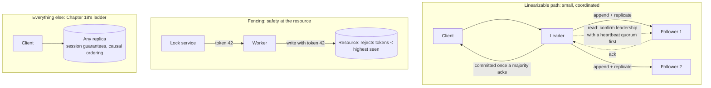
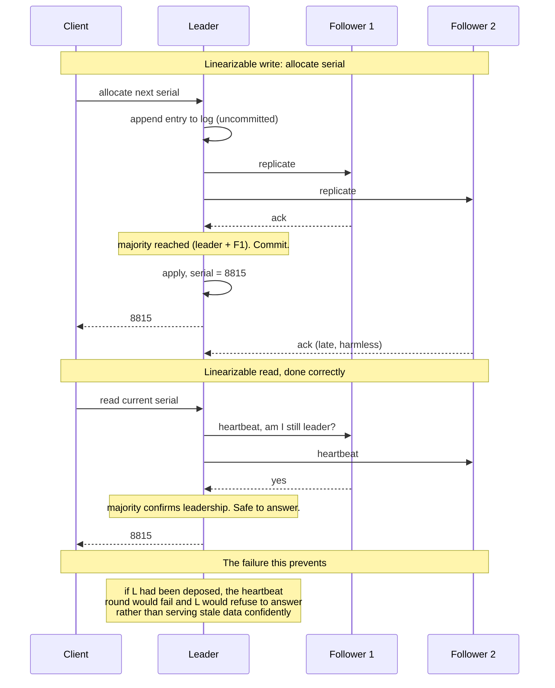

# Chapter 19: Strong Consistency

## 19.1 Problem Statement

Two operations in the tracking platform genuinely need coordination, as Chapter 15's table concluded: allocating a globally unique label serial number, and reserving the last returns slot. Everything else was solved with session guarantees and causal ordering.

The team implements those two properly. Or rather, they implement them three times, and the first two are wrong in ways that pass every test.

**Attempt one: read the counter from the primary.** The reasoning is that the primary is authoritative, so reading from it must be current. During a failover, an old primary continued serving reads for eleven seconds after a new one had been elected. It had not noticed it was demoted, because the way it would notice is by hearing from the others, and it was partitioned. Seventeen duplicate serial numbers were issued from a node that believed with complete sincerity that it was in charge.

**Attempt two: a lock in Redis.** `SET key value NX PX 30000`, do the work, delete the key. Correct-looking, widely recommended, and it failed when a process acquired the lock, paused for 34 seconds in garbage collection, woke up, and continued working while another process held the lock legitimately. Both wrote. The lock was not the problem; the assumption that holding it once meant holding it still was.

**Attempt three: compare-and-swap against a read replica.** The read half went to a replica that was 400 milliseconds behind, so two allocators read the same current value and both computed the same next one.

The pattern in all three: **they assumed strong consistency where it had never been provided.** A read from a primary, a lock in a fast key-value store, and a compare-and-swap split across a replica all look like coordination and none of them is.

This chapter is about what linearizability actually requires, why it always costs a round trip, and how to obtain it for the few operations that need it without believing you have it when you do not.

## 19.2 Why This Problem Exists

**"Strong consistency" is used loosely for several different guarantees.** People mean linearizability, serializability, or just "the primary", and those are three different things with different costs and different failure modes.

**Reads look free and are not.** Writes obviously need coordination. Reads feel like local operations, so it is easy to assume that reading from an authoritative node gives a current answer. It does not, unless that node has confirmed it is still authoritative, and confirming that requires talking to other nodes.

**A node cannot know it is still the leader.** Leadership is granted by others, and the only way to learn it has been revoked is to hear from them. A partitioned or paused node has heard nothing, which is indistinguishable from everything being fine. This is Chapter 13's slow-versus-dead constraint arriving at its most consequential.

**Locks are not the same as mutual exclusion.** A lock tells you that you acquired it. It cannot tell you that you still hold it, because arbitrary pauses are always possible, so any operation that depends on holding a lock must also be defended at the point of the write.

**And strong consistency is genuinely expensive**, in the three currencies Chapters 14 and 15 established: a round trip of latency, availability during partitions, and a throughput ceiling set by whatever must agree. So it gets avoided where it is needed and applied where it is not.

## 19.3 Real World Analogy

An auction room with a single auctioneer.

Everyone in the room sees bids in the same order, because there is one person calling them and one gavel. When the gavel falls, the item is sold, and there is no ambiguity about who bid what when. That is linearizability: a single agreed sequence, consistent with the real order events happened in.

Now put half the bidders on a phone line that drops.

The auctioneer keeps going, and the disconnected bidders keep bidding into a dead line. They believe they are participating. Nothing in their experience tells them otherwise; the phone simply produces silence, which is what a quiet moment sounds like too. **They cannot distinguish "no one has outbid me" from "I am no longer connected to the room."**

The only safe protocol is the one real auctions use: **a bid is not a bid until the auctioneer acknowledges it.** You do not get to assume; you get told. That acknowledgement is the round trip, and it is why strong consistency cannot be free.

And the failure in Section 19.1's second attempt has an exact analogue. A bidder raises their paddle, then is distracted for a minute, then completes the sentence they started. By then the item has sold. The paddle being up at the start does not mean it is still their turn, which is why the auctioneer, and not the bidder, decides what counts.

## 19.4 Simple Explanation

**Linearizability**, the formal name for strong consistency of a single object, means:

> Every operation appears to take effect instantaneously at some point between when it was invoked and when it returned, and that ordering is consistent with real time.

The practical effect is that the system behaves as if there were exactly one copy of the data. If a write completes at 10:00:00.100, every read starting after that instant sees it, from any client, from any replica.

The distinction that causes the most confusion:

| Property | Scope | Guarantees |
|---|---|---|
| **Linearizability** | A single object or key | Real-time ordering. Once a write returns, all later reads see it |
| **Serializability** | Multiple objects, within transactions | Some serial order exists. Says nothing about real time |
| **Strict serializability** | Both | Transactions, in an order consistent with real time |

A database can be serializable and still let you read stale data, because "some serial order" may place your transaction earlier than the one that just committed. Chapter 16 was about serializability. This chapter is about linearizability, and systems that give you both call it strict serializability or external consistency.

The one sentence that explains all the cost:

> **To know your answer is current, you must hear from enough other nodes that no newer answer can exist. That is a round trip, and there is no way around it.**

## 19.5 Technical Deep Dive

### 19.5.1 Reads need coordination too

The commonly missed half. A write clearly needs agreement. A read needs it as well, and for a specific reason: the node serving your read must prove it has not been superseded.

```
Leader L1 is partitioned but does not know it.
Followers elect L2, which accepts writes.

Client reads from L1: gets stale data, delivered confidently.
This is Section 19.1's first failure, and it is the default behaviour
of any system that serves reads from a leader without verification.
```

Three mechanisms make reads linearizable, in increasing order of efficiency:

| Mechanism | How | Cost |
|---|---|---|
| Read through the log | Treat the read as an entry to be replicated | Full write cost |
| **Read index** | Leader confirms leadership via a heartbeat round to a quorum, then serves locally | One round trip, no disk write |
| **Leader lease** | Leader holds a time-bounded lease; serves locally while valid | Nearly free, depends on bounded clock drift |

Read index is the standard modern approach and is what etcd uses for its default linearizable reads. The leader records its current commit index, pings a majority to confirm it is still leader, waits until it has applied up to that index, and then answers locally. One round trip, and correctness does not depend on clocks.

Leases are faster and trade correctness for a clock assumption: if a leader's clock runs slow relative to the others, it can believe its lease is valid after a new leader has been elected. Systems that use leases bound this by making the lease shorter than the election timeout by a safety margin.

The practical instruction: **check what your system does by default.** ZooKeeper, for example, provides linearizable writes but its reads are not linearizable unless you issue an explicit sync first; they can return stale data from a follower. etcd defaults to linearizable reads and offers a faster serializable read mode that may be stale. These are documented behaviours that surprise people constantly.

### 19.5.2 Consensus, briefly

Linearizability across replicas is built on consensus: getting a majority to agree on an ordered log of operations.

```
Raft, conceptually:

  1. One leader per term. Elected by majority vote.
  2. Clients send operations to the leader.
  3. The leader appends to its log and replicates to followers.
  4. Once a MAJORITY has the entry, it is committed and can be applied.
  5. A leader that cannot reach a majority cannot commit anything.

Consequences that matter:
  - Majority means an odd cluster size. 3 tolerates 1 failure, 5 tolerates 2.
  - The minority side of a partition cannot make progress. That is CP.
  - Every committed operation costs a round trip to the second-fastest node.
  - Throughput is bounded by one leader.
```

That fourth consequence is the deep reason for Chapter 15's arithmetic: the cost of a linearizable operation is the round trip to whichever node completes the majority, which is why placement dominates.

### 19.5.3 Locks, leases, and fencing

Section 19.1's second failure is important enough to treat carefully, because distributed locks are used everywhere and are usually used incorrectly.

**A lock service can tell you that you acquired a lock. It cannot tell you that you still hold it**, because between the acquire and the write, your process can be paused by garbage collection, descheduled, or partitioned for arbitrarily long. When it resumes, the lease may have expired and someone else may hold the lock.

No amount of lock service sophistication fixes this, because the problem is on the client side. The fix is **fencing**: the lock service issues a monotonically increasing token with each grant, the client passes it to the resource, and the resource rejects any operation carrying a token older than the highest it has seen.

```java
// Acquire returns a token that increases with every grant.
Lease lease = lockService.acquire("allocator", Duration.ofSeconds(30));

// ... arbitrary pause may happen here. This is unavoidable.

// The RESOURCE enforces safety, not the client.
storage.write(data, lease.fencingToken());   // rejected if token < highest seen
```

```java
// The resource side. This is where correctness actually lives.
public void write(byte[] data, long token) {
    if (token < highestTokenSeen) {
        throw new StaleTokenException("fenced: " + token + " < " + highestTokenSeen);
    }
    highestTokenSeen = token;
    doWrite(data);
}
```

The rule to carry: **if the protected resource cannot check a fencing token, the lock is advisory and you should not rely on it for correctness.** Use it to reduce contention, and put the real guarantee somewhere the resource can enforce it, such as a unique constraint or a conditional write.

This is also why single-instance lock implementations built on a cache are unsafe for correctness even when the cache is highly available: the failure mode is client pauses, not server failures.

### 19.5.4 Where you actually need it

The list is short, and it is worth keeping short because each entry costs a round trip.

| Operation | Why nothing weaker works |
|---|---|
| Allocate a unique identifier | Two allocators producing the same value is unrecoverable |
| Reserve a scarce resource | Seats, slots, inventory. Convergence cannot un-sell |
| Enforce a global uniqueness constraint | Usernames, emails, serial numbers |
| Leader election | Two leaders is the definition of split brain |
| Distributed lock or lease | Only meaningful if grants are ordered |
| Configuration and membership | Every node must agree on who is in the cluster |
| Sequence numbers with no gaps | Invoice numbers, ledger ordering |
| Compare-and-swap on shared state | The read and the write must be one atomic step |

And the operations that look like they need it and do not: reading a status, showing a count, listing history, searching, rendering a feed, recording an observation. Chapter 18's ladder covers all of them.

A cheaper alternative worth knowing for the first row: if uniqueness is required but a strict sequence is not, allocate ranges. A node takes a block of 10,000 identifiers under coordination once, then hands them out locally with no coordination at all. You pay one round trip per 10,000 operations instead of one per operation, and you give up gap-free sequences.

### 19.5.5 The cost, precisely

| Cost | Magnitude | Source |
|---|---|---|
| Latency per operation | One round trip to the quorum-completing node | Chapter 15 |
| Availability | Minority partitions cannot proceed | Chapter 14 |
| Throughput | Bounded by a single leader for the key range | One serialisation point |
| Blast radius | Leader failure pauses everything until election | Election timeout, typically seconds |
| Operational | Odd cluster sizes, membership changes, quorum loss recovery | Consensus systems are their own discipline |

The mitigations, in order of usefulness:

**Partition the coordination.** One leader per key range rather than one leader for everything. Ten shards means ten leaders and ten times the write throughput, with linearizability preserved per key. This is how distributed SQL systems scale writes.

**Keep the coordinated set small.** Only the operations in Section 19.5.4's table go through consensus. Everything else uses Chapter 18's ladder.

**Batch through the leader.** A leader committing 500 operations in one round trip amortises the cost, which is Chapter 8's arithmetic applied to consensus.

**Place the quorum close.** Chapter 15's central point: the same protocol costs 2 milliseconds across zones and 90 across regions.

## 19.6 Architecture Diagram



```
 LINEARIZABLE (few operations)        WEAK (almost everything)
   client -> leader                     client -> any replica
              |                                    |
     append + replicate                  version token for
              |                          read-your-writes,
   majority ack -> committed             causal ordering by
              |                          partition key
        respond to client

 READS: leader confirms leadership with a heartbeat quorum
        BEFORE answering, or the answer may be from a
        leader that was deposed and does not know it.

 LOCKS: acquire returns a fencing token.
        The RESOURCE rejects stale tokens.
        The client cannot guarantee it still holds the lock.
```

## 19.7 Request Flow



1. **The write is appended locally but not applied** until a majority has it. An uncommitted entry can still be lost.
2. **Majority, not all.** Waiting for every follower would inherit the worst tail latency and would fail whenever any node is down.
3. **The commit point is when a majority acknowledges,** which is the moment the operation becomes real.
4. **The read confirms leadership before answering.** Without this step, Section 19.1's first failure occurs, and it is silent.
5. **A deposed leader fails the heartbeat round and refuses to answer,** which converts a wrong answer into an error. That is the trade linearizability makes: unavailability instead of incorrectness.

## 19.8 Internal Components

| Component | Role | Failure mode | Guard |
|---|---|---|---|
| Consensus log | Ordered, replicated operation sequence | Quorum loss halts progress | Odd cluster size, monitor quorum health |
| Leader election | One writer per term | Split brain if terms are ignored | Term numbers, majority votes |
| Read index or lease | Makes reads linearizable | Reads served without leadership confirmation | Use the system's linearizable read mode explicitly |
| Fencing tokens | Makes stale holders harmless | Resource does not check them | Enforce at the resource, not the client |
| Quorum size | Determines fault tolerance | Even node count, so no majority exists | Always odd; add a witness rather than a fourth voter |
| Membership changes | Adding and removing nodes safely | Naive changes create two disjoint majorities | Use the system's joint-consensus mechanism |
| Batching | Amortises round trips | Not enabled, so per-operation cost dominates | Batch at the leader |
| Range partitioning of leadership | Scales writes | One global leader as a bottleneck | Leader per shard |

## 19.9 Production Example

**Spanner provides strict serializability across regions**, which it calls external consistency, using synchronised clocks with bounded uncertainty. Transactions wait out the uncertainty interval before committing, so that commit timestamps are guaranteed to reflect real-time order. The engineering achievement is turning a clock assumption into a bounded, measured quantity rather than a hope. The cost is exactly Chapter 15's: a commit wait plus cross-region consensus, which is why the same system is fast within a region and expensive across them.

**etcd and ZooKeeper differ in their read guarantees, and the difference catches people.** etcd serves linearizable reads by default using a read index, and offers a faster serializable mode that may return stale data. ZooKeeper provides linearizable writes but reads may be served from a follower and can be stale, unless the client issues a sync operation first. Both behaviours are documented and both are surprising to someone who assumed that a coordination service is linearizable throughout.

**The distributed locking debate**, prompted by Kleppmann's analysis of lock algorithms built on a replicated cache, settled on a durable point: no distributed lock is safe for correctness without fencing, because client-side pauses cannot be bounded. Whether the lock service itself is highly available is a separate and lesser question. If the resource cannot reject a stale token, the lock is advisory.

## 19.10 Advantages

- **The system behaves as if there were one copy**, which is the simplest possible mental model.
- **Invariants are enforceable.** Uniqueness, allocation, and mutual exclusion become possible rather than approximate.
- **No conflict resolution.** There are no concurrent versions to merge, because operations are ordered.
- **Failures are visible.** A minority partition returns errors rather than stale answers, so wrongness becomes unavailability, which is detectable.
- **Reasoning is compositional.** Code written against a linearizable store can be reasoned about like single-threaded code.

## 19.11 Limitations

- **A round trip per operation**, priced by replica distance.
- **Unavailable in a minority partition**, by Chapter 14's theorem.
- **Throughput bounded by one leader** per key range.
- **Election pauses**, typically seconds, during which the affected range accepts nothing.
- **Clock-based optimisations carry clock assumptions,** which fail in unusual and hard-to-detect ways.
- **It does not compose across systems.** Linearizable in your database says nothing about the payment provider you also called.
- **It is frequently claimed and not delivered**, particularly for reads.

## 19.12 Trade-offs

| Dial | One way | The other way |
|---|---|---|
| Read mode | Linearizable: correct, one round trip | Serializable or local: fast, may be stale |
| Read optimisation | Lease: nearly free, assumes bounded clock drift | Read index: one round trip, no clock assumption |
| Cluster size | 5 nodes: tolerates 2 failures, slower quorum | 3 nodes: faster quorum, tolerates 1 |
| Leadership scope | One global leader: simple, throughput ceiling | Leader per shard: scales writes, more moving parts |
| Identifier allocation | Strict sequence: gap-free, coordination per value | Range allocation: one round trip per block, gaps |
| Locking | Fencing tokens: safe, requires resource support | Advisory locks: simple, unsafe for correctness |

**Remove leadership confirmation from reads.** You gain a round trip per read. You lose linearizability entirely and silently, which is Section 19.1's first failure.

**Remove fencing.** You gain simplicity. You lose the only defence against a paused client, so the lock protects against contention and not against correctness violations.

**Remove consensus and use a single node.** You gain the lowest possible latency and true linearizability while it is up. You lose availability on any failure, and Chapter 12's durability guarantees.

## 19.13 Common Mistakes

**Assuming a read from the primary is linearizable.** It is not, unless leadership was confirmed.

**Assuming a distributed lock provides mutual exclusion.** It provides ordered grants; safety requires fencing at the resource.

**Splitting a compare-and-swap across a replica.** The read and the write must be one atomic operation on the same authoritative state.

**Even numbers of voting nodes,** which produces partitions with no majority on either side.

**Applying linearizability broadly** because a bug looked like a consistency problem, rather than naming the anomaly first as Chapter 18 recommends.

**Confusing serializability with linearizability**, and therefore expecting real-time freshness from a transactional database's default read.

**Ignoring election pauses** in availability calculations.

**Trusting lease-based reads without monitoring clock drift.**

## 19.14 Interview Questions

**Q: Define linearizability.** Every operation appears to take effect atomically at a single point between its invocation and response, in an order consistent with real time. Once a write returns, every subsequent read from any client sees it, so the system behaves as if there were one copy.

**Q: Linearizability versus serializability?** Linearizability concerns single objects and real-time ordering. Serializability concerns transactions over many objects and only requires equivalence to some serial order, with no real-time constraint. Both together is strict serializability.

**Q: Why do reads need coordination?** Because the node serving the read must prove it has not been superseded. A leader that has been deposed while partitioned cannot tell the difference between silence and health, so it will serve stale data confidently unless it first confirms leadership with a quorum.

**Q: Why is a distributed lock not sufficient for mutual exclusion?** Because the client can be paused arbitrarily between acquiring the lock and using it, by garbage collection or descheduling, and may resume after the lease expired and another holder took over. The fix is fencing tokens checked by the protected resource.

**Q: How do you make linearizable reads cheaper?** A read index, where the leader confirms leadership with one heartbeat round to a quorum then answers locally, or a leader lease, which is nearly free but depends on bounded clock drift. Batching and placing the quorum within one region also help substantially.

**Q: Which operations genuinely need it?** Unique identifier allocation, scarce resource reservation, uniqueness constraints, leader election, lock grants, cluster membership and configuration, gap-free sequences, and compare-and-swap. Almost everything else is served by Chapter 18's ladder.

**Q: How do you scale a linearizable system's writes?** Partition leadership by key range so each shard has its own leader, batch operations through each leader, and keep quorums geographically close. A single global leader is a hard throughput ceiling.

**Q: What is a cheaper alternative to allocating unique identifiers one at a time?** Range allocation: coordinate once to claim a block, then hand out values locally with no coordination. One round trip per block instead of per value, at the cost of gaps in the sequence.

## 19.15 Production Best Practices

1. **Use your system's explicit linearizable read mode,** and verify what the default actually is.
2. **Confirm leadership before serving reads**, via read index or a lease with monitored drift.
3. **Always use fencing tokens** with distributed locks, and enforce them at the resource.
4. **Treat locks as advisory** unless the resource can check tokens.
5. **Keep the coordinated set of operations small,** and list them explicitly.
6. **Partition leadership by key range** to scale writes.
7. **Use odd cluster sizes,** and witnesses rather than even voter counts.
8. **Place quorum members within one region** unless the requirement is genuinely global.
9. **Allocate identifiers in ranges** when gap-free sequences are not required.
10. **Monitor quorum health, election frequency, and leader stability,** since elections are user-visible pauses.
11. **Test partition behaviour explicitly,** including the deposed-leader read case.

## 19.16 Summary

Linearizability makes a replicated system behave as if there were exactly one copy: every operation takes effect at a single instant, and the order matches real time. That is the strongest guarantee available and the simplest to reason about, and it is expensive for a reason that cannot be engineered away. To know your answer is current, you must hear from enough other nodes that no newer answer can exist, and hearing from them is a round trip.

The half that gets missed is reads. A node cannot know it is still the leader without asking, so a read served by an authoritative-looking node that has been quietly deposed is stale and confident. Linearizable reads therefore require either a leadership confirmation round or a time-bounded lease, and the difference between a system's default read mode and its linearizable read mode is the difference between Section 19.1's first failure and correctness.

Locks have the same shape of problem in a different place. A lock service can tell you that you acquired a lock and cannot tell you that you still hold it, because your process can be paused for longer than the lease. The only reliable defence is fencing: a monotonically increasing token issued on grant and checked by the resource, so a stale holder's writes are rejected rather than merely unlikely.

The cost is a round trip, unavailability in a minority partition, and a throughput ceiling per leader. So keep the coordinated set small and explicit, partition leadership to scale it, place quorums close, and allocate in ranges where a strict sequence is not required. Everything not on that short list belongs on Chapter 18's ladder, where the guarantees cost one field rather than one round trip.

## 19.17 Quick Revision Notes

- Linearizability: operations appear atomic at one instant, ordered consistently with real time. Single-copy illusion.
- Serializability is about transactions and some serial order. Linearizability is about real time. Both is strict serializability.
- Reads need coordination too. A deposed leader serves stale data confidently.
- Linearizable read mechanisms: through the log (expensive), read index (one heartbeat round), leader lease (cheap, clock assumption).
- Check your system's defaults. ZooKeeper reads are not linearizable without sync; etcd's are by default.
- Consensus: one leader per term, majority commits, minority cannot progress. Odd cluster sizes.
- Cost per operation is a round trip to the quorum-completing node. Placement dominates, per Chapter 15.
- Locks give ordered grants, not mutual exclusion. Client pauses are unbounded.
- Fencing tokens are mandatory: monotonic, issued on grant, enforced by the resource.
- If the resource cannot check tokens, the lock is advisory.
- Need it for: unique ids, scarce reservations, uniqueness constraints, leader election, locks, membership, gap-free sequences, compare-and-swap.
- Scale it by partitioning leadership per key range, batching at the leader, and keeping quorums local.
- Range allocation trades gap-free sequences for one round trip per block.
- Elections are user-visible pauses; include them in availability estimates.

## 19.18 Mini Quiz

1. Define linearizability and contrast it with serializability.
2. Why can a read from the primary be stale?
3. Explain read index and leader lease, and the assumption each depends on.
4. A worker acquires a lock, pauses for 40 seconds, then writes. What prevents corruption?
5. Why must consensus clusters have an odd number of voters?
6. Give three operations that need linearizability and three that look like they do but do not.
7. How would you scale a linearizable counter beyond one leader's throughput?
8. Your lock service is highly available and your data is still corrupted by concurrent writers. Explain.

**Answers**

1. Linearizability means each operation appears to take effect at one instant between invocation and response, with the ordering consistent with real time, so once a write returns every later read sees it. Serializability means a set of transactions is equivalent to some serial execution, with no requirement that the order match real time, so a serializable system may place your transaction before one that already committed and return stale data. Strict serializability requires both.
2. Because the node may have been deposed without knowing. Leadership is granted by other nodes, and a partitioned or paused leader hears nothing, which is indistinguishable from a quiet, healthy cluster. Unless it confirms leadership with a quorum before answering, it will serve its last known state confidently.
3. Read index: the leader notes its commit index, sends a heartbeat round to a majority to confirm it is still leader, waits until it has applied up to that index, then serves locally. It costs one round trip and assumes nothing about clocks. Leader lease: the leader holds a time-bounded grant and serves locally while it is valid, costing nothing extra, but it assumes clock drift between nodes is bounded, since a slow clock can make a deposed leader believe its lease is still valid.
4. Fencing. The lock grant carries a monotonically increasing token, and the resource records the highest token it has seen and rejects any write carrying a lower one. When the paused worker resumes and writes with token 42 while the resource has already accepted token 43, the write is refused. Nothing on the client side can provide this, because the pause is unbounded and undetectable from inside.
5. Because progress requires a strict majority, and an even split leaves no majority on either side, so neither partition can elect a leader or commit anything. With four voters split two and two, the entire cluster stops. Odd sizes guarantee that at most one side can hold a majority, and adding a lightweight witness is preferable to adding a fourth full voter.
6. Need it: allocating a globally unique invoice number, reserving the last seat, electing a leader. Also acceptable: username uniqueness, cluster membership, compare-and-swap. Do not need it: displaying a parcel status, showing a like count, rendering a feed, listing search results, recording a telemetry event, reading a product description. Those are all satisfied by session guarantees or causal ordering at a fraction of the cost.
7. Partition it. Split the counter into per-shard or per-node sub-counters, each with its own leader, and sum on read, which is the CRDT counter approach from Chapter 18 when exactness of ordering is not required. If a single strict sequence is required, allocate ranges: coordinate once to claim a block of values, then hand them out locally, accepting gaps. Batching many increments into one consensus round also multiplies throughput without changing the guarantee.
8. Because lock service availability is not the property that was missing. The corruption comes from a client pausing between acquiring the lock and using it, so its lease expired and another client legitimately acquired the lock while the first was still holding a stale belief. Both then wrote. The fix is fencing tokens enforced by the resource, and no amount of replication or availability in the lock service addresses it.

## 19.19 Hands-on Exercise

**Part 1: produce a stale leader read.** Run a three-node etcd or similar cluster. Partition the leader from the other two, then read from it using the non-linearizable read mode while writing to the new leader. Record the staleness. Repeat using the linearizable read mode and confirm the partitioned node returns an error instead of stale data.

**Part 2: break a lock without fencing.** Implement a lock with a 5 second lease. Acquire it in a worker, then pause that worker for 10 seconds with a debugger or a deliberate sleep, and have a second worker acquire and write. Let the first worker resume and write. Observe the corruption. Then add fencing tokens checked by the resource and repeat.

**Part 3: measure the cost.** Benchmark the same operation with local reads, linearizable reads via read index, and full log reads. Then move one cluster member to another region and repeat. The two tables together are Chapter 15's argument with your own numbers.

**Part 4: scale it.** Implement identifier allocation two ways: one value per consensus operation, and range allocation of 10,000 at a time. Measure throughput for both, and note where gaps appear in the second.

## 19.20 Further Reading

- *Linearizability: A Correctness Condition for Concurrent Objects*, Herlihy and Wing, 1990. The original definition.
- *In Search of an Understandable Consensus Algorithm*, Ongaro and Ousterhout, 2014. Raft, including the read-only query optimisation in section 6.
- *How to do distributed locking*, Martin Kleppmann, 2016. The fencing token argument, and the clearest explanation of why client pauses defeat lock services.
- *Spanner: Google's Globally-Distributed Database*, Corbett et al., OSDI 2012, on external consistency and bounded clock uncertainty.
- *Designing Data-Intensive Applications*, chapter 9, on linearizability, ordering, and the relationship between consensus and total order broadcast.
- etcd and ZooKeeper documentation on read consistency modes. Read them specifically to find out what your default is.

---

**Next chapter: Chapter 20, Idempotency.** The property that makes retries safe, referenced in almost every chapter so far and now treated properly: how to design idempotency keys, what to do about concurrent duplicates, and how to make operations idempotent that are not naturally so.
