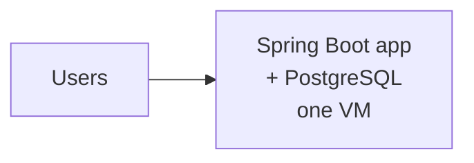
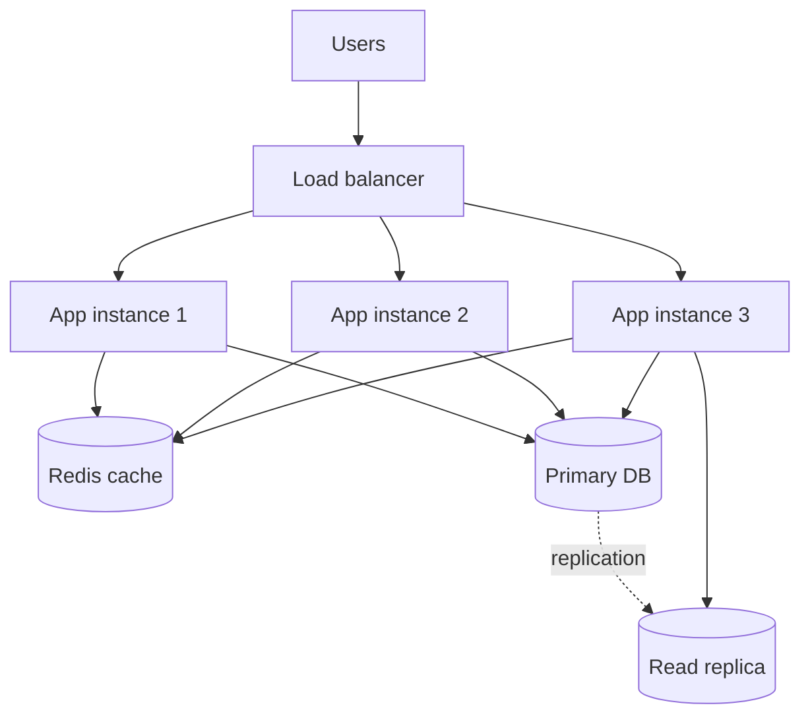
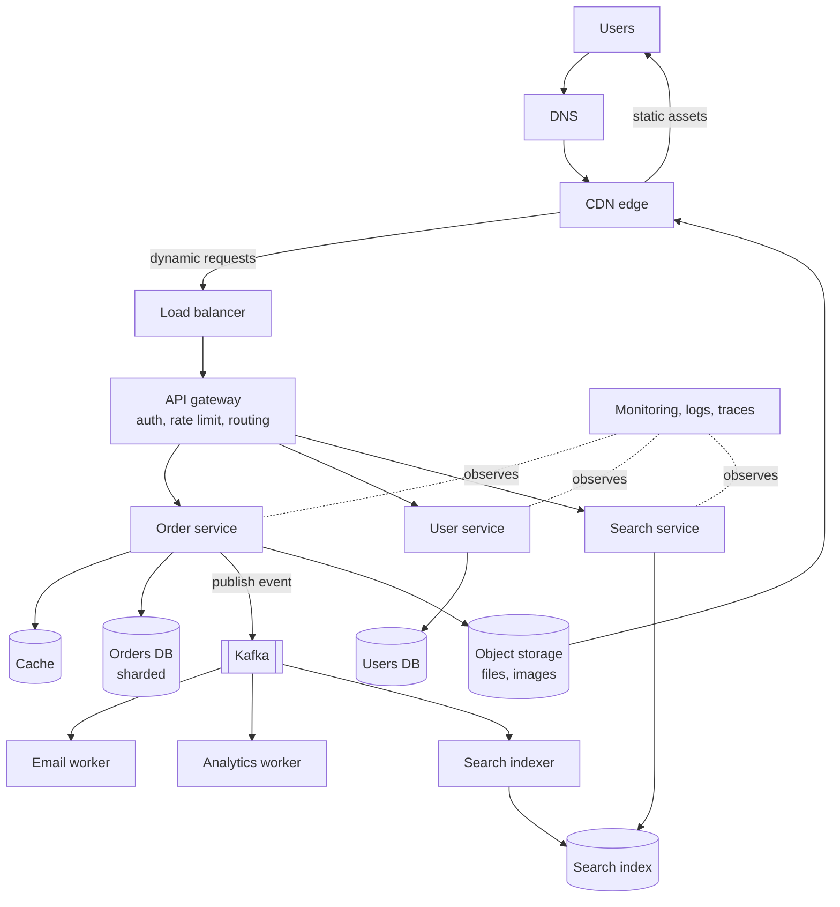
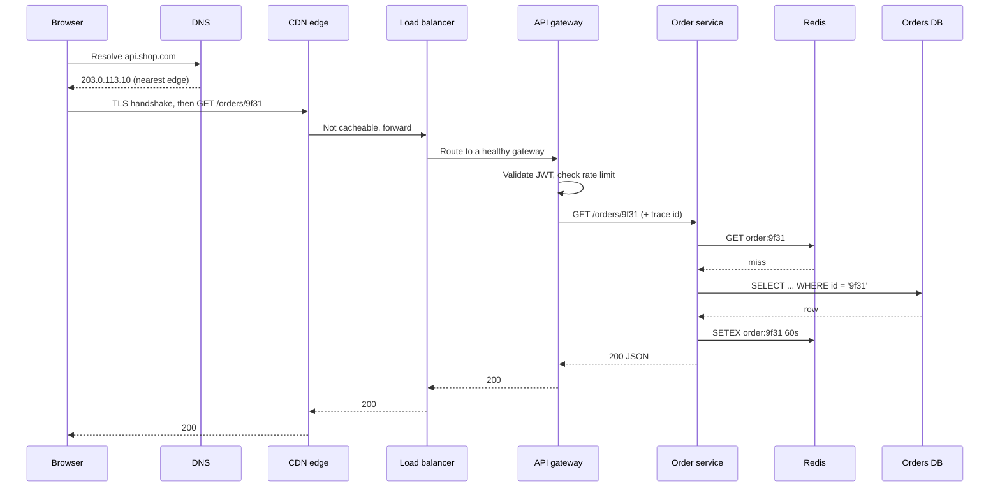

# Chapter 1: What Is System Design?

## 1.1 Problem Statement

Here is a story that happens somewhere in the world roughly every week.

A team of three engineers builds an internal tool for a logistics company. It is a Spring Boot application. Orders come in, warehouse staff mark them packed, and a dashboard shows the day's numbers. It runs on a single virtual machine with a single PostgreSQL database on the same box. The code is clean. Tests pass. Code review is thorough. Forty warehouse users hammer it all day and it never breaks.

Then the company wins a contract with a national retailer. Overnight, the tool has to serve 900 warehouses instead of 4, mobile scanners instead of desktops, and a public order-tracking page that customers hit from their phones. Traffic goes from about 30 requests per second to about 12,000 requests per second, with sharp spikes every evening.

Nothing about the business logic was wrong. The code that computed "is this order ready to ship" is still correct. And yet:

- Page loads that took 80 milliseconds now take 14 seconds.
- The database connection pool is exhausted, so healthy requests queue behind slow ones.
- The dashboard's `COUNT(*)` query locks up tables that order updates need.
- A deploy takes the whole thing offline for 90 seconds, which is now visible to customers.
- One day the disk fills with logs and the entire company stops shipping.

The team's instinct is to look for a bug. There is no bug. The problem is that the *system* was designed for one machine, one region, one kind of user, and a load level nobody wrote down. Every one of those assumptions was invisible, because assumptions you never state feel like facts.

That gap, between "my code is correct" and "my system survives reality", is what this book is about.

## 1.2 Why This Problem Exists

Most of us learn to program in an environment that hides every hard part of computing.

When you write a Java method, you get a world with very generous rules:

- Memory is instant and reliable.
- Function calls always return.
- There is exactly one copy of your data.
- Nothing else is modifying that data behind your back.
- If something fails, an exception is thrown and you can see it.

Every single one of those rules stops being true the moment your program becomes two programs on two machines talking over a network.

| Assumption in single-process code | What actually happens in a distributed system |
|---|---|
| A call returns a result or throws | A call may return, may fail, or may hang forever with no answer |
| Data has one copy | Data has several copies that disagree with each other for a while |
| Time is consistent | Two machines have clocks that drift apart by milliseconds or seconds |
| Failure is visible | You cannot tell "the other machine is dead" apart from "the other machine is slow" |
| Load is what I tested with | Load is whatever the world decides to send you, when it decides to send it |

There is a second reason this problem exists, and it is more human. Systems do not get designed once. They accumulate. Somebody adds a cache to fix a slow page. Somebody adds a queue to fix a timeout. Somebody adds a second server to survive a crash. Three years later nobody can explain why any of it is there. System design is partly the skill of making those choices on purpose instead of by accident, and being able to explain each one.

And a third reason: hardware has a ceiling. This is worth internalizing early, because a lot of beginners assume the answer to load is always "bigger machine". A single modern server can do an enormous amount of work. It also has a hard limit on CPU cores, RAM, disk throughput, and network bandwidth, and its price does not grow linearly with those numbers. Past a certain point, the only way forward is more machines, and more machines means everything in the table above.

## 1.3 Real World Analogy

Think about a restaurant.

**One chef, eight tables.** The chef takes the order, cooks it, plates it, and carries it out. There is no coordination cost because there is only one person. This is your single-process application. It is genuinely the best design at this size. Adding a manager and a ticket system to an eight-table restaurant would make it slower, not faster.

**Now 300 tables.** One chef cannot do it, so you split the work: a host who seats people, waiters who take orders, a ticket rail that holds pending orders, a grill station, a fry station, a dessert station, a dishwasher, a walk-in fridge, and a manager watching the whole floor.

Notice what you just invented, without using a single computing term:

| Restaurant | System |
|---|---|
| Host at the door | Load balancer |
| Ticket rail holding orders | Message queue |
| Specialised stations | Microservices |
| Walk-in fridge | Database |
| Prepped ingredients on the line | Cache |
| Manager watching the floor | Monitoring and alerting |
| Second chef who can cover the grill | Replica and failover |
| Fire drill procedure | Incident runbook |

The analogy also carries the costs, which is why it is worth using. Splitting the kitchen introduced problems the single chef never had. Tickets get lost between the rail and the grill. The fry station is backed up while dessert sits idle. Two waiters claim the same order. The fridge inventory count disagrees with what is actually on the shelf. Nobody knows whose fault a bad plate was.

Those are not bad-restaurant problems. They are large-restaurant problems. Distributed systems work the same way: scale does not remove problems, it trades small-system problems for coordination problems.

## 1.4 Simple Explanation

Strip away the vocabulary and system design is answering six questions about software that has to serve many users at once.

1. **What must it do?** The features. Send a message, upload a video, split a bill.
2. **How well must it do it?** How fast, for how many users, how often is it allowed to be down, how much data can we afford to lose.
3. **What pieces do we need?** Servers, databases, caches, queues, storage, and what each one is responsible for.
4. **How do the pieces talk?** Direct calls, or messages left in a queue? Which protocol? Who waits for whom?
5. **Where does the data live?** Which database, in what shape, split how, copied where.
6. **What happens when something breaks?** Because it will, and "we did not think about that" is not an answer you can give twice.

A useful way to think about the difference between coding and system design:

> Writing code is deciding **what happens**. System design is deciding **where it happens, how many places it happens at once, and what happens when one of those places disappears.**

Here is the shortest possible concrete example of the difference. This controller is perfectly good Java:

```java
@RestController
public class VisitController {

    // In-memory counter of how many times each page was viewed
    private final Map<String, Integer> views = new ConcurrentHashMap<>();

    @PostMapping("/pages/{pageId}/view")
    public int recordView(@PathVariable String pageId) {
        return views.merge(pageId, 1, Integer::sum);
    }
}
```

Correct code. Thread safe. Passes its unit test. And it is broken the instant you run three copies of this service behind a load balancer, because each copy has its own `views` map. Three instances means three disagreeing counters, and a deploy throws all three away. No compiler will warn you. No test on your laptop will fail.

The fix is not a code fix, it is a design decision: this state does not belong inside the service.

```java
@RestController
public class VisitController {

    private final StringRedisTemplate redis;

    public VisitController(StringRedisTemplate redis) {
        this.redis = redis;
    }

    @PostMapping("/pages/{pageId}/view")
    public long recordView(@PathVariable String pageId) {
        // One shared counter, outside the service, survives restarts
        return redis.opsForValue().increment("views:" + pageId);
    }
}
```

That one move, pushing state out of the application so that any instance can serve any request, is the single most valuable habit in this entire book. It is called building a **stateless service**, and Chapter 21 covers it properly. Notice that we arrived at it by asking a design question, not by finding a bug.

## 1.5 Technical Deep Dive

### 1.5.1 The four resources

Every performance problem you will ever debug is a shortage of one of four things.

| Resource | What runs out | Typical symptom |
|---|---|---|
| CPU | Compute cycles | High CPU percentage, requests slow across the board, garbage collection pauses |
| Memory | RAM | Swapping, out-of-memory kills, cache hit rate collapsing |
| Disk | Space, or IO operations per second | Slow queries, write latency spikes, full disk taking the service down |
| Network | Bandwidth, or connection slots | Timeouts, slow large responses, connection refused errors |

The slowest of the four for a given request is the **bottleneck**. Optimising anything that is not the bottleneck changes nothing measurable, which is why "we made the code 30 percent faster and the page is still slow" is such a common and demoralising experience. The page was waiting on disk.

Finding the bottleneck before touching anything is the whole game. Every scaling technique in Parts 1 and 5 is really a way of removing one specific bottleneck, and it is worth knowing which one:

- Caching removes repeated database work, which is usually disk and CPU.
- A CDN removes long-distance network transfer.
- Read replicas remove read load from a single database's CPU and disk.
- Sharding removes the limit of one machine's disk and memory.
- Queues remove the need for the caller to wait on a slow downstream.

### 1.5.2 Latency numbers you should carry in your head

You cannot reason about a design without a rough sense of what things cost. These are order-of-magnitude figures, not benchmarks, and they change with hardware, but the *ratios* have been stable for years and the ratios are the point.

| Operation | Rough time | Compared to memory |
|---|---|---|
| L1 cache reference | 1 ns | 100x faster |
| Main memory reference | 100 ns | 1x (baseline) |
| Read 1 KB from SSD | 10 to 20 µs | ~150x slower |
| Round trip inside the same datacenter | 0.5 ms | ~5,000x slower |
| Read 1 MB sequentially from SSD | ~0.5 to 1 ms | ~7,000x slower |
| Random seek on a spinning disk | 5 to 10 ms | ~70,000x slower |
| Round trip India to US East Coast | ~200 ms | ~2,000,000x slower |

Three lessons fall straight out of this table.

**Memory is roughly a thousand times better than a network hop.** That is why caching exists, and why a cache that lives on the same machine beats a cache one network hop away for the hottest data.

**Distance is expensive and physics sets the floor.** Light in fibre covers about 200 km per millisecond, and real routes are not straight. No amount of clever code makes Mumbai to Virginia faster than roughly 200 ms round trip. If your users are worldwide and you have one datacenter, some of your users have a slow product and always will. That is why CDNs and multi-region deployments exist.

**Round trips matter more than payload size.** Ten sequential 1 KB calls across a datacenter cost about 5 ms in pure waiting. One 10 KB call costs about 0.5 ms. This is why chatty APIs feel slow, and why batching is often the cheapest win available.

### 1.5.3 The two categories of requirement

Every design starts by splitting requirements in two. Chapters 5 and 6 go deep on this, but you need the distinction now because it shapes everything.

**Functional requirements** are what the system does. "A user can shorten a URL." "A user can see who read their message." These are usually easy to get out of a product manager and easy to test.

**Non-functional requirements** are how well it must do it. "99.9 percent of redirects complete in under 50 ms." "The system survives losing one datacenter." "We can lose at most 1 second of writes." These are the ones that actually determine your architecture, and they are almost never handed to you. You have to ask.

Two designs for the same feature list can look nothing alike:

| Same feature | Small scale answer | Large scale answer |
|---|---|---|
| Show a user's follower count | `SELECT COUNT(*) FROM follows WHERE followee_id = ?` | Pre-computed counter in Redis, updated asynchronously from an event stream |
| Upload a profile photo | Save to local disk, serve from the app | Upload to object storage, serve through a CDN, resize in a background worker |
| Send a welcome email | Call the mail provider inside the request | Publish an event, a consumer sends it and retries on failure |

Neither column is more correct. The left column at small scale is *better* engineering than the right column, because it is less code, fewer moving parts, and fewer ways to fail. Choosing the right column too early is one of the most expensive mistakes teams make, and Section 1.13 comes back to it.

### 1.5.4 Vocabulary used for the rest of the book

Worth fixing these terms now so later chapters can move fast.

- **Client**: whatever makes the request. A browser, a mobile app, another service.
- **Server / instance / node**: one running copy of your process. Three instances of the same service is normal.
- **Service**: a logical unit of functionality, usually deployed as several identical instances.
- **Request path (or hot path)**: everything that happens between the user acting and the user seeing a result. Work on the request path costs the user time. Work off it does not.
- **Synchronous**: the caller waits for the answer.
- **Asynchronous**: the caller hands off the work and moves on.
- **State**: data that must be remembered between requests.
- **Stateless service**: an instance that keeps no request-specific state, so any instance can serve any request.
- **Single point of failure (SPOF)**: a component whose death takes the system down. Finding and removing these is most of what reliability work looks like.
- **Fan-out**: one incoming request causing many outgoing ones. A newsfeed write that touches 10,000 followers has a fan-out of 10,000, and fan-out is where systems quietly die.

## 1.6 Architecture Diagram

The clearest way to see what system design *is* is to watch one application grow. Below are three snapshots of the same product. Later chapters expand every box here into its own chapter.

**Stage 1: one box. Serves real users, and it is the right design at the start.**



Everything shares one machine's CPU, memory, and disk. A traffic spike on the app starves the database. A deploy is downtime. Losing the disk loses the company.

**Stage 2: separate the tiers, add copies, add a cache.**



Three things changed and each one bought something specific. Multiple app instances mean a crash or a deploy no longer means downtime, and CPU-bound work scales by adding instances. The cache means repeated reads stop touching disk. The read replica means reporting queries stop competing with order writes.

**Stage 3: the shape most large systems converge on.**



Same ASCII version, since Mermaid does not render inside Google Docs:

```
                    Users
                      |
                     DNS
                      |
                 [ CDN edge ]  ---- static assets ---> Users
                      |
              [ Load balancer ]
                      |
              [ API gateway ]         auth / rate limit / routing
             /        |        \
      Order svc   User svc   Search svc
        |   \         |            |
     Cache  \      Users DB    Search index
        |    \                      ^
   Orders DB  \                     |
   (sharded)   \                    |
                +--> [ Kafka ] --> Email worker
                                --> Analytics worker
                                --> Search indexer ---+

   Object storage (files, images) -----> CDN
   Monitoring / logs / traces observes everything
```

Look at what the arrows tell you. The gateway exists so that authentication and rate limiting are not copy-pasted into every service. Kafka exists so that placing an order does not have to wait for an email to send. The search index exists because relational databases are bad at full-text search. Object storage exists because your database is a terrible place to store 4 MB images.

Every box costs something: money, an on-call rotation, a new failure mode, and a new thing a new joiner has to learn. A design where you can justify every box is a good design. A design with boxes nobody can justify is a liability, and interviewers probe exactly there.

## 1.7 Request Flow

Follow one request, `GET /orders/9f31`, through Stage 3. This is the mental model to build now, because Part 5 traces this same path for 36 different products.



Step by step, with the reason each hop exists:

1. **DNS lookup.** The browser turns `api.shop.com` into an IP address. Often cached locally, so this is frequently free. Geographic DNS can hand back a different IP per region, which is how a global system points you at the nearest datacenter. (Chapter 27.)
2. **TLS handshake.** One or two extra round trips to set up encryption. On a 200 ms link that alone is 200 to 400 ms before a single byte of your data moves, which is why connection reuse and HTTP/2 matter. (Chapters 76 and 79.)
3. **CDN edge.** A server physically near the user. Static assets are served straight from here and never touch your infrastructure. API calls pass through, but still benefit from a warm connection to your origin. (Chapter 28.)
4. **Load balancer.** Picks one healthy app instance. Also the thing that removes dead instances from rotation, which is how a crashing instance stops being a user-visible outage. (Chapter 26.)
5. **API gateway.** Cross-cutting work in one place: verify the token, enforce the rate limit, attach a trace id, route to the right service. (Chapters 24 and 61.)
6. **Order service.** The business logic. This is the part you would have written on day one.
7. **Cache lookup.** Roughly 0.5 ms. On a hit, the request ends here and the database never learns it happened. Hit rate is the single most important number for read-heavy systems. (Chapters 29 to 31.)
8. **Database query.** Milliseconds if there is an index on `id`, seconds if there is not. Same SQL, same code, thousand-fold difference. (Chapters 34 and 35.)
9. **Cache fill.** Store the result with an expiry so the next reader is fast. Choosing that expiry, and deciding what to do when the row changes before it expires, is cache invalidation, and it is genuinely hard. (Chapter 30.)
10. **Response travels back** through the same chain. Every hop added latency on the way in and adds a little more on the way out.

Two habits to build from this diagram.

First, **count the hops**. Ten components in the path means ten chances to add latency and ten things that can fail. Every hop must earn its place.

Second, **notice where you have a choice**. The email that goes out when an order ships does not need to be in this path. Put it in the path and the user waits for a third-party mail API, and a mail outage becomes a checkout outage. Move it to a queue and the user gets their response in 40 ms while a worker handles delivery and retries. Same feature, different design, and one of them is dramatically better. Recognising which work belongs on the request path and which does not is a large part of practical system design.

## 1.8 Internal Components

The full catalogue, with the honest question attached to each one: what breaks if you remove it?

| Component | Exists because | Remove it and |
|---|---|---|
| DNS | Humans cannot use IP addresses, and IPs change | Nobody can reach you by name; you cannot move servers without breaking clients |
| CDN | Distance costs 100+ ms, and static files should not hit your servers | Global users get a slow product, and your origin pays for every image |
| Load balancer | One instance is a SPOF and a capacity ceiling | You can run only one instance; every deploy and crash is downtime |
| API gateway | Auth, rate limiting, and routing should live in one place | Every service reimplements auth, inconsistently, and one of them gets it wrong |
| Application service | The business logic | You have no product |
| Cache | Memory is ~1,000x faster than a network+disk read | The database absorbs every read and becomes the bottleneck |
| Primary database | Durable, consistent source of truth | Data is lost on restart; nothing can be trusted |
| Read replica | Reads and writes compete for one machine's resources | Analytics queries slow down customer writes |
| Message queue | Slow or unreliable work should not block the caller | A third-party outage becomes your outage; traffic spikes are dropped instead of buffered |
| Background worker | Someone has to consume the queue | The queue fills forever and nothing gets done |
| Object storage | Databases are a bad place for large binary files | Your database grows to terabytes of images and backups take days |
| Search index | Relational databases do full-text search badly | Search is slow, dumb, and hammers the database with `LIKE '%term%'` |
| Service discovery | Instances come and go with autoscaling | You hardcode IPs and everything breaks on the next deploy |
| Monitoring and tracing | You cannot fix what you cannot see | Users tell you about outages; debugging is guesswork across ten services |
| Rate limiter | One bad client can consume all capacity | A buggy retry loop or a scraper takes down the service for everyone |

Reading that table top to bottom is a decent summary of Part 1. Each row is a chapter later on.

## 1.9 Production Example

**Netflix, and why they stopped running their own datacenter.**

In August 2008, Netflix hit database corruption in their own datacenter that stopped them shipping DVDs for three days. Their architecture at the time was a single large monolithic application on relational databases in datacenters they operated. The failure was not caused by a bad feature. It was caused by a shape: vertically scaled hardware, a small number of very large components, and a single copy of critical infrastructure. Anything that killed one big thing killed the business.

The conclusion they drew was structural. They moved to AWS, replaced the monolith with hundreds of independently deployable services, and treated failure as the normal case rather than the exception. That migration took roughly seven years and finished in 2016. Not a weekend project, which is itself instructive.

What Netflix teaches, and why it appears in Chapter 107:

- They famously built tooling to kill their own instances at random in production, so that surviving instance death became routine rather than an incident. If failure is guaranteed, rehearse it.
- Video bytes are served from caching appliances placed inside internet service provider networks, physically close to viewers, while control-plane traffic goes to AWS. The heavy data flows on a short path; the smart logic sits centrally.
- Their service-to-service calls are wrapped in timeouts, retries with backoff, circuit breakers, and fallbacks, so that one struggling service degrades a feature instead of taking down the app. Chapter 55 covers this pattern.

Now the part beginners misread. Netflix's architecture is right for Netflix: hundreds of millions of users, thousands of engineers, and a business where being down means being on the news. Copying it for a product with 5,000 users gives you all of the operational cost and none of the benefit. Netflix themselves started as a monolith and stayed one for years while it worked. The lesson is not "build like Netflix". The lesson is "let the constraints choose the design, and know which constraints you actually have".

## 1.10 Advantages

What deliberate system design buys you, as opposed to letting an architecture accumulate:

- **Cost that matches load.** Knowing your read to write ratio and your traffic shape lets you add capacity where it is needed instead of over-provisioning everything.
- **Failures that stay small.** A design with isolated components and explicit fallbacks turns "site down" into "search is slower than usual".
- **Predictable latency.** When you know the path and what each hop costs, tail latency becomes something you can budget rather than something you discover.
- **Independent teams.** Clear service boundaries let people ship without coordinating every release. This is an organisational benefit that gets undersold.
- **Room to grow.** Stateless services and a sane data layout mean the next 10x is a capacity exercise, not a rewrite.
- **Faster debugging.** In a system with tracing, defined ownership, and known dependencies, "why is checkout slow" is a 20 minute question instead of a two day one.
- **Better decisions on record.** Written trade-offs mean the next engineer changes things knowing what they are changing, rather than removing a cache because it "looked unnecessary".

## 1.11 Limitations

System design is not a superpower and it is worth being blunt about what it cannot do.

- **It cannot rescue a bad data model.** Choosing the wrong primary access pattern is the most expensive mistake in this field, and no amount of infrastructure hides it. Chapter 35 exists for this reason.
- **Diagrams are not systems.** A beautiful architecture with no load test, no monitoring, and no runbook is a guess.
- **Physics wins.** Speed of light, disk seek time, and the CAP theorem's constraints are not negotiable. Chapter 15 covers what you must give up and when.
- **Predictions are usually wrong.** Designing for the traffic you imagine in three years, instead of the traffic you have plus a growth factor, produces expensive systems that solve nobody's problem.
- **Complexity has a running cost.** Every component needs upgrades, security patches, capacity review, and someone awake at 3 AM. This cost is paid every week forever and is invisible in the design diagram.
- **Organisation constrains architecture.** Fifteen microservices and four engineers is a bad idea no matter how clean the boundaries are. Team shape and system shape have to match.

## 1.12 Trade-offs

There is no correct architecture. There are positions on a set of dials, and every dial you turn costs you something on the other end. Recognising a trade-off, naming both sides, and picking one for a stated reason is the skill interviewers are actually testing.

| Dial | Turn it one way | Turn it the other way |
|---|---|---|
| Consistency vs availability | Every read is correct, but the system refuses requests during a network partition | The system always answers, but some answers are stale |
| Latency vs freshness | Serve from cache, fast but possibly out of date | Read the source of truth, current but slower |
| Normalised vs denormalised data | No duplication, clean writes, expensive joins | Fast reads, duplicated data, complicated updates |
| Synchronous vs asynchronous | Immediate confirmation, caller blocked, tight coupling | Fast response, eventual completion, harder to reason about |
| Monolith vs microservices | Simple to deploy and debug, harder to scale teams | Independent scaling and ownership, distributed debugging pain |
| Vertical vs horizontal scaling | One bigger machine, no code changes, hard ceiling and a SPOF | Many machines, no ceiling, coordination problems |
| Strong durability vs write speed | Wait for replicas to acknowledge, slower writes, lose nothing | Acknowledge immediately, faster writes, may lose recent data |
| Cost vs redundancy | Run lean, cheaper, one failure is visible | Multi-region and spare capacity, expensive, failures are invisible |

Apply the "what if I remove it" test to make these concrete.

**Remove the cache.** Every read hits the database. If reads outnumber writes 100 to 1 and your cache hit rate was 95 percent, database read load goes up roughly 20x. Your database probably cannot take that. What you gained: no stale data, no invalidation bugs, one less system to operate.

**Remove the queue between order placement and email.** Checkout now waits for the mail provider. A provider slowdown from 100 ms to 5 seconds turns into checkout timeouts and abandoned carts. What you gained: the email is definitely sent by the time you return 200, and you have one less system to operate.

**Remove the read replica.** Reporting queries now run on the primary, competing with customer writes for the same CPU, memory, and disk. The month-end report becomes a latency incident. What you gained: no replication lag, so no "I saved it but it is not showing" bug reports.

Both columns are real. That is what a trade-off is. What you must never say in an interview or a design review is "we added a cache because caches are good".

## 1.13 Common Mistakes

**Designing for imaginary scale.** Kafka, six services, and a Kubernetes cluster for an app with 200 daily users. You now have all the operational cost of a large system while serving traffic one Spring Boot instance would yawn at. Start simple, measure, then grow. Simple is not the beginner option; it is the correct option until evidence says otherwise.

**Optimising without measuring.** Two days spent making a JSON serialiser faster when 90 percent of the request was waiting on an unindexed query. Profile first, always.

**Hidden state in "stateless" services.** In-memory sessions, local file uploads, a scheduled job that assumes it is the only instance, an in-memory cache that makes each instance disagree. Everything works with one instance and breaks subtly with three. Section 1.4 showed the smallest version of this bug.

**Treating the network as reliable.** No timeout, so a hung downstream call holds a thread forever until the pool is exhausted and the whole service dies from one slow dependency. Set timeouts on every remote call. This is the highest value one-line change in most codebases.

**Retrying without backoff or a limit.** A struggling service gets retried by every client at once, which guarantees it stays down. Retries need exponential backoff, jitter, a cap, and idempotent endpoints so a retry does not charge a card twice. Chapters 56 and 20.

**Ignoring the tail.** Average latency of 100 ms sounds fine, until you notice the 99th percentile is 8 seconds. If a page makes 20 backend calls, a 1 percent slow rate means about 18 percent of page loads are slow. Measure p95 and p99, not the mean.

**No plan for the boring failures.** Disk full. Certificate expired. Connection pool exhausted. Clock drift. These cause more real outages than exotic distributed systems puzzles do.

**Designing the happy path only.** Every design review question worth asking starts with "what happens when". What happens when the cache is empty after a restart? When the queue backs up for an hour? When the same request arrives twice? When one region is unreachable?

**Building a data model around one screen.** The first feature dictates the schema, and eighteen months later every query fights it. Think about the main access patterns before the tables.

## 1.14 Interview Questions

Short, usable answers. Longer treatments come in the chapters referenced.

**Q: What is system design in your own words?**
Deciding the components, data layout, and communication patterns for software that has to meet specific goals for scale, latency, availability, and cost, and being able to explain the trade-off behind each choice.

**Q: Difference between HLD and LLD?**
HLD is the box-and-arrow level: which services exist, which databases, how requests flow. LLD is inside one box: classes, interfaces, schemas, method-level design. Chapters 2 to 4.

**Q: Functional vs non-functional requirements?**
Functional is what it does. Non-functional is how well: latency targets, availability, durability, consistency, cost. Non-functional requirements drive the architecture, and you usually have to ask for them explicitly.

**Q: Where do you start when given "design Instagram"?**
Clarify requirements and scope, agree on scale numbers, define the APIs, then high level design, then data model, then caching and scaling, then failure handling. Part 4 is this framework in detail. What you do not do is start naming technologies.

**Q: How do you find a bottleneck?**
Measure the request path and attribute time per hop: metrics, then tracing, then profiling. Look for the resource that is saturated among CPU, memory, disk IO, and network. Fix that one, then re-measure, because the bottleneck moves.

**Q: Why not just buy a bigger server?**
Sometimes you should, it is the cheapest option and involves no new failure modes. It stops working when you hit the largest available machine, when the price curve gets absurd, or when you need to survive that machine dying. One machine is always a single point of failure.

**Q: Roughly how long does a network round trip take?**
About 0.5 ms inside a datacenter, tens of milliseconds cross-region, roughly 150 to 250 ms intercontinental. Memory access is around 100 ns, so a network hop is thousands of times more expensive than reading from RAM.

**Q: Your service depends on a payment provider that got slow. What do you do?**
Timeout aggressively, retry with exponential backoff and jitter on idempotent operations, open a circuit breaker after repeated failures, and degrade gracefully by queueing the work and confirming later rather than failing the user. Chapter 55.

**Q: What would make you choose a monolith today?**
Small team, unclear domain boundaries, moderate scale, and a need to move fast. Most products should start there and extract services when specific pressure appears, whether that is team coordination cost or a component with genuinely different scaling needs. Chapter 23.

## 1.15 Production Best Practices

Things that repeatedly separate systems that survive from systems that do not.

1. **Start with the simplest design that meets stated requirements.** Add components when a measurement, not a hunch, demands it.
2. **Write the non-functional requirements down** and get someone to agree to them. "Fast" is not a requirement. "p99 under 200 ms at 5,000 requests per second" is.
3. **Set a timeout on every remote call.** Also connection pool limits, so one slow dependency cannot consume every thread.
4. **Make write endpoints idempotent.** Accept a client-supplied idempotency key. This is what makes retries safe, and retries are unavoidable. Chapter 20.
5. **Push state out of your services.** Sessions, uploads, counters, and scheduled-job locks all belong in shared infrastructure, not instance memory.
6. **Instrument before you launch.** Request rate, error rate, latency percentiles, saturation of each resource, plus one trace id that follows a request end to end.
7. **Alert on symptoms users feel,** like error rate and p99 latency, not on CPU being at 70 percent.
8. **Keep the hot path short.** Anything that can happen after the response should happen after the response.
9. **Test with realistic data volume.** A query plan on 1,000 rows tells you nothing about the same query on 50 million.
10. **Rehearse failures.** Kill an instance, fail over the database, fill a disk, block a dependency, in a staging environment or in production on purpose. The first time you do this must not be during an outage.
11. **Have a rollback path for every change,** including schema migrations. Deploys that cannot be undone are how a bad afternoon becomes a bad week.
12. **Document each component's reason for existing,** in one paragraph, next to the code. Future you will not remember, and the person who replaces you never knew.

## 1.16 Summary

System design is the practice of deciding how software is arranged across machines so that it meets real goals for scale, speed, availability, cost, and failure tolerance.

It becomes necessary because a single process on a single machine gives you a comfortable world with reliable memory, one copy of data, visible failures, and no coordination, and every one of those comforts disappears when you add a second machine and a network.

The work itself is a loop. State what the system must do. State how well it must do it, in numbers. Sketch components and pick where data lives. Trace a request and count the hops. Ask what happens when each piece fails. Name the trade-off you accepted at each step, and be honest about what you gave up.

The most common failure mode among people learning this is not designing too small. It is designing too large: reaching for microservices, queues, and multi-region replication before there is any evidence they are needed. Complexity you have not earned is a permanent tax. The engineers who are genuinely good at this are recognisable by how little they build and how well they can explain why each piece is there.

## 1.17 Quick Revision Notes

- System design = components + data placement + communication + failure handling, chosen against stated requirements.
- Functional requirements say what. Non-functional requirements (latency, availability, durability, consistency, cost, scale) determine the architecture.
- Four resources: CPU, memory, disk, network. The slowest one for a request is the bottleneck. Optimising anything else changes nothing.
- Memory ~100 ns. Same-datacenter round trip ~0.5 ms. Intercontinental round trip ~200 ms. Network hop is ~1,000x a memory read.
- Round trips hurt more than payload size. Batch calls.
- Stateless services scale horizontally. Hidden in-memory state is the classic bug that only appears with more than one instance.
- A single machine is always a single point of failure, however big it is.
- Every component must justify itself. Test: what breaks if I remove it, and what do I gain?
- Every remote call needs a timeout. Every retry needs backoff, jitter, a limit, and an idempotent target.
- Measure p95 and p99, not averages. Fan-out multiplies tail latency into user-visible slowness.
- Move work off the request path whenever the user does not need to wait for it.
- Design order: requirements, scale estimate, APIs, high level design, data model, caching, scaling, failure handling, trade-offs.
- Start simple. Add complexity only when a measurement demands it.

## 1.18 Mini Quiz

1. Name the four resources every bottleneck comes down to.
2. Roughly how many times slower is a same-datacenter network round trip than a main memory read?
3. Your Spring Boot service stores user sessions in a `HashMap` field. It works perfectly. You scale to four instances behind a load balancer and users start getting logged out at random. Why?
4. Average latency is 90 ms and everyone is complaining that the app is slow. What number do you look at next, and why?
5. Give one concrete thing you lose by putting a cache in front of your database.
6. A page makes 15 sequential API calls, each 1 KB, to services in the same datacenter. Estimate the time spent purely on network round trips. What is the obvious fix?
7. Why is "we will design it for one million users from day one" often the wrong call for a startup with 500 users?
8. Your checkout endpoint calls a payment provider with no timeout. The provider starts taking 60 seconds to respond. Describe how your entire service dies.
9. Which failures does a load balancer protect you from, and which does it not?
10. Someone proposes adding Kafka to your three-month-old product. What two questions should you ask?

**Answers**

1. CPU, memory, disk (space and IOPS), network (bandwidth and connections).
2. Roughly 5,000x. About 0.5 ms versus about 100 ns.
3. Each instance has its own map. The load balancer sends the user to a different instance than the one holding their session, and that instance has never heard of them. Move sessions to Redis or use signed stateless tokens.
4. p95 and p99. An average hides the tail, and users experience the tail. If p99 is 6 seconds, one request in a hundred is terrible, and a page making many calls will feel slow far more often than 1 percent of the time.
5. Stale reads. Also cache invalidation complexity, a new component to operate, and a cold-start problem where a cache restart dumps full load onto the database.
6. About 15 x 0.5 ms = 7.5 ms of pure waiting, before any server-side work. Fix: batch them into one or two calls, or parallelise the independent ones.
7. You pay the full operational cost of a large system immediately, you slow your own iteration speed while you still need to find product-market fit, and your guesses about which parts need to scale are usually wrong. The scaling problem you actually get is rarely the one you designed for.
8. Each waiting request holds a thread and a connection pool slot for 60 seconds. Under normal traffic the pool fills within seconds. New requests, including ones with nothing to do with payments, queue for a free thread and then time out. Health checks fail, the load balancer removes instances, and the service is down. One slow dependency took out everything because there was no timeout and no isolation.
9. It protects you from a single instance crashing, from deploys causing downtime (with rolling deploys), and from uneven load distribution. It does not protect you from a bug in your code (all instances have it), from the database being down, or from itself failing, so it needs to be redundant too.
10. First: what specific problem is it solving, with a measurement? Second: what is the simplest thing that solves that problem, and is a database table with a poller or a managed queue enough? If the answer to the first question is vague, the answer is no.

## 1.19 Hands-on Exercise

The goal is to feel the difference between "code works" and "system works", on your own machine, in an evening.

**Setup.** Build a small Spring Boot service with two endpoints:

```java
@RestController
public class ExerciseController {

    private final Map<String, String> sessions = new ConcurrentHashMap<>();
    private final JdbcTemplate jdbc;

    public ExerciseController(JdbcTemplate jdbc) {
        this.jdbc = jdbc;
    }

    @PostMapping("/login")
    public String login(@RequestParam String user) {
        String token = UUID.randomUUID().toString();
        sessions.put(token, user);   // deliberately wrong, on purpose
        return token;
    }

    @GetMapping("/me")
    public String me(@RequestHeader("X-Token") String token) {
        String user = sessions.get(token);
        if (user == null) {
            throw new ResponseStatusException(HttpStatus.UNAUTHORIZED);
        }
        return user;
    }

    @GetMapping("/search")
    public List<Map<String, Object>> search(@RequestParam String q) {
        return jdbc.queryForList(
            "SELECT id, title FROM items WHERE title LIKE ?", "%" + q + "%");
    }
}
```

Load a `items` table with about a million rows of generated data.

**Task 1: break statelessness.** Run two instances on different ports with Nginx or HAProxy round-robining between them. Log in once, then call `/me` repeatedly. Roughly half the calls should fail. Fix it by moving sessions into Redis and confirm the failures stop. Write down, in one sentence, why the original code passed every test you wrote.

**Task 2: find the bottleneck.** Point a load generator at `/search` (k6, wrk, or JMeter) with 50 concurrent users. Record requests per second and p50, p95, p99 latency. While it runs, watch CPU, memory, and disk IO. Which resource is saturated?

**Task 3: fix it and re-measure.** Note that `LIKE '%q%'` cannot use a normal index. Add a proper index or a full-text index appropriate to your database and rerun the identical load test. Record the same numbers. Expect a large improvement, and note that you changed no application logic at all.

**Task 4: watch the bottleneck move.** Rerun the load test after the index fix. The saturated resource has probably changed. Where is it now?

**Task 5: introduce a slow dependency.** Add an endpoint that calls a deliberately slow URL (a local server that sleeps 30 seconds) with no timeout. Run 200 concurrent requests against it, then, from another terminal, try to call `/search`. It should be slow or failing, even though search has nothing to do with the slow call. Explain why in two sentences. Then add a 2 second timeout and repeat.

**Deliverable.** One page with your before-and-after numbers and a short paragraph per task. This page is worth more than reading three more chapters, because you now have felt each of these problems rather than read about them.

## 1.20 Further Reading

- *Designing Data-Intensive Applications*, Martin Kleppmann. The single best book on the data side of this subject. Read it slowly, one chapter a week.
- *Site Reliability Engineering*, Google. Free online. Chapters on service level objectives, monitoring, and postmortems are directly applicable at any scale.
- *Release It!*, Michael Nygard. Failure modes and stability patterns: timeouts, bulkheads, circuit breakers. Written by someone who has clearly been woken at 3 AM many times.
- *The Tail at Scale*, Dean and Barroso, ACM 2013. Short paper, and the clearest explanation of why percentiles matter more than averages.
- Netflix, Uber, Discord, Cloudflare, and Stripe engineering blogs. Real numbers and real mistakes, which textbooks cannot give you.
- Amazon's *Builders' Library*. Short focused articles on timeouts, retries, load shedding, and health checks, written by engineers who operate these systems.
- Latency numbers every programmer should know, various interactive versions online. Skim it once a month until the ratios are automatic.

---

**Next chapter: Chapter 2, High Level Design (HLD).** What the box-and-arrow level actually decides, how to produce one from a vague requirement, and how to present it in an interview without freezing on the blank page.
