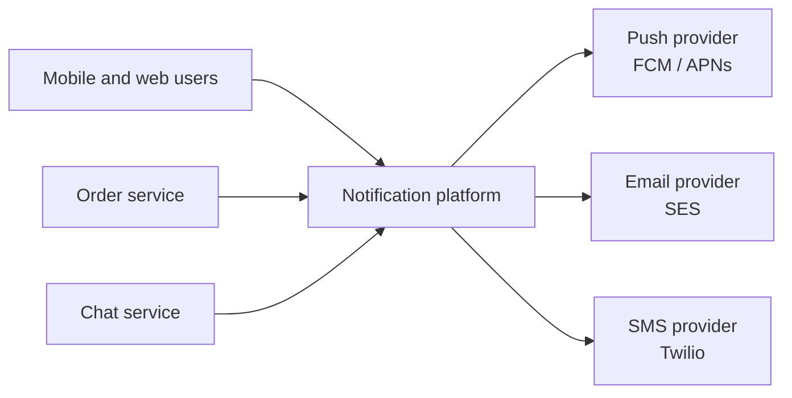
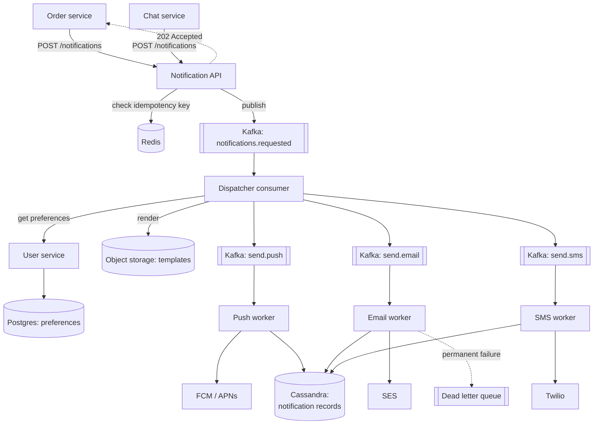
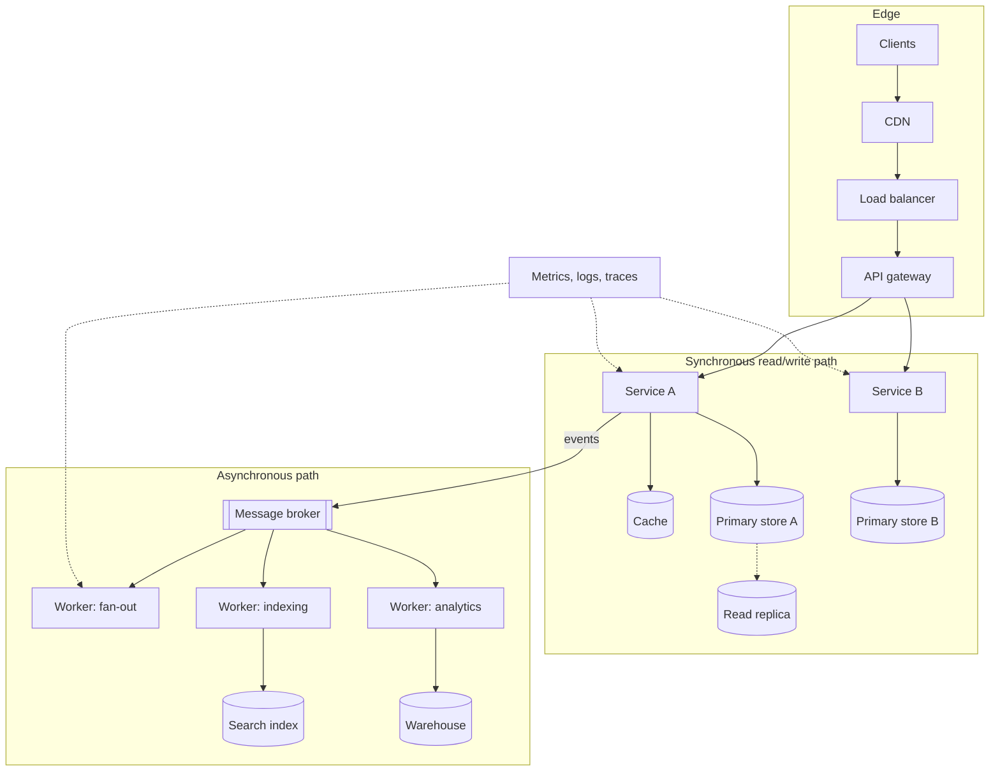
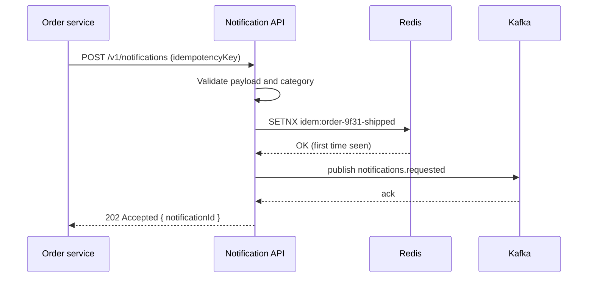
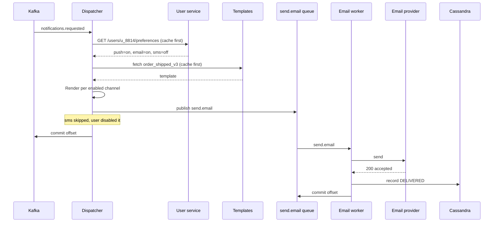

# Chapter 2: High Level Design (HLD)

## 2.1 Problem Statement

Four engineers are told to build notifications for their company's app. Push, email, and SMS, triggered by things like "your order shipped" and "someone replied to you". Two week estimate. Everyone is competent. Nobody writes anything down beyond a Jira ticket.

They split the work in a fifteen minute call and start coding.

Two weeks later, here is what exists:

- Ravi built a `NotificationService` that other services call over HTTP and that sends the notification before returning. Synchronous, because "then the caller knows it was sent".
- Priya built the order service side, and it publishes an event to Kafka when an order ships. She assumed notifications would consume events.
- Arjun built a beautiful template engine that renders email HTML. It reads templates from a local folder on disk, so it works on his laptop and on exactly one server.
- Sneha built user notification preferences (which channels a user has enabled) in a new database that nobody's service can reach because of network policy, and which nobody else knew existed.

None of them wrote bad code. All four pieces have tests. And they do not compose into a system. Integration takes another three weeks, involves rewriting Ravi's service to be a Kafka consumer, throwing away Arjun's file-based templates, and one genuinely unpleasant argument about whether notifications should block order updates.

Same team, same skills. What was missing was one page, agreed before anybody opened an IDE, that said: events flow from services into Kafka, one notification consumer reads them, it looks up preferences from the user service via this API, renders from templates in object storage, and pushes to per-channel workers with retries. Twenty minutes of drawing would have saved three weeks.

The interview version of the same problem: a candidate is asked to design Instagram, and either freezes at the whiteboard or starts naming technologies at random. Both failures come from not knowing what a high level design actually consists of.

## 2.2 Why This Problem Exists

Decisions differ enormously in how expensive they are to change later. This is the core insight behind HLD and it is worth being precise about.

| Decision | Cost to change after launch |
|---|---|
| Rename a method | Minutes |
| Rewrite a class | Hours |
| Change a REST endpoint's response shape | Days, plus client coordination |
| Change your database schema | Days to weeks, with a migration |
| Switch from synchronous calls to events | Weeks, touches every caller |
| Change your partition key on a 4 TB table | Months, and it is a project with a name |
| Split a monolith into services | Quarters |

Look at where the cheap decisions are. They are all inside a single box. The expensive ones are all about boundaries between boxes, the shape of the data, and how components talk. Those are exactly the decisions HLD makes.

So the reason HLD exists is not documentation. It is that the expensive decisions deserve to be made first, deliberately, and with several people looking at them, while they are still just lines on a page and cost nothing to erase.

There is a second reason, which is coordination. Software gets built in parallel by people who cannot read each other's minds. A shared picture with agreed contracts lets four people work at once without producing four incompatible things. On a solo project you can get away without it. On a team you cannot, and the team gets bigger every year of your career.

And a third reason, specific to interviews: an interviewer has 45 minutes and cannot evaluate your code. What they can evaluate is whether you can take a vague problem, ask the right questions, propose a structure, and defend it. That is HLD, performed out loud.

## 2.3 Real World Analogy

A house gets designed twice before anyone mixes concrete.

The **site plan and floor plan** show where the house sits on the plot, how many rooms, which rooms are next to which, where the plumbing spine runs, where the front door is. It does not show which brand of tap goes in the bathroom.

The **detailed drawings** show exactly that: tap models, wiring gauges, tile layouts, the cabinet joinery.

Now consider what happens when each one is wrong.

Wrong tap model: swap it in an afternoon, for the price of a tap.

Wrong floor plan, with the only bathroom accessible through the kitchen: you are knocking down walls, and the plumbing spine is in the wrong place, so it is a renovation project.

HLD is the floor plan. Chapter 3's Low Level Design is the detailed drawings. The whole reason the industry separates them is that the floor plan mistakes are the ones that cost a fortune, so they get reviewed by more people, earlier, when redrawing is free.

One more piece of the analogy worth keeping: an architect's floor plan includes numbers. Room dimensions, load ratings, door widths. A floor plan without dimensions is a sketch, not a plan. Same rule applies to HLD, and Section 2.5.4 comes back to it, because "boxes with no numbers" is the most common weak HLD.

## 2.4 Simple Explanation

High Level Design is the answer to: **what are the pieces, what does each piece do, how do they talk, and where does the data sit?**

It is the level of detail at which you could explain the entire system to a new engineer in about ten minutes on a whiteboard, and they would then know where to go to work on any given feature.

HLD **does** decide:

- Which services or components exist, and what each one owns
- How they communicate: synchronous request/response, or asynchronous events
- Which datastores exist, what kind (relational, document, key-value, search index, object storage), and which component owns each
- The public API surface: endpoints, or event names and payloads
- Where caching sits
- How the system scales: what is replicated, what is partitioned
- What happens when a component fails
- Rough capacity: requests per second, storage, growth

HLD **does not** decide:

- Class names, interfaces, inheritance hierarchies
- Which design patterns you use inside a service
- Method signatures
- Exact column types or index definitions
- Library choices
- Code structure and package layout

Those all belong to LLD. Trying to do both at once is why design discussions go badly: someone argues about whether it should be a `Strategy` or a `Factory` while the group has not yet agreed whether notifications are synchronous, and the second question makes the first one irrelevant.

A rough test for whether a statement belongs in HLD: **would changing it force another team to change their code?** If yes, it is HLD. If it only affects the inside of one service, it is LLD.

| Statement | HLD or LLD? | Why |
|---|---|---|
| "Order service publishes `OrderShipped` to Kafka" | HLD | Other teams consume it |
| "`OrderShipped` contains `orderId`, `userId`, `shippedAt`" | HLD | It is a contract |
| "We use a Builder to construct the event object" | LLD | Nobody outside cares |
| "Notification preferences live in the user service" | HLD | Determines who calls whom |
| "The preferences table has a composite index on `(user_id, channel)`" | LLD | Internal to one service |
| "Notification sends are asynchronous" | HLD | Changes the caller's behaviour and the user's experience |

## 2.5 Technical Deep Dive

### 2.5.1 The three levels of zoom

It helps to know that "high level" is itself three levels, because interviewers and design reviews move between them and you should know which one you are in. This maps closely to the C4 model, which is worth reading about separately.

**Level 1, Context.** Your system as one box, plus the external actors and third parties it talks to. Answers "what is this thing and who uses it".



**Level 2, Container.** Inside your system: the services, databases, caches, queues. This is what people usually mean by "the HLD", and it is what you draw in an interview.

**Level 3, Component.** Inside one service: its major internal modules. This is the boundary zone where HLD hands over to LLD.

In a 45 minute interview you will spend about two minutes on level 1, most of the time on level 2, and dip into level 3 only if asked.

### 2.5.2 The six decisions, in order

There is a repeatable order for producing an HLD. Following it stops you from making a decision that depends on information you do not have yet. Part 4 turns this into the full interview framework, but the core is these six moves.

**Step 1: Requirements, split in two.** Features on the left, numbers on the right. Ten minutes. If nobody has given you the numbers, invent reasonable ones out loud and get them confirmed.

**Step 2: Scale estimate.** Requests per second, read to write ratio, storage per year, peak versus average. Chapter 83 onward is entirely about doing this quickly. You need it now because the answer to every later question is "it depends on the numbers".

**Step 3: API design.** What can a client actually call, and what does it get back? Doing this third is deliberate: it forces you to be concrete about behaviour before you start drawing infrastructure. It also catches missing requirements, because you cannot define an endpoint for a feature nobody specified properly.

**Step 4: Data model and storage choice.** What entities exist, what are the main access patterns, what kind of store fits each. Access patterns first, then schema, then technology. Doing it in the other order is how people end up choosing a database because it was in a blog post.

**Step 5: Component diagram.** Now you can draw boxes, because you know what data exists and what operations exist. Draw the request path, and mark which arrows are synchronous and which are asynchronous.

**Step 6: Non-functional pass.** Walk the diagram three times, once for each concern: scaling (what happens at 10x), failure (what happens when each box dies), and security (who is allowed to do what). Every pass adds or changes something. This step is where average designs become good ones, and it is the step candidates skip when they run out of time.

```
Requirements ---> Scale estimate ---> API design ---> Data model
                                                          |
                                                          v
    Trade-offs <--- Non-functional pass <--- Component diagram
       |               (scale, fail, sec)
       v
   Future work
```

### 2.5.3 Decision one: how do components talk?

Of all the HLD decisions, this one has the widest blast radius and it is the one the notification team in Section 2.1 got wrong. Two options, and the choice is per interaction, not per system.

**Synchronous.** Caller sends a request, waits, gets an answer. Use it when the caller genuinely cannot proceed without the result.

```java
// Order service needs the price before it can charge the card.
// The user is waiting. Synchronous is correct here.
PriceQuote quote = pricingClient.quote(cartId);   // blocks
```

**Asynchronous.** Caller publishes a fact and moves on. Someone else reacts later. Use it when the caller does not need the outcome to give the user an answer.

```java
// Order is already saved and confirmed. The user does not need to wait
// for an email to be delivered. Publish and return.
events.publish(new OrderShipped(orderId, userId, Instant.now()));
return ResponseEntity.ok(order);
```

| | Synchronous | Asynchronous |
|---|---|---|
| Caller waits | Yes | No |
| Coupling | Tight, caller needs the callee up now | Loose, callee can be down for a while |
| Failure of callee | Caller's request fails | Message waits in the queue |
| Traffic spikes | Rejected or timed out | Buffered, processed at consumer speed |
| Debugging | Straightforward, one stack trace | Harder, needs tracing and correlation ids |
| User feedback | Immediate and definite | "We are working on it", eventual |
| Right for | Reads the user is waiting on, writes that must confirm | Emails, indexing, analytics, fan-out, anything slow |

The rule of thumb worth memorising: **if the user is not waiting for it, get it off the request path.** Chapter 1's request flow showed why. The notification team's original synchronous design meant a Twilio outage would have failed order updates, which is an absurd coupling once you say it out loud.

A pattern that appears constantly in Part 5: **synchronous on the read path, asynchronous on the write fan-out.** Twitter reads your timeline synchronously from a precomputed list. The work of populating 200 million such lists happens asynchronously. Chapter 114.

### 2.5.4 A good HLD has numbers on it

Two engineers draw the same five boxes. One of them writes this next to them:

```
Peak:            12,000 req/s   (evening spike, 4x average)
Read:write:      50:1
Payload:         ~2 KB per order read
Storage:         1.2 KB/order x 40M orders/yr  = ~48 GB/yr
Cache:           top 20% of orders = ~10 GB, fits comfortably in one 32 GB Redis
p99 target:      200 ms end to end
Availability:    99.9%  (about 43 min/month of allowed downtime)
Durability:      zero tolerance for lost paid orders
```

The second diagram is a design. The first is a drawing. The numbers are what let you answer "do we need sharding" (48 GB per year, so no, not for years), "will the cache help" (50:1 reads, so enormously), and "can this be synchronous" (200 ms budget across the whole path, so no room for a third-party call).

You do not need precision. Order of magnitude is enough, and being off by 2x almost never changes the design decision. Being off by 1000x always does, and that is what the estimate protects you from.

### 2.5.5 Worked example: HLD for a notification platform

The same problem from Section 2.1, done properly. This is the shape every Part 5 chapter follows.

**Step 1: Requirements**

Functional:
- Any internal service can request a notification for a user
- Three channels: push, email, SMS
- Users control which channels they receive which categories on
- Do not send the same notification twice
- Retry failed sends

Non-functional:
- 5 million notifications per day, peak 4x average
- Delivery within 30 seconds for 99 percent of notifications
- Losing a "your order shipped" notification is bad; losing an "app tip" notification is acceptable
- Must survive a provider being down for an hour without losing messages

**Step 2: Scale estimate**

```
5,000,000 / 86,400          = ~58 notifications/s average
Peak 4x                     = ~230/s
Fan-out: 1 request may hit 3 channels
                            = up to ~700 sends/s peak
Record per notification:    ~500 bytes
Retention 90 days           = 5M x 90 x 500B = ~225 GB
```

230 requests per second is small. 700 provider calls per second is not, and provider rate limits are now a real constraint. That is a design-relevant finding from three lines of arithmetic.

**Step 3: API design**

One synchronous entry point for callers, which only accepts and acknowledges:

```
POST /v1/notifications
{
  "userId": "u_8814",
  "category": "ORDER_SHIPPED",
  "templateId": "order_shipped_v3",
  "data": { "orderId": "9f31", "eta": "2026-07-29" },
  "idempotencyKey": "order-9f31-shipped"
}

202 Accepted
{ "notificationId": "n_44a1", "status": "QUEUED" }
```

Three things in that request are HLD decisions, not incidental detail. `202 Accepted` rather than `200 OK` tells every caller this is asynchronous. `category` rather than `channel` means the platform, not the caller, decides which channels to use, which is what makes preferences work. `idempotencyKey` is what makes the whole thing safe to retry, and Chapter 20 explains why every write endpoint should have one.

Plus a read endpoint for support staff and debugging:

```
GET /v1/notifications/{id}
200 OK
{ "id": "n_44a1", "userId": "u_8814",
  "attempts": [ { "channel": "PUSH",  "status": "DELIVERED", "at": "..." },
                { "channel": "EMAIL", "status": "FAILED", "error": "bounce" } ] }
```

**Step 4: Data model and storage**

| Data | Access pattern | Store | Why |
|---|---|---|---|
| Notification records | Write once, read by id, purge after 90 days | Cassandra or DynamoDB | High write rate, key lookups only, no joins, easy expiry |
| User preferences | Read on every notification, rarely written | Postgres, owned by user service, cached in Redis | Small, relational, read-heavy so cache it |
| Templates | Read constantly, versioned, changed by non-engineers | Object storage plus Redis cache | Files, not rows. Never local disk (Arjun's bug) |
| Idempotency keys | Check-and-set, short lived | Redis with a 24 hour expiry | Needs speed, does not need durability past the window |
| In-flight work | FIFO-ish, durable, replayable | Kafka | Buffers spikes, survives consumer downtime, replayable |

**Step 5: Component diagram**



ASCII version for Google Docs:

```
 Order svc ---\
               >--- [ Notification API ] --(202)--> caller returns
 Chat svc  ---/          |         |
                         |         +--- Redis (idempotency keys)
                         v
              [ Kafka: notifications.requested ]
                         |
                         v
               [ Dispatcher consumer ] --- User svc ---> Postgres (preferences)
                         |              --- Object storage (templates)
          +--------------+--------------+
          v              v              v
   send.push q     send.email q    send.sms q
          |              |              |
    Push worker    Email worker    SMS worker
          |              |              |
       FCM/APNs         SES          Twilio
          \              |              /
           +----> Cassandra (records) <-+
                        |
                   Dead letter queue (permanent failures)
```

**Step 6: Non-functional pass**

*Scaling.* The API is stateless, so add instances. Kafka partitions by `userId`, so per-user ordering holds and consumers scale by adding instances up to the partition count. Separate queues per channel means a slow SMS provider cannot delay push notifications, which is the whole point of splitting them. Preferences are read on every notification, so cache them in Redis with a short expiry and accept slightly stale preferences.

*Failure.* If a provider is down, the channel's consumer stops committing offsets and messages accumulate in Kafka. Nothing is lost, and when the provider recovers the backlog drains. If the dispatcher crashes, Kafka redelivers from the last committed offset, which means duplicate processing is possible, which is why the idempotency key exists. Permanent failures (invalid email, unregistered device token) go to a dead letter queue instead of retrying forever. If the user service is down, use the cached preferences, and if there is no cached value, fall back to a safe default per category.

*Security.* Only internal services can reach the API, authenticated by service credentials at the gateway. Notification content contains personal data, so it is encrypted at rest and redacted in logs. Per-caller rate limits prevent one buggy service from flooding users, which is a real incident that happens to real companies.

Compare that to the four incompatible pieces from Section 2.1. Same team, same two weeks, and this page is maybe forty minutes of work.

### 2.5.6 What a written HLD document contains

Interview HLD is spoken. Production HLD is a document, usually called a design doc or RFC, reviewed before implementation. A workable template:

1. **Context and problem.** What is broken or missing, in plain language. No solution yet.
2. **Goals and non-goals.** Non-goals are the most valuable section, because they stop scope creep and prevent reviewers arguing about things you deliberately excluded.
3. **Requirements.** Functional and non-functional, with numbers.
4. **Proposed design.** Diagram, components, data model, APIs, request flows.
5. **Alternatives considered.** At least two, each with why you rejected it. A document with no alternatives reads like a decision defended rather than a decision made.
6. **Failure modes.** What breaks, what happens, what the user sees.
7. **Migration and rollout.** How you get from the current system to this one without downtime. Skipping this is how good designs never ship.
8. **Operational impact.** New alerts, dashboards, on-call burden, cost.
9. **Open questions.** Honest list. Reviewers answer these; that is what a review is for.

Sections 5 and 7 are the ones that most distinguish a senior document from a junior one.

## 2.6 Architecture Diagram

A generic HLD skeleton, worth keeping in your head as a starting point for any Part 5 case study. Almost every large system is a variation on this with pieces added or removed.



Three regions, and knowing which region you are drawing in keeps a design discussion coherent:

- **Edge**, where requests arrive and get filtered. Almost identical in every system.
- **Synchronous path**, where the user is waiting. Keep it short. Every millisecond here is a millisecond of someone's life.
- **Asynchronous path**, where everything the user is not waiting for happens. Where fan-out, indexing, notifications, and analytics live.

When you get stuck in an interview, the recovery move is to ask which region the problem is in. "The write is slow" and "the write's downstream effects are slow" have completely different answers.

## 2.7 Request Flow

Two flows for the notification platform, because HLD for an asynchronous system means drawing both the fast acknowledgement and the slow completion. Candidates who only draw the first one get asked about the second one.

**Flow A: the caller's synchronous experience, target under 50 ms.**



1. Validate. Reject bad input immediately, before it becomes a poison message in a queue.
2. Idempotency check with `SETNX`. If the key already exists, return the original `notificationId` with `202` and publish nothing. Retries are now free and safe.
3. Publish to Kafka and wait for the broker acknowledgement. This is the one thing the API must not skip, because acknowledging to the caller before the message is durable means silently losing notifications on a crash.
4. Return `202`. Total time is dominated by two network hops, so a few milliseconds.

**Flow B: what happens afterwards, target under 30 seconds.**



The pieces worth noticing, because they generalise to every queue-based design in Part 5:

- **Offsets commit after the work, not before.** Commit first and a crash loses the message. Commit after and a crash reprocesses it, which is safe because of the idempotency key. This is at-least-once delivery, and it is almost always the right choice. Chapter 47.
- **The dispatcher does no external sending.** It decides and re-queues. Deciding is fast and reliable; sending is slow and flaky. Separating them means a provider outage cannot back up the decision stage.
- **A disabled channel is a normal outcome**, not an error. Record it and move on.
- **Every step reads from cache first.** Preferences and templates are read on every single notification and change rarely, which is the textbook case for caching.

## 2.8 Internal Components

**Components of the notification HLD**, with the removal test from Chapter 1 applied.

| Component | Exists because | Remove it and |
|---|---|---|
| Notification API | One entry point, one place for validation, auth, and rate limits | Every service talks to Kafka directly, with its own payload format and no validation |
| Idempotency store | Retries and redeliveries are guaranteed | Users get duplicate notifications every time anything is retried |
| Request topic (Kafka) | Buffers spikes, decouples callers from provider speed | A provider slowdown becomes a caller slowdown; spikes get dropped |
| Dispatcher | One place that decides channels and renders content | Every caller has to know about preferences and templates |
| Preference lookup | Users must control what they receive | You spam people, and in many jurisdictions you break the law |
| Template store | Content changes without a deploy, and non-engineers can edit it | Copy changes require an engineer and a release |
| Per-channel queues | Channels have different speeds, limits, and failure modes | One slow provider delays all channels |
| Per-channel workers | Provider-specific protocols, auth, and retry rules | One giant component that knows everything and fails as a unit |
| Notification records | Support needs to answer "did it send", and you need delivery metrics | Debugging is impossible and you are blind to delivery failure |
| Dead letter queue | Some failures are permanent and must not retry forever | Poison messages block the queue or loop indefinitely |

**Components of the HLD deliverable itself**, which is a separate list worth knowing for design reviews.

| Part of the doc | Purpose | Missing it causes |
|---|---|---|
| Requirements with numbers | Grounds every decision | Endless "it depends" arguments |
| Component diagram | Shared mental model | Four incompatible implementations |
| API and event contracts | The interfaces teams build against | Integration week |
| Data model and store choice | The most expensive decision to reverse | A migration project in year two |
| Request flows | Proves the boxes actually connect | Diagrams that cannot serve a real request |
| Failure analysis | Turns outages into degradations | Discovering failure modes at 3 AM |
| Alternatives considered | Shows the decision was made, not assumed | Reviewers relitigating from scratch |
| Rollout plan | Gets it into production | A great design that never ships |

## 2.9 Production Example

**Amazon's service interface mandate.** Around 2002, Jeff Bezos issued an internal directive that all teams must expose their data and functionality through service interfaces, that teams must communicate only through those interfaces, and that every interface must be designed to be externalisable, meaning fit for outside developers to use. No shared databases, no back doors, no reading another team's tables.

That is an HLD rule imposed at company scale, and it is worth understanding what it actually forced. Once a team can only be reached through its interface, the interface becomes the contract, and the contract has to be designed. It also made every service independently deployable and independently scalable, and the requirement that interfaces be externalisable is a large part of why AWS became a product rather than an internal tool.

The cost was real too, and Amazon paid it: more network calls, harder debugging across service boundaries, and versioning discipline forever. They decided the coordination benefit was worth it at their size, which is a trade-off, not a universal truth.

**Uber's domain-oriented microservice architecture.** Uber grew to thousands of microservices and found that the coordination cost had become the dominant problem. Understanding any flow meant reading dozens of services, and a single product change touched many teams. Their response was not to go back to a monolith. It was to group services into **domains** with a clear public interface per domain, and layers with rules about which layer may call which. Teams work inside a domain; cross-domain communication goes through the domain's interface.

The lesson generalises well beyond Uber: HLD boundaries are not only technical, they are organisational, and if you draw more boundaries than your organisation can staff and coordinate, the boundaries become the bottleneck.

**Google's design doc culture.** Substantial projects at Google start with a design document reviewed by engineers outside the immediate team before implementation. The document is expected to contain alternatives considered and their rejection reasons. The mechanism is unremarkable; the effect is that expensive decisions get several experienced people looking at them while they are still cheap to change, which is the entire thesis of this chapter.

## 2.10 Advantages

- **The expensive decisions get made deliberately.** Boundaries, contracts, and data layout are chosen while they are still lines on a page.
- **Parallel work becomes possible.** Agreed contracts let several people or teams build simultaneously without integration surprises.
- **Reviews happen when they are cheap.** A senior engineer can spot a fatal flaw in a diagram in five minutes. Spotting it in 8,000 lines of merged code takes weeks and costs a rewrite.
- **Onboarding gets dramatically faster.** A new joiner with a current HLD knows where to make a change on day two instead of week six.
- **You can estimate.** You cannot size work you have not decomposed. HLD is what makes an estimate more than a guess.
- **Alternatives are visible.** Writing down two rejected designs is often when the third and better one appears.
- **It is exactly what interviews test.** The skill transfers directly, which is a rare and pleasant alignment.

## 2.11 Limitations

- **A diagram is a hypothesis, not a fact.** It has not been load tested, and the first contact with production traffic teaches you things no design review would have found.
- **It goes stale immediately unless somebody maintains it.** A diagram that no longer matches reality is worse than none, because people trust it and act on it.
- **You can over-design.** Weeks of documents for a two week feature is waste. Match the depth of the design to the cost of getting it wrong.
- **Estimates are rough by nature.** They are good enough to choose between designs, and not good enough to size hardware precisely.
- **It cannot resolve organisational problems.** If two teams disagree about who owns notifications, no diagram fixes that. The disagreement has to be settled by people.
- **Some things are only learnable by building.** Prototype the risky part rather than arguing about it in a document. A day of measurement beats a week of opinion.

## 2.12 Trade-offs

| Dial | One way | The other way |
|---|---|---|
| Design depth | Detailed doc, slower start, fewer expensive surprises | Sketch and start coding, fast, higher rewrite risk |
| Number of services | Few: simple deploys, easy debugging, coupled teams | Many: independent teams and scaling, distributed complexity |
| Sync vs async everywhere | Sync: simple, immediate, fragile under downstream failure | Async: resilient and spike-tolerant, harder to reason about and to debug |
| Shared vs per-service database | Shared: easy joins, no duplication, teams block each other | Per-service: independence, but joins become API calls and consistency gets eventual |
| Generic vs specific design | Generic: handles future needs you might have | Specific: simpler, faster, may need reworking |
| One queue vs queue per channel | One: fewer moving parts | Many: failure isolation, more infrastructure to run |
| Rigid contracts | Versioned and strict: safe evolution, slower changes | Loose: fast iteration, breaks consumers |

The removal test again, applied to HLD-level pieces.

**Remove the message broker** from the notification platform and make everything synchronous. You gain immediate delivery confirmation and one less system to operate. You lose spike buffering, so a marketing blast now overwhelms your providers, and you couple every caller's latency and availability to Twilio's. Order updates fail when SMS is slow, which is unacceptable.

**Remove the per-channel queues** and use one queue with one worker. You gain simplicity and less infrastructure. You lose isolation: SMS provider rate limiting now delays push notifications that had nothing wrong with them. At 58 notifications per second average you might genuinely accept that. At 700 per second you will not.

**Remove the separate dispatcher** and let each worker look up preferences and render. You gain one less hop. You lose a single place where channel decisions live, so preference logic gets duplicated three times and drifts, and a preferences outage now hits all three channels independently.

None of these are wrong answers. Being able to say "we chose this, we gave up that, and here is the number that made us choose" is the whole skill.

## 2.13 Common Mistakes

**Naming technologies before naming problems.** "We will use Kafka, Redis, Elasticsearch and Kubernetes" is not a design. Describe what must happen, then choose tools. Interviewers notice this instantly and it reads as pattern matching rather than thinking.

**Boxes with no arrows, or arrows with no labels.** An unlabelled arrow hides the most important question: is this synchronous or asynchronous, and what is the payload? Label every arrow with the call or the event name.

**Skipping the estimate.** Without numbers you cannot justify a single choice, and you will either shard a 40 GB database or run a 40 TB workload on one Postgres instance.

**Designing the happy path only.** No failure pass means the design is untested against reality. Walk every box and ask what the user sees when it dies.

**Drifting into LLD.** Twenty minutes on class hierarchies while the group has not agreed whether the flow is synchronous. Park LLD questions explicitly: "good question, that is inside the dispatcher, let me finish the flow first".

**Copying a big company's architecture.** Uber has thousands of services because Uber has thousands of engineers. Your six-person team does not need domain-oriented microservices. Chapter 1's Netflix section makes the same point and it is worth repeating because it is the most common error in this whole subject.

**Ignoring the migration.** A design for a system that already exists and has users must include how you get there without downtime. Dual writes, backfill, shadow reads, flag flip, cleanup. A design that only describes the end state is half a design.

**Forgetting who owns what.** Two services writing the same table is a bug waiting to happen. Every piece of data should have exactly one owning component.

**No non-goals.** Without them, every reviewer expands the scope, and the document never converges.

**Treating the diagram as the deliverable.** The diagram is the cheapest part. The contracts, the failure analysis, and the rollout plan are where the value is.

## 2.14 Interview Questions

**Q: What is HLD, and what does it exclude?**
The component-level view: which services exist, how they communicate, which datastores they use, what the APIs are, how it scales, and how it fails. It excludes everything inside a single component: classes, patterns, method signatures, exact schemas.

**Q: Where do you start with "design a system that does X"?**
Requirements and scope first, then scale numbers, then APIs, then data model, then the component diagram, then a pass each for scaling, failure, and security. Never start by naming technologies.

**Q: How do you decide synchronous versus asynchronous?**
Ask whether the caller can give the user an answer without the result. If yes, make it asynchronous. Anything slow, flaky, third-party, or high fan-out belongs off the request path.

**Q: How do you choose how many services to have?**
Match boundaries to data ownership and to team ownership, then check that your organisation can staff each boundary. Start coarse. Split when there is specific pressure: a component with very different scaling needs, or teams blocking each other on releases.

**Q: How much detail belongs in an interview HLD?**
Enough that a request can be traced end to end and every box has a stated reason. Go deeper only where the interviewer pushes, and say out loud which parts you are simplifying.

**Q: Two services need the same data. What do you do?**
Give it one owner. Others read it through an API, or consume events and keep a local read-optimised copy. Never two writers on one table.

**Q: How do you present an HLD to a mixed audience of engineers and product managers?**
Start at context level with no internal detail, state the requirements and the numbers, then go to container level. Lead with what the user gets and what it costs, and keep the internals for the engineers in the room.

**Q: What makes a design document good rather than adequate?**
Numbers, alternatives with rejection reasons, an honest failure analysis, a rollout plan, and explicit non-goals. Adequate documents describe a solution. Good ones show the decision being made.

**Q: When is a document not worth writing?**
When the change is small, reversible, and inside one component. Cost of design should track cost of being wrong. A well-argued paragraph in the pull request is sometimes the right amount.

## 2.15 Production Best Practices

1. **Write the non-goals before the goals.** It is faster, and it prevents the scope arguments that consume design reviews.
2. **Put numbers on the diagram.** Peak requests per second, read to write ratio, storage per year, latency target, availability target. Six lines.
3. **Label every arrow** with the protocol and the operation or event name, and mark asynchronous arrows differently from synchronous ones.
4. **Give every piece of data exactly one owning component.** Write this ownership down explicitly.
5. **Define contracts before implementation starts,** and version them from day one. An unversioned public event schema is a future outage.
6. **Include at least two rejected alternatives,** with the reason. If you cannot name one, you have not designed, you have assumed.
7. **Do the failure pass box by box.** For each: what fails, what does the user see, how do we recover, how do we detect it.
8. **Design the rollout,** including how to run old and new side by side and how to roll back.
9. **Review with someone outside the team.** People inside share your blind spots by definition.
10. **Keep the diagram next to the code** and update it in the same pull request that changes the architecture. A diagram maintained anywhere else is already wrong.
11. **Prototype the one risky assumption** rather than arguing about it. Measure the thing nobody is sure about.
12. **Note the operational cost explicitly:** new alerts, new dashboards, on-call load, monthly bill. Design reviews systematically underweight this and it is paid forever.

## 2.16 Summary

High Level Design is the component-level view of a system: what the pieces are, what each one owns, how they talk, where the data lives, how it scales, and what happens when parts of it fail.

It exists because decisions are not equally expensive. Renaming a method is free. Changing a partition key on a 4 TB table, or converting a synchronous call chain into an event-driven flow, is a project. HLD is the practice of making the expensive class of decision first, on paper, with several people looking, while erasing a line still costs nothing.

The repeatable order is: requirements, scale estimate, API design, data model, component diagram, then a pass each for scaling, failure, and security. The order matters because each step needs the previous step's output. The single most useful judgement call inside it is which interactions must be synchronous and which can be asynchronous, because that choice determines both your latency and how failure spreads.

A good HLD is recognisable by three things. It has numbers on it. Every box has a stated reason for existing, and you can say what breaks if it is removed. And it describes what happens when things go wrong, not only when they go right.

## 2.17 Quick Revision Notes

- HLD = components, responsibilities, communication, data placement, scaling, failure handling. Not classes, not patterns, not method signatures.
- Test for whether something belongs in HLD: would changing it force another team to change their code?
- Three zoom levels: context (system plus externals), container (services and stores, this is "the HLD"), component (inside one service).
- Six steps, in order: requirements, scale estimate, APIs, data model, component diagram, non-functional pass.
- APIs come before the diagram, on purpose. It forces concreteness and exposes missing requirements.
- Data model order: access patterns, then schema, then technology choice.
- Synchronous when the caller cannot answer without the result. Asynchronous for everything the user is not waiting for.
- Common shape: synchronous read path, asynchronous write fan-out.
- Put numbers on the diagram: peak requests per second, read:write, storage per year, p99 target, availability target.
- Every arrow labelled with protocol and operation. Async arrows drawn differently.
- Every piece of data has exactly one owning component. Never two writers on one table.
- Non-functional pass three times: scale, failure, security. This is where designs get good, and it is the step people skip.
- Design doc needs non-goals, alternatives with rejection reasons, failure modes, rollout plan, operational cost.
- Return `202 Accepted` when the work is asynchronous. It tells every caller the truth.
- Commit queue offsets after the work, and make the work idempotent.
- Match the design to your scale and your team size, not to Netflix's or Uber's.

## 2.18 Mini Quiz

1. Which of these belong in HLD rather than LLD? (a) the payment service publishes `PaymentCaptured` to Kafka, (b) `PaymentCaptured` contains `paymentId` and `amountMinor`, (c) the amount is stored as a `long` of minor units, (d) refunds are handled by a separate service.
2. Why is API design placed before the component diagram?
3. A colleague's HLD has eight boxes and no numbers anywhere. Name two questions they now cannot answer.
4. Give the one-line test for choosing synchronous over asynchronous.
5. In the notification platform, why does the API return `202` instead of `200`?
6. Why are queue offsets committed after the send rather than before, and what does that force you to build?
7. Two teams both need to read and write user addresses. What is the HLD answer?
8. Your design replaces a live system that has 30 million users. Which section is most likely missing, and what should it contain?
9. Why did Amazon's interface mandate include the requirement that interfaces be externalisable?
10. When should you skip writing a design document?

**Answers**

1. (a), (b), and (d) are HLD. (a) and (d) define components and their interactions, (b) is a public contract other teams depend on. (c) is LLD, internal to one service.
2. Because defining what a client can call forces you to be concrete about behaviour, and it surfaces requirements that are missing or vague. Boxes drawn before behaviour is pinned down tend to be boxes you redraw.
3. Whether the data needs sharding, and whether a cache will help. More generally, any question of the form "is this component necessary", because necessity depends on load.
4. Can the caller give the user an answer without waiting for the result? If yes, make it asynchronous.
5. Because the work has not been done yet, only accepted and made durable. `200 OK` would tell callers something false, and callers build retry and error handling on top of what your status codes claim.
6. Committing before the work means a crash between commit and send loses the message permanently. Committing after means a crash causes redelivery, so the same notification may be processed twice. That forces idempotency, via an idempotency key store.
7. One service owns the data. The other reads it through an API, or subscribes to change events and maintains its own read-optimised copy. Two writers on one table is not an option.
8. The migration and rollout plan. It should cover dual writing to old and new, backfilling historical data, shadow reads to compare outputs, a gradual traffic shift behind a flag, a rollback path at each stage, and cleanup of the old system.
9. Because an interface fit for external developers has to be properly specified, versioned, documented, and stable, with no assumed shared context. That discipline is what made the interfaces real boundaries rather than nominal ones, and it is what later made AWS sellable.
10. When the change is small, reversible, and contained inside one component with no contract changes. Design effort should be proportional to the cost of being wrong.

## 2.19 Hands-on Exercise

**Part 1: reverse engineer an HLD.** Take a system you have worked on, or any open source project you can run. Without reading its docs, produce its container-level diagram from the code and config: services, datastores, queues, external dependencies, and every arrow labelled sync or async. Then find the real documentation and compare. What did you miss, and what does that tell you about what is hard to see from code alone?

**Part 2: write a full HLD, from scratch.** Design a **URL shortener** at HLD level only, using the six steps. Do not look at Chapter 108 yet, and do not write code. Constraints to design against:

- 100 million new short links per year
- 10 billion redirects per year, with a 100x spike during viral events
- Redirect p99 under 50 ms globally
- Custom aliases supported, and links can expire
- Analytics per link: click count, and a rough geographic breakdown

Deliver, on at most three pages:

1. Functional and non-functional requirements
2. Scale estimate: requests per second average and peak, storage per year, read:write ratio, cache size for the hot set
3. API design: create, redirect, stats. Include status codes and the exact redirect response
4. Data model: entities, access patterns, chosen store per entity, with a one-line reason each
5. Container diagram, every arrow labelled
6. Sequence diagram for a redirect and for a creation
7. Non-functional pass: how it scales to the spike, what happens when each component fails, how you stop abuse
8. Two alternatives you rejected, with reasons
9. Three open questions you would take to a reviewer

**Part 3: attack your own design.** For each box, write one sentence on what breaks if it disappears at peak traffic and what the user sees. Then find your worst answer and fix the design.

**Part 4: get it reviewed.** Give it to another engineer with one instruction: find the assumption that would hurt most if it turned out to be wrong. Their answer is usually the most valuable feedback in the exercise.

When you reach Chapter 108, compare. Differences are more instructive than matches, and if your design is simpler and still meets the stated requirements, yours may well be better.

## 2.20 Further Reading

- *The C4 Model for Visualising Software Architecture*, Simon Brown. The clearest available answer to "which level of detail am I drawing at". Short and immediately usable.
- *Design Docs at Google*, Malte Ubl. A concise description of what goes in a design doc and why the review matters more than the document.
- *Documenting Architecture Decisions*, Michael Nygard. Introduces the architecture decision record: one page per decision, with context and consequences. Cheap and effective.
- *Introduction to Domain-Oriented Microservice Architecture*, Uber Engineering. Honest account of what thousands of microservices cost and what they did about it.
- *Fundamentals of Software Architecture*, Richards and Ford. Broad coverage of architecture styles and their trade-offs, with a strong chapter on architecture characteristics.
- *Building Microservices*, Sam Newman. Best single treatment of where to draw service boundaries and how to evolve them. Read the chapters on decomposition even if you never build microservices.
- Steve Yegge's Platforms Rant, widely mirrored online. The primary account of Amazon's interface mandate, funny and unusually candid about what it cost.

---

**Next chapter: Chapter 3, Low Level Design (LLD).** Zooming inside a single box: how a service's classes, interfaces, and data structures get chosen, and why "make it easy to change" beats "make it clever".
