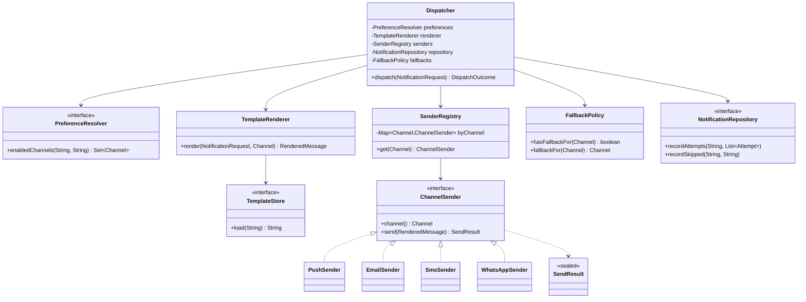
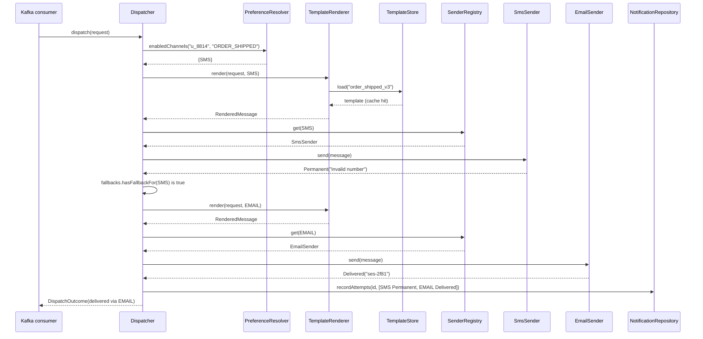

# Chapter 3: Low Level Design (LLD)

## 3.1 Problem Statement

Chapter 2 finished with a diagram containing a box labelled **Dispatcher**. One box, one sentence of description: it reads a notification request, checks preferences, renders a template, and hands the work to the right channel queue. Everybody at the design review nodded and the box was signed off.

Now open the box. Here is what actually got built inside it.

```java
@Service
public class NotificationDispatcher {

    @Autowired private JdbcTemplate jdbc;

    public void dispatch(NotificationRequest req) throws Exception {
        // preferences
        Map<String, Object> prefs = jdbc.queryForMap(
            "SELECT * FROM preferences WHERE user_id = ?", req.getUserId());

        // template
        String path = "/opt/app/templates/" + req.getTemplateId() + ".html";
        String template = new String(Files.readAllBytes(Paths.get(path)));
        String body = template;
        for (Map.Entry<String, String> e : req.getData().entrySet()) {
            body = body.replace("{{" + e.getKey() + "}}", e.getValue());
        }

        if ("PUSH".equals(req.getChannel()) && (Boolean) prefs.get("push_enabled")) {
            String token = jdbc.queryForObject(
                "SELECT device_token FROM devices WHERE user_id = ?",
                String.class, req.getUserId());
            HttpURLConnection c = (HttpURLConnection)
                new URL("https://fcm.googleapis.com/fcm/send").openConnection();
            c.setRequestProperty("Authorization", "key=" + System.getenv("FCM_KEY"));
            // ... 40 lines of connection handling, JSON building, response parsing
            if (c.getResponseCode() != 200) {
                jdbc.update("INSERT INTO failures VALUES (?, ?)", req.getId(), "push");
                throw new RuntimeException("push failed");
            }
        } else if ("EMAIL".equals(req.getChannel()) && (Boolean) prefs.get("email_enabled")) {
            // ... 60 lines of SES calls, MIME building, bounce handling
        } else if ("SMS".equals(req.getChannel()) && (Boolean) prefs.get("sms_enabled")) {
            // ... 50 lines of Twilio calls, phone number formatting, error codes
        }

        jdbc.update("INSERT INTO notifications VALUES (?, ?, ?)",
            req.getId(), req.getUserId(), "SENT");
    }
}
```

Roughly 400 lines in one method by the time it reached production. And it works. It sends real notifications to real people every day.

Then product asks for two things.

**"Add WhatsApp as a channel."** A fourth branch, another 50 lines, another provider SDK, in the same method that already handles three other providers. Whoever writes it is editing code that push and email depend on.

**"If SMS fails, fall back to email."** Now the SMS branch needs to invoke the email branch. Except the email logic is not a thing you can call, it is a chunk of a giant `if`. So it gets copy-pasted. Now there are two email implementations, and when the SES region changes six months later, one of them gets updated.

The estimate for both requests is one week. It takes three, and the week after release, email delivery breaks for everyone, because the WhatsApp change altered a shared variable higher up in the method.

Notice something important: **the Chapter 2 HLD was completely correct.** The boxes were right, the queues were right, the data stores were right. The diagram for a wonderful version of this service and the diagram for this swamp are byte-for-byte identical. What went wrong lives entirely inside one box, and HLD cannot see it.

That is the gap Low Level Design fills.

## 3.2 Why This Problem Exists

Three forces produce this outcome, and none of them is incompetence.

**First, code is written once and changed forever.** The version of the dispatcher that handled one channel was genuinely fine. Nobody designs a 400-line method. It arrives one reasonable-looking `else if` at a time, and each individual addition is the cheapest possible change *at that moment*. The cost is paid later, by someone else, which is exactly the kind of cost humans are worst at pricing.

**Second, requirements arrive after the code does.** The team did not know WhatsApp was coming. They did not know about fallbacks. This is normal and permanent. You cannot design for unknown requirements, but you can design so that *a certain shape* of new requirement is cheap, and "a new channel" was extremely predictable.

**Third, coupling grows quietly.** Every time two pieces of logic share a variable, a method, or a database table, they become one piece for the purposes of change. The if-chain shares the `body` variable, the `prefs` map, the exception handling, and the final insert. Four channels sharing all of that is not four features, it is one feature with sixteen interaction paths.

The measurable symptom is what I would call change radius: how much code you must read and touch to make one behavioural change.

| Requirement | Tangled design | Design with seams |
|---|---|---|
| Add a WhatsApp channel | Edit the 400-line method that all channels share | Add one new class, register it, touch nothing existing |
| SMS falls back to email | Copy the email block, or restructure everything | Change one policy object |
| Change SES region | Find every place email is built (there are two now) | One class |
| Test "push disabled" behaviour | Impossible without a real database and a real FCM key | One test, no network, milliseconds |
| Retry only transient failures | Inspect provider error codes inline, per branch | Each sender returns a typed result, one retry rule |

Same feature set, same HLD, same language, same team. Fifth column is a Tuesday afternoon; second column is a three-week project with an outage in it.

There is a fourth force worth naming because it is specific to Spring Boot developers. A `@Service` bean is a **singleton shared by every request thread**. Any mutable field on it is shared mutable state under concurrency. In the dispatcher above, if someone "optimises" by making `body` an instance field to avoid reallocating it, they create a bug that appears only under load, corrupts one user's notification with another user's data, and cannot be reproduced locally. That class of bug is invisible in an HLD diagram and lives purely in LLD decisions. Section 3.5.6 covers it.

## 3.3 Real World Analogy

Look at the wall socket in the room you are in.

You can plug in a laptop charger, a lamp, a fan, or a device that has not been invented yet. The wall does not know or care what is on the other end. It guarantees one thing: voltage and frequency at a standard shape of hole. The appliance guarantees one thing: it accepts that voltage through a standard shape of plug.

That agreement is an **interface**, and look at what it buys. The electrician who wired the building did not need to know your appliances. The appliance manufacturer did not need to know your building. New appliance types get invented for decades without a single wall being rewired.

Now imagine the alternative, where every appliance is hardwired directly into the building's circuits. Adding a fan means an electrician opening the wall. Replacing the fan means opening the wall. A fault in the fan can take down the lighting circuit, because they are physically the same wiring. That is the dispatcher in Section 3.1: WhatsApp got hardwired into email.

Two lessons carry over exactly.

**The interface must sit where change happens.** Wall sockets exist because appliances change often and buildings change rarely. Nobody puts a standardised connector between a brick and the mortar, because bricks do not get swapped. Putting interfaces where nothing varies is the over-engineering failure in Section 3.11.

**The interface hides the mess, it does not remove it.** Behind the socket is a genuinely complicated grid. The appliance is spared knowing about it. Good LLD does not make complexity disappear; it puts a small, stable surface in front of it.

## 3.4 Simple Explanation

Low Level Design is the answer to: **inside one component, what objects exist, what does each one know and do, how do they call each other, and what happens when something goes wrong?**

Its outputs are concrete:

- The classes and interfaces, and what each is responsible for
- Which class owns which piece of data
- Method signatures: what goes in, what comes back, what can fail
- The data structures used, and why those and not others
- How errors are represented and who handles them
- What is safe to call from multiple threads
- The database schema for that component's own tables

Compare with the previous chapter. HLD says "there is a dispatcher, it consumes from Kafka and publishes to three channel queues". LLD says "`Dispatcher` depends on `PreferenceResolver`, `TemplateRenderer`, and a `Map<Channel, ChannelSender>`; `send` returns a `SendResult` that is either `Delivered`, `Retryable`, or `Permanent`; `Dispatcher` holds no mutable state". Chapter 4 lays the two side by side properly.

The single most useful test for LLD quality, and the one to carry into every code review:

> When a likely new requirement arrives, how many existing files must change?

Best possible answer is zero, plus one new file. Worst is "I have to read everything before I can safely change anything".

The corresponding test while you are designing, which is quicker to apply:

> Can I describe what this class does in one sentence, with no "and"?

`ChannelSender` sends a rendered message through one provider. One sentence, no "and". `NotificationDispatcher` reads preferences and loads templates and substitutes variables and calls FCM and calls SES and calls Twilio and writes audit rows. Six "and"s is six classes wearing one name.

## 3.5 Technical Deep Dive

### 3.5.1 The real goal: put the seams on the axes of change

Beginners are taught LLD as a list of principles and patterns to apply. That framing produces code stuffed with factories that solve nothing. The useful framing is a single question asked before you write anything:

**What is going to vary, and along which axis?**

For the notification dispatcher, listed honestly:

| Axis of variation | How often | Evidence |
|---|---|---|
| The set of channels | Every few months | Push, email, SMS on day one. WhatsApp asked for in month three |
| Provider per channel | Every year or two | Companies switch SMS providers over price constantly |
| Where templates come from | Rarely, but it happened | Local disk, then object storage |
| Retry and fallback policy | Often, tuned by ops | Every incident produces a tweak |
| The notification record format | Rarely | Audit needs are stable |
| The fact that we render then send | Basically never | This is the shape of the problem itself |

Now the design writes itself. Put an interface on every row that varies often. Put nothing on the rows that do not.

- Channels vary, so `ChannelSender` is an interface with one implementation per channel.
- Providers vary within a channel, so the sender implementation is swappable behind that same interface.
- Template source varies, so `TemplateStore` is an interface. Local disk and object storage become two implementations, and Section 3.1's hardcoded `/opt/app/templates` bug becomes structurally impossible.
- Policy varies, so retry and fallback rules live in their own object rather than being scattered through the send code.
- The overall render-then-send sequence does not vary, so it stays as plain straight-line code in one place. No pattern, no abstraction, no configuration.

That last bullet matters as much as the others. Abstraction is not free, and Section 3.12 prices it.

### 3.5.2 From requirement to classes, in five steps

A repeatable procedure. Worked here on the dispatcher, and the same procedure drives all ten LLD case studies in Chapters 113 to 122.

**Step 1: Write the behaviour as sentences.** Plain language, one action per line.

```
Given a notification request,
  find which channels this user has enabled for this category,
  render the template with the request data for each enabled channel,
  send the rendered message through that channel's provider,
  record what happened to each attempt,
  and if a send fails transiently, retry it later.
```

**Step 2: Pull out the nouns as candidate classes and the verbs as candidate methods.**

Nouns: notification request, user, channel, preference, template, rendered message, provider, attempt, result.
Verbs: find, render, send, record, retry.

**Step 3: Filter the candidates.** Not every noun is a class. Two filters do most of the work.

- Reject names that describe no behaviour. `NotificationManager`, `NotificationHelper`, `NotificationUtils`, `NotificationProcessor`. If you cannot say what it does without using the word "handles", it has no responsibility, it is a bag.
- Merge nouns that never appear apart. `rendered message` and `template` sound like two things but there is no point in the code where you need them separately, so one `RenderedMessage` value object is enough.

| Candidate | Keep? | Reason |
|---|---|---|
| `NotificationRequest` | Yes | Immutable input value, crosses a boundary |
| `Channel` | Yes, as an enum | Fixed small set, and the compiler can check exhaustiveness |
| `PreferenceResolver` | Yes | Owns one decision: which channels are allowed |
| `TemplateStore` | Yes, interface | Source of templates varies |
| `TemplateRenderer` | Yes | Owns substitution rules, testable in isolation |
| `RenderedMessage` | Yes, immutable | Value passed from renderer to sender |
| `ChannelSender` | Yes, interface | One per provider. This is the main seam |
| `SendResult` | Yes | Makes the three failure kinds explicit |
| `NotificationRepository` | Yes, interface | Persistence is a detail, and it needs faking in tests |
| `Dispatcher` | Yes | Coordinates the above. Thin by design |
| `NotificationHelper` | No | Says nothing |
| `NotificationManager` | No | Same |

**Step 4: Assign data ownership.** Exactly one class may modify a given piece of state. `NotificationRepository` owns the notification rows. `PreferenceResolver` reads preferences and never writes them. Nobody else touches either. This is the LLD-level version of the HLD rule from Chapter 2 that every piece of data has one owner.

**Step 5: Define the interfaces at the seams, and only there.** Write the method signature before the implementation. If the signature is awkward to write, the responsibility is wrong, and it is far cheaper to discover that now.

### 3.5.3 The refactor

The interfaces first. Notice how small they are.

```java
public enum Channel { PUSH, EMAIL, SMS, WHATSAPP }

/** An immutable, fully rendered message ready to hand to a provider. */
public record RenderedMessage(
        String userId,
        Channel channel,
        String subject,   // null for channels that have no concept of one
        String body) { }

/** The outcome of one send attempt. Three cases, and only three. */
public sealed interface SendResult {
    record Delivered(String providerMessageId) implements SendResult { }
    record Retryable(String reason, Duration retryAfter) implements SendResult { }
    record Permanent(String reason) implements SendResult { }
}

/** The main seam. One implementation per provider. */
public interface ChannelSender {
    Channel channel();
    SendResult send(RenderedMessage message);
}

/** Templates come from somewhere, and somewhere changes. */
public interface TemplateStore {
    String load(String templateId);
}
```

`SendResult` deserves a pause, because it is the part beginners leave out and it is doing more work than the interface. The original code threw `RuntimeException("push failed")` for every kind of problem. But the three kinds of failure demand completely different handling:

- **Retryable**: SES returned a throttling error, or the connection timed out. Try again in a bit. The notification will probably arrive.
- **Permanent**: the email address bounced, the device token is unregistered, the phone number is invalid. Retrying is pure waste and, at volume, damages your sender reputation. Send it to the dead letter queue from Chapter 2.
- **Delivered**: done, and record the provider's id so support can trace it.

Collapsing all three into one exception is how you get systems that retry an invalid phone number 4,000 times.

One sender implementation. It knows about exactly one provider and nothing else in the system.

```java
@Component
public class SmsSender implements ChannelSender {

    private final TwilioClient twilio;
    private final PhoneNumberLookup phones;

    public SmsSender(TwilioClient twilio, PhoneNumberLookup phones) {
        this.twilio = twilio;
        this.phones = phones;
    }

    @Override public Channel channel() { return Channel.SMS; }

    @Override
    public SendResult send(RenderedMessage message) {
        Optional<String> number = phones.forUser(message.userId());
        if (number.isEmpty()) {
            return new SendResult.Permanent("no phone number on file");
        }
        try {
            String sid = twilio.sendSms(number.get(), message.body());
            return new SendResult.Delivered(sid);
        } catch (TwilioRateLimitException e) {
            return new SendResult.Retryable("rate limited", Duration.ofSeconds(30));
        } catch (TwilioInvalidNumberException e) {
            return new SendResult.Permanent("invalid number: " + e.getCode());
        } catch (IOException e) {
            return new SendResult.Retryable("network: " + e.getMessage(),
                                            Duration.ofSeconds(5));
        }
    }
}
```

Roughly 25 lines, one responsibility, no knowledge of preferences, templates, retries, or any other channel. It can be read and understood on its own in under a minute, which is the actual goal.

The registry, which is where Spring does something genuinely useful. Inject every implementation of the interface and index them.

```java
@Component
public class SenderRegistry {

    private final Map<Channel, ChannelSender> byChannel;

    // Spring hands us every ChannelSender bean it finds, including
    // ones added years from now that this class will never know about.
    public SenderRegistry(List<ChannelSender> senders) {
        this.byChannel = senders.stream()
            .collect(Collectors.toUnmodifiableMap(ChannelSender::channel, s -> s));
    }

    public ChannelSender get(Channel channel) {
        ChannelSender sender = byChannel.get(channel);
        if (sender == null) {
            throw new IllegalStateException("No sender registered for " + channel);
        }
        return sender;
    }
}
```

And now the dispatcher, which is the whole point. Compare its length and its readability with Section 3.1.

```java
@Component
public class Dispatcher {

    private final PreferenceResolver preferences;
    private final TemplateRenderer renderer;
    private final SenderRegistry senders;
    private final NotificationRepository repository;
    private final FallbackPolicy fallbacks;

    public Dispatcher(PreferenceResolver preferences,
                      TemplateRenderer renderer,
                      SenderRegistry senders,
                      NotificationRepository repository,
                      FallbackPolicy fallbacks) {
        this.preferences = preferences;
        this.renderer = renderer;
        this.senders = senders;
        this.repository = repository;
        this.fallbacks = fallbacks;
    }

    public DispatchOutcome dispatch(NotificationRequest request) {
        Set<Channel> enabled =
            preferences.enabledChannels(request.userId(), request.category());

        if (enabled.isEmpty()) {
            repository.recordSkipped(request.id(), "all channels disabled");
            return DispatchOutcome.skipped();
        }

        List<Attempt> attempts = new ArrayList<>();
        for (Channel channel : enabled) {
            attempts.add(attempt(request, channel));
        }
        repository.recordAttempts(request.id(), attempts);
        return DispatchOutcome.of(attempts);
    }

    private Attempt attempt(NotificationRequest request, Channel channel) {
        RenderedMessage message = renderer.render(request, channel);
        SendResult result = senders.get(channel).send(message);

        // Fallback is a policy decision, not a channel concern.
        if (result instanceof SendResult.Permanent
                && fallbacks.hasFallbackFor(channel)) {
            Channel next = fallbacks.fallbackFor(channel);
            return attempt(request, next);
        }
        return new Attempt(channel, result);
    }
}
```

Now revisit the two requirements that took three weeks.

**Add WhatsApp.** Write `WhatsAppSender implements ChannelSender`, annotate it `@Component`, add one enum constant. Spring puts it in the registry automatically. Zero existing classes change. Push, email, and SMS cannot possibly break, because their code was not touched.

**SMS falls back to email.** One line of configuration in `FallbackPolicy`. No sender changes. No duplicated email logic, so no drift six months later.

Two requirements, both roughly an hour. That difference is what LLD is for, and it came entirely from putting the seam on the axis that varied.

### 3.5.4 Testability is the measurement, not the reward

People discuss testability as a virtue, which undersells it. Test difficulty is the most reliable *diagnostic signal* available for design quality, because it is objective and you feel it immediately.

Section 3.1's dispatcher cannot be tested without a PostgreSQL instance, a real FCM key, a real Twilio account, a specific directory on disk, and the willingness to send actual SMS messages to actual phones during a build. So it was never tested, which is why WhatsApp broke email.

The refactored version:

```java
class DispatcherTest {

    // A fake, not a mock framework. Ten lines, and it makes assertions trivial.
    static class RecordingSender implements ChannelSender {
        private final Channel channel;
        private final SendResult result;
        final List<RenderedMessage> sent = new ArrayList<>();

        RecordingSender(Channel channel, SendResult result) {
            this.channel = channel; this.result = result;
        }
        public Channel channel() { return channel; }
        public SendResult send(RenderedMessage m) { sent.add(m); return result; }
    }

    @Test
    void skips_channels_the_user_disabled() {
        var sms = new RecordingSender(Channel.SMS, new SendResult.Delivered("x"));
        var email = new RecordingSender(Channel.EMAIL, new SendResult.Delivered("y"));
        var dispatcher = new Dispatcher(
            (userId, category) -> Set.of(Channel.EMAIL),   // preferences: email only
            new SimpleRenderer(),
            new SenderRegistry(List.of(sms, email)),
            new InMemoryRepository(),
            FallbackPolicy.none());

        dispatcher.dispatch(requestFor("u_1", "ORDER_SHIPPED"));

        assertThat(email.sent).hasSize(1);
        assertThat(sms.sent).isEmpty();
    }

    @Test
    void falls_back_to_email_when_sms_is_permanently_undeliverable() {
        var sms = new RecordingSender(Channel.SMS,
                      new SendResult.Permanent("invalid number"));
        var email = new RecordingSender(Channel.EMAIL,
                      new SendResult.Delivered("y"));
        var dispatcher = new Dispatcher(
            (userId, category) -> Set.of(Channel.SMS),
            new SimpleRenderer(),
            new SenderRegistry(List.of(sms, email)),
            new InMemoryRepository(),
            FallbackPolicy.of(Channel.SMS, Channel.EMAIL));

        dispatcher.dispatch(requestFor("u_1", "ORDER_SHIPPED"));

        assertThat(email.sent).hasSize(1);   // fallback fired
    }
}
```

No database, no network, no credentials, runs in single-digit milliseconds, and it verifies logic that genuinely used to break in production. Notice the enabling detail: the constructor takes interfaces, so the test supplies fakes. **Constructor injection is what makes this possible**, which is the practical reason to prefer it over `@Autowired` on fields. Chapter 109 covers dependency injection properly.

The rule to internalise: if a test is hard to write, do not reach for a heavier mocking framework. Change the design. The test is telling you the truth about coupling.

### 3.5.5 Data structures are a design decision

LLD includes choosing containers, and the wrong choice is a silent performance bug that survives every code review because the code looks fine.

| Structure | Lookup | Insert | Ordered? | Use it when |
|---|---|---|---|---|
| `ArrayList` | O(n) by value, O(1) by index | O(1) amortised at end | Insertion order | Iterating, appending, small collections |
| `LinkedList` | O(n) | O(1) at both ends | Insertion order | Almost never. `ArrayDeque` is better at both ends |
| `HashMap` | O(1) average | O(1) average | No | Lookup by key. The default choice |
| `LinkedHashMap` | O(1) | O(1) | Insertion or access order | LRU caches, since access order is built in |
| `TreeMap` | O(log n) | O(log n) | Sorted by key | Range queries, "next event after time T" |
| `HashSet` | O(1) | O(1) | No | Membership and deduplication |
| `ArrayDeque` | O(n) | O(1) both ends | Insertion order | Queues and stacks |
| `PriorityQueue` | O(1) peek min | O(log n) | By priority | "What is due next", schedulers, top-k |
| `DelayQueue` | blocks until due | O(log n) | By due time | In-process retry scheduling |

Two concrete uses in this component.

**Deduplicating a batch.** The dispatcher pulls 500 messages from Kafka at a time and must not send a user the same notification twice within a batch.

```java
// O(n^2). At 500 items, 125,000 comparisons per batch, on every batch.
List<String> seen = new ArrayList<>();
for (var m : batch) {
    if (!seen.contains(m.dedupeKey())) {   // O(n) scan, every time
        seen.add(m.dedupeKey());
        process(m);
    }
}

// O(n). Same six lines, one word different.
Set<String> seen = new HashSet<>();
for (var m : batch) {
    if (seen.add(m.dedupeKey())) {   // add returns false if already present
        process(m);
    }
}
```

Nobody notices at 500. Somebody notices badly at 50,000, usually at the worst moment, and by then the loop is buried in a class nobody wants to touch.

**Scheduling retries in order of when they are due.** A `Retryable` result says "try again in 30 seconds". Scanning a list for what is ready is O(n) per tick. A `PriorityQueue` ordered by due time gives you the next due item in O(1) and insertion in O(log n), which is the structure the problem is asking for.

The habit worth building: whenever you write a loop inside a loop, or `contains` inside a loop, stop and name the structure that removes it.

### 3.5.6 Concurrency lives at the LLD level

A `@Service` or `@Component` bean in Spring is, by default, one instance shared by every request thread. Every field on it is shared mutable state, and this catches experienced people.

```java
@Component
public class TemplateRenderer {

    // BUG. One instance, many threads, and StringBuilder is not thread safe.
    // Under load, user A's data appears in user B's email.
    private final StringBuilder buffer = new StringBuilder();

    public RenderedMessage render(NotificationRequest req, Channel channel) {
        buffer.setLength(0);
        buffer.append(templates.load(req.templateId()));
        // ... substitution
        return new RenderedMessage(req.userId(), channel, null, buffer.toString());
    }
}
```

This passes every unit test, because unit tests are single threaded. It corrupts data only under concurrent load, intermittently, and it is close to impossible to reproduce locally. The fix is a one-word change and a principle:

```java
@Component
public class TemplateRenderer {

    private final TemplateStore templates;   // stateless dependency, safe to share

    public RenderedMessage render(NotificationRequest req, Channel channel) {
        StringBuilder buffer = new StringBuilder();   // per call, per thread
        buffer.append(templates.load(req.templateId()));
        // ...
        return new RenderedMessage(req.userId(), channel, null, buffer.toString());
    }
}
```

The rules that prevent this entire category of bug:

1. **Make fields `final` and make objects immutable.** Java `record` types are immutable by construction, which is why `RenderedMessage` and `NotificationRequest` are records. Immutable objects are automatically thread safe and need no reasoning at all.
2. **Keep mutable state in local variables**, so each thread has its own copy.
3. **If state must be shared and mutable, say so explicitly** and use `ConcurrentHashMap`, `AtomicLong`, or explicit locking. Never a plain `HashMap` or a counter `int`.
4. **Watch for known-unsafe shared objects.** `SimpleDateFormat` as a static field is the classic Java example and it has caused real production incidents. `DateTimeFormatter` is immutable and safe.
5. **Remember that in-process state does not survive multiple instances.** An in-memory dedupe `Set` works perfectly with one instance and silently stops working with three, which is Chapter 1's stateless lesson, now visible as an LLD choice. Cross-instance coordination needs Redis or a distributed lock, and Chapter 51 covers why that is harder than it looks.

### 3.5.7 Designing errors on purpose

Most codebases treat error handling as something that happens to them. Designing it explicitly is cheap and pays out constantly.

Three categories, and each one wants different structure:

| Category | Example | Represent as | Who handles it |
|---|---|---|---|
| Invalid input | Missing `userId`, unknown template | Exception at the boundary, mapped to HTTP 400 | The API layer, before anything is queued |
| Transient failure | Timeout, rate limit, replica unavailable | Return value (`Retryable`) | The retry mechanism |
| Permanent failure | Bounced email, invalid number, disabled account | Return value (`Permanent`) | Record it, dead letter it, stop |

The reason transient and permanent are return values rather than exceptions is that they are **expected outcomes of a normal operation**, not bugs. A bounced email is not exceptional; at 5 million notifications a day it happens thousands of times. Exceptions are for situations the caller cannot reasonably be expected to handle, and using them for routine outcomes has two costs: the compiler stops helping you cover the cases, and stack traces flood your logs with things that are not problems.

The one anti-pattern to eliminate on sight:

```java
try {
    doTheThing();
} catch (Exception e) {
    log.error("something went wrong", e);   // and then carry on as if it worked
}
```

This turns a failure into a silent success. The caller believes the notification was sent. There is no retry, no dead letter, no alert, and the only trace is a log line nobody reads. If you cannot handle an error where you catch it, let it propagate to somewhere that can.

### 3.5.8 Where patterns and principles fit

Everything above is LLD reasoning, and you may have noticed that named patterns appeared without being announced. `ChannelSender` with one implementation per channel selected at runtime is the **Strategy** pattern (Chapter 103). `SenderRegistry` is a **Factory** of sorts (Chapter 100). `NotificationRepository` is **Repository** (Chapter 108). Constructor injection is **Dependency Injection** (Chapter 109). Wrapping a sender to add retry without changing it is **Decorator** (Chapter 104).

The order matters enormously for how you learn this. The patterns are names for solutions that fall out of asking "what varies, and where should the seam be". Part 3 covers all of them properly, with the five SOLID principles in Chapter 98 that describe the same instincts from a different angle. What you should not do is start from the pattern catalogue and look for places to apply them, because that produces `AbstractNotificationStrategyFactoryProvider` and a codebase that is harder to read than the if-chain it replaced.

## 3.6 Architecture Diagram

The class-level view of the dispatcher after the refactor. This is a class diagram, the LLD equivalent of Chapter 2's container diagram, and Chapter 110 covers the notation in full.



ASCII version for Google Docs:

```
                        +----------------+
                        |   Dispatcher   |   (thin coordinator, no state)
                        +----------------+
             +---------------+ | | | +-------------------+
             |               | | | |                     |
      PreferenceResolver     | | | |          NotificationRepository
        <<interface>>        | | | |               <<interface>>
                             | | | |
                 TemplateRenderer | FallbackPolicy
                        |         |
                  TemplateStore   |
                  <<interface>>   |
                                  |
                          SenderRegistry
                       Map<Channel, ChannelSender>
                                  |
                          ChannelSender <<interface>>
                                  |
        +--------------+----------+----------+---------------+
        |              |                     |               |
   PushSender     EmailSender           SmsSender     WhatsAppSender
        \              |                     |               /
         +----------> returns SendResult <---+--------------+
                  (Delivered | Retryable | Permanent)
```

Read the diagram for its shape rather than its detail. `Dispatcher` sits at the top and depends on five abstractions, none of which know about each other. Four sender implementations hang off one interface and are interchangeable. Adding a fifth adds a leaf and changes nothing above it. That fan-out at the bottom, with a narrow interface above it, is what "designed for the change you expect" looks like on paper.

## 3.7 Request Flow

Chapter 2's sequence diagram had services as participants. LLD sequence diagrams have objects and methods. Same notation, different zoom, and Chapter 111 goes deeper.

The path where SMS is permanently undeliverable and falls back to email:



Step by step, with the design reason for each:

1. **Consumer calls `dispatch` with an immutable request.** Immutable, so no downstream object can mutate it and surprise the others.
2. **Preferences are resolved once**, up front, returning a `Set<Channel>`. A set because order does not matter and duplicates are meaningless, which is the data structure encoding the domain rule.
3. **Rendering happens per channel**, because an SMS body and an email body are different text from the same template.
4. **`TemplateStore.load` hides caching entirely.** The renderer does not know whether that was a cache hit, a call to object storage, or a local file in a test. That is what the interface bought.
5. **Registry lookup instead of a conditional.** No `if channel == SMS` anywhere in the dispatcher. The map does the dispatching, so new channels need no new branches.
6. **The sender returns a typed result**, and does not throw. The dispatcher can therefore make a policy decision instead of catching something.
7. **Fallback is decided by the dispatcher, using policy.** `SmsSender` has no idea email exists, which is why swapping the SMS provider cannot break the fallback behaviour.
8. **Both attempts are recorded**, including the failure. Support can now answer "why did this arrive as an email" in one query, which is the kind of thing that turns a 40 minute investigation into 40 seconds.
9. **One write at the end**, not one per attempt. Fewer round trips, and an atomic view of the whole dispatch.

Worth comparing this to the same flow in Section 3.1's code, where steps 2 through 9 are interleaved in one method with a shared `body` variable, and where step 7 does not exist because it was impossible to add.

## 3.8 Internal Components

| Class | Single responsibility | Why separate | Remove it and |
|---|---|---|---|
| `Dispatcher` | Coordinate the steps of one dispatch | The sequence is the one thing that does not vary, so it lives in exactly one place | Coordination logic gets copied into every consumer and drifts |
| `PreferenceResolver` | Decide which channels are allowed | Preference rules change independently of sending, and are cached | Preference logic spreads into every sender and every caller |
| `TemplateRenderer` | Turn a request plus a template into text | Substitution rules are fiddly and deserve their own tests | Rendering bugs get discovered by users, per channel |
| `TemplateStore` | Fetch template source | Where templates live has already changed once | You hardcode a filesystem path and the service works on one machine |
| `SenderRegistry` | Map a channel to its sender | Replaces the if-chain with a lookup | Every new channel edits shared code, which is the original bug |
| `ChannelSender` | Send through one provider | The axis that varies fastest | Four providers tangle into one method |
| `SendResult` | Represent the three outcomes | Retryable and permanent need opposite handling | Invalid phone numbers get retried forever, or bounces get treated as success |
| `FallbackPolicy` | Decide the next channel after failure | Policy is tuned by operators, often | Fallback rules get hardcoded inside senders and duplicated |
| `NotificationRepository` | Persist attempt records | Persistence is swappable and must be fakeable in tests | Every test needs a real database, so tests do not get written |
| `NotificationRequest`, `RenderedMessage`, `Attempt` | Carry data, immutably | Records are thread safe and self-documenting | Maps of `String` to `Object`, and errors move from compile time to runtime |

Ten small classes instead of one large one. That trade is not free, and Section 3.12 is honest about what it costs. But look at the middle column: each row is one sentence with no "and", and each class can be understood without reading any other.

## 3.9 Production Example

**Spring Framework itself is the best-documented LLD case study most Java developers already have on their machine.** Look at how it is put together. `DataSource`, `JdbcTemplate`, `PlatformTransactionManager`, `HandlerInterceptor`, `MessageConverter`, `CacheManager`: interfaces at every point where users might need something different. Spring's authors could not know whether you use PostgreSQL or Oracle, JSON or Protobuf, Redis or Caffeine. So they put a seam on each axis of variation and shipped default implementations. Your `@Transactional` code works identically over a local transaction manager or a JTA one, because it depends on the interface.

That is the same reasoning as `ChannelSender`, applied by a team that had to support variation they genuinely could not enumerate.

**Kafka's pluggable `Serializer`, `Partitioner`, and `ProducerInterceptor`.** Kafka's authors knew three things would vary per user and could not be predicted: the wire format of your data, how you want records assigned to partitions, and what cross-cutting work you want around every send. So each is an interface you can implement and configure. Everything they *did* know, such as the batching and network protocol, is not pluggable. Note what is absent: there is no `PluggableTcpFrameStrategy`, because that does not vary. Chapter 53 goes into Kafka's internals.

**Resilience4j and its Hystrix predecessor at Netflix.** Both let you wrap a call to add a timeout, retry, circuit breaker, bulkhead, and rate limiter without changing the wrapped code:

```java
Supplier<Quote> guarded = Decorators.ofSupplier(() -> pricingClient.quote(cartId))
        .withCircuitBreaker(breaker)
        .withRetry(retry)
        .withFallback(List.of(TimeoutException.class), e -> Quote.cached(cartId))
        .decorate();
```

The business call is untouched. The resilience behaviour is composed around it, and can be changed per dependency without editing business logic. This is Decorator (Chapter 104) doing real work, and Chapters 60 and 61 cover the underlying patterns.

**Java's own collections.** You write `List<String> names` rather than `ArrayList<String> names` because it lets you change the implementation without touching the callers. Every Java developer already does correct LLD here, out of habit, without calling it design. The point of this chapter is doing it deliberately for your own domain concepts too.

## 3.10 Advantages

- **New requirements land in new files.** Adding a channel, a provider, or a policy touches no working code, so working code cannot break.
- **Tests become fast and cheap**, which means they get written, which means regressions get caught before users find them.
- **Code review gets useful.** Reviewing a 25-line `SmsSender` produces real feedback. Reviewing a diff inside a 400-line method produces "looks fine to me".
- **Debugging narrows quickly.** "Email bodies are wrong" points at `TemplateRenderer`. In the tangled version it points at everything.
- **Parallel work inside one service.** Two people can add two channels at once with no merge conflicts, which is Chapter 2's team-scaling argument applied one level down.
- **Failure handling becomes deliberate.** Typed results force every caller to decide about retryable versus permanent, at compile time.
- **Onboarding is faster.** A new joiner reads five short classes instead of one long method, and each class fits in their head.
- **Providers become swappable.** Switching SMS vendors is one new class plus configuration, which turns a technical rewrite into a commercial decision.

## 3.11 Limitations

- **LLD cannot rescue a wrong HLD.** Beautiful classes inside a service that should not exist, or that owns the wrong data, is polish on a structural mistake. Chapter 4 draws the line.
- **More classes means more indirection.** A reader following a request now jumps through five files instead of scrolling one. That cost is real, and it is why abstraction must be earned by actual variation.
- **Premature interfaces are waste.** An interface with exactly one implementation, and no credible second one, is a file that adds nothing. Wait for the second implementation, then extract. The exception is when the interface exists to make testing possible, which is a real second implementation.
- **Patterns can become the goal.** Applying the catalogue for its own sake produces code that is harder to read than what it replaced, and it is a common failure among people who have just learned the patterns.
- **The wrong seam is worse than no seam.** An abstraction on an axis that never varies has to be maintained forever and buys nothing. Guessing wrong here is normal, so prefer to extract abstractions when the second case appears rather than predicting it.
- **Good LLD does not survive on its own.** Without review standards, the next `else if` gets added and the erosion restarts.
- **It says nothing about distributed problems.** Perfect classes inside one process have no opinion on replication lag, network partitions, or duplicate messages. That is Part 1's job.

## 3.12 Trade-offs

| Dial | One way | The other way |
|---|---|---|
| Number of classes | Few: less indirection, easy to follow, changes ripple | Many: isolated changes, more files and jumps to read |
| Interface now or later | Now: ready for variation, may never be used | Later: simpler today, refactor when the second case arrives |
| Exceptions vs typed results | Exceptions: less code, cases can be silently missed | Typed results: compiler enforces handling, more verbose |
| Inheritance vs composition | Inheritance: less boilerplate, rigid and fragile hierarchies | Composition: flexible and testable, more wiring |
| Immutable vs mutable objects | Immutable: thread safe, no aliasing bugs, more allocation | Mutable: fewer objects, needs concurrency reasoning |
| Rich domain objects vs thin data plus services | Rich: behaviour next to data, harder to serialise | Thin: simple mapping, logic drifts into service classes |
| Generic vs specific abstractions | Generic: handles unknown futures, harder to read | Specific: obvious and direct, may need extending |

The removal test, applied to abstractions rather than infrastructure. This is the discipline that keeps LLD honest, because every abstraction must survive it.

**Remove `SenderRegistry`** and go back to a `switch` on channel inside the dispatcher. You gain one less class and a slightly more obvious control flow, and for exactly two channels that is arguably the better design. You lose the property that adding a channel touches no existing file. With four channels and a fifth coming, the registry wins. With two channels that have been stable for three years, it may not.

**Remove `SendResult`** and throw exceptions instead. You gain shorter sender code. You lose compile-time enforcement that every caller handles the retryable and permanent cases, and you make it easy to write the catch-log-continue anti-pattern from Section 3.5.7. At 5 million sends a day, where thousands legitimately fail, that enforcement is worth far more than the lines it costs.

**Remove `TemplateStore`** and read files directly in the renderer. You gain one less interface. You lose the ability to move templates to object storage without editing the renderer, and you lose fast tests, because the renderer now needs a filesystem. This one is clear cut, and the team in Section 3.1 paid for it.

**Remove `FallbackPolicy`** and put fallback logic inside each sender. You gain one less class. You lose the guarantee that fallback rules exist in one place, and you create a circular dependency where `SmsSender` needs `EmailSender`. That circle is a design smell worth reacting to immediately; it means the responsibility is in the wrong class.

Three of those four abstractions clearly earn their place. One depends on how many channels you have. That is what honest design review looks like, and "we added an interface because interfaces are good" is as weak here as "we added a cache because caches are good" was in Chapter 1.

## 3.13 Common Mistakes

**The god class.** `OrderService` with 3,000 lines that validates, prices, charges, emails, ships, and reports. Split by responsibility, not by layer.

**Names that describe nothing.** `Manager`, `Helper`, `Util`, `Processor`, `Handler`, `Service` on everything. If the name does not say what it does, the class probably does not know either. `PriceCalculator` and `InvoiceRenderer` are names; `OrderHelper` is a shrug.

**Conditionals on type.** `if (user.getType().equals("PREMIUM"))` repeated in nine places. Every new type means finding all nine. This is what polymorphism exists for, and the registry in Section 3.5.3 is the same fix.

**Boolean parameters.** `send(message, true, false, true)` is unreadable at the call site and unmaintainable at the definition. Use named options objects or separate methods.

**Primitive obsession.** `String userId, String orderId, String templateId` in one signature means the compiler will happily let you pass them in the wrong order. Small wrapper types or records make that a compile error.

**Logic in the controller.** Business rules in `@RestController` methods cannot be tested without HTTP and cannot be reused by a Kafka consumer that needs the same rule. Controllers should translate protocol to a call and back, and nothing else.

**Static mutable state.** `public static Map<String, User> CACHE`. Untestable because tests leak into each other, unsafe under concurrency, and it silently stops working when you run a second instance.

**Field injection everywhere.** `@Autowired` on private fields means the class can be constructed in an invalid state and cannot be unit tested without a Spring context. Constructor injection makes dependencies visible and testing trivial, and if the constructor has eleven parameters, that is the class telling you it does eleven things.

**Deep inheritance.** `AbstractBaseNotificationSenderImpl` extending three levels. Behaviour becomes impossible to locate. Prefer composition; Chapter 97 covers when inheritance is actually right.

**Catch, log, continue.** Discussed in Section 3.5.7, and worth listing twice because it is the single most common way real systems lose data quietly.

**Mocking everything.** A test that mocks five collaborators and asserts on call order tests your implementation, not your behaviour, and it breaks on every refactor while catching no bugs. Prefer small hand-written fakes and assertions on outcomes.

**Comments explaining bad structure.** A twelve-line comment above a method describing its six responsibilities is a refactoring proposal in disguise.

## 3.14 Interview Questions

**Q: What is LLD, and how is it different from HLD?**
LLD is the design inside one component: classes, interfaces, data ownership, method contracts, data structures, error representation, and thread safety. HLD is the arrangement of components. The test is whether changing it forces another team to change code. If yes it is HLD, if it only affects one component's internals it is LLD.

**Q: How do you decide which classes to create?**
Write the behaviour as sentences, take the nouns as candidates and the verbs as behaviour, drop candidates you cannot describe in one sentence without "and", merge nouns that never appear separately, then put interfaces where you have evidence of variation.

**Q: How do you know your design is good?**
Two checks. When a likely new requirement arrives, how many existing files change? And how hard is it to write a unit test with no database or network? Both are objective, and both correlate with the cost of every future change.

**Q: When should you introduce an interface?**
When there are two or more real implementations, when one is needed to test, or when you have concrete evidence the implementation will be replaced. One implementation with no second in sight is usually a file that adds only indirection.

**Q: Exceptions or return values for errors?**
Exceptions for genuinely exceptional conditions and invalid input at the boundary. Return values for expected outcomes of a normal operation, such as a bounced email or a rate-limited provider. Typed results make the compiler check that you handled every case.

**Q: Your Spring `@Service` has a `HashMap` field that it writes to. What is wrong?**
The bean is a singleton shared by all request threads, so that is unsynchronised shared mutable state, giving data races and possible corruption under load. It also stops working across multiple instances, since each has its own copy. Use a local variable, a `ConcurrentHashMap`, or shared external storage depending on what the state is for.

**Q: How do you refactor a 400-line method safely?**
Get a test around the current behaviour first, even a crude one at the boundary. Then extract one responsibility at a time, running tests after each step. Extract the piece with the fewest dependencies first. Do not restructure and add features in the same commit, since you will not know which change broke it.

**Q: How do you avoid over-engineering?**
Add abstraction in response to variation you have observed, not variation you imagine. Two concrete implementations before an interface is a reasonable rule. Ask what the abstraction buys and what breaks if you remove it, and if the answer is "nothing", delete it.

**Q: Composition or inheritance?**
Composition by default. Inheritance only for genuine "is a" relationships where the subclass can substitute for the parent everywhere, and even then prefer a shallow hierarchy. Inheritance couples you to the parent's implementation, which is the tightest coupling available in the language.

**Q: How does LLD relate to design patterns?**
Patterns are names for solutions that emerge from asking what varies and where the seam belongs. Reason from the variation to the design, then notice the pattern's name. Starting from the catalogue and looking for places to apply patterns produces unreadable code.

## 3.15 Production Best Practices

1. **Before writing a class, write the one-sentence description.** If it needs "and", split it.
2. **List the axes of variation explicitly** at the start of a piece of work, with evidence for each. Put seams only on the ones with evidence.
3. **Constructor injection, always,** with `final` fields. Visible dependencies, valid objects, testable without a framework.
4. **Make value objects immutable.** Records for anything crossing a boundary. This deletes an entire class of concurrency bug.
5. **No mutable fields on Spring singletons.** Treat every `@Service` and `@Component` as shared across all threads, because it is.
6. **Represent expected failures as typed return values,** not exceptions, and distinguish retryable from permanent at the point of origin.
7. **Never catch and log and continue.** Handle it, translate it, or let it propagate.
8. **Write the test first when the design is unclear.** The difficulty of writing the test tells you what the design should be, faster than thinking about it does.
9. **Prefer small hand-written fakes over heavy mocking.** Assert on outcomes rather than on which methods were called.
10. **Name the data structure deliberately** whenever you write a loop containing a lookup. `contains` inside a loop is a `HashSet` waiting to be used.
11. **Extract abstractions on the second occurrence, not the first.** Duplication is cheaper than the wrong abstraction, because duplication is easy to see and easy to fix.
12. **Keep controllers and consumers thin.** They translate a protocol into a domain call. All logic lives where both can reuse it.
13. **Refactor and add features in separate commits.** Always.

## 3.16 Summary

Low Level Design is what happens inside one box on the HLD diagram: which classes exist, what each one is responsible for, who owns which data, what the method contracts are, how errors are represented, and what is safe under concurrency.

It matters because HLD cannot see it. Two teams with the identical, correct architecture diagram can produce a service that absorbs new requirements in an hour and a service where the same requirement takes three weeks and breaks unrelated features. The difference is entirely in whether the seams were placed on the axes that actually vary.

The core move is one question asked before any code: what is going to change, and along which axis? Put an interface on each axis with real evidence behind it, and leave everything else as plain, direct code. Channels vary, so `ChannelSender` is an interface. The render-then-send sequence does not vary, so it is straight-line code in one method. Getting that judgement right is the skill; the pattern names in Part 3 are labels for the results.

Two objective tests keep you honest, and they are worth more than any principle you can memorise. How many existing files must change to add the next likely requirement? And can you unit test this without a database, a network, or a credential? A design that answers "one new file" and "yes" will be cheap to own for years. A design that answers "all of them" and "no" will be expensive every single week, and no amount of correct architecture above it will help.

## 3.17 Quick Revision Notes

- LLD = classes, interfaces, data ownership, method contracts, data structures, error design, thread safety, all inside one component.
- HLD and LLD can be independently right or wrong. Identical diagrams, wildly different maintenance costs.
- Design question that comes before everything: what varies, and along which axis? Seams go on axes with evidence, nowhere else.
- Class test: one sentence, no "and". `Manager`, `Helper`, `Util`, `Processor` are usually missing responsibilities.
- Five steps: behaviour as sentences, nouns and verbs, filter candidates, assign data ownership, define interfaces at the seams.
- Exactly one class may modify a given piece of state.
- Replace conditionals on type with a map or polymorphism. If-chains on type are the classic change-radius bug.
- Represent expected failures as typed return values: delivered, retryable, permanent. Exceptions for invalid input and genuine bugs only.
- Never catch, log, and continue. It converts failure into silent success.
- Spring beans are singletons shared across all threads. No mutable fields. Local variables and immutable records instead.
- In-process state does not survive multiple instances. That is Chapter 23's stateless rule, seen as an LLD choice.
- Constructor injection with final fields is what makes fast unit tests possible.
- Test difficulty is a design signal, not a testing problem. Hard to test means change the design.
- Data structure choice is design. `contains` in a loop means you wanted a `HashSet`.
- Extract abstractions on the second real case. Duplication beats the wrong abstraction.
- Two quality tests: files changed for the next requirement, and can you test it without infrastructure.
- Patterns (Chapters 99 to 109) are names for the outcomes, not the starting point.

## 3.18 Mini Quiz

1. Two teams build the same service from the same HLD. One takes an hour to add a feature, the other takes three weeks. What kind of difference is that, and why did the design review not catch it?
2. Give the one-sentence test for whether a class has a single responsibility.
3. Why is `SendResult` with three cases better than throwing a `RuntimeException` on failure?
4. A `@Service` bean has a `private List<String> errors` field that methods append to. Describe the bug and when it will appear.
5. When is an interface with only one implementation still justified?
6. Adding a WhatsApp channel to the refactored design touches how many existing files, and why does that number matter?
7. Rewrite this to remove the quadratic behaviour and name the structure you used: `for (var x : items) if (!seen.contains(x)) { seen.add(x); process(x); }` where `seen` is an `ArrayList`.
8. Why does `FallbackPolicy` exist rather than putting the fallback inside `SmsSender`? Name the specific design problem the alternative creates.
9. You inherit a 400-line method with no tests and are asked to add a feature. What is your first commit?
10. Your colleague's pull request adds `AbstractSenderStrategyFactory` for a service with exactly one sender. What do you say in review?

**Answers**

1. It is an LLD difference: the placement of seams, class responsibilities, and coupling inside one component. The HLD review could not catch it because the component diagram, data stores, contracts, and request flows are identical in both versions. HLD review sees the boxes, not their contents.
2. Can you describe what it does in one sentence with no "and"? Each "and" is usually another class.
3. Because retryable and permanent failures need opposite handling: one should be retried, the other must never be. A single exception type collapses that distinction, so invalid phone numbers get retried forever and bounces can be mistaken for transient problems. Typed results also make the compiler check that callers handle each case.
4. The bean is a singleton shared by every request thread, so concurrent requests mutate one unsynchronised `ArrayList`. Expect lost entries, entries from one user visible to another, and possible `ArrayIndexOutOfBoundsException` from internal corruption. It will pass all single-threaded tests and appear only under concurrent load in production, intermittently.
5. When you need a fake implementation to test the collaborator without real infrastructure. A test double is a genuine second implementation. It is also justified when you have concrete evidence of an imminent replacement, such as a signed contract with a new SMS vendor.
6. Zero existing files, plus one new class and one enum constant. It matters because code that is not modified cannot regress. The three-week outage in Section 3.1 happened precisely because the new channel required editing code that working channels depended on.
7. Use a `HashSet`: `Set<String> seen = new HashSet<>(); for (var x : items) if (seen.add(x)) process(x);`. `add` returns false when the element is already present, so membership and insertion cost O(1) each instead of an O(n) scan per item.
8. Because fallback is a policy that operators tune, and it belongs in one place rather than being duplicated across senders. Putting it in `SmsSender` also makes `SmsSender` depend on `EmailSender`, and once email needs an SMS fallback you have a circular dependency between two classes that should know nothing about each other.
9. A characterisation test around the existing behaviour at the boundary, with no production code changed. Without it you cannot tell whether your later extraction preserved behaviour. Refactoring and the new feature come in separate later commits.
10. That with one implementation the abstraction adds indirection and no capability, so we should write the concrete class now and extract an interface when a second sender actually appears. Also that the name signals pattern-first thinking; ask which axis of variation it serves and whether there is evidence for that variation.

## 3.19 Hands-on Exercise

**Part 1: feel the change radius.** Recreate Section 3.1's dispatcher as one class with an if-chain over three channels and fake provider clients that just log. Then implement both requirements: add a fourth channel, and make channel three fall back to channel two on permanent failure. Time yourself, and count the lines you had to read before you felt safe editing.

Now do the same two requirements against the refactored structure from Section 3.5.3. Time yourself again. Write down both numbers and the count of existing files you modified in each case. This comparison is the entire chapter, learned in your hands rather than from a page.

**Part 2: design LLD from scratch.** Design an **in-process rate limiter** for a Spring Boot service, at LLD level only. Requirements:

- Limit by key, where a key might be a user id, an API key, or an IP address
- Support three algorithms: fixed window, sliding window, and token bucket
- Different limits per endpooint, configurable without a code change
- Called on every request, so it must be fast and must not become a lock bottleneck
- Callers need to know how long to wait before retrying
- Must work correctly with 200 concurrent request threads

Deliver:

1. The axes of variation, with your evidence for each
2. Interfaces and classes, each with its one-sentence responsibility
3. Method signatures, including exactly what the caller gets back
4. Data structure per algorithm, with the reason and the complexity
5. Your concurrency strategy, and specifically what is shared and how it is protected
6. A class diagram
7. What you deliberately did not abstract, and why

Then write the unit tests before the implementations and see which signatures you want to change. Chapters 62 to 65 cover the algorithms themselves, so treat the algorithm details as approximate for now; the exercise is the structure around them.

**Part 3: prove the design.** Implement it. Then add a fourth algorithm and record how many existing files you touched. Then write a test with 200 threads hammering one key and assert that the total allowed count is exactly the limit. If that test fails, your concurrency design was wrong, and you have just learned the thing that this exercise exists to teach.

**Part 4: attack it.** For each interface you created, apply the removal test in writing: what do I gain by deleting this, and what do I lose? Delete any abstraction where the honest answer is "nothing".

## 3.20 Further Reading

- *Refactoring*, Martin Fowler, second edition. The catalogue of smells and the mechanical steps to fix them safely. The smells chapter alone will change how you read code.
- *Clean Code*, Robert Martin. Read it critically rather than as scripture. The chapters on functions and naming are excellent; some of the later advice is contested, and knowing which is which is part of becoming senior.
- *Working Effectively with Legacy Code*, Michael Feathers. How to get tests around code that was not built for them, which is most code. The technique of finding seams is exactly this chapter's theme, applied to code you did not write.
- *Effective Java*, Joshua Bloch, third edition. Item-by-item guidance on immutability, composition over inheritance, exceptions, and concurrency, all in the language this book uses.
- *Java Concurrency in Practice*, Goetz et al. Older, still the definitive treatment of shared mutable state. Read the first four chapters even if you never write a thread yourself.
- *Growing Object-Oriented Software, Guided by Tests*, Freeman and Pryce. The clearest demonstration of tests driving design rather than checking it afterwards.
- *A Philosophy of Software Design*, John Ousterhout. Short, opinionated, and the best available treatment of what makes an abstraction deep or shallow. Disagrees with *Clean Code* in useful places.

---

**Next chapter: Chapter 4, HLD vs LLD.** The two views side by side: which decisions belong where, how they constrain each other, how to move between them in an interview without losing the thread, and what happens when one is right and the other is wrong.
