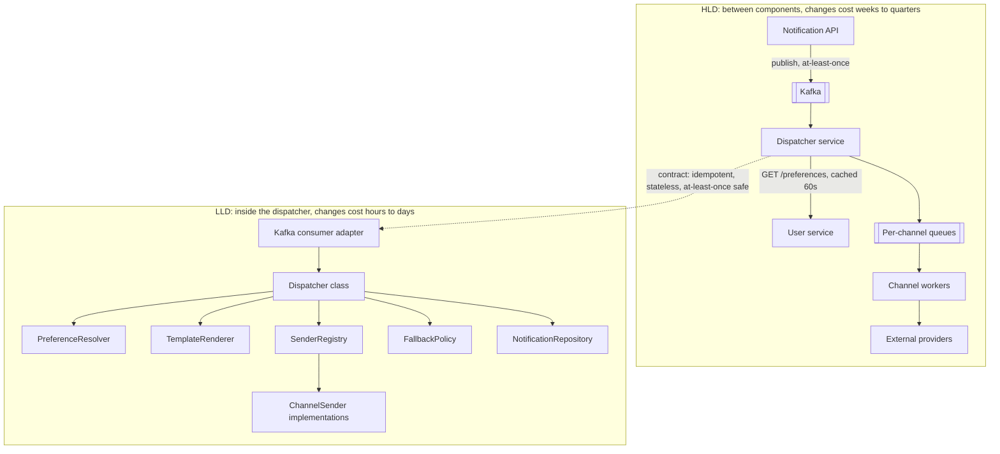
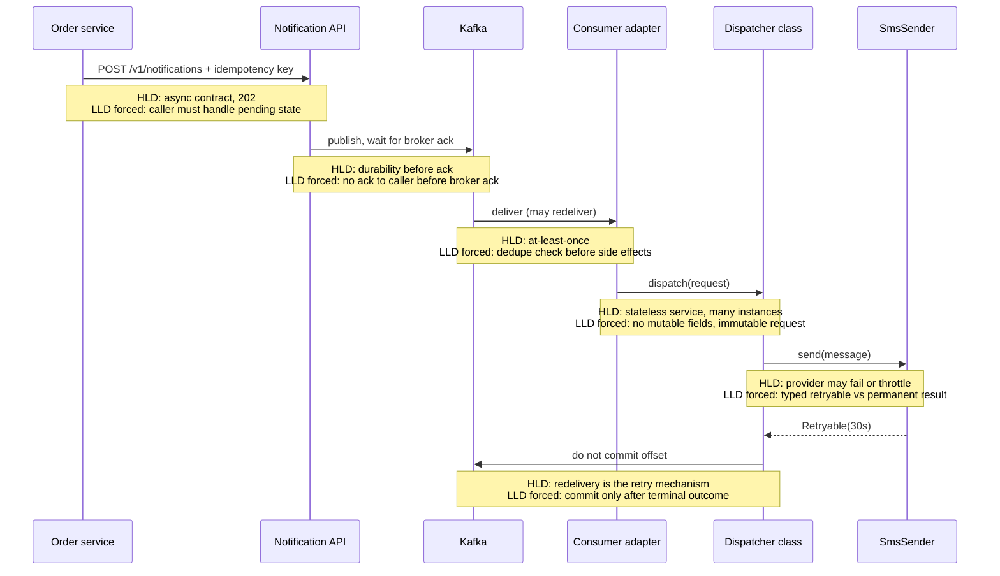

# Chapter 4: HLD vs LLD

## 4.1 Problem Statement

Three stories, all from the same notification platform, all caused by not being clear about which level a decision belongs to.

**Story one: perfect classes, wrong owner.**

A team builds the dispatcher with everything Chapter 3 recommends. Small classes, interfaces on the axes of variation, immutable records, typed results, fast tests. Genuinely good code, and the team is proud of it.

One detail is wrong, and it is not in the code. The dispatcher owns the `preferences` table. It seemed harmless: the dispatcher is the only thing that reads preferences, so why make a network call to the user service?

Six months later:

- The mobile team needs a settings screen showing notification preferences. They cannot query the notification service's database, so they add an endpoint to it. The notification team is now on the critical path for a mobile feature.
- Marketing needs preferences in the data warehouse. Another endpoint, another owner.
- The user service needs to delete preferences when an account closes, for GDPR compliance. It cannot, so it publishes an event that the notification service must consume, which is a new dependency in the wrong direction.
- Preference reads are now 40 times more frequent than notifications, so the notification service scales on a load that has nothing to do with notifications.

No refactor inside the dispatcher fixes any of this. The classes are excellent. The **boundary** is wrong, and boundaries are HLD. Fixing it means moving a table between services, migrating data, changing four consumers, and a quarter of coordination.

**Story two: right architecture, unshippable internals.** Chapter 3 in full. Correct diagram, 400-line method, three weeks and an outage to add a channel.

**Story three: the meeting that decided nothing.**

Design review, one hour, eight engineers. The agenda is the notification platform. Here is what actually happens:

- Minutes 0 to 12: someone asks whether the dispatcher should use the Strategy pattern for channels. Four people have opinions.
- Minutes 12 to 25: an argument about whether `SendResult` should be a sealed interface or an enum with fields.
- Minutes 25 to 40: someone raises Kafka partitioning, gets three sentences in, and the conversation drifts back to whether the renderer should be an interface.
- Minutes 40 to 55: a debate about package structure.
- Minute 55: someone asks "wait, are preferences cached, and what happens if the user service is down?" Nobody knows. Meeting ends.

Fifty-five minutes on decisions that one person could have made and changed in an afternoon, and zero minutes on the decision that would take a quarter to reverse. This is the most common failure of the three, it happens in interviews as much as in meetings, and its cause is that nobody in the room said which level they were operating at.

## 4.2 Why This Problem Exists

The two levels feel like the same activity. Both are "design". Both use diagrams. Both involve trade-offs. Both are done by the same people, often in the same hour, sometimes in the same sentence. There is no moment where a bell rings and the level changes.

But they differ on four dimensions that matter, and mixing them means applying the wrong dimension's rules.

| Dimension | HLD | LLD |
|---|---|---|
| Scope | Between components | Inside one component |
| Cost to change later | Weeks to quarters | Hours to days |
| Who is affected by a change | Other teams, other services, clients | One team, one codebase |
| Decision maker | Needs agreement across teams | Can be made by the owning team, or one engineer |
| Evidence needed | Traffic numbers, growth, availability targets | The code, the requirements, a profiler |
| Failure mode when wrong | Coordination cost forever, migration projects | Slow delivery, bugs, painful reviews |
| How you fix it when wrong | Migration with a project plan | Refactor, often in a week |

The consequences follow directly from row two. A decision that costs a quarter to reverse deserves several senior people, written alternatives, and a review. A decision that costs an afternoon deserves one engineer and a pull request. Treating them the other way round, which is exactly what Story three did, is the whole problem: expensive decisions get made by accident while cheap ones get committee treatment.

There is a second reason, subtler and more damaging. **The levels constrain each other, and people forget the downward direction.** An HLD decision silently imposes mandatory requirements on the code inside the boxes. Choose an at-least-once queue and you have just made idempotency a requirement in every consumer, whether anyone writes that down or not. Teams that treat HLD as "just the diagram" ship code that violates constraints they were never told about, and then discover it as duplicate charges on real customers' cards. Section 4.5.3 is the antidote and it is the most useful part of this chapter.

## 4.3 Real World Analogy

An airline has two design problems that look nothing alike and are tightly linked.

**The route network.** Which cities, which hubs, how many flights, which connections, what to do when a hub is closed by weather. Changing it is slow: slots at airports, regulatory approval, aircraft repositioning, staff bases. Get it wrong and no amount of excellence anywhere else compensates. A carrier with the wrong hub loses money on every well-run flight.

**The cabin.** Seat pitch, galley position, lavatory count, overhead bin volume, where the crew rest area goes. Changing it is a maintenance visit. Get it wrong and passengers are uncomfortable, turnaround takes longer, and crew work harder, but the route still flies.

Route network is HLD. Cabin is LLD. The analogy is worth keeping because it carries the two things people get wrong.

**It carries the downward constraint.** Choosing a 14 hour route is a network decision that *forces* cabin decisions: lie-flat seats, two galleys, crew rest, more lavatories. The cabin team does not get to ignore this. If they fit a short-haul cabin to a long-haul route, the aircraft flies and the airline still fails, and the cause is that a network decision was not translated into a cabin requirement.

**It carries the upward constraint too, which people forget.** If the only available aircraft cannot be reconfigured for lie-flat seats, the route is not viable. A cabin-level limitation just killed a network-level plan. Section 4.5.4 is full of software versions of this, and it is why an architect who does not look inside the boxes produces designs that cannot be built.

## 4.4 Simple Explanation

The shortest version:

> **HLD is about the boundaries between things. LLD is about the insides of one thing.**

Chapter 2 gave the test in passing. Here it is properly, as three questions. Ask them in order and stop at the first "yes".

**Question 1: If I change this, must another team change their code?**
Yes, it is HLD. Event names, payload fields, endpoint contracts, which service owns which data, whether a call is synchronous.

**Question 2: If I rewrote this component from scratch in a different language, would this decision survive?**
Yes, it is HLD. The dispatcher consuming from Kafka survives a rewrite. `SenderRegistry` does not.

**Question 3: Do I need traffic numbers to decide this?**
Yes, it is almost certainly HLD. Whether to shard, whether to cache, whether to replicate: all depend on load. Whether to use a `HashSet` depends on the code, not the traffic.

If all three are "no", it is LLD, and one engineer should decide it in a pull request.

Applied to the notification platform:

| Decision | Level | Which question caught it |
|---|---|---|
| Notifications are sent asynchronously | HLD | Q1: every caller's code changes |
| Dispatcher consumes from Kafka | HLD | Q2: survives a rewrite |
| Preferences are owned by the user service | HLD | Q1: determines who calls whom |
| Preferences are cached in Redis for 60 seconds | HLD | Q3: needs the read rate to justify |
| `ChannelSender` is an interface | LLD | All three no |
| `SendResult` is a sealed interface | LLD | All three no |
| Send failures are classified retryable or permanent | Both | See Section 4.5.2 |
| `RenderedMessage` is a record | LLD | All three no |
| The API returns `202 Accepted` | HLD | Q1: callers build on the status code |
| Requests carry an idempotency key | HLD | Q1: callers must supply it |
| Idempotency keys are stored in Redis with `SETNX` | LLD | All three no |
| Per-channel queues instead of one queue | HLD | Q3: depends on channel throughput |
| The dispatcher holds no mutable fields | LLD, forced by HLD | Section 4.5.3 |

That last row is the interesting one, and it is where most of this chapter's value sits.

## 4.5 Technical Deep Dive

### 4.5.1 A classification drill

Speed at classifying is worth building, because it is what lets you keep a design conversation on one level. Twenty statements, each labelled with the level and the reason.

| Statement | Level | Why |
|---|---|---|
| Orders and payments are separate services | HLD | Component boundary |
| `OrderService` uses constructor injection | LLD | Internal, survives nothing |
| `PaymentCaptured` events contain `amountMinor` as a long | HLD | Public contract shape |
| Amounts are stored internally as `BigDecimal` | LLD | Nobody outside sees it |
| The order table is sharded by `customer_id` | HLD | Determines what queries are possible for everyone |
| The orders table has an index on `(customer_id, created_at)` | LLD | Internal performance detail |
| Reads go to a replica, writes to the primary | HLD | Changes consistency guarantees clients observe |
| A repository interface hides that split from the domain code | LLD | Implementation of the above |
| Search runs on Elasticsearch, not Postgres | HLD | New component, new ownership, new failure mode |
| The search client retries twice with backoff | LLD | Inside one component |
| Retries are safe because writes are idempotent | Both | HLD requires it, LLD implements it |
| Sessions live in Redis, not in memory | HLD | Makes horizontal scaling possible |
| Session data is serialised as JSON | LLD | Internal, changeable |
| The API is versioned as `/v1/` | HLD | Client contract |
| Controllers are thin and delegate to domain services | LLD | Internal structure |
| A circuit breaker protects the pricing call | Both | HLD chooses the resilience posture, LLD wires it |
| Emails are sent by a background worker | HLD | Moves work off the request path, visible to users |
| The email body is built with a `StringBuilder` | LLD | Cannot be more internal |
| The system tolerates losing one availability zone | HLD | Drives replication and deployment topology |
| A `PriorityQueue` orders pending retries by due time | LLD | Data structure choice |

Notice that three rows say "both". Those are not fudges. They are the boundary zone, and knowing it exists prevents a lot of pointless argument.

### 4.5.2 The boundary zone

Some decisions have an HLD half and an LLD half. Naming which half you are discussing dissolves most level-mixing arguments in a meeting.

| Topic | The HLD half | The LLD half |
|---|---|---|
| API | Endpoints, status codes, resource shape, versioning, auth model, pagination style | DTO classes, validation annotations, controller structure, mapping code |
| Database schema | Which entities exist, which service owns them, the access patterns, the partition key | Column types, indexes, constraint names, migration scripts |
| Idempotency | That the contract requires a key and that duplicates must be safe | Where keys are stored, the expiry, the check-and-set mechanism |
| Events | Topic names, payload fields, compatibility rules, ordering guarantees | Serialisation library, builder classes, consumer threading |
| Caching | That a cache exists, what it holds, its freshness budget | Key naming, the client wrapper, stampede protection |
| Resilience | Which dependencies get breakers and what the fallback behaviour is | Timeout values, decorator wiring, thread pool sizes |
| Error handling | Which HTTP codes and which retry semantics clients see | Exception hierarchy, typed results, where translation happens |

The rule that makes this practical: **the observable guarantee is HLD, the mechanism is LLD.** "Duplicate requests with the same key are safe" is a promise to callers, so it is HLD and it must be written in the contract. `SETNX` with a 24 hour expiry is one way to keep that promise, so it is LLD and it can change on a Tuesday.

### 4.5.3 Downward constraints: what HLD forces on your code

This is the section to reread. Every HLD choice imposes non-negotiable requirements inside the boxes, and the standard way systems fail is that these requirements were never written down.

| HLD decision | Mandatory LLD consequence | What happens if you skip it |
|---|---|---|
| At-least-once queue delivery (Chapter 53) | Every consumer must be idempotent, with a dedupe key and a store | Duplicate emails, duplicate charges, double-decremented inventory |
| More than one instance behind a load balancer (Chapter 23) | No mutable fields on beans, no local file storage, no in-memory caches that must agree, no unguarded scheduled jobs | Corrupted responses under load, files that exist on one box, jobs that run three times |
| Sharded database (Chapter 42) | Every query carries the shard key; no cross-shard joins or transactions; aggregation happens in application code | Queries that work in staging with one shard and fail in production |
| Read replicas (Chapter 47) | Code must choose per query whether staleness is acceptable, and route read-your-writes cases to the primary | "I saved it and it disappeared" bug reports that nobody can reproduce |
| Eventual consistency (Chapter 18) | No code may assume a write is immediately visible elsewhere; UIs need optimistic display or explicit pending states | Race conditions that appear only under real latency |
| Asynchronous processing | Correlation ids threaded through every call; handlers tolerate out-of-order arrival; clients get a pending state, not a result | Unloggable, untraceable failures and a UI that lies about completion |
| Public event schema | Additive-only changes, versioned payloads, unknown fields ignored on read | One deploy breaks every consumer you did not know about |
| Circuit breaker on a dependency (Chapter 60) | Every remote call has a timeout, and a defined fallback behaviour per call site | The breaker never trips because calls hang forever instead of failing |
| Cache in front of a store (Chapter 34) | Invalidation on write, stampede protection, negative caching, and a defined behaviour on cache outage | Stale data forever, or the database collapsing when the cache restarts |
| Multi-region or multi-leader (Chapter 45) | No wall-clock ordering across regions, explicit conflict resolution, clock skew tolerance | Silent lost updates that only a customer complaint reveals |
| Rate limiting at the gateway (Chapter 62) | Clients must handle `429` with backoff, and batch endpoints where limits bite | Retry storms that turn throttling into an outage |
| gRPC with protobuf (Chapter 79) | Field numbers are permanent, fields are only added, nothing is renumbered | Wire incompatibility between versions during a rolling deploy |
| Long-lived WebSocket connections (Chapter 84) | Per-connection state, heartbeats, reconnect with resume, sticky routing or a shared state store | Silent dead connections and users who stop receiving messages |
| Distributed lock for a scheduled job (Chapter 51) | Lock has a lease with a timeout, work is idempotent anyway, fencing against a stale lock holder | Two instances running the same job, both believing they hold the lock |

Read the first row against Chapter 2's design. The HLD said "commit Kafka offsets after the work". That single sentence made idempotency a hard requirement in the dispatcher, and Chapter 2 did include the idempotency key, so the chain held. Now imagine an implementer who read only the box diagram. They write a clean, well-tested, non-idempotent consumer. It is excellent LLD. It sends some customers two "your order shipped" messages every time a pod restarts, and the bug is unfixable by any amount of tidying, because the requirement was structural and unstated.

The practical takeaway, and it belongs in your design doc template from Chapter 2:

> For every HLD decision, write one line naming the constraint it places on the code inside the boxes. That list is the handoff between the two levels.

### 4.5.4 Upward constraints: what LLD tells you about your HLD

The reverse direction is real too, and it is why designing without looking inside the boxes is dangerous.

| LLD reality | HLD must change how |
|---|---|
| A component keeps a large in-memory index it cannot afford to rebuild per request | It is a stateful service (Chapter 24). Route by key, plan for warm-up, replicas cost memory not just CPU |
| The critical library is not thread safe and has no alternative | Concurrency comes from processes, not threads. Instance count and memory footprint change |
| Serialisation dominates CPU in the profile | Protocol choice moves up to HLD: protobuf instead of JSON, or fewer, coarser calls |
| Warm-up takes 90 seconds before the service is useful | Deployment strategy, health check design, and autoscaling reaction time all change |
| One request needs 700 MB of heap | Instance sizing, packing density, and cost model change. Maybe the work must be split |
| A WebSocket handler holds per-connection state that cannot be externalised | Connection affinity becomes an HLD requirement, and so does a plan for graceful drain |
| Measurement shows a request needs 40 ms of pure CPU | Capacity planning changes: 25 requests per second per core, so the fleet size follows arithmetic, not hope (Chapter 92) |

WhatsApp is the classic example of an upward constraint used deliberately. Their choice of Erlang, with extremely lightweight processes and a runtime built for millions of concurrent connections, was a low-level implementation capability. It enabled an architecture that served an enormous user base from a famously small fleet, which a per-connection-thread implementation could not have supported at that time. The implementation capability shaped the architecture, not the other way round.

The lesson to carry: when a design depends on an assumption about what code can do, **measure it before committing the architecture**. Chapter 2's advice to prototype the one risky assumption is exactly this. A day of profiling can save a quarter of migration.

### 4.5.5 The four quadrants

|  | LLD good | LLD poor |
|---|---|---|
| **HLD good** | Cheap to run, cheap to change. The goal | Slow delivery, buggy, but survivable. Fix by refactoring one component at a time, no coordination needed |
| **HLD poor** | Deceptive and dangerous. Everything looks professional and every product change needs three teams. The most expensive quadrant to escape | Obvious failure. At least nobody is fooled, and a rewrite is easy to justify |

Two observations from this table that are worth more than they look.

**The dangerous quadrant is top-right of the bottom row, not bottom-right.** Good code inside wrong boundaries is harder to fix than bad code inside right boundaries, because the good code creates confidence and sunk cost. Story one in Section 4.1 is exactly this: nobody could point at anything bad, and every feature still took a quarter.

**Recovery costs are asymmetric.** Bad LLD in a good architecture is fixed by one team, incrementally, with tests, while shipping features. Bad HLD is fixed by a migration touching several teams, usually with dual writes and a backfill, and it needs organisational agreement. That asymmetry is the entire reason to spend more care on HLD decisions, and it is the justification for the ordering in the next section.

### 4.5.6 The order of work, and why it is not a waterfall

Beginners hear "HLD then LLD" and produce a waterfall: months of diagrams, then implementation, then discovery that a core assumption was wrong. Do not do that. The real sequence is a loop with a deliberate spike in it.

```
1. HLD, breadth first, shallow
   Components, ownership, contracts, data placement, rough numbers.
   Stop before internal detail. Half a day to two days.
             |
             v
2. Find the riskiest assumption
   Usually "can this be fast enough" or "does this library do X".
             |
             v
3. Spike it. LLD depth on one narrow path only
   Write throwaway code. Measure. Answer the question. One to three days.
             |
      +------+-------+
      |              |
   assumption     assumption
   holds          breaks  ---> back to step 1, revise the HLD now
      |
      v
4. Vertical slice
   One end-to-end feature through every layer, with real LLD quality.
   This validates the contracts, not just the boxes.
             |
             v
5. Write down the downward constraints (Section 4.5.3)
   One line per HLD decision. This is the handoff document.
             |
             v
6. Breadth: build the rest, LLD decided per component by its owners
             |
             v
7. Revisit HLD when evidence arrives (load tests, incidents, new requirements)
```

Two properties matter here. The HLD is deliberately shallow on the first pass, because detail added before the risky assumption is tested is often wasted. And the vertical slice comes before the breadth, because a slice through all layers is what proves the contracts are usable, which a diagram cannot.

### 4.5.7 Moving between levels in an interview

A 45 minute system design interview is HLD with brief LLD excursions. Candidates lose the thread by descending without deciding to, or by refusing to descend when invited.

Approximate budget for 45 minutes:

| Minutes | Level | Activity |
|---|---|---|
| 0 to 5 | Neither | Clarify requirements and scope |
| 5 to 10 | HLD | Scale estimate, out loud, with arithmetic |
| 10 to 15 | Boundary | API design |
| 15 to 20 | HLD | Data model, store choice per entity |
| 20 to 30 | HLD | Component diagram, request flow, trace one request |
| 30 to 40 | Either, follow the interviewer | Deep dive where they push. Often one component's internals, or scaling, or failure |
| 40 to 45 | HLD | Trade-offs, bottlenecks, what you would do next |

Phrases that keep control of the level, which are worth having ready:

- Descending on purpose: "That is inside the dispatcher. Let me finish the request path, then go into that class design."
- Deferring cleanly: "Timeout values are a tuning decision, I would start at 2 seconds and adjust from load tests. The structural point is that every call has one."
- Being invited down and taking it: "Happy to. Inside that service, the classes would be..." and then actually name the interfaces and the data structures, because a candidate who cannot descend looks like someone who has read blog posts.
- Coming back up: "That is the class layout. Back at the system level, the consequence is that we can add a channel without redeploying anything else."
- Catching yourself: "I have drifted into implementation detail. The system-level decision here is whether this is synchronous."

The signal interviewers actually read is whether you know which level you are on. Descending to class design in minute six, unprompted, reads as inability to prioritise. Refusing to descend in minute 32 reads as inability to build. Part 4, Chapters 123 to 134, drills the whole framework.

## 4.6 Architecture Diagram

The same system at both zooms, with the boundary drawn explicitly. Everything above the dashed line is negotiated between teams. Everything below it is one team's business.



ASCII version:

```
================= HLD: between components =====================
  Notification API --(publish, at-least-once)--> Kafka
                                                   |
                                                   v
                                          Dispatcher service
                                          /        |        \
                    GET /preferences  ---+         |         +--> per-channel queues
                    (cached 60s)                   |                     |
                    User service                   |              channel workers
                                                   |                     |
                                                   |            external providers
===================================================|===========================
   CONTRACT ACROSS THE BOUNDARY:                   |
     - consumer must be idempotent                 |
     - service must hold no instance state         |
     - must tolerate duplicate and out-of-order    |
     - preferences may be up to 60s stale          |
===================================================|===========================
================= LLD: inside the dispatcher ======v============
                        Kafka consumer adapter
                                  |
                            Dispatcher class
              +--------+----------+----------+---------+
              |        |          |          |         |
     PreferenceResolver | SenderRegistry  FallbackPolicy  NotificationRepository
                 TemplateRenderer   |
                                ChannelSender impls
```

The dashed line is the most important part of the diagram. Above it, changes need agreement and versioning. Below it, one team refactors freely. **The four bullets in the middle are the handoff**, and in most real projects that box is missing, which is precisely how the failures in Section 4.5.3 happen.

## 4.7 Request Flow

Follow one request and label, at each hop, which HLD decision governs it and which LLD consequence that decision forces. This is the two levels visible in a single trace.



Step by step, in the form worth practising: HLD decision, then the LLD requirement it creates.

1. **Asynchronous contract, `202 Accepted`.** HLD, because every caller's code depends on it. Forces the caller's LLD to represent a pending state rather than a completed send, and forces this service to expose a lookup endpoint for the outcome.
2. **Publish and wait for the broker acknowledgement.** HLD durability guarantee. Forces the API's LLD to never return `202` before the broker confirms, which rules out the tempting optimisation of publishing in a background thread.
3. **At-least-once delivery.** HLD, from the choice to commit offsets after work. Forces a dedupe check before any side effect, plus a store for the keys, plus expiry policy on that store.
4. **Stateless service, many instances.** HLD scaling decision. Forces no mutable bean fields, no local files, immutable request objects, and any cross-request state in Redis rather than in the process. Chapter 3's concurrency section is the implementation of this one line.
5. **Providers fail in two distinct ways.** HLD acknowledges the failure model. Forces `SendResult` to distinguish retryable from permanent, because the two get opposite treatment.
6. **Redelivery is the retry mechanism.** HLD chooses the queue as the retry engine rather than in-process retries. Forces the LLD rule that offsets commit only after a terminal outcome, and that partial work is safe to repeat.

Do this exercise on any design you are handed. Six hops, six constraints, and you have the handoff document from Section 4.5.3 for free.

## 4.8 Internal Components

The artifacts of each level, who owns them, who reviews them, and how they rot.

| Artifact | Level | Owner | Reviewed by | Goes stale when |
|---|---|---|---|---|
| Context and container diagrams | HLD | Tech lead or architect | Senior engineers from affected teams | A service is added or ownership moves |
| Service ownership and data ownership map | HLD | Tech lead | All affected teams | A table gets a second writer |
| API specification (OpenAPI, protobuf) | Boundary | Owning team | Every consumer team | A field is added without versioning |
| Event schema registry | Boundary | Producing team | Consuming teams | A field is renamed or a type changes |
| Constraint list (Section 4.5.3) | Boundary | Whoever wrote the HLD | Implementing engineers | An HLD decision changes and this is not updated |
| Capacity estimate | HLD | Tech lead | Anyone with production numbers | Traffic doubles |
| Class diagram | LLD | Owning team | Team code review | Every significant refactor, and that is fine |
| Sequence diagram at method level | LLD | Owning engineer | Team code review | The flow changes |
| Database schema and migrations | Boundary | Owning team | DBA or senior engineer | A migration lands without review |
| Tests | LLD | Owning engineer | Team code review | They never rot; they fail loudly, which is the point |

Two things to notice. **LLD artifacts are allowed to go stale**, because the code is the truth and a class diagram is a teaching aid. HLD and boundary artifacts are not allowed to go stale, because there is no single place where the truth lives; the truth is distributed across teams, and the document is the only shared copy.

And the constraint list is the one row that exists in almost no real project, while being the row that prevents the most expensive class of bug.

## 4.9 Production Example

**DynamoDB makes the downward constraint impossible to ignore.** Its HLD-level property is that data is partitioned and a query must target a partition key; there are no cross-partition joins and no ad hoc queries across the whole table. That single architectural fact forces a very specific LLD practice, usually called single-table design: you enumerate your access patterns first, then design keys and indexes to serve exactly those patterns, and the object model follows the keys rather than the other way round.

Engineers coming from relational databases routinely fight this, model their entities normally, and then discover their code needs a scan of the whole table. The reason it feels so harsh is instructive: with Postgres you can defer access-pattern thinking to LLD and rescue yourself later with an index, so the constraint is soft. DynamoDB makes it hard, and a hard constraint at least tells you the truth on day one. Chapters 38 and 42 cover the underlying mechanics.

**Kafka's delivery guarantee is a contract with your code, not just your ops team.** Kafka provides at-least-once delivery in ordinary configurations, and duplicates are a normal, expected event during rebalances, retries, and restarts. Kafka's documentation is explicit that consumer applications must handle this, and the standard answer is idempotent processing keyed on something stable in the message. This is a single HLD sentence generating a mandatory design requirement in every consumer anybody writes, forever. Chapter 53 covers the mechanics and Chapter 20 covers idempotency.

**Stripe put idempotency in the public contract on purpose.** Stripe's API accepts an `Idempotency-Key` header on write requests, and a repeated request with the same key returns the original result rather than performing the action twice. Look at what that is: an HLD-level promise, published in the contract, that clients can build retry logic against. Behind it sits an LLD mechanism, a key store with a retention window, which Stripe can change without breaking a single integration. The observable guarantee is HLD; the mechanism is LLD. That is Section 4.5.2's rule in a shipped product, and it is why every write endpoint you design should copy it.

**WhatsApp is the upward constraint.** Their use of Erlang and the BEAM runtime, with very lightweight processes and per-connection isolation, gave them a per-server concurrent connection capability that a thread-per-connection implementation could not match at the time. That LLD-level capability is what made their small-fleet architecture viable, and the architecture would have been a fantasy on a stack that could not deliver it. Chapter 138 covers the design, and Chapter 84 covers the connection handling.

## 4.10 Advantages

Keeping the two levels distinct buys specific things.

- **Expensive decisions get proportionate attention.** Boundaries and contracts get several senior reviewers; class layout gets one pull request reviewer, which is correct in both directions.
- **Meetings converge.** Naming the level, out loud, at the start ends most level-mixing arguments before they consume an hour.
- **Handoffs stop losing information.** The constraint list makes implicit requirements explicit, which prevents the duplicate-charge category of bug.
- **Teams get real autonomy.** Once boundaries and contracts are agreed, each team owns its internals fully and needs nobody's permission to refactor.
- **Reviews get the right reviewers.** Cross-team review for contracts, team review for internals. Nobody sits in a meeting about somebody else's package structure.
- **Interviews go better,** because you can navigate levels deliberately and say which one you are on.
- **Problems become diagnosable.** "Every feature needs three teams" is an HLD symptom. "Every feature takes three weeks inside one team" is an LLD symptom. Different diagnosis, different cure, and Section 4.5.5 tells you which you have.

## 4.11 Limitations

- **The boundary is genuinely fuzzy.** Section 4.5.2 lists the overlap honestly. Anyone claiming a crisp universal line is selling something.
- **Separating them can become a waterfall.** Months of HLD before code is worse than no HLD, because the assumptions never get tested. Section 4.5.6's loop exists to prevent this.
- **Separating the roles is worse than separating the levels.** An architect who does not write code will miss every upward constraint in Section 4.5.4 and will produce designs that cannot be built. The levels are different activities, not different job titles.
- **Level discipline can be used to dodge.** "That is just implementation detail" is sometimes true and sometimes a way of avoiding a question you cannot answer. Interviewers spot the difference.
- **Small systems do not need the ceremony.** One service, one team, three months old: the whole thing is one design conversation, and formalising the split wastes time.
- **Neither level covers the operational reality.** Deployment, monitoring, on-call, and cost are their own concerns, and a design that ignores them is incomplete no matter how well the two levels are separated.

## 4.12 Trade-offs

| Dial | One way | The other way |
|---|---|---|
| HLD depth before coding | Deep: fewer expensive surprises, slower start, assumptions untested longer | Shallow: fast feedback, more rework risk on boundaries |
| Strictness of the boundary | Strict: clear ownership and review paths, bureaucratic for small changes | Loose: fast, and contracts erode until nobody knows what is guaranteed |
| Who decides LLD | Central standards: consistency across teams, slower and resented | Team autonomy: fast and motivated, divergent styles across the codebase |
| Contract stability | Versioned and rigid: safe evolution, slow to change | Loose: fast iteration, consumers break |
| Documented constraint list | Written: nothing implicit, upkeep cost | Verbal: cheap now, requirements silently lost at every handoff |
| Same people at both levels | Yes: designs are buildable, fewer people scale worse | Separate roles: scales to more teams, upward constraints get missed |

The removal test at the level of the practice itself.

**Skip HLD entirely** and start coding. You gain speed, immediately and genuinely, and for a two week prototype this is the right call. You lose the chance to place boundaries deliberately, so ownership forms by accident around whoever wrote the first version. That is Story one in Section 4.1, and it costs a quarter to unwind.

**Skip LLD design** and write whatever works. You gain a week now. You lose the three weeks later, plus an outage, which is Chapter 3 in full. Note the asymmetry with the previous bullet: this cost is paid by one team and can be paid back incrementally, which is why skipping LLD is the less dangerous of the two shortcuts.

**Skip the constraint list.** You gain half an hour. You lose the only written link between the levels, and the implementer builds a clean non-idempotent consumer that duplicates messages. Highest ratio of cost avoided to effort spent in this whole chapter.

## 4.13 Common Mistakes

**Mixing levels in one conversation.** Story three. Fix it with one sentence at the start: "we are doing boundaries and contracts today, class design is next week", and a visible parking list for the deferred items.

**Deciding LLD in an HLD document.** An HLD that names a JSON library, or specifies timeout values in milliseconds, is over-reaching and will be ignored or resented. Specify the guarantee, not the mechanism.

**Deciding HLD in code review.** A pull request that adds a second writer to another service's table, or introduces a new synchronous dependency, is an architecture change wearing a diff's clothing. These deserve escalation, not a thumbs up.

**Ignoring the downward constraints.** The big one. Async at the HLD level with no idempotency in the code produces duplicate charges on real cards. Multiple instances with in-memory state produces intermittent corruption. Both are, in a sense, correct code implementing an unstated requirement.

**Designing the boxes without checking they are buildable.** No spike, no measurement, and month three reveals the component cannot hit the latency the diagram assumed.

**Perfect LLD inside wrong boundaries.** The dangerous quadrant. If every product change needs three teams, stop polishing classes and look at ownership.

**Treating "implementation detail" as a dismissal.** Some implementation details determine whether the architecture works at all, which is the entire point of Section 4.5.4.

**Letting boundary artifacts rot.** A stale class diagram is harmless. A stale event schema is an outage, because it is the only shared copy of the truth.

**Building the whole HLD breadth before one vertical slice.** All the contracts are unproven at once, and you find out during integration week.

**Assuming the levels map to seniority.** Junior engineers make consequential HLD decisions constantly, usually by writing code, and senior engineers who never do LLD lose the ability to judge feasibility.

## 4.14 Interview Questions

**Q: What is the difference between HLD and LLD?**
HLD is design between components: boundaries, ownership, contracts, data placement, communication style, scaling and failure posture. LLD is design inside one component: classes, interfaces, data ownership within the code, method contracts, data structures, error representation, thread safety. The practical difference is cost of change, weeks to quarters versus hours to days.

**Q: Give me a fast test for classifying a decision.**
Would changing it force another team to change code? Would it survive a rewrite of the component in another language? Do I need traffic numbers to decide it? Any yes means HLD.

**Q: Name something that is both.**
Idempotency. That duplicate requests are safe is a published guarantee, so it is HLD. Where the keys are stored and for how long is LLD. Same pattern for caching, error semantics, and schema: the observable guarantee is HLD, the mechanism is LLD.

**Q: Your architecture is correct but every feature takes weeks. Where do you look?**
Inside one component. Look for change radius: how many files a typical feature touches, whether there is an if-chain over types, whether tests need real infrastructure. That is an LLD problem and one team can fix it incrementally.

**Q: Your code is clean but every feature needs three teams to coordinate. Where do you look?**
At boundaries and data ownership. Something owns data that other components need, or a component owns two responsibilities that change independently. That is HLD and it needs a migration, not a refactor.

**Q: You choose at-least-once delivery. What have you just required of every implementer?**
Idempotent handlers with a stable dedupe key and a store for it, no side effects before the dedupe check, and commits only after a terminal outcome. Also that partial work is safe to repeat.

**Q: You decide to run three instances of a service. What must change in the code?**
No mutable fields on shared beans, no local file storage, no in-memory state that instances must agree on, scheduled jobs guarded by a distributed lock and idempotent anyway, and sessions moved out of the process.

**Q: How much HLD before you start coding?**
Enough to fix boundaries, ownership, contracts, and rough numbers, which is usually one to two days. Then spike the riskiest assumption, then build one vertical slice end to end to prove the contracts, then go broad. Not a full design document before any code.

**Q: How do you handle it when an interviewer pulls you into class design too early?**
Follow them, because they are steering, but say the level out loud and come back up: give the class layout, then state the system-level consequence. If it happens in minute five, offer to finish the request path first so the deep dive has context.

**Q: Which is worse, bad HLD or bad LLD?**
Bad HLD, because it needs cross-team migration to fix while bad LLD needs one team refactoring incrementally. Good code inside wrong boundaries is the most expensive quadrant, since everything looks healthy while every change is slow.

## 4.15 Production Best Practices

1. **Say the level at the start of every design conversation,** and keep a visible parking list for items from the other level.
2. **Write the constraint list.** One line per HLD decision, naming what it requires of the code. Put it in the design doc and link it from the repository README.
3. **Route reviews by level.** Contracts and boundaries get cross-team review. Internals get team review. Do not invert this.
4. **Escalate architecture changes that arrive as pull requests.** A new synchronous dependency or a second writer on a table is not a code review matter.
5. **Spike before you commit,** whenever the design rests on an unmeasured assumption about performance or a library's behaviour.
6. **Build one vertical slice early,** through every layer, to prove the contracts are usable before you build breadth on top of them.
7. **Version every contract from day one,** and make event schema changes additive only.
8. **Keep boundary artifacts current in the same pull request that changes them.** Let LLD diagrams rot; the code is the truth there.
9. **Give every piece of data exactly one owning component,** and write the map down. This single rule prevents most of Story one.
10. **State the observable guarantee in the contract, never the mechanism.** "Duplicates are safe", not "we use Redis `SETNX`".
11. **Keep design and implementation in the same hands** wherever possible. Architects who do not code miss upward constraints.
12. **Diagnose slowness by symptom before prescribing.** Three teams per feature means look at boundaries. Three weeks per feature inside one team means look at the code.

## 4.16 Summary

HLD and LLD are two different activities that share tools and vocabulary. HLD is about boundaries between components: who owns what data, who calls whom and how, where things live, how the system scales and fails. LLD is about the inside of one component: classes, responsibilities, method contracts, data structures, error representation, thread safety.

The reason to keep them distinct is cost of change. HLD mistakes are unwound with migrations, dual writes, backfills, and cross-team agreement, over quarters. LLD mistakes are unwound with refactoring, by one team, while shipping. That asymmetry justifies spending more scrutiny on boundaries and less on package structure, and it explains why the worst quadrant is excellent code inside wrong boundaries: nothing looks broken and every change is expensive.

The part most often missed is that the levels constrain each other in both directions. Downward: every HLD decision imposes non-negotiable requirements on the code, and at-least-once delivery without idempotent handlers is the canonical example of what happens when nobody writes those requirements down. Upward: what the code can actually do determines which architectures are viable, which is why an architect who never looks inside a box will eventually promise something unbuildable.

Two habits carry most of the value from this chapter. Say which level you are on, out loud, whenever a design discussion starts. And for every HLD decision, write the one line naming what it requires of the code inside the boxes. That list is the handoff, and its absence is where the most expensive bugs come from.

## 4.17 Quick Revision Notes

- HLD is between components. LLD is inside one component.
- Classification test, stop at the first yes: does changing it force another team to change code? Would it survive a rewrite in another language? Do I need traffic numbers to decide it?
- Cost of change: HLD weeks to quarters, LLD hours to days. Everything else follows from this.
- Boundary zone rule: the observable guarantee is HLD, the mechanism is LLD.
- API contract, event schema, partition key, and idempotency promise are HLD. DTOs, indexes, serialisation, and key storage are LLD.
- Downward constraints are mandatory and usually unwritten. At-least-once needs idempotent consumers. Many instances needs no in-process state. Sharding needs the shard key in every query. Replicas need per-query staleness decisions. Async needs correlation ids and pending states.
- Upward constraints are real. In-memory indexes make a service stateful. A non-thread-safe library changes your concurrency model. Measured CPU per request sets your fleet size.
- Four quadrants: the dangerous one is good LLD inside bad HLD, because nothing looks wrong and every change is slow.
- Recovery asymmetry: bad LLD is one team refactoring, bad HLD is a cross-team migration.
- Order of work: shallow HLD, spike the risky assumption, vertical slice, write the constraint list, then breadth. Not a waterfall.
- Interview budget for 45 minutes: 5 clarify, 5 estimate, 5 API, 5 data, 10 diagram and flow, 10 deep dive where pushed, 5 trade-offs.
- Say the level out loud. Park items from the other level visibly.
- Boundary artifacts must stay current. LLD diagrams may rot, because the code is the truth.
- Levels are activities, not job titles. Architects who do not code miss upward constraints.

## 4.18 Mini Quiz

1. Classify each and give the reason: (a) `PaymentCaptured` gains a `currency` field, (b) the payment service switches its JSON library, (c) refunds move to a separate service, (d) the refunds table gains an index, (e) refund requests must carry an idempotency key.
2. State the boundary-zone rule in one sentence.
3. You choose at-least-once delivery for a queue. List three requirements you have just imposed on every consumer's code.
4. You decide to run five instances of a service that previously ran one. Name four things in the code that must now change.
5. Which quadrant is most expensive to escape, and why is it not the one with bad code?
6. Give an example of a low-level implementation reality that should force an architecture change.
7. Why is a stale event schema document more dangerous than a stale class diagram?
8. In an interview at minute 8 you are asked "which classes would you write for the feed service". What do you do?
9. A pull request adds a direct read of another service's database table because "the API is slow". Why is this not an ordinary code review decision?
10. A team reports that every feature takes three weeks, all inside their own service, with no other teams involved. Which level is the problem and what is the first thing you would measure?

**Answers**

1. (a) HLD, it is a public contract and consumers depend on the payload. (b) LLD, invisible outside the service, survives no rewrite. (c) HLD, a component boundary and an ownership change. (d) LLD, internal performance detail of one owning team. (e) HLD, it changes what every caller must send and what the service guarantees.
2. The observable guarantee is HLD; the mechanism that delivers it is LLD.
3. Consumers must be idempotent, keyed on something stable in the message. The dedupe check must happen before any side effect. Offsets or acknowledgements must be committed only after a terminal outcome, and partial work must be safe to repeat.
4. No mutable fields on shared beans, since each instance is a singleton across threads and there are now five of them. No local filesystem storage for anything that must be readable later. No in-memory caches or counters that instances need to agree on. Scheduled jobs need a distributed lock and must be idempotent anyway. Sessions or per-user state must move out of the process.
5. Good LLD inside bad HLD. Bad code is visible, easy to justify fixing, and one team can fix it incrementally. Good code inside wrong boundaries creates confidence and sunk cost while every product change needs cross-team coordination, and the fix is a migration requiring organisational agreement rather than a refactor.
6. Several are acceptable: a component that keeps a large in-memory index it cannot rebuild per request is a stateful service, so routing, warm-up, and replica sizing all change at the architecture level. Also acceptable: a critical library that is not thread safe, forcing process-based concurrency and changing instance count and memory footprint.
7. Because the code is the single source of truth for class structure, so a stale diagram misleads only a reader who can check. An event schema is the only shared copy of a contract distributed across several teams; there is no authoritative place to check it, so a stale one causes a consumer-breaking deploy.
8. Follow the interviewer, but keep the level explicit and brief. Offer to finish the request path first so the class design has context, and if they want it now, give it concretely and then return to the system level with the consequence. Refusing to descend reads as inability to build; descending without noticing reads as inability to prioritise.
9. Because it changes data ownership and creates a hidden cross-service coupling, which is an HLD change. The other team can no longer alter their schema safely, and the coupling is invisible in any diagram. The right response is to escalate: fix the slow API, add a cache, or replicate the data through events with a clear owner.
10. LLD. First measurement is change radius: for the last five features, how many existing files were modified, and how much of the change was reading code to feel safe. Then check whether unit tests require a database or network, and look for conditionals over types.

## 4.19 Hands-on Exercise

**Part 1: classification speed drill.** Take fifteen statements from your current codebase's recent pull requests and design discussions. Classify each as HLD, LLD, or boundary, and write the reason using the three questions from Section 4.4. Then find the ones you got wrong on reflection, and notice the pattern in your own mistakes. Most people systematically misclassify one category, usually treating schema decisions as purely internal.

**Part 2: build the missing constraint list.** Take Chapter 2's notification platform HLD, or your own current system's architecture. For every HLD decision, write one line naming what it requires of the code inside the boxes. Aim for at least twelve lines. Then, for each line, go and check whether the code actually satisfies it. This exercise finds real bugs in real systems with uncomfortable reliability, and the ones it finds are usually the intermittent kind nobody has been able to reproduce.

**Part 3: diagnose from symptoms.** For each symptom, decide the level, name the specific measurement you would take, and describe the fix and its rough cost:

1. Adding a field to an API takes two weeks of coordination
2. Adding a field to an API takes two days of coding inside one service
3. The same bug is fixed three times in three places
4. Deploying service A requires deploying service B at the same time
5. Load testing shows the service uses 40 percent more CPU per request than budgeted
6. Two services write to the same table
7. Unit tests need a running database and a network connection
8. One customer's data appeared in another customer's notification, intermittently, only in production

**Part 4: the round trip.** Take one component from your system. Write its LLD class diagram. Then write the list of HLD decisions that constrain it, and mark any constraint the code currently violates. Then find one LLD reality in that component that should constrain the architecture and is not currently reflected in any diagram, and write the sentence you would say about it in a design review.

## 4.20 Further Reading

- *Fundamentals of Software Architecture*, Richards and Ford. The chapter on architecture characteristics and the distinction between architecture and design is the closest published treatment of this chapter's subject.
- *Building Microservices*, Sam Newman, second edition. The chapters on boundaries, contracts, and versioning are the practical handbook for the HLD side of the line.
- *A Philosophy of Software Design*, John Ousterhout. On what makes an interface deep, which is precisely the question of how much the boundary should hide.
- *Designing Data-Intensive Applications*, Martin Kleppmann, chapters 5 and 9. The best available explanation of why replication and consistency choices propagate into application code, which is Section 4.5.3's theme with full rigour.
- Amazon's *Builders' Library*, particularly the articles on timeouts, retries, and challenges with distributed systems. Short, and each one is essentially a downward constraint explained end to end.
- Stripe's API documentation on idempotent requests. Read it as a worked example of publishing a guarantee while keeping the mechanism private.
- *The Twelve-Factor App*. Dated in places, still the clearest checklist of the constraints that horizontal scaling imposes on application code.

---

**Next chapter: Chapter 5, Functional Requirements.** How to get from a one-line request like "we need notifications" to a list of behaviours precise enough to build and test, which questions to ask, and how to spot the requirement nobody stated.
