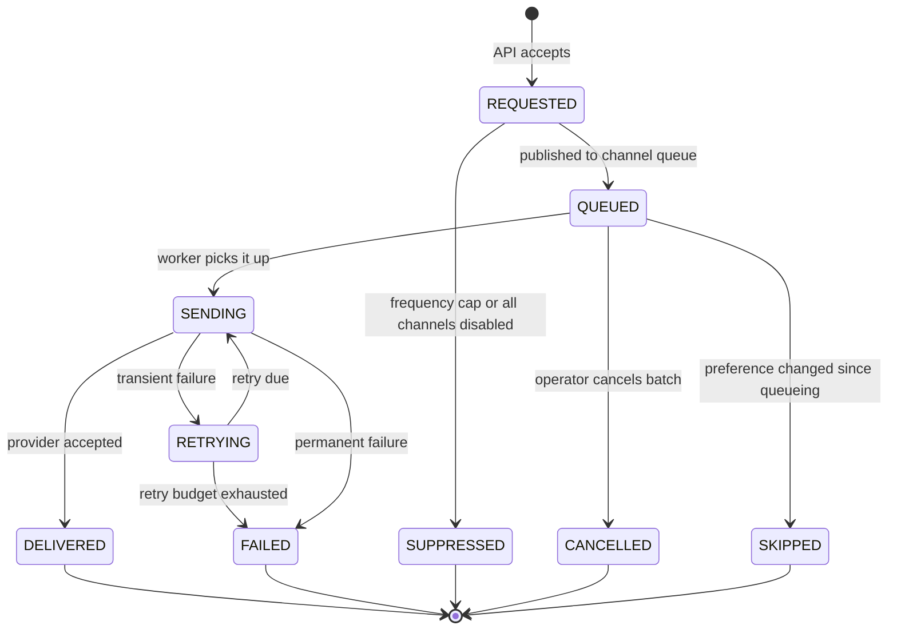
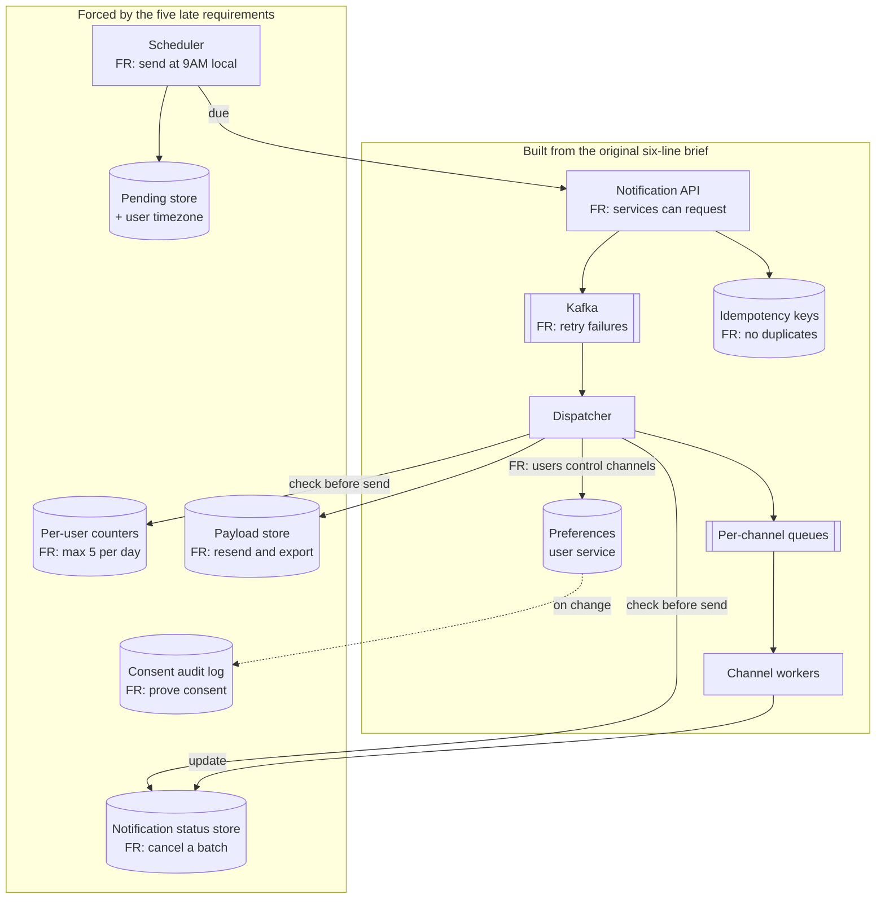
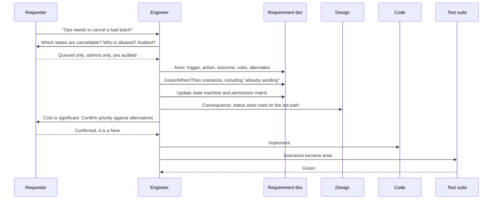

# Chapter 5: Functional Requirements

## 5.1 Problem Statement

Chapter 2 designed a notification platform from this brief: any internal service can request a notification, three channels, users control their channels, no duplicates, retry failures. Six sentences. The design that came out of it was sound, the team built it, and it shipped.

Then it met the rest of the company.

**Marketing.** "Send the weekly digest at 9 AM in each user's local time." Nobody had mentioned scheduling. The platform sends immediately, because immediately was the only mode anyone described. Scheduled sends need a store of pending notifications, a scheduler, and per-user timezone data.

**Support.** "A customer says they never got their receipt. Can you resend it?" There is no resend. Support cannot see notification content, only status, because the design recorded outcomes and not payloads.

**Legal.** "A user can request a full export of every notification we sent them, and we must prove they consented to marketing messages." Neither exists. The audit trail records delivery attempts, not consent history.

**Product.** "Never send a user more than five notifications a day, and never two of the same category within an hour." This one is architecturally awkward, because it requires state that spans notifications, and the dispatcher was designed to handle each message independently.

**Operations.** "We accidentally queued 400,000 notifications with a broken template. Cancel them." Impossible. Once a message is in Kafka it will be delivered, because Chapter 2's design used the queue as the retry engine and there is no concept of a cancelled notification.

Five requirements. None of them unreasonable. None of them mentioned in the original brief. Now the important part, and this is why the chapter exists:

| Late requirement | Retrofit cost | Why |
|---|---|---|
| Resend a notification | Small | Add an endpoint, store payloads. No structural change |
| Consent audit trail | Small | New table, write on preference change |
| Notification export | Medium | Needs the payload store above, plus a batch job |
| Per-user frequency caps | Large | Needs shared per-user state read by every dispatch, on the hot path |
| Cancel a queued batch | Large | Kafka cannot un-send. Needs a status check before every send, so a new store on the hot path and a redesign of the "queue is the retry engine" decision |

Two of the five change the architecture. Both would have been nearly free if they had been on the list at the start, because the design would have included a notification state store from day one and the dispatcher would have checked status before sending.

Nobody was negligent. The requirements were simply never gathered; they were received. That is the default, and the difference between receiving requirements and gathering them is worth a chapter.

## 5.2 Why This Problem Exists

**People describe what they picture, not what they need.** Whoever wrote the original brief was imagining a specific moment: an order ships, a phone buzzes. Everything outside that mental image, the scheduled digest, the angry customer on the phone with support, the legal request, the botched batch at 2 AM, was invisible. This is not carelessness; it is how human description works. Ask someone to describe a chair and you get a seat and four legs, not the weight rating.

**Requirements live in different heads.** Marketing's requirement was never going to appear in a brief written by the orders team. There is no single person who knows all of them, so nobody can hand you a complete list. Completeness has to be assembled by asking around, and knowing who to ask is part of the skill.

**Happy paths are vivid, edge cases are not.** "Send a notification" is easy to picture. "The user disabled all channels between the request and the send" is not, and yet that case has to do something specific. Roughly speaking, the happy path is one behaviour and the requirements around it are twenty.

**The cost of a missing requirement grows sharply with when it is found.** This is the practical reason to spend an hour on requirements rather than fifteen minutes.

| Found during | Cost to satisfy |
|---|---|
| Requirements discussion | A sentence |
| HLD | A box on a diagram, maybe an hour of rethinking |
| LLD | A refactor, a day or two |
| Implementation | Rework, plus whatever was built on the wrong assumption |
| After launch | Migration, dual writes, backfill, coordination. Section 5.1's bottom two rows |

**And the last force: vague requirements feel finished.** "Users should be able to manage their notification preferences" reads like a requirement. It is not; it is a topic. It does not say which preferences, at what granularity, who else can change them, what happens to messages already queued, or whether the change is retroactive. Four engineers will implement four different things from that sentence, all of them defensible, and the disagreement will surface in code review or, worse, in production.

## 5.3 Real World Analogy

Walk into a tailor and say "I need a shirt".

A bad tailor makes you a shirt. It fits badly, the collar is wrong for your only suit, and the fabric is unsuitable for the climate you live in. You asked for a shirt and you got exactly that.

A good tailor asks: what is it for, work or a wedding? Which collar, and do you wear it with a tie? Cuffs for links or buttons? Slim or regular through the body? Which fabric, and how often will you wash it? Do you need a pocket? Are you left-handed? Then they take fourteen measurements.

The questions divide neatly, and this is why the analogy is worth using.

**Functional requirements** are the ones about *what the garment is*: a collar of this type, cuffs of that type, a pocket on the left, this length in the sleeve. Each one is verifiable by looking at the finished shirt. Someone can check it.

**Non-functional requirements** are about *how well it must perform*: survives fifty washes without fading, breathable in 40 degree heat, holds its shape after a day of wear. Same shirt, entirely different kind of statement, and Chapter 6 handles these.

Two more things carry over.

**The measurements are not negotiable once cut.** A tailor who guesses your chest measurement and cuts the fabric has committed. Adding four centimetres later means new fabric. That is Section 5.1's bottom two rows: some requirements determine how the material gets cut.

**A good tailor tells you what they are not doing.** "This is a business shirt, so I am not making it wide enough to wear untucked." Stating the non-goal prevents the disappointment, and it is the cheapest sentence in the whole conversation.

## 5.4 Simple Explanation

A functional requirement states **something the system does, observable from outside, that someone can check.**

Three properties, and each one rules out a common mistake.

**Observable from outside.** It describes behaviour visible to an actor, not internal mechanics. "The dispatcher publishes to a per-channel topic" is not a functional requirement; it is a design decision. "A user who has disabled SMS does not receive SMS" is a requirement, and it stays true no matter how you build it.

**Checkable.** Somebody can determine whether the finished system does it or not, without argument. "Notifications are delivered reliably" is not checkable. "A notification that fails with a transient error is retried at least three times over at least ten minutes" is.

**Attached to an actor.** Someone or something wants it. If you cannot name who wants it, either it is not a requirement or you have not found the right person yet.

The distinction from Chapter 6 in one line each:

| Kind | Question it answers | Example |
|---|---|---|
| Functional | What does it do? | A user can disable SMS notifications per category |
| Non-functional | How well does it do it? | 99 percent of notifications are delivered within 30 seconds |

Both are needed. Chapter 2 already showed why non-functional requirements drive architecture. What Section 5.1 adds is that **some functional requirements drive architecture just as hard**, and those are the ones you must not miss. Section 5.5.8 gives the list of words that flag them.

The mental model to carry: a functional requirement is a sentence you could hand to a tester who knows nothing about your code, and they could tell you pass or fail.

## 5.5 Technical Deep Dive

### 5.5.1 What a requirement is not

Four failure modes, each with the fix. Recognising these in a document is a fast way to find the parts that will cause arguments later.

| Statement | Problem | Rewritten |
|---|---|---|
| "Use Kafka to queue notifications" | Solution, not requirement. Forecloses the design and might be wrong | "A notification request is accepted even when the sending provider is unavailable, and delivered when it recovers" |
| "The system should be user-friendly" | Not checkable. Also a non-functional concern | "A user can disable a notification category in at most two taps from the notification itself" |
| "Users can manage preferences and see history and export their data" | Three requirements in one sentence, so it can be half-done and still called complete | Split into three, each testable independently |
| "Notifications should work properly" | Says nothing. Usually means the author has not thought about failure | Enumerate: what happens on transient failure, permanent failure, disabled channel, unknown user, missing template |

The last row deserves emphasis. When you see a word like "properly", "correctly", "reliably", or "seamlessly" in a requirement, it is a marker for a conversation that has not happened yet.

### 5.5.2 The anatomy of a requirement

A template that forces the missing pieces into the open:

```
ACTOR:     who or what initiates this
TRIGGER:   what starts it
ACTION:    what the system does
OUTCOME:   what is observably true afterwards
RULES:     constraints on when and how it applies
ALTERNATES: what happens when the rules are not met
```

Applied to one line from the original brief:

```
Original: "Users control which channels they receive."

ACTOR:      an authenticated user, or a support agent acting on their behalf
TRIGGER:    the user changes a preference in settings, or taps unsubscribe in an email
ACTION:     the system records the preference for that user, category, and channel
OUTCOME:    subsequent notifications in that category are not sent on that channel;
            the change is visible on all the user's devices within 60 seconds
RULES:      transactional notifications in the SECURITY category cannot be disabled;
            a channel can be disabled globally or per category
ALTERNATES: if the user has no preference recorded, the category default applies;
            already-queued notifications for a newly disabled channel are not sent
```

One sentence became six lines, and look at what surfaced. Support agents acting on behalf of users is a second actor with different permissions. Security notifications being non-disableable is a rule nobody stated. Propagation within 60 seconds is the cache freshness budget from Chapter 2, now traceable to a requirement rather than being an engineer's guess. And the last alternate is the frequency-cap problem's smaller cousin: it requires the dispatcher to check preferences at send time rather than at queue time, which is a design consequence hiding inside a requirement.

That final line is the pattern worth noticing. **Requirements about what happens between the request and the outcome are where architecture gets decided.**

### 5.5.3 The elicitation question set

Eight categories. Working through them on any feature takes about twenty minutes and reliably finds things nobody said.

**1. Actors.** Who uses this? Who else touches it? Almost every system has more actors than the brief mentions: the end user, an admin, a support agent, an internal service, a background job, an auditor, a regulator, a data analyst. Section 5.1's misses came from four actors nobody had asked.

**2. Triggers.** What starts this? User action, another system's event, a schedule, a threshold being crossed, a manual operator action?

**3. Data.** What information is needed, where does it come from, who owns it, how fresh must it be, what if it is missing?

**4. Rules.** What is allowed and what is forbidden? Limits, thresholds, eligibility, ordering constraints, mutual exclusions. Rules are where domain experts know things engineers do not.

**5. Outcomes.** What is observably true when it succeeds? What does the actor see? What gets recorded?

**6. Alternates and failures.** For every rule, what happens when it is violated? For every dependency, what happens when it is unavailable? This category produces the most requirements and gets asked the least.

**7. Lifecycle.** How does this thing come into existence, change, and end? Creation, editing, cancellation, expiry, deletion, retention, archival. Section 5.5.4 expands this because it is the richest source of misses.

**8. Permissions and visibility.** Who can do it, who can see it, who can see that it happened? This category is where security requirements hide, disguised as ordinary features.

### 5.5.4 The unstated requirement checklist

This is the most immediately useful thing in the chapter. Two checklists to run mechanically.

**For every entity in the system, ask:**

| Question | Notification platform answer |
|---|---|
| Who creates it? | Any internal service, via the API |
| Can it be read, and by whom? | User sees their own, support sees any, analytics sees aggregates only |
| Can it be edited after creation? | No, but a queued one can be cancelled |
| Can it be cancelled or stopped mid-flight? | Yes. This is the expensive one from Section 5.1 |
| Can it be deleted, and does deletion mean gone or hidden? | Hidden after 90 days, purged after 400 for legal retention |
| Is there a list view, and how is it ordered and paginated? | Yes, per user, newest first, 50 per page |
| Is it searchable, and by which fields? | By user, category, status, and date range |
| Does it have states, and what are the legal transitions? | Yes. Section 5.5.6 |
| Who owns it when the owner is deleted? | Purged with the account, except legally required records |
| Does anyone need to export it? | Yes, for legal requests |
| Does a change to it need an audit record? | Preference changes yes, delivery attempts yes |
| Are there limits on how many can exist? | Five per user per day, one per category per hour |

**For every action, ask:**

| Question | Why it matters |
|---|---|
| What happens if it is requested twice? | Idempotency (Chapter 20). This question alone prevents duplicate charges |
| What happens if it is requested concurrently by two actors? | Race conditions and locking |
| What happens if the actor lacks permission? | Silent no-op, error, or partial result. All three are defensible and they differ |
| What happens if a required dependency is down? | Reject, queue, or degrade |
| What happens if it half-succeeds? | Two channels sent, one failed. What does the actor see? |
| Can it be undone, and within what window? | Undo is a functional requirement with large design consequences |
| Is it logged, and who can read the log? | Audit and debugging |
| Does it notify anyone? | Notification requirements breed notification requirements |
| What is the empty case? | Zero notifications, zero results, no preferences set |
| What is the maximum case? | 400,000 in a batch. Section 5.1's operations problem |
| Is it available to every actor type? | Users, support, admins, services |
| Does it behave differently on repeat within a time window? | Frequency caps, cooldowns, rate limits |

Twenty-four questions, most answerable in a sentence. Run them on the original six-line brief and four of Section 5.1's five late requirements appear: cancellation (row four of the first table), export (row ten), audit (row twelve), and frequency caps (last row of both tables). The fifth, scheduling, comes out of the triggers question in Section 5.5.3.

Half an hour of asking, against a quarter of retrofit.

### 5.5.5 Writing requirements so they can be tested

The Given, When, Then form makes the three parts explicit and reads naturally. It comes from behaviour-driven development, and its value here has nothing to do with tooling: it forces you to state the precondition, which is where ambiguity hides.

```
Scenario: user has disabled the channel

  GIVEN user u_8814 has disabled SMS for the ORDER_UPDATES category
  WHEN  a notification is requested for u_8814 in ORDER_UPDATES
  THEN  no SMS is sent
  AND   the notification is recorded with status SKIPPED and reason
        "channel disabled"
  AND   any other enabled channel for that category is still used
```

```
Scenario: preference changes after the notification is queued

  GIVEN a notification for u_8814 is queued for SMS
  AND   u_8814 disables SMS before it is sent
  WHEN  the dispatcher processes the queued notification
  THEN  no SMS is sent
  AND   the notification is recorded with status SKIPPED
```

```
Scenario: frequency cap reached

  GIVEN user u_8814 has received 5 notifications today
  AND   the daily cap is 5
  WHEN  a notification is requested for u_8814 in the MARKETING category
  THEN  no notification is sent
  AND   the request is recorded with status SUPPRESSED and reason "daily cap"
  WHEN  a notification is requested for u_8814 in the SECURITY category
  THEN  it is sent, because SECURITY is exempt from frequency caps
```

Notice what the second scenario settles. "Check preferences at send time, not at request time" is now a written requirement rather than an accident of implementation, and it can be tested. Chapter 3's `DispatcherTest` is that scenario in Java, which is the useful property of this format: acceptance criteria and unit tests end up the same shape.

Two rules for writing them.

**One behaviour per scenario.** If your scenario has two `WHEN` steps that are not sequential, it is two scenarios. The third example above bends this deliberately to show a contrast, which is acceptable for teaching and less so in a real backlog.

**Write the failure scenarios first when time is short.** The happy path will get built regardless, because everyone can imagine it. The skipped, suppressed, half-succeeded, and unauthorised cases are the ones that get skipped, and they are where the bugs live.

### 5.5.6 State machines find the requirements you missed

Any entity with a status has a state machine, whether or not anyone has drawn it. Drawing it takes ten minutes and reliably produces questions nobody has answered.



ASCII version:

```
  [start]
     |  API accepts
     v
 REQUESTED --------> SUPPRESSED (cap hit / all channels off) --> [end]
     |  published
     v
  QUEUED ----------> CANCELLED (operator cancels)             --> [end]
     |     \-------> SKIPPED   (preference changed)           --> [end]
     |  worker picks up
     v
 SENDING ----------> DELIVERED                                --> [end]
     |    \--------> FAILED (permanent)                       --> [end]
     |  transient
     v
 RETRYING --(due)--> SENDING
     |  budget exhausted
     v
  FAILED                                                      --> [end]
```

Now the questions the diagram forces, none of which were in the brief:

- Can a `SENDING` notification be cancelled? Probably not, since the provider may already have it. That needs stating, because operations will assume yes.
- What is the retry budget, in attempts and in elapsed time? Chapter 2 said "retry failures" and stopped there.
- Does `FAILED` on one channel trigger the fallback, and if the fallback also fails, what is the final status?
- Who can see `SUPPRESSED` and `SKIPPED`? Users seeing "we decided not to tell you this" is a product decision.
- How long do terminal records live? This is the retention requirement.
- Is `CANCELLED` even reachable in the current design? In Chapter 2, no, and that is the whole problem.

Six requirements from one diagram. The reason it works is that a state machine makes *absence* visible: an unlabelled arrow or a state with no exit is an unanswered question, and prose hides those effortlessly.

### 5.5.7 The permission matrix

The other artifact that finds gaps mechanically. Actors down the side, actions across the top, and fill every cell.

| Action | User (self) | Support agent | Admin | Internal service | Analytics |
|---|---|---|---|---|---|
| Request a notification | No | No | No | Yes | No |
| See notification status | Own only | Any | Any | Own requests | Aggregate only |
| See notification content | Own only | Any, redacted | Any, redacted | No | No |
| Change preferences | Own only | Any, audited | Any, audited | No | No |
| Cancel a queued batch | No | No | Yes, audited | No | No |
| Resend | No | Yes, audited | Yes | No | No |
| Export a user's history | Own only | On request, audited | Yes | No | No |
| Delete history | No | No | Legal request only | No | No |

Empty cells are unanswered questions, and "redacted" and "audited" in those cells are requirements that would never have appeared in prose. The matrix also caught something structural: support agents can read any user's notification content, which is a privacy decision that needs an owner and probably needs redaction rules. Chapter 72 covers authorisation models.

### 5.5.8 Which functional requirements change the architecture

Most functional requirements cost roughly what they look like they cost. A specific set do not, and knowing them lets you flag the expensive ones while they are still free.

**The flag words.** When a requirement contains one of these, stop and check the design consequence before agreeing to it.

| Word in the requirement | What it usually forces |
|---|---|
| Cancel, stop, abort | A mutable status checked before every side effect, on the hot path |
| Edit, update, revise | Versioning, or mutation of something already distributed to other systems |
| Undo, revert | An event log or before-images, plus a window in which they are retained |
| Delete, forget, erase | Cascading deletes across every store, including caches, search indexes, backups, and analytics copies |
| Schedule, later, at a time | A pending store, a scheduler, timezone data, and clock-skew tolerance |
| Search, find, filter by | A search index, kept in sync asynchronously, with its own staleness |
| History, audit, who changed | Append-only storage and a retention policy, often immutable by law |
| Export, download all | Batch jobs, large payloads, and a delivery mechanism that is not the request path |
| Real time, live, instantly | Push transport such as WebSockets, plus connection state (Chapter 84) |
| Offline, sync | Client-side storage, conflict resolution, and merge semantics |
| Across, between, aggregate | Cross-entity queries that a sharded store cannot serve directly (Chapter 42) |
| Per user, per day, at most | Shared counters read on the hot path, which is a new dependency |

Section 5.1's five late requirements contain "at 9 AM" (schedule), "resend", "export", "no more than five a day" (per user, at most), and "cancel". Four of the twelve rows. The two expensive ones were the two flag words that touch the hot path or the delivery guarantee.

**The retrofit table**, worth having in your head when someone says "let us add it later".

| Requirement | Cost if designed in | Cost if retrofitted |
|---|---|---|
| Idempotency on writes | One field in the contract | Audit every write path, add a key store, coordinate with all callers |
| Soft delete and retention | A column and a filter | Find every query, every cache, every index, every export |
| Audit trail | Write on change | Backfill impossible. History before the change is gone forever |
| Multi-currency | An amount and a currency field | Every stored amount is ambiguous. Data migration with guesswork |
| Timezone-aware scheduling | Store the user's zone | Every existing timestamp needs interpretation |
| Cancellation | A status check before send | Redesign the delivery path, add a store on the hot path |
| Per-user limits | A counter on the hot path | New shared dependency in the tightest loop in the system |
| Search | An index and a sync path | New component, new consistency model, backfill of all history |

Three of those cannot be fully retrofitted at all. An audit trail cannot recover history that was never recorded, and a currency-less amount column cannot be disambiguated by any amount of engineering. Those are the requirements to ask about even when nobody has raised them.

### 5.5.9 Scope, priority, and the honest MVP

A complete requirement list is not a build list. The list exists so you can choose, and the choice needs three buckets rather than two.

| Bucket | Meaning | Design obligation |
|---|---|---|
| Now | In the first release | Build it |
| Later, cheap | Will come, retrofits easily | Ignore for now, genuinely |
| Later, expensive | Will come, retrofits badly | Do not build it, but leave the seam. Chapter 3's axes of variation |

That third bucket is the one people collapse into the second, and it is where Section 5.1 went wrong. Cancellation was not on the list at all, but had it been on the list and deferred, the correct response would have been to include a notification status store from the start and check it before sending, with cancellation as the only unimplemented piece. That is one afternoon on day one against a redesign in month nine.

The judgement to make explicit in your design doc: **for every deferred requirement, state whether it is cheap or expensive to retrofit, and for the expensive ones, name the seam you are leaving.** Chapter 134 covers this as the future-improvements section of an interview answer, and it is one of the strongest signals of experience a candidate can give.

Non-goals deserve the same treatment they got in Chapter 2. "We are not supporting in-app notification inboxes in v1" prevents three weeks of assumed scope, and it costs one line.

## 5.6 Architecture Diagram

Requirements chapters do not have an architecture of their own, so here is the thing worth drawing instead: Chapter 2's design annotated with the requirement each component exists to satisfy, plus the components the five late requirements force. The dashed boxes are what a complete requirement list would have produced on day one.



ASCII version:

```
 BUILT FROM THE ORIGINAL BRIEF
   Notification API --> Kafka --> Dispatcher --> per-channel queues --> workers
        |                            |
   idempotency keys            preferences (user service)
   (FR: no duplicates)         (FR: users control channels)

 FORCED BY THE FIVE LATE REQUIREMENTS
   Scheduler --> pending store (+ user timezone)      [FR: send at 9AM local]
   Scheduler --(when due)--> Notification API

   Dispatcher --(check before send)--> status store   [FR: cancel a batch]
   Dispatcher --(check before send)--> per-user counters [FR: max 5/day]
   Dispatcher --> payload store                      [FR: resend, export]
   Preferences --(on change)--> consent audit log     [FR: prove consent]
   Workers --(update)--> status store
```

Two things are worth reading off this diagram.

**Every original component traces to a requirement.** That is what a good design looks like, and it is the answer to Chapter 2's rule that every box must justify itself. If a box has no requirement behind it, either the requirement is unwritten or the box is unnecessary.

**The two expensive retrofits are the two arrows into the dispatcher's hot path.** The status store and the counters are read before every single send, which means new dependencies in the tightest loop, new failure modes (what if the counter store is down?), and new latency. That is why they cost a quarter and the payload store costs a day. Position in the request path is what makes a requirement expensive, not its complexity.

## 5.7 Request Flow

The flow for this chapter is not a request through a system; it is one requirement travelling from a sentence in a meeting to a passing test. Eight steps, and the discipline is that nothing skips a step.



Step by step, with the reason each step exists:

1. **A sentence arrives.** Usually from a person, sometimes from an incident. Treat it as the beginning of a conversation, never as a specification.
2. **Ask the clarifying questions.** Section 5.5.3's eight categories, filtered to what is relevant. Three or four questions is usually enough, and the most valuable is nearly always "what happens when...".
3. **Write it in the anatomy template.** Actor, trigger, action, outcome, rules, alternates. If a line is empty, you have not asked enough.
4. **Write the scenarios**, including at least one failure and one edge case. Failure scenarios are where the design consequences surface.
5. **Update the state machine and permission matrix.** Both find contradictions with existing requirements, which is the cheapest possible time to find them.
6. **Identify the design consequence.** Check the flag words in Section 5.5.8. Does it touch the hot path? Does it need a new store? Does it change a delivery guarantee? This is the step that turns Section 5.1's surprises into decisions.
7. **Report the cost back before committing.** The requester is choosing between features, and they cannot choose well without knowing that cancellation costs twenty times what resend costs. Engineers who skip this step deprive the business of its actual decision.
8. **Scenarios become tests.** The acceptance criteria written in step 4 are the test names. Nothing is translated, so nothing is lost.

Step seven is the one most engineers omit, and it is where the most value is added. "Yes, and here is what it costs, here are two cheaper options that get you most of the benefit" is a fundamentally different conversation from either "yes" or "no".

## 5.8 Internal Components

The artifacts of requirements work, with the removal test applied.

| Artifact | Purpose | Remove it and |
|---|---|---|
| Requirement statements | The agreed list of behaviours | Four engineers build four defensible different things |
| Acceptance criteria (Given/When/Then) | Makes each requirement checkable | "Done" becomes a matter of opinion, and edge cases go unbuilt |
| Non-goals | Bounds the scope explicitly | Assumed scope creeps in through every review |
| Actor list | Ensures every stakeholder's needs surface | You ship for one actor and discover four more after launch. Section 5.1 |
| State machine | Makes missing transitions visible | Illegal states become reachable, and cancellation turns out to be impossible |
| Permission matrix | Makes visibility and authority explicit | Privacy and authorisation gaps ship, and get found by an auditor |
| Glossary | One meaning per term | "Notification", "message", and "alert" get used interchangeably and mean three things in the schema |
| Priority buckets, with retrofit cost | Separates cheap deferrals from expensive ones | Expensive requirements get deferred as though they were cheap. Section 5.5.9 |
| Traceability from requirement to component | Justifies every box | Boxes accumulate without reasons, which Chapter 2 warned about |
| Open questions list | Names what is undecided | Undecided things get decided silently, by whoever writes the code first |

The glossary is the one people find surprising. On the notification platform, "notification" meant the request, the individual per-channel send, and the thing the user sees, depending on who was speaking. That ambiguity landed in the schema, and the API had a `notificationId` that sometimes identified one thing and sometimes another. One page of definitions prevents a genuinely nasty class of confusion, and Chapter 112 covers how entity naming propagates into your data model.

## 5.9 Production Example

**Amazon's working backwards process.** Before significant products get built, the team writes the press release and the frequently asked questions document as though the product had already launched. The press release forces you to state what the customer gets, in customer language, with no internal jargon. The FAQ forces the awkward questions: what happens when this fails, who is not served by this, what does it cost, what are we not doing.

The mechanism is unremarkable and the effect is exactly this chapter. Writing a customer-facing FAQ makes you enumerate actors and alternates, because a customer question is by definition an actor with a scenario. A team that has written honest answers to twenty FAQ questions has done Section 5.5.3's work without calling it requirements elicitation.

**WhatsApp's delete for everyone is a public example of a retrofit constraint.** When the ability to delete a sent message was added, it came with a time limit for recall, and the feature's behaviour depends on whether the recipient's device has already received and stored the message. That shape is not a product preference; it falls out of an architecture where messages are pushed to devices and the server does not retain delivered content indefinitely. The recall window exists because of what the system already was.

The lesson is not that WhatsApp got it wrong. It is that "users can delete a sent message" looks like a small feature and is entirely determined by decisions made years earlier about where messages live. If that requirement had been present at the start, the design would have differed. Chapter 138 covers the architecture and Chapter 84 the delivery mechanics.

**Shape Up, from 37signals, inverts the usual order with the concept of appetite.** Instead of asking how long a feature will take, you decide how much time it is worth, then shape a solution that fits. Requirements are deliberately shaped at a middle level of detail: concrete enough to be buildable, abstract enough to leave the team room.

The relevant idea for this chapter is that **the cost conversation belongs inside requirements gathering, not after it.** Section 5.7's step seven is this idea. When ops asked for batch cancellation, the useful response was not "yes" or "six weeks", it was "cancellation of queued messages costs weeks because it puts a store on the hot path, but pausing a batch at the API before it is queued costs two days and covers most of your bad-template scenario". That reply requires understanding both the requirement and the design, which is why requirements work is an engineering activity rather than a handoff.

## 5.10 Advantages

- **The expensive requirements get found while they are cheap.** Half an hour with the checklists in Section 5.5.4 versus a quarter of migration is the highest-return ratio in this book.
- **"Done" stops being an opinion.** Acceptance criteria mean the requester and the engineer agree in advance on what finished looks like.
- **Estimates become defensible,** because you are sizing a list of behaviours rather than a topic.
- **Edge cases get built.** The skipped, suppressed, and half-succeeded paths exist in the requirement list, so they exist in the code.
- **Design gets justified.** Every component traces to a requirement, which is Chapter 2's justification rule made concrete.
- **Tests come free.** The scenarios are the test names, so nothing is translated and nothing is lost.
- **The business makes better trade-offs,** because it can see that one feature costs twenty times another.
- **Fewer arguments in review.** Most design review disagreements are actually undiscovered requirement ambiguities.

## 5.11 Limitations

- **You cannot enumerate everything.** Requirements are discovered continuously, and a list that claims completeness is lying. The goal is to catch the architecture-determining ones, not all of them.
- **Over-specification wastes real time.** Two hundred acceptance criteria for a feature that will be replaced next quarter is waste, and it makes the document unreadable, which makes it unread.
- **Requirements go stale.** The product changes, and a document nobody updates becomes a source of confusion rather than truth.
- **Precision can freeze the wrong thing.** Specifying exactly how a screen behaves before anyone has used it locks in a guess. Specify the behaviour that matters and leave the rest open.
- **Stakeholders do not always know what they want,** and asking harder does not fix it. Sometimes a prototype is the only way to elicit the real requirement.
- **It says nothing about how well.** A perfect functional list with no latency, availability, or scale numbers produces a system that does everything and is unusable. Chapter 6 is the other half.
- **Written requirements do not replace judgement.** No checklist would have flagged that support agents reading notification content is a privacy problem worth a conversation. That came from someone thinking.

## 5.12 Trade-offs

| Dial | One way | The other way |
|---|---|---|
| Detail up front | High: fewer surprises, slower start, some detail wasted | Low: fast start, expensive requirements discovered late |
| Written vs conversational | Written: durable, reviewable, findable, takes time | Conversational: fast, and every handoff loses information |
| Breadth vs depth of scope | Broad: sees the architecture-determining requirements early | Narrow: ships sooner, may cut across a seam that matters |
| Precision of acceptance criteria | Precise: unambiguous, can freeze a guess | Loose: room to learn, "done" becomes contested |
| Who gathers requirements | Product owner: consistent, may miss design consequences | Engineers: catches flag words and costs, takes engineering time |
| Requirement stability | Frozen: predictable delivery, builds the wrong thing confidently | Fluid: adapts, and nothing is ever finished |

The removal test on the artifacts themselves.

**Remove acceptance criteria** and keep only requirement statements. You gain speed and a shorter document. You lose the shared definition of done, so the edge cases get built to each engineer's taste and the failure paths mostly do not get built at all. For a well-understood internal tool this is often an acceptable trade. For anything touching money, permissions, or a public contract it is not.

**Remove the state machine** and describe statuses in prose. You gain fifteen minutes. You lose the mechanism that makes missing transitions visible, and cancellation stays undiscovered until operations needs it at 2 AM. This is the cheapest artifact in the list and it found six requirements in Section 5.5.6.

**Remove the retrofit cost column** from your priority list. You gain nothing at all, and you lose the distinction between deferring something cheap and deferring something that will cost a quarter. This is the one to keep if you keep only one thing.

**Remove non-goals.** You gain one line. You lose the only defence against assumed scope, and every reviewer expands the work.

## 5.13 Common Mistakes

**Accepting the brief as the requirements.** The brief is the start of a conversation. Section 5.1 is what happens when it is treated as the end of one.

**Solutions dressed as requirements.** "Use Kafka", "store it in Redis", "make it a microservice". These foreclose the design and are often wrong. Ask what observable behaviour the requester actually needs, then choose the mechanism yourself.

**Compound requirements.** Anything containing "and" between two behaviours can be half-built and still called done. Split them.

**Untestable adjectives.** Fast, easy, reliable, intuitive, scalable. Each is either a non-functional requirement needing a number (Chapter 6) or an unasked question.

**Only the happy path.** No skipped case, no partial success, no unauthorised case, no empty state, no maximum case. Section 5.5.4's second checklist exists to prevent this and takes ten minutes.

**Only one actor.** The end user gets considered; support, admins, internal services, auditors, and analysts do not. Four of Section 5.1's five misses were other actors' requirements.

**Ignoring the flag words.** Agreeing to "and they can cancel it" in a meeting without checking what cancellation means for the delivery path. Say "let me check what that costs" and come back.

**Deferring expensive requirements as though they were cheap.** The single most costly mistake in this chapter. Deferring is fine; deferring without leaving the seam is not.

**No glossary.** Three words for one concept, or one word for three concepts, and the ambiguity ends up in the schema and the API.

**Gold-plating.** Building requirements nobody asked for because they seem likely. Every unnecessary behaviour is code to maintain, test, and eventually migrate.

**Not reporting cost back.** Saying yes to everything, then missing dates. The requester needed the price to make their decision.

**Treating requirements as a phase.** They arrive continuously. The checklists are for the ones that determine structure; the rest can arrive whenever.

## 5.14 Interview Questions

**Q: What is a functional requirement?**
An observable behaviour of the system, checkable from outside, attached to an actor. It states what the system does, not how. Non-functional requirements state how well it does it.

**Q: You are told "design a notification service". What do you ask first?**
Actors and scope: who requests notifications, who receives them, what channels. Then triggers: immediate only, or scheduled. Then the flag-word questions: can they be cancelled, edited, searched, exported, are there per-user limits. Then confirm three or four core features for the session and state the non-goals out loud.

**Q: How many features should you scope in a 45 minute interview?**
Three or four core ones. State the rest as explicit non-goals, and say you would return to them. Trying to cover twelve features produces a shallow design and leaves no time for scaling and failure handling, which is where the interview is actually scored.

**Q: Give an example of a functional requirement that changes the architecture.**
Cancelling a queued item. It requires a mutable status store read before every send, which puts a new dependency on the hot path and invalidates a design that treats the queue as the delivery guarantee. Search, per-user limits, audit history, and undo behave similarly.

**Q: How do you find requirements nobody stated?**
Run two checklists. Per entity: who creates, reads, edits, cancels, deletes, lists, searches, exports it, what states it has, what limits apply, what happens when its owner is deleted. Per action: what if it is repeated, concurrent, unauthorised, half-successful, undone, at maximum scale, or at zero. Then draw the state machine and fill in a permission matrix, because both make absence visible.

**Q: A stakeholder says the feature must be "user-friendly". What do you do?**
Convert it into checkable statements. Ask what the user is trying to accomplish and what would count as too hard, then write something like "a user can disable this category in two taps from the notification itself". Unconverted adjectives cannot be built or verified.

**Q: How do you handle a requirement you think is too expensive?**
Report the cost with the reason and offer cheaper alternatives that cover most of the need. For batch cancellation, pausing at the API before queueing is far cheaper than cancelling queued messages and covers the common case. The requester is making a trade-off and needs the price.

**Q: What is the difference between deferring a requirement and ignoring it?**
Deferring means you know about it and have decided whether it retrofits cheaply. If it retrofits badly, you leave the seam now, such as including a status store even if cancellation is not implemented. Ignoring means it appears in month nine as a migration.

**Q: Why write acceptance criteria in Given/When/Then form?**
It forces the precondition to be explicit, which is where ambiguity hides, and it produces one testable statement per behaviour. The criteria become test names directly, so nothing is lost in translation.

**Q: What are non-goals and why state them?**
Explicitly listed things you are not building. They cost one line and they prevent assumed scope, which is the most common source of disagreement in design review and of disappointment at launch.

## 5.15 Production Best Practices

1. **Never accept a brief as a specification.** Ask the eight question categories, filtered to what is relevant. Twenty minutes.
2. **Run the two checklists in Section 5.5.4** on every significant feature. Mechanical, fast, and it finds the expensive requirements.
3. **Draw the state machine for any entity with a status.** Ten minutes, and it finds the transitions nobody specified.
4. **Fill in a permission matrix** whenever more than one actor exists. Empty cells are open questions.
5. **Write acceptance criteria for every requirement,** and write the failure scenarios before the happy path when time is short.
6. **Write the non-goals.** One line each, in the same document.
7. **Keep a glossary with one meaning per term,** and use exactly those words in the API and the schema.
8. **Check every requirement against the flag words** in Section 5.5.8 before agreeing to it.
9. **Tag every deferred requirement as cheap or expensive to retrofit,** and for the expensive ones, name the seam you are leaving now.
10. **Report cost back to the requester** with cheaper alternatives, before committing.
11. **Name the actors explicitly,** including support, admin, internal services, auditors, and analysts. Most misses are other actors' requirements.
12. **Trace every component in your design to a requirement.** A box without one means either an unwritten requirement or an unnecessary box.
13. **Keep a visible open questions list,** so undecided things do not get decided silently by whoever codes first.

## 5.16 Summary

A functional requirement is an observable behaviour of the system, checkable from outside, wanted by a named actor. It says what the system does. Chapter 6's non-functional requirements say how well.

The reason this needs a chapter is that requirements are gathered, not received. What arrives is one person's mental image of a happy path, missing the other actors entirely: support, operations, legal, analytics. The gap is not carelessness, it is how description works, and the only reliable fix is asking mechanically rather than relying on imagination. Two checklists, a state machine, and a permission matrix will find most of what a brief omits, and they take under an hour combined.

The stakes are uneven, which is the part worth internalising. Most missing requirements cost roughly what they look like they cost, and can be added whenever. A specific set cannot: anything that puts a new check on the hot path, changes a delivery guarantee, needs history that was never recorded, or requires a query the data layout cannot serve. Cancel, edit, undo, delete, schedule, search, audit, export, real time, offline, and per-user limits are the words that flag them. Those requirements cost an afternoon on day one and a quarter in month nine.

So the working discipline is short. Ask the questions, write the behaviours as checkable scenarios, draw the state machine, fill the matrix, check for flag words, and when you defer something expensive, leave the seam. Then report the cost back, because the business is making a choice and only you know the price.

## 5.17 Quick Revision Notes

- Functional requirement: observable behaviour, checkable from outside, attached to an actor. What it does, not how.
- Requirements are gathered, not received. A brief is one person's happy path.
- Not requirements: solutions ("use Kafka"), untestable adjectives ("user-friendly"), compound statements, and anything containing "properly" or "reliably".
- Anatomy template: actor, trigger, action, outcome, rules, alternates. Empty lines mean unasked questions.
- Eight question categories: actors, triggers, data, rules, outcomes, alternates and failures, lifecycle, permissions and visibility.
- Per-entity checklist: create, read, edit, cancel, delete, list, search, states, limits, export, audit, what happens when the owner is deleted.
- Per-action checklist: repeated, concurrent, unauthorised, dependency down, half-succeeded, undone, logged, empty case, maximum case, per-actor differences, repeat within a window.
- Acceptance criteria in Given/When/Then. Failure scenarios first when time is short. One behaviour per scenario.
- State machines make missing transitions visible. Permission matrices make missing authority rules visible. Both find requirements prose hides.
- Flag words that change architecture: cancel, edit, undo, delete, schedule, search, history, export, real time, offline, across, per user at most.
- Cost driver is position in the request path. New checks on the hot path are expensive. Side stores are cheap.
- Three priority buckets: now, later and cheap, later and expensive. The third needs a seam left now.
- Some requirements cannot be retrofitted at all: audit history that was never recorded, currency on an amount column that never had one.
- Write non-goals. One line each, cheapest sentence in the document.
- Keep a glossary. One meaning per term, and use those exact words in the schema and API.
- Report cost back with cheaper alternatives. The requester is making a trade-off and needs the price.
- Every component in the design traces to a requirement, or it should not exist.

## 5.18 Mini Quiz

1. Which of these are functional requirements, and fix the ones that are not: (a) the system must be highly available, (b) a user can mute a conversation for 8 hours, (c) use Redis to cache preferences, (d) search returns results quickly, (e) an admin can cancel a queued batch.
2. Give the three properties of a well-formed functional requirement.
3. You are told "users can delete their messages". Name four questions you must ask before agreeing.
4. Why is cancelling a queued notification expensive while resending one is cheap?
5. Name three requirements that cannot be fully retrofitted, and say why.
6. What does drawing a state machine give you that prose does not?
7. A stakeholder asks for a feature and you know it costs six weeks. What do you say?
8. Give an example of a requirement whose real owner is an actor nobody usually asks.
9. What is the difference between "later, cheap" and "later, expensive", and what does the second one oblige you to do now?
10. Your team's brief has one line: "support agents can help users with notification problems". List five distinct requirements hiding in it.

**Answers**

1. (b) and (e) are functional. (a) is non-functional and needs a number, such as 99.9 percent monthly availability. (c) is a solution, not a requirement; the requirement is something like "a preference change takes effect within 60 seconds". (d) is non-functional and untestable as written; make it "95 percent of searches return within 300 milliseconds".
2. Observable from outside the system, checkable by someone who does not know the implementation, and attached to a named actor who wants it.
3. Any four of: deleted for the sender only or for everyone? Within what time window? What do other participants see afterwards, a gap or a tombstone? Is the content actually erased from storage, caches, search indexes, backups, and analytics copies, or only hidden? Can an admin or auditor still see it? What about a message the recipient has already downloaded to their device?
4. Because cancellation requires a mutable status that must be checked before every single send, which puts a new store on the hot path with new latency and a new failure mode, and it invalidates the design decision that the queue itself is the delivery guarantee. Resending adds a payload store and an endpoint, neither of which the send path reads.
5. Audit history, because history that was never recorded cannot be recovered. Currency on stored monetary amounts, because existing values are ambiguous and no engineering disambiguates them. Original timezone for timestamps recorded only in server time, for the same reason. All three lose information at write time.
6. It makes absence visible. An unreachable state, a state with no exit, or a transition nobody has defined shows up as a gap in the drawing, whereas prose can describe five statuses fluently while never mentioning that one of them cannot be left.
7. Report the cost with the reason, then offer cheaper alternatives that cover most of the need, and let them choose. Silence or an unexplained yes deprives them of the trade-off they are actually trying to make.
8. Several work: operations needing to cancel a bad batch, legal needing proof of consent, support needing to resend or view content, analytics needing aggregate visibility, or an auditor needing an immutable trail. All are real requirements that never appear in a product brief.
9. "Later, cheap" retrofits without structural change, so you can genuinely ignore it now. "Later, expensive" would require redesign, so you must leave the seam now: build the status store, add the currency column, record the audit event, even if the feature itself is unimplemented.
10. Any five of: an agent can look up a user's notification history; an agent can see delivery status per channel; an agent can see notification content, probably redacted; an agent can resend a notification; an agent can change a user's preferences on their behalf; every agent action on a user's data is audited with the agent's identity; an agent can see why a notification was suppressed or skipped; an agent cannot see users outside their permitted scope.

## 5.19 Hands-on Exercise

**Part 1: expand a one-liner.** Here is your brief, exactly as a real one would arrive:

> "We need a way for users to share files with people outside the company."

Produce, in this order:

1. The actor list. Aim for at least six, and include the ones nobody mentions.
2. The eight question categories from Section 5.5.3, with the questions you would actually ask and your assumed answers marked clearly as assumptions.
3. Both checklists from Section 5.5.4, applied to the `SharedLink` entity and to the `share` action. Answer every row.
4. At least fifteen functional requirements in the anatomy template.
5. Acceptance criteria for the five most important, including at least three failure scenarios.
6. The state machine for a shared link.
7. The permission matrix, with at least five actors.
8. A glossary of at least eight terms, including anything you have used two words for.
9. Non-goals. At least five.

**Part 2: find the expensive ones.** Go through your requirement list and mark every one containing a flag word from Section 5.5.8. For each, write one sentence on the design consequence and classify it as cheap or expensive to retrofit. You should find at least four expensive ones; revocation, expiry, download audit, and external search are the usual suspects.

**Part 3: two designs.** Sketch the HLD twice. Once for the requirements as you would build them today, and once assuming the four expensive requirements are deferred but their seams are left in place. The differences between the two sketches are the seams, and being able to name them is the skill this exercise builds.

**Part 4: check yourself against reality.** Look at how Dropbox, Google Drive, or your own company's tool actually behaves on the cases you specified. Try to revoke a link that someone has already downloaded. Try to see who accessed a file. Try to set an expiry. Every behaviour that surprises you is a requirement you did not think to ask about, and the surprises are the point. Chapters 144 and 145 design these systems in full.

## 5.20 Further Reading

- *Working Backwards*, Bryar and Carr. The insiders' account of Amazon's PR-FAQ process. The chapter on the FAQ document is the most practical requirements-elicitation writing available.
- *Specification by Example*, Gojko Adzic. How acceptance criteria and tests become the same artifact, without the tooling evangelism that usually accompanies the topic.
- *User Story Mapping*, Jeff Patton. The best treatment of breadth versus depth in scope, and of how to slice a release without cutting across something structural.
- *Writing Effective Use Cases*, Alistair Cockburn. Older and more formal than current practice, and still unmatched on alternates and failure paths, which is the part everyone under-specifies.
- *Shape Up*, Ryan Singer, free online. On appetite, shaping at the right level of detail, and keeping the cost conversation inside the requirements conversation.
- *Impact Mapping*, Gojko Adzic. Short. Useful for connecting requirements to the actors and outcomes that justify them, which is how you find the actors nobody mentioned.
- *Domain-Driven Design*, Eric Evans, chapters 1 to 3. On the ubiquitous language, which is the glossary from Section 5.8 taken seriously.

---

**Next chapter: Chapter 6, Non-Functional Requirements.** The other half: how to turn "fast", "reliable", and "scalable" into numbers you can design against and measure, where those numbers come from, and why they, more than any feature, decide what your architecture has to look like.
