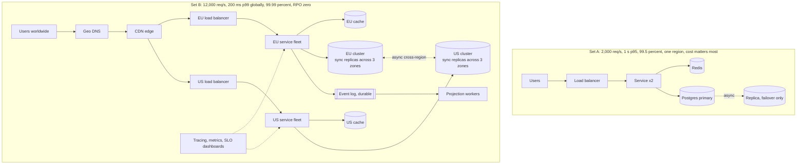
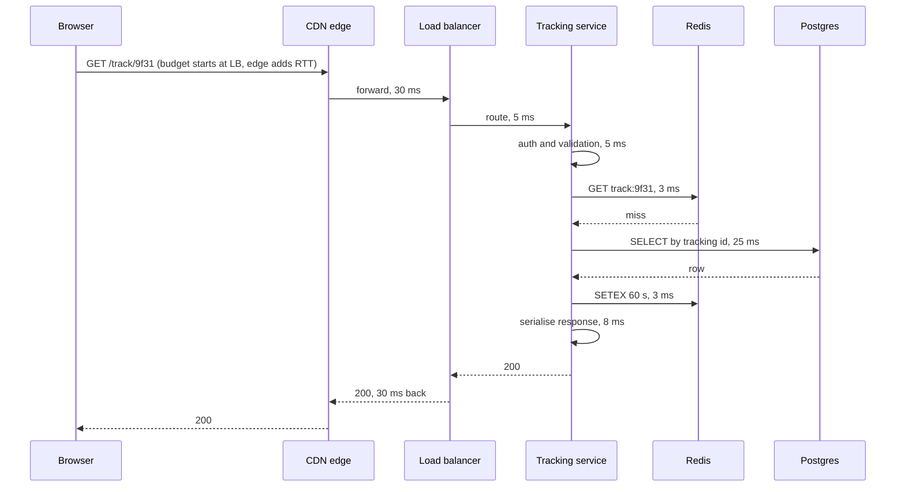

# Chapter 6: Non-Functional Requirements

## 6.1 Problem Statement

A team builds the public order-tracking page for the logistics company from Chapter 1. This time they do the requirements work properly, exactly as Chapter 5 describes.

They interview six actors. They produce thirty-one functional requirements in the anatomy template, each with acceptance criteria. They draw the state machine for a shipment, which finds four transitions nobody had specified. They fill in a permission matrix and discover that carriers should see less than warehouse staff. They write a glossary and nine non-goals. The document is genuinely good, and the review is short because there is nothing to argue about.

They build it. Every acceptance criterion passes. Every functional requirement is satisfied. Launch day, and here is what happens over the next eight weeks.

**Week one.** The page takes 14 seconds during the evening peak. Nobody had said how fast it needed to be, so nobody built for it, and nobody tested for it.

**Week two.** An engineer optimises and gets average response time to 90 ms. Complaints continue at the same rate. It turns out p99 is 9 seconds, and since the page makes several backend calls, a large fraction of page loads contain at least one slow call. The average was never the number that mattered.

**Week four.** An availability zone fails. The page is down for six hours because everything runs in one zone. In the incident review, somebody asks what the acceptable downtime was supposed to be. Nobody knows. It was never stated, so it was never designed for, so the answer turned out to be "unbounded".

**Week five.** A deploy loses 40 minutes of scan events. Warehouse staff rescan manually. Nobody had said whether tracking events could be lost, so the write path acknowledged before the data was durable, which is the fastest option and was chosen for that reason.

**Week six.** Finance asks why the tracking page costs 47,000 dollars a month. The team has no answer, because no cost ceiling was ever given, and several expensive choices were made in the name of a performance target that also did not exist.

**Week seven.** Support cannot diagnose a customer's complaint, because there is no request tracing and logs from six services cannot be correlated. Observability was never requested, so it was never built.

**Week eight, and this is the important one.** Two conflicting expectations surface. The business says the page must never show a stale shipment status, because customers make decisions based on it. The business also says the page must stay up when a region fails. Those two things cannot both be true during a network partition, which Chapter 14 explains formally. Nobody had ranked them, so four engineers had quietly guessed, and they had guessed differently in different services. Some parts of the system fail closed and some serve stale data, and no document says which is correct.

Thirty-one functional requirements, all satisfied. The product still failed. Everything that went wrong was a **non-functional** requirement that nobody wrote down, and the last one was not even a missing number. It was a missing priority order.

## 6.2 Why This Problem Exists

**Nobody notices what is missing when everything present is correct.** A requirements document full of well-written behaviours feels complete. The absence of a latency target does not look like an absence; it looks like a document about features. Functional requirements are things people can picture, so they get written; non-functional requirements are properties of the whole, so nobody owns them by default.

**The words people use are not numbers.** "Fast." "Reliable." "Scalable." "Highly available." Each sounds like a requirement and constrains nothing. Four engineers hearing "fast" will build for 50 ms, 500 ms, 2 seconds, and "faster than the old one", all in good faith. An adjective is a placeholder for a conversation.

**Business people genuinely do not know the numbers, and engineers assume they do.** Ask a product manager for a latency target and you will often get a pause, because it is not their vocabulary. This is where the handoff breaks: the engineer waits for a number that will never come, then picks one silently. Section 6.5.4 exists because the fix is for the engineer to derive a number and get it confirmed, not to wait.

**Non-functional requirements decide the architecture, so their absence is not neutral.** This is the part that makes the stakes uneven. If you do not specify a functional requirement, a behaviour is missing and you add it later, usually cheaply. If you do not specify availability, you get whatever falls out of the design, and changing it means changing the deployment topology, the data layer, and the failure handling. Chapter 5 showed that a few functional requirements are architecture-determining. **Nearly all non-functional requirements are.**

Look at the same functional requirement under four different non-functional targets:

| Functional requirement | NFR set | Resulting design |
|---|---|---|
| A customer can see their shipment status | 100 users, 2 second page, best-effort uptime | One Spring Boot instance, one Postgres, done |
| Same | 10,000 users, 500 ms page, 99.9 percent | Load balancer, three instances, read replica, Redis cache |
| Same | Global users, 200 ms p99, 99.99 percent, no lost events | Multi-region, CDN, regional replicas, synchronous durable writes, automated failover |
| Same | Add: never show stale status | Reads pinned to a leader, which reduces achievable availability. Section 6.5.6 |

One sentence of functionality. Four completely different systems, differing in cost by two orders of magnitude. The features did not choose the architecture. The numbers did.

**And finally, unmeasured requirements are indistinguishable from absent ones.** A document that says 200 ms p99, with no dashboard showing p99 and no load test, will be violated within a month and nobody will know. Section 6.5.9 is blunt about this.

## 6.3 Real World Analogy

Two structures both satisfy the functional requirement "people and vehicles cross the water here".

One is a wooden footbridge over a canal. The other is a suspension bridge carrying eight lanes across a strait. Same function. Nothing else in common: not the materials, not the foundations, not the cost, not the engineering discipline, not the number of people who must approve it.

What made them different was never the function. It was the numbers: load rating, span, wind and seismic loads, design life, tidal clearance, and budget. **The load rating chose the bridge, not the fact that people cross it.**

Three parts of this carry over precisely.

**You cannot add capacity afterwards.** Doubling a footbridge's load rating is not a modification, it is a new bridge. This is why non-functional requirements have to be present before the design is committed, and it is the structural version of Chapter 5's retrofit table.

**Some requirements are imposed on you, not chosen.** Building codes, seismic standards, and accessibility rules apply whether or not anyone in the room asked for them. Software has the same category: data residency, retention law, encryption standards, audit trails, accessibility. Nobody will put them in a brief, and they are not optional.

**Over-engineering is a failure too, not a safe choice.** A suspension bridge over a canal is not admirable caution; it is a waste of money that also takes three years longer to deliver. Engineers instinctively treat higher targets as safer. They are not. Every additional nine, every millisecond shaved, is paid for in money, complexity, and delivery time. Section 6.5.7 puts rough prices on it.

## 6.4 Simple Explanation

A functional requirement says what the system does. A **non-functional requirement says how well it must do it**, in terms you can measure.

The rule that makes them usable is short:

> A non-functional requirement is not a requirement until it contains a number and a way to check it.

"The page must be fast" is a topic. "95 percent of tracking page requests complete within 400 milliseconds, measured at the load balancer, at 12,000 requests per second" is a requirement. Somebody can build to it, test it, and tell you whether you met it.

The main categories, with the question each answers. This is a map, not a treatment; each has its own chapter later.

| Category | Question | Typical metric | Chapter |
|---|---|---|---|
| Latency | How fast is one request? | p50, p95, p99 in milliseconds | 7 |
| Throughput | How many at once? | Requests per second, messages per second | 8 |
| Scalability | What happens at 10x? | Cost and latency as load grows | 9 |
| Availability | How much downtime is tolerable? | Percentage per month, or minutes | 10 |
| Reliability | How often does it produce wrong results? | Error rate, successful operations percentage | 11 |
| Durability | Can committed data be lost? | Recovery point objective, nines of durability | 12 |
| Fault tolerance | What can fail without users noticing? | Survivable failure domains | 13 |
| Consistency | Must every reader see the latest write? | Strong, bounded staleness, eventual | 14 to 19 |
| Security | Who can do what, and what is protected? | Controls, standards met, time to patch | 71 to 77 |
| Observability | Can you tell what is happening? | Coverage of metrics, logs, traces | 67 to 70 |
| Cost | What may it cost to run? | Currency per month, or per request | 86 to 96 |
| Operability | How hard is it to run and change? | Deploy frequency, time to recover, toil hours |  |
| Compliance | What does the law require? | Residency, retention, auditability |  |
| Compatibility | What must it work with? | Browsers, clients, protocol versions |  |
| Accessibility | Can everyone use it? | WCAG level |  |

The last five are the ones that get forgotten, and cost and operability are forgotten most often. A design that meets every performance target and needs four engineers permanently on call has failed at something, even though no document says so.

## 6.5 Technical Deep Dive

### 6.5.1 The anatomy of a usable NFR

Six parts. Missing any of them leaves room for the disagreement you are trying to prevent.

```
METRIC:       what exactly is measured
TARGET:       the number, with a percentile if it is a distribution
CONDITION:    the load and circumstances under which it must hold
MEASURED AT:  where the measurement is taken
WINDOW:       over what period it is evaluated
CONSEQUENCE:  what happens if it is missed
```

Bad and good, side by side:

| Written as | Why it fails | Rewritten |
|---|---|---|
| "The page must be fast" | No metric, no number, no condition | "p95 of `GET /track/{id}` under 400 ms, measured at the load balancer, at 12,000 req/s sustained, evaluated over rolling 7 days" |
| "The system must be highly available" | "Highly" is not a number, and availability of what is unstated | "The tracking endpoint returns a successful response for 99.9 percent of requests per calendar month, excluding client errors" |
| "No data loss" | Absolute claims are unbuildable and unpriceable | "A scan event acknowledged to the client survives the loss of any single availability zone. Recovery point objective is zero for acknowledged events" |
| "Should scale" | To what, at what cost | "Sustains 4x current peak with no code changes, by adding instances, at no worse than linear cost" |
| "Must be secure" | Not measurable, not scoped | "All data encrypted in transit with TLS 1.2 or higher and at rest; critical CVEs patched within 7 days; access to customer data requires MFA and is audited" |

Two of those six parts get skipped even by experienced teams, and both matter.

**Measured at.** Latency at the database, at the service, at the load balancer, and in the user's browser are four different numbers, and they can differ by an order of magnitude. Server-side p99 of 80 ms with a browser p99 of 4 seconds is a completely normal and very confusing situation, usually caused by client-side rendering, connection setup, or the user's network. Say where you measure, and prefer the point closest to the user for user-facing promises.

**Condition.** A latency target with no load attached is meaningless, because everything is fast at 10 requests per second. "400 ms p95" and "400 ms p95 at 12,000 requests per second with the cache cold" are different engineering problems.

### 6.5.2 Averages lie, and here is the arithmetic

Chapter 1 introduced percentiles briefly. This is where they become a specification discipline, because the single most common NFR mistake is specifying a mean.

| Percentile | What it tells you | Use it for |
|---|---|---|
| p50 (median) | The typical experience | Sanity check, capacity planning |
| p90 | Where the slow tail starts | Early warning of degradation |
| p95 | A common contractual target | User-facing promises |
| p99 | What your heaviest and unluckiest users get | The number that generates complaints |
| p999 | Rare pathological cases | Very large systems, and internal dependencies with high fan-out |
| Mean | Almost nothing useful | Avoid in requirements entirely |

The mean is dangerous because a single distribution can have a good mean and a terrible tail, and users experience the tail. Worse, means hide improvement and regression alike: a change that halves p99 for 1 percent of requests barely moves the average.

The arithmetic that makes this concrete, and worth being able to do in an interview. Suppose one backend call has a p99 of 1 second, and rendering a page requires 20 independent calls. The probability that a page load contains no slow call is:

```
0.99 ^ 20 = 0.818

So 18.2 percent of page loads contain at least one 1-second call.
```

A "1 percent slow" dependency produces an "18 percent slow" page. This is why fan-out multiplies tail latency into user-visible slowness, and it has two design consequences: reduce the number of sequential calls on the request path, and specify tighter percentiles for services with many callers than for the page itself. A service called 20 times per page needs p999, not p99.

The corollary for Section 6.1's week two: the engineer who got the average to 90 ms did useful work on the wrong number. p99 was where the complaints lived, and no amount of average improvement would have silenced them. Chapter 7 goes deeper on latency, including where tail latency actually comes from.

### 6.5.3 Where the numbers come from when nobody gives you one

This is the practical heart of the chapter. You will usually ask for a target and get a shrug. Do not wait, and do not pick silently. Derive a number, state your reasoning, and get it confirmed. Five sources, in rough order of strength.

**1. Business consequence.** The strongest source, because it converts an engineering target into money. Ask what breaks and what it costs.

```
Question:  what happens if the tracking page is down for an hour on a Tuesday evening?
Answer:    support calls spike, roughly 400 extra calls at about 6 dollars each,
           plus some order cancellations.
Derived:   an hour of downtime costs on the order of 3,000 to 5,000 dollars.
           A month of 99.9 percent allows 43 minutes, so expected cost of
           downtime at that target is a few thousand dollars a month.
           99.99 percent would cost far more than that to achieve.
Proposal:  99.9 percent monthly for the tracking endpoint. Confirm?
```

That paragraph is what a senior engineer produces instead of a shrug, and it usually gets confirmed immediately because the reasoning is checkable.

**2. Human perception thresholds.** Stable, well-established, and useful when there is no revenue signal.

| Response time | How it feels | Use for |
|---|---|---|
| Under 100 ms | Instant, direct manipulation | Typing, dragging, toggling |
| Around 1 second | Noticeable, but flow is unbroken | Page navigation, search |
| Around 10 seconds | Attention lost, users switch tasks | Absolute ceiling for anything interactive |

**3. Current measured baseline plus growth.** If the system exists, measure it. Today's p99, today's peak requests per second, today's storage growth per month. Then apply the growth factor the business is planning for. This is the least arguable source available, because it is observation rather than opinion, and Part 2 turns it into capacity numbers.

**4. User and market expectation.** What do comparable products do? If every competitor's tracking page loads in under a second, 3 seconds is a defect regardless of what any document says.

**5. Cost ceiling, worked backwards.** Sometimes the binding constraint is money, and this is legitimate. If the feature can justify 5,000 dollars a month, you cannot have multi-region active-active, and that fact should be written down as a requirement rather than discovered in week six.

A published set of experiments is worth knowing about here, because they are the canonical evidence that latency has revenue consequences. Amazon reported that additional page latency measurably reduced sales, and Google reported that deliberately slowing search results reduced searches per user, with effects that persisted after the slowdown ended. The specific figures get quoted loosely and the details vary by study, so use them as evidence that the effect is real and material rather than as constants for your own arithmetic. Your own conversion data, if you have it, beats anybody's published number.

### 6.5.4 SLI, SLO, SLA, and error budgets

Three terms that get used interchangeably and mean quite different things. Getting them straight is what turns an NFR from a sentence into something with teeth.

| Term | What it is | Example |
|---|---|---|
| SLI, service level indicator | The measurement itself | Proportion of `GET /track/{id}` requests returning 2xx within 400 ms |
| SLO, service level objective | Your internal target for that indicator | 99.9 percent over a rolling 28 days |
| SLA, service level agreement | A contractual promise with a penalty | 99.5 percent monthly, or the customer gets a service credit |

Two rules that follow, and both are widely misunderstood.

**The SLA is always weaker than the SLO.** You promise customers less than you target internally, so that missing your internal target is an engineering signal rather than a legal event. A team whose SLO equals its SLA has no margin and will eventually pay out for a normal bad week.

**Never target 100 percent.** Not out of laziness. A 100 percent target forbids all deployment, all change, and all experimentation, and it is unachievable anyway because your dependencies are not perfect and neither is the internet. Choosing a target below 100 is choosing how much risk you spend on shipping features.

That leads to the mechanism that makes SLOs operational, the **error budget**. If your SLO is 99.9 percent, then 0.1 percent of requests are allowed to fail. That allowance is a budget you get to spend.

| SLO | Allowed downtime per 30 days | Per year |
|---|---|---|
| 99 percent | 7 hours 12 minutes | 3.65 days |
| 99.9 percent | 43 minutes 12 seconds | 8 hours 46 minutes |
| 99.95 percent | 21 minutes 36 seconds | 4 hours 23 minutes |
| 99.99 percent | 4 minutes 19 seconds | 52 minutes 36 seconds |
| 99.999 percent | 26 seconds | 5 minutes 15 seconds |

How it works in practice:

```
SLO:                  99.9 percent over 28 days
Budget:               about 40 minutes of unavailability
Consumed so far:      31 minutes (one bad deploy, one dependency outage)
Remaining:            9 minutes

Policy:  above 50 percent budget remaining, ship freely.
         below 25 percent, deploys need review and risky changes wait.
         budget exhausted, feature work stops until reliability work restores it.
```

The elegance of this is that it ends an argument that otherwise never ends. Product wants to ship, operations wants stability, and both are right. The error budget converts that standoff into arithmetic: while budget remains, ship; when it is gone, fix things. Nobody has to win a values debate. Chapter 10 covers the availability mathematics, including why the nines of a system are worse than the nines of its parts.

Look back at the table and notice the jump between rows. Going from 99.9 to 99.99 percent means shrinking your allowance from 43 minutes to 4 minutes a month. That is not 10 percent more engineering, and Section 6.5.6 prices it.

### 6.5.5 NFRs conflict, so rank them

Section 6.1's week eight was not a missing number. Both requirements were stated. They were **mutually unsatisfiable**, and nobody had said which wins.

This is normal. Non-functional requirements pull against each other by nature, and a design is largely a set of choices about which to sacrifice.

| Tension | What you give up to get the other |
|---|---|
| Consistency vs availability | During a partition you can refuse requests or serve stale data. You cannot do both. Chapter 14 |
| Latency vs consistency | Reading a nearby replica is fast and possibly stale. Reading the leader is current and further away. Chapter 15 |
| Latency vs durability | Acknowledging after the write is replicated and flushed is slower and safer. Chapter 12 |
| Throughput vs latency | Batching raises throughput and adds waiting time per item |
| Availability vs cost | Each additional nine costs roughly an order of magnitude more |
| Security vs latency | Encryption, token validation, and audit writes all add work to the path |
| Flexibility vs performance | Generic query interfaces are slower than purpose-built access paths |
| Operability vs feature velocity | Change freezes and review gates protect stability and slow delivery |

Because these conflict, **a list of non-functional requirements is not enough. You need an order.** The question that produces it is uncomfortable and effective:

> At 3 AM, with a partial failure in progress, which of these may we sacrifice, and in what order?

For the tracking page, a defensible answer:

```
1. Durability of acknowledged scan events. Never sacrifice. If we cannot
   record a scan durably, reject it and let the scanner retry.
2. Availability of reads. Serve something. A slightly stale status is far
   better than an error page for a customer checking their delivery.
3. Freshness. Acceptable to be up to 60 seconds stale, and we will show the
   timestamp so the staleness is visible rather than hidden.
4. Latency. During a failure, 2 seconds is acceptable instead of 400 ms.
5. Cost. Overspend during an incident without asking.
```

That ordering is a design document in five lines. It says reads go to replicas, that the UI must display the data's age, that write acknowledgement waits for durable replication, and that failover favours serving traffic over serving perfect traffic. Every engineer on the team now guesses the same way, which is exactly what was missing in Section 6.1.

Note also that the ranking exposed a functional requirement: showing the timestamp of the status. Rankings do that regularly, because "acceptable to be stale" immediately raises "and how does the user know".

### 6.5.6 The mapping from numbers to architecture

The payoff. Each target forces specific structure, and this table is the reason non-functional requirements must exist before the design.

| Requirement | What it forces | Rough cost |
|---|---|---|
| p99 under 100 ms, users on one continent | Caching, indexed access paths, few sequential hops | Low |
| p99 under 100 ms, users worldwide | Edge presence and regional replicas, because physics sets a floor of roughly 200 ms intercontinental round trip. Chapter 32 | High |
| 1,000 req/s | One decent instance, or two for redundancy | Low |
| 100,000 req/s | Horizontal scaling, stateless services, partitioned data, connection management. Chapters 21, 23, 42 | Medium to high |
| 99.9 percent availability | Multi-instance, multi-zone, health checks, automated restart, no single point of failure | Medium |
| 99.99 percent availability | Everything above plus tested automated failover, multi-zone data layer, dependency isolation, careful deploys. Chapter 48 | High |
| 99.999 percent availability | Multi-region active-active, constant failure rehearsal, and an organisation built around it | Very high |
| Zero recovery point objective for acknowledged writes | Synchronous replication and acknowledgement only after durable commit. Costs write latency. Chapter 12 | Medium, paid per write |
| Strong consistency on reads | Reads from the leader, or a consensus protocol. Reduces achievable availability and adds latency. Chapter 19 | Medium to high |
| Eventual consistency acceptable | Read replicas, caching, asynchronous fan-out. Cheapest scaling available. Chapter 18 | Low, plus application complexity |
| Full audit trail | Append-only storage, retention policy, and it cannot be added retroactively. Chapter 5's retrofit table | Low if designed in |
| Data residency by region | Regional isolation of storage and processing, routing by user, and duplicated infrastructure |  High |
| Diagnose any user's request end to end | Trace context propagated through every hop, plus retention and sampling. Chapter 70 | Low if designed in, painful later |
| Cost under X per month | Constrains everything above. Often the requirement that decides the design |  |

Read the middle column as a list of things you cannot bolt on. Notice too that two rows actively fight: strong consistency reduces achievable availability, so a design that claims both 99.999 percent and strictly fresh reads is claiming something the physics of distributed systems does not permit. Chapters 14 and 15 make that precise.

The cost column deserves one honest note. Each additional nine tends to cost around an order of magnitude more, because you are removing progressively rarer failure modes: single process, then single machine, then single zone, then single region, then correlated failures across regions. Most systems should target 99.9 percent and spend the saved effort elsewhere. Very few genuinely need more, and the ones that do usually know why.

### 6.5.7 The spec sheet

A template that fits on one page and belongs in every design document, filled in here for the tracking page.

```
SERVICE: Order tracking, public endpoint

LOAD
  Average:              3,000 req/s
  Peak:                 12,000 req/s (evenings, 4x average)
  Growth assumption:    2x within 12 months
  Read:write ratio:     50:1

LATENCY                 measured at the load balancer
  p50:                  under 120 ms
  p95:                  under 400 ms
  p99:                  under 900 ms
  Ceiling:              hard timeout at 3 s, return cached or partial data

AVAILABILITY
  SLI:                  proportion of 2xx responses, excluding 4xx client errors
  SLO:                  99.9 percent over rolling 28 days
  Error budget policy:  under 25 percent remaining, risky deploys pause
  SLA to customers:     none published

DURABILITY
  Scan events:          RPO zero once acknowledged. Survive loss of one zone
  Derived views:        rebuildable from events, no durability requirement

CONSISTENCY
  Tracking status:      eventual, up to 60 s stale, and the age is displayed
  Scan writes:          read-your-writes for the scanning device

FAULT TOLERANCE
  Survive:              loss of any one instance, any one zone, the cache
                        entirely, the search index entirely
  Degrade:              cache down means slower but working
                        search down means lookup by tracking id only

SECURITY
  Transport:            TLS 1.2 minimum
  Data:                 no PII beyond address in payload, encrypted at rest
  Access:               tracking id is unguessable; rate limited per IP

OBSERVABILITY
  Metrics:              rate, errors, duration per endpoint, p50/p95/p99
  Tracing:              trace id on every request, 1 percent sampled, 100 percent
                        of errors
  Logging:              structured, 30 day retention, no PII in logs

COST
  Ceiling:              8,000 dollars per month at current peak
  Alert:                at 80 percent of ceiling

OPERABILITY
  Deploys:              zero downtime, rollback within 5 minutes
  On-call:              no more than 2 pages per week expected

COMPLIANCE
  Retention:            scan events 7 years, access logs 1 year
  Residency:            EU customer data stays in the EU

RANKING (what we sacrifice first, at 3 AM)
  Never:  durability of acknowledged events
  Then:   cost, then latency, then freshness, then read availability last
```

Two properties make this worth the page it takes. Every line is checkable, so a load test or a dashboard can confirm or refute it. And the ranking at the bottom means the next engineer facing an ambiguous failure decision makes the same call the rest of the team would.

### 6.5.8 An unmeasured requirement is a wish

The final discipline, and the one that separates teams whose documents describe their systems from teams whose documents describe their intentions.

For each non-functional requirement, three things must exist before you can claim it:

1. **A live measurement.** A dashboard showing the actual SLI, with the target drawn on it. If p99 is a requirement, p99 must be on a graph somebody looks at.
2. **A test that exercises it before users do.** A load test at the specified condition, a failure injection for the fault tolerance claims, a cost model checked monthly. Chapter 1's exercise was this in miniature.
3. **An alert on the symptom.** Fire when the SLI degrades, not when CPU is at 70 percent. Chapter 67 covers this properly.

Where you measure changes the number, so decide deliberately:

| Measurement point | Sees | Misses |
|---|---|---|
| Inside the service | Its own handler time | Queueing, load balancer, network, client work |
| At the load balancer | Server-side reality including queueing | Client network and rendering |
| Synthetic probe | Availability and latency from fixed locations, continuously | Real user diversity, real device performance |
| Real user monitoring | What users actually experience | Nothing, but it is noisy and needs client instrumentation |

For a user-facing promise, real user monitoring is the truth and the load balancer is the practical proxy. Service-internal timing is for debugging, not for promises, and quoting it to stakeholders is how you end up with Section 6.1's week two.

## 6.6 Architecture Diagram

The clearest illustration of this chapter is one functional design under two different non-functional targets. Identical features. Nothing else in common.



ASCII version:

```
SET A                                 SET B
 Users                                 Users worldwide
   |                                        |
 Load balancer                          Geo DNS -> CDN edge
   |                                     /              \
 Service x2                      EU load balancer   US load balancer
   |     \                             |                  |
 Redis   Postgres primary        EU service fleet   US service fleet
             |                        |    \            |    \
        replica (failover)        EU cache  \       US cache  \
                                             \                 \
                                    EU cluster (sync, 3 zones)  US cluster (sync, 3 zones)
                                             \___ async cross-region ___/
                                    durable event log -> projection workers
                                    tracing / metrics / SLO dashboards
```

Read the two together and note what each number bought.

- **Geo DNS and CDN** exist only because of "200 ms p99 globally". Delete that requirement and both disappear, since intercontinental round trips make the target otherwise impossible.
- **Synchronous replicas across three zones** exist because of RPO zero and 99.99 percent. They cost write latency on every single write, which is the durability-versus-latency trade from Section 6.5.5 showing up as infrastructure.
- **Two regions** exist because 99.99 percent is hard to reach inside one region once you account for regional dependencies and deploys.
- **The cross-region link is asynchronous**, which is a consistency concession forced by physics. This is precisely the conflict of Section 6.1's week eight, resolved here by the ranking rather than by four engineers guessing.
- **Set A is not the worse design.** For its requirements, it is the better one: two components instead of twelve, one on-call rotation, and perhaps 3 percent of the cost. Building Set B for Set A's requirements is Chapter 1's most common mistake, and Section 6.3's suspension bridge over a canal.

## 6.7 Request Flow

The flow worth practising for this chapter is a **latency budget**: take the end-to-end target and allocate it across the path, so that every component has a number rather than an aspiration.

Target: p95 of 400 ms, measured at the load balancer, at peak.



The budget as a table, which is the artifact to actually produce:

| Hop | Budget | Cumulative | Notes |
|---|---|---|---|
| CDN edge to origin, inbound | 30 ms | 30 | Physics, depends on region placement |
| Load balancer routing | 5 ms | 35 | Includes TLS termination on a reused connection |
| Auth and validation | 5 ms | 40 | Token verification, no remote call |
| Cache lookup | 3 ms | 43 | Same-zone Redis |
| Database query on miss | 25 ms | 68 | Requires an index on tracking id |
| Cache write | 3 ms | 71 | Fire and forget is an option |
| Serialisation | 8 ms | 79 | Payload around 4 KB |
| Response to edge | 30 ms | 109 | Symmetric with inbound |
| **Headroom** | **291 ms** | **400** | For garbage collection pauses, queueing at peak, retries, and the tail |

Five things this exercise gives you that a target alone does not:

1. **Every component gets its own number**, so its owner can test against something concrete.
2. **The headroom is explicit.** Roughly 70 percent of the budget is unallocated, which sounds generous until you remember that p95 must hold during garbage collection pauses, at peak queueing, and on a retry. A budget with no headroom is a target you will miss.
3. **The cache miss path is what you budget for**, not the hit path. Budgeting the happy path is how teams end up with a target that only holds when the cache is warm, which is not when it matters.
4. **Impossible targets become obvious early.** If the network round trips alone consume 60 ms and the target were 100 ms p95 with a cache miss, the arithmetic says no before anyone writes code, and the answer is regional presence or a different requirement.
5. **It tells you where optimisation is worthless.** Halving serialisation time saves 4 ms out of 400. The database query and the two network legs are where the budget actually lives.

Do this for every user-facing target. It takes fifteen minutes and it turns a number into a design.

## 6.8 Internal Components

The artifacts that make non-functional requirements real, with the removal test.

| Artifact | Purpose | Remove it and |
|---|---|---|
| NFR spec sheet | One page of checkable targets | Engineers pick numbers silently and inconsistently |
| Ranking of NFRs | Decides ambiguous failure cases in advance | Four engineers guess differently, which is Section 6.1's week eight |
| SLI definitions | Says exactly what is measured, including exclusions | Endless argument over whether an incident counted |
| SLO dashboard | Shows the SLI against the target, continuously | Nobody knows whether you are meeting your own requirements |
| Error budget policy | Converts reliability arguments into arithmetic | Product and operations argue about values, permanently |
| Latency budget per endpoint | Allocates the target across hops | Optimisation effort lands on components that do not matter |
| Load test at the specified condition | Verifies targets before users do | Section 6.1's week one, discovered by customers |
| Failure injection tests | Verifies the fault tolerance claims | "Survives a zone failure" is an untested belief |
| Cost model and alert | Makes the cost ceiling enforceable | Section 6.1's week six |
| Runbook per SLO breach | Turns an alert into an action | Alerts fire, nobody knows what to do, alerts get muted |

The two rows people skip are the ranking and the failure injection tests, and they are the two that pay out during an incident rather than during a review. A claim like "survives the loss of any one zone" that has never been tested is not a requirement, it is a hope with a number attached.

## 6.9 Production Example

**Google's error budget practice is the reference implementation of Section 6.5.4.** Their site reliability engineering work is built on the observation that a service should not aim for perfect reliability, because the cost rises steeply and users cannot perceive the difference beyond a point, particularly when their own network and devices contribute more unreliability than your service does. So a target below 100 percent is set deliberately, the gap becomes an error budget, and that budget is spent on shipping changes.

What makes it more than terminology is the policy attached. When the budget is healthy, release velocity is high. When it is exhausted, changes slow or stop until reliability is restored. The structural achievement is that the two teams who would otherwise be permanently in conflict are now looking at the same number, and neither has to persuade the other of anything. If you take one practice from this chapter into your work, take this one.

**Netflix ranked availability above consistency, explicitly and publicly.** Their engineering writing consistently describes preferring to serve a degraded experience over serving an error: fall back to a cached or generic response, drop personalisation, show something slightly stale, rather than fail the request. That is not an accident of implementation, it is Section 6.5.5's ranking made an architectural principle, and it explains a great deal about their design choices, from the resilience libraries of Chapter 60 to their caching posture.

The instructive part is that a bank would rank the opposite way for account balances, and both are correct. There is no universally right order, which is exactly why it must be written down for your system.

**The latency experiments at Amazon and Google are where the numbers came from for a generation of front-end work.** Both companies reported controlled experiments in which added latency measurably reduced usage and revenue, with effects large enough to justify significant engineering investment and, in Google's case, persistence after the added delay was removed. Treat the specific percentages as illustrative rather than as constants, since the studies are old and context-specific. The durable lesson is the method: they turned "fast matters" into a measured relationship between milliseconds and money, which is precisely Section 6.5.3's first source, and it is available to any team with an experimentation platform and the willingness to slow their own product down on purpose.

## 6.10 Advantages

- **The architecture becomes derivable.** Given the numbers, most structural choices follow from Section 6.5.6 rather than from preference or fashion.
- **Over-engineering becomes visible.** With targets written down, a multi-region proposal for a 99.5 percent internal tool is obviously wrong, and it is easy to say so without it being a matter of taste.
- **Reliability arguments end.** The error budget replaces a values debate with arithmetic that both sides accept in advance.
- **Ambiguous incidents get decided correctly.** The ranking means the engineer at 3 AM makes the call the whole team would have made.
- **Optimisation effort lands where it matters.** A latency budget tells you which 4 ms are irrelevant.
- **Cost stops being a surprise.** A ceiling with an alert converts a quarterly shock into a design constraint.
- **You can prove you met the requirements,** because each one has a measurement and a test.
- **Interviews improve sharply.** Numbers stated up front let you justify every later decision by pointing at one, which is exactly what interviewers are listening for.

## 6.11 Limitations

- **Early numbers are guesses.** Pre-launch traffic estimates are frequently wrong by an order of magnitude. Design for the order of magnitude and revisit with real data rather than pretending to precision.
- **Some qualities resist measurement.** Maintainability, developer experience, and elegance matter and have no clean metric. Proxies such as change lead time and deploy frequency help and do not capture everything.
- **Targets can be gamed.** Excluding enough error classes from an SLI produces a green dashboard over an unhappy user base. This is why real user monitoring matters more than the convenient measurement point.
- **Ranking is political.** Asking which requirement may be sacrificed forces stakeholders to admit priorities they would prefer to leave ambiguous, and that conversation can be uncomfortable and slow.
- **Numbers age.** Traffic doubles, users get less patient, competitors get faster, and a target set two years ago may be irrelevant now.
- **A perfect NFR sheet does not build the system.** Chapters 5 and 6 together define the problem well; the design and the engineering are still ahead of you.
- **Percentiles do not aggregate.** You cannot average p99s across services or time windows to get a meaningful p99, which trips up a lot of reporting. Chapter 69 covers how to handle this.

## 6.12 Trade-offs

| Dial | One way | The other way |
|---|---|---|
| Target strictness | Tight: better experience, sharply higher cost and complexity | Loose: cheap and simple, users may notice |
| Number of nines | More: fewer incidents, an order of magnitude more effort per nine | Fewer: faster delivery, more visible downtime |
| Consistency strength | Strong: correct reads, higher latency, lower achievable availability | Eventual: fast and available, application must handle staleness |
| Durability guarantee | Sync replication: no acknowledged loss, slower writes | Async: fast writes, a window of loss on failure |
| Measurement point | Real user monitoring: honest, noisy, needs client work | Server-side: clean and cheap, and it flatters you |
| Precision of targets | Precise: verifiable, may over-constrain a young product | Rough: flexible, and disagreements resurface later |
| Cost ceiling firmness | Firm: forces good engineering choices, may block a real need | Soft: unblocks work, bills grow without a decision |

The removal test on the requirements themselves.

**Remove the latency target.** You gain nothing at design time and lose the basis for every caching, indexing, and placement decision. You also lose the ability to say a change made things worse, since there is no line to cross. Section 6.1's week one.

**Remove the availability target.** You gain nothing, and you get whatever availability the design happens to produce, which is usually single-zone. The cost is discovered during the first zone failure, in public.

**Remove the consistency requirement.** You gain flexibility, briefly, and then each engineer chooses a different answer. Every replica read becomes a judgement call made by whoever wrote that line.

**Remove the ranking but keep all the targets.** You gain a shorter document and lose the ability to handle any failure where two targets conflict. This is the cheapest item on the list and the one whose absence hurts most at 3 AM.

**Remove the cost ceiling.** You gain freedom and lose the constraint that most often produces genuinely good engineering. Unlimited budget is not a gift; it removes the pressure that finds the simple solution.

## 6.13 Common Mistakes

**Adjectives instead of numbers.** Fast, reliable, scalable, robust, highly available. Every one is a conversation that has not happened.

**Specifying the mean.** The average is the one statistic users never experience. Specify p95 and p99, and specify p999 for services with high fan-out.

**No load attached to a latency target.** Everything is fast at low traffic. A latency requirement without a concurrent throughput condition is untestable.

**Measuring where it flatters you.** Quoting service-internal handler time as the user's experience, while the browser sees ten times worse.

**Targeting 100 percent.** Impossible, unaffordable, and it forbids change. Choose a number below 100 and spend the difference deliberately.

**Requirements with no measurement or test.** The most common failure of all. If p99 is not on a dashboard and there is no load test at the stated condition, the requirement does not exist.

**Listing conflicting requirements without ranking them.** Strong consistency plus 99.999 percent availability during partitions is not a specification, it is a contradiction. Section 6.1's week eight.

**Forgetting cost, operability, and compliance.** These are non-functional requirements with the same architectural force as latency, and they are the three most often absent from design documents.

**Inheriting numbers from a blog post.** A target that made sense for a company with a thousand engineers and a global customer base is not automatically yours. Derive your own from your own consequences.

**Setting targets once and never revisiting.** Traffic grows, expectations shift, and last year's numbers quietly become either irrelevant or unachievable.

**Treating higher targets as the safe choice.** Every extra nine costs money, complexity, delivery time, and on-call burden. Over-engineering is a failure mode with a nicer reputation than under-engineering, and it is just as real.

**Confusing the SLO with the SLA.** Promising customers exactly what you target internally leaves no margin for a normal bad week.

## 6.14 Interview Questions

**Q: What is a non-functional requirement?**
A measurable property of how well the system behaves rather than what it does: latency, throughput, availability, durability, consistency, security, cost, operability. It is not a requirement until it has a metric, a number, a load condition, a measurement point, and a way to verify it.

**Q: Nobody gives you a latency target. What do you do?**
Derive one and get it confirmed. Use the business consequence if there is one, human perception thresholds otherwise, the current measured baseline if the system exists, and competitor behaviour as a sanity check. State it as an assumption out loud, which in an interview is exactly what the interviewer wants to hear.

**Q: Why not use averages?**
Because users experience the tail, and a good mean can hide a terrible p99. With fan-out it compounds: a dependency with a p99 of one second, called 20 times per page, makes roughly 18 percent of page loads slow.

**Q: Explain SLI, SLO, SLA and error budget.**
The SLI is the measurement, the SLO is your internal target for it, the SLA is a contractual promise with a penalty and should be looser than the SLO. The error budget is the allowed shortfall from the SLO, spent on shipping change, and when it runs out you stop taking risk until reliability is restored.

**Q: What does 99.99 percent availability actually mean, and what does it cost?**
About 4 minutes and 19 seconds of unavailability per 30 days. It requires multi-zone deployment, tested automated failover, dependency isolation, and careful deploys, and it typically costs an order of magnitude more than 99.9 percent, which allows 43 minutes.

**Q: Give two non-functional requirements that cannot both be satisfied.**
Strong consistency and full availability during a network partition. CAP says you choose one, and Chapter 14 covers it. Also zero recovery point objective and minimum write latency, since acknowledging before durable replication is faster and less safe.

**Q: How do you resolve conflicting non-functional requirements?**
Rank them. Ask which may be sacrificed first during a partial failure, and in what order. The ranking becomes a design document, because it decides read routing, failover behaviour, and what the user sees when things degrade.

**Q: How do you turn a 400 ms target into something the team can build against?**
Decompose it into a latency budget across every hop: network legs, load balancer, auth, cache, database on a miss, serialisation, and keep meaningful headroom for garbage collection, queueing at peak, and retries. Budget the cache miss path, not the hit path.

**Q: Which non-functional requirements do people forget?**
Cost, operability, observability, and compliance. Cost decides the design more often than anyone admits, and observability cannot be usefully added after an incident has already happened.

**Q: In a system design interview, when do you state these?**
Right after clarifying scope and before drawing anything, usually in the first five to eight minutes. Then justify every subsequent decision by pointing at one of the numbers. Part 4, Chapters 123 to 134, drills the full sequence.

## 6.15 Production Best Practices

1. **Write the spec sheet.** One page, in the design document, with load, latency percentiles, availability, durability, consistency, fault tolerance, security, observability, cost, operability, and compliance.
2. **Never accept an adjective.** Convert every "fast", "reliable", and "scalable" into a metric with a number and a condition.
3. **Specify percentiles, never means,** and go to p999 for services with high fan-out.
4. **Attach a load condition to every latency target.**
5. **Say where you measure,** and prefer the point closest to the user for anything you promise externally.
6. **Derive numbers from consequences** when nobody supplies them, then get the derivation confirmed rather than the number guessed.
7. **Rank the requirements,** using the question of what may be sacrificed first during a partial failure. Put the ranking in the document.
8. **Set an SLO below 100 percent and define the error budget policy** before you need it.
9. **Keep the SLA looser than the SLO.**
10. **Build the latency budget per user-facing endpoint,** and keep real headroom in it.
11. **Test every claim before users do:** load test at the stated condition, inject the failures you claim to survive, and check the cost model monthly.
12. **Put the SLI on a dashboard with the target drawn on it,** and alert on the symptom rather than on resource utilisation.
13. **Revisit the numbers every quarter,** or whenever traffic changes by a factor of two.
14. **Treat cost as a first-class requirement,** with a ceiling and an alert at 80 percent of it.

## 6.16 Summary

Non-functional requirements state how well the system must behave: how fast, at what load, how often it may be unavailable, whether committed data can be lost, how fresh reads must be, what it may cost, how it is secured, and how it is operated. They are not requirements until they carry a metric, a number, a load condition, a measurement point, and a way to verify them.

They matter more than features for one specific reason: features can usually be added later, and these usually cannot. The same single functional requirement, under four different sets of numbers, produces four systems that differ by two orders of magnitude in cost and share almost no structure. The load rating chooses the bridge. Availability targets choose your deployment topology, durability targets choose your write path, consistency targets choose where reads go, and the cost ceiling quietly overrules several of the others.

Three habits carry most of the value. Derive numbers from consequences rather than waiting for someone to supply them, and get the derivation confirmed. Rank the requirements, because they conflict by nature and an unranked list leaves every engineer to guess independently during a failure. And measure everything you claim, because a target with no dashboard, no load test, and no failure injection behind it is indistinguishable from a target nobody ever wrote.

The failure mode to guard against is not only under-specifying. It is assuming that stricter is safer. Each additional nine costs roughly ten times more than the last, and a suspension bridge over a canal is not caution, it is waste with good manners.

## 6.17 Quick Revision Notes

- Functional requirements say what. Non-functional say how well, with numbers.
- Six parts of a usable NFR: metric, target with percentile, load condition, measurement point, evaluation window, consequence of missing it.
- Nearly all non-functional requirements are architecture-determining. The same feature under different numbers produces entirely different systems.
- Never specify the mean. Use p95 and p99, and p999 where fan-out is high.
- Fan-out math: p99 of 1 s, 20 calls per page, means about 18 percent of pages contain a slow call. `1 - 0.99^20`.
- Five sources for numbers: business consequence, human perception thresholds, measured baseline plus growth, market expectation, cost ceiling worked backwards.
- Perception thresholds: 100 ms feels instant, 1 s keeps flow, 10 s loses attention.
- SLI is the measurement, SLO is the internal target, SLA is the contractual promise and must be looser than the SLO.
- Error budget is the allowed shortfall, spent on shipping. Budget healthy means ship, budget exhausted means fix.
- Availability per 30 days: 99 percent is 7h12m, 99.9 percent is 43m, 99.99 percent is 4m19s, 99.999 percent is 26s.
- Never target 100 percent. It forbids change and is unachievable.
- Each additional nine costs roughly an order of magnitude more.
- NFRs conflict, so rank them. The question is what may be sacrificed first during a partial failure.
- Strong consistency reduces achievable availability. Zero RPO costs write latency. Global low latency requires edge presence, because physics.
- Build a latency budget per endpoint, allocate every hop, keep real headroom, and budget the cache miss path.
- Where you measure changes the number. Real user monitoring is the truth, load balancer is the practical proxy, service-internal timing is for debugging only.
- Forgotten categories: cost, operability, observability, compliance, accessibility.
- An unmeasured requirement is a wish. Dashboard, test, alert on the symptom.

## 6.18 Mini Quiz

1. Rewrite as a usable requirement: "the search feature should be fast and always available".
2. A dependency has a p99 of 400 ms. A page makes 10 independent calls to it. Roughly what fraction of page loads contain at least one 400 ms call?
3. Your SLO is 99.9 percent monthly. How much unavailability does that allow, and what changes if you move to 99.99 percent?
4. You have used 35 minutes of a 43 minute monthly error budget with 10 days left. What should happen next?
5. Why must the SLA be weaker than the SLO?
6. A product manager wants strictly fresh reads and 99.999 percent availability across two regions. What do you tell them?
7. You must give a latency target for a new internal API and nobody will give you a number. Describe your derivation.
8. Server-side p99 is 90 ms and users say the page is slow. Name three plausible causes.
9. Which is more expensive to get wrong, a missing functional requirement or a missing availability target, and why?
10. Your latency budget for a 300 ms p95 target allocates 295 ms across the hops. What is wrong?

**Answers**

1. Something like: "p95 of `GET /search` under 500 ms and p99 under 1.2 s, measured at the load balancer, at 3,000 requests per second sustained with a cold cache; the endpoint returns a successful response for 99.9 percent of requests per calendar month excluding 4xx; when the search index is unavailable, degrade to exact-id lookup rather than erroring." Numbers are illustrative; the point is metric, target, percentile, condition, measurement point, window, and degradation behaviour.
2. `1 - 0.99^10 = 1 - 0.904 = 0.096`, so roughly 10 percent of page loads.
3. 99.9 percent allows about 43 minutes and 12 seconds per 30 days. 99.99 percent allows about 4 minutes and 19 seconds, which typically requires multi-zone data, tested automated failover, dependency isolation, and much more careful deploys, at roughly an order of magnitude more cost and effort.
4. Slow down risk. Pause non-essential and risky deploys, prioritise the reliability work that caused the burn, and if the budget is exhausted before the window ends, stop feature work until it recovers. The policy should have been agreed in advance so this is not a negotiation during an incident.
5. So that missing your internal target is an engineering signal rather than a contractual event with a financial penalty. Equal SLO and SLA leaves zero margin, so one normal bad week costs money and forces a defensive culture.
6. That the two cannot both hold during a network partition, which is the CAP result. Ask them to rank: during a partition, do we refuse requests to guarantee freshness, or serve possibly stale data to stay up? Then design to the ranking, and if reads may be stale, add the requirement to display the data's age so the staleness is visible.
7. State the derivation out loud: identify the caller and whether a human is waiting, use perception thresholds if so, measure the current baseline if anything comparable exists, account for fan-out by tightening the percentile if this API is called many times per page, then propose a number such as p99 under 50 ms at the expected peak and ask for confirmation. Record it as an assumption.
8. Client-side rendering and JavaScript execution; connection establishment including DNS and TLS, especially for distant users; the page making many sequential calls, so tail latency compounds. Also possible: the measurement excludes queueing before the handler, or excludes the slowest endpoints entirely.
9. The missing availability target, in general. A missing feature is usually additive later, whereas availability falls out of the deployment topology and data layer, so changing it means changing the structure of the system and often migrating data. Chapter 5's exception stands: a few functional requirements are also architecture-determining.
10. There is only 5 ms of headroom. The budget must absorb garbage collection pauses, queueing at peak, occasional retries, and normal variance, all of which are exactly what push a p95 over its target. Allocate roughly half to two thirds of the budget and hold the rest in reserve, and budget the cache miss path rather than the hit path.

## 6.19 Hands-on Exercise

**Part 1: complete the spec sheet.** Take the file-sharing system you specified functionally in Chapter 5's exercise. Produce the full non-functional spec sheet from Section 6.5.7. Every line needs a number, and for each number write one sentence saying where it came from using the five sources in Section 6.5.3. Mark anything you invented as an assumption.

**Part 2: rank them.** Write the ranking: at 3 AM during a partial failure, which requirement is sacrificed first, second, third, and which is never sacrificed. Then check whether your ranking implies any functional requirement you have not written down, such as displaying data age or showing a degraded-mode banner. It usually does.

**Part 3: build the latency budget.** Pick your most important user-facing operation and allocate its p95 target across every hop, including both network legs, in a table with cumulative totals. Keep at least a third of the budget as headroom. Then find the two hops that own most of the budget and note that those are the only two worth optimising.

**Part 4: two designs.** Sketch the architecture twice, as in Section 6.6. Once for your stated numbers. Once for numbers ten times stricter on availability and global latency. List every component that appears only in the second design, and write next to each which specific number forced it. This is the exercise that makes the chapter's central claim concrete.

**Part 5: measure something real.** Take any service you can run and any endpoint. Measure p50, p95, and p99 under load with a load generator, at two different concurrency levels. Then measure the same endpoint from a machine in a different region if you can, or simulate added latency if you cannot. Compare the numbers at the service, at the load balancer, and at the client. Write down the three numbers and the gap between them. That gap is the reason Section 6.5.8 insists on naming a measurement point, and seeing it once is worth more than reading about it.

## 6.20 Further Reading

- *Site Reliability Engineering*, Google, free online. The chapters on service level objectives and on embracing risk are the primary source for error budgets, and the clearest writing available on choosing a target below 100 percent.
- *The Site Reliability Workbook*, Google. The practical companion. The SLO chapter contains worked examples of choosing indicators, including the exclusions that make an SLI honest or dishonest.
- *Designing Data-Intensive Applications*, Martin Kleppmann, chapter 1. A short, precise treatment of latency percentiles, tail amplification, and why means mislead.
- *The Tail at Scale*, Dean and Barroso, ACM 2013. Where tail latency comes from in real systems, and why fan-out makes it a systems problem rather than a tuning problem.
- *Systems Performance*, Brendan Gregg, second edition. Deep on measurement methodology, including where to measure and how measurement itself distorts results.
- *Release It!*, Michael Nygard. The best treatment of operability and stability as design requirements rather than operational afterthoughts.
- Amazon's *Builders' Library*, particularly the articles on load shedding and on using load testing to find limits. Short, and each is a non-functional requirement taken seriously.
- *Web Almanac* and Google's Core Web Vitals documentation, for current, measured expectations of real-world web latency and the thresholds users actually notice.

---

**Next chapter: Chapter 7, Latency.** Where time actually goes in a distributed system, why the tail behaves differently from the median, the specific sources of tail latency including queueing and garbage collection, and the techniques that reduce each one.
