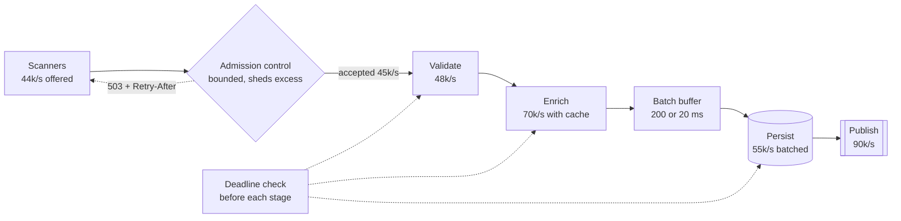
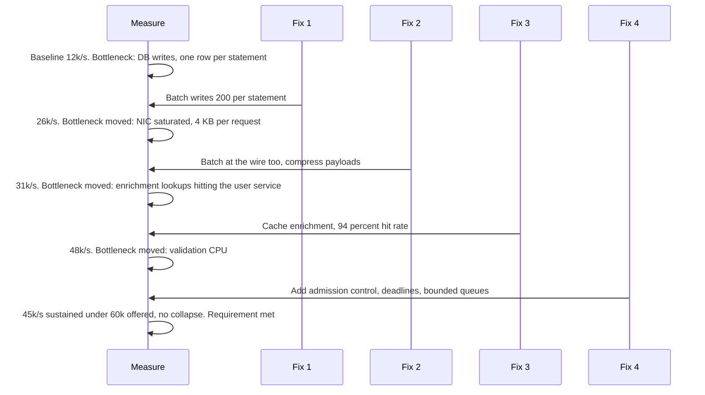

# Chapter 8: Throughput

## 8.1 Problem Statement

Same company, different service. Warehouse scanners emit a scan event every time a parcel is handled, and the ingestion service has to accept them, validate them, write them durably, and publish them onward. Chapter 6's spec said acknowledged events must never be lost. The new requirement is volume: 40,000 events per second at peak, up from 6,000.

The team's first measurement: 12,000 events per second, at 55 percent CPU. Plenty of headroom, apparently. So they do the obvious things, in order, and every single one makes things worse in a different way.

**They raise the thread pool from 200 to 800.** Throughput drops to 7,400 events per second. More threads, less work done. CPU is now 80 percent, and a profiler shows most of it is not their code.

**They add instances, from 8 to 24.** Per-instance throughput falls from 12,000 to about 5,000, so total throughput barely moves. The database is the same database.

**They upgrade the database to a much larger machine.** Throughput reaches 26,000, then stops dead. The database is at 30 percent CPU. The network interface on the ingestion instances is saturated, because every event carries a 4 KB payload and they are sending each one individually with its own round trip.

**Then a real peak arrives.** Offered load hits 44,000 events per second. Throughput does not plateau at 26,000. It falls to roughly 3,000, and CPU sits at 60 percent. The system is not busy. It is doing almost nothing useful.

That last one is the important one, so here is what was actually happening. Client timeout was 2 seconds. Under load, queueing pushed response times past 2 seconds, so scanners gave up and retried. The server, meanwhile, was still diligently processing requests whose clients had left, then writing the result nobody would read, then picking up the next dead request. Every retry added more work. The server was fully occupied producing output that was thrown away.

The eventual fix is not more hardware. It is a bounded queue, admission control, deadline checks that drop work nobody is waiting for, and batching writes 200 at a time. Final numbers: **45,000 events per second, on 10 instances, with 64 threads each.** Fewer threads and fewer machines than the 7,400 version.

Four lessons, each of which is a section of this chapter: throughput is set by one bottleneck at a time, adding concurrency past a point reduces throughput, useful work is not the same as work, and a system without admission control does not degrade under overload, it collapses.

## 8.2 Why This Problem Exists

**Throughput is set by a single constraint, and it moves.** At any moment one resource is the bottleneck and everything else has spare capacity. Add capacity to the bottleneck and the constraint jumps somewhere else, often somewhere you were not watching. The team above moved it from threads to the database to the network in three steps, which is not incompetence; it is what optimisation looks like. The mistake is expecting the fix to be permanent.

**Concurrency and throughput are not the same thing, and people treat them as if they were.** The intuition that more workers means more work done holds up to a point and then reverses. Threads contend for locks, invalidate each other's cache lines, consume memory, and force context switches. Past the peak, adding workers actively subtracts throughput, which is deeply counterintuitive and is why Section 8.1's first fix made things worse.

**Under overload, systems do not gently level off.** The mental model most people carry is a plateau: offered load rises, throughput rises, then flattens at capacity. Real systems form a hump. Past the peak, completed useful work declines, sometimes to near zero, because capacity is consumed by work that will be discarded, by retries, and by coordination overhead. Congestion collapse has been a known failure mode of networks since the 1980s and it applies to every queueing system, including yours.

**Latency and throughput are coupled through queues, and improving one often costs the other.** Batching raises throughput and delays every item in the batch. Running at low utilisation gives good latency and wastes capacity. You cannot optimise both independently, and any conversation about one that ignores the other will produce a bad decision.

**And the failure is quiet.** A latency problem produces complaints. A throughput ceiling looks like a healthy system with spare CPU, right up to the moment work starts backing up. In Section 8.1, CPU was 55 percent at the ceiling and 60 percent during the collapse. Every dashboard looked fine.

## 8.3 Real World Analogy

A motorway, and the relationship between how many cars are on it and how many get where they are going.

Empty road: a few cars, all moving at 100 km/h. Throughput measured in vehicles per hour past a point is low, because there are few vehicles, even though every individual journey is fast.

Add cars. Throughput rises, roughly proportionally. Everyone still moves at close to the speed limit. This is your system at low load.

Keep adding. At some density, vehicles per hour reaches a maximum. Traffic engineers can tell you what it is for a given road, and it happens at a speed well below the limit, with cars fairly close together.

Add more cars past that point and this is the part that matters: **throughput goes down.** Not flat, down. Cars are closer, so drivers brake more, so waves of braking propagate backwards, and eventually the road is full of stationary vehicles moving nobody anywhere. At maximum density, throughput approaches zero while the road is completely full. Utilisation is 100 percent and useful output is nil.

Four things map straight across.

**One lane sets the rate.** A four-lane motorway that narrows to two lanes at a bridge has the capacity of the bridge, no matter how wide the rest is. That is the bottleneck, and widening anything else changes nothing.

**Ramp metering works.** Traffic authorities install lights on the on-ramps that let cars join at a controlled rate. It feels perverse to make people wait to get onto an empty-looking road, and it measurably raises the number of vehicles per hour that get through. That is admission control, and it is Section 8.5.7.

**Cars that give up do not count.** If a driver sits in the jam for 40 minutes and then leaves at the next exit to take a different route, the road did work for them and delivered nothing. That is the difference between throughput and goodput, and it is what turned 26,000 events per second into 3,000.

**Buses raise throughput and add waiting.** A bus carries 60 people in the road space of three cars, so vehicles per hour understates it badly and people per hour goes up a lot. But you wait for the bus, and it stops on the way. Batching in one sentence.

## 8.4 Simple Explanation

**Throughput is the rate of useful work completed: requests per second, events per second, bytes per second, orders per hour.** Latency, from Chapter 7, is how long one unit takes. A system can have excellent latency and poor throughput, or the reverse.

Three terms that get conflated and should not be:

| Term | Meaning | Why it matters |
|---|---|---|
| Offered load | What arrives | You do not control it |
| Throughput | What the system processes | Bounded by the bottleneck |
| Goodput | What the system processes **that someone still wants** | The only one that matters to users |

In Section 8.1's collapse, offered load was 44,000 per second, throughput was around 26,000 in the sense that the CPU was genuinely processing requests, and goodput was about 3,000, because the rest were requests whose clients had already given up. A dashboard showing throughput would have looked survivable. Only goodput told the truth.

The central law of the chapter, and it is almost embarrassingly simple:

> **Throughput equals the capacity of the bottleneck. Nothing else affects it.**

Everything in this chapter is a consequence: how to find the bottleneck, how to compute its capacity, why adding parallelism can move the bottleneck to coordination itself, and how to stop the whole thing from collapsing when more work arrives than the bottleneck can take.

## 8.5 Technical Deep Dive

### 8.5.1 Finding the bottleneck

At any moment, exactly one resource limits your throughput. Everything else has slack by definition, because if two things were both saturated, one of them became saturated first.

A structured way to look, sometimes called the USE method: for every resource, check **utilisation** (how busy), **saturation** (how much queued work is waiting), and **errors**. Saturation is the one people skip and it is usually the most informative, because a resource can be at moderate utilisation while a queue in front of it is enormous.

| Resource | Saturated when | How you can tell |
|---|---|---|
| CPU | Run queue length exceeds cores | High utilisation, rising context switches, load average above core count |
| Memory bandwidth | Not visible as CPU percent | High CPU with low instructions per cycle, cache miss counters |
| Disk IOPS or bandwidth | Device queue depth grows | IO wait, await time rising, queue depth per device |
| Network bandwidth | Interface near line rate | Bytes per second near NIC capacity, TX queue drops |
| Network packets per second | Many small messages | High packet rate at low bandwidth, softirq CPU |
| Thread pool | Tasks queued | Queue depth, time in queue, rejections |
| Connection pool | Requests waiting for a connection | Pool wait time, saturation percentage |
| Database | Locks, IO, or CPU inside the database | Lock waits, slow query log, replication lag |
| Locks in your process | Threads blocked, CPU low | Thread dumps showing many BLOCKED threads on one monitor |
| File descriptors or ports | Connection creation fails | Errors on accept or connect, ephemeral port exhaustion |
| External API | Their rate limit, not yours | 429 responses, their latency rising while your CPU idles |

Two habits make this fast in practice.

**Ask what the resource is per unit of work.** Before measuring, estimate: this request needs about 8 ms of CPU, two disk reads, 4 KB of network, and one database connection for 12 ms. That estimate tells you which resource is likely to run out first at your target rate, and Part 2 turns this into a full capacity model.

**Expect the bottleneck to move and plan the next measurement.** After every fix, re-measure from scratch. The single most common waste of engineering time in performance work is continuing to optimise a resource that stopped being the constraint three fixes ago.

### 8.5.2 Capacity arithmetic

You can predict throughput before building anything, well enough to make design decisions. The general form:

```
max throughput  =  available resource per second / resource consumed per request
```

**CPU bound.** The most common case for application services:

```
16 cores
8 ms of CPU per request  (measured, not guessed)
efficiency factor 0.7    (context switching, GC, and you are not running at 100 percent)

max req/s = 16 x 0.7 / 0.008 = 1,400 per instance
```

The efficiency factor matters. You will not achieve 100 percent of theoretical CPU throughput, and from Chapter 7 you should not want to, because latency past the knee makes the last 20 percent of capacity unusable in practice.

**IO bound.** Here the limit is usually concurrency multiplied by the inverse of latency, which is Little's Law rearranged:

```
Request holds a DB connection for 12 ms.
Pool of 100 connections across the fleet.

max req/s through the database = 100 / 0.012 = 8,333
```

Note what changes this number: not CPU, not threads, but the connection count and the time each is held. Halving query time doubles throughput with no new hardware, which is why indexing work is often the cheapest capacity you can buy.

**Network bound**, which is what caught Section 8.1's team:

```
4 KB per event, sent as an individual request
25 Gbps interface, realistically usable ~ 20 Gbps = 2.5 GB/s
2.5 GB/s / 4 KB = about 625,000 events/s in raw bandwidth terms

but: each event is a separate request with headers, TLS record overhead,
     TCP acknowledgements, and a syscall.
Packet rate and per-request overhead bind long before bandwidth does.
```

That is the general lesson for network limits: **small messages are limited by per-message overhead, large messages by bandwidth.** Check both, and check packets per second, not just bytes.

**Composition: a pipeline runs at the rate of its slowest stage.**

```
Stage             Capacity
------------------------------------
HTTP accept       60,000/s
Validation        48,000/s
Enrich (cache)    30,000/s
Persist (DB)      12,000/s   <-- bottleneck
Publish (Kafka)   90,000/s

Pipeline throughput = 12,000/s
```

Adding validation capacity here does nothing at all. This diagram, with a real number against each stage, is the single most useful artifact in a throughput investigation, and most teams have never drawn one.

### 8.5.3 Why more threads can mean less throughput

Section 8.1 went from 200 to 800 threads and throughput fell by 38 percent. Two pieces of theory explain it, and the second is the one worth knowing well.

**Amdahl's Law** says the speedup from parallelism is capped by the part that cannot be parallelised:

```
speedup  =  1 / ( (1 - p) + p/N )

p = fraction that parallelises, N = number of workers
```

| Serial fraction | Max speedup, unlimited workers | Speedup at 32 workers |
|---|---|---|
| 1 percent | 100x | 24x |
| 5 percent | 20x | 12.5x |
| 10 percent | 10x | 7.8x |
| 25 percent | 4x | 3.7x |

A 5 percent serial section caps you at 20 times, no matter how many cores you buy. That serial section is usually a lock, a single connection, a shared counter, or a leader.

But Amdahl only predicts a plateau, and real systems get worse. The **Universal Scalability Law** adds a second term for the cost of coordination between workers:

```
C(N)  =  N / ( 1 + α(N - 1) + βN(N - 1) )

α = contention (queueing for shared resources, like Amdahl's serial part)
β = coherency (workers having to agree with each other: cache line
    invalidation, lock handoffs, cross-thread communication)
```

The β term is quadratic, so it eventually dominates and the curve turns downward. With modest values, say α of 0.03 and β of 0.001:

| Workers | Relative throughput |
|---|---|
| 1 | 1.0 |
| 8 | 5.7 |
| 16 | 8.4 |
| 32 | 10.0 (peak, around N = 31) |
| 64 | 9.1 |
| 128 | 6.9 |
| 256 | 4.5 |

There is a peak, and past it the line goes down. The peak sits at roughly the square root of (1 − α) / β, which here is about 31 workers. Adding the 32nd through 800th thread bought negative throughput, exactly as observed.

Where does β come from in a Java service? Concretely: threads mutating a shared `AtomicLong` or `ConcurrentHashMap` bucket so the cache line ping-pongs between cores, contended `synchronized` blocks with long handoff chains, false sharing of adjacent fields, allocation pressure driving more frequent garbage collection, and connection pool handoffs. None of these appear in a profiler as "your code". They appear as time going somewhere.

The practical rule: **find the peak empirically by sweeping the thread count**, rather than assuming more is better. It is usually a small multiple of core count for CPU-bound work, and it is bounded by the downstream capacity for IO-bound work.

### 8.5.4 Threads, event loops, and virtual threads

A recurring confusion, and it matters more since virtual threads arrived in Java.

**Thread per request, blocking.** Simple to write and debug. Each in-flight request costs a platform thread with its own stack, so concurrency is limited to a few thousand at most and each blocked thread is memory sitting idle.

**Event loop, non-blocking.** A small number of threads multiplexing many connections. Concurrency costs a small object rather than a thread. Code is harder to write, harder to debug, and one blocking call anywhere stalls everything on that loop.

**Virtual threads.** Cheap threads that unmount from a carrier thread while blocked, so you write blocking-style code and get event-loop-like concurrency. Millions of concurrent operations become feasible.

Now the part people get wrong, and it is central to this chapter:

> **Cheap concurrency does not create capacity. It moves the queue.**

If your database can serve 8,000 requests per second, then running 100,000 virtual threads that all want the database gives you 8,000 requests per second and 92,000 threads waiting. You have not added throughput. You have converted a visible rejection at your thread pool into an invisible queue inside your process, which is usually worse, because now the requests are all timing out silently instead of being shed cleanly.

| Workload | What helps throughput |
|---|---|
| CPU bound | More cores, less CPU per request. Threads beyond core count do not help |
| IO bound on a bounded dependency | Nothing on your side. Raise the dependency's capacity or reduce calls per request |
| IO bound on an unbounded dependency, high fan-out | Cheap concurrency helps a lot: virtual threads, async clients |
| Many idle connections | Cheap concurrency helps a lot: event loops or virtual threads |

The correct pairing with cheap concurrency is an explicit limit on concurrent calls to each dependency, which is the bulkhead pattern. Without it, virtual threads let you overwhelm downstream services faster and more thoroughly than you could before.

```java
// Cheap concurrency, with an explicit bound per dependency.
private final Semaphore dbPermits = new Semaphore(120);

public Result handle(Event e) {
    if (!dbPermits.tryAcquire(50, MILLISECONDS)) {
        throw new OverloadedException("db bulkhead full");   // shed, do not queue
    }
    try {
        return repository.save(e);
    } finally {
        dbPermits.release();
    }
}
```

### 8.5.5 Batching, and the arithmetic of amortisation

Batching is the single most effective throughput technique available, and its cost is always latency.

Every operation has a fixed cost paid once per batch and a variable cost paid per item: a network round trip, a syscall, a transaction commit, a lock acquisition, an index update flush.

```
per-item cost  =  F / B  +  V

F = fixed cost per batch
B = batch size
V = variable cost per item
```

With F of 2 ms and V of 0.1 ms:

| Batch size | Per-item cost | Items per second per worker | Added latency |
|---|---|---|---|
| 1 | 2.10 ms | 476 | 0 |
| 10 | 0.30 ms | 3,333 | up to 10 items of wait |
| 50 | 0.14 ms | 7,143 | up to 50 items of wait |
| 100 | 0.12 ms | 8,333 | up to 100 items of wait |
| 500 | 0.104 ms | 9,615 | up to 500 items of wait |
| 1000 | 0.102 ms | 9,804 | up to 1000 items of wait |

The shape is the important part. Almost all the benefit arrives by batch size 50 to 100, and everything after that is diminishing returns paid for with linearly increasing latency. **Do not batch bigger than the knee of that curve.**

The standard way to bound the latency cost is to flush on size **or** time, whichever comes first:

```java
// Flush when 200 events are buffered or 20 ms have passed, whichever first.
// Throughput of a big batch, with a hard ceiling on added latency.
private final List<ScanEvent> buffer = new ArrayList<>(200);

public synchronized void add(ScanEvent e) {
    buffer.add(e);
    if (buffer.size() >= 200) flush();
}

@Scheduled(fixedRate = 20)
public synchronized void flushOnTimer() {
    if (!buffer.isEmpty()) flush();
}

private void flush() {
    jdbc.batchUpdate("INSERT INTO scan_events (id, parcel_id, at) VALUES (?, ?, ?)",
                     buffer, buffer.size(),
                     (ps, e) -> { ps.setString(1, e.id()); /* ... */ });
    buffer.clear();
}
```

This exact pattern is why Kafka producers have `batch.size` and `linger.ms`. `linger.ms` deliberately waits a few milliseconds to accumulate a larger batch, trading a little latency for a large throughput gain. Setting `linger.ms` to 0 and then wondering why throughput is poor is a common misconfiguration.

Related techniques with the same character:

- **Pipelining.** Send the next request without waiting for the previous response. Removes round-trip cost from the critical path without waiting for a batch to fill.
- **Compression.** Trades CPU for bandwidth. Worth it on batches, usually not on tiny messages.
- **Coalescing.** Collapse duplicate work: if 500 requests ask for the same uncached key, one should query and the rest should wait for that result. This also prevents cache stampedes, in Chapter 34.

### 8.5.6 Goodput and congestion collapse

The concept that explains Section 8.1's worst moment, and the most important idea in this chapter.

**Throughput counts work done. Goodput counts work done that someone still wants.** They diverge exactly when a system is in trouble, which is exactly when your dashboard needs to be honest.

The collapse mechanism, step by step:

```
1. Offered load exceeds capacity.
2. Queues grow, so response time grows.
3. Response time passes the client timeout.
4. Clients give up and retry. Offered load increases.
5. The server is still processing requests from step 3, whose clients have gone.
6. Every unit of capacity spent on those is wasted. Effective capacity falls.
7. Go to step 2, but worse.
```

Two amplifiers make it fast. Retries multiply offered load precisely when capacity is scarce, and unbounded queues let the backlog grow without limit so that by the time a request is served, it is guaranteed to be stale.

This is not a theoretical worry. The internet suffered exactly this in October 1986, when the NSFNET backbone's effective throughput between two sites reportedly fell by around three orders of magnitude while the links were fully occupied. The response was Van Jacobson's congestion control work, which gave TCP the slow start, congestion avoidance, and backoff behaviour that every connection you make still uses. The lesson generalises: **any queueing system without admission control and backoff can collapse under overload**, and the fix has been known for four decades.

The diagnostic signature, worth recognising instantly:

| Symptom | What it means |
|---|---|
| Offered load up, completed work down | You are past the peak |
| CPU moderate, latency terrible | Waiting, not working. Chapter 7's curve |
| High rate of client timeouts alongside high server success rate | You are completing work nobody is waiting for |
| Retry rate climbing | Amplification in progress |
| Queue depth growing without bound | No admission control |

The single most valuable metric to add: **the ratio of responses delivered before the client's deadline to total responses produced.** If that falls, you are burning capacity on nothing.

### 8.5.7 Preserving throughput under overload

Four mechanisms, roughly in order of importance. Together they turn a cliff into a plateau.

**1. Bounded queues.** Every queue in your system must have a maximum size, and reaching it must cause a fast, explicit rejection. An unbounded queue does not prevent failure; it converts a fast failure into a slow one and adds memory exhaustion as a bonus.

```java
// Bounded queue, explicit rejection, no silent unbounded growth.
new ThreadPoolExecutor(
    64, 64,                                   // fixed pool, found by sweeping
    0L, MILLISECONDS,
    new ArrayBlockingQueue<>(500),            // bounded, roughly 8 per thread
    new ThreadPoolExecutor.AbortPolicy());    // reject, do not run on the caller
```

A note on rejection policy: `CallerRunsPolicy` is tempting because nothing gets dropped, and it is usually wrong at the edge of a service, because it makes your acceptor thread do the work and stops it accepting, which turns a local overload into a total stall. Reject explicitly and return `503` with a `Retry-After` header.

**2. Admission control.** Decide at the front door how much work to let in, based on measured capacity rather than a fixed guess. A static limit is either too low most of the time or too high during trouble. Adaptive schemes measure latency and adjust the concurrency limit, using the same logic TCP uses to find the capacity of a path: increase while things are healthy, back off sharply when latency rises.

**3. Deadline propagation.** Pass the client's deadline with the request and check it before doing expensive work. This is what would have saved Section 8.1's team on its own.

```java
public Result handle(Request req) {
    if (Instant.now().isAfter(req.deadline())) {
        metrics.counter("dropped.expired").increment();
        throw new DeadlineExceededException();   // nobody is waiting. Do not do the work
    }
    // pass the remaining budget downstream so they can do the same
    return downstream.call(req.body(), Duration.between(Instant.now(), req.deadline()));
}
```

A request that has already exceeded its deadline is worth exactly nothing, and processing it costs capacity that could serve a request that still matters. Checking a timestamp is nearly free. This single change converts collapse into graceful degradation more reliably than anything else on this list.

**4. LIFO under overload, and priority shedding.** A counter-intuitive one. Under sustained overload, serving the queue in FIFO order means every request you serve is the oldest and therefore the most likely to have timed out already. Serving newest-first means the requests you complete are the freshest and most likely to still be wanted. FIFO is fairer; LIFO produces more goodput when the queue is deep. Some proxies and RPC frameworks offer this, and it is worth knowing the option exists.

Priority shedding is the other half: when shedding, drop by class. Health checks and payment confirmations survive; analytics events and prefetch requests go first. That requires requests to carry a priority, which is a design decision made long before the incident.

### 8.5.8 Balancing a pipeline

For multi-stage systems, throughput is the minimum stage capacity, so the work is finding and widening the narrowest stage, then re-measuring.

```
Before:
  accept 60k -> validate 48k -> enrich 30k -> persist 12k -> publish 90k
  Pipeline = 12k. Everything upstream of persist is wasted capacity.

Fix 1: batch the persist stage, 200 rows per statement.
  accept 60k -> validate 48k -> enrich 30k -> persist 55k -> publish 90k
  Pipeline = 30k. Bottleneck moved to enrich.

Fix 2: cache the enrichment lookups, hit rate 94 percent.
  accept 60k -> validate 48k -> enrich 70k -> persist 55k -> publish 90k
  Pipeline = 48k. Bottleneck moved to validate.

Fix 3: nothing. 48k exceeds the 40k requirement. Stop here.
```

That last line is the discipline people skip. Optimisation ends when the requirement is met with headroom, not when the code stops being improvable. Chapter 6's spec sheet is what tells you when to stop.

One caution when stages are connected by queues: a fast stage feeding a slow one needs **backpressure**, not a large buffer. A buffer between them only delays the problem and adds latency to every item that passes through. If the consumer cannot keep up, the producer must be slowed, and the queue must be bounded so that it is.

## 8.6 Architecture Diagram

Two diagrams. The first is the throughput curve, because everyone has seen the plateau version and the real shape is different.

```
 throughput
 (goodput)
     ^
     |            ,-*-.         <- peak: the capacity you can actually use
     |         ,-'     `-.
     |      ,-'           `--.
     |    ,'                  `----.        <- past the peak, goodput FALLS
     |  ,'                          `-----.
     | /                                    `------.
     |/                                             `-----> collapse
     +--------------------------------------------------------> offered load
      ^            ^              ^                 ^
      |            |              |                 |
   linear      knee (Ch 7)     capacity        overload without
   region    latency rises      peak           admission control
```

The second is the pipeline with per-stage capacity, which is the artifact to produce during any throughput investigation.



ASCII version:

```
 Scanners (44k/s offered)
      |
 [ admission control ] --(excess)--> 503 + Retry-After
      | accepted 45k/s
 validate 48k/s  <-- deadline check
      |
 enrich 70k/s (94% cache hit)  <-- deadline check
      |
 batch buffer (200 rows or 20 ms)
      |
 persist 55k/s (batched)  <-- deadline check
      |
 publish 90k/s

 Pipeline capacity = min(48, 70, 55, 90) = 48k/s
```

Three things to read off it. The narrowest stage is validate at 48,000, so that is the number, and every other stage's spare capacity is irrelevant. Admission control sits at the front, before any work is done, because shedding after you have spent capacity defeats the purpose. And deadline checks sit before each expensive stage, so work whose client has gone is abandoned at the earliest possible point rather than at the last.

## 8.7 Request Flow

Rather than one request, the useful walk here is the capacity of the whole path, measured at each fix. This is what a throughput investigation actually looks like, and it is worth doing in exactly this form.



Step by step, with what was learned at each stage:

1. **Measure the baseline and identify the bottleneck.** 12,000 per second, database at 95 percent IO utilisation, one INSERT per event with a commit each. Everything upstream was idle. Note that CPU on the application was 55 percent, which is why "we have headroom" was the wrong conclusion.
2. **Fix one: batch the writes.** 200 rows per statement, flushed on size or 20 ms. Per-item fixed cost collapsed, and throughput more than doubled. The added latency was 20 ms worst case, which the spec permitted.
3. **Re-measure.** The bottleneck was now the network interface, because each event was still a separate 4 KB HTTP request with headers and TLS overhead. Symptom: bytes per second near line rate while every other resource idled.
4. **Fix two: batch on the wire as well,** and compress. Scanners now send groups of events per request. Note that this required a protocol change, which is an HLD decision from Chapter 4, not a tuning knob.
5. **Re-measure.** Now the enrichment stage was the constraint: each event triggered a lookup against the user service, so their capacity had become ours.
6. **Fix three: cache the enrichment data.** 94 percent hit rate took the stage from 30,000 to 70,000 per second and removed a dependency from the hot path.
7. **Re-measure.** Validation CPU became the bottleneck at 48,000 per second, which exceeds the 40,000 requirement. **Stop optimising.**
8. **Fix four: make it safe under overload.** Bounded queues, admission control, deadline checks before each expensive stage, priority shedding, and a retry budget on the client. Throughput at 60,000 offered load is now a stable 45,000 with clean rejections, rather than 3,000 with a collapse.

The pattern to internalise: measure, fix the constraint, **re-measure immediately**, and stop when the requirement is met with headroom. Steps 3, 5, and 7 are where most teams go wrong, by continuing to optimise the previous bottleneck.

## 8.8 Internal Components

| Component | Throughput limit it imposes | Measure | Ignore it and |
|---|---|---|---|
| Admission control | Sets accepted load | Accept rate, shed rate, shed by priority | The system collapses instead of degrading |
| Accept queue | Connections waiting to be handled | Queue depth, overflow drops | Silent connection drops that look like network faults |
| Thread pool | Concurrency, and past the peak it subtracts | Active threads, queue depth, rejections | Adding threads makes throughput worse, invisibly |
| Locks and shared state | The β term in the scalability law | Blocked thread count, lock wait time | Throughput peaks well below core count for no visible reason |
| Connection pool | Downstream concurrency | Wait time, saturation, timeouts | The database's limit shows up as an application mystery |
| Batch buffer | Amortises fixed costs | Batch size distribution, flush reason, buffer age | Per-item overhead dominates and throughput sits at a fraction of possible |
| Database | Usually the real ceiling | IOPS, lock waits, slow queries, WAL throughput | You scale the stateless tier forever with no effect |
| Network interface | Bytes and packets per second | Bandwidth, packet rate, TX drops | You hit a wall at moderate CPU and cannot explain it |
| Message broker | Sustained publish and consume rate | Produce rate, consumer lag, partition count | The broker becomes the constraint and lag grows without bound |
| Deadline checks | Removes wasted work | Expired-before-processing count | Capacity is spent on responses nobody reads |
| Retry budget | Caps amplification | Retry rate as a share of traffic | Overload becomes collapse |

The row most often missing entirely is the deadline check, and the metric most often missing is the shed rate. A system that never sheds is not necessarily healthy; it may simply have no mechanism to shed and be queueing instead.

## 8.9 Production Example

**Kafka is a case study in designing for throughput from the ground up.** Several of its central design choices exist for exactly the reasons in this chapter. Records are appended sequentially to a log rather than written in place, which turns random IO into sequential IO and is dramatically faster on both spinning disks and SSDs. Producers batch records per partition and can be told to wait briefly, via `linger.ms`, to accumulate a bigger batch, which is Section 8.5.5's amortisation formula exposed as configuration. Batches are compressed as a unit rather than per record, so the compression ratio is much better. Consumers fetch in bulk. The broker avoids copying message data through user space where it can, using the operating system's page cache and sendfile-style transfer.

Every one of those is a throughput technique that costs a little latency, which is the correct trade for a system whose job is moving very large volumes of events. Chapter 53 covers the details, and Chapter 173 compares it with RabbitMQ, whose different design targets a different point on the same trade-off.

**The 1986 congestion collapse is the canonical goodput story.** As described in Van Jacobson's work on congestion avoidance, throughput between two sites on the early internet fell by roughly a factor of a thousand while the links were saturated, because senders retransmitted aggressively into a congested network and the network spent its capacity carrying packets that would be dropped or duplicated. The fixes that followed, slow start, congestion avoidance, and exponential backoff, are admission control and backpressure implemented inside TCP.

The reason to know this history is that it is the same failure your service has, one layer up. Unbounded queues, retries without backoff, and no admission control produce the identical curve, and the identical remedy applies.

**Netflix's adaptive concurrency limits apply TCP's idea to service calls.** Rather than configuring a fixed concurrency limit per dependency, which is guaranteed to be wrong as conditions change, their approach measures latency continuously and adjusts the allowed concurrency: raise it while latency stays near its best observed value, cut it when latency rises, which is the signal that queues are forming. The algorithm is closely related to TCP Vegas, which uses delay rather than loss as its congestion signal.

The practical value is that operators stop having to guess a number that varies with instance size, downstream health, and request mix. The system finds the peak of the curve in Section 8.6 by itself, and stays near it.

## 8.10 Advantages

Treating throughput as a first-class design property, rather than something you discover during an incident:

- **Capacity becomes predictable.** With a per-stage capacity model, you can answer "will this survive Black Friday" with arithmetic instead of hope.
- **Money is spent where it works.** Knowing the bottleneck prevents scaling a tier that changes nothing, which is the most common form of infrastructure waste.
- **Overload degrades instead of collapsing.** Admission control and deadlines mean the difference between serving 45,000 per second at peak and serving 3,000.
- **Batching often gives an order of magnitude for very little code.** The fixed-cost amortisation in Section 8.5.5 is the highest-return change available in most write paths.
- **Latency benefits too.** A system running below its peak, with bounded queues, has a stable latency distribution. Past the peak, latency is unbounded.
- **Cost per request falls.** Higher throughput per instance is directly less infrastructure for the same work.
- **Failure modes become explicit.** A shed request with a `503` and a `Retry-After` is a contract with the client; a timeout is a mystery.

## 8.11 Limitations

- **The bottleneck always moves,** so throughput work is never finished, only sufficient. The discipline is stopping when the requirement is met.
- **Batching costs latency, always.** For interactive request paths the acceptable batch window may be a few milliseconds, which limits the gain.
- **Serial fractions cap you.** Amdahl's Law means a 5 percent serial section limits you to 20 times, and some serial sections cannot be removed, such as a single leader for ordering.
- **Shedding means someone is refused.** That is better than collapse, and it is still a failed request that needs a client-side story.
- **Coordination costs are hard to see.** The β term shows up as time disappearing rather than as an identifiable hotspot, so it needs specialised measurement.
- **Higher throughput can move the problem downstream.** Doubling your ingestion rate may simply overwhelm the next system, which is why capacity models should cover the whole chain.
- **Peak throughput is not usable throughput.** Chapter 7's curve means you should plan to run well below the peak, so the number in your capacity model should be roughly 70 percent of what the load test found.

## 8.12 Trade-offs

| Dial | One way | The other way |
|---|---|---|
| Batch size | Large: much higher throughput, higher latency, bigger failure blast radius | Small: low latency, per-item overhead dominates |
| Thread count | More: uses cores, and past the peak subtracts throughput | Fewer: less contention, may leave cores idle |
| Queue depth | Deep: absorbs bursts, high latency and stale work | Shallow: fresh work, sheds during bursts |
| Admission policy | Strict: protects goodput, rejects real users | Permissive: accepts everything, risks collapse |
| Shedding order | FIFO: fair, worse goodput under overload | LIFO: better goodput, some requests starve |
| Sync vs async writes | Sync: durable and slow | Async or grouped commit: fast, a window of loss |
| Compression | On: fewer bytes, more CPU | Off: more bandwidth, less CPU |
| Retry aggressiveness | High: better success in transient failure, amplifies overload | Low: less amplification, more visible failures |

The removal test.

**Remove batching from the write path.** You gain simplicity and per-event latency of a few milliseconds instead of up to 20. You lose roughly four fifths of your write throughput, because per-statement fixed cost dominates. For a system at 500 writes per second this is a fine trade; at 40,000 it is not survivable.

**Remove admission control.** You gain the ability to say you never reject a request, which sounds good in a meeting. You lose the plateau: under overload you now collapse, and the number of users served drops by an order of magnitude compared with shedding cleanly. You also lose the ability to protect high-priority traffic.

**Remove deadline checks.** You gain a few lines of code and a small amount of CPU. You lose the guarantee that capacity goes to work someone wants, which is most of the difference between degradation and collapse.

**Remove the bound on a queue.** You gain the appearance of resilience, since nothing is ever rejected. You lose bounded memory and bounded latency, and you convert a fast, honest failure into a slow one that also risks an out-of-memory kill.

## 8.13 Common Mistakes

**Adding threads to fix a throughput problem.** Past the peak of the scalability curve this reduces throughput. Sweep the thread count and find the peak before assuming.

**Scaling the stateless tier when the database is the constraint.** More instances contending for the same connection limit produces no more throughput and often less.

**Reading spare CPU as spare capacity.** The bottleneck may be IO, network, locks, connections, or a downstream service. CPU at 55 percent while throughput is capped is a signal to look elsewhere, not a sign of headroom.

**Unbounded queues.** Every queue needs a maximum. Without one, you have converted rejection into memory exhaustion plus guaranteed staleness.

**Measuring throughput without measuring goodput.** Under overload, these diverge completely, and the number that matters is the one nobody is graphing.

**Retries without a budget.** Retries add load in exact proportion to how badly the system is struggling. Cap them as a percentage of traffic.

**Batching without a time bound.** Waiting for a full batch during a quiet period means the last few items wait indefinitely. Always flush on size or time.

**Continuing to optimise a resolved bottleneck.** Re-measure after every change. The single biggest waste of effort in performance work.

**Load testing at the average rate.** Capacity questions are about peak, and about bursts, and about behaviour past the peak. Test at 150 percent of expected peak to see what your overload behaviour actually is, before a customer discovers it for you.

**Treating peak load test throughput as your capacity number.** Plan for roughly 70 percent of it, because latency past the knee makes the rest unusable.

**Using `CallerRunsPolicy` at the service edge.** It stops the acceptor accepting and turns local overload into a total stall.

**Assuming cheap concurrency creates capacity.** Virtual threads and async clients let more requests wait, not more work complete. Add bulkheads.

## 8.14 Interview Questions

**Q: What determines a system's throughput?**
The capacity of its single current bottleneck. Every other resource has slack by definition. Fixing the bottleneck moves it somewhere else, so throughput work is a loop of measure, fix, re-measure.

**Q: You add threads and throughput drops. Why?**
Contention and coherency costs. Threads queue for shared resources and force cross-core coordination such as cache line invalidation and lock handoffs, and that coordination cost grows quadratically with worker count. The Universal Scalability Law describes it, and it means there is a peak thread count past which more workers subtract throughput.

**Q: What is Amdahl's Law and what does it imply here?**
Speedup is capped by the fraction of work that cannot be parallelised: with a 5 percent serial section the maximum speedup is 20 times regardless of core count. In practice the serial section is a lock, a single connection, or a leader, and finding it matters more than adding hardware.

**Q: Difference between throughput and goodput?**
Throughput is work processed; goodput is work processed that someone still wants. Under overload they diverge, because the system keeps processing requests whose clients have already timed out. Goodput is the number that matters and the one usually not measured.

**Q: Describe congestion collapse in a request-serving system.**
Load exceeds capacity, queues grow, response time passes client timeouts, clients retry, offered load rises, and the server spends capacity on requests nobody is waiting for. Effective capacity falls, which worsens all of it. The fixes are bounded queues, admission control, deadline propagation, and retry budgets with backoff.

**Q: How does batching improve throughput, and what does it cost?**
It amortises fixed per-operation cost across many items, so per-item cost becomes fixed-cost divided by batch size plus variable cost. Most of the benefit arrives by batch sizes of about 50 to 100. The cost is latency, bounded by flushing on size or a time limit, whichever comes first.

**Q: Do virtual threads increase throughput?**
They increase achievable concurrency cheaply, which helps when the workload is IO bound against a dependency with spare capacity or many idle connections. They do not create capacity in a bounded dependency; they move the queue from your thread pool into your process. Pair them with explicit per-dependency concurrency limits.

**Q: Your service is capped at 12,000 requests per second with CPU at 50 percent. How do you find why?**
Check every resource for utilisation and saturation, not just utilisation: connection pool wait time, thread pool queue depth, disk queue depth, network bytes and packets per second, database lock waits and IO, downstream service latency and 429 responses, and thread dumps for blocked threads. Estimate resource use per request first so you know what to suspect.

**Q: Why might serving the newest requests first improve results under overload?**
Because the oldest requests in a deep queue are the most likely to have already exceeded their client's timeout, so completing them produces no goodput. Newest-first means the requests you complete are more likely to still be wanted. It is less fair, and it produces more useful work while overloaded.

**Q: How much of your load-tested peak throughput should you plan to use?**
Roughly 70 percent. Past the knee of the utilisation curve, latency rises steeply and small bursts push you into the region where goodput falls, so the top of the range is not usable capacity in practice.

## 8.15 Production Best Practices

1. **Draw the pipeline with a measured capacity number against every stage.** The bottleneck becomes obvious and you stop optimising the wrong thing.
2. **Estimate resource use per request** (CPU milliseconds, IO operations, bytes, connection time) before measuring, so you know what to look for.
3. **Measure saturation, not just utilisation:** queue depths and wait times for every pool.
4. **Sweep thread and connection counts to find the peak,** rather than assuming more is better.
5. **Bound every queue,** and reject explicitly with `503` and `Retry-After` when full.
6. **Put admission control at the front door,** ideally adaptive rather than a fixed number.
7. **Propagate deadlines and check them before expensive work,** discarding anything already expired.
8. **Batch on size or time, whichever comes first,** and pick a batch size near the knee rather than the maximum.
9. **Measure goodput,** specifically the share of responses delivered inside the client's deadline.
10. **Give retries a budget** expressed as a percentage of normal traffic, plus backoff and jitter.
11. **Shed by priority,** which requires request classification designed in advance.
12. **Add bulkheads per dependency,** especially when using cheap concurrency.
13. **Load test past the peak,** at 150 percent of expected maximum, to observe overload behaviour before customers do.
14. **Plan capacity at about 70 percent of measured peak,** and re-measure after every significant change.

## 8.16 Summary

Throughput is the rate of useful work completed, and it equals the capacity of whatever resource is currently the bottleneck. Nothing else affects it, which is why the first job in any throughput problem is finding the constraint rather than optimising whatever is most familiar. The constraint moves after every fix, so the work is a loop: measure, fix, re-measure, and stop when the requirement is met with headroom.

Concurrency is not throughput. Adding workers helps until coordination costs overtake the gain, and past that peak more threads produce less work. Amdahl's Law caps you at the inverse of the serial fraction, and the coordination term grows quadratically, so the curve turns downward rather than flattening. Cheap concurrency, whether from event loops or virtual threads, does not change this; it lets more requests wait, which helps only when the bottleneck is your ability to hold connections rather than the capacity of what you are calling.

Batching is the highest-return technique in most write paths, because it amortises fixed per-operation cost across many items. Most of the gain arrives by a batch size of around 50 to 100, and the cost is always latency, bounded by flushing on time as well as size.

The most important idea in the chapter is the difference between throughput and goodput. Under overload, a system without admission control keeps processing requests whose clients have already given up, so capacity is spent producing output nobody reads while retries add still more load. That is congestion collapse, it has been understood since the 1980s, and the remedy is the same as TCP's: bound the queues, control admission, back off, and discard work whose deadline has passed. The difference between a system with those four things and one without is not a few percent. In Section 8.1 it was 45,000 events per second against 3,000.

## 8.17 Quick Revision Notes

- Throughput = capacity of the current bottleneck. Fixing it moves it. Re-measure after every change.
- Offered load, throughput, and goodput are three different numbers. Goodput is the one that matters and the one usually not graphed.
- Capacity arithmetic: max rate = available resource per second / resource per request. Apply per resource: CPU, IOPS, bytes, packets, connections.
- Little's Law again: throughput = concurrency / latency. Halving query time doubles throughput through a fixed connection pool.
- A pipeline runs at its slowest stage. Draw capacities per stage; every other stage's slack is irrelevant.
- Amdahl: speedup = 1 / ((1 − p) + p/N). A 5 percent serial section caps you at 20x.
- Universal Scalability Law adds a quadratic coordination term, so the curve peaks and then declines. Peak ≈ sqrt((1 − α) / β).
- More threads past the peak means less throughput. Sweep to find the peak.
- Cheap concurrency (virtual threads, async) moves the queue, it does not create capacity. Add per-dependency bulkheads.
- Batching: per-item cost = fixed/batch + variable. Most gain by batch 50 to 100. Flush on size or time.
- Congestion collapse: queues grow, timeouts fire, clients retry, server serves dead requests, goodput approaches zero while utilisation stays high.
- Four defences: bounded queues, admission control, deadline propagation with checks, retry budgets with backoff and jitter.
- LIFO under deep overload produces more goodput than FIFO. Shed by priority.
- Reject with 503 and Retry-After. Avoid CallerRunsPolicy at the service edge.
- Plan capacity at about 70 percent of measured peak, because the region past the knee is not usable.
- Load test at 150 percent of peak to see overload behaviour before customers find it.

## 8.18 Mini Quiz

1. A service has 32 cores, uses 6 ms of CPU per request, and you assume 70 percent efficiency. What is its approximate maximum request rate?
2. A pipeline has stages with capacities 50k, 22k, 80k, and 35k per second. What is the throughput, and what happens if you double the third stage?
3. You increase the thread pool from 64 to 512 and throughput falls by a third. Give two specific mechanisms that cause this.
4. Fixed cost per batch is 3 ms and variable cost per item is 0.05 ms. Compute per-item cost at batch sizes 1, 20, and 200. What does that tell you about choosing a batch size?
5. Define goodput and give the metric you would add to measure it.
6. Describe the feedback loop of congestion collapse in five steps.
7. Why is `CallerRunsPolicy` usually the wrong rejection policy at the edge of a service?
8. Your team says virtual threads will let the service handle 10 times the load. Under what condition is that true, and under what condition is it false?
9. Under sustained overload, why can serving the newest queued requests first produce more useful work than serving the oldest?
10. Load testing shows a peak of 30,000 requests per second. What number goes in the capacity plan, and why?

**Answers**

1. 32 × 0.7 / 0.006 = about 3,733 requests per second.
2. Throughput is 22,000 per second, set by the slowest stage. Doubling the 80k stage to 160k changes nothing at all, since it was never the constraint. Fixing the 22k stage would raise throughput to 35,000, at which point the fourth stage becomes the bottleneck.
3. Any two of: lock contention, where more threads queue on the same monitor and handoff costs rise; cache line invalidation and false sharing, where cores repeatedly invalidate each other's copies of shared state; context switching overhead as runnable threads exceed cores; increased memory footprint and allocation pressure causing more frequent garbage collection; and connection pool contention pushing the wait time up without more work completing.
4. Batch 1: 3 + 0.05 = 3.05 ms per item. Batch 20: 3/20 + 0.05 = 0.20 ms. Batch 200: 3/200 + 0.05 = 0.065 ms. Going from 1 to 20 gives a 15x improvement; going from 20 to 200 gives about 3x more, and going beyond 200 approaches the 0.05 ms floor. Choose near the knee, because larger batches keep costing latency while delivering less.
5. Goodput is work completed that someone still wants, meaning responses delivered before the client's deadline or timeout. Measure it as the ratio of responses returned within the request's remaining deadline to total responses produced, plus a counter for requests dropped because their deadline had already passed.
6. Offered load exceeds capacity; queues grow so response time grows; response time exceeds client timeouts; clients abandon and retry, increasing offered load; the server continues processing abandoned requests, so effective capacity falls and the loop repeats more severely.
7. Because it makes the accepting thread execute the task, which stops it accepting new connections. A localised overload in one pool becomes a full stall of the service's front door, and the client receives no clean signal such as a `503` with a `Retry-After` that would let it back off.
8. True when the bottleneck is your ability to hold many concurrent blocked operations, for example high fan-out calls to services with spare capacity, or many mostly idle connections. False when the bottleneck is a bounded downstream resource such as a database connection pool or an external rate limit, in which case you get the same throughput with far more requests waiting inside the process instead of being rejected cleanly.
9. Because in a deep queue the oldest requests are the ones most likely to have already exceeded their clients' timeouts, so completing them yields nothing. Newest-first raises the probability that each completed request still has someone waiting for it. It is less fair and some requests may starve, which is why it is an overload behaviour rather than a default.
10. About 21,000, roughly 70 percent of peak. Past the knee of the utilisation curve, latency rises steeply and normal bursts push the system into the region where goodput declines, so the top 30 percent is not capacity you can safely use.

## 8.19 Hands-on Exercise

**Part 1: find your capacity and your bottleneck.** Take a Spring Boot endpoint that writes a row to a database. Using an open-loop generator, increase offered load until completed requests per second stops rising. Record that number. Then, for each resource in Section 8.5.1's table, record utilisation and saturation at that moment. Write one sentence naming the bottleneck and the evidence.

**Part 2: sweep the thread count.** Fix offered load at the level you found, then run the test with thread pool sizes of 8, 16, 32, 64, 128, 256, and 512. Plot throughput against thread count. Find the peak. Confirm that beyond it, throughput declines rather than plateaus, and note how far past the peak you have to go before the decline is obvious.

**Part 3: batch it.** Change the write path to buffer and flush on 200 rows or 20 ms, whichever comes first. Re-measure throughput and p99 latency. Then try batch sizes of 10, 50, 200, and 1000, recording throughput and p99 for each. Identify the knee and note what the last doubling of batch size actually bought you.

**Part 4: cause a collapse.** Set the client timeout to 2 seconds with 3 retries and no backoff. Drive offered load to 150 percent of your measured capacity. Record throughput, and separately record goodput by tagging each request with a deadline and counting responses that arrive after it. You should see the two numbers separate dramatically. Note CPU utilisation while this is happening.

**Part 5: fix the collapse.** Add, one at a time and re-measuring after each: a bounded queue with explicit rejection, a deadline check before the write, a retry budget on the client with exponential backoff and jitter, and finally an admission control limit. Record goodput after each. You are looking for the curve in Section 8.6 to change from a cliff into a plateau, and for the final goodput at 150 percent offered load to be close to your measured capacity rather than near zero.

## 8.20 Further Reading

- *Guerrilla Capacity Planning*, Neil Gunther. The source for the Universal Scalability Law, including how to fit α and β to your own measurements.
- *Congestion Avoidance and Control*, Van Jacobson, 1988. The paper that fixed the internet. Read it as a case study in goodput, backoff, and admission control.
- *Systems Performance*, Brendan Gregg, second edition. The USE method, and the most practical guide available to identifying which resource is actually saturated.
- Kafka's design documentation, particularly the sections on persistence, batching, and efficiency. A clear worked example of trading latency for throughput deliberately.
- Netflix's concurrency-limits project and the accompanying engineering posts, on adaptive admission control derived from latency signals.
- Amazon's *Builders' Library*, articles on load shedding, fairness in multi-tenant systems, and using load testing to find limits.
- *Release It!*, Michael Nygard, on bulkheads, backpressure, and the stability patterns that keep overload local.

---

**Next chapter: Chapter 9, Scalability.** What it actually means for a system to scale, why scalability is a property of the relationship between load and cost rather than a property of size, and how to find the parts of a design that will not scale before you build them.
