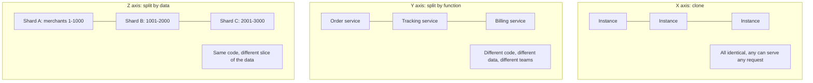
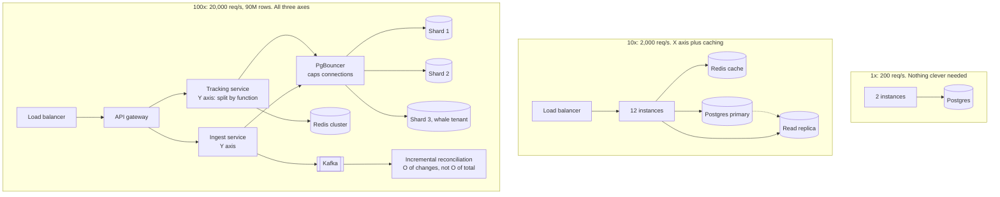
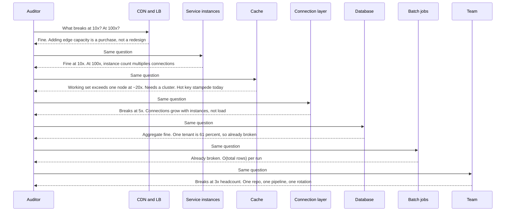

# Chapter 9: Scalability

## 9.1 Problem Statement

The logistics company wins the national retailer contract from Chapter 1. Traffic goes up roughly 40 times over five months, and the engineering team is not worried, because they have done the work. Services are stateless. Sessions live in Redis. Everything runs behind a load balancer. Their words in the planning meeting: "we are horizontally scalable, we just add instances".

They add instances. From 24 to 240. Here is what happens.

**The database refuses connections.** Each instance holds a pool of 20 connections, so 240 instances want 4,800 connections. Postgres was configured for 1,000 and each connection costs memory and a backend process. The application tier scaled perfectly and killed the database by doing so. Note the shape of this: the pressure on the database grew with instance count, not with useful work.

**One shard melts while the others idle.** They had sharded shipments by merchant id, which was sensible when the largest merchant was 4 percent of volume. The national retailer is 61 percent of volume. That is one shard carrying 61 percent of the traffic and seven shards sharing the rest. Adding shards does not help at all, because a single merchant cannot be split by a scheme keyed on merchant.

**A cache miss takes down the database.** The most-tracked parcel in the country is a delayed high-profile delivery, and its cache entry expires. In the 400 milliseconds before the first query returns, 30,000 requests arrive for the same key, all miss, and all query the database. The cache is doing its job perfectly right up until the moment it is not.

**The nightly reconciliation job stops finishing.** It scans every shipment and compares it to carrier records. At 2 million shipments it took 40 minutes. At 90 million it does not complete before the next one starts. Nothing about the job changed. The amount of data it touches per run grows with total data, which is the definition of something that does not scale.

**And the team itself stops scaling.** Six engineers became thirty. One repository, one deploy pipeline, one on-call rotation. The deploy queue is four hours deep, every pull request has merge conflicts, and nobody understands the whole system well enough to review changes to it confidently.

Five failures. Only one of them, the shard hotspot, is what people usually mean by a scaling problem. The others are a resource that grows with instance count rather than load, a coordination failure under concurrency, an algorithm whose cost grows with total data, and an organisation that outgrew its architecture.

"Stateless and behind a load balancer" is necessary and nowhere near sufficient.

## 9.2 Why This Problem Exists

**Scalability is a property of a curve, and people treat it as a property of a size.** "Is it scalable" is not a yes or no question about the system as it stands. It asks what happens to cost and to performance as load increases. A system serving 50 requests per second can be perfectly scalable, and one serving 50,000 can be a dead end.

**Almost everything works at 1x, which means the failures are all latent.** Nothing in Section 9.1 was broken before the contract. The connection pool was fine. The shard key was well chosen for the data at the time. The nightly job was comfortable. Scaling does not create these problems; it reveals ones that were already written down and simply had not been reached yet.

**People check the obvious dimension and miss the others.** The team checked "can we run many instances of this service". They did not check data volume growth, load distribution across keys, the total number of connections implied by their topology, or whether thirty engineers could work in one repository. All four are scalability, and only the first one is famous.

**Some quantities grow faster than load.** Connections between N services and M instances grow as their product. A full mesh between N nodes has N(N−1)/2 links. Gossip protocols exchange messages proportional to N². Coordination overhead grows quadratically, which Chapter 8's scalability law made precise. When something in your design grows faster than the traffic that pays for it, you have a cliff at a predictable place, and the only question is when you reach it.

**And skew is the norm, not the exception.** Real workloads are not uniform. A small number of keys receive a large share of traffic, in almost every domain: popular products, celebrity accounts, one enormous customer, the trending video. Designs are usually validated against uniform test data, which is exactly the distribution that never occurs in production.

## 9.3 Real World Analogy

A school with 90 students and three teachers works. Now enrol 3,000 students.

You cannot solve it by asking the three teachers to talk louder. The instinctive answer is more classrooms with more teachers teaching the same curriculum. That works well, and it is the cheapest thing to do. But it is not the only axis, and after a while it stops being enough.

- **More identical classrooms.** Every classroom teaches the same syllabus to a different group. Cheap, simple, effective, and it needs no coordination between classrooms.
- **Specialist teachers.** Instead of every teacher teaching everything, one teaches mathematics and another teaches history. Each becomes better at their subject, but now timetabling matters and a sick specialist affects every class.
- **Split by year group, in separate buildings.** Year 7 in one building, Year 12 in another, each with its own staff and facilities. Independent, and moving a student between buildings is now a formal process rather than walking down a corridor.

Those three are exactly the three axes of Section 9.5.3, and schools discovered them long before software did.

Now the parts that do not scale, which is where the analogy earns its place.

**The head teacher who signs every form.** One person, every decision. Add classrooms and the queue outside that office grows. This is a coordination bottleneck, and no amount of teaching capacity fixes it.

**The assembly hall.** It holds 400. At 3,000 students, whole-school assembly is not slow, it is impossible. Some things simply do not have a bigger version, which is the shared resource problem.

**Parents' evening.** Every parent wants to meet every one of their child's teachers. As students grow, the number of meetings grows faster than either teachers or students alone, because it is a product of the two. That is the N times M growth that killed the database connections in Section 9.1.

**And the most popular teacher.** Everyone wants their child in Mr Kumar's class. Splitting into more classrooms does not help, because the demand is for one specific classroom. That is skew, and Section 9.5.6 is entirely about it.

## 9.4 Simple Explanation

> **A system is scalable if you can handle more load by adding resources, at a cost that grows no faster than the load, without redesigning it.**

Three parts of that sentence do work.

**"By adding resources"** means there is a lever. If the only way to handle more load is to make the code faster, that is optimisation, not scalability, and it runs out.

**"At a cost that grows no faster than the load"** is the real test. Doubling traffic should roughly double cost, ideally less. If doubling traffic quadruples cost, you have a system that technically works and will bankrupt you.

**"Without redesigning it"** is what separates scalable from merely large. If reaching 10x means changing the shard key and migrating 90 million rows, then the current system is not scalable to 10x, whatever its current size.

The most useful correction to most people's intuition:

> **Scalability is not performance.** They are independent properties.

| | Scales well | Scales badly |
|---|---|---|
| **Fast** | The goal. A cached read served from a stateless fleet | A single very large server at 90 percent capacity with nowhere to go |
| **Slow** | Acceptable and common. A batch pipeline that takes an hour but handles any volume by adding workers | The worst case. Slow now, and no lever to make it better |

The bottom-left cell is worth dwelling on, because engineers instinctively treat "slow" as worse than "does not scale". A system with a per-item cost of 400 milliseconds that parallelises perfectly is in much better shape than a 5 millisecond system with a global lock in it. The first one is a purchasing decision. The second is a rewrite.

And the practical framing to carry into any design review, which is Section 9.5.5's whole method:

> Ask of every component: **what breaks at 10x, and what breaks at 100x?**

## 9.5 Technical Deep Dive

### 9.5.1 The four dimensions

"Scale" without a noun is ambiguous. Four different things grow, they grow independently, and a design can be excellent on one and hopeless on another.

| Dimension | What grows | Typical failure | Example from Section 9.1 |
|---|---|---|---|
| Load | Requests per second, concurrent users | Bottleneck saturation, queueing | The database connection ceiling |
| Data | Rows, bytes, keys, files | Queries slow down, jobs stop finishing, backups exceed their window | The nightly reconciliation job |
| Geography | Distance between users and servers, number of regions | Latency floor, consistency conflicts, data residency rules | Not yet hit, but arriving with international customers |
| Organisation | Engineers, teams, services, deploys per day | Merge conflicts, deploy queues, unclear ownership, slow reviews | Six engineers to thirty in one repository |

Two of these are under-appreciated.

**Data scalability is different from load scalability**, and it is the one people miss. A system can handle any request rate you like and still fail because a table has grown past the point where an operation on it is feasible. The signatures: an index no longer fits in memory, a `COUNT(*)` that used to be instant now takes a minute, a backup that no longer fits in the maintenance window, a schema migration that would lock a table for six hours, a job whose cost is proportional to total rows.

**Organisational scalability is a real engineering property**, not a management concern that happens nearby. Conway's observation, that systems tend to mirror the communication structures of the organisations that build them, cuts both ways: an architecture that requires everyone to coordinate will impose that coordination cost on the organisation regardless of how it is structured on paper. When thirty engineers share one deploy pipeline, deploy frequency falls, batch sizes rise, and incidents get worse. Chapter 26 covers the service-boundary side of this.

### 9.5.2 The scale cube

A useful model from Abbott and Fisher, developed out of experience at eBay. Three independent axes, and most systems need all three eventually, in this order.



| Axis | What you do | Good at | Costs | Chapter |
|---|---|---|---|---|
| X: clone | Run N identical copies behind a load balancer | Load. Cheapest and fastest to apply | Requires statelessness. Does nothing for data volume. Multiplies connections to shared resources | 21, 23 |
| Y: split by function | Separate services by capability | Organisation, and independent scaling of unequal parts | Network calls, distributed debugging, more operational surface | 26 |
| Z: split by data | Partition the same workload by key | Data volume, and load beyond one machine's write capacity | Cross-partition queries become hard, rebalancing is work, skew hurts | 42, 43 |

The ordering advice worth internalising: **X first, then Y, then Z.** Cloning is trivially cheap and should be exhausted first. Functional splitting comes next, usually driven by team boundaries or by one component having genuinely different scaling needs. Data partitioning is the most expensive and the hardest to reverse, so it should be last, and Chapter 5's advice applies: if you can foresee needing it, leave the seam by keeping a partition key on the data even before you split.

Section 9.1's team had done X thoroughly, some of Z, and none of Y, which is precisely why their organisational and connection problems appeared exactly when they did.

### 9.5.3 What actually blocks scaling

The enemies list. Every one of these puts a ceiling on one or more axes.

| Blocker | Why it caps you | Typical fix |
|---|---|---|
| Shared mutable state | Every writer must coordinate. Chapter 8's β term | Partition the state, or make it immutable, or make it per-instance |
| A single serialisation point | One leader, one lock, one sequence generator. Everything queues behind it | Partition the lock, batch through it, or remove the ordering requirement |
| Coordination per request | Consensus, distributed locks, and two-phase commits get more expensive with more participants | Move coordination off the request path, or scope it to one partition |
| Hotspots and skew | Load is not uniform, so partitioning does not divide it | Section 9.5.6 |
| Cross-partition operations | Joins, transactions, and aggregations that touch every shard get slower as you add shards | Denormalise, precompute, or choose a partition key that keeps related data together |
| Per-request work proportional to total data | A scan, a full index rebuild, a `COUNT(*)`, a fan-out over all followers | Incremental processing, precomputed counters, bounded work per request |
| Affinity and stickiness | A request that must go to a specific instance cannot be balanced or failed over freely | Externalise state, or make affinity a routing hint rather than a requirement |
| Quantities that grow superlinearly | Connections as instances × services, mesh links as N², gossip as N² | Proxies and pooling, hierarchical topologies, gossip with fan-out limits |
| Unbounded per-entity growth | One user with 40 million rows in a table partitioned by user | Sub-partition, cap, or archive |
| One shared operational chokepoint | One deploy pipeline, one on-call, one schema owner | Split ownership along service boundaries |

The connections row deserves the arithmetic, because it is the most common surprise and it is trivially predictable:

```
total connections to the database
   = instances x pool size per instance

  24 instances x 20 =    480    fine
 240 instances x 20 =  4,800    database dies

Note what changed: not requests per second, but instance count.
```

The fix is a connection proxy such as PgBouncer, or a smaller pool per instance, and the deeper lesson is that **an X-axis change put pressure on a shared resource in proportion to instance count rather than to work**. Whenever cloning multiplies something, check what it multiplies.

### 9.5.4 The growth-order audit

The practical centrepiece of this chapter, and it takes about an hour on any design.

For every quantity in your system, write down how it grows with respect to load, data, or nodes. Then look for anything that grows faster than the thing paying for it.

| Quantity | Grows as | Verdict |
|---|---|---|
| Requests handled per instance | O(1) with instances added | Fine, this is what X-axis scaling buys |
| Cost per request | O(1), ideally declining | Fine |
| Database connections | O(instances) | Watch. Cap with a proxy |
| Index lookup time | O(log n) in data size | Fine |
| Full table scan | O(n) in data size | Not viable past a threshold |
| `COUNT(*)` on a large table | O(n) | Precompute a counter instead |
| Nightly job comparing everything | O(n) per run, with n growing | Broken. Must become incremental |
| Fan-out write to followers | O(followers) | Fine until a celebrity appears |
| Cross-shard query | O(shards) | Gets worse as you scale. Avoid on the hot path |
| Full mesh connections | O(N²) | Needs a proxy, registry, or hierarchy |
| Gossip messages | O(N²) | Needs bounded fan-out |
| Coordination cost | O(N²) in the scalability law | Keep coordination groups small |
| Cache memory needed | O(working set) | Fine if the working set grows slower than total data |
| Backup duration | O(data) | Must fit the window. Plan incremental backups |
| Deploy time | O(services) if serialised | Parallelise, or the pipeline becomes the bottleneck |
| Review and merge cost | O(engineers × shared surface) | Split the surface |

Then run the two questions on each component, and write the answer down:

```
COMPONENT: nightly reconciliation job
  At 10x:  scan of 900M rows, roughly 6 hours. Overlaps the next run. Broken.
  At 100x: not feasible at all.
  Fix:     process only records changed since a watermark. O(changes), not O(total).

COMPONENT: shipments table, sharded by merchant_id
  At 10x:  fine in aggregate, but the largest merchant is 61 percent of load.
           One shard needs 61 percent of total capacity. Broken today.
  At 100x: same problem, larger.
  Fix:     composite key of merchant_id plus a bucket, so one merchant spans shards.

COMPONENT: tracking read path
  At 10x:  fine. Stateless, cache hit rate 94 percent.
  At 100x: cache working set exceeds one Redis node. Needs a cluster.
  Fix:     none now. Note it, revisit at 20x.
```

That last block is the point: **most components are fine, and writing down which ones are not is the entire deliverable.** The audit tells you where to spend, and just as usefully, where not to.

The incremental fix for the job, since it is the most reusable pattern in the list:

```java
// Before: O(total rows) every night, and total rows keeps growing.
// SELECT * FROM shipments;

// After: O(rows changed since last run). Cost tracks the change rate,
// which is roughly proportional to traffic, not to accumulated history.
Instant watermark = jobState.lastProcessedAt("reconciliation");

List<Shipment> changed = jdbc.query(
    "SELECT * FROM shipments WHERE updated_at > ? ORDER BY updated_at LIMIT 10000",
    shipmentMapper, watermark);

for (Shipment s : changed) { reconcile(s); }

if (!changed.isEmpty()) {
    jobState.setLastProcessedAt("reconciliation",
        changed.get(changed.size() - 1).updatedAt());
}
```

Two details that make this correct rather than merely faster: the bounded `LIMIT` keeps each run's memory and duration predictable, and the watermark must be advanced only to a record actually processed, so a crash resumes rather than skips. Chapter 20's idempotency applies, since a resumed run will reprocess a few records.

### 9.5.5 Skew, hotspots, and the celebrity problem

The most common real-world scaling failure, and the one uniform test data hides completely.

Real workloads follow heavily skewed distributions. A small number of keys attract a large share of the traffic: the trending video, the front-page product, the celebrity account, the one customer who is 61 percent of your volume. Under a Zipf-like distribution, the most popular item can easily be 10 to 30 percent of all requests to that dataset.

The arithmetic that matters, and it is brutal:

```
If one key receives fraction k of the load, then the partition holding
that key receives at least k of the load, no matter how many partitions
you create.

k = 0.61  ->  one partition must handle 61 percent of total traffic
              maximum useful parallelism = 1 / 0.61 = 1.6 partitions
```

Adding shards is not a fix. This is why "we will just shard it" is an incomplete answer, and why an interviewer asking "what if one user is enormous" is asking whether you know this.

The mitigations, and which problem each solves:

| Technique | Works for | How | Cost |
|---|---|---|---|
| Cache the hot keys | Hot reads | The hottest keys have the best hit rates, so caching absorbs them naturally | Staleness. Does nothing for writes |
| Request coalescing | Concurrent identical reads | One query per key in flight; everyone else waits for that result | A little latency for the waiters |
| Key splitting or salting | Hot writes | Append a bucket to the key, so one logical key spans N partitions | Reads must gather from N buckets |
| Dedicated partition | One known enormous tenant | Give the whale its own shard or cluster | Manual, and it does not generalise |
| Hybrid fan-out | Celebrity followers | Push to normal accounts, pull for celebrities | Two code paths, merge on read |
| Adaptive repartitioning | Shifting hotspots | Detect hot ranges and split them automatically | Complex. Usually a database feature, not yours |
| Rate limit per key | Abuse and runaway clients | Cap what any one key can consume | Legitimate whales get throttled too |

Two of those in code. First, coalescing, which is what would have saved Section 9.1's cache stampede:

```java
// Single-flight: only one loader runs per key. The other 29,999 callers
// wait for that same CompletableFuture instead of hammering the database.
private final ConcurrentHashMap<String, CompletableFuture<Shipment>> inFlight
        = new ConcurrentHashMap<>();

public Shipment get(String id) {
    Shipment cached = cache.get(id);
    if (cached != null) return cached;

    CompletableFuture<Shipment> f = inFlight.computeIfAbsent(id, key ->
        CompletableFuture.supplyAsync(() -> {
            try {
                Shipment s = repository.findById(key);
                cache.put(key, s);
                return s;
            } finally {
                inFlight.remove(key);
            }
        }, loaderPool));

    return f.join();
}
```

Second, key splitting for a hot write key:

```java
// Before: all counter updates for one merchant hit one partition.
//   key = "count:" + merchantId

// After: spread across 16 buckets. Writes divide by 16.
int bucket = ThreadLocalRandom.current().nextInt(16);
String writeKey = "count:" + merchantId + ":" + bucket;
redis.incrBy(writeKey, 1);

// Reads must sum all buckets. Acceptable because reads of this counter
// are far rarer than writes, which is exactly when this trade works.
long total = IntStream.range(0, 16)
    .mapToLong(b -> redis.get("count:" + merchantId + ":" + b))
    .sum();
```

Note the condition in that comment. Key splitting moves cost from writes to reads, so it is right when writes dominate and wrong when reads do. Choosing between them requires knowing your read to write ratio, which is why Chapter 6's spec sheet includes it.

### 9.5.6 Elasticity is a different property

Scalability says you can grow. **Elasticity says you can grow and shrink quickly, in response to demand.** Many systems have the first and not the second, and the gap costs money.

The practical problem is lag. Autoscaling is a control loop with real delays:

```
traffic spikes           t = 0
metrics scraped          t = 30 s     (scrape interval)
threshold breached       t = 60 s     (needs sustained breach to avoid flapping)
scaling decision         t = 75 s
instance provisioned     t = 135 s
container pulled, JVM starts, warms up
ready to serve           t = 240 s

Total: about four minutes.
A spike lasting 90 seconds is entirely over before help arrives.
```

Consequences for design:

- **Provision for the spike you cannot absorb in four minutes.** Autoscaling handles trends, not bursts. Bursts need headroom, queues, or shedding, which is Chapter 8.
- **Scale on a leading indicator where possible**, such as queue depth or accepted request rate, rather than CPU, which lags.
- **Warm-up matters.** A JVM instance that needs 60 seconds of traffic before it performs well should not receive full traffic immediately. Gradual ramping, or pre-warming, prevents a new instance from having worse latency than the ones it was meant to relieve.
- **Predictive scaling beats reactive scaling for known patterns.** If traffic peaks every evening, scale on the clock and let reactive scaling handle surprises.
- **Scaling down is where the savings are, and where the risk is.** Removing instances too eagerly causes flapping. Use a longer cooldown on scale-down than scale-up, since the asymmetry of the two errors is large: scaling up unnecessarily costs money, scaling down too soon causes an incident.

Statefulness makes elasticity much harder. A stateless service can be added and removed freely; a service holding partitions, connections, or in-memory indexes must transfer or rebuild state on every change, which is why Chapter 24's stateful services scale in coarser, slower steps.

### 9.5.7 The cost curve, and how much to design for

Scalability that costs too much is not scalability. Track cost per unit of work, not total cost, because total cost is supposed to rise.

| Shape | Meaning | Verdict |
|---|---|---|
| Cost per request falls as load rises | Fixed costs amortise. Common early | Good |
| Cost per request flat | Linear scaling. The normal target | Good |
| Cost per request rises slowly | Coordination overhead creeping in | Watch it |
| Cost per request rises sharply | Something is superlinear. Find it | Broken |

A superlinear cost curve almost always traces back to a specific item in Section 9.5.3's table, most often coordination, cross-partition work, or a quantity growing with node count. When cost per request starts rising, the growth-order audit is the tool.

Finally, how far ahead to design. The heuristic that survives contact with reality:

> **Design for 10 times current load. Expect to redesign at 100 times.**

At 10x, extrapolation is usually valid and the fixes are affordable. Beyond that, the shape of the problem changes: things that were fine become impossible, and things you optimised become irrelevant. Designing today for 100x is Chapter 1's most common mistake, because you pay all the complexity now, you are usually wrong about which dimension grows, and you slow down the work that determines whether you ever get there.

The nuance from Chapter 5 still applies: for things that cannot be retrofitted, leave the seam now even if you do not build the mechanism. A partition key on the data costs nothing today and is very expensive to add to 90 million rows later.

## 9.6 Architecture Diagram

The same system at three scales, with the change at each step labelled by which axis it uses. Read it as a sequence of decisions rather than a picture of an end state.



ASCII version:

```
1x    2 instances -> Postgres

10x   LB -> 12 instances -> Redis
                         -> Postgres primary -> read replica
      (X axis: clone. Caching absorbs the read multiple.)

100x  LB -> gateway -> tracking service   (Y axis: split by function)
                    -> ingest service
              both -> PgBouncer -> shard 1 / shard 2 / shard 3 (whale)
              tracking -> Redis cluster       (Z axis: partition data)
              ingest -> Kafka -> incremental reconciliation job
```

Four things worth reading off the progression.

**The 1x design is correct for 1x.** Building the 100x diagram on day one would have been Chapter 1's mistake, and the team would probably have partitioned by the wrong key anyway, because at 1x the national retailer did not exist.

**PgBouncer appears not because of load but because of instance count.** It is the answer to the O(instances) growth in Section 9.5.3, and it has no equivalent in the 10x diagram because 12 instances did not need one.

**Shard 3 is a whale tenant with its own shard.** This is the inelegant, effective answer to skew from Section 9.5.5, and it is worth noticing that a general solution was not required. Specific answers to specific hotspots are normal.

**The reconciliation job changed shape entirely.** It is not bigger; it is a different algorithm, because O(total data) has no scaled version.

## 9.7 Request Flow

Rather than one request, the flow worth practising is the audit itself, applied component by component to the tracking read path. This is what you do in the last five minutes of a design interview and in the first hour of a scaling project.



The audit written out, which is the artifact to produce:

| Component | 10x | 100x | Growth order | Action |
|---|---|---|---|---|
| CDN and load balancer | Fine | Fine | O(load), purchased | None |
| Stateless instances | Fine | Fine on their own | O(load) | None |
| Connections to database | **Breaks** | Breaks | O(instances) | Add a connection proxy now |
| Cache capacity | Fine | Breaks | O(working set) | Note. Plan a cluster at 20x |
| Cache hot key | **Breaks today** | Breaks | O(concurrent misses on one key) | Add coalescing now |
| Database aggregate throughput | Fine | Needs more shards | O(load / shards) | Fine |
| Database skew | **Breaks today** | Breaks | O(largest tenant share) | Split the whale, or composite key |
| Reconciliation job | **Breaks today** | Impossible | O(total data) | Make incremental now |
| Backups | Fine | Breaks the window | O(total data) | Note. Incremental backups at 30x |
| Deploy pipeline | **Breaks** | Breaks | O(engineers × shared surface) | Split ownership, Y axis |

Four items are already broken at current load. Three more break within the planned growth. The rest need nothing, which is exactly as valuable to know.

The discipline this enforces: **an answer of "fine" is a real answer and should be written down with its reason.** Teams that skip the audit end up fixing whatever fails first rather than whatever is closest to failing, and those are rarely the same thing.

## 9.8 Internal Components

| Component | Scaling property | Limit | Mitigation |
|---|---|---|---|
| Stateless service instances | Clones freely on the X axis | Downstream shared resources | Connection proxies, caching, bulkheads |
| Load balancer | Scales by capacity purchase | Connection count, TLS termination CPU | Multiple balancers, DNS-level distribution |
| Cache | Scales by memory and by node | Working set size, hot keys | Clustering, coalescing, tiered caches |
| Connection pool or proxy | Decouples instance count from backend connections | Proxy itself becomes a component to scale | Run several, partition by backend |
| Relational primary | Vertical to a hard ceiling, then Z axis | One machine's write capacity | Sharding, and it is a large project |
| Read replicas | Scales reads linearly | Replication lag, and writes do not scale | Route by staleness tolerance |
| Shards | Scales load and data together | Skew, cross-shard queries, rebalancing | Good key choice, whale isolation, split hot keys |
| Message broker | Scales by partitions | Partition count caps consumer parallelism | Choose partition count with growth headroom |
| Consumers | Scale to the partition count | Cannot exceed partitions | Repartitioning is a planned operation |
| Batch jobs | Scale only if incremental | O(total data) designs do not scale | Watermarks, bounded batches |
| Search index | Scales by shard and replica | Rebuild time grows with corpus | Incremental indexing, partial rebuilds |
| Deploy pipeline | Scales by parallelism and ownership split | Serialised stages, shared repository | Independent pipelines per service |
| On-call and ownership | Scales with team boundaries | Cognitive load per person | Y axis split matching team structure |

The last two rows are in this table on purpose. They are components of your system's ability to scale, they have limits, and those limits arrive on a schedule as predictable as the database's.

## 9.9 Production Example

**The scale cube came out of eBay.** Abbott and Fisher formalised the three axes from experience running one of the largest systems of its era, and the model's durability comes from being descriptive rather than prescriptive: it names what teams were already doing, which is why almost every large architecture can be read as some combination of cloning, functional split, and data partitioning. Its practical value in a design review is forcing the question "which axis is this?", because a proposal that is really an X-axis change dressed up as a rearchitecture usually is not needed.

**Twitter's timeline problem is the canonical skew story.** Delivering a tweet by writing it into every follower's timeline is fast to read and expensive to write, and the write cost is proportional to follower count. For most users that is a handful to a few thousand writes, which is fine. For an account with tens of millions of followers it is not, and it produces exactly the hotspot arithmetic from Section 9.5.5: one key's cost is unbounded while the average is small.

Their well-documented answer is hybrid: fan out on write for ordinary accounts, and for very high-follower accounts do not fan out at all, instead merging their posts in at read time. Two code paths, chosen per account, because no single strategy is correct across a distribution this skewed. Chapter 141 designs this in full, and the general lesson is that **when a distribution has a long tail, the right answer is often two mechanisms rather than one clever mechanism.**

**Facebook's memcache work names both the stampede and the connection problem.** Their published account of scaling memcache describes using leases so that when a key is missing, one client is granted the right to fetch and set it while others wait, which is Section 9.5.5's coalescing implemented at the cache layer. The same work discusses the difficulties created by very large numbers of clients each connecting to very many cache servers, and the network incast that results when one client's request fans out and all the responses arrive simultaneously.

Both are the same shape as Section 9.1's failures: one is concurrent identical work on a hot key, the other is a quantity that grows with the product of clients and servers rather than with useful load. Chapter 159 covers distributed caches in detail.

## 9.10 Advantages

- **Growth becomes a purchasing decision rather than a project.** The difference between "add twelve instances" and "we need two quarters" is the whole value of scalability.
- **Failures stay proportional.** A system that scales along known axes degrades predictably instead of hitting cliffs.
- **The audit tells you where not to spend.** Knowing that eight components are fine is as valuable as knowing that three are not, and it prevents speculative complexity.
- **Cost stays proportional to value.** A flat cost-per-request curve means growth is affordable.
- **Teams stay unblocked.** Y-axis boundaries that match team boundaries keep deploy frequency and review quality from degrading as headcount rises.
- **Capacity planning becomes arithmetic.** With growth orders written down, Part 2's estimation methods give real answers.
- **Design conversations get sharper.** "Which axis is this, and what is its growth order" replaces most architecture debates with a short factual answer.

## 9.11 Limitations

- **Scalability is not free and is often not needed.** Most systems never reach the scale that justifies partitioning, and building for it early is the most common expensive mistake in this field.
- **You cannot predict which dimension grows.** Section 9.1's team would have guessed load, and their worst problems were connection count, skew, and organisation.
- **Some things do not scale, at any price.** Global ordering, cross-entity transactions, and strongly consistent reads across regions have hard limits set by Chapter 14's constraints rather than by engineering effort.
- **Every axis adds operational surface.** More instances, more services, and more shards each mean more to monitor, patch, and be paged about.
- **Rebalancing is real work.** Adding shards to a live system with data in it is a project with a migration plan, not a configuration change.
- **Skew can defeat any partitioning scheme.** If one key is a large fraction of load, no key-based scheme divides it, and you need a different mechanism entirely.
- **Organisational scaling is slow to fix.** Splitting services along team boundaries takes quarters and involves people, not just code.

## 9.12 Trade-offs

| Dial | One way | The other way |
|---|---|---|
| Design horizon | Design for 100x now: ready for growth, expensive and probably wrong | Design for 10x: cheap and focused, needs revisiting |
| X vs Z axis | Clone: simple, cheap, no data changes, caps at shared resources | Partition: raises the ceiling a lot, hard to reverse, cross-partition pain |
| Partition key | Coarse (tenant): easy queries, vulnerable to whales | Fine (tenant plus bucket): even load, scattered reads |
| Statelessness | Fully stateless: trivial to scale and replace, more remote calls | Stateful with local caches: fast, harder to scale and rebalance |
| Elasticity | Aggressive autoscaling: lower cost, risk of flapping and cold starts | Fixed headroom: absorbs bursts, more expensive |
| Service granularity | Few services: simple ops, teams collide | Many services: team autonomy, distributed complexity |
| Consistency scope | Global: simple reasoning, hard ceiling on scale | Per-partition: scales well, application handles the rest |

The removal test.

**Remove the connection proxy.** You gain one less component to run and one less hop. You lose the decoupling between instance count and backend connections, so the next X-axis change threatens the database. At 12 instances this is the right call; at 240 it is the failure in Section 9.1.

**Remove sharding and run one large database.** You gain enormously in simplicity: real transactions, real joins, one backup, one schema. You lose the ceiling above one machine's write throughput and data volume. For the large majority of systems this trade is correct and taken far too rarely, which is worth saying plainly in a chapter about scaling.

**Remove the coalescing layer.** You gain a small amount of latency for the first caller and less code. You lose protection against the stampede, so every popular key's expiry becomes a load spike proportional to concurrency. Cheap to add, expensive to omit.

**Remove the whale's dedicated shard and treat all tenants uniformly.** You gain a general, elegant design with no special cases. You lose the ability to serve your largest customer, because 61 percent of load lands on one partition. Elegance loses to arithmetic here, and recognising when that happens is a senior skill.

## 9.13 Common Mistakes

**Equating stateless with scalable.** Statelessness enables X-axis scaling and says nothing about data volume, skew, connection growth, coordination, or organisation.

**Testing with uniform data.** Real key distributions are heavily skewed. A load test that spreads requests evenly across keys validates the one case that never occurs.

**Sharding by a key with a whale in it.** Any tenant that is a large share of load defeats a tenant-based key. Check the distribution before choosing.

**Scaling the tier you can see.** Adding instances when the database, an external API, or a lock is the constraint produces no throughput and often less, which is Chapter 8's lesson repeated one level up.

**Missing the O(total data) work.** Nightly scans, `COUNT(*)`, full reindexes, and backups all grow with accumulated history rather than with traffic, and they fail on a schedule set by your growth rate.

**Ignoring quantities that grow with node count.** Connections, mesh links, gossip messages, and coordination overhead grow faster than load and produce sudden ceilings.

**Designing for 100x on day one.** You pay all the complexity immediately, you are usually wrong about which dimension grows, and you slow down the work that decides whether you get there at all.

**Treating autoscaling as burst protection.** It takes minutes. Bursts last seconds. Headroom, queues, and shedding handle bursts.

**Forgetting to scale down.** Elasticity is two directions, and the savings are in the second one.

**Leaving no seam for the expensive change.** Chapter 5's rule applies: adding a partition key to 90 million rows is a project; having one from the start is free.

**Ignoring organisational scale.** One repository, one pipeline, and one on-call rotation have a headcount ceiling as real as any database's.

**Declaring victory after one fix.** The bottleneck moves. Re-run the audit.

## 9.14 Interview Questions

**Q: What does scalable actually mean?**
That you can handle increased load by adding resources, at a cost growing no faster than the load, without redesigning. It describes the shape of the cost and performance curves as load rises, not the current size of the system.

**Q: Is a fast system scalable?**
Not necessarily, and the two are independent. A system with a five millisecond response time and a global lock has a hard ceiling; a batch pipeline taking an hour per run may handle any volume by adding workers. Fast and unscalable is a rewrite; slow and scalable is a purchase order.

**Q: What are the axes of scaling?**
Cloning identical instances, splitting by function into separate services, and partitioning data by key. Apply them in that order, since cloning is cheapest and partitioning is hardest to reverse.

**Q: Your service is stateless behind a load balancer. Is it scalable?**
It is scalable on the load axis to the extent that its dependencies are. Statelessness says nothing about data volume, load skew across keys, connections growing with instance count, coordination costs, or whether the team can ship. All of those have independent limits.

**Q: You shard by customer and one customer is 60 percent of traffic. What now?**
No key-based scheme divides a single key, so that shard needs 60 percent of total capacity. Options: give that customer a dedicated shard or cluster, use a composite key of customer plus bucket so one customer spans partitions, or absorb reads with a cache. Choosing depends on the read to write ratio.

**Q: What is a growth-order audit?**
For each quantity in the system, write down how it grows with respect to load, data, or node count, then find anything growing faster than the traffic paying for it. Connections as O(instances), mesh links as O(N²), and jobs as O(total data) are the usual offenders.

**Q: What breaks when you go from 20 instances to 200?**
Anything proportional to instance count rather than to work: database and cache connections, service discovery churn, log and metric volume, and coordination or gossip traffic. Also anything with per-instance warm-up cost, since deploys now take much longer.

**Q: How is elasticity different from scalability?**
Scalability is the ability to grow. Elasticity is the ability to grow and shrink quickly with demand. Autoscaling loops typically take minutes end to end, so elasticity handles trends while bursts need headroom, queueing, or shedding.

**Q: How far ahead should you design?**
For roughly 10 times current load, and expect a redesign around 100 times. The exception is anything that cannot be retrofitted cheaply, such as a partition key or an audit trail, where you leave the seam now even if you do not build the mechanism.

**Q: A nightly job takes 40 minutes today. Why might it be your biggest scaling risk?**
If its cost is proportional to total accumulated data rather than to recent changes, it grows with history rather than traffic and will eventually not finish before the next run starts. The fix is a different algorithm: process only records changed since a watermark, in bounded batches.

## 9.15 Production Best Practices

1. **Run the growth-order audit** on every design, writing 10x and 100x answers for each component, including the ones that are fine.
2. **Measure your real key distribution** before choosing a partition key, and design against the largest key's share rather than the average.
3. **Track cost per request over time,** not just total cost. A rising curve means something superlinear needs finding.
4. **Cap anything that grows with instance count,** especially connections. Put a proxy in front of shared backends before you need one.
5. **Make batch work incremental** with watermarks and bounded batches, so cost tracks changes rather than history.
6. **Add request coalescing** in front of any cache that serves hot keys.
7. **Plan for whales explicitly.** Dedicated capacity for the largest tenant is inelegant and it works.
8. **Leave the seams that cannot be retrofitted:** a partition key on the data, a tenant id on every row, an event log if you will need history.
9. **Match service boundaries to team boundaries** as headcount grows, and give each its own pipeline and rotation.
10. **Load test with skewed data** that mirrors production, never uniform keys.
11. **Do not rely on autoscaling for bursts.** Keep headroom, bound the queues, and shed.
12. **Ramp traffic to new instances gradually** so warm-up does not make scaling out temporarily worse.
13. **Re-run the audit after every significant change,** because the constraint moves.
14. **Stop at 10x.** Note what breaks at 100x, and revisit when you are at 3x.

## 9.16 Summary

Scalability is the shape of two curves: what happens to performance and to cost as load, data, geography, and headcount grow. It is not a size and it is not a synonym for fast. A slow system that parallelises cleanly is in far better shape than a fast one with a coordination point in the middle, because the first has a lever and the second needs a rewrite.

Three axes cover most of the mechanics: clone identical instances, split by function, partition by data. Use them in that order, because cloning is cheap and reversible while partitioning is neither. But the mechanics are the easy half. The harder half is knowing what will stop working, and for that the method is the growth-order audit: write down how every quantity grows, then look for anything growing faster than the traffic that pays for it. Connections that grow with instance count, work that grows with total accumulated data, coordination that grows quadratically, and mesh topologies that grow as N squared are the recurring offenders, and each one produces a ceiling at a place you could have calculated in advance.

Then there is skew, which defeats the mechanics entirely. If one key is a large fraction of the load, no key-based partitioning divides it, and the answer is usually two mechanisms rather than one: cache and coalesce the hot reads, split or isolate the hot writes, and accept that your largest tenant may need its own capacity. Uniform test data hides all of this, which is why the distribution of your keys is a design input rather than an operational detail.

Finally, restraint. Design for ten times current load, note what breaks at a hundred, and leave the seams for the things that cannot be retrofitted. Building the hundred-times architecture today costs complexity you pay for every week, is usually aimed at the wrong dimension, and slows down the work that determines whether the growth ever arrives.

## 9.17 Quick Revision Notes

- Scalable = handle more load by adding resources, at cost growing no faster than load, without redesign. It is a curve, not a size.
- Scalability and performance are independent. Fast and unscalable is a rewrite; slow and scalable is a purchase.
- Four dimensions: load, data, geography, organisation. Data and organisation are the ones people forget.
- Scale cube: X clone, Y split by function, Z partition by data. Apply in that order.
- X axis is cheapest but multiplies pressure on shared resources: connections = instances × pool size.
- Blockers: shared mutable state, single serialisation points, per-request coordination, skew, cross-partition operations, O(total data) work, affinity, and anything growing as N².
- Growth-order audit: write how each quantity grows, then find what grows faster than the traffic paying for it. Ask what breaks at 10x and at 100x, and record the "fine" answers too.
- O(total data) work does not have a scaled version. Make it incremental with a watermark and bounded batches.
- Skew arithmetic: if one key is fraction k of load, its partition carries at least k. Max useful parallelism is 1/k.
- Skew fixes: cache hot reads, coalesce concurrent misses, split or salt hot write keys, dedicate a shard to a whale, hybrid fan-out for celebrities.
- Key splitting moves cost from writes to reads. Correct only when writes dominate.
- Elasticity is scale up and down quickly. Autoscaling loops take minutes, so bursts need headroom, queues, and shedding.
- Scale down with a longer cooldown than scale up, since the two errors have very different costs.
- Track cost per request. Flat or falling is healthy; rising means something is superlinear.
- Design for 10x, expect redesign at 100x, and leave seams for anything that cannot be retrofitted.
- Test with skewed data. Uniform keys validate the one distribution that never occurs.

## 9.18 Mini Quiz

1. A colleague says the service is scalable because it is stateless and runs behind a load balancer. Give three questions that test whether that is true.
2. You go from 30 instances to 300, each with a pool of 15 database connections. What is the new connection count, and what changed to cause the problem?
3. One tenant is 45 percent of all requests to a table sharded by tenant. How many shards do you need before that tenant's shard stops being the bottleneck?
4. Classify the growth order and say whether it scales: (a) an index lookup, (b) a nightly full-table reconciliation, (c) fan-out write to all followers, (d) a query that touches every shard.
5. Which scale cube axis does each of these use: adding replicas of a service, extracting billing into its own service, splitting the orders table by region?
6. Your cache has a 96 percent hit rate and the database is fine. One key expires and the database falls over. What happened and what is the fix?
7. Why is autoscaling a poor defence against a 60 second traffic spike?
8. A batch job takes 40 minutes at 5 million rows. Roughly how long at 50 million, and what should change?
9. Give an example of a quantity that grows with node count rather than with load, and say why that is dangerous.
10. When is running one large database instead of sharding the correct engineering decision?

**Answers**

1. Any three of: how does data volume grow and what breaks when it does; what is the load distribution across keys, and how large is the biggest one; how many connections to shared backends does the topology imply at target instance count; is there any work whose cost is proportional to total accumulated data; what happens to deploys, reviews, and on-call as the team grows; are there cross-partition or coordination operations on the hot path.
2. 300 × 15 = 4,500 connections, up from 450. The cause is that connection pressure is proportional to instance count rather than to useful work, so an X-axis change loaded a shared resource without any increase in requests per instance. Fix with a connection proxy and smaller per-instance pools.
3. Never. That tenant's shard carries at least 45 percent of the load regardless of shard count, so maximum useful parallelism is about 1 / 0.45, roughly 2.2. The fix is a composite key so the tenant spans partitions, or dedicated capacity for that tenant.
4. (a) O(log n) in data size, scales fine. (b) O(total rows) per run, does not scale; make it incremental. (c) O(followers), fine for typical accounts and unbounded for celebrities, so it needs a hybrid strategy. (d) O(shards), gets worse as you scale out, so keep it off the hot path.
5. Adding replicas is the X axis (clone). Extracting billing is the Y axis (split by function). Splitting orders by region is the Z axis (partition by data).
6. A cache stampede, also called a thundering herd. All concurrent requests for that key missed simultaneously and every one of them queried the database, so a 96 percent hit rate provided no protection for that instant. Fix with request coalescing so only one loader runs per key while the rest wait for its result, plus jittered expiry times and optionally serving stale data while refreshing in the background.
7. Because the control loop takes minutes end to end: metric scrape interval, a sustained breach requirement to avoid flapping, provisioning time, container start, and application warm-up. Four minutes is typical, so a 60 second spike is over before capacity arrives. Bursts need pre-provisioned headroom, bounded queues, and load shedding.
8. About 400 minutes if cost is proportional to rows, which is nearly seven hours and almost certainly outside the window. The job should process only records changed since a watermark, in bounded batches, so its cost tracks the change rate rather than accumulated history.
9. Examples include database connections as instances × pool size, full mesh links as N(N−1)/2, gossip messages as O(N²), service discovery churn, and log or metric volume per instance. These are dangerous because they consume capacity without doing any additional useful work, so the ceiling arrives without any increase in traffic and is often reached during a routine scale-out.
10. When current and projected data volume and write throughput fit comfortably on one machine with headroom, which covers the large majority of systems. The gains are substantial: real transactions, joins, one schema, one backup, straightforward operations, and no cross-partition logic. Take it as long as the growth-order audit says the ceiling is beyond your 10x horizon, and keep a partition key on the data so that sharding later is a project rather than an archaeology exercise.

## 9.19 Hands-on Exercise

**Part 1: audit a real system.** Take a system you work on. Produce the table from Section 9.7: every component, what happens at 10x and 100x, its growth order, and the action. Include the non-obvious rows: connections, backups, batch jobs, deploy pipeline, on-call, log volume. Mark which items are already broken at current load. Most audits find at least one.

**Part 2: measure your skew.** Pull the request or access counts per key for your busiest table or cache over a day. Sort descending and compute what share of traffic the top key, top 10, and top 100 keys account for. Then compute the maximum useful parallelism from Section 9.5.5 for the top key. Compare that number with your current or planned shard count.

**Part 3: reproduce a stampede, then fix it.** Build an endpoint that reads through a cache with a 30 second expiry. Drive 2,000 concurrent requests for a single key with an open-loop generator, and watch the database query count at the moment of expiry. Then implement the single-flight coalescing from Section 9.5.5 and repeat. Record database queries per expiry in both runs.

**Part 4: make a job incremental.** Take any job that processes a whole table. Convert it to the watermark pattern with a bounded batch size. Measure runtime against table size at 100k, 1M, and 5M rows for both versions and plot them. One line should be flat and one should not.

**Part 5: measure the autoscaling loop.** On any environment where you can autoscale, trigger a step increase in load and record timestamps for: metric visible, threshold breached, scaling action, instance running, instance serving at full performance. Add up the total. Then compare it with the duration of a typical traffic spike in your production metrics, and decide how much headroom you actually need.

## 9.20 Further Reading

- *The Art of Scalability*, Abbott and Fisher. The source of the scale cube, and unusually good on the organisational dimension that most technical books omit.
- *Designing Data-Intensive Applications*, Martin Kleppmann, chapters 1 and 6. The clearest treatment of skew, hot spots, and partitioning strategies, with the celebrity problem made concrete.
- *Scaling Memcache at Facebook*, Nishtala et al., NSDI 2013. Leases for stampede protection, and an honest account of the problems created by very large client and server counts.
- *Guerrilla Capacity Planning*, Neil Gunther. Why coordination costs turn scaling curves downward, with the mathematics behind Chapter 8's scalability law.
- Twitter engineering's writing on timeline architecture, for the canonical hybrid fan-out solution to an extremely skewed distribution.
- Amazon's *Builders' Library*, on workload isolation, shuffle sharding, and multi-tenant fairness, which are the practical answers to noisy neighbours and whales.
- *Team Topologies*, Skelton and Pais. The current best treatment of matching system boundaries to team boundaries, which is the organisational axis done deliberately.

---

**Next chapter: Chapter 10, Availability.** What uptime targets actually mean in engineering terms, why the availability of a system is usually worse than the availability of its parts, how redundancy changes the arithmetic, and what it takes to earn each additional nine.
