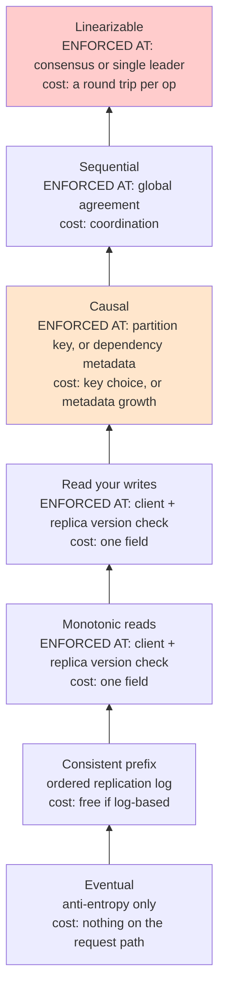
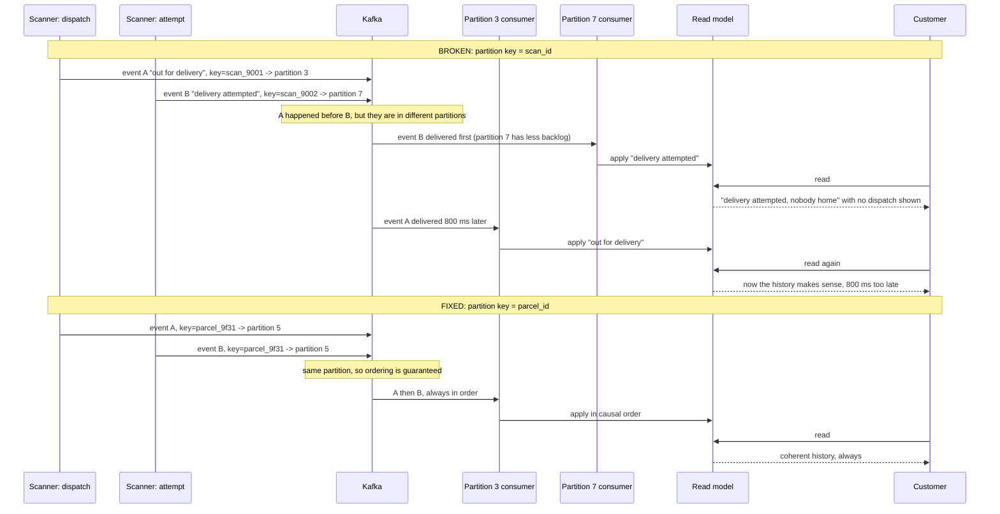

# Chapter 18: Eventual Consistency

## 18.1 Problem Statement

After Chapter 17, the team fixes their operations properly. Anti-entropy repair runs weekly on every node. Hint drops are alerted on. A convergence probe writes a known value and polls every replica, and it reports that 99.9 percent of writes are visible everywhere within 2.1 seconds, with a hard ceiling of 6 seconds.

By the definition in every textbook, the system is eventually consistent, provably, with a measured bound. The complaints continue and they are all different.

**A worker scans a parcel and their own scan is not there.** They refresh twice, it appears. Convergence took 1.4 seconds, well inside the bound. The system was working exactly as designed and the worker's experience was that it lost their data.

**A tracking page shows time going backwards.** Refresh: "out for delivery". Refresh again: "at sorting hub", which happened earlier. Refresh again: "out for delivery". Two replicas with different lag, and the load balancer alternating between them. Every value shown was correct at some point, and the sequence was nonsense.

**A customer sees "delivery attempted, nobody home" before "out for delivery".** This one is the interesting failure. The two scan events went into different Kafka partitions, because the partition key was the scan id rather than the parcel id, and Kafka only guarantees ordering within a partition. Both events arrived, both were correct, and the effect preceded its cause.

**A support agent sees a reply to a case note before the note itself,** for the same reason.

**And someone reads a comment thread containing a reply whose parent does not exist yet,** so the interface renders an orphan.

Then somebody notices something more fundamental during the review. The convergence probe reports the time for a specific written value to reach every replica. But the system takes 4,000 writes per second, continuously. **There is never a moment when all replicas agree about everything**, because new writes arrive faster than convergence completes. Eventual consistency promises that replicas converge if writes stop, and writes never stop.

Nothing here is a bug in the sense of code being wrong. Every one of these is the system correctly providing the guarantee it was asked for, and that guarantee being the wrong one. The problem is that "eventually consistent" was treated as a single setting when it is the weakest member of a family, and every complaint above is fixed by a different and specific member of that family, none of which costs anything like full coordination.

## 18.2 Why This Problem Exists

**Eventual consistency is a promise about a limit, not about anything users experience.** It says that in the absence of further writes, replicas converge. Live systems always have further writes, so the condition under which the guarantee applies never occurs. That does not make it useless, and it does mean it says nothing about what any particular reader sees at any particular moment, which is the only thing users actually care about.

**It is a liveness property with no safety component.** Liveness properties say something good eventually happens. Safety properties say something bad never happens. Eventual consistency is entirely the first kind, so on its own it forbids nothing: not stale reads, not reads going backwards, not effects before causes. Any behaviour is permitted as long as things settle down afterwards.

**The word implies a spectrum with two ends, and the middle is where the answers are.** People discuss eventual and strong consistency as opposites, which suggests you must pick one. Between them sits a family of models, each forbidding a specific anomaly at a specific and usually small cost, and almost every real user complaint maps to one of them.

**Ordering is a separate axis from freshness, and people conflate them.** A read can be perfectly fresh and still show you a reply before its parent, if the two writes were ordered independently. Section 18.1's third failure has nothing to do with staleness; it is a causality problem, and no amount of faster replication fixes it.

**And the guarantees are usually inherited rather than chosen.** A partition key picked for even distribution silently determines what can be ordered. A load balancer configured for round-robin silently determines whether reads can go backwards. Nobody decided either.

## 18.3 Real World Analogy

A group chat with six people, several on poor connections.

Alice tells a joke. Bob laughs. On your phone, Bob's "haha, brilliant" arrives before Alice's joke, so for eleven seconds you are watching someone laugh at nothing. Everyone eventually has every message, which is exactly the guarantee, and the experience is still broken because **the order was what made the messages meaningful.**

That is a causality violation, and everybody has experienced it, which is why this is the right analogy for the chapter.

Now notice the guarantees a well-built chat client provides, none of which is "everyone sees everything simultaneously".

**Your own messages appear to you immediately**, even before the server has confirmed them, usually greyed out until it does. Nobody would accept a chat app where you send a message and it vanishes for two seconds. That is read your writes, and it is provided locally, cheaply, for one participant.

**Messages never disappear once seen.** If you have seen a message, scrolling away and back does not un-show it. That is monotonic reads, and it is the property Section 18.1's tracking page violated.

**A reply is shown under its parent,** even if it arrived first, because the client knows which message it answers and waits or reorders. That is causal consistency, achieved by carrying a small piece of metadata rather than by coordinating.

**And what the chat does not provide is a global order.** If Alice and Carol both post at the same instant from different continents, different participants may see them in different orders, and nobody minds, because those two messages have no causal relationship to each other.

That last point is the whole insight. **You need ordering between things that are related, and you do not need it between things that are not.** Enforcing a global order on everything is expensive and buys almost nothing; enforcing order on causally connected events is cheap and buys everything users notice.

## 18.4 Simple Explanation

**Eventual consistency: if writes stop, all replicas will eventually converge to the same value.**

Read that carefully, because the precision matters:

| It promises | It does not promise |
|---|---|
| Convergence, given a quiet period | Anything about how long |
| That replicas agree in the limit | That any two reads are consistent with each other |
| A single final value per key | Any ordering between different keys |
| | That you can read your own writes |
| | That reads do not go backwards |
| | That effects follow causes |

So the useful framing is not "eventual versus strong". It is a ladder, where each rung forbids one more anomaly and costs a bit more:

```
eventual                    nothing forbidden except permanent divergence
   |
consistent prefix           you see a valid history, possibly old, never scrambled
   |
monotonic reads             time never goes backwards for you
   |
read your writes            you always see your own writes
   |
causal                      effects never precede their causes, for anyone
   |
sequential                  everyone sees the same order
   |
linearizable                that order matches real time (Chapter 19)
```

The practical claim of this chapter, and it holds up remarkably well in real systems:

> **Almost every user-visible consistency complaint is fixed somewhere in the middle of that ladder, at a fraction of the cost of the top.**

Section 18.1's five complaints need, in order: read your writes, monotonic reads, causal, causal, causal. Not one of them needs linearizability, and the total cost of providing all five is a version token in a response and a change to a partition key.

## 18.5 Technical Deep Dive

### 18.5.1 The replication anomaly catalogue

Chapter 16 catalogued what goes wrong between concurrent transactions. This is the equivalent for replicated reads, and the structure is deliberately parallel: you cannot choose a guarantee until you can name the thing you want forbidden.

**Stale read.** A read returns a value older than the most recent write.

```
Write v7 to replica A.
Read from replica B, which has v5.
Nothing is broken. This is the baseline behaviour of every replicated system.
```

**Read your writes violation.** A client cannot see its own write.

```
Client W: write v7  -> replica A, acknowledged
Client W: read      -> replica B, returns v5
The client's own action has apparently vanished. Section 18.1's first complaint.
```

**Monotonic reads violation.** A client sees time move backwards.

```
Client R: read -> replica A (lag 0.2s) -> "out for delivery"
Client R: read -> replica B (lag 4s)   -> "at sorting hub", which is earlier
Client R: read -> replica A            -> "out for delivery" again
Each value was correct at some moment. The sequence is incoherent.
```

**Causality violation.** An effect is visible before its cause.

```
Event 1: "out for delivery"          -> partition 3
Event 2: "delivery attempted"        -> partition 7   (caused by event 1)
Partition 7 is consumed faster.
A reader sees event 2 before event 1. Section 18.1's third complaint.
```

**Inconsistent prefix.** A reader sees a state that never existed, because updates were applied out of order.

```
Writes in order: A=1, B=2, C=3
A replica applies: A=1, C=3          (B not yet applied)
A reader sees a combination that no point in the history ever had.
```

**Concurrent write conflict.** Two writers update the same key with no ordering between them, and something must decide the outcome. Chapters 14 and 17 covered the resolution strategies; the point here is that eventual consistency does not tell you which write wins, only that everyone will eventually agree on whichever one does.

Two observations that organise the rest of the chapter. **The first three are about a single client's view**, which is why they are cheap to fix: you only have to track one client's position. **The fourth and fifth are about relationships between writes**, which is why they need metadata that travels with the data.

### 18.5.2 The hierarchy of models

The central table of the chapter. Each row forbids everything the rows above it forbid, plus one more thing.

| Model | Forbids | Mechanism | Typical cost |
|---|---|---|---|
| Eventual | Permanent divergence only | Anti-entropy (Chapter 17) | None on the request path |
| Consistent prefix | Seeing a scrambled history | Ordered replication log per partition | None, if replication is log-based |
| Monotonic reads | Going backwards, per client | Client tracks a version; replica must be at least that current | One field, occasional replica fallback |
| Monotonic writes | Your own writes applying out of order | Order writes per client or per key | Partition by client or key |
| Read your writes | Not seeing your own writes | Version token, or route to primary briefly | One field, small fallback rate |
| Writes follow reads | A write appearing before what it responded to | Carry the read version into the write | One field |
| **Causal** | Any effect appearing before its cause, for anyone | Dependency metadata: logical or vector clocks | Metadata per item, grows with participants |
| Sequential | Different clients seeing different orders | Global agreement on an order | Coordination |
| Linearizable | Any order inconsistent with real time | Consensus or a single leader (Chapter 19) | A round trip per operation |

Three facts worth extracting.

**The middle four are client-centric.** They are properties of one client's sequence of operations, so they can be provided without any agreement between replicas. That is why they are nearly free, and why they should be the default rather than an advanced technique.

**Causal is the boundary.** It is the strongest model that can be provided while remaining available to every client during a partition. Anything stronger requires coordination, which by Chapter 14's theorem means giving up availability when the network breaks. That is a proven result, not a rule of thumb, and it makes causal consistency the natural target for systems that must stay available.

**Sequential and linearizable both require agreement**, which is Chapter 19's subject and Chapter 15's latency bill.

### 18.5.3 Session guarantees, and how to implement them

The four client-centric guarantees were named in the early 1990s in work on the Bayou system, and they remain the highest-value tools in this chapter because they solve the complaints users actually raise.

| Guarantee | Plain statement |
|---|---|
| Read your writes | If I wrote it, I see it |
| Monotonic reads | If I saw it, I keep seeing it, and never something older |
| Monotonic writes | My writes apply in the order I made them |
| Writes follow reads | If I write in response to something I read, my write comes after it |

All four are implemented by the same primitive: **a version that the client carries.**

```java
// A write returns the version it produced. This one field enables everything below.
public record WriteAck(String id, long version) { }

@PostMapping("/scans")
public WriteAck record(@RequestBody ScanEvent e) {
    long v = primary.insertReturningVersion(e);
    return new WriteAck(e.id(), v);
}
```

```java
// The client keeps the highest version it has ever written or read,
// and sends it with every request. The server guarantees the replica
// serving the read is at least that current.
public List<ScanEvent> read(String parcelId, long minVersion) {
    Replica r = pool.pick();
    if (r.appliedVersion() < minVersion) {
        if (!r.awaitVersion(minVersion, Duration.ofMillis(150))) {
            r = primary;                       // rare fallback
        }
    }
    return r.query(parcelId);
}
```

That single mechanism provides:

- **Read your writes**, because the client's version includes its own writes.
- **Monotonic reads**, because the client's version includes the highest version it has read, so it can never be served something older.
- **Writes follow reads**, if the client sends its version along with its write and the write is ordered after it.

And the properties that make it preferable to the alternatives:

| Approach | Survives replica failure | Survives client moving region | Server-side state |
|---|---|---|---|
| Sticky routing to one replica | No | No | Session affinity |
| Route to primary for N seconds after a write | Yes | Only with a shared marker | A marker per writer |
| **Client-carried version** | **Yes** | **Yes** | **None** |

The client-carried version is the pattern to reach for. Chapter 15 introduced it for read-your-writes; the point here is that the same field, tracked as a maximum rather than only after writes, gives you three of the four guarantees at once.

### 18.5.4 Causal consistency

The two complaints that session guarantees do not fix are the ones involving relationships between different clients' writes: a reply before its message, a delivery attempt before a dispatch. These need causal consistency, which is worth understanding properly because it is the strongest thing available to an always-available system.

**Happens-before**, from Lamport's 1978 work, defines the only ordering that matters:

```
Event A happens-before event B if:
  1. They are in the same process and A came first, or
  2. A is a send and B is the matching receive, or
  3. Transitively: A happens-before C and C happens-before B.

If neither happens-before the other, they are CONCURRENT,
and any order is acceptable.
```

That last line is what makes causal consistency affordable. **Most pairs of writes in a real system are concurrent and unrelated**, and ordering them costs money for no benefit. Only the causally connected ones need to be ordered, and there are far fewer of them.

Three mechanisms, in increasing precision and cost:

**Partition by the causal unit.** The cheapest and most common answer, and the fix for Section 18.1's third complaint. Events that are causally related are placed in the same ordered stream.

```java
// BROKEN: ordering is per partition, and scan_id spreads related
// events across partitions, so a parcel's history arrives scrambled.
producer.send(new ProducerRecord<>("scans", event.scanId(), payload));

// CORRECT: every event for a parcel lands in one partition,
// so its history is delivered in order, for free.
producer.send(new ProducerRecord<>("scans", event.parcelId(), payload));
```

This is worth emphasising because it is a one line change that eliminates an entire class of user-visible anomaly. Kafka, and most log-based systems, guarantee ordering **within a partition and not across partitions**, so the partition key is a declaration of what you need ordered. Choosing it for even distribution alone is choosing to have no ordering guarantees at all.

**Logical clocks.** A counter per node, advanced on every event and on every message received, giving a total order consistent with causality.

**Vector clocks.** One counter per participant, which can distinguish "happened before" from "concurrent" precisely rather than merely ordering everything.

```
Replica A: [A:3, B:1]        Replica B: [A:2, B:4]

Neither dominates the other, so these versions are CONCURRENT.
A system using timestamps would silently pick one.
A system using vector clocks knows there is a genuine conflict
and can keep both as siblings for the application to merge.
```

The cost is honest and worth stating: **vector clock metadata grows with the number of participants**, and systems that keep concurrent versions as siblings can accumulate them faster than applications resolve them, which is a documented operational problem in Dynamo-style stores. Deployments have hit cases where a single key accumulates a large number of siblings, with metadata dwarfing the value. The mitigations are bounding the vector, resolving siblings promptly on read, and preferring data models where concurrent writes merge deterministically.

### 18.5.5 Bounded staleness and strong eventual consistency

Two refinements that make eventual consistency engineerable rather than merely hopeful.

**Bounded staleness** turns an unbounded promise into a measurable one:

```
"A read is never more than k versions behind, or t seconds behind."

k-bounded:  useful when versions matter more than time
t-bounded:  usually more meaningful to users and to SLIs

Implementation: replicas track their lag; a replica beyond the bound
refuses reads or is removed from rotation, so the bound is enforced
rather than merely reported.
```

That last sentence is the difference between a bound and a statistic. Chapter 17's convergence probe measures staleness; enforcing it means a replica that falls behind stops serving, which converts a monitoring number into a guarantee.

**Strong eventual consistency** is a stronger and very useful property: replicas that have received the same set of updates have identical state, **regardless of the order in which they received them**. No conflict resolution is required at all, because the merge function makes order irrelevant.

The requirement is that the merge operation be commutative, associative, and idempotent, which is precisely what conflict-free replicated data types provide.

```java
// A grow-only counter. Each node increments only its own slot,
// and merge takes the maximum per slot. Order of merges is irrelevant.
public record GCounter(Map<String, Long> counts) {
    GCounter increment(String nodeId) {
        var m = new HashMap<>(counts);
        m.merge(nodeId, 1L, Long::sum);
        return new GCounter(m);
    }
    GCounter merge(GCounter other) {
        var m = new HashMap<>(counts);
        other.counts().forEach((k, v) -> m.merge(k, v, Math::max));
        return new GCounter(m);            // commutative, associative, idempotent
    }
    long value() { return counts.values().stream().mapToLong(Long::longValue).sum(); }
}
```

Where these apply: counters, sets that only grow, sets with tombstones for removal, registers with a defined tie-break, ordered sequences for collaborative text. Where they do not: anything requiring a global invariant, such as "this counter must never exceed 100", because enforcing that requires knowing about writes you have not yet seen. Chapter 165's collaborative editing case study is built on these.

### 18.5.6 Choosing the guarantee

The practical procedure. Start from the complaint, not from the model.

| Symptom | Required guarantee | Mechanism | Cost |
|---|---|---|---|
| "My own change is not showing" | Read your writes | Client version token | One field |
| "It keeps flipping between two values" | Monotonic reads | Client tracks max version seen | One field |
| "I see the reply before the message" | Causal | Partition by conversation, or causal metadata | Partition key choice |
| "The status went backwards" | Monotonic reads | As above | One field |
| "The total does not match the parts" | Consistent prefix, or read from one snapshot | Log-ordered replication, snapshot reads | Usually free |
| "Two users got the last item" | Linearizable | Coordination (Chapter 19) | A round trip |
| "The count is slightly off" | Eventual, or a CRDT counter | Nothing, or a CRDT | None |
| "Data older than a minute is unacceptable" | Bounded staleness | Lag-enforcing read routing | Occasional fallback |

The discipline this enforces: **name the anomaly, then pick the weakest model that forbids it.** Reaching for linearizability because something is inconsistent is like reaching for a distributed lock because two threads touched the same variable. It works, and it is usually forty times more expensive than the specific mechanism the problem called for.

And a caution about the last row of Section 18.5.2: sequential and linearizable consistency both require coordination, so choosing them is choosing Chapter 14's partition trade and Chapter 15's latency bill. They are correct for a small number of operations and wrong as a default.

## 18.6 Architecture Diagram

The ladder, drawn with where each guarantee is enforced and what it costs, because the enforcement point is what determines the price.



And where the enforcement physically happens, which is the part that explains the cost difference:

```
 CLIENT SIDE (nearly free: one field in a request)
   +---------------------------------------------------+
   |  tracks max version seen or written                |
   |  sends it with every read                          |
   |  -> read your writes, monotonic reads,             |
   |     writes follow reads                            |
   +---------------------------------------------------+
                          |
 REPLICA SIDE (cheap: a comparison, rare fallback)
   +---------------------------------------------------+
   |  knows its own applied version                     |
   |  serves if current enough, else waits or defers    |
   |  refuses reads if beyond the staleness bound       |
   +---------------------------------------------------+
                          |
 DATA MODEL SIDE (free, decided at design time)
   +---------------------------------------------------+
   |  partition key groups causally related events      |
   |  append-only events instead of mutable rows        |
   |  CRDTs where merge can be made order-independent   |
   |  -> causal ordering, no conflicts                  |
   +---------------------------------------------------+
                          |
 COORDINATION (expensive: Chapter 15's latency bill)
   +---------------------------------------------------+
   |  leader or consensus, agreement before responding  |
   |  -> sequential, linearizable                       |
   +---------------------------------------------------+
```

The point of drawing it this way: **the three cheap layers solve almost everything users complain about, and none of them involves replicas talking to each other about individual operations.** The client carries a number, the replica compares it, and the data model decides what is ordered with what. Only the bottom layer costs round trips, and it should be reserved for the operations that genuinely allocate scarce things.

## 18.7 Request Flow

The causality violation from Section 18.1, traced properly, then fixed. This is the most instructive flow in the chapter because the fix is one line and the failure is invisible in code review.



Step by step, with what each step teaches:

1. **Two events with a genuine causal relationship** are produced by different devices. Nothing in either producer knows about the other.
2. **The partition key determines the ordering guarantee**, and it was chosen for distribution rather than for meaning. This is the entire bug.
3. **Ordering holds within a partition and not across partitions.** That is the documented contract of log-based systems, and it is frequently read as "ordered" without the qualifier.
4. **Consumers progress independently,** so relative delivery order across partitions depends on backlog, consumer speed, and rebalancing. It is effectively arbitrary.
5. **The read model applies the effect before the cause,** and it has no way to know it should wait, because it has no dependency information.
6. **The fix is to make the partition key the causal unit**, which for a parcel's history is the parcel. Now every event about one parcel is in one ordered stream and arrives in order, permanently, with no metadata and no coordination.
7. **Concurrent events about different parcels remain unordered,** which is correct and is what preserves the parallelism that made partitioning worthwhile.

The general principle worth extracting: **your partition key is a declaration of what you need ordered.** Choosing it purely for even distribution is choosing to give up ordering, and that choice is usually made without anybody noticing it was a choice. Where the causal unit is too large or too hot to be one partition, you fall back on dependency metadata, which costs more and is the reason vector clocks exist.

## 18.8 Internal Components

| Component | Role | Failure mode | Guard |
|---|---|---|---|
| Client version token | Enables the three session guarantees | Not returned by writes, so clients cannot request freshness | Return a version from every write, accept it on every read |
| Replica applied version | Lets a replica know if it can serve a request | Not exposed | Publish per-replica applied version and lag |
| Version wait with timeout | Serves locally when possible, defers when not | Unbounded wait on a stuck replica | Short timeout, then fall back to the primary |
| Partition key | Declares the causal unit | Chosen for distribution only, so nothing is ordered | Choose the causal unit; document why |
| Logical or vector clocks | Track happens-before precisely | Metadata growth, sibling accumulation | Bound the vector, resolve siblings on read |
| Sibling resolution | Merges concurrent versions | Deferred forever, so siblings accumulate | Resolve on read, alert on sibling count |
| CRDT merge | Removes conflicts entirely | Applied to data whose merge is not order-independent | Verify commutativity, associativity, idempotence |
| Staleness bound enforcement | Turns a statistic into a guarantee | Measured but not enforced | Remove over-lagged replicas from rotation |
| Read routing policy | Chooses a replica per declared freshness need | One policy for all reads | Route by the guarantee the operation requires |
| Staleness probe | Measures convergence and lag distribution | Absent, so bounds are unverified | Chapter 17's probe, per replica |
| Prefix-ordered replication | Prevents scrambled histories | Parallel apply without ordering | Apply per-partition in log order |

The row that pays back fastest is the first one. A version returned from writes and accepted on reads gives you read-your-writes, monotonic reads, and writes-follow-reads together, which is three of Section 18.1's five complaints for the price of one field.

## 18.9 Production Example

**The session guarantees were formalised for the Bayou system in 1994,** by Terry and colleagues, for mobile devices that were frequently disconnected and needed a coherent experience while syncing opportunistically. Their insight was that consistency should be defined from the client's point of view rather than the system's, because what a user notices is the coherence of their own sequence of operations, not whether replicas agree globally. Thirty years later that framing is still the most useful available, and the four guarantees they named are the ones that fix real complaints.

**Causal consistency being the strongest available under partition is a proven result**, not a heuristic. Work by Mahajan, Alvisi, and Dahlin, and related results, establishes that no consistency model stronger than causal can be provided by a system that remains always available and converges. That gives the ladder in Section 18.5.2 a hard boundary: causal is the ceiling for available systems, and everything above it is Chapter 14's trade in disguise.

The practical implication is that if you want availability during partitions, causal consistency is the target to design for rather than a compromise to settle for.

**Kafka's ordering guarantee is where most causality violations actually come from in practice.** It guarantees order within a partition and makes no promise across partitions, which is exactly what makes it fast and horizontally scalable. Teams routinely choose partition keys for even distribution, then observe events arriving out of order and treat it as a mystery or a bug. It is neither: it is the documented contract, and the partition key is the mechanism by which you declare what must stay ordered.

**And sibling accumulation is the honest cost of precise causality tracking.** Dynamo-style stores that use vector clocks and keep concurrent versions as siblings can accumulate them faster than applications resolve them, particularly when a client reads without writing back a resolved value, or when many clients write the same key concurrently. Riak's documentation and community reports describe cases of keys growing large numbers of siblings with metadata substantially exceeding the value itself. The mitigations are resolving siblings on every read, bounding vector clock size by pruning old entries, and preferring data models where concurrent updates merge deterministically, which is what CRDTs provide.

## 18.10 Advantages

- **The cheap guarantees fix the expensive complaints.** Three of Section 18.1's five problems are solved by one field in a response body.
- **Session guarantees need no coordination between replicas,** so they cost local latency and survive partitions.
- **Causal consistency is available under partition,** which makes it the strongest sensible target for systems that must stay up.
- **Partitioning by the causal unit gives ordering for free**, as a property of the data layout rather than as a runtime cost.
- **CRDTs remove conflicts entirely** for the data types they fit, so no resolution logic is needed and convergence is order-independent.
- **Bounded staleness makes the guarantee testable** and gives you an SLI to alert on.
- **Naming the anomaly prevents overcorrection**, which is what stops a monotonic reads complaint turning into a global quorum.

## 18.11 Limitations

- **Eventual consistency alone forbids nothing** about the interim, so it is not a design decision on its own.
- **Convergence never completes in a busy system,** because the condition it depends on, writes stopping, does not occur.
- **Causal consistency needs metadata,** which grows with participants and can accumulate faster than it is resolved.
- **Partitioning by the causal unit creates hotspots** when one unit is very active, which is Chapter 9's skew problem arriving from a different direction.
- **Session guarantees are per session.** They do nothing for what a second user sees, which is why the reply-before-message class of bug needs causal ordering.
- **CRDTs cannot enforce global invariants,** so anything with a limit or a scarce resource is outside their reach.
- **Concurrent writes still require a resolution decision,** and the model does not make it for you.
- **Every guarantee must be enforced to be real.** A staleness bound that is measured but not enforced is a statistic.

## 18.12 Trade-offs

| Dial | One way | The other way |
|---|---|---|
| Model strength | Stronger: fewer anomalies, more coordination or metadata | Weaker: cheaper and more available, more visible anomalies |
| Session guarantee mechanism | Client version token: robust, needs protocol support | Sticky routing: trivial, breaks on failover or client movement |
| Causality tracking | Partition by causal unit: free, risks hot partitions | Vector clocks: precise, metadata growth and sibling handling |
| Conflict handling | CRDTs: no conflicts, limited to expressible types | Siblings with domain merge: general, real work per type |
| Staleness bound | Tight: better experience, more fallbacks to the primary | Loose: fewer fallbacks, users notice |
| Enforcement point | Client side: cheap, requires client cooperation | Server side: works for all clients, needs session state |
| Read routing | By declared freshness: right cost per operation, more logic | One policy: simple, wrong for half the operations |

The removal test.

**Remove the version token and serve all reads from any replica.** You gain simplicity and marginally lower read latency. You lose read-your-writes and monotonic reads simultaneously, which produces both the "my scan vanished" and the "status went backwards" complaints. The cheapest item in the chapter and the one whose absence generates the most support tickets.

**Remove causal partitioning and key by a unique id for even distribution.** You gain perfectly balanced partitions and no hot spots. You lose all ordering between related events, so effects precede causes and read models apply updates in nonsensical sequences. Almost always the wrong trade, and it is usually made unknowingly.

**Remove vector clocks and use timestamps.** You gain small, fixed-size metadata and no siblings to resolve. You lose the ability to distinguish concurrent from ordered writes, so genuine conflicts are silently resolved by whichever clock was further ahead.

**Remove staleness enforcement and keep only measurement.** You gain the ability to serve reads from every replica at all times. You lose the guarantee, since a replica four minutes behind will happily answer, and your bounded staleness claim becomes a description of the typical case rather than a promise.

## 18.13 Common Mistakes

**Treating eventual consistency as a design decision.** It forbids nothing about the interim. The decision is which stronger guarantee you need on top.

**Assuming convergence means agreement.** In a system with continuous writes, there is never a moment when all replicas agree about everything, and that is normal.

**Jumping from eventual to linearizable** when the complaint needed monotonic reads.

**Choosing a partition key for distribution alone,** which silently discards every ordering guarantee.

**Reading "ordered" without the qualifier.** Log systems order within a partition, not across.

**Not returning a version from writes,** which makes every session guarantee expensive or impossible.

**Sticky routing as the session mechanism,** which breaks on failover, rebalance, and client movement.

**Resolving siblings lazily or never,** so concurrent versions accumulate until metadata dominates the payload.

**Using timestamps to detect concurrency,** which cannot distinguish concurrent from ordered and silently discards writes.

**Applying CRDTs to invariant-bearing data,** such as a counter with a maximum, which they cannot enforce.

**Measuring staleness without enforcing it,** which produces a bound that is not a bound.

**Fixing a consistency complaint without naming the anomaly,** which reliably produces the most expensive available solution.

## 18.14 Interview Questions

**Q: What does eventual consistency actually guarantee?**
That if writes stop, all replicas converge to the same value. It is a liveness property with no safety component, so it forbids nothing about the interim: not stale reads, not reads going backwards, not effects preceding causes. It also gives no time bound, and in a system with continuous writes the quiet condition it depends on never occurs.

**Q: Name the common replication anomalies.**
Stale reads, read-your-writes violations, monotonic read violations where a client sees time move backwards, causality violations where an effect is visible before its cause, inconsistent prefixes where a reader sees a state that never existed, and unresolved concurrent write conflicts.

**Q: A user says their own update is not showing. What is the cheapest fix?**
Read your writes, implemented with a version returned by the write and carried by the client on subsequent reads, so a replica serves only if it has applied at least that version and otherwise waits briefly or falls back to the primary. That is one field, and it does not require any coordination between replicas.

**Q: A tracking page alternates between two statuses on refresh. Which guarantee is missing?**
Monotonic reads. The client is being served by replicas with different lag. Have the client track the highest version it has seen and require any serving replica to be at least that current. The same version token that provides read-your-writes provides this.

**Q: Why do effects sometimes appear before causes in event-driven systems?**
Because ordering is typically guaranteed only within a partition, and causally related events were routed to different partitions, usually because the partition key was chosen for even distribution rather than for meaning. Consumers of different partitions progress independently, so relative order across them is arbitrary. Keying by the causal unit fixes it.

**Q: What is causal consistency, and why does it matter that it is the strongest available under partition?**
It guarantees that if one event happened before another, no observer sees them in the opposite order, while leaving concurrent events unordered. It matters because it has been proven that no stronger model can be provided by a system that stays available and converges, so it is the ceiling for always-available systems rather than a compromise.

**Q: Vector clocks versus timestamps?**
Timestamps impose a total order and cannot tell you whether two writes were concurrent or genuinely ordered, so conflicts get resolved silently and one write is discarded. Vector clocks track a counter per participant, so they can detect that neither version dominates and surface a real conflict for the application to merge. The cost is metadata that grows with participants and siblings that must be resolved.

**Q: What is strong eventual consistency?**
The property that replicas which have received the same set of updates have identical state regardless of the order in which they received them, so no conflict resolution is needed at all. It requires the merge operation to be commutative, associative, and idempotent, which is what CRDTs provide, and it does not extend to data with global invariants such as a maximum.

**Q: How do you make bounded staleness a guarantee rather than a statistic?**
Enforce it. Have replicas track their lag and refuse reads, or be removed from rotation, once they exceed the bound, so a read either satisfies the bound or is served elsewhere. Measurement alone tells you the typical case and permits a badly lagging replica to answer.

**Q: How would you approach a consistency complaint in general?**
Name the specific anomaly first, then choose the weakest model that forbids it, then pick the cheapest mechanism for that model. Most complaints are session-level and cost one field; some are causal and cost a partition key choice; very few need coordination, and reaching for linearizability without naming the anomaly reliably produces a solution that is far more expensive than the problem required.

## 18.15 Production Best Practices

1. **Never present eventual consistency as a decision.** Decide which stronger guarantee each operation needs.
2. **Return a version from every write and accept it on every read.** One field, three guarantees.
3. **Have clients track the maximum version seen or written,** not just the version they last wrote.
4. **Expose each replica's applied version and lag,** so read routing can make an informed choice.
5. **Choose partition keys as a declaration of what must stay ordered,** and document the reason next to the key.
6. **Use append-only events keyed by the causal unit** wherever possible, since ordering then costs nothing.
7. **Prefer CRDTs for counters and sets,** and verify the merge is commutative, associative, and idempotent.
8. **Use vector clocks rather than timestamps** where concurrency must be detected, and resolve siblings on every read.
9. **Alert on sibling counts and vector clock size,** since both grow silently.
10. **Enforce staleness bounds** by taking over-lagged replicas out of rotation, not merely by graphing them.
11. **Route reads by the guarantee the operation requires,** rather than applying one policy everywhere.
12. **Publish a staleness SLI per replica,** with a bound, backed by Chapter 17's probe.
13. **When investigating a complaint, name the anomaly before proposing a fix.**

## 18.16 Summary

Eventual consistency guarantees that replicas converge if writes stop. It is a liveness property with no safety component, which means it forbids nothing about what any reader sees at any moment, and in a busy system the quiet period it depends on never arrives. On its own it is not a design decision; it is the absence of one.

The useful structure is a ladder. Above bare eventual consistency sit consistent prefix, monotonic reads, read your writes, writes follow reads, and causal consistency, and above those sit sequential and linearizable, which need coordination. The practical finding, which holds up across real systems, is that nearly every user-visible complaint is fixed somewhere in the middle at a fraction of the cost of the top.

Three of those middle guarantees are client-centric, which is why they are so cheap: they are properties of one client's own sequence of operations, so they require no agreement between replicas at all. A version returned by writes and carried by the client provides read-your-writes, monotonic reads, and writes-follow-reads together. That single field solves the "my scan vanished" and "the status went backwards" complaints permanently, at local latency, and it survives replica failure and client movement in a way that sticky routing does not.

The complaints session guarantees do not fix are the ones involving relationships between different writers, and those need causal consistency, which is the strongest model available to a system that stays available during partitions. The cheapest implementation is not metadata at all: it is choosing the partition key to be the causal unit, so related events land in one ordered stream and arrive in order for free. Most causality violations in practice come from a partition key chosen for even distribution, which is a choice to have no ordering guarantee, usually made without anybody realising it was a choice.

So the discipline is short. Name the anomaly. Choose the weakest model that forbids it. Pick the cheapest mechanism for that model, and enforce it rather than merely measuring it. Reaching for coordination because something looked inconsistent is how a one field problem becomes a ninety millisecond one.

## 18.17 Quick Revision Notes

- Eventual consistency: replicas converge if writes stop. Liveness only, no safety, no time bound.
- In a system with continuous writes, full agreement never occurs. That is normal, not a fault.
- Replication anomalies: stale read, read-your-writes violation, monotonic read violation, causality violation, inconsistent prefix, concurrent conflict.
- Ladder, weakest to strongest: eventual, consistent prefix, monotonic reads, read your writes, writes follow reads, causal, sequential, linearizable.
- The middle guarantees are client-centric, so they need no replica agreement and cost one field.
- One version token, tracked as a maximum, gives read your writes plus monotonic reads plus writes follow reads.
- Client-carried versions beat sticky routing: they survive replica failure and client movement, and need no server-side session state.
- Causal consistency is the strongest model achievable while remaining always available. That is a proven result.
- Happens-before: same process and earlier, send before receive, or transitive. Otherwise concurrent, and any order is fine.
- Most write pairs are concurrent and need no ordering. Only causally related ones do.
- Cheapest causality mechanism: make the partition key the causal unit. Log systems order within a partition only.
- A partition key chosen purely for even distribution is a decision to have no ordering guarantee.
- Vector clocks distinguish concurrent from ordered; timestamps cannot and silently discard writes.
- Vector clock metadata and siblings grow. Resolve on read, bound the vector, alert on counts.
- Strong eventual consistency: same set of updates gives identical state regardless of order. Needs commutative, associative, idempotent merge, which is what CRDTs give.
- CRDTs cannot enforce global invariants such as a maximum.
- Bounded staleness must be enforced by removing lagging replicas from rotation, not just measured.
- Procedure: name the anomaly, choose the weakest model that forbids it, pick the cheapest mechanism.

## 18.18 Mini Quiz

1. State precisely what eventual consistency guarantees and three things it does not.
2. Identify the anomaly: a user refreshes twice and sees a newer status, then an older one, then the newer one again.
3. Identify the anomaly and the cheapest fix: a customer sees "delivery attempted" before "out for delivery".
4. What single mechanism provides read your writes, monotonic reads, and writes follow reads together?
5. Why is client-carried version preferable to sticky routing?
6. Why is causal consistency significant beyond being one rung on a ladder?
7. Two vector clocks are [A:3, B:1] and [A:2, B:4]. What is their relationship, and what should the system do?
8. What three algebraic properties must a merge function have for strong eventual consistency, and what does that buy you?
9. Your staleness bound is "never more than 10 seconds behind", and you have a dashboard showing p99 lag of 3 seconds. Do you have a bound?
10. A user complains about an inconsistency and a colleague proposes switching the store to linearizable reads. What do you say?

**Answers**

1. It guarantees that if writes stop, all replicas eventually converge to the same value. It does not guarantee any time bound on convergence, that a client can read its own writes, that successive reads by one client move forward in time rather than backwards, that causally related updates are seen in order, or that any two concurrent readers see consistent states. It is a liveness property, so it forbids nothing about the interim.
2. A monotonic reads violation. The client is being routed to replicas with different replication lag, so each individual value was correct at some point but the sequence moves backwards. Fix by having the client track the highest version it has seen and requiring the serving replica to be at least that current.
3. A causality violation. The cheapest fix is to change the partition key so that all events for a parcel go to the same partition, since log-based systems guarantee ordering within a partition and not across partitions. That gives causal ordering for the parcel's history at no runtime cost and with no metadata.
4. A version returned by every write and carried by the client on subsequent operations, with the client tracking the maximum version it has written or read and the replica serving only if it has applied at least that version. It gives read your writes because the client's own writes are included, monotonic reads because previously read versions are included, and writes follow reads if the version accompanies the write.
5. Because sticky routing binds a client to one replica, so it breaks when that replica fails, when the cluster rebalances, or when the client reconnects from a different region or through a different load balancer. A client-carried version works with any replica, requires no server-side session state, and degrades gracefully by waiting briefly or falling back to the primary.
6. Because it has been proven to be the strongest consistency model that a system can provide while remaining always available and converging. That makes it the ceiling for any design that must stay up during partitions, so it is a target to aim at rather than a compromise, and everything stronger implies accepting unavailability when the network breaks.
7. Neither dominates the other, since the first is ahead on A and the second is ahead on B, so the two versions are concurrent and represent a genuine conflict. The system should surface both as siblings for the application to merge with domain knowledge, or apply a deterministic merge if the data type supports one. What it should not do is pick one by timestamp, which silently discards a real write.
8. Commutative, associative, and idempotent. That makes the outcome independent of the order and multiplicity in which updates are merged, so replicas that have received the same set of updates hold identical state without any conflict resolution logic, and duplicate delivery is harmless.
9. No. You have a measurement. A bound is enforced: a replica that exceeds 10 seconds of lag must stop serving reads or be removed from rotation, so a read either satisfies the bound or is routed elsewhere. A p99 of 3 seconds is entirely consistent with a replica being four minutes behind and cheerfully answering queries.
10. Ask which anomaly they observed, since the answer determines the cost. If the user could not see their own write, or saw values move backwards, the fix is a version token and costs one field. If they saw an effect before its cause, the fix is usually a partition key change and costs nothing at runtime. Linearizable reads require coordination on every operation, which brings Chapter 15's latency and Chapter 14's partition trade, and is warranted only when the operation allocates something scarce or irreversible.

## 18.19 Hands-on Exercise

**Part 1: produce each anomaly deliberately.** Run a primary with two replicas at different artificial lag, say 200 milliseconds and 4 seconds, behind a round-robin router. Write a value, then read repeatedly. Record how often you fail to see your own write, and how often successive reads move backwards. You now have reproducible cases for the two most common complaints.

**Part 2: fix them with one field.** Implement the version token: writes return a version, the client stores the maximum it has seen or written, reads send it, and replicas either serve, wait briefly, or defer to the primary. Re-run Part 1's measurements. Record the residual fallback rate to the primary, which is the true cost of the guarantee.

**Part 3: break and repair causality.** Produce two causally related events to a topic keyed by a random unique id, with two partitions and consumers of deliberately different speed. Observe the effect arriving before the cause and count how often. Then change the key to the entity id and confirm the anomaly disappears entirely. Note that you changed no consumer logic.

**Part 4: measure concurrency properly.** Implement a version vector for a key and have two clients write concurrently. Confirm that your code can distinguish concurrent writes from sequential ones, then repeat with timestamps and confirm that it cannot, and that one write is silently lost. Then let siblings accumulate without resolving them, and watch the metadata grow relative to the value.

**Part 5: enforce a bound.** Add lag tracking to your replicas and a rule that a replica beyond 2 seconds of lag is removed from read rotation. Induce lag on one replica and confirm reads are routed away from it. Then compare the staleness distribution seen by clients before and after enforcement. The difference between measuring and enforcing is visible in the tail.

## 18.20 Further Reading

- *Session Guarantees for Weakly Consistent Replicated Data*, Terry et al., 1994. The original definitions of the four client-centric guarantees, still the clearest statement of why consistency should be defined from the client's viewpoint.
- *Time, Clocks, and the Ordering of Events in a Distributed System*, Leslie Lamport, 1978. Happens-before and logical clocks, and one of the most readable foundational papers in the field.
- *Consistency, Availability, and Convergence*, Mahajan, Alvisi and Dahlin, 2011. Establishes causal consistency as the strongest model achievable by an always-available, convergent system.
- *Designing Data-Intensive Applications*, Martin Kleppmann, chapters 5 and 9. Replication lag anomalies, the ordering guarantees, and the relationship between causality and consensus.
- *A Comprehensive Study of Convergent and Commutative Replicated Data Types*, Shapiro et al., 2011. The formal basis for CRDTs and the definition of strong eventual consistency.
- *Replicated Data Consistency Explained Through Baseball*, Doug Terry, 2011. Six consistency models explained through one worked example, and genuinely enjoyable.
- Kafka's documentation on ordering and partitioning. Short, and worth reading as a contract rather than as configuration advice.
- Riak's documentation on vector clocks and sibling resolution, for an honest account of what precise causality tracking costs to operate.

---

**Next chapter: Chapter 19, Strong Consistency.** The top of the ladder: what linearizability actually means, why it requires coordination and therefore costs a round trip, how consensus provides it, and how to get it for the small number of operations that genuinely need it without paying for it everywhere else.
