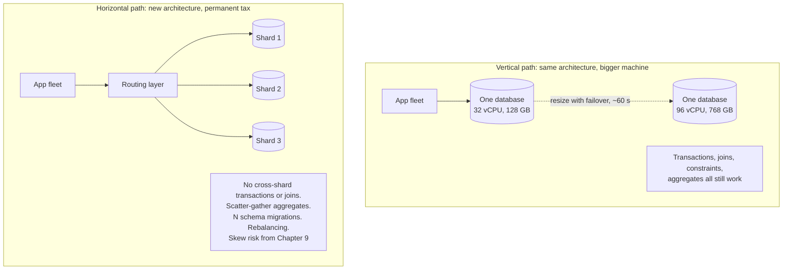
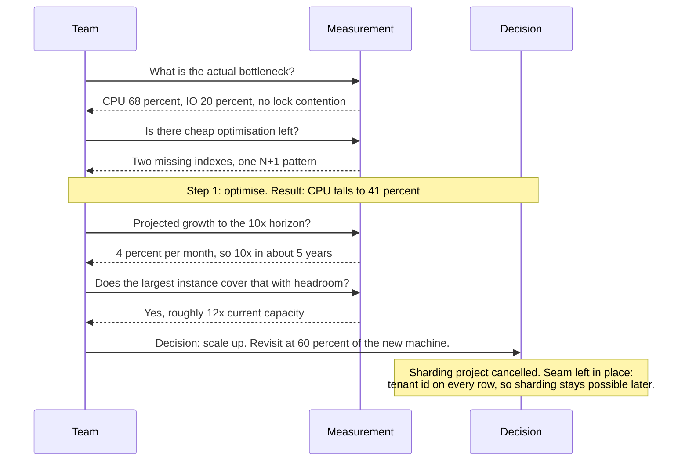

# Chapter 22: Vertical Scaling

## 22.1 Problem Statement

The tracking platform's main database is at 68 percent CPU at peak and growing about 4 percent a month. The team plans a sharding project: six months, two engineers, a new partition key, a dual-write migration, and application changes across nine services.

Halfway through the design review, someone asks what instance type it is running on. It is an 8 vCPU, 32 GB machine, chosen eighteen months earlier when the service had a twentieth of its current traffic and never revisited.

The largest instance available in the same family has 96 vCPU and 768 GB. Moving to a 32 vCPU machine costs about 900 dollars a month more, takes a maintenance window of roughly 90 seconds with a failover, and buys around four times the headroom, which at 4 percent monthly growth is three and a half years.

The sharding project is cancelled. It was real work solving a problem that did not exist yet.

Six months later the same team hits a genuine vertical ceiling somewhere else, and handles it badly in the opposite direction:

**They upgrade a JVM service to a 64 GB heap** to reduce garbage collection frequency. Frequency drops and pause duration rises, so p99 latency gets worse rather than better, which is Chapter 7's tail arithmetic.

**They move the same service onto a very large multi-socket machine** and per-request latency increases by 20 percent at low load, because memory access is no longer uniform and the runtime was not configured for it.

**And when that machine needs patching, the entire service is down**, because scaling up had quietly reduced the fleet to two instances, so losing one halved capacity.

Vertical scaling is the option teams dismiss too early and then apply carelessly when they do reach for it. Both errors are expensive, and the second is more surprising than the first.

## 22.2 Why This Problem Exists

**Distributed systems are more interesting to build than a bigger machine is to buy.** Sharding is an engineering project with a design document; resizing an instance is a ticket. The incentives inside an engineering team push toward the former even when the latter is correct.

**People remember old ceilings.** The intuition that a single machine tops out at modest capacity is a decade out of date. Machines with hundreds of cores and terabytes of memory are routinely available, and a single well-tuned relational database on modern hardware handles workloads that most teams assume require distribution.

**The cost curve is misread.** Large instances are more expensive per unit of capacity than small ones, which is true and usually irrelevant, because the comparison omits the engineering cost, the operational cost, and the permanent complexity tax of the distributed alternative.

**And vertical scaling has real failure modes that are not obvious.** Larger heaps mean longer pauses. Multi-socket machines have non-uniform memory access. Single-thread performance does not improve with core count, so a workload with a serial bottleneck gains nothing. Fewer, larger instances mean a bigger blast radius per failure. Section 22.1's second half is all four of those arriving at once.

## 22.3 Real World Analogy

A restaurant kitchen with one very good chef.

The instinct when demand grows is to open a second kitchen: another site, another lease, another manager, another supply chain. That is horizontal scaling and it is a serious undertaking.

The alternative is to give the existing kitchen a bigger stove, a second oven, more prep space, and a commis chef. Vastly cheaper, done in a weekend, and it will carry you for years. Most restaurants that fail while expanding fail because they opened the second site before exhausting the first kitchen.

The analogy also carries the limits honestly. **There is a maximum kitchen size** beyond which more equipment does not help, because the chef can only be in one place. **Doubling the oven does not halve the time a roast takes**, since some things are serial. **A bigger kitchen in one building is still one building**, so a fire closes the restaurant. And **a very large kitchen has coordination problems of its own**, with staff getting in each other's way, which is the physical version of contention.

The right answer for most restaurants is the same as for most systems: **grow the one kitchen until it genuinely cannot cope, then open the second site with the experience you gained.**

## 22.4 Simple Explanation

**Vertical scaling means making one machine bigger:** more cores, more memory, faster storage, more network bandwidth. Horizontal scaling means more machines.

The comparison, honestly:

| | Vertical | Horizontal |
|---|---|---|
| How | Bigger instance | More instances |
| Application changes | **None** | Statelessness, distribution, coordination |
| Ceiling | Hard, set by the largest available machine | Effectively none for stateless tiers |
| Failure impact | Larger, fewer units | Smaller, more units |
| Downtime to apply | Usually a restart or failover | None |
| Transactions and joins | **Preserved** | Lost across shards |
| Cost per unit of capacity | Higher at the top end | Lower |
| Operational complexity | **Much lower** | Higher, permanently |

The row that decides most real cases is the third from the bottom. **Vertical scaling preserves the ability to use transactions, joins, and constraints across all your data**, which is Chapter 16's entire toolkit. Sharding gives that up, and Chapter 9's removal test made the same point: running one large database is frequently the correct engineering decision and it is taken far too rarely.

The guidance in one sentence:

> **Scale vertically until you hit a genuine ceiling, because doing so costs a purchase order and doing the alternative costs a permanent increase in system complexity.**

## 22.5 Technical Deep Dive

### 22.5.1 The real ceilings

Six of them, and they arrive in a predictable order.

| Ceiling | Typical limit | Symptom |
|---|---|---|
| Largest available instance | Hundreds of cores, terabytes of memory | Nothing bigger to buy |
| **Single-thread performance** | Roughly flat for a decade | A serial bottleneck; more cores do nothing |
| Memory bandwidth and NUMA | Scales sublinearly with sockets | High CPU with poor instructions per cycle |
| Write throughput of one storage device | IOPS and bandwidth limits | IO wait, write latency rising |
| Garbage collection pause time | Grows with heap for most collectors | p99 dominated by pauses (Chapter 7) |
| **Cost curve** | Superlinear at the top end | The top instance costs disproportionately |

The second row is the one that surprises people. Single-core performance has improved slowly for years, so **a workload bounded by one thread does not benefit from a bigger machine at all.** A single-threaded event loop, a lock held across a hot path, a serial section in Chapter 8's Amdahl arithmetic: all of these cap you regardless of core count, and the fix is concurrency in the application rather than hardware.

The third is the one that catches people who buy the biggest available machine. Very large servers have multiple processor sockets, each with its own attached memory, and accessing another socket's memory is slower. A process that allocates on one socket and runs on another pays that penalty on every access. Section 22.1's 20 percent regression is exactly this, and the mitigations are pinning processes to a socket, sizing instances to fit within one NUMA node, or running several smaller processes rather than one large one.

The fifth deserves its own note for a Java audience. **A bigger heap is not automatically better.** Traditional collectors do work proportional to the live set, so a larger heap means less frequent but longer pauses, and for a request-serving service the tail latency usually matters more than the frequency. The options are a low-pause collector, which trades throughput for predictability, or, frequently better, several smaller instances with smaller heaps.

### 22.5.2 What a single machine can actually do

Worth being concrete, because most teams' estimates are far too low.

```
A modern 32 vCPU, 128 GB instance with fast local storage:

  Web or application tier
    8 ms CPU per request, 70 percent efficiency
    32 x 0.7 / 0.008  =  2,800 req/s from ONE instance

  Relational database
    tens of thousands of simple reads per second from cache
    thousands of write transactions per second with group commit
    working sets of tens of gigabytes held entirely in memory

  Cache or in-memory store
    hundreds of thousands of operations per second
    128 GB holds an enormous working set

For a very large fraction of business applications, this is
more capacity than the application will ever need.
```

The practical consequence is that the question "do we need to shard" is usually answered by measurement rather than by architecture. Chapter 9's growth-order audit gives the answer: if the projected data volume and write rate fit on one machine with headroom inside your 10x horizon, the answer is no.

### 22.5.3 What vertical scaling preserves

The strongest argument for it, and the one that is usually left out of the comparison.

| Capability | On one machine | Across shards |
|---|---|---|
| Multi-row transactions | Yes | Only within a shard, or 2PC (Chapter 52) |
| Joins across entities | Yes | Application-side, or denormalise |
| Foreign keys and constraints | Yes | Only within a shard |
| `COUNT`, `SUM`, aggregate queries | Yes | Scatter-gather across shards |
| Ad hoc queries for support and analysis | Yes | Awkward |
| Backup and restore as one unit | Yes | Coordinated across shards |
| Schema migrations | One operation | N operations, must be compatible mid-flight |
| Reasoning about correctness | Chapter 16's toolkit | Chapters 14 to 20's toolkit |

Every row in the right column is permanent work. Sharding is not a one-off project that finishes; it changes what every future feature costs. That ongoing tax is the real price, and it does not appear in the comparison when a team is deciding between a bigger instance and a sharding project.

### 22.5.4 Doing it well

**Right-size from measurement, not from a catalogue.** Determine the actual bottleneck first, because buying more cores when the constraint is IOPS or memory bandwidth changes nothing.

```
Diagnose before purchasing:
  CPU bound       -> more or faster cores
  Memory bound    -> more RAM, or reduce working set
  IO bound        -> faster storage, more IOPS, better indexes first
  Network bound   -> higher bandwidth instance class
  Lock bound      -> NOTHING helps. Fix the application
  Single-thread   -> NOTHING helps. Add concurrency in the application
```

The last two rows are the reason to diagnose rather than upgrade hopefully. A serial bottleneck is immune to hardware.

**Keep at least two of everything.** The trap in Section 22.1's third failure: scaling up quietly reduces instance count, and at two instances losing one halves capacity while at ten it costs a tenth. Scale up the instances and keep the count high enough that losing one is survivable, which is Chapter 10's static stability applied to instance sizing.

**Size within a NUMA node** where possible, or configure the runtime for the topology, so that memory locality is preserved.

**Match the heap to the pause target, not to the available memory.** A machine with 256 GB does not imply a 256 GB heap. For request-serving JVM services, several processes with modest heaps usually beat one process with a very large one, unless you are using a collector designed for large heaps and have measured the result.

**Plan the resize.** Most managed databases resize with a failover, which is seconds of unavailability, and it is the same operation as Chapter 10's failover drill. Doing it deliberately during a quiet period, having tested it, converts it from an event into a routine.

### 22.5.5 When to stop

The signals that you have genuinely reached the end of vertical scaling, as opposed to being impatient:

| Signal | Meaning |
|---|---|
| You are on the largest instance in the family, at high utilisation | Real ceiling |
| The cost of the next size is disproportionate to the capacity gained | Economic ceiling |
| Data volume exceeds what one machine can hold or back up in its window | Data ceiling (Chapter 9) |
| Write throughput exceeds one machine's storage bandwidth | Write ceiling |
| A single failure domain is unacceptable for availability | Availability ceiling (Chapter 10) |
| Regulatory requirements demand data in multiple regions | Compliance ceiling |

Note that only four of those six are about capacity. The availability ceiling in particular is a common and legitimate reason to go horizontal long before the capacity ceiling: a single machine is a single failure domain regardless of how large it is, and if the target is 99.99 percent, one machine cannot deliver it.

The order that usually works:

```
1. Optimise:      indexes, queries, caching, N+1 removal.
                  Frequently buys 10x for a week of work.
2. Scale up:      bigger instance. Buys 4x to 10x for a purchase order.
3. Scale out reads:  replicas. Buys read capacity, not write capacity.
4. Scale out writes: shard. A project, and a permanent complexity increase.
```

Teams routinely skip to step four. Steps one and two together often buy two orders of magnitude and cost a tiny fraction as much.

## 22.6 Architecture Diagram



```
 VERTICAL                                 HORIZONTAL
   app fleet                                app fleet
       |                                        |
   one database  --resize-->  bigger        routing layer
       |                                    /     |     \
  transactions, joins,                 shard1  shard2  shard3
  constraints, aggregates,
  one backup, one migration           no cross-shard transactions
                                      scatter-gather aggregates
  CEILING: largest instance,          N migrations, rebalancing,
  single failure domain               skew, permanent complexity
```

## 22.7 Request Flow

The decision procedure, which is the useful "flow" for this chapter.



1. **Diagnose the bottleneck before buying anything.** If it is lock contention or a single-threaded path, no instance size helps.
2. **Exhaust cheap optimisation first.** Indexes and query fixes routinely return more than a hardware upgrade and cost a week.
3. **Project growth to the 10x horizon** from Chapter 9, rather than to an imagined future.
4. **Check whether the vertical ceiling covers it with headroom,** including data volume and backup windows, not just CPU.
5. **Decide, and set a revisit trigger** at a defined utilisation of the new machine, so the decision is scheduled rather than forgotten.
6. **Leave the seam.** Keep a partition key on the data so that if the ceiling is reached, sharding is a project rather than an archaeology exercise. That is Chapter 5's deferred-but-expensive rule.

## 22.8 Internal Components

| Component | Vertical consideration | Failure mode | Guard |
|---|---|---|---|
| CPU cores | More parallel work | Serial bottleneck ignores them | Profile for lock contention and single-threaded paths first |
| Memory | Larger working set in cache | Heap growth increases pause time | Match heap to pause target, not to available RAM |
| NUMA topology | Multi-socket memory locality | Cross-socket access penalty | Fit within a node, pin, or run several processes |
| Storage IOPS and bandwidth | Write and read throughput | Provisioned throughput not increased with size | Check that storage scales with the instance |
| Network bandwidth | Often tied to instance class | Saturated NIC at moderate CPU | Check bytes and packets per second |
| Instance count | Blast radius and headroom | Scaling up reduces count to two | Keep enough instances that losing one is survivable |
| Resize procedure | Downtime and risk | Never rehearsed | Treat as a failover drill (Chapter 10) |
| Partition key on data | Preserves the option to shard later | Absent, so sharding becomes a migration archaeology project | Add it now even if unused |

## 22.9 Production Example

**Stack Overflow is the widely cited counterexample to reflexive distribution.** For many years it served a very large volume of traffic from a small number of physical servers, with a small SQL Server footprint, aggressive caching, and careful attention to query performance. The published architecture posts make the point directly: they scaled up and optimised rather than out, and retained the operational simplicity of a system whose entire data set fits comfortably on one machine. The lesson is not that everyone should copy it, but that the ceiling is much higher than most teams assume.

**Managed database services make vertical scaling a routine operation.** Resizing a managed instance is typically a modify request followed by a failover measured in tens of seconds, which is the same mechanism as a planned failover and can be rehearsed. That changes the calculus considerably compared with the era when scaling up meant procuring and migrating to physical hardware, and it is part of why the sharding threshold has moved upward.

**And low-pause garbage collectors exist because the heap ceiling was real.** The generation of collectors designed to keep pauses in the low milliseconds largely independently of heap size was built precisely so that vertical scaling of memory would not destroy tail latency. That is an explicit acknowledgement that bigger heaps used to mean worse latency, and it is why the choice of collector becomes an architectural decision once heaps grow past a few gigabytes, as Chapter 7 discussed.

## 22.10 Advantages

- **No application changes.** The single largest advantage, and the one that makes it cheap.
- **Transactions, joins, and constraints are preserved,** so Chapter 16's toolkit keeps working.
- **Operational simplicity persists:** one backup, one migration, one schema, one thing to reason about.
- **It is fast to apply**, typically a maintenance window rather than a project.
- **It is reversible.** Resizing down is as easy as resizing up, which is not true of sharding.
- **It frequently buys years**, particularly when combined with optimisation.
- **Latency can improve,** because in-process work replaces network hops.

## 22.11 Limitations

- **A hard ceiling exists**, set by the largest available machine.
- **Single failure domain.** One machine, however large, cannot deliver high availability alone.
- **Serial bottlenecks are immune.** More cores do nothing for a single-threaded path or a contended lock.
- **NUMA effects** can make very large machines slower per request without configuration.
- **Larger heaps mean longer pauses** with traditional collectors.
- **Cost is superlinear at the top end**, so the last doubling is disproportionately expensive.
- **Resizing usually requires a restart or failover,** so it is not zero-downtime without a replica.
- **It does not address data volume ceilings** such as backup windows and migration duration.

## 22.12 Trade-offs

| Dial | One way | The other way |
|---|---|---|
| Scale up or out | Up: no code changes, keeps transactions, hard ceiling | Out: no ceiling, permanent complexity tax |
| Instance size versus count | Larger and fewer: fewer connections, better cache locality | Smaller and more: smaller blast radius, shorter pauses |
| Heap size | Large: fewer collections | Small: shorter pauses, more instances |
| When to shard | Early: ready for growth, complexity paid now and possibly never needed | Late: simple for longer, a project under time pressure if growth surprises you |
| Optimisation versus hardware | Optimise: cheaper, permanent, takes engineering time | Upgrade: immediate, costs money, may mask a real problem |

**Remove the option of scaling up and shard immediately.** You gain a system with no ceiling and readiness for growth you may never see. You lose transactions and joins across your data, gain a rebalancing and skew problem, and pay a complexity tax on every future feature.

**Remove instances by consolidating onto fewer larger ones.** You gain fewer connections, better cache hit rates, and lower per-instance overhead. You lose blast radius protection, and at two instances a single failure halves your capacity.

**Remove the partition key from the data because you have decided not to shard.** You gain nothing measurable. You lose the cheap option to shard later, converting a future project into a migration over a very large table with no natural key.

## 22.13 Common Mistakes

**Sharding before exhausting a single machine,** which is the most expensive premature optimisation available in this field.

**Upgrading without diagnosing,** so more cores are bought for a lock contention problem.

**Assuming a bigger heap is better,** when longer pauses usually hurt more than reduced frequency helps.

**Buying the largest machine without considering NUMA,** and losing per-request performance.

**Letting instance count fall to two** while scaling up, so a single failure halves capacity.

**Forgetting that storage throughput may not scale with instance size,** so IOPS remains the bottleneck.

**Ignoring the availability ceiling,** since one machine cannot deliver four nines regardless of size.

**Never rehearsing the resize,** so the maintenance window becomes an incident.

**Failing to leave a partition key,** which makes the eventual shard a much larger project.

**Treating "we scaled up" as a permanent solution** with no revisit trigger.

## 22.14 Interview Questions

**Q: When would you choose vertical over horizontal scaling?** When the workload fits on one machine with headroom across the planned horizon, when transactions and joins across the data are valuable, and when operational simplicity matters. It requires no application changes, is fast and reversible, and preserves Chapter 16's toolkit, so it should generally be exhausted before sharding.

**Q: What are the ceilings?** The largest available instance, single-thread performance for serial workloads, memory bandwidth and NUMA effects on multi-socket machines, single-device storage throughput, garbage collection pause time growing with heap, superlinear cost at the top end, and the fact that one machine is a single failure domain.

**Q: Your database is at 70 percent CPU and growing 4 percent monthly. Shard or scale up?** Diagnose the bottleneck first, then look for cheap optimisation such as missing indexes and N+1 queries, which frequently returns more than a hardware upgrade. Project growth to the 10x horizon and check whether the largest instance covers it with headroom, including data volume and backup windows. If it does, scale up, set a revisit trigger, and keep a partition key on the data so sharding stays cheap later.

**Q: Why might a bigger machine make latency worse?** A larger heap increases pause duration with most collectors, so tail latency degrades even as collection frequency falls. On multi-socket machines, memory access across sockets is slower, so a process not aligned to the topology pays a penalty on every access. Neither is visible in a capacity calculation.

**Q: What does vertical scaling not fix?** Anything bounded by a serial section, since single-thread performance is roughly flat; availability, since one machine is one failure domain; and data volume ceilings such as backup and migration windows, which grow with total data regardless of machine size.

**Q: Why is sharding described as a permanent tax rather than a project?** Because it changes the cost of everything afterwards: no cross-shard transactions or joins, scatter-gather aggregates, N schema migrations that must be compatible mid-flight, rebalancing operations, and exposure to key skew. Those costs are paid by every future feature, not once at migration time.

## 22.15 Production Best Practices

1. **Diagnose the bottleneck before buying capacity,** since serial and lock-bound workloads are immune to bigger machines.
2. **Exhaust optimisation first:** indexes, query plans, N+1 removal, caching.
3. **Project growth to the 10x horizon** and check whether the vertical ceiling covers it.
4. **Include data volume, backup duration, and migration time** in the ceiling calculation, not just CPU.
5. **Match heap size to your pause target,** and prefer several modest instances over one very large heap for request-serving services.
6. **Fit within a NUMA node** or configure the runtime for the topology.
7. **Verify that storage throughput scales with the instance class.**
8. **Keep enough instances that losing one is survivable,** and never let the count fall to two for a critical tier.
9. **Rehearse the resize** as a planned failover during a quiet period.
10. **Set an explicit revisit trigger** at a defined utilisation of the new machine.
11. **Keep a partition key on the data** even while running unsharded, so the option stays cheap.
12. **Go horizontal for availability reasons deliberately,** rather than treating it as only a capacity decision.

## 22.16 Summary

Vertical scaling means buying a bigger machine, and it is the option teams dismiss too early. Its decisive advantage is that it requires no application changes and preserves transactions, joins, constraints, and aggregate queries across the whole data set. Sharding gives all of that up, and it does so permanently: every future feature is more expensive, every migration is N migrations, every aggregate is a scatter-gather, and Chapter 9's skew problem becomes a live risk.

The ceilings are real and worth knowing precisely. The largest available machine is one, and it is much higher than most teams assume. Single-thread performance is another, and it is immune to bigger hardware, which is why a lock-bound or single-threaded workload gains nothing from an upgrade. Memory bandwidth and non-uniform memory access on multi-socket machines can make a very large server slower per request than a smaller one. Garbage collection pauses grow with heap size for most collectors, so more memory can worsen tail latency. Cost rises superlinearly at the top end. And one machine, however large, is one failure domain, which is a legitimate reason to distribute long before any capacity limit is reached.

The sequence that works is optimise, scale up, scale reads out with replicas, and only then shard. The first two steps together frequently buy two orders of magnitude for a week of work and a purchase order, and teams routinely skip both to start a six month project. Section 22.1's cancelled sharding effort is the common case rather than an unusual one.

And when you do scale up, do it carefully: diagnose the actual bottleneck first, keep enough instances that losing one is survivable, match heap size to your pause target rather than to available memory, respect the machine's memory topology, rehearse the resize, and leave a partition key on the data so the horizontal option remains cheap when you eventually need it.

## 22.17 Quick Revision Notes

- Vertical scaling: bigger machine. Horizontal: more machines. Vertical needs no application changes.
- Vertical preserves transactions, joins, constraints, aggregates, one backup, one migration.
- Sharding is a permanent tax on every future feature, not a one-off project.
- Ceilings: largest instance, single-thread performance, memory bandwidth and NUMA, storage throughput, GC pause growth, superlinear cost, single failure domain.
- Serial or lock-bound workloads gain nothing from more cores. Diagnose first.
- A bigger heap means longer pauses with most collectors. Match heap to the pause target.
- Very large multi-socket machines have non-uniform memory access. Fit within a node or configure for it.
- Storage IOPS may not scale with instance size. Check separately.
- Scaling up can reduce instance count to two, which halves capacity on a single failure.
- One machine cannot deliver high availability, regardless of size. That is a separate reason to go horizontal.
- Order: optimise, scale up, add read replicas, then shard.
- Steps one and two frequently buy two orders of magnitude.
- Project growth to the 10x horizon, including data volume and backup windows.
- Set a revisit trigger at a defined utilisation of the new machine.
- Keep a partition key on the data even when unsharded, so sharding stays cheap.

## 22.18 Mini Quiz

1. Give three things vertical scaling preserves that sharding gives up.
2. Your service is at 90 percent CPU on 4 cores. You move to 32 cores and throughput does not improve. Name two possible causes.
3. Why might moving to a much larger machine increase per-request latency?
4. What ceiling does vertical scaling never address, however large the machine?
5. You are at 68 percent CPU growing 4 percent monthly and the largest instance is 12 times your current one. Do you shard?
6. Why is it dangerous for scaling up to reduce your fleet to two instances?
7. What should you keep in the schema even if you have decided not to shard, and why?

**Answers**

1. Multi-row transactions across all data, joins across entities, and enforced foreign keys and constraints. Also acceptable: aggregate queries such as counts and sums without scatter-gather, ad hoc queries for support and analysis, backup and restore as a single coordinated unit, and schema migrations as one operation rather than N operations that must remain compatible while partially applied.
2. A serial bottleneck: the workload is bounded by a single thread or by a lock held across the hot path, so additional cores are idle and single-thread performance has barely improved. Or the real constraint was never CPU: storage IOPS, network bandwidth, memory bandwidth, or a downstream dependency was saturated, and the CPU figure was measuring time spent waiting rather than working.
3. Non-uniform memory access on multi-socket machines, where memory attached to another socket is slower to reach, so a process not aligned to the topology pays a penalty on every access. Also longer garbage collection pauses if the extra memory was used to enlarge the heap, since most collectors do work proportional to the live set, so p99 worsens even though collections are less frequent.
4. Availability. One machine is a single failure domain regardless of its size, so it cannot deliver high availability on its own, and any target requiring survival of a machine or zone failure needs more than one instance. Data volume ceilings such as backup and migration windows are a second answer, since they grow with total data rather than with machine capacity.
5. No, or at least not yet. At 4 percent monthly growth, 10x takes roughly five years, and the largest instance covers 12 times current capacity, so the vertical ceiling comfortably exceeds the planning horizon. The correct actions are to look for cheap optimisation first, scale up when needed, set a revisit trigger at a defined utilisation, verify that data volume and backup windows also fit, and keep a partition key on the data so the option remains cheap.
6. Because losing one instance removes half the capacity, so a routine failure, patch, or deploy becomes a capacity incident rather than a minor event. Chapter 10's static stability principle applies: provision so that the remaining instances can carry full load without any action being required. Two instances only works if each is provisioned to carry the entire load alone.
7. A partition key, typically a tenant or entity identifier present on every row. It costs nothing while unsharded and preserves the option to shard cheaply later. Without it, a future sharding project begins with determining how to partition data that has no natural key, backfilling that key across very large tables, and reconciling entities that were never associated with one, which converts a hard project into a much harder one.

## 22.19 Hands-on Exercise

**Part 1: find your real ceiling.** Benchmark your service or database on progressively larger instances: 2, 4, 8, and 16 cores. Plot throughput against core count. Find where the line bends and identify what bent it, using Chapter 8's saturation checks.

**Part 2: test the heap assumption.** Run the same JVM service with 4 GB, 16 GB, and 48 GB heaps under identical load. Record throughput, garbage collection pause count, pause duration, and p99 latency for each. Note which metric improves and which gets worse.

**Part 3: measure the topology effect.** On a multi-socket machine, run the service pinned to a single socket and then unpinned across both. Compare per-request latency at low load, where queueing is not a factor.

**Part 4: rehearse the resize.** In a non-production environment, resize a managed database while a load test runs. Time the unavailability, record what the application does during it, and confirm that retries and connection pools recover cleanly.

**Part 5: run the decision.** For your own system, produce the analysis in Section 22.7: current bottleneck, optimisation available, growth rate, 10x horizon, vertical ceiling including data volume and backup window, decision, and revisit trigger. Most teams find the horizon is longer than they assumed.

## 22.20 Further Reading

- Stack Overflow's published architecture posts, for a well-documented example of a very large workload served from a small number of machines.
- *Systems Performance*, Brendan Gregg, on identifying which resource is actually saturated, and on NUMA effects.
- Your cloud provider's instance type documentation, specifically the relationship between instance size, network bandwidth, and storage throughput, which are frequently coupled and frequently assumed to scale together when they do not.
- JVM garbage collector documentation for the collector you use, particularly the relationship between heap size and pause time.
- *Designing Data-Intensive Applications*, chapter 6, on when partitioning becomes necessary and what it costs.
- *The Art of Scalability*, Abbott and Fisher, on the X and Z axes and the order in which to apply them.

---

**Next chapter: Chapter 23, Stateless Services.** The property that makes horizontal scaling possible at all: what state actually is, the specific places it hides in a service that everyone believes is stateless, and where to put it instead.
